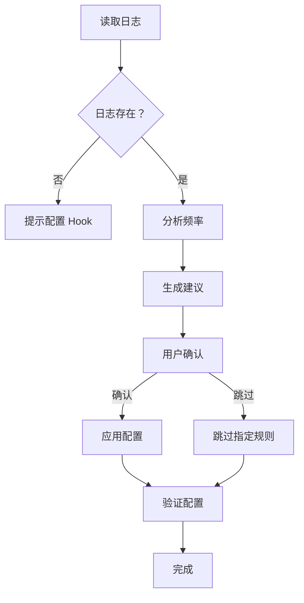

# Permission Analyzer 详细工作流程

> 6 阶段完整工作流程详解

---

## 阶段 1：读取日志

### 1.1 检查日志文件

```bash
ls -la .claude/logs/permission-requests.log
```

### 1.2 不存在时的处理

如日志文件不存在，输出提示并引导用户配置 PermissionRequest Hook：

```markdown
## 日志文件不存在

尚未记录任何权限请求。

**解决方案：**

1. 运行 `/permission-setup` 配置 PermissionRequest Hook
2. 或手动添加以下配置到 `.claude/settings.local.json`：

```json
{
  "hooks": {
    "PermissionRequest": [{
      "matcher": ".*",
      "hooks": [{
        "type": "command",
        "command": "echo \"$(date '+%Y-%m-%d %H:%M:%S') | $PERMISSION_REQUEST | $USER_PROMPT\" >> .claude/logs/permission-requests.log",
        "timeout": 5
      }]
    }]
  }
}
```
```

---

## 阶段 2：分析频率

### 2.1 执行分析脚本

```bash
node .claude/scripts/analyze-permissions.js [days]
```

### 2.2 输出格式

```markdown
### 权限请求分析（最近 7 天）

| 命令模式 | 请求次数 | 建议规则 | 示例场景 |
|----------|----------|----------|----------|
| pnpm test | 15 | Bash(pnpm test:*) | 运行 E2E 测试 |
| npx playwright | 8 | Bash(npx:*) | Playwright 测试 |
```

---

## 阶段 3：生成建议

### 3.1 去重处理

- 相同基础命令（如 `pnpm test` 和 `pnpm test:e2e`）合并为 `Bash(pnpm test:*)`
- 最多显示 10 条建议

### 3.2 过滤已有规则

- 比对当前 `settings.local.json` 的 permissions.allow
- 只显示新增规则

### 3.3 安全检查

- 过滤危险命令（rm -rf, sudo, curl|bash 等）
- 不过滤但标注高风险命令

---

## 阶段 4：用户确认

### 4.1 输出建议配置

```markdown
## 建议添加的配置

将以下 3 条规则添加到 `.claude/settings.local.json`：

```json
[
  "Bash(pnpm test:*)",
  "Bash(npx:*)",
  "Bash(playwright:*)"
]
```

请确认：
- [ ] 以上规则均为需要频繁使用的命令
- [ ] 理解通配符 `:*` 会匹配所有参数变体
- [ ] 知晓这些规则会立即生效（无需重启）

回复「是」应用配置，或指定要跳过的规则。
```

### 4.2 用户可选择

- 「是」- 应用所有建议
- 「跳过 npx」- 跳过特定规则
- 「否」- 取消本次操作

---

## 阶段 5：应用配置

### 5.1 读取当前配置

```json
{
  "permissions": {
    "allow": ["Read", "Edit", ...]
  }
}
```

### 5.2 合并新规则

```json
{
  "permissions": {
    "allow": ["Read", "Edit", ..., "Bash(pnpm test:*)", ...]
  }
}
```

### 5.3 写入配置

- 使用 Write 工具写入
- 保持 JSON 格式正确（2 空格缩进）
- 保留注释（如有）

---

## 阶段 6：验证

### 6.1 验证命令

```bash
node -e "JSON.parse(require('fs').readFileSync('.claude/settings.local.json'))"
```

### 6.2 输出结果

```markdown
## ✅ 配置已更新

新增规则：
- Bash(pnpm test:*)
- Bash(npx:*)
- Bash(playwright:*)

**测试建议：**
1. 运行 `pnpm test` 验证是否无需确认
2. 输入 `/permissions` 查看完整规则列表
```

---

## 流程图



---

*参考文档 | 最后更新：2026-03-31*
