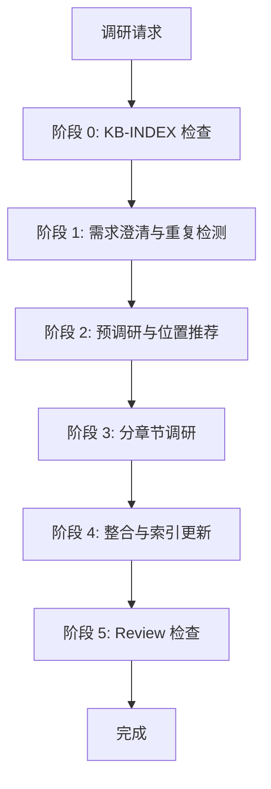

# 文档调研与整理 Skill

## 用途

当用户需要深入了解某个新技术、新框架或陌生领域时，自动使用此 Skill。

**核心原则：**
1. 质量优先：来源优先级为官方文档 > 技术博客 > 源码 > 视频
2. 透明可追溯：所有信息标注来源
3. 持续可更新：检测已有文档并更新
4. 索引优先：基于 KB-INDEX 快速推荐存储位置
5. 图表美观：默认使用 Mermaid，禁止 ASCII 字符画图
6. 效率优化：大型主题推荐 SubAgent 并行模式

**搜索规则：** 必须使用 `mcp__WebSearch__bailian_web_search`，禁止原生 WebSearch

---

## 工作流程概览



**详细流程请参考：** `references/decision-flow.md`

---

## 阶段 0：知识库索引检查与创建

**目标：** 确保 KB-INDEX.md 存在，用于快速推荐文档位置

```
检查 KB-INDEX.md → 不存在则扫描创建 → 提取目录与已有文档
```

**索引文件结构：**
- 目录结构树
- 主题分类映射表（主题/技术 → 推荐目录 → 现有文档）

**详见：** `references/kb-index-template.md`

---

## 阶段 1：需求澄清与重复检测

**1.1 确认调研主题** — 名称、特定关注点、时间敏感性

**1.2 知识库重复检测** — 扫描 Knowledge Base 检测相似文档

**检测报告输出：**
| 文件路径 | 相似度 | 主题匹配度 | 说明 |
|----------|--------|------------|------|

**用户决策：** 合并到已有文档 / 单独创建 / 取消

---

## 阶段 2：预调研与位置推荐

**2.1 基础网络搜索** — 使用 MCP WebSearch 执行 2-3 组搜索：
- 官方文档、核心概念、最新版本

**2.2 智能位置推荐** — 优先查询 KB-INDEX，无则分析主题属性

**推荐位置格式：**
| 推荐 | 路径 | 理由 |
|------|------|------|
| ⭐ 首选 | Knowledge Base/[Category]/[主题]/ | 理由说明 |

**2.3 生成调研大纲** — 输出 8 章结构供用户确认

---

## 阶段 3：分章节调研

**3.1 初始化进度追踪** — 创建/更新 `progress.txt`

**3.2 SubAgent 模式询问（新增）**

根据章节数量推荐模式：
- **≥6 章** → 推荐 SubAgent 并行（预计 15-25 分钟）
- **<6 章** → 推荐标准顺序（预计 30-45 分钟）

**SubAgent 分组策略：**
- 组 A：基础章（1-3 章）
- 组 B：核心章（4-6 章）
- 组 C：收尾章（7-8 章）

**详见：** `references/subagent-mode.md`

**3.3 执行调研** — WebSearch → WebFetch → 交叉验证 → 撰写 → 保存

**进度同步：** 每章完成输出进度更新

---

## 阶段 4：整合输出与索引更新

**4.1 检测已有文档** — 存在则识别需更新章节

**4.2 生成文档结构** — 按 8 章节结构输出

**4.3 更新 KB-INDEX** — 如主题首次收录，添加到索引

**4.4 写入最终文档** — 保存主文档与进度追踪

---

## 阶段 5：Review 检查

执行检查清单（详见 `checklists/review-checklist.md`）：

| 检查类型 | 检查项 |
|----------|--------|
| 结构检查 | 章节编号连续、目录对应 |
| 内容深度 | 定义 + 原理 + 示例 + 误区 |
| 格式检查 | Markdown 正确、代码块标注语言 |
| 引用检查 | 列表完整、来源标注 |

---

## 输出规范

### 生成文件

| 文件 | 路径 | 说明 |
|------|------|------|
| 主文档 | `[存储位置]/[主题名] 核心知识体系.md` | 调研主文档 |
| 大纲 | `[存储位置]/outline.md` | 调研大纲（可选） |
| 进度 | `[存储位置]/progress.txt` | 进度追踪 |
| KB-INDEX | `Knowledge Base/KB-INDEX.md` | 索引更新（如新收录） |

### 存储路径规则

```
Knowledge Base/
├── Career/
├── Guide/
├── Tech/
│   ├── AI/
│   ├── BuildTools/
│   ├── Business/
│   ├── Frameworks/
│   └── Fundamentals/
└── docs/
```

---

## 踩坑清单

| 陷阱 | 错误做法 | 正确做法 |
|------|----------|----------|
| 来源单一 | 只看官方文档 | 至少 3-5 个来源交叉验证 |
| 缺少引用 | 直接复制 | 统一引用格式标注 |
| 内容过浅 | 只列 API | 定义 + 原理 + 示例 + 误区 |
| 忽视冲突 | 随意选择 | 标注冲突 + 分析原因 |
| 不更新 | 直接覆盖 | 检测已有 + 添加更新记录 |
| 重复调研 | 不扫描直接开始 | 先扫描知识库检测重复 |
| 位置混乱 | 随意存放 | 先查 KB-INDEX，无则创建 |
| 使用原生 WebSearch | 直接调用 WebSearch | 必须使用 `mcp__WebSearch__bailian_web_search` |
| SubAgent 滥用 | 小主题也并行 | 按章节数量推荐模式 |

详见：`references/gotchas.md`

---

## 资源索引

| 资源 | 文件 | 用途 |
|------|------|------|
| 文档结构模板 | `references/doc-structure.md` | 完整文档结构 |
| 引用格式规范 | `references/citation-guide.md` | 引用标注规则 |
| Mermaid 图表规范 | `references/mermaid-guide.md` | 图表绘制指南 |
| **SubAgent 模式** | `references/subagent-mode.md` | **并行调研详解** |
| **决策流程** | `references/decision-flow.md` | **完整流程图** |
| KB-INDEX 模板 | `references/kb-index-template.md` | 索引文件模板 |
| 检查清单 | `checklists/review-checklist.md` | Review 检查 |
| 踩坑清单 | `references/gotchas.md` | 常见错误 |
| 示例 | `examples/` | 使用示例 |

---

*Skill 版本：7.0.0 | 作者：Kei | 更新：2026-03-30*
*更新说明：新增 SubAgent 并行调研模式（阶段 3），优化主文档结构精简约 40%，详细流程移至 references/*
