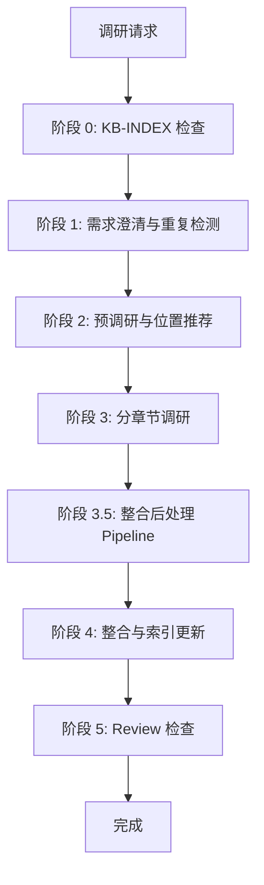

# 文档调研与整理 Skill

## 用途

当用户需要深入了解某个新技术、新框架或陌生领域时，自动使用此 Skill。

**核心原则：**
1. 质量优先：来源优先级为官方文档 > 技术博客 > 源码 > 视频
2. 透明可追溯：所有信息标注来源
3. 持续可更新：检测已有文档并更新
4. 索引优先：基于 KB-INDEX 快速推荐存储位置
5. 图表美观：默认使用 Mermaid，禁止 ASCII 字符画图
6. 效率优化：大型主题推荐 SubAgent 分阶段并行模式
7. **web-access 集成：调研任务托管给 web-access，由其自主决策使用 CDP/WebSearch/WebFetch（首推 CDP）**
8. **Fetch 免询问：`skipWebFetchPreflight: true` 已配置，WebFetch 无需确认**
9. **CDP 统一管理：主 Agent 启动一次 Proxy，SubAgent 共享使用，禁止各自启动**
10. **批次化调度：每批最多 2 个 SubAgent 并发，批次间等待 30s，应对 API 限流**

**搜索规则：** 必须使用 `mcp__WebSearch__bailian_web_search` 或 `web-access` Skill

**web-access 集成说明：**
- 预调研（阶段 2）和分章节调研（阶段 3）均托管给 `web-access` Skill
- `web-access` 根据目标类型自主决策：CDP（首选，官方文档/动态页面）、WebSearch（发现来源）、WebFetch（已知 URL 提取正文）
- **工具链优先级：CDP > WebSearch > WebFetch**
- 特殊站点（小红书、微信公众号、微博等）自动使用 CDP 模式
- 详见 `references/web-access-integration.md`

---

## 设计模式与硬性门控

**本 Skill 使用 Pipeline + Inversion 组合设计模式**

### 执行模式：STRICT（不可降级）

**`execution_mode: strict` 意味着：**
- 所有 `gates` 数组中定义的门控必须按序通过，禁止跳过或并行
- 每个阶段结束时必须执行对应的 `STAGE_GATE` 标记
- 用户确认门控在收到用户明确回复前，不得继续任何后续阶段

### 硬性门控指令（必须遵守）

**STAGE_GATE 2 → 3（用户确认，不可跳过）：**
```
HALT. 停止所有后续阶段执行。
输出位置推荐 + 调研大纲。
明确询问用户是否继续。
等待用户回复。
未收到用户回复前，不得执行阶段 3、3.5、4、5 的任何内容。
即使用户输入看似与调研相关但并非确认，也不得继续。
```

**STAGE_GATE 3 → 3.5（自动，不可跳过）：**
```
检查所有章节草稿是否已写入临时工作目录。
如有缺失，报告并暂停。
全部完成后，自动进入阶段 3.5。
```

**STAGE_GATE 3.5 → 4（阈值门控，不可跳过）：**
```
读取质量评分。
评分 >= 80：进入阶段 4。
评分 70-79：触发自动修复循环（最多 3 轮）。
评分 < 70：生成问题报告，HALT 并询问用户。
```

**DON'T:**
- 不要在阶段 2 输出后直接进入阶段 3（必须 HALT 等待用户）
- 不要假设用户已同意推荐方案（必须等待明确回复）
- 不要在等待用户确认时自动继续执行
- 不要跳过阶段 3.5 直接进入阶段 4
- 不要将质量评分 < 70 的文档直接发布

**DO:**
- 必须在阶段 2 结束时输出 HALT 指令和确认提示
- 必须在收到用户明确回复后，才能标记 STAGE_GATE 2 通过
- 必须在阶段 3.5 执行完整质量评分
- 必须记录用户的修改意见并调整大纲/位置

### 检查点定义

| 检查点 | 位置 | 类型 | 通过条件 | 门控 |
|--------|------|------|----------|------|
| 检查点 1 | 阶段 1 结束 | 自动 | 重复检测报告生成 | gates[0] |
| **检查点 2** | **阶段 2 结束** | **用户确认** | **位置推荐 + 大纲确认 + 模板选择确认** | **gates[1]** |
| 检查点 3 | 阶段 3 结束 | 自动 | 所有章节草稿完成 | gates[2] |
| **检查点 3.5** | **阶段 3.5 结束** | **自动 + 门控** | **质量评分 ≥ 80（自动修复循环 ≤ 3 轮）** | **gates[3]** |
| 检查点 4 | 阶段 4 结束 | 自检 | Review 检查清单通过 | gates[4] |

---

## 工作流程概览



**详细流程请参考：** `references/decision-flow.md`

**整合后处理 Pipeline（新增阶段 3.5）：** 详见 `references/post-processing-pipeline.md`

---

## 阶段 0：知识库索引检查与创建

**目标：** 确保 KB-INDEX.md 存在，用于快速推荐文档位置

```
检查 KB-INDEX.md → 不存在则扫描创建 → 提取目录与已有文档
```

**索引文件结构：**
- 目录结构树
- 主题分类映射表（主题/技术 → 推荐目录 → 现有文档）

**详见：** `references/kb-index-template.md`

---

## 阶段 1：需求澄清与重复检测

**1.1 确认调研主题** — 名称、特定关注点、时间敏感性

**1.2 知识库重复检测** — 扫描 Knowledge Base 检测相似文档

**检测报告输出：**
| 文件路径 | 相似度 | 主题匹配度 | 说明 |
|----------|--------|------------|------|

**用户决策：** 合并到已有文档 / 单独创建 / 取消

---

## 阶段 2：预调研与位置推荐（Inversion 模式）

**目标：** 执行基础搜索，推荐存储位置，生成调研大纲，**选择文档模板类型**，**等待用户确认**

**2.1 基础网络搜索** — 调用 `web-access` Skill 执行预调研：

```markdown
@web-access 请执行预调研：

**主题：** [主题名称]

**调研目标：**
1. 确认 [主题] 的核心定义和范畴
2. 发现 3-5 个高质量来源（优先官方文档）
3. 了解 [主题] 的主要知识模块

**输出：** 主题概述 + 核心概念列表 + 来源列表
```

**web-access 自主决策：**
- 使用 WebSearch 发现来源
- 使用 WebFetch 提取文档正文
- 需要登录态或动态渲染时使用 CDP

**2.2 智能位置推荐** — 优先查询 KB-INDEX，无则分析主题属性

**推荐位置格式：**
| 推荐 | 路径 | 理由 |
|------|------|------|
| ⭐ 首选 | Knowledge Base/[Category]/[主题]/ | 理由说明 |

**2.3 文档模板选择（新增）**

根据预调研结果，分析主题属性，推荐最合适的文档模板类型：

| 模板 ID | 类型 | 适用场景 | 核心结构 |
|---------|------|----------|----------|
| T1 | 核心知识体系 | 通用技术/框架调研 | 概念→入门→用法→实战→误区 |
| T2 | 知识图谱 | 概念网络、实体关系建模 | 实体→关系→属性→图谱可视化 |
| T3 | 操作指南 | 操作步骤、配置流程、部署手册 | 前置条件→步骤→验证→故障排除 |
| T4 | 深度解析 | 源码级分析、底层机制研究 | 架构→核心流程→源码拆解→性能 |
| T5 | 快速入门 | 5 分钟上手、Cheatsheet、备忘录 | 安装→Hello→核心API→常见坑 |
| T6 | API 参考 | 接口文档、SDK 参考 | 端点→参数→示例→错误码 |
| T7 | 概念解析 | 纯理论、设计思想、范式研究 | 定义→演进→对比→范式 |
| T8 | 最佳实践 | 生产经验、反模式、检查清单 | 场景→实践→反模式→清单 |
| T9 | 对比分析 | 技术选型、迁移指南 | 维度对比→场景匹配→迁移指南 |

**模板选择决策树：**
```
是否为操作/部署类？ → 是 → T3
是否为源码/底层机制？ → 是 → T4
是否为快速上手/备忘？ → 是 → T5
是否为 API/SDK 参考？ → 是 → T6
是否为纯理论/思想？ → 是 → T7
是否为生产经验总结？ → 是 → T8
是否为技术对比选型？ → 是 → T9
是否为概念关系网络？ → 是 → T2
默认 → T1（核心知识体系）
```

**推荐输出格式：**
```markdown
### 推荐文档模板
- **推荐：** [模板 ID] [模板名称]
- **理由：** [为什么选择此模板]
- **备选：** [备选模板 ID]（如需混合结构）
```

**2.4 生成调研大纲** — 根据选择的模板类型输出对应章节结构

**2.5 门控询问（必须执行）**

**STAGE_GATE 2 — HALT 指令（不可跳过）：**

```markdown
---
## 预调研完成，请确认

### 推荐存储位置
[位置推荐表格]

### 推荐文档模板
[模板推荐信息]

### 调研大纲（根据模板类型生成）
1. [章节 1 标题]
2. [章节 2 标题]
...

---
**请确认：**
1. 存储位置是否合理？需要调整吗？
2. 文档模板类型是否合适？需要更换吗？
3. 调研大纲是否需要修改？
4. 是否有特定关注点需要补充？

**请回复"继续"或提出修改意见，我将根据你的反馈开始分章节调研。**
**在你回复前，我不会执行任何后续阶段。**
```

**检查点 2：用户确认（强制）**
- [ ] 位置推荐已输出
- [ ] 文档模板推荐已输出
- [ ] 调研大纲已输出
- [ ] **已明确询问用户确认**
- [ ] **已等待用户明确回复**
- [ ] 用户已确认或提出修改意见

**STAGE_GATE 2：HALT — 只有当用户明确回复"继续"或等效确认后，才能进入阶段 3。**
**即使用户输入了其他内容（如提问、修改意见），也不得自动进入阶段 3。**

---

## 阶段 3：分章节调研（Pipeline 模式）

**前置条件：** 阶段 2 用户确认已完成（STAGE_GATE 2 通过）

**3.0 加载文档模板** — 根据阶段 2 确认的模板类型（T1-T9），加载对应模板文件：

```
加载路径：references/templates/T[1-9]-[type].md
默认路径（T1）：references/doc-structure.md（向后兼容）
```

**3.1 初始化进度追踪** — 创建/更新 `progress.txt`

**3.2 初始化临时工作目录**

创建 SubAgent 专用工作区，用于存放过程性文件：

```
[存储位置]/.work/[主题名]/drafts/
```

**目录结构示例：**
```
Knowledge Base/Tech/Frameworks/Taro/.work/taro/drafts/
├── chapter-1.md        # 第 1 章草稿
├── chapter-2.md        # 第 2 章草稿
├── chapter-3.md        # 第 3 章草稿
├── sources.json        # 引用来源汇总
└── notes/              # 临时笔记
```

**清理规则：**
- 最终文档完成后，草稿保留 7 天后自动删除
- 用户可随时手动清理 `.work/` 目录

**3.3 SubAgent 模式询问**

根据章节数量推荐模式：
- **≥6 章** → 推荐 SubAgent 分阶段并行（预计 20-35 分钟）
- **<6 章** → 推荐标准顺序（预计 30-45 分钟）

**SubAgent 分组策略（批次化调度）：**
- 每批最多 2 个 SubAgent 并发
- 批次间等待 30 秒，缓解 API 限流
- **批次 1**：第 1-4 章（2 个 SubAgent 并行）
- **批次 2**：第 5-8 章（2 个 SubAgent 并行）

**CDP Proxy 管理（强制）：**
- 主 Agent 负责启动 CDP Proxy（仅一次）
- SubAgent 共享使用 `http://localhost:3456`
- SubAgent 禁止启动独立 Proxy
- 每个 SubAgent 必须记录创建的 tab ID，任务结束前关闭

**详见：** `references/subagent-mode.md`（v2.0.0）

**3.4 执行调研** — 调用 `web-access` Skill 进行章节调研

**模式选择：**
- **标准模式（<6 章）** → 逐章顺序调研，按模板定义的章节结构执行
- **SubAgent 模式（≥6 章）** → 分阶段并行（详见上方 3.3 节 + `references/subagent-mode.md`）

**Prompt 模板、批次调度规则、保存规则** → 详见 `references/subagent-mode.md` §7（v2 任务描述模板）

**web-access 自主决策：**
- 官方文档/技术文档 → CDP 直接浏览器渲染（首选）
- 社交媒体（小红书/公众号等）→ CDP 模式
- 动态渲染页面（SPA）→ CDP 模式
- 发现新来源 → WebSearch
- 已知 URL 快速提取 → WebFetch

**STAGE_GATE 3：检查所有章节草稿是否已写入临时工作目录。**

**检查点 3：章节草稿完成（自检）**
- [ ] 所有章节草稿已完成
- [ ] 进度追踪已更新
- [ ] 来源引用已标注
- [ ] 章节结构与选定模板一致

---

## 阶段 3.5：整合后处理 Pipeline（新增）

> **硬性门控**：阶段 3.5 必须在阶段 3 完成后、阶段 4 开始前自动执行。质量评分 < 70 时必须报告用户，< 80 时必须触发自动修复循环（最多 3 轮）。

**前置条件：** 所有章节草稿已完成（检查点 3 通过）

**目标：** 对 SubAgent 产出的多份草稿进行工程化质量保障，消除冗余、修复格式、确保一致性。

**执行步骤（严格按序）：**

```
Step 1: 冗余去重 → Step 2: Mermaid 语法校验 → Step 3: Markdown 格式检验
       → Step 4: 语义一致性检查 → Step 5: 章节边界校验
       → Step 6: 引用完整性校验 → Step 7: 质量评分
       → {评分 ≥ 80? 是 → 通过; 否 → 自动修复循环(≤3轮)}
```

**详细说明、执行步骤、质量评分阈值、自动修复循环** → 详见 `references/post-processing-pipeline.md`

**质量门控：** ≥ 80 分方可进入阶段 4，否则触发自动修复循环（最多 3 轮）

**检查点 3.5：通过后处理质量评分（新增）**
- [ ] 冗余去重报告已生成
- [ ] Mermaid 语法错误 ≤ 2 个
- [ ] Markdown 格式错误 ≤ 3 个
- [ ] 术语一致性报告已生成
- [ ] 引用完整性 ≥ 90%
- [ ] 质量评分 ≥ 80（或自动修复循环 ≤ 3 轮后达标）

---

## 阶段 4：整合输出与索引更新

**前置条件：** 阶段 3.5 整合后处理通过（STAGE_GATE 3.5 通过，质量评分 ≥ 80）

**4.1 检测已有文档** — 存在则识别需更新章节

**4.2 生成文档结构** — 根据阶段 2 确认的模板类型（T1-T9）输出对应结构

**4.3 更新 KB-INDEX** — 如主题首次收录，添加到索引

**4.4 写入最终文档** — 保存主文档与进度追踪

**4.5 清理临时文件**

- 已整合的草稿 → 移动到 `.work/archive/` 保留 7 天
- 未使用的草稿 → 提示用户确认是否删除
- 临时笔记 → 直接删除

**清理输出格式** → 详见 `references/subagent-mode.md` §12

**STAGE_GATE 4：执行 Review 检查清单，全部通过后方可标记完成。**

---

## 阶段 5：Review 检查

执行检查清单（详见 `checklists/review-checklist.md`）：

| 检查类型 | 检查项 |
|----------|--------|
| 结构检查 | 章节编号连续、目录对应 |
| 内容深度 | 定义 + 原理 + 示例 + 误区 |
| 格式检查 | Markdown 正确、代码块标注语言 |
| 引用检查 | 列表完整、来源标注 |

---

## 输出规范

### 生成文件

| 文件 | 路径 | 说明 |
|------|------|------|
| 主文档 | `[存储位置]/[主题名] 核心知识体系.md` | 调研主文档 |
| 大纲 | `[存储位置]/outline.md` | 调研大纲（可选） |
| 进度 | `[存储位置]/progress.txt` | 进度追踪 |
| KB-INDEX | `Knowledge Base/KB-INDEX.md` | 索引更新（如新收录） |
| **临时草稿** | `[存储位置]/.work/[主题]/drafts/` | **章节草稿临时存放** |
| **归档文件** | `[存储位置]/.work/archive/` | **保留 7 天后删除** |

### 存储路径规则

```
Knowledge Base/
├── Career/
├── Guide/
├── Tech/
│   ├── AI/
│   ├── BuildTools/
│   ├── Business/
│   ├── Frameworks/
│   └── Fundamentals/
└── docs/
```

---

## 踩坑清单（摘要）

| 陷阱 | 正确做法 |
|------|----------|
| **跳过确认** | 预调研后必须等待用户确认位置、大纲和模板类型 |
| **Pipeline 跳步** | 严格执行 STAGE_GATE 2 HALT 指令，不可跳过 |
| **过程文件乱放** | 强制使用 `.work/[主题]/drafts/` 目录 |
| **模板选择错误** | 使用决策树分析主题属性，推荐最匹配模板 |
| **门控字段无效** | `gates` 数组定义阻塞条件 + HALT 指令双重保证 |

**完整 15 条踩坑清单** → 详见 `references/gotchas.md`

---

## 检查清单

**阶段 2 检查点（用户确认）** → 详见 `checklists/review-checklist.md` §二

**核心规则：** 未完成位置推荐 + 大纲确认 + 模板选择 + 用户明确回复前，禁止进入阶段 3。

---

## 资源索引

| 资源 | 文件 | 用途 |
|------|------|------|
| 文档结构模板（T1） | `references/doc-structure.md` | 完整文档结构（向后兼容） |
| **模板库** | `references/templates/` | **9 种文档模板（T1-T9）** |
| 模板选择决策树 | `references/template-decision-tree.md` | **模板选择规则与映射** |
| 引用格式规范 | `references/citation-guide.md` | 引用标注规则 |
| Mermaid 图表规范 | `references/mermaid-guide.md` | 图表绘制指南 |
| **SubAgent 模式** | `references/subagent-mode.md` | **并行调研详解** |
| **决策流程** | `references/decision-flow.md` | **完整流程图** |
| **web-access 集成** | `references/web-access-integration.md` | **web-access 调用规范** |
| KB-INDEX 模板 | `references/kb-index-template.md` | 索引文件模板 |
| 检查清单 | `checklists/review-checklist.md` | Review 检查 |
| 踩坑清单 | `references/gotchas.md` | 常见错误 |
| **整合后处理 Pipeline** | `references/post-processing-pipeline.md` | **冗余去重/Mermaid校验/格式检验/语义一致性/质量评分** |
| 示例 | `examples/` | 使用示例 |

---

*Skill 版本：13.0.0 | 作者：Kei | 更新：2026-04-27*
*更新说明：v12 → v13 — YAML 门控增强（gates 数组定义阻塞条件 + HALT 指令双重保证，修复跳步问题）、多模板系统（T1-T9 9 种文档模板 + 模板选择决策树）、阶段 2 增加模板选择环节、所有阶段增加 STAGE_GATE 标记*
