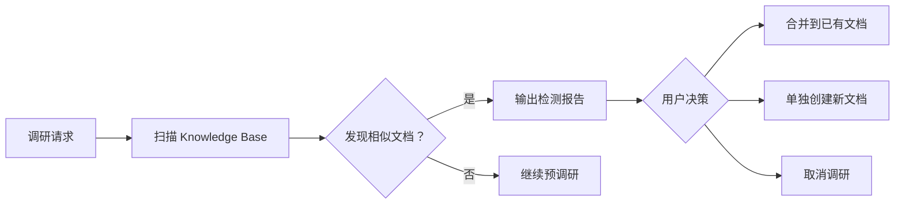

# 文档调研与整理 Skill

## 用途

当用户需要深入了解某个新技术、新框架或陌生领域时，自动使用此 Skill。

**核心原则：**
1. 质量优先：确保信息准确性和深度
2. 来源优先级：官方文档 > 技术博客 > 源码 > 视频 > 论文
3. 透明可追溯：所有信息标注来源
4. 持续可更新：检测已有文档并更新
5. **图表美观：默认使用 Mermaid 绘制流程图/架构图，禁止 ASCII 字符画图**

**搜索规则：**
- **禁止使用原生 WebSearch**：必须使用 MCP 提供的 `mcp__WebSearch__bailian_web_search` 进行搜索

**图表规范：**
- **禁止 ASCII 流程图**：不要使用 `┌─┐│└┘├┤┬┴` 等字符绘制框图
- **默认使用 Mermaid**：流程图/架构图/状态图等统一使用 Mermaid 语法
- **图表类型选择**：
  - 流程/步骤 → `flowchart LR` 或 `flowchart TD`
  - 架构分层 → `flowchart TB` + `subgraph`
  - 状态变化 → `stateDiagram-v2`
  - 组件交互 → `sequenceDiagram`
  - 数据结构 → `flowchart LR` + `subgraph`

---

## 工作流程

### 阶段 1：需求澄清与知识库扫描

**步骤 1.1：确认调研主题**
- 主题名称、特定关注点、时间敏感性

**步骤 1.2：知识库重复检测（新增核心步骤）**



**执行扫描：**
```
1. 提取主题关键词
   - 中文：[主题名称]
   - 英文：[Topic/Abbreviation]

2. 扫描目录结构
   - Knowledge Base/**/[主题]*.md
   - Knowledge Base/**/[关键词]*.md

3. 分析相似度
   - 文件名包含关键词
   - 目录名匹配
   - 读取内容摘要验证相关性

4. 输出检测报告
```

**检测报告格式：**
```markdown
## 知识库重复检测报告

### 扫描关键词
- 主关键词：[关键词 1, 关键词 2]
- 扩展词：[同义词，缩写，别名]

### 发现的相似文档
| 文件路径 | 相似度 | 主题匹配度 |
|----------|--------|------------|
| Knowledge Base/XXX/YYY.md | 高/中/低 | 说明 |

### 建议操作
- **合并**：如果已有文档覆盖同一主题，建议合并更新
- **单独创建**：如果是子主题或新方向，建议单独创建
- **取消**：如果已有文档已完整覆盖，可取消调研
```

**等待用户决策：**
- 合并到已有文档 → 读取已有文档，进入更新模式
- 单独创建 → 继续预调研流程
- 取消 → 结束流程

---

### 阶段 2：预调研与位置推荐

**步骤 2.1：基础网络搜索（预调研）**

**目的：** 先了解主题全貌、识别官方文档和核心资源，再制定调研大纲

**执行搜索：**
```
使用 mcp__WebSearch__bailian_web_search 执行 2-3 组搜索：

1. 官方文档搜索："[主题] 官方文档"、"[主题] official documentation"
2. 核心概念搜索："[主题] 核心概念"、"[主题] architecture overview"
3. 最新版本搜索："[主题] 最新版本"、"[主题] [年份] guide"
```

**步骤 2.2：智能位置推荐（新增核心步骤）**

```mermaid
flowchart TB
    Scan[预调研完成] --> Analyze[分析主题属性]
    Analyze --> Category{主题归类}
    Category --> Frontend[前端技术]
    Category --> Backend[后端技术]
    Category --> AI[AI/ML]
    Category --> Cross[跨领域/工具]

    Frontend --> Recommend1[推荐：Knowledge Base/Frontend/]
    Backend --> Recommend2[推荐：Knowledge Base/Backend/]
    AI --> Recommend3[推荐：Knowledge Base/AI/]
    Cross --> Recommend4[推荐：Knowledge Base/[技术名]/]

    Recommend1 --> Output[输出推荐位置列表]
    Recommend2 --> Output
    Recommend3 --> Output
    Recommend4 --> Output

    Output --> UserSelect[用户选择/自定义]
```

**推荐逻辑：**
```
1. 分析主题属性
   - 前端框架/库 → Frontend/
   - 后端框架/数据库 → Backend/
   - AI/ML 相关 → AI/
   - 跨端工具/CLI → Tools/
   - 特定技术生态 → [技术名]/

2. 考虑现有目录结构
   - 读取 Knowledge Base 现有目录
   - 优先使用已有目录
   - 避免创建过深嵌套

3. 生成推荐列表（2-4 个）
   - 每个推荐附带理由
   - 标注首选推荐
```

**推荐位置格式：**
```markdown
## 推荐存储位置

根据预调研结果，[主题] 属于 [技术类别]，推荐以下存储位置：

| 推荐 | 路径 | 理由 |
|------|------|------|
| ⭐ 首选 | Knowledge Base/[Category]/[主题]/ | 理由说明 |
| 备选 1 | Knowledge Base/[主题]/ | 理由说明 |
| 备选 2 | Knowledge Base/[其他]/[主题]/ | 理由说明 |

### 请选择或自定义
- 输入数字选择（1/2/3）
- 或输入自定义路径
- 或使用默认（直接回车）
```

**步骤 2.3：生成调研大纲**

基于预调研结果和选定位置，输出以下结构供用户确认：

```markdown
# [主题] 调研大纲

## 建议章节结构
1. 概述  2.核心概念  3.快速入门  4.基础用法
5. 高级特性  6.实战案例  7.常见问题  8.学习资源

## 预计调研范围
- 官方文档：[X] 个来源（基于预调研识别）
- 技术博客：[X] 个来源
- 其他：[X] 个来源

## 预计完成时间：约 [X] 分钟

## 存储位置：[用户选定的路径]/[主题名] 核心知识体系.md
```

**等待用户确认后进入阶段 3。**

---

### 阶段 3：分章节调研

**步骤 3.1：初始化进度追踪**

创建/更新 `[存储位置]/progress.txt`：

```markdown
# 调研进度追踪

主题：[主题名称]  |  开始：[日期]  |  预计：[日期]

## 章节进度
- [ ] 1.概述  - [ ] 2.核心概念  - [ ] 3.快速入门  - [ ] 4.基础用法
- [ ] 5.高级特性  - [ ] 6.实战案例  - [ ] 7.常见问题  - [ ] 8.学习资源

## 当前状态：[执行中步骤]
## 已查阅来源：[列表]
```

**步骤 3.2：执行调研流程**（每章节）

```
1. MCP WebSearch 搜索 (mcp__WebSearch__bailian_web_search)
   → 2. WebFetch 获取 → 3. 交叉验证 → 4. 撰写内容 → 5. 保存
```

**步骤 3.3：进度同步**

每完成一章输出：
```
📊 调研进度：3/8 完成
✅ 已完成：1.概述  2.核心概念  3.快速入门
🔄 进行中：4.基础用法
⏳ 待执行：5.高级特性...
```

---

### 阶段 4：整合输出

**步骤 4.1：检测已有文档**
- 存在则读取 → 识别需更新章节 → 保留有价值内容 → 添加更新记录

**步骤 4.2：生成文档结构**

按 8 章节结构输出（详见 `references/doc-structure.md`）：

```markdown
# [主题] 核心知识体系

> [一句话描述] | **特色：** [文档特点]

## 目录 → ## 1-8 章节 → ## 附录：引用列表
```

---

### 阶段 5：Review 检查

执行检查清单（详见 `checklists/review-checklist.md`）：

| 检查类型 | 检查项 |
|----------|--------|
| 结构检查 | 章节编号连续、目录对应 |
| 内容深度 | 定义 + 原理 + 示例 + 误区 |
| 格式检查 | Markdown 正确、代码块标注语言 |
| 引用检查 | 列表完整、来源标注、查阅时间 |

---

## 输出规范

### 生成文件

| 文件 | 路径 |
|------|------|
| 主文档 | `[存储位置]/[主题名] 核心知识体系.md` |
| 大纲 | `[存储位置]/outline.md` |
| 进度 | `[存储位置]/progress.txt` |

### 存储路径规则

```
Knowledge Base/
├── React/              # 前端技术
├── Backend/            # 后端技术
├── AI/                 # AI/ML 技术
├── Tools/              # 开发工具
├── [技术名]/           # 通用技术/跨领域
└── [主题]/             # 其他
```

---

## 踩坑清单

| 陷阱 | 错误做法 | 正确做法 |
|------|----------|----------|
| 来源单一 | 只看官方文档 | 至少 3-5 个来源交叉验证 |
| 缺少引用 | 直接复制 | 统一引用格式标注 |
| 内容过浅 | 只列 API | 定义 + 原理 + 示例 + 误区 |
| 忽视冲突 | 随意选择 | 标注冲突 + 分析原因 |
| 不更新 | 直接覆盖 | 检测已有 + 添加更新记录 |
| 重复调研 | 不扫描直接开始 | 先扫描知识库检测重复 |
| 位置混乱 | 随意存放 | 根据主题属性智能推荐 |
| **使用原生 WebSearch** | **直接调用 WebSearch** | **必须使用 `mcp__WebSearch__bailian_web_search`** |

详见：`references/gotchas.md`

---

## 示例

### 示例 1：调研新技术（无重复）

```
用户："帮我调研 Taro 框架"

Skill:
1. 扫描知识库 → 未发现相似文档
2. 预调研 Taro → 识别为前端跨端框架
3. 推荐存储位置:
   - ⭐ 首选：Knowledge Base/Frontend/Taro/
   - 备选：Knowledge Base/Taro/
4. 生成调研大纲 → 等待确认
```

### 示例 2：发现相似文档

```
用户："帮我调研 React Server Components"

Skill:
1. 扫描知识库 → 发现 Knowledge Base/React/React 核心知识体系.md
2. 输出检测报告:
   | 文件 | 相似度 | 说明 |
   |------|--------|------|
   | React 核心知识体系.md | 高 | 包含 React 相关章节 |
3. 询问决策:
   - 合并：在 React 文档中新增 RSC 章节
   - 单独：创建独立的 RSC 文档
   - 取消：已有内容足够
```

### 示例 3：更新已有文档

```
用户："调研 React 19 的新特性"

Skill:
1. 扫描知识库 → 发现 React 相关文档
2. 识别为更新请求
3. 输出更新计划:
   **新增：** 第 9 章 React 19 新特性
   **修改：** 4.8 节 useEffect、7.3 节性能优化
```

---

## 注意事项

### 安全与合规
- 不访问付费/登录内容
- 不抓取版权保护内容
- 引用控制在合理范围

### 性能考虑
- 单主题 30-60 分钟
- 分章节执行避免超时
- 每章完成立即保存

### 限制说明
- 无法访问付费墙
- 无法执行需 API Key 的查询
- 视频仅获取简介

---

## 资源索引

| 资源 | 文件 | 用途 |
|------|------|------|
| 文档结构模板 | `references/doc-structure.md` | 完整文档结构 |
| 引用格式规范 | `references/citation-guide.md` | 引用标注规则 |
| **Mermaid 图表规范** | `references/mermaid-guide.md` | **图表绘制指南** |
| 检查清单 | `checklists/review-checklist.md` | Review 检查 |
| 踩坑清单 | `references/gotchas.md` | 常见错误 |
| 示例 | `examples/` | 使用示例 |

---

*Skill 版本：5.0.0 | 作者：Kei | 更新：2026-03-30*
*更新说明：新增知识库重复检测（阶段 1）和智能位置推荐（阶段 2）功能*
