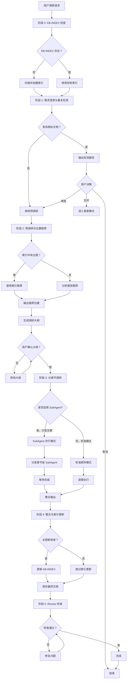

# Research 决策流程

> research Skill 完整决策点与流程控制

**更新时间：** 2026-03-30 | **版本：** 1.0.0

---

## 完整流程图



---

## 决策点清单

### 决策点 1：KB-INDEX 存在性
- **位置：** 阶段 0
- **分支：** 创建新索引 / 使用现有索引
- **自动化：** 自动检测并处理

### 决策点 2：重复文档检测
- **位置：** 阶段 1
- **分支：** 发现相似 / 无相似
- **用户参与：** 是（检测报告）

### 决策点 3：用户处理重复
- **位置：** 阶段 1 输出后
- **选项：**
  - 合并到已有文档
  - 单独创建新文档
  - 取消调研
- **用户参与：** 是

### 决策点 4：位置推荐
- **位置：** 阶段 2
- **分支：** 索引中有推荐 / 分析属性推荐
- **用户参与：** 是（选择推荐位置）

### 决策点 5：调研大纲确认
- **位置：** 阶段 2 输出后
- **选项：** 确认 / 修改
- **用户参与：** 是

### 决策点 6：SubAgent 模式选择（新增）
- **位置：** 阶段 3 开始前
- **选项：**
  - SubAgent 并行模式（推荐用于≥6 章）
  - 标准顺序模式
- **判断依据：** 章节数量、主题复杂度
- **用户参与：** 是

### 决策点 7：KB-INDEX 更新
- **位置：** 阶段 4
- **分支：** 新主题需更新 / 已有主题跳过
- **自动化：** 自动检测并处理

### 决策点 8：Review 检查
- **位置：** 阶段 5
- **分支：** 通过 / 需修复
- **自动化：** 自动检查，需人工修复

---

## 用户确认点汇总

| 确认点 | 阶段 | 确认内容 | 默认选项 |
|--------|------|----------|----------|
| 重复处理 | 阶段 1 | 合并/单独/取消 | 需用户选择 |
| 存储位置 | 阶段 2 | 选择推荐位置 | 首选推荐 |
| 调研大纲 | 阶段 2 | 确认章节结构 | 需用户确认 |
| **SubAgent 模式** | 阶段 3 | **并行/顺序** | **根据规模推荐** |
| Review 修复 | 阶段 5 | 确认修复方案 | 自动修复优先 |

---

## SubAgent 模式详细决策

### 判断是否推荐 SubAgent

```
if 章节数量 >= 6:
    推荐 SubAgent 模式
elif 章节数量 >= 4 AND 主题复杂度高:
    推荐 SubAgent 模式（可选）
else:
    推荐标准模式
```

### SubAgent 分组策略

| 章节数 | 分组数 | 每章 SubAgent | 预计加速比 |
|--------|--------|---------------|------------|
| 6-8 章 | 2-3 组 | 1 个/章 | 2-3x |
| 9-12 章 | 3-4 组 | 1 个/章 | 3-4x |
| ≥13 章 | 4-6 组 | 1 个/章 | 4-6x |

---

*参考文档版本：1.0.0 | research Skill v7.0.0+*
