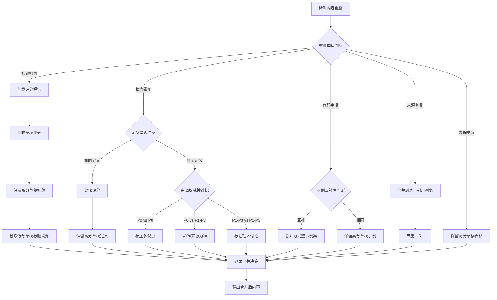

# 合并决策树（Merge Decision Tree）

> **v14 新增**：处理多草稿重叠和内容冲突的决策规则系统
>
> **用途**：SubAgent 并行调研模式下，多个子代理可能产出重叠或冲突内容，此决策树提供明确的合并规则。

---

## 核心决策流程



---

## 一、标题重叠处理

### 检测方法

```bash
grep "^## " *.md | sort | uniq -d
```

### 决策规则

| 情况 | 决策 | 操作 |
|------|------|------|
| 完全相同标题 | 保留高分 | 删除低分草稿标题段落 |
| 相似标题（关键词相同） | 合并 | 选择更准确表述作为主标题，其他作为副标题 |
| 标题冲突（不同主题） | 分离 | 检查章节归属，可能需重新分类 |

### 示例

```markdown
<!-- 草稿 A（评分 96） -->
## 1. React 组件渲染机制

<!-- 草稿 B（评分 62） -->
## 1. React 渲染流程

<!-- 决策：保留草稿 A 标题（更准确） -->
```

---

## 二、概念重叠处理

### 检测方法

提取所有"定义:"段落，比对关键词重叠度。

### 决策矩阵

| 定义关系 | 来源对比 | 决策 |
|----------|----------|------|
| 相同定义 | - | 保留高分草稿 |
| 冲突定义 | P0 vs P0 | 标注多观点（官方文档可能有不同版本） |
| 冲突定义 | P0 vs P1-P3 | 以 P0 为准，标注来源 |
| 冲突定义 | P1 vs P2 | 以 P1 为准（作者权威性更高） |
| 冲突定义 | P2 vs P3 | 标注为社区讨论 |
| 部分重叠 | - | 合并互补部分 |

### 来源优先级定义

| 优先级 | 来源类型 | 示例 |
|--------|----------|------|
| **P0** | 官方文档 | react.dev, docs.python.org |
| **P0** | 源码/源码注释 | GitHub 源码文件 |
| **P1** | 技术博客（作者权威） | Dan Abramov 博客、官方团队成员博客 |
| **P2** | 技术博客（普通） | Medium、掘金等平台博客 |
| **P3** | 社区讨论 | Stack Overflow、GitHub Discussions |
| **P3** | 视频/教程 | YouTube、B站教程 |

### 冲突标注格式

```markdown
<!-- P0 vs P0 冲突 -->
关于 React 并发模式的调度机制：
- 官方文档（react.dev）描述：使用 requestIdleCallback
- React 源码注释（scheduler.ts）描述：使用自定义调度器

**结论：源码注释更准确，官方文档可能未更新。**
**来源优先级：P0（源码） > P0（文档）**（源码是实际实现）

<!-- P0 vs P2 冲突 -->
关于 useEffect 的执行时机：
- 官方定义（react.dev）：渲染后异步执行
- 博客观点（某技术博客）：DOM 更新前同步执行

**结论：以官方文档为准。**
**来源优先级：P0 > P2**

<!-- P2 vs P3 冲突（社区讨论） -->
关于 useCallback 的性能收益：
- 观点 A（博客 X）：总是使用 useCallback 优化性能
- 观点 B（社区讨论）：过度使用反而增加开销

**结论：标注为社区讨论，待官方确认。**
**注意：这是一个有争议的话题。**
```

---

## 三、代码重叠处理

### 检测方法

```bash
# 检测相同代码块
grep -o '```[a-z]*' *.md | sort | uniq -c | awk '$1 > 1'
```

### 决策规则

| 代码关系 | 决策 | 操作 |
|----------|------|------|
| 完全相同 | 保留高分 | 删除低分草稿代码块 |
| 相似但简略 | 保留完整 | 合并注释和说明 |
| 互补（不同场景） | 合并 | 组合为完整示例集 |
| 冲突（不同实现） | 标注 | 展示多种实现方式 |

### 代码合并示例

```markdown
<!-- 草稿 A：基础示例 -->
```javascript
const [count, setCount] = useState(0);
```

<!-- 草稿 B：带注释示例 -->
```javascript
// useState 返回状态和更新函数
const [count, setCount] = useState(0);
// 初始值为 0
```

<!-- 决策：合并为完整示例 -->
```javascript
// useState 返回当前状态和更新函数
// 初始值为第一个参数
const [count, setCount] = useState(0);
```
```

---

## 四、来源重叠处理

### 检测方法

```bash
# 提取所有 URL
grep -o 'https://[^)]*' *.md | sort | uniq -d
```

### 处理规则

```
1. 提取所有引用 URL
2. 去重相同 URL
3. 合并到统一引用列表
4. 添加来源类型标注
```

### 引用列表合并格式

```markdown
## 附录：完整引用列表

| 编号 | 来源类型 | 标题 | 链接 | 查阅时间 | 优先级 |
|------|----------|------|------|----------|--------|
| #1 | 官方文档 | React 官方文档 | https://react.dev | 2026-04-27 | P0 |
| #2 | 源码 | React GitHub | https://github.com/facebook/react | 2026-04-27 | P0 |
| #3 | 技术博客 | Dan Abramov Blog | https://overreacted.io | 2026-04-27 | P1 |
```

---

## 五、数据重叠处理

### 检测方法

检测相同表格数据（比对表头和内容）。

### 决策规则

| 数据关系 | 决策 | 操作 |
|----------|------|------|
| 完全相同表格 | 保留高分 | 删除低分表格 |
| 表格互补 | 合并 | 拼接列/行 |
| 表格冲突 | 标注 | 展示多个版本并说明差异 |

---

## 六、整合输出格式

### 合并决策报告

```markdown
## 合并决策报告

| 重叠类型 | 草稿A | 草稿B | 决策 | 保留内容 | 来源 |
|----------|-------|-------|------|----------|------|
| 标题 | ch1-A (96) | ch1-B (62) | 保留高分 | ch1-A 标题 | - |
| 概念 | ch1-A (P0) | ch1-B (P2) | P0优先 | ch1-A 定义 | react.dev |
| 代码 | ch1-A (完整) | ch1-B (简略) | 合并 | ch1-A + ch1-B注释 | - |
| 来源 | ch1-A (#1) | ch1-B (#1) | 去重 | 统一列表 | - |
```

---

## 七、操作命令参考

### 检测重叠

```bash
# 标题重叠
grep "^## " *.md | sort | uniq -d

# URL 重叠
grep -o 'https://[^)]*' *.md | sort | uniq -d

# 代码块数量
grep -c '```' chapter-*.md
```

### 合并操作

```bash
# 保留高分草稿，删除低分冗余
# （实际操作在整合阶段通过文本编辑完成）

# 提取引用 URL 去重
grep -o 'https://[^)]*' *.md | sort -u > sources-unique.txt
```

---

*版本：v1.0.0 | 创建日期：2026-04-27*
*关联文件：`references/post-processing-pipeline.md` §0-§1, `references/subagent-mode.md` §5*