# Mermaid 图表绘制规范

> **用途：** 指导调研文档中使用 Mermaid 绘制专业、美观的图表
> **版本：** 1.0.0 | **更新日期：** 2026-03-28

---

## 1. 为什么使用 Mermaid

### 1.1 ASCII 图的问题

````
❌ 避免以下 ASCII 画法：

┌─────────────┐     ┌──────────────┐     ┌──────────────┐
│  State 变化  │ ──> │ 创建新 VDOM  │ ──> │   Diff 对比   │
└─────────────┘     └──────────────┘     └──────────────┘
```

**问题：**
- 容易错位（不同编辑器/字体显示不一致）
- 维护困难（修改需手动调整字符）
- 不美观（字符粗糙，缺乏专业感）
- 不支持主题（无法统一风格）
````

### 1.2 Mermaid 的优势

````mermaid
✅ 推荐使用 Mermaid：

flowchart LR
    A[State 变化] --> B[创建新 VDOM]
    B --> C[Diff 对比]
    C --> D[批量更新 DOM]
```

**优势：**
- 自动布局（永不错位）
- 专业渲染（美观统一）
- 版本友好（纯文本定义，diff 清晰）
- 易于维护（修改只需改文字）
- GitHub/Markdown 原生支持
```

---

## 2. 图表类型选择决策树

```
需要画什么类型的图？
│
├── 流程/步骤/顺序 → flowchart LR（从左到右）或 flowchart TD（从上到下）
│
├── 系统架构/分层 → flowchart TB + subgraph 分组
│
├── 状态变化/状态机 → stateDiagram-v2
│
├── 组件交互/时序 → sequenceDiagram
│
├── 数据结构/链表树 → flowchart LR + subgraph
│
├── 概念分层/思维导图 → mindmap
│
└── 项目计划/时间线 → gantt
```

---

## 3. 常用图表模板

### 3.1 流程图（从左到右）

**适用场景：** 线性流程、步骤顺序、数据处理流程

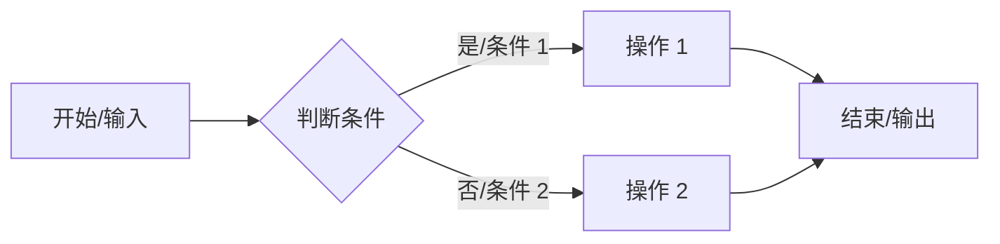

**完整示例：**

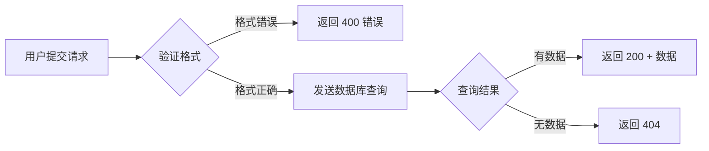

---

### 3.2 流程图（从上到下）

**适用场景：** 垂直流程、决策树

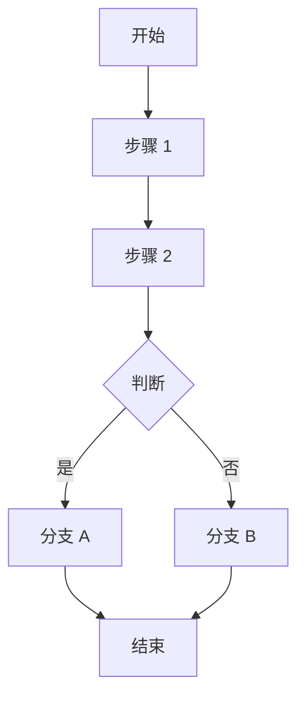

---

### 3.3 架构分层图

**适用场景：** 系统架构、技术栈分层、模块划分

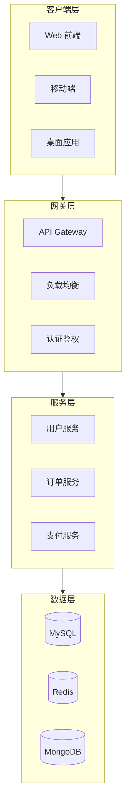

---

### 3.4 状态图

**适用场景：** 状态机、生命周期、订单状态、Promise 状态

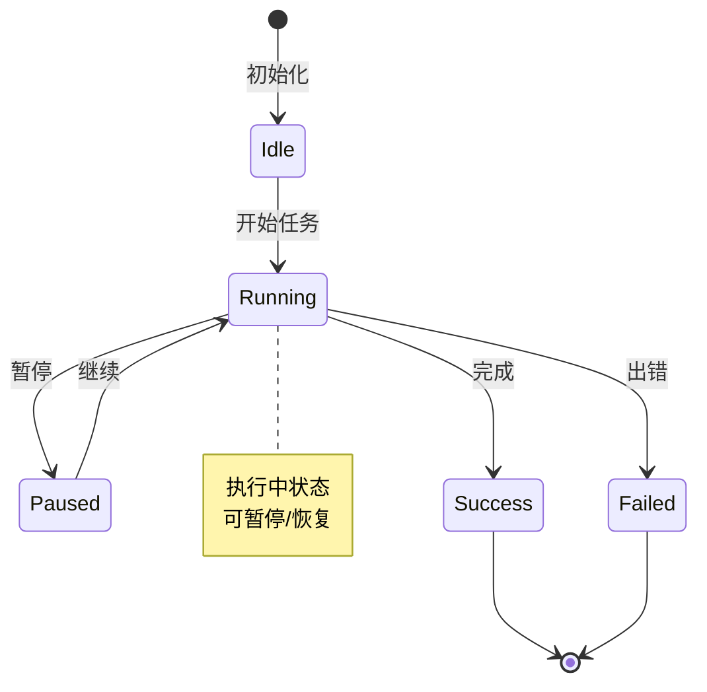

---

### 3.5 序列图

**适用场景：** 组件交互、API 调用流程、用户操作响应

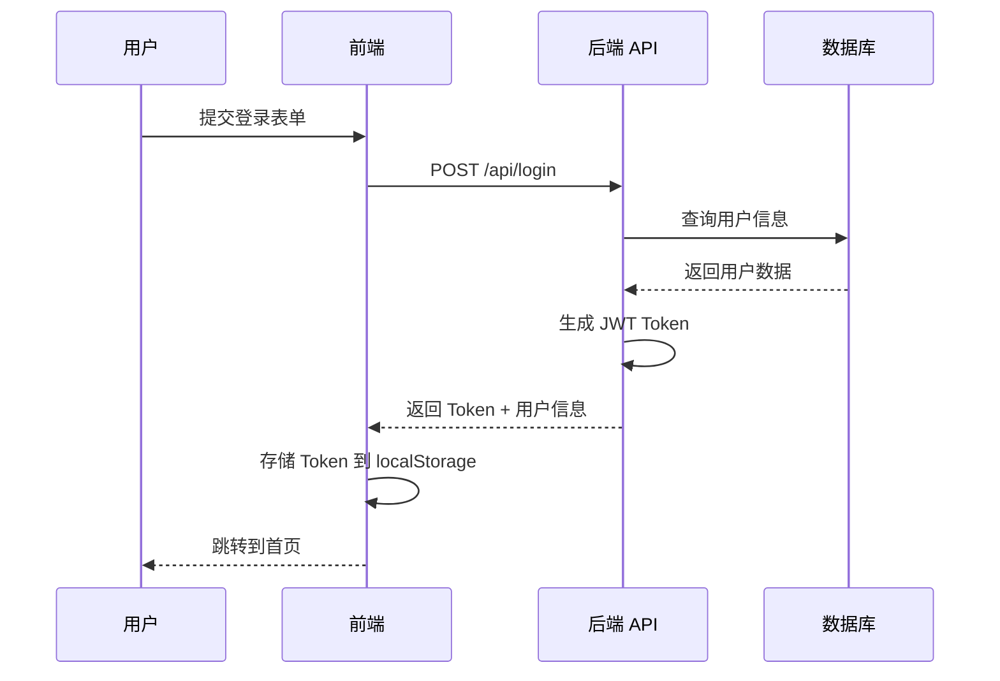

---

### 3.6 数据结构图

**适用场景：** 链表、树、图结构、对象引用

```mermaid
flowchart LR
    subgraph H1[Hook 1]
        A1[useState]
        A2[count: 0]
    end

    subgraph H2[Hook 2]
        B1[useState]
        B2[name: '']
    end

    subgraph H3[Hook 3]
        C1[useEffect]
        C2[deps: [count]]
    end

    H1 --> H2
    H2 --> H3
```

---

## 4. 节点形状速查

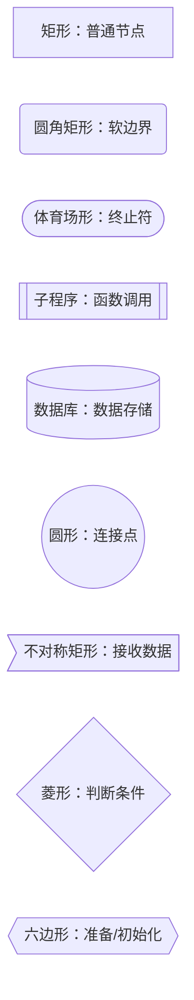

| 形状 | 语法 | 适用场景 |
|------|------|----------|
| 矩形 | `[文本]` | 普通节点、步骤 |
| 圆角矩形 | `(文本)` | 开始/结束、软边界 |
| 体育场形 | `([文本])` | 终止符 |
| 子程序 | `[[文本]]` | 函数调用、子流程 |
| 数据库 | `[(文本)]` | 数据库、存储 |
| 圆形 | `((文本))` | 连接点、汇聚点 |
| 不对称矩形 | `>[文本]]` | 接收数据 |
| 菱形 | `{文本}` | 判断条件、分支 |
| 六边形 | `{{文本}}` | 准备、初始化 |

---

## 5. 连接线速查

```mermaid
flowchart LR
    A -- 普通连接 --> B
    A ==> 粗线连接 ==> C
    A -. 虚线连接 .-> D
    A o-- 圆圈开始 --o B
    A == 带标签 == C
    A <--> 双向连接 <--> B
```

| 连接线 | 语法 | 适用场景 |
|--------|------|----------|
| 普通箭头 | `-->` | 标准流程 |
| 粗箭头 | `==>` | 重要流程 |
| 虚线箭头 | `-.->` | 可选流程、异步 |
| 圆圈开始 | `o--` | 起始条件 |
| 带标签 | `-- 文本 -->` | 标注条件/说明 |
| 双向箭头 | `<-->` | 双向交互 |

---

## 6. 子图（分组框）用法

### 6.1 基本子图

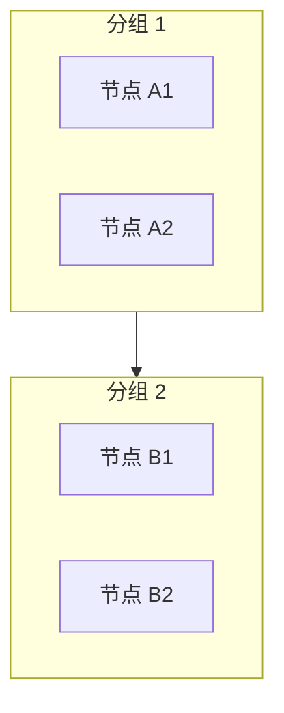

### 6.2 子图内设置方向

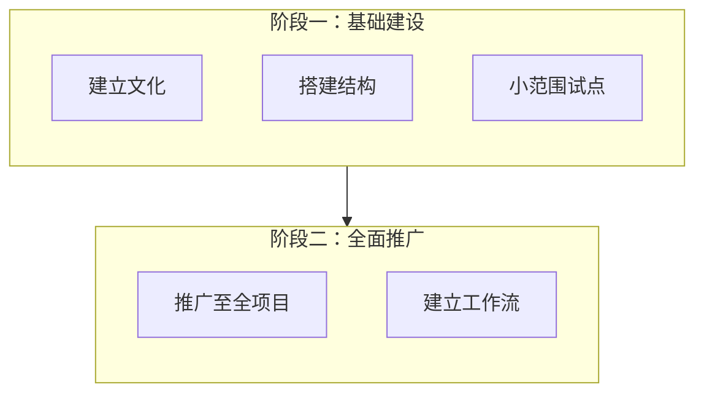

---

## 7. 添加注释和说明

### 7.1 右侧注释

```mermaid
flowchart LR
    A[开始] --> B[处理]
    B --> C[结束]

    note right of B
        这是处理步骤
        包含详细说明
    end note
```

### 7.2 左侧注释

```mermaid
flowchart LR
    A[开始] --> B[处理]

    note left of A
        初始化阶段
    end note
```

---

## 8. 主题和样式

### 8.1 设置主题

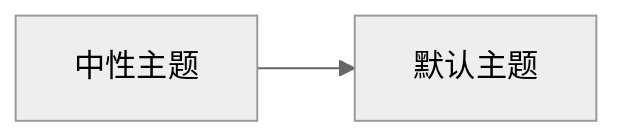

**可用主题：**
- `default` - 默认主题
- `neutral` - 中性主题（灰度）
- `dark` - 深色主题
- `forest` - 森林主题（绿色系）
- `base` - 基础主题

### 8.2 自定义样式

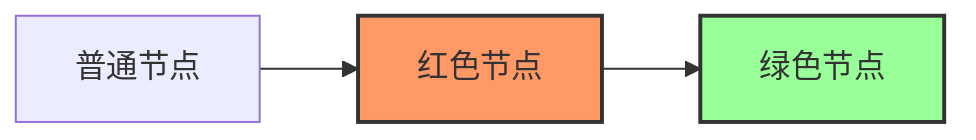

---

## 9. 最佳实践

### 9.1 节点命名建议

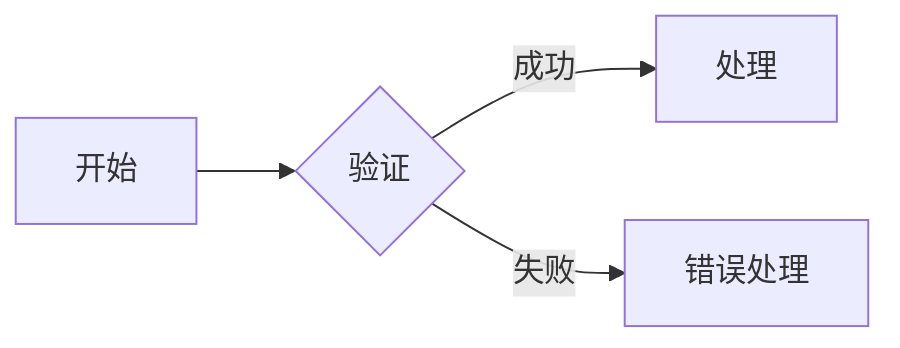

### 9.2 控制图表大小

- 单图节点数建议控制在 **5-15 个**
- 超过 15 个节点 → 拆分为多个子图或多个图表
- 使用 `subgraph` 对相关节点分组

### 9.3 保持布局清晰

- 避免交叉连接（调整节点定义顺序）
- 使用 `direction` 控制子图内方向
- 复杂图表优先使用 `flowchart TD`（从上到下）

### 9.4 标签文字简洁

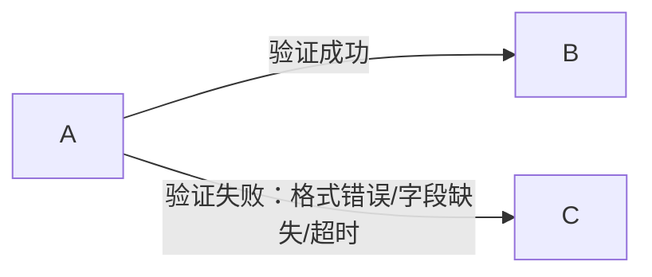

**简化后：**

```mermaid
flowchart LR
    A -- 成功 --> B
    A -- 失败 --> C
    note right of C
        失败原因：
        - 格式错误
        - 字段缺失
        - 超时
    end note
```

---

## 10. 常见错误排查

| 问题 | 可能原因 | 解决方法 |
|------|---------|---------|
| 图不显示 | 语法错误 | 使用 [Mermaid Live Editor](https://mermaid.live) 验证 |
| 布局混乱 | 节点太多 | 使用 subgraph 分组，或拆分为多个图 |
| 文字溢出 | 节点文字太长 | 使用 `<br/>` 换行，或简化文字 |
| 连接交叉 | 自动布局限制 | 调整节点定义顺序，使用 `direction` |
| 中文不显示 | 字体问题 | 确保 Markdown 渲染器支持中文 |

---

## 11. 在线工具

- **Mermaid 官方编辑器**：https://mermaid.live
- **Mermaid 官方文档**：https://mermaid.js.org
- **GitHub 支持**：.md 文件中直接使用

---

*文档版本：1.0.0 | 创建日期：2026-03-28*
