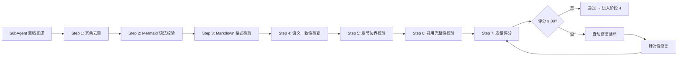
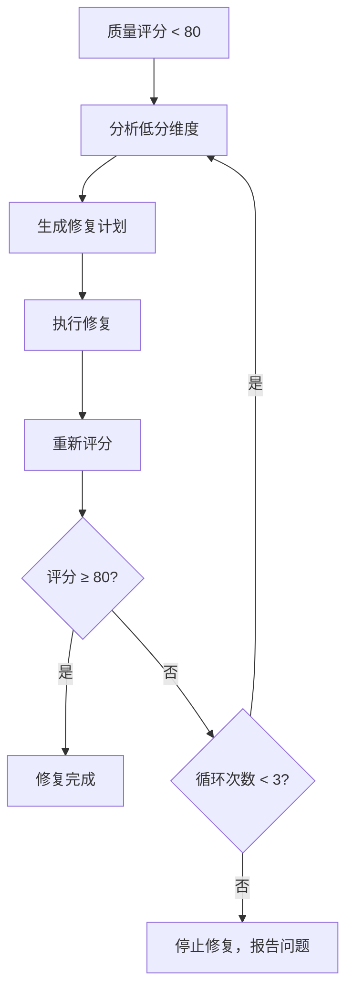

# 整合后处理 Pipeline（Phase 3.5）

> **v11.0.0 新增**：SubAgent 章节调研完成后、进入阶段 4 整合前，必须执行此工程化处理 Pipeline。
>
> **目标**：消除 SubAgent 产出的质量问题，确保多源内容的语义一致性、格式正确性和结构完整性。

---

## 流水线概览



---

## Step 1：冗余去重（Deduplication）

SubAgent 并行模式下，不同子代理可能调研到相同信息。需检测并消除跨草稿的语义重复。

**检测维度：**

| 维度 | 检测方法 | 处理策略 |
|------|----------|----------|
| **标题重复** | 提取所有标题，比对相同/相似标题 | 保留更完整的版本，删除简略版 |
| **概念重复定义** | 提取所有"概念定义"段落，计算语义相似度 | 保留最准确的定义，其他改为交叉引用 |
| **代码示例重复** | 提取所有代码块，检测相同/相似代码 | 保留最完整的示例，删除重复版 |
| **来源重复** | 提取所有引用 URL，去重 | 合并到统一引用列表 |
| **数据重复** | 检测相同数据/表格的重复出现 | 保留最完整的表格，其他改为引用 |

**输出物：** `.work/[主题]/drafts/dedup-report.md`

---

## Step 2：Mermaid 语法校验（Mermaid Validation）

**校验清单：**

| 检查项 | 规则 | 常见错误 |
|--------|------|----------|
| **图表类型** | 必须是 mermaid 支持的类型 | `diagram`、`chart` 等不存在的类型 |
| **语法正确性** | 符合 Mermaid 语法规范 | 缺少箭头符号、括号不匹配 |
| **节点标识符** | 不含特殊字符和空格 | `A[包含 空格]` → 使用 `A[不含空格]` |
| **子图嵌套** | subgraph 必须正确闭合 | 缺少 `end` |
| **样式定义** | style 语法正确 | 缺少节点名 |
| **中文支持** | 中文内容必须用 `[]` 或 `{}` 包裹 | 裸中文在节点标识符中 |
| **HTML 实体** | 特殊字符使用实体编码 | `&` → `&amp;`，`<` → `&lt;` |

**输出物：** `.work/[主题]/drafts/mermaid-validation-report.md`

---

## Step 3：Markdown 格式检验（Format Validation）

| 检查项 | 规则 | 检测方法 |
|--------|------|----------|
| **代码块语言标注** | 所有代码块必须标注语言 | `grep '```$'` 检测无标注代码块 |
| **代码块闭合** | 所有代码块必须正确闭合 | 计算 ` ``` ` 数量，必须为偶数 |
| **表格格式** | 表格必须有表头分隔线 | 检测 `\|---\|` 格式 |
| **标题层级** | 标题层级不能跳跃 | 检测 `##` 编号连续性 |
| **空行规范** | 标题前后、代码块前后需有空行 | 正则检测 |
| **列表缩进** | 列表项缩进一致 | 检测列表缩进 |
| **链接格式** | 链接必须有文字和 URL | 检测裸 URL 或空链接 |

**输出物：** `.work/[主题]/drafts/format-validation-report.md`

---

## Step 4：语义一致性检查（Semantic Consistency）

| 维度 | 检查内容 | 修复策略 |
|------|----------|----------|
| **术语统一** | 同一概念在不同章节的命名是否一致 | 统一为最准确的术语，建立术语表 |
| **代号/变量一致** | 代码示例中的变量名是否跨章节一致 | 统一变量命名 |
| **数据一致** | 同一数据在不同章节是否矛盾 | 以最新/最权威来源为准 |
| **风格一致** | 代码风格（缩进、命名）是否一致 | 统一为项目风格 |
| **深度一致** | 各章节的内容深度是否均衡 | 补充过浅章节 |

**输出物：** 术语一致性报告 + 自动替换（`sed`）

---

## Step 5：章节边界校验（Chapter Boundary Check）

| 检查项 | 说明 |
|--------|------|
| **章节归属** | 内容是否属于当前章节，没有越界到相邻章节 |
| **编号正确** | 章节编号与大纲一致 |
| **过渡自然** | 章节之间过渡自然，没有突兀的跳转 |
| **无孤立内容** | 没有不属于任何章节的孤立段落 |
| **引用有效** | 章节间交叉引用（如"见第 X 章"）目标存在且正确 |

---

## Step 6：引用完整性校验（Citation Integrity）

| 检查项 | 说明 | 检测方法 |
|--------|------|----------|
| **文中标注存在** | 每个关键论述都有引用标注 | 检测无引用的断言性陈述 |
| **引用列表完整** | 文中标注的引用都在附录列表中 | 交叉比对标号和列表 |
| **URL 的有效性** | 引用 URL 格式正确 | 正则验证 URL 格式 |
| **一手来源优先** | 官方文档/源码优先于二手内容 | 来源分类统计 |

---

## Step 7：质量评分（Quality Scoring）

### 评分体系

| 维度 | 权重 | 评分标准 |
|------|------|----------|
| **冗余度** | 15% | 0 重复=100, 1-3 组=80, 4-6 组=60, >6 组=40 |
| **Mermaid 正确率** | 15% | 100%=100, 90%+=80, 80%+=60, <80%=40 |
| **格式规范** | 15% | 0 错误=100, 1-3=80, 4-6=60, >6=40 |
| **术语一致性** | 15% | 0 变体=100, 1-2=80, 3-4=60, >4=40 |
| **引用完整性** | 20% | 100%=100, 90%+=80, 80%+=60, <80%=40 |
| **章节边界** | 10% | 0 越界=100, 1=80, 2=60, >2=40 |
| **内容深度** | 10% | L4 标准达标率 |

### 评分阈值与行动

| 总分 | 等级 | 行动 |
|------|------|------|
| **≥ 90** | S | 直接进入阶段 4 整合 |
| **80-89** | A | 修复低分项后进入阶段 4 |
| **70-79** | B | 执行自动修复循环，修复后重评 |
| **< 70** | C | 停止整合，报告问题，询问用户 |

**输出物：** `.work/[主题]/drafts/quality-report.md`

---

## 自动修复循环（Auto-Repair Loop）

当质量评分 < 80 时触发：



### 修复策略映射

| 低分维度 | 修复操作 |
|----------|----------|
| 冗余度低 | 执行去重，合并重复内容 |
| Mermaid 错误 | 逐一修复语法错误，无法修复则替换 |
| 格式错误 | 运行 markdownlint 自动修复 |
| 术语不一致 | 生成术语表，执行 sed 统一替换 |
| 引用不完整 | 补充缺失引用标注 |
| 章节越界 | 移动内容到正确章节 |
| 内容过浅 | 补充原理讲解、源码分析、代码示例 |

最多 3 轮修复循环。超过后仍未达标，生成详细问题报告并询问用户。

---

*版本：v1.0.0 | 创建日期：2026-04-27*
*恢复于 v13：原文件从未提交到 git，基于 SKILL.md 中描述重建*
