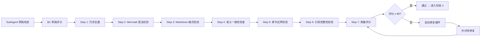
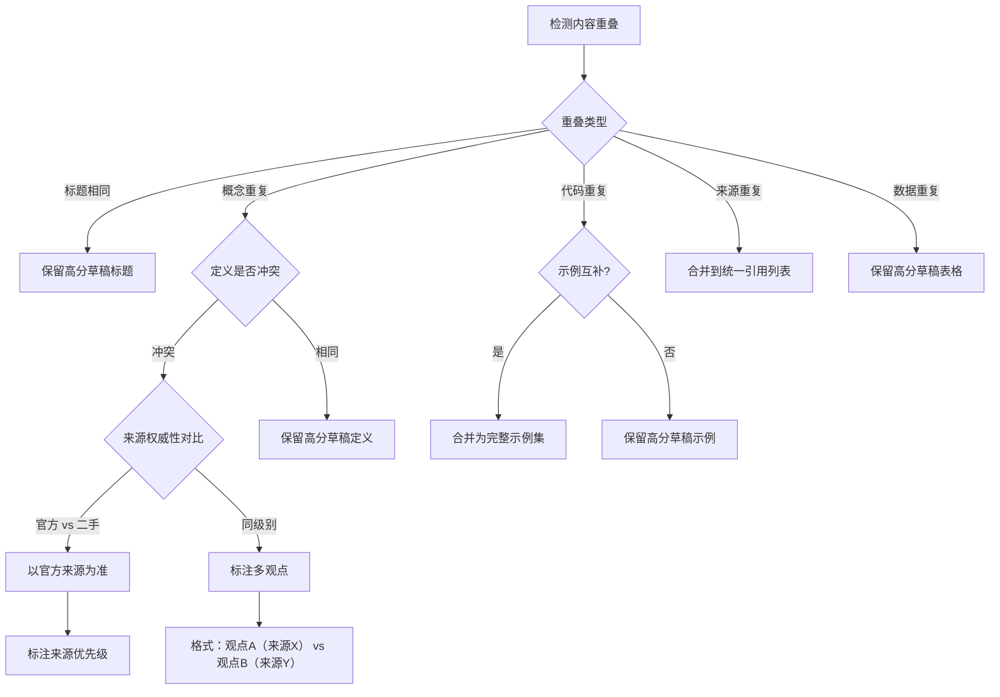
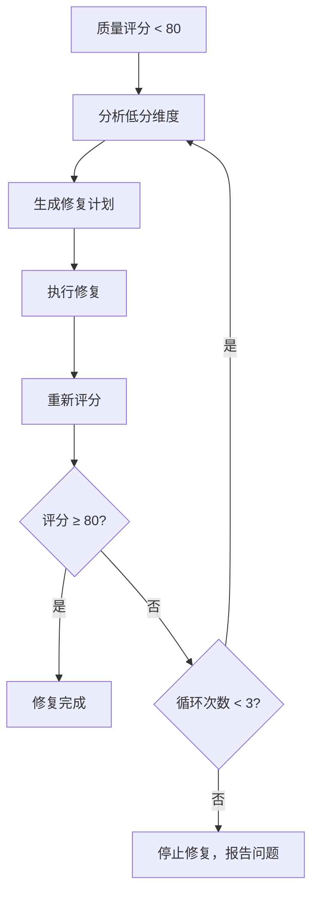

# 整合后处理 Pipeline（Phase 3.5）

> **v11.0.0 新增**：SubAgent 章节调研完成后、进入阶段 4 整合前，必须执行此工程化处理 Pipeline。
>
> **目标**：消除 SubAgent 产出的质量问题，确保多源内容的语义一致性、格式正确性和结构完整性。

---

## 流水线概览


```mermaid
flowchart LR
    A[SubAgent 草稿完成] --> B[§0: 草稿评分]
    B --> C[Step 1: 冗余去重]
    C --> D[Step 2: Mermaid 语法校验]
    D --> E[Step 3: Markdown 格式检验]
    E --> F[Step 4: 语义一致性检查]
    F --> G[Step 5: 章节边界校验]
    G --> H[Step 6: 引用完整性校验]
    H --> I[Step 7: 质量评分]
    I --> J{评分 ≥ 80?}
    J -->|是| K[通过 → 进入阶段 4]
    J -->|否| L[自动修复循环]
    L --> M[针对性修复]
    M --> I
```

---

## §0：草稿评分机制（Draft Scoring）

> **v14 新增**：为每个草稿生成量化评分，用于重叠决策和优先级判断。

### 评分维度

| 维度 | 权重 | 计算方法 | 指标 |
|------|------|----------|------|
| **引用数量** | 25% | 引用条目数 | ≥5 条=100, 3-4=80, 1-2=60, 0=40 |
| **代码示例数** | 20% | 代码块数量（`grep -c '```'`） | ≥3=100, 2=80, 1=60, 0=40 |
| **图表数量** | 15% | Mermaid 图表数（`grep -c 'mermaid'`） | ≥2=100, 1=80, 0=40 |
| **内容深度** | 20% | L1-L4 等级评估 | L4=100, L3=80, L2=60, L1=40 |
| **来源权威性** | 20% | 官方文档引用占比 | ≥50%=100, 30-50%=80, <30%=60 |

### 深度等级定义

| 筧级 | 标准 | 包含要素 |
|------|------|----------|
| L4 | 专家级 | 定义 + 原理 + 源码 + 误区 + 最佳实践 |
| L3 | 进阶级 | 定义 + 原理 + 示例 + 误区 |
| L2 | 基础级 | 定义 + 示例 |
| L1 | 入门级 | 仅定义或仅示例 |

### 评分计算

```
总分 = Σ(维度得分 × 权重)

示例：
草稿 A：引用5(100×0.25) + 代码3(100×0.20) + 图表2(100×0.15) + 深度L4(100×0.20) + 权威60%(80×0.20)
      = 25 + 20 + 15 + 20 + 16 = 96

草稿 B：引用3(80×0.25) + 代码1(60×0.20) + 图表0(40×0.15) + 深度L2(60×0.20) + 权威30%(60×0.20)
      = 20 + 12 + 6 + 12 + 12 = 62
```

### 输出格式

```markdown
## 草稿评分报告

| 草稿文件 | 引用 | 代码 | 图表 | 深度 | 权威 | 总分 | 排名 |
|----------|------|------|------|------|------|------|------|
| chapter-1-A.md | 100 | 100 | 100 | 100 | 80 | **96** | 1 |
| chapter-1-B.md | 80 | 60 | 40 | 60 | 60 | **62** | 2 |

**推荐保留：** chapter-1-A.md（高分优先）
```

**输出位置：** `.work/[主题]/drafts/score-report.md`

---

## Step 1：冗余去重（Deduplication）

SubAgent 并行模式下，不同子代理可能调研到相同信息。需检测并消除跨草稿的语义重复。

### §1.1 检测维度

| 维度 | 检测方法 | 处理策略 |
|------|----------|----------|
| **标题重复** | `grep "^## " *.md \| sort \| uniq -d` | 保留高分草稿标题 |
| **概念重复定义** | 提取「定义:」段落，比对关键词重叠 | **应用决策树** |
| **代码示例重复** | `grep -o '```[a-z]*' *.md \| sort \| uniq -c` | 合并或保留完整版 |
| **来源重复** | `grep -o 'https://[^)]*' *.md \| sort \| uniq -d` | 合并到统一引用列表 |
| **数据重复** | 检测相同表格数据 | 保留高分草稿表格 |

### §1.2 合并决策树


```mermaid
flowchart TD
    A[检测内容重叠] --> B{重叠类型}
    
    B -->|标题相同| C[保留高分草稿标题]
    B -->|概念重复| D{定义是否冲突}
    B -->|代码重复| E{示例互补?}
    B -->|来源重复| F[合并到统一引用列表]
    B -->|数据重复| G[保留高分草稿表格]
    
    D -->|冲突| H{来源权威性对比}
    D -->|相同| I[保留高分草稿定义]
    
    H -->|官方 vs 二手| J[以官方来源为准]
    H -->|同级别| K[标注多观点]
    
    E -->|是| L[合并为完整示例集]
    E -->|否| M[保留高分草稿示例]
    
    J --> N[标注来源优先级]
    K --> O[格式：观点A（来源X） vs 观点B（来源Y）]
```

### §1.3 来源优先级规则

解决内容冲突的核心规则：

| 来源类型 | 优先级 | 权重 | 冲突时行动 |
|----------|--------|------|------------|
| 官方文档 | **P0** | 最高 | 以官方为准，标注来源链接 |
| 源码/源码注释 | **P0** | 最高 | 以源码为准，标注文件路径 |
| 技术博客（作者权威） | P1 | 高 | 标注作者身份 |
| 技术博客（普通） | P2 | 中 | 标注为"社区观点" |
| 社区讨论/Q&A | P3 | 低 | 标注为"社区讨论" |
| 视频/教程 | P3 | 低 | 标注为"视频教程" |

**冲突解决示例：**
```markdown
<!-- 官方文档 vs 博客冲突 -->
React 19 的并发渲染机制：
- 官方定义：使用 requestIdleCallback 进行调度（来源：react.dev）
- 博客观点：使用 setTimeout 模拟（来源：某技术博客）

**结论：以官方文档为准。**（标注优先级 P0 > P2）

<!-- 同级别冲突 -->
关于 Fiber 节点的回收时机：
- 观点 A：组件卸载时立即回收（来源：博客 X）
- 观点 B：延迟到下次渲染前回收（来源：博客 Y）

**结论：标注多观点，待官方文档确认。**
```

### §1.4 合并操作流程

```
1. 加载评分报告（§0 输出）
2. 按重叠类型分组（标题/概念/代码/来源/数据）
3. 对每组应用决策树
4. 执行合并操作：
   - 保留高分 → 删除低分冗余内容
   - 合并互补 → 拼接多个版本
   - 标注冲突 → 格式化多观点呈现
5. 记录合并决策到报告
```

**输出物：** `.work/[主题]/drafts/dedup-report.md`

**报告格式：**
```markdown
## 冗余去重报告

| 重叠类型 | 草稿A | 草稿B | 决策 | 保留内容 | 来源 |
|----------|-------|-------|------|----------|------|
| 标题 | ch1-A (96分) | ch1-B (62分) | 保留高分 | ch1-A 标题 | - |
| 概念 | ch1-A | ch1-B | 官方优先 | ch1-A 定义 | react.dev (P0) |
| 代码 | ch1-A (完整) | ch1-B (简略) | 合并 | ch1-A + ch1-B 注释 | - |
```

---

## Step 2：Mermaid 语法校验（Mermaid Validation）

**校验清单：**

| 检查项 | 规则 | 常见错误 |
|--------|------|----------|
| **图表类型** | 必须是 mermaid 支持的类型 | `diagram`、`chart` 等不存在的类型 |
| **语法正确性** | 符合 Mermaid 语法规范 | 缺少箭头符号、括号不匹配 |
| **节点标识符** | 不含特殊字符和空格 | `A[包含 空格]` → 使用 `A[不含空格]` |
| **子图嵌套** | subgraph 必须正确闭合 | 缺少 `end` |
| **样式定义** | style 语法正确 | 缺少节点名 |
| **中文支持** | 中文内容必须用 `[]` 或 `{}` 包裹 | 裸中文在节点标识符中 |
| **HTML 实体** | 特殊字符使用实体编码 | `&` → `&amp;`，`<` → `&lt;` |

**输出物：** `.work/[主题]/drafts/mermaid-validation-report.md`

---

## Step 3：Markdown 格式检验（Format Validation）

| 检查项 | 规则 | 检测方法 |
|--------|------|----------|
| **代码块语言标注** | 所有代码块必须标注语言 | `grep '```$'` 检测无标注代码块 |
| **代码块闭合** | 所有代码块必须正确闭合 | 计算 ` ``` ` 数量，必须为偶数 |
| **表格格式** | 表格必须有表头分隔线 | 检测 `\|---\|` 格式 |
| **标题层级** | 标题层级不能跳跃 | 检测 `##` 编号连续性 |
| **空行规范** | 标题前后、代码块前后需有空行 | 正则检测 |
| **列表缩进** | 列表项缩进一致 | 检测列表缩进 |
| **链接格式** | 链接必须有文字和 URL | 检测裸 URL 或空链接 |

**输出物：** `.work/[主题]/drafts/format-validation-report.md`

---

## Step 4：语义一致性检查（Semantic Consistency）

| 维度 | 检查内容 | 修复策略 |
|------|----------|----------|
| **术语统一** | 同一概念在不同章节的命名是否一致 | 统一为最准确的术语，建立术语表 |
| **代号/变量一致** | 代码示例中的变量名是否跨章节一致 | 统一变量命名 |
| **数据一致** | 同一数据在不同章节是否矛盾 | 以最新/最权威来源为准 |
| **风格一致** | 代码风格（缩进、命名）是否一致 | 统一为项目风格 |
| **深度一致** | 各章节的内容深度是否均衡 | 补充过浅章节 |

**输出物：** 术语一致性报告 + 自动替换（`sed`）

---

## Step 5：章节边界校验（Chapter Boundary Check）

| 检查项 | 说明 |
|--------|------|
| **章节归属** | 内容是否属于当前章节，没有越界到相邻章节 |
| **编号正确** | 章节编号与大纲一致 |
| **过渡自然** | 章节之间过渡自然，没有突兀的跳转 |
| **无孤立内容** | 没有不属于任何章节的孤立段落 |
| **引用有效** | 章节间交叉引用（如"见第 X 章"）目标存在且正确 |

---

## Step 6：引用完整性校验（Citation Integrity）

| 检查项 | 说明 | 检测方法 |
|--------|------|----------|
| **文中标注存在** | 每个关键论述都有引用标注 | 检测无引用的断言性陈述 |
| **引用列表完整** | 文中标注的引用都在附录列表中 | 交叉比对标号和列表 |
| **URL 的有效性** | 引用 URL 格式正确 | 正则验证 URL 格式 |
| **一手来源优先** | 官方文档/源码优先于二手内容 | 来源分类统计 |

---

## Step 7：质量评分（Quality Scoring）

### 评分体系

| 维度 | 权重 | 评分标准 |
|------|------|----------|
| **冗余度** | 15% | 0 重复=100, 1-3 组=80, 4-6 组=60, >6 组=40 |
| **Mermaid 正确率** | 15% | 100%=100, 90%+=80, 80%+=60, <80%=40 |
| **格式规范** | 15% | 0 错误=100, 1-3=80, 4-6=60, >6=40 |
| **术语一致性** | 15% | 0 变体=100, 1-2=80, 3-4=60, >4=40 |
| **引用完整性** | 20% | 100%=100, 90%+=80, 80%+=60, <80%=40 |
| **章节边界** | 10% | 0 越界=100, 1=80, 2=60, >2=40 |
| **内容深度** | 10% | L4 标准达标率 |

### 评分阈值与行动

| 总分 | 等级 | 行动 |
|------|------|------|
| **≥ 90** | S | 直接进入阶段 4 整合 |
| **80-89** | A | 修复低分项后进入阶段 4 |
| **70-79** | B | 执行自动修复循环，修复后重评 |
| **< 70** | C | 停止整合，报告问题，询问用户 |

**输出物：** `.work/[主题]/drafts/quality-report.md`

---

## 自动修复循环（Auto-Repair Loop）

当质量评分 < 80 时触发：


```mermaid
flowchart TD
    A[质量评分 < 80] --> B[分析低分维度]
    B --> C[生成修复计划]
    C --> D[执行修复]
    D --> E[重新评分]
    E --> F{评分 ≥ 80?}
    F -->|是| G[修复完成]
    F -->|否| H{循环次数 < 3?}
    H -->|是| B
    H -->|否| I[停止修复，报告问题]
```

### 修复策略映射

| 低分维度 | 修复操作 |
|----------|----------|
| 冗余度低 | 执行去重，合并重复内容 |
| Mermaid 错误 | 逐一修复语法错误，无法修复则替换 |
| 格式错误 | 运行 markdownlint 自动修复 |
| 术语不一致 | 生成术语表，执行 sed 统一替换 |
| 引用不完整 | 补充缺失引用标注 |
| 章节越界 | 移动内容到正确章节 |
| 内容过浅 | 补充原理讲解、源码分析、代码示例 |

最多 3 轮修复循环。超过后仍未达标，生成详细问题报告并询问用户。

---

*版本：v2.0.0 | 创建日期：2026-04-27*
*v14 更新：新增 §0 草稿评分机制，更新 Step 1 添加合并决策树 + 来源优先级规则*
*恢复于 v13：原文件从未提交到 git，基于 SKILL.md 中描述重建*
