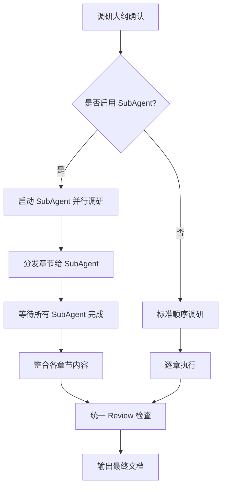

# SubAgent 并行调研模式

> 使用多 SubAgent 并发执行章节调研，提升大型主题调研效率

**更新时间：** 2026-03-30 | **版本：** 1.0.0

---

## 1. 模式对比

| 维度 | 标准模式 | SubAgent 模式 |
|------|----------|---------------|
| **执行方式** | 逐章顺序执行 | 多 SubAgent 并行 |
| **适用场景** | 小/中型主题（<5 章） | 大型/复杂主题（≥5 章） |
| **预计耗时** | 30-60 分钟 | 15-25 分钟 |
| **Token 效率** | 较高 | 中等（多上下文） |
| **质量控制** | 统一风格 | 需整合阶段 |

---

## 2. SubAgent 模式流程



---

## 3. SubAgent 分发策略

### 3.1 章节分组

```
主题：Taro 跨端框架（8 章）

并行组 A（基础章，3 章）：
├── 第 1 章：概述
├── 第 2 章：核心概念
└── 第 3 章：快速入门

并行组 B（核心章，3 章）：
├── 第 4 章：基础用法
├── 第 5 章：高级特性
└── 第 6 章：实战案例

顺序组 C（收尾章，2 章）：
├── 第 7 章：常见问题（依赖组 B）
└── 第 8 章：学习资源（依赖组 B）
```

### 3.2 推荐规则

| 主题规模 | 推荐模式 | SubAgent 数量 |
|----------|----------|---------------|
| 小型（<3 章） | 标准模式 | - |
| 中型（3-5 章） | 可选 SubAgent | 2-3 个 |
| 大型（≥6 章） | 推荐 SubAgent | 4-6 个 |
| 超大型（≥10 章） | 必须 SubAgent | 6-8 个 |

---

## 4. SubAgent 任务描述模板

```markdown
## 调研任务：[主题名称] - [章节名]

**执行范围：**
- 章节编号：第 X 章
- 章节主题：[具体主题]
- 预计字数：[X] 字

**输出位置（强制）：**
- 草稿路径：`.work/[主题]/drafts/chapter-X.md`
- 笔记路径：`.work/[主题]/drafts/notes/`
- **禁止**在项目根目录或其他位置随意存放过程文件

**调研要求：**
1. 查阅至少 3-5 个来源（官方文档优先）
2. 每个核心概念包含：定义 + 原理 + 示例 + 误区
3. 代码示例需标注来源
4. 使用 Mermaid 绘制相关图表（如适用）

**输出格式：**
```markdown
## X. [章节名]

### X.1 [小节 1]
[内容]

### X.2 [小节 2]
[内容]

**引用来源：**
1. [来源 1]
2. [来源 2]
```

**注意事项：**
- 避免与其他章节内容重复
- 保持技术术语一致性
- 标记需要与其他章节协调的内容
```

---

## 5. 整合阶段流程

### 5.1 内容整合

```
1. 收集所有 SubAgent 输出的章节内容
2. 检查章节衔接处的重复/断层
3. 统一代码风格、术语、图表格式
4. 添加章节间引用和链接
```

### 5.2 风格统一

```
1. 统一标题层级和编号
2. 统一代码块语言标注
3. 统一图表编号和引用
4. 统一引用格式
```

### 5.3 完整性检查

```
1. 检查目录与实际章节对应
2. 检查章节编号连续性
3. 检查引用列表完整性
4. 执行 Review 检查清单
```

---

## 6. 询问话术模板

```markdown
## 是否启用 SubAgent 并行模式？

根据调研大纲，本次调研共 **8 章**，属于**大型主题**。

### 模式选择

| 模式 | 预计耗时 | 优点 | 缺点 |
|------|----------|------|------|
| **SubAgent 并行** | 15-25 分钟 | 速度快 | Token 消耗略高 |
| **标准顺序** | 30-45 分钟 | 风格统一 | 耗时较长 |

### 推荐：SubAgent 并行模式

建议将章节分为 3 组并行执行：
- **组 A**：第 1-3 章（基础）
- **组 B**：第 4-6 章（核心）
- **组 C**：第 7-8 章（收尾）

**请选择：**
1. 启用 SubAgent 并行（推荐）
2. 使用标准顺序模式
3. 自定义分组方式
```

---

## 7. 踩坑清单

| 陷阱 | 症状 | 解决方案 |
|------|------|----------|
| SubAgent 过多 | Token 消耗激增 | 限制最多 8 个 SubAgent |
| 章节重复 | 内容重叠 | 明确每章边界，整合时去重 |
| 风格不统一 | 各章节差异大 | 整合阶段统一审查 |
| 衔接断层 | 章节间缺少过渡 | 添加承上启下段落 |
| **过程文件乱放** | **草稿散落在项目各处** | **强制使用 `.work/[主题]/drafts/` 目录** |

---

## 8. 过程文件管理规范

### 8.1 目录结构

```
[存储位置]/.work/
├── [主题名]/
│   ├── drafts/           # 章节草稿临时存放
│   │   ├── chapter-1.md
│   │   ├── chapter-2.md
│   │   └── notes/        # 临时笔记
│   └── sources.json      # 引用来源汇总
└── archive/              # 归档目录（保留 7 天）
    └── [日期]/
        └── [主题名]/
```

### 8.2 清理策略

| 文件类型 | 清理方式 | 保留期限 |
|----------|----------|----------|
| 章节草稿 | 整合后移至归档 | 7 天 |
| 临时笔记 | 直接删除 | - |
| 归档文件 | 自动删除 | 7 天 |
| 最终文档 | 永久保留 | - |

### 8.3 清理命令

```bash
# 手动清理过期的归档文件
rm -rf [存储位置]/.work/archive/2026-03-*

# 清理整个工作区
rm -rf [存储位置]/.work/[主题名]/
```

---

*参考文档版本：1.0.0 | research Skill v7.0.0+*
