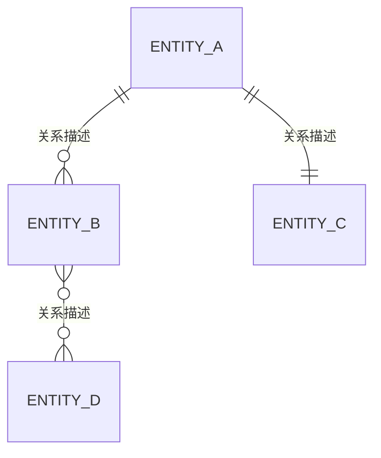
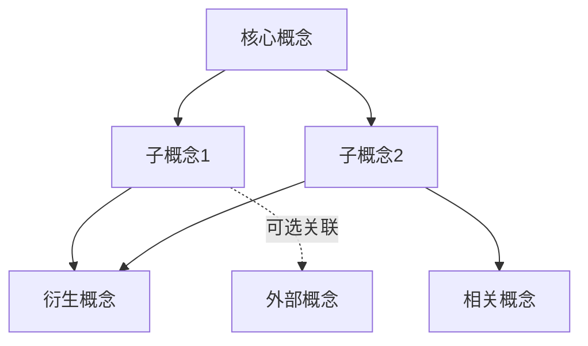
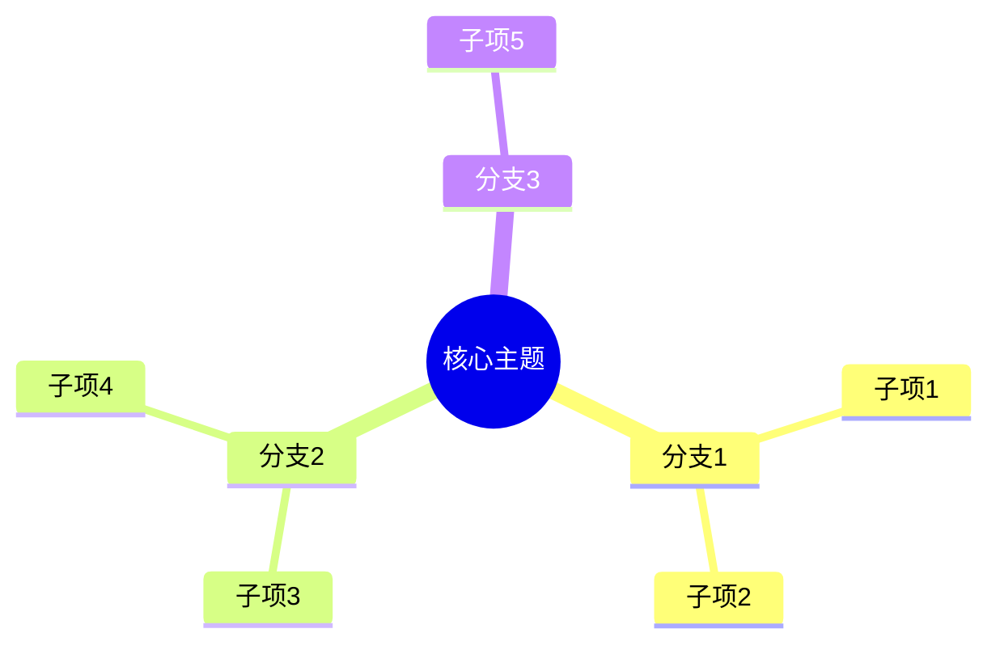

# T2 知识图谱：[图谱名称]

> 创建日期：YYYY-MM-DD | 最后更新：YYYY-MM-DD | 版本：v1.0
> 领域：[领域分类] | 用途：[用途简述]

---

## 1. 图谱概览

本图谱覆盖 **[主题名称]** 的核心概念与关系，共包含 **N 个实体** 和 **M 种关系类型**。

- **目标读者**：[谁需要阅读这份图谱]
- **覆盖范围**：[图谱的边界，包含什么、不包含什么]
- **前置知识**：[阅读前需要理解的基础概念]
- **核心问题**：[这份图谱主要回答什么问题]

---

## 2. 实体定义

| 实体名称 | 类型 | 定义 | 关键特征 |
|---------|------|------|---------|
| [EntityA] | 概念/角色/组件 | 一句话清晰定义 | 最重要的 1-2 个特征 |
| [EntityB] | 概念/角色/组件 | 一句话清晰定义 | 最重要的 1-2 个特征 |

**编写指引：**
- 每个实体必须有唯一、清晰的定义，避免循环引用或模糊描述
- "类型"字段统一使用：概念、角色、组件、流程、工具 五类之一
- 按重要程度排序，核心实体放在前面

---

## 3. 关系模型

### 3.1 关系类型

| 关系 | 源实体 | 目标实体 | 基数 | 语义说明 |
|------|--------|----------|------|---------|
| [关系名] | [A] | [B] | 1:N / M:N / 1:1 | A 和 B 之间是什么关系 |

### 3.2 ER 图

**编写指引：**
- 基数符号：`||` 一对一、`|{` 一对多、`}{` 多对多、`||--o{` 一对零到多
- 每个关系必须有语义说明，解释"为什么存在这个关系"
- 先列直接关系，再列间接/派生关系

---

## 4. 属性映射

### 4.1 实体属性

| 实体 | 属性名 | 类型 | 必填 | 说明 |
|------|--------|------|------|------|
| [EntityA] | id | String | 是 | 唯一标识 |
| [EntityA] | name | String | 是 | 显示名称 |
| [EntityB] | status | Enum | 否 | 状态值 |

### 4.2 属性依赖

- `[属性X]` 的值取决于 `[属性Y]` 的状态
- 当 `[条件]` 满足时，`[属性Z]` 必须为某个特定值

---

## 5. 可视化图谱

### 5.1 概念关系图

### 5.2 思维导图

**编写指引：**
- `graph TD` 适合展示因果链、流程依赖、层次结构
- `mindmap` 适合快速浏览概念全貌
- `erDiagram` 适合精确的实体关系建模
- 节点命名要简洁，详细解释放在正文中

---

## 6. 应用场景

| 场景 | 描述 | 涉及实体 | 关键路径 |
|------|------|---------|---------|
| [场景1] | 什么情况下需要用到这份图谱 | EntityA, B | A → B → C |
| [场景2] | 什么情况下需要用到这份图谱 | EntityC, D | C → D |

---

## 7. 扩展阅读

- [相关图谱名称](链接) — 与本图谱的关系说明
- [官方文档](链接) — 权威参考来源
- [经典文章/论文](链接) — 深度理解某个子领域

---

## 8. 附录：完整引用列表

| # | 引用 | 类型 | 日期 | 备注 |
|---|------|------|------|------|
| 1 | [来源名称](URL) | 文档/论文/视频 | YYYY-MM-DD | 一句话说明引用了什么 |
| 2 | [来源名称](URL) | 文档/论文/视频 | YYYY-MM-DD | 一句话说明引用了什么 |
