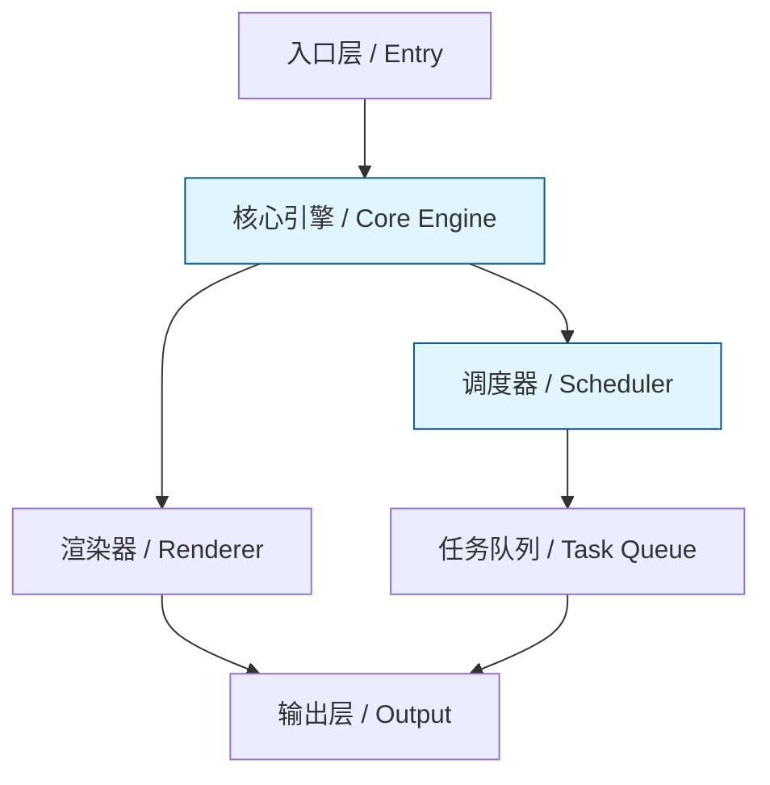
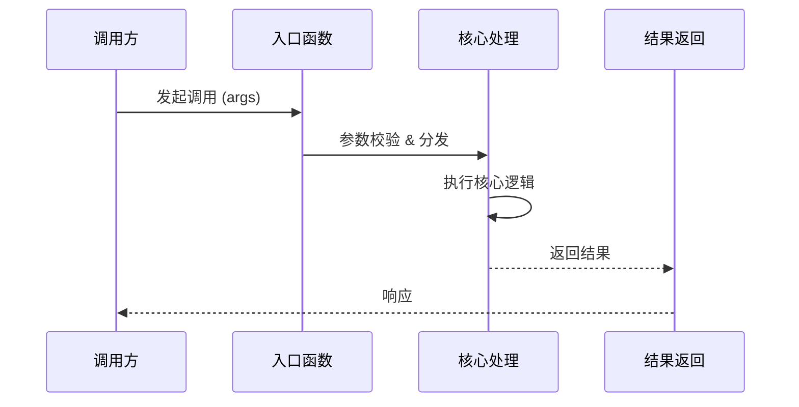

# T4 深度解析：{技术/框架/模块名称}

> **深度等级**：T4 — 源码级深度分析
> **分析日期**：YYYY-MM-DD
> **源码版本**：vX.Y.Z
> **官方文档**：URL

---

## 1. 架构总览

**写作要点**：用一段话概括整体设计目标与核心思想，说明模块边界与职责划分。

> 示例：{技术名} 采用 {模式名称} 架构，将 {职责A} 与 {职责B} 分离，通过 {通信机制} 协调。



**关键考虑**：
- 图中必须标注数据流向（箭头方向）
- 用不同颜色区分核心组件与辅助组件
- 标注外部依赖与边界

---

## 2. 核心数据结构

**写作要点**：列出驱动整个系统运转的关键类型、接口、状态模型，说明"为什么这样设计"。

| 名称 | 类型 | 所在文件 | 行号 | 职责 |
|------|------|----------|------|------|
| {TypeName} | interface/type/struct | `path/to/file.ts` | L123 | 简述职责 |
| {StateModel} | enum/class | `path/to/file.ts` | L456 | 简述职责 |

**关键考虑**：
- 每个数据结构必须附带源码片段（不超过 15 行）
- 解释字段设计的取舍（为什么用 Map 不用 Array 等）
- 标注状态机转换关系（如适用）

---

## 3. 关键流程拆解

**写作要点**：选取 1-3 条核心路径，逐步拆解从入口到出口的完整执行流程。



**关键考虑**：
- 每个步骤标注对应的源码文件和行号（如 `core.ts:L78`）
- 标注分支条件和异常路径
- 涉及异步操作时标注 Promise/Fiber/Coroutine 调度点

---

## 4. 源码级分析

**写作要点**：深入具体文件，引用关键代码段，解释"这段代码为什么这样写"。

### 4.1 {子模块/文件名称}

- **文件路径**：`path/to/source/file.ts`
- **核心函数**：`functionName()` (L100-L150)

```typescript
// 粘贴关键实现代码（5-15 行），不要粘贴整个文件
```

**分析**：
1. 这段代码解决了什么问题？
2. 用了什么设计模式或技巧？
3. 有没有 trade-off？（性能 vs 可读性、灵活性等）

**关键考虑**：
- 每个子模块独立一小节
- 行号必须与实际源码一致，方便读者跳转验证
- 不只描述"做了什么"，重点解释"为什么这样做"

---

## 5. 性能分析

**写作要点**：基于实际测量数据，分析时间复杂度、空间复杂度、瓶颈点。

| 场景 | 输入规模 | 耗时 | 内存 | 瓶颈位置 |
|------|----------|------|------|----------|
| {场景A} | N=1000 | X ms | Y MB | `file.ts:L200` |
| {场景B} | N=10000 | X ms | Y MB | `file.ts:L300` |

**关键考虑**：
- 数据必须来自真实 benchmark 或 profiling，不估算
- 标注测试环境（CPU、内存、Node 版本等）
- 指出已知的优化空间和已实施的优化手段

---

## 6. 扩展机制

**写作要点**：说明系统如何被扩展、定制、插件化，列出官方扩展点。

| 扩展点 | 类型 | 用法 | 源码位置 |
|--------|------|------|----------|
| {Hook/Plugin API} | 函数/接口 | 简述用法 | `file.ts:L50` |

**关键考虑**：
- 区分官方支持的扩展点和 hack 手段
- 给出完整的扩展示例代码
- 说明扩展的生命周期和限制

---

## 7. 设计哲学

**写作要点**：提炼设计者的核心理念，说明关键取舍及其背后的原因。

- **设计原则**：{原则一}、{原则二}
- **关键取舍**：选择 A 而非 B，因为 {原因}
- **历史演进**：v1 采用 {方案X}，v2 改为 {方案Y}，因为 {驱动因素}

**关键考虑**：
- 引用官方 RFC、Issue 讨论、设计文档作为依据
- 区分"官方声明的设计意图"和"分析者的推断"
- 指出哪些设计是历史包袱，哪些是刻意为之

---

## 8. 附录：完整引用列表

| # | 类型 | 标题 | 链接 | 说明 |
|---|------|------|------|------|
| 1 | 源码 | {文件名} | GitHub Permalink | 核心实现 |
| 2 | 文档 | {官方文档页} | URL | API 参考 |
| 3 | RFC/Issue | #{编号} | GitHub URL | 设计讨论 |
| 4 | 文章 | {博客/论文} | URL | 延伸阅读 |

**关键考虑**：
- 源码引用使用 Permalink（带 commit hash），不用 branch 链接
- 按引用频率排序，最重要的放前面
- 每个引用标注"为什么引用它"
