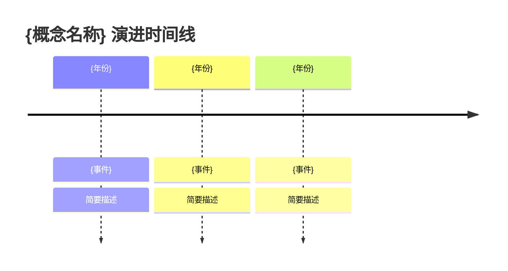

# T7 概念解析：{概念/范式/理论名称}

> **深度等级**：T7 — 纯理论与设计哲学
> **分析日期**：YYYY-MM-DD
> **概念版本/成熟度**：{如：RFC 阶段 / 已标准化 / 学术理论}
> **相关文档**：URL（官方论文、规范、白皮书等）

---

## 1. 定义与起源

**写作要点**：用一句话精准定义概念，追溯其来源与诞生背景。

> **定义**：{一句话定义，避免模糊词汇}
> **起源**：{首次提出的时间、人物、论文/演讲名称}
> **动机**：{当时要解决什么问题？现有方案有什么缺陷？}

**关键考虑**：
- 引用原始出处（论文标题、RFC 编号、首次演讲链接）
- 区分"原始定义"与"后来的衍生理解"
- 说明该概念在更大知识体系中的位置

---

## 2. 核心原则

**写作要点**：列出构成该概念基石的公理、原则或设计信条。

| # | 原则名称 | 一句话描述 | 出处/依据 |
|---|----------|-----------|-----------|
| 1 | {原则名} | 简洁描述 | {论文/规范章节} |
| 2 | {原则名} | 简洁描述 | {论文/规范章节} |

**关键考虑**：
- 每条原则必须可追溯至原始文献或权威来源
- 区分"本质原则"与"推导出的规则"
- 原则之间是否独立？是否存在隐含依赖？

---

## 3. 演进历史

**写作要点**：梳理概念从诞生到现状的关键里程碑与范式转移。



**关键阶段**：

| 阶段 | 时间 | 标志性事件 | 范式变化 |
|------|------|-----------|----------|
| 萌芽期 | {年份} | {事件} | {描述} |
| 成型期 | {年份} | {事件} | {描述} |
| 成熟期 | {年份} | {事件} | {描述} |

**关键考虑**：
- 标注每次范式转移的驱动因素（技术瓶颈？新需求？）
- 引用关键论文/演讲/开源项目的发布时间
- 说明哪些旧观点被推翻、为什么

---

## 4. 范式对比

**写作要点**：与相近或竞争范式进行多维度对比，突出本质差异。

| 维度 | {本概念} | {对比范式 A} | {对比范式 B} |
|------|----------|-------------|-------------|
| 核心抽象 | {描述} | {描述} | {描述} |
| 适用场景 | {描述} | {描述} | {描述} |
| 学习曲线 | 高/中/低 | 高/中/低 | 高/中/低 |
| 性能特征 | {描述} | {描述} | {描述} |
| 生态系统 | {描述} | {描述} | {描述} |

```mermaid
flowchart LR
    A[{本概念}] -. "共享" .-> B[{关联概念}]
    A -. "对立" .-> C[{对立范式}]
    B -. "衍生" .-> D[{下游概念}]
```

**关键考虑**：
- 对比维度必须触及本质差异，不比较表面特性
- 承认各范式的优势，不做非黑即白的判断
- 引用各范式支持者的原始论述，不曲解

---

## 5. 应用场景

**写作要点**：明确"适合用"和"不适合用"的边界条件。

### 适用场景

- **场景一**：{描述} — 因为 {该概念提供了什么优势}
- **场景二**：{描述} — 因为 {该概念解决了什么痛点}

### 不适用场景

- **场景一**：{描述} — 因为 {该概念在此场景的劣势}
- **场景二**：{描述} — 因为 {存在更合适的替代方案}

**关键考虑**：
- "不适用"与"适用"同等重要，必须明确列出
- 每个场景附带真实案例或典型项目
- 区分"理论上可行"与"实践中推荐"

---

## 6. 反模式

**写作要点**：收集最常见的误解、误用和错误实践。

| # | 反模式 | 错误理解 | 正确理解 | 后果 |
|---|--------|---------|---------|------|
| 1 | {名称} | 人们以为... | 实际上是... | {危害} |
| 2 | {名称} | 人们以为... | 实际上是... | {危害} |

**关键考虑**：
- 反模式必须来自真实社区讨论、Issue、博客批评
- 解释"为什么人们会这样误解"（表面相似？命名误导？）
- 给出反例代码/设计的修正方案

---

## 7. 延伸阅读

**写作要点**：按深度递进排列的学习路径，从入门到精通。

### 必读文献

| # | 类型 | 标题 | 作者 | 年份 | 为什么必读 |
|---|------|------|------|------|-----------|
| 1 | 论文 | {标题} | {作者} | {年} | {理由} |
| 2 | 书籍 | {书名} | {作者} | {年} | {理由} |

### 关键人物与组织

- **{人物名}**：{贡献概述}，代表作/演讲：{链接}
- **{组织名}**：{在该领域的角色}

### 关联概念

- **{概念 A}**：与本概念的关系（上游/下游/对立/互补）
- **{概念 B}**：与本概念的关系

**关键考虑**：
- 优先引用一手资料（论文、原始演讲），而非二手解读
- 标注每篇文献的阅读难度
- 关联概念注明关系类型

---

## 8. 附录：完整引用列表

| # | 类型 | 完整标题 | 链接 | 在本文中的用途 |
|---|------|---------|------|---------------|
| 1 | 论文 | {标题} | DOI/URL | {定义了 X 概念} |
| 2 | 规范 | {规范名 §章节} | URL | {核心原则来源} |
| 3 | 演讲 | {演讲标题} | 视频URL | {演进阶段引用} |
| 4 | 书籍 | {书名 第X章} | ISBN | {延伸阅读推荐} |
| 5 | 社区 | {博客/Issue/Discussion} | URL | {反模式来源} |

**关键考虑**：
- 使用永久链接（DOI、RFC 编号、存档链接）
- 标注每项引用在正文中支撑了哪个论点
- 区分"一手来源"与"二手解读"
