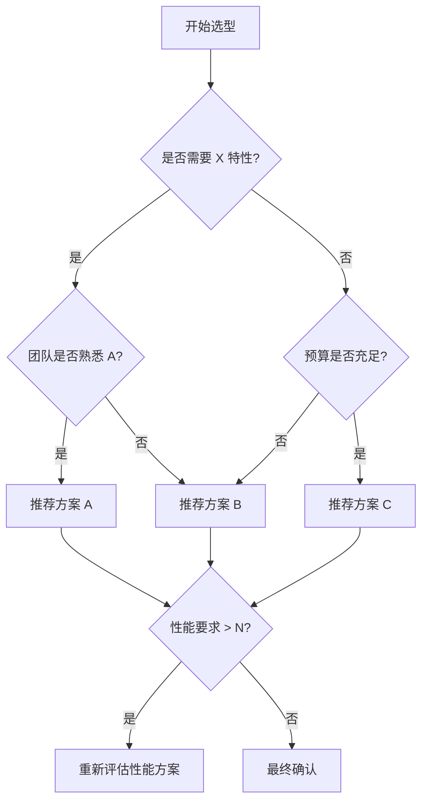

# T9 对比分析 — 模板

> 适用场景：技术选型对比、迁移决策、方案评估
> 核心原则：客观、数据驱动、无偏见

---

## 1. 对比对象

**分析目的**：一句话说明为什么要做这次对比（例："在 X 场景下评估 A 与 B 的优劣"）。

| 字段 | 方案 A | 方案 B | 方案 C（可选） |
|---|---|---|---|
| 名称与版本 | | | |
| 核心定位 | | | |
| 分析范围 | | | |
| 排除范围 | | | |

**注意**：明确版本号和测试环境，避免跨版本不公平比较。

---

## 2. 维度矩阵

| 维度 | 方案 A | 方案 B | 方案 C | 权重 |
|---|---|---|---|---|
| 性能 | | | | 高/中/低 |
| 学习曲线 | | | | |
| 生态完整性 | | | | |
| 社区活跃度 | | | | |
| 维护成本 | | | | |
| 成熟度/稳定性 | | | | |
| 安全风险 | | | | |
| 许可协议 | | | | |

**填写要求**：
- 每个单元格必须附数据来源或测试方法（链接/基准测试命令/版本号）
- 避免主观形容词，使用可量化指标（如 "QPS: 1200" 而非 "快"）

---

## 3. 场景匹配

| 场景描述 | 推荐方案 | 推荐理由 | 不适用原因 |
|---|---|---|---|
| 场景 1： | | | |
| 场景 2： | | | |

**注意**：同一方案在不同场景下可能优劣互换，按场景分别论证。

---

## 4. 迁移指南（A → B）

仅在确定需要切换时使用，按阶段拆分：

### 4.1 评估阶段
- [ ] 兼容性检查清单
- [ ] 数据/配置迁移风险点

### 4.2 过渡阶段
- [ ] 灰度切换策略
- [ ] 回滚方案与触发条件

### 4.3 完成阶段
- [ ] 验证测试项
- [ ] 旧方案清理步骤

---

## 5. 决策树

**说明**：每个判断节点标注阈值或条件，读者可沿路径得出结论。

---

## 6. 推荐方案

| 项目 | 内容 |
|---|---|
| 最终推荐 | |
| 适用前提 | |
| 不适用场景 | |
| 风险提示 | |
| 评估日期 | |
| 下次复审时间 | |

**注意**：推荐必须基于前文维度矩阵和场景分析得出，不可脱离数据单独给出结论。

---

## 附录：引用列表

1. 官方文档：
2. 基准测试：
3. 社区讨论/Issue：
4. 第三方评测：
