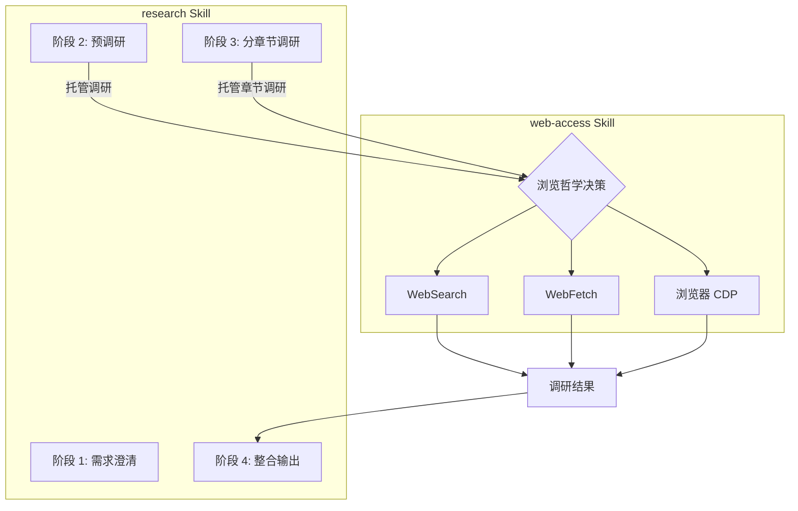

# web-access 集成指南

> research Skill 调用 web-access 进行调研的详细规范

**版本：** 1.0.0 | **更新：** 2026-04-07

---

## 集成架构



---

## 调用模式

### 模式 A：完全托管（推荐）

将调研子任务完全托管给 `web-access`，由其自主决策使用哪种工具。

**适用场景：**
- 预调研阶段（阶段 2）
- 章节调研（阶段 3）
- 需要登录态或动态渲染的内容

**调用方式：**

```markdown
请加载 `web-access` Skill，执行以下调研任务：

**调研目标：** [具体主题或章节]
**关注点：**
- [关注点 1]
- [关注点 2]

**输出要求：**
1. 核心概念定义（官方来源优先）
2. 工作原理/机制说明
3. 代码示例（如有）
4. 常见误区/最佳实践
5. 来源列表（标注 URL 和类型）

**请遵循 web-access 的浏览哲学：**
- 先明确目标，再选择起点
- 过程校验，发现方向不对立即调整
- 优先获取一手来源（官方文档 > 技术博客 > 源码 > 视频）
- 需要登录态或动态渲染时使用 CDP 模式
```

**web-access 自主决策逻辑：**

| 目标类型 | 自主选择 |
|----------|----------|
| 搜索摘要/发现来源 | WebSearch |
| 已知 URL，提取正文 | WebFetch + Jina |
| 已知 URL，需要原始 HTML | curl |
| 需要登录态 | CDP |
| 动态渲染页面（SPA） | CDP |
| 社交媒体（小红书/公众号等） | CDP |

---

### 模式 B：定向调用

根据调研内容类型，明确指定 web-access 使用特定工具。

**适用场景：**
- 已知目标 URL 且确定访问方式
- 需要特定格式的输出（如 Markdown 正文、原始 HTML）

**调用方式：**

```markdown
请加载 `web-access` Skill，使用 [WebFetch/CDP] 访问以下 URL：

**URL：** [完整 URL]
**提取目标：** [具体内容，如"API 列表"、"配置选项表格"]
**输出格式：** [Markdown 正文/原始 HTML/提取摘要]
```

---

## 阶段集成详解

### 阶段 2：预调研

**目标：** 快速了解主题概貌，推荐存储位置，生成调研大纲

**web-access 调用：**

```markdown
@web-access 请执行预调研：

**主题：** [主题名称]

**调研目标：**
1. 确认 [主题] 的核心定义和范畴
2. 发现 3-5 个高质量来源（优先官方文档）
3. 了解 [主题] 的主要知识模块

**请输出：**
- 主题概述（100 字内）
- 核心概念列表（5-8 个）
- 来源列表（标注类型：官方文档/技术博客/源码等）
```

**调研结果用于：**
- 生成位置推荐（基于主题分类）
- 生成 8 章调研大纲
- 评估主题复杂度（决定是否推荐 SubAgent）

---

### 阶段 3：分章节调研

**目标：** 深入调研每个章节，生成详细内容

#### 标准模式（<6 章）

逐章调用 `web-access`：

```markdown
@web-access 请调研以下章节内容：

**章节：** 第 X 章 - [章节标题]

**调研目标：**
1. [目标 1]
2. [目标 2]

**深度要求：**
- 概念定义：准确简洁，引用官方
- 工作原理：深入底层机制，可绘制 Mermaid 图
- 代码示例：完整可运行，含注释
- 常见误区：开发者易错点

**来源要求：**
- 至少 3-5 个来源交叉验证
- 优先一手来源（官方文档/源码）
- 标注每个信息来源的 URL

**输出格式：** Markdown 章节草稿
```

#### SubAgent 模式（≥6 章）

使用 `parallel-task` Skill 分发章节：

```markdown
@parallel-task 请启动 SubAgent 并行调研：

**任务分组：**
- 组 A（基础章）：第 1-3 章
- 组 B（核心章）：第 4-6 章
- 组 C（收尾章）：第 7-8 章

**每个 SubAgent 的 Prompt：**
"请加载 web-access Skill，调研 [章节主题]。
调研要求：[同上章节调研要求]"

**协调要求：**
- 每个 SubAgent 独立使用 web-access 调研
- 草稿保存到 .work/[主题]/drafts/chapter-X.md
- 完成后通知主 Agent 整合
```

---

## 特殊站点调研

### 社交媒体（小红书/微博/公众号）

**特征：** 需要登录态、反爬严格、动态渲染

**调用方式：**

```markdown
@web-access 请调研小红书/微信公众号上的相关内容：

**搜索关键词：** [关键词]
**目标内容：** [如"使用教程"、"踩坑分享"、"最佳实践"]

**请按 web-access 的浏览哲学：**
1. 先明确目标（获取教程内容）
2. 选择起点（CDP 直接访问，跳过静态层）
3. 过程校验（内容不够则深入更多笔记）
4. 完成判断（获取足够信息后停止）

**输出：**
- 精选笔记/文章列表（3-5 篇）
- 核心要点提取
- 来源 URL（便于后续查证）
```

### 官方文档

**特征：** 公开、结构清晰、一手来源

**调用方式：**

```markdown
@web-access 请调研官方文档：

**文档 URL：** [官方文档首页]
**调研目标：**
- 核心概念定义
- API/配置选项
- 最佳实践

**请使用 WebFetch 或 CDP（如需导航）获取内容**
```

### 动态渲染页面（SPA）

**特征：** 内容需 JS 执行后加载、URL 可能含会话参数

**调用方式：**

```markdown
@web-access 请调研以下 SPA 应用：

**入口 URL：** [URL]
**目标内容：** [如"API 文档"、"配置面板"]

**请注意：**
- 使用 CDP 模式，确保 JS 正常执行
- 如需交互（点击/展开）请像人一样操作
- 滚动到底部触发懒加载
- 提取内容时注意 Shadow DOM 和 iframe 边界
```

---

## 来源验证

### 一手来源优先级

| 类型 | 优先级 | 示例 |
|------|--------|------|
| 官方文档 | P0 | react.dev, nextjs.org/docs |
| 官方源码 | P0 | GitHub 官方仓库 |
| 核心团队博客 | P1 | 官方博客、团队成员技术博客 |
| 社区优质内容 | P2 | 高星 GitHub 项目、知名开发者博客 |
| 视频教程 | P3 | 官方视频、高质量教程 |

### 交叉验证规则

- **单一来源**：必须标注"仅单一来源，建议后续验证"
- **来源冲突**：标注冲突点，分析原因（版本差异？平台特定？）
- **信息过时**：检查发布时间，标注"可能过时，最新版本需验证"

---

## CDP 模式注意事项

### 启动前检查

```bash
node "$CLAUDE_SKILL_DIR/scripts/check-deps.mjs"
```

**检查项：**
- Node.js 22+（推荐）
- Chrome 远程调试端口（9222）
- CDP Proxy 运行状态

### 风险提示

```
温馨提示：部分站点对浏览器自动化操作检测严格，存在账号封禁风险。
已内置防护措施但无法完全避免，Agent 继续操作即视为接受。
```

### 最佳实践

1. **最小侵入**：不操作用户已有 tab，所有操作在后台 tab 进行
2. **任务结束清理**：关闭自己创建的 tab，保留用户环境
3. **登录判断**：只有确认目标内容无法获取时才要求用户登录
4. **避免密集操作**：短时间密集打开大量页面可能触发反爬

---

## 输出整合

### 章节草稿格式

```markdown
# 第 X 章 - [章节标题]

## X.1 [小节标题]

**定义：** [概念定义]

**工作原理：**
[原理说明，可包含 Mermaid 图]

**示例：**
```js
// 代码示例
```

**常见误区：**
- [误区 1]
- [误区 2]

---

## 引用来源

| 编号 | 类型 | 标题 | URL | 查阅时间 |
|------|------|------|-----|----------|
| #1 | 官方文档 | React Docs | https://react.dev/... | 2026-04-07 |
```

### 来源汇总（sources.json）

```json
{
  "chapter": "第 X 章",
  "sources": [
    {
      "id": 1,
      "type": "官方文档",
      "title": "...",
      "url": "...",
      "accessedAt": "2026-04-07T10:00:00Z",
      "usedFor": ["概念定义", "API 说明"]
    }
  ]
}
```

---

## 检查清单

### 调用前检查

- [ ] 已明确调研目标和关注点
- [ ] 已指定输出格式要求
- [ ] 已说明来源优先级
- [ ] 特殊站点已标注（如需 CDP）

### 输出检查

- [ ] 包含概念定义 + 工作原理 + 示例 + 误区
- [ ] 来源列表完整（至少 3-5 个）
- [ ] 标注每个来源的类型和 URL
- [ ] 一手来源优先（官方文档/源码）
- [ ] 冲突信息已标注并分析

### CDP 专项检查

- [ ] 已执行启动前检查
- [ ] 已告知用户风险
- [ ] 操作在后台 tab 进行
- [ ] 任务结束关闭创建的 tab
- [ ] 未操作用户已有 tab

---

## 示例：完整调研流程

### 场景：调研 Taro 框架

**阶段 2 预调研：**

```markdown
@web-access 请执行 Taro 框架预调研：

**调研目标：**
1. 确认 Taro 的核心定义和适用场景
2. 发现官方文档和主要社区资源
3. 了解 Taro 的主要知识模块

**输出：** 主题概述 + 核心概念列表 + 来源列表
```

**阶段 3 章节调研（以第 2 章为例）：**

```markdown
@web-access 请调研 Taro 核心概念：

**章节：** 第 2 章 - 核心概念

**调研目标：**
- 跨端开发原理
- 组件化设计
- 状态管理方案
- 路由机制

**深度要求：** L4 专家级（定义 + 原理 + 示例 + 误区）

**来源要求：**
- 官方文档（taro-docs.jd.com）
- GitHub 源码
- 社区最佳实践

**输出：** Markdown 章节草稿，包含 Mermaid 架构图
```

---

*资源版本：1.0.0 | research Skill v10.0.0+*
