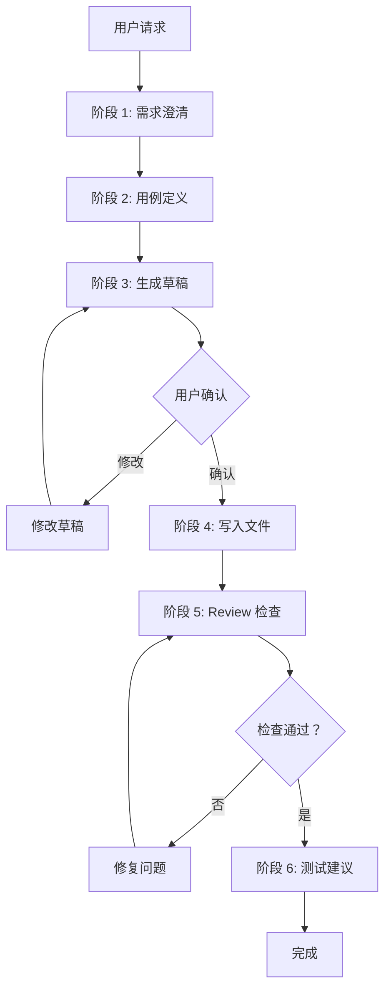

# Skill Creator 工作流程详解

> 完整的 6 阶段工作流程说明

**版本：** 1.0.0 | **更新：** 2026-03-30

---

## 流程概览



---

## 阶段 1：需求澄清

### 目标
通过结构化问答收集 Skill 创建的核心需求

### 5 个关键问题

| 问题 | 目的 | 示例选项 |
|------|------|----------|
| 1. 主要用途 | 确定 Skill 类型 | 代码审查、文档生成 |
| 2. 触发方式 | 配置调用方式 | 显式/隐式/两者 |
| 3. 使用者 | 确定作用域 | 个人/团队 |
| 4. 外部工具 | 确定权限需求 | 脚本执行、API 调用 |
| 5. 输出格式 | 确定交付物 | Markdown、代码、JSON |

### 类型推荐逻辑

```
if 用途 contains "内部库" or "API":
    return "库和 API 参考"
elif 用途 contains "测试" or "验证":
    return "产品验证"
elif 用途 contains "查询" or "报表":
    return "数据获取与分析"
elif 用途 contains "生成代码":
    return "代码生成"
elif 用途 contains "文档":
    return "文档生成"
elif 用途 contains "审查" or "检查":
    return "代码审查"
elif 用途 contains "部署" or "发布":
    return "部署流程"
elif 用途 contains "规范" or "风格":
    return "团队规范"
elif 用途 contains "调研" or "整理":
    return "调研整理"
```

---

## 阶段 2：用例定义

### 2.1 收集具体用例

**数量要求：** 至少 2-3 个具体用例

**用例格式：**
```markdown
**用例名称：** [简短描述]
- **触发条件：** 用户说什么/做什么
- **执行步骤：** 1 → 2 → 3
- **预期结果：** 输出格式和内容
```

### 2.2 确认触发方式

**显式命令命名规则：**
- 格式：`/skill-name`
- 使用英文连字符
- 示例：`/code-review`、`/research`

**隐式触发词配置：**
- 数量：3-5 个中文触发词
- 包含同义词、常见说法
- 示例：`[调研，研究，整理资料，帮我调研]`

### 2.3 确认文件结构

**标准目录结构：**
```
skill-name/
├── SKILL.md              # 必需：核心指令
├── templates/            # 可选：模板文件
├── references/           # 可选：参考文档
├── scripts/              # 可选：可执行脚本
└── checklists/           # 可选：检查清单
```

---

## 阶段 3：生成草稿

### 3.1 加载模板

根据阶段 1 确定的类型，从 `templates/` 目录加载对应模板：

| 类型 | 模板文件 |
|------|----------|
| 库和 API 参考 | `library-reference.md` |
| 产品验证 | `product-verification.md` |
| 数据获取与分析 | `data-analysis.md` |
| 代码生成 | `code-generation.md` |
| 文档生成 | `doc-generation.md` |
| 代码审查 | `code-review.md` |
| 部署流程 | `deployment.md` |
| 团队规范 | `team-norms.md` |
| 调研整理 | `research.md` |

### 3.2 填充内容

将阶段 2 收集的信息填入模板：
- 用例描述 → 示例章节
- 触发方式 → Frontmatter
- 文件结构 → 资源索引

### 3.3 输出草稿预览

**Diff 格式输出：**
```markdown
## Skill 草稿预览（变更摘要）

### 变更项
- **Frontmatter:** 新增/修改的字段
- **核心原则:** 新增的原则
- **工作流程:** 修改的步骤
- **输出规范:** 更新的内容

### 完整内容
详见输出位置或说"显示完整草稿"。
```

---

## 阶段 4：写入文件

### 4.1 确认输出位置

**默认路径：** `.claude/skills/[skill-name]/`

**全局路径：** `~/.claude/skills/[skill-name]/`（跨项目使用）

### 4.2 创建目录结构

```bash
mkdir -p .claude/skills/[skill-name]/{templates,references,scripts,checklists}
```

### 4.3 写入文件

使用 Write 工具写入：
1. SKILL.md（主文档）
2. 模板文件（如适用）
3. 参考文档（如适用）
4. 检查清单（如适用）

---

## 阶段 5：Review 检查

### 执行检查清单

加载 `checklists/creation-checklist.md` 逐项检查：

**必须项（不满足不能发布）：**
- [ ] YAML Frontmatter 格式正确
- [ ] description 清晰具体（100 词内）
- [ ] 包含可执行的工作流程
- [ ] 配置了显式触发命令
- [ ] 配置了隐式触发词（3-5 个）
- [ ] 没有陈述显而易见的内容
- [ ] 用户已确认草稿

### 问题修复

| 问题 | 修复方式 |
|------|----------|
| Frontmatter 错误 | 修正 YAML 格式 |
| description 过长 | 精简至 100 词内 |
| 工作流程空泛 | 补充具体步骤 |
| 触发词不足 | 补充至 3-5 个 |

---

## 阶段 6：测试建议

### 生成测试用例

```markdown
## 测试建议

### 测试 1：显式触发
/[skill-name] [测试输入]

**预期：** Skill 正常响应并执行流程

### 测试 2：隐式触发
[触发词 1] [测试输入]

**预期：** 自动识别并触发 Skill

### 测试 3：边界情况
[边界场景描述]

**预期：** 正确处理边界情况
```

### 测试执行

用户执行测试用例，验证：
- 触发是否正常
- 流程是否正确
- 输出是否符合预期

---

## 修改流程（M1-M4）

### M1：读取
读取 `.claude/skills/[skill-name]/SKILL.md`

### M2：确认
询问用户需要修改的内容

### M3：生成预览
输出 Diff 格式变更摘要

### M4：写入
更新文件

---

## 优化流程（O1-O4）

### O1：读取
读取当前 Skill 文件

### O2：分析
检查维度：
- 主文档行数（> 500 行需精简）
- 重复内容
- 可移至 references/的内容
- 目录结构符合性

### O3：生成方案
输出优化计划：
```markdown
## 优化方案

### 当前问题
- 主文档过长：[X] 行
- 重复内容：[具体内容]

### 优化计划
1. 精简主文档至 500 行内
2. 移动 [内容] 至 references/
3. 创建 [目录]
```

### O4：执行
按确认的方案执行优化

---

*参考文档版本：1.0.0 | skill-creator Skill v3.0.0+*
