# 上下文工程（Context Engineering）核心知识体系

> 系统化设计、组织和管理 LLM 上下文信息的技术体系 | **特色：** 从 Prompt Engineering 到 Context Engineering 的范式转移

---

## 目录

1. [概述 — 定义、本质与范式转移](#1-概述--定义本质与范式转移)
2. [核心概念 — 上下文窗口、记忆系统与 Token 管理](#2-核心概念--上下文窗口记忆系统与-token-管理)
3. [技术演进 — 四次飞跃与历史发展](#3-技术演进--四次飞跃与历史发展)
4. [六大支柱 — 结构化、检索、压缩、编排、评估、安全](#4-六大支柱--结构化检索压缩编排评估安全)
5. [核心组件 — Prompt、Skills、MCP、A2A 与记忆架构](#5-核心组件--promptskillsmcpa2a-与记忆架构)
6. [实战架构 — Agentic RAG、Graph RAG 与上下文引擎](#6-实战架构--agentic-raggraph-rag-与上下文引擎)
7. [工具生态 — 向量数据库、LangChain 与评估观测](#7-工具生态--向量数据库 langchain-与评估观测)
8. [常见问题与最佳实践](#8-常见问题与最佳实践)
9. [学习资源与未来趋势](#9-学习资源与未来趋势)

---

## 1. 概述 — 定义、本质与范式转移

### 1.1 核心定义

**上下文工程（Context Engineering）** 是指系统化地设计、组织和优化输入到大语言模型（LLM）中的上下文信息的技术体系。这些上下文信息包括：
- 提示词（Prompts）
- 历史对话记录
- 外部知识库检索内容
- 工具调用结果
- 系统指令与规则
- 状态与记忆数据

**本质：** 通过控制输入上下文的质量、结构和顺序，弥补 LLM 在长对话中的注意力分散、知识遗忘等局限，实现更可靠的智能体决策。

### 1.2 为什么需要上下文工程？

LLM 存在以下天然局限：

| 局限 | 表现 | 上下文工程的解决方案 |
|------|------|---------------------|
| **上下文窗口有限** | 模型一次只能处理有限 token（如 200K） | 精准筛选、动态管理、按需加载 |
| **注意力稀释** | 长文本中关键信息易被忽略 | 结构化组织、重排序、压缩 |
| **知识截止** | 训练数据有边界，无法感知训练后事件 | RAG 外挂知识库 |
| **幻觉问题** | 不确定时倾向于编造答案 | 提供真实依据，约束生成范围 |
| **记忆缺失** | 跨会话无法保持连贯性 | 分层记忆系统（L1/L2/L3） |

### 1.3 Context Engineering vs Prompt Engineering

这是两个不同层级的概念：

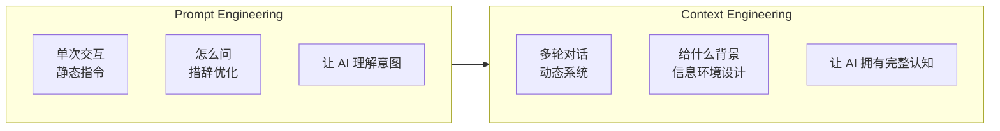

**核心差异对比表：**

| 维度 | Prompt Engineering | Context Engineering |
|------|-------------------|---------------------|
| **关注点** | 单次提示词的质量 | 整个信息环境的设计 |
| **时间维度** | 静态、一次性 | 动态、持续性 |
| **信息范围** | 单条指令/问题 | 系统指令 + 历史 + 工具 + 记忆 + RAG |
| **目标** | 让 AI"听得懂" | 让 AI"记得住、查得到、做得对" |
| **适用场景** | 简单问答、单次任务 | AI Agent、复杂多轮任务、企业级应用 |
| **工程复杂度** | 低（个人技能） | 高（系统工程） |

### 1.4 权威观点

**Andrej Karpathy（前 OpenAI 研究员）：**
> "人们现在常用'prompt engineering'这个词，但其实在真正工业级的 LLM 应用中，更准确的叫法是'context engineering'。它是一门精细的艺术和科学——如何在每一步都给上下文窗口填入恰到好处的信息。"

**Harrison Chase（LangChain 创始人）：**
> "上下文工程是构建动态系统，在正确时间以正确格式提供正确信息和工具的工程学科。"

**Tobi Lütke（Shopify CEO）：**
> "Context Engineering 比 Prompt Engineering 更准确地描述了核心技能。"

### 1.5 范式转移：从 Prompt 到 Context 到 Harness

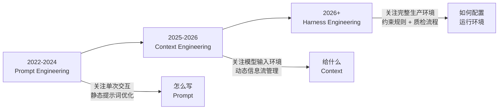

**Harness Engineering** 是 2026 年 OpenAI 内部实验提出的新概念，核心发现：
- 5 名工程师，5 个月，**零行手写代码**，通过 Codex Agent 交付**100 万行代码**的生产级产品
- 同一个模型，仅优化运行环境（文档结构、验证回路、追踪系统），SWE-bench 排名从**第 30 位跃升至第 5 位**
- 核心规律：**模型能力已不是主要瓶颈，围绕模型的工程设计才是决定因素**

### 1.6 本章小结

| 要点 | 说明 |
|------|------|
| **定义** | 系统化设计、组织和管理 LLM 上下文信息的技术体系 |
| **本质** | 控制输入上下文的质量、结构和顺序，弥补 LLM 局限 |
| **与 Prompt Engineering 的区别** | 单次交互 vs 多轮对话；静态指令 vs 动态系统 |
| **演进趋势** | Prompt Engineering → Context Engineering → Harness Engineering |
| **核心价值** | 从"选对模型"转向"设计好系统" |

---

*第 1 章完成 | 下一步：第 2 章 核心概念*

---

## 2. 核心概念 — 上下文窗口、记忆系统与 Token 管理

### 2.1 Token：LLM 的"阅读单位"

**定义：** Token 是模型处理文本的基本单位，可以是单个单词、单词的一部分（子词）、字符或标点符号。

**关键特性：**
- **中文估算：** 1 个 token ≈ 1-2 个汉字
- **英文估算：** 1 个 token ≈ 3/4 个单词
- **计费单位：** API 调用按 token 数量计费
- **处理单元：** 模型不能直接"阅读"文字，只能处理 token 转换后的数字 ID

**分词器（Tokenizer）工作原理：**
```
原始文本 → [Tokenizer] → Token 序列 → [Embedding] → 向量表示 → 模型推理

示例："Hello, world!" → ["Hello", ",", " world", "!"] → [15496, 11, 12520, 1]
```

**常见分词算法：**
| 算法 | 代表模型 | 特点 |
|------|---------|------|
| **BPE (Byte Pair Encoding)** | GPT 系列 | 基于数据压缩，合并最频繁的字节对 |
| **WordPiece** | BERT | 基于最大匹配，优先长词 |
| **SentencePiece** | T5、LLaMA | 无需预分词，直接处理原始文本 |

### 2.2 上下文窗口（Context Window）

**定义：** 模型在一次推理中能够考虑的最大 Token 数量，包含输入和输出的总和。

**类比理解：**
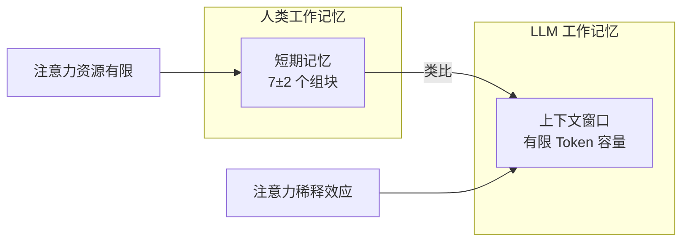

**主流模型上下文窗口对比（2025-2026）：**

| 模型 | 上下文窗口 | 约等于 |
|------|-----------|--------|
| GPT-3.5 | 4K - 16K | 3-12 页 A4 纸 |
| GPT-4 Turbo | 128K | ~10 万字 |
| Claude 3 | 200K | ~15 万字 |
| Gemini 2.5 Pro | 10M+ | 数本小说 |
| Llama 4 Scout | 10M+ | 数本小说 |

**核心挑战：注意力稀释（Attention Dilution）**

当上下文窗口中的 token 增加时，模型准确回忆信息的能力会下降：

```
场景对比：

小上下文（5K token）：
- 相关信息：200 token
- 信号占比：4%
- 结果：模型轻松锁定事实

大上下文（200K token）：
- 相关信息：200 token（同样的信息）
- 信号占比：0.1%
- 结果：计算资源被大量无关 token 消耗，分配给有用信号的权重削弱
```

**注意力稀释的数学机制：**
- LLM 必须把注意力分配到输入的**每一个** token 上
- 上下文规模一大，信噪比就下降
- 输出质量下滑：漏掉事实、给出错误答案、用幻觉填补空白

### 2.3 三层记忆系统

借鉴认知神经科学，LLM 应用采用分层记忆架构：

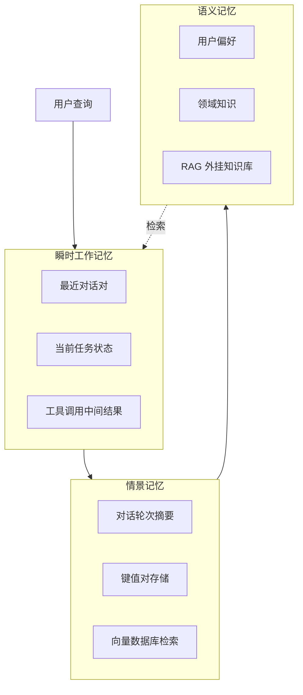

**各层详细说明：**

| 层级 | 名称 | 功能 | 实现方式 | 类比 |
|------|------|------|---------|------|
| **L1** | 工作记忆（Working Memory） | 暂存最近对话、当前任务状态 | 上下文窗口直接承载 | 人类短期记忆 |
| **L2** | 情景记忆（Episodic Memory） | 存储历史交互摘要供检索 | 向量数据库 + 对话摘要 | 人类经历记忆 |
| **L3** | 语义记忆（Semantic Memory） | 持久化领域知识与用户偏好 | RAG 外部知识库 | 人类知识体系 |

**记忆系统的工作流程：**
1. 用户发起查询 → 载入 L1 工作记忆（最近对话）
2. L2 情景记忆检索 → 查找相似历史对话摘要
3. L3 语义记忆检索 → RAG 获取相关领域知识
4. 整合 L1+L2+L3 → 构建完整上下文 → 送入 LLM 推理
5. 生成交互结果 → 更新三层记忆

### 2.4 RAG（检索增强生成）

**定义：** Retrieval-Augmented Generation，通过外挂知识库检索相关内容注入上下文，让 LLM 基于真实依据生成答案。

**核心思想：**
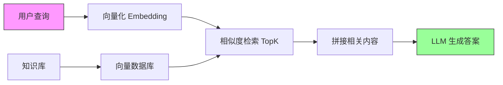

**RAG 为什么必要？**
- **知识截止：** 模型训练数据有时间边界
- **幻觉问题：** 不确定时倾向编造答案
- **私有数据：** 企业知识库无法直接训练
- **实时更新：** 训练后发生的事件模型不知道

**RAG 工作流程：**
```
离线阶段：
原始文档 → 解析 → 切块 (Chunking) → 向量化 (Embedding) → 存入向量数据库

在线阶段：
用户查询 → 向量化 → 检索 TopK 相似块 → 拼接上下文 → LLM 生成
```

### 2.5 上下文腐烂（Context Rot）

**定义：** 随着上下文窗口中 token 数量增加，无关上下文密度上升，注意力分配可靠性衰减的现象。

**两种架构级故障：**

**1. 注意力稀释（Attention Dilution）**
- 模型必须关注每一个 token
- 信号占比从 4% 降至 0.1%
- 分配给关键信息的权重被稀释

**2. 检索崩溃（Retrieval Collapse）**
- 噪声过多导致关键信息被淹没
- 模型"看到但忽略"关键内容
- 长文档中精准查找失败

**症状表现：**
- 漏掉上下文中明确给出的事实
- 给出与上下文矛盾的答案
- 用幻觉填补未能提取的信息空白

### 2.6 信息密度最大化原则

**核心公式：**
```
AI 回答的价值 = 相关信息密度 × 上下文理解深度
```

**OpenAI 内部研究发现：**
当相关信息密度达到最优时，同样 token 数量的提示词可以产生比普通提示词高出**3-5 倍**的有效信息。

**上下文优化核心原则：**
> 找到能够最大化产生预期结果的**最小化高信号 token 集合**

**实践建议：**
| 策略 | 说明 |
|------|------|
| **选择性加载** | 不预先检索所有数据，让 Agent 运行时按需加载 |
| **结构化组织** | 使用 XML/Markdown 标签分层，建立"阅读地图" |
| **压缩摘要** | 清除冗余工具输出，用摘要替换长历史 |
| **渐进式披露** | 先给概要，Agent 探索时逐步展开详情 |

### 2.7 本章小结

| 概念 | 核心要点 |
|------|---------|
| **Token** | LLM 处理文本的基本单位，中文≈1-2 字/Token |
| **上下文窗口** | 模型一次能处理的最大 Token 数，类似人类工作记忆 |
| **注意力稀释** | 上下文越大，关键信息信号占比越低，性能反而下降 |
| **三层记忆** | L1 工作记忆 + L2 情景记忆 + L3 语义记忆（RAG） |
| **RAG** | 外挂知识库检索，解决知识截止和幻觉问题 |
| **信息密度** | 最小化高信号 token 集合，同样 token 产出 3-5 倍价值 |

---

*第 2 章完成 | 下一步：第 3 章 技术演进*

---

## 3. 技术演进 — 四次飞跃与历史发展

### 3.1 演进总览

上下文工程并非 LLM 时代的新产物，而是伴随人机交互发展经历了**四个阶段**的演进：

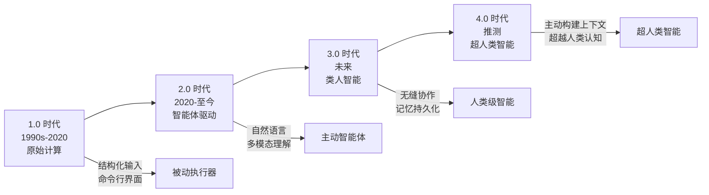

### 3.2 1.0 时代：原始计算（1990s-2020）

**时代特征：** 机器理解上下文的能力非常有限，只能处理结构化输入和简单环境线索。

**技术特点：**
- 基于结构化输入和预定义命令
- 上下文主要是简单的环境参数（系统状态、用户配置）
- 交互成本高昂，需要用户具备技术背景
- 人类必须努力适应机器的逻辑

**典型应用：**
| 应用 | 说明 |
|------|------|
| 命令行界面（CLI） | 用户必须记忆精确的命令语法 |
| 图形用户界面（GUI） | 通过菜单、按钮等预定义选项交互 |
| 基于规则的专家系统 | if-then 规则匹配，无法处理模糊性 |

**核心限制：**
> 机器"无法有效地填补沟通中的空白"，不像人类能够在交流中进行上下文推理。

### 3.3 2.0 时代：智能体驱动（2020-至今）

**时代特征：** 以 LLM 为代表，机器能够理解自然语言，处理模糊性，具备多步推理能力。

**技术突破：**
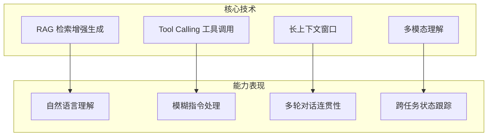

**上下文理解方式：**
- 上下文被理解为"指令"——机器把用户输入和相关信息作为任务指导
- 支持自然语言与多模态输入
- 能够处理长周期任务
- 但仍需要较多的人类指导

**局限性：**
- 上下文窗口和处理深度仍然有限
- 系统需要大量人类指导
- 长期记忆缺失，跨会话难以保持连贯

### 3.4 3.0 时代：类人智能（未来）

**时代特征：** AI 将达到人类水平的智能，能够进行细致入微的交流，实现无缝协作。

**预期能力：**
- **无缝协作：** 像人类团队成员一样自然配合
- **记忆持久化：** 跨越会话保持完整认知连续性
- **主动推理：** 能够主动填补信息空白，预测用户需求
- **自适应学习：** 从交互中持续改进，形成个性化认知模型

**关键技术方向：**
| 方向 | 目标 |
|------|------|
| 记忆操作系统 | 如 MemOS，实现结构化、持久性、自适应记忆管理 |
| 协议化上下文 | MCP、A2A 等标准化协议实现智能体互联 |
| 无限上下文 | 突破 token 限制，实现流式上下文管理 |
| 多模态融合 | MM-RAG 整合文本、图像、音频等多模态信息 |

### 3.5 4.0 时代：超人类智能（推测）

**时代特征：** 智能体能够主动构建上下文，超越人类认知局限。

**推测能力：**
- 主动发现和组织相关知识
- 超越人类注意力局限，同时处理多线索上下文
- 跨领域知识自动关联与创新
- 自主设定目标并规划执行路径

### 3.6 2025-2026：协议化元年

**里程碑事件：**

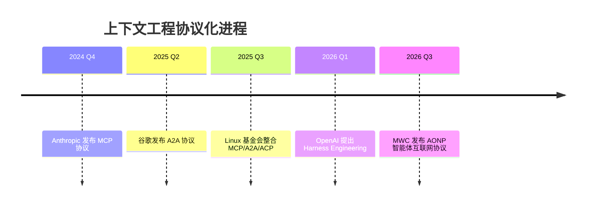

**核心协议详解：**

**1. MCP（Model Context Protocol，模型上下文协议）**
- **发布方：** Anthropic（2024 年 11 月）
- **使命：** 让智能体拥有"手脚"，标准化工具与数据调用
- **类比：** 智能体的"USB-C 接口"
- **应用场景：**
  - 查询数据库
  - 获取网页数据
  - 调用企业内部 API
  - 与文件系统交互

**2. A2A（Agent-to-Agent Protocol，智能体间协议）**
- **发布方：** 谷歌（2025 年 4 月 Google Cloud Next）
- **使命：** 让智能体学会"对话"，实现多智能体协作
- **核心能力：**
  - 能力发现（Agent Card）
  - 任务管理（即时/长期任务）
  - 状态协同（实时同步）
  - 多模态交互（文本/音频/图像/视频）

**3. 协议协同效应：**
```
传统集成模式：
N 个智能体 × M 个工具 = N×M 个定制集成

标准化协议模式：
N 个智能体 + M 个工具 = N+M 个标准接口

类比：USB-C 统一设备充电接口，任何设备都能使用任何充电器
```

### 3.7 从 RAG 到上下文引擎的演进

**RAG 技术演进三阶段：**

| 阶段 | 时间 | 特点 | 局限 |
|------|------|------|------|
| **Naive RAG** | 2020-2022 | 简单"检索 + 生成"流水线 | 检索和生成完全解耦 |
| **Advanced RAG** | 2023-2024 | Query 改写、HyDE、混合检索、重排序 | 仍为被动检索 |
| **Agentic RAG** | 2025-至今 | 检索嵌入推理循环，主动决策 | 需要复杂编排 |

**上下文引擎（Context Engine）新概念：**
> 检索正在从独立的工程模块演变为 AI 系统认知基础设施的一部分

**核心转变：**
- **从：** 独立的检索模块（RAG）
- **到：** 嵌入推理循环的动态记忆系统
- **终局：** 上下文成为 AI 的"操作系统级"资源管理能力

### 3.8 本章小结

| 时代 | 时间 | 核心特征 | 交互模式 |
|------|------|---------|---------|
| **1.0** | 1990s-2020 | 结构化输入 | 人类适应机器 |
| **2.0** | 2020-至今 | 自然语言理解 | 机器理解人类 |
| **3.0** | 未来 | 无缝协作 | 人机自然配合 |
| **4.0** | 推测 | 超人类认知 | 智能体主动构建 |

**关键技术里程碑：**
- MCP 协议（2024）：单智能体扩展坞
- A2A 协议（2025）：多智能体协作总线
- Harness Engineering（2026）：完整生产环境设计

---

*第 3 章完成 | 下一步：第 4 章 六大支柱*

---

## 4. 六大支柱 — 结构化、检索、压缩、编排、评估、安全

上下文工程并非孤立技术的简单堆砌，而是一门涉及信息获取、组织、传递和优化的综合性工程学科。

**六大支柱概览：**

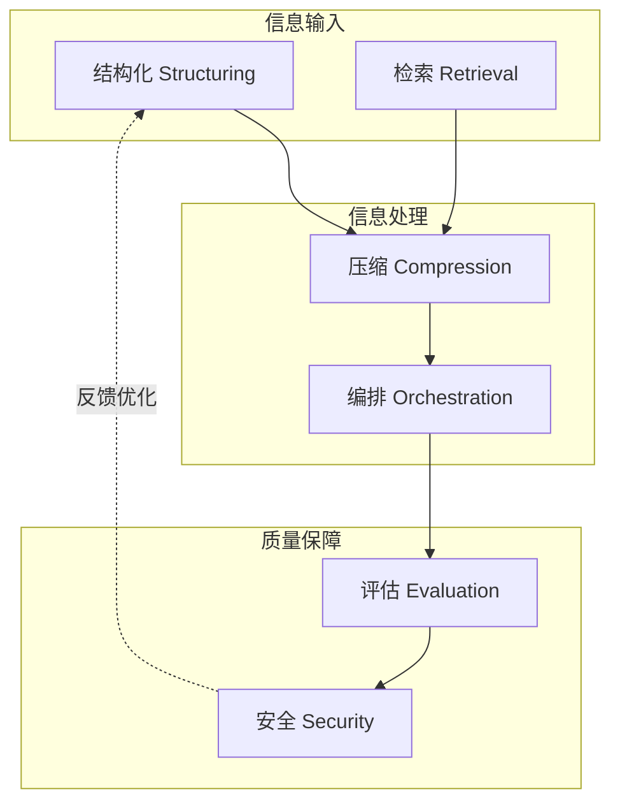

### 4.1 支柱一：结构化（Structuring）

**核心目标：** 对抗信息熵增，用明确的标签和格式规范输入输出，降低模型理解成本。

**为什么需要结构化？**
> 一个精心结构化的上下文，就像一张重点突出、条理清晰的思维导图，能够极大地降低模型的理解成本，引导其注意力到最关键的信息上。

**主流结构化语言：**

| 格式 | 适用场景 | 优点 | 示例 |
|------|---------|------|------|
| **XML** | 复杂嵌套数据、机器可读 | 标签语义清晰、边界明确 | `<user_profile>...</user_profile>` |
| **JSON** | API 数据交换、配置信息 | 通用性强、易解析 | `{"role": "user", "content": "..."}` |
| **Pydantic** | Python 应用、数据校验 | 类型安全、自动校验 | `class UserInput(BaseModel)` |
| **Markdown** | 人类可读文档、提示词 | 保持自然语言流畅性 | `## 标题`、`- 列表` |

**XML 结构化示例：**
```xml
<context>
  <goal>
    帮助用户分析销售数据并生成月度报告
  </goal>

  <user_profile>
    <role>销售总监</role>
    <industry>SaaS</industry>
    <preferences>偏好简洁图表，避免冗长文字</preferences>
  </user_profile>

  <retrieved_knowledge>
    <source name="Q3_sales_db" date="2025-09-30">
      总收入：$2.5M，同比增长 15%
    </source>
    <source name="customer_churn_report">
      流失率：3.2%，低于行业平均
    </source>
  </retrieved_knowledge>

  <system_instructions>
    1. 优先展示关键指标
    2. 使用对比图表呈现趋势
    3. 避免技术术语，使用业务语言
  </system_instructions>
</context>
```

**Markdown 结构化示例：**
```markdown
## 任务目标
分析 Q3 销售数据并生成月度报告

## 用户背景
- **角色：** 销售总监
- **行业：** SaaS
- **偏好：** 简洁图表，避免冗长文字

## 检索到的知识
### 销售数据
- 总收入：$2.5M
- 同比增长：15%

### 客户流失
- 流失率：3.2%
- 状态：低于行业平均

## 执行指令
1. 优先展示关键指标
2. 使用对比图表呈现趋势
3. 避免技术术语
```

**结构化最佳实践：**
1. **元信息显式化：** 用明确标签说明"这段信息是什么"、"从哪里来"、"有什么用"
2. **边界清晰：** 不同类型信息之间用分隔符或标签明确区分
3. **层次分明：** 使用嵌套结构表达信息层级关系
4. **一致性：** 全系统使用统一的结构化格式

### 4.2 支柱二：检索（Retrieval）

**核心目标：** 通过混合搜索、重排序、查询转换等技术提升检索精准度。

**检索技术演进：**

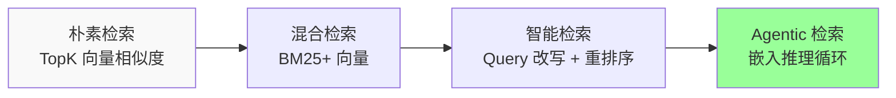

**混合检索（Hybrid Search）架构：**
```
用户查询
├── BM25 稀疏检索（关键词精确匹配）
│   └── 返回候选集 A（按 BM25 分数排序）
└── Dense Vector 检索（语义相似度）
    └── 返回候选集 B（按余弦相似度排序）
        ↓
    RRF 互惠排名融合 / 加权分数合并
        ↓
    Cross-Encoder 重排序（可选）
        ↓
    LLM 生成
```

**互惠排名融合（RRF）公式：**
```
RRF_score(d) = Σ 1 / (k + rank_i(d))

其中：
- d: 文档
- rank_i(d): 文档在第 i 个检索结果中的排名
- k: 平滑常数（通常设为 60）
```

**高级检索技术：**

| 技术 | 说明 | 效果提升 |
|------|------|---------|
| **Query 改写** | 将用户查询转换为更适合检索的形式 | +5-10% 准确率 |
| **HyDE** | 生成假设性答案，用其向量检索相似文档 | +8-15% 召回率 |
| **混合检索** | BM25+ 向量融合 | +5-10% 整体效果 |
| **Cross-Encoder 重排序** | 对候选结果进行精细化重排序 | +10-20% 精准度 |
| **迭代检索** | 根据初步结果决定是否需要二次检索 | 提升复杂问题效果 |

**检索优化检查清单：**
- [ ] 是否使用混合检索而非单一向量检索
- [ ] 是否对长查询进行 Query 改写
- [ ] 是否使用 RRF 或其他融合策略
- [ ] 是否考虑添加 Cross-Encoder 重排序
- [ ] 是否针对特定领域微调嵌入模型

### 4.3 支柱三：压缩（Compression）

**核心目标：** 在尽可能不损失关键信息的前提下，显著减小 Token 数量，提升信息密度。

**核心原则：**
> 压缩是一门在"信息保真度"和"成本效益"之间寻求最佳平衡的艺术。

**两种压缩技术路线：**

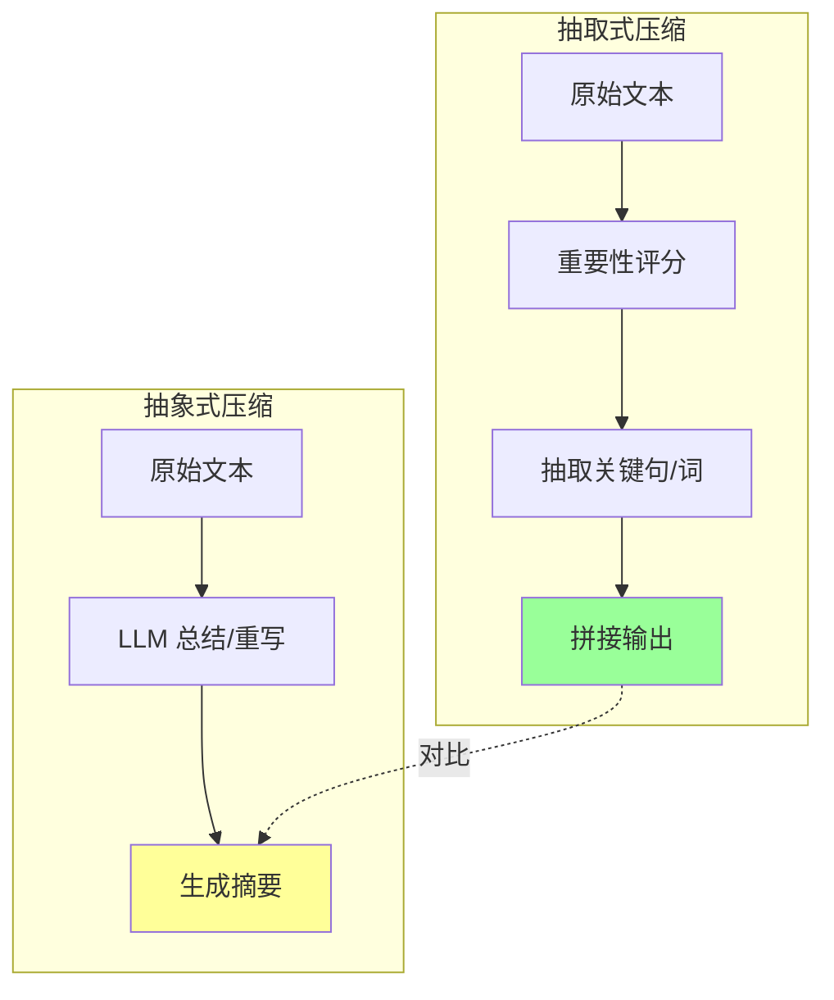

**抽取式 vs 抽象式对比：**

| 维度 | 抽取式压缩 | 抽象式压缩 |
|------|-----------|-----------|
| **原理** | 像"淘金"一样抽取关键部分 | 用 LLM 重写或总结 |
| **优点** | 保留原汁原味，无二次幻觉 | 生成流畅连贯的文本 |
| **缺点** | 可能不够连贯 | 可能丢失细节或引入幻觉 |
| **代表技术** | Selective Context、LLMLingua | 对话摘要、文档总结 |
| **适用场景** | 高保真要求的法律、医疗 | 对话历史、会议纪要 |

**抽取式压缩核心技术：**

**1. Selective Context：基于信息熵的剪枝**
- 计算每个句子/段落的信息熵
- 移除低信息熵（冗余）内容
- 保留高信息密度部分

**2. LLMLingua：提示词压缩**
- 识别并移除 filler words（填充词）
- 保留核心语义单元
- 可实现 2-5 倍压缩率

**压缩实践建议：**
| 场景 | 推荐策略 |
|------|---------|
| 对话历史 | 抽象式摘要（L2 记忆） |
| 检索文档 | 抽取式关键句提取 |
| 工具输出 | 清除冗余，保留关键字段 |
| 长文档 | 分层摘要 + 关键段落抽取 |

### 4.4 支柱四：编排（Orchestration）

**核心目标：** 通过路由与代理实现动态上下文调度，适配复杂任务。

**编排的核心挑战：**
> 在正确的时间，以正确的格式，提供正确的信息和工具给 LLM。

**编排层级架构：**

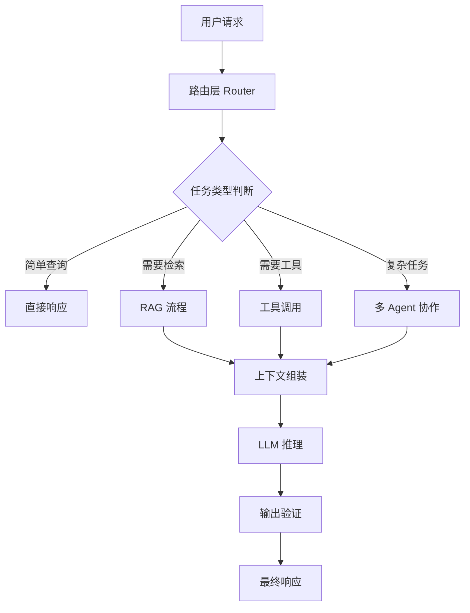

**编排模式分类：**

| 模式 | 说明 | 适用场景 |
|------|------|---------|
| **顺序编排** | 按固定顺序执行步骤 | 流水线任务、数据处理 |
| **条件编排** | 根据中间结果决定下一步 | 分支逻辑、审核流程 |
| **并行编排** | 同时执行多个独立子任务 | 多源数据聚合 |
| **循环编排** | 重复执行直到满足条件 | 迭代优化、代码修复 |
| **Agent 协作** | 多个 Agent 分工配合 | 复杂项目管理 |

**动态上下文调度策略：**

**1. 即时上下文（Just-in-Time Context）**
```
不要预先加载所有数据 → 让 Agent 运行时按需加载

优势：
- Agent 维护轻量级标识符（文件路径、链接等）
- 按需获取数据，避免上下文膨胀
- 支持渐进式披露
```

**2. 分层加载策略**
```
CLAUDE.md / 项目规则 → 预加载（高优先级）
当前任务相关上下文 → 动态加载（中优先级）
历史对话摘要 → 按需检索（低优先级）
```

**3. 路由决策机制**
```python
# 伪代码示例
def route_request(query, context):
    if is_simple_query(query):
        return direct_response(query)
    elif needs_external_knowledge(query):
        return rag_pipeline(query, context)
    elif requires_tool_calling(query):
        return tool_agent(query, context)
    else:
        return multi_agent_collaboration(query, context)
```

### 4.5 支柱五：评估（Evaluation）

**核心目标：** 量化效果，实现数据驱动优化。

**RAG 评估三元组：**

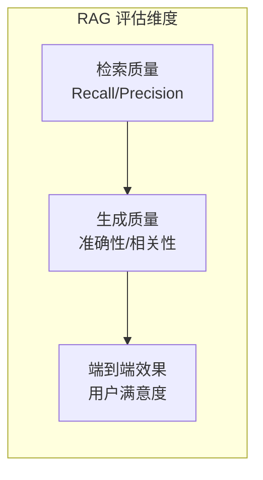

**RAGAS 评估框架：**

| 指标 | 说明 | 计算方法 |
|------|------|---------|
| **Context Precision** | 检索内容中相关部分的排名质量 | 相关文档是否排在前面 |
| **Context Recall** | 检索到的相关内容占所有相关内容的比例 | 是否遗漏关键信息 |
| **Faithfulness** | 生成内容是否忠实于检索到的上下文 | 防止幻觉 |
| **Answer Relevance** | 生成答案与用户查询的相关性 | 是否答非所问 |

**评估实施流程：**
```
1. 构建测试集
   ↓
2. 标注"金标准"答案
   ↓
3. 运行 RAG 系统获取输出
   ↓
4. 计算各项指标分数
   ↓
5. 分析弱点并优化
   ↓
6. 回归测试验证改进
```

**评估检查清单：**
- [ ] 是否建立了基准测试集
- [ ] 是否定义了关键指标（准确率、召回率等）
- [ ] 是否定期进行评估
- [ ] 是否有 A/B 测试机制
- [ ] 是否追踪用户反馈

### 4.6 支柱六：安全（Security）

**核心目标：** 防范提示注入与数据泄露，构建纵深防御体系。

**主要安全威胁：**

| 威胁类型 | 攻击方式 | 潜在后果 |
|---------|---------|---------|
| **提示注入** | 在输入中嵌入恶意指令 | 绕过安全限制、执行未授权操作 |
| **数据泄露** | 诱导模型输出敏感信息 | 隐私泄露、商业机密外泄 |
| **上下文投毒** | 污染检索知识库 | 模型生成错误或有害内容 |
| **越狱攻击** | 精心设计的对抗性提示 | 绕过内容审核机制 |

**纵深防御体系：**

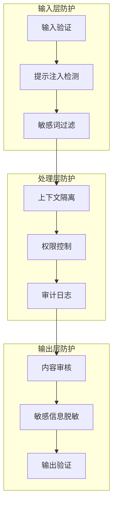

**安全最佳实践：**
1. **输入验证：** 对所有用户输入进行严格验证和清理
2. **最小权限：** Agent 只能访问完成任务所需的最小资源
3. **上下文隔离：** 不同用户/任务的上下文严格隔离
4. **审计日志：** 记录所有关键操作的详细日志
5. **输出审核：** 对生成内容进行安全性和准确性审核
6. **定期演练：** 定期进行红队演练，发现潜在漏洞

### 4.7 本章小结

| 支柱 | 核心目标 | 关键技术 |
|------|---------|---------|
| **结构化** | 对抗信息熵增 | XML/JSON/Pydantic、Markdown |
| **检索** | 提升精准度 | 混合检索、重排序、Query 改写 |
| **压缩** | 提升信息密度 | 抽取式/抽象式压缩、LLMLingua |
| **编排** | 动态上下文调度 | 路由、Agent 协作、JIT 加载 |
| **评估** | 量化效果 | RAGAS、A/B 测试、用户反馈 |
| **安全** | 防范威胁 | 输入验证、权限控制、审计日志 |

**核心洞察：**
> 上下文工程的成功不是单一技术的胜利，而是六大支柱协同作用的结果。

---

*第 4 章完成 | 下一步：第 5 章 核心组件*

---

## 5. 核心组件 — Prompt、Skills、MCP、A2A 与记忆架构

### 5.1 核心组件全景图

在大模型应用开发中，各个组件就像搭积木一样都有自己的作用，组合起来才能构建出强大的 AI 应用。

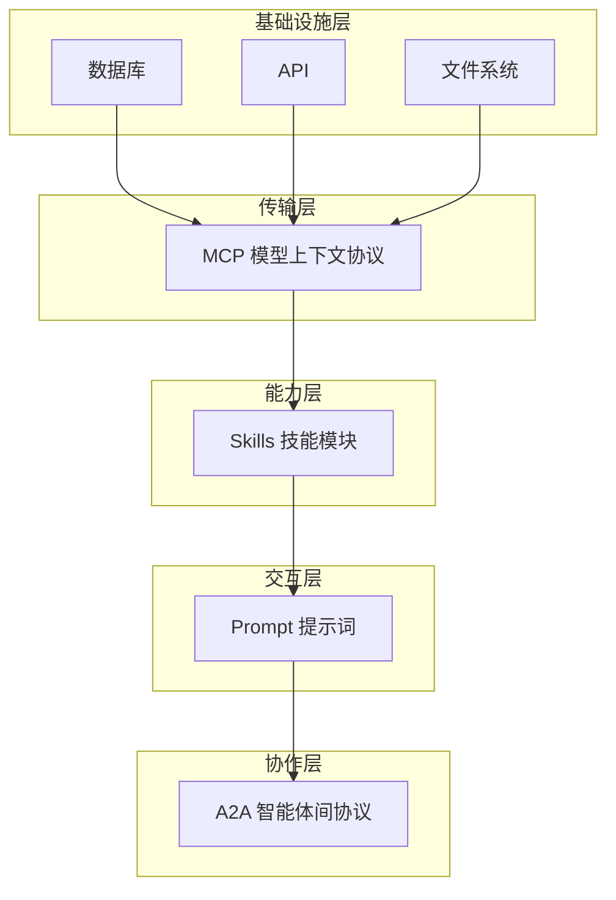

**各层级职责：**

| 层级 | 组件 | 职责 | 类比 |
|------|------|------|------|
| **基础设施层** | 数据库/API/文件系统 | 提供外部数据与工具 | 世界的"原材料" |
| **传输层** | MCP | 标准化接口、工具调用 | "万能连接器" |
| **能力层** | Skills | 模块化能力单元、SOP | "操作手册" |
| **交互层** | Prompt | 人机指令入口 | "语言艺术" |
| **协作层** | A2A | 多智能体协作 | "团队沟通" |

### 5.2 Prompt：一次性静态指令

**定义：** Prompt 是用户或开发者为了让模型执行特定任务而提供的一段一次性的、静态的文本指令。

**本质特性：**
- **一次性：** 一旦发出便无法更改
- **静态：** 缺乏对动态变化世界的感知能力
- **最底层入口：** 所有高级上下文信息最终都必须被"编译"成 Prompt 呈现给模型

**高级 Prompt 技法：**

**1. 思维链（Chain-of-Thought, CoT）**

将复杂推理任务分解成一系列简单的线性步骤：

```
❌ 标准 Prompt：
问题：罗杰有 5 个网球，又买了 2 罐，每罐 3 个网球，他现在有多少个网球？
模型可能直接给出错误答案：11

✅ CoT Prompt：
问题：罗杰有 5 个网球，又买了 2 罐，每罐 3 个网球，他现在有多少个网球？
请一步步思考：
1. 罗杰开始有 5 个球
2. 2 罐网球，每罐 3 个，所以是 2×3=6 个球
3. 5+6=11 个球
答案：11
```

**2. Few-Shot Learning（少样本学习）**

在 Prompt 中提供示范性的问答对：

```
示例 1:
输入："我感到很开心"
情感：积极

示例 2:
输入："今天天气真糟糕"
情感：消极

示例 3:
输入："我对这个结果很满意"
情感：
```

**3. 结构化 Prompt**

使用 XML 标签或 Markdown 组织信息：

```xml
<task>
  <role>你是一位资深营销文案专家</role>
  <goal>为护肤品撰写小红书种草文案</goal>
  <target_audience>25-35 岁职场女性</target_audience>
  <requirements>
    - 突出抗初老功效
    - 第一人称真实体验口吻
    - 字数 200 字左右
    - 配 3 个话题标签
  </requirements>
</task>
```

**Prompt 的局限性：**

| 局限 | 说明 |
|------|------|
| **静态性** | 无法适应动态变化的任务需求 |
| **缺乏系统性** | 只关注"怎么问"而忽视"提供什么信息" |
| **难以扩展** | 复杂多轮对话、多源数据整合时捉襟见肘 |

### 5.3 Skills：模块化能力单元

**定义：** Agent Skills 是一种模块化的、可复用的、包含语义描述与执行逻辑的智能体能力单元。

**从 Tools 到 Skills 的演进：**

```mermaid
flowchart LR
    A[Tools 工具<br/>原子化操作<br/>如"锤子"] --> B[Skills 技能<br/>高阶封装<br/>如"木匠工艺"]

    A -->|"单一 API 端点<br/>无状态"| A1["get_weather"]
    B -->|"包含 SOP<br/>隐性知识<br/>状态感知"| B1["天气分析服务"]
```

**Skills 的关键特征：**

| 特征 | 说明 | 示例 |
|------|------|------|
| **封装性** | 将 Prompt、逻辑代码、数据模板、API 连接封装在独立的包中 | `financial_report_skill/` |
| **语义自描述** | 通过自然语言文档（如 Markdown）向智能体描述功能 | `SKILL.md` |
| **渐进式披露** | 分层加载机制，先读元数据，需要时加载详情 | 避免上下文膨胀 |
| **状态感知** | 维持会话状态，支持长周期任务 | 记忆上一轮交互结果 |

**Skills 架构示例：**
```
financial_report_skill/
├── SKILL.md              # 技能描述、使用场景、操作指南
├── prompts/              # 相关提示词模板
│   ├── analysis.md
│   └── summary.md
├── scripts/              # 执行脚本
│   └── generate_report.py
├── templates/            # 数据模板
│   └── report_template.json
└── skill.json            # 元数据（名称、版本、依赖）
```

**Skills 最佳实践：**

1. **单一职责原则：** 每个技能只负责一类任务
2. **清晰命名：** 技能名称应反映其功能
3. **详细文档：** SKILL.md 应包含使用场景、输入输出、异常处理
4. **版本管理：** 使用语义化版本号，支持向后兼容

### 5.4 MCP：标准化的万能连接器

**定义：** MCP（Model Context Protocol，模型上下文协议）是一套通用标准，让 AI 能轻松对接外部的工具、数据和系统。

**类比：** MCP 是 AI 时代的"USB-C 接口"

**MCP 解决的问题：**

| 问题 | 传统方式 | MCP 方式 |
|------|---------|---------|
| **集成复杂度** | N 个智能体 × M 个工具 = N×M 个集成 | N 个智能体 + M 个工具 = N+M 个标准接口 |
| **维护成本** | 每个工具需要单独的胶水代码 | 统一接口，即插即用 |
| **能力发现** | 硬编码工具描述 | 动态发现与协商 |

**MCP 架构：**
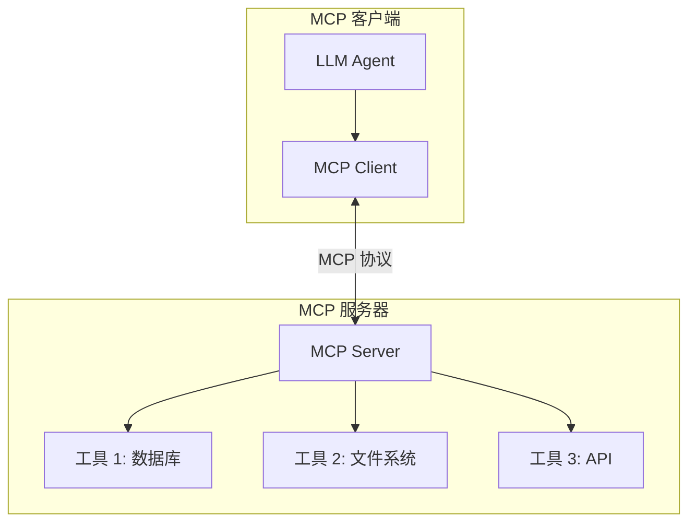

**MCP 应用场景：**

| 场景 | 说明 |
|------|------|
| **查询数据库** | 智能体直接访问企业数据库获取信息 |
| **获取网页数据** | 从网页中提取结构化数据 |
| **调用企业内部 API** | 实现业务流程自动化 |
| **与文件系统交互** | 读取、写入文档、图片等 |

**MCP 与 Skills 的协作：**
> 如果说 MCP 为智能体提供了"手"来操作工具，那么 Skills 就提供了"操作手册"，教导智能体如何正确使用这些工具。

### 5.5 记忆架构：三层记忆系统

**记忆系统全景：**

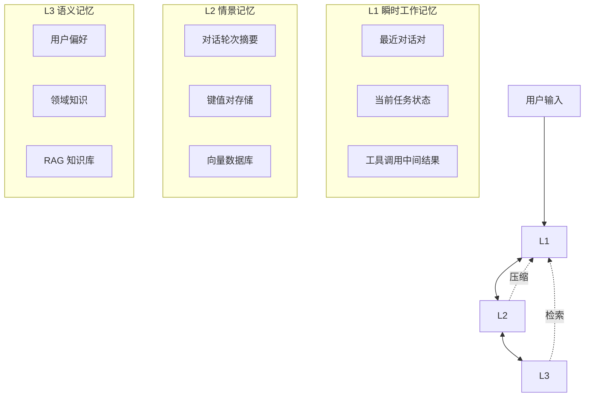

**各层详细设计：**

**L1 瞬时工作记忆：**
- **载体：** 上下文窗口本身
- **特点：** 高速、临时、容量有限
- **管理策略：** 结构化、仅追加、定期清理
- **适用：** ReAct 循环、当前任务状态跟踪

**L2 情景记忆：**
- **载体：** 向量数据库 + 摘要存储
- **特点：** 可检索、跨会话、需要压缩
- **管理策略：** 对话摘要、键值对存储
- **适用：** 历史对话回顾、用户交互记忆

**L3 语义记忆：**
- **载体：** RAG 外部知识库
- **特点：** 持久化、领域特定、可更新
- **管理策略：** 定期同步、版本控制
- **适用：** 企业知识、用户偏好、领域规则

### 5.6 A2A：多智能体协作总线

**定义：** A2A（Agent-to-Agent Protocol，智能体间协议）是让不同的 AI 智能体能够互相"认识"和"交谈"的标准化协议。

**A2A 解决的核心问题：**

| 问题 | 传统方式 | A2A 方式 |
|------|---------|---------|
| **互操作性** | 不同厂商智能体无法直接通信 | 通用交互语言 |
| **长期任务** | 难以保持跨小时/天的协作 | 支持长时间对话 |
| **多模态** | 仅限文本 | 支持音频、图像、视频 |

**A2A 核心能力：**

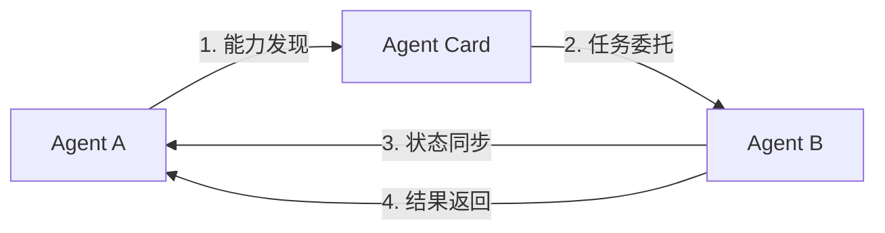

**1. 能力发现（Agent Card）：**
每个智能体通过 JSON 格式的信息卡公开自己的能力：
```json
{
  "name": "DataAnalysisAgent",
  "version": "1.0.0",
  "capabilities": ["数据清洗", "统计分析", "图表生成"],
  "input_formats": ["CSV", "JSON", "Excel"],
  "output_formats": ["报告", "图表", "原始数据"]
}
```

**2. 任务管理：**
- 即时完成任务（一步到位）
- 长期任务（多轮协作、状态跟踪）

**3. 状态协同：**
实时同步任务进度、中间结果、错误信息

**A2A 协作示例：**
```
用户请求："分析上季度销售数据并生成报告"

1. Orchestrator Agent 接收请求
2. 发现需要 DataAnalysisAgent 处理数据
3. 发现需要 ReportAgent 生成报告
4. 通过 A2A 协议协调两个 Agent 协作
5. 最终整合结果返回给用户
```

### 5.7 本章小结

| 组件 | 定位 | 核心价值 |
|------|------|---------|
| **Prompt** | 交互层入口 | 人机对话的语言艺术 |
| **Skills** | 能力层单元 | 模块化、可复用的 SOP |
| **MCP** | 传输层协议 | 标准化的万能连接器 |
| **A2A** | 协作层协议 | 多智能体协作总线 |
| **记忆架构** | 基础设施 | L1/L2/L3 三层记忆系统 |

**核心洞察：**
> Prompt 是一次性指令，Skills 是可复用能力，MCP 是连接器，A2A 是协作协议，记忆架构是认知基础——五者协同构建完整的智能体系统。

---

*第 5 章完成 | 下一步：第 6 章 实战架构*

---

## 6. 实战架构 — Agentic RAG、Graph RAG 与上下文引擎

### 6.1 RAG 技术演进全景

**从 RAG 到 Context Engine 的演进：**

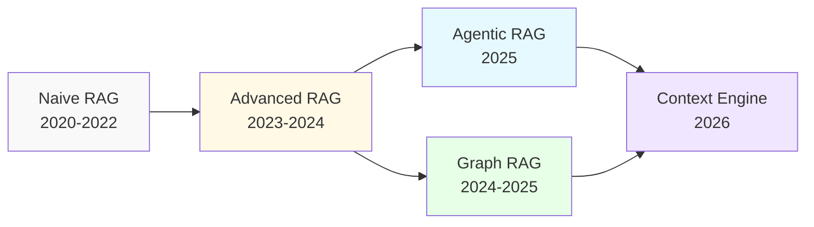

**各阶段特征对比：**

| 阶段 | 时间 | 核心特点 | 局限性 |
|------|------|---------|--------|
| **Naive RAG** | 2020-2022 | 简单"检索 + 生成"流水线 | 检索和生成完全解耦 |
| **Advanced RAG** | 2023-2024 | Query 改写、混合检索、重排序 | 仍为被动检索 |
| **Graph RAG** | 2024-2025 | 知识图谱索引、多跳推理 | 索引成本高 |
| **Agentic RAG** | 2025-至今 | 检索嵌入推理循环，主动决策 | 复杂度高、稳定性依赖 LLM |
| **Context Engine** | 2026-未来 | 统一知识库、记忆、工具三类上下文 | 需要复杂编排 |

### 6.2 Graph RAG：跨文档推理

**核心思想：** 使用知识图谱结构组织信息，支持多跳推理和全局感知。

**Graph RAG vs 传统 RAG：**

```mermaid
flowchart TB
    subgraph 传统 RAG
        A1[文档切块] --> A2[向量索引]
        A2 --> A3[相似度检索 TopK]
        A3 --> A4[拼接生成]
        style A4 fill:#ff9
    end

    subgraph Graph RAG
        B1[文档解析] --> B2[提取实体关系]
        B2 --> B3[构建知识图谱]
        B3 --> B4[图遍历 + 检索]
        B4 --> B5[多跳推理生成]
        style B5 fill:#9f9
    end
```

**Graph RAG 核心优势：**

| 优势 | 说明 | 效果提升 |
|------|------|---------|
| **多跳推理** | 能回答需要跨文档连接的问题 | 准确率×3 |
| **全局感知** | 理解文档间的隐含关系 | 解决"全局失语"问题 |
| **结构化查询** | 支持复杂查询（如"找出所有与 X 相关的 Y"） | 查询能力提升 5-10 倍 |

**Graph RAG 工作流程：**
```
1. 文档解析 → 提取实体、关系、事件
2. 构建图谱 → 节点=实体，边=关系
3. 图索引 → 社区检测、层次化摘要
4. 查询处理 → 图遍历 + 向量检索融合
5. 多跳推理 → 沿图谱路径聚合信息
6. 生成回答 → 基于结构化证据
```

**LazyGraph RAG 优化：**
- 将 Graph RAG 索引成本降低**99.9%**
- 采用"按需建图"策略，避免全量索引
- 适合生产环境的大规模部署

### 6.3 Agentic RAG：检索嵌入推理循环

**核心思想：** 检索不再是前置步骤，而是嵌入在 Agent 的推理循环中，由模型自主决定何时检索、检索什么。

**Agentic RAG 架构：**

```mermaid
flowchart TB
    A[用户查询] --> B[Agent 规划]
    B --> C{是否需要检索？}
    C -->|是 | D[执行检索]
    C -->|否 | E[直接推理]
    D --> F[评估检索结果]
    F --> G{信息足够？}
    G -->|否 | D
    G -->|是 | H[生成回答]
    E --> H
```

**ReAct + RAG 循环：**
```python
# 伪代码示例
for step in range(max_steps):
    # 思考（Think）
    thought = llm.analyze(current_context, goal)

    # 决策（Decide）
    if thought.needs_more_info:
        # 检索（Retrieve）
        retrieved = retriever.search(thought.query)
        current_context.add(retrieved)
    else:
        # 生成回答
        return llm.generate(current_context)

    # 观察（Observe）
    current_context.add_observation(thought, retrieved)
```

**Agentic RAG 优势：**
- **按需检索：** 避免一次性检索无关内容
- **自我修正：** 可以评估检索质量并决定是否二次检索
- **多步推理：** 支持复杂问题的分步解决

**生产环境挑战：**
- **90% 的 Agentic RAG 项目在生产中失败**（2025 年数据）
- 失败原因：稳定性依赖 LLM、Token 消耗高、调试困难

### 6.4 MiA-RAG：心智图景全局感知

**核心创新：** 通过构建整个文本的高层摘要（"心智图景"），帮助 RAG 系统处理长文档，像人类一样进行全局推理。

**MiA-RAG 架构：**

```mermaid
flowchart TB
    A[长文档输入] --> B[分层摘要构建]
    B --> C[心智图景 Mindscape]
    C --> D[指导检索]
    C --> E[指导生成]

    D --> F[检索器：信息更丰富的查询]
    E --> G[生成器：在全局上下文中推理]

    F --> H[最终回答]
    G --> H
```

**心智图景（Mindscape）构建：**
```
原始文档（100K+ tokens）
    ↓
第 1 层：章节摘要（每章 500 tokens）
    ↓
第 2 层：节摘要（每节 200 tokens）
    ↓
第 3 层：全局心智图景（~1000 tokens）
```

**适用场景：**
- 文学作品分析（如"为什么 X 被送给 Y 当奴隶？"）
- 长篇法律文书综述
- 历史事件因果推断
- 需要全局 sense-making 的问题

### 6.5 HGMem：超图记忆多步 RAG

**核心思想：** 将检索到的信息组织成超图（Hypergraph），允许事实随着时间的推移相互连接和组合。

**超图记忆 vs 传统记忆：**

| 特性 | 传统记忆 | 超图记忆 |
|------|---------|---------|
| **数据结构** | 线性列表/向量 | 超图（边可连接≥2 个节点） |
| **关系表达** | 成对关系 | 高阶多元关系 |
| **演化方式** | 追加式 | Update/Insert/Merge |
| **推理能力** | 单点检索 | 多跳组合推理 |

**HGMem 工作流程：**
```mermaid
flowchart LR
    A[第 t 步交互] --> B{自我检查}
    B -->|局部深挖 | C[检索相关子图]
    B -->|全局探索 | D[检索全图]
    C --> E[LLM 整合新证据]
    D --> E
    E --> F[生成高阶超边]
    F --> G[超图演化]
```

**实验效果：**
- 在 4 个超长文档基准上全线 SOTA
- Token 消耗与延迟与 baseline 持平
- 合并操作仅增加<7% token，精度显著提升

### 6.6 Context Engine：统一上下文引擎

**核心洞察：**
> RAG 正在从"检索增强生成"组件，升级为面向 Agent 的"上下文引擎（Context Engine）"，成为知识、记忆、工具三类上下文的统一入口。

**Context Engine 架构：**

```mermaid
flowchart TB
    subgraph 数据源层
        A1[知识库<br/>文档/数据库]
        A2[记忆<br/>对话历史/用户偏好]
        A3[工具<br/>API/文件系统]
    end

    subgraph 统一建模层
        B[PTI 统一建模<br/>所有数据视为"ETL 同级公民"]
    end

    subgraph 检索层
        C1[知识检索]
        C2[记忆检索]
        C3[工具检索]
    end

    subgraph 编排层
        D[动态上下文组装]
    end

    subgraph 生成层
        E[LLM 推理]
    end

    A1 --> B
    A2 --> B
    A3 --> B
    B --> C1
    B --> C2
    B --> C3
    C1 --> D
    C2 --> D
    C3 --> D
    D --> E
```

**三类数据统一建模：**

| 数据类型 | 特点 | 检索策略 |
|---------|------|---------|
| **知识库** | 静态、公开、结构化 | 向量检索 + 关键词 |
| **记忆** | 动态、私有、时序性 | 时间窗口 + 语义检索 |
| **工具** | 可执行、参数化 | 功能描述匹配 |

**PTI（Prompt-Tool-Information）统一建模：**
- 把非结构化数据当成"ETL 同级公民"
- 知识库、记忆、工具使用统一的索引和检索接口
- 支持混合查询（如"找出我上次讨论 X 项目时提到的文档"）

### 6.7 多模态 RAG

**定义：** 支持文本、图像、音频、视频等多模态数据的统一检索和生成。

**多模态 RAG 架构：**

```mermaid
flowchart TB
    A[多模态输入] --> B[模态编码器]
    B --> C1[文本 Embedding]
    B --> C2[图像 Embedding]
    B --> C3[音频 Embedding]
    C1 --> D[统一向量空间]
    C2 --> D
    C3 --> D
    D --> E[跨模态检索]
    E --> F[多模态生成]
```

**适用场景评估：**

| 场景 | 是否值得用 | 理由 |
|------|-----------|------|
| **图文混合文档** | ✅ 推荐 | 图表中的信息无法用纯文本检索 |
| **产品说明书** | ✅ 推荐 | 包含大量示意图和流程图 |
| **纯文本文档** | ❌ 不推荐 | 增加成本，收益有限 |
| **视频内容检索** | ⚠️ 谨慎 | 成本高，需要明确的业务需求 |

**工程挑战：**
- 张量索引的存储与计算成本高
- 多模态对齐精度有限
- 需要专门的多模态 Embedding 模型

### 6.8 本章小结

| 架构 | 核心创新 | 适用场景 | 生产成熟度 |
|------|---------|---------|-----------|
| **Graph RAG** | 知识图谱索引、多跳推理 | 跨文档推理、复杂查询 | ⭐⭐⭐⭐ |
| **Agentic RAG** | 检索嵌入推理循环 | 复杂多步骤任务 | ⭐⭐⭐（谨慎） |
| **MiA-RAG** | 心智图景全局感知 | 超长文档全局推理 | ⭐⭐⭐ |
| **HGMem** | 超图记忆、高阶关系 | 多步关系推理 | ⭐⭐⭐ |
| **Context Engine** | 统一知识/记忆/工具 | 企业级 AI 中台 | ⭐⭐⭐⭐ |

**核心洞察：**
> RAG 已死，上下文引擎永生——不是 RAG 消失了，而是它演变为更完整、更系统的上下文管理能力。

---

*第 6 章完成 | 下一步：第 7 章 工具生态*

---

## 7. 工具生态 — 向量数据库、LangChain 与评估观测

### 7.1 工具生态全景

上下文工程的工具生态覆盖四个层级：

```mermaid
flowchart TB
    subgraph L1 数据存储层
        A1[向量数据库]
        A2[传统数据库]
        A3[对象存储]
    end

    subgraph L2 编排代理层
        B1[LangChain]
        B2[LlamaIndex]
        B3[LangGraph]
    end

    subgraph L3 评估观测层
        C1[RAGAS]
        C2[Arize Phoenix]
        C3[LangSmith]
    end

    subgraph L4 部署运维层
        D1[vLLM]
        D2[Ray]
        D3[Kubernetes]
    end

    L1 --> L2
    L2 --> L3
    L3 --> L4
```

### 7.2 数据存储层：向量数据库

**主流向量数据库对比：**

| 数据库 | 类型 | 特点 | 适用场景 |
|--------|------|------|---------|
| **Pinecone** | 托管服务 | 全托管、易用、成本高 | 快速原型、中小企业 |
| **Weaviate** | 开源/托管 | 支持混合检索、图结构 | 知识图谱 +RAG |
| **Milvus** | 开源/托管 | 高性能、可扩展 | 大规模生产部署 |
| **Chroma** | 开源 | 轻量级、本地优先 | 开发测试、小规模应用 |
| **Qdrant** | 开源/托管 | 过滤能力强、Rust 实现 | 高性能、复杂过滤 |
| **pgvector** | 插件 | PostgreSQL 扩展 | 已有 PG 基础设施 |

**选型建议：**

```mermaid
flowchart LR
    A{需求评估} -->|快速原型 | B[Pinecone/Chroma]
    A -->|大规模生产 | C[Milvus/Qdrant]
    A -->|已有 PG 设施 | D[pgvector]
    A -->|知识图谱 | E[Weaviate]
```

### 7.3 编排代理层：框架与库

**框架收敛趋势（2025-2026）：**

经过 2024-2025 年大浪淘沙，35 个同质化开源项目收敛至 3-5 个主流框架：

| 框架 | 定位 | 目标用户 | 核心特点 |
|------|------|---------|---------|
| **LangChain** | 底层框架 | 开发者 | 灵活、生态丰富、学习成本高 |
| **LlamaIndex** | 数据优先框架 | 工程师 | 专注 RAG、文档处理强 |
| **LangGraph** | 状态机编排 | 高级开发者 | 支持循环、条件分支、状态管理 |
| **Dify** | 低代码平台 | 业务人员 | 开箱即用、易遇到瓶颈 |
| **Coze** | 低代码平台 | 业务人员 | 字节出品、快速搭建 |

**三层金字塔结构：**

```
        ┌─────────────┐
        │  Dify/Coze  │  ← 顶层：业务人员，低代码
        ├─────────────┤
        │ RAGFlow/    │  ← 中层：工程师，平衡易用性
        │  MaxKB      │     和可定制性
        ├─────────────┤
        │ LangChain/  │  ← 底层：开发者，灵活但学习
        │ LangGraph   │     成本高
        └─────────────┘
```

**框架选择建议：**

| 场景 | 推荐框架 | 理由 |
|------|---------|------|
| **Demo/POC** | Dify/Coze | 快速验证想法 |
| **生产系统** | LangChain/LangGraph | 可深度优化 |
| **RAG 专用** | LlamaIndex | 文档处理能力强 |
| **复杂编排** | LangGraph | 支持状态机、循环 |

### 7.4 评估观测层：RAGAS 与追踪

**RAGAS 评估框架：**

**核心指标：**

```mermaid
flowchart TB
    subgraph 检索质量
        A1[Context Precision]
        A2[Context Recall]
    end

    subgraph 生成质量
        B1[Faithfulness]
        B2[Answer Relevance]
    end

    subgraph 端到端
        C1[Answer Correctness]
        C2[User Satisfaction]
    end

    A1 --> B1
    A2 --> B2
    B1 --> C1
    B2 --> C2
```

**指标详解：**

| 指标 | 含义 | 计算方法 | 优化方向 |
|------|------|---------|---------|
| **Context Precision** | 检索内容中相关部分的排名质量 | 相关文档是否排在前面 | 改进检索算法、添加重排序 |
| **Context Recall** | 检索到的相关内容占所有相关内容的比例 | 是否遗漏关键信息 | 混合检索、Query 改写 |
| **Faithfulness** | 生成内容是否忠实于检索到的上下文 | 防止幻觉 | 限制生成范围、添加引用 |
| **Answer Relevance** | 生成答案与用户查询的相关性 | 是否答非所问 | 改进 Prompt、添加校验 |

**评估实施流程：**

```
1. 构建测试集（50-100 个典型查询）
   ↓
2. 标注"金标准"答案和相关内容
   ↓
3. 运行 RAG 系统获取输出
   ↓
4. 使用 RAGAS 计算各项指标
   ↓
5. 分析弱点（检索问题？生成问题？）
   ↓
6. 针对性优化
   ↓
7. 回归测试验证改进
```

**观测工具对比：**

| 工具 | 类型 | 核心功能 | 成本 |
|------|------|---------|------|
| **LangSmith** | 托管 | 追踪、调试、评估 | 付费 |
| **Arize Phoenix** | 开源/托管 | 追踪、评估、可视化 | 免费/付费 |
| **Weights & Biases** | 托管 | 实验追踪、模型监控 | 付费 |
| **MLflow** | 开源 | 实验管理、模型注册 | 免费 |

### 7.5 部署运维层：推理与服务

**vLLM：高性能推理引擎**

**核心优势：**
- **PagedAttention：** 显存利用率提升 60-80%
- **Continuous Batching：** 动态批处理，吞吐量提升 2-4 倍
- **分布式推理：** 支持多 GPU、多节点部署

**适用场景：**
- 高并发生产环境
- 大批量离线处理
- 需要低延迟的实时应用

**部署架构示例：**

```mermaid
flowchart TB
    A[用户请求] --> B[负载均衡器]
    B --> C1[vLLM 实例 1]
    B --> C2[vLLM 实例 2]
    B --> C3[vLLM 实例 3]
    C1 --> D[Redis 缓存]
    C2 --> D
    C3 --> D
    D --> E[结果返回]
```

**Ray：分布式计算框架**

**在 RAG 中的应用：**
- 分布式文档处理（解析、分块、向量化）
- 并行检索多个数据源
- 大规模批处理任务

### 7.6 工具链最佳实践

**技术栈推荐（2026）：**

**初创团队/快速原型：**
```
Pinecone（托管向量库）
  + Dify（低代码平台）
  + LangSmith（观测）
= 1-2 周内上线 MVP
```

**中型企业/生产系统：**
```
Qdrant/Milvus（自托管向量库）
  + LangChain/LangGraph（编排）
  + RAGAS + Phoenix（评估观测）
  + vLLM（推理加速）
= 可控成本、可深度优化
```

**大型企业/规模化部署：**
```
Milvus 集群（大规模向量检索）
  + 自研编排层（基于 LangGraph 二次开发）
  + 定制化评估体系
  + Ray 分布式处理
  + Kubernetes 编排
= 高可用、可扩展、自主可控
```

### 7.7 本章小结

| 层级 | 代表工具 | 选型关键因素 |
|------|---------|-------------|
| **数据存储** | Pinecone/Qdrant/Milvus | 规模、成本、运维能力 |
| **编排代理** | LangChain/LlamaIndex | 灵活性 vs 易用性 |
| **评估观测** | RAGAS/LangSmith | 指标完整性、集成难度 |
| **部署运维** | vLLM/Ray/K8s | 并发需求、延迟要求 |

**核心洞察：**
> 工具生态正在从"百花齐放"走向"收敛整合"，2026 年的关键是选择适合自身阶段的工具组合，而非盲目追求最新技术。

---

*第 7 章完成 | 下一步：第 8 章 常见问题与最佳实践*

---

## 8. 常见问题与最佳实践

### 8.1 常见问题诊断

**问题 1：检索到的内容不相关**

**症状：**
- RAG 系统返回的文档与查询语义不匹配
- 用户反馈"答非所问"

**可能原因与解决方案：**

| 原因 | 诊断方法 | 解决方案 |
|------|---------|---------|
| **纯向量检索的局限** | 检查是否只用向量相似度 | 添加 BM25 混合检索 |
| **Query 表达问题** | 分析用户查询与检索结果的语义差距 | 实施 Query 改写、Query 扩展 |
| **分块策略不当** | 检查 chunk 大小和重叠率 | 调整分块粒度（300-500 tokens 常用） |
| **嵌入模型不匹配** | 对比不同嵌入模型的检索效果 | 微调嵌入模型或更换预训练模型 |
| **缺少重排序** | 检查 TopK 结果的相关性分布 | 添加 Cross-Encoder 重排序 |

---

**问题 2：生成内容出现幻觉**

**症状：**
- 模型编造不存在的信息
- 回答与检索到的文档矛盾

**可能原因与解决方案：**

```mermaid
flowchart TB
    A[幻觉问题] --> B{原因诊断}
    B -->|检索内容不足 | C[增加检索 TopK 值]
    B -->|检索内容噪声多 | D[改进检索质量]
    B -->|模型过度自信 | E[添加引用约束]
    B -->|上下文窗口溢出 | F[压缩无关内容]

    C --> G[验证改进]
    D --> G
    E --> G
    F --> G
```

**具体实践：**
1. **添加引用约束：** 在 Prompt 中要求模型标注引用来源
2. **设置"我不知道"选项：** 允许模型在信息不足时承认无知
3. **实施 Self-RAG：** 让模型自我评估检索质量和生成可信度

---

**问题 3：长对话中模型"失忆"**

**症状：**
- 多轮对话后模型忘记早期信息
- 用户需要重复已提供的背景

**可能原因与解决方案：**

| 原因 | 解决方案 |
|------|---------|
| **上下文窗口溢出** | 实施对话摘要压缩（L2 记忆） |
| **关键信息被稀释** | 结构化组织历史，标记关键事实 |
| **缺少持久化记忆** | 建立用户档案和偏好存储（L3 记忆） |

**最佳实践：**
```python
# 对话管理伪代码
def manage_conversation_history(user_id, new_message):
    # 1. 加载用户档案（L3 记忆）
    profile = load_user_profile(user_id)

    # 2. 加载最近对话（L1 记忆）
    recent_history = load_recent_conversation(user_id, limit=10)

    # 3. 检索相关历史（L2 记忆）
    relevant_history = retrieve_relevant_history(user_id, new_message)

    # 4. 构建上下文
    context = build_context(profile, recent_history, relevant_history)

    # 5. 调用 LLM
    response = llm.generate(context, new_message)

    # 6. 更新记忆
    save_to_history(user_id, new_message, response)
    if should_summarize(recent_history):
        create_conversation_summary(user_id)

    return response
```

---

**问题 4：Token 成本过高**

**症状：**
- API 调用费用超出预算
- 响应延迟随上下文增长而增加

**优化策略：**

| 策略 | 预期效果 | 实施难度 |
|------|---------|---------|
| **上下文压缩** | 减少 30-50% Token | 中 |
| **选择性加载** | 减少 40-60% Token | 中 |
| **缓存系统提示** | 减少 10-20% Token | 低 |
| **小模型处理简单任务** | 减少 50-70% 成本 | 中 |
| **批处理请求** | 减少 20-30% 成本 | 高 |

### 8.2 最佳实践清单

**RAG 系统建设清单：**

**阶段 1：基础搭建**
- [ ] 选择合适的向量数据库
- [ ] 设计文档分块策略（大小、重叠率）
- [ ] 实现基本的向量检索
- [ ] 建立简单的评估测试集

**阶段 2：优化提升**
- [ ] 实施混合检索（BM25 + 向量）
- [ ] 添加 Query 改写功能
- [ ] 引入重排序（Cross-Encoder）
- [ ] 建立完整的评估指标体系

**阶段 3：生产就绪**
- [ ] 实现缓存层（减少重复检索）
- [ ] 建立监控和告警系统
- [ ] 实施 A/B 测试框架
- [ ] 建立用户反馈收集机制

**阶段 4：持续演进**
- [ ] 探索 Graph RAG 处理复杂查询
- [ ] 实施 Agentic RAG 提升自主性
- [ ] 优化多模态检索能力
- [ ] 建立领域专用的嵌入模型

---

**上下文工程检查清单：**

**设计阶段：**
- [ ] 明确系统边界和用例
- [ ] 识别所需的上下文类型（知识、记忆、工具）
- [ ] 设计上下文存储架构
- [ ] 规划上下文更新和淘汰策略

**开发阶段：**
- [ ] 实施结构化的上下文格式（XML/JSON）
- [ ] 实现上下文的渐进式加载
- [ ] 添加上下文压缩和摘要功能
- [ ] 建立上下文版本的追踪机制

**测试阶段：**
- [ ] 进行边界测试（最大上下文长度）
- [ ] 进行压力测试（高并发场景）
- [ ] 进行安全测试（提示注入、数据泄露）
- [ ] 收集用户反馈并迭代

**运维阶段：**
- [ ] 监控上下文使用率和成本
- [ ] 追踪关键指标（检索质量、生成质量）
- [ ] 定期更新知识库内容
- [ ] 建立事故响应机制

### 8.3 本章小结

**核心洞察：**
> 上下文工程的问题诊断需要系统性思维——从检索、压缩、编排、评估四个维度逐一排查。

**最佳实践核心原则：**
1. **从简单开始：** 先建立基线，再逐步优化
2. **数据驱动：** 用评估指标指导优化方向
3. **用户为中心：** 关注用户体验而非技术指标
4. **持续迭代：** 上下文工程是持续优化的过程

---

*第 8 章完成 | 下一步：第 9 章 学习资源与未来趋势*

---

## 9. 学习资源与未来趋势

### 9.1 学习路径建议

**初学者路径（0-6 个月）：**

```mermaid
flowchart LR
    A[Prompt Engineering 基础] --> B[RAG 原理与实践]
    B --> C[LangChain/LlamaIndex 框架]
    C --> D[向量数据库与嵌入模型]
    D --> E[完整 RAG 项目实战]
```

**推荐资源：**
- **在线课程：** Coursera "Generative AI with LLMs"、DeepLearning.AI 短期课程
- **文档教程：** LangChain 官方文档、LlamaIndex 教程
- **实战项目：** 构建个人知识库问答系统、文档摘要工具

**进阶者路径（6-12 个月）：**

```mermaid
flowchart LR
    A[高级 RAG 技术] --> B[Agent 架构设计]
    B --> C[Graph RAG 与知识图谱]
    C --> D[评估与观测体系]
    D --> E[生产环境部署优化]
```

**推荐资源：**
- **技术博客：** LlamaIndex Blog、LangChain Blog、Towards Data Science
- **论文阅读：** arXiv cs.CL、cs.IR 分类下的 RAG 相关论文
- **开源项目：** 参与 LangChain、LlamaIndex 等开源项目

**专家路径（12 个月+）：**

**研究方向：**
- 上下文压缩与摘要算法
- 多模态 RAG 架构
- Agentic 系统的稳定性与可解释性
- 无限上下文窗口技术

**工程方向：**
- 大规模向量检索系统优化
- 分布式 Agent 协作框架
- 企业级上下文引擎平台

### 9.2 未来趋势预测

**趋势 1：无限上下文窗口**

**现状：**
- 当前主流模型上下文窗口：128K - 1M tokens
- Gemini 2.5 Pro、Llama 4 Scout 已达到 10M+ tokens

**影响：**
- RAG 不会消失，但会演变为"上下文选择器"
- 从"能不能放进去"转向"该放什么进去"
- 注意力优化成为关键研究课题

**时间线：** 2026-2027 年逐渐普及

---

**趋势 2：多模态融合（MM-RAG）**

**技术方向：**
- 文本、图像、音频、视频的统一嵌入空间
- 跨模态检索（用文本搜图像，用图像搜文本）
- 多模态生成（检索到的图文共同作为上下文）

**应用场景：**
- 产品说明书（文字 + 图表）
- 技术文档（代码 + 截图）
- 医疗影像报告（影像 + 诊断文字）

**时间线：** 2026 年开始落地，2027-2028 年成熟

---

**趋势 3：智能体社会化与经济学**

**A2A 协议演进：**
- 从封闭系统到开放市场
- 智能体能力发现与交易
- 基于区块链的智能体协作与结算

**影响：**
- 企业可以发布专用智能体供外部调用
- 智能体之间形成协作网络
- 出现"智能体经济"新模式

**时间线：** 2026-2030 年逐步演进

---

**趋势 4：上下文工程 → Harness Engineering**

**演进方向：**
- 从单次交互的上下文设计
- 到完整生产环境的约束规则、质检流程、反馈闭环

**核心能力：**
- 环境定义与约束设计
- 自动化质量检测
- 人机协作规则制定
- 持续学习与优化

**时间线：** 2026 年开始成为主流范式

### 9.3 职业能力建议

**上下文工程师技能栈：**

```mermaid
radarChart
    title 上下文工程师能力模型
    "Prompt Engineering": 80
    "RAG 架构": 90
    "向量数据库": 85
    "评估体系": 75
    "部署运维": 70
    "安全知识": 65
```

**核心能力：**
1. **Prompt 设计与优化**
2. **RAG 系统架构与调优**
3. **向量数据库选型与运维**
4. **评估指标设计与实施**
5. **LLM 推理优化与部署**
6. **安全与合规意识**

**学习建议：**
- **T 型发展：** 广度了解全栈，深度专精 1-2 个方向
- **项目驱动：** 通过实际项目积累经验
- **持续学习：** 跟进最新论文和技术博客
- **社区参与：** 参加技术社区、分享经验

### 9.4 本章小结

**学习资源汇总：**

| 类型 | 资源 | 适合人群 |
|------|------|---------|
| **入门课程** | DeepLearning.AI、Coursera | 初学者 |
| **框架文档** | LangChain、LlamaIndex | 开发者 |
| **技术博客** | Towards Data Science、框架官方博客 | 进阶者 |
| **学术论文** | arXiv cs.CL/cs.IR | 研究者 |
| **开源项目** | GitHub 相关项目 | 实践者 |

**未来趋势总结：**
- **无限上下文：** 窗口容量持续增长，但上下文选择仍关键
- **多模态融合：** MM-RAG 成为标配
- **智能体协作：** A2A 协议推动社会化协作
- **Harness Engineering：** 从上下文设计到完整生产环境设计

---

*文档完成 | 版本：1.0 | 更新日期：2026-03-30*

---

## 附录：引用列表

本知识库文档基于以下公开资源整理，查阅时间：2026-03-30

1. CSDN. "第十章：上下文工程 (Context Engineering) 学习笔记"
2. CSDN. "收藏备用 | 大模型核心：提示词 + 上下文工程"
3. CSDN. "5 分钟速通：上下文工程核心要点!"
4. 知乎."什么是上下文工程？六大核心组件构建智能 Agent 的上下文系统"
5. 百家号."2026 大模型上下文工程 (Context Engineering) 指南"
6. CSDN. "Context Engineering 彻底讲透：为什么它成为 2026 年构建 AI Agent 的最重要技能"
7. 博客园."LLM - 从 Prompt 到 Context:2026 Agent 时代的核心战场"
8. 智源人工智能研究院."提示词工程、上下文工程都过时了，现在是 Harness Engineering 的时代"
9. 知乎."从 Prompt Engineering 到 Context Engineering:2025 年 AI 开发范式的深刻变革"
10. 知乎."Context Engineering 取代 Prompt Engineering:AI 开发的范式转移"
11. CSDN. "上下文工程：从提示工程到动态信息环境设计"
12. 网易."《大模型上下文工程 (Context Engineering) 指南》正式发布"
13. 知乎."[学习笔记]Context Engineering 深度解析：LLM 智能体的上下文管理核心框架"
14. CSDN. "从提示词到上下文：Karpathy 眼中的 LLM 应用新范式"
15. 博客园."上下文工程:Agent 的'记忆'与'注意力'管理"
16. 百家号."更大的上下文窗口为什么让 RAG 变得更重要而非更多余"
17. 知乎."打破学科壁垒！400 篇参考文献重磅综述，统一调查「人脑×Agent」记忆系统"
18. CSDN. "上下文工程的六大支柱之：结构化 (Structuring) 和 检索 (Retrieval)"
19. 53AI. "上下文工程的六大支柱之：压缩 (Compression) 和 编排 (Orchestration)"
20. CSDN. "2026 必学：上下文工程替代提示词，企业级 AI 应用标配"
21. 知乎."Agent Skills 使用指南：让 AI 智能体拥有'即插即用'的超能力"
22. 知乎."2026 AI 新风口：告别 Prompt Engineering, Agent Skills 才是智能体的'杀手级'进化"
23. 知乎."Skills vs MCP:2026 年智能体开发的核心抉择"
24. CSDN. "解锁大模型潜能:Skill、Prompt 与 MCP 三大核心要素精讲"
25. CSDN. "LLM - 从 RAG 到 Context Engine:2025 实战总结与 2026 落地指南"
26. CSDN. "2025 年 RAG 技术演进：从简单知识库到上下文引擎的全面解析"
27. CSDN. "2026 大模型检索技术落地全解 (非常详细),RAG 实战从入门到精通"
28. CSDN. "2026 年 RAG 技术全景解析 (非常详细),从前沿研究到落地实践"
29. 知乎."12 种 RAG 高级架构与方法：大模型检索增强生成技术详解"
30. 腾讯."每周 AI 论文速递"
31. 什么值得买."【前沿速递】12 种 RAG(检索增强生成) 的新型高级架构与方法"

*注：以上引用资源均来自公开网络，引用日期为 2026-03-30*
