# Mermaid 图表改造指南

> **版本：** 1.0.0 | **作者：** Kei | **更新日期：** 2026-03-26
>
> **本文档用途：** 指导如何将知识库中的 ASCII/文本流程图改造为 Mermaid 格式，并提供未来绘图的快速参考

---

## 目录

1. [为什么改造](#1-为什么改造)
2. [支持改造的图表类型](#2-支持改造的图表类型)
3. [改造对照表](#3-改造对照表)
4. [Mermaid 快速模板](#4-mermaid 快速模板)
5. [何时直接使用 Mermaid](#5-何时直接使用 Mermaid)
6. [改造检查清单](#6-改造检查清单)

---

## 1. 为什么改造

### 1.1 ASCII 流程图的问题

```
┌─────────────┐     ┌──────────────┐     ┌──────────────┐
│  State 变化  │ ──> │ 创建新 VDOM  │ ──> │   Diff 对比   │
└─────────────┘     └──────────────┘     └──────────────┘
```

**问题清单：**
- ❌ **美观性差**：字符绘制粗糙，缺乏专业感
- ❌ **容易错位**：不同编辑器/字体下显示错乱
- ❌ **维护困难**：修改需手动调整字符，易出错
- ❌ **不支持主题**：无法统一风格
- ❌ **移动端体验差**：无法响应式适配

### 1.2 Mermaid 的优势

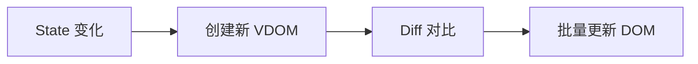

**优势清单：**
- ✅ **自动布局**：无需手动对齐，永不错位
- ✅ **美观统一**：专业渲染，支持多种主题
- ✅ **版本友好**：纯文本定义，diff 清晰
- ✅ **易于维护**：修改只需改文字
- ✅ **GitHub 原生支持**：.md 文件中直接渲染

---

## 2. 支持改造的图表类型

### 2.1 高优先级改造（强烈推荐）

| ASCII 图类型 | 特征 | Mermaid 替代 | 改造难度 |
|-------------|------|-------------|----------|
| **线性流程图** | 单行多框，箭头连接 | `flowchart LR` | ⭐ 简单 |
| **垂直流程图** | 多行框，向下箭头 | `flowchart TD` | ⭐ 简单 |
| **状态机图** | 状态 + 转换条件 | `stateDiagram-v2` | ⭐⭐ 中等 |
| **架构分层图** | 大框套小框，分层结构 | `flowchart TB` + subgraph | ⭐⭐ 中等 |
| **数据结构图** | 节点 + 指针/引用 | `flowchart LR` | ⭐⭐ 中等 |

### 2.2 可改造但需调整

| ASCII 图类型 | 特征 | Mermaid 替代方案 | 注意事项 |
|-------------|------|-----------------|----------|
| **多状态对比图** | 同一结构的多个状态 | 拆分为多个 flowchart | 用文字说明状态变化 |
| **复杂嵌套图** | 3 层以上嵌套 | subgraph 嵌套 | 接受自动布局，不强求精确位置 |
| **时序交互图** | 多对象垂直时间线 | `sequenceDiagram` | 适合组件交互场景 |

### 2.3 不建议改造

| ASCII 图类型 | 原因 | 替代方案 |
|-------------|------|----------|
| 超大型架构图（50+ 节点） | Mermaid 自动布局可能混乱 | 保持 ASCII 或使用 draw.io/Excalidraw |
| 需要精确坐标的图 | Mermaid 不支持手动定位 | 使用 draw.io/Figma |
| 手绘风格草图 | Mermaid 风格过于正式 | 使用 Excalidraw |

---

## 3. 改造对照表

### 3.1 线性流程图

**ASCII 原图：**
```
┌─────────────┐     ┌──────────────┐     ┌──────────────┐     ┌──────────────┐
│  State 变化  │ ──> │ 创建新 VDOM  │ ──> │   Diff 对比   │ ──> │  批量更新 DOM │
└─────────────┘     └──────────────┘     └──────────────┘     └──────────────┘
```

**Mermaid 改造：**


**语法说明：**
- `flowchart LR`：从左到右的流程图
- `A[文本]`：定义节点 A，显示文本
- `-->`：箭头连接符

---

### 3.2 垂直流程图

**ASCII 原图：**
```
┌─────────────────────────────────────────┐
│  阶段一：基础建设（2-4 周）              │
│  ├── 建立文档优先文化                   │
│  ├── 搭建.claude/目录结构               │
│  └── 小范围试点                          │
└─────────────────────────────────────────┘
              │
              ▼
┌─────────────────────────────────────────┐
│  阶段二：全面推广（4-8 周）              │
└─────────────────────────────────────────┘
```

**Mermaid 改造：**
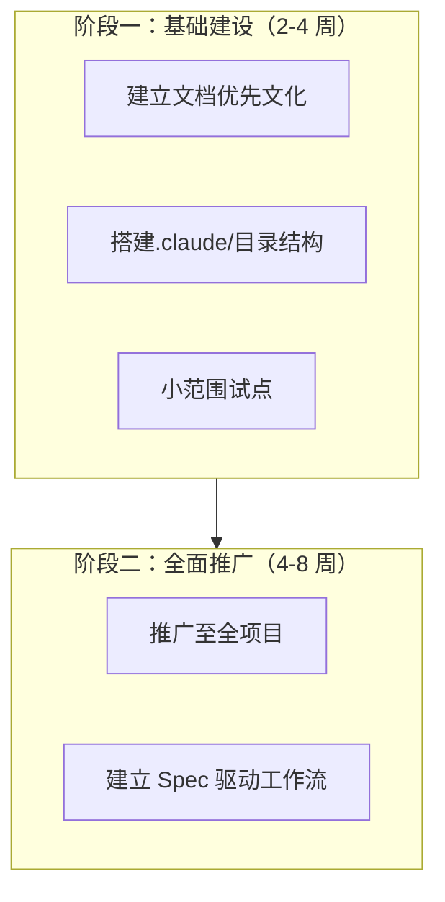

**语法说明：**
- `flowchart TD`：从上到下的流程图
- `subgraph 名称 [标题]`：创建子图/分组框
- 子图自动连接：`Phase1 --> Phase2`

---

### 3.3 状态机图

**ASCII 原图：**
```
                      ┌─────────────┐
                      │  pending    │
                      │  (等待中)    │
                      └──────┬──────┘
                             │
              ┌──────────────┼──────────────┐
              │              │              │
              ↓              ↓              ↓
        resolve()      reject()      throw error
              │              │              │
              ↓              ↓              ↓
     ┌────────────────┐  ┌────────────────┐
     │   fulfilled    │  │    rejected    │
     │    (成功)      │  │    (失败)      │
     └────────────────┘  └────────────────┘
```

**Mermaid 改造：**
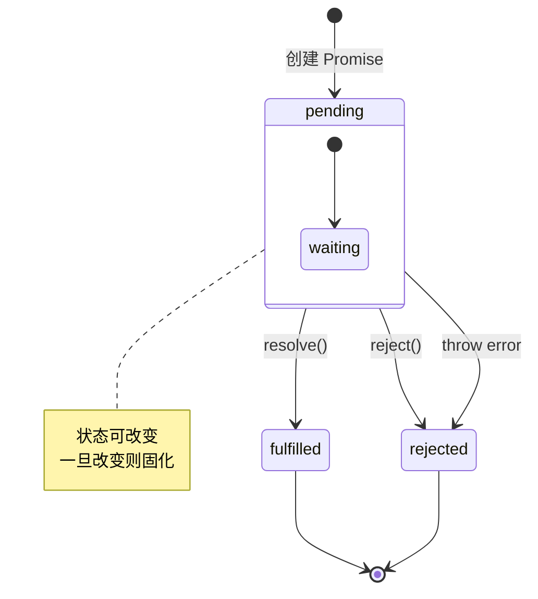

**语法说明：**
- `stateDiagram-v2`：状态图语法版本 2
- `[*]`：起始/结束状态
- `-->`：状态转换
- `: 文本`：转换条件/标签
- `note`：添加注释

---

### 3.4 架构分层图

**ASCII 原图：**
```
┌─────────────────────────────────────────────────────────────┐
│                        用户请求                              │
└────────────────────────┬────────────────────────────────────┘
                         ▼
┌─────────────────────────────────────────────────────────────┐
│                     Edge Network (CDN)                       │
│         缓存层：静态资源、ISR 页面、边缘函数                   │
└────────────────────────┬────────────────────────────────────┘
                         ▼
┌─────────────────────────────────────────────────────────────┐
│                    Next.js Server                            │
│  ┌─────────────────┐  ┌─────────────────┐                  │
│  │   App Router    │  │  Pages Router   │                  │
│  └────────┬────────┘  └────────┬────────┘                  │
└─────────────────────────────────────────────────────────────┘
```

**Mermaid 改造：**
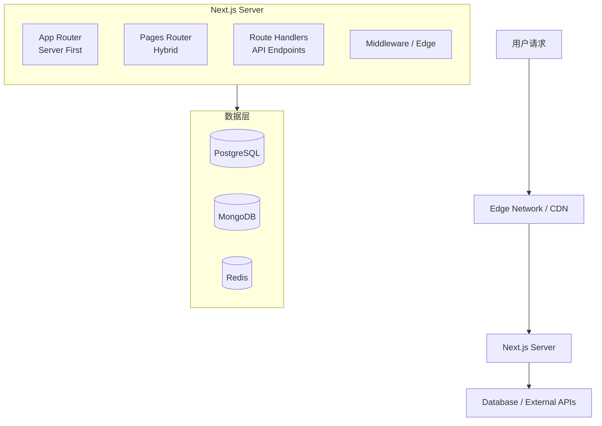

**语法说明：**
- `flowchart TB`：从上到下的架构图
- `subgraph`：创建分组框
- `<br/>`：节点内换行
- `[(文本)]`：数据库形状

---

### 3.5 数据结构图

**ASCII 原图：**
```
Fiber.memoizedState
       ↓
┌─────────────┐     ┌─────────────┐     ┌─────────────┐
│ Hook 1      │ ──> │ Hook 2      │ ──> │ Hook 3      │
│ useState    │     │ useState    │     │ useEffect   │
│ count: 0    │     │ name: ''    │     │ ...         │
└─────────────┘     └─────────────┘     └─────────────┘
```

**Mermaid 改造：**
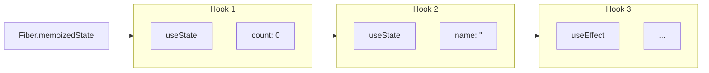

**语法说明：**
- 使用 subgraph 创建多行节点
- `direction TB`：子图内从上到下排列

---

## 4. Mermaid 快速模板

### 4.1 流程图基础模板

```mermaid
%% 从左到右
flowchart LR
    A[开始] --> B{判断条件}
    B -->|是 | C[执行操作]
    B -->|否 | D[结束]

%% 从上到下
flowchart TD
    A[步骤 1] --> B[步骤 2]
    B --> C[步骤 3]
```

### 4.2 节点形状参考

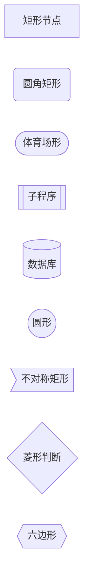

### 4.3 连接线参考

```mermaid
flowchart LR
    A -- 普通连接 --> B
    A ==> 粗线连接 ==> C
    A -. 虚线连接 .-> D
    A o-- 圆圈开始 --o B
    A == 带标签 == C
```

### 4.4 子图模板

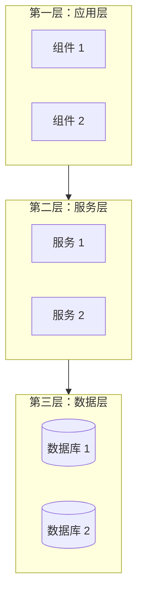

### 4.5 状态图模板

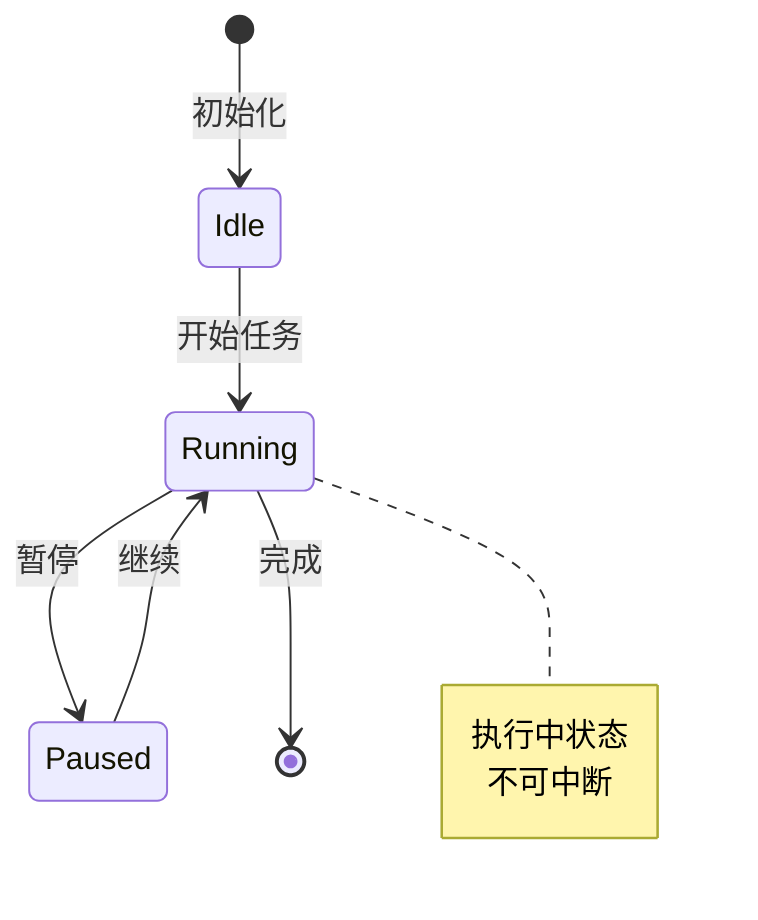

### 4.6 序列图模板

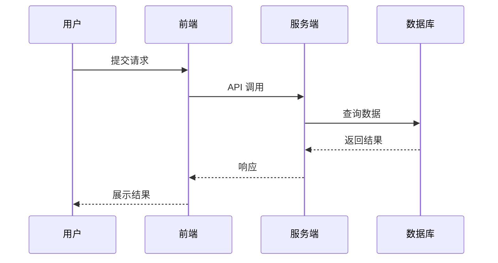

---

## 5. 何时直接使用 Mermaid

### 5.1 遇到以下场景，请直接用 Mermaid

**✅ 推荐场景清单：**

1. **描述流程/步骤**
   - "第一步...第二步...第三步..."
   - "A 完成后交给 B，B 再处理..."

2. **展示系统架构**
   - "系统分为三层：应用层、服务层、数据层"
   - "前端通过网关访问后端服务"

3. **说明状态变化**
   - "订单状态：待支付→已支付→发货→完成"
   - "Promise 状态：pending→fulfilled/rejected"

4. **解释数据结构**
   - "链表结构：节点 1→节点 2→节点 3"
   - "树形结构：根节点→子节点→叶子节点"

5. **展示组件交互**
   - "用户点击→前端发送请求→后端处理→返回结果"

### 5.2 快速决策树

```
需要画图吗？
    │
    ├── 是 → 是什么类型的图？
    │       │
    │       ├── 流程/步骤 → flowchart LR/TD ✅
    │       ├── 架构分层 → flowchart TB + subgraph ✅
    │       ├── 状态变化 → stateDiagram-v2 ✅
    │       ├── 组件交互 → sequenceDiagram ✅
    │       ├── 数据结构 → flowchart LR ✅
    │       │
    │       └── 需要精确布局/手绘风格？
    │               │
    │               ├── 是 → 使用 Excalidraw/draw.io
    │               └── 否 → Mermaid ✅
    │
    └── 否 → 用文字描述即可
```

### 5.3 快速开始示例

**场景：描述用户登录流程**

```markdown
### 登录流程

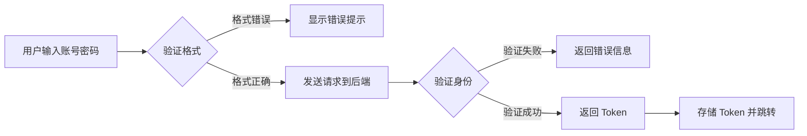
```

**效果：**


---

## 6. 改造检查清单

### 6.1 改造前检查

- [ ] **确认图表类型**：是流程图、状态图还是架构图？
- [ ] **选择合适的 Mermaid 语法**：flowchart/stateDiagram/sequenceDiagram
- [ ] **提取节点文本**：从 ASCII 图中提取所有节点文字
- [ ] **理清连接关系**：明确节点之间的连接和方向

### 6.2 改造后检查

- [ ] **节点完整**：所有 ASCII 图中的节点都已转换
- [ ] **连接正确**：箭头方向和连接关系与原图一致
- [ ] **分组合理**：使用 subgraph 对相关节点分组
- [ ] **标签清晰**：连接线上的标签文字正确
- [ ] **格式验证**：在 Markdown 预览中检查渲染效果

### 6.3 常见问题排查

| 问题 | 可能原因 | 解决方法 |
|------|---------|---------|
| 图不显示 | 语法错误 | 使用 [Mermaid Live Editor](https://mermaid.live) 验证 |
| 布局混乱 | 节点太多 | 使用 subgraph 分组，或拆分为多个图 |
| 文字溢出 | 节点文字太长 | 使用 `<br/>` 换行，或简化文字 |
| 连接交叉 | 自动布局限制 | 调整节点定义顺序，使用 `direction` |

---

## 附录 A：Mermaid 资源

### A.1 官方资源

- **Mermaid 官网**：https://mermaid.js.org
- **在线编辑器**：https://mermaid.live
- **GitHub 文档**：https://github.com/mermaid-js/mermaid

### A.2 图表类型速查

| 类型 | 语法 | 适用场景 |
|------|------|---------|
| 流程图 | `flowchart` | 流程、架构、数据结构 |
| 状态图 | `stateDiagram-v2` | 状态机、生命周期 |
| 序列图 | `sequenceDiagram` | 组件交互、时序 |
| 类图 | `classDiagram` | 类结构、继承关系 |
| ER 图 | `erDiagram` | 数据库设计 |
| 思维导图 | `mindmap` | 知识梳理、概念分层 |
| 甘特图 | `gantt` | 项目计划、时间线 |

### A.3 主题配置

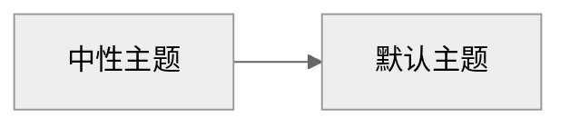

**可用主题：** `default`、`neutral`、`dark`、`forest`、`base`

---

## 附录 B：现有文档改造清单

| 文档 | ASCII 图位置 | 数量 | 改造状态 |
|------|------------|------|---------|
| Guide/传统项目接入指南 | 行 100, 248, 485 | 3 | 待改造 |
| React 核心知识体系 | 行 157, 288, 604, 1366, 1560, 2179, 2456, 2563, 2595 | 9 | 待改造 |
| JavaScript 核心知识 | 行 125, 165, 325, 581, 613, 790, 1141, 1395 | 8 | 待改造 |
| Next.js 核心知识 | 行 70, 161, 259, 349, 377, 430 | 6 | 待改造 |

**总计：26 个 ASCII 图待改造**

---

*文档创建日期：2026-03-26*
