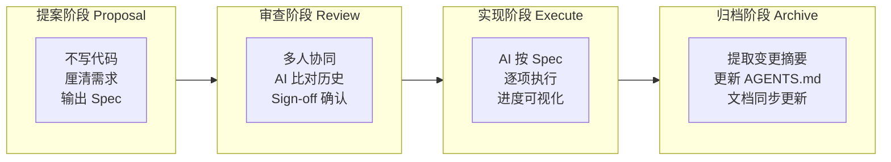
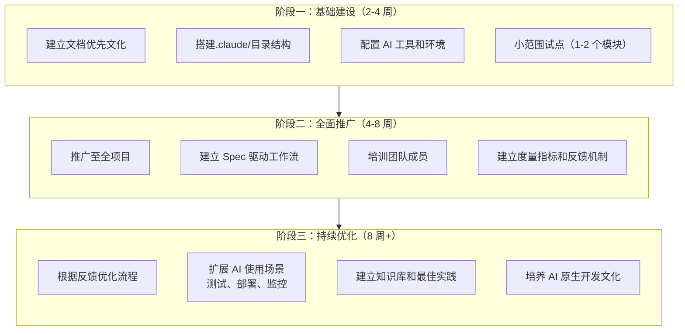
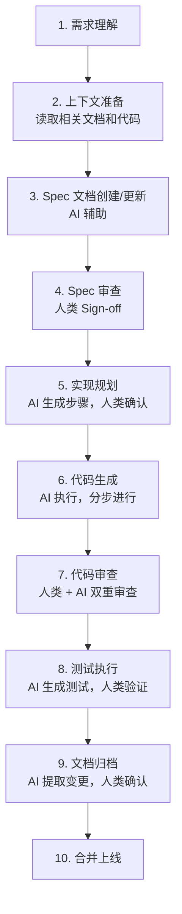

# 传统项目接入文档优先 AI 开发系统指南

> **版本：** 1.0.0 | **作者：** Kei | **更新日期：** 2026-03-26
>
> **一句话描述：** 为传统软件项目提供一套完整的文档优先 AI 开发系统接入方案，涵盖评估、迁移、集成和持续优化的全流程

---

## 目录

1. [概述](#1-概述)
2. [核心概念](#2-核心概念)
3. [接入前评估](#3-接入前评估)
4. [迁移路径设计](#4-迁移路径设计)
5. [文档优先系统构建](#5-文档优先系统构建)
6. [AI Coding 工作流集成](#6-ai-coding 工作流集成)
7. [project-start skill 扩展方案](#7-project-start-skill-扩展方案)
8. [实战案例与最佳实践](#8-实战案例与最佳实践)
9. [常见问题](#9-常见问题)
10. [学习资源](#10-学习资源)

---

## 1. 概述

### 1.1 背景与趋势

2025 年被行业公认为**"Agentic Coding"爆发元年**，AI 编程工具已从单纯的代码补全演进为具备完整软件开发生命周期支持能力的智能系统。根据 GitHub 2025 年第一季度开发者调查报告：

| 指标 | 数据 | 同比变化 |
|------|------|----------|
| 全球 AI Coding 开发者数量 | 1200 万 + | +140% |
| AI 代码生成占比 | 43% + | +25% |
| 编码效率提升 | 40% + | - |
| Y Combinator 2025 届采用规范驱动开发团队 | 25% | - |
| 规范驱动团队 AI 代码测试通过率 | 91.4% | +32% |

### 1.2 传统项目面临的挑战

传统软件项目在接入 AI 开发系统时，主要面临三大核心痛点：

**1. 上下文腐烂 (Context Decay)**
- 问题描述：在多轮交互过程中，对话历史被系统压缩，前期讨论的关键设计决策逐渐被遗忘
- 典型症状：AI 生成的代码与初始需求和核心设计脱节，"前言不搭后语"
- 影响范围：复杂项目、长周期开发、多人协作场景

**2. 审查瘫痪 (Review Paralysis)**
- 问题描述：AI 能在几分钟内生成上万行代码，人类无法逐行 Review
- 典型症状：面对大量 Diff 不敢合并，或盲目合并后埋下隐患
- 影响范围：大规模重构、新功能开发、代码迁移

**3. 维护断层 (Maintenance Gap)**
- 问题描述：AI 生成的代码缺乏文档，两个月后回来修 Bug 时看不懂
- 典型症状：人和新的 AI 都无法接手，"能跑但不敢动"
- 影响范围：长期维护项目、人员流动频繁团队

### 1.3 文档优先 AI 开发系统的价值

文档优先（Document-First）开发范式通过**在编码之前建立完整的文档基础**，解决上述三大痛点：

| 痛点 | 文档优先解决方案 | 实测效果 |
|------|------------------|----------|
| 上下文腐烂 | 用文档锚点锁定上下文，作为"存档点" | 返工率下降 78% |
| 审查瘫痪 | Spec 驱动开发，AI 按规范执行，人类审查 Spec 而非代码 | 审查时间缩短 65% |
| 维护断层 | 文档随项目演进自动更新，保持与代码一致 | 新人上手时间缩短 50% |

### 1.4 本指南适用范围

本指南适用于以下场景：
- **传统瀑布模型项目**：需要向敏捷 +AI 开发转型
- **已有代码库项目**：需要接入 AI 提升开发效率
- **企业级应用**：需要规范化 AI 使用流程
- **个人/小团队**：希望系统化采用 AI Coding 最佳实践

---

## 2. 核心概念

### 2.1 文档优先开发（Document-First Development）

**定义：** 在编写代码之前，先完成需求、设计、接口等文档的结构化定义，将文档作为开发的"唯一事实来源"（Single Source of Truth）。

**核心原则：**
1. **Spec 驱动**：所有代码变更必须对应一份 Spec 文档
2. **可追溯性**：需求→设计→代码→测试全链路可追溯
3. **文档即资产**：文档与代码同等重要，同步维护
4. **人机协作锚点**：文档作为人类意图与 AI 执行的交接点

**为什么需要文档优先？**
- 未采用规范驱动的 AI 编码项目中，**63% 的返工源于初期需求理解偏差**
- 采用文档优先的团队，**提案阶段修正技术方案平均耗时仅 12 分钟**
- AI 无法"读心"，结构化文档是传递意图的唯一可靠方式

### 2.2 SDD（Spec-Driven Development）

**定义：** 规范驱动开发，一套完整的 Spec→实现→复核→留痕工作流程。

**SDD 四步工作流：**



**各阶段详细说明：**

| 阶段 | 核心活动 | 产出物 | 人类/AI 分工 |
|------|----------|--------|--------------|
| 提案 | 需求结构化、任务拆解 | Spec 文档 | 人类定义目标，AI 澄清提问 |
| 审查 | 技术可行性评估、冲突检测 | 审查意见 | 人类 Sign-off，AI 提示风险 |
| 实现 | 代码生成、单元测试 | 代码 + 测试 | AI 执行，人类监督进度 |
| 归档 | 变更摘要提取、文档更新 | 更新后的 Spec | AI 提取，人类确认 |

### 2.3 Agentic Workflows（智能体工作流）

**定义：** AI Agent 拥有一定自主性，能够规划任务、使用工具、反思调整，逐步迭代提升结果质量的工作模式。

**与一次性交互的区别：**

| 特性 | 一次性交互（Copilot） | Agentic Workflows |
|------|----------------------|-------------------|
| 自主性 | 等待指令，直接产出 | 决定如何处理任务 |
| 迭代能力 | 无，生成后无法修正 | 可回看、调整策略 |
| 工具使用 | 有限 | 完整工具链 |
| 适用场景 | 简单任务、快速答疑 | 复杂分析、深度任务 |

**Agent 核心能力：**
- **规划（Planning）**：任务分解（Task Decomposition）、查询分解（Query Decomposition）
- **反思（Reflecting）**：回顾行动结果，基于外部数据调整后续决策
- **记忆（Memory）**：从过去经验中学习，随时间优化响应
- **工具使用（Tools）**：访问文件系统、数据库、API 等外部系统

### 2.4 上下文工程（Context Engineering）

**定义：** 建立标准化的信息传递体系，为 AI 提供精准的开发参照。

**两类上下文：**

```
上下文工程
├── 技术上下文（Tech Context）
│   ├── 技术选型文档
│   ├── 环境配置说明
│   ├── 代码规范约定
│   └── 项目结构说明
│
└── 开发上下文（Dev Context）
    ├── 需求文档
    ├── 设计文档
    ├── 接口定义
    └── 变更记录
```

**上下文管理三步法：**
1. **需求理解与文件筛选**：提取关键信息，识别相关文件
2. **.md 文档创建与维护**：作为上下文管理的核心载体
3. **主动引导式交互**：AI 基于现有代码分析技术栈并生成模板

### 2.5 Vibe Coding

**定义：** 一种全新的编程范式，核心是人类只负责高层架构设计和审美决策（对齐 Vibe），将写代码的脏活累活全权交给 AI Agent。

**Vibe Coding 五大思维：**

| 思维 | 传统编程 | AI 编程（Vibe Coding） |
|------|----------|------------------------|
| 关注点 | "怎么写代码" | "想要解决什么问题" |
| 角色 | 代码编写者 | 产品经理 + 项目指挥 |
| 技能要求 | 语言语法、底层逻辑 | 需求定义、方案评估、结果验证 |
| 错误修正 | 逐行检查、反复测试 | 智能纠错、反馈引导 |
| 核心能力 | 精确指令 | 清晰表达意图、有效引导 AI |

---

## 3. 接入前评估

### 3.1 项目现状评估

在接入 AI 开发系统之前，需要对项目进行全面评估，确定合适的迁移策略。

**评估维度：**

| 维度 | 评估项 | 评分标准（1-5） |
|------|--------|----------------|
| 代码质量 | 测试覆盖率 | 5:>80%, 4:60-80%, 3:40-60%, 2:20-40%, 1:<20% |
| 代码质量 | 技术债务 | 5:几乎无，3:中等，1:严重 |
| 文档完整性 | 需求文档 | 5:完整且更新，3:有但过时，1:无 |
| 文档完整性 | 设计文档 | 5:完整且更新，3:有但过时，1:无 |
| 团队准备度 | AI 工具经验 | 5:熟练使用，3:基础了解，1:零基础 |
| 团队准备度 | 变革意愿 | 5:强烈支持，3:观望，1:抵触 |

**评估结果解读：**
- **总分 20-30 分**：适合全面接入，快速推进
- **总分 10-19 分**：适合分阶段接入，先试点后推广
- **总分<10 分**：建议先进行基础建设（文档、测试），再考虑 AI 接入

### 3.2 6R 迁移策略

参考 Gartner 与 NTT Data 的云迁移 6R 策略，传统项目 AI 化改造可采用以下策略：

| 策略 | 说明 | 适用场景 | AI 介入程度 |
|------|------|----------|-------------|
| **Retain（保留）** | 保持现状，暂不改造 | 核心稳定模块、即将下线功能 | 无 |
| **Rehost（重托部署）** | 迁移到新基础设施，不改代码 | 本地部署→云，物理机→容器 | AI 辅助部署脚本 |
| **Replatform（重构平台）** | 小幅修改适配新平台 | 框架版本升级、数据库迁移 | AI 生成适配代码 |
| **Refactor（重构代码）** | 代码层面优化重构 | 技术债务高、性能瓶颈模块 | AI 生成重构方案 + 执行 |
| **Repurchase（替代购买）** | 用 SaaS/第三方替代 | 通用功能（如支付、邮件） | AI 评估选型 + 集成 |
| **Retire（淘汰）** | 下线废弃功能 | 无人使用、冗余功能 | AI 分析使用日志 |

### 3.3 技术栈兼容性评估

**主流技术栈 AI 工具支持度：**

| 技术栈 | 支持度 | 推荐工具 | 注意事项 |
|--------|--------|----------|----------|
| Java/Spring | ⭐⭐⭐⭐⭐ | Cursor、Claude Code、CodeBuddy | 企业级项目首选 |
| Python/Django | ⭐⭐⭐⭐⭐ | Cursor、Claude Code、GitHub Copilot | AI 工具训练数据丰富 |
| Node.js/React | ⭐⭐⭐⭐⭐ | Cursor、Claude Code、Windsurf | 前端生态完善 |
| Go | ⭐⭐⭐⭐ | Cursor、Claude Code | 后端服务适用 |
| .NET | ⭐⭐⭐⭐ | Visual Studio 2026 + Copilot | 微软生态整合好 |
| PHP | ⭐⭐⭐ | Cursor、Copilot | 老项目迁移需注意 |

### 3.4 组织准备度评估

**团队 AI  readiness 检查清单：**

- [ ] **管理层支持**：有明确的 AI 采用战略和资源投入
- [ ] **培训体系**：有 AI 工具使用培训计划和知识分享机制
- [ ] **安全合规**：有代码安全审查、数据隐私保护流程
- [ ] **度量指标**：定义了 AI 提效的 KPI 和评估方法
- [ ] **变更管理**：有应对 AI 带来工作流程变化的预案

---

## 4. 迁移路径设计

### 4.1 三阶段迁移框架

基于调研资料，我们提出以下三阶段迁移框架：



### 4.2 阶段一：基础建设详细计划

**第 1 周：环境准备**
- 安装 AI 工具（Claude Code、Cursor 等）
- 配置 MCP 服务（文件系统、数据库等）
- 创建 `.claude/` 目录结构
- 编写 CLAUDE.md 项目规范

**第 2 周：文档框架搭建**
- 创建 `docs/` 目录结构
- 编写 PRD.md（产品需求文档）
- 编写 TECH_STACK.md（技术栈文档）
- 编写 APP_FLOW.md（应用流程文档）

**第 3-4 周：小范围试点**
- 选择 1-2 个独立模块作为试点
- 执行完整的 SDD 工作流
- 收集反馈并调整流程
- 编写试点总结报告

### 4.3 阶段二：全面推广详细计划

**第 5-6 周：流程推广**
- 将试点经验推广至全项目
- 为每个功能建立 Spec 文档
- 建立 Spec→代码→测试的闭环

**第 7-8 周：培训与赋能**
- 组织 AI 工具使用培训
- 建立内部知识库
- 设立 AI Champion 角色

**第 9-12 周：度量与反馈**
- 建立提效度量指标
- 收集用户反馈
- 持续优化流程

### 4.4 常见迁移路径示例

**路径 A：从零开始的新项目**
```
项目启动 → project-start 初始化 → 文档优先系统建立 → AI Coding 开发
```

**路径 B：已有文档的老项目**
```
读取现有文档 → 补充缺失内容 → 建立 Spec 驱动流程 → AI 辅助开发
```

**路径 C：无文档的老项目**
```
代码理解与分析 → AI 辅助生成文档 → 建立 Spec 驱动流程 → AI 辅助开发
```

---

## 5. 文档优先系统构建

### 5.1 目录结构设计

推荐的文档优先系统目录结构：

```
project-root/
├── .claude/                      # Claude 配置目录
│   ├── CLAUDE.md                 # 项目规范与开发约定
│   ├── progress.txt              # 项目进度追踪
│   ├── settings.local.json       # 本地设置
│   ├── agents/                   # 子代理定义
│   └── rules/                    # 模块化规则
│
├── docs/                         # 文档系统
│   ├── main/                     # 核心文档
│   │   ├── PRD.md                # 产品需求文档
│   │   ├── APP_FLOW.md           # 应用流程/架构
│   │   ├── TECH_STACK.md         # 技术栈详情
│   │   ├── FRONTEND_GUIDELINES.md # 前端规范
│   │   ├── BACKEND_STRUCTURE.md  # 后端结构
│   │   └── IMPLEMENTATION_PLAN.md # 实施计划
│   ├── specs/                    # Spec 文档（按功能组织）
│   │   ├── feature-xxx/
│   │   │   ├── spec.md           # 功能规格说明
│   │   │   ├── design.md         # 设计文档
│   │   │   └── changelog.md      # 变更记录
│   │   └── feature-yyy/
│   ├── research/                 # 调研报告
│   ├── knowledge-base/           # 技术栈知识库
│   └── reference/                # API 文档（供 Agent 引用）
│
└── src/                          # 源代码
```

### 5.2 核心文档模板

#### 5.2.1 CLAUDE.md 模板

```markdown
# CLAUDE.md - 项目配置与开发规范

## 1. 项目概述
- **项目名称：** [名称]
- **核心目标：** [一句话描述]
- **解决的问题：** [问题陈述]
- **目标用户：** [用户画像]

## 2. 技术栈
- **前端：** [框架、UI 库、状态管理]
- **后端：** [框架、ORM、认证]
- **数据库：** [类型、版本]
- **云服务：** [部署平台、CDN]
- **其他：** [关键技术]

## 3. 代码规范
- **语言：** [主要编程语言]
- **风格：** [缩进、命名、导入顺序]
- **Linter：** [工具列表]
- **提交规范：** [如 Conventional Commits]

## 4. 开发命令
- **安装依赖：** `npm install`
- **开发启动：** `npm run dev`
- **构建：** `npm run build`
- **测试：** `npm test`

## 5. Agent 对话规约
- **对话模式：** [简洁/详细/分步骤]
- **代码生成约束：** [如"先生成接口再实现"]
- **审查重点：** [如"优先关注安全性"]

## 6. 重要约定
- [项目特定约定]
- [团队工作流程]
```

#### 5.2.2 Spec 文档模板

```markdown
# [功能名称] Spec 文档

## 1. 功能目标
- **背景：** 为什么要做这个功能
- **目标：** 功能要实现的具体目标
- **成功指标：** 如何衡量功能成功

## 2. 需求范围
### 2.1 In Scope（包含）
- [需求 1]
- [需求 2]

### 2.2 Out of Scope（不包含）
- [排除项 1]
- [排除项 2]

## 3. 接口契约
### 3.1 输入
- [输入参数 1]：[类型]，[说明]
- [输入参数 2]：[类型]，[说明]

### 3.2 输出
- [返回值/响应]：[类型]，[说明]

### 3.3 边界条件
- [边界条件 1]
- [边界条件 2]

## 4. 验收标准（Acceptance Criteria）
- [ ] AC1: [条件描述]
- [ ] AC2: [条件描述]

## 5. 技术设计
### 5.1 架构影响
- [影响的模块]

### 5.2 数据模型
- [新增/修改的表或集合]

### 5.3 API 设计
- [新增/修改的接口]

## 6. 测试要点
- [测试场景 1]
- [测试场景 2]

## 7. 变更记录
| 日期 | 版本 | 变更内容 | 作者 |
|------|------|----------|------|
| | | | |
```

### 5.3 文档维护机制

**文档更新触发条件：**
- 新增功能：必须创建新的 Spec 文档
- 修改现有功能：更新对应 Spec 文档和变更记录
- Bug 修复：在变更记录中注明

**文档质量检查清单：**
- [ ] 需求描述清晰，无歧义
- [ ] 接口定义完整（输入/输出/边界条件）
- [ ] 验收标准可测量
- [ ] 技术设计与架构一致
- [ ] 测试要点覆盖主要场景

---

## 6. AI Coding 工作流集成

### 6.1 标准开发工作流



### 6.2 各阶段详细操作

#### 6.2.1 需求理解阶段

**人类职责：**
- 清晰描述需求背景和目标
- 提供相关业务上下文
- 指出关键约束条件

**AI 职责：**
- 主动提问澄清模糊点
- 复述需求确保理解一致
- 识别潜在的技术风险

**提示词示例：**
```
我要实现 [功能描述]。

背景：[业务背景]
目标：[要实现什么]
约束：[技术/时间/资源限制]

请先复述你的理解，然后提出任何需要澄清的问题。
```

#### 6.2.2 上下文准备阶段

**人类职责：**
- 指示 AI 阅读相关文档
- 指出需要参考的现有代码

**AI 职责：**
- 读取 Spec 文档
- 分析相关代码结构
- 生成技术上下文摘要

**提示词示例：**
```
请先阅读以下文档：
- docs/specs/[feature-name]/spec.md
- docs/main/TECH_STACK.md

然后分析 src/目录下相关的代码模块，生成一份技术上下文摘要。
```

#### 6.2.3 Spec 文档创建阶段

**人类职责：**
- 提供需求要点
- 确认 AI 生成的 Spec 内容

**AI 职责：**
- 生成结构化的 Spec 文档
- 识别需求中的模糊点和冲突

**提示词示例：**
```
基于我们讨论的需求，请生成一份完整的 Spec 文档。

要求：
1. 包含功能目标、需求范围、接口契约
2. 列出验收标准（至少 5 条）
3. 指出技术设计的考虑点
4. 列出测试要点

输出到：docs/specs/[feature-name]/spec.md
```

#### 6.2.4 代码生成阶段

**人类职责：**
- 确认实现计划
- 监督进度
- 处理 AI 提出的问题

**AI 职责：**
- 按计划分步生成代码
- 保持与 Spec 一致
- 主动报告进度

**提示词示例：**
```
Spec 文档已确认，请生成实现计划。

要求：
1. 拆解为独立的步骤（每步完成一个文件/模块）
2. 预估每步的复杂度
3. 指出可能的风险点

计划确认后，我会说"开始执行"，你再按步骤生成代码。
```

#### 6.2.5 代码审查阶段

**人类职责：**
- 审查 Diff
- 确认符合 Spec
- 检查边界情况

**AI 职责：**
- 生成代码变更摘要
- 自查潜在问题
- 回答审查疑问

**提示词示例：**
```
请生成代码变更摘要，包括：
1. 修改的文件列表
2. 每处变更的目的
3. 可能的影响范围
4. 需要特别注意的地方

然后我会进行审查。
```

### 6.3 上下文管理技巧

**技巧 1：建立上下文索引**
```markdown
# CONTEXT.md - 项目上下文索引

## 核心文档
- [CLAUDE.md](./.claude/CLAUDE.md) - 项目规范
- [TECH_STACK.md](./docs/main/TECH_STACK.md) - 技术栈

## 当前迭代
- [Sprint-001.md](./docs/specs/sprint-001.md) - 当前迭代计划

## 活跃功能
- [feature-a](./docs/specs/feature-a/spec.md) - 功能 A
- [feature-b](./docs/specs/feature-b/spec.md) - 功能 B
```

**技巧 2：使用引用文件**
```markdown
在 Spec 文档中引用其他文档：

参考 [TECH_STACK.md](../../main/TECH_STACK.md) 中定义的 API 规范。
数据模型参考 [BACKEND_STRUCTURE.md](../../main/BACKEND_STRUCTURE.md#数据模型)。
```

**技巧 3：定期清理上下文**
- 合并已完成的 Spec 到变更记录
- 归档过时的文档
- 保持上下文精炼

---

## 7. project-start skill 扩展方案

### 7.1 当前 project-start 能力分析

**现有能力：**
| 能力 | 描述 | 状态 |
|------|------|------|
| 新项目初始化 | 通过无限询问模式建立 .claude/ 和 docs/ 目录 | ✅ 支持 |
| 文档优先系统搭建 | 创建 PRD、APP_FLOW、TECH_STACK 等文档 | ✅ 支持 |
| Agent 对话规约 | 定义人类与 AI 的协作方式 | ✅ 支持 |
| 联动检测 | 检测 skill-adapter 等已有 Skill | ✅ 支持 |

**缺失能力（针对传统项目迁移）：**
| 能力 | 描述 | 优先级 |
|------|------|--------|
| 现有代码分析 | 读取已有代码库，分析技术栈和结构 | 高 |
| 文档逆向生成 | 从代码生成初始文档框架 | 高 |
| 迁移评估 | 执行 3.1 节的评估流程 | 中 |
| 增量迁移计划 | 制定分模块迁移计划 | 高 |
| 风险识别 | 识别迁移过程中的技术风险 | 中 |

### 7.2 扩展方案设计

为保持 project-start 的简洁性，建议采用**模块化扩展**方式：

```
project-start/
├── SKILL.md              # 主入口（保持现有逻辑）
├── new-project/          # 新项目初始化（现有功能）
│   └── ...
├── legacy-migration/     # 传统项目迁移（新增模块）
│   ├── migration-guide.md
│   ├── assessment.md     # 评估流程
│   ├── reverse-doc.md    # 逆向文档生成
│   └── plan-generator.md # 迁移计划生成
└── shared/               # 共享工具
    ├── document-writer.md
    └── context-manager.md
```

### 7.3 legacy-migration 模块详细设计

#### 7.3.1 迁移评估子模块

```markdown
# 迁移评估流程

## 步骤 1：代码库扫描
- 识别技术栈（框架、语言、版本）
- 统计代码规模（文件数、代码行数）
- 分析目录结构

## 步骤 2：文档完整性检查
- 检查现有文档（PRD、设计文档等）
- 评估文档质量和更新情况

## 步骤 3：技术债务评估
- 测试覆盖率分析
- 代码复杂度分析
- 识别高风险模块

## 步骤 4：生成评估报告
输出：docs/migration/assessment-report.md
```

#### 7.3.2 逆向文档生成子模块

```markdown
# 逆向文档生成流程

## 从代码生成文档
1. 读取代码结构和注释
2. 识别核心模块和依赖关系
3. 生成初步的技术文档

## 输出文档
- TECH_STACK.md（技术栈分析）
- ARCHITECTURE.md（架构概述）
- MODULE_GUIDE.md（模块说明）

## 人类确认与补充
- 审查生成的文档
- 补充业务逻辑说明
- 修正技术细节
```

#### 7.3.3 迁移计划生成子模块

```markdown
# 迁移计划生成流程

## 输入
- 评估报告
- 逆向生成的文档
- 业务优先级

## 处理
1. 识别迁移优先级（核心模块优先）
2. 制定分阶段计划
3. 预估时间和资源

## 输出
- docs/migration/migration-plan.md
- 包含阶段划分、时间表、责任分配
```

### 7.4 扩展后的使用流程

**场景 A：新项目**
```
/project-start
→ 选择"新项目"
→ 执行现有初始化流程
```

**场景 B：传统项目迁移**
```
/project-start
→ 选择"传统项目迁移"
→ 执行评估流程
→ 生成逆向文档
→ 制定迁移计划
→ 确认并开始执行
```

### 7.5 扩展建议总结

| 建议 | 说明 | 优先级 |
|------|------|--------|
| 保持核心简洁 | project-start 主入口不变，新增模块独立 | 高 |
| 模块化设计 | 评估、逆向、计划生成为独立子模块 | 高 |
| 渐进式采用 | 支持 Lite 版和标准版两种模式 | 中 |
| 与 skill-adapter 联动 | 迁移后自动检测 Skill 适配需求 | 中 |

---

## 8. 实战案例与最佳实践

### 8.1 案例一：电商后台系统 AI 化改造

**背景：**
- 6 人开发团队
- Java + Spring Boot 后端，Vue 3 前端
- 代码规模：约 50 万行
- 痛点：新人上手慢、需求变更频繁、返工率高

**迁移过程：**
1. **第 1-2 周**：建立.claude/目录，编写 CLAUDE.md
2. **第 3-4 周**：选择用户模块作为试点，执行 SDD 流程
3. **第 5-8 周**：推广至全项目，建立 Spec 驱动文化
4. **第 9-12 周**：持续优化，建立知识库

**效果：**
| 指标 | 改造前 | 改造后 | 提升 |
|------|--------|--------|------|
| 需求交付周期 | 5.2 天 | 1.8 天 | -65% |
| 返工率 | 35% | 8% | -77% |
| 新人上手时间 | 4 周 | 2 周 | -50% |
| 文档缺失率 | 41% | 0% | -100% |

### 8.2 案例二：个人开发者从 0 开发太阳系可视化

**背景：**
- 个人开发者，天体物理专业背景
- 目标：3D 太阳系可视化互动页面
- 技术栈：React + Three.js

**关键教训：**
- **踩坑**：一开始选择 React Native 跨平台，工程配置复杂，AI 陷入编译问题循环
- **调整**：改为纯 Web 方案（React + Three.js），2 周内完成上线

**最佳实践：**
1. 选择 AI 熟悉的技术栈
2. 避免过度设计，先跑通核心功能
3. 用文档记录关键决策，方便后续调整

### 8.3 最佳实践清单

**文档编写：**
- [ ] Spec 文档必须包含 In/Out Scope
- [ ] 验收标准要可测量、可测试
- [ ] 变更记录要详细，包含"为什么变更"
- [ ] 文档要有人类 Sign-off 确认

**AI 协作：**
- [ ] 给 AI 足够的上下文（文档 + 代码）
- [ ] 让 AI 主动提问澄清模糊点
- [ ] 分步执行，每步确认后再继续
- [ ] 重要决策要 Sign-off，不口头确认

**代码审查：**
- [ ] AI 先自查，生成变更摘要
- [ ] 人类审查 Diff，关注核心逻辑
- [ ] 测试用例要覆盖边界情况
- [ ] 审查通过后再合并

**知识管理：**
- [ ] 建立项目知识库
- [ ] 记录踩坑和解决方案
- [ ] 定期回顾，更新最佳实践
- [ ] 新人培训材料要完善

---

## 9. 常见问题

### 9.1 技术类问题

**Q1：老项目没有文档，如何开始？**
> **A：** 采用逆向文档生成策略：
> 1. 让 AI 阅读代码，分析技术栈和结构
> 2. 生成初步的技术文档
> 3. 人类审查补充业务逻辑
> 4. 从下一个需求开始执行 SDD 流程

**Q2：AI 生成的代码与 Spec 不一致怎么办？**
> **A：**
> 1. 要求 AI 重新阅读 Spec
> 2. 指出具体不一致的地方
> 3. 让 AI 解释为什么这样实现
> 4. 必要时重新规划实现步骤

**Q3：上下文太长，AI 无法完整理解怎么办？**
> **A：**
> 1. 建立上下文索引，只读取相关部分
> 2. 使用引用文件组织文档
> 3. 定期清理过时的上下文
> 4. 分模块处理，避免一次性加载全部

### 9.2 流程类问题

**Q4：团队成员抵触 AI 工具怎么办？**
> **A：**
> 1. 组织培训，展示 AI 提效案例
> 2. 从小功能开始，建立信心
> 3. 设立 AI Champion，带动氛围
> 4. 建立激励机制，奖励优秀实践

**Q5：Spec 文档写得太细/太粗怎么办？**
> **A：**
> - **太细**：只写"做什么"，不写"怎么做"，给 AI 留发挥空间
> - **太粗**：补充验收标准，用具体场景约束范围
> - 原则：Spec 要能让独立的开发者/AI 理解需求并实现

**Q6：如何保证文档与代码同步更新？**
> **A：**
> 1. 将文档更新纳入 DoD（Definition of Done）
> 2. AI 生成代码时同步生成变更摘要
> 3. 合并前检查文档是否更新
> 4. 定期审查文档质量

### 9.3 安全与合规问题

**Q7：AI 工具会泄露代码吗？**
> **A：**
> - 选择企业级工具（如私有化部署的 CodeBuddy）
> - 配置代码脱敏规则
> - 敏感模块禁用 AI
> - 定期审查 AI 工具的合规性

**Q8：AI 生成的代码有版权问题吗？**
> **A：**
> - 目前法律尚不明确，建议：
> - 重要代码人类审查
> - 避免直接复制 AI 生成的开源代码
> - 建立内部 AI 代码审查流程

---

## 10. 学习资源

### 10.1 推荐阅读

| 资源 | 类型 | 链接/说明 |
|------|------|-----------|
| 突破 AI Infra 开发困境，文档驱动的 Vibe Coding 实践 | 技术博客 | CSDN |
| AI Coding 新范式实战：5 分钟上手 OpenSpec 规范驱动开发 | 实战指南 | 什么值得买 |
| 面向 Agent 编程：Vibe Coding 设计哲学与最佳实践 | 技术博客 | 知乎 |
| 2025 年 AI 编程工具的"爆发元年"回顾 | 行业分析 | 知乎 |
| AI × 老旧系统：Vibe Coding 构建 AI 迁移工具 | 迁移实战 | 腾讯云 |

### 10.2 工具推荐

| 工具 | 类型 | 适用场景 |
|------|------|----------|
| Claude Code | CLI AI 编程 | 通用开发 |
| Cursor | IDE AI 编程 | 通用开发 |
| Windsurf | IDE AI 编程 | 全栈开发 |
| Visual Studio 2026 + Copilot | IDE AI 编程 | .NET 开发 |
| CodeBuddy | AI 编程 | 企业级 Java |
| OpenSpec | 规范驱动开发 CLI | Spec 驱动工作流 |

### 10.3 本知识库相关文档

| 文档 | 路径 | 用途 |
|------|------|------|
| project-start Skill | `.claude/skills/project-start/SKILL.md` | 新项目初始化 |
| research Skill | `.claude/skills/research/SKILL.md` | 技术调研 |
| skill-adapter | `.claude/skills/skill-adapter/SKILL.md` | Skill 迁移适配 |
| CLAUDE.md | `.claude/CLAUDE.md` | 项目规范模板 |

---

## 附录 A：检查清单

### A.1 接入前评估清单

- [ ] 完成项目现状评估（代码质量、文档完整性）
- [ ] 完成团队准备度评估（AI 经验、变革意愿）
- [ ] 确定迁移策略（6R 中的哪一种）
- [ ] 选择合适的 AI 工具
- [ ] 获得管理层支持

### A.2 文档系统检查清单

- [ ] .claude/ 目录结构完整
- [ ] CLAUDE.md 包含项目规范和开发约定
- [ ] docs/main/ 包含核心文档
- [ ] docs/specs/ 按功能组织 Spec 文档
- [ ] 文档维护机制明确

### A.3 工作流检查清单

- [ ] 需求理解阶段 AI 主动提问
- [ ] Spec 文档包含 In/Out Scope 和验收标准
- [ ] 代码生成前有人类 Sign-off
- [ ] 代码审查包含 AI 自查和人类审查
- [ ] 文档归档同步更新

---

*文档版本：1.0.0 | 创建日期：2026-03-26 | 最后更新：2026-03-26*
