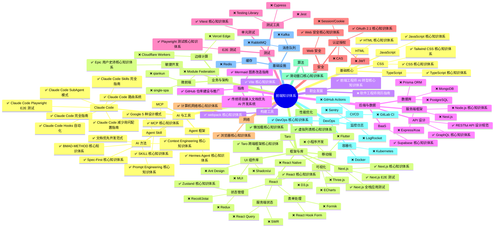
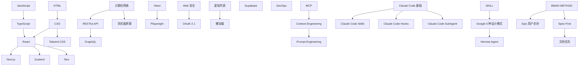
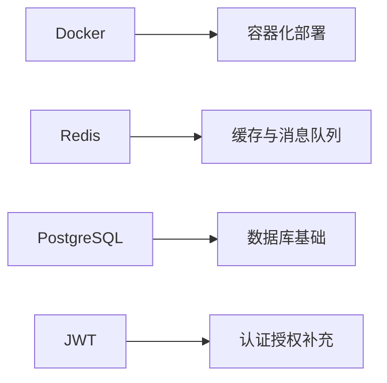
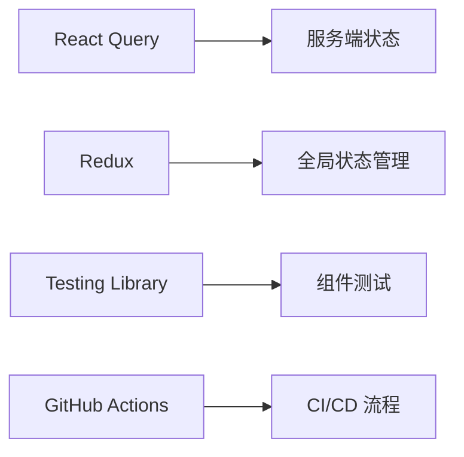
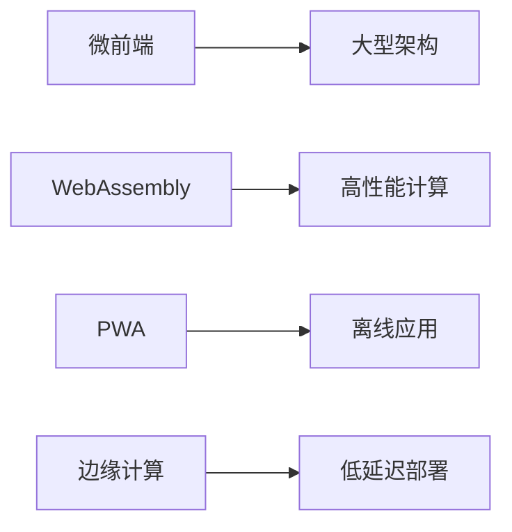

# 前端知识体系图谱

> 包含已有文档 ✅ 和缺失主题 ❌

---

## 完整知识图谱

---

## 统计信息

### 已有文档 ✅

| 类别 | 数量 |
|------|------|
| 基础核心 | 4 |
| 框架与库 | 7 |
| 构建工具 | 2 |
| 后端与数据 | 4 |
| 测试 | 2 |
| 安全 | 2 |
| 网络 | 2 |
| 性能优化 | 2 |
| 算法 | 1 |
| DevOps | 1 |
| AI 与工具 | 13 |
| 业务与架构 | 2 |
| 职业发展 | 1 |
| 指南 | 3 |
| **总计** | **44** |

### 缺失主题 ❌

| 类别 | 缺失数量 | 优先级 |
|------|----------|--------|
| 框架与库 | 9 | P1 |
| 后端与数据 | 5 | P0 |
| 测试 | 3 | P1 |
| 安全 | 3 | P1 |
| DevOps | 5 | P0 |
| 基础设施 | 3 | P0 |
| 业务与架构 | 4 | P2 |
| 职业发展 | 1 | P2 |
| **总计** | **33** | - |

---

## 学习路径推荐

---

## 优先级建议

### P0 高优先级（核心空白）

### P1 中优先级（扩展能力）

### P2 长期主题（前瞻布局）

---

*最后更新：2026-04-07*
