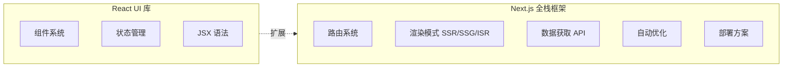
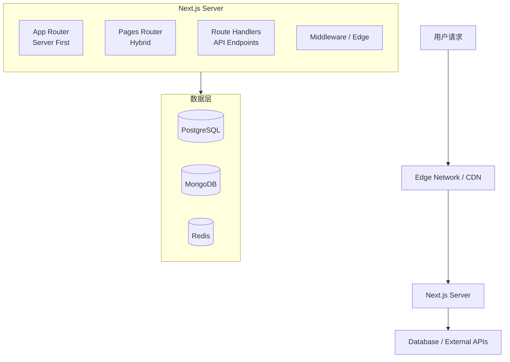
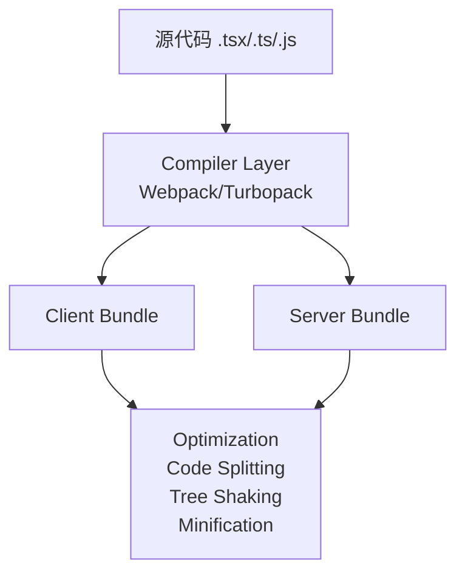
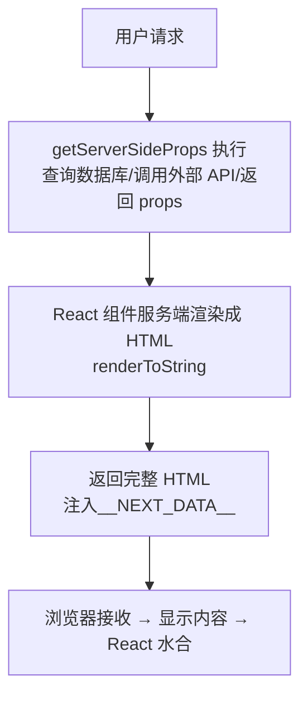
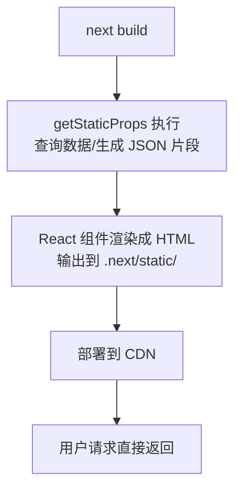
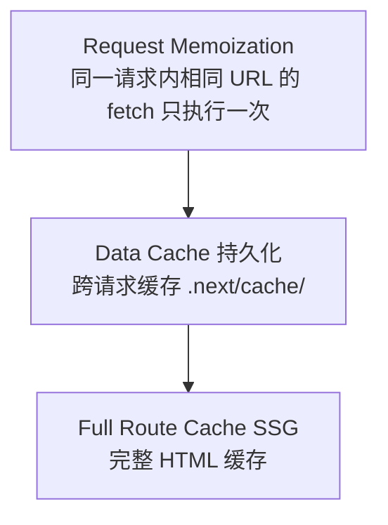
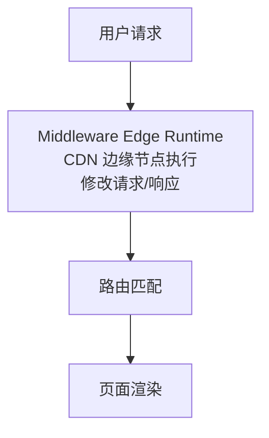
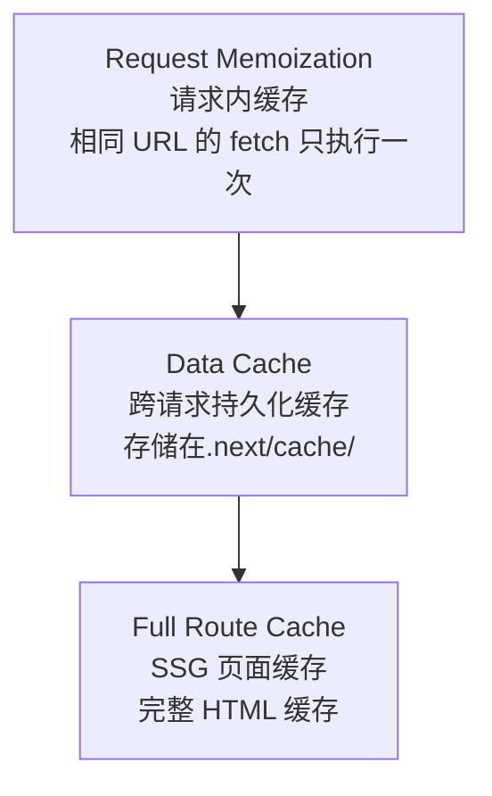

# Next.js 核心知识体系

> Next.js 是一个用于构建**全栈 Web 应用**的 React 框架
>
> **文档特色：**
> - 每个核心概念包含「概念定义 + 工作原理 + 代码示例 + 常见误区」
> - 覆盖渲染模式、路由系统、Server Components、数据获取、性能优化等核心模块
> - 结合官方文档、社区实践、安全公告进行交叉验证
> - 包含架构设计、核心原理、完整工作流程等深度内容

---

## 目录

1. [概述](#1-概述)
2. [核心架构](#2-核心架构)
3. [核心原理](#3-核心原理)
4. [完整工作流程](#4-完整工作流程)
5. [快速入门](#5-快速入门)
6. [基础用法](#6-基础用法)
7. [高级特性](#7-高级特性)
8. [实战案例](#8-实战案例)
9. [常见问题/陷阱](#9-常见问题/陷阱)
10. [学习资源推荐](#10-学习资源推荐)

---

## 1. 概述

### 1.1 什么是 Next.js

**定义：** Next.js 是一个由 Vercel 公司开发的 React 全栈框架，用于构建服务端渲染（SSR）、静态生成（SSG）和客户端渲染（CSR）的 Web 应用。

**关键理解：**
- Next.js **不是替代 React**，而是在 React 基础上增加了更多功能
- React 本身只是"UI 库"，Next.js 提供"完整项目"所需的全套能力
- 自动配置底层工具（Webpack/Turbopack、编译器），让开发者专注业务逻辑

**核心特性列表：**

| 特性类别 | 具体能力 |
|----------|----------|
| 渲染模式 | SSR（服务端渲染）、SSG（静态生成）、ISR（增量静态再生）、CSR（客户端渲染） |
| 路由系统 | 文件系统路由、App Router、Pages Router、动态路由、嵌套布局 |
| 数据获取 | `getServerSideProps`、`getStaticProps`、Server Actions、流式数据 |
| 优化能力 | 自动代码分割、图片优化、字体优化、脚本优化 |
| 全栈能力 | API Routes、Server Actions、数据库直连、中间件 |
| 开发体验 | 热更新（HMR）、TypeScript 支持、快速刷新 |

---

### 1.2 为什么需要 Next.js

**背景：React 原生开发的痛点**

React 本身只是一个 UI 库，在开发完整项目时会遇到以下问题：

| 痛点 | React 原生方案 | Next.js 解决方案 |
|------|---------------|-----------------|
| **路由** | 需安装 react-router，配置复杂 | 文件系统路由，零配置 |
| **渲染** | 默认 CSR，首屏慢、SEO 差 | 支持 SSR/SSG，预渲染 |
| **数据获取** | 需自行设计 API 层 | 内置 `getServerSideProps` 等 |
| **代码分割** | 需手动配置 | 自动按页面分割 |
| **SEO 优化** | 需额外处理 | SSR/SSG 天然支持 |
| **部署** | 需自行配置服务器 | 支持 Vercel、AWS Lambda 等 |

**核心价值主张：**



---

### 1.3 适用场景与边界

**适用场景：**

| 场景类型 | 说明 | 推荐渲染模式 |
|----------|------|-------------|
| 🛒 **电商网站** | 商品详情页、列表页 | SSR + ISR |
| 📄 **内容站点** | 博客、文档、新闻 | SSG + ISR |
| 📊 **Dashboard** | 后台管理、数据看板 | CSR + SSR |
| 🌐 **企业官网** | 品牌展示、产品介绍 | SSG |
| 🔐 **认证应用** | 用户系统、权限控制 | SSR + API Routes |
| 🤖 **AI 应用** | Agent 界面、流式输出 | SSR + Streaming |

**不适用场景（边界）：**

| 场景 | 原因 | 建议替代方案 |
|------|------|-------------|
| 纯静态页面 | 过度设计 | Vite + React、纯 HTML |
| 纯内部工具 | SEO 不重要 | Vite、Create React App |
| 移动端原生应用 | 技术栈不匹配 | React Native、Flutter |
| 实时性极高的应用 | SSR 延迟问题 | 纯 CSR + WebSocket |

---

### 1.4 Next.js vs CRA（Create React App）

**CRA 的核心优势：**
- 零配置启动
- 内置开发服务器，支持热重载
- 一键升级工具链

**Next.js 相比 CRA 的优势：**

| 维度 | CRA | Next.js |
|------|-----|---------|
| 路由 | 需 react-router | 文件系统路由 |
| 渲染 | 仅 CSR | SSR/SSG/ISR/CSR |
| SEO | 差 | 优秀 |
| 首屏性能 | 较慢 | 快 |
| API 能力 | 需单独后端 | 内置 API Routes |
| 图片优化 | 需自行配置 | 自动优化 |
| 部署 | 需配置 | 一键部署 Vercel |

**代码对比示例：**

```jsx
// ❌ CRA - 需要手动配置路由
import { BrowserRouter, Routes, Route } from 'react-router-dom';

function App() {
  return (
    <BrowserRouter>
      <Routes>
        <Route path="/" element={<Home />} />
        <Route path="/about" element={<About />} />
      </Routes>
    </BrowserRouter>
  );
}

// ✅ Next.js App Router - 文件系统自动路由
// app/page.js → /
// app/about/page.js → /about
export default function Home() {
  return <div>Home</div>;
}
```

---

## 2. 核心架构

### 2.1 整体架构（Client/Server 边界）

**架构分层图：**



**Client/Server 边界：**

| 执行位置 | 代码类型 | 典型用途 |
|----------|----------|----------|
| **Server** | Server Components | 数据获取、数据库访问、敏感逻辑 |
| **Edge** | Middleware | 请求预处理、A/B 测试、地域重定向 |
| **Client** | Client Components | 交互、状态管理、浏览器 API |

---

### 2.2 请求处理流程（从 URL 到响应）

**完整请求生命周期：**

```
1. 用户访问 https://example.com/products/123
         │
         ▼
2. CDN 检查缓存
   ├─ 命中 → 返回缓存的 HTML
   └─ 未命中 → 转发到 Next.js Server
         │
         ▼
3. Middleware (Edge) 执行
   ├─ 检查认证 Cookie
   ├─ 地域判断
   └─ 请求头修改
         │
         ▼
4. Router 匹配路由
   ├─ app/products/[id]/page.tsx
   └─ 确定渲染模式
         │
         ▼
5. 数据获取阶段
   ├─ Server Component 执行
   ├─ fetch() / DB 查询
   └─ 缓存检查
         │
         ▼
6. 渲染阶段
   ├─ Server Components → HTML
   ├─ Client Components → 标记边界
   └─ 流式传输（如启用）
         │
         ▼
7. 响应发送
   ├─ HTML 文档
   ├─ JavaScript 包
   └─ 缓存头设置
         │
         ▼
8. 客户端水合 (Hydration)
   ├─ React 接管交互
   └─ 事件绑定
```

---

### 2.3 打包与构建架构（Webpack/Turbopack）

**构建流程：**



**Webpack vs Turbopack：**

| 特性 | Webpack | Turbopack |
|------|---------|-----------|
| 速度 | 较慢（全量构建） | 快 10 倍+（增量编译） |
| 缓存 | 有限 | 持久化缓存 |
| HMR | 标准 | 极速更新 |
| 默认 | Next.js 13 | Next.js 14+ 可选 |

---

### 2.4 目录结构与约定

**App Router 目录结构：**

```
my-app/
├── app/
│   ├── layout.tsx      # 根布局（所有页面共享）
│   ├── page.tsx        # 首页 (/)
│   ├── about/
│   │   └── page.tsx    # 关于页 (/about)
│   ├── products/
│   │   ├── [id]/
│   │   │   └── page.tsx  # 动态路由 (/products/123)
│   │   └── layout.tsx    # 产品页布局
│   └── api/            # API Routes
│       └── users/
│           └── route.ts
├── components/         # 可复用组件
├── lib/               # 工具函数
├── public/            # 静态资源
├── next.config.js     # Next.js 配置
└── package.json
```

**关键约定：**

| 文件/目录 | 作用 |
|-----------|------|
| `page.tsx` | 页面组件，决定路由 |
| `layout.tsx` | 布局组件，嵌套继承 |
| `loading.tsx` | 加载状态（自动 Suspense） |
| `error.tsx` | 错误边界 |
| `not-found.tsx` | 404 页面 |
| `route.ts` | API 端点 |
| `template.tsx` | 可重用的布局（独立实例） |

---

## 3. 核心原理

### 3.1 渲染模式原理（SSR/SSG/ISR/CSR）

**四种渲染模式对比：**

| 模式 | 缩写 | HTML 生成时机 | 缓存策略 | 适用场景 |
|------|------|--------------|----------|----------|
| 客户端渲染 | CSR | 浏览器端 | 无 | Dashboard、后台 |
| 服务端渲染 | SSR | 每次请求 | 不缓存 | 个性化内容 |
| 静态生成 | SSG | 构建时 | 永久缓存 | 博客、文档 |
| 增量静态再生 | ISR | 构建后按需 | 定时更新 | 商品列表、新闻 |

**SSR（服务端渲染）工作流程：**



**SSG（静态生成）工作流程：**



**ISR（增量静态再生）机制：**

```jsx
// 代码示例：ISR 配置
export async function getStaticProps() {
  return {
    props: { data },
    revalidate: 60, // 60 秒后过期
  };
}

// 工作逻辑
时间线：
t=0:  构建时生成页面 v1
t=30s: 用户 A 请求 → 返回 v1（缓存命中）
t=60s: 用户 B 请求 → 返回 v1（旧），触发后台再生
t=61s: 再生完成 → 页面 v2 更新
t=90s: 用户 C 请求 → 返回 v2（新缓存）
```

---

### 3.2 React Server Components 实现机制

**什么是 Server Components？**

Server Components 是一种**仅在服务端运行**的 React 组件，它们：
- **不会**发送任何 JavaScript 到客户端
- 可以直接访问数据库、文件系统
- 可以减少客户端包体积

**RSC 架构原理：**

```mermaid
flowchart TB
    subgraph Server[Server Component]
        direction TB
        Code["async function ProductPage\nconst product = await db.find()"]
    end

    subgraph Payload[Server Component Payload]
        P1[特殊的序列化格式]
        P2[不是 JavaScript]
    end

    subgraph Client[Client 接收]
        C1["{ type: 'server-component' }"]
        C2[children: [...]]
    end

    Server --> Payload
    Payload --> Client
```

**Server vs Client Components：**

| 维度 | Server Components | Client Components |
|------|------------------|-------------------|
| 执行位置 | 服务端 | 客户端浏览器 |
| 数据库访问 | ✅ 直接访问 | ❌ 不可直接访问 |
| 浏览器 API | ❌ 不可用 | ✅ 可用 |
| 交互能力 | ❌ 无（需配合 Client） | ✅ 完整 |
| 包体积 | 0 | 有 |
| 指令 | `'use server'` | `'use client'` |

---

### 3.3 路由系统底层原理

**文件系统路由机制：**

```
app/
├── page.tsx              → /
├── about/
│   └── page.tsx          → /about
├── blog/
│   ├── page.tsx          → /blog
│   ├── [slug]/
│   │   └── page.tsx      → /blog/:slug (动态)
│   └── [...tags]/
│       └── page.tsx      → /blog/tags/* (捕获所有)
└── [[...catchAll]]/
    └── page.tsx          → /* (可选捕获所有)
```

**路由匹配优先级：**

```
1. 静态路由（精确匹配）
2. 动态路由（[param]）
3. 捕获所有路由 ([...slug])
4. 可选捕获所有路由 ([[...slug]])
```

---

### 3.4 数据获取与缓存机制

**Next.js 缓存层级：**



**缓存配置示例：**

```javascript
// 强制缓存 1 小时
fetch(url, { next: { revalidate: 3600 } });

// 标签缓存（可批量失效）
fetch(url, { next: { tags: ['products'] } });
// 失效时：revalidateTag('products');

// 不缓存（每次请求都获取）
fetch(url, { cache: 'no-store' });

// 强制缓存（永不失效）
fetch(url, { cache: 'force-cache' });
```

---

### 3.5 中间件架构（Edge Runtime）

**Middleware 执行时机：**



**Middleware 典型用途：**

```javascript
// middleware.ts
import { NextResponse } from 'next/server';

export function middleware(request) {
  // 1. 认证检查
  const token = request.cookies.get('token');
  if (!token) {
    return NextResponse.redirect('/login');
  }

  // 2. 地域重定向
  const country = request.geo?.country || 'US';
  if (country === 'CN') {
    return NextResponse.redirect('https://cn.example.com');
  }

  // 3. 请求头修改
  const response = NextResponse.next();
  response.headers.set('x-custom-header', 'value');
  return response;
}
```

---

## 4. 完整工作流程

### 4.1 开发工作流（Dev Server → HMR）

```
1. 运行 npm run dev
         │
         ▼
2. Next.js Dev Server 启动
   ├─ 端口 3000（默认）
   ├─ 监听文件变化
   └─ 启用快速刷新
         │
         ▼
3. 访问 http://localhost:3000
         │
         ▼
4. 页面按需编译
   ├─ 仅编译访问的页面
   ├─ 客户端 + 服务端包
   └─ 返回结果
         │
         ▼
5. 修改代码
   ├─ 文件系统检测变化
   ├─ 增量编译（Webpack/Turbopack）
   └─ 推送更新（HMR）
         │
         ▼
6. 浏览器更新
   ├─ 保持组件状态
   └─ 仅更新变更部分
```

---

### 4.2 构建工作流（Compilation → Optimization）

```
运行：npm run build
         │
         ▼
1. 类型检查（TypeScript）
   ├─ 编译所有 TS 文件
   └─ 报告类型错误
         │
         ▼
2. 路由收集
   ├─ 扫描 app/ 或 pages/
   └─ 生成路由清单
         │
         ▼
3. 静态生成（SSG 页面）
   ├─ 执行 getStaticProps
   ├─ 生成 HTML 文件
   └─ 输出到 .next/static/
         │
         ▼
4. 代码优化
   ├─ Tree Shaking
   ├─ Minification
   ├─ Code Splitting
   └─ 生成 Source Maps
         │
         ▼
5. 输出构建产物
   ├─ .next/ 目录
   ├─ standalone（如启用）
   └─ 准备部署
```

---

### 4.3 部署工作流（Output → Hosting）

**Vercel 部署流程：**

```
1. Push 到 Git
         │
         ▼
2. Vercel 检测变化
         │
         ▼
3. 自动触发构建
   ├─ 安装依赖
   ├─ 运行 next build
   └─ 生成优化产物
         │
         ▼
4. 部署到 CDN
   ├─ 静态资源 → 全球边缘节点
   ├─ SSR 页面 → Serverless 函数
   └─ ISR 页面 → 混合缓存
         │
         ▼
5. 更新 DNS 生效
```

**Self-hosting 部署：**

```bash
# 1. 构建
npm run build

# 2. 启动生产服务器
npm run start

# 或使用 standalone 模式
# next.config.js: output: 'standalone'
# 部署独立的 Node.js 应用
```

---

### 4.4 运行时工作流（Request → Response）

```
用户请求 /products/123
         │
         ▼
1. CDN 检查
   ├─ 命中 ISR 缓存 → 返回
   └─ 未命中 → 转发源站
         │
         ▼
2. Middleware 执行
   ├─ 认证/授权检查
   ├─ 请求修改
   └─ 继续/重定向
         │
         ▼
3. 路由匹配
   └─ app/products/[id]/page.tsx
         │
         ▼
4. Server Component 执行
   ├─ 数据获取
   ├─ 缓存检查
   └─ 生成 RSC Payload
         │
         ▼
5. HTML 渲染
   ├─ 合并 Client Components
   ├─ 注入脚本和样式
   └─ 设置缓存头
         │
         ▼
6. 流式响应（如启用）
   ├─ 分块发送 HTML
   └─ Suspense 边界
         │
         ▼
7. 客户端水合
   ├─ 下载 JS 包
   ├─ React 接管
   └─ 事件绑定
```

---

## 5. 快速入门

### 5.1 环境要求

| 依赖 | 版本要求 | 说明 |
|------|----------|------|
| Node.js | 18.17+ | 必须 |
| npm/yarn/pnpm | 最新 | 包管理器 |
| React | 18.2+ | Next.js 自动安装 |

### 5.2 安装步骤

```bash
# 使用 npx（推荐）
npx create-next-app@latest my-app

# 选择配置：
# ✓ Would you like to use TypeScript? Yes
# ✓ Would you like to use ESLint? Yes
# ✓ Would you like to use Tailwind CSS? Yes
# ✓ Would you like to use `src/` directory? Yes
# ✓ Would you like to use App Router? Yes
# ✓ Would you like to customize the default import alias? No
```

### 5.3 Hello World

```jsx
// app/page.tsx
export default function Home() {
  return (
    <main>
      <h1>Hello, Next.js!</h1>
    </main>
  );
}
```

### 5.4 验证方法

```bash
# 进入项目目录
cd my-app

# 启动开发服务器
npm run dev

# 访问 http://localhost:3000
# 看到 "Hello, Next.js!" 即成功
```

---

## 6. 基础用法

### 6.1 路由系统（App Router）

**基本路由：**

```
app/
├── page.tsx           → /
├── about/
│   └── page.tsx       → /about
└── contact/
    └── page.tsx       → /contact
```

**动态路由：**

```tsx
// app/products/[id]/page.tsx
export default function ProductPage({ params }) {
  return <div>Product ID: {params.id}</div>;
}
```

**生成静态参数：**

```tsx
// app/blog/[slug]/page.tsx
export async function generateStaticParams() {
  const posts = await getPosts();
  return posts.map((post) => ({ slug: post.slug }));
}
```

---

### 6.2 布局与模板

**根布局（所有页面共享）：**

```tsx
// app/layout.tsx
export default function RootLayout({ children }) {
  return (
    <html lang="zh">
      <body>
        <Header />
        {children}
        <Footer />
      </body>
    </html>
  );
}
```

**嵌套布局：**

```tsx
// app/dashboard/layout.tsx
export default function DashboardLayout({ children }) {
  return (
    <div className="dashboard">
      <Sidebar />
      {children}
    </div>
  );
}
```

---

### 6.3 数据获取

**Server Component 中获取数据：**

```tsx
// app/products/page.tsx
async function getProducts() {
  const res = await fetch('https://api.example.com/products');
  return res.json();
}

export default async function ProductsPage() {
  const products = await getProducts();
  return (
    <ul>
      {products.map((p) => (
        <li key={p.id}>{p.name}</li>
      ))}
    </ul>
  );
}
```

**使用 `async/await` 直接在组件中：**

```tsx
export default async function Page() {
  const data = await fetch('...', { cache: 'no-store' });
  return <div>{data.title}</div>;
}
```

---

### 6.4 导航与链接

```tsx
'use client';
import Link from 'next/link';
import { useRouter } from 'next/navigation';

export default function Nav() {
  const router = useRouter();

  return (
    <nav>
      <Link href="/">首页</Link>
      <Link href="/about">关于</Link>
      <button onClick={() => router.push('/contact')}>
        联系
      </button>
    </nav>
  );
}
```

---

### 6.5 样式方案

**CSS Modules：**

```tsx
// components/Button.tsx
import styles from './Button.module.css';

export default function Button() {
  return <button className={styles.button}>Click</button>;
}
```

**Tailwind CSS：**

```tsx
export default function Button() {
  return (
    <button className="bg-blue-500 text-white px-4 py-2 rounded">
      Click
    </button>
  );
}
```

---

## 7. 高级特性

### 7.1 Server Components 深度使用

**什么是 Server Components？**

Server Components 是一种**仅在服务端运行**的 React 组件，它们：
- **不会**发送任何 JavaScript 到客户端
- 可以直接访问数据库、文件系统
- 可以减少客户端包体积

**'use server' 指令：**

```tsx
// app/actions.ts
'use server'

export async function submitForm(formData: FormData) {
  // 服务端逻辑：数据库访问、邮件发送等
  const name = formData.get('name')
  await db.users.create({ name })
  return { success: true }
}
```

**'use client' 指令：**

```tsx
// components/Counter.tsx
'use client'

import { useState } from 'react'

export default function Counter() {
  const [count, setCount] = useState(0)
  return (
    <button onClick={() => setCount(c => c + 1)}>
      Count: {count}
    </button>
  )
}
```

**组合模式（Server + Client）：**

```tsx
// app/page.tsx (Server Component)
import Counter from '@/components/Counter'

async function getData() {
  const res = await fetch('https://api.example.com/data')
  return res.json()
}

export default async function Page() {
  const data = await getData()
  return (
    <div>
      <h1>{data.title}</h1>
      {/* Client Component 作为子节点 */}
      <Counter />
    </div>
  )
}
```

**常见误区：**

| 误区 | 正确理解 |
|------|----------|
| Server Component 不能有交互 | 可以有 Client Component 子节点 |
| 'use client' 会影响整个应用 | 只影响该组件及其子节点 |
| 所有组件都应该是 Server | 需要交互的必须是 Client |

---

### 7.2 流式渲染与 Suspense

**流式渲染原理：**

流式渲染（Streaming）是一种渐进式渲染技术，允许服务器将页面内容分块发送到客户端，而不是等待所有内容就绪后才发送。

**传统 SSR vs 流式 SSR：**

```
传统 SSR:
请求 → [等待所有数据] → 完整 HTML → 用户看到内容

流式 SSR:
请求 → HTML 外壳 → [数据块 1] → [数据块 2] → 用户逐步看到内容
```

**Suspense 基础用法：**

```tsx
import { Suspense } from 'react'
import LoadingSpinner from '@/components/Spinner'

export default function Page() {
  return (
    <main>
      {/* 首屏立即显示 */}
      <Header />

      {/* 延迟加载的内容 */}
      <Suspense fallback={<LoadingSpinner />}>
        <SlowComponent />
      </Suspense>

      {/* 另一个独立的加载单元 */}
      <Suspense fallback={<div>加载中...</div>}>
        <Recommendations />
      </Suspense>
    </main>
  )
}
```

**loading.tsx 自动 Suspense：**

```tsx
// app/dashboard/loading.tsx
export default function Loading() {
  return <div className="spinner">Dashboard 加载中...</div>
}

// app/dashboard/page.tsx
// 自动与 loading.tsx 配对，无需手动包裹 Suspense
export default async function Dashboard() {
  const data = await fetchDashboardData()
  return <div>{/* ... */}</div>
}
```

**流式渲染最佳实践：**

1. **合理设置 Fallback**：应与最终内容布局接近，避免视觉跳动
2. **细粒度拆分**：将页面拆分为多个独立的 Suspense 边界
3. **优先显示关键内容**：首屏内容优先，次要内容延迟加载

---

### 7.3 中间件（Middleware）

**Middleware 执行时机：**

```
用户请求 → Middleware (Edge) → 路由匹配 → 页面渲染
```

**基础配置：**

```typescript
// middleware.ts
import { NextResponse } from 'next/server'
import type { NextRequest } from 'next/server'

export function middleware(request: NextRequest) {
  // 中间件逻辑
  return NextResponse.next()
}

export const config = {
  matcher: [
    '/((?!api|_next/static|_next/image|favicon.ico).*)',
  ],
}
```

**三大常用场景：**

**1. 权限拦截：**

```typescript
export function middleware(request: NextRequest) {
  const token = request.cookies.get('token')
  const { pathname } = request.nextUrl

  // 访问 dashboard 但未登录，重定向到登录页
  if (pathname.startsWith('/dashboard') && !token) {
    return NextResponse.redirect(new URL('/login', request.url))
  }

  return NextResponse.next()
}
```

**2. 修改请求头：**

```typescript
export function middleware(request: NextRequest) {
  const requestHeaders = new Headers(request.headers)
  requestHeaders.set('x-custom-header', 'value')

  return NextResponse.next({
    request: { headers: requestHeaders },
  })
}
```

**3. 处理跨域 (CORS)：**

```typescript
export function middleware() {
  const response = NextResponse.next()
  response.headers.set('Access-Control-Allow-Origin', '*')
  response.headers.set(
    'Access-Control-Allow-Methods',
    'GET, POST, PUT, DELETE, OPTIONS'
  )
  return response
}
```

**Edge Runtime 限制：**

| 不支持 | 说明 |
|--------|------|
| `fs` 模块 | 无法读取文件系统 |
| 请求体读取 | 只能读取 headers、cookies、URL |
| 全局状态 | Edge 是无状态的 |

---

### 7.4 API 路由与全栈开发

**Route Handler 基础：**

```typescript
// app/api/users/route.ts
import { NextResponse } from 'next/server'

export async function GET() {
  const users = await db.users.findMany()
  return NextResponse.json({ users })
}

export async function POST(request: Request) {
  const body = await request.json()
  const user = await db.users.create(body)
  return NextResponse.json({ user }, { status: 201 })
}
```

**动态路由参数：**

```typescript
// app/api/users/[id]/route.ts
export async function GET(
  request: Request,
  { params }: { params: { id: string } }
) {
  const user = await db.users.find(params.id)
  if (!user) {
    return NextResponse.json({ error: 'Not found' }, { status: 404 })
  }
  return NextResponse.json({ user })
}
```

**Server Actions（数据 Mutation）：**

```typescript
// app/actions.ts
'use server'

import { revalidateTag } from 'next/cache'

export async function createUser(formData: FormData) {
  const name = formData.get('name') as string
  const email = formData.get('email') as string

  await db.users.create({ name, email })

  // 重新验证缓存
  revalidateTag('users', 'max')

  return { success: true }
}
```

**表单集成：**

```tsx
// app/page.tsx
import { createUser } from './actions'

export default function Home() {
  return (
    <form action={createUser}>
      <input name="name" placeholder="姓名" required />
      <input name="email" type="email" placeholder="邮箱" required />
      <button type="submit">创建用户</button>
    </form>
  )
}
```

---

### 7.5 缓存与性能优化

**缓存层级：**



**缓存配置选项：**

```typescript
// 强制缓存 1 小时
fetch(url, { next: { revalidate: 3600 } })

// 标签缓存
fetch(url, { next: { tags: ['products'] } })
// 失效：revalidateTag('products', 'max')

// 不缓存
fetch(url, { cache: 'no-store' })

// 强制缓存（永不失效）
fetch(url, { cache: 'force-cache' })
```

**`revalidateTag` 最佳实践：**

```typescript
// app/actions.ts
'use server'
import { revalidateTag } from 'next/cache'

export async function updateProduct(id: string, data: any) {
  await db.products.update(id, data)
  // 标记为 stale，下次访问时后台更新
  revalidateTag('products', 'max')
}
```

**图片优化：**

```tsx
import Image from 'next/image'

// 自动优化：WebP 格式、响应式尺寸、懒加载
<Image
  src="/hero.jpg"
  alt="Hero"
  width={1200}
  height={630}
  priority  // 首屏图片优先加载
  quality={85}
/>
```

**字体优化：**

```tsx
import { Inter } from 'next/font/google'

const inter = Inter({
  subsets: ['latin'],
  display: 'swap',  // 避免 FOIT
})

export default function RootLayout({ children }) {
  return (
    <html lang="zh" className={inter.className}>
      <body>{children}</body>
    </html>
  )
}
```

---

### 7.6 国际化 (i18n)

**推荐方案：next-intl**

**安装配置：**

```bash
npm install next-intl
```

**创建语言文件：**

```typescript
// locales/client.ts
"use client"
import { createI18nClient } from 'next-international/client'

export const { useI18n, I18nProviderClient } = createI18nClient({
  en: () => import('./en'),
  zh: () => import('./zh'),
})

// locales/en.ts
export default {
  home: {
    title: 'Home',
    description: 'Welcome to our site',
  },
} as const

// locales/zh.ts
export default {
  home: {
    title: '首页',
    description: '欢迎访问我们的网站',
  },
} as const
```

**Middleware 配置：**

```typescript
// middleware.ts
import createMiddleware from 'next-intl/middleware'

export default createMiddleware({
  locales: ['en', 'zh'],
  defaultLocale: 'zh',
  localePrefix: 'always',
})

export const config = {
  matcher: ['/((?!api|_next|_vercel|.*\\..*).*)'],
}
```

**使用翻译：**

```tsx
// app/[locale]/page.tsx
import { getI18n } from '@/locales/server'

export default async function Home() {
  const t = await getI18n()
  return (
    <div>
      <h1>{t('home.title')}</h1>
      <p>{t('home.description')}</p>
    </div>
  )
}
```

---

### 7.7 元数据 API（SEO）

**静态元数据：**

```typescript
// app/layout.tsx
import type { Metadata } from 'next'

export const metadata: Metadata = {
  title: {
    template: '%s | 我的站点',
    default: '我的站点 - 欢迎来到这里',
  },
  description: '这是一个很棒的站点',
  keywords: ['Next.js', 'React', 'Web 开发'],
  robots: {
    index: true,
    follow: true,
  },
  openGraph: {
    title: '我的站点',
    description: '欢迎来到我的站点',
    images: ['/og-image.png'],
    locale: 'zh_CN',
    type: 'website',
  },
}
```

**动态元数据：**

```typescript
// app/blog/[slug]/page.tsx
import type { Metadata } from 'next'

type Props = { params: { slug: string } }

export async function generateMetadata({ params }: Props): Promise<Metadata> {
  const post = await getPost(params.slug)
  return {
    title: post.title,
    description: post.excerpt,
    openGraph: {
      images: [post.coverImage],
    },
  }
}

export default async function BlogPost({ params }: Props) {
  const post = await getPost(params.slug)
  return <article>{post.content}</article>
}
```

**SEO 最佳实践：**

| 项目 | 建议 |
|------|------|
| 标题长度 | 60 字符以内 |
| 描述长度 | 160 字符以内 |
| OG 图片 | 1200x630px |
| Canonical URL | 避免重复内容 |
| 站点地图 | 使用 `next-sitemap` 生成 |

---

## 8. 实战案例

### 8.1 博客/CMS 系统

**需求：**
- 文章列表和详情页
- 支持 Markdown 渲染
- 静态生成 + ISR 更新

**项目结构：**

```
app/
├── layout.tsx
├── page.tsx              # 首页（文章列表）
├── blog/
│   ├── [slug]/
│   │   └── page.tsx      # 文章详情
│   └── page.tsx          # 博客首页
└── api/
    └── revalidate/
        └── route.ts      # ISR 触发端点
```

**文章数据获取：**

```typescript
// lib/posts.ts
import fs from 'fs'
import matter from 'gray-matter'

export async function getPosts() {
  const files = fs.readdirSync('posts')
  return files.map((file) => {
    const content = fs.readFileSync(`posts/${file}`, 'utf-8')
    const { data, content: markdown } = matter(content)
    return { slug: file.replace('.md', ''), ...data, markdown }
  })
}

export async function getPost(slug: string) {
  const content = fs.readFileSync(`posts/${slug}.md`, 'utf-8')
  const { data, content: markdown } = matter(content)
  return { ...data, markdown }
}
```

**静态生成配置：**

```typescript
// app/blog/[slug]/page.tsx
export async function generateStaticParams() {
  const posts = await getPosts()
  return posts.map((post) => ({ slug: post.slug }))
}

export default async function BlogPost({ params }: { params: { slug: string } }) {
  const post = await getPost(params.slug)
  return (
    <article>
      <h1>{post.title}</h1>
      <Markdown content={post.markdown} />
    </article>
  )
}
```

**ISR 触发端点：**

```typescript
// app/api/revalidate/route.ts
import { revalidateTag } from 'next/cache'

export async function GET(request: Request) {
  const tag = request.nextUrl.searchParams.get('tag')
  if (tag) {
    revalidateTag(tag, 'max')
    return Response.json({ revalidated: true })
  }
  return Response.json({ error: 'Missing tag' }, { status: 400 })
}
```

---

### 8.2 电商产品页

**需求：**
- 产品列表（支持分页）
- 产品详情页
- 购物车功能

**产品列表（ISR）：**

```typescript
// app/products/page.tsx
export const dynamic = 'force-dynamic'
export const revalidate = 3600 // 1 小时

async function getProducts() {
  const res = await fetch('https://api.example.com/products', {
    next: { tags: ['products'] },
  })
  return res.json()
}

export default async function ProductsPage() {
  const products = await getProducts()
  return (
    <div className="grid grid-cols-3 gap-4">
      {products.map((p) => (
        <ProductCard key={p.id} product={p} />
      ))}
    </div>
  )
}
```

**产品详情（SSR）：**

```typescript
// app/products/[id]/page.tsx
async function getProduct(id: string) {
  const res = await fetch(`https://api.example.com/products/${id}`, {
    next: { tags: [`product-${id}`] },
  })
  return res.json()
}

export default async function ProductPage({ params }: { params: { id: string } }) {
  const product = await getProduct(params.id)
  return (
    <div>
      <h1>{product.name}</h1>
      <p>{product.description}</p>
      <AddToCart productId={product.id} />
    </div>
  )
}
```

---

### 8.3 用户 Dashboard（含认证）

**Middleware 认证：**

```typescript
// middleware.ts
export function middleware(request: NextRequest) {
  const token = request.cookies.get('token')
  const { pathname } = request.nextUrl

  if (pathname.startsWith('/dashboard') && !token) {
    return NextResponse.redirect(new URL('/login', request.url))
  }

  return NextResponse.next()
}
```

**Dashboard 布局：**

```typescript
// app/dashboard/layout.tsx
export default function DashboardLayout({ children }) {
  return (
    <div className="flex">
      <Sidebar />
      <main className="flex-1">{children}</main>
    </div>
  )
}
```

**数据获取（带认证）：**

```typescript
// app/dashboard/page.tsx
import { cookies } from 'next/headers'

async function getUserData() {
  const cookieStore = await cookies()
  const token = cookieStore.get('token')?.value

  const res = await fetch('https://api.example.com/user', {
    headers: { Authorization: `Bearer ${token}` },
    cache: 'no-store',
  })
  return res.json()
}

export default async function Dashboard() {
  const user = await getUserData()
  return (
    <div>
      <h1>欢迎，{user.name}</h1>
      <StatsCard stats={user.stats} />
    </div>
  )
}
```

---

### 8.4 实时数据应用

**需求：**
- WebSocket 实时推送
- 服务端事件（SSE）

**SSE 端点：**

```typescript
// app/api/stream/route.ts
import { NextResponse } from 'next/server'

export async function GET() {
  const encoder = new TextEncoder()
  const stream = new ReadableStream({
    start(controller) {
      const interval = setInterval(() => {
        controller.enqueue(
          encoder.encode(`data: ${JSON.stringify({ time: Date.now() })}\n\n`)
        )
      }, 1000)

      setTimeout(() => {
        clearInterval(interval)
        controller.close()
      }, 60000)
    },
  })

  return new NextResponse(stream, {
    headers: {
      'Content-Type': 'text/event-stream',
      'Cache-Control': 'no-cache',
      Connection: 'keep-alive',
    },
  })
}
```

**客户端消费：**

```typescript
// components/LiveData.tsx
'use client'

import { useEffect, useState } from 'react'

export default function LiveData() {
  const [data, setData] = useState<any[]>([])

  useEffect(() => {
    const eventSource = new EventSource('/api/stream')
    eventSource.onmessage = (event) => {
      setData((prev) => [...prev, JSON.parse(event.data)])
    }
    return () => eventSource.close()
  }, [])

  return (
    <div>
      {data.map((d, i) => (
        <div key={i}>{d.time}</div>
      ))}
    </div>
  )
}
```

---

## 9. 常见问题/陷阱

### 9.1 渲染模式选择困惑

**决策树：**

```
内容是否需要 SEO？
├─ 否 → CSR（客户端渲染）
└─ 是 → 内容是否频繁变化？
    ├─ 否 → SSG（静态生成）
    ├─ 是 → 内容是否个性化？
        ├─ 否 → ISR（增量静态再生）
        └─ 是 → SSR（服务端渲染）
```

**常见错误：**

| 错误 | 后果 | 正确做法 |
|------|------|----------|
| 所有页面都用 SSR | 服务器负载高、响应慢 | 静态内容用 SSG/ISR |
| Dashboard 用 SSG | 数据不实时 | Dashboard 用 CSR 或 SSR |
| ISR revalidate 过短 | 失去缓存意义 | 根据业务需求设置合理时间 |

---

### 9.2 水合错误与解决

**什么是水合错误？**

水合（Hydration）是 React 在客户端接管服务端渲染的 HTML 的过程。当服务端 HTML 与客户端初始渲染不一致时，会出现水合错误。

**常见原因：**

1. **HTML 结构不匹配**
```tsx
// ❌ 错误：服务端渲染条件与客户端不同
{typeof window !== 'undefined' && <ClientOnly />}

// ✅ 正确：使用 useEffect 延迟渲染
const [mounted, setMounted] = useState(false)
useEffect(() => setMounted(true), [])
return mounted && <ClientOnly />
```

2. **时间戳/随机数**
```tsx
// ❌ 错误：服务端和客户端生成不同值
<div>{Date.now()}</div>
<div>{Math.random()}</div>

// ✅ 正确：使用 useEffect 在客户端生成
const [value, setValue] = useState(0)
useEffect(() => setValue(Date.now()), [])
```

3. **浏览器扩展干扰**
- 某些浏览器扩展会修改 DOM，导致水合失败
- 使用 `suppressHydrationWarning` 忽略特定元素

---

### 9.3 性能陷阱

**陷阱 1：过度使用 Client Components**

```tsx
// ❌ 错误：整个组件树都是 Client
'use client'
export default function Page() {
  return <div>...</div>
}

// ✅ 正确：仅交互部分是 Client
// page.tsx (Server)
import ClientPart from './ClientPart'
export default function Page() {
  return (
    <div>
      <ServerPart />
      <ClientPart />
    </div>
  )
}
```

**陷阱 2：缓存配置不当**

```tsx
// ❌ 错误：频繁变化的数据用 force-cache
fetch(url, { cache: 'force-cache' })

// ✅ 正确：根据数据特性选择
fetch(url, { next: { revalidate: 60 } })  // ISR
fetch(url, { cache: 'no-store' })         // 实时数据
```

**陷阱 3：图片未优化**

```tsx
// ❌ 错误：使用原生 img


// ✅ 正确：使用 next/image
import Image from 'next/image'
<Image src="/large.jpg" alt="..." width={800} height={600} />
```

---

### 9.4 部署问题

**问题 1：构建失败**

```bash
# 常见错误：TypeScript 类型错误
# 解决：修复类型错误或使用 ignoreBuildErrors
// next.config.js
module.exports = {
  typescript: { ignoreBuildErrors: true },
}
```

**问题 2：静态资源 404**

- 确保文件放在 `public/` 目录
- 使用绝对路径引用：``

**问题 3：环境变量未生效**

| 变量类型 | 前缀 | 说明 |
|----------|------|------|
| 服务端 | `VAR_NAME` | 仅服务端可用 |
| 客户端 | `NEXT_PUBLIC_VAR_NAME` | 客户端可用 |

---

### 9.5 安全漏洞

**RSC 远程代码执行漏洞（CVE-2025-55182）**

**影响版本：**
- Next.js v15.0.0 - 15.0.4
- Next.js v15.1.0 - 15.1.8
- Next.js v14.3.0-canary.77 及以上 Canary 版本

**漏洞原理：**
RSC 服务器在处理客户端的 Flight 协议数据时，缺少必要的安全校验，攻击者可构造恶意请求实现远程代码执行。

**修复方案：**
```bash
# 升级到安全版本
npm install next@latest
# 或至少升级到
npm install next@15.2.0
```

**安全最佳实践：**

1. **始终在 Server Actions 中验证输入**
```typescript
'use server'
export async function createUser(formData: FormData) {
  const email = formData.get('email') as string
  // 验证
  if (!/^[^\s@]+@[^\s@]+\.[^\s@]+$/.test(email)) {
    throw new Error('Invalid email')
  }
  // ...
}
```

2. **不在 URL 中暴露敏感数据**
```typescript
// ❌ 错误
return redirect(`/dashboard?userId=${userId}&token=${token}`)

// ✅ 正确
cookies().set('token', token)
return redirect('/dashboard')
```

3. **使用 CSRF 保护**
- Next.js 14+ 的 Server Actions 内置 CSRF 保护
- API Routes 需自行实现

---

## 10. 学习资源推荐

### 10.1 官方资源

| 资源 | 链接 | 说明 |
|------|------|------|
| Next.js 官方文档 | [nextjs.org/docs](https://nextjs.org/docs) | 完整 API 参考和教程 |
| Next.js 博客 | [nextjs.org/blog](https://nextjs.org/blog) | 最新版本动态 |
| App Router 文档 | [nextjs.org/docs/app](https://nextjs.org/docs/app) | App Router 专用文档 |
| Next.js 示例仓库 | [GitHub](https://github.com/vercel/next.js/tree/canary/examples) | 官方示例集合 |
| Vercel 文档 | [vercel.com/docs](https://vercel.com/docs) | 部署相关文档 |

### 10.2 社区资源

| 资源 | 说明 |
|------|------|
| CSDN Next.js 专栏 | 中文技术文章 |
| 稀土掘金 Next.js 标签 | 中文社区分享 |
| Next.js 中文文档 | [nextjs.frontendx.cn](https://nextjs.frontendx.cn) | 社区翻译 |
| GitHub Discussions | [GitHub](https://github.com/vercel/next.js/discussions) | 官方讨论区 |

### 10.3 深入学习

**推荐书籍：**
- 《Next.js 实战》（待出版）
- 《React Server Components 深入》

**视频课程：**
- Vercel 官方 YouTube 频道
- Next.js 官方 Workshop

**相关技术文档：**
- [React Server Components](https://react.dev/reference/react/server-components)
- [Turbopack 文档](https://turbo.build/pack)
- [SWR 数据获取](https://swr.vercel.app)

---

## 附录：完整引用列表

| 编号 | 来源类型 | 标题 | 链接 | 查阅时间 |
|------|----------|------|------|----------|
| #1 | 官方文档 | Next.js Docs | https://nextjs.org/docs | 2026-03-26 |
| #2 | 官方文档 | App Router | https://nextjs.org/docs/app | 2026-03-26 |
| #3 | 官方博客 | Next.js 16.2 AI Improvements | https://nextjs.org/blog | 2026-03-26 |
| #4 | 官方文档 | revalidateTag API | https://nextjs.org/docs/app/api-reference/functions/revalidateTag | 2026-03-26 |
| #5 | 中文文档 | Next.js 中文文档 | https://nextjs.frontendx.cn | 2026-03-26 |
| #6 | 技术博客 | Next.js 渲染模式全解析 | CSDN | 2026-03-26 |
| #7 | 技术博客 | Next.js 流式渲染实战指南 | CSDN | 2026-03-26 |
| #8 | 技术博客 | Next.js Middleware 极简教程 | 知乎 | 2026-03-26 |
| #9 | 技术博客 | Next.js 国际化完整指南 | CSDN | 2026-03-26 |
| #10 | 技术博客 | Next.js SEO 优化实战 | CSDN | 2026-03-26 |
| #11 | 技术博客 | React Server Components 远程代码执行漏洞公告 | http://www.fynu.edu.cn | 2026-03-26 |
| #12 | 官方文档 | Next.js Internationalization | https://nextjs.org/docs/pages/guides/internationalization | 2026-03-26 |
| #13 | GitHub | next-intl | https://github.com/amannn/next-intl | 2026-03-26 |

---

*文档创建日期：2026-03-26*
*最后更新：2026-03-26*
*版本：1.0.0（完整版）*

| 编号 | 来源类型 | 标题 | 链接 | 查阅时间 |
|------|----------|------|------|----------|
| #1 | 官方文档 | Next.js Docs | https://nextjs.org/docs | 2026-03-26 |
| #2 | 官方文档 | App Router | https://nextjs.org/docs/app | 2026-03-26 |
| #3 | 官方博客 | Next.js 16.2 AI Improvements | https://nextjs.org/blog | 2026-03-26 |
| #4 | 中文文档 | Next.js 中文文档 | https://nextjs.frontendx.cn | 2026-03-26 |
| #5 | 技术博客 | Next.js 渲染模式全解析 | CSDN | 2026-03-26 |
| #6 | 技术博客 | Next.js 核心特性详解 | CSDN | 2026-03-26 |
| #7 | 技术博客 | React Server Components 远程代码执行漏洞公告 | http://www.fynu.edu.cn | 2026-03-26 |

---

*文档创建日期：2026-03-26*
*最后更新：2026-03-26*
*版本：0.1.0（第 1-6 章完成，7-10 章待补充）*
