# AutoGen 核心知识体系

> Microsoft 多智能体编程框架 · v0.4/v0.7.5 · 与 CrewAI/LangChain 并列 AgentFramework 分类

*文档创建日期：2026-04-22*
*适用版本：AutoGen v0.4+ (v0.7.5 stable)*

---

## 目录

1. [基础认知 — AutoGen 生态全景](#1-基础认知--autogen-生态全景)
2. [架构设计 — AgentChat/Core/Extensions 三层架构](#2-架构设计--agentchatcoreextensions-三层架构)
3. [Agent 设计 — ConversableAgent 与角色体系](#3-agent-设计--conversableagent-与角色体系)
4. [Conversation Pattern — 多智能体对话模式](#4-conversation-pattern--多智能体对话模式)
5. [工作流编排 — GraphFlow 与状态管理](#5-工作流编排--graphflow-与状态管理)
6. [Tools 与集成 — 扩展 Agent 能力](#6-tools-与集成--扩展-agent-能力)
7. [生产实践 — 日志、记忆、扩展性](#7-生产实践--日志记忆扩展性)
8. [常见误区与最佳实践](#8-常见误区与最佳实践)

---
## 1. 基础认知 — AutoGen 生态全景

### 1.1 AutoGen 是什么

**定义：** AutoGen 是由 Microsoft Research 于 2023 年秋季开源的多智能体（Multi-Agent）AI 应用框架。它使开发者和研究人员能够利用大语言模型（LLM）、工具调用（Tool Use）和多智能体协作模式构建智能应用。

**核心理念：** AutoGen 的核心设计哲学是「多智能体对话即编程范式」。不同于传统单 Agent 的「请求-响应」模式，AutoGen 允许多个 Agent 之间通过对话协作来完成任务。每个 Agent 可以是一个 LLM 驱动的对话者，也可以是人类代理（Human Proxy），或者是一个代码执行器。

**当前状态（关键信息）：**
- GitHub 仓库：https://github.com/microsoft/autogen
- GitHub Stars：57.3k
- **已进入维护模式（Maintenance Mode）**：AutoGen v0.2 不再接收新功能和增强，由社区维护
- 微软官方建议新用户直接使用 **Microsoft Agent Framework (MAF)**，这是 AutoGen 的企业级继任者
- AutoGen v0.4 是目前官方推荐的稳定版本（最新文档版本号为 0.7.5）

**架构分层设计：**

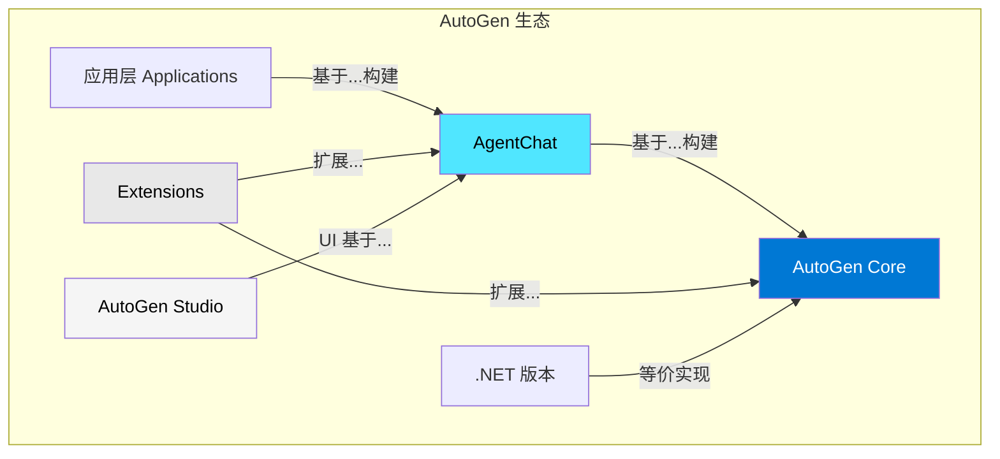
```mermaid
graph TB
    subgraph "AutoGen 生态"
        A[应用层 Applications] -->|基于...构建| B[AgentChat]
        B -->|基于...构建| C[AutoGen Core]
        D[Extensions] -->|扩展...| B
        D -->|扩展...| C
        E[AutoGen Studio] -->|UI 基于...| B
        F[.NET 版本] -->|等价实现| C
    end

    style C fill:#0078d4,color:#fff
    style B fill:#50e6ff,color:#000
    style D fill:#e8e8e8,color:#000
    style E fill:#f5f5f5,color:#000
```

| 层级 | 名称 | 职责 | 适合谁 |
|------|------|------|--------|
| 底层 | **AutoGen Core** | 基于 Actor 模型的事件驱动多智能体编排框架，支持可扩展、高并发的分布式 Agent 系统 | 研究者、需要精细控制的开发者 |
| 中层 | **AutoGen AgentChat** | 构建在 Core 之上的任务驱动高层框架，提供预置 Agent 和 Team，用于快速构建交互式应用 | 应用开发者、原型设计 |
| 扩展层 | **AutoGen Extensions** | 与外部服务（MCP、OpenAI Assistant API、Docker 等）的集成组件 | 需要集成的开发者 |
| 工具层 | **AutoGen Studio** | 无需代码的 Web UI，用于原型设计和演示 | 非技术用户、快速演示 |
| 跨语言 | **.NET 版本** | C#/.NET 平台的等价实现 | .NET 生态开发者 |

**代表性项目：** Magentic-One — 基于 AutoGen AgentChat 构建的顶级多智能体团队，在文件和 Web 相关任务上达到当时 SOTA 水平。

### 1.2 v0.2 → v0.4 架构重写

#### 为什么要重写

v0.2 在 2023 年发布后获得了大量用户，但社区反馈暴露出以下核心问题：

1. **可观测性差（Observability）**：难以追踪和调试多 Agent 之间的复杂交互
2. **灵活性不足**：Agent 间通信模式固化，难以定义自定义交互流程
3. **可控性弱**：缺乏对 Agent 行为的实时控制和干预能力
4. **扩展性瓶颈**：同步阻塞架构难以支撑大规模分布式部署
5. **模块性缺失**：Agent 难以在不同场景和项目中复用

基于这些反馈，微软于 2024 年初开始实验替代架构，最终采用 **Actor 模型** 进行了从零重写。

> 引用来源：MSR 研究员 Gagan Bansal 在 Microsoft Research Forum 2025 年 2 月的演讲："In early 2024, we used these learnings to experiment with alternate architectures, and we ended up adopting an actor model for multi-agent orchestration."

#### Actor 模型是什么

**Actor 模型** 是一种经典的并发计算模型，核心概念包括：

- **Actor**：独立执行单元，拥有私有状态，仅通过消息交互
- **消息传递**：Actor 之间不共享内存，通过异步消息通信
- **解耦**：消息的发送和接收是解耦的，支持异步和非阻塞

在 AutoGen v0.4 中，每个 Agent 就是一个 Actor，运行时（Runtime）负责消息的调度和传递。

#### v0.4 新架构

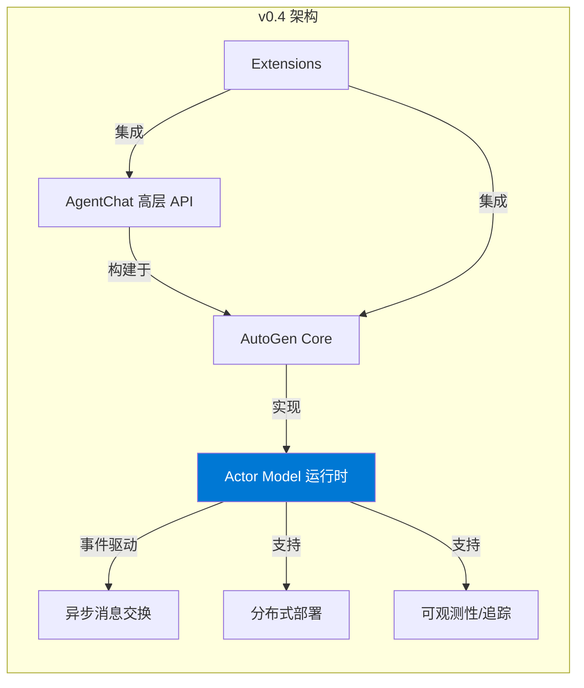
```mermaid
graph LR
    subgraph "v0.4 架构"
        A[AgentChat 高层 API] -->|构建于| B[AutoGen Core]
        B -->|实现| C[Actor Model 运行时]
        C -->|事件驱动| D[异步消息交换]
        C -->|支持| E[分布式部署]
        C -->|支持| F[可观测性/追踪]
        G[Extensions] -->|集成| A
        G -->|集成| B
    end

    style C fill:#0078d4,color:#fff
```

#### 核心变化对比

| 维度 | v0.2 | v0.4 |
|------|------|------|
| **架构模式** | 同步、阻塞式 Agent 对话 | 异步、事件驱动的 Actor 模型 |
| **通信方式** | 同步函数调用和回调注册 | 异步消息传递 |
| **可观测性** | 有限，缺乏内置追踪 | 内置 Tracing 和 Observability |
| **Agent 复用** | Agent 绑定在特定对话场景 | Actor 模型天然支持跨场景复用 |
| **分布式** | 原生不支持 | 支持跨进程、跨节点的分布式部署 |
| **控制流** | GroupChat + 选择器，固定模式 | 事件驱动，可自定义任何消息流 |
| **API 设计** | `agent.send()` 同步调用 | `await agent.on_messages()` 异步处理 |
| **配置方式** | `llm_config` 字典配置 | Component Config 系统 + 直接类实例化 |
| **缓存** | 默认启用（`cache_seed`） | 默认关闭，需用 `ChatCompletionCache` 包装 |
| **LLM 配置** | 支持 `config_list` 尝试多个配置 | 必须指定单一模型配置 |

#### 关键 API 变化示例

**v0.2 — 同步 Agent 创建和调用：**

```python
from autogen.agentchat import AssistantAgent

llm_config = {
    "config_list": [{"model": "gpt-4o", "api_key": "sk-xxx"}],
    "seed": 42,
    "temperature": 0,
}

assistant = AssistantAgent(
    name="assistant",
    system_message="You are a helpful assistant.",
    llm_config=llm_config,
)

# 同步调用
result = assistant.send("Hello!", recipient=agent, request_reply=True)
```

**v0.4 — 异步 Agent 创建和调用：**

```python
import asyncio
from autogen_agentchat.agents import AssistantAgent
from autogen_agentchat.messages import TextMessage
from autogen_core import CancellationToken
from autogen_ext.models.openai import OpenAIChatCompletionClient

async def main() -> None:
    model_client = OpenAIChatCompletionClient(model="gpt-4o", seed=42, temperature=0)

    assistant = AssistantAgent(
        name="assistant",
        system_message="You are a helpful assistant.",
        model_client=model_client,
    )

    cancellation_token = CancellationToken()
    # 异步调用，支持取消和流式输出
    response = await assistant.on_messages(
        [TextMessage(content="Hello!", source="user")],
        cancellation_token
    )
    print(response)

    await model_client.close()

asyncio.run(main())
```

#### 维护模式说明

**重要：** v0.2 版本的 `pyautogen` PyPI 包自 0.2.34 版本起不再由微软发布（微软已失去该包的管理权限）。社区 fork 继续使用该名称，但与官方版本不同。

```
# 错误（社区 fork 版本）
pip install pyautogen

# 正确（官方 v0.2）
pip install "autogen-agentchat~=0.2"

# 正确（官方 v0.4）
pip install "autogen-agentchat" "autogen-ext[openai]"
```

### 1.3 与 CrewAI/LangChain 对比

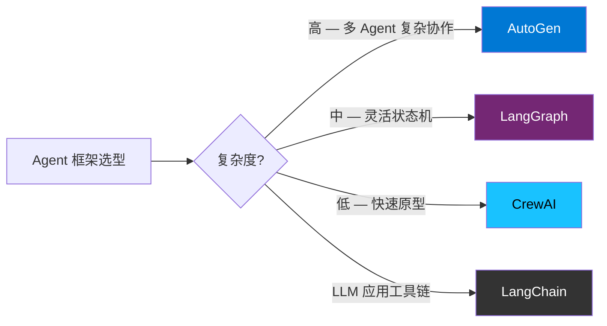
```mermaid
graph LR
    A[Agent 框架选型] --> B{复杂度?}
    B -->|高 — 多 Agent 复杂协作| C[AutoGen]
    B -->|中 — 灵活状态机| D[LangGraph]
    B -->|低 — 快速原型| E[CrewAI]
    B -->|LLM 应用工具链| F[LangChain]

    style C fill:#0078d4,color:#fff
    style D fill:#742774,color:#fff
    style E fill:#19C2FF,color:#000
    style F fill:#333,color:#fff
```

| 维度 | **AutoGen** (v0.4) | **CrewAI** | **LangChain / LangGraph** |
|------|------|------|------|
| **维护方** | Microsoft Research（v0.2 进入维护模式，v0.4 持续开发） | crewAI Inc（独立创业公司） | LangChain Inc（开源 + 商业 LangSmith） |
| **核心定位** | 多智能体对话与协作框架 | 快速构建 Agent 团队（Crew） | LangChain：LLM 应用工具链；LangGraph：低级状态机编排 |
| **编程模型** | Actor 模型 + 事件驱动消息传递 | 角色驱动（Role-based）的团队编排 | LangChain：声明式链/Agent；LangGraph：图/状态机 |
| **多 Agent** | 原生支持，GroupChat、SelectorGroupChat、Swarm | 支持，层级/顺序流程，Crew 概念 | LangGraph 原生支持 Multi-Agent，LangChain 预置 Agent 架构 |
| **分布式** | Core 层支持跨进程/节点部署（gRPC） | 不支持 | 不支持（依赖外部部署基础设施） |
| **异步** | 全异步（async/await） | 异步 | LangGraph 支持异步执行 |
| **持久化** | Agent/GroupChat 状态可序列化保存和恢复 | Flows 支持持久化和恢复 | LangGraph 支持 Durable Execution |
| **可观测性** | 内置 Tracing 和 Observability 系统 | 需配合外部工具 | LangSmith 提供全链路可观测性（商业服务） |
| **学习曲线** | 较高，需要理解 Actor 模型和事件驱动 | 低，直观的角色+任务定义 | 中等，概念较多但文档完善 |
| **GitHub Stars** | ~57.3k | ~49.5k | LangChain ~100k+，LangGraph ~20k+ |
| **生态集成** | MCP、OpenAI Assistant、Docker 等 | 丰富的集成（Gmail、Slack、Salesforce 等触发器） | 最广泛的集成生态（LangChain Integrations） |
| **适合场景** | 复杂多智能体协作、研究型项目、分布式 Agent | 小团队快速原型、简单任务自动化 | 需要深度定制、已有 LangChain 生态的企业 |

**选型建议：**

- **选 AutoGen 当：** 需要复杂的多 Agent 对话模式（如辩论、协作推理）、需要分布式部署能力、或深度研究 Agent 架构
- **选 CrewAI 当：** 团队规模小、需要快速上线、任务流程相对明确且不需要过于复杂的 Agent 交互
- **选 LangChain/LangGraph 当：** 已经在使用 LangChain 生态、需要最广泛的模型/工具集成、或需要细粒度的状态机控制（LangGraph）

### 1.4 生态全景

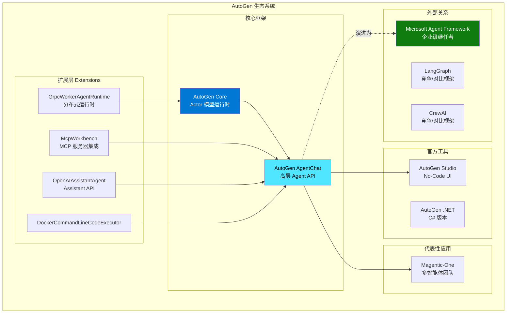
```mermaid
graph TB
    subgraph "AutoGen 生态系统"
        subgraph "核心框架"
            Core[AutoGen Core\nActor 模型运行时]
            AC[AutoGen AgentChat\n高层 Agent API]
        end

        subgraph "官方工具"
            Studio[AutoGen Studio\nNo-Code UI]
            DotNet[AutoGen .NET\nC# 版本]
        end

        subgraph "扩展层 Extensions"
            MCP[McpWorkbench\nMCP 服务器集成]
            OAI[OpenAIAssistantAgent\nAssistant API]
            Docker[DockerCommandLineCodeExecutor]
            gRPC[GrpcWorkerAgentRuntime\n分布式运行时]
        end

        subgraph "代表性应用"
            Magentic[Magentic-One\n多智能体团队]
        end

        subgraph "外部关系"
            MAF[Microsoft Agent Framework\n企业级继任者]
            LangGraph[LangGraph\n竞争/对比框架]
            CrewAI[CrewAI\n竞争/对比框架]
        end

        Core --> AC
        AC --> Studio
        AC --> Magentic
        MCP --> AC
        OAI --> AC
        Docker --> AC
        gRPC --> Core
        AC -.演进为.-> MAF
    end

    style Core fill:#0078d4,color:#fff
    style AC fill:#50e6ff,color:#000
    style MAF fill:#107c10,color:#fff
```

**生态关键点总结：**

1. **三层架构**：Core（底层 Actor 运行时）→ AgentChat（高层 Agent API）→ Extensions（集成层）
2. **双版本并行**：v0.2（维护模式，社区管理）和 v0.4（官方持续开发，推荐）
3. **演进方向**：微软已将重心转向 **Microsoft Agent Framework (MAF)** — 企业级多智能体编排平台，支持 A2A 和 MCP 跨运行时互操作
4. **社区活跃度**：57.3k GitHub Stars，活跃社区支持（Discord + GitHub Discussions）

---

**引用来源：**
1. [AutoGen 官方文档](https://microsoft.github.io/autogen/) — 架构描述、组件介绍、安装指南
2. [AutoGen GitHub 仓库](https://github.com/microsoft/autogen) — README、维护模式声明、安装和快速开始
3. [AutoGen v0.4 MSR 文章](https://www.microsoft.com/en-us/research/articles/autogen-v0-4-reimagining-the-foundation-of-agentic-ai-for-scale-extensibility-and-robustness/) — Gagan Bansal 在 Microsoft Research Forum 2025 年 2 月的演讲全文
4. [AutoGen 迁移指南 v0.2→v0.4](https://microsoft.github.io/autogen/user-guide/agentchat-user-guide/migration-guide.html) — 详细 API 变化对比
5. [CrewAI 官方文档](https://docs.crewai.com/) — 架构和生态描述
6. [LangChain 官方文档](https://python.langchain.com/docs/introduction/) — 框架定位和生态
7. [LangGraph 官方文档](https://langchain-ai.github.io/langgraph/) — 低级编排框架描述
8. 第三方对比分析（通过搜索引擎获取的综合信息）
## 2. 架构设计 — AgentChat/Core/Extensions 三层架构

### 2.1 三层架构总览

#### 定义

AutoGen 0.4+ 采用**三层分离式架构**，将整个框架拆分为三个独立的 Python 包：

| 层级 | 包名 | 定位 | 目标用户 |
|------|------|------|----------|
| **AgentChat** | `autogen-agentchat` | 高层 API，提供开箱即用的 Agent 预设和 Team 模式 | 初学者、快速原型开发 |
| **Core** | `autogen-core` | 底层引擎，提供 Actor 模型、异步消息传递、发布/订阅、分布式运行时 | 高级用户、需要完全控制的场景 |
| **Extensions** | `autogen-ext` | 插件系统，提供模型客户端、工具、执行器、运行时扩展 | 所有用户，按需选用 |

这种设计的核心理念是 **Inversion of Control（控制反转）**：Core 层不依赖任何上层抽象，AgentChat 是构建在 Core 之上的一个"意见化"（opinionated）实现，而 Extensions 则通过插件机制横向扩展到所有层。

#### 原理

三层架构的设计动机来源于 AutoGen 0.2 的痛点。旧版本将高级用法和底层机制混在一起，导致：
- 简单场景过于复杂（必须理解底层消息系统才能开始）
- 复杂场景又不够灵活（高层 API 无法满足定制化需求）

新版本将关注点分离：
- **AgentChat** 是"快速路径"（fast path），封装了常见模式（RoundRobin、SelectorGroupChat、Swarm 等），让用户几行代码就能跑起来
- **Core** 是"灵活路径"（flexible path），提供 Actor 模型 + 事件驱动的基础设施，让用户从零构建任意多 Agent 模式
- **Extensions** 是"扩展路径"（extensible path），将具体实现（OpenAI、Azure、Docker 等）与核心逻辑解耦

```mermaid
graph TB
    subgraph "AgentChat 层 (autogen-agentchat)"
        A1[AssistantAgent]
        A2[RoundRobinGroupChat]
        A3[SelectorGroupChat]
        A4[Swarm]
        A5[Magentic-One]
        A6[GraphFlow]
    end

    subgraph "Core 层 (autogen-core)"
        C1[AgentRuntime]
        C2[RoutedAgent]
        C3[SingleThreadedAgentRuntime]
        C4[Topic/Subscription]
        C5[Message Bus]
        C6[Actor Model]
    end

    subgraph "Extensions 层 (autogen-ext)"
        E1[OpenAIChatCompletionClient]
        E2[DockerCodeExecutor]
        E3[GrpcWorkerRuntime]
        E4[MCP Tools]
        E5[GraphRAG Tools]
    end

    A1 --> C2
    A2 --> C1
    A3 --> C1
    A4 --> C1
    A5 --> C1
    A6 --> C1

    C1 --> C3
    C2 --> C6
    C4 --> C5

    A1 -.使用.-> E1
    A2 -.使用.-> E2
    C1 -.使用.-> E3
    A1 -.使用.-> E4

    style AgentChat 层 fill:#e1f5fe
    style Core 层 fill:#f3e5f5
    style Extensions 层 fill:#e8f5e9
```

#### 示例：三层对应关系

同一个"代码审查"场景在三层中的不同实现方式：

```python
# AgentChat 层（5 行）
from autogen_agentchat.agents import AssistantAgent
from autogen_agentchat.teams import RoundRobinGroupChat

coder = AssistantAgent("coder", model_client=client, tools=[write_code])
reviewer = AssistantAgent("reviewer", model_client=client, tools=[review_code])
team = RoundRobinGroupChat([coder, reviewer])

# Core 层（15 行+，但完全可控）
from autogen_core import RoutedAgent, SingleThreadedAgentRuntime, TopicId

class CoderAgent(RoutedAgent): ...
class ReviewerAgent(RoutedAgent): ...

runtime = SingleThreadedAgentRuntime()
await CoderAgent.register(runtime, "coder", lambda: CoderAgent())
await ReviewerAgent.register(runtime, "reviewer", lambda: ReviewerAgent())
# 自定义消息路由、自定义订阅、自定义生命周期...

# Extensions 层（为以上两层提供具体实现）
from autogen_ext.models.openai import OpenAIChatCompletionClient
from autogen_ext.code_executors.docker import DockerCommandLineCodeExecutor

model_client = OpenAIChatCompletionClient(model="gpt-4o")
code_executor = DockerCommandLineCodeExecutor()
```

#### 常见误区

- **误区 1**："Core 比 AgentChat 更强大"。实际上 AgentChat 可以做的事情 Core 都能做（因为 AgentChat 就是基于 Core 构建的），反之亦然。区别在于**开发效率 vs 控制粒度**的权衡。
- **误区 2**："只能用其中一层"。实际使用中**混合使用是常态**。例如用 Core 构建自定义 Agent，然后用 AgentChat 的 Team 模式编排它们。
- **误区 3**："Extensions 只是可选的"。模型客户端（如 OpenAIChatCompletionClient）本身就是 Extensions 的一部分，不使用 Extensions 就无法连接任何 LLM。

---

### 2.2 AgentChat 层

#### 定义

AgentChat 是 AutoGen 的**高层抽象 API**，定位为"快速开始多 Agent 应用的首选入口"。它将常见的 Agent 行为和 Team 协作模式封装为预设组件，提供直觉式的编程接口。

#### 原理：组件模型

AgentChat 的核心组件分为三类：

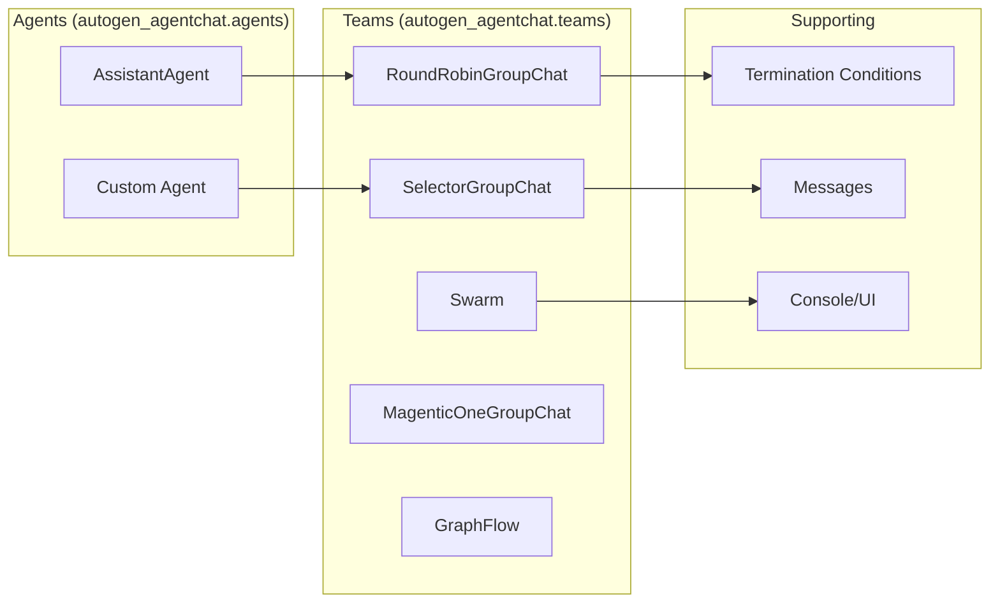
```mermaid
graph LR
    subgraph "Agents (autogen_agentchat.agents)"
        AG1[AssistantAgent]
        AG2[Custom Agent]
    end

    subgraph "Teams (autogen_agentchat.teams)"
        T1[RoundRobinGroupChat]
        T2[SelectorGroupChat]
        T3[Swarm]
        T4[MagenticOneGroupChat]
        T5[GraphFlow]
    end

    subgraph "Supporting"
        S1[Termination Conditions]
        S2[Messages]
        S3[Console/UI]
    end

    AG1 --> T1
    AG2 --> T2
    T1 --> S1
    T2 --> S2
    T3 --> S3
```

**Agents**：AgentChat 提供 `BaseChatAgent` 作为所有 Agent 的基类，核心方法为：
- `run(task)` — 接收任务字符串或消息列表，返回 `TaskResult`
- `run_stream(task)` — 异步迭代器，逐条产出事件
- 所有 Agent 都有 `name`、`description` 属性和内部状态

**Teams**：Team 是"一组为共同目标协作的 Agent"。核心接口：
- `run(task)` — 运行 Team 直到终止条件触发
- `run_stream(task)` — 流式输出每个 Agent 的产出
- 通过 `termination_condition` 控制何时停止

**消息系统**：AgentChat 使用独立的消息类型层次（不同于 Core 的消息）：
- `TextMessage` — 纯文本消息
- `MultiModalMessage` — 多模态消息（文本+图片）
- `ToolCallRequestEvent` — 工具调用请求
- `ToolCallExecutionEvent` — 工具执行结果
- `HandoffMessage` — Agent 间交接消息
- `TaskResult` — 任务最终结果

#### 关键 Team 模式

| Team | 机制 | 适用场景 |
|------|------|----------|
| **RoundRobinGroupChat** | 所有 Agent 按固定顺序轮流发言，共享上下文 | 简单协作、代码审查（reflection pattern） |
| **SelectorGroupChat** | 使用 LLM 根据上下文动态选择下一个发言的 Agent | 需要智能调度的复杂场景 |
| **Swarm** | 通过 `HandoffMessage` 实现 Agent 间的主动交接 | 客服路由、分工明确的流水线 |
| **MagenticOneGroupChat** | 预设的通用主义多 Agent 系统，内置规划者和执行者 | 开放式的 web 和文件任务 |
| **GraphFlow** | 通过有向图定义 Agent 间的流转关系 | 需要精确控制工作流的场景 |

#### 示例：Reflection Pattern（代码审查）

```python
from autogen_agentchat.agents import AssistantAgent
from autogen_agentchat.teams import RoundRobinGroupChat
from autogen_agentchat.conditions import TextMentionTermination

# 创建两个 Agent
primary = AssistantAgent("primary", model_client=model_client,
    system_message="You are a helpful AI assistant.")
critic = AssistantAgent("critic", model_client=model_client,
    system_message="Provide constructive feedback. Respond with 'APPROVE' when satisfied.")

# 终止条件
termination = TextMentionTermination("APPROVE")

# Team 运行
team = RoundRobinGroupChat([primary, critic], termination_condition=termination)
result = await team.run(task="Write a short poem about fall.")
```

#### 与 Core 的关系

AgentChat 的 Agent（如 `AssistantAgent`）由**应用代码直接创建**（`agent = AssistantAgent(...)`），而不是由 Core 的 Runtime 管理。这是与 Core 层最关键的架构差异：

- AgentChat Agent = 应用实例化，应用管理生命周期
- Core Agent = Runtime 注册工厂函数，Runtime 按需创建和管理

要在 Core 中使用 AgentChat Agent，需要创建包装器 `RoutedAgent`，将消息转发给 AgentChat Agent 的 `on_messages()` 方法。

#### 常见误区

- **误区 1**："AssistantAgent 是万能的"。官方文档明确警告：`AssistantAgent` 是"kitchen sink"设计，用于原型和教育目的。充分理解后应实现自定义 Agent。
- **误区 2**："Team 总是比单 Agent 好"。文档建议：先用单 Agent 并优化工具和指令，确认不足后再切换到 Team。
- **误区 3**："AgentTool/TeamTool 可以并行调用"。它们维护内部状态，必须设置 `parallel_tool_calls=False`。

---

### 2.3 Core 层

#### 定义

AutoGen Core 是一个**无偏见（unopinionated）、事件驱动、分布式、可扩展**的多 Agent 系统基础框架。它使用 **Actor 模型**作为计算范式，通过**异步消息传递**实现 Agent 间通信。

#### Actor 模型设计原理

**什么是 Actor 模型？**

Actor 模型是一种并发计算模型，其中基本计算单元称为 **Actor**。每个 Actor 具有：
- **唯一身份标识**（Agent ID = Agent Type + Agent Key）
- **私有状态**（不与其他 Actor 共享）
- **消息邮箱**（接收队列）
- **行为逻辑**（收到消息后执行的 handler）

Actor 之间**不共享内存**，只能通过**异步消息**通信。这种设计天然支持：
- **并发安全**：每个 Actor 内部是单线程的，不存在竞态条件
- **位置透明**：Actor 可以运行在同一进程、不同进程、甚至不同机器上
- **弹性伸缩**：Runtime 可以按需"调入/调出" Actor 实例

**AutoGen 中的 Actor 模型实现：**

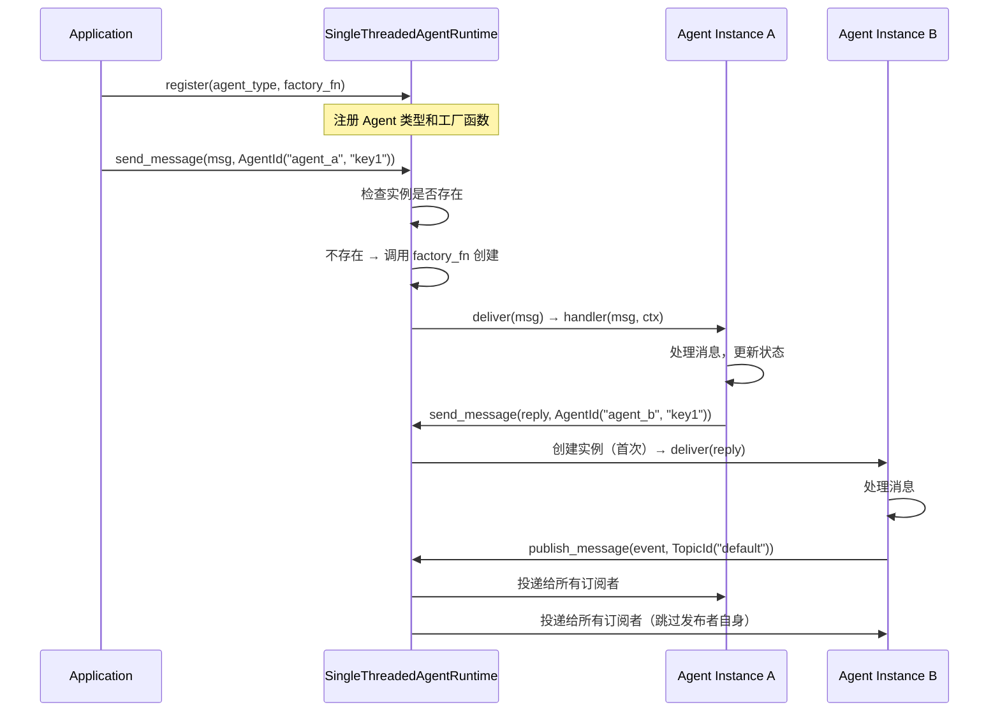
```mermaid
sequenceDiagram
    participant App as Application
    participant RT as SingleThreadedAgentRuntime
    participant A1 as Agent Instance A
    participant A2 as Agent Instance B

    App->>RT: register(agent_type, factory_fn)
    Note over RT: 注册 Agent 类型和工厂函数

    App->>RT: send_message(msg, AgentId("agent_a", "key1"))
    RT->>RT: 检查实例是否存在
    RT->>RT: 不存在 → 调用 factory_fn 创建
    RT->>A1: deliver(msg) → handler(msg, ctx)
    A1->>A1: 处理消息，更新状态

    A1->>RT: send_message(reply, AgentId("agent_b", "key1"))
    RT->>A2: 创建实例（首次）→ deliver(reply)
    A2->>A2: 处理消息

    A2->>RT: publish_message(event, TopicId("default"))
    RT->>A1: 投递给所有订阅者
    RT->>A2: 投递给所有订阅者（跳过发布者自身）
```

**核心源码文件：**

| 文件 | 职责 |
|------|------|
| `_agent.py` | `Agent` 基类接口定义 |
| `_base_agent.py` | `BaseAgent` 抽象基类，包含注册逻辑 |
| `_routed_agent.py` | `RoutedAgent` 提供 `@message_handler` 装饰器 |
| `_agent_runtime.py` | `AgentRuntime` 接口定义 |
| `_single_threaded_agent_runtime.py` | 单线程运行时实现（864 行） |
| `_agent_id.py` | `AgentId` = (AgentType, AgentKey) |
| `_topic.py` | `TopicId` = (TopicType, TopicSource) |
| `_subscription.py` | `Subscription` 基类 |
| `_type_subscription.py` | `TypeSubscription` 实现 |
| `_message_context.py` | `MessageContext` 传递消息元信息 |
| `_closure_agent.py` | `ClosureAgent` 支持闭包式 Agent |

#### 事件驱动机制

**定义：**

事件驱动是 Core 层的核心通信范式。Agent 通过**发布（publish）**事件到主题（topic），所有**订阅（subscribe）**了该主题的 Agent 会收到事件副本。这实现了**解耦的多对多通信**。

**工作原理：Publish/Subscribe 模型**

```mermaid
graph LR
    subgraph "Publisher"
        P1[Agent A]
    end

    subgraph "Topic: 'code_review'"
        T1[(Topic)]
    end

    subgraph "Subscribers"
        S1[Agent B<br/>AgentId('reviewer', 'key1')]
        S2[Agent C<br/>AgentId('logger', 'key1')]
    end

    P1 -- publish --> T1
    T1 -- deliver --> S1
    T1 -- deliver --> S2

    style T1 fill:#fff3e0
```

**Topic 结构：** `Topic = (TopicType, TopicSource)`
- **TopicType**：消息类别，由应用代码定义（如 `"code_review"`）
- **TopicSource**：具体实例标识，由应用数据决定（如 `"github.com/repo/issues/42"`）

**TypeSubscription 机制：** `TypeSubscription(topic_type, agent_type)` 建立从 TopicType 到 AgentType 的映射。消息投递时：
1. 匹配 TopicType → 找到所有 TypeSubscription
2. 对每个订阅，将 TopicSource 作为 AgentKey 构建 AgentId
3. 将消息投递到对应的 Agent 实例

**两种通信方式对比：**

| 特性 | Direct Messaging | Broadcast (Publish/Subscribe) |
|------|-----------------|-------------------------------|
| 模式 | 1 对 1 | 1 对 N |
| 需要知道 Agent ID？ | 是 | 否（只需 Topic） |
| 支持请求/响应？ | 是（await 返回值） | 否（单向，返回值被丢弃） |
| 异常传播 | 抛出到发送方 | 记录日志，不传播 |
| 适用场景 | 工具调用、RPC | 事件通知、工作流协调 |

#### 示例：Core 层代码生成流水线

```python
from dataclasses import dataclass
from autogen_core import (
    RoutedAgent, SingleThreadedAgentRuntime, AgentId,
    TopicId, TypeSubscription, message_handler, default_subscription
)

# 定义消息类型（行为契约）
@dataclass
class CodeRequest:
    description: str

@dataclass
class GeneratedCode:
    code: str

@dataclass
class ExecutionResult:
    output: str
    success: bool

@dataclass
class ReviewOpinion:
    approved: bool
    feedback: str

# Coder Agent
@dataclass
class CoderAgent(RoutedAgent):
    @message_handler
    async def handle_request(self, msg: CodeRequest, ctx) -> None:
        code = f"# TODO: {msg.description}\npass"
        await self.publish_message(GeneratedCode(code=code), TopicId("execution", "default"))

# Executor Agent
@type_subscription(topic_type="execution")
class ExecutorAgent(RoutedAgent):
    @message_handler
    async def handle_code(self, msg: GeneratedCode, ctx) -> None:
        try:
            exec(msg.code)
            await self.publish_message(ExecutionResult(output="OK", success=True), TopicId("review", "default"))
        except Exception as e:
            await self.publish_message(ExecutionResult(output=str(e), success=False), TopicId("review", "default"))

# Reviewer Agent
@type_subscription(topic_type="review")
class ReviewerAgent(RoutedAgent):
    @message_handler
    async def handle_result(self, msg: ExecutionResult, ctx) -> None:
        opinion = ReviewOpinion(approved=msg.success, feedback="Good" if msg.success else "Fix errors")
        await self.publish_message(opinion, TopicId("result", "default"))

# 运行时
runtime = SingleThreadedAgentRuntime()
await CoderAgent.register(runtime, "coder", lambda: CoderAgent("Coder"))
await ExecutorAgent.register(runtime, "executor", lambda: ExecutorAgent("Executor"))
await ReviewerAgent.register(runtime, "reviewer", lambda: ReviewerAgent("Reviewer"))

runtime.start()
await runtime.send_message(CodeRequest("Sort a list"), AgentId("coder", "default"))
await runtime.stop_when_idle()
```

#### Agent 生命周期管理

**Agent ID = (AgentType, AgentKey)**
- **AgentType**：关联到工厂函数，决定"如何创建"
- **AgentKey**：实例标识，决定"操作哪个实例"

关键特性：
- Agent **不是由应用代码直接创建**的，而是注册工厂函数给 Runtime
- 首次消息投递时 Runtime **自动创建**实例
- Runtime 负责"调入/调出"实例以节省资源（分页机制，尚未实现）

**示例场景：** 一个代码审查会话，每个请求有独立 ID。Runtime 会为每个不同的 AgentKey 创建独立的 Agent 实例：
```
AgentId("reviewer", "request-001") → 处理请求 1
AgentId("reviewer", "request-002") → 处理请求 2
```

#### 常见误区

- **误区 1**："Agent 是提前创建好的"。Core 层 Agent 是**懒创建**的——Runtime 只在首次消息投递到某 AgentId 时才调用工厂函数创建实例。
- **误区 2**："publish_message 可以等待响应"。Broadcast 是单向的，即使订阅者的 handler 返回了值，也会被丢弃。需要请求/响应时**必须使用 `send_message`**。
- **误区 3**："Agent 自己订阅主题"。订阅是通过 `TypeSubscription` 在 Runtime 层面注册的，不是 Agent 的主动行为。`@type_subscription` 装饰器只是在注册时自动添加订阅。
- **误区 4**："同一个 Agent 的不同实例共享状态"。每个 AgentId 对应独立的 Agent 实例，状态完全隔离。如果需要共享状态，需通过外部存储或 Topic 通信。

---

### 2.4 Extensions 层

#### 定义

`autogen-ext` 是 AutoGen 的**插件/扩展系统**，包含所有具体组件实现。它遵循"核心与实现分离"的设计哲学：Core 和 AgentChat 定义接口，Extensions 提供实现。

#### 原理：组件分类

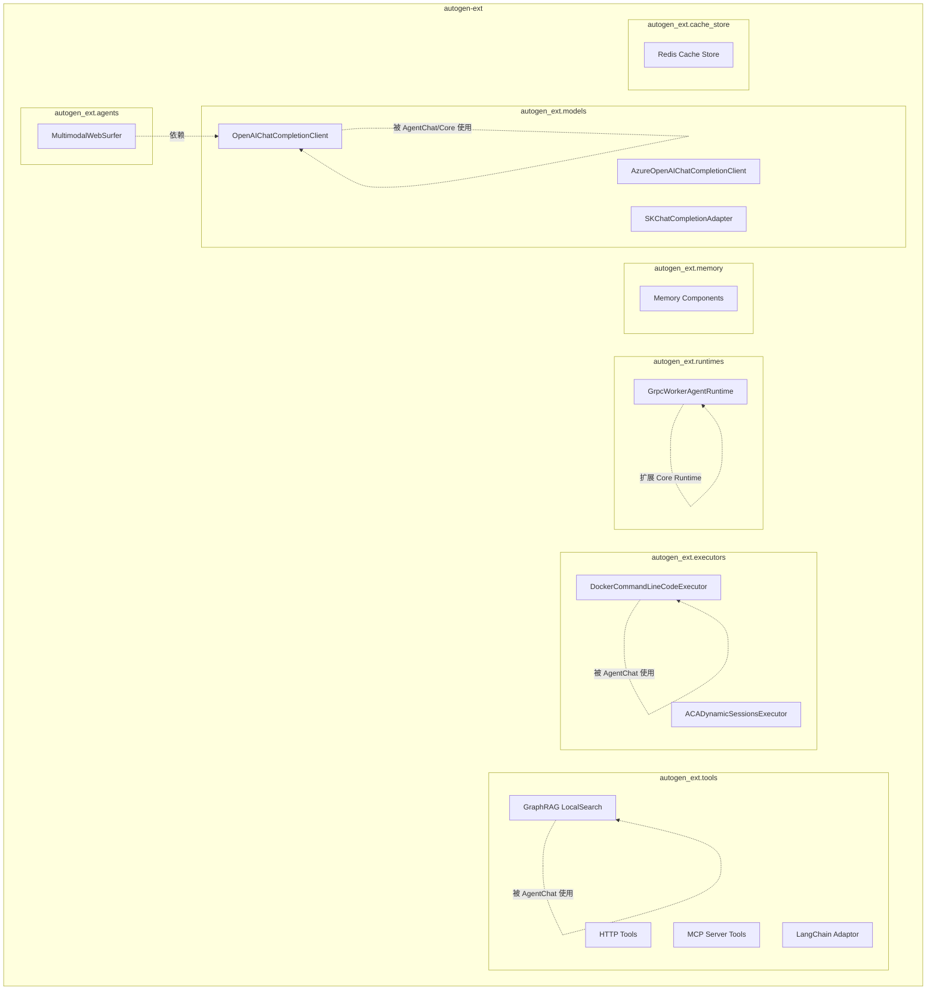
```mermaid
graph TB
    subgraph "autogen-ext"
        subgraph "autogen_ext.agents"
            AG1[MultimodalWebSurfer]
        end
        subgraph "autogen_ext.models"
            M1[OpenAIChatCompletionClient]
            M2[AzureOpenAIChatCompletionClient]
            M3[SKChatCompletionAdapter]
        end
        subgraph "autogen_ext.tools"
            T1[GraphRAG LocalSearch]
            T2[HTTP Tools]
            T3[MCP Server Tools]
            T4[LangChain Adaptor]
        end
        subgraph "autogen_ext.executors"
            EX1[DockerCommandLineCodeExecutor]
            EX2[ACADynamicSessionsExecutor]
        end
        subgraph "autogen_ext.runtimes"
            R1[GrpcWorkerAgentRuntime]
        end
        subgraph "autogen_ext.memory"
            MEM1[Memory Components]
        end
        subgraph "autogen_ext.cache_store"
            CS1[Redis Cache Store]
        end
    end

    AG1 -.依赖.-> M1
    M1 -.被 AgentChat/Core 使用.-> M1
    T1 -.被 AgentChat 使用.-> T1
    EX1 -.被 AgentChat 使用.-> EX1
    R1 -.扩展 Core Runtime.-> R1
```

**关键组件详解：**

| 命名空间 | 内容 | 示例 |
|----------|------|------|
| `autogen_ext.agents.*` | 预构建 Agent 实现 | `MultimodalWebSurfer`（多模态网页搜索 Agent） |
| `autogen_ext.models.*` | LLM 模型客户端 | `OpenAIChatCompletionClient`、`AzureOpenAIChatCompletionClient` |
| `autogen_ext.tools.*` | 工具实现 | `GraphRAGLocalSearchTool`、`mcp_server_tools()` |
| `autogen_ext.executors.*` | 代码执行器 | `DockerCommandLineCodeExecutor` |
| `autogen_ext.runtimes.*` | 分布式运行时 | `GrpcWorkerAgentRuntime` |
| `autogen_ext.memory.*` | 记忆组件 | 向量数据库集成 |
| `autogen_ext.cache_store.*` | 缓存存储 | `RedisStore` |

#### 示例：创建自定义 Extension

AutoGen 鼓励开发者构建自己的 Extension 并发布到生态系统。组件遵循 `Component` 协议（`ComponentBase` + `ComponentToConfig` + `ComponentFromConfig`），支持序列化和反序列化：

```python
from autogen_core import Component

class MyCustomTool(Component[MyConfig]):
    """自定义工具示例"""

    component_type = "tool"
    component_config_schema = MyConfig  # Pydantic model

    def __init__(self, config: MyConfig):
        self.config = config

    async def run(self, **kwargs) -> str:
        # 工具执行逻辑
        return f"Executed with {kwargs}"

    def to_config(self) -> MyConfig:
        return self.config

    @classmethod
    def from_config(cls, config: MyConfig) -> "MyCustomTool":
        return cls(config)
```

#### 分布式运行时（Experimental）

`GrpcWorkerAgentRuntime` 是 Core 层 `AgentRuntime` 接口的分布式实现，支持跨进程/跨机器的 Agent 通信：

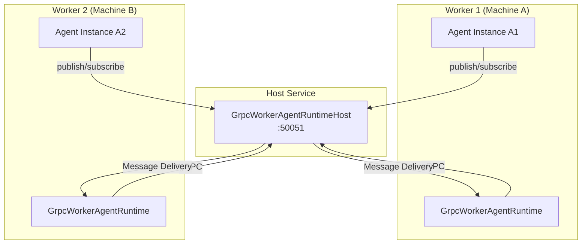
```mermaid
graph TB
    subgraph "Host Service"
        H1[GrpcWorkerAgentRuntimeHost<br/>:50051]
    end

    subgraph "Worker 1 (Machine A)"
        W1[GrpcWorkerAgentRuntime]
        A1[Agent Instance A1]
    end

    subgraph "Worker 2 (Machine B)"
        W2[GrpcWorkerAgentRuntime]
        A2[Agent Instance A2]
    end

    W1 -->|gRPC| H1
    W2 -->|gRPC| H1
    H1 -->|Message Delivery| W1
    H1 -->|Message Delivery| W2
    A1 -->|publish/subscribe| H1
    A2 -->|publish/subscribe| H1
```

**注意：** 分布式运行时当前为实验性功能，API 可能会有 breaking changes。跨语言通信必须使用 **Protobuf 消息** schema。

#### 常见误区

- **误区 1**："Extensions 是可有可无的"。实际上，**连接 LLM 必须通过 Extensions**（如 `OpenAIChatCompletionClient`）。不使用 Extensions 就无法调用任何模型。
- **误区 2**："只能使用官方 Extensions"。AutoGen 的扩展系统设计为开放生态，任何开发者都可以创建自己的 Extension 包（如 `autogen-ext-mycompany`）并通过 `autogen_ext` 的插件机制集成。
- **误区 3**："Extension 只能在 AgentChat 层使用"。Extensions 的模型客户端、工具等组件同时服务于 AgentChat 和 Core 层。

---

### 2.5 三层交互全景图

```mermaid
graph TB
    subgraph "开发者应用代码"
        APP[Application Code]
    end

    subgraph "AgentChat 层"
        AG[AssistantAgent / Custom Agent]
        TM[RoundRobinGroupChat / SelectorGroupChat / Swarm / GraphFlow]
        TC[Termination Conditions]
        MSG[AgentChat Messages<br/>TextMessage, ToolCallEvent, ...]
    end

    subgraph "Core 层"
        RT[AgentRuntime<br/>SingleThreaded / GrpcWorker]
        AR[RoutedAgent / ClosureAgent]
        MB[Message Bus<br/>send_message / publish_message]
        TS[TypeSubscription / TopicId]
        AM[Actor Model<br/>AgentId = Type + Key]
    end

    subgraph "Extensions 层"
        MC[Model Clients<br/>OpenAI / Azure / ...]
        TL[Tools<br/>MCP / GraphRAG / HTTP / ...]
        EX[Code Executors<br/>Docker / ACA Sessions / ...]
        UI[UI Components]
    end

    APP --> AG
    APP --> TM
    TM --> AG
    AG --> MSG
    TM --> TC

    AG -.包装.-> AR
    TM -.使用.-> RT

    RT --> MB
    MB --> TS
    MB --> AM
    AR --> MB

    AG -.调用.-> MC
    AG -.调用.-> TL
    AG -.调用.-> EX
    RT -.调用.-> MC

    style AgentChat 层 fill:#e1f5fe
    style Core 层 fill:#f3e5f5
    style Extensions 层 fill:#e8f5e9
```

#### 数据流示例：AgentChat 中的工具调用

```
用户 → AssistantAgent.run(task)
  → AssistantAgent 内部:
    1. 通过 Extensions 的 OpenAIChatCompletionClient 调用 LLM
    2. LLM 返回 Tool Call 请求
    3. AssistantAgent 执行工具（Extensions 中的 FunctionTool / McpWorkbench）
    4. 将工具结果返回给 LLM
    5. LLM 生成最终响应
  → 返回 TaskResult 给用户
```

如果将同一个场景用 Core 层实现，数据流变为：

```
用户 → Runtime.send_message(TaskMessage, AgentId("assistant", "key"))
  → Runtime 懒创建 Agent 实例
  → RoutedAgent 的 @message_handler 处理消息:
    1. 通过 Extensions 的 Model Client 调用 LLM
    2. 解析 Tool Call
    3. 执行工具
    4. publish_message(ToolResultEvent, TopicId("tools", "key"))
    → 其他订阅了该 Topic 的 Agent 收到事件
  → Runtime 返回结果
```

**引用来源：**
- [AgentChat User Guide](https://microsoft.github.io/autogen/stable/user-guide/agentchat-user-guide/index.html)
- [Core User Guide](https://microsoft.github.io/autogen/stable/user-guide/core-user-guide/index.html)
- [Agent and Multi-Agent Applications](https://microsoft.github.io/autogen/stable/user-guide/core-user-guide/core-concepts/agent-and-multi-agent-application.html)
- [Application Stack](https://microsoft.github.io/autogen/stable/user-guide/core-user-guide/core-concepts/application-stack.html)
- [Agent Identity and Lifecycle](https://microsoft.github.io/autogen/stable/user-guide/core-user-guide/core-concepts/agent-identity-and-lifecycle.html)
- [Topic and Subscription](https://microsoft.github.io/autogen/stable/user-guide/core-user-guide/core-concepts/topic-and-subscription.html)
- [Agent and Agent Runtime](https://microsoft.github.io/autogen/stable/user-guide/core-user-guide/framework/agent-and-agent-runtime.html)
- [Message and Communication](https://microsoft.github.io/autogen/stable/user-guide/core-user-guide/framework/message-and-communication.html)
- [Distributed Agent Runtime](https://microsoft.github.io/autogen/stable/user-guide/core-user-guide/framework/distributed-agent-runtime.html)
- [Extensions User Guide](https://microsoft.github.io/autogen/stable/user-guide/extensions-user-guide/index.html)
- [autogen-core 源码](https://github.com/microsoft/autogen/tree/main/python/packages/autogen-core/src/autogen_core)
- [autogen-agentchat 源码](https://github.com/microsoft/autogen/tree/main/python/packages/autogen-agentchat/src/autogen_agentchat)
- [autogen-ext 源码](https://github.com/microsoft/autogen/tree/main/python/packages/autogen-ext/src/autogen_ext)
## 3. Agent 设计 — ConversableAgent 与角色体系

AutoGen 的 Agent 体系经历了从 v0.2 到 v0.4 的架构重构。v0.2 以 `ConversableAgent` 为核心基类，通过配置派生出不同角色的 Agent；v0.4 采用异步、事件驱动架构，以 `BaseChatAgent` 为基类重新设计了整个 Agent 体系。本章同时覆盖两个版本，重点放在当前主流使用的 v0.4 AgentChat API。

### 3.1 ConversableAgent 基类（v0.2 架构）

**定义**：`ConversableAgent` 是 AutoGen v0.2 中的核心基类，是一个"可配置的对话代理"。它既可以被配置为 Assistant（助手），也可以被配置为 User Proxy（用户代理），通过不同参数组合实现不同角色。

**工作原理**：

ConversableAgent 的核心机制是 **reply 链**。每当收到一条消息，Agent 会按优先级顺序检查注册的 reply 函数，找到第一个能生成回复的函数：

```
消息到达 → 检查终止消息 → 检查人工输入 → 遍历 reply 函数链 → 生成回复 → 发回给发送者
```

关键设计：

1. **`register_reply()` 机制**：通过注册 reply 函数扩展 Agent 行为。每个 reply 函数返回 `(bool, reply)` 元组，第一个返回 `True` 的函数终止链。

```python
def reply_func(
    recipient: ConversableAgent,
    messages: Optional[List[Dict]] = None,
    sender: Optional[Agent] = None,
    config: Optional[Any] = None,
) -> Tuple[bool, Union[str, Dict, None]]:
    # 自定义回复逻辑
    return True, "Custom reply"  # (是否回复, 回复内容)

# position=0 表示最高优先级
agent.register_reply([ConversableAgent], reply_func, position=0)
```

2. **`human_input_mode`**：控制人工输入的触发频率。
   - `"ALWAYS"` — 每次收到消息都请求人工输入
   - `"TERMINATE"` — 仅在终止消息触发时请求人工输入
   - `"NEVER"` — 从不请求人工输入（全自动）

3. **`max_consecutive_auto_reply`**：限制连续自动回复次数，防止无限循环对话。

4. **`code_execution_config`**：配置代码执行能力，支持 Docker 沙箱、本地执行等。

5. **`llm_config`**：配置 LLM 推理能力，支持多模型 fallback（config_list）。

**关键参数表**：

| 参数 | 类型 | 说明 |
|------|------|------|
| `name` | str | Agent 唯一标识 |
| `system_message` | str/list | 系统提示词 |
| `is_termination_msg` | Callable | 判断消息是否为终止消息 |
| `max_consecutive_auto_reply` | int | 最大连续自动回复数 |
| `human_input_mode` | str | ALWAYS / TERMINATE / NEVER |
| `function_map` | Dict | 函数名到可调用函数的映射 |
| `code_execution_config` | Dict/False | 代码执行配置 |
| `llm_config` | Dict/False/None | LLM 推理配置 |
| `default_auto_reply` | str | 无代码/LLM 回复时的默认回复 |
| `chat_messages` | Dict/None | 历史聊天记录（记忆） |

**示例：注册自定义回复**

```python
from autogen.agentchat import ConversableAgent

conversable_agent = ConversableAgent(
    name="custom_agent",
    system_message="You are a helpful assistant.",
    llm_config={"config_list": [{"model": "gpt-4o", "api_key": "sk-xxx"}]},
    code_execution_config={"work_dir": "coding"},
    human_input_mode="NEVER",
    max_consecutive_auto_reply=10,
)

def custom_reply(recipient, messages=None, sender=None, config=None):
    """自定义回复：检测到数学问题时直接回答"""
    if messages and "calculate" in messages[-1].get("content", "").lower():
        return True, "The answer is 42."
    return False, None  # 不处理，交给下一个 reply 函数

conversable_agent.register_reply([ConversableAgent], custom_reply, position=0)
```

**常见误区**：

- **误区 1**：认为 `register_reply` 的 reply 函数是"装饰器"。实际上它是注册到一个函数列表中，按 `position` 排序后依次调用。
- **误区 2**：`llm_config=False` 不是"不使用 LLM"，而是"禁用 LLM 自动回复"。Agent 仍然可以通过其他方式（如代码执行）产生回复。
- **误区 3**：`human_input_mode="NEVER"` 不代表 Agent 完全自主，只是不请求人工输入，仍然受 `max_consecutive_auto_reply` 限制。

### 3.2 AssistantAgent

**定义**：`AssistantAgent` 是 AutoGen 中提供 LLM 推理能力的内置 Agent。在 v0.2 中它是 `ConversableAgent` 的子类；在 v0.4 中它是 `BaseChatAgent` 的子类。

#### v0.4 架构（推荐）

**工作原理**：

AssistantAgent 的核心工作流程：

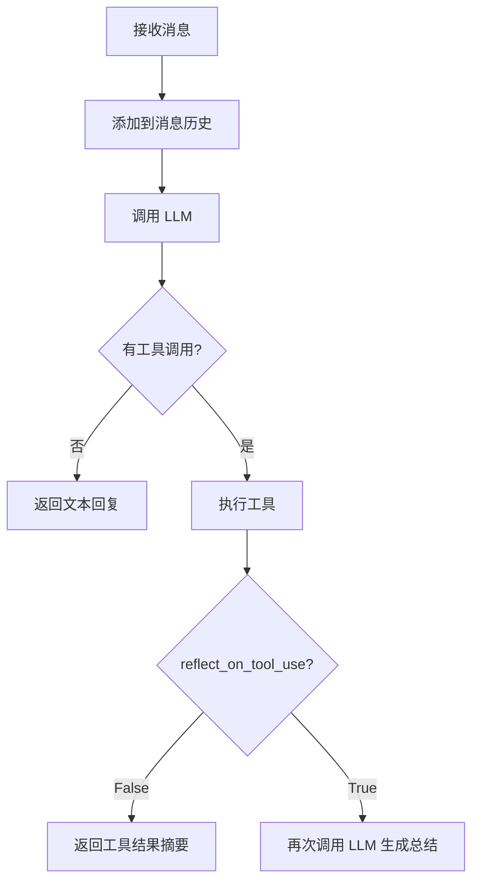
```mermaid
flowchart TD
    A[接收消息] --> B[添加到消息历史]
    B --> C[调用 LLM]
    C --> D{有工具调用?}
    D -->|否| E[返回文本回复]
    D -->|是| F[执行工具]
    F --> G{reflect_on_tool_use?}
    G -->|False| H[返回工具结果摘要]
    G -->|True| I[再次调用 LLM 生成总结]
```

关键参数：

| 参数 | 类型 | 默认值 | 说明 |
|------|------|--------|------|
| `name` | str | 必填 | Agent 唯一标识 |
| `model_client` | ChatCompletionClient | 必填 | LLM 客户端 |
| `tools` | List | None | 工具列表（函数或 BaseTool） |
| `workbench` | Workbench | None | 工具集（共享状态和资源的工具集合） |
| `handoffs` | List | None | 可交接的其他 Agent |
| `system_message` | str | 默认提示词 | 系统提示词 |
| `reflect_on_tool_use` | bool | False | 工具调用后是否再次调用 LLM 总结 |
| `max_tool_iterations` | int | 1 | 最大工具调用迭代次数 |
| `model_context` | ChatCompletionContext | None | 自定义消息上下文 |
| `output_content_type` | type[BaseModel] | None | 结构化输出类型 |
| `memory` | Sequence[Memory] | None | 记忆模块 |

**工具调用行为详解**：

- **`reflect_on_tool_use=False`（默认）**：执行工具后直接返回 `ToolCallSummaryMessage`，不再次调用 LLM。
- **`reflect_on_tool_use=True`**：执行工具后，再次调用 LLM 使用工具调用和结果生成自然语言总结。
- **`max_tool_iterations > 1`**：允许 Agent 在单次 run 中进行多轮工具调用。当模型继续返回工具调用时，会执行更多工具，直到模型返回文本回复或达到最大迭代次数。

**示例：基础 AssistantAgent**

```python
from autogen_agentchat.agents import AssistantAgent
from autogen_agentchat.ui import Console
from autogen_ext.models.openai import OpenAIChatCompletionClient

# 1. 创建模型客户端
model_client = OpenAIChatCompletionClient(
    model="gpt-4o",
    # api_key="YOUR_API_KEY",
)

# 2. 定义工具
async def get_weather(city: str) -> str:
    """Get the weather for a given city."""
    return f"The weather in {city} is 73 degrees and Sunny."

# 3. 创建 Agent
agent = AssistantAgent(
    name="weather_agent",
    model_client=model_client,
    tools=[get_weather],
    system_message="You are a helpful assistant.",
    reflect_on_tool_use=True,  # 工具调用后让 LLM 总结
    model_client_stream=True,  # 启用流式输出
)

# 4. 运行
async def main() -> None:
    await Console(agent.run_stream(task="What is the weather in New York?"))
    await model_client.close()

await main()
```

输出：
```
---------- user ----------
What is the weather in New York?
---------- weather_agent ----------
[FunctionCall(id='call_xxx', arguments='{"city":"New York"}', name='get_weather')]
---------- weather_agent ----------
[FunctionExecutionResult(content='The weather in New York is 73 degrees and Sunny.', call_id='call_xxx', is_error=False)]
---------- weather_agent ----------
The current weather in New York is 73 degrees and sunny.
```

**示例：多模态输入**

```python
from autogen_agentchat.messages import MultiModalMessage
from autogen_core import Image
from pathlib import Path

message = MultiModalMessage(
    content=["Can you describe the content of this image?", Image.from_file(Path("test.png"))],
    source="user",
)
result = await agent.run(task=message)
```

**示例：结构化输出**

```python
from pydantic import BaseModel

class WeatherReport(BaseModel):
    city: str
    temperature: int
    condition: str

agent = AssistantAgent(
    name="weather_agent",
    model_client=model_client,
    tools=[get_weather],
    output_content_type=WeatherReport,  # 启用结构化输出
)
# 此时 reflect_on_tool_use 自动设为 True
# 最终回复为 StructuredMessage 而非 TextMessage
```

**v0.2 中的 AssistantAgent**：

```python
# v0.2 方式（已过时）
from autogen.agentchat import AssistantAgent

llm_config = {
    "config_list": [{"model": "gpt-4o", "api_key": "sk-xxx"}],
    "seed": 42,
    "temperature": 0,
}

assistant = AssistantAgent(
    name="assistant",
    system_message="You are a helpful assistant.",
    llm_config=llm_config,
)
# v0.2 使用 assistant.send() 发送消息
# v0.4 使用 agent.on_messages() 或 agent.run()
```

**常见误区**：

- **误区 1**：认为 AssistantAgent 是"万能 Agent"。官方明确警告：AssistantAgent 是为原型和教育目的设计的"kitchen sink"实现——非常通用。完全理解其设计后，应实现自定义 Agent。
- **误区 2**：认为 `run()` 需要每次都传入完整对话历史。实际上 `run()` 只传入新消息，Agent 内部维护状态。传入完整历史会导致消息重复。
- **误区 3**：认为工具调用是同步阻塞的。实际上多个工具调用会**并发执行**（`asyncio.gather`），要禁用需配置模型客户端 `parallel_tool_calls=False`。
- **误区 4**：`reflect_on_tool_use` 默认为 False。如果工具返回的不是自然语言（如 JSON 数据），下游 Agent 可能无法理解。建议在工具结果不便于人类理解时设为 True。

### 3.3 UserProxyAgent

**定义**：`UserProxyAgent` 是代表用户输入的代理。在 v0.2 中它是 `ConversableAgent` 的子类；在 v0.4 中它是 `BaseChatAgent` 的子类。它充当人类与 Agent 团队之间的桥梁。

#### v0.4 架构（推荐）

**工作原理**：

v0.4 的 `UserProxyAgent` 大幅简化——它本质上是一个"等待人类输入"的 Agent。不再有 LLM 配置、代码执行等复杂参数，只需提供输入函数：

```
收到消息 → 调用输入函数获取人工回复 → 返回 TextMessage
```

关键参数：

| 参数 | 类型 | 说明 |
|------|------|------|
| `name` | str | Agent 名称 |
| `description` | str | Agent 描述 |
| `input_func` | Callable | 同步输入函数 `(prompt: str) -> str` |
| `a_input_func` | Async Callable | 异步输入函数 |

**示例：基础使用**

```python
from autogen_agentchat.agents import UserProxyAgent

# 最简单的用法——使用默认控制台输入
user_proxy = UserProxyAgent("user_proxy")
```

**示例：自定义输入函数**

```python
from autogen_agentchat.agents import UserProxyAgent, InputRequestContext

def custom_input(prompt: str) -> str:
    """自定义输入：添加前缀"""
    print(f"[系统提示] {prompt}")
    return input(">>> ")

user_proxy = UserProxyAgent(
    "user_proxy",
    input_func=custom_input,
)

# 在输入函数中访问原始消息上下文
def context_aware_input(prompt: str) -> str:
    # 访问触发输入请求的原始消息
    original_messages = InputRequestContext.get_messages()
    print(f"收到 {len(original_messages)} 条消息")
    return input(prompt)
```

**示例：带超时的输入**

```python
import asyncio
from autogen_agentchat.agents import UserProxyAgent

async def timed_input(prompt: str) -> str:
    """带超时的输入，超时返回默认回复"""
    loop = asyncio.get_event_loop()
    try:
        return await asyncio.wait_for(
            loop.run_in_executor(None, input, prompt),
            timeout=30.0
        )
    except asyncio.TimeoutError:
        return "TIMEOUT"

user_proxy = UserProxyAgent("user_proxy", a_input_func=timed_input)
```

#### v0.2 中的 UserProxyAgent

```python
# v0.2 方式（已过时）
from autogen.agentchat import UserProxyAgent

user_proxy = UserProxyAgent(
    name="user_proxy",
    human_input_mode="NEVER",       # 默认 ALWAYS
    max_consecutive_auto_reply=10,   # 最大自动回复数
    code_execution_config={},        # 默认启用代码执行
    llm_config=False,                # 默认禁用 LLM
)
```

v0.2 中的 `UserProxyAgent` 是 `ConversableAgent` 的便捷子类，预配置为：
- `human_input_mode="ALWAYS"` — 每次都请求人工输入
- `llm_config=False` — 禁用 LLM 自动回复
- `code_execution_config={}` — 启用代码执行

**常见误区**：

- **误区 1**：认为 v0.4 的 `UserProxyAgent` 需要复杂配置。实际上 v0.4 大幅简化，只需 `UserProxyAgent("name")` 即可。
- **误区 2**：在 v0.4 中给 UserProxyAgent 设置 `llm_config`。v0.4 的 UserProxyAgent 没有 `llm_config` 参数——它纯粹是人工输入的通道。
- **误区 3**：认为 UserProxyAgent 只能用于人类交互。在 `human_input_mode="NEVER"` 的 v0.2 模式下，它可以作为"无 LLM 的代码执行器"使用。

### 3.4 自定义 Agent

**定义**：当内置 Agent 无法满足需求时，通过继承 `BaseChatAgent` 并实现抽象方法来创建自定义 Agent。

#### 3.4.1 v0.4 自定义 Agent

**必须实现的接口**：

| 方法/属性 | 类型 | 说明 |
|-----------|------|------|
| `on_messages()` | async | 处理消息，返回 `Response` |
| `on_reset()` | async | 重置 Agent 状态 |
| `produced_message_types` | property | Agent 可产生的消息类型 |
| `on_messages_stream()` | async generator | 可选，流式产生消息 |
| `on_pause()` / `on_resume()` | async | 可选，暂停/恢复 |
| `save_state()` / `load_state()` | async | 可选，状态持久化 |
| `close()` | async | 可选，释放资源 |

**示例：CountDownAgent（简单自定义 Agent）**

```python
from typing import AsyncGenerator, List, Sequence
from autogen_agentchat.agents import BaseChatAgent
from autogen_agentchat.base import Response
from autogen_agentchat.messages import BaseAgentEvent, BaseChatMessage, TextMessage
from autogen_core import CancellationToken

class CountDownAgent(BaseChatAgent):
    def __init__(self, name: str, count: int = 3):
        # 调用父类构造函数，提供 name 和 description
        super().__init__(name, "A simple agent that counts down.")
        self._count = count

    @property
    def produced_message_types(self) -> Sequence[type[BaseChatMessage]]:
        return (TextMessage,)

    async def on_messages(self, messages, cancellation_token) -> Response:
        # 委托给 on_messages_stream 实现
        response: Response | None = None
        async for message in self.on_messages_stream(messages, cancellation_token):
            if isinstance(message, Response):
                response = message
        assert response is not None
        return response

    async def on_messages_stream(
        self, messages, cancellation_token
    ) -> AsyncGenerator[BaseAgentEvent | BaseChatMessage | Response, None]:
        inner_messages: List[BaseAgentEvent | BaseChatMessage] = []
        for i in range(self._count, 0, -1):
            msg = TextMessage(content=f"{i}...", source=self.name)
            inner_messages.append(msg)
            yield msg
        # 返回最终响应
        yield Response(
            chat_message=TextMessage(content="Done!", source=self.name),
            inner_messages=inner_messages
        )

    async def on_reset(self, cancellation_token) -> None:
        pass

# 使用
countdown_agent = CountDownAgent("countdown")
async for message in countdown_agent.on_messages_stream([], CancellationToken()):
    if isinstance(message, Response):
        print(message.chat_message)
    else:
        print(message)
# 输出: 3... 2... 1... Done!
```

**示例：ArithmeticAgent（带状态管理的自定义 Agent）**

```python
from typing import Callable, Sequence, List
from autogen_agentchat.agents import BaseChatAgent
from autogen_agentchat.base import Response
from autogen_agentchat.messages import BaseChatMessage, TextMessage
from autogen_core import CancellationToken

class ArithmeticAgent(BaseChatAgent):
    def __init__(self, name: str, description: str, operator_func: Callable[[int], int]) -> None:
        super().__init__(name, description=description)
        self._operator_func = operator_func
        self._message_history: List[BaseChatMessage] = []

    @property
    def produced_message_types(self) -> Sequence[type[BaseChatMessage]]:
        return (TextMessage,)

    async def on_messages(self, messages, cancellation_token) -> Response:
        # 注意：messages 可能为空列表（Agent 被再次选中时）
        self._message_history.extend(messages)
        # 从最后一条消息中提取数字
        number = int(self._message_history[-1].content)
        result = self._operator_func(number)
        response_message = TextMessage(content=str(result), source=self.name)
        self._message_history.append(response_message)
        return Response(chat_message=response_message)

    async def on_reset(self, cancellation_token) -> None:
        self._message_history = []
```

**示例：自定义模型客户端的 Agent**

```python
from autogen_agentchat.agents import BaseChatAgent
from autogen_agentchat.base import Response
from autogen_agentchat.messages import TextMessage, BaseChatMessage
from autogen_core import CancellationToken
from autogen_core.models import ChatCompletionClient, UserMessage, AssistantMessage

class CustomModelAgent(BaseChatAgent):
    """使用自定义模型客户端的 Agent"""

    def __init__(self, name: str, model_client: ChatCompletionClient, system_message: str):
        super().__init__(name, "Custom model agent")
        self._model_client = model_client
        self._system_message = system_message
        self._chat_history: List[BaseChatMessage] = []

    @property
    def produced_message_types(self) -> Sequence[type[BaseChatMessage]]:
        return (TextMessage,)

    async def on_messages(self, messages, cancellation_token) -> Response:
        self._chat_history.extend(messages)

        # 构建模型消息
        model_messages = [UserMessage(content=self._system_message, source="system")]
        for msg in self._chat_history:
            if isinstance(msg, TextMessage):
                model_messages.append(UserMessage(content=msg.content, source=msg.source))

        # 调用自定义模型
        response = await self._model_client.create(model_messages)
        result = response.content

        # 记录助手回复
        self._chat_history.append(TextMessage(content=str(result), source=self.name))

        return Response(chat_message=TextMessage(content=str(result), source=self.name))

    async def on_reset(self, cancellation_token) -> None:
        self._chat_history = []
```

**示例：嵌套团队 Agent（SocietyOfMindAgent）**

```python
from autogen_agentchat.agents import SocietyOfMindAgent
from autogen_agentchat.teams import RoundRobinGroupChat
from autogen_agentchat.agents import AssistantAgent

# 创建一个内部团队：writer + critic 辩论
writer = AssistantAgent("writer", model_client=model_client, system_message="You write essaysays.")
critic = AssistantAgent("critic", model_client=model_client, system_message="You critique essays.")

internal_team = RoundRobinGroupChat(
    [writer, critic],
    termination_condition=MaxMessageTermination(6),
)

# SocietyOfMindAgent 将内部团队封装为单一 Agent
som_agent = SocietyOfMindAgent(
    name="society_of_mind",
    team=internal_team,
    model_client=model_client,
    instruction="Discuss the topic and produce a final answer.",
)

# 外部看来就是一个普通 Agent
result = await som_agent.run(task="What is the meaning of life?")
```

#### 3.4.2 v0.2 自定义 Agent（register_reply 模式）

在 v0.2 中，自定义 Agent 行为通过 `register_reply` 实现：

```python
from autogen.agentchat import ConversableAgent

agent = ConversableAgent(
    name="custom_agent",
    llm_config={"config_list": [...]},
    human_input_mode="NEVER",
)

def my_reply_func(recipient, messages=None, sender=None, config=None):
    """自定义回复逻辑"""
    if messages and "special" in messages[-1].get("content", ""):
        return True, "Special handling!"
    return False, None  # 不处理，交给下一个

agent.register_reply([ConversableAgent], my_reply_func, position=0)
```

**v0.2 vs v0.4 自定义 Agent 对比**：

| 维度 | v0.2 (register_reply) | v0.4 (BaseChatAgent 继承) |
|------|----------------------|--------------------------|
| 实现方式 | 注册回调函数 | 继承类 + 实现方法 |
| 状态管理 | 需手动管理 | 实例属性自然管理 |
| 流式输出 | 不支持 | 原生支持 |
| 类型安全 | 弱 | 强（Pydantic schema） |
| 状态持久化 | 手动实现 | `save_state`/`load_state` |
| 暂停/恢复 | 不支持 | `on_pause`/`on_resume` |

**常见误区**：

- **误区 1**：在 `on_messages` 中传入空消息列表就认为 Agent 被"错误调用"。实际上，在团队场景中，Agent 被再次选中时可能没有新消息——这意味着它应该基于上次状态继续。
- **误区 2**：忘记维护消息历史。自定义 Agent 需要自己管理 `_message_history`，框架不会自动保存。
- **误区 3**：`produced_message_types` 声明不准确。Team 会根据此属性判断 Agent 能产生什么消息，声明错误可能导致 Team 选择错误的 Agent。

### 3.5 Agent 生命周期

**定义**：Agent 的生命周期涵盖创建、运行、暂停、恢复、状态持久化和销毁全过程。v0.4 引入了完整的生命周期管理 API。

#### 3.5.1 生命周期阶段

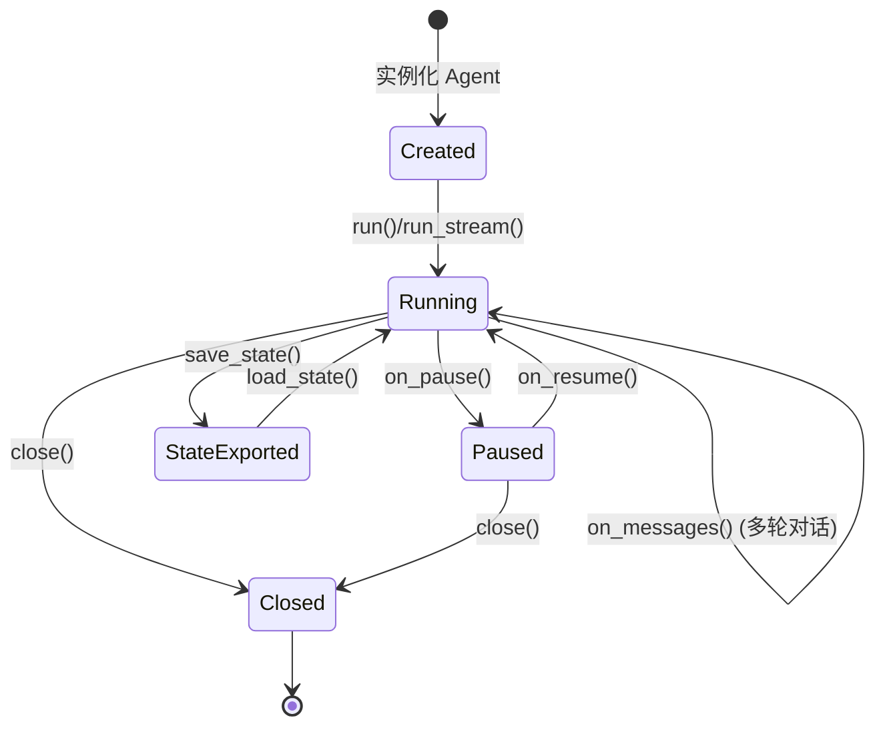
```mermaid
stateDiagram-v2
    [*] --> Created : 实例化 Agent
    Created --> Running : run()/run_stream()
    Running --> Paused : on_pause()
    Paused --> Running : on_resume()
    Running --> Running : on_messages() (多轮对话)
    Running --> StateExported : save_state()
    StateExported --> Running : load_state()
    Running --> Closed : close()
    Paused --> Closed : close()
    Closed --> [*]
```

#### 3.5.2 各阶段详解

**1. 创建（Instantiation）**

```python
# v0.4：通过构造函数创建
agent = AssistantAgent(
    name="my_agent",
    model_client=model_client,
    system_message="You are helpful.",
)
# 此时 Agent 已就绪，但 model_client 可能已建立连接
```

**2. 运行（Run）**

```python
# 方式一：run() — 一次性获取最终结果
result = await agent.run(task="Hello!")
# result 是 TaskResult，包含 messages 列表

# 方式二：run_stream() — 流式获取中间结果
async for message in agent.run_stream(task="Hello!"):
    print(message)  # 中间消息和最终 TaskResult

# 方式三：直接调用 on_messages()
response = await agent.on_messages(
    [TextMessage(content="Hello!", source="user")],
    CancellationToken()
)
```

**CancellationToken 的使用**：

```python
cancellation_token = CancellationToken()

# 在外部取消
cancellation_token.cancel()

# 在 Agent 内部检查
async def on_messages(self, messages, cancellation_token):
    if cancellation_token.is_cancelled():
        raise asyncio.CancelledError()
```

**3. 暂停与恢复（Pause / Resume）**

```python
# Team 可以在 Agent 运行时发送暂停信号
await agent.on_pause(cancellation_token)

# 恢复运行
await agent.on_resume(cancellation_token)

# 默认实现为 no-op，子类可自定义行为
# 例如：暂停时停止流式输出，恢复时继续
```

**4. 状态持久化（Save / Load State）**

```python
# 导出状态
state = await agent.save_state()
# state 是一个 Mapping[str, Any]，可 JSON 序列化

# 保存到文件
import json
with open("agent_state.json", "w") as f:
    json.dump(state, f)

# 从文件加载
with open("agent_state.json", "r") as f:
    state = json.load(f)
await agent.load_state(state)

# Team 级别的状态持久化
team_state = await team.save_state()
await team.load_state(team_state)
```

**状态内容**：通常包含消息历史、工具调用状态、模型上下文等。加载状态后，Agent 会从该时间点继续运行。

**5. 关闭（Close）**

```python
# 释放资源（如模型客户端连接）
await agent.close()

# 对于 AssistantAgent，关闭关联的 model_client
await model_client.close()
```

#### 3.5.3 Agent 继承关系图

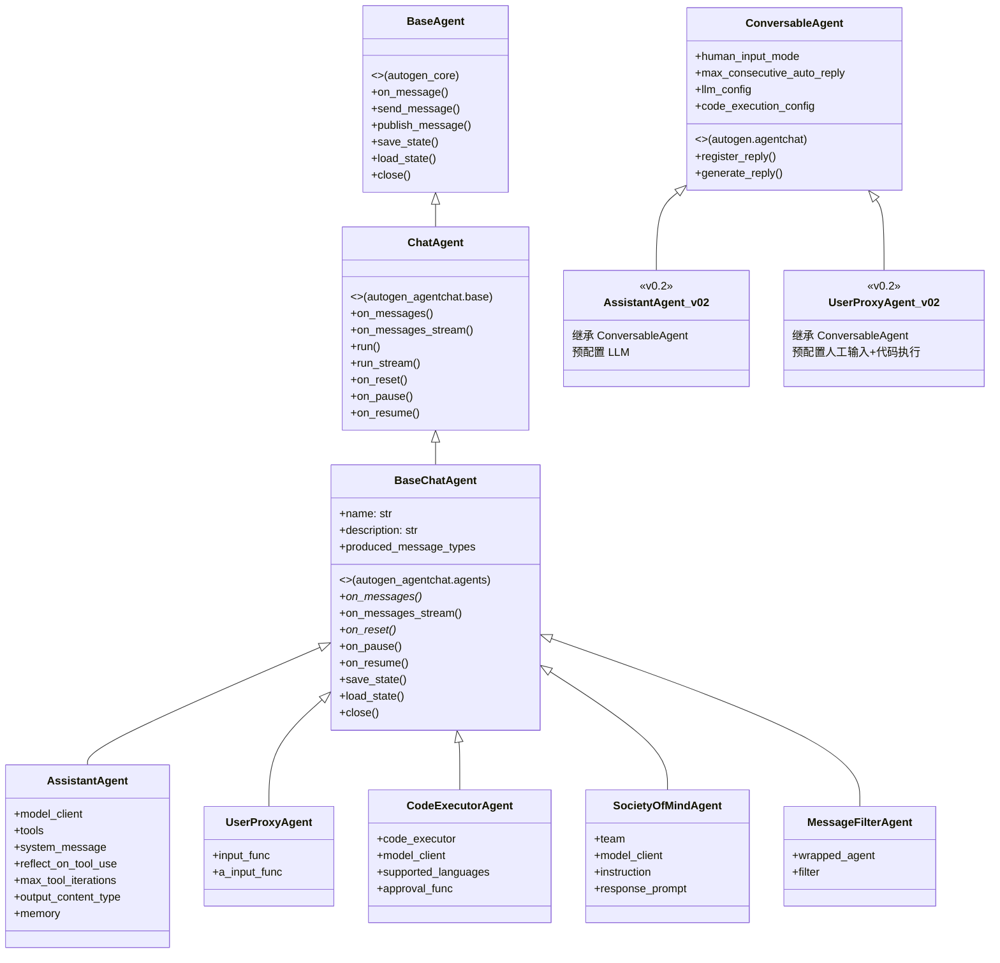
```mermaid
classDiagram
    class BaseAgent {
        <<abstract>> (autogen_core)
        +on_message()
        +send_message()
        +publish_message()
        +save_state()
        +load_state()
        +close()
    }

    class ChatAgent {
        <<interface>> (autogen_agentchat.base)
        +on_messages()
        +on_messages_stream()
        +run()
        +run_stream()
        +on_reset()
        +on_pause()
        +on_resume()
    }

    class BaseChatAgent {
        <<abstract>> (autogen_agentchat.agents)
        +name: str
        +description: str
        +produced_message_types
        +on_messages()*
        +on_messages_stream()
        +on_reset()*
        +on_pause()
        +on_resume()
        +save_state()
        +load_state()
        +close()
    }

    class AssistantAgent {
        +model_client
        +tools
        +system_message
        +reflect_on_tool_use
        +max_tool_iterations
        +output_content_type
        +memory
    }

    class UserProxyAgent {
        +input_func
        +a_input_func
    }

    class CodeExecutorAgent {
        +code_executor
        +model_client
        +supported_languages
        +approval_func
    }

    class SocietyOfMindAgent {
        +team
        +model_client
        +instruction
        +response_prompt
    }

    class MessageFilterAgent {
        +wrapped_agent
        +filter
    }

    class ConversableAgent {
        <<v0.2>> (autogen.agentchat)
        +human_input_mode
        +max_consecutive_auto_reply
        +llm_config
        +code_execution_config
        +register_reply()
        +generate_reply()
    }

    class AssistantAgent_v02 {
        <<v0.2>>
        继承 ConversableAgent
        预配置 LLM
    }

    class UserProxyAgent_v02 {
        <<v0.2>>
        继承 ConversableAgent
        预配置人工输入+代码执行
    }

    BaseAgent <|-- ChatAgent
    ChatAgent <|-- BaseChatAgent
    BaseChatAgent <|-- AssistantAgent
    BaseChatAgent <|-- UserProxyAgent
    BaseChatAgent <|-- CodeExecutorAgent
    BaseChatAgent <|-- SocietyOfMindAgent
    BaseChatAgent <|-- MessageFilterAgent

    ConversableAgent <|-- AssistantAgent_v02
    ConversableAgent <|-- UserProxyAgent_v02
```

#### 3.5.4 v0.2 与 v0.4 Agent 映射关系

| 角色 | v0.2 类 | v0.4 类 | 关键变化 |
|------|---------|---------|----------|
| 基类 | `ConversableAgent` | `BaseChatAgent` | 从配置驱动改为继承驱动 |
| LLM Agent | `AssistantAgent` | `AssistantAgent` | `llm_config` → `model_client` |
| 用户代理 | `UserProxyAgent` | `UserProxyAgent` | 大幅简化，去除了冗余参数 |
| 代码执行 | `UserProxyAgent`（配置） | `CodeExecutorAgent` | 独立专用 Agent |
| 记忆 | `Teachability` | `Memory` 接口 | 关注点分离 |
| 自定义 | `register_reply()` | 继承 `BaseChatAgent` | 从回调改为 OOP |

#### 3.5.5 完整生命周期示例

```python
import asyncio
import json
from autogen_agentchat.agents import AssistantAgent
from autogen_ext.models.openai import OpenAIChatCompletionClient

async def main():
    # 1. 创建
    model_client = OpenAIChatCompletionClient(model="gpt-4o")
    agent = AssistantAgent(
        name="assistant",
        model_client=model_client,
        system_message="You are helpful.",
    )

    # 2. 运行对话
    result1 = await agent.run(task="Hello, who are you?")
    print(result1.messages[-1].content)

    # 3. 保存状态
    state = await agent.save_state()
    with open("checkpoint.json", "w") as f:
        json.dump(state, f)

    # 4. 继续对话
    result2 = await agent.run(task="Tell me a joke.")
    print(result2.messages[-1].content)

    # 5. 恢复到之前状态
    with open("checkpoint.json", "r") as f:
        state = json.load(f)
    await agent.load_state(state)

    # 6. 从恢复点继续
    result3 = await agent.run(task="What did I ask before?")
    print(result3.messages[-1].content)

    # 7. 关闭
    await agent.close()
    await model_client.close()

asyncio.run(main())
```

**常见误区**：

- **误区 1**：认为 `load_state` 会合并状态。实际上是**覆盖**当前状态。加载后会丢失加载后的所有新消息。
- **误区 2**：在 `on_messages` 中忘记调用 `super().__init__()`。自定义 Agent 必须在 `__init__` 中调用 `super().__init__(name, description)`，否则基类属性无法初始化。
- **误区 3**：认为 Team 的 `save_state` 只保存 Team 本身。实际上它会递归保存所有成员 Agent 的状态，实现完整的检查点恢复。
- **误区 4**：忘记关闭 `model_client`。`model_client` 可能持有网络连接，不关闭会导致资源泄漏。

---

**引用来源**：

1. https://microsoft.github.io/autogen/stable/user-guide/agentchat-user-guide/tutorial/agents.html — AgentChat Agent 教程
2. https://microsoft.github.io/autogen/stable/user-guide/agentchat-user-guide/tutorial/custom-agents.html — 自定义 Agent 教程
3. https://microsoft.github.io/autogen/stable/reference/python/autogen_agentchat.agents.html — AgentChat Agent API 参考
4. https://microsoft.github.io/autogen/stable/user-guide/agentchat-user-guide/custom-agents.html — Custom Agents 用户指南
5. https://microsoft.github.io/autogen/stable/user-guide/agentchat-user-guide/migration-guide.html — v0.2 → v0.4 迁移指南
6. https://microsoft.github.io/autogen/0.2/docs/reference/agentchat/conversable_agent — v0.2 ConversableAgent API 文档
7. https://microsoft.github.io/autogen/0.2/docs/reference/agentchat/user_proxy_agent — v0.2 UserProxyAgent API 文档
8. https://github.com/microsoft/autogen/tree/main/python/packages/autogen-agentchat/src/autogen_agentchat/agents — AgentChat 源码
9. https://github.com/microsoft/autogen/blob/main/python/packages/autogen-agentchat/src/autogen_agentchat/agents/__init__.py — AgentChat 公开导出列表
## 4. Conversation Pattern — 多智能体对话模式

多智能体系统的核心价值在于：多个 Agent 通过结构化的对话模式协作，解决单一 Agent 无法胜任的复杂任务。AutoGen 提供了从简单的并发执行到复杂的动态对话等多种模式。

### 4.1 对话模式基础

**定义：** 对话模式（Conversation Pattern）是指 Agent 之间通过消息协议（Message Protocol）进行交互的结构化方式。不同的模式适用于不同的任务分解、协作和容错需求。

**为什么需要多智能体对话：** 研究表明，多智能体系统在复杂任务（如软件开发、数据分析）上优于单智能体系统。核心原因是：
- **任务分解**：复杂任务可被动态拆分为子任务，由专业化 Agent 处理
- **角色分离**：不同 Agent 专注不同领域，减少单一 Agent 的上下文负担
- **容错性**：通过 Reflection 等模式实现自我纠错

#### AutoGen 中的三层对话抽象

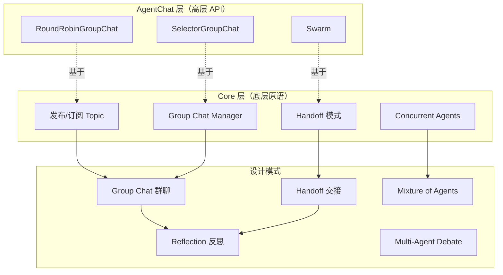
```mermaid
graph TB
    subgraph "AgentChat 层（高层 API）"
        A1[RoundRobinGroupChat] 
        A2[SelectorGroupChat]
        A3[Swarm]
    end
    
    subgraph "Core 层（底层原语）"
        B1[发布/订阅 Topic]
        B2[Group Chat Manager]
        B3[Handoff 模式]
        B4[Concurrent Agents]
    end
    
    subgraph "设计模式"
        C1[Group Chat 群聊]
        C2[Handoff 交接]
        C3[Reflection 反思]
        C4[Mixture of Agents]
        C5[Multi-Agent Debate]
    end
    
    A1 -.基于.-> B1
    A2 -.基于.-> B2
    A3 -.基于.-> B3
    
    B1 --> C1
    B2 --> C1
    B3 --> C2
    B4 --> C4
    
    C1 --> C3
    C2 --> C3
```

| 层级 | 抽象 | 特点 | 适用场景 |
|------|------|------|----------|
| **AgentChat** | 预置 Team 类 | 开箱即用，配置驱动 | 快速构建应用 |
| **Core** | Agent + Topic + Message | 事件驱动，完全控制 | 自定义编排逻辑 |
| **设计模式** | 消息协议结构 | 概念层，跨框架通用 | 理解架构原理 |

**关键理解：** AgentChat 是 Core 的高层封装。`SelectorGroupChat`、`Swarm`、`RoundRobinGroupChat` 本质上都是 Group Chat Pattern 的不同实现变体，区别在于「如何选择下一个发言者」。

---

### 4.2 Group Chat — 群聊模式

**定义：** Group Chat 是一种多个 Agent 共享同一消息线程（Message Thread）的对话模式。所有参与者发布和订阅同一个 Topic，轮流发言，每次只有一个 Agent 工作。

#### 工作原理

Group Chat 的核心是一个 **Group Chat Manager** 代理，负责维护发言顺序：

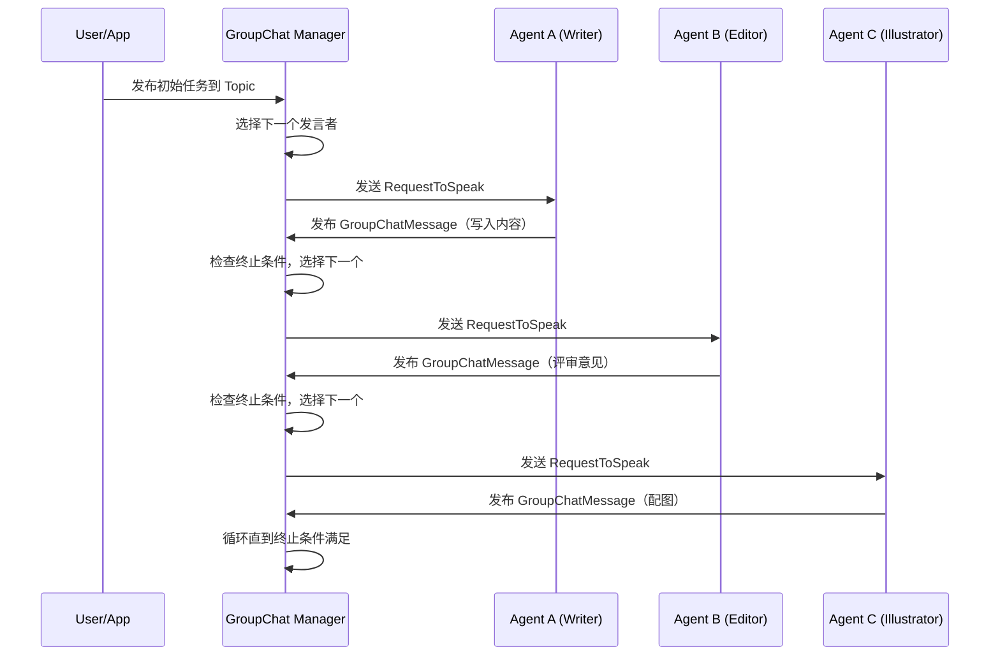
```mermaid
sequenceDiagram
    participant U as User/App
    participant M as GroupChat Manager
    participant A1 as Agent A (Writer)
    participant A2 as Agent B (Editor)
    participant A3 as Agent C (Illustrator)
    
    U->>M: 发布初始任务到 Topic
    M->>M: 选择下一个发言者
    M->>A1: 发送 RequestToSpeak
    A1->>M: 发布 GroupChatMessage（写入内容）
    M->>M: 检查终止条件，选择下一个
    M->>A2: 发送 RequestToSpeak
    A2->>M: 发布 GroupChatMessage（评审意见）
    M->>M: 检查终止条件，选择下一个
    M->>A3: 发送 RequestToSpeak
    A3->>M: 发布 GroupChatMessage（配图）
    M->>M: 循环直到终止条件满足
```

**消息协议（Core API 级别）：**

1. 用户或外部 Agent 向公共 Topic 发布 `GroupChatMessage`
2. Group Chat Manager 选择下一个发言者，向其发送 `RequestToSpeak`
3. 被选中的 Agent 收到 `RequestToSpeak` 后，发布自己的 `GroupChatMessage`
4. 重复步骤 2-3，直到 Manager 判定终止

**发言选择算法：**

| 算法 | 描述 | 适用场景 |
|------|------|----------|
| **Round-Robin（轮询）** | 按固定顺序轮流发言 | 流程确定、角色顺序固定的任务 |
| **LLM Selector（模型选择）** | 由 LLM 根据对话上下文动态决定下一个发言者 | 需要灵活决策的复杂任务 |
| **自定义** | 用户实现任意选择逻辑 | 有特殊业务逻辑的场景 |

**Core API 实现示例（LLM 驱动的 Group Chat）：**

```python
from autogen_core import (
    DefaultTopicId, RoutedAgent, SingleThreadedAgentRuntime,
    message_handler, default_subscription
)
from dataclasses import dataclass

@dataclass
class GroupChatMessage:
    source: str
    content: str

@dataclass 
class RequestToSpeak:
    pass

@default_subscription
class BaseGroupChatAgent(RoutedAgent):
    """群聊参与者：接收消息、被选中时发言、广播回复"""
    
    @message_handler
    async def handle_message(self, message: GroupChatMessage, ctx: MessageContext) -> None:
        # 将其他人的消息存入聊天历史
        self._chat_history.append(message)
    
    @message_handler
    async def handle_request_to_speak(self, message: RequestToSpeak, ctx: MessageContext) -> None:
        # 被 Manager 选中：生成回复并广播给所有人
        response = await self._model_client.create(self._system_messages + self._chat_history)
        await self.publish_message(
            GroupChatMessage(source=self.id.type, content=response.content),
            topic_id=DefaultTopicId()
        )
```

**AgentChat 高层 API（开箱即用）：**

```python
from autogen_agentchat.teams import RoundRobinGroupChat

# 轮询群聊：按注册顺序轮流发言
team = RoundRobinGroupChat(
    [agent_a, agent_b, agent_c],
    termination_condition=max_messages_termination
)
result = await team.run(task="写一篇技术文章")
```

#### 关键特性

- **共享上下文**：所有 Agent 看到相同的消息历史，每个 Agent 的发言都存入共享线程
- **顺序执行**：每次只有一个 Agent 工作，不是并行
- **可嵌套**：Group Chat 可以嵌套，即一个参与者本身是一个子 Group Chat
- **Human-in-the-Loop**：可以加入 User Agent，让人类在对话中引导方向

#### 常见误区

| 误区 | 正解 |
|------|------|
| "Group Chat 是并行执行" | 错误。Group Chat 是顺序的，每次只有一个 Agent 发言。并发需要 Concurrent Agents 模式 |
| "Manager 是中心控制器" | 不完全是。Manager 只负责选择发言者，不干预内容生成。Agent 的决策是自主的 |
| "所有 Agent 必须回复每条消息" | 错误。只有被 Manager 选中的 Agent 才会发言 |

---

### 4.3 Selector Group Chat — 选择器群聊

**定义：** `SelectorGroupChat` 是 Group Chat 的一种变体，使用 LLM 模型根据对话上下文（Conversation Context）动态选择下一个发言者，而非固定顺序。

#### 工作原理

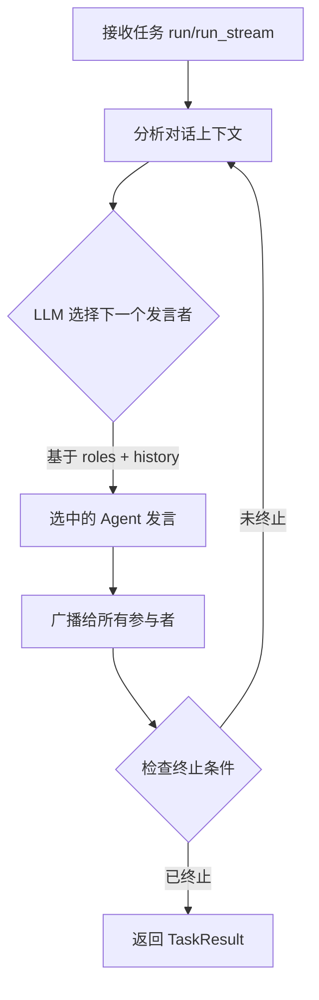
```mermaid
flowchart TD
    A[接收任务 run/run_stream] --> B[分析对话上下文]
    B --> C{LLM 选择下一个发言者}
    C -->|基于 roles + history| D[选中的 Agent 发言]
    D --> E[广播给所有参与者]
    E --> F{检查终止条件}
    F -->|未终止| B
    F -->|已终止| G[返回 TaskResult]
```

**执行流程（共 3 步循环）：**

1. **选择发言者**：Manager 分析对话历史、参与者名称和描述，用 LLM 决定下一个发言者。默认不会连续选择同一 Agent（可通过 `allow_repeated_speaker=True` 覆盖）
2. **Agent 发言**：被选中的 Agent 生成回复，广播给所有其他参与者
3. **检查终止**：判断是否满足终止条件，不满足则回到步骤 1

#### 核心参数

| 参数 | 说明 | 默认值 |
|------|------|--------|
| `model_client` | 用于选择发言者的 LLM 客户端 | 必需 |
| `selector_prompt` | 选择发言者的提示词模板 | 内置默认 |
| `allow_repeated_speaker` | 是否允许同一 Agent 连续发言 | `False` |
| `selection_func` | 自定义选择函数（覆盖 LLM 选择） | `None` |
| `candidate_func` | 缩小候选 Agent 范围的函数 | `None` |

**`selector_prompt` 模板变量：**

| 变量 | 格式 | 说明 |
|------|------|------|
| `{participants}` | `["AgentA", "AgentB", ...]` | 候选 Agent 名称列表 |
| `{roles}` | `AgentA : 描述\nAgentB : 描述` | Agent 名称和描述 |
| `{history}` | `AgentA : 内容\n\nAgentB : 内容` | 对话历史 |

> **提示：** 不要在选择器提示词中写入过多指令。对于 GPT-4o 级别模型，可以加入每个 Agent 的触发条件；对于较小模型（如 Phi-4），应保持提示词尽可能简洁。如果写了太多条件，说明应该使用自定义选择函数或拆分任务。

#### 完整示例：Web 搜索与数据分析

```python
from autogen_agentchat.agents import AssistantAgent
from autogen_agentchat.teams import SelectorGroupChat
from autogen_agentchat.conditions import MaxMessageTermination, TextMentionTermination
from autogen_ext.models.openai import OpenAIChatCompletionClient

model_client = OpenAIChatCompletionClient(model="gpt-4o")

# --- 三个专业化 Agent ---
planning_agent = AssistantAgent(
    "PlanningAgent",
    description="An agent for planning tasks, this agent should be the first to engage when given a new task.",
    model_client=model_client,
    system_message="You are a planning agent. Break down tasks and delegate."
)

web_search_agent = AssistantAgent(
    "WebSearchAgent",
    description="An agent for searching information on the web.",
    tools=[search_web_tool],
    model_client=model_client,
)

data_analyst_agent = AssistantAgent(
    "DataAnalystAgent",
    description="An agent for performing calculations.",
    tools=[percentage_change_tool],
    model_client=model_client,
)

# --- 终止条件 ---
termination = TextMentionTermination("TERMINATE") | MaxMessageTermination(max_messages=25)

# --- 自定义选择器提示词 ---
selector_prompt = """Select an agent to perform task.

{roles}

Current conversation context:
{history}

Read the above conversation, then select an agent from {participants} to perform the next task.
Only select one agent."""

# --- 创建并运行团队 ---
team = SelectorGroupChat(
    [planning_agent, web_search_agent, data_analyst_agent],
    model_client=model_client,
    termination_condition=termination,
    selector_prompt=selector_prompt,
    allow_repeated_speaker=True,
)

task = "Miami Heat 在 2006-2007 赛季得分最高的球员是谁？他 2007-2008 和 2008-2009 赛季的总篮板数变化百分比是多少？"
result = await team.run_stream(task=task)
```

**执行过程解析：**

```
用户提问
  -> SelectorGroupChat 根据描述选择 PlanningAgent（因为描述说它是第一个介入的）
  -> PlanningAgent 分解任务为 4 个子任务，分别分配给 WebSearchAgent 和 DataAnalystAgent
  -> SelectorGroupChat 根据任务描述选择 WebSearchAgent 执行搜索
  -> WebSearchAgent 查到数据（Dwyane Wade, 1397 分）
  -> SelectorGroupChat 再次选择 WebSearchAgent 查询篮板数据
  -> SelectorGroupChat 选择 DataAnalystAgent 计算百分比变化（85.98%）
  -> PlanningAgent 汇总结果，输出 "TERMINATE"
  -> 终止条件满足，返回结果
```

#### Agent 名称和描述的重要性

**这是 SelectorGroupChat 最关键的设计要点。** LLM 选择发言者时**只看**两个字段：
- Agent 的 `name`（名称）
- Agent 的 `description`（描述）

因此，**必须**为每个 Agent 编写清晰的描述，说明其职责和适用场景。描述模糊或缺失会导致选择器无法正确路由任务。

#### 常见误区

| 误区 | 正解 |
|------|------|
| "selector_prompt 写得越详细越好" | 错误。过长的提示词会让模型困惑，应根据模型能力选择简洁或详细的提示词 |
| "SelectorGroupChat 适合所有多 Agent 场景" | 错误。如果 Agent 之间有明确的交接逻辑（A 做完交给 B），Swarm 模式更合适 |
| "allow_repeated_speaker=False 总是好的" | 不一定。某些场景（如连续搜索多组数据）需要同一 Agent 多次发言 |

---

### 4.4 Swarm — 蜂群模式

**定义：** Swarm 是一种多智能体协作模式，最初由 OpenAI 在 Swarm 项目中提出。核心思想是：**Agent 可以通过特殊的工具调用将任务「交接」（Handoff）给其他 Agent**，所有 Agent 共享同一条消息上下文。

#### 核心概念：Handoff（交接）

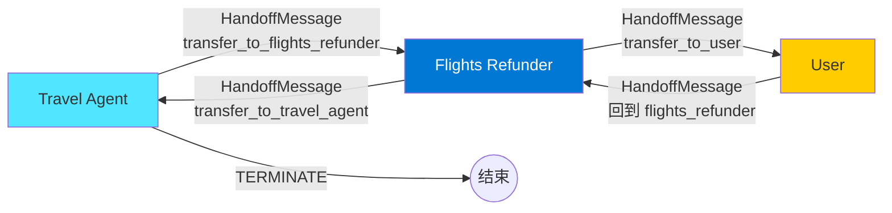
```mermaid
flowchart LR
    A[Travel Agent] -->|"HandoffMessage<br/>transfer_to_flights_refunder"| B[Flights Refunder]
    B -->|"HandoffMessage<br/>transfer_to_user"| C[User]
    C -->|"HandoffMessage<br/>回到 flights_refunder"| B
    B -->|"HandoffMessage<br/>transfer_to_travel_agent"| A
    A -->|"TERMINATE"| END((结束))
    
    style A fill:#50e6ff
    style B fill:#0078d4,color:#fff
    style C fill:#ffcc00
```

**与 SelectorGroupChat 的关键区别：**

| 特性 | SelectorGroupChat | Swarm |
|------|-------------------|-------|
| **决策权** | 中心化的 Manager（LLM 选择） | 去中心化的 Agent 自主决定 |
| **交接方式** | Manager 根据描述选择下一个 | Agent 通过 HandoffMessage 主动交接 |
| **适用场景** | 需要动态、灵活的任务分配 | Agent 有明确的本地决策能力 |
| **控制权** | Manager 控制流程 | Agent 自己控制流程 |

#### 工作原理

1. **每个 Agent 声明可交接的对象**：通过 `handoffs` 参数指定可以交接给哪些 Agent
2. **Agent 自主决定交接**：在对话中，Agent 判断是否需要交接以及交接给谁
3. **生成 HandoffMessage**：Agent 通过工具调用生成 `HandoffMessage`，指定目标 Agent
4. **接收方接管**：目标 Agent 接管任务，继承相同的消息上下文
5. **循环直到终止**

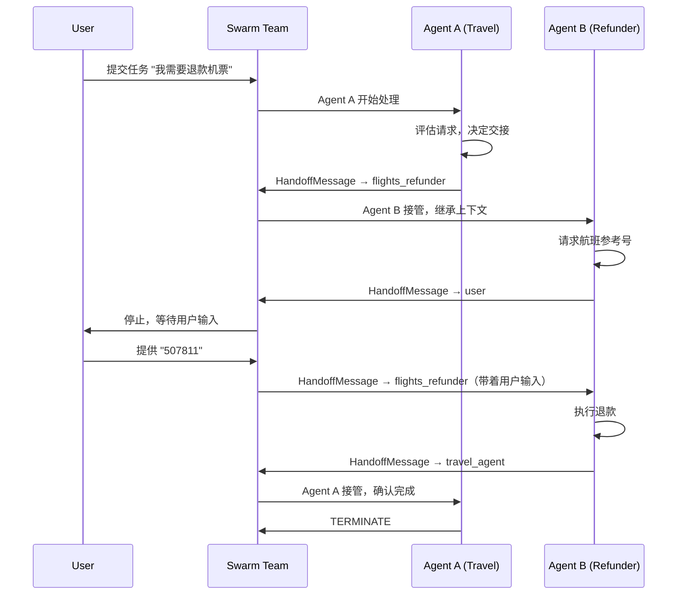
```mermaid
sequenceDiagram
    participant U as User
    participant S as Swarm Team
    participant A as Agent A (Travel)
    participant B as Agent B (Refunder)
    
    U->>S: 提交任务 "我需要退款机票"
    S->>A: Agent A 开始处理
    A->>A: 评估请求，决定交接
    A->>S: HandoffMessage → flights_refunder
    S->>B: Agent B 接管，继承上下文
    B->>B: 请求航班参考号
    B->>S: HandoffMessage → user
    S->>U: 停止，等待用户输入
    U->>S: 提供 "507811"
    S->>B: HandoffMessage → flights_refunder（带着用户输入）
    B->>B: 执行退款
    B->>S: HandoffMessage → travel_agent
    S->>A: Agent A 接管，确认完成
    A->>S: TERMINATE
```

#### 关键实现细节

**Handoff 通过模型的工具调用能力实现：**

```python
from autogen_agentchat.agents import AssistantAgent
from autogen_agentchat.teams import Swarm
from autogen_agentchat.conditions import HandoffTermination, TextMentionTermination
from autogen_agentchat.messages import HandoffMessage

# --- 工具定义 ---
def refund_flight(flight_id: str) -> str:
    return f"Flight {flight_id} refunded"

# --- Agent 定义 ---
travel_agent = AssistantAgent(
    "travel_agent",
    model_client=model_client,
    handoffs=["flights_refunder", "user"],  # 可以交接给谁
    system_message="""You are a travel agent.
    The flights_refunder is in charge of refunding flights.
    Use TERMINATE when the travel planning is complete."""
)

flights_refunder = AssistantAgent(
    "flights_refunder", 
    model_client=model_client,
    handoffs=["travel_agent", "user"],
    tools=[refund_flight],
    system_message="""You are an agent specialized in refunding flights.
    When the transaction is complete, handoff to the travel agent."""
)

# --- 终止条件 ---
termination = HandoffTermination(target="user") | TextMentionTermination("TERMINATE")

# --- 创建 Swarm 团队 ---
team = Swarm([travel_agent, flights_refunder], termination_condition=termination)
```

**Human-in-the-Loop 模式：**

当 Agent 交接给 `"user"` 时，`run_stream()` 会暂停，等待用户输入。用户输入被封装为 `HandoffMessage`，定向回原来的 Agent。

```python
async def run_with_human_in_the_loop() -> None:
    task_result = await Console(team.run_stream(task="I need to refund my flight."))
    last_message = task_result.messages[-1]
    
    # 如果需要用户输入，循环等待
    while isinstance(last_message, HandoffMessage) and last_message.target == "user":
        user_input = input("User: ")
        task_result = await Console(
            team.run_stream(
                task=HandoffMessage(source="user", target=last_message.source, content=user_input)
            )
        )
        last_message = task_result.messages[-1]
```

**并行工具调用警告：**

> 如果模型支持并行工具调用（Parallel Tool Calls），可能同时生成多个 Handoff，导致意外行为。对于 `OpenAIChatCompletionClient`，建议设置 `parallel_tool_calls=False`。

#### Swarm vs SelectorGroupChat 选择指南

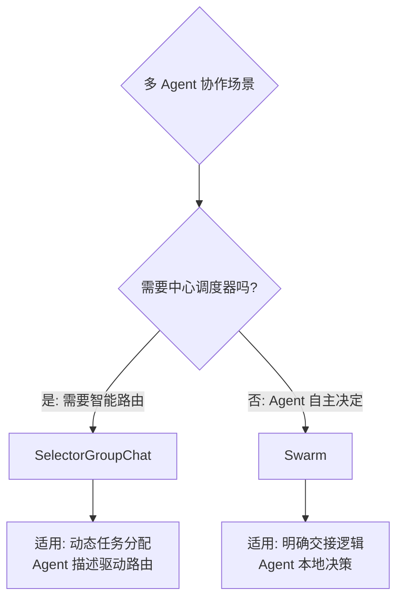
```mermaid
flowchart TD
    A{多 Agent 协作场景} --> B{需要中心调度器吗?}
    B -->|是: 需要智能路由| C[SelectorGroupChat]
    B -->|否: Agent 自主决定| D[Swarm]
    
    C --> C1[适用: 动态任务分配<br/>Agent 描述驱动路由]
    D --> D1[适用: 明确交接逻辑<br/>Agent 本地决策]
```

**选择 SelectorGroupChat 当：**
- 你需要一个「协调者」根据全局上下文决定谁该发言
- Agent 之间的路由关系不固定，需要 LLM 灵活判断
- 任务分解和分配是动态的

**选择 Swarm 当：**
- 每个 Agent 能自主判断「我该交给谁」
- 交接逻辑相对明确（如客服转接、审批流）
- 你希望 Agent 有本地决策能力，而非依赖中心调度

#### 常见误区

| 误区 | 正解 |
|------|------|
| "Swarm 是真正的蜂群，多个 Agent 并行工作" | 错误。Swarm 中 Agent 仍然是轮流工作，只是交接由 Agent 自主决定 |
| "Handoff 会清空上下文" | 错误。HandoffMessage 后，接收方继承完整的消息历史 |
| "Agent 可以同时交接给多个 Agent" | 理论上模型可以并行调用多个 transfer 工具，但这会导致意外行为，应禁用并行工具调用 |

---

### 4.5 Reflection Pattern — 反思模式

**定义：** Reflection 是一种双 Agent 协作模式，其中第一个 LLM 生成输出后，第二个 LLM 对输出进行「反思」（Critique/Review），两者循环迭代直到达到终止条件。

#### 为什么需要 Reflection

单 Agent 生成结果时缺乏自我纠错能力。Reflection 通过引入独立的评审角色，实现：
- **质量提升**：评审者发现生成者忽略的问题
- **安全性检查**：评审者检查代码安全、逻辑漏洞
- **迭代改进**：生成者根据评审意见修改，评审者再检查

#### 工作原理

```mermaid
flowchart TD
    A[应用提交任务] --> B[Coder Agent 生成代码]
    B --> C[发布 CodeReviewTask]
    C --> D[Reviewer Agent 评审]
    D --> E{评审通过?}
    E -->|否: REVISE| F[发布 CodeReviewResult<br/>含修改意见]
    F --> B
    E -->|是: APPROVE| G[Coder 发布 CodeWritingResult]
    G --> H[返回最终结果]
    
    style B fill:#50e6ff
    style D fill:#0078d4,color:#fff
```

**消息协议（Core API 级别）：**

```mermaid
graph LR
    APP[应用] -->|CodeWritingTask| CODER[Coder Agent]
    CODER -->|CodeReviewTask| REVIEWER[Reviewer Agent]
    REVIEWER -->|CodeReviewResult| CODER
    CODER -->|APPROVE → CodeWritingResult| APP
    CODER -->|REVISE → CodeReviewTask| REVIEWER
```

| 消息类型 | 发送方 | 接收方 | 说明 |
|----------|--------|--------|------|
| `CodeWritingTask` | 应用 | Coder | 初始编程任务 |
| `CodeReviewTask` | Coder | Reviewer | 包含生成的代码和上下文 |
| `CodeReviewResult` | Reviewer | Coder | 评审意见 + 是否通过 |
| `CodeWritingResult` | Coder | 应用 | 最终代码（通过后） |

#### 完整实现示例

```python
from dataclasses import dataclass
from autogen_core import (
    RoutedAgent, message_handler, default_subscription,
    DefaultTopicId, TopicId, SingleThreadedAgentRuntime
)

# --- 消息定义 ---
@dataclass
class CodeWritingTask:
    task: str

@dataclass
class CodeReviewTask:
    session_id: str
    code_writing_task: str
    code_writing_scratchpad: str
    code: str

@dataclass
class CodeReviewResult:
    review: str
    session_id: str
    approved: bool

# --- Coder Agent ---
@default_subscription
class CoderAgent(RoutedAgent):
    """代码生成 Agent，接收评审意见并迭代改进"""
    
    def __init__(self, model_client: ChatCompletionClient) -> None:
        super().__init__("A code writing agent.")
        self._system_messages = [SystemMessage(
            content="""You are a proficient code writer.
Always put all finished code in a single Markdown code block.
Respond format:
Thoughts: <Your comments>
Code: <Your code>
"""
        )]
        self._model_client = model_client
        self._session_memory = {}
    
    @message_handler
    async def handle_code_writing_task(self, message: CodeWritingTask, ctx: MessageContext) -> None:
        session_id = str(uuid.uuid4())
        self._session_memory[session_id] = [message]
        
        # 生成代码
        response = await self._model_client.create(
            self._system_messages + [UserMessage(content=message.task, source=self.id.type)]
        )
        code_block = self._extract_code_block(response.content)
        
        # 发布评审任务
        await self.publish_message(
            CodeReviewTask(
                session_id=session_id,
                code_writing_task=message.task,
                code_writing_scratchpad=response.content,
                code=code_block
            ),
            topic_id=TopicId("default", self.id.key)
        )
    
    @message_handler
    async def handle_code_review_result(self, message: CodeReviewResult, ctx: MessageContext) -> None:
        self._session_memory[message.session_id].append(message)
        
        if message.approved:
            # 通过：发布最终结果
            await self.publish_message(
                CodeWritingResult(code=..., task=..., review=message.review),
                topic_id=TopicId("default", self.id.key)
            )
        else:
            # 未通过：根据评审意见修改代码，重新提交评审
            messages = self._build_messages_with_feedback(message.session_id)
            response = await self._model_client.create(messages)
            # ... 提取代码，发布新的 CodeReviewTask

# --- Reviewer Agent ---
@default_subscription
class ReviewerAgent(RoutedAgent):
    """代码评审 Agent，检查正确性、效率、安全性"""
    
    @message_handler
    async def handle_code_review_task(self, message: CodeReviewTask, ctx: MessageContext) -> None:
        prompt = f"""Problem: {message.code_writing_task}
Code:
```
{message.code}
```
Previous feedback: {previous_feedback}

Review the code. Check correctness, efficiency, and safety."""
        
        response = await self._model_client.create(
            self._system_messages + [UserMessage(content=prompt, source=self.id.type)],
            json_output=True  # JSON 模式输出结构化评审
        )
        
        review = json.loads(response.content)
        approved = review["approval"].lower().strip() == "approve"
        
        await self.publish_message(
            CodeReviewResult(review=response.content, session_id=message.session_id, approved=approved),
            topic_id=TopicId("default", self.id.key)
        )
```

#### AgentChat 中的简化实现

在 AgentChat 高层 API 中，可以通过 `AssistantAgent` 的 `reflect_on_tool_use=True` 参数启用内置反思：

```python
agent = AssistantAgent(
    "CodeAgent",
    model_client=model_client,
    tools=[code_executor],
    reflect_on_tool_use=True  # Agent 会在工具输出后进行二次反思
)
```

#### 典型对话流程示例

```
任务: "写一个函数求列表中所有偶数的和"

Coder Agent:
  Thoughts: 使用生成器表达式过滤偶数再求和
  Code:
  def sum_of_even_numbers(numbers):
      return sum(num for num in numbers if num % 2 == 0)

Reviewer Agent:
  Code review:
  correctness: 函数正确识别并求和偶数 ✓
  efficiency: 使用生成器表达式避免中间列表，内存效率高 ✓
  safety: 无安全问题 ✓
  approval: APPROVE

→ 评审通过，返回最终结果
```

**如果评审不通过：**

```
Reviewer Agent:
  Code review:
  correctness: 未处理非数字输入的情况
  efficiency: 良好
  safety: 未处理空列表边界情况
  approval: REVISE
  suggested_changes: 添加类型检查和空列表处理

Coder Agent (第二轮):
  Thoughts: 根据评审意见添加输入验证
  Code:
  def sum_of_even_numbers(numbers):
      if not isinstance(numbers, (list, tuple)):
          raise TypeError("Input must be a list or tuple")
      return sum(num for num in numbers if isinstance(num, (int, float)) and num % 2 == 0)
```

#### 常见误区

| 误区 | 正解 |
|------|------|
| "Reflection 就是单 Agent 自我反思" | 不完全。最佳实践是两个独立 Agent（生成者 + 评审者），而非同一 Agent 自我对话 |
| "Reflection 只适合代码" | 错误。Reflection 适用于任何需要质量检查的场景：写作、翻译、数据分析等 |
| "Reflection 会无限循环" | 需要设置终止条件，如最大迭代次数或评审通过标志 |

---

### 4.6 Concurrent Agents — 并发 Agent 模式

**定义：** Concurrent Agents 模式描述多个 Agent 同时处理任务的场景。通过 Topic/Subscription 机制，实现消息的广播和路由。

#### 三种并发模式

**模式一：单消息 + 多处理器（Broadcast）**

```mermaid
graph TD
    A[发布 Task 到 DefaultTopic] --> B[Processor 1]
    A --> C[Processor 2]
    A --> D[Processor 3]
    B --> E[各自独立处理]
    C --> E
    D --> E
```

所有订阅 Default Topic 的 Agent 同时收到同一条消息，各自独立处理。

```python
@default_subscription
class Processor(RoutedAgent):
    @message_handler
    async def on_task(self, message: Task, ctx: MessageContext) -> None:
        print(f"{self._description} starting task {message.task_id}")
        await asyncio.sleep(2)  # 模拟工作
        print(f"{self._description} finished task {message.task_id}")

# 注册两个 Processor
await Processor.register(runtime, "agent_1", lambda: Processor("Agent 1"))
await Processor.register(runtime, "agent_2", lambda: Processor("Agent 2"))

# 发布一条消息，两个 Processor 同时处理
await runtime.publish_message(Task(task_id="task-1"), topic_id=DefaultTopicId())

# 输出:
# Agent 1 starting task task-1
# Agent 2 starting task task-1
# Agent 1 finished task task-1
# Agent 2 finished task task-1
```

**模式二：多消息 + 多处理器（Topic Routing）**

```mermaid
graph TD
    A[发布到 urgent Topic] --> B[UrgentProcessor]
    C[发布到 normal Topic] --> D[NormalProcessor]
```

不同类型的消息路由到专门的处理器。通过 `@type_subscription` 装饰器实现。

```python
@type_subscription(topic_type="urgent")
class UrgentProcessor(RoutedAgent):
    @message_handler
    async def on_task(self, message: Task, ctx: MessageContext) -> None:
        print(f"Urgent processor starting task {message.task_id}")

@type_subscription(topic_type="normal")
class NormalProcessor(RoutedAgent):
    @message_handler
    async def on_task(self, message: Task, ctx: MessageContext) -> None:
        print(f"Normal processor starting task {message.task_id}")
```

**模式三：直接消息（Direct Messaging）**

```python
# 通过 AgentId 直接发送消息（非广播）
response = await self.send_message(
    Task(task_id="task-1"),
    recipient=AgentId("worker", "worker-1")
)
```

#### 结果收集

使用 `ClosureAgent` 收集处理结果：

```python
queue = asyncio.Queue[TaskResponse]()

async def collect_result(_agent: ClosureContext, message: TaskResponse, ctx: MessageContext) -> None:
    await queue.put(message)

# 注册闭包 Agent 监听结果
await ClosureAgent.register_closure(
    runtime, "collect_result_agent", collect_result,
    subscriptions=lambda: [TypeSubscription(topic_type="task-results", agent_type="collect_result_agent")]
)
```

---

### 4.7 模式对比与选型指南

```mermaid
graph TB
    subgraph "需要并行执行？"
        A1[是] --> CONCURRENT[Concurrent Agents]
    end
    
    subgraph "顺序执行，Agent 自主交接？"
        B1[是] --> SWARM[Swarm]
    end
    
    subgraph "顺序执行，Manager 选择发言者？"
        C1[是] --> C2{需要灵活路由？}
        C2 -->|是| SELECTOR[SelectorGroupChat]
        C2 -->|否: 固定顺序| ROUNDROBIN[RoundRobinGroupChat]
    end
    
    subgraph "需要质量检查和迭代？"
        D1[是] --> REFLECTION[Reflection]
    end
```

| 模式 | 控制方式 | 并发 | 适用场景 | 复杂度 |
|------|----------|------|----------|--------|
| **RoundRobinGroupChat** | 固定轮询 | 顺序 | 流程确定的流水线任务 | 低 |
| **SelectorGroupChat** | LLM 选择 | 顺序 | 动态任务分解和路由 | 中 |
| **Swarm** | Agent 自主 | 顺序 | 明确交接逻辑的工作流 | 中 |
| **Concurrent Agents** | Topic 路由 | 并发 | 独立并行任务处理 | 高 |
| **Reflection** | 双 Agent 循环 | 顺序 | 需要质量检查的场景 | 中 |

---

**引用来源：**
- AutoGen 官方文档 v0.7.5 — Selector Group Chat: https://microsoft.github.io/autogen/stable/user-guide/agentchat-user-guide/selector-group-chat.html
- AutoGen 官方文档 v0.7.5 — Swarm: https://microsoft.github.io/autogen/stable/user-guide/agentchat-user-guide/swarm.html
- AutoGen 官方文档 v0.7.5 — Design Patterns Intro: https://microsoft.github.io/autogen/stable/user-guide/core-user-guide/design-patterns/intro.html
- AutoGen 官方文档 v0.7.5 — Concurrent Agents: https://microsoft.github.io/autogen/stable/user-guide/core-user-guide/design-patterns/concurrent-agents.html
- AutoGen 官方文档 v0.7.5 — Group Chat: https://microsoft.github.io/autogen/stable/user-guide/core-user-guide/design-patterns/group-chat.html
- AutoGen 官方文档 v0.7.5 — Reflection: https://microsoft.github.io/autogen/stable/user-guide/core-user-guide/design-patterns/reflection.html
## 5. 工作流编排 — GraphFlow 与状态管理

### 5.1 GraphFlow 有向图工作流

**定义**：GraphFlow 是 AutoGen AgentChat 提供的一种基于有向图（DiGraph）的多Agent 团队类型，用于精确控制 Agent 之间的执行顺序和交互路径。它支持顺序执行、并行扇出、条件分支和带安全退出条件的循环行为。

> **何时使用 GraphFlow？** 当你需要严格控制 Agent 执行顺序，或不同结果必须导向不同下一步时使用。如果简单的对话流已足够，应从 RoundRobinGroupChat 或 SelectorGroupChat 开始；当任务需要确定性控制、条件分支或处理复杂多步骤循环时，再迁移到 GraphFlow。

> **警告**：GraphFlow 是实验性特性，API 和行为可能在后续版本中变化。（AutoGen 0.7.5）

#### 工作原理

GraphFlow 的核心由两个概念组成：

1. **执行图（Execution Graph）**：通过 `DiGraphBuilder` 构建的有向图，定义 Agent 的执行顺序。每个节点代表一个 Agent，边定义允许的执行路径。
2. **消息图（Message Graph）**：独立于执行图的可选层，通过 `MessageFilterAgent` + `MessageFilterConfig` 控制每个 Agent 能接收到哪些消息。

**执行图的运行机制**：
- Flow 自动计算图的源节点（无入边）和叶子节点（无出边）
- 执行从所有源节点开始，当没有可执行的节点时终止
- 边可附带条件（基于 Agent 消息）来控制执行流

**激活组（Activation Group）**：处理多路径指向同一目标节点的依赖模式：
- `activation_condition = "all"`（默认）：目标节点等待所有前置依赖完成后才执行
- `activation_condition = "any"`：任意一个前置依赖完成即可触发目标节点

**消息过滤机制**：
执行图控制"谁先谁后执行"，但不控制"谁能看到什么消息"。消息过滤通过 `MessageFilterAgent` 配合 `PerSourceFilter` 实现，可以：
- 减少幻觉（只给 Agent 看相关信息）
- 控制上下文负载（限制记忆大小）
- 聚焦 Agent 注意力

#### Mermaid 流程图：顺序执行流

```mermaid
graph LR
    User[用户输入] --> Writer
    Writer --> Reviewer
    Reviewer -.终止.-> End[执行结束]

    style User fill:#e1f5fe
    style End fill:#ffebee
```

#### Mermaid 流程图：并行扇出 + 合并

```mermaid
graph LR
    User[用户输入] --> Writer
    Writer --> Editor1[语法编辑]
    Writer --> Editor2[风格编辑]
    Editor1 --> Reviewer
    Editor2 --> Reviewer
    Reviewer -.终止.-> End[执行结束]

    style User fill:#e1f5fe
    style End fill:#ffebee
```

#### Mermaid 流程图：条件循环

```mermaid
graph LR
    User[用户输入] --> Generator
    Generator --> Reviewer
    Reviewer -.APPROVE.-> Summarizer
    Reviewer -.REJECT.-> Generator
    Summarizer -.终止.-> End[执行结束]

    style User fill:#e1f5fe
    style End fill:#ffebee
    style Generator fill:#fff3e0
    style Reviewer fill:#fff3e0
```

#### 代码示例：顺序流

```python
from autogen_agentchat.agents import AssistantAgent
from autogen_agentchat.teams import DiGraphBuilder, GraphFlow
from autogen_ext.models.openai import OpenAIChatCompletionClient

client = OpenAIChatCompletionClient(model="gpt-4.1-nano")

writer = AssistantAgent("writer", model_client=client,
    system_message="Draft a short paragraph on climate change.")
reviewer = AssistantAgent("reviewer", model_client=client,
    system_message="Review the draft and suggest improvements.")

builder = DiGraphBuilder()
builder.add_node(writer).add_node(reviewer)
builder.add_edge(writer, reviewer)

graph = builder.build()
flow = GraphFlow([writer, reviewer], graph=graph)

stream = flow.run_stream(task="Write a short paragraph about climate change.")
async for event in stream:
    print(event)
```

#### 代码示例：条件循环 + 过滤摘要

```python
from autogen_agentchat.agents import AssistantAgent, MessageFilterAgent, MessageFilterConfig, PerSourceFilter
from autogen_agentchat.teams import DiGraphBuilder, GraphFlow
from autogen_agentchat.ui import Console
from autogen_agentchat.conditions import MaxMessageTermination
from autogen_ext.models.openai import OpenAIChatCompletionClient

client = OpenAIChatCompletionClient(model="gpt-4.1-nano")

generator = AssistantAgent("generator", model_client=client,
    system_message="Generate content based on user input.")
reviewer = AssistantAgent("reviewer", model_client=client,
    system_message="Review content. Say 'APPROVE' if satisfied, otherwise 'REJECT' with feedback.")
summarizer = AssistantAgent("summarizer", model_client=client,
    system_message="Summarize the final approved content.")

builder = DiGraphBuilder()
builder.add_node(generator).add_node(reviewer).add_node(summarizer)

# 循环边：reviewer 可以回流到 generator
builder.add_edge(generator, reviewer)
builder.add_edge(reviewer, generator, condition=lambda msg: "REJECT" in msg.content)
builder.add_edge(reviewer, summarizer, condition=lambda msg: "APPROVE" in msg.content)

# 消息过滤：summarizer 只看用户输入和最终 reviewer 消息
filter_config = MessageFilterConfig(filters={
    "summarizer": [
        PerSourceFilter(source="user", include=True),
        PerSourceFilter(source="reviewer", include=True, last_only=True),
    ]
})
filter_agent = MessageFilterAgent(filter_config)

graph = builder.build()
flow = GraphFlow([generator, reviewer, summarizer, filter_agent],
                 graph=graph,
                 termination_condition=MaxMessageTermination(20))

await Console(flow.run_stream(task="Write a poem about the ocean."))
```

#### 常见误区

| 误区 | 正确理解 |
|------|---------|
| "执行图 = 消息图" | 执行图控制执行顺序，不控制消息传递。Agent 默认接收所有历史消息，需要显式配置消息过滤 |
| "循环无法退出" | GraphFlow 支持通过边条件 + 终止条件（如 MaxMessageTermination）安全退出循环 |
| "并行节点自动同步" | 并行扇出后，目标节点的激活行为受 activation_condition 控制（"all" 需全部完成，"any" 任一完成即可） |
| "GraphFlow 替代 SelectorGroupChat" | GraphFlow 用于确定性控制流场景；SelectorGroupChat 适用于更自由的对话场景，两者互补 |

---

### 5.2 Magentic-One 通用专家系统

**定义**：Magentic-One 是一个通用多 Agent 系统，用于解决跨领域的开放式 Web 和文件任务。它最初于 2024 年 11 月发布，基于 autogen-core 实现，现已移植到 autogen-agentchat，提供了更模块化的接口。

#### 工作原理

Magentic-One 采用 **编排器-工作者（Orchestrator-Worker）** 架构，核心是一个双层循环机制：

1. **外循环 — Task Ledger（任务账本）**：编排器对任务进行分解和规划，收集必要事实和有根据的猜测，维护在整个任务生命周期中。
2. **内循环 — Progress Ledger（进度账本）**：在计划的每一步，编排器自我反思任务进度，检查是否完成。如果未完成，分配一个子任务给其他 Agent。完成后更新 Progress Ledger。如果连续多步无进展，则更新 Task Ledger 并制定新计划。

**Agent 组成**：

| Agent | 职责 |
|-------|------|
| **Orchestrator** | 领导者，负责任务分解、规划、指挥其他 Agent、跟踪进度、采取纠正措施 |
| **WebSurfer** | 基于 LLM 的 Agent，精通 Chromium 浏览器操作。动作空间包括导航（访问 URL、搜索）、页面操作（点击、输入）、阅读（总结、问答）。依赖浏览器无障碍树和 set-of-marks 提示 |
| **FileSurfer** | 基于 LLM 的 Agent，通过 Markdown 文件预览应用读取本地文件，支持目录浏览和文件导航 |
| **Coder** | 基于 LLM 的 Agent，通过系统提示词特化为代码编写、信息分析和文件创建 |
| **ComputerTerminal** | 提供控制台 shell 访问，执行 Coder 的程序和安装依赖库 |

**模型支持**：默认使用 GPT-4o，但支持异构模型。可以针对不同 Agent 使用不同的 LLM/SLM，例如对外循环使用推理模型（如 o1-preview），其他 Agent 使用 GPT-4o。

#### Mermaid 流程图：Magentic-One 双层循环架构

```mermaid
graph TB
    Task[用户任务] --> Orch
    subgraph "外循环: Task Ledger"
        Orch[Orchestrator<br/>任务分解与规划]
    end
    subgraph "内循环: Progress Ledger"
        Orch --> Check{任务完成?}
        Check -.否.-> Assign[分配子任务]
        Assign --> WS[WebSurfer]
        Assign --> FS[FileSurfer]
        Assign --> CD[Coder]
        Assign --> CT[ComputerTerminal]
        WS --> Update[更新进度账本]
        FS --> Update
        CD --> Update
        CT --> Update
        Update --> Check
    end
    Check -.是.-> Result[输出结果]
    Check -.无进展.-> Replan[重新规划 Task Ledger]
    Replan --> Orch

    style Orch fill:#e3f2fd
    style Check fill:#fff3e0
    style Result fill:#e8f5e9
    style Replan fill:#ffebee
```

#### 代码示例：使用 MagenticOneGroupChat

```python
import asyncio
from autogen_ext.models.openai import OpenAIChatCompletionClient
from autogen_agentchat.agents import AssistantAgent
from autogen_agentchat.teams import MagenticOneGroupChat
from autogen_agentchat.ui import Console

async def main() -> None:
    model_client = OpenAIChatCompletionClient(model="gpt-4o")
    assistant = AssistantAgent("Assistant", model_client=model_client)

    # 直接替换 SelectorGroupChat
    team = MagenticOneGroupChat([assistant], model_client=model_client)
    await Console(team.run_stream(task="Provide a different proof for Fermat's Last Theorem"))
    await model_client.close()

asyncio.run(main())
```

#### 代码示例：使用完整 MagenticOne 封装

```python
import asyncio
from autogen_ext.models.openai import OpenAIChatCompletionClient
from autogen_ext.teams.magentic_one import MagenticOne
from autogen_agentchat.ui import Console
from autogen_agentchat.agents import ApprovalRequest, ApprovalResponse

def approval_func(request: ApprovalRequest) -> ApprovalResponse:
    """简单的审批函数：执行代码前需要用户确认"""
    print(f"Code to execute:\n{request.code}")
    user_input = input("Do you approve this code execution? (y/n): ").strip().lower()
    if user_input == 'y':
        return ApprovalResponse(approved=True, reason="User approved the code execution")
    else:
        return ApprovalResponse(approved=False, reason="User denied the code execution")

async def example_usage():
    client = OpenAIChatCompletionClient(model="gpt-4o")
    m1 = MagenticOne(client=client, approval_func=approval_func)
    task = "Write a Python script to fetch data from an API."
    result = await Console(m1.run_stream(task=task))
    print(result)

if __name__ == "__main__":
    asyncio.run(example_usage())
```

#### 常见误区

| 误区 | 正确理解 |
|------|---------|
| "Magentic-One 只是一个 Agent" | 它是一个完整的多 Agent 系统，包含 Orchestrator + 多个专业工作者 Agent |
| "可以直接在本地安全运行" | 涉及浏览器操作、代码执行、网络交互，必须使用容器/虚拟环境 + 人在回路监控 |
| "只能使用 GPT-4o" | 支持异构模型，不同 Agent 可以使用不同 LLM |
| "Orchestrator 一旦规划就不可更改" | 如果进度账本显示连续无进展，Orchestrator 会重新规划 Task Ledger |

#### 安全注意事项

- **容器隔离**：使用 Docker 容器隔离 Agent，防止直接系统攻击
- **虚拟环境**：使用虚拟环境防止 Agent 访问敏感数据
- **人在回路**：始终在受控环境中运行，设置审批函数确认敏感操作
- **限制访问**：限制 Agent 对互联网和其他资源的访问
- **数据保护**：确保 Agent 无法访问敏感数据

---

### 5.3 序列化与状态管理

**定义**：AutoGen 提供 `Component` 配置类，定义组件的序列化/反序列化行为，可将 Agent、Team、终止条件等组件转换为声明式规范（JSON/dict），并通过 `.dump_component()` 和 `.load_component()` 方法进行导出和恢复。

#### 工作原理

序列化系统的核心机制：

1. **每个组件实现自己的序列化逻辑**：组件决定如何生成声明式规范以及如何转换回对象
2. **配置结构**：序列化结果包含 `provider`（组件全限定类名）、`component_type`（agent/team/model/termination 等）、`version`、`component_version`、`config`（具体配置）
3. **嵌套序列化**：组件内的子组件（如 Agent 内的 model_client）也会被递归序列化

**不可序列化的内容**：
- `selector_func` 在序列化过程中会被忽略
- 自定义函数和 lambda 表达式通常不可序列化
- 运行时状态（如活跃连接）不会被保存

**安全警告**：从序列化数据恢复对象时可能执行代码，**仅从可信来源加载组件**。

#### 代码示例：终止条件序列化

```python
from autogen_agentchat.conditions import MaxMessageTermination, StopMessageTermination

max_termination = MaxMessageTermination(5)
stop_termination = StopMessageTermination()
or_termination = max_termination | stop_termination

# 序列化为 JSON 配置
or_term_config = or_termination.dump_component()
print(or_term_config.model_dump_json())
# 输出:
# {"provider":"autogen_agentchat.base.OrTerminationCondition",
#  "component_type":"termination","version":1,"component_version":1,
#  "config":{"conditions":[
#    {"provider":"autogen_agentchat.conditions.MaxMessageTermination",
#     "component_type":"termination","version":1,"component_version":1,
#     "config":{"max_messages":5}},
#    {"provider":"autogen_agentchat.conditions.StopMessageTermination",
#     "component_type":"termination","version":1,"component_version":1,
#     "config":{}}
#  ]}}

# 从配置反序列化
new_or_termination = or_termination.load_component(or_term_config)
```

#### 代码示例：Agent 序列化

```python
from autogen_agentchat.agents import AssistantAgent, UserProxyAgent
from autogen_ext.models.openai import OpenAIChatCompletionClient

model_client = OpenAIChatCompletionClient(model="gpt-4o")

agent = AssistantAgent(
    name="assistant",
    model_client=model_client,
    handoffs=["flights_refunder", "user"],
    system_message="Use tools to solve tasks.",
)

# 序列化 Agent
agent_config = agent.dump_component()
print(agent_config.model_dump_json())
# model_client、handoffs、model_context 等都会被递归序列化

# 反序列化
agent_new = agent.load_component(agent_config)
```

#### 代码示例：Team 序列化

```python
from autogen_agentchat.teams import RoundRobinGroupChat
from autogen_agentchat.conditions import MaxMessageTermination

team = RoundRobinGroupChat(
    participants=[agent],
    termination_condition=MaxMessageTermination(2)
)

team_config = team.dump_component()
print(team_config.model_dump_json())
# 参与者 Agent、终止条件都会被递归序列化
```

#### 常见误区

| 误区 | 正确理解 |
|------|---------|
| "序列化保存了运行时状态" | 只保存配置参数，不保存对话历史、活跃连接等运行时状态 |
| "所有东西都能序列化" | `selector_func`、lambda、自定义函数等不可序列化 |
| "反序列化是安全的" | 从序列化恢复对象可能执行代码，必须只信任可靠来源 |
| "序列化版本永远兼容" | `version` 和 `component_version` 字段标记版本，不保证跨大版本兼容 |

---

### 5.4 状态持久化与恢复

**定义**：状态持久化指将 Agent 团队的运行时状态（对话历史、上下文、中间结果）保存到持久存储，以便后续恢复和继续执行。这与序列化（组件配置）不同，关注的是运行时数据的持久化。

#### 工作原理

在 AutoGen 中，状态管理涉及两个层面：

1. **组件配置持久化**（通过序列化）：保存 Agent、Team 的结构和参数，用于重建组件实例
2. **运行时状态持久化**：保存对话历史、消息流、任务进度等动态数据

**典型持久化策略**：

- **消息日志**：通过 `run_stream()` 获取的事件流可以记录到文件或数据库
- **检查点模式**：在关键节点保存完整状态快照（配置 + 消息历史）
- **增量保存**：仅保存状态变化部分，减少存储开销

**恢复流程**：
1. 从存储加载组件配置（`.load_component()`）
2. 从存储加载消息历史
3. 重建 Agent 上下文（通过 `model_context`）
4. 继续执行未完成的任务

#### Mermaid 流程图：状态持久化与恢复

```mermaid
sequenceDiagram
    participant App as 应用程序
    participant Flow as GraphFlow/Team
    participant Store as 持久存储
    participant Ctx as Model Context

    App->>Flow: run_stream(task)
    loop 执行过程
        Flow->>Ctx: 追加消息到上下文
        Flow->>App: yield event
        App->>Store: 保存事件/状态
    end
    Flow-->>App: 任务完成/中断

    Note over App,Store: 下次启动时...

    App->>Store: 加载配置 + 消息历史
    Store-->>App: 返回配置 JSON + 消息列表
    App->>Flow: load_component(config)
    App->>Ctx: 恢复消息历史
    App->>Flow: run_stream(task, resume=true)
```

#### 代码示例：消息日志持久化

```python
import json
import asyncio
from autogen_agentchat.teams import GraphFlow
from autogen_agentchat.teams import DiGraphBuilder
from autogen_agentchat.agents import AssistantAgent
from autogen_ext.models.openai import OpenAIChatCompletionClient

async def run_and_log():
    client = OpenAIChatCompletionClient(model="gpt-4.1-nano")
    writer = AssistantAgent("writer", model_client=client,
        system_message="Write a paragraph.")
    reviewer = AssistantAgent("reviewer", model_client=client,
        system_message="Review the draft.")

    builder = DiGraphBuilder()
    builder.add_node(writer).add_node(reviewer)
    builder.add_edge(writer, reviewer)

    flow = GraphFlow([writer, reviewer], graph=builder.build())

    # 运行并记录所有事件
    events = []
    async for event in flow.run_stream(task="Write about AI."):
        events.append(event.model_dump())
        print(event)

    # 保存到文件
    with open("flow_state.json", "w") as f:
        json.dump(events, f, indent=2, ensure_ascii=False)

    await client.close()

asyncio.run(run_and_log())
```

#### 代码示例：从序列化配置恢复并继续执行

```python
import json
import asyncio
from autogen_agentchat.agents import AssistantAgent
from autogen_ext.models.openai import OpenAIChatCompletionClient

async def restore_and_continue():
    client = OpenAIChatCompletionClient(model="gpt-4o")

    # 从保存的配置恢复 Agent
    with open("agent_config.json", "r") as f:
        config_data = json.load(f)

    # 假设配置来自 ComponentModel
    from autogen_core import ComponentModel
    config = ComponentModel(**config_data)
    restored_agent = AssistantAgent.load_component(config)

    # 从消息日志恢复上下文
    with open("flow_state.json", "r") as f:
        events = json.load(f)

    # 继续执行新任务（或基于历史继续）
    result = await restored_agent.on_messages(
        messages=[...],  # 构建包含历史的消息列表
        cancellation_token=...,
    )
    print(result)

    await client.close()

asyncio.run(restore_and_continue())
```

#### 常见误区

| 误区 | 正确理解 |
|------|---------|
| "序列化 = 状态持久化" | 序列化只保存配置，不保存运行时消息历史和对话状态 |
| "恢复后可以完全接续之前的对话" | 需要显式保存和恢复消息历史到 model_context，配置恢复只重建空 Agent |
| "任何状态都能持久化" | 活跃连接（如 WebSocket、数据库连接）不能序列化，恢复后需重新建立 |
| "持久化没有性能开销" | 频繁保存大量消息历史会影响性能，需要合理设计保存频率和策略 |

---

**引用来源**：
1. [AutoGraphFlow Official Documentation](https://microsoft.github.io/autogen/stable/user-guide/agentchat-user-guide/graph-flow.html) — GraphFlow 有向图工作流、消息过滤、激活组
2. [Magentic-One Official Documentation](https://microsoft.github.io/autogen/stable/user-guide/agentchat-user-guide/magentic-one.html) — Magentic-One 架构、Agent 组成、使用方法
3. [Serializing Components Official Documentation](https://microsoft.github.io/autogen/stable/user-guide/agentchat-user-guide/serialize-components.html) — 组件序列化/反序列化 API
4. [Concurrent Agents Official Documentation](https://microsoft.github.io/autogen/stable/user-guide/core-user-guide/design-patterns/concurrent-agents.html) — 并发 Agent 模式、消息路由、结果收集
## 6. Tools 与集成 — 扩展 Agent 能力

### 6.1 代码执行器（Code Executors）

**定义**：代码执行器（Code Executor）是 AutoGen 中负责安全执行 Agent 生成的代码的组件。它接收 `CodeBlock`（包含代码文本和语言标识），在隔离环境中执行，返回执行结果（输出、退出码）。这是 Agent 具备"动手编程"能力的核心基础设施。

> **为什么需要代码执行器？** Agent 生成的代码如果直接在宿主环境执行，存在文件系统破坏、环境变量泄露、无限循环等安全风险。代码执行器通过沙箱隔离、超时限制、语言白名单等机制，在赋予 Agent 编程能力的同时控制风险。

#### 核心抽象：`CodeExecutor` 接口

所有代码执行器都实现 `CodeExecutor` 基类，统一接口如下：

| 方法 | 说明 |
|------|------|
| `execute_code_blocks(code_blocks, cancellation_token)` | 执行代码块列表，返回 `CommandLineCodeResult` |
| `restart()` | 重启执行环境（如 Docker 容器） |
| `stop()` | 停止执行环境并清理资源 |

**执行流程**：
1. Agent 生成包含代码的 `CodeBlock`（通过 `language` 字段标识语言）
2. 执行器将代码保存为临时文件
3. 在隔离环境中运行对应的解释器/编译器
4. 捕获 stdout、stderr 和退出码，封装为 `CommandLineCodeResult` 返回

#### 执行器类型对比

| 执行器 | 安装方式 | 隔离级别 | 支持语言 | 适用场景 |
|--------|----------|----------|----------|----------|
| `LocalCommandLineCodeExecutor` | `pip install autogen-ext` | 无（本地进程） | Python, Shell | 开发测试、受信任环境 |
| `DockerCommandLineCodeExecutor` | `pip install "autogen-ext[docker]"` | Docker 容器 | Python, Shell | 生产环境、不可信代码 |
| `ACADynamicSessionsCodeExecutor` | `pip install "autogen-ext[azure]"` | Azure 远程容器 | Python | 企业级云执行 |
| `JupyterCodeExecutor` | `pip install "autogen-ext[jupyter]"` | Jupyter Kernel | Python + 富输出 | 数据科学、可视化 |

#### 代码示例：本地执行器

```python
from autogen_ext.code_executors.local import LocalCommandLineCodeExecutor
from autogen_core import CancellationToken
from autogen_core.code_executor import CodeBlock

executor = LocalCommandLineCodeExecutor(
    work_dir="coding",  # 代码文件目录
    timeout=60  # 超时秒数
)

code = [CodeBlock(code="import sys; print(f'Python {sys.version}')", language="python")]
result = await executor.execute_code_blocks(code, CancellationToken())
print(f"输出: {result.output}, 退出码: {result.exit_code}")
```

#### 常见误区

- **误区 1**：认为 `LocalCommandLineCodeExecutor` 是安全的。它在本地直接启动子进程，Agent 生成的 `os.system('rm -rf /')` 会真实执行。仅用于开发和测试。
- **误区 2**：工作目录使用当前目录（`.`）。AutoGen 已将其标记为 deprecated，会触发警告。应使用显式目录或临时目录。

---

### 6.2 Docker 代码沙箱

**定义**：`DockerCommandLineCodeExecutor` 是 AutoGen 提供的 Docker 隔离代码执行器。它在 Docker 容器内执行代码，将 Agent 生成的代码与宿主环境完全隔离，是生产环境推荐的代码执行方案。

#### 工作原理

```mermaid
graph TB
    Agent[Agent 生成代码] --> CodeBlock[CodeBlock 列表]
    CodeBlock --> Save[保存为临时文件]
    Save --> Mount[挂载 work_dir 到容器]
    Mount --> Exec[容器内执行]
    Exec --> Capture[捕获 stdout/stderr/exit_code]
    Capture --> Result[CommandLineCodeResult]
    Result --> Agent
    
    subgraph Docker 容器
        Save
        Exec
        Capture
    end
    
    style Docker fill:#e8f5e9
    style Agent fill:#e1f5fe
```

**执行步骤详解**：

1. **代码保存**：每个 `CodeBlock` 按顺序保存为工作目录中的临时文件
2. **容器创建**：启动指定 Docker 镜像的容器（默认 `python:3-slim`）
3. **目录挂载**：将 `work_dir` 挂载到容器内，使代码文件可访问
4. **顺序执行**：按 CodeBlock 列表顺序执行，支持 Python 和 Shell 脚本
5. **结果收集**：捕获标准输出、标准错误和退出码
6. **容器清理**：根据 `auto_remove` 和 `stop_container` 配置自动清理

#### 关键参数

| 参数 | 默认值 | 说明 |
|------|--------|------|
| `image` | `python:3-slim` | Docker 镜像，可替换为包含特定依赖的自定义镜像 |
| `timeout` | `60` | 单次执行超时（秒） |
| `work_dir` | 临时目录 | 代码文件工作目录 |
| `auto_remove` | `True` | 停止时自动删除容器 |
| `stop_container` | `True` | 调用 stop 时停止容器 |
| `device_requests` | `None` | GPU 支持，如 `[DeviceRequest(count=-1, capabilities=[['gpu']])]` |
| `extra_volumes` | `None` | 额外挂载卷 |
| `extra_hosts` | `None` | 自定义 hosts 映射 |
| `init_command` | `None` | 每次 Shell 操作前执行的初始化命令 |

#### 代码示例：Docker 沙箱

```python
import asyncio
from autogen_ext.code_executors.docker import DockerCommandLineCodeExecutor
from autogen_core import CancellationToken
from autogen_core.code_executor import CodeBlock

async def main():
    async with DockerCommandLineCodeExecutor(
        image="python:3.12-slim",
        container_name="autogen-sandbox",
        timeout=120,
        work_dir="./code-output"
    ) as executor:
        # Python 代码
        py_code = [CodeBlock(
            code="import matplotlib\nprint('matplotlib available')",
            language="python"
        )]
        result = await executor.execute_code_blocks(py_code, CancellationToken())
        print(f"Python: {result.output}")
        
        # Shell 脚本
        sh_code = [CodeBlock(
            code="echo 'Hello from Docker!'",
            language="bash"
        )]
        result = await executor.execute_code_blocks(sh_code, CancellationToken())
        print(f"Shell: {result.output}")

asyncio.run(main())
```

#### 使用 `PythonCodeExecutionTool` 包装

```python
from autogen_ext.tools.code_execution import PythonCodeExecutionTool
from autogen_ext.code_executors.docker import DockerCommandLineCodeExecutor
from autogen_agentchat.agents import AssistantAgent
from autogen_ext.models.openai import OpenAIChatCompletionClient

tool = PythonCodeExecutionTool(DockerCommandLineCodeExecutor(work_dir="coding"))
agent = AssistantAgent(
    "assistant",
    OpenAIChatCompletionClient(model="gpt-4o"),
    tools=[tool],
    reflect_on_tool_use=True  # 让 Agent 根据执行结果进行反思
)
```

#### 自定义镜像

```python
# 使用包含数据科学包的自定义镜像
executor = DockerCommandLineCodeExecutor(
    image="jupyter/scipy-notebook:latest",
    work_dir="./code-output"
)
```

#### GPU 支持

```python
import docker
from autogen_ext.code_executors.docker import DockerCommandLineCodeExecutor

executor = DockerCommandLineCodeExecutor(
    image="pytorch/pytorch:latest",
    device_requests=[
        docker.types.DeviceRequest(count=-1, capabilities=[["gpu"]])
    ]
)
```

#### 常见误区

- **误区 1**：认为 `auto_remove=True` 会保留日志。容器删除后所有临时文件也会丢失，需要持久化结果应设置 `work_dir` 到持久目录。
- **误区 2**：忽略 `timeout`。复杂的数据处理或网络请求可能超过 60 秒默认超时，应根据任务调整。
- **误区 3**：Docker 未运行时报错不清晰。确保 Docker daemon 正在运行，否则会在容器创建时失败。

---

### 6.3 MCP 集成（McpWorkbench / MCP Tool Adapter）

**定义**：MCP（Model Context Protocol）是 Anthropic 提出的标准化 AI 工具协议。AutoGen 通过 `autogen_ext.tools.mcp` 模块提供完整的 MCP 集成，允许 Agent 连接和使用任何 MCP 兼容的工具服务器。

> **为什么需要 MCP 集成？** 传统工具集成需要为每个工具编写适配器代码。MCP 提供标准化的工具发现、参数描述和调用接口，AutoGen 的 MCP 集成自动将 MCP 工具转换为 AutoGen 原生工具格式，实现"一次集成，随处可用"。

#### 三种传输协议

| 协议 | 通信方式 | 适用场景 | 参数类 |
|------|----------|----------|--------|
| **STDIO** | 标准输入/输出 | 本地 CLI 工具、进程 | `StdioServerParams` |
| **SSE** | Server-Sent Events | 远程 HTTP 服务 | `SseServerParams` |
| **Streamable HTTP** | 流式 HTTP | 远程 API、云服务 | `StreamableHttpServerParams` |

#### 核心组件

| 组件 | 说明 |
|------|------|
| `mcp_server_tools()` | 工厂函数，连接 MCP 服务器并返回所有工具的适配器列表 |
| `StdioMcpToolAdapter` | 包装 STDIO 传输的 MCP 工具 |
| `SseMcpToolAdapter` | 包装 SSE 传输的 MCP 工具 |
| `StreamableHttpMcpToolAdapter` | 包装 Streamable HTTP 传输的 MCP 工具 |
| `McpSessionActor` | 管理 MCP 会话生命周期的 Actor，支持采样/根列表/请求回调 |
| `create_mcp_server_session()` | 创建 MCP 客户端会话的异步生成器 |

#### 架构图

```mermaid
graph TB
    Agent[AutoGen Agent] --> ToolList[tools=[...]]
    ToolList --> MCP[McpToolAdapter]
    MCP --> Session[MCP Client Session]
    
    Session --> STDIO[STDIO 进程]
    Session --> SSE[SSE HTTP 服务]
    Session --> STREAM[Streamable HTTP]
    
    STDIO --> FileServer[npx filesystem server]
    SSE --> CloudAPI[云端 MCP 服务]
    STREAM --> WebAPI[Web MCP API]
    
    FileServer --> FS[(本地文件系统)]
    CloudAPI --> DB[(远程数据库)]
    WebAPI --> APIs[(Web API)]
    
    style Agent fill:#e1f5fe
    style MCP fill:#fff3e0
    style Session fill:#e8f5e9
```

#### 代码示例：本地文件系统 MCP

```python
import asyncio
from pathlib import Path
from autogen_ext.models.openai import OpenAIChatCompletionClient
from autogen_ext.tools.mcp import StdioServerParams, mcp_server_tools
from autogen_agentchat.agents import AssistantAgent
from autogen_core import CancellationToken

async def main():
    # 1. 配置 MCP 服务器（STDIO 模式）
    desktop = str(Path.home() / "Desktop")
    server_params = StdioServerParams(
        command="npx",  # Windows 用 npx.cmd
        args=["-y", "@modelcontextprotocol/server-filesystem", desktop]
    )
    
    # 2. 获取所有工具
    tools = await mcp_server_tools(server_params)
    
    # 3. 创建 Agent 并绑定工具
    agent = AssistantAgent(
        name="file_manager",
        model_client=OpenAIChatCompletionClient(model="gpt-4o"),
        tools=tools,
    )
    
    # 4. Agent 现在可以使用所有文件系统 MCP 工具
    await agent.run(task="在桌面创建一个 test.txt 文件", cancellation_token=CancellationToken())

asyncio.run(main())
```

#### 代码示例：Fetch MCP 服务器

```python
from autogen_ext.tools.mcp import StdioServerParams, mcp_server_tools

fetch_mcp = StdioServerParams(command="uvx", args=["mcp-server-fetch"])
tools = await mcp_server_tools(fetch_mcp)

agent = AssistantAgent(
    name="researcher",
    model_client=OpenAIChatCompletionClient(model="gpt-4o"),
    tools=tools,
)
```

#### 代码示例：SSE 远程 MCP 服务

```python
from autogen_ext.tools.mcp import SseMcpToolAdapter, SseServerParams

server_params = SseServerParams(
    url="https://api.example.com/mcp",
    headers={"Authorization": "Bearer your-api-key"},
    timeout=30,
    sse_read_timeout=300,
)
adapter = await SseMcpToolAdapter.from_server_params(server_params, "translate")
```

#### McpSessionActor 高级模式

`McpSessionActor` 是 AutoGen 0.7.5 dev 版引入的高级 MCP 会话管理器：

- **采样回调（sampling_callback）**：允许 Agent 响应 MCP 服务器的 LLM 采样请求
- **根列表回调（list_roots_callback）**：支持 MCP 服务器的根目录枚举请求
- **请求回调（elicitation_callback）**：处理需要用户确认的交互请求
- **支持 Tool/Resource/Prompt 三类操作**：通过 `call()` 方法调用 `tools/list`、`resources/list`、`prompts/list` 等

#### 常见误区

- **误区 1**：STDIO 模式下命令路径错误。Windows 上 `npx` 命令需用 `npx.cmd`，否则容器找不到命令。
- **误区 2**：忽略安全警告。官方文档明确标注 STDIO 模式会在本地环境执行命令，只能连接可信任的 MCP 服务器。
- **误区 3**：McpWorkbench 与 MCP Tool Adapter 混淆。McpWorkbench 是 dev 版中的实验性组件，提供更高阶的 MCP 工作台能力（采样、请求处理等），而 `McpToolAdapter` 是稳定的工具适配器。当前稳定版（0.7.5）推荐使用 `mcp_server_tools()` 工厂函数。

---

### 6.4 OpenAI Assistant Agent

**定义**：`OpenAIAgent`（位于 `autogen_ext.agents.openai`）是 AutoGen 对 OpenAI Responses API 的封装。它不是普通的 Chat Completions 调用，而是利用 Responses API 的原生 Agent 能力，包括多轮对话、内置工具（文件搜索、代码执行、网页搜索等）和对话持久化。

> **与普通 OpenAI 调用的区别**：`OpenAIChatCompletionClient` 走的是 `/chat/completions` 端点，需要 AutoGen 自行处理工具调用循环。`OpenAIAgent` 走的是 `/responses` 端点，OpenAI 服务端管理工具调用循环、文件搜索索引等复杂逻辑，Agent 只需发送请求和接收响应。

#### 内置工具分类

**无需参数的工具（可直接用字符串）**：

| 工具 | 说明 |
|------|------|
| `web_search_preview` | OpenAI 内置网页搜索 |
| `image_generation` | DALL-E 图像生成 |
| `local_shell` | 本地 Shell 执行（仅限 `codex-mini-latest` 模型） |

**需要字典配置的工具**：

| 工具 | 必填参数 | 说明 |
|------|----------|------|
| `file_search` | `vector_store_ids: List[str]` | 基于向量存储的文档搜索 |
| `computer_use_preview` | `display_height, display_width, environment` | 计算机屏幕操控 |
| `code_interpreter` | `container: str` | 代码解释器 |
| `mcp` | `server_label: str, server_url: str` | 连接 MCP 服务器 |

#### 架构对比

```mermaid
graph TB
    subgraph 传统方式：Chat Completions
        Agent1[AutoGen Agent] --> Loop[AutoGen 管理工具调用循环]
        Loop --> API1[/chat/completions]
        API1 --> Response1[需手动处理 tool_calls]
        Response1 --> Loop
    end
    
    subgraph Responses API 方式
        Agent2[OpenAIAgent] --> API2[/responses 端点]
        API2 --> OpenAI_Loop[OpenAI 服务端管理工具循环]
        OpenAI_Loop --> Tools[内置工具: file_search/code_interpreter/web_search]
        Tools --> API2
    end
    
    style Agent1 fill:#e1f5fe
    style Agent2 fill:#e8f5e9
    style OpenAI_Loop fill:#fff3e0
```

#### 代码示例：基础使用

```python
import asyncio
from autogen_agentchat.ui import Console
from autogen_ext.agents.openai import OpenAIAgent
from openai import AsyncOpenAI

async def main():
    client = AsyncOpenAI()
    agent = OpenAIAgent(
        name="researcher",
        description="研究助手，能搜索网页并解读代码",
        client=client,
        model="gpt-4.1",
        instructions="你是一个研究助手。",
        tools=["web_search_preview"],
    )
    await Console(agent.run_stream(task="搜索 2026 年最新的 AI Agent 框架"))

asyncio.run(main())
```

#### 代码示例：多工具组合

```python
tools = [
    {
        "type": "code_interpreter",
        "container": {"type": "auto"},  # OpenAI 管理的容器
    },
    {
        "type": "web_search_preview",
        "user_location": {
            "type": "approximate",
            "country": "CN",
        },
        "search_context_size": "high",
    },
    {
        "type": "mcp",
        "server_label": "my-mcp",
        "server_url": "http://localhost:3000",
        "allowed_tools": ["read_file"],  # 可选：限制可用工具
        "require_approval": True,         # 可选：需要用户确认
    },
]

agent = OpenAIAgent(
    name="power_agent",
    client=AsyncOpenAI(),
    model="gpt-4.1",
    instructions="你是全能助手。",
    tools=tools,
)
```

#### 关键特性

| 特性 | 说明 |
|------|------|
| `store=True` | 对话持久化，支持后续追加消息继续对话 |
| `truncation` | 上下文截断策略，默认 `"disabled"` |
| `json_mode` | JSON 模式输出（用于结构化数据提取） |
| `temperature` | 控制输出随机性，默认 1 |

#### 重要限制

- **不支持自定义工具**：`OpenAIAgent` 仅支持 OpenAI Responses API 内置工具。如果需要自定义 Python 函数作为工具，应使用 `AssistantAgent` + `OpenAIChatCompletionClient`。
- **`local_shell` 限制**：仅 `codex-mini-latest` 模型支持，且功能非常有限，不建议在生产环境使用。
- **Azure 支持**：使用 `AsyncAzureOpenAI` 客户端即可，需安装 `autogen-ext[openai,azure]`。

#### 常见误区

- **误区 1**：将 `OpenAIAgent` 等同于 `AssistantAgent`。`AssistantAgent` 使用 Chat Completions API + 自定义工具循环，`OpenAIAgent` 使用 Responses API + OpenAI 服务端工具管理。两者是不同的 Agent 实现。
- **误区 2**：对需要参数的工具使用字符串格式。如 `"file_search"` 会抛出 `ValueError`，必须使用 `{"type": "file_search", "vector_store_ids": ["vs_xxx"]}` 字典格式。
- **误区 3**：忽略 `container` 参数。`code_interpreter` 的 `container` 是必填项，设置为 `{"type": "auto"}` 让 OpenAI 自动管理容器。

---

### 6.5 自定义 Tool 开发

**定义**：AutoGen 的工具系统允许将任意 Python 函数、类或外部服务封装为 Agent 可调用的标准化工具。工具通过 JSON Schema 描述自身能力，使 LLM 能够理解何时以及如何调用它们。

#### Tool 接口层次

```mermaid
classDiagram
    class Tool {
        +name: str
        +description: str
        +schema: ToolSchema
        +run_json(args, cancellation_token)
    }
    class BaseTool {
        +run(args, cancellation_token)*
    }
    class BaseToolWithState {
        +save_state()*
        +load_state(state)*
    }
    class FunctionTool {
        +func: Callable
    }
    class PythonCodeExecutionTool {
        +executor: CodeExecutor
    }
    class McpToolAdapter {
        +server_params
    }
    
    Tool <|.. BaseTool
    BaseTool <|-- BaseToolWithState
    BaseTool <|-- FunctionTool
    BaseTool <|-- PythonCodeExecutionTool
    BaseTool <|-- McpToolAdapter
```

#### 方式一：`FunctionTool` — 最快上手

**原理**：通过类型注解自动生成 JSON Schema。函数签名中的参数类型、描述直接映射为 LLM 可理解的工具描述。

```python
from autogen_core.tools import FunctionTool
from typing import Annotated
import asyncio

async def calculate_bmi(
    weight_kg: Annotated[float, "体重（公斤）"],
    height_m: Annotated[float, "身高（米）"]
) -> Annotated[float, "BMI 指数"]:
    """计算身体质量指数（BMI）。"""
    return round(weight_kg / (height_m ** 2), 1)

# 自动从函数签名生成工具
tool = FunctionTool(
    func=calculate_bmi,
    description="计算身体质量指数（BMI），用于评估体重是否合理。",
)

# 验证 Schema
print(tool.schema)
# {'name': 'calculate_bmi', 'description': '...', 'parameters': {'type': 'object', 'properties': {...}}}
```

#### 方式二：`BaseTool` 子类 — 精细控制

**原理**：继承 `BaseTool` 需要显式定义 `args_type`（Pydantic 模型）和 `return_type`，适合需要复杂参数验证或状态管理的工具。

```python
from autogen_core.tools import BaseTool
from autogen_core import CancellationToken
from pydantic import BaseModel, Field

class WeatherInput(BaseModel):
    city: str = Field(description="城市名称")
    unit: str = Field(description="温度单位", enum=["celsius", "fahrenheit"])

class WeatherOutput(BaseModel):
    temperature: float
    condition: str
    city: str

class WeatherTool(BaseTool[WeatherInput, WeatherOutput]):
    def __init__(self):
        super().__init__(
            args_type=WeatherInput,
            return_type=WeatherOutput,
            name="get_weather",
            description="获取指定城市的当前天气信息。",
        )
    
    async def run(self, args: WeatherInput, cancellation_token: CancellationToken) -> WeatherOutput:
        # 实际实现：调用天气 API
        return WeatherOutput(
            temperature=25.0,
            condition="晴天",
            city=args.city,
        )
```

#### 方式三：`PythonCodeExecutionTool` — 代码执行

当 Agent 需要动态执行任意 Python 代码时（而非预定义函数），使用 `PythonCodeExecutionTool` 包装代码执行器：

```python
from autogen_ext.tools.code_execution import PythonCodeExecutionTool
from autogen_ext.code_executors.docker import DockerCommandLineCodeExecutor

tool = PythonCodeExecutionTool(
    DockerCommandLineCodeExecutor(
        image="python:3.12-slim",
        work_dir="./code-output"
    )
)

# Agent 可以发送任意 Python 代码，如数据分析、绘图、文件处理等
# Agent 不需要预定义函数，而是根据需求现场生成并执行代码
```

#### Tool 注册到 Agent

```python
from autogen_agentchat.agents import AssistantAgent
from autogen_ext.models.openai import OpenAIChatCompletionClient

agent = AssistantAgent(
    name="smart_assistant",
    model_client=OpenAIChatCompletionClient(model="gpt-4o"),
    tools=[
        FunctionTool(func=calculate_bmi),   # 方式一
        WeatherTool(),                      # 方式二
        tool,                               # 方式三
    ],
)
```

#### 流式工具（`BaseStreamTool`）

对于需要逐步返回结果的工具（如长时任务的进度推送），使用 `BaseStreamTool`：

```python
from autogen_core.tools import BaseStreamTool
from typing import AsyncGenerator

class LongRunningTool(BaseStreamTool[BaseModel, str, str]):
    """一个逐步返回进度的长时任务工具。"""
    
    async def run_stream(
        self, args: BaseModel, cancellation_token: CancellationToken
    ) -> AsyncGenerator[str | str, None]:
        for i in range(100):
            yield f"进度: {i}%"  # 中间结果
            await asyncio.sleep(0.1)
        yield "完成"  # 最终返回值
```

#### 常见误区

- **误区 1**：函数没有类型注解。`FunctionTool` 依赖类型注解生成 Schema，缺少注解会导致 Schema 不完整，LLM 无法正确理解工具参数。
- **误区 2**：忽略 `CancellationToken`。所有工具的 `run` 方法都接收 `CancellationToken`，应在长时操作中定期检查 `cancellation_token.is_cancelled()` 以支持用户取消。
- **误区 3**：工具描述过于简略。`description` 参数是 LLM 理解工具用途的唯一信息来源，应详细说明"做什么"、"何时用"、"参数含义"，而非简单重复函数名。
- **误区 4**：在 `FunctionTool` 中返回非 Pydantic 类型。虽然可以返回任意类型，但建议返回 Pydantic 模型或基本类型，以便 `return_value_as_string()` 正确序列化。

---

**引用来源：**
- AutoGen 官方 API Reference (v0.7.5 stable): `autogen_ext.tools.mcp`, `autogen_ext.code_executors.docker`, `autogen_ext.agents.openai`, `autogen_core.tools`, `autogen_ext.tools.code_execution`
- AutoGen Extensions 发现页: https://microsoft.github.io/autogen/stable/user-guide/extensions-user-guide/discover.html
- AutoGen ACA Dynamic Sessions Code Executor 指南
- AutoGen dev 版 MCP 文档（含 McpSessionActor 详细信息）
## 7. 生产实践 — 日志、记忆、扩展性

### 7.1 日志追踪与可观测性

**定义：** AutoGen 基于 Python 原生 `logging` 模块构建了双层日志体系，并结合 OpenTelemetry 提供分布式追踪能力，使多 Agent 系统的运行状态对开发者和运维系统透明可见。

**工作原理：**

AutoGen 将日志分为两类，分别面向不同受众：

| 类型 | 用途 | 日志名 | 面向受众 |
|------|------|--------|----------|
| **Trace Logging** | 调试用的人类可读文本，帮助开发者理解代码执行流程 | `TRACE_LOGGER_NAME` | 开发者 |
| **Structured Logging** | 结构化事件，带有明确字段，可被下游系统消费 | `EVENT_LOGGER_NAME` | 系统/其他服务 |

核心设计原则：
- **Trace Log 的内容和格式不应被其他系统依赖**——仅供人类调试
- **Structured Log 的字段是稳定的**——其他系统可以基于这些字段做自动化处理
- 代码模块应使用子日志器（如 `TRACE_LOGGER_NAME + ".my_module"`），避免污染根日志器
- `ROOT_LOGGER_NAME` 可一次性启用或禁用所有日志

**OpenTelemetry 集成：**

AutoGen 原生支持 OpenTelemetry，已自动埋点的组件包括：

| 组件 | 埋点 Span | 语义规范 |
|------|-----------|----------|
| Runtime（SingleThreadedAgentRuntime / GrpcWorkerAgentRuntime） | Runtime spans | GenAI Runtime Convention |
| Tool（BaseTool） | `execute_tool` | GenAI Tool Convention |
| AgentChat Agents（BaseChatAgent） | `create_agent`, `invoke_agent` | GenAI Agent Convention |

可通过设置 `tracer_provider=opentelemetry.trace.NoOpTracerProvider` 或环境变量 `AUTOGEN_DISABLE_RUNTIME_TRACING=true` 来禁用追踪。

**示例：**

```python
# === 启用 Trace Logging ===
import logging
from autogen_core import TRACE_LOGGER_NAME

logging.basicConfig(level=logging.WARNING)
trace_logger = logging.getLogger(TRACE_LOGGER_NAME)
trace_logger.addHandler(logging.StreamHandler())
trace_logger.setLevel(logging.DEBUG)

# === 启用 Structured Logging ===
from autogen_core import EVENT_LOGGER_NAME
from dataclasses import dataclass

@dataclass
class MyEvent:
    timestamp: str
    message: str

class MyHandler(logging.Handler):
    def emit(self, record: logging.LogRecord) -> None:
        if isinstance(record.msg, MyEvent):
            print(f"Timestamp: {record.msg.timestamp}, Message: {record.msg.message}")

event_logger = logging.getLogger(EVENT_LOGGER_NAME)
event_logger.setLevel(logging.INFO)
event_logger.handlers = [MyHandler()]
event_logger.info(MyEvent("2025-01-01T00:00:00", "Agent started"))

# === OpenTelemetry 集成 ===
from opentelemetry import trace
from opentelemetry.sdk.trace import TracerProvider
from opentelemetry.sdk.resources import Resource
from opentelemetry.sdk.trace.export import BatchSpanProcessor
from opentelemetry.exporter.otlp.proto.grpc.trace_exporter import OTLPSpanExporter

tracer_provider = TracerProvider(resource=Resource({"service.name": "my-autogen-app"}))
tracer_provider.add_span_processor(BatchSpanProcessor(OTLPSpanExporter()))

from autogen_ext.runtimes.grpc import GrpcWorkerAgentRuntime
runtime = GrpcWorkerAgentRuntime(host_address="localhost:50051", tracer_provider=tracer_provider)
```

**架构概览：**

```mermaid
graph TB
    subgraph "AutoGen Application"
        A[AgentChat Agent] -->|create_agent / invoke_agent| B[OpenTelemetry Spans]
        C[BaseTool] -->|execute_tool| B
        D[AgentRuntime] -->|Runtime Spans| B
    end
    
    subgraph "Dual Logging"
        E[TRACE_LOGGER_NAME] -->|Human-readable debug text| F[Stream/File Handler]
        G[EVENT_LOGGER_NAME] -->|Structured Dataclass events| H[Custom Handler]
    end
    
    subgraph "Observability Backend"
        B -->|OTLP gRPC/HTTP| I[OTel Collector]
        I --> J[Jaeger/Zipkin/Grafana]
    end
    
    A -.-> E
    C -.-> G
    D -.-> E
    D -.-> G
```

**常见误区：**
1. **把 Trace Log 当作结构化数据解析**——Trace 的文本格式随时可能变化，其他系统不应依赖它
2. **没有使用子日志器**——直接用 `TRACE_LOGGER_NAME` 会导致模块间日志混杂，无法独立控制级别
3. **忽略 OpenTelemetry 语义规范**——AutoGen 的 span 名称遵循 GenAI 规范，下游监控面板应基于标准语义而非自定义命名
4. **生产环境未配置导出器**——安装了 `opentelemetry-sdk` 但没有配置 exporter，导致 traces 无处发送

---

### 7.2 记忆系统（Memory）

**定义：** AutoGen 提供了一个 `Memory` 协议，允许 Agent 维护一个可智能检索的"事实存储"。在 Agent 执行每个步骤前，相关记忆会自动注入到上下文，从而提供持续的个性化能力——典型的 RAG（Retrieval-Augmented Generation）模式。

**工作原理：**

Memory 协议定义了五个核心方法：

| 方法 | 职责 |
|------|------|
| `add` | 向记忆存储添加新条目 |
| `query` | 根据查询检索相关记忆 |
| `update_context` | 将检索到的记忆注入到 Agent 的 `model_context` 中 |
| `clear` | 清空所有记忆 |
| `close` | 清理记忆存储占用的资源 |

记忆注入流程：
1. Agent 收到用户请求后，调用 `query` 从记忆中检索相关内容
2. 检索结果通过 `update_context` 以 `SystemMessage` 的形式注入模型上下文
3. LLM 在生成回复时自动考虑这些记忆信息
4. 整个流程对用户透明，无需手动构造 prompt

AutoGen 内置的 `ListMemory` 是一个简单实现：按时间顺序维护记忆列表，将最近的记忆追加到模型上下文。它的设计意图是简单、可预测、易于调试——适合理解机制，但生产环境通常需要向量数据库等更复杂的检索方案。

**示例：**

```python
from autogen_agentchat.agents import AssistantAgent
from autogen_agentchat.ui import Console
from autogen_core.memory import ListMemory, MemoryContent, MemoryMimeType
from autogen_ext.models.openai import OpenAIChatCompletionClient

# 初始化用户记忆
user_memory = ListMemory()

# 添加用户偏好到记忆
await user_memory.add(MemoryContent(content="The weather should be in metric units", mime_type=MemoryMimeType.TEXT))
await user_memory.add(MemoryContent(content="Meal recipe must be vegan", mime_type=MemoryMimeType.TEXT))

# 创建带记忆的 Agent
assistant_agent = AssistantAgent(
    name="assistant_agent",
    model_client=OpenAIChatCompletionClient(model="gpt-4o-2024-08-06"),
    tools=[get_weather],
    memory=[user_memory],  # 关键：传入 memory 列表
)

# 运行——记忆自动注入为 SystemMessage
stream = assistant_agent.run_stream(task="What is the weather in New York?")
await Console(stream)
# 输出：The weather in New York is 23 °C and Sunny.（使用了 metric 单位）
```

内存验证——检查 Agent 的 model_context：
```python
await assistant_agent._model_context.get_messages()
# 包含 SystemMessage(content="\nRelevant memory content (in chronological order):\n1. The weather should be in metric units\n2. Meal recipe must be vegan\n")
```

**架构概览：**

```mermaid
sequenceDiagram
    participant User
    participant Agent
    participant Memory
    participant LLM
    
    User->>Agent: "What's the weather in NYC?"
    Agent->>Memory: query("weather in NYC")
    Memory-->>Agent: [MemoryContent: "Use metric units"]
    Agent->>Agent: update_context() → SystemMessage
    Agent->>LLM: [UserMessage + SystemMessage(memory) + Tools]
    LLM-->>Agent: "23 °C and Sunny" (metric)
    Agent-->>User: "23 °C and Sunny"
```

```mermaid
classDiagram
    class Memory~protocol~ {
        <<interface>>
        +add(content)
        +query(query)
        +update_context(model_context)
        +clear()
        +close()
    }
    
    class ListMemory {
        -memories: list
        +add(content)
        +query(query) list
        +update_context(ctx)
    }
    
    class MemoryContent {
        +content: Any
        +mime_type: MemoryMimeType
        +metadata: dict
    }
    
    class MemoryMimeType {
        +TEXT
        +JSON
        +IMAGE
        +PDF
    }
    
    Memory <|.. ListMemory
    ListMemory "1" *--> "*" MemoryContent
    MemoryContent --> MemoryMimeType
```

**常见误区：**
1. **以为 `ListMemory` 是生产方案**——它只是参考实现，只按时间顺序追加，没有语义检索能力。生产环境应实现基于向量数据库的自定义 Memory
2. **混淆 Memory 与工具**——Memory 是自动注入上下文的，不需要 Agent 显式调用；工具需要 Agent 主动触发
3. **未注意 `update_context` 会修改 Agent 内部状态**——这会导致同一 Agent 实例的后续请求都携带历史记忆，需要注意隔离
4. **忽略 `mime_type` 的作用**——不同的 MIME 类型决定了记忆内容的展示方式，应正确设置以确保格式化正确

---

### 7.3 Extensions 生态

**定义：** AutoGen 通过 `autogen-ext` 包实现插件化架构，将核心框架（`autogen-core`）与具体实现解耦。开发者可以使用官方维护的扩展，也可以自行开发并发布到生态系统。

**工作原理：**

AutoGen 的扩展体系基于协议/接口抽象：

| 命名空间 | 组件类型 | 示例 |
|----------|----------|------|
| `autogen_ext.agents.*` | Agent 实现 | MultimodalWebSurfer |
| `autogen_ext.models.*` | 模型客户端 | OpenAIChatCompletionClient, SKChatCompletionAdapter |
| `autogen_ext.tools.*` | 工具实现 | GraphRAG LocalSearchTool, mcp_server_tools() |
| `autogen_ext.executors.*` | 代码执行器 | DockerCommandLineCodeExecutor, ACADynamicSessionsCodeExecutor |
| `autogen_ext.runtimes.*` | Agent 运行时 | GrpcWorkerAgentRuntime |
| `autogen_ext.teams.*` | 团队编排 | MagenticOne |

**社区扩展项目（部分）：**

| 扩展名 | 描述 |
|--------|------|
| autogen-watsonx-client | IBM watsonx.ai 模型客户端 |
| autogen-openaiext-client | Gemini 等其他 LLM 通过 OpenAI API 接入 |
| autogen-ext-mcp | Model Context Protocol 工具适配器 |
| autogen-ext-email | 邮件生成与发送 Agent |
| autogen-oaiapi | 基于 AutoGen 的 OpenAI 风格 API 服务 |
| autogen-contextplus | 增强的 model_context，支持自动摘要与截断 |
| autogen-ext-yepcode | 远程沙箱代码执行（YepCode serverless runtime） |

**创建自定义扩展：**

AutoGen 鼓励开发者创建自己的组件并发布到生态系统。自定义扩展通常遵循以下步骤：
1. 继承对应的抽象基类（如 `BaseTool`、`BaseChatAgent`）
2. 实现协议要求的方法
3. 通过 `register_factory` 或 `register_instance` 注册到运行时
4. 发布为独立的 Python 包（推荐命名 `autogen-ext-{name}`）

**架构概览：**

```mermaid
graph TB
    subgraph "autogen-core (核心框架)"
        A[Agent Protocol]
        B[Tool Protocol]
        C[Model Client Protocol]
        D[Runtime Protocol]
        E[Memory Protocol]
    end
    
    subgraph "autogen-ext (官方扩展)"
        F[OpenAIChatCompletionClient]
        G[DockerCommandLineCodeExecutor]
        H[GrpcWorkerAgentRuntime]
        I[MultimodalWebSurfer]
        J[MCP Server Tools]
    end
    
    subgraph "Community Extensions"
        K[autogen-watsonx-client]
        L[autogen-ext-mcp]
        M[autogen-ext-email]
        N[autogen-contextplus]
        O[autogen-ext-yepcode]
    end
    
    F -.-> C
    G -.-> B
    H -.-> D
    I -.-> A
    J -.-> B
    K -.-> C
    L -.-> B
    M -.-> A
    N -.-> E
    O -.-> B
```

**常见误区：**
1. **把 `autogen-ext` 当作可选的附加功能**——很多核心功能（如 OpenAI 模型客户端、gRPC 运行时）实际在 `autogen-ext` 中
2. **混淆 Agent 与 Tool**——Agent 是自主决策的实体，Tool 是被 Agent 调用的能力单元。自定义扩展应明确选择继承哪一类基类
3. **忽略注册机制**——自定义 Agent/Tool 必须通过 runtime 的注册 API 注册后才能被系统发现和使用
4. **不遵循命名约定**——社区扩展推荐 `autogen-ext-{name}` 命名，便于用户发现和识别

---

### 7.4 分布式部署（gRPC Worker）

**定义：** `GrpcWorkerAgentRuntime` 是 AutoGen 提供的分布式 Agent 运行时，通过 gRPC 通信实现跨进程、跨语言的 Agent 部署。它使 Agent 可以分布在不同机器上，通过统一的 Worker 协议进行消息传递和协作。

**工作原理：**

分布式架构包含两个核心角色：

| 角色 | 类 | 职责 |
|------|-----|------|
| **Host（服务端）** | `GrpcWorkerAgentRuntimeHost` | 托管 gRPC 服务，接收 Worker 连接，路由消息 |
| **Worker（客户端）** | `GrpcWorkerAgentRuntime` | 连接到 Host，注册 Agent，发送/接收消息 |

通信机制：
- Agent 消息使用 `agent_worker.proto` 定义的 protobuf 序列化
- 跨语言通信需要所有 Agent 共享相同的 protobuf schema（用于消息类型定义）
- 控制通道使用 `cloudevent.proto` 中的 CloudEvent 格式
- 支持双向流（`OpenChannel`）和控制流（`OpenControlChannel`）

核心能力：

| 能力 | 方法 | 说明 |
|------|------|------|
| 消息发送 | `send_message` | 点对点消息，等待回复 |
| 消息广播 | `publish_message` | 发布到 Topic，无回复 |
| Agent 注册 | `register_factory` / `register_agent_instance` | 将 Agent 注册到运行时 |
| 状态管理 | `save_state` / `load_state` | 整个运行时或单个 Agent 的持久化 |
| 订阅管理 | `add_subscription` / `remove_subscription` | 控制发布消息的订阅者 |
| 集成 OpenTelemetry | `tracer_provider` 参数 | 分布式追踪 |

**Host 端 Servicer：**

`GrpcWorkerAgentRuntimeHostServicer` 实现 gRPC 服务接口，提供：
- `OpenChannel`——Worker 双向数据通道
- `OpenControlChannel`——控制消息通道
- `RegisterAgent`——Agent 类型注册
- `AddSubscription` / `RemoveSubscription` / `GetSubscriptions`——订阅管理

**示例：**

```python
# === Host 端 ===
from autogen_ext.runtimes.grpc import GrpcWorkerAgentRuntimeHost

host = GrpcWorkerAgentRuntimeHost(address="0.0.0.0:50051")
host.start()  # 后台启动 gRPC 服务
# ... 可选：注册 Host 端 Agent
host.stop()

# === Worker 端 ===
from autogen_ext.runtimes.grpc import GrpcWorkerAgentRuntime
from autogen_core import AgentId
from opentelemetry.sdk.trace import TracerProvider

worker = GrpcWorkerAgentRuntime(
    host_address="localhost:50051",
    tracer_provider=tracer_provider  # 可选：OpenTelemetry
)
await worker.start()

# 注册 Agent
await worker.register_factory("my_agent", lambda: MyAgent())

# 发送消息
response = await worker.send_message(message, AgentId("my_agent", "key"))

# 发布消息（广播）
await worker.publish_message(message, TopicId("my_topic"))

# 停止
await worker.stop()
```

**架构概览：**

```mermaid
graph TB
    subgraph "Host Server"
        H[GrpcWorkerAgentRuntimeHost]
        S[GrpcWorkerAgentRuntimeHostServicer]
        H --> S
    end
    
    subgraph "gRPC Channel"
        DC[OpenChannel - bidirectional]
        CC[OpenControlChannel]
    end
    
    subgraph "Worker 1 (Python)"
        W1[GrpcWorkerAgentRuntime]
        A1[Agent A]
        A2[Agent B]
        W1 --> A1
        W1 --> A2
    end
    
    subgraph "Worker 2 (Other Language)"
        W2[GrpcWorkerAgentRuntime]
        A3[Agent C]
        W2 --> A3
    end
    
    W1 <-->|protobuf messages| DC
    W2 <-->|protobuf messages| DC
    W1 <-->|control messages| CC
    W2 <-->|control messages| CC
    DC --> S
    CC --> S
```

```mermaid
sequenceDiagram
    participant H as Host Server
    participant W1 as Worker 1
    participant W2 as Worker 2
    participant A1 as Agent A (W1)
    participant A3 as Agent C (W2)
    
    H->>H: start() - gRPC listening
    W1->>H: connect(host_address)
    W2->>H: connect(host_address)
    W1->>H: register_factory("agent_a")
    W2->>H: register_factory("agent_c")
    
    A1->>W1: send_message to Agent C
    W1->>H: forward via gRPC
    H->>W2: deliver to Worker 2
    W2->>A3: invoke agent
    A3-->>W2: response
    W2->>H: response via gRPC
    H->>W1: forward back
    W1-->>A1: response
```

**常见误区：**
1. **混淆 Host 和 Worker 的职责**——Host 是消息路由中心，不承载业务逻辑；Worker 承载实际 Agent 实例
2. **忽略跨语言的 schema 共享**——跨语言通信需要双方使用相同的 protobuf 消息定义，否则无法反序列化
3. **未配置 OpenTelemetry 导致分布式追踪断裂**——多 Worker 环境下必须传入 `tracer_provider` 才能实现端到端追踪
4. **误用 `publish_message` 等待回复**——publish 是广播，不会有回复；需要一对一通信使用 `send_message`
5. **忽略状态持久化**——`save_state`/`load_state` 是 runtime 级别的，包括所有托管 Agent 的状态；单个 Agent 有独立的 `agent_save_state`/`agent_load_state`

---

**引用来源：**

1. https://microsoft.github.io/autogen/stable/user-guide/agentchat-user-guide/logging.html — AgentChat Logging
2. https://microsoft.github.io/autogen/stable/user-guide/core-user-guide/framework/logging.html — Core Logging Guide（双日志体系、结构化日志、自定义事件）
3. https://microsoft.github.io/autogen/stable/user-guide/core-user-guide/framework/telemetry.html — OpenTelemetry 集成
4. https://microsoft.github.io/autogen/stable/user-guide/agentchat-user-guide/memory.html — Memory and RAG（Memory 协议、ListMemory 示例）
5. https://microsoft.github.io/autogen/stable/reference/python/autogen_ext.runtimes.grpc.html — gRPC Worker API Reference
6. https://microsoft.github.io/autogen/stable/user-guide/extensions-user-guide/index.html — Extensions 用户指南
7. https://microsoft.github.io/autogen/stable/user-guide/extensions-user-guide/discover.html — 社区扩展项目列表
## 8. 常见误区与最佳实践

### 8.1 v0.2 → v0.4 迁移陷阱

#### 陷阱 1：PyPI 包名混淆 — `pyautogen` vs `autogen-agentchat`

**错误做法：** 继续使用 `pip install pyautogen` 获取 v0.4。

**正确做法：** v0.4 使用 `autogen-agentchat`、`autogen-core`、`autogen-ext` 三个独立包。如果要继续使用 v0.2，应安装 `autogen-agentchat~=0.2`。

**原因说明：** Microsoft 官方已失去 `pyautogen` PyPI 包的管理权，v0.2.34 之后的 `pyautogen` 发布不再来自 Microsoft。继续使用 `pyautogen` 可能安装到社区 fork 版本，行为与官方文档不一致。

---

#### 陷阱 2：`llm_config` 直接替换为 `model_client` 但忽略异步化

**错误做法：**
```python
# 仅替换参数名，忽略 API 变更
assistant = AssistantAgent(
    name="assistant",
    model_client=model_client,  # v0.4 参数名
)
# 然后继续用 assistant.send() 同步调用
result = assistant.send("Hello")
```

**正确做法：**
```python
from autogen_agentchat.messages import TextMessage
from autogen_core import CancellationToken

response = await assistant.on_messages(
    [TextMessage(content="Hello", source="user")],
    CancellationToken()
)
```

**原因说明：** v0.4 是全异步架构，`on_messages` / `on_messages_stream` / `run` / `run_stream` 全部是 async 方法。`send` / `initiate_chat` 等同步方法已被移除。同时消息从 dict 列表改为强类型的 `TextMessage`、`MultiModalMessage` 等。

---

#### 陷阱 3：工具注册方式不变 — 仍用 `register_function` + 双 Agent 模式

**错误做法：**
```python
# v0.2 方式：需要 tool_caller + tool_executor 两个 Agent
register_function(get_weather, caller=tool_caller, executor=tool_executor)
chat_result = tool_executor.initiate_chat(tool_caller, message=user_input)
```

**正确做法：**
```python
# v0.4 方式：单个 AssistantAgent 同时处理调用和执行
assistant = AssistantAgent(
    name="assistant",
    model_client=model_client,
    tools=[get_weather],
    reflect_on_tool_use=True,  # 可选：让模型反思工具输出
)
response = await assistant.on_messages([TextMessage(content=user_input, source="user")], CancellationToken())
```

**原因说明：** v0.4 中工具直接在 `AssistantAgent` 内部执行，无需注册到 UserProxy 再通过 GroupChatManager 路由。这消除了 v0.2 中常见的工具路由失败问题，同时减少了一半的 Agent 数量。

---

#### 陷阱 4：GroupChat 迁移 — 忽略 GroupChatManager 的消失

**错误做法：**
```python
# v0.2 方式
groupchat = GroupChat(agents=[writer, critic], messages=[], max_round=12)
manager = GroupChatManager(groupchat=groupchat, llm_config=llm_config)
result = editor.initiate_chat(manager, message="...")
```

**正确做法：**
```python
# v0.4 方式：GroupChat 本身就是团队，无需 Manager
termination = TextMentionTermination("APPROVE")
group_chat = RoundRobinGroupChat([writer, critic], termination_condition=termination, max_turns=12)
stream = group_chat.run_stream(task="...")
await Console(stream)
```

**原因说明：** v0.4 中 `RoundRobinGroupChat` 和 `SelectorGroupChat` 直接替代了 `GroupChat + GroupChatManager` 的组合。团队自身管理轮转和终止，不再需要外部 Manager。

---

#### 陷阱 5：ChatResult → TaskResult 字段变更未适配

**错误做法：** 在 v0.4 中仍然访问 `chat_result.summary`、`chat_result.cost`、`chat_result.human_input`。

**正确做法：**
```python
# v0.4 TaskResult
task_result = await team.run(task="...")
# 历史消息
messages = task_result.messages
# 摘要需要自行实现
summary = summarize(messages)
# 成本需基于 token 用量自行计算
```

**原因说明：** `TaskResult` 不包含 `summary`、`cost`、`human_input` 字段。消息格式从 v0.2 的 dict 改为强类型消息对象。如需兼容，可使用官方提供的 `convert_to_v02_message` / `convert_to_v04_message` 函数。

---

#### 陷阱 6：Sequential Chat（`initiate_chats`）在 v0.4 中不存在

**错误做法：** 寻找 v0.4 中等价于 `initiate_chats` 的函数。

**正确做法：** v0.4 不在 AgentChat 层提供内置的 Sequential Chat。应使用 Core API 的事件驱动工作流（workflow）配合 AgentChat 组件实现：
```python
# 用 Core API 构建工作流，用 AgentChat 组件实现每一步
from autogen_core import SingleThreadedAgentRuntime
# 或直接用 Python 代码串联多个 team.run() 调用
result1 = await team1.run(task="step1")
result2 = await team2.run(task=result1.messages[-1].content)
```

**原因说明：** 官方反馈 `initiate_chats` 过于 opinionated，无法满足多样化的场景需求。社区普遍反映用普通 Python 代码串联更灵活，因此 v0.4 移除了该内置函数。

---

#### 陷阱 7：模型缓存方式从 `cache_seed` 改为 `ChatCompletionCache` 包装器

**错误做法：**
```python
# v0.2 方式，在 llm_config 中设置 cache_seed
llm_config = {"config_list": [...], "cache_seed": 42}
```

**正确做法：**
```python
# v0.4 方式，用 ChatCompletionCache 包装 model_client
from autogen_ext.models.cache import ChatCompletionCache
from autogen_ext.cache_store.diskcache import DiskCacheStore

cache_store = DiskCacheStore(Cache(tmpdirname))
cache_client = ChatCompletionCache(openai_model_client, cache_store)
```

**原因说明：** v0.4 默认不启用缓存，需要显式使用 `ChatCompletionCache` 包装器。支持 `DiskCacheStore` 和 `RedisStore` 两种后端。

---

#### 陷阱 8：OpenAI-Compatible API 必须指定 `model_info`

**错误做法：**
```python
# 只传 base_url，忽略 model_info
client = OpenAIChatCompletionClient(
    model="custom-model",
    base_url="https://custom-api.com/v1",
    api_key="placeholder",
)
```

**正确做法：**
```python
client = OpenAIChatCompletionClient(
    model="custom-model",
    base_url="https://custom-api.com/v1",
    api_key="placeholder",
    model_info={
        "vision": True,
        "function_calling": True,
        "json_output": True,
        "family": "unknown",
        "structured_output": True,
    },
)
```

**原因说明：** v0.4 需要明确的 `model_info` 来判断模型能力（是否支持视觉、函数调用、JSON 输出等）。v0.2 中的 `config_list` 自动探测机制已移除。官方强调 OpenAI-Compatible API 未经全部测试，使用前必须自行验证。

---

### 8.2 架构选型建议

#### 场景 1：简单单 Agent 对话

**推荐：** `AssistantAgent` + `on_messages`

```python
assistant = AssistantAgent(
    name="assistant",
    system_message="You are a helpful assistant.",
    model_client=OpenAIChatCompletionClient(model="gpt-4o"),
)
response = await assistant.on_messages([TextMessage(content="Hello", source="user")], CancellationToken())
```

**适用场景：** 聊天机器人、单工具调用 Agent、简单的问答系统。

---

#### 场景 2：多 Agent 轮流对话（固定顺序）

**推荐：** `RoundRobinGroupChat`

```python
team = RoundRobinGroupChat(
    [assistant, code_executor],
    termination_condition=TextMentionTermination("TERMINATE"),
    max_turns=10,
)
await team.run(task="...")
```

**适用场景：** 代码编写与执行、写作与评审、固定的多步流程。

---

#### 场景 3：多 Agent 动态调度（按上下文选择发言人）

**推荐：** `SelectorGroupChat`

```python
team = SelectorGroupChat(
    [planning_agent, search_agent, analyst],
    model_client=selector_model,
    termination_condition=termination,
    selector_func=custom_selector,  # 可选：自定义选择逻辑
)
```

**适用场景：** 复杂任务分解、多专家协作、需要 LLM 判断下一步由谁处理的场景。

**注意：** 选择器本身也消耗 token，建议使用较小的模型（如 `gpt-4o-mini`）作为选择器。

---

#### 场景 4：需要精细控制的事件驱动系统

**推荐：** `Core API` + `SingleThreadedAgentRuntime` / `GrpcWorkerAgentRuntime`

**适用场景：** 需要分布式部署、自定义消息路由、复杂订阅模式、高性能要求的场景。

---

#### 场景 5：需要长上下文管理

**推荐：** `BufferedChatCompletionContext`

```python
assistant = AssistantAgent(
    name="assistant",
    model_client=model_client,
    model_context=BufferedChatCompletionContext(buffer_size=10),
)
```

**适用场景：** 长期运行的聊天机器人、需要控制 token 消耗的场景。

---

#### 选型决策树

```mermaid
flowchart TD
    A{需要多 Agent 协作?} -->|否| B[AssistantAgent]
    B --> C{需要工具?}
    C -->|是| D[AssistantAgent + tools]
    C -->|否| E[纯 AssistantAgent]
    B --> F{需控制上下文?}
    F -->|是| G[添加 model_context]
    A -->|是| H{需要动态选择发言人?}
    H -->|否| I[RoundRobinGroupChat]
    I --> J{需自定义工具路由?}
    J -->|是| K[直接注册 tools]
    H -->|是| L[SelectorGroupChat]
    L --> M{选择器 token 消耗大?}
    M -->|是| N[使用小模型 selector]
    M -->|否| O[需要更复杂流转?]
    O -->|是| P[使用 selector_func 自定义]
```

---

### 8.3 典型反模式

#### 反模式 1：所有 Agent 共享同一个 `model_client` 却不关闭连接

**错误做法：**
```python
model_client = OpenAIChatCompletionClient(model="gpt-4o")
agent1 = AssistantAgent(..., model_client=model_client)
agent2 = AssistantAgent(..., model_client=model_client)
# 程序结束，未关闭连接
```

**正确做法：**
```python
# 在程序结束时关闭连接
await model_client.close()
```

**原因说明：** `model_client` 持有底层 HTTP 连接池。不关闭会导致资源泄漏，在长时间运行的服务中累积成问题。

---

#### 反模式 2：在 `SelectorGroupChat` 中使用过多或过长的 Agent 描述

**错误做法：**
```python
web_agent = AssistantAgent(
    "WebAgent",
    description="这是一个非常复杂的 Agent，它需要处理...（500字描述）",
)
```

**正确做法：**
```python
web_agent = AssistantAgent(
    "WebSearchAgent",
    description="An agent for searching information on the web.",
)
```

**原因说明：** `SelectorGroupChat` 的选择器会将所有 Agent 的 name 和 description 拼接到 prompt 中。过长或模糊的描述会增加选择器的 token 消耗，同时降低选择准确性。描述应该简洁、明确、差异化。

---

#### 反模式 3：用 `SelectorGroupChat` 实现简单的流水线流程

**错误做法：** 对于固定的 A → B → C 流程，使用 `SelectorGroupChat` 让 LLM 决定下一个发言人。

**正确做法：** 使用 `RoundRobinGroupChat` 或自定义 `selector_func` 直接指定流转顺序。

**原因说明：** `SelectorGroupChat` 每次选择都需要调用 LLM，产生额外的 token 消耗和延迟。对于确定性的流程，LLM 选择器是完全不必要的开销。

---

#### 反模式 4：工具函数返回非自然语言字符串导致 Agent 理解困难

**错误做法：**
```python
def get_data() -> str:
    return json.dumps({"status": 200, "data": [1, 2, 3]})
```

**正确做法：**
```python
# 方式1：工具直接返回自然语言
def get_data() -> str:
    return "Found 3 items: [1, 2, 3]"

# 方式2：使用 reflect_on_tool_use=True 让模型反思
assistant = AssistantAgent(
    name="assistant",
    tools=[get_data],
    reflect_on_tool_use=True,  # 模型会自动将工具输出转为自然语言
)
```

**原因说明：** `AssistantAgent` 默认将工具输出直接作为响应返回给下游。如果工具输出是 JSON 等技术格式，下游 Agent 或用户可能难以理解。

---

#### 反模式 5：在 GroupChat 中仍然试图通过 UserProxy 注册和路由工具

**错误做法：** 沿用 v0.2 的习惯，创建 UserProxyAgent 来注册工具函数，再将其加入 GroupChat。

**正确做法：** 直接在需要工具的 `AssistantAgent` 上注册 `tools` 列表。工具在 Agent 内部自动执行，结果自动广播到 GroupChat。

**原因说明：** v0.4 消除了工具路由的中间层。通过 UserProxy 路由工具不仅增加复杂度，还会导致工具请求和结果无法被不支持 function calling 的模型处理。

---

#### 反模式 6：使用过大的模型作为 SelectorGroupChat 的选择器

**错误做法：**
```python
team = SelectorGroupChat(
    agents,
    model_client=OpenAIChatCompletionClient(model="gpt-4o"),  # 选择器用大模型
)
```

**正确做法：**
```python
team = SelectorGroupChat(
    agents,
    model_client=OpenAIChatCompletionClient(model="gpt-4o-mini"),  # 选择器用小模型
)
```

**原因说明：** 选择器的任务只是根据对话上下文判断下一个发言人，不需要强大的推理能力。使用小模型可以显著降低每次选择的成本和延迟。

---

#### 反模式 7：不设置终止条件导致无限循环

**错误做法：**
```python
team = RoundRobinGroupChat([agent1, agent2])  # 无终止条件
await team.run(task="...")  # 可能永远不结束
```

**正确做法：**
```python
termination = TextMentionTermination("TERMINATE") | MaxMessageTermination(25)
team = RoundRobinGroupChat([agent1, agent2], termination_condition=termination)
```

**原因说明：** GroupChat 默认没有最大轮次限制。如果 Agent 的 system message 中没有指示发送终止信号，对话可能无限循环。始终应该同时设置语义终止和最大消息数的双重保险。

---

#### 反模式 8：在 selector prompt 中堆砌过多条件

**错误做法：**
```python
selector_prompt = """
如果用户在询问搜索，选择 WebSearchAgent。
如果用户在做数据分析，选择 DataAnalystAgent。
如果任务刚开头，选择 PlanningAgent。
如果任务即将结束，选择 PlanningAgent 来总结。
...（大量条件）
"""
```

**正确做法：** 简化 selector prompt，或使用 `selector_func` 以代码实现精确控制：
```python
def selector_func(messages: Sequence[BaseChatMessage]) -> str | None:
    if messages[-1].source != planning_agent.name:
        return planning_agent.name  # 固定返回规划 Agent
    return None  # 否则走 LLM 选择
```

**原因说明：** 过长的 selector prompt 会增加 token 消耗，且多个条件之间可能产生冲突。对于 GPT-4o 等强模型，简洁的 prompt 即可；对于小模型（如 Phi-4），必须保持极简。当条件过多时，应该用代码而非 prompt 来控制流程。

---

### 8.4 性能优化与最佳实践

#### 最佳实践 1：流式输出用于实时监控

**做法：** 使用 `on_messages_stream`（Agent）和 `run_stream`（Team）获取实时事件流。

```python
# Agent 级别流式
async for message in assistant.on_messages_stream(messages, cancellation_token):
    print(message)

# Team 级别流式
async for message in team.run_stream(task="..."):
    print(message)
```

**收益：** 可以在 Agent 思考过程中实时展示进度，而不是等待最终结果。对于多 Agent 协作，`run_stream` 能展示所有 Agent 之间的交互。

---

#### 最佳实践 2：使用 `CancellationToken` 实现超时控制

**做法：**
```python
cancellation_token = CancellationToken()

# 设置超时
import asyncio
async def timeout():
    await asyncio.sleep(30)
    cancellation_token.cancel()

asyncio.create_task(timeout())
response = await assistant.on_messages(messages, cancellation_token)
```

**收益：** 避免单个 Agent 调用耗时过长导致整个系统阻塞。超时后 `on_messages` 会抛出 `CancelledError`，可以捕获后做降级处理。

---

#### 最佳实践 3：Agent 状态持久化使用 `save_state` / `load_state`

**做法：**
```python
# 保存单个 Agent 状态
state = await assistant.save_state()
with open("state.json", "w") as f:
    json.dump(state, f)

# 保存整个 Team 状态
state = await team.save_state()

# 恢复状态
with open("state.json", "r") as f:
    state = json.load(f)
await assistant.load_state(state)
```

**收益：** v0.2 中需要手动导出 `chat_messages` 属性再导入，v0.4 提供统一的 `save_state` / `load_state` 接口，支持 Agent 和 Team 级别的完整状态快照。

---

#### 最佳实践 4：长对话使用 `BufferedChatCompletionContext` 控制上下文窗口

**做法：**
```python
from autogen_core.model_context import BufferedChatCompletionContext

assistant = AssistantAgent(
    name="assistant",
    model_client=model_client,
    model_context=BufferedChatCompletionContext(buffer_size=10),
)
```

**收益：** 模型只能看到最近 N 条消息，避免上下文膨胀导致 token 成本线性增长和响应质量下降。自定义 Agent 也可以通过继承 `ChatCompletionContext` 实现更复杂的上下文管理策略（如摘要压缩、关键信息提取等）。

---

#### 最佳实践 5：扩展开发遵循接口规范

**做法：** 自定义扩展应实现 `autogen_core` 提供的接口：

```python
# 自定义 Agent
class CustomAgent(BaseChatAgent):
    async def on_messages(self, messages, cancellation_token) -> Response:
        ...
    async def on_reset(self, cancellation_token) -> None:
        ...
    @property
    def produced_message_types(self) -> Sequence[type[BaseChatMessage]]:
        ...

# 自定义记忆
class CustomMemory(Memory):
    ...
```

**依赖声明：**
```toml
[project]
dependencies = [
    "autogen-core>=0.4,<0.5"
]
```

**收益：** 遵循接口规范确保扩展与 AutoGen 版本兼容。使用类型提示提升开发体验。在 GitHub 仓库添加 `autogen-extension` topic 便于社区发现。

---

#### 最佳实践 6：嵌套聊天（Nested Chat）实现信息隔离

**做法：**
```python
class NestedAgent(BaseChatAgent):
    def __init__(self, name: str, team: RoundRobinGroupChat):
        self._team = team

    async def on_messages(self, messages, cancellation_token) -> Response:
        result = await self._team.run(task=messages, cancellation_token=cancellation_token)
        return Response(
            chat_message=result.messages[-1],
            inner_messages=result.messages[len(messages):-1]
        )
```

**收益：** 嵌套团队对外表现为单个 Agent，内部团队的消息不会泄漏到外部 GroupChat。适合创建"信息孤岛"，避免不必要的 Agent 间通信。

---

#### 最佳实践 7：合理使用 `reflect_on_tool_use`

**做法：**
```python
# 工具输出已经是自然语言 → 不需要反思
assistant = AssistantAgent(
    name="assistant",
    tools=[well_formatted_tool],
    reflect_on_tool_use=False,  # 默认值
)

# 工具输出是原始数据/JSON → 需要反思
assistant = AssistantAgent(
    name="assistant",
    tools=[raw_data_tool],
    reflect_on_tool_use=True,  # 让模型将工具输出转为自然语言
)
```

**收益：** 当工具输出格式不适合直接展示时，`reflect_on_tool_use=True` 会让模型多调用一次 LLM 来生成自然语言总结。但这会增加一次额外的 API 调用，应在必要时使用。

---

### 8.5 面试高频问题

**Q1：AutoGen v0.4 相比 v0.2 最大的架构变化是什么？**

**A：** v0.4 采用从底层重写的异步、事件驱动架构。核心变化包括：
- 所有交互改为 async 方法（`on_messages`、`run_stream`）
- 引入 Core API 层（基于 Actor 模式的分布式框架）和 AgentChat 层（高级封装）
- 消息从 dict 改为强类型（`TextMessage`、`MultiModalMessage` 等）
- 工具直接在 Agent 内部执行，不再需要通过 UserProxy 路由
- 内置状态持久化（`save_state` / `load_state`）

---

**Q2：SelectorGroupChat 的选择器消耗多少 token？如何优化？**

**A：** 每次选择发言人都需要调用一次 LLM。优化策略：
- 使用小模型（如 `gpt-4o-mini`）作为选择器模型
- 使用 `selector_func` 在代码层面直接指定发言人，跳过 LLM 选择
- 简化 `selector_prompt`，减少 prompt 长度
- 对于确定性流程，使用 `RoundRobinGroupChat` 完全避免选择器开销

---

**Q3：如何在 v0.4 中实现类似 v0.2 的 `initiate_chats` 顺序对话？**

**A：** v0.4 不提供内置的 Sequential Chat。推荐做法：
- 使用 Core API 的事件驱动工作流（workflow）
- 或者直接用 Python 代码串联多个 `team.run()` 调用
- 官方认为 `initiate_chats` 过于 opinionated，普通代码串联更灵活

---

**Q4：`TaskResult` 和 v0.2 的 `ChatResult` 有什么区别？**

**A：** 主要区别：
- `TaskResult.messages` 使用强类型消息，而非 dict 列表
- 没有 `summary` 字段，需自行实现摘要逻辑
- 没有 `cost` 字段，需基于 token 用量计算
- 没有 `human_input` 字段，可从消息的 `source` 字段过滤获取
- 包含 Agent 的私有消息（如 tool call 内部事件）

---

**Q5：AutoGen v0.4 中如何控制 Agent 的上下文窗口大小？**

**A：** 通过 `model_context` 参数传入 `ChatCompletionContext` 实现：
- 内置 `BufferedChatCompletionContext(buffer_size=N)` 只保留最近 N 条消息
- 可自定义子类实现更复杂的策略（如摘要压缩、关键信息保留）
- 适用于所有 Agent（AssistantAgent 和自定义 Agent）

---

**Q6：v0.4 中 GroupChat 的终止条件如何设计？**

**A：** 使用组合终止条件：
```python
termination = (
    TextMentionTermination("TERMINATE")   # 语义终止
    | MaxMessageTermination(25)            # 防止无限循环
)
```
建议始终设置双重保险：业务语义终止 + 最大消息数兜底。

---

**Q7：AutoGen v0.4 中如何做模型缓存？**

**A：** 使用 `ChatCompletionCache` 包装器：
- 支持 `DiskCacheStore`（本地磁盘缓存）和 `RedisStore`（分布式缓存）
- 默认不启用缓存，需显式包装
- 与 v0.2 的 `cache_seed` 方式完全不同

---

**引用来源：**

- [AutoGen Migration Guide v0.2 to v0.4](https://microsoft.github.io/autogen/stable/user-guide/agentchat-user-guide/migration-guide.html)
- [AutoGen Creating your own Extension](https://microsoft.github.io/autogen/stable/user-guide/extensions-user-guide/create-your-own.html)
- [AutoGen Selector Group Chat](https://microsoft.github.io/autogen/stable/user-guide/agentchat-user-guide/selector-group-chat.html)
- [AutoGen Logging](https://microsoft.github.io/autogen/stable/user-guide/agentchat-user-guide/logging.html)
