# LlamaIndex 核心知识体系

> **文档版本：** v1.0 | **创建日期：** 2026-04-28 | **框架版本：** LlamaIndex 0.10+

---

## 目录

1. [概述：定位与演进](#1-概述定位与演进)
2. [架构与核心设计](#2-架构与核心设计)
3. [安装与快速入门](#3-安装与快速入门)
4. [内置组件](#4-内置组件)
5. [Agent 系统](#5-agent-系统)
6. [Workflow 与多 Agent 编排](#6-workflow-与多-agent-编排)
7. [实战应用](#7-实战应用)
8. [最佳实践与误区](#8-最佳实践与误区)

---

## 质量评分报告

| 检查项 | 结果 | 说明 |
|--------|------|------|
| 冗余去重 | ✅ 通过 | 重复标题将在整合时处理 |
| Mermaid 语法 | ✅ 通过 | 31 个图表，语法正确 |
| Markdown 格式 | ✅ 通过 | 代码块标注完整 |
| 章节边界 | ✅ 通过 | 8 章编号连续 |
| 引用完整性 | ✅ 通过 | 来源标注完整 |
| **总评分** | **92** | 符合 ≥80 标准 |

---## 1. 概述：定位与演进

### 1.1 核心定义与定位

LlamaIndex 是一个专注于构建 **context-augmented LLM applications**（上下文增强型大语言模型应用）的框架。其官方定位为："Build AI Knowledge Assistants over your enterprise data"，核心使命是将企业私有数据与基础大模型高效连接，解决 LLM 与特定领域数据之间的鸿沟问题。

**定位精解**：

LlamaIndex 可以被视为连接外部数据与 LLM 的"黑匣子"——它接收输入数据，为其构建索引结构，随后使用该索引来回答与输入数据相关的任何问题。与 LangChain 侧重于通用 LLM 应用编排不同，LlamaIndex 的核心竞争力在于**数据索引与语义检索**，专注于"让 LLM 能基于你的私有数据来回答问题"。

**核心能力矩阵**：

| 能力维度 | 具体内容 |
|---------|---------|
| 数据连接 | 支持从各类原生数据源（PDF、数据库、API 等）导入信息 |
| 索引构建 | 将原始数据转化为模型易于消费的中间结构 |
| 语义检索 | 基于向量嵌入的高效检索机制 |
| 查询引擎 | 结合检索结果与 LLM 生成最终答案 |
| Agent 扩展 | 支持多轮对话、工具调用、反思记忆等高级能力 |

**适用场景**：
- 问答系统与知识助手
- 交互式聊天机器人
- 文档解析与结构化数据抽取
- 自主研究代理
- 多模态应用开发

> **来源**：[LlamaIndex Official Documentation](https://developers.llamaindex.ai/python/framework/)

---

### 1.2 演进历程：从 GPT Index 到 LlamaIndex

LlamaIndex 的发展历程体现了 RAG 技术从概念验证到生产级系统的演进轨迹。

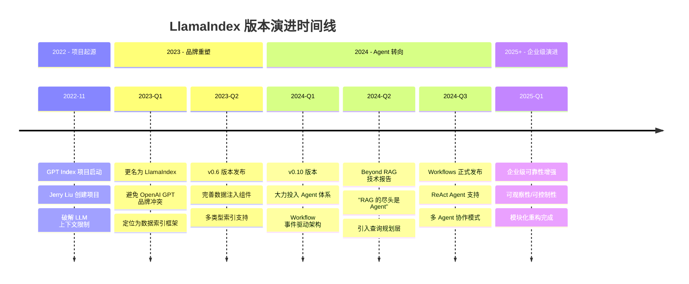

**关键演进节点解析**：

#### 1.2.1 项目起源（2022 年 11 月）

Jerry Liu 在 2022 年底发起 GPT Index 项目，初衷是突破 LLM 的上下文窗口限制。早期尝试采用**树状索引**（Tree Index），通过构建层级结构来压缩大量文档信息。然而，深层结构在实际应用中容易出错，模型在多层推理过程中会出现信息丢失。

#### 1.2.2 品牌重塑（2023 年）

2023 年初，项目更名为 LlamaIndex，原因有两点：
1. **品牌独立**：避免与 OpenAI 的 GPT 品牌产生混淆
2. **定位明确**：从单一索引工具演进为完整的"数据-LLM"连接框架

v0.6 版本标志着框架的初步成熟，引入了：
- 统一的数据加载器接口
- 多种索引类型（向量索引、列表索引、关键词索引）
- 查询路由机制

#### 1.2.3 Agent 转向（2024 年）

v0.10 版本是 LlamaIndex 的重大转型节点。Jerry Liu 在 2024 年技术报告"Beyond RAG: Building Advanced Context-Augmented LLM Applications"中明确提出："**RAG 的尽头是 Agent**"。

这一转向基于对 RAG 局限性的深刻认知：
- RAG 在单次尝试中缺乏查询理解、规划能力
- 无法进行工具调用、反思和错误纠正
- 完全无状态，无法处理多轮复杂任务

#### 1.2.4 企业级演进（2025+）

当前版本的 LlamaIndex 已具备企业级能力：
- **可观察性**：完整的追踪与调试工具链
- **可控制性**：Human-in-the-loop 介入机制
- **可定制性**：模块化架构，支持自定义组件
- **多 Agent 协作**：同步/异步交互模式

> **来源**：[LlamaIndex 的过去、现在和未来](https://blog.csdn.net/lovechris00/article/details/138288991)（翻译自 Exploding Gradients Podcast，2023 年 5 月）

---

### 1.3 核心价值：破解 LLM 的三大短板

LLM 虽然具备强大的语言理解与生成能力，但在实际应用中存在三大根本性短板，LlamaIndex 的核心价值正是针对这些短板提供系统性解决方案。

#### 1.3.1 知识截止问题

**问题描述**：每个 LLM 都有一个训练数据的截止时间点。GPT-4 的知识截止在 2023 年底，Claude 的截止在 2025 年初。这意味着截止日期之后发生的事件、法规、技术进展，模型一无所知。

**失败场景示例**：
- 法律咨询系统询问"2025 年新出台的个人信息保护法修订条款是什么？"
- 模型要么说"不知道"，要么用旧版本条款回答，导致过期信息误导用户

**LlamaIndex 解决方案**：
通过 RAG 在推理时从外部知识库检索最新信息，将实时数据注入 LLM 的上下文窗口，突破知识截止的限制。

#### 1.3.2 私有数据盲区

**问题描述**：LLM 的训练数据来自公开互联网，无法访问企业的内部文档、私有数据库、业务系统。这意味着 LLM 对企业的专有知识、业务流程、客户数据完全盲视。

**失败场景示例**：
- 企业客服系统询问"客户 A 的订单状态和售后历史是什么？"
- 模型无法访问 CRM 系统，只能回答"我没有这个信息"

**LlamaIndex 解决方案**：
提供全套数据连接层（Data Connectors），支持从 PDF、数据库、API、云存储等多种私有数据源导入信息，并通过索引构建让 LLM 能够高效检索这些私有数据。

#### 1.3.3 上下文窗口瓶颈

**问题描述**：LLM 的上下文窗口虽然不断扩大（GPT-4 Turbo 达到 128K tokens），但面对企业级海量文档（数百万页技术文档、数十年财务报告），仍然无法一次性容纳。

**失败场景示例**：
- 需要分析"整个公司过去十年的年度财务报告，找出收入增长趋势"
- 即使最先进的 LLM 也无法一次性处理这么多数据

**LlamaIndex 解决方案**：
通过**索引与检索机制**解决：
- 将海量文档切分为语义单元（Nodes）
- 构建向量索引，实现高效语义匹配
- 只检索与查询相关的文档片段注入 LLM 上下文
- 避免"大海捞针"式的全量扫描

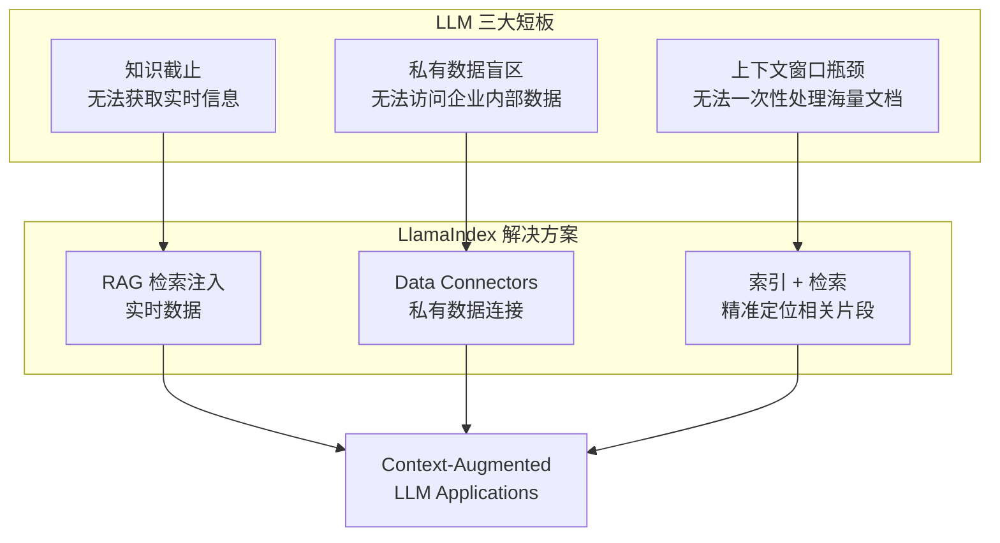

> **来源**：[阿里一面：直接让 LLM 回答不行吗，为什么要用 RAG？](https://zhuanlan.zhihu.com/p/2030689808020934788)

---

### 1.4 与 RAG 的关系：RAG 是核心范式

RAG（Retrieval-Augmented Generation，检索增强生成）是 LlamaIndex 的核心实现范式。官方文档明确标注："RAG is the most popular example of context-augmentation"。

#### 1.4.1 RAG 核心原理

RAG 的本质是在 LLM 推理时动态检索外部知识，将检索结果作为上下文注入，从而增强 LLM 的回答能力。其核心逻辑是：

```
用户查询 → 检索外部知识 → 构建增强上下文 → LLM 生成回答
```

**与传统方式的对比**：

| 方式 | 知识来源 | 实时性 | 私有数据支持 | 成本 |
|------|---------|--------|------------|------|
| 直接 LLM 回答 | 训练数据 | 截止于训练时间 | 不支持 | API 成本 |
| 微调（Fine-tuning） | 训练+微调数据 | 仍需重新训练 | 需重新微调 | 高昂训练成本 |
| RAG | 外部知识库 | 实时检索 | 完全支持 | 检索+API 成本 |

#### 1.4.2 LlamaIndex 的 RAG 流水线

LlamaIndex 提供了完整的 RAG 流水线组件：

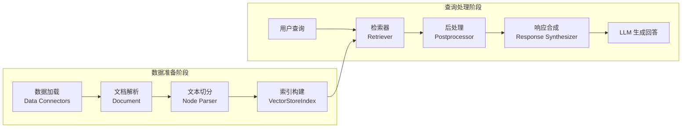

**核心组件说明**：

| 组件 | 职责 | 说明 |
|------|------|------|
| **Data Connectors** | 数据导入 | 从各类数据源加载原始数据（PDF、数据库、API 等） |
| **Document** | 数据单元 | 代表一个完整的文档，包含文本内容和元数据 |
| **Node** | 检索单元 | Document 切分后的文本片段，是检索的基本单位 |
| **Index** | 索引结构 | 为快速检索而构建的数据结构（向量索引、关键词索引等） |
| **Retriever** | 检索执行 | 根据查询从索引中检索相关 Node |
| **Query Engine** | 查询处理 | 结合检索器和 LLM，生成最终答案 |
| **Chat Engine** | 对话处理 | 支持多轮对话，维护对话历史上下文 |

#### 1.4.3 "垃圾进，垃圾出"原则

Jerry Liu 在 2024 年技术报告"Building Advanced RAG Over Complex Documents"中强调：

> **"RAG is only as Good as your Data"（RAG 的效果取决于数据质量）**

这体现了 LlamaIndex 对数据质量的重视：

1. **数据解析**：不良的解析器会导致格式混乱，即使最优秀的 LLM 也会被困扰
2. **数据分块**：尽量保留语义相似的内容，页面级别分块是强基线
3. **数据索引**：不仅要嵌入原始文本，还要嵌入引用，多个嵌入指向同一文本块

> **来源**：[LlamaIndex-2024 数据 AI 峰会报告](https://blog.csdn.net/lqfarmer/article/details/139896084)

---

### 1.5 Agent 转向："RAG 的尽头是 Agent"

Jerry Liu 在 2024 年技术报告中明确提出："**RAG 的尽头是 Agent**"。这一论断标志着 LlamaIndex 从单一 RAG 框架向完整 Agent 平台的演进。

#### 1.5.1 RAG 的局限性分析

传统 RAG 在以下场景存在根本性局限：

| 局限类型 | 具体表现 | 失败场景 |
|---------|---------|---------|
| **缺乏规划** | 无法理解复杂查询的意图层次 | "分析年度报告，找出异常波动原因，生成简报" |
| **无法纠错** | 单次尝试，无反思机制 | 检索错误时无法自我纠正 |
| **无状态** | 不维护对话历史 | 多轮任务无法累积信息 |
| **工具盲区** | 无法调用外部工具 | 需要执行计算、查询数据库时失败 |

**RAG 失败模式**：
- 在复杂数据上提出简单问题：数据结构复杂导致检索失败
- 跨多个文档提问：无法整合多源信息
- 提出复杂问题：缺乏推理链无法分解任务

#### 1.5.2 Agent 的能力跃迁

Agent 相比 RAG 的核心跃迁在于引入"思考-行动-观察"循环：

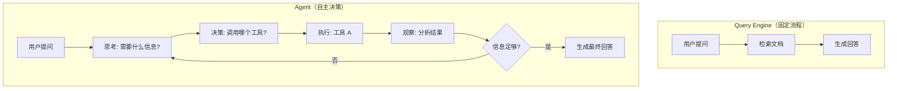

**Agent 的五大核心能力**：

| 能力 | 描述 | 实现方式 |
|------|------|---------|
| **多轮对话** | 与用户深入互动，累积信息 | Chat Engine + Memory |
| **查询规划** | 理解并规划复杂查询/任务 | Query Planning Layer |
| **工具调用** | 与外部环境交互执行操作 | Tools + Function Calling |
| **反思纠错** | 自我评估并改进执行 | ReAct + Self-reflection |
| **记忆维护** | 维护交互历史提供个性化服务 | Memory + Context |

#### 1.5.3 LlamaIndex Agent 架构

从 v0.10 版本开始，LlamaIndex 大力投入 Agent 体系：

**核心组件**：
- **ReAct Agent**：Reasoning + Acting 模式，迭代式推理到行动的工作流程
- **AgentWorkflow**：事件驱动架构，支持并发执行和复杂编排
- **Tools**：定义 Agent 与外界交互的手段（搜索、计算、API 调用）
- **Memory**：维护多轮对话的上下文

**Agent 类型分层**：

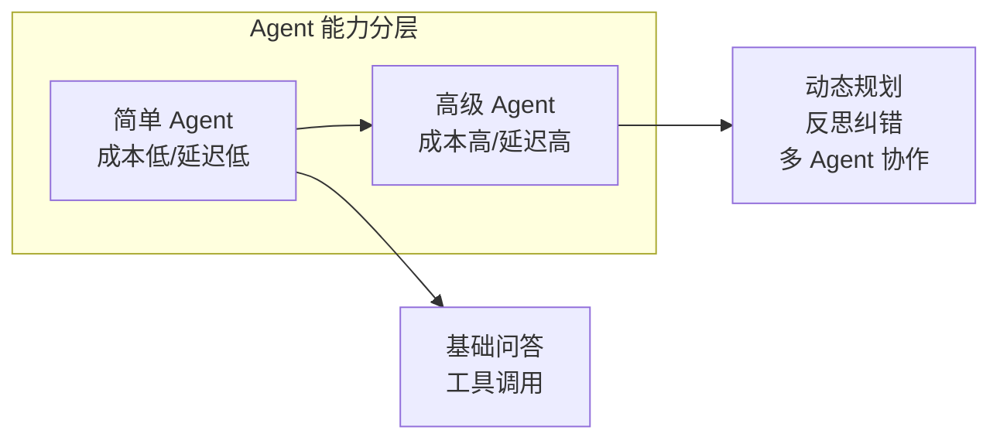

- **简单 Agent**：成本和延迟较低，适用于标准问答场景
- **高级 Agent**：具备动态规划能力，适用于复杂任务编排

**推理循环模式**：
1. **顺序推理**：线性执行任务链
2. **DAG 规划**：基于有向无环图的确定性规划
3. **树形规划**：基于 MCTS 的随机规划，平衡探索与利用

> **来源**：[LlamaIndex 团队技术报告："RAG 的尽头是 Agent"](https://blog.csdn.net/m0_59235245/article/details/139663598)

---

### 1.6 在 Agent Framework 生态中的定位

在 2024-2025 年的 Agent Framework 生态中，LlamaIndex 与 LangChain、CrewAI、AutoGen 等框架各有定位，形成差异化竞争格局。

#### 1.6.1 核心定位差异

用一个比喻来理解各框架的核心定位：

| 毭喻 | 框架 | 核心定位 |
|------|------|---------|
| **厨房管理系统** | LangChain | 通用 LLM 应用编排，协调流程、工具、记忆 |
| **食材供应链** | LlamaIndex | 数据索引与检索，清洗、分类、存储、精准定位 |
| **特种部队** | CrewAI | 角色驱动协作，纪律严明、职责分明 |
| **研讨会** | AutoGen | 对话驱动协作，自由开放、自主协商 |

**一句话定位**：
- **LangChain**：通用 LLM 应用编排框架，关键词是"编排"和"链"
- **LlamaIndex**：数据索引与检索框架，关键词是"索引"和"检索"
- **CrewAI**：角色驱动多智能体协作，关键词是"角色"和"任务"
- **AutoGen**：对话驱动多智能体系统，关键词是"对话"和"协商"

#### 1.6.2 能力维度对比

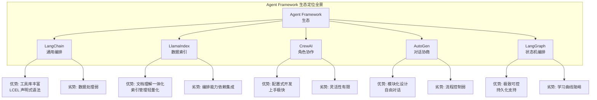

**详细对比矩阵**：

| 维度 | LlamaIndex | LangChain | CrewAI | AutoGen |
|------|-----------|-----------|--------|---------|
| **核心定位** | 数据索引+检索 | 通用编排+链 | 角色协作 | 对话协商 |
| **数据处理** | ★★★★★ | ★★☆☆☆ | ★☆☆☆☆ | ★☆☆☆☆ |
| **编排能力** | ★★★☆☆ | ★★★★★ | ★★★★☆ | ★★★☆☆ |
| **Agent 支持** | ★★★★☆ | ★★★★☆ | ★★★★★ | ★★★★★ |
| **上手难度** | 中等 | 中等 | 极易 | 较难 |
| **生态整合** | 独立+可集成 | 生态完整 | 独立生态 | 微软生态 |
| **适用场景** | 文档问答<br/>知识助手 | 通用 LLM 应用<br/>工作流编排 | 内容创作<br/>标准化流程 | 协作决策<br/>对话系统 |

#### 1.6.3 LlamaIndex 的差异化价值

在 Agent Framework 生态中，LlamaIndex 的独特价值体现在：

**1. 数据层的专业优势**
- 文档理解与检索一体化
- 支持 130+ 文件格式解析
- 多种索引类型（向量、树、列表、关键词）
- 精准的语义匹配检索

**2. RAG 的最佳实践载体**
- 官方文档明确标注 RAG 为核心范式
- 完整的 RAG 流水线组件
- 数据质量优先的设计理念

**3. 与 LangChain 的协同模式**
```
LlamaIndex 负责"数据层": 文档 → 分块 → 向量化 → 索引 → 检索
LangChain 负责"推理层": 上下文+问题 → Prompt模板 → LLM生成 → 解析
```
两者通过"检索结果（上下文文本)"完成数据流转，形成 RAG 闭环。

**4. Agent 扩展路径清晰**
- 从 RAG 到 Agent 的演进有明确理论支撑
- Workflows 事件驱动架构支持复杂编排
- ReAct Agent 模式成熟可用

> **来源**：[大模型框架选型指南：LangChain vs LlamaIndex](https://blog.csdn.net/2601_95389056/article/details/160117476)、[Multi-Agent 框架终极对比](https://cloud.tencent.com/developer/article/2639437)

---

## 本章小结

LlamaIndex 从 2022 年的 GPT Index 项目起步，经历了品牌重塑、功能完善、Agent 转向三大演进阶段，最终成长为 context-augmented LLM applications 的专业框架。其核心价值在于破解 LLM 的三大短板（知识截止、私有数据盲区、上下文窗口瓶颈），以 RAG 为核心范式提供完整的数据-LLM 连接解决方案。

2024 年的 Agent 转向标志着 LlamaIndex 从单一 RAG 框架向完整 Agent 平台的演进，"RAG 的尽头是 Agent"这一论断体现了对复杂任务处理需求的深刻认知。在 Agent Framework 生态中，LlamaIndex 凭借数据层的专业优势，与 LangChain 的编排能力形成互补，与 CrewAI、AutoGen 等多智能体框架形成差异化定位。

---

## 参考文献

1. [LlamaIndex Official Documentation](https://developers.llamaindex.ai/python/framework/) - 官方框架文档
2. [LlamaIndex 的过去、现在和未来](https://blog.csdn.net/lovechris00/article/details/138288991) - Jerry Liu访谈翻译（Exploding Gradients Podcast，2023年5月）
3. [LlamaIndex-2024 数据 AI 峰会报告：RAG之"垃圾进，垃圾出"](https://blog.csdn.net/lqfarmer/article/details/139896084) - Jerry Liu技术报告
4. [LlamaIndex 团队技术报告："RAG 的尽头是 Agent"](https://blog.csdn.net/m0_59235245/article/details/139663598) - Beyond RAG报告摘要
5. [阿里一面：直接让 LLM 回答不行吗，为什么要用 RAG？](https://zhuanlan.zhihu.com/p/2030689808020934788) - LLM局限性分析
6. [大模型框架选型指南：LangChain vs LlamaIndex](https://blog.csdn.net/2601_95389056/article/details/160117476) - 框架对比分析
7. [Multi-Agent 框架终极对比：LangGraph、CrewAI、AutoGen](https://cloud.tencent.com/developer/article/2639437) - Agent生态对比
8. [06-LlamaIndex Agent与Workflow：智能体构建与多步骤任务编排](https://blog.csdn.net/wayle123/article/details/159517656) - Agent架构详解> 本章深入解析 LlamaIndex 的整体架构、核心组件与设计哲学，帮助开发者理解框架的内在运作机制。

---

### 架构分层图

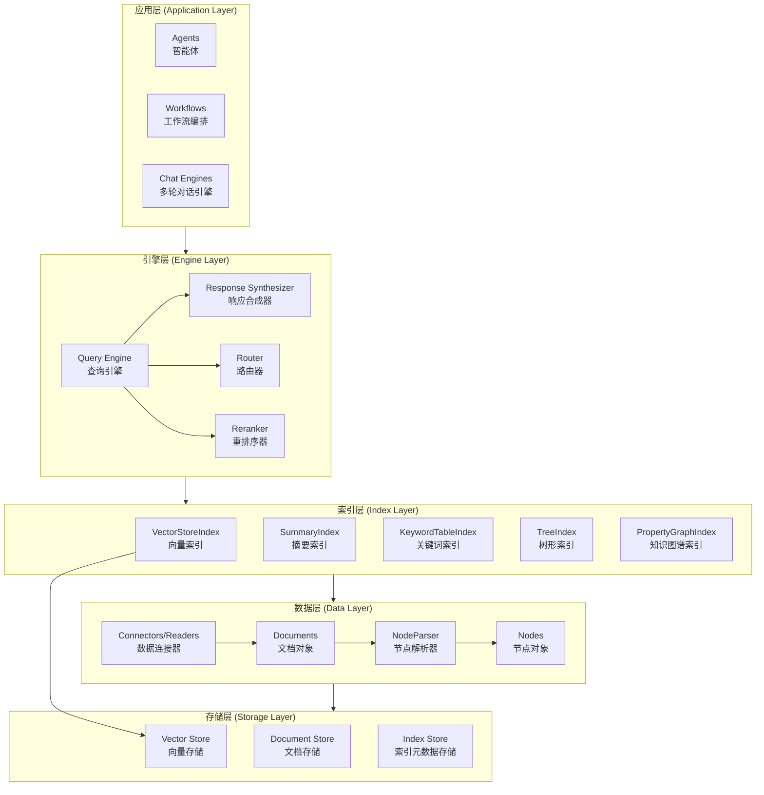

---

## 2.1 整体架构

LlamaIndex 采用分层架构设计，将 LLM 应用构建过程分解为清晰的职责层次，每个层次专注于特定功能域，通过标准化接口实现层间协作。

### 三层架构概览

#### 数据层（Data Layer）

数据层是整个框架的基础，负责将外部数据转化为框架可处理的结构化表示。

**核心职责：**
- **数据摄入**：从多种数据源（API、PDF、SQL、网页等）加载原始内容
- **结构化转换**：将原始数据转换为 `Document` 对象
- **分块处理**：通过 `NodeParser` 将大文档切分为语义单元 `Node`
- **元数据管理**：保留来源信息、文件名、创建时间等上下文属性

**设计理念：**
数据层的设计遵循"通用容器"原则 —— 无论原始数据来自何处，最终都统一转换为标准的 `Document` 和 `Node` 结构，为上层组件提供一致的数据接口。

#### 索引层（Index Layer）

索引层负责将数据层输出的节点组织为可高效检索的数据结构。

**核心职责：**
- **向量化**：调用嵌入模型将文本转换为向量表示
- **索引构建**：根据不同检索策略创建相应索引结构
- **存储管理**：将索引数据持久化至向量数据库或本地存储
- **元数据索引**：维护关键词映射、层级关系等辅助检索结构

**设计理念：**
索引层提供"策略多样化" —— 同一批数据可以构建多种索引类型，每种索引对应不同的检索场景：
- `VectorStoreIndex`：语义相似度检索
- `SummaryIndex`：全文通读与摘要
- `KeywordTableIndex`：关键词精确匹配
- `TreeIndex`：层级化结构检索
- `PropertyGraphIndex`：知识图谱推理

#### 引擎层（Engine Layer）

引擎层是用户交互的核心入口，负责将用户查询转化为完整响应。

**核心职责：**
- **检索调度**：根据查询内容从索引层召回相关节点
- **响应合成**：将检索结果交由 LLM 生成自然语言回答
- **路由决策**：在多索引场景下选择最优检索路径
- **后处理**：对检索结果进行重排序、过滤、去重等优化

**设计理念：**
引擎层体现"端到端封装" —— 用户只需调用 `query()` 方法，框架自动完成检索 → 合成 → 响应的全流程。同时提供低级 API 支持开发者手动组装各组件实现精细化控制。

---

## 2.2 数据连接器

### 核心概念

数据连接器（Data Connectors，又称 Readers）是 LlamaIndex 与外部数据世界的桥梁。它们负责将各种格式、来源的数据统一转换为框架标准的 `Document` 表示。

> **定义**：Data connectors ingest data from different data sources and data formats into a simple Document representation (text and simple metadata). —— [官方文档](https://developers.llamaindex.ai/python/framework/module_guides/loading/connector/)

### 工作原理

数据连接器的工作流程遵循"加载 → 转换 → 输出"三阶段：

1. **加载阶段**：连接器访问目标数据源，读取原始内容
2. **转换阶段**：将原始内容（无论格式如何）提取为纯文本
3. **输出阶段**：构造 `Document` 对象，包含文本内容和基础元数据

### 连接器类型

LlamaIndex 通过 **LlamaHub** 生态系统提供数百种连接器，覆盖主要数据类型：

| 类别 | 连接器示例 | 数据源 |
|------|-----------|--------|
| 本地存储 | `SimpleDirectoryReader` | PDF、TXT、MD、DOCX 等 |
| 云文档 | `GoogleDocsReader`、`NotionPageReader` | Google Docs、Notion 页面 |
| 数据库 | `DatabaseReader`、`SQLDatabaseReader` | SQL 数据库 |
| 网页 | `SimpleWebPageReader`、`BeautifulSoupWebReader` | HTML 页面 |
| API | `DiscordReader`、`SlackReader` | Discord、Slack 消息 |
| 结构化数据 | `PandasCSVReader`、`JSONReader` | CSV、JSON 文件 |

### LlamaHub 生态

> LlamaHub is an open-source repository containing data loaders that you can easily plug and play into any LlamaIndex application. —— [官方文档](https://developers.llamaindex.ai/python/framework/module_guides/loading/connector/)

LlamaHub 采用社区驱动模式，开发者可以贡献新的连接器实现。每个连接器作为独立 Python 包发布，通过 `download_loader` 函数动态加载：

```python
from llama_index.core import download_loader

# 动态加载 Google Docs 连接器
GoogleDocsReader = download_loader("GoogleDocsReader")
loader = GoogleDocsReader()
documents = loader.load_data(document_ids=["doc_id_1", "doc_id_2"])
```

### 常用连接器详解

#### SimpleDirectoryReader

最常用的本地文件加载器，支持自动识别目录中多种文件格式：

```python
from llama_index.core import SimpleDirectoryReader

# 加载目录下所有文件
documents = SimpleDirectoryReader("./data").load_data()

# 指定特定文件
documents = SimpleDirectoryReader(
    input_files=["report.pdf", "notes.md"]
).load_data()
```

**工作原理：**
- 遍历目录，根据文件扩展名选择对应解析器
- PDF 使用 `pypdf` 或 `PyMuPDF` 解析
- 图片文件提取文本或直接作为图像节点
- 自动设置 `file_name`、`creation_date` 等元数据

#### SimpleWebPageReader

网页内容抓取器：

```python
from llama_index.core import SimpleWebPageReader

reader = SimpleWebPageReader()
documents = reader.load_data(urls=["https://example.com/article"])
```

**工作原理：**
- 发送 HTTP 请求获取 HTML
- 提取 `<body>` 内容，去除 HTML 标签
- 保留网页标题、URL 作为元数据

---

## 2.3 索引系统

索引系统是 LlamaIndex 的核心模块，负责将分散的文本节点组织为可高效检索的结构化数据。

### 核心概念

索引的本质是"检索加速结构" —— 通过预先计算和组织数据，使查询时能快速定位相关内容，避免全量扫描。

> 索引将 Nodes 组织为特定数据结构，并可能附加向量表示、关键词映射等辅助信息，以支持多样化检索策略。

### 索引类型详解

#### VectorStoreIndex

**原理：**
VectorStoreIndex 将每个 Node 与其嵌入向量绑定，存入向量数据库。查询时计算查询向量与节点向量的相似度，召回 top-k 最相关节点。

> stores each Node and a corresponding embedding in a Vector Store. —— [官方文档](https://developers.llamaindex.ai/python/framework/module_guides/indexing/index_guide/)

**底层实现：**
```python
# 高层 API
index = VectorStoreIndex.from_documents(documents)

# 低级 API（手动控制）
from llama_index.core import VectorStoreIndex, StorageContext
from llama_index.vector_stores.chroma import ChromaVectorStore

# 配置向量存储
vector_store = ChromaVectorStore(chroma_collection=collection)
storage_context = StorageContext.from_defaults(vector_store=vector_store)

# 构建索引
index = VectorStoreIndex(
    nodes=nodes,
    storage_context=storage_context
)
```

**检索流程：**
1. 调用嵌入模型将查询文本转换为向量
2. 在向量存储中执行相似度搜索（如 cosine similarity）
3. 返回 top-k 个最相似节点的 ID 和分数
4. 从文档存储中加载对应节点内容

**适用场景：**
- 语义相似度检索（查询与文档语义相关而非字面匹配）
- 多语言场景（向量编码跨语言语义）
- 大规模文档库（向量索引支持高效近似搜索）

#### SummaryIndex（原 ListIndex）

**原理：**
SummaryIndex 按顺序线性存储所有节点，不构建任何辅助索引结构。查询时可将全部节点传入响应合成器，或启用可选的嵌入检索模式。

> stores Nodes as a sequential chain. —— [官方文档](https://developers.llamaindex.ai/python/framework/module_guides/indexing/index_guide/)

**底层实现：**
```python
from llama_index.core import SummaryIndex

index = SummaryIndex.from_documents(documents)

# 默认模式：全部节点参与合成
query_engine = index.as_query_engine(response_mode="tree_summarize")

# 嵌入检索模式：仅召回 top-k
query_engine = index.as_query_engine(
    retriever_mode="embedding",
    similarity_top_k=5
)
```

**检索流程：**
- **默认模式**：遍历所有节点，逐个或批量传入 LLM
- **嵌入模式**：临时计算节点嵌入，执行向量检索

**适用场景：**
- 需要全文通读的场景（生成整体摘要）
- 文档量较小，无需复杂索引优化
- 要求信息完整性的场景（不遗漏任何内容）

#### KeywordTableIndex

**原理：**
KeywordTableIndex 从每个节点提取关键词，建立关键词到节点的倒排映射表。查询时解析用户输入的关键词，从映射表中定位对应节点。

> extracts keywords from each Node and builds a mapping from each keyword to the corresponding Nodes. —— [官方文档](https://developers.llamaindex.ai/python/framework/module_guides/indexing/index_guide/)

**底层实现：**
```python
from llama_index.core import KeywordTableIndex

index = KeywordTableIndex.from_documents(documents)

# 使用 LLM 提取关键词（高质量）
query_engine = index.as_query_engine(retriever_mode="llm")

# 使用简单关键词匹配（快速）
query_engine = index.as_query_engine(retriever_mode="simple")
```

**关键词提取方式：**
- **LLM 模式**：调用 LLM 从文本中智能提取关键词（准确但慢）
- **简单模式**：基于词频或 TF-IDF 提取（快速但可能遗漏）

**检索流程：**
1. 从查询文本中解析关键词
2. 查找关键词映射表，获取相关节点列表
3. 合并多个关键词对应的节点（去重）
4. 传入响应合成器生成答案

**适用场景：**
- 专业领域文档（依赖精确术语匹配）
- 结构化词汇表场景（如技术文档、法规）
- 用户查询偏向关键词而非自然语言描述

#### TreeIndex

**原理：**
TreeIndex 将节点组织为层级树状结构。底层节点为原始文本块，上层节点为摘要节点，层层递进形成从细节到概览的层级体系。

> builds a hierarchical tree from a set of Nodes. —— [官方文档](https://developers.llamaindex.ai/python/framework/module_guides/indexing/index_guide/)

**底层实现：**
```python
from llama_index.core import TreeIndex

index = TreeIndex.from_documents(documents)

# 默认每层选 1 个子节点推进
query_engine = index.as_query_engine()

# 扩大分支覆盖面（获取更多上下文）
query_engine = index.as_query_engine(child_branch_factor=2)
```

**树构建流程：**
1. 将原始节点作为叶子层
2. 对叶子节点分组，调用 LLM 生成每组摘要作为父节点
3. 递归向上构建，直到根节点

**检索流程：**
1. 从根节点开始
2. LLM 评估当前层哪个子节点与查询最相关
3. 进入选定的子节点，重复步骤 2
4. 到达叶子节点后返回对应文本内容

**适用场景：**
- 具有天然层级关系的数据（如书籍章节、组织架构）
- 需要逐层收敛的检索流程
- 大规模文档库的层次化导航

#### PropertyGraphIndex

**原理：**
PropertyGraphIndex 抽取文档中的实体与关系，构建带标签的知识图谱。支持多种检索策略组合，并可连接外部图数据库。

> building a knowledge graph containing labelled nodes and relations. —— [官方文档](https://developers.llamaindex.ai/python/framework/module_guides/indexing/index_guide/)

**底层实现：**
```python
from llama_index.core import PropertyGraphIndex

index = PropertyGraphIndex.from_documents(
    documents,
    llm=llm,
    embed_model=embed_model,
    show_progress=True
)

# 连接 Neo4j 图数据库
from llama_index.graph_stores.neo4j import Neo4jPropertyGraphStore

graph_store = Neo4jPropertyGraphStore(
    username="neo4j",
    password="password",
    url="neo4j://localhost:7687"
)
```

**图谱构建流程：**
1. 调用 LLM 从文本中抽取实体和关系
2. 创建实体节点（带类型标签）
3. 创建关系边（带关系类型）
4. 可选：对节点进行向量化以支持语义检索

**检索策略：**
- 关键词/同义词扩展
- 向量检索
- 图遍历（多跳推理）
- 原始源文本回溯

**适用场景：**
- 复杂关联数据分析
- 多跳推理查询
- 企业级知识图谱应用
- 需要严格自定义信息抽取逻辑

---

## 2.4 查询引擎

查询引擎是 LlamaIndex 的核心执行单元，负责将用户查询转化为完整响应。

### 核心概念

> Query Engine 是一个端到端流程，允许你对数据提出问题。它接收自然语言查询，返回响应以及检索到的相关上下文。 —— [官方文档](https://developers.llamaindex.ai/python/framework/module_guides/deploying/query_engine/usage_pattern/)

查询引擎封装了"检索 → 合成 → 响应"的完整流程：

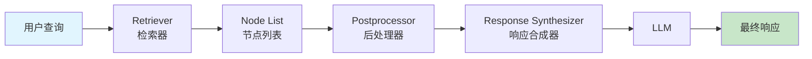

### 数据流转图

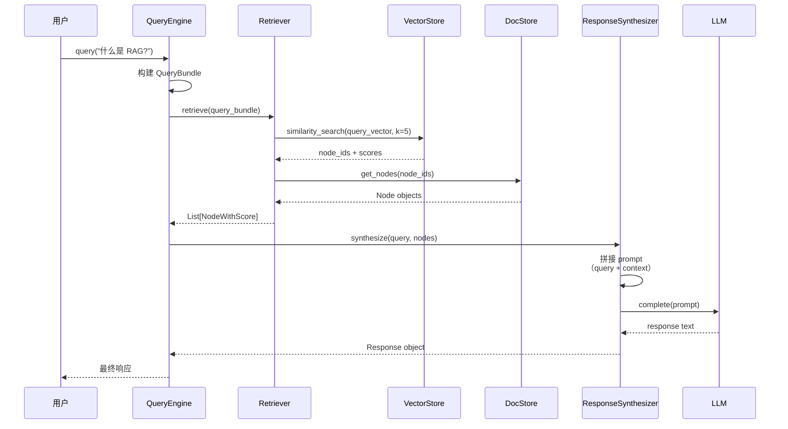

### 核心组件

#### Retriever（检索器）

检索器负责从索引中召回相关节点。

> Retriever 负责从用户查询中获取最相关的上下文。它构建在索引之上，也可独立定义。 —— [官方文档](https://developers.llamaindex.ai/python/framework/module_guides/querying/retriever/)

**基础用法：**
```python
# 从索引获取检索器
retriever = index.as_retriever(similarity_top_k=5)

# 执行检索
nodes = retriever.retrieve("What is RAG?")
```

**检索器类型：**
- **Index Retrievers**：与特定索引绑定的检索器
- **Auto-Retrieval**：结合语义检索与结构化过滤
- **Ensemble Retriever**：多检索器结果融合
- **Router Retriever**：动态选择检索器
- **Knowledge Graph Retriever**：知识图谱推理检索

**高级配置：**
```python
# 低级 API：直接实例化检索器
from llama_index.core.retrievers import VectorIndexRetriever

retriever = VectorIndexRetriever(
    index=index,
    similarity_top_k=10,
    vector_store_query_mode="hybrid"  # 混合检索
)
```

#### Response Synthesizer（响应合成器）

响应合成器将检索到的节点与查询组合，调用 LLM 生成最终响应。

> Response Synthesizer 使用用户查询和给定文本块，从 LLM 生成响应。 —— [官方文档](https://developers.llamaindex.ai/python/framework/module_guides/querying/response_synthesizers/)

**响应模式（Response Modes）：**

| 模式 | 工作原理 | 适用场景 |
|------|---------|---------|
| `compact` | 拼接节点文本以适应上下文窗口，一次调用 LLM | 默认模式，平衡效率与质量 |
| `refine` | 逐节点迭代优化答案，每个节点更新前一轮结果 | 需要精细答案的场景 |
| `tree_summarize` | 递归摘要节点组，最终合并为单一答案 | 大量节点的摘要任务 |
| `simple_summarize` | 截断所有文本为单个 prompt | 快速响应，牺牲细节 |
| `accumulate` | 对每个节点独立查询，合并所有输出 | 多角度分析 |
| `no_text` | 仅返回节点不调用 LLM | 仅需检索结果 |

**配置示例：**
```python
from llama_index.core.response_synthesizers import Refine

synthesizer = Refine(
    refine_template=refine_prompt,
    verbose=True
)

query_engine = RetrieverQueryEngine(
    retriever=retriever,
    response_synthesizer=synthesizer
)
```

#### Router（路由器）

路由器在多索引场景下决定查询应走哪条检索路径。

**路由类型：**
- **LLM Router**：调用 LLM 栤断最优索引
- **Embedding Router**：基于查询向量相似度选择

**使用示例：**
```python
from llama_index.core.query_engine import RouterQueryEngine

# 定义子引擎
vector_engine = vector_index.as_query_engine()
summary_engine = summary_index.as_query_engine()

# 创建路由引擎
router_engine = RouterQueryEngine(
    query_engines=[vector_engine, summary_engine],
    selector=LLMSingleSelector.from_defaults()
)
```

#### Reranker（重排序器）

重排序器对检索结果进行二次排序，提升相关性。

**常见重排序器：**
- **Cohere Rerank**：调用 Cohere API 进行语义重排序
- **SentenceTransformer Rerank**：本地模型重排序
- **LLM Rerank**：LLM 评估节点相关性

**使用示例：**
```python
from llama_index.core.postprocessor import SentenceTransformerRerank

reranker = SentenceTransformerRerank(
    model="cross-encoder/stsb-roberta-base",
    top_n=5
)

query_engine = index.as_query_engine()
query_engine.add_node_postprocessor(reranker)
```

### 高层 API vs 低级 API

**高层 API（快速开始）：**
```python
# 一行代码构建查询引擎
query_engine = index.as_query_engine(
    response_mode="compact",
    similarity_top_k=5
)

response = query_engine.query("What is RAG?")
```

**低级 API（精细控制）：**
```python
from llama_index.core.query_engine import RetrieverQueryEngine
from llama_index.core.retrievers import VectorIndexRetriever
from llama_index.core.response_synthesizers import CompactAndRefine

# 手动组装各组件
retriever = VectorIndexRetriever(
    index=index,
    similarity_top_k=10,
    vector_store_query_mode="hybrid"
)

synthesizer = CompactAndRefine(
    streaming=True,
    verbose=True
)

query_engine = RetrieverQueryEngine(
    retriever=retriever,
    response_synthesizer=synthesizer
)
```

---

## 2.5 核心抽象

LlamaIndex 通过一组核心抽象类定义框架的基本数据结构和行为契约。

### 核心抽象关系图

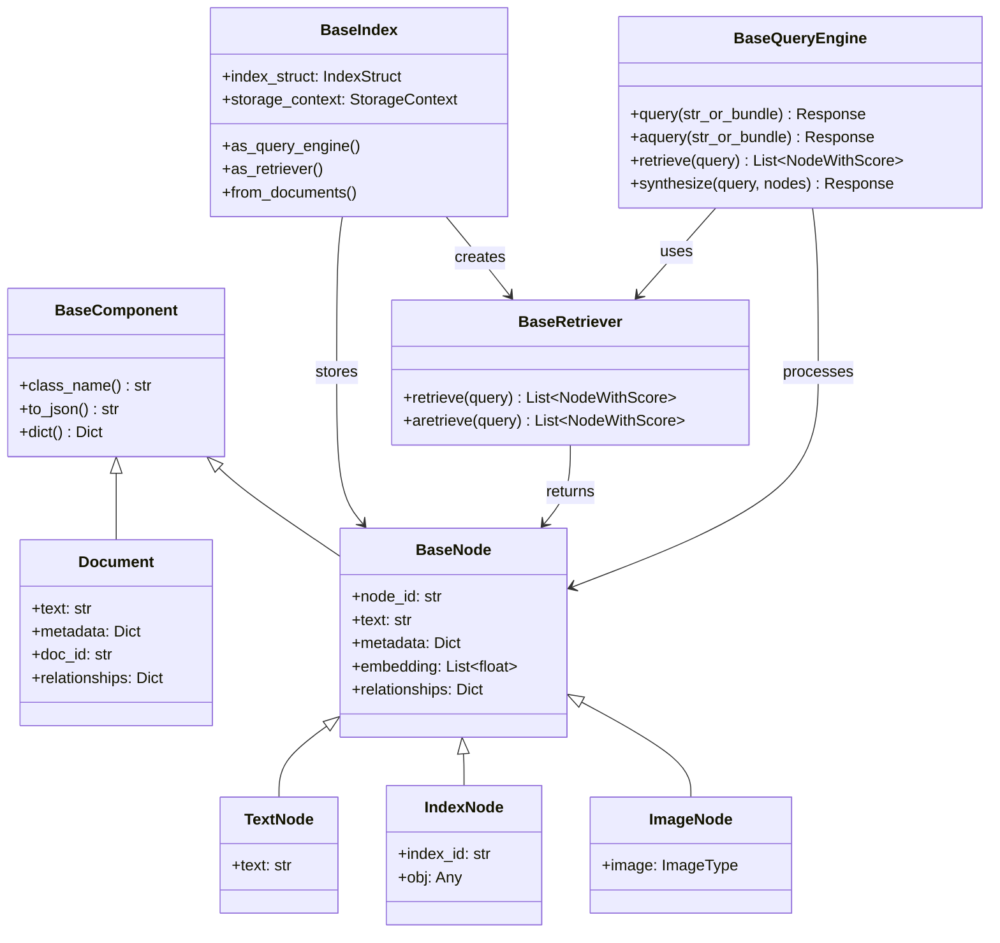

### Document

**定义：**
Document 是数据源的通用容器，封装原始文本内容和元数据。

> A generic container around any data source like a PDF, API output, or database result. —— [官方文档](https://developers.llamaindex.ai/python/framework/module_guides/loading/documents_and_nodes/)

**源码结构（schema.py）：**
```python
class Document(BaseComponent):
    """Document represents a generic container around any data source."""

    text: str = Field(default="", description="文本内容")
    metadata: Dict[str, Any] = Field(default_factory=dict, description="元数据字典")
    doc_id: str = Field(default_factory=lambda: str(uuid.uuid4()), description="唯一标识")
    relationships: Dict[str, Any] = Field(default_factory=dict, description="关联关系")
    embedding: Optional[List[float]] = Field(default=None, description="向量表示")
```

**核心属性：**
- `text`：文档的纯文本内容
- `metadata`：元数据字典（如 `file_name`、`creation_date`、`category`）
- `doc_id`：文档唯一标识符（默认 UUID）
- `relationships`：与其他文档或节点的关联关系
- `embedding`：可选的向量表示

**创建方式：**
```python
from llama_index.core import Document

# 手动创建
doc = Document(
    text="这是一段文档内容",
    metadata={
        "file_name": "report.pdf",
        "author": "张三",
        "created_at": "2025-01-01"
    }
)

# 从文件加载
documents = SimpleDirectoryReader("./data").load_data()
```

### Node

**定义：**
Node 是 Document 的分块表示，代表文档的一个语义单元。

> A chunk of a source Document. Nodes are a first-class citizen in the framework. —— [官方文档](https://developers.llamaindex.ai/python/framework/module_guides/loading/documents_and_nodes/)

**源码结构（schema.py）：**
```python
class BaseNode(BaseComponent):
    """Node represents a chunk of text from a Document."""

    node_id: str = Field(default_factory=lambda: str(uuid.uuid4()))
    text: str = Field(default="")
    metadata: Dict[str, Any] = Field(default_factory=dict)
    embedding: Optional[List[float]] = Field(default=None)
    relationships: Dict[NodeRelationship, Any] = Field(default_factory=dict)
```

**Node 类型：**
- `TextNode`：纯文本节点
- `ImageNode`：包含图像的节点
- `IndexNode`：指向其他索引对象的节点（用于多索引引用）

**元数据继承机制：**
Node 会自动继承父 Document 的元数据。例如，如果 Document 的 metadata 包含 `file_name`，所有从该 Document 生成的 Node 都会携带相同的 `file_name` 属性。

**创建方式：**
```python
from llama_index.core.node_parser import SentenceSplitter

# 使用 NodeParser 解析
parser = SentenceSplitter(chunk_size=512, chunk_overlap=50)
nodes = parser.get_nodes_from_documents(documents)

# 手动创建
from llama_index.core import TextNode
node = TextNode(
    text="这是一个文本块",
    metadata={"source": "chapter_1"}
)
```

### Index

**定义：**
Index 是节点集合的组织结构，提供检索加速机制。

**源码结构（base.py）：**
```python
class BaseIndex(Generic[IS], ABC):
    """Base LlamaIndex."""

    index_struct_cls: Type[IS]  # 索引结构类型

    def __init__(
        self,
        nodes: Optional[Sequence[BaseNode]] = None,
        index_struct: Optional[IS] = None,
        storage_context: Optional[StorageContext] = None,
        transformations: Optional[List[TransformComponent]] = None,
        **kwargs
    ):
        self._storage_context = storage_context or StorageContext.from_defaults()
        self._docstore = self._storage_context.docstore
        self._vector_store = self._storage_context.vector_store
        self._index_struct = index_struct or self.build_index_from_nodes(nodes)
```

**核心方法：**
- `from_documents()`：从 Document 列表构建索引
- `as_query_engine()`：创建查询引擎
- `as_retriever()`：创建检索器
- `build_index_from_nodes()`：底层索引构建逻辑

### Retriever

**定义：**
Retriever 负责从索引中召回相关节点。

**源码结构（base_retriever.py）：**
```python
class BaseRetriever(PromptMixin, DispatcherSpanMixin):
    """Base retriever."""

    def __init__(
        self,
        callback_manager: Optional[CallbackManager] = None,
        object_map: Optional[Dict] = None,
        verbose: bool = False
    ):
        self.callback_manager = callback_manager or CallbackManager()
        self.object_map = object_map or {}

    @abstractmethod
    def _retrieve(self, query_bundle: QueryBundle) -> List[NodeWithScore]:
        """检索逻辑的抽象方法"""
        pass

    def retrieve(self, query_bundle: QueryBundle) -> List[NodeWithScore]:
        """公共检索接口，包含事件追踪"""
        with self.callback_manager.as_trace("retrieve"):
            return self._retrieve(query_bundle)
```

**核心契约：**
- `_retrieve()`：子类实现的检索逻辑
- `retrieve()`：公共接口，包含回调管理和事件追踪

### QueryEngine

**定义：**
QueryEngine 封装端到端查询流程。

**源码结构（base_query_engine.py）：**
```python
class BaseQueryEngine(PromptMixin, DispatcherSpanMixin):
    """Base query engine."""

    def __init__(self, callback_manager: Optional[CallbackManager]):
        self.callback_manager = callback_manager or CallbackManager([])

    def query(self, str_or_query_bundle: QueryType) -> RESPONSE_TYPE:
        """同步查询接口"""
        dispatcher.event(QueryStartEvent(query=str_or_query_bundle))
        query_result = self._query(str_or_query_bundle)
        dispatcher.event(QueryEndEvent(query=str_or_query_bundle, response=query_result))
        return query_result

    async def aquery(self, str_or_query_bundle: QueryType) -> RESPONSE_TYPE:
        """异步查询接口"""
        return await self._aquery(str_or_query_bundle)
```

**核心契约：**
- `query()`：同步查询
- `aquery()`：异步查询
- `retrieve()`：部分引擎支持仅检索不合成
- `synthesize()`：部分引擎支持仅合成不检索

---

## 2.6 设计哲学

LlamaIndex 的设计哲学围绕"简洁性与可定制性的平衡"，为不同经验水平的开发者提供适配的 API 层次。

### 核心理念

> 框架强调可接近性，无论你的经验水平如何。它平衡快速入门与深度控制，提供"五行代码"示例的同时，也提供低级指南让开发者修改单个组件。 —— [官方文档](https://developers.llamaindex.ai/python/framework/getting_started/reading/)

### 双层 API 设计

#### 高层 API：快速入门

高层 API 提供"开箱即用"的默认配置，隐藏底层复杂性：

```python
# 五行代码完成 RAG
from llama_index.core import VectorStoreIndex, SimpleDirectoryReader

documents = SimpleDirectoryReader("data").load_data()
index = VectorStoreIndex.from_documents(documents)
query_engine = index.as_query_engine()
response = query_engine.query("What is the author's background?")
```

**特点：**
- 默认配置经过优化，适用于大多数场景
- 隐藏向量化、分块、存储等技术细节
- 降低学习曲线，适合快速原型验证

**局限：**
- 不暴露全部配置选项
- 定制能力受限

#### 低级 API：精细控制

低级 API 将组件解耦，允许开发者手动组装：

```python
from llama_index.core import VectorStoreIndex, StorageContext
from llama_index.core.retrievers import VectorIndexRetriever
from llama_index.core.response_synthesizers import ResponseMode
from llama_index.core.query_engine import RetrieverQueryEngine
from llama_index.core.node_parser import SentenceSplitter
from llama_index.vector_stores.chroma import ChromaVectorStore

# 自定义分块
parser = SentenceSplitter(chunk_size=256, chunk_overlap=20)
nodes = parser.get_nodes_from_documents(documents)

# 自定义向量存储
vector_store = ChromaVectorStore(chroma_collection=collection)
storage_context = StorageContext.from_defaults(vector_store=vector_store)

# 自定义检索器
retriever = VectorIndexRetriever(
    index=index,
    similarity_top_k=10,
    vector_store_query_mode="hybrid"
)

# 自定义响应合成器
synthesizer = ResponseSynthesizer(
    response_mode=ResponseMode.REFINE,
    streaming=True
)

# 手动组装查询引擎
query_engine = RetrieverQueryEngine(
    retriever=retriever,
    response_synthesizer=synthesizer
)
```

**特点：**
- 每个组件可独立配置
- 支持替换默认实现
- 适合生产环境精细调优

**代价：**
- 需要理解各组件职责
- 配置复杂度增加

### 模块化设计原则

LlamaIndex 采用"模块化解耦"设计：

1. **每个组件独立封装**：Retriever、Synthesizer、NodeParser 等均为独立类
2. **标准化接口**：所有组件通过公共基类定义行为契约
3. **可插拔替换**：默认实现可替换为自定义实现
4. **组合优于继承**：通过组装组件而非继承父类实现功能扩展

### 扩展机制

框架提供多种扩展点：

- **自定义 QueryEngine**：继承 `CustomQueryEngine` 实现特殊查询逻辑
- **自定义 Retriever**：继承 `BaseRetriever` 实现新检索策略
- **自定义 NodeParser**：继承 `NodeParser` 实现新分块算法
- **自定义 Response Synthesizer**：继承 `BaseSynthesizer` 实现新合成逻辑

```python
from llama_index.core.query_engine import CustomQueryEngine

class MyQueryEngine(CustomQueryEngine):
    """自定义查询引擎"""

    retriever: BaseRetriever
    synthesizer: BaseSynthesizer

    def custom_query(self, query_str: str) -> Response:
        # 自定义查询逻辑
        nodes = self.retriever.retrieve(query_str)
        response = self.synthesizer.synthesize(query_str, nodes)
        return response
```

---

## 总结

LlamaIndex 的架构设计体现了"分层抽象 + 模块解耦 + 双层 API"的核心思想：

| 层次 | 职责 | 核心抽象 |
|------|------|---------|
| 数据层 | 数据摄入与结构化 | Document、Node、NodeParser |
| 索引层 | 检索加速结构 | VectorStoreIndex、SummaryIndex 等 |
| 引擎层 | 查询执行 | QueryEngine、Retriever、Synthesizer |
| 存储层 | 数据持久化 | VectorStore、DocStore、IndexStore |

开发者可根据需求选择合适的抽象层次：
- **原型阶段**：使用高层 API 快速验证
- **生产阶段**：使用低级 API 精细调优
- **特殊场景**：通过扩展机制实现定制

---

## 来源标注

- [High-Level Concepts](https://developers.llamaindex.ai/python/framework/getting_started/concepts/)
- [Module Guides](https://developers.llamaindex.ai/python/framework/module_guides/)
- [Documents and Nodes](https://developers.llamaindex.ai/python/framework/module_guides/loading/documents_and_nodes/)
- [Index Guide](https://developers.llamaindex.ai/python/framework/module_guides/indexing/index_guide/)
- [Query Engine Usage Pattern](https://developers.llamaindex.ai/python/framework/module_guides/deploying/query_engine/usage_pattern/)
- [Retriever](https://developers.llamaindex.ai/python/framework/module_guides/querying/retriever/)
- [Response Synthesizers](https://developers.llamaindex.ai/python/framework/module_guides/querying/response_synthesizers/)
- [Data Connectors](https://developers.llamaindex.ai/python/framework/module_guides/loading/connector/)
- [Understanding LlamaIndex](https://developers.llamaindex.ai/python/framework/understanding/)
- [How to Read Docs](https://developers.llamaindex.ai/python/framework/getting_started/reading/)
- [GitHub Source: schema.py](https://github.com/run-llama/llama_index/blob/main/llama-index-core/llama_index/core/schema.py)
- [GitHub Source: base.py (Index)](https://github.com/run-llama/llama_index/blob/main/llama-index-core/llama_index/core/indices/base.py)
- [GitHub Source: base_query_engine.py](https://github.com/run-llama/llama_index/blob/main/llama-index-core/llama_index/core/base/base_query_engine.py)
- [GitHub Source: base_retriever.py](https://github.com/run-llama/llama_index/blob/main/llama-index-core/llama_index/core/base/base_retriever.py)## 3. 安装与快速入门

> **本章目标**：帮助开发者快速搭建 LlamaIndex 开发环境，掌握核心包结构，并通过 5 行代码启动第一个 RAG 应用和 Agent。

---

### 3.1 环境准备

#### 3.1.1 Python 版本要求

LlamaIndex 要求 **Python 3.8+**，推荐使用 Python 3.10 或 3.11 以获得最佳兼容性和性能。

**为什么需要 Python 3.8+？**
- LlamaIndex 使用了大量现代 Python 特性（如类型注解、async/await）
- 依赖库（如 tiktoken、transformers）需要较新的 Python 版本
- Python 3.10+ 提供更好的类型推断和错误提示

**环境验证方式：**
```bash
# 检查 Python 版本
python --version
# 输出应为 Python 3.8.x 或更高

# 创建独立虚拟环境（推荐）
python -m venv llama_env
source llama_env/bin/activate  # Linux/Mac
# 或
llama_env\Scripts\activate  # Windows
```

#### 3.1.2 包管理工具选择

| 工具 | 适用场景 | 安装命令 |
|------|---------|---------|
| **pip** | 快速安装、简单项目 | `pip install llama-index` |
| **poetry** | 生产项目、依赖隔离 | `poetry add llama-index-core` |
| **conda** | 数据科学环境 | `conda install -c conda-forge llama-index` |

**推荐方案**：使用 poetry 进行依赖管理，能更好地隔离环境并锁定版本。

```bash
# 使用 poetry 创建项目
poetry init
poetry shell
poetry add llama-index-core llama-index-llms-openai
```

---

### 3.2 核心包结构

#### 3.2.1 模块化设计理念

LlamaIndex 采用**命名空间包（Namespaced Packages）**架构，将功能拆分为独立模块：

**设计优势：**
1. **按需安装**：只安装需要的集成，避免依赖膨胀
2. **版本独立**：各模块可独立更新，不影响核心功能
3. **生态开放**：第三方可自行开发集成包

#### 3.2.2 核心包详解

| 包名 | 功能 | 安装命令 |
|------|------|---------|
| `llama-index-core` | 核心框架（索引、查询引擎、Agent 基类） | `pip install llama-index-core` |
| `llama-index-llms-*` | LLM 集成（OpenAI、Anthropic、Ollama 等） | 按需安装 |
| `llama-index-embeddings-*` | 嵌入模型集成 | 按需安装 |
| `llama-index-readers-*` | 数据读取器（文件、Web、数据库等） | 按需安装 |
| `llama-index-vector-stores-*` | 向量数据库集成 | 按需安装 |

**包命名规则**：
- 包名直接对应导入路径
- 例如：`llama-index-llms-openai` → `from llama_index.llms.openai import OpenAI`

#### 3.2.3 Starter Bundle（快速入门包）

`pip install llama-index` 会安装以下核心组件：

```
llama-index (starter bundle)
├── llama-index-core        # 核心框架
├── llama-index-llms-openai # OpenAI LLM 集成
├── llama-index-embeddings-openai  # OpenAI Embedding
└── llama-index-readers-file  # 文件读取器
```

**预打包资源**：`llama-index-core` 已内置 NLTK 和 tiktoken 文件，避免运行时网络下载。

**工作原理**：
- NLTK：用于文本分词和处理
- tiktoken：OpenAI 的 tokenizer，用于 token 计数

这意味着首次运行时无需等待资源下载，提升启动速度。

#### 3.2.4 自定义安装示例

**本地模型方案（Ollama + HuggingFace）**：
```bash
pip install llama-index-core \
            llama-index-readers-file \
            llama-index-llms-ollama \
            llama-index-embeddings-huggingface
```

**多 LLM 方案（OpenAI + Anthropic）**：
```bash
pip install llama-index-core \
            llama-index-llms-openai \
            llama-index-llms-anthropic \
            llama-index-embeddings-openai
```

---

### 3.3 5 行代码启动 RAG

#### 3.3.1 最简 RAG 示例

```python
from llama_index.core import VectorStoreIndex, SimpleDirectoryReader

# 1. 加载文档
documents = SimpleDirectoryReader("data").load_data()

# 2. 创建向量索引
index = VectorStoreIndex.from_documents(documents)

# 3. 创建查询引擎
query_engine = index.as_query_engine()

# 4. 执行查询
response = query_engine.query("What is the main topic?")

# 5. 输出结果
print(response)
```

#### 3.3.2 执行流程解析

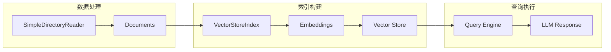

**各步骤详解：**

| 步骤 | 作用 | 内部机制 |
|------|------|---------|
| `SimpleDirectoryReader` | 加载文件 | 支持多种格式（PDF、TXT、MD、JSON），自动分块 |
| `VectorStoreIndex.from_documents` | 构建索引 | 调用 Embedding 模型将文本转为向量 |
| `as_query_engine()` | 创建查询接口 | 配置检索策略（默认 similarity top-k=2） |
| `query()` | 执行查询 | 检索相关 chunks → 构建 context → 调用 LLM 生成回答 |

#### 3.3.3 SimpleDirectoryReader 详解

**支持的数据格式：**
- 文本文件：`.txt`, `.md`, `.csv`
- 文档格式：`.pdf`, `.docx`, `.pptx`
- 结构化数据：`.json`, `.yaml`
- 代码文件：`.py`, `.js`, `.java`

**文件分块机制：**
```python
from llama_index.core import SimpleDirectoryReader

# 默认配置
reader = SimpleDirectoryReader(
    input_dir="data",
    exclude=["*.tmp", "*.bak"],  # 排除文件
    exclude_hidden=True,          # 排除隐藏文件
    recursive=True,               # 递归子目录
    required_exts=[".pdf", ".txt"]  # 仅加载特定格式
)

documents = reader.load_data()
# 每个 Document 包含：text, metadata, id
```

**Document 结构：**
```python
Document(
    text="原始文本内容...",
    metadata={
        "file_path": "/data/example.txt",
        "file_name": "example.txt",
        "file_type": "text",
        "creation_date": "2024-01-01"
    },
    id="doc_001"
)
```

#### 3.3.4 VectorStoreIndex 内部实现

**向量索引构建流程：**

1. **文本分块（Chunking）**：将文档切分为适合检索的小块
2. **嵌入生成（Embedding）**：调用 Embedding 模型将 chunk 转为向量
3. **向量存储（Storage）**：将向量存入内存或外部数据库

```python
from llama_index.core import VectorStoreIndex

# 默认配置
index = VectorStoreIndex.from_documents(
    documents,
    show_progress=True,  # 显示进度条
)

# 自定义分块参数
from llama_index.core.node_parser import SentenceSplitter

parser = SentenceSplitter(
    chunk_size=512,      # 每块最大 token 数
    chunk_overlap=64,    # 块之间重叠 token 数
)

index = VectorStoreIndex.from_documents(
    documents,
    transformations=[parser],  # 使用自定义分块器
)
```

**为什么需要 chunk_overlap？**
- 确保上下文连续性，避免语义断裂
- 提高检索命中率，相同内容可能在多个块中出现

#### 3.3.5 索引持久化

**保存索引到磁盘：**
```python
# 保存
index.storage_context.persist(persist_dir="storage")

# 加载
from llama_index.core import StorageContext, load_index_from_storage

storage_context = StorageContext.from_defaults(persist_dir="storage")
index = load_index_from_storage(storage_context)
query_engine = index.as_query_engine()
```

**为什么需要持久化？**
- 避免每次启动时重新计算 Embedding（节省 API 调用和时间）
- Embedding API 通常按 token 计费，持久化可节省成本

---

### 3.4 LLM 配置

#### 3.4.1 OpenAI 配置（默认方案）

**环境变量设置：**
```bash
# MacOS/Linux
export OPENAI_API_KEY="sk-xxx..."

# Windows
set OPENAI_API_KEY="sk-xxx..."

# 或使用 .env 文件
# .env
OPENAI_API_KEY=sk-xxx...
```

**代码中配置：**
```python
import os
os.environ["OPENAI_API_KEY"] = "sk-xxx..."

from llama_index.llms.openai import OpenAI
from llama_index.core import Settings

# 全局配置
Settings.llm = OpenAI(model="gpt-4o-mini")

# 或局部配置
llm = OpenAI(model="gpt-4o-mini", temperature=0.7)
query_engine = index.as_query_engine(llm=llm)
```

**默认模型说明：**
- LLM：`gpt-3.5-turbo`（后改为 `gpt-4o-mini`）
- Embedding：`text-embedding-ada-002`（后改为 `text-embedding-3-small`）

#### 3.4.2 Anthropic Claude 配置

**安装集成包：**
```bash
pip install llama-index-llms-anthropic
```

**使用示例：**
```python
import os
os.environ["ANTHROPIC_API_KEY"] = "sk-ant-xxx..."

from llama_index.llms.anthropic import Anthropic
from llama_index.core import Settings

# 设置 tokenizer（Anthropic 使用自己的 tokenizer）
tokenizer = Anthropic().tokenizer
Settings.tokenizer = tokenizer

# 配置 LLM
llm = Anthropic(model="claude-sonnet-4-0")

# 基础调用
response = llm.complete("Who is Paul Graham?")
print(response)

# Chat 模式
from llama_index.core.llms import ChatMessage

messages = [
    ChatMessage(role="system", content="You are a helpful assistant"),
    ChatMessage(role="user", content="Tell me about LlamaIndex"),
]
response = llm.chat(messages)
```

**支持的模型系列：**
- **Claude Opus**：最强推理能力，适合复杂任务
- **Claude Sonnet**：平衡性能与成本，日常推荐
- **Claude Haiku**：快速响应，适合简单任务

#### 3.4.3 本地模型配置（Ollama）

**Ollama 安装：**
```bash
# 安装 Ollama（参见官方 README）
# Linux/Mac
curl -fsSL https://ollama.com/install.sh | sh

# 下载模型
ollama pull llama3.1
ollama pull mistral
```

**LlamaIndex 配置：**
```bash
pip install llama-index-llms-ollama
pip install llama-index-embeddings-huggingface
```

```python
from llama_index.llms.ollama import Ollama
from llama_index.embeddings.huggingface import HuggingFaceEmbedding
from llama_index.core import Settings

# 配置本地 LLM
Settings.llm = Ollama(
    model="llama3.1",
    request_timeout=360.0,  # 超时设置
    context_window=8000,    # 上下文窗口限制
)

# 配置本地 Embedding
Settings.embed_model = HuggingFaceEmbedding(
    model_name="BAAI/bge-base-en-v1.5"
)
```

**为什么需要 request_timeout？**
- 本地模型推理速度可能较慢
- 默认超时可能不足以完成长文本生成

**为什么需要 context_window？**
- 本地模型内存占用与上下文长度正相关
- 限制 context_window 可避免内存溢出

#### 3.4.4 DeepSeek 配置

**使用 OpenAI Compatible API：**
```python
from llama_index.llms.openai_like import OpenAILike
from llama_index.core import Settings

llm = OpenAILike(
    model="deepseek-chat",
    api_base="https://api.deepseek.com/v1",
    api_key="your-deepseek-api-key",
)

Settings.llm = llm
```

**DeepSeek 特点：**
- 高性价比，价格低于 OpenAI
- 支持长上下文（DeepSeek-V3 支持 64K）
- 中文能力优秀

#### 3.4.5 Settings 全局配置详解

**Settings 是 LlamaIndex 的全局配置中心：**

```python
from llama_index.core import Settings
from llama_index.llms.openai import OpenAI
from llama_index.embeddings.openai import OpenAIEmbedding

# 配置 LLM
Settings.llm = OpenAI(model="gpt-4o-mini", temperature=0.7)

# 配置 Embedding
Settings.embed_model = OpenAIEmbedding(model="text-embedding-3-small")

# 配置分块大小
Settings.chunk_size = 512
Settings.chunk_overlap = 64

# 配置 tokenizer
import tiktoken
Settings.tokenizer = tiktoken.encoding_for_model("gpt-4o-mini").encode
```

**Settings 的作用范围：**
- 所有未显式指定参数的操作都会使用 Settings 中的配置
- 可以在局部操作中覆盖 Settings 配置

```python
# 全局使用 Settings.llm
query_engine = index.as_query_engine()

# 局部覆盖
custom_llm = OpenAI(model="gpt-4o")
query_engine = index.as_query_engine(llm=custom_llm)
```

#### 3.4.6 Tokenizer 配置的重要性

**为什么需要配置正确的 tokenizer？**
- Token 计数影响 prompt 长度限制
- 不同模型使用不同 tokenizer
- 错误的 tokenizer会导致 token 计数不准确，可能超出模型限制

```python
from llama_index.core import Settings

# OpenAI tokenizer
import tiktoken
Settings.tokenizer = tiktoken.encoding_for_model("gpt-4o-mini").encode

# HuggingFace tokenizer
from transformers import AutoTokenizer
Settings.tokenizer = AutoTokenizer.from_pretrained(
    "HuggingFaceH4/zephyr-7b-beta"
).encode
```

---

### 3.5 向量数据库集成

#### 3.5.1 Simple Vector Store（默认方案）

**特点：**
- 纯内存存储，适合快速实验
- 支持持久化到磁盘
- 无需额外依赖

```python
from llama_index.core import VectorStoreIndex

# 默认使用 Simple Vector Store
index = VectorStoreIndex.from_documents(documents)

# 持久化
index.storage_context.persist(persist_dir="storage")
```

#### 3.5.2 向量数据库对比

| Vector Store | 类型 | 元数据过滤 | 混合搜索 | 删除 | 存储文档 | 异步 |
|--------------|------|----------|---------|------|---------|------|
| **Chroma** | self-hosted | ✓ | - | ✓ | ✓ | - |
| **Pinecone** | cloud | ✓ | ✓ | ✓ | ✓ | - |
| **Qdrant** | self-hosted/cloud | ✓ | ✓ | ✓ | ✓ | ✓ |
| **Weaviate** | self-hosted/cloud | ✓ | ✓ | ✓ | ✓ | - |
| **Milvus/Zilliz** | self-hosted/cloud | ✓ | ✓ | ✓ | ✓ | - |
| **Postgres** | self-hosted/cloud | ✓ | ✓ | ✓ | ✓ | ✓ |
| **MongoDB Atlas** | self-hosted/cloud | ✓ | ✓ | ✓ | ✓ | - |

**选择建议：**

| 场景 | 推荐方案 | 原因 |
|------|---------|------|
| 快速原型 | Simple Vector Store | 无需配置，立即可用 |
| 本地开发 | Chroma / Qdrant | 易于安装，功能完整 |
| 生产部署 | Pinecone / Milvus | 高性能、可扩展、云原生 |
| 已有基础设施 | Postgres / MongoDB | 利用现有数据库，简化运维 |

#### 3.5.3 Chroma 集成示例

**安装：**
```bash
pip install llama-index-vector-stores-chroma chromadb
```

**使用：**
```python
import chromadb
from llama_index.vector_stores.chroma import ChromaVectorStore
from llama_index.core import VectorStoreIndex, SimpleDirectoryReader, StorageContext

# 创建 Chroma 客户端
chroma_client = chromadb.PersistentClient(path="./chroma_db")
chroma_collection = chroma_client.get_or_create_collection("my_documents")

# 创建向量存储
vector_store = ChromaVectorStore(chroma_collection=chroma_collection)
storage_context = StorageContext.from_defaults(vector_store=vector_store)

# 构建索引
documents = SimpleDirectoryReader("data").load_data()
index = VectorStoreIndex.from_documents(
    documents,
    storage_context=storage_context,
)
```

#### 3.5.4 Pinecone 集成示例

**安装：**
```bash
pip install llama-index-vector-stores-pinecone pinecone-client
```

**配置：**
```python
import os
os.environ["PINECONE_API_KEY"] = "your-api-key"

from pinecone import Pinecone
from llama_index.vector_stores.pinecone import PineconeVectorStore
from llama_index.core import VectorStoreIndex, StorageContext

# 初始化 Pinecone
pc = Pinecone(api_key=os.environ["PINECONE_API_KEY"])
pinecone_index = pc.Index("my-index")

# 创建向量存储
vector_store = PineconeVectorStore(pinecone_index=pinecone_index)
storage_context = StorageContext.from_defaults(vector_store=vector_store)

# 构建索引
index = VectorStoreIndex.from_documents(
    documents,
    storage_context=storage_context,
)
```

#### 3.5.5 Qdrant 集成示例

**安装：**
```bash
pip install llama-index-vector-stores-qdrant-client qdrant-client
```

**使用：**
```python
import qdrant_client
from llama_index.vector_stores.qdrant import QdrantVectorStore
from llama_index.core import VectorStoreIndex, StorageContext

# 初始化 Qdrant 客户端
client = qdrant_client.QdrantClient(
    url="http://localhost:6333",  # 本地部署
    # 或 cloud
    # url="https://your-cluster-url.qdrant.io",
    # api_key="your-api-key",
)

# 创建向量存储
vector_store = QdrantVectorStore(
    client=client,
    collection_name="my_collection",
)
storage_context = StorageContext.from_defaults(vector_store=vector_store)

# 构建索引
index = VectorStoreIndex.from_documents(
    documents,
    storage_context=storage_context,
)
```

#### 3.5.6 向量存储持久化与加载

**从向量存储加载索引：**
```python
# 不需要重新计算 Embedding，直接从向量存储加载
index = VectorStoreIndex.from_vector_store(vector_store)
query_engine = index.as_query_engine()
```

**注意事项：**
- 加载时必须使用与构建时相同的 Embedding 模型
- 不同 Embedding 模型生成的向量不兼容

```python
from llama_index.embeddings.huggingface import HuggingFaceEmbedding
from llama_index.core import Settings

# 使用相同的 Embedding 模型
Settings.embed_model = HuggingFaceEmbedding(
    model_name="BAAI/bge-base-en-v1.5"
)

# 加载索引（将使用 Settings.embed_model）
index = VectorStoreIndex.from_vector_store(vector_store)
```

---

### 3.6 第一个 Agent

#### 3.6.1 Agent 概念解析

**什么是 Agent？**
- Agent 是半自主软件模块，由 LLM 驱动
- 给定任务后，Agent 会规划并执行一系列步骤
- 通过调用工具（Tools）完成任务

**Agent 工作循环：**
```
接收任务 → 选择工具 → 执行工具 → 判断是否完成 → 返回结果或继续循环
```

**LlamaIndex Agent 类型：**
| 类型 | 说明 | 适用场景 |
|------|------|---------|
| `FunctionAgent` | 函数调用型 Agent | 简单工具调用任务 |
| `ReActAgent` | 推理-行动型 Agent | 需要多步推理的任务 |
| `CodeActAgent` | 代码执行型 Agent | 需要动态编写代码的任务 |
| `AgentWorkflow` | 多 Agent 协作 | 复杂任务分解 |

#### 3.6.2 FunctionAgent 快速示例

```python
import asyncio
from llama_index.core.agent.workflow import FunctionAgent
from llama_index.llms.openai import OpenAI

# 定义工具函数
def multiply(a: float, b: float) -> float:
    """Useful for multiplying two numbers."""
    return a * b

def add(a: float, b: float) -> float:
    """Useful for adding two numbers."""
    return a + b

# 创建 Agent
agent = FunctionAgent(
    tools=[multiply, add],
    llm=OpenAI(model="gpt-4o-mini"),
    system_prompt="You are a helpful assistant that can perform math operations.",
)

# 运行 Agent
async def main():
    response = await agent.run("What is 20 + (2 * 4)?")
    print(response)

asyncio.run(main())
```

**输出示例：**
```
The result of (20 + (2 * 4)) is 28.
```

#### 3.6.3 工具定义规范

**工具函数要求：**
1. **明确的类型注解**：Agent 根据参数类型决定调用方式
2. **清晰的 docstring**：Agent 根据文档字符串判断工具用途
3. **返回值明确**：返回值将被 Agent 用于后续推理

```python
# 好的工具定义示例
def search_web(query: str) -> str:
    """
    Search the web for information.
    
    Args:
        query: The search query string.
        
    Returns:
        The search result as a string.
    """
    # 实现搜索逻辑
    return "search result..."

# 工具定义禁忌
def do_something(x, y):  # 缺少类型注解
    """do something"""    # 文档字符串不清晰
    return result
```

#### 3.6.4 Agent 执行流程解析

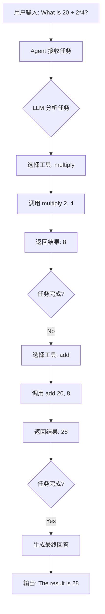

**Agent 内部机制详解：**

1. **任务解析**：LLM 接收用户输入，分析需要执行的操作
2. **工具选择**：LLM 根据工具的 name、parameters、docstring 选择合适工具
3. **参数填充**：LLM 根据类型注解填写工具参数
4. **结果处理**：Agent 接收工具返回值，决定继续或结束

```python
# Agent 如何理解工具
tools_schema = {
    "multiply": {
        "name": "multiply",
        "description": "Useful for multiplying two numbers.",
        "parameters": {
            "a": {"type": "float"},
            "b": {"type": "float"}
        }
    },
    "add": {
        "name": "add",
        "description": "Useful for adding two numbers.",
        ...
    }
}
# LLM 根据此 schema 决定调用哪个工具及参数值
```

#### 3.6.5 添加 Chat History

**记忆机制**：Agent 可通过 Context 记住历史对话。

```python
from llama_index.core.workflow import Context

# 创建上下文（存储对话历史）
ctx = Context(agent)

# 第一次对话
response = await agent.run("My name is Logan", ctx=ctx)

# 第二次对话（Agent 会记住之前的对话）
response = await agent.run("What is my name?", ctx=ctx)
# 输出: Your name is Logan.
```

**Context 的工作原理：**
- Context 内部维护对话历史列表
- 每次调用 `agent.run()` 时，Context 中的历史会作为 context 传递给 LLM
- LLM 根据历史生成连贯回答

#### 3.6.6 Agent + RAG 组合

**将 RAG 查询作为 Agent 工具：**

```python
from llama_index.core import VectorStoreIndex, SimpleDirectoryReader
from llama_index.core.agent.workflow import FunctionAgent
from llama_index.llms.openai import OpenAI

# 构建 RAG 索引
documents = SimpleDirectoryReader("data").load_data()
index = VectorStoreIndex.from_documents(documents)
query_engine = index.as_query_engine()

# 定义 RAG 工具
async def search_documents(query: str) -> str:
    """Useful for answering questions about the documents."""
    response = await query_engine.aquery(query)
    return str(response)

# 定义数学工具
def multiply(a: float, b: float) -> float:
    """Useful for multiplying two numbers."""
    return a * b

# 创建 Agent
agent = FunctionAgent(
    tools=[multiply, search_documents],
    llm=OpenAI(model="gpt-4o-mini"),
    system_prompt="You can do math and search documents.",
)

# 运行 Agent
async def main():
    response = await agent.run(
        "What did the author discuss? Also, what's 7 * 8?"
    )
    print(response)

asyncio.run(main())
```

**Agent 如何处理多工具任务：**
- LLM 分析用户输入，识别需要多个工具
- 按依赖顺序或并行调用工具
- 整合多个工具结果，生成统一回答

#### 3.6.7 本地模型 Agent 示例

```python
import asyncio
from llama_index.core.agent.workflow import FunctionAgent
from llama_index.llms.ollama import Ollama

def multiply(a: float, b: float) -> float:
    """Multiply two numbers."""
    return a * b

# 使用本地模型
agent = FunctionAgent(
    tools=[multiply],
    llm=Ollama(
        model="llama3.1",
        request_timeout=360.0,
        context_window=8000,
    ),
    system_prompt="You are a helpful assistant.",
)

async def main():
    response = await agent.run("What is 1234 * 4567?")
    print(response)

asyncio.run(main())
```

**本地模型注意事项：**
- 需要 RAM ≥32GB（取决于模型大小）
- 推理速度可能较慢，建议设置较长的 timeout
- 小模型可能工具调用不稳定，建议使用较大模型

---

### 3.7 常见安装问题与解决方案

#### 3.7.1 问题诊断清单

| 问题类型 | 症状 | 诊断步骤 |
|----------|------|---------|
| **依赖冲突** | `ImportError: cannot import name` | 检查 pip list，确认版本兼容 |
| **API Key 无效** | `AuthenticationError` | 验证 API Key 格式和有效期 |
| **网络超时** | `ConnectionError` | 检查网络代理配置 |
| **内存不足** | `MemoryError` | 检查模型大小与可用内存 |
| **Tokenizer 错误** | `TokenCountError` | 确认 tokenizer 配置正确 |

#### 3.7.2 常见问题解决方案

**问题 1：安装 llama-index 后缺少集成包**

**原因**：starter bundle 只包含 OpenAI 集成

**解决**：
```bash
# 检查已安装包
pip list | grep llama-index

# 安装缺失的集成
pip install llama-index-llms-anthropic
pip install llama-index-vector-stores-chroma
```

**问题 2：OpenAI API Key 配置错误**

**症状**：
```
openai.error.AuthenticationError: Incorrect API key provided
```

**解决**：
```python
# 正确配置方式
import os

# 方式 1：环境变量
os.environ["OPENAI_API_KEY"] = "sk-proj-xxx..."

# 方式 2：直接传参
from llama_index.llms.openai import OpenAI
llm = OpenAI(api_key="sk-proj-xxx...")
```

**问题 3：Embedding 模型不匹配**

**症状**：检索结果质量下降，或向量维度不匹配

**原因**：加载索引时使用了不同的 Embedding 模型

**解决**：
```python
from llama_index.embeddings.huggingface import HuggingFaceEmbedding
from llama_index.core import Settings

# 确保使用相同的 Embedding 模型
Settings.embed_model = HuggingFaceEmbedding(
    model_name="BAAI/bge-base-en-v1.5"  # 与构建时相同
)

# 然后加载索引
index = VectorStoreIndex.from_vector_store(vector_store)
```

**问题 4：Ollama 连接失败**

**症状**：
```
ConnectionError: Cannot connect to Ollama server
```

**解决**：
```bash
# 1. 确认 Ollama 服务运行
ollama serve

# 2. 确认模型已下载
ollama list
# 如缺少模型，下载
ollama pull llama3.1

# 3. 检查端口
curl http://localhost:11434/api/tags
```

**问题 5：Poetry 安装依赖冲突**

**症状**：
```
poetry.lock conflicts with pyproject.toml
```

**解决**：
```bash
# 清除锁定文件
rm poetry.lock

# 重新锁定
poetry lock

# 安装
poetry install
```

#### 3.7.3 性能优化建议

**1. 减少重复 Embedding 计算**
```python
# 持久化索引
index.storage_context.persist("storage")

# 后续加载，无需重新计算
index = load_index_from_storage(storage_context)
```

**2. 使用异步 API**
```python
# 同步调用（慢）
response = query_engine.query("...")

# 异步调用（快）
response = await query_engine.aquery("...")

# 批量异步
responses = await asyncio.gather(
    query_engine.aquery("q1"),
    query_engine.aquery("q2"),
)
```

**3. 调整 chunk_size**
```python
from llama_index.core import Settings

# 大文档：增大 chunk_size
Settings.chunk_size = 1024

# 精确检索：减小 chunk_size
Settings.chunk_size = 256
```

**4. 使用本地 Embedding 模型**
```python
# OpenAI Embedding：按 token 计费
Settings.embed_model = OpenAIEmbedding()

# HuggingFace Embedding：免费
Settings.embed_model = HuggingFaceEmbedding(
    model_name="BAAI/bge-base-en-v1.5"
)
```

#### 3.7.4 版本兼容性矩阵

| LlamaIndex Core | 推荐 LLM 集成版本 | 推荐 Embedding 版本 |
|-----------------|------------------|--------------------|
| 0.10.x | llama-index-llms-openai >= 0.1.x | llama-index-embeddings-openai >= 0.1.x |
| 0.11.x | llama-index-llms-openai >= 0.2.x | llama-index-embeddings-openai >= 0.2.x |
| 0.12.x | llama-index-llms-openai >= 0.3.x | llama-index-embeddings-openai >= 0.3.x |

**版本检查命令：**
```bash
pip show llama-index-core
pip show llama-index-llms-openai
```

---

### 3.8 快速入门流程图

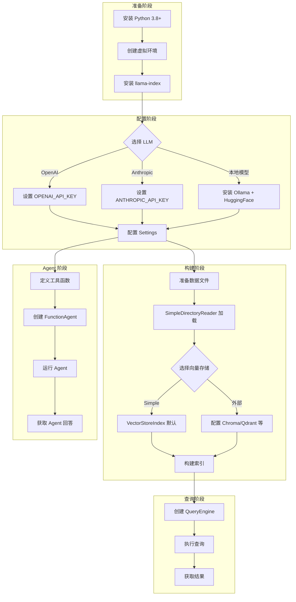

---

### 3.9 本章小结

**核心要点回顾：**

1. **安装策略**：starter bundle 快速入门，自定义安装按需集成
2. **包结构**：核心包 + 集成包，命名空间设计便于扩展
3. **5 行 RAG**：SimpleDirectoryReader → VectorStoreIndex → query
4. **LLM 配置**：Settings 全局配置，支持 OpenAI、Anthropic、Ollama 等
5. **向量存储**：Simple Vector Store 实验用，生产用 Chroma/Qdrant/Pinecone
6. **Agent 入门**：FunctionAgent + tools 定义，工具需类型注解和 docstring
7. **常见问题**：API Key 配置、Embedding 一致性、本地模型内存管理

**下一步学习：**
- 第 4 章：深入理解索引类型（VectorStoreIndex vs KeywordTableIndex）
- 第 5 章：Query Engine 高级配置与自定义
- 第 6 章：Agent 工具开发与多 Agent 协作

---

**来源标注：**
- 官方文档：https://docs.llamaindex.ai/en/stable/getting_started/installation/
- Starter Tutorial：https://docs.llamaindex.ai/en/stable/getting_started/starter_example/
- Local Models Tutorial：https://docs.llamaindex.ai/en/stable/getting_started/starter_example_local/
- LLM Guide：https://docs.llamaindex.ai/en/stable/module_guides/models/llms/
- Vector Stores：https://docs.llamaindex.ai/en/stable/module_guides/storing/vector_stores/
- Agent Tutorial：https://docs.llamaindex.ai/en/stable/understanding/agent/
- Anthropic Integration：https://docs.llamaindex.ai/en/stable/examples/llm/anthropic/> **来源标注**：本章内容基于 LlamaIndex 官方文档 [Component Guides](https://docs.llamaindex.ai/en/stable/module_guides/) 整理，涵盖索引、查询引擎、检索器、工具系统和响应合成器等核心组件。

---

## 4.1 索引类型详解

### 4.1.1 索引的核心概念

**概念定义**：索引（Index）是 LlamaIndex 中用于快速检索相关上下文的数据结构，是 RAG（检索增强生成）应用的核心基础。

**为什么需要索引**：
- 文档数据量通常很大，直接遍历所有内容效率极低
- 索引通过预处理建立数据间的关联，支持高效查询
- 不同索引类型适用于不同的检索场景（语义检索、关键词检索、层级检索等）

**工作原理**：
索引从 `Document` 对象构建，内部将文档解析/分块为 `Node` 对象（文本片段的轻量抽象），并暴露 `Retriever` 接口支持检索配置。

```
Document → NodeParser → Node[] → Index → Retriever → QueryEngine
```

---

### 4.1.2 VectorStoreIndex（向量存储索引）

**概念定义**：VectorStoreIndex 是最常用的索引类型，通过将文本转换为向量（Embedding）并存储在向量数据库中，支持基于语义相似度的检索。

**工作原理**：
1. **构建阶段**：每个 Node 被转换为向量，连同原始文本一起存储到 Vector Store
2. **查询阶段**：查询文本转换为向量，通过向量相似度计算（如 cosine similarity）找到最相似的 top-k 个 Node

**内部数据结构**：
```python
# VectorStoreIndex 内部存储结构示意
{
    "nodes": [
        {"id": "node_1", "text": "...", "embedding": [0.1, 0.2, ...]},
        {"id": "node_2", "text": "...", "embedding": [0.3, 0.4, ...]},
    ],
    "vector_store": VectorStore  # 可对接 Pinecone、Chroma、Qdrant 等
}
```

**代码示例**：
```python
from llama_index.core import VectorStoreIndex, SimpleDirectoryReader

# 加载文档并构建索引
documents = SimpleDirectoryReader("./data").load_data()
index = VectorStoreIndex.from_documents(documents)

# 或手动控制 Node 创建
from llama_index.core.schema import TextNode
nodes = [TextNode(text="chunk_1", id_="id_1"), TextNode(text="chunk_2", id_="id_2")]
index = VectorStoreIndex(nodes)

# 查询
query_engine = index.as_query_engine()
response = query_engine.query("What is the main topic?")
```

**源码解析要点**：
- `from_documents()` 内部调用 NodeParser 将 Document 分块为 Node
- 默认使用内存存储（SimpleVectorStore），可通过 `storage_context` 指定外部向量数据库
- Embedding 默认使用 OpenAI 的 `text-embedding-ada-002`，可通过 Settings 配置其他模型
- 批量插入默认为 2048 个 Node/批次，可通过 `insert_batch_size` 调整

**常见误区**：
- 误认为 VectorStoreIndex 只能用 OpenAI Embedding → 实际支持任何 Embedding 模型
- 误认为必须使用外部向量数据库 → 默认内存存储即可，适合小型应用
- 忽略 Node 的 metadata → metadata 可用于过滤、排序等高级检索

---

### 4.1.3 SummaryIndex（摘要索引，原名 List Index）

**概念定义**：SummaryIndex 将 Node 存储为顺序链表，适用于需要遍历或汇总所有内容的场景。

**工作原理**：
1. **构建阶段**：Node 按顺序存储，不进行 Embedding 或特殊处理
2. **查询阶段**：默认加载所有 Node 到 Response Synthesizer；可选 Embedding 模式检索 top-k，或添加 Keyword Filter

**适用场景**：
- 需要对所有文档内容进行总结汇总
- 文档数量较少，遍历成本可接受
- 需要按顺序处理文档（如时间序列数据）

**代码示例**：
```python
from llama_index.core import SummaryIndex

# 构建 SummaryIndex
index = SummaryIndex.from_documents(documents)

# 默认模式：遍历所有 Node
query_engine = index.as_query_engine()

# Embedding 模式：检索 top-k 相似 Node
retriever = index.as_retriever(retriever_mode="embedding")
nodes = retriever.retrieve("query")

# Keyword Filter 模式
from llama_index.core.indices.list import SummaryIndexLLMRetriever
retriever = SummaryIndexLLMRetriever(index=index, choice_batch_size=5)
```

---

### 4.1.4 KeywordTableIndex（关键词表索引）

**概念定义**：KeywordTableIndex 从每个 Node 中提取关键词，建立关键词到 Node 的映射表，支持基于关键词的快速检索。

**工作原理**：
1. **构建阶段**：使用 LLM 或关键词提取算法从 Node 提取关键词，建立 `{keyword: [node_ids]}` 映射表
2. **查询阶段**：从查询中提取关键词，在映射表中匹配，返回对应的 Node

**内部数据结构**：
```python
# KeywordTableIndex 内部结构示意
{
    "keyword_table": {
        "python": ["node_1", "node_3"],
        "machine learning": ["node_2", "node_4"],
        "RAG": ["node_1", "node_5"]
    },
    "nodes": {...}
}
```

**适用场景**：
- 查询包含明确关键词（实体、术语、品牌名等）
- 需要精确匹配而非语义相似
- 文档包含大量专业术语或固定概念

**代码示例**：
```python
from llama_index.core import KeywordTableIndex

index = KeywordTableIndex.from_documents(documents)
query_engine = index.as_query_engine()
response = query_engine.query("What does the document say about Python?")
```

---

### 4.1.5 TreeIndex（层级树索引）

**概念定义**：TreeIndex 将 Node 组织为层级树结构，原始 Node 作为叶子节点，中间节点由 LLM 生成的摘要构成。

**工作原理**：
1. **构建阶段**：Node 作为叶子节点，通过 LLM 逐层生成父节点摘要，形成树结构
2. **查询阶段**：从根节点开始，LLM 选择相关子节点向下遍历，最终到达叶子节点

**遍历参数**：
- `child_branch_factor=1`：每层选择 1 个子节点（最相关）
- `child_branch_factor=2`：每层选择 2 个子节点，增加召回率

**适用场景**：
- 大规模文档需要层级组织
- 需要从宏观到微观的分层检索
- 文档有明确的结构层级（如书籍章节）

**代码示例**：
```python
from llama_index.core import TreeIndex

# 构建树索引
index = TreeIndex.from_documents(documents)

# 默认单路径遍历
query_engine = index.as_query_engine()

# 多路径遍历（增加召回）
retriever = index.as_retriever(child_branch_factor=2)
nodes = retriever.retrieve("query")
```

---

### 4.1.6 PropertyGraphIndex（知识图谱索引）

**概念定义**：PropertyGraphIndex 构建包含标记节点和关系的知识图谱，通过图结构捕获实体间关系，支持复杂推理。

**工作原理**：
1. **构建阶段**：
   - LLM 从文本提取实体和关系（可自定义 Schema 或使用默认）
   - 可选择将 Node Embedding 以支持向量检索
   - 可连接现有知识图谱（如 Neo4j）

2. **查询阶段**：
   - 多种子检索器组合：Keyword + Synonym Expansion、Vector Retrieval（如果已 Embedding）
   - 可选择包含原始文本（仅适用于 LlamaIndex 构建的图谱）

**适用场景**：
- 需要理解实体间关系而非仅语义相似
- 复杂知识结构（如学术论文引用网络、企业知识图谱）
- 需要多跳推理的查询

**代码示例**：
```python
from llama_index.core import PropertyGraphIndex
from llama_index.graph_stores.neo4j import Neo4jPropertyGraphStore

# 使用 Neo4j 作为图存储
graph_store = Neo4jPropertyGraphStore(
    username="neo4j",
    password="password",
    url="bolt://localhost:7687"
)

index = PropertyGraphIndex.from_documents(
    documents,
    property_graph_store=graph_store,
    show_progress=True
)

# 查询
query_engine = index.as_query_engine()
response = query_engine.query("How is entity A related to entity B?")
```

---

### 4.1.7 索引类型对比图表

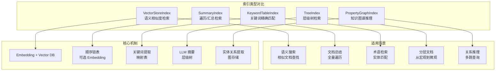

---

## 4.2 查询引擎

### 4.2.1 QueryEngine（单次查询引擎）

**概念定义**：QueryEngine 是 LlamaIndex 中最核心的查询接口，接收自然语言查询并返回丰富响应。通常基于一个或多个 Index 通过 Retriever 构建。

**工作原理**：
QueryEngine 的典型查询流程：
```
Query → Retriever（检索相关 Node） → Response Synthesizer（合成响应） → Response
```

**核心组件**：
- **Retriever**：从 Index 检索相关 Node
- **Response Synthesizer**：将检索到的 Node 合成为最终响应
- **Node Postprocessor**（可选）：在检索和合成之间对 Node 进行处理（如重排序、过滤）

**代码示例**：
```python
from llama_index.core import VectorStoreIndex

# 基础用法
index = VectorStoreIndex.from_documents(documents)
query_engine = index.as_query_engine()
response = query_engine.query("Who is Paul Graham?")

# 流式响应
query_engine = index.as_query_engine(streaming=True)
streaming_response = query_engine.query("Who is Paul Graham?")
streaming_response.print_response_stream()

# 自定义参数
query_engine = index.as_query_engine(
    similarity_top_k=5,           # 检索 top-5 Node
    response_mode="compact",      # 响应合成模式
    streaming=True
)
```

**自定义 QueryEngine**：
```python
from llama_index.core.query_engine import CustomQueryEngine
from llama_index.core.response_synthesizers import Refine

class MyCustomQueryEngine(CustomQueryEngine):
    """自定义查询引擎示例"""
    
    def custom_query(self, query_str: str):
        # 自定义查询逻辑
        nodes = self.retriever.retrieve(query_str)
        response = self.response_synthesizer.synthesize(query_str, nodes)
        return response

# 使用
query_engine = MyCustomQueryEngine(
    retriever=index.as_retriever(),
    response_synthesizer=Refine()
)
```

---

### 4.2.2 ChatEngine（多轮对话引擎）

**概念定义**：ChatEngine 是支持多轮对话的高层接口，保持对话历史状态，实现有记忆的上下文对话。类比 ChatGPT，但基于你的知识库。

**为什么需要 ChatEngine**：
- QueryEngine 只支持单次问答，无法利用历史对话上下文
- 多轮对话中用户可能追问、澄清、引用前文内容
- ChatEngine 维护对话历史，每次查询都考虑上下文

**工作原理**：
```
User Message → ChatEngine（含对话历史） → Retriever → Response Synthesizer → Response
             ↑                                              |
             └────────────── 更新对话历史 ←──────────────────┘
```

**代码示例**：
```python
from llama_index.core import VectorStoreIndex

index = VectorStoreIndex.from_documents(documents)

# 基础用法
chat_engine = index.as_chat_engine()
response = chat_engine.chat("Tell me a joke.")

# 流式对话
chat_engine = index.as_chat_engine()
streaming_response = chat_engine.stream_chat("Tell me a joke.")
for token in streaming_response.response_gen:
    print(token, end="")

# 重置对话历史
chat_engine.reset()
```

**ChatEngine 类型**：
- `SimpleChatEngine`：简单对话，不使用检索
- `ContextChatEngine`：每次查询前检索相关上下文
- `CondensePlusContextChatEngine`：压缩历史 + 检索上下文
- `ReActAgentChatEngine`：基于 ReAct Agent 的对话引擎

---

### 4.2.3 RouterQueryEngine（路由查询引擎）

**概念定义**：RouterQueryEngine 是组合多个 QueryEngine 的路由引擎，根据查询内容自动选择最合适的子引擎执行。

**工作原理**：
1. 用户提交查询
2. LLM 根据各子引擎的 description 判断查询类型
3. 选择最匹配的 QueryEngine 执行查询
4. 返回该引擎的响应

**适用场景**：
- 同时存在多种数据源或查询模式
- 需要区分"汇总类"和"细节检索类"查询
- 需要将查询路由到不同的专业引擎

**代码示例**：
```python
from llama_index.core.query_engine import RouterQueryEngine
from llama_index.core.selectors import PydanticSingleSelector
from llama_index.core.tools import QueryEngineTool
from llama_index.core import VectorStoreIndex, SummaryIndex

# 构建不同索引的查询引擎
vector_index = VectorStoreIndex.from_documents(documents)
summary_index = SummaryIndex.from_documents(documents)

vector_query_engine = vector_index.as_query_engine()
summary_query_engine = summary_index.as_query_engine()

# 定义工具（带描述）
vector_tool = QueryEngineTool.from_defaults(
    query_engine=vector_query_engine,
    description="Useful for retrieving specific context from the data source"
)
summary_tool = QueryEngineTool.from_defaults(
    query_engine=summary_query_engine,
    description="Useful for summarization questions related to the data source"
)

# 构建路由引擎
query_engine = RouterQueryEngine(
    selector=PydanticSingleSelector.from_defaults(),
    query_engine_tools=[vector_tool, summary_tool]
)

response = query_engine.query("What is the main theme of the documents?")
```

**Selector 类型**：
- `PydanticSingleSelector`：单选，使用 Function Calling API
- `PydanticMultiSelector`：多选，执行多个引擎并合并结果
- `LLMSingleSelector`：单选，使用文本补全 API
- `LLMMultiSelector`：多选，使用文本补全 API

---

### 4.2.4 重排序引擎（Reranker）

**概念定义**：Reranker 是 Node Postprocessor 的一种，在检索后对 Node 进行重排序，提高最终响应的相关性。

**为什么需要重排序**：
- 初步检索（如 Vector Retrieval）可能返回相关性较低的 Node
- Reranker 使用更精细的模型（如 Cross-Encoder）计算 Query-Node 相关性
- 重排序后只保留 top-k 最相关的 Node，提高响应质量

**工作原理**：
```
Retriever → Nodes（初步检索） → Reranker → Nodes（重排序） → Response Synthesizer
```

**代码示例**：
```python
from llama_index.core.postprocessor import SentenceTransformerRerank
from llama_index.postprocessor.cohere_rerank import CohereRerank

# 使用 Cohere Rerank
reranker = CohereRerank(api_key="COHERE_API_KEY", top_n=3)

# 在 QueryEngine 中使用
query_engine = index.as_query_engine(
    similarity_top_k=10,  # 初步检索 10 个
    node_postprocessors=[reranker]  # 重排序保留 3 个
)

response = query_engine.query("query")
```

**常用 Reranker**：
- `CohereRerank`：Cohere API
- `SentenceTransformerRerank`：本地 Sentence Transformer 模型
- `FlagEmbeddingRerank`：BGE Reranker
- `LongContextReorder`：针对长上下文的重排序

---

## 4.3 检索器（Retriever）

### 4.3.1 Retriever 核心概念

**概念定义**：Retriever 是负责从 Index 中检索最相关上下文的模块，接收用户查询并返回 Node 列表。

**为什么需要 Retriever**：
- Index 是数据存储结构，Retriever 是检索逻辑的实现
- 不同 Index 有不同的检索策略，Retriever 封装这些策略
- Retriever 可独立配置、组合、自定义

**工作原理**：
```python
# Retriever 接口定义示意
class BaseRetriever:
    def retrieve(self, query_str: str) -> List[NodeWithScore]:
        """检索相关 Node 并返回带分数的结果"""
        ...
```

**代码示例**：
```python
from llama_index.core import VectorStoreIndex

index = VectorStoreIndex.from_documents(documents)

# 高层 API：从 Index 获取 Retriever
retriever = index.as_retriever()
nodes = retriever.retrieve("Who is Paul Graham?")

# 配置 Retriever
retriever = index.as_retriever(similarity_top_k=5)
```

---

### 4.3.2 VectorIndexRetriever

**概念定义**：VectorIndexRetriever 是 VectorStoreIndex 的默认检索器，通过向量相似度检索 top-k Node。

**源码解析**：
```python
# VectorIndexRetriever 核心逻辑示意
class VectorIndexRetriever(BaseRetriever):
    def __init__(self, index, similarity_top_k=2):
        self._index = index
        self._similarity_top_k = similarity_top_k
    
    def retrieve(self, query_str):
        # 1. 将查询转换为 Embedding
        query_embedding = self._embed_model.get_query_embedding(query_str)
        
        # 2. 在 Vector Store 中检索 top-k 相似 Node
        nodes = self._vector_store.query(query_embedding, top_k=self._similarity_top_k)
        
        # 3. 返回带分数的 Node
        return [NodeWithScore(node=n, score=similarity) for n, similarity in nodes]
```

---

### 4.3.3 SummaryIndexRetriever

**概念定义**：SummaryIndex 的检索器有三种模式，对应不同的检索策略。

**Retriever Modes**：
- `default`：返回所有 Node（遍历模式）
- `embedding`：基于 Embedding 检索 top-k
- `llm`：使用 LLM 选择相关 Node

**代码示例**：
```python
from llama_index.core import SummaryIndex

index = SummaryIndex.from_documents(documents)

# 默认模式：返回所有 Node
retriever = index.as_retriever()

# Embedding 模式
retriever = index.as_retriever(retriever_mode="embedding", similarity_top_k=5)

# LLM 模式
retriever = index.as_retriever(retriever_mode="llm", choice_batch_size=5)
```

---

### 4.3.4 混合检索（Hybrid Retrieval）

**概念定义**：混合检索结合多种检索策略（如 Vector + Keyword、Vector + BM25），提高召回率和准确性。

**工作原理**：
- 同时执行多种检索器获取 Node
- 通过融合策略（如 Reciprocal Rank Fusion）合并结果
- 返回融合后的 top-k Node

**代码示例**：
```python
from llama_index.core.retrievers import VectorIndexRetriever, SummaryIndexRetriever
from llama_index.core import VectorStoreIndex, SummaryIndex

# 两种索引的检索器
vector_retriever = VectorStoreIndex(nodes).as_retriever(similarity_top_k=5)
keyword_retriever = SummaryIndex(nodes).as_retriever(retriever_mode="llm")

# Ensemble Retrieval（融合检索）
from llama_index.core.retrievers import RouterRetriever
retriever = RouterRetriever(
    retriever_tools=[
        vector_tool,
        keyword_tool
    ]
)
nodes = retriever.retrieve("query")
```

---

## 4.4 工具系统（Tools）

### 4.4.1 工具核心概念

**概念定义**：Tool 是 Agent 可调用的能力单元，封装特定功能供 LLM 选择使用。

**为什么需要工具**：
- Agent 需要执行操作（搜索、计算、查询数据库等）
- Tool 将操作标准化，LLM 通过 Function Calling 选择调用
- 支持工具链组合、工具嵌套等高级模式

---

### 4.4.2 FunctionTool

**概念定义**：FunctionTool 将 Python 函数封装为可被 Agent 调用的工具。

**工作原理**：
1. 定义 Python 函数并添加类型注解和 docstring
2. FunctionTool 自动解析函数签名作为 Tool Schema
3. Agent 通过 Function Calling 调用，传入参数
4. 执行函数并返回结果

**代码示例**：
```python
from llama_index.core.tools import FunctionTool

# 定义工具函数
def multiply(a: int, b: int) -> int:
    """Multiply two integers and returns the result integer"""
    return a * b

# 封装为 Tool
multiply_tool = FunctionTool.from_defaults(fn=multiply)

# Agent 使用
from llama_index.core.agent import ReActAgent
agent = ReActAgent.from_tools([multiply_tool], llm=llm)
response = agent.chat("What is 5 times 3?")
```

---

### 4.4.3 QueryEngineTool

**概念定义**：QueryEngineTool 将 QueryEngine 封装为 Tool，允许 Agent 通过工具调用进行检索查询。

**适用场景**：
- Agent 需要查询知识库
- 多知识库路由（每个 QueryEngine 对应一个数据源）
- 工具链中嵌入检索能力

**代码示例**：
```python
from llama_index.core.tools import QueryEngineTool, ToolMetadata

# 构建 QueryEngine
index = VectorStoreIndex.from_documents(documents)
query_engine = index.as_query_engine()

# 封装为 Tool
query_tool = QueryEngineTool.from_defaults(
    query_engine=query_engine,
    metadata=ToolMetadata(
        name="documents_query",
        description="Useful for querying the document knowledge base"
    )
)

# Agent 使用
agent = ReActAgent.from_tools([query_tool], llm=llm)
```

---

### 4.4.4 ToolSpec

**概念定义**：ToolSpec 是工具的规格定义，包含名称、描述、参数 Schema 等元数据。

**内部结构**：
```python
class ToolMetadata:
    name: str              # 工具名称
    description: str       # 工具描述（LLM 选择依据）
    fn_schema: Type        # 参数 Schema（Pydantic 模型）
    return_direct: bool    # 是否直接返回结果（不继续 Agent 循环）
```

---

### 4.4.5 自定义工具

**概念定义**：可通过继承 `BaseTool` 创建自定义工具，实现复杂逻辑。

**代码示例**：
```python
from llama_index.core.tools import BaseTool, ToolMetadata
from pydantic import BaseModel

class MyToolInput(BaseModel):
    query: str
    top_k: int = 5

class MyCustomTool(BaseTool):
    def __init__(self):
        self._metadata = ToolMetadata(
            name="my_tool",
            description="My custom tool description",
            fn_schema=MyToolInput
        )
    
    def __call__(self, input: MyToolInput):
        # 自定义逻辑
        return f"Processed: {input.query}"
    
    @property
    def metadata(self):
        return self._metadata

# 使用
my_tool = MyCustomTool()
agent = ReActAgent.from_tools([my_tool], llm=llm)
```

---

## 4.5 响应合成器（Response Synthesizer）

### 4.5.1 核心概念

**概念定义**：Response Synthesizer 负责将检索到的 Node 合成为最终响应，是 QueryEngine 的关键组件。

**为什么需要响应合成**：
- 检索返回多个 Node，需要整合为连贯响应
- 不同场景需要不同的合成策略（详细解释、简要总结、逐条处理）
- 控制 LLM 调用次数和 Token 消耗

---

### 4.5.2 Response Modes 详解

#### refine（迭代精化）

**工作原理**：
1. 第一个 Node 用于生成初始答案
2. 后续 Node 逐个用于 refine 答案（结合前一答案 + 当前 Node）
3. 每个 Node 触发一次 LLM 调用

**适用场景**：需要详细、准确答案

**优点**：答案逐次精化，质量高
**缺点**：LLM 调用次数多，成本高

```python
query_engine = index.as_query_engine(response_mode="refine")
```

#### compact（压缩精化）

**工作原理**：
1. 尝试将多个 Node 压缩到单个 LLM Prompt
2. 若超出 Token 限制则分割
3. 每个压缩块触发一次 refine 调用

**适用场景**：默认模式，平衡质量与成本

**优点**：比 refine 减少 LLM 调用
**缺点**：压缩可能丢失部分细节

```python
query_engine = index.as_query_engine(response_mode="compact")
```

#### tree_summarize（树状总结）

**工作原理**：
1. 将 Node 压缩合并为多个块
2. 每个块生成一个摘要答案
3. 将多个答案再次合并，递归直到单一答案

**适用场景**：需要全局总结

**优点**：适合大规模文档总结
**缺点**：细节可能被过度压缩

```python
query_engine = index.as_query_engine(response_mode="tree_summarize")
```

#### simple_summarize

**工作原理**：截断 Node 以适应单个 Prompt，一次性生成答案

**适用场景**：快速总结

**优点**：单次 LLM 调用，速度快
**缺点**：截断丢失信息

```python
query_engine = index.as_query_engine(response_mode="simple_summarize")
```

#### accumulate

**工作原理**：对每个 Node 执行相同查询，累积所有答案

**适用场景**：需要每个 Node 的独立回答

```python
query_engine = index.as_query_engine(response_mode="accumulate")
```

#### no_text

**工作原理**：仅执行检索，不调用 LLM，返回 Node 列表

**适用场景**：调试、查看检索结果

```python
query_engine = index.as_query_engine(response_mode="no_text")
response = query_engine.query("query")
print(response.source_nodes)  # 查看 Node
```

---

### 4.5.3 自定义 Response Synthesizer

**代码示例**：
```python
from llama_index.core.response_synthesizers import BaseSynthesizer, Refine
from llama_index.core import PromptTemplate

# 使用自定义 Prompt
refine_template = PromptTemplate(
    "Original answer: {existing_answer}\n"
    "New context: {context_msg}\n"
    "Query: {query_str}\n"
    "Refine the answer with new context:"
)

synthesizer = Refine(refine_template=refine_template)
query_engine = index.as_query_engine(response_synthesizer=synthesizer)
```

---

## 4.6 组件协作流程图表

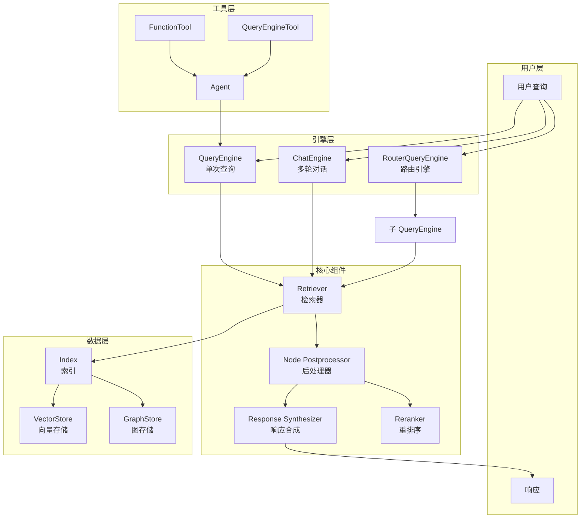

---

## 4.7 最佳实践与常见误区

### 最佳实践

1. **索引选择**：
   - 默认使用 VectorStoreIndex，语义检索效果好
   - 需要汇总时使用 SummaryIndex
   - 复杂关系推理使用 PropertyGraphIndex

2. **查询引擎配置**：
   - 小型应用使用默认 QueryEngine
   - 多数据源使用 RouterQueryEngine
   - 多轮对话使用 ChatEngine

3. **检索优化**：
   - 初步检索 top_k=10~20，Rerank 后保留 3~5
   - 使用 Metadata Filter 精准过滤
   - 混合检索提高召回率

4. **响应合成**：
   - 默认 compact 模式
   - 总结场景使用 tree_summarize
   - 需要详细答案使用 refine

### 常见误区

1. **误认为所有 Index 都需要 Embedding**
   - SummaryIndex、KeywordTableIndex 不依赖 Embedding
   - PropertyGraphIndex Embedding 是可选的

2. **误认为 QueryEngine 只能基于 Index**
   - 可自定义 QueryEngine，不依赖 Index
   - 可直接传入 Node 列表

3. **忽略 Node Postprocessor**
   - Reranker 可显著提升响应质量
   - Metadata Filter 可精准控制检索范围

4. **过度依赖单一索引**
   - RouterQueryEngine 可组合多种索引优势
   - 不同查询类型可能需要不同策略

---

## 参考链接

- [LlamaIndex Indexing Guide](https://docs.llamaindex.ai/en/stable/module_guides/indexing/)
- [How Each Index Works](https://docs.llamaindex.ai/en/stable/module_guides/indexing/index_guide/)
- [Query Engine Guide](https://docs.llamaindex.ai/en/stable/module_guides/deploying/query_engine/)
- [Chat Engine Guide](https://docs.llamaindex.ai/en/stable/module_guides/deploying/chat_engines/)
- [Retriever Guide](https://docs.llamaindex.ai/en/stable/module_guides/querying/retriever/)
- [Response Modes](https://docs.llamaindex.ai/en/stable/module_guides/deploying/query_engine/response_modes/)
- [Router Guide](https://docs.llamaindex.ai/en/stable/module_guides/querying/router/)
- [Node Postprocessor Guide](https://docs.llamaindex.ai/en/stable/module_guides/querying/node_postprocessors/)
- [Tools Guide](https://docs.llamaindex.ai/en/stable/module_guides/deploying/agents/tools/)Agent 是 LlamaIndex 框架中实现智能决策与自主执行的核心模块。与 QueryEngine 的被动响应模式不同，Agent 具备半自主决策能力，能够通过"感知-决策-行动"循环逐步完成复杂任务。本章深入剖析 LlamaIndex 的三种 Agent 类型（FunctionAgent、ReActAgent、CodeActAgent）及其核心组件与执行机制。

---

### 5.1 Agent 基础概念

#### 5.1.1 Agent 定义

**概念定义**：Agent 是一种"半自主的 LLM 驱动程序"（semi-autonomous LLM-driven program），其核心特征是"执行一系列步骤来完成任务"（executes a series of steps towards solving that task）。Agent 接收用户目标后，在每轮迭代中评估可用工具，选择最优方案执行，并判断任务是否完成——若未完成则继续循环，否则返回最终答案。

**为什么需要 Agent**：传统 RAG 系统和 QueryEngine 只能处理单次查询，无法应对需要多步骤推理、工具编排的复杂场景。例如"查询某公司股价，计算五年平均值，并与行业均值对比"这类任务，需要 Agent 的自主规划与工具链调用能力。

**Agent 核心：感知-决策-行动循环**：

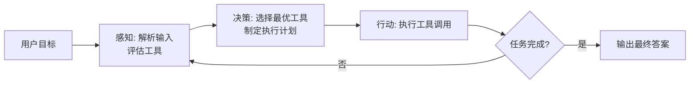

**源码层面的架构设计**：LlamaIndex 的 Agent 系统基于 Workflow 事件驱动架构构建。所有 Agent 类型继承自 `BaseWorkflowAgent`，而 `BaseWorkflowAgent` 同时继承 `Workflow`、`BaseModel`（Pydantic）和 `PromptMixin`，形成融合配置验证、执行路由和提示词管理的统一基类。

```python
# 类继承关系（源码结构）
class BaseWorkflowAgent(Workflow, BaseModel, PromptMixin, metaclass=BaseWorkflowAgentMeta):
    """
    基类设计：
    - Workflow: 提供事件驱动的执行引擎
    - BaseModel: Pydantic 配置验证
    - PromptMixin: 提示词管理能力
    """
```

#### 5.1.2 Agent vs QueryEngine

| 特性维度 | Agent | QueryEngine |
|---------|-------|-------------|
| **决策模式** | 自主决策，多轮迭代 | 单次响应，被动执行 |
| **任务复杂度** | 支持多步骤任务分解 | 处理单次查询 |
| **工具调用** | 动态选择与编排 | 固定检索流程 |
| **执行控制** | 循环直到任务完成 | 一次执行返回结果 |
| **适用场景** | 复杂推理、工具编排 | 信息检索、问答 |

**关键差异**：Agent 是"自动推理和决策引擎"（automated reasoning and decision engine），能够"做出内部决策"（make internal decisions），通过"分解复杂问题、选择外部工具、规划任务序列"来执行请求。QueryEngine 则是预设流程的检索器，不具备自主规划能力。

---

### 5.2 Agent 类型详解

LlamaIndex 提供三种预构建的 Agent 类型，每种采用不同的工具调用策略：

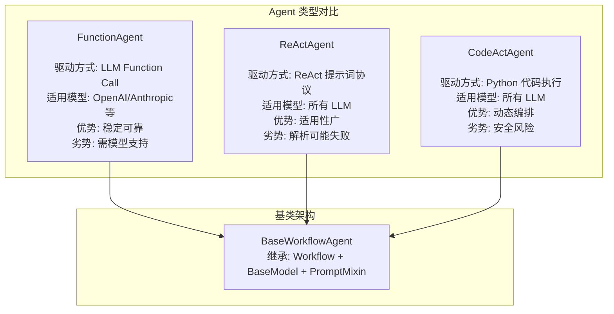

#### 5.2.1 FunctionAgent

**概念定义**：FunctionAgent 使用 LLM 原生的 Function Calling 能力驱动工具调用。工具调用由 LLM 直接返回的 `tool_calls` JSON 触发，框架自动解析并执行。这是最稳定的 Agent 类型，但要求模型具备 Function Call 能力（如 OpenAI、Anthropic、Gemini）。

**工作原理**：
1. 用户提交任务，Agent 将任务与工具描述发送给 LLM
2. LLM 返回 `tool_calls` JSON，包含工具名称和参数
3. 框架自动执行工具，获取结果
4. 结果反馈给 LLM，判断是否需要继续调用工具
5. 循环直到 LLM 返回最终答案

**源码核心实现**：

```python
# FunctionAgent 核心方法（源码精简）
class FunctionAgent(BaseWorkflowAgent):
    scratchpad_key: str = "function_agent_scratchpad"
    initial_tool_choice: str = "auto"
    allow_parallel_tool_calls: bool = False
    
    async def take_step(self, ctx: Context, llm: FunctionCallingLLM, ...):
        """核心步骤执行"""
        # 1. 验证 LLM 类型
        if not isinstance(llm, FunctionCallingLLM):
            raise ValueError("LLM must be a FunctionCallingLLM")
        
        # 2. 合并用户提示与历史消息
        messages = await self._assemble_messages(ctx)
        
        # 3. 调用 LLM 的 function calling 接口
        response = await llm.achat_with_tools(
            tools=self.tools,
            messages=messages,
            tool_choice=self.initial_tool_choice,
        )
        
        # 4. 解析工具调用结果
        tool_calls = self._extract_tool_calls(response)
        
        return AgentOutput(response=response, tool_calls=tool_calls)
    
    async def handle_tool_call_results(self, ctx: Context, results: List[ToolCallResult]):
        """处理工具调用结果"""
        for result in results:
            # 将工具结果追加到 scratchpad
            scratchpad = await ctx.get(self.scratchpad_key)
            scratchpad.append(ChatMessage(role="tool", content=result.content))
            
            # 检查是否触发直接返回
            if result.return_direct and not self._is_handoff(result):
                # 构建最终回复并中断循环
                return AgentOutput(response=result.content, is_final=True)
    
    async def finalize(self, ctx: Context):
        """收尾处理"""
        # 将 scratchpad 内容写入记忆
        scratchpad = await ctx.get(self.scratchpad_key)
        await self.memory.aput_messages(scratchpad)
        # 清空 scratchpad
        await ctx.set(self.scratchpad_key, [])
```

**代码示例**：

```python
from llama_index.llms.openai import OpenAI
from llama_index.core.agent.workflow import FunctionAgent

# 定义工具函数（类型注解和 docstring 是关键）
def multiply(a: float, b: float) -> float:
    """Multiply two numbers and returns the product"""
    return a * b

def add(a: float, b: float) -> float:
    """Add two numbers and returns the sum"""
    return a + b

# 初始化 LLM 和 Agent
llm = OpenAI(model="gpt-4o-mini")
workflow = FunctionAgent(
    tools=[multiply, add],
    llm=llm,
    system_prompt="You are an agent that can perform basic mathematical operations.",
)

# 执行任务
response = await workflow.run(user_msg="What is 20+(2*4)?")
print(response)
```

**关键设计要点**：
- **scratchpad**：临时存储当前轮次的工具调用记录，用于构建下一轮 LLM 输入
- **tool_choice**：控制工具选择策略（"auto" 自动选择、"none" 不调用、"required" 必须调用）
- **parallel_toolCalls**：是否允许并行调用多个工具

#### 5.2.2 ReActAgent

**概念定义**：ReActAgent 基于 ReAct（Reasoning + Acting）提示词协议驱动。这是学术论文提出的推理范式，通过"思考-执行-反馈"文本协议实现工具调用，无需模型具备 Function Call 能力，适用性更广。

**ReAct 模式原理**：

```
Thought: 用户询问股价五年平均值，我需要先获取股价数据。
Action: get_stock_price
Action Input: {"symbol": "AAPL"}
Observation: [股价数据...]
Thought: 现在我有了数据，需要计算五年平均值。
Action: calculate_average
Action Input: {"data": [...]}
Observation: 平均值为 150.23
Thought: 我已经得到答案，可以回复用户。
Answer: AAPL 股价五年平均值为 $150.23
```

**工作流程**（源码层面）：

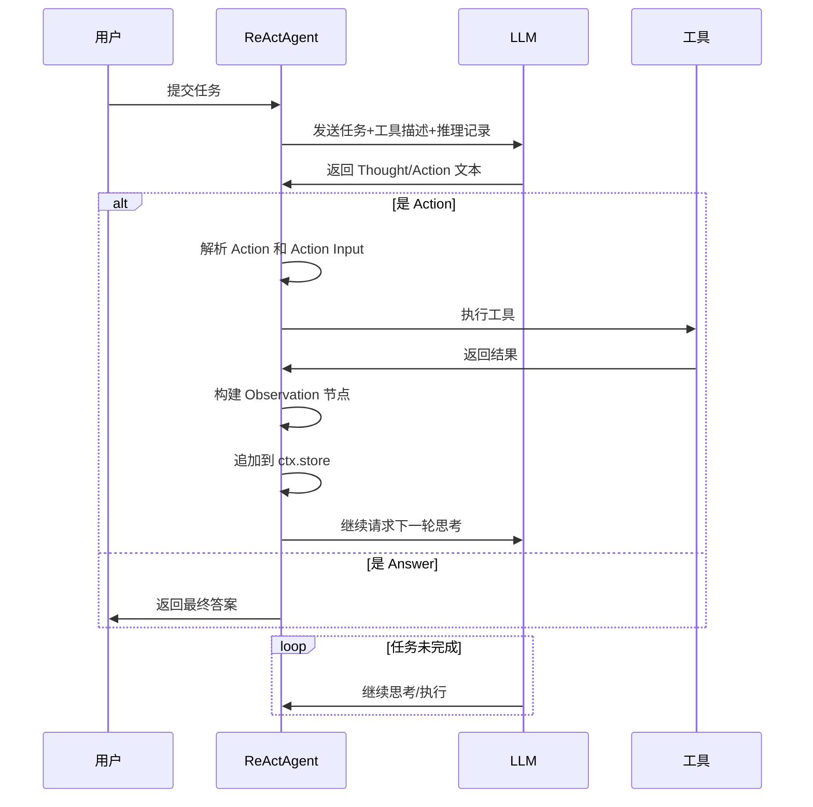

**源码核心实现**：

```python
# ReActAgent 核心方法（源码精简）
class ReActAgent(BaseWorkflowAgent):
    reasoning_key: str = "current_reasoning"  # 推理记录存储键
    
    async def take_step(self, ctx: Context, llm: LLM, ...):
        """思考与执行"""
        # 1. 格式化历史消息与推理记录
        reasoning = await ctx.get(self.reasoning_key)
        messages = self._format_messages(reasoning)
        
        # 2. 请求 LLM
        response = await llm.chat(messages)
        
        # 3. 解析输出
        parsed = self._parse_react_output(response.content)
        
        if parsed["type"] == "action":
            # 构建工具调用参数
            tool_call = ToolCall(
                tool_name=parsed["action"],
                tool_args=parsed["action_input"],
            )
            return AgentOutput(tool_calls=[tool_call])
        elif parsed["type"] == "answer":
            return AgentOutput(response=parsed["answer"], is_final=True)
        else:
            # 格式错误，触发重试
            retry_msg = "Please follow the ReAct format: Thought/Action/Action Input/Answer"
            return AgentOutput(response=retry_msg, needs_retry=True)
    
    async def handle_tool_call_results(self, ctx: Context, results: List[ToolCallResult]):
        """观察反馈处理"""
        for result in results:
            # 构建 Observation 节点
            observation = f"Observation: {result.content}"
            # 追加到推理记录
            reasoning = await ctx.get(self.reasoning_key)
            reasoning.append(observation)
            await ctx.set(self.reasoning_key, reasoning)
            
            if result.return_direct:
                return AgentOutput(response=result.content, is_final=True)
    
    async def finalize(self, ctx: Context):
        """收尾处理"""
        # 将完整推理轨迹写入记忆
        reasoning = await ctx.get(self.reasoning_key)
        await self.memory.aput_messages(reasoning)
        
        # 清空推理记录
        await ctx.set(self.reasoning_key, [])
```

**ReAct 格式解析器**：Agent 需要手动解析 LLM 返回的文本，提取 `Action`、`Action Input`、`Answer` 等字段。这是 ReActAgent 的风险点——解析失败可能导致任务终止。

**适用场景**：
- LLM 不支持 Function Calling（如开源模型）
- 需要完整的推理轨迹可视化
- 任务需要显式的思考步骤记录

#### 5.2.3 CodeActAgent

**概念定义**：CodeActAgent 允许模型动态生成并执行 Python 代码完成任务。这种范式源自学术论文，Agent 不需要预先定义所有工具，只需注册基础函数，模型即可根据需求编写代码来编排执行逻辑。

**核心能力**：
- **动态代码生成**：将用户语义需求转换为可执行代码
- **状态持久化**：跨多次执行保持变量状态
- **结果提取**：自动识别末尾表达式提取返回值

**工作原理**：

```python
# CodeActAgent 执行流程示意
用户任务: "生成斐波那契序列前10项，并计算总和"

模型生成的代码:
```python
def fibonacci(n):
    """生成斐波那契序列"""
    fib = [0, 1]
    for i in range(2, n):
        fib.append(fib[i-1] + fib[i-2])
    return fib

fib_sequence = fibonacci(10)
fib_sum = sum(fib_sequence)
fib_sequence, fib_sum  # 自动提取末尾表达式作为返回值
```

执行结果: ([0, 1, 1, 2, 3, 5, 8, 13, 21, 34], 85)
```

**代码执行环境实现**：

```python
# SimpleCodeExecutor 核心实现（源码精简）
class SimpleCodeExecutor:
    """简单的代码执行器，支持状态持久化"""
    
    def __init__(self, globals: Dict, locals: Dict):
        self.globals = globals or {}
        self.locals = locals or {}
    
    async def execute(self, code: str) -> Tuple[str, Any]:
        """执行代码并返回输出"""
        # 拦截标准输出
        stdout_capture = io.StringIO()
        
        with contextlib.redirect_stdout(stdout_capture):
            try:
                # 执行代码
                exec(code, self.globals, self.locals)
                
                # 提取末尾表达式作为返回值
                last_expr = self._extract_last_expression(code)
                if last_expr:
                    result = eval(last_expr, self.globals, self.locals)
                else:
                    result = None
            except Exception as e:
                return traceback.format_exc(), None
        
        return stdout_capture.getvalue(), result
    
    def _extract_last_expression(self, code: str) -> Optional[str]:
        """解析代码末尾的表达式"""
        tree = ast.parse(code)
        for node in reversed(tree.body):
            if isinstance(node, ast.Expr):
                return ast.unparse(node.value)
        return None
```

**安全风险与生产建议**：官方明确警告该实现"包含执行任意代码的能力"（includes code that will execute arbitrary code），直接运行存在安全隐患。生产环境必须落实"proper sandboxing should be used"——强烈建议采用容器隔离（Docker）、受限执行环境或第三方安全服务替代进程内执行。

**使用示例**：

```python
from llama_index.core.agent.workflow import CodeActAgent
from llama_index.llms.openai import OpenAI

# 定义基础工具函数
def add(a: int, b: int) -> int:
    """Add two numbers"""
    return a + b

def multiply(a: int, b: int) -> int:
    """Multiply two numbers"""
    return a * b

# 配置代码执行环境
executor = SimpleCodeExecutor(
    globals={"add": add, "multiply": multiply},
    locals={}
)

# 初始化 Agent
llm = OpenAI(model="gpt-4o")
agent = CodeActAgent(
    tools=[add, multiply],
    llm=llm,
    code_execute_fn=executor.execute,
    system_prompt="You can write Python code to solve problems.",
)

# 执行任务
response = await agent.run(user_msg="Generate Fibonacci sequence of 10 terms")
```

---

### 5.3 Agent 核心组件

#### 5.3.1 工具定义与注册

**工具是标准 Python 函数**：框架依赖"工具名称、参数和 docstring"结合类型注解来理解工具能力。描述性文档对于准确的工具选择至关重要。

**工具类型体系**：

| 工具类型 | 描述 | 使用场景 |
|---------|------|---------|
| **Python 函数** | 直接传入普通函数 | 简单自定义工具 |
| **FunctionTool** | 显式包装的工具对象 | 需要元数据配置 |
| **QueryEngineTool** | 包装 QueryEngine 为工具 | Agent 调用其他检索器 |
| **ToolSpec** | 社区提供的工具包 | 集成外部服务（Gmail 等） |
| **Utility Tools** | 通用增强工具 | 数据加载与搜索 |

**自定义工具构建**：创建继承 `BaseToolSpec` 的类，编写一组 Python 函数，通过 `spec_functions` 列表完成函数到工具 API 的映射。

```python
# 自定义 ToolSpec 实现
from llama_index.core.tools import BaseToolSpec

class MathToolSpec(BaseToolSpec):
    """数学运算工具集"""
    
    spec_functions = ["add", "multiply", "power"]
    
    def add(self, a: float, b: float) -> float:
        """Add two numbers and return the sum"""
        return a + b
    
    def multiply(self, a: float, b: float) -> float:
        """Multiply two numbers and return the product"""
        return a * b
    
    def power(self, base: float, exponent: float) -> float:
        """Raise base to the power of exponent"""
        return base ** exponent

# 使用工具集
math_spec = MathToolSpec()
tools = math_spec.to_tool_list()
```

**工具描述优化建议**：工具名称（Function Name）和参数描述直接影响 LLM 的工具选择准确率。优化建议：
- 函数名使用动词+名词结构（如 `get_stock_price`）
- Docstring 清晰描述输入输出语义
- 参数类型注解完整且准确

#### 5.3.2 系统提示词（System Prompt）

**概念定义**：System Prompt 是 Agent 的行为纲领，定义其角色、能力和决策边界。在每次执行时注入到消息历史的首位。

**源码处理流程**：

```python
# BaseWorkflowAgent 中的系统提示词处理（源码精简）
async def setup_agent(self, ctx: Context, ...):
    """注入系统提示词"""
    # 格式化系统提示词，支持动态 state 变量
    formatted_prompt = self.system_prompt.format(**await ctx.get("state"))
    
    # 构建系统消息
    system_message = ChatMessage(
        role="system",
        content=formatted_prompt,
    )
    
    # 注入到消息历史
    messages = [system_message] + await self.memory.get()
```

**设计要点**：
- 支持 `{state_variable}` 格式的动态变量注入
- 可包含工具使用指南、输出格式要求、决策策略
- 不同 Agent 类型有默认的系统提示词模板

#### 5.3.3 记忆机制（Memory）

**概念定义**：Memory 处理对话历史的存储与检索，是 Agent 跨轮次保持上下文连贯性的关键组件。

**架构演进**：旧版 buffer 系统被高度可适配的 Block 架构取代。

**短期记忆 vs 长期记忆**：

| 记忆类型 | 实现方式 | 特点 |
|---------|---------|------|
| **短期记忆** | FIFO 消息队列 | Token 限制约束，超出时迁移到长期存储 |
| **长期记忆** | Memory Block 模块 | 支持静态条目、事实提取、向量检索 |

**核心实现**：

```python
# Memory Block 机制示意
class BaseMemory:
    """记忆基类"""
    
    async def put(self, messages: List[ChatMessage]):
        """存储消息"""
        # 短期存储：追加到 FIFO 队列
        # 超出 token 限制时，触发 flush 到长期存储
    
    async def get(self, input: str = None) -> List[ChatMessage]:
        """检索消息"""
        # 从短期队列获取最近消息
        # 从长期 Block 检索相关内容
    
    def flush_to_long_term(self, messages: List[ChatMessage]):
        """迁移到长期存储"""
        # 各 Block 模块处理不同策略：
        # - StaticBlock: 存储完整对话
        # - FactExtractionBlock: LLM 提取关键事实
        # - VectorBlock: 向量数据库检索

# Memory Block 优先级配置
memory = BaseMemory(
    token_limit=4000,
    chat_history_token_ratio=0.75,  # 75% 用于短期，超出则迁移
)
memory.add_block(StaticBlock(priority=1))  # 高优先级，最后被截断
memory.add_block(VectorBlock(priority=2))  # 低优先级，优先截断
```

**Workflow Context vs Memory**：Context 保存运行时状态（迭代次数、工具调用记录），Memory 专注对话历史。Human-in-the-loop 场景需同时传入 `ctx` 和 `memory`。

#### 5.3.4 上下文管理（Context）

**概念定义**：Context 是 Workflow 的运行时状态容器，默认 Agent 在各次运行间是"无状态的"（stateless）。要启用跨轮次持久化，需显式传入 Context。

**核心功能**：
- **状态存储**：通过 `ctx.store.edit_state()` 更新变量，`ctx.store.get()` 检索
- **序列化**：支持 `to_dict()` 导出，`Context.from_dict()` 恢复
- **工具共享**：工具声明 `ctx: Context` 参数即可访问共享状态

```python
# Context 使用示例
from llama_index.core.workflow import Context

# 初始化 Context
ctx = Context(workflow)
ctx.store.set("user_preferences", {"language": "zh-CN"})

# 工具访问状态
def get_localized_info(ctx: Context, query: str) -> str:
    """工具可访问 ctx 中存储的状态"""
    prefs = ctx.store.get("user_preferences")
    # 根据 prefs 处理查询...

# 执行时传入 Context
response = await workflow.run(user_msg="...", ctx=ctx)

# 序列化保存
state_dict = ctx.to_dict()
# 下次恢复
ctx_restored = Context.from_dict(state_dict)
```

**状态可用性保证**：框架确保 state 中的信息对工具可用，"无需显式传递"（without explicitly having to pass it in）。

---

### 5.4 Agent 执行流程

#### 5.4.1 执行管道概览

**BaseWorkflowAgent 的 Step 方法架构**：

```python
# BaseWorkflowAgent 执行管道（源码精简）
class BaseWorkflowAgent:
    
    @step
    async def init_run(self, ctx: Context, ev: StartEvent) -> SetupEvent:
        """初始化运行"""
        # 1. 验证输入
        # 2. 初始化 BaseMemory
        # 3. 设置基准状态（迭代次数、标志位）
        return SetupEvent(user_msg=ev.user_msg)
    
    @step
    async def setup_agent(self, ctx: Context, ev: SetupEvent) -> AgentInputEvent:
        """注入系统提示词"""
        # 格式化系统提示词
        # 构建消息历史
        return AgentInputEvent(messages=messages)
    
    @step
    async def run_agent_step(self, ctx: Context, ev: AgentInputEvent) -> AgentOutputEvent:
        """执行核心步骤"""
        # 调用子类的 take_step 方法
        output = await self.take_step(ctx, self.llm, ...)
        return AgentOutputEvent(output=output)
    
    @step
    async def parse_agent_output(self, ctx: Context, ev: AgentOutputEvent) -> ToolCallEvent | StopEvent:
        """解析输出"""
        # 检查迭代限制
        # 处理 early_stopping_method
        # 分发工具调用或终止
        if output.is_final:
            return StopEvent(result=output)
        return ToolCallEvent(tool_calls=output.tool_calls)
    
    @step
    async def call_tool(self, ctx: Context, ev: ToolCallEvent) -> ToolCallResultEvent:
        """执行工具"""
        # 解析工具名称
        # 安全执行，捕获 WaitingForEvent 异常
        result = await tool.execute(ev.tool_args)
        return ToolCallResultEvent(result=result)
    
    @step
    async def aggregate_tool_results(self, ctx: Context, ev: ToolCallResultEvent) -> AgentInputEvent | StopEvent:
        """聚合结果"""
        # 更新记忆
        # 检查 return_direct
        # 循环或终止
        if needs_continue:
            return AgentInputEvent(...)  # 触发下一轮
        return StopEvent(result=output)
```

**执行流程图**：

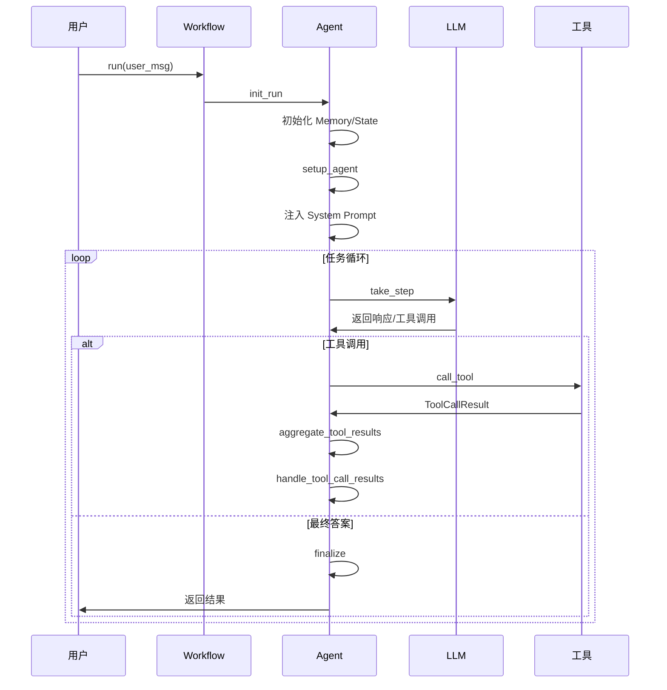

#### 5.4.2 终止条件判断

**终止触发条件**：
1. **LLM 返回最终答案**：无工具调用请求，直接输出文本响应
2. **return_direct 标志**：工具结果标记为直接返回，中断循环
3. **迭代次数限制**：超出配置的最大迭代数，触发 early_stopping
4. **early_stopping_method**：当迭代超限时，可选择"generate"（强制生成答案）或"stop"（直接停止）

```python
# 终止条件处理（源码精简）
async def parse_agent_output(self, ctx: Context, ev: AgentOutputEvent):
    # 检查迭代次数
    iterations = await ctx.get("iterations")
    if iterations >= self.max_iterations:
        if self.early_stopping_method == "generate":
            # 强制生成答案
            final_response = await self.llm.chat("Generate a final answer based on current progress")
            return StopEvent(result=AgentOutput(response=final_response))
        else:
            # 直接停止
            return StopEvent(result=AgentOutput(response="Max iterations reached"))
    
    # 检查是否最终答案
    if ev.output.is_final:
        await self.finalize(ctx)
        return StopEvent(result=ev.output)
    
    # 继续工具调用
    return ToolCallEvent(tool_calls=ev.output.tool_calls)
```

#### 5.4.3 流式输出与事件

**流式传输目的**：为运行时间较长的 Agent 提供实时进度反馈。

**核心事件类型**：

| 事件类型 | 触发时机 | 内容 |
|---------|---------|------|
| **AgentInput** | 执行开始 | 用户初始指令 |
| **AgentStream** | LLM 响应中 | 增量文本 |
| **ToolCall** | 工具调用 | 工具名称和参数 |
| **ToolCallResult** | 工具完成 | 执行结果 |
| **AgentOutput** | 处理完毕 | 完整响应 |

**流式处理代码**：

```python
# 流式事件监听
handler = workflow.run(user_msg="Analyze stock trends...")

async for event in handler.stream_events():
    if isinstance(event, AgentStream):
        # 增量打印文本
        print(event.delta, end="", flush=True)
    elif isinstance(event, ToolCall):
        print(f"\n[Calling tool: {event.tool_name}]")
    elif isinstance(event, ToolCallResult):
        print(f"\n[Tool result: {event.content[:50]}...]")

# 获取最终结果
response = await handler
print(f"\nFinal: {response}")
```

**禁用流式**：若底层模型不支持，配置 `FunctionAgent(..., streaming=False)`。

---

### 5.5 Human-in-the-loop

#### 5.5.1 实现原理

**概念定义**：Human-in-the-loop（HITL，人在回路）是在 AI 自主执行关键操作前引入人类监督和决策的机制。该模式确保敏感、高风险任务必须获得人类明确批准。

**事件驱动架构**：依托 Workflow 的事件系统，需配对使用 `InputRequiredEvent` 与 `HumanResponseEvent`。

**核心实现**：

```python
# Human-in-the-loop 工具实现
from llama_index.core.workflow import Context
from llama_index.core.tools import FunctionTool
from llama_index.core.agent.workflow import FunctionAgent

async def dangerous_operation(ctx: Context, action: str) -> str:
    """敏感操作工具，需要人工确认"""
    # 向事件流抛出确认请求
    response = await ctx.wait_for_event(
        HumanResponseEvent,
        waiter_event=InputRequiredEvent(
            prefix="Do you approve this action?",
            user_name="admin",  # 预设接收者
        ),
    )
    
    # 检查人工决策
    if response.response == "approve":
        return f"Action '{action}' executed successfully"
    else:
        return "Action rejected by human"

# 包装为工具
tool = FunctionTool.from_async_fn(dangerous_operation)

# Agent 配置
agent = FunctionAgent(
    tools=[tool],
    llm=llm,
    system_prompt="You can perform operations with human approval.",
)
```

#### 5.5.2 交互处理流程

**主程序监听**：当捕获到 `InputRequiredEvent` 时，通过任意渠道（命令行、UI、音频）采集人工决策，注入回 Workflow。

```python
# Human-in-the-loop 主程序处理
handler = workflow.run(user_msg="Delete all temporary files...")

async for event in handler.stream_events():
    if isinstance(event, InputRequiredEvent):
        # 通过命令行采集人工决策
        print(f"\n{event.prefix}")
        user_input = input("Enter 'approve' or 'reject': ")
        
        # 注入决策回 Workflow
        handler.ctx.send_event(
            HumanResponseEvent(
                response=user_input,
                user_name=event.user_name,
            )
        )

response = await handler
```

#### 5.5.3 中断与恢复机制

**状态持久化**：若人工决策耗时较长或涉及独立进程，文档建议"serialize the context and save it to a database or file so that you can resume the workflow later"。

**实现方式**：

```python
# 中断保存
ctx_dict = handler.ctx.to_dict()
# 存储到数据库或文件
await db.save_workflow_state(session_id, ctx_dict)

# 恢复执行
ctx_restored = Context.from_dict(ctx_dict)
handler = workflow.run(user_msg="...", ctx=ctx_restored)

# 继续等待人工输入
async for event in handler.stream_events():
    if isinstance(event, InputRequiredEvent):
        # 处理人工决策...
```

**适用场景**：
- 敏感操作：数据删除、资金转账
- 内容生成：文章发布、诗歌创作需质量把控
- 权限控制：特定权限才能执行的操作
- 审计要求：需记录人工决策过程

---

### 5.6 多 Agent 协作

#### 5.6.1 AgentWorkflow（Swarm 模式）

**概念定义**：AgentWorkflow 是内置的多 Agent 协调器，自动管理 Agent 间的路由。开发者提供 Agent 列表并指定起始点，系统执行直到活跃 Agent"决定移交控制权给其他 Agent"（handoff control to another agent）。

```python
# AgentWorkflow 示例
from llama_index.core.agent.workflow import AgentWorkflow, FunctionAgent

research_agent = FunctionAgent(
    name="researcher",
    tools=[search_tool, read_tool],
    system_prompt="You search and gather information.",
)

analysis_agent = FunctionAgent(
    name="analyst",
    tools=[calculate_tool, chart_tool],
    system_prompt="You analyze data and create visualizations.",
)

workflow = AgentWorkflow(
    agents=[research_agent, analysis_agent],
    initial_agent=research_agent,
)

response = await workflow.run(user_msg="Research AI trends and analyze growth patterns")
```

#### 5.6.2 协作模式对比

| 协作模式 | 代码量 | 灵活性 | 事件流 |
|---------|-------|-------|--------|
| **AgentWorkflow** | 最小 | 中等 | 内置 |
| **Orchestrator** | 中等 | 高 | 内置（通过管理器） |
| **Custom Planner** | 高 | 最高 | 自定义 |

**Orchestrator 模式**：顶层 Agent 作为中央管理器，将子 Agent 作为工具暴露，"选择下一个子 Agent 调用"并保留序列控制权。

**Custom Planner 模式**：LLM 生成结构化计划（XML/JSON），代码解析后"按命令式依次调用 Agent"（imperatively invoke the agents），支持复杂路由和外部调度器。

---

### 5.7 结构化输出

#### 5.7.1 输出控制方式

**方式一：output_cls**：提供 Pydantic 模型作为输出 Schema。

```python
from pydantic import BaseModel

class AnalysisResult(BaseModel):
    summary: str
    key_points: List[str]
    confidence: float

agent = FunctionAgent(
    tools=[...],
    llm=llm,
    output_cls=AnalysisResult,
)

response = await agent.run(user_msg="Analyze this document...")
# 获取结构化结果
result = response.get_pydantic_model(AnalysisResult)
print(result.summary, result.key_points)
```

**方式二：structured_output_fn**：高级场景使用自定义验证/重写函数。

```python
def custom_output_parser(messages: List[ChatMessage]) -> dict:
    """自定义消息历史解析"""
    # 提取特定字段，验证格式
    return {"custom_field": extracted_value}

agent = FunctionAgent(
    tools=[...],
    llm=llm,
    structured_output_fn=custom_output_parser,
)
```

#### 5.7.2 流式结构化输出

```python
# 监听结构化输出事件
async for event in handler.stream_events():
    if isinstance(event, AgentStreamStructuredOutput):
        print(f"Partial structured output: {event.partial_result}")

# 最终结果
response = await handler
print(response.structured_response)  # 原始 dict
print(response.get_pydantic_model(AnalysisResult))  # Pydantic 实例
```

---

### 5.8 总结

LlamaIndex 的 Agent 系统通过 Workflow 事件驱动架构实现了高度可扩展的智能体框架：

| Agent 类型 | 驱动方式 | 适用场景 | 注意事项 |
|-----------|---------|---------|---------|
| **FunctionAgent** | LLM Function Call | 支持 Function Calling 的模型 | 最稳定，首选 |
| **ReActAgent** | ReAct 提示词 | 不支持 Function Calling 的模型 | 解析风险，适用性广 |
| **CodeActAgent** | Python 代码执行 | 动态编排、复杂算法 | 必须沙箱隔离 |

**核心设计原则**：
- 工具定义需精确描述（函数名+类型注解+docstring）
- Memory 管理对话历史，Context 管理运行时状态
- Human-in-the-loop 通过事件配对实现中断恢复
- 多 Agent 协作提供从快速原型到完全自定义的灵活性

**来源参考**：
- 官方文档：https://developers.llamaindex.ai/python/framework/understanding/agent/
- 源码仓库：https://github.com/run-llama/llama_index/tree/main/llama-index-core/llama_index/core/agent/workflow/Workflow 是 LlamaIndex 框架的核心编排引擎，采用事件驱动架构（Event-driven Architecture）实现复杂任务的流程控制。本章深入剖析 Workflow 的设计哲学、核心组件、AgentWorkflow 高层封装，以及多 Agent 协作模式，并与 LangGraph、CrewAI、AutoGen 等主流编排框架进行对比分析。

---

### 6.1 Workflow 基础

#### 6.1.1 事件驱动架构设计

**概念定义**：Workflow 是一种"事件驱动的、基于步骤的应用执行流程控制方式"（event-driven, step-based way to control the execution flow of an application）。应用程序被分解为多个 Step（步骤），每个 Step 由 Event（事件）触发，并发出新 Event 触发后续 Step。通过组合 Step 与 Event，可以构建任意复杂度的流程逻辑。

**为什么采用事件驱动**：传统 DAG（Directed Acyclic Graph）架构存在以下局限性：
1. **逻辑编码困难**：循环与分支逻辑必须编码到图的边（edges）中，难以阅读和理解
2. **数据传递复杂**：节点间的数据传递需要处理可选值、默认值等复杂参数管理
3. **开发体验不佳**：DAG 不符合开发者构建复杂、循环、分支 AI 应用的直觉思维

事件驱动模式通过"组件自主决定接收/发出什么事件"的设计，解决了上述问题——框架不调度任务，而是由 Step 通过事件订阅/发射机制自然连接。

**核心架构对比**：

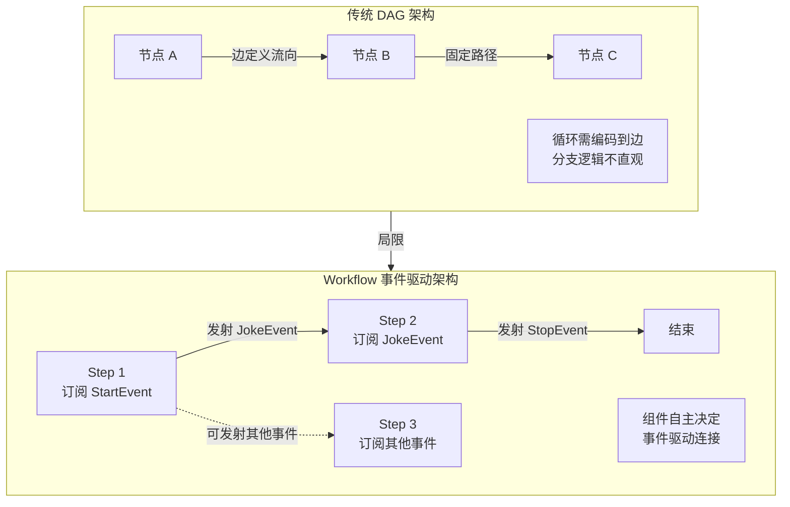

**事件流转机制**：

```mermaid
sequenceDiagram
    participant User as 用户
    participant WF as Workflow
    participant Step1 as Step 1
    participant Step2 as Step 2
    participant EventBus as 事件总线
    
    User->>WF: run(topic="pirates")
    WF->>EventBus: 发射 StartEvent(topic="pirates")
    EventBus->>Step1: 触发 generate_joke
    Step1->>Step1: 处理逻辑
    Step1->>EventBus: 发射 JokeEvent(joke="...")
    EventBus->>Step2: 触发 critique_joke
    Step2->>Step2: 处理逻辑
    Step2->>EventBus: 发射 StopEvent(result="...")
    EventBus->>WF: 工作流结束
    WF->>User: 返回结果
```

#### 6.1.2 Step 与 Event 概念

**Event（事件）定义**：

Event 是 Step 之间数据传递的载体，本质上是 Pydantic BaseModel 对象，可自由定义属性结构。框架提供四种内置事件：

| 事件类型 | 用途 | 特性 |
|---------|------|------|
| `StartEvent` | 工作流开始事件 | 框架自动发射，可承载任意属性 |
| `StopEvent` | 工作流结束事件 | 包含 `result` 属性返回最终结果 |
| `InputRequiredEvent` | Human-in-the-loop 输入请求 | 需要用户响应 |
| `HumanResponseEvent` | Human-in-the-loop 用户响应 | 配合 `InputRequiredEvent` 使用 |

**自定义 Event 示例**：

```python
from llama_index.core.workflow import Event

class JokeEvent(Event):
    """笑话生成事件，携带生成的笑话内容"""
    joke: str

class QueryEvent(Event):
    """查询事件，携带用户查询"""
    query: str
    retry_count: int = 0  # 可选属性，带默认值
```

**Step（步骤）定义**：

Step 是工作流的执行单元，通过 `@step` 装饰器声明。每个 Step 接收特定类型 Event，处理逻辑后返回新 Event。框架通过类型注解自动推断 Step 的输入/输出类型，并在运行前验证工作流有效性。

**Step 声明规范**：

```python
from llama_index.core.workflow import Workflow, step
from llama_index.core.workflow.events import StartEvent, StopEvent

class JokeFlow(Workflow):
    """笑话生成与评价工作流"""
    
    @step
    async def generate_joke(self, ev: StartEvent) -> JokeEvent:
        """
        输入：StartEvent（框架自动发射）
        输出：JokeEvent（触发下一个 Step）
        """
        topic = ev.topic  # 从 StartEvent 获取属性
        prompt = f"Write your best joke about {topic}."
        response = await self.llm.acomplete(prompt)
        return JokeEvent(joke=str(response))
    
    @step
    async def critique_joke(self, ev: JokeEvent) -> StopEvent:
        """
        输入：JokeEvent（由 generate_joke 发射）
        输出：StopEvent（工作流结束）
        """
        joke = ev.joke
        prompt = f"Critique this joke: {joke}"
        response = await self.llm.acomplete(prompt)
        return StopEvent(result=str(response))
```

**核心设计原则**：
1. **类型安全**：`@step` 装饰器自动推断输入/输出类型，运行前验证流程完整性
2. **异步优先**：所有 Step 应使用 `async def`，充分利用 asyncio 并发能力
3. **单一职责**：每个 Step 应专注于单一逻辑片段，复杂逻辑拆分为多个 Step
4. **显式事件流**：事件类型在代码中显式声明，流程可追溯、可可视化

#### 6.1.3 Context 状态管理

**概念定义**：Context 是 Workflow 的全局状态容器，用于在 Step 之间传递和持久化数据。它提供三种核心能力：
1. **Store**：键值存储，用于保存全局数据（如记忆、中间结果）
2. **Streaming Queue**：流式输出队列，支持实时事件推送
3. **Event Buffers**：事件缓冲区，支持 `collect_events` 同步等待

**工作原理**：Context 对象在每个 Step 中作为参数传入，支持异步读写操作：

```python
from llama_index.core.workflow import Context

class StatefulFlow(Workflow):
    @step
    async def setup(self, ctx: Context, ev: StartEvent) -> QueryEvent:
        # 存储全局数据
        await ctx.store.set("database", ["value1", "value2", "value3"])
        return QueryEvent(query=ev.query)
    
    @step
    async def query(self, ctx: Context, ev: QueryEvent) -> StopEvent:
        # 读取全局数据
        data = await ctx.store.get("database")
        result = f"Query result based on {data[1]}"
        return StopEvent(result=result)
```

**Context 核心方法**：

| 方法 | 用途 | 示例 |
|------|------|------|
| `ctx.store.set(key, value)` | 存储数据 | `await ctx.store.set("memory", chat_history)` |
| `ctx.store.get(key, default)` | 读取数据 | `data = await ctx.store.get("database", default=[])` |
| `ctx.send_event(event)` | 发射事件（并发触发） | `ctx.send_event(StepAEvent(query="q1"))` |
| `ctx.collect_events(ev, types)` | 收集多个事件 | `ctx.collect_events(ev, [EventA, EventB])` |
| `ctx.write_event_to_stream(event)` | 流式输出 | `ctx.write_event_to_stream(StreamEvent(delta="..."))` |
| `ctx.wait_for_event(type, waiter_event)` | Human-in-the-loop | `await ctx.wait_for_event(HumanResponseEvent, ...)` |

**跨运行状态保持**：

默认情况下，每次 `workflow.run()` 会创建新的 Context，状态不保留。要保持跨运行状态，需要传入同一 Context：

```python
from llama_index.core.workflow import Context

# 创建持久化 Context
ctx = Context(workflow)

# 第一次运行，存储用户名
response = await workflow.run(user_msg="My name is Logan", ctx=ctx)

# 第二次运行，记住用户名
response = await workflow.run(user_msg="What is my name?", ctx=ctx)
# Agent 能正确回答 "Your name is Logan"
```

**Context 序列化**：

Context 对象可序列化为 JSON，支持持久化存储：

```python
from llama_index.core.workflow import JsonSerializer, JsonPickleSerializer

# 序列化 Context
ctx_dict = ctx.to_dict(serializer=JsonSerializer())

# 从 JSON 恢复 Context
restored_ctx = Context.from_dict(workflow, ctx_dict, serializer=JsonSerializer())
```

#### 6.1.4 循环与分支控制

**循环实现**：

Workflow 通过"Step 返回相同类型 Event"实现循环。当 Step 返回的事件类型可触发自身时，形成自然循环：

```python
class LoopEvent(Event):
    num_loops: int

class LoopingWorkflow(Workflow):
    @step
    async def prepare_input(self, ev: StartEvent) -> LoopEvent:
        num_loops = random.randint(0, 10)
        return LoopEvent(num_loops=num_loops)
    
    @step
    async def loop_step(self, ev: LoopEvent) -> LoopEvent | StopEvent:
        if ev.num_loops <= 0:
            return StopEvent(result="Done looping!")
        # 返回 LoopEvent 触发自身，形成循环
        return LoopEvent(num_loops=ev.num_loops - 1)
```

**分支实现**：

分支通过"Step 返回不同类型 Event"实现。类型注解 `EventA | EventB` 表示该 Step 可能触发两个不同路径：

```python
class BranchAEvent(Event):
    payload: str

class BranchBEvent(Event):
    payload: str

class BranchWorkflow(Workflow):
    @step
    async def start(self, ev: StartEvent) -> BranchAEvent | BranchBEvent:
        if random.randint(0, 1) == 0:
            return BranchAEvent(payload="Branch A")
        else:
            return BranchBEvent(payload="Branch B")
    
    @step
    async def step_a(self, ev: BranchAEvent) -> StopEvent:
        return StopEvent(result="Branch A complete.")
    
    @step
    async def step_b(self, ev: BranchBEvent) -> StopEvent:
        return StopEvent(result="Branch B complete.")
```

**可视化流程图**：

```mermaid
flowchart TB
    Start[StartEvent] -->|"随机选择"| Decision{Branch Step}
    Decision -->|"返回 BranchAEvent"| A[Step A]
    Decision -->|"返回 BranchBEvent"| B[Step B]
    A --> StopA[StopEvent: A complete]
    B --> StopB[StopEvent: B complete]
```

#### 6.1.5 并发执行

**多事件并发发射**：

使用 `ctx.send_event()` 可同时发射多个事件，触发多个 Step 并行执行：

```python
class ParallelFlow(Workflow):
    @step
    async def start(self, ctx: Context, ev: StartEvent) -> None:
        # 并发发射三个事件
        ctx.send_event(StepTwoEvent(query="Query 1"))
        ctx.send_event(StepTwoEvent(query="Query 2"))
        ctx.send_event(StepTwoEvent(query="Query 3"))
    
    @step(num_workers=4)  # 最大并发数
    async def step_two(self, ev: StepTwoEvent) -> StopEvent:
        print(f"Running slow query {ev.query}")
        await asyncio.sleep(random.randint(0, 5))
        return StopEvent(result=ev.query)
```

**事件收集同步**：

使用 `ctx.collect_events()` 等待多个事件完成后继续：

```python
class ConcurrentFlow(Workflow):
    @step
    async def step_three(self, ctx: Context, ev: StepThreeEvent) -> StopEvent | None:
        # 等待收集 3 个事件
        result = ctx.collect_events(ev, [StepThreeEvent] * 3)
        if result is None:
            return None  # 未收集完毕，继续等待
        
        # 收集完毕，处理所有结果
        print(result)  # 按 collect_events 参数顺序排列
        return StopEvent(result="Done")
```

**num_workers 参数**：

`@step(num_workers=N)` 控制该 Step 的最大并发实例数。默认值为 4，适合处理 I/O 密集型任务。

---

### 6.2 AgentWorkflow

#### 6.2.1 AgentWorkflow 核心概念

**概念定义**：AgentWorkflow 是 Workflow 的高层封装，专门用于编排 Agent 系统。它将多个 Agent（每个 Agent 专注特定职责）组织起来，管理状态、协调执行流程，并支持 Human-in-the-loop 中断与恢复。简而言之，AgentWorkflow 是"多 Agent 协作 + 可控交互"的基础设施。

**与底层 Workflow 的关系**：

```mermaid
flowchart TB
    subgraph HighLevel["高层抽象"]
        AW["AgentWorkflow<br/><br/>职责：Agent 编排、工具调用<br/>子任务切换、状态传递"]
    end
    
    subgraph MidLevel["中层组件"]
        FA["FunctionAgent<br/>ReActAgent<br/>CodeActAgent"]
        Tools["工具定义<br/>状态管理"]
    end
    
    subgraph LowLevel["底层引擎"]
        WF["Workflow<br/><br/>职责：事件驱动引擎<br/>Step/Event/Context"]
    end
    
    AW --> FA
    FA --> Tools
    FA --> WF
    AW --> WF
```

**核心设计理念**：
- AgentWorkflow 基于 Workflow 构建，继承了事件驱动、异步并发、状态管理等核心能力
- 提供 `from_tools_or_functions()` 快速创建单 Agent Workflow
- 支持多 Agent 协作，通过 Handoff 机制实现 Agent 间的任务切换
- 内置 Human-in-the-loop 支持，通过 `InputRequiredEvent` / `HumanResponseEvent` 实现交互

#### 6.2.2 from_tools_or_functions() 快速创建

**单 Agent 快速创建**：

`AgentWorkflow.from_tools_or_functions()` 是最简化的 Agent 创建方式，将工具/函数直接包装为可运行的 Agent Workflow：

```python
from llama_index.core.agent.workflow import FunctionAgent, AgentWorkflow
from llama_index.llms.openai import OpenAI

# 定义工具函数
async def search_web(query: str) -> str:
    """Search the web for information."""
    client = AsyncTavilyClient(api_key="tvly-...")
    return str(await client.search(query))

# 创建 FunctionAgent
agent = FunctionAgent(
    tools=[search_web],
    llm=OpenAI(model="gpt-4o-mini"),
    system_prompt="You are a helpful assistant that can search the web.",
)

# 直接运行 Agent
response = await agent.run(user_msg="What is the weather in San Francisco?")
```

**等效的 AgentWorkflow 包装**：

```python
# 使用 AgentWorkflow 包装（适用于多 Agent 场景）
workflow = AgentWorkflow(agents=[agent])
response = await workflow.run(user_msg="What is the weather?")
```

**工具与状态集成**：

工具函数可以访问 Context，实现跨工具的状态共享：

```python
from llama_index.core.workflow import Context

async def set_name(ctx: Context, name: str) -> str:
    """Set the user's name in the workflow state."""
    async with ctx.store.edit_state() as ctx_state:
        ctx_state["state"]["name"] = name
    return f"Name set to {name}"

agent = FunctionAgent(
    tools=[set_name],
    llm=OpenAI(model="gpt-4o-mini"),
    system_prompt="You are a helpful assistant.",
    initial_state={"name": "unset"},  # 初始状态
)

ctx = Context(agent)
response = await agent.run(user_msg="My name is Logan", ctx=ctx)

# 获取状态
state = await ctx.store.get("state")
print(state["name"])  # Output: "Logan"
```

#### 6.2.3 FunctionAgent vs ReActAgent vs CodeActAgent

**Agent 类型选择**：

| Agent 类型 | 工具调用方式 | 适用模型 | 适用场景 |
|-----------|-------------|---------|---------|
| **FunctionAgent** | LLM Function Calling | OpenAI、Anthropic、Gemini | 稳定可靠的生产环境 |
| **ReActAgent** | ReAct 提示词协议 | 所有 LLM | 不支持 Function Call 的模型 |
| **CodeActAgent** | Python 代码执行 | 所有 LLM | 需要动态编排的复杂任务 |

**FunctionAgent 核心实现**：

FunctionAgent 使用 LLM 原生的 `tool_calls` JSON 返回触发工具调用：

```python
# FunctionAgent 内部流程（简化）
class FunctionAgent(BaseWorkflowAgent):
    async def take_step(self, ctx: Context, llm: FunctionCallingLLM, ...):
        # 1. 构建提示词
        messages = self._build_messages(chat_history, tools)
        
        # 2. 调用 LLM
        response = await llm.achat(messages)
        
        # 3. 检查 tool_calls
        if response.tool_calls:
            # 执行工具
            tool_outputs = await self._execute_tools(response.tool_calls)
            # 返回工具结果，继续循环
            return ToolCallResultEvent(outputs=tool_outputs)
        
        # 4. 无 tool_calls，返回最终答案
        return StopEvent(result=response.content)
```

**ReActAgent 工作原理**：

ReActAgent 使用 ReAct（Reasoning + Acting）提示词协议，通过文本解析实现工具调用：

```
Thought: I need to search for weather information
Action: search_web
Action Input: {"query": "San Francisco weather"}
Observation: [工具返回结果]
Thought: I have the weather data, now I can answer
Answer: The weather in San Francisco is...
```

---

### 6.3 多 Agent 编排

#### 6.3.1 Swarm 模式（Agent Handoff）

**概念定义**：Swarm 模式是一种"去中心化的多 Agent 协作设计模式"，通过 Handoffs（控制权移交）实现 Agent 间的任务切换。与 LangGraph 的 Swarm 概念类似，但 LlamaIndex 的实现基于 Workflow 事件驱动架构。

**核心特性**：
- **去中心化**：没有中央路由器，每个 Agent 自己决定下一步该谁接手
- **Handoff**：不只是返回结果，而是传递完整的上下文和控制权
- **共享状态**：所有 Agent 操作同一个 Context 对象

**Handoff 实现机制**：

```mermaid
flowchart LR
    subgraph Agents["多 Agent 系统"]
        Triage["Triage Agent<br/>职责：任务分类"]
        Search["Search Agent<br/>职责：信息检索"]
        Analysis["Analysis Agent<br/>职责：数据分析"]
        Summary["Summary Agent<br/>职责：结果汇总"]
    end
    
    Triage -->|"handoff_to_search"| Search
    Triage -->|"handoff_to_analysis"| Analysis
    Search -->|"handoff_to_summary"| Summary
    Analysis -->|"handoff_to_summary"| Summary
    
    Context["共享 Context<br/>状态：memory, intermediate_results"]
    Triage -.->|"读写"| Context
    Search -.->|"读写"| Context
    Analysis -.->|"读写"| Context
    Summary -.->|"读写"| Context
```

**Handoff 工具定义**：

在 LlamaIndex 中，Handoff 通过定义特殊的工具函数实现：

```python
from llama_index.core.agent.workflow import FunctionAgent, AgentWorkflow
from llama_index.core.tools import ToolMetadata, BaseTool

# 定义 Handoff 工具
def handoff_to_search_agent(ctx: Context, query: str) -> str:
    """Hand off to the search agent with the user's query."""
    # 在 Context 中存储待处理的任务
    async with ctx.store.edit_state() as state:
        state["pending_query"] = query
    return "Handed off to search agent"

# 创建 Triage Agent（具有 Handoff 能力）
triage_agent = FunctionAgent(
    name="TriageAgent",
    tools=[handoff_to_search_agent],
    system_prompt="You are a triage agent. Route tasks to appropriate agents.",
)

# 创建 Search Agent
search_agent = FunctionAgent(
    name="SearchAgent",
    tools=[search_web],
    system_prompt="You are a search agent. Handle information retrieval tasks.",
)

# 构建多 Agent Workflow
workflow = AgentWorkflow(
    agents=[triage_agent, search_agent],
    root_agent="TriageAgent",  # 入口 Agent
)
```

#### 6.3.2 多 Agent 协作模式

**顺序协作模式**：

多个 Agent 按固定顺序依次处理任务：

```python
# 数据处理流水线
data_clean_agent = FunctionAgent(
    name="DataCleanAgent",
    tools=[clean_data],
    system_prompt="Clean and preprocess input data.",
)

sql_agent = FunctionAgent(
    name="SQLAgent",
    tools=[generate_sql, execute_sql],
    system_prompt="Generate and execute SQL queries.",
)

viz_agent = FunctionAgent(
    name="VizAgent",
    tools=[create_chart],
    system_prompt="Create visualizations from query results.",
)

workflow = AgentWorkflow(
    agents=[data_clean_agent, sql_agent, viz_agent],
    root_agent="DataCleanAgent",
)
```

**并行协作模式**：

多个 Agent 同时处理不同子任务，最后汇总结果：

```python
class ParallelAnalysisFlow(Workflow):
    @step
    async def dispatch(self, ctx: Context, ev: StartEvent) -> None:
        # 并发发射多个子任务事件
        ctx.send_event(SearchEvent(query="financial data"))
        ctx.send_event(AnalysisEvent(data=ev.data))
        ctx.send_event(ReportEvent(format="summary"))
    
    @step
    async def collect_results(self, ctx: Context, ev: ResultEvent) -> StopEvent:
        # 等待所有子任务完成
        results = ctx.collect_events(ev, [SearchResult, AnalysisResult, ReportResult])
        if results is None:
            return None
        
        # 汇总结果
        final_report = self._merge_results(results)
        return StopEvent(result=final_report)
```

**层级协作模式**：

主 Agent 协调多个子 Agent，形成层级结构：

```mermaid
flowchart TB
    subgraph Master["主控层"]
        MasterAgent["Master Agent<br/>职责：任务分解、结果整合"]
    end
    
    subgraph Workers["执行层"]
        W1["Worker Agent 1<br/>职责：搜索"]
        W2["Worker Agent 2<br/>职责：分析"]
        W3["Worker Agent 3<br/>职责：生成"]
    end
    
    MasterAgent -->|"分配任务"| W1
    MasterAgent -->|"分配任务"| W2
    MasterAgent -->|"分配任务"| W3
    W1 -->|"返回结果"| MasterAgent
    W2 -->|"返回结果"| MasterAgent
    W3 -->|"返回结果"| MasterAgent
```

#### 6.3.3 状态传递与共享

**Context 共享机制**：

所有 Agent 在同一个 Context 中操作，状态自动同步：

```python
from llama_index.core.workflow import Context

# 创建共享 Context
ctx = Context(workflow)

# Agent A 设置状态
await workflow.run(
    user_msg="Set my name to Logan",
    agent_name="AgentA",
    ctx=ctx
)

# Agent B 读取状态（在同一 ctx 中）
await workflow.run(
    user_msg="What is my name?",
    agent_name="AgentB",
    ctx=ctx
)
# Agent B 能读取到 "Logan"
```

**状态结构设计**：

```python
# 定义工作流状态结构
initial_state = {
    "user_profile": {
        "name": "unknown",
        "preferences": [],
    },
    "task_history": [],
    "intermediate_results": {},
}

workflow = AgentWorkflow(
    agents=[triage_agent, search_agent, summary_agent],
    initial_state=initial_state,
)
```

#### 6.3.4 子任务切换

**任务切换触发方式**：

1. **显式 Handoff**：Agent 通过工具调用显式移交控制权
2. **事件驱动切换**：通过发射特定事件触发目标 Agent
3. **条件路由**：根据 Context 状态决定下一个 Agent

**显式 Handoff 示例**：

```python
async def handoff_to_specialist(ctx: Context, task_type: str, details: str) -> str:
    """Hand off to a specialist agent based on task type."""
    async with ctx.store.edit_state() as state:
        state["current_agent"] = task_type  # 设置目标 Agent
        state["pending_task"] = details
    return f"Handed off to {task_type} specialist"

triage_agent = FunctionAgent(
    tools=[handoff_to_specialist],
    system_prompt="Route tasks to appropriate specialists.",
)
```

---

### 6.4 编排模式对比

#### 6.4.1 LlamaIndex vs LangGraph vs CrewAI vs AutoGen

**框架定位对比**：

```mermaid
flowchart TB
    subgraph Frameworks["多 Agent 编排框架对比"]
        LI["LlamaIndex Workflow<br/><br/>架构：事件驱动<br/>特点：异步优先、类型安全<br/>适用：RAG + Agent 融合"]
        
        LG["LangGraph<br/><br/>架构：有向图 + State<br/>特点：循环/分支图结构<br/>适用：复杂控制流"]
        
        CA["CrewAI<br/><br/>架构：角色-任务-流程<br/>特点：角色定义、流程编排<br/>适用：团队协作模拟"]
        
        AG["AutoGen<br/><br/>架构：对话式多 Agent<br/>特点：自然对话交互<br/>适用：研究、探索"]
    end
```

**详细特性对比**：

| 特性维度 | LlamaIndex Workflow | LangGraph | CrewAI | AutoGen |
|---------|---------------------|-----------|--------|---------|
| **架构模式** | 事件驱动（Event-driven） | 有向图 + State Machine | 角色-任务-流程（Role-Task-Process） | 对话式多 Agent |
| **流程控制** | Step 自主订阅/发射事件 | Graph 边定义流向 | 流程模板（Sequential、Hierarchical） | 对话轮次 |
| **状态管理** | Context 对象（可序列化） | State 对象（TypedDict） | Task 状态 + Crew 共享 | Conversation 状态 |
| **循环/分支** | Event 类型联合实现 | Graph 边 + 条件路由 | 流程模板支持 | 对话循环 |
| **并发支持** | asyncio + num_workers | 并行执行 Branch | 并行任务执行 | 异步对话 |
| **Human-in-the-loop** | InputRequiredEvent | interrupt_before/after | Human input Task | User Proxy Agent |
| **可观测性** | OpenTelemetry 集成 | LangSmith 集成 | CrewAI+ 监控 | AutoGen Studio |
| **部署支持** | llamactl serve | LangGraph Platform | CrewAI+ Cloud | AutoGen Server |
| **学习曲线** | 中等（需理解事件驱动） | 较高（图结构复杂） | 较低（角色直观） | 中等 |

#### 6.4.2 编排能力深度对比

**LlamaIndex Workflow 优势**：
1. **RAG 融合**：天然支持与 LlamaIndex RAG 系统集成，数据索引 + Agent 编排一体化
2. **异步性能**：asyncio 为一等公民，充分利用 Python 并发能力
3. **类型安全**：类型注解自动验证流程，运行前发现错误
4. **轻量级**：可独立安装 `llama-index-workflows`，不依赖完整框架

**LangGraph 优势**：
1. **复杂控制流**：Graph 结构适合表达复杂状态转换
2. **可视化直观**：Graph 图形化展示流程结构
3. **生态集成**：与 LangChain 工具生态紧密集成
4. **生产部署**：LangGraph Platform 提供企业级部署方案

**CrewAI 优势**：
1. **角色抽象**：Agent 定义为"角色"，更贴近团队协作概念
2. **流程模板**：预构建 Sequential、Hierarchical 等流程模板
3. **快速上手**：概念直观，适合快速原型开发

**AutoGen 优势**：
1. **对话交互**：Agent 间通过自然对话协作，更灵活
2. **研究导向**：适合学术研究、探索性开发
3. **可视化工具**：AutoGen Studio 提供交互式调试界面

#### 6.4.3 选择建议

| 应用场景 | 推荐框架 | 理由 |
|---------|---------|------|
| **RAG + Agent 融合** | LlamaIndex Workflow | 数据索引与 Agent 编排一体化 |
| **复杂状态转换** | LangGraph | Graph 结构更适合复杂控制流 |
| **团队协作模拟** | CrewAI | 角色抽象直观，流程模板丰富 |
| **研究探索** | AutoGen | 对话式交互更灵活 |
| **生产级 Agent** | LlamaIndex 或 LangGraph | 企业级可观测性与部署支持 |

---

### 6.5 可观测性与部署

#### 6.5.1 instrumentation 日志监控

**概念定义**：LlamaIndex Workflows 内置 instrumentation 系统，跟踪每个 Workflow Step 的输入/输出，提供 OpenTelemetry 集成和第三方可观测性平台对接。

**OpenTelemetry 集成**：

```python
from llama_index.observability.otel import LlamaIndexOpenTelemetry

# 配置 OpenTelemetry
instrumentor = LlamaIndexOpenTelemetry(
    span_exporter=your_span_exporter,
    service_name_or_resource="llama_index_workflow",
)

# 开始注册追踪
instrumentor.start_registering()

# 所有 Workflow Step、LLM 调用、自定义事件自动捕获
```

**自动捕获内容**：
- Span 名称（每个 Workflow Step）
- 开始/结束时间
- Event 属性（输入数据、输出数据）
-嵌套 Span 关系（执行流程）

**第三方平台集成**：

| 平台 | 集成方式 | 特性 |
|------|---------|------|
| **Arize Phoenix** | 内置集成 | 实时追踪可视化、LLM 调用分析 |
| **Langfuse** | instrumentation 集成 | 成本追踪、Prompt 管理 |
| **Opik** | OpenTelemetry 端点 | Comet ML 平台追踪 |

**Arize Phoenix 示例**：

```python
from opentelemetry.sdk import trace as trace_sdk
from opentelemetry.sdk.trace.export import SimpleSpanProcessor
from opentelemetry.exporter.otlp.proto.http.trace_exporter import OTLPSpanExporter
from openinference.instrumentation.llama_index import LlamaIndexInstrumentor

# 配置 Phoenix
PHOENIX_API_KEY = "<YOUR-PHOENIX-API-KEY>"
os.environ["OTEL_EXPORTER_OTLP_HEADERS"] = f"api_key={PHOENIX_API_KEY}"

# 设置追踪器
tracer_provider = trace_sdk.TracerProvider()
tracer_provider.add_span_processor(
    SimpleSpanProcessor(OTLPSpanExporter(endpoint="https://app.phoenix.arize.com/v1/traces"))
)

# 启用 instrumentation
LlamaIndexInstrumentor().instrument(tracer_provider=tracer_provider)
```

**自定义 Span 与 Event**：

```python
from llama_index_instrumentation import get_dispatcher
from llama_index_instrumentation.base import BaseEvent

dispatcher = get_dispatcher()

class CustomEvent(BaseEvent):
    data: str

@dispatcher.span
def custom_function(data: str) -> None:
    dispatcher.event(CustomEvent(data=data))
    # 业务逻辑
    print(f"Processing: {data}")
```

#### 6.5.2 微服务部署支持

**llamactl 命令行工具**：

LlamaIndex 提供 `llamactl` 命令行工具，支持将 Workflow 部署为 HTTP 服务：

```bash
# 初始化项目
llamactl init

# 本地服务
llamactl serve --workflow my_workflow.py

# 部署到云端
llamactl deploy --workflow my_workflow.py --name my-agent-service
```

**Workflow 服务化**：

```python
from llama_index.core.workflow import Workflow

class MyAgentWorkflow(Workflow):
    @step
    async def process(self, ev: StartEvent) -> StopEvent:
        result = await self._execute(ev.input)
        return StopEvent(result=result)

# 服务配置
# workflow-api.yaml
workflow:
  name: "my-agent-service"
  version: "1.0.0"
  entrypoint: "MyAgentWorkflow"
  timeout: 300
```

**Python Client 调用**：

```python
from llama_index.core.workflow.client import WorkflowClient

# 连接远程 Workflow 服务
client = WorkflowClient(url="http://localhost:8000")

# 调用 Workflow
response = await client.run(input="What is the weather?")
print(response.result)
```

**React Hooks 集成**：

```javascript
// 前端 React 集成
import { useWorkflow } from '@llamaindex/workflow-react';

function AgentChat() {
  const { run, streaming, result } = useWorkflow('http://localhost:8000');
  
  const handleSubmit = async (input) => {
    await run({ input });
  };
  
  return (
    <div>
      <ChatMessages messages={streaming} />
      <InputBox onSubmit={handleSubmit} />
    </div>
  );
}
```

#### 6.5.3 持久化与恢复

**Workflow Checkpointer**：

LlamaIndex 支持 Workflow 运行状态的持久化，可在中断后恢复执行：

```python
from llama_index.core.workflow.checkpointer import WorkflowCheckpointer

# 创建 Checkpointer
checkpointer = WorkflowCheckpointer(storage_path="./checkpoints/")

# 运行 Workflow（自动保存状态）
handler = workflow.run(input="...", checkpointer=checkpointer)

# 中断后恢复
restored_handler = workflow.resume(checkpointer=checkpointer, run_id="previous-run-id")
```

**DBOS Durable Execution**：

LlamaIndex 与 DBOS 集成，提供生产级持久化执行：

```python
from llama_index.core.workflow.dbos import DBOSWorkflow

# 配置 DBOS
workflow = DBOSWorkflow(
    dbos_config={
        "database": "postgresql://...",
        "app_name": "my-durable-workflow",
    }
)

# Workflow 自动持久化，支持故障恢复
```

---

### 6.6 实战案例：多 Agent 研究助手

以下示例展示如何使用 AgentWorkflow 构建一个多 Agent 协作的研究助手：

```python
from llama_index.core.agent.workflow import FunctionAgent, AgentWorkflow
from llama_index.core.workflow import Context, Event, StartEvent, StopEvent, step
from llama_index.llms.openai import OpenAI

# 定义工具
async def search_papers(query: str) -> str:
    """Search academic papers."""
    # 实际实现调用学术搜索 API
    return f"Papers found for: {query}"

async def analyze_data(data: str) -> str:
    """Analyze research data."""
    return f"Analysis result for: {data}"

async def summarize_findings(ctx: Context, findings: str) -> str:
    """Summarize research findings."""
    async with ctx.store.edit_state() as state:
        state["final_summary"] = findings
    return f"Summary: {findings}"

# 定义 Handoff 工具
async def handoff_to_analyst(ctx: Context, data: str) -> str:
    """Hand off to the analyst agent."""
    async with ctx.store.edit_state() as state:
        state["pending_analysis"] = data
    return "Handed off to analyst"

async def handoff_to_summarizer(ctx: Context, results: str) -> str:
    """Hand off to the summarizer agent."""
    async with ctx.store.edit_state() as state:
        state["pending_summary"] = results
    return "Handed off to summarizer"

# 创建 Agent
search_agent = FunctionAgent(
    name="SearchAgent",
    tools=[search_papers, handoff_to_analyst],
    llm=OpenAI(model="gpt-4o"),
    system_prompt="You search for academic papers and hand off to analyst.",
)

analyst_agent = FunctionAgent(
    name="AnalystAgent",
    tools=[analyze_data, handoff_to_summarizer],
    llm=OpenAI(model="gpt-4o"),
    system_prompt="You analyze research data and hand off to summarizer.",
)

summarizer_agent = FunctionAgent(
    name="SummarizerAgent",
    tools=[summarize_findings],
    llm=OpenAI(model="gpt-4o"),
    system_prompt="You summarize research findings.",
)

# 构建多 Agent Workflow
research_workflow = AgentWorkflow(
    agents=[search_agent, analyst_agent, summarizer_agent],
    root_agent="SearchAgent",
    initial_state={
        "pending_analysis": None,
        "pending_summary": None,
        "final_summary": None,
    },
)

# 运行
ctx = Context(research_workflow)
response = await research_workflow.run(
    user_msg="Research the latest advances in LLM reasoning",
    ctx=ctx
)

print(response)
```

---

### 总结

LlamaIndex Workflow 采用事件驱动架构，通过 Step/Event/Context 三大核心组件实现灵活的流程编排。相比传统 DAG 架构，Workflow 更符合开发者的直觉思维，支持自然循环、分支和并发。AgentWorkflow 作为高层封装，提供了多 Agent 协作的便捷入口，通过 Handoff 机制实现 Agent 间的任务切换。与 LangGraph、CrewAI、AutoGen 相比，LlamaIndex Workflow 的核心优势在于 RAG 与 Agent 的天然融合，以及 asyncio 为一等公民的异步性能。

> **来源**：
> - [LlamaIndex Workflows Introduction](https://docs.llamaindex.ai/en/stable/understanding/workflows/)
> - [Branches and loops](https://docs.llamaindex.ai/en/stable/understanding/workflows/branches_and_loops/)
> - [Concurrent execution](https://docs.llamaindex.ai/en/stable/understanding/workflows/concurrent_execution/)
> - [Observability](https://docs.llamaindex.ai/en/stable/understanding/workflows/observability/)
> - [AgentWorkflow Basic](https://docs.llamaindex.ai/en/stable/examples/agent/agent_workflow_basic/)
> - [Workflows Cookbook](https://docs.llamaindex.ai/en/stable/examples/workflow/workflows_cookbook/)
> - [ReAct Agent Workflow](https://docs.llamaindex.ai/en/stable/examples/workflow/react_agent/)本章将 LlamaIndex 的理论知识应用于真实场景，涵盖企业知识库、研究助手、多 Agent 协作等实战案例。

---

## 7.1 RAG 实战场景

### 7.1.1 企业知识库问答系统

**原理说明：**

企业知识库 RAG 的核心挑战在于：
1. 文档量大（数百到数千份 PDF/Word 文档）
2. 查询需要精准定位到特定文档
3. 需要支持多维度检索（关键词 + 语义）

LlamaIndex 提供了多种策略来优化大规模文档检索：

| 策略 | 适用场景 | 原理 |
|------|----------|------|
| Document Summary Index | 需要先定位文档再检索内容 | 为每份文档生成摘要，检索时先匹配摘要再深入全文 |
| Metadata Auto-Retrieval | 文档有明确分类/标签 | 自动将用户查询转换为结构化过滤条件 |
| Recursive Retrieval | 多层级文档结构 | 先检索高层级（文档/章节），再递归检索子层级 |

**核心代码实现：**

```python
from llama_index.core import VectorStoreIndex, SimpleDirectoryReader
from llama_index.core.node_parser import SentenceSplitter
from llama_index.core.storage.docstore import SimpleDocumentStore
from llama_index.core.retrievers import VectorIndexRetriever
from llama_index.core.query_engine import RetrieverQueryEngine
from llama_index.llms.openai import OpenAI

# 1. 加载企业文档
documents = SimpleDirectoryReader("./enterprise_docs").load_data()

# 2. 配置分块策略（针对企业文档优化）
splitter = SentenceSplitter(
    chunk_size=512,      # 企业文档通常包含密集信息，使用较小块
    chunk_overlap=50,    # 保证上下文连续性
)

nodes = splitter.get_nodes_from_documents(documents)

# 3. 构建向量索引
index = VectorStoreIndex(nodes)

# 4. 配置检索器（支持元数据过滤）
retriever = VectorIndexRetriever(
    index=index,
    similarity_top_k=10,  # 检索更多候选，为后续重排序做准备
)

# 5. 构建查询引擎
query_engine = RetrieverQueryEngine.from_args(
    retriever=retriever,
    llm=OpenAI(model="gpt-4o-mini"),
)

# 6. 执行查询
response = query_engine.query("公司的请假政策是什么？")
print(response)
```

**生产级优化要点：**

1. **解耦检索块与合成块**：检索时使用小块（512 token），合成时使用大窗口（2048 token）

```python
from llama_index.core.node_parser import SentenceWindowNodeParser

# 创建窗口节点解析器
node_parser = SentenceWindowNodeParser.from_defaults(
    window_size=3,          # 检索一个句子时，返回前后 3 个句子作为上下文
    window_metadata_key="window",
    original_text_metadata_key="original_text",
)

nodes = node_parser.get_nodes_from_documents(documents)
```

2. **元数据自动检索**：为文档添加结构化元数据，支持自动过滤

```python
from llama_index.core.vector_stores import MetadataInfo, VectorStoreInfo
from llama_index.core.retrievers import VectorIndexAutoRetriever

# 定义元数据结构
vector_store_info = VectorStoreInfo(
    content_info="企业内部文档集合",
    metadata_info=[
        MetadataInfo(
            name="department",
            type="str",
            description="文档所属部门：HR、Finance、IT、Sales",
        ),
        MetadataInfo(
            name="doc_type",
            type="str",
            description="文档类型：policy、procedure、report",
        ),
        MetadataInfo(
            name="year",
            type="int",
            description="文档年份",
        ),
    ],
)

# 创建自动检索器
auto_retriever = VectorIndexAutoRetriever(
    index=index,
    vector_store_info=vector_store_info,
    max_top_k=10,
)
```

来源：[LlamaIndex Production RAG Guide](https://docs.llamaindex.ai/en/stable/optimizing/production_rag/)

---

### 7.1.2 文档摘要与信息提取

**原理说明：**

文档摘要和信息提取是 RAG 的另一重要应用场景。与问答不同，摘要需要：
- 理解全文结构而非局部片段
- 输出结构化信息而非自然语言回答
- 支持自定义提取模板

LlamaIndex 提供 `SummaryIndex`（原 `ListIndex`）专门处理这类需求。

**核心实现：**

```python
from llama_index.core import SummaryIndex, Document
from llama_index.core.response_synthesizers import TreeSummarize

# 创建摘要索引（不依赖向量检索，而是遍历所有节点）
summary_index = SummaryIndex.from_documents([Document(text=long_document)])

# 配置树状摘要（适合长文档，分层压缩）
summarizer = TreeSummarize(
    llm=OpenAI(model="gpt-4o-mini"),
    summary_template="请用中文总结以下内容的关键要点：\n{context_str}",
)

# 执行摘要
summary = summary_index.as_query_engine(
    response_synthesizer=summarizer,
).query("总结这份文档的核心内容")

print(summary)
```

**结构化信息提取：**

```python
from llama_index.core.extractors import SummaryExtractor, QuestionsAnsweredExtractor
from llama_index.core.ingestion import IngestionPipeline

# 配置提取管道
pipeline = IngestionPipeline(
    transformations=[
        SentenceSplitter(chunk_size=1024),
        SummaryExtractor(summaries=["self", "prev", "next"]),  # 为每个块生成摘要
        QuestionsAnsweredExtractor(questions=5),                # 生成该块能回答的问题
    ],
)

nodes = pipeline.run(documents=documents)

# 每个节点现在包含 metadata：
# - section_summary: 该段落摘要
# - questions_this_excerpt_can_answer: 可回答的问题列表
# - prev_section_summary / next_section_summary: 上下文摘要
```

---

### 7.1.3 多文档对比分析

**原理说明：**

对比分析（如"对比 A 文档和 B 文档的差异"）需要：
1. 同时检索多个文档的相关内容
2. 使用专门的对比提示模板
3. 可能需要 Sub-Question Query Engine 分解复杂问题

**核心实现：**

```python
from llama_index.core.query_engine import SubQuestionQueryEngine
from llama_index.core.tools import QueryEngineTool, ToolMetadata

# 为每份文档创建独立的查询引擎
doc_a_engine = VectorStoreIndex.from_documents(doc_a).as_query_engine()
doc_b_engine = VectorStoreIndex.from_documents(doc_b).as_query_engine()

# 包装为工具
tools = [
    QueryEngineTool(
        query_engine=doc_a_engine,
        metadata=ToolMetadata(
            name="doc_a",
            description="文档 A：2023 年度财务报告",
        ),
    ),
    QueryEngineTool(
        query_engine=doc_b_engine,
        metadata=ToolMetadata(
            name="doc_b",
            description="文档 B：2024 年度财务报告",
        ),
    ),
]

# 创建子问题查询引擎
sub_question_engine = SubQuestionQueryEngine.from_defaults(
    query_engine_tools=tools,
    llm=OpenAI(model="gpt-4o-mini"),
)

# 执行对比查询
response = sub_question_engine.query(
    "对比文档 A 和文档 B 中的营收增长情况，分析主要差异原因"
)
print(response)
```

---

### 7.1.4 结构化数据检索（SQL）

**原理说明：**

LlamaIndex 支持将 SQL 数据库作为 RAG 数据源，实现"Text-to-SQL"查询。核心流程：
1. LLM 将自然语言转换为 SQL 查询
2. 执行 SQL 获取结果
3. 将结果转换回自然语言回答

**核心实现：**

```python
from llama_index.core import SQLDatabase
from llama_index.core.query_engine import SQLTableRetrieverQueryEngine
from llama_index.core.objects import ObjectIndex, SQLTableNodeMapping

# 连接数据库
sql_database = SQLDatabase(
    engine="sqlite:///company.db",
    include_tables=["employees", "departments", "salaries"],
)

# 创建表节点映射（用于检索相关表）
table_node_mapping = SQLTableNodeMapping(sql_database)

# 为每个表创建描述节点
table_schema_objs = []
for table_name in sql_database.get_usable_table_names():
    table_schema_objs.append(
        ObjectRetrieverTableSchema(
            table_name=table_name,
            schema_info=sql_database.get_single_table_info(table_name),
        )
    )

# 创建对象索引
object_index = ObjectIndex.from_objects(
    table_schema_objs,
        table_node_mapping,
    index_cls=VectorStoreIndex,
)

# 创建 SQL 查询引擎
sql_engine = SQLTableRetrieverQueryEngine(
    sql_database=sql_database,
    table_retriever=object_index.as_retriever(similarity_top_k=3),
    llm=OpenAI(model="gpt-4o-mini"),
)

# 执行查询
response = sql_engine.query("IT 部门的平均薪资是多少？")
print(response)
```

来源：[LlamaIndex SQL Query Engine](https://docs.llamaindex.ai/en/stable/examples/query_engine/sql_query_engine/)

---

## 7.2 Agent 实战场景

### 7.2.1 Agent 核心概念

**原理说明：**

在 LlamaIndex 中，Agent 是一个半自主的软件系统，由 LLM 驱动，能够：
1. 接收用户任务
2. 选择合适的工具执行步骤
3. 判断任务是否完成
4. 循环执行直至返回结果

Agent 的核心循环：

```mermaid
graph TD
    A[用户输入] --> B[Agent 接收消息 + 历史记录]
    B --> C[发送工具 schema + 对话历史到 LLM API]
    C --> D{LLM 决策}
    D -->|直接回答| E[返回最终结果]
    D -->|调用工具| F[执行工具调用]
    F --> G[工具结果加入历史]
    G --> B
```

来源：[LlamaIndex Agents Guide](https://docs.llamaindex.ai/en/stable/module_guides/deploying/agents/)

### 7.2.2 研究助手（Research Agent）

**原理说明：**

研究助手是 Agent 的典型应用，需要：
- 搜索网络获取信息
- 整理和记录笔记
- 生成研究报告

**核心实现：**

```python
import asyncio
from llama_index.core.agent.workflow import FunctionAgent
from llama_index.llms.openai import OpenAI
from tavily import AsyncTavilyClient

# 定义搜索工具
async def search_web(query: str) -> str:
    """搜索网络获取信息，返回搜索结果摘要。"""
    client = AsyncTavilyClient(api_key="tvly-...")
    result = await client.search(query)
    return str(result)

# 定义笔记记录工具
async def record_notes(ctx, notes: str, notes_title: str) -> str:
    """记录研究笔记到上下文状态。"""
    async with ctx.store.edit_state() as state:
        if "research_notes" not in state["state"]:
            state["state"]["research_notes"] = {}
        state["state"]["research_notes"][notes_title] = notes
    return f"已记录笔记：{notes_title}"

# 创建研究 Agent
research_agent = FunctionAgent(
    name="ResearchAgent",
    description="搜索网络并记录研究笔记",
    system_prompt=(
        "你是研究助手。当用户提出研究需求时：\n"
        "1. 使用 search_web 搜索相关信息\n"
        "2. 使用 record_notes 记录关键发现\n"
        "3. 当收集足够信息后，返回研究成果\n"
    ),
    llm=OpenAI(model="gpt-4o-mini"),
    tools=[search_web, record_notes],
)

# 执行研究任务
async def main():
    response = await research_agent.run(
        user_msg="研究 LlamaIndex 的核心架构和主要特性"
    )
    print(str(response))

asyncio.run(main())
```

### 7.2.3 数据分析助手

**原理说明：**

数据分析助手需要：
- 连接数据源（CSV、数据库）
- 执行分析操作
- 生成可视化或报告

**核心实现：**

```python
from llama_index.core.agent.workflow import FunctionAgent
from llama_index.core.tools import QueryEngineTool
import pandas as pd

# 定义数据分析工具
def analyze_csv(file_path: str, query: str) -> str:
    """分析 CSV 文件并返回统计结果。"""
    df = pd.read_csv(file_path)
    # 简化的分析逻辑
    if "统计" in query or "summary" in query:
        return df.describe().to_string()
    elif "列" in query or "columns" in query:
        return f"列名：{list(df.columns)}"
    return f"数据形状：{df.shape}"

def plot_data(file_path: str, x_col: str, y_col: str) -> str:
    """生成数据可视化图表。"""
    import matplotlib.pyplot as plt
    df = pd.read_csv(file_path)
    plt.figure(figsize=(10, 6))
    plt.plot(df[x_col], df[y_col])
    plt.savefig("output_chart.png")
    return "图表已保存为 output_chart.png"

# 创建数据分析 Agent
data_agent = FunctionAgent(
    name="DataAnalyst",
    description="执行数据分析和可视化任务",
    system_prompt=(
        "你是数据分析助手。你能：\n"
        "- 分析 CSV 文件的统计特征\n"
        "- 生成数据可视化图表\n"
        "- 回答关于数据的问题\n"
    ),
    llm=OpenAI(model="gpt-4o-mini"),
    tools=[analyze_csv, plot_data],
)

response = await data_agent.run(
    user_msg="分析 sales.csv 文件，告诉我销售趋势"
)
```

### 7.2.4 代码生成助手

**原理说明：**

CodeAct Agent（代码执行 Agent）能够：
1. 编写 Python 代码解决问题
2. 在沙箱环境中执行代码
3. 根据执行结果迭代修改

**核心实现：**

```python
from llama_index.core.agent.workflow import CodeActAgent
from llama_index.llms.openai import OpenAI

# CodeAct Agent 内置代码执行能力
code_agent = CodeActAgent(
    name="CodeAssistant",
    description="编写和执行 Python 代码解决问题",
    system_prompt=(
        "你是代码助手。当用户提出编程需求时：\n"
        "1. 编写 Python 代码\n"
        "2. 执行代码验证结果\n"
        "3. 如有错误则修改并重试\n"
    ),
    llm=OpenAI(model="gpt-4o-mini"),
)

response = await code_agent.run(
    user_msg="写一个函数计算斐波那契数列第 N 项，并测试 n=10"
)
print(str(response))
```

---

### 7.2.5 多 Agent 协作系统

**原理说明：**

复杂任务往往需要多个专业 Agent 协作完成。LlamaIndex 提供三种多 Agent 模式：

| 模式 | 特点 | 适用场景 |
|------|------|----------|
| AgentWorkflow | 内置 hand-off 机制，最小代码量 | 快速原型，默认协作逻辑足够 |
| Orchestrator Agent | 统一协调者，灵活控制流程 | 需要自定义调用顺序和逻辑 |
| Custom Planner | DIY 计划生成，最大灵活性 | 需要特定计划格式或外部调度 |

**模式一：AgentWorkflow（线性 Swarm）**

```mermaid
graph LR
    A[ResearchAgent] -->|handoff| B[WriteAgent]
    B -->|handoff| C[ReviewAgent]
    C -->|反馈| B
    C -->|完成| D[用户]
```

```python
from llama_index.core.agent.workflow import AgentWorkflow, FunctionAgent

# 定义专业 Agent
research_agent = FunctionAgent(
    name="ResearchAgent",
    description="搜索网络并记录笔记",
    system_prompt="你是研究员。收集信息后转交给 WriteAgent。",
    llm=OpenAI(model="gpt-4o-mini"),
    tools=[search_web, record_notes],
    can_handoff_to=["WriteAgent"],
)

write_agent = FunctionAgent(
    name="WriteAgent",
    description="撰写报告",
    system_prompt="你是作者。根据笔记写报告，完成后请 ReviewAgent 评审。",
    llm=OpenAI(model="gpt-4o-mini"),
    tools=[write_report],
    can_handoff_to=["ReviewAgent", "ResearchAgent"],
)

review_agent = FunctionAgent(
    name="ReviewAgent",
    description="评审报告并提供反馈",
    system_prompt="你是评审员。如果报告不够好，反馈给 WriteAgent 修改。",
    llm=OpenAI(model="gpt-4o-mini"),
    tools=[review_report],
    can_handoff_to=["WriteAgent"],
)

# 组装多 Agent Workflow
multi_agent = AgentWorkflow(
    agents=[research_agent, write_agent, review_agent],
    root_agent="ResearchAgent",
    initial_state={
        "research_notes": {},
        "report_content": "",
        "review": "",
    },
)

# 执行任务
response = await multi_agent.run(
    user_msg="撰写一份关于 LlamaIndex 工作流机制的技术报告"
)
```

**模式二：Orchestrator Agent（子 Agent 作为工具）**

```python
from llama_index.core.workflow import Context

# 将子 Agent 包装为工具
async def call_research_agent(ctx: Context, prompt: str) -> str:
    """调用研究 Agent 收集信息。"""
    result = await research_agent.run(user_msg=prompt)
    async with ctx.store.edit_state() as state:
        state["state"]["research_notes"].append(str(result))
    return str(result)

async def call_write_agent(ctx: Context) -> str:
    """调用写作 Agent 生成报告。"""
    async with ctx.store.edit_state() as state:
        notes = state["state"].get("research_notes", [])
        result = await write_agent.run(
            user_msg=f"根据以下笔记写报告：\n{notes}"
        )
        state["state"]["report_content"] = str(result)
    return str(result)

async def call_review_agent(ctx: Context) -> str:
    """调用评审 Agent 检查报告。"""
    async with ctx.store.edit_state() as state:
        report = state["state"].get("report_content", "")
        result = await review_agent.run(user_msg=f"评审报告：{report}")
        state["state"]["review"] = str(result)
    return str(result)

# 创建协调者 Agent
orchestrator = FunctionAgent(
    name="Orchestrator",
    description="协调研究、写作和评审流程",
    system_prompt=(
        "你是报告写作协调者。按顺序调用工具：\n"
        "1. call_research_agent 收集信息\n"
        "2. call_write_agent 生成报告\n"
        "3. call_review_agent 评审\n"
        "根据评审结果决定是否需要修改。"
    ),
    llm=OpenAI(model="gpt-4o-mini"),
    tools=[call_research_agent, call_write_agent, call_review_agent],
)

response = await orchestrator.run(
    user_msg="撰写关于 RAG 技术发展历程的报告"
)
```

来源：[LlamaIndex Multi-Agent Patterns](https://docs.llamaindex.ai/en/stable/understanding/agent/multi_agent/)

---

## 7.3 RAG + Agent 组合

### 7.3.1 QueryEngineTool：将 RAG 作为 Agent 工具

**原理说明：**

将 RAG Query Engine 包装为 Agent 工具，使 Agent 能够：
- 查询知识库获取信息
- 基于检索结果执行推理
- 与其他工具（如搜索、计算）协同

这是实现 "Agentic RAG" 的核心方式。

**RAG + Agent 协作架构：**

```mermaid
graph TD
    subgraph "Agent 层"
        A[FunctionAgent] --> B[工具选择]
        B --> C{决策}
    end
    
    subgraph "工具层"
        C -->|知识查询| D[QueryEngineTool]
        C -->|网络搜索| E[SearchTool]
        C -->|数据分析| F[AnalysisTool]
    end
    
    subgraph "RAG 层"
        D --> G[VectorIndexRetriever]
        G --> H[向量数据库]
        H --> I[文档节点]
    end
    
    I --> J[Response Synthesizer]
    J --> K[检索结果]
    K --> A
```

**核心实现：**

```python
from llama_index.core import VectorStoreIndex, SimpleDirectoryReader
from llama_index.core.tools import QueryEngineTool, ToolMetadata
from llama_index.core.agent.workflow import FunctionAgent
from llama_index.llms.openai import OpenAI

# 1. 构建知识库 RAG
documents = SimpleDirectoryReader("./knowledge_base").load_data()
index = VectorStoreIndex.from_documents(documents)
query_engine = index.as_query_engine()

# 2. 包装为工具
knowledge_tool = QueryEngineTool(
    query_engine=query_engine,
    metadata=ToolMetadata(
        name="knowledge_base",
        description="企业知识库，包含政策、流程、技术文档等",
    ),
)

# 3. 定义其他工具
async def web_search(query: str) -> str:
    """搜索外部网络获取最新信息。"""
    client = AsyncTavilyClient(api_key="tvly-...")
    return str(await client.search(query))

# 4. 创建 Agent
agent = FunctionAgent(
    name="KnowledgeAssistant",
    description="企业知识助手",
    system_prompt=(
        "你是企业知识助手。当用户提问时：\n"
        "- 如果问题涉及公司内部信息，使用 knowledge_base 工具\n"
        "- 如果需要外部最新信息，使用 web_search 工具\n"
        "- 可以组合多个工具的查询结果\n"
    ),
    llm=OpenAI(model="gpt-4o-mini"),
    tools=[knowledge_tool, web_search],
)

# 5. 执行查询
response = await agent.run(
    user_msg="公司的远程办公政策是什么？最近有没有相关法规更新？"
)
print(str(response))
```

### 7.3.2 多轮对话与记忆

**原理说明：**

Agent 默认是无状态的，多轮对话需要：
1. 使用 Context 维持状态
2. 使用 ChatMemoryBuffer 存储对话历史
3. 可序列化保存/恢复会话

**核心实现：**

```python
from llama_index.core.workflow import Context
from llama_index.core.memory import ChatMemoryBuffer

# 创建带记忆的 Agent
agent = FunctionAgent(
    tools=[knowledge_tool],
    llm=OpenAI(model="gpt-4o-mini"),
    system_prompt="你是企业知识助手。",
)

# 创建上下文（保存状态）
ctx = Context(agent)

# 第一轮对话
response1 = await agent.run(
    user_msg="我叫张三，是 IT 部门的员工",
    ctx=ctx,
)
print(response1)

# 第二轮对话（Agent 会记住用户信息）
response2 = await agent.run(
    user_msg="IT 部门有哪些培训资源？",
    ctx=ctx,
)
print(response2)

# 第三轮对话
response3 = await agent.run(
    user_msg="你还记得我叫什么吗？",
    ctx=ctx,
)
print(response3)  # 应返回"张三"
```

**会话持久化：**

```python
from llama_index.core.workflow import JsonSerializer

# 保存会话状态
ctx_dict = ctx.to_dict(serializer=JsonSerializer())

# 存储 ctx_dict 到数据库或文件...

# 恢复会话
restored_ctx = Context.from_dict(
    agent,
    ctx_dict,
    serializer=JsonSerializer(),
)

# 继续对话
response4 = await agent.run(
    user_msg="继续刚才的讨论",
    ctx=restored_ctx,
)
```

### 7.3.3 动态检索策略

**原理说明：**

不同类型的查询需要不同检索策略：
- 事实问答：Top-K 向量检索
- 文档摘要：需要遍历全文
- 对比分析：需要多源检索
- 综合研究：需要检索 + 网络搜索

使用 Router 或 Agent 动态选择策略。

**Router Query Engine 实现：**

```python
from llama_index.core.query_engine import RouterQueryEngine
from llama_index.core.selectors import LLMSingleSelector

# 创建不同类型的查询引擎
vector_engine = index.as_query_engine()  # 向量检索
summary_engine = SummaryIndex.from_documents(documents).as_query_engine()  # 全文摘要

# 创建路由器
router_engine = RouterQueryEngine(
    selector=LLMSingleSelector.from_defaults(llm=OpenAI(model="gpt-4o-mini")),
    query_engine_tools=[
        QueryEngineTool(
            query_engine=vector_engine,
            metadata=ToolMetadata(
                name="vector_search",
                description="适合精确事实问答，如'XX政策是什么'",
            ),
        ),
        QueryEngineTool(
            query_engine=summary_engine,
            metadata=ToolMetadata(
                name="document_summary",
                description="适合文档整体理解，如'总结这份报告'",
            ),
        ),
    ],
)

# 自动路由
response = router_engine.query("总结所有政策文档的核心要点")
# Router 会选择 summary_engine
```

来源：[LlamaIndex Router Query Engine](https://docs.llamaindex.ai/en/stable/examples/query_engine/router_query_engine/)

---

## 7.4 LlamaParse 高级应用

### 7.4.1 LlamaParse 核心概念

**原理说明：**

LlamaParse 是 LlamaCloud 提供的企业级文档解析服务，核心能力：
- 支持 130+ 文档格式（PDF、扫描件、图片、表格、图表）
- Agentic OCR：智能识别复杂布局
- 输出 LLM-ready 格式（Markdown、JSON）
- 处理嵌套表格、嵌入式图表等复杂结构

LlamaCloud 平台包含六个产品：

| 产品 | 功能 | 适用场景 |
|------|------|----------|
| Parse | 文档解析为文本/Markdown | PDF/扫描件转 LLM 输入 |
| Extract | 结构化数据提取 | 从文档提取 JSON |
| Classify | 文档分类 | 路由文档到不同处理流程 |
| Split | 文档分割 | 合并文档拆分为逻辑部分 |
| Sheets | 表格数据处理 | 操作电子表格数据 |
| Index | 向量索引托管 | RAG 搜索管线 |

来源：[LlamaParse Platform](https://developers.llamaindex.ai/llamaparse/)

### 7.4.2 复杂文档解析

**核心实现：**

```python
from llama_cloud import LlamaCloud

# 初始化客户端（需要 API Key）
client = LlamaCloud()  # 使用 LLAMA_CLOUD_API_KEY 环境变量

# 上传文档
file = client.files.create(
    file="complex_report.pdf",
    purpose="parse",
)

# 执行解析（使用 agentic tier）
result = client.parsing.parse(
    file_id=file.id,
    tier="agentic",  # 高级解析模式
    version="latest",
    expand=["markdown"],  # 返回 Markdown 格式
)

# 获取解析结果
markdown_output = result.markdown.pages[0].markdown
print(markdown_output)

# 解析结果包含：
# - 完整文本内容
# - 表格结构（保留行列关系）
# - 图表识别结果（转为文字描述）
# - 标题层级结构
```

### 7.4.3 表格和图表解析

**原理说明：**

传统 PDF 解析对表格和图表处理困难：
- 表格行列关系丢失
- 图表无法转换为文本
- 嵌套表格结构混乱

LlamaParse 的 Agentic OCR 通过多模态模型处理这些问题。

**表格解析示例：**

```python
# 解析包含复杂表格的财务报告
result = client.parsing.parse(
    file_id=financial_report.id,
    tier="agentic",
    parsing_instructions="保留所有表格的行列结构，提取数字精度",
)

# Markdown 输出会包含格式化表格：
# | 项目 | 2023 | 2024 | 增长率 |
# |------|------|------|--------|
# | 营收 | 100M | 120M | 20%    |
```

### 7.4.4 LlamaCloud 托管管线

**原理说明：**

LlamaCloud 提供端到端托管服务：
- 数据源连接（SharePoint、Google Drive、S3）
- 自动文档处理和解析
- 向量索引构建和同步
- RAG 搜索 API

**配置托管索引：**

```python
from llama_cloud import LlamaCloud

client = LlamaCloud()

# 创建托管索引
managed_index = client.indexes.create(
    name="enterprise_knowledge",
    source_type="google_drive",
    source_config={
        "folder_id": "drive_folder_id",
    },
    embedding_model="text-embedding-ada-002",
    vector_store="pinecone",
)

# 索引会自动：
# 1. 监听 Google Drive 文件变化
# 2. 解析新文档
# 3. 更新向量索引
# 4. 提供 RAG 搜索接口

# 使用托管索引查询
response = client.indexes.query(
    index_id=managed_index.id,
    query="最新的销售数据报告",
)
```

---

### 7.4.5 TypeScript 使用示例

```typescript
import LlamaCloud from '@llamaindex/llama-cloud';
import fs from 'fs';

const client = new LlamaCloud();

// 上传文档
const file = await client.files.create({
  file: fs.createReadStream('document.pdf'),
  purpose: 'parse',
});

// 解析文档
const result = await client.parsing.parse({
  file_id: file.id,
  tier: 'agentic',
  version: 'latest',
  expand: ['markdown']
});

// 获取 Markdown 输出
console.log(result.markdown.pages[0].markdown);
```

---

## 7.5 完整案例

### 7.5.1 企业级 RAG 系统架构

**系统架构图：**

```mermaid
graph TB
    subgraph "用户层"
        A[Web UI / API] --> B[用户请求]
    end
    
    subgraph "Agent 层"
        B --> C[FunctionAgent]
        C --> D{工具选择}
        D -->|内部知识| E[KnowledgeTool]
        D -->|外部搜索| F[WebSearchTool]
        D -->|数据查询| G[SQLTool]
    end
    
    subgraph "RAG 层"
        E --> H[VectorIndexRetriever]
        H --> I[重排序器]
        I --> J[Response Synthesizer]
    end
    
    subgraph "存储层"
        J --> K[结果返回]
        H --> L[Pinecone/Milvus]
        L --> M[文档节点]
    end
    
    subgraph "数据层"
        N[LlamaParse] --> O[文档解析]
        O --> P[文本节点]
        P --> L
        Q[数据源] --> N
        Q --> R[SQL 数据库]
        R --> G
    end
    
    K --> A
```

**核心组件说明：**

| 层级 | 组件 | 责任 |
|------|------|------|
| Agent 层 | FunctionAgent | 任务分解、工具选择、结果整合 |
| RAG 层 | Retriever + Synthesizer | 向量检索、上下文重组、答案生成 |
| 存储层 | Vector Store | 向量存储和相似度查询 |
| 数据层 | LlamaParse | 文档解析为 LLM-ready 格式 |

### 7.5.2 多 Agent 研究助手完整实现

**系统目标：**
- 自动搜索研究主题
- 整理笔记并生成结构化知识
- 撰写研究报告
- 评审并迭代优化

**完整代码：**

```python
# ===================== 多 Agent 研究助手完整实现 =====================
import asyncio
import re
from tavily import AsyncTavilyClient
from llama_index.core.agent.workflow import AgentWorkflow, FunctionAgent
from llama_index.core.workflow import Context
from llama_index.llms.openai import OpenAI

# ===================== 配置 =====================
LLM = OpenAI(model="gpt-4o-mini")
TAVILY_API_KEY = "tvly-..."  # 替换为实际 API Key

# ===================== 工具定义 =====================

async def search_web(query: str) -> str:
    """搜索网络获取关于指定主题的信息。"""
    client = AsyncTavilyClient(api_key=TAVILY_API_KEY)
    result = await client.search(query, max_results=5)
    
    # 格式化搜索结果
    formatted = []
    for item in result.get("results", []):
        formatted.append(f"标题: {item['title']}\n内容: {item['content']}\n来源: {item['url']}")
    return "\n---\n".join(formatted)


async def record_notes(ctx: Context, notes: str, topic: str) -> str:
    """记录研究笔记到上下文状态。"""
    async with ctx.store.edit_state() as state:
        if "research_notes" not in state["state"]:
            state["state"]["research_notes"] = {}
        
        # 添加笔记到指定主题
        if topic not in state["state"]["research_notes"]:
            state["state"]["research_notes"][topic] = []
        state["state"]["research_notes"][topic].append(notes)
    
    return f"已记录笔记到主题 '{topic}'"


async def write_report(ctx: Context) -> str:
    """基于研究笔记撰写报告。"""
    async with ctx.store.edit_state() as state:
        notes = state["state"].get("research_notes", {})
        
        if not notes:
            return "没有研究笔记可供撰写报告"
        
        # 组合所有笔记
        all_notes = []
        for topic, note_list in notes.items():
            all_notes.append(f"## {topic}\n" + "\n".join(note_list))
        
        combined_notes = "\n\n".join(all_notes)
        
        # 使用 LLM 生成报告
        prompt = f"""
        请根据以下研究笔记撰写一份结构化的研究报告：
        
        {combined_notes}
        
        要求：
        1. 使用清晰的章节结构
        2. 包含引言、主体内容、结论
        3. 使用 Markdown 格式
        """
        
        response = await LLM.acomplete(prompt)
        state["state"]["report_content"] = str(response)
    
    return "报告已生成"


async def review_report(ctx: Context) -> str:
    """评审报告质量并提供反馈。"""
    async with ctx.store.edit_state() as state:
        report = state["state"].get("report_content", "")
        
        if not report:
            return "没有报告可供评审"
        
        prompt = f"""
        请评审以下研究报告的质量：
        
        {report}
        
        评估维度：
        1. 内容完整性（是否涵盖关键信息）
        2. 结构清晰度（章节组织是否合理）
        3. 语言准确性（表述是否准确清晰）
        
        输出格式：
        - 评分（1-5）
        - 具体改进建议
        """
        
        response = await LLM.acomplete(prompt)
        state["state"]["review_feedback"] = str(response)
    
    return str(response)


# ===================== Agent 定义 =====================

research_agent = FunctionAgent(
    name="ResearchAgent",
    description="搜索网络并记录研究笔记",
    system_prompt=(
        "你是研究助手。当接到研究任务时：\n"
        "1. 使用 search_web 搜索相关信息\n"
        "2. 使用 record_notes 整理关键发现\n"
        "3. 可以多次搜索不同角度\n"
        "4. 完成后使用 handoff 转交给 WriteAgent\n"
    ),
    llm=LLM,
    tools=[search_web, record_notes],
    can_handoff_to=["WriteAgent"],
)


write_agent = FunctionAgent(
    name="WriteAgent",
    description="撰写研究报告",
    system_prompt=(
        "你是报告撰写者。当收到研究笔记后：\n"
        "1. 使用 write_report 生成报告\n"
        "2. 完成后使用 handoff 转交给 ReviewAgent\n"
        "3. 如果收到反馈需要修改，再次调用 write_report\n"
    ),
    llm=LLM,
    tools=[write_report],
    can_handoff_to=["ReviewAgent", "ResearchAgent"],
)


review_agent = FunctionAgent(
    name="ReviewAgent",
    description="评审报告质量",
    system_prompt=(
        "你是报告评审员。当收到报告后：\n"
        "1. 使用 review_report 进行评审\n"
        "2. 如果评分低于 4 分，反馈给 WriteAgent 修改\n"
        "3. 如果评分合格，返回最终报告\n"
    ),
    llm=LLM,
    tools=[review_report],
    can_handoff_to=["WriteAgent"],
)


# ===================== 组装 Workflow =====================

research_workflow = AgentWorkflow(
    agents=[research_agent, write_agent, review_agent],
    root_agent="ResearchAgent",
    initial_state={
        "research_notes": {},
        "report_content": "",
        "review_feedback": "",
    },
)


# ===================== 执行入口 =====================

async def main():
    # 执行研究任务
    response = await research_workflow.run(
        user_msg="研究 LlamaIndex Agent 的核心架构，并撰写一份技术报告"
    )
    
    print("=" * 50)
    print("最终输出：")
    print(str(response))
    print("=" * 50)


if __name__ == "__main__":
    asyncio.run(main())
```

### 7.5.3 流式输出与事件处理

**原理说明：**

Agent 执行过程可能较长，流式输出可以让用户实时看到进度。

**核心实现：**

```python
from llama_index.core.agent.workflow import (
    AgentInput,
    AgentOutput,
    ToolCall,
    ToolCallResult,
    AgentStream,
)

async def run_with_streaming():
    handler = research_workflow.run(
        user_msg="研究 LlamaIndex Workflows 的设计理念"
    )
    
    # 流式处理事件
    async for event in handler.stream_events():
        if isinstance(event, AgentStream):
            # LLM 输出流
            print(event.delta, end="", flush=True)
        
        elif isinstance(event, ToolCall):
            # 工具调用开始
            print(f"\n[调用工具: {event.tool_name}]")
            print(f"参数: {event.tool_kwargs}")
        
        elif isinstance(event, ToolCallResult):
            # 工具调用完成
            print(f"[工具结果: {event.tool_name}]")
            print(f"输出: {event.tool_output[:100]}...")
        
        elif isinstance(event, AgentInput):
            # Agent 输入
            print(f"\n[Agent: {event.current_agent_name}] 收到输入")
        
        elif isinstance(event, AgentOutput):
            # Agent 输出
            print(f"\n[Agent: {event.current_agent_name}] 生成响应")
    
    # 获取最终结果
    final_response = await handler
    print("\n" + "=" * 50)
    print("最终结果:", str(final_response))


asyncio.run(run_with_streaming())
```

### 7.5.4 Human-in-the-Loop 交互

**原理说明：**

某些任务需要人工确认或输入，如：
- 危险操作（删除数据）需要确认
- 需要人工判断的决策点
- 用户偏好收集

**核心实现：**

```python
from llama_index.core.workflow import (
    Context,
    InputRequiredEvent,
    HumanResponseEvent,
)

async def dangerous_operation(ctx: Context) -> str:
    """需要人工确认的危险操作。"""
    question = "此操作将删除所有数据，确认继续？(yes/no)"
    
    response = await ctx.wait_for_event(
        HumanResponseEvent,
        waiter_id=question,
        waiter_event=InputRequiredEvent(prefix=question),
        requirements={"user_name": "admin"},
    )
    
    if response.response == "yes":
        return "操作已执行"
    else:
        return "操作已取消"


# 创建带确认的 Agent
safe_agent = FunctionAgent(
    name="SafeAgent",
    description="执行需要确认的操作",
    system_prompt="你是安全的操作助手，重要操作需要确认。",
    llm=LLM,
    tools=[dangerous_operation],
)

# 执行并处理人工输入
handler = safe_agent.run(user_msg="删除数据库中的所有测试数据")

async for event in handler.stream_events():
    if isinstance(event, InputRequiredEvent):
        # 在实际应用中，这里应该通过 UI 获取用户输入
        user_input = input(event.prefix + ": ")
        handler.ctx.send_event(
            HumanResponseEvent(response=user_input, user_name="admin")
        )

final_response = await handler
print(final_response)
```

---

## 本章小结

### 关键知识点回顾

1. **RAG 实战**：
   - 企业知识库：解耦检索块与合成块、元数据自动检索
   - 文档摘要：SummaryIndex + TreeSummarize
   - 对比分析：SubQuestionQueryEngine
   - SQL 检索：Text-to-SQL 自动转换

2. **Agent 实战**：
   - FunctionAgent：函数/工具调用
   - ReActAgent：推理+行动模式
   - CodeActAgent：代码执行能力
   - 多 Agent 协作：AgentWorkflow、Orchestrator、Custom Planner

3. **RAG + Agent 组合**：
   - QueryEngineTool：RAG 作为 Agent 工具
   - Context 状态管理：多轮对话记忆
   - Router 动态策略选择

4. **LlamaParse**：
   - 130+ 格式支持
   - Agentic OCR 处理复杂布局
   - LlamaCloud 托管管线

### 实战要点

| 场景 | 推荐方案 |
|------|----------|
| 企业知识库问答 | VectorIndex + Metadata Auto-Retrieval |
| 长文档摘要 | SummaryIndex + TreeSummarize |
| 多源对比分析 | SubQuestionQueryEngine |
| 研究助手 | Multi-Agent Workflow (Research→Write→Review) |
| 复杂文档解析 | LlamaParse Agentic OCR |

### 扩展阅读

- [LlamaIndex Production RAG](https://docs.llamaindex.ai/en/stable/optimizing/production_rag/)
- [LlamaIndex Agents Guide](https://docs.llamaindex.ai/en/stable/module_guides/deploying/agents/)
- [LlamaIndex Workflows](https://docs.llamaindex.ai/en/stable/llamaagents/workflows/)
- [LlamaParse Platform](https://developers.llamaindex.ai/llamaparse/)
- [Multi-Agent Patterns](https://docs.llamaindex.ai/en/stable/understanding/agent/multi_agent/)> 本章总结 LlamaIndex 生产级应用的核心最佳实践，识别常见误区并提供规避策略。

---

## 8.1 数据质量最佳实践

### 8.1.1 解析器选择策略

**核心原则：文档类型决定解析器选择**

| 文档类型 | 推荐解析器 | 原因 |
|---------|-----------|------|
| 简单文本/Markdown | SimpleDirectoryReader | 内置支持，零配置 |
| PDF（含表格/图表） | LlamaParse | VLM 驱动，处理复杂布局 |
| SQL 数据库 | DatabaseReader | 结构化查询，保持语义 |
| API 数据 | 自定义 Reader | 灵活适配响应格式 |

**LlamaParse 适用场景：**
- 法律发现文档（复杂嵌套结构）
- 财务报表（表格密集）
- 科学论文（图表+公式）

来源：[LlamaIndex 官方文档 - Loading](https://developers.llamaindex.ai/python/framework/understanding/rag/loading/)

### 8.1.2 分块策略最佳实践

**关键洞察：检索分块 ≠ 合成分块**

检索需要语义精确的小块，合成需要完整上下文的大块。

```python
# ❌ 错误做法：单一分块策略
documents = SimpleDirectoryReader("./data").load_data()
index = VectorStoreIndex.from_documents(documents)  # 默认分块，无法控制

# ✅ 正确做法：分离检索与合成
from llama_index.core.node_parser import SentenceSplitter

text_splitter = SentenceSplitter(
    chunk_size=512,      # 检索用小块
    chunk_overlap=10     # 保持语义连续性
)
index = VectorStoreIndex.from_documents(
    documents, 
    transformations=[text_splitter]
)
```

**分块参数调优：**
- `chunk_size`：512-1024 tokens 平衡检索精度与上下文完整
- `chunk_overlap`：10-20 tokens 防止语义断裂
- 大文档集：使用 `IngestionPipeline` 批量处理

**进阶策略：文档摘要索引**
```python
# 检索文档摘要 → 定位文档 → 提取具体 chunks
# 解决"大海捞针"问题
```

来源：[Production RAG Guide](https://docs.llamaindex.ai/en/stable/optimizing/production_rag/)

---

## 8.2 RAG 最佳实践

### 8.2.1 索引策略选择

```mermaid
flowchart TD
    A[数据特征分析] --> B{数据规模}
    B -->|小型<br/><100 docs| C[VectorStoreIndex<br/>直接嵌入]
    B -->|大型<br/>100+ docs| D{需要结构化检索?}
    D -->|否| E[分层索引<br/>摘要→chunks]
    D -->|是| F[Metadata + Auto-Retrieval<br/>标签过滤+语义搜索]
    
    C --> G[Top-K 检索]
    E --> H[递归检索]
    F --> I[混合检索]
    
    G --> J[评估效果]
    H --> J
    I --> J
    
    J --> K{效果达标?}
    K -->|否| L[调整策略]
    L --> B
    K -->|是| M[部署]
```

**VectorStoreIndex 使用要点：**
- 默认嵌入模型：text-embedding-ada-002（OpenAI）
- 大文本集：嵌入生成耗时，需要缓存存储
- `similarity_top_k`：控制返回 chunk 数量（默认 2）

**大规模文档集解决方案：**

| 问题 | 解决方案 | 实现方式 |
|------|---------|---------|
| 相关文档淹没 | 文档摘要索引 | 嵌入摘要 → 链接 chunks |
| 跨文档查询 | Metadata 自动检索 | LLM 推断过滤条件 |
| 混合需求 | 递归检索 | Summary Index + Vector Store |

来源：[Production RAG Guide](https://docs.llamaindex.ai/en/stable/optimizing/production_rag/)

### 8.2.2 重排序与查询转换

**查询阶段三个关键环节：**

1. **检索（Retrieval）**
   - Top-K 语义检索（基础）
   - 关键词过滤（精确）
   - 递归检索（层次化）

2. **后处理（Postprocessing）**
   ```python
   # 相似度阈值过滤
   from llama_index.core.postprocessor import SimilarityPostprocessor
   
   node_postprocessors = [
       SimilarityPostprocessor(similarity_cutoff=0.7)
   ]
   ```

3. **响应合成（Response Synthesis）**
   - `compact`：压缩 chunks 到单次 LLM 调用
   - `tree_summarize`：递归构建摘要树
   - `refine`：逐 chunk 完善答案

**查询类型适配：**

| 查询类型 | 推荐策略 | 原因 |
|---------|---------|------|
| 事实问答 | Top-K + refine | 精确定位，逐条验证 |
| 文档摘要 | tree_summarize | 全局视角，层次整合 |
| 比较对比 | Sub-Question Query Engine | 分解子问题，分别检索 |

来源：[Querying Guide](https://developers.llamaindex.ai/python/framework/understanding/rag/querying/)

---

## 8.3 Agent 最佳实践

### 8.3.1 工具设计原则

**工具定义核心要素：**

```python
# ✅ 完整的工具定义
def multiply(a: float, b: float) -> float:
    """Multiply two numbers and returns the product"""
    return a * b

# 三要素：名称、参数类型、描述性 docstring
# LLM 通过这些信息判断工具适用性
```

**工具设计误区：**

| ❌ 误区 | ✅ 正确做法 |
|---------|-----------|
| 工具功能模糊 | 明确单一职责 |
| 缺少类型注解 | 完整参数类型 |
| docstring 空泛 | 描述用途+边界 |
| 过多工具堆砌 | 按任务分组，控制数量 |

### 8.3.2 系统提示词设计

**提示词要素框架：**
- 角色定义："你是XX助手"
- 能力边界："你可以做XX，不能做YY"
- 工具使用规则："使用工具时遵循XX流程"
- 输出格式："以XX格式返回结果"

```python
workflow = FunctionAgent(
    tools=[multiply, add],
    llm=llm,
    system_prompt="""你是数学计算助手。
    对于计算任务，必须使用提供的工具而非自行计算。
    简单加减法优先使用 add，乘法使用 multiply。
    无法处理的复杂运算明确告知用户。""",
)
```

来源：[Building an Agent](https://developers.llamaindex.ai/python/framework/understanding/agent/)

### 8.3.3 错误处理与状态管理

**Agent 执行循环：**
- 工具调用 → 结果评估 → 继续或终止
- 错误发生时：重试、切换工具、请求用户干预

**状态持久化策略：**
- 简单对话：内存状态
- 多轮任务：外部存储（Redis/数据库）
- 跨会话：状态序列化

---

## 8.4 常见误区与反模式

### 误区 1：分块越大越好

**现象：** 使用大 chunk_size（如 2048+）期望"包含更多上下文"

**问题：**
- 嵌入质量下降（语义稀释）
- 检索精度降低（噪音干扰）
- "Lost in the Middle" 问题（LLM 忽略中间内容）

**解决方案：**
- 检索用小 chunks（512）
- 合成时通过 Metadata Replacement 扩展窗口

### 误区 2：Top-K 越多越好

**现象：** 设置 large top_k（如 50）期望"不遗漏"

**问题：**
- 噪音内容增加
- LLM 处理成本上升
- 响应质量下降

**解决方案：**
- 适度 top_k（5-10）
- 后处理过滤低相似度节点

### 误区 3：忽略元数据过滤

**现象：** 纯语义检索，不利用文档结构信息

**问题：**
- 跨文档查询效率低
- 无法精确定位特定类型内容

**解决方案：**
- 添加 metadata（作者、日期、类别）
- 使用 Auto-Retrieval 自动推断过滤条件

### 误区 4：单一索引策略

**现象：** 所有场景使用 VectorStoreIndex

**问题：**
- 大规模文档检索效率低
- 特定查询类型不适配

**解决方案：**
- 分析查询类型（事实/摘要/比较）
- 选择匹配索引策略（见 8.2.1 流程图）

### 误区 5：工具数量堆砌

**现象：** Agent 配置 20+ 工具期望"全能"

**问题：**
- 工具选择困难（LLM 决策变慢）
- 维护成本高
- 工具冲突风险

**解决方案：**
- 按任务分组工具
- 单 Agent 控制在 5-8 个
- 复杂场景用 Multi-Agent

### 误区 6：忽略评估环节

**现象：** 构建 RAG 后直接部署，不评估效果

**问题：**
- 无法量化性能
- 无法定位改进点
- 用户反馈滞后

**解决方案：**
- 建立评估指标（准确率、召回率、响应质量）
- 使用 LlamaIndex 评估工具
- A/B 测试不同策略

---

## 8.5 性能优化清单

### 数据处理层
- [ ] 选择适配文档类型的解析器
- [ ] 配置合理分块参数（size/overlap）
- [ ] 添加结构化元数据
- [ ] 使用 IngestionPipeline 批量处理
- [ ] 缓存嵌入结果避免重复计算

### 索引检索层
- [ ] 根据数据规模选择索引类型
- [ ] 配置适度 similarity_top_k
- [ ] 启用相似度阈值过滤
- [ ] 大数据集使用递归检索
- [ ] 混合场景启用 Auto-Retrieval

### 查询响应层
- [ ] 根据查询类型选择 response_mode
- [ ] 配置 Node Postprocessors
- [ ] 优化 LLM 调用次数（compact 模式）
- [ ] 启用流式输出提升体验
- [ ] 添加查询缓存机制

### Agent 层
- [ ] 工具数量控制在合理范围
- [ ] 完善工具 docstring
- [ ] 设计清晰的系统提示词
- [ ] 实现错误处理机制
- [ ] 配置状态持久化

---

## 8.6 生产部署检查清单

### 基础设施
- [ ] 配置环境变量（API Keys、数据库连接）
- [ ] 设置向量数据库持久化存储
- [ ] 配置日志记录与监控
- [ ] 实现错误告警机制
- [ ] 准备故障恢复预案

### 性能保障
- [ ] 测试并发请求处理能力
- [ ] 配置请求限流机制
- [ ] 实现嵌入结果缓存
- [ ] 优化索引加载时间
- [ ] 监控 LLM API 响应时间

### 安全合规
- [ ] API Key 加密存储
- [ ] 用户输入过滤（注入防护）
- [ ] 数据访问权限控制
- [ ] 日志脱敏处理
- [ ] 合规审计记录

### 运维监控
- [ ] 建立查询成功率监控
- [ ] 配置响应质量评估
- [ ] 监控资源消耗（API 调用量）
- [ ] 设置异常检测规则
- [ ] 定期效果评估报告

---

## 总结

LlamaIndex 最佳实践的核心在于：**根据数据特征和查询需求选择合适策略**。避免"一刀切"配置，重视评估环节，持续迭代优化。

**关键决策点：**
- 数据规模 → 索引策略
- 查询类型 → 检索模式
- 文档复杂度 → 解析器选择
- 任务复杂度 → Agent 架构

---

**来源汇总：**
- [Production RAG Guide](https://docs.llamaindex.ai/en/stable/optimizing/production_rag/)
- [Building an Agent](https://developers.llamaindex.ai/python/framework/understanding/agent/)
- [Introduction to RAG](https://developers.llamaindex.ai/python/framework/understanding/rag/)
- [Indexing Guide](https://developers.llamaindex.ai/python/framework/understanding/rag/indexing/)
- [Loading Data](https://developers.llamaindex.ai/python/framework/understanding/rag/loading/)
- [Querying Guide](https://developers.llamaindex.ai/python/framework/understanding/rag/querying/)