# OpenAI Agents SDK 核心知识体系

> **最后更新：** 2026-04-23
> **状态：** 已完成
> **总章节：** 8 章
> **图表数：** Mermaid 图表 25+ 个
> **来源数：** 10+ 来源交叉验证

---

## 目录

1. [第 1 章 — 基础认知 — OpenAI Agents SDK 生态全景](#第-1-章--基础认知--openai-agents-sdk-生态全景)
2. [第 2 章 — 架构设计 — 轻量级多 Agent 架构](#第-2-章--架构设计--轻量级多-agent-架构)
3. [第 3 章 — Agent 设计 — 定义与配置](#第-3-章--agent-设计--定义与配置)
4. [第 4 章 — 编排模式 — Handoff 与 Agents as Tools](#第-4-章--编排模式--handoff-与-agents-as-tools)
5. [第 5 章 — 工具与集成 — MCP、Function Tools、托管工具](#第-5-章--工具与集成--mcpfunction-tools托管工具)
6. [第 6 章 — 安全与 Guardrails — 输入输出验证](#第-6-章--安全与-guardrails--输入输出验证human-in-the-loop)
7. [第 7 章 — 生产实践 — 追踪、评估、部署](#第-7-章--生产实践--追踪评估部署)
8. [第 8 章 — 常见误区与最佳实践](#第-8-章--常见误区与最佳实践)

---

# 第 1 章 — 基础认知 — OpenAI Agents SDK 生态全景

## 1.1 核心定义

**OpenAI Agents SDK** 是 OpenAI 官方推出的轻量级多智能体编程框架，支持 Python 和 TypeScript 双语言。官方定位为 "Build agents in code" — 通过代码直接构建具备工具调用、智能交接、安全护栏和人工审核能力的 Agent 工作流。

**设计哲学：** 极简、直接、可控。相比 LangChain 的厚重抽象层和 CrewAI 的角色驱动模式，OpenAI Agents SDK 选择了一条中间道路 — 提供足够的编排能力（Handoff/Agents-as-Tools），但保持 API 接口简洁直观。

```python
# Python — 最简 Agent
from agents import Agent, Runner

agent = Agent(
    name="History tutor",
    instructions="Answer history questions clearly and concisely.",
    model="gpt-5.4",
)
result = Runner.run_sync(agent, "When did the Roman Empire fall?")
print(result.final_output)
```

```typescript
// TypeScript — 等价实现
import { Agent, run } from "@openai/agents";

const agent = new Agent({
  name: "History tutor",
  instructions: "Answer history questions clearly and concisely.",
  model: "gpt-5.4",
});
const result = await run(agent, "When did the Roman Empire fall?");
console.log(result.finalOutput);
```

## 1.2 生态全景图

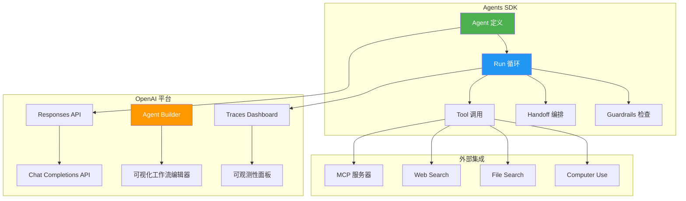

**SDK 在 OpenAI 生态中的位置：**

| 层级 | 组件 | 职责 |
|------|------|------|
| 底层 API | Responses API / Chat Completions API | LLM 调用 |
| 中间层 | **Agents SDK** | Agent 编排、工具管理、安全护栏 |
| 上层 | Agent Builder | 可视化编辑 + ChatKit 部署 |

**SDK vs Agent Builder 的选择：**
- **SDK：** 你的服务器拥有编排、工具执行、状态和审批控制权
- **Agent Builder：** 需要 OpenAI 托管的工作流创建、发布和 ChatKit 部署

## 1.3 与其他框架的对比

### 与 LangChain 的对比

| 维度 | OpenAI Agents SDK | LangChain |
|------|-------------------|-----------|
| 抽象层级 | 低 — 直接 API 调用 | 高 — LCEL 链式抽象 |
| 学习曲线 | 平缓 — 数小时上手 | 陡峭 — 需理解大量概念 |
| 多 Agent | Handoff + Agents-as-Tools 两种模式 | LangGraph 状态图 |
| 供应商 | 支持 100+ LLM，但偏向 OpenAI | 完全供应商无关 |
| 安全 | 内置 Guardrails | 需外部集成 |
| 适用场景 | OpenAI 生态下的轻量编排 | 复杂跨供应商工作流 |

### 与 CrewAI 的对比

| 维度 | OpenAI Agents SDK | CrewAI |
|------|-------------------|--------|
| 核心隐喻 | Agent + Handoff | Crew（团队）+ Role（角色）+ Task（任务） |
| 编排方式 | 代码直接定义流转 | YAML/代码定义角色和任务 |
| 复杂度 | 低 — 无额外概念 | 中 — 角色、流程、协作机制 |
| 协作模式 | Handoff（交接控制权） | Sequential/Hierarchical 流程 |
| 适合团队 | 开发者 | 非开发者（通过角色隐喻） |

### 与 AutoGen 的对比

| 维度 | OpenAI Agents SDK | AutoGen |
|------|-------------------|---------|
| 设计模式 | Handoff/Agents-as-Tools | ConversableAgent + Group Chat |
| 对话机制 | 控制权转移 | 消息传递（Actor 模型） |
| 复杂度 | 轻量级 | 重量级 — 三层架构 |
| 供应商 | 多供应商（偏向 OpenAI） | 完全供应商无关 |
| 适合场景 | 简单到中等多 Agent 工作流 | 复杂多 Agent 协作和对话 |

## 1.4 核心概念全景

| 概念 | 说明 |
|------|------|
| **Agent** | LLM + 指令 + 工具 + 安全护栏 + 交接配置的封装单元 |
| **Sandbox Agent** | v0.14.0 新增，预配置容器环境的 Agent，可执行文件/命令/包操作 |
| **Handoffs** | 将对话控制权转移给另一个 Agent（交接模式） |
| **Agents as Tools** | 管理者保持控制，将其他 Agent 作为工具调用（管理者模式） |
| **Tools** | 函数工具、MCP 服务器、托管工具（Web Search、File Search、Computer Use 等） |
| **Guardrails** | 输入/输出安全验证检查 |
| **Approvals** | 人工审核 — 在高风险操作前暂停等待人工确认 |
| **Sessions** | 自动管理跨轮次对话历史 |
| **Tracing** | 内置 Agent Run 追踪与可观测性 |
| **Results & State** | Run 对象输出、lastAgent、可恢复状态 |
| **Voice Agents** | 基于 gpt-realtime 的语音智能体 |

## 1.5 安装与环境

### Python

```bash
# 基础安装
pip install openai-agents

# 带语音支持
pip install 'openai-agents[voice]'

# 带 Redis 会话支持
pip install 'openai-agents[redis]'

# 使用 uv（更快）
uv init
uv add openai-agents
```

**要求：** Python 3.10+

### TypeScript

```bash
npm install @openai/agents zod
```

### API Key

```bash
export OPENAI_API_KEY=sk-...
```

## 1.6 快速入门

### 第一步：单 Agent 运行

```python
from agents import Agent, Runner

agent = Agent(
    name="History tutor",
    instructions="Answer history questions clearly and concisely.",
    model="gpt-5.4",
)
result = Runner.run_sync(agent, "When did the Roman Empire fall?")
print(result.final_output)
```

### 第二步：添加 Function Tool

```python
from agents import Agent, Runner, function_tool

@function_tool
def history_fun_fact() -> str:
    """Return a short history fact."""
    return "Sharks are older than trees."

agent = Agent(
    name="History tutor",
    instructions="Answer history questions clearly. Use history_fun_fact when it helps.",
    tools=[history_fun_fact],
)
result = Runner.run_sync(agent, "Tell me something surprising about ancient life on Earth.")
print(result.final_output)
```

### 第三步：添加 Handoff（多 Agent）

```python
from agents import Agent, Runner

history_tutor = Agent(
    name="History tutor",
    instructions="Answer history questions clearly and concisely.",
)
math_tutor = Agent(
    name="Math tutor",
    instructions="Explain math step by step and include worked examples.",
)
triage_agent = Agent.create(
    name="Homework triage",
    instructions="Route each homework question to the right specialist.",
    handoffs=[history_tutor, math_tutor],
)
result = Runner.run_sync(triage_agent, "Who was the first president of the United States?")
print(result.final_output)
print(result.last_agent?.name)  # "History tutor"
```

## 1.7 状态管理策略

| 需求 | 使用方式 | 说明 |
|------|----------|------|
| 保持完整对话历史 | `result.history` | 应用侧自行管理 |
| SDK 自动管理历史 | Session | SDK 加载和保存历史 |
| OpenAI 托管续传 | Server-managed continuation ID | OpenAI 管理续传状态 |
| 恢复暂停的 Run | `result.state` + `interruptions` | Approval 中断后的恢复 |

Handoff 后，复用 `last_agent` 作为下一轮的起点，保持 Specialist 的控制权。

## 1.8 本章小结

OpenAI Agents SDK 定位于 LangChain 和直接使用 API 之间的甜蜜点 — 提供足够的 Agent 编排能力，但保持 API 简洁。核心优势是：

1. **官方支持：** OpenAI 官方维护，第一时间支持新模型和特性
2. **极简设计：** 学习曲线平缓，数小时即可上手
3. **内置安全：** Guardrails 和 Approvals 原生支持
4. **可观测性：** Traces Dashboard 开箱即用
5. **双语言：** Python + TypeScript 统一概念模型

**常见误区：**
- 过度依赖 Agent Builder（可视化编辑器），失去代码灵活性
- 过早拆分多个 Agent（应从单 Agent 开始，逐步拆分）
- 忽视 Traces Dashboard（应尽早开启追踪调试）

---

**来源：**
1. [OpenAI Agents SDK 官方文档 — Overview](https://developers.openai.com/api/docs/guides/agents)
2. [OpenAI Agents SDK 官方文档 — Quickstart](https://developers.openai.com/api/docs/guides/agents/quickstart)
3. [GitHub — openai/openai-agents-python](https://github.com/openai/openai-agents-python)
4. [GitHub — openai/openai-agents-js](https://github.com/openai/openai-agents-js)
# 第 2 章 — 架构设计 — 轻量级多 Agent 架构

## 2.1 SDK 整体架构

OpenAI Agents SDK 采用三层架构设计：

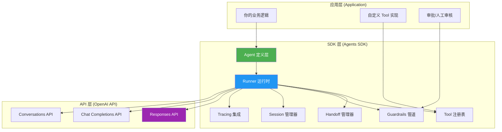

| 层级 | 职责 | 关键组件 |
|------|------|----------|
| 应用层 | 业务逻辑、自定义 Tool、人工审核 | 你的代码 |
| SDK 层 | Agent 定义、运行循环、工具管理、安全护栏 | Agent、Runner、Handoff、Guardrails、Session |
| API 层 | LLM 调用 | Responses API、Chat Completions API、Conversations API |

## 2.2 Agent 内部模型

每个 Agent 是一个封装单元，包含五个核心组件：

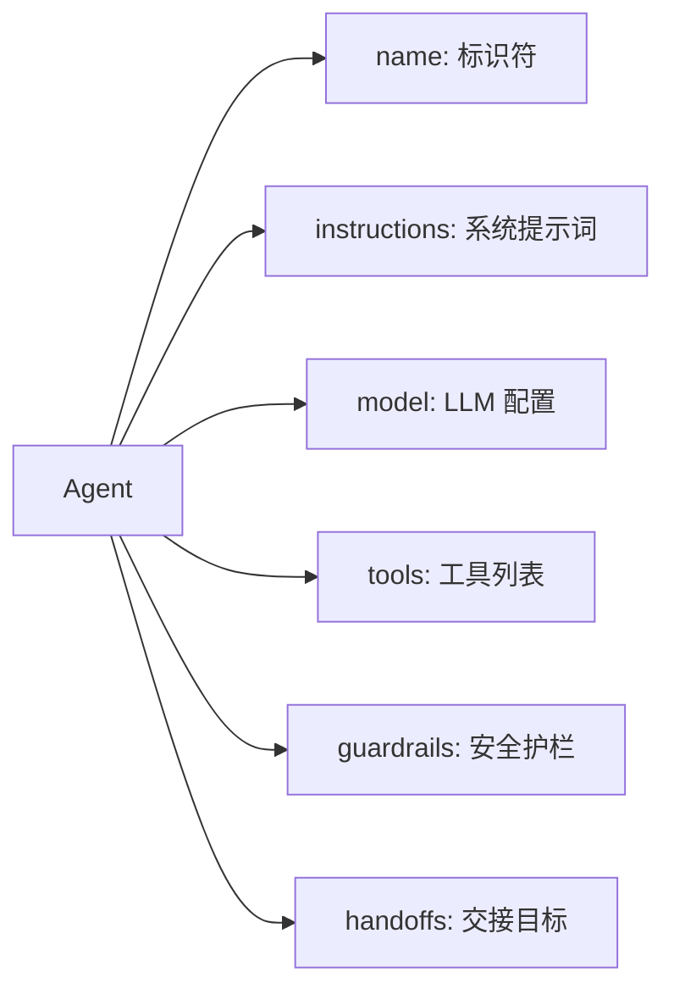

| 组件 | 类型 | 说明 |
|------|------|------|
| `name` | `string` | Agent 标识符，用于 Tracing 和调试 |
| `instructions` | `string` | 系统提示词，定义 Agent 行为和职责 |
| `model` | `string \| Model` | 使用的 LLM 模型，支持自定义 Provider |
| `tools` | `Tool[]` | 函数工具、MCP 服务器、托管工具 |
| `guardrails` | `Guardrail[]` | 输入/输出验证检查 |
| `handoffs` | `(Agent \| Handoff)[]` | 可交接到的其他 Agent |

## 2.3 Run 循环（Agent Loop）

SDK 的一次 Run 是一个应用级转（turn），Runner 内部维护循环直到达到停止点：

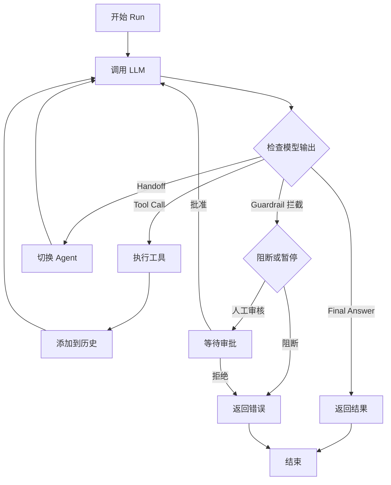

**循环规则：**
1. 用准备好的输入调用当前 Agent 的模型
2. 检查模型输出
3. 如果模型生成了 Tool Call → 执行工具 → 继续循环
4. 如果模型执行了 Handoff → 切换 Agent → 继续循环
5. 如果模型给出 Final Answer 且无需更多工作 → 返回结果

**关键理解：** Tool 调用、Handoff、审批、流式输出都构建在这个循环之上，而非替代它。

## 2.4 Responses API 集成

SDK 底层使用 OpenAI Responses API 作为主要传输通道。Responses API 是 Chat Completions API 的演进版本，提供更强大的功能：

| 特性 | Responses API | Chat Completions API |
|------|--------------|---------------------|
| 内置工具 | Web Search、File Search 等 | 仅 Function Calling |
| 状态管理 | Conversations API 托管 | 应用侧自行管理 |
| 流式输出 | 细粒度事件流 | 基础流式 |
| Agent 支持 | 原生支持 Handoff | 需手动实现 |

SDK 也兼容 Chat Completions API，可通过配置切换。

## 2.5 Provider-agnostic 设计

虽然由 OpenAI 官方维护，SDK 设计上支持多供应商：

```python
from agents import Agent, set_default_openai_client
from openai import OpenAI

# 使用兼容 OpenAI API 的非 OpenAI 模型
client = OpenAI(
    base_url="https://your-provider.com/v1",
    api_key="your-api-key",
)
set_default_openai_client(client)

# 自定义模型
agent = Agent(
    name="Custom Agent",
    instructions="...",
    model="your-model-name",
)
```

**支持的 Provider 类型：**
1. **OpenAI 原生：** gpt-5.4、gpt-5.4-mini 等
2. **OpenAI 兼容：** 任何实现了 OpenAI API 格式的服务（通过 `any-llm` 或 `LiteLLM` 集成）
3. **100+ LLM：** 通过 any-llm 和 LiteLLM 可选依赖

**可选依赖：**
| 依赖 | 用途 |
|------|------|
| `websockets` | WebSocket 模式 |
| `SQLAlchemy` | 持久化存储 |
| `any-llm` | 多供应商 LLM 支持 |
| `LiteLLM` | 多供应商 LLM 支持 |

## 2.6 四种状态管理策略

SDK 提供四种跨轮次状态管理方式：

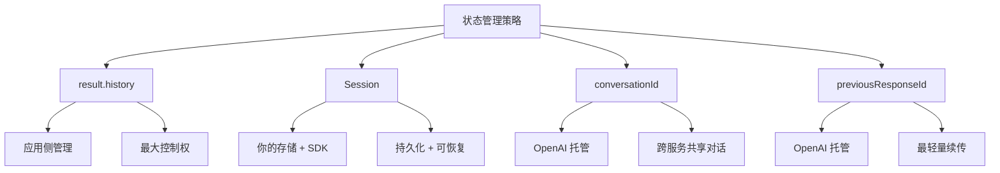

| 策略 | 状态位置 | 适用场景 | 下轮传入 |
|------|----------|----------|----------|
| `result.history` | 你的应用 | 小型对话、最大控制 | 完整历史 |
| `Session` | 你的存储 + SDK | 持久化、可恢复、自定义存储 | 同一 Session |
| `conversationId` | OpenAI Conversations API | 跨 Worker/Service 共享 | 同一 ID + 新输入 |
| `previousResponseId` | OpenAI Responses API | 最轻量续传 | 上次 Response ID + 新输入 |

**实践建议：** 每次对话选择一种策略。混合本地回放与服务器托管状态会重复上下文，除非刻意协调两层。

## 2.7 本章小结

OpenAI Agents SDK 架构核心是一个简单但强大的 Run 循环，所有高级特性（工具、Handoff、Guardrails）都在此循环上构建。设计原则是：

1. **一层抽象：** SDK 只做一件事 — 管理 Agent 运行循环
2. **直接 API：** 避免 LangChain 式的嵌套抽象
3. **可组合：** Tool、Handoff、Guardrails 均可独立使用
4. **可观测：** Traces 集成开箱即用

**常见误区：**
- 将 Agent 视为"一次调用"（实际是循环直到停止点）
- 混合多种状态管理策略（选一种，坚持使用）
- 忽视 Max-turn 限制（复杂 Agent 可能触发上限）

---

**来源：**
1. [OpenAI Agents SDK 官方文档 — Overview](https://developers.openai.com/api/docs/guides/agents)
2. [OpenAI Agents SDK 官方文档 — Running agents](https://developers.openai.com/api/docs/guides/agents/running-agents)
3. [OpenAI Agents SDK 官方文档 — Models and providers](https://developers.openai.com/api/docs/guides/agents/models)
4. [GitHub — openai/openai-agents-python](https://github.com/openai/openai-agents-python)
# 第 3 章 — Agent 设计 — 定义与配置

## 3.1 Agent 定义

Agent 是 SDK 的核心封装单元。定义方式有两种：

```python
from agents import Agent

# 方式一：构造函数（推荐）
agent = Agent(
    name="Research assistant",
    instructions="You are a helpful research assistant.",
    model="gpt-5.4",
    tools=[],
    guardrails=[],
    handoffs=[],
)

# 方式二：Agent.create（支持更多配置项）
agent = Agent.create(
    name="Research assistant",
    instructions="...",
    handoff_description="Handles research questions",  # 用于 Handoff 路由
    # ...
)
```

| 字段 | 类型 | 必需 | 说明 |
|------|------|------|------|
| `name` | `string` | 是 | Agent 标识符，用于 Tracing |
| `instructions` | `string` | 是 | 系统提示词 |
| `model` | `string` | 否 | 使用默认模型 |
| `tools` | `Tool[]` | 否 | 可用工具列表 |
| `guardrails` | `Guardrail[]` | 否 | 安全验证规则 |
| `handoffs` | `List[Agent | Handoff]` | 否 | 可交接的 Agent |
| `handoff_description` | `string` | 否 | 用于 Handoff 路由的描述 |

## 3.2 Instructions 设计原则

Instructions 是 Agent 的系统提示词，直接影响行为。设计原则：

```python
# ❌ 不好的 instructions — 过于宽泛
agent = Agent(
    name="Assistant",
    instructions="Be helpful.",
)

# ✅ 好的 instructions — 明确职责边界
agent = Agent(
    name="Billing specialist",
    instructions=(
        "You specialize in billing questions. "
        "Answer billing inquiries clearly and concisely. "
        "If the question is about refunds, escalate to the refund agent. "
        "Do not answer non-billing questions."
    ),
)
```

**设计规则：**
1. **窄化职责：** 每个 Agent 只做一件事
2. **明确边界：** 说明什么该做、什么不该做
3. **引用路由：** 指明何时使用 Handoff

## 3.3 模型配置

```python
from agents import Agent, set_default_openai_model

# 使用默认模型（全局设置）
set_default_openai_model("gpt-5.4")

# 为单个 Agent 指定模型
agent = Agent(
    name="Agent",
    instructions="...",
    model="gpt-5.4-mini",  # 覆盖默认
)

# 使用多供应商 LLM
from agents import set_default_openai_client
from openai import OpenAI

client = OpenAI(
    base_url="https://your-provider.com/v1",
    api_key="your-api-key",
)
set_default_openai_client(client)
```

**模型选择建议：**

| 场景 | 推荐模型 | 理由 |
|------|----------|------|
| 复杂推理 | `gpt-5.4` | 最强推理能力 |
| 日常对话 | `gpt-5.4-mini` | 速度快，成本低 |
| Triage/路由 | `gpt-5.4-mini` | 简单分类任务 |
| 成本敏感 | 任何兼容的轻量模型 | 通过 Provider 切换 |

## 3.4 Sandbox Agent（v0.14.0 新增）

Sandbox Agent 是预配置容器环境的 Agent，适用于需要执行文件操作、运行命令、安装包的场景。

```python
from agents import Runner
from agents.run import RunConfig
from agents.sandbox import Manifest, SandboxAgent, SandboxRunConfig
from agents.sandbox.entries import GitRepo
from agents.sandbox.sandboxes import UnixLocalSandboxClient

agent = SandboxAgent(
    name="Workspace Assistant",
    instructions="Inspect the sandbox workspace before answering.",
    default_manifest=Manifest(
        entries={
            "repo": GitRepo(repo="openai/openai-agents-python", ref="main"),
        }
    ),
)

result = Runner.run_sync(
    agent,
    "Inspect the repo README and summarize what this project does.",
    run_config=RunConfig(sandbox=SandboxRunConfig(client=UnixLocalSandboxClient())),
)
print(result.final_output)
```

### Sandbox Agent vs 普通 Agent

| 维度 | 普通 Agent | Sandbox Agent |
|------|-----------|---------------|
| 环境 | 无沙箱，仅文本交互 | 容器化环境 |
| 文件操作 | 不支持 | 支持 |
| 命令执行 | 不支持 | 支持 |
| 安装包 | 不支持 | 支持 |
| 快照 | 不支持 | 支持（状态保存/恢复） |
| 挂载 | 不支持 | 支持 |
| 长时间任务 | 适合短对话 | 适合长时工作 |

### Manifest 配置

```python
from agents.sandbox import Manifest
from agents.sandbox.entries import GitRepo, FileEntry, DirectoryEntry

manifest = Manifest(
    entries={
        "repo": GitRepo(repo="openai/openai-agents-python", ref="main"),
        "config": FileEntry(content="...", path="config.yaml"),
        "data": DirectoryEntry(path="data/"),
    }
)
```

## 3.5 Agent 生命周期

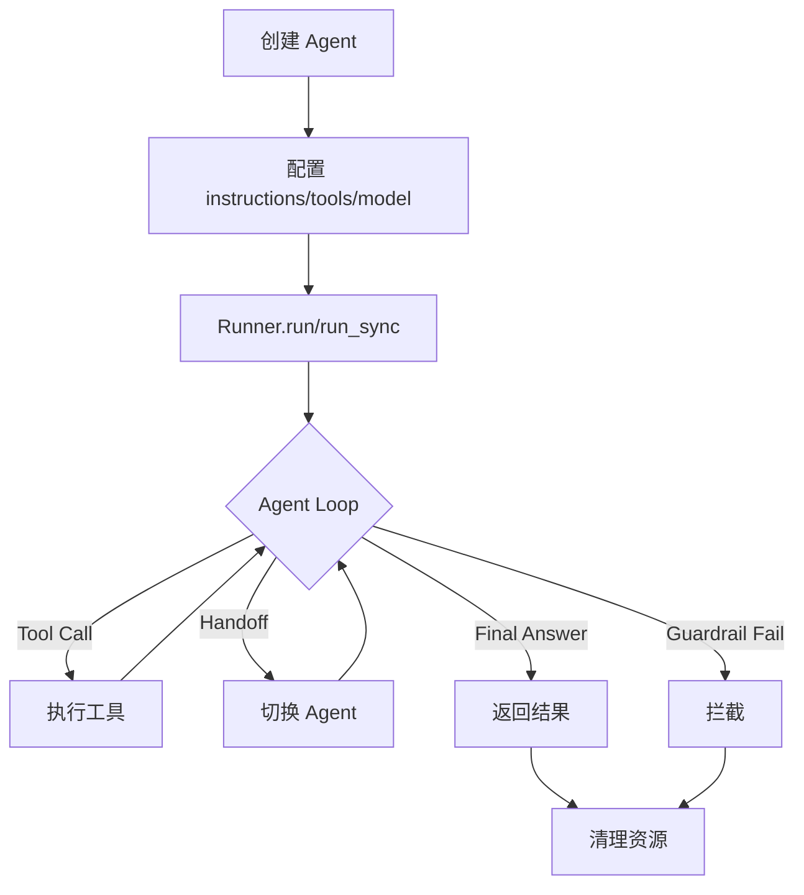

| 阶段 | 方法 | 说明 |
|------|------|------|
| 创建 | `Agent()` / `Agent.create()` | 定义 Agent 配置 |
| 运行 | `Runner.run()` / `Runner.run_sync()` | 执行 Agent |
| 流式 | `Runner.run_stream()` | 流式执行 |
| 结果 | `result.final_output` | 获取最终输出 |
| 状态 | `result.state` | 获取可恢复状态 |
| 历史 | `result.history` | 获取对话历史 |
| 最后 Agent | `result.last_agent` | 获取最后处理的 Agent |

## 3.6 输出结构化

Agent 可以输出结构化数据，配合 Pydantic 类型安全：

```python
from pydantic import BaseModel
from agents import Agent, Runner

class ResearchSummary(BaseModel):
    topic: str
    key_points: list[str]
    confidence: float

agent = Agent(
    name="Research assistant",
    instructions="Research the topic and return a structured summary.",
    output_type=ResearchSummary,  # 结构化输出
)
result = Runner.run_sync(agent, "Summarize the history of the internet.")
summary: ResearchSummary = result.final_output
print(summary.topic)
print(summary.key_points)
```

## 3.7 本章小结

Agent 设计的核心原则：

1. **单职责：** 每个 Agent 只做一件事
2. **明确边界：** Instructions 清晰定义职责范围
3. **从简开始：** 单 Agent 开始，需要时才拆分
4. **结构化输出：** 使用 Pydantic 保证类型安全
5. **Sandbox Agent：** 需要文件/命令操作时使用

**常见误区：**
- Instructions 过于宽泛（应窄化职责）
- 过早拆分多个 Agent（应先验证单 Agent 能力）
- 忽视 `handoff_description`（影响路由准确性）
- Sandbox Agent 用于不需要沙箱的场景（增加复杂度）

---

**来源：**
1. [OpenAI Agents SDK 官方文档 — Agent definitions](https://developers.openai.com/api/docs/guides/agents/define-agents)
2. [OpenAI Agents SDK 官方文档 — Sandbox agents](https://developers.openai.com/api/docs/guides/agents/sandboxes)
3. [GitHub — openai/openai-agents-python](https://github.com/openai/openai-agents-python)
# 第 4 章 — 编排模式 — Handoff 与 Agents as Tools

## 4.1 多 Agent 设计的核心问题

当工作流需要多个 Specialist 时，核心设计决策是：**谁拥有最终回复的控制权？**

OpenAI Agents SDK 提供两种编排模式：

| 模式 | 控制权 | 适用场景 |
|------|--------|----------|
| **Handoffs** | 转移到 Specialist | Specialist 应拥有下一步回复权 |
| **Agents as Tools** | 管理者保持控制 | Specialist 仅作为辅助能力 |

## 4.2 Handoff 模式 — 交接控制权

Handoff 将对话控制权从一个 Agent 完全转移给另一个 Specialist。

```python
from agents import Agent, handoff, Runner

# Specialist Agent
billing_agent = Agent(
    name="Billing agent",
    instructions="Handle billing questions and invoice inquiries.",
)
refund_agent = Agent(
    name="Refund agent",
    instructions="Process refund requests. Ask for order number.",
)

# Router/Triage Agent
triage_agent = Agent.create(
    name="Triage agent",
    instructions="Route each customer question to the right specialist.",
    handoffs=[billing_agent, handoff(refund_agent)],
)

result = Runner.run_sync(triage_agent, "I want a refund for order #12345")
print(result.final_output)
print(result.last_agent.name)  # "Refund agent"
```

### `handoff()` 函数

```python
from agents import handoff, Agent

# 默认 handoff — 使用 Agent 的 instructions
h = handoff(refund_agent)

# 自定义 handoff — 覆盖描述和输入过滤
h = handoff(
    refund_agent,
    handoff_description="Handles refund requests and processes refunds",
    # 可选：过滤传递给目标 Agent 的历史
    # on_invoke_handoff=...
)
```

### Handoff 设计原则

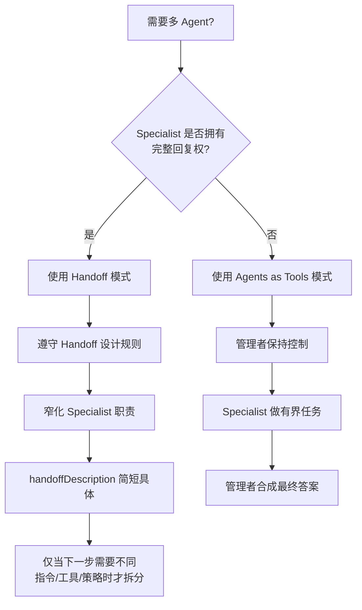

**规则：**
1. **窄化职责：** 每个 Specialist 只做一件事
2. **`handoff_description` 简短具体：** 直接影响路由准确性
3. **仅在必要时拆分：** 下一个分支确实需要不同指令、工具或策略时才拆分

## 4.3 Agents as Tools 模式 — 管理者保持控制

管理者保持对话控制权，将 Specialist 作为工具调用：

```python
from agents import Agent, Runner

# Specialist — 作为工具使用
summarizer = Agent(
    name="Summarizer",
    instructions="Generate a concise summary of the supplied text.",
)

# Manager — 拥有最终回复权
main_agent = Agent(
    name="Research assistant",
    instructions="Research and synthesize a comprehensive answer.",
    tools=[
        summarizer.as_tool(
            tool_name="summarize_text",
            tool_description="Generate a concise summary of the supplied text.",
        ),
    ],
)

result = Runner.run_sync(main_agent, "Summarize this article...")
print(result.final_output)
# main_agent 合成最终答案，summarizer 仅提供辅助
```

### 何时使用 Agents as Tools

以下情况通常更适合 Agents as Tools：

1. **管理者应合成最终答案**
2. **Specialist 做有界任务**（如摘要、分类）
3. **需要一个稳定的外部工作流**，内部嵌套 Specialist 调用而非控制权转移

### Handoff vs Agents as Tools 对比

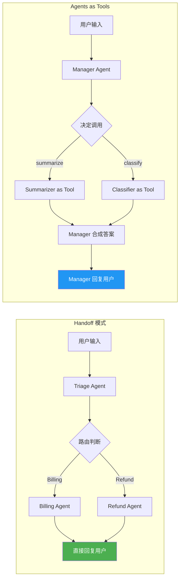

| 维度 | Handoff | Agents as Tools |
|------|---------|-----------------|
| 最终回复权 | Specialist | Manager |
| 路由方式 | Agent 自主判断 | Manager 调用工具 |
| 适用场景 | Specialist 拥有完整上下文 | Bounded task |
| 复杂度 | 较低 — 直接交接 | 较高 — Manager 需合成 |
| 调试 | 每个 Agent 独立 Trace | 单一 Trace 内含工具调用 |

## 4.4 复杂工作流设计

### Triage → Specialist → Synthesizer 模式

```python
from agents import Agent, handoff, Runner

# Specialists
researcher = Agent(
    name="Researcher",
    instructions="Research the topic thoroughly and provide detailed findings.",
)
fact_checker = Agent(
    name="Fact checker",
    instructions="Verify claims and identify inaccuracies.",
)

# Synthesizer
writer = Agent(
    name="Writer",
    instructions="Synthesize research findings into a clear, concise article.",
)

# Router
triage = Agent.create(
    name="Editorial triage",
    instructions="Route content work: research → fact-check → writing.",
    handoffs=[researcher, fact_checker, handoff(writer)],
)

result = Runner.run_sync(triage, "Write an article about quantum computing.")
```

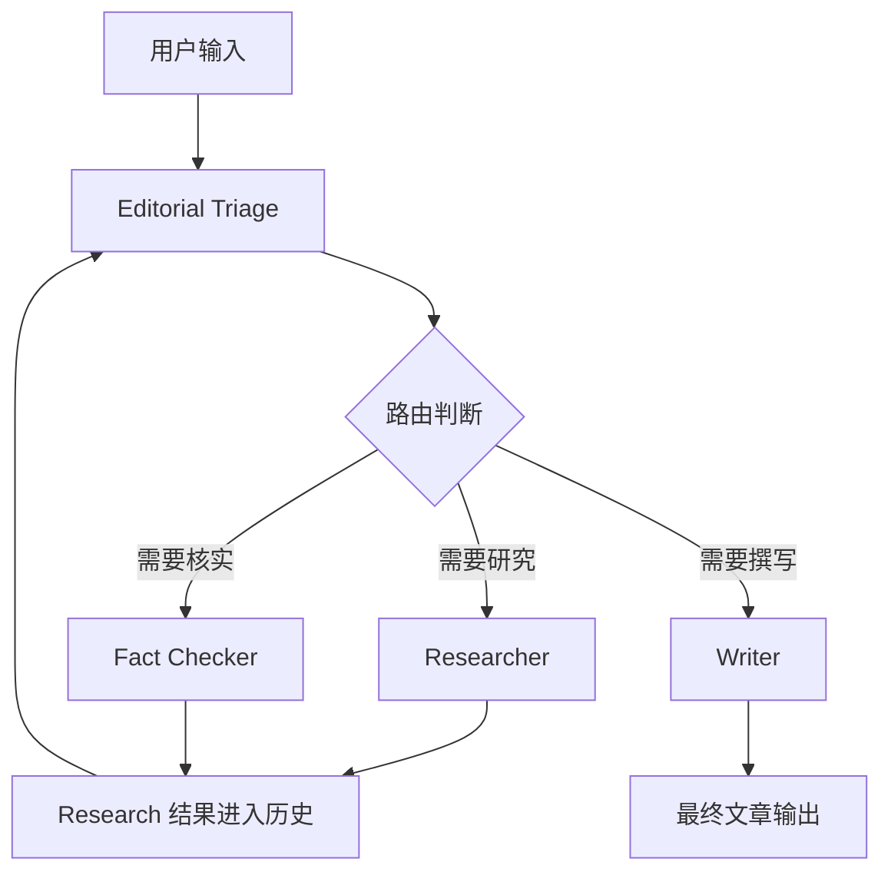

### 带状态传递的 Handoff

Handoff 可以携带结构化元数据或过滤后的历史：

```python
from agents import Agent, handoff, Runner

def on_handoff(context, input_data):
    """Handoff 时传递结构化数据。"""
    return {"previous_analysis": context.get("analysis")}

specialist = Agent(
    name="Specialist",
    instructions="Continue from the previous analysis.",
)
h = handoff(specialist, on_invoke_handoff=on_handoff)
```

## 4.5 何时不该拆分 Agent

**过早拆分的代价：**
- 更多 Prompt（每个 Agent 独立 instructions）
- 更多 Trace（调试复杂度增加）
- 更多审批面（Guardrails 重复配置）
- **不一定改善工作流质量**

**应该拆分的信号：**
1. **能力隔离：** 不同任务需要完全不同的能力集
2. **策略隔离：** 不同任务需要不同的安全策略
3. **Prompt 清晰：** 单一 Agent 的 Instructions 变得混乱
4. **Trace 可读性：** 需要独立追踪不同任务的执行

**不应拆分的信号：**
1. 单一 Instructions 能清晰描述所有职责
2. 工具调用足以覆盖所有能力
3. 没有明确的所有权边界

## 4.6 本章小结

OpenAI Agents SDK 的编排哲学：**从简开始，按需拆分**。

1. **两种模式：** Handoff（交接控制）和 Agents as Tools（管理者保持控制）
2. **设计规则：** 窄化职责、描述具体、仅在必要时拆分
3. **复杂工作流：** Triage → Specialist → Synthesizer 模式
4. **状态传递：** Handoff 可携带结构化元数据

**常见误区：**
- 过早拆分 Agent（应从单 Agent 开始）
- `handoff_description` 过于模糊（直接影响路由准确性）
- 混淆 Handoff 和 Agents as Tools（核心区别是谁拥有最终回复权）
- 过度使用 Handoff（导致 Agent 链过长，难以调试）

---

**来源：**
1. [OpenAI Agents SDK 官方文档 — Orchestration and handoffs](https://developers.openai.com/api/docs/guides/agents/orchestration)
2. [OpenAI Agents SDK 官方文档 — Running agents](https://developers.openai.com/api/docs/guides/agents/running-agents)
3. [OpenAI Agents SDK 官方文档 — Results and state](https://developers.openai.com/api/docs/guides/agents/results)
4. [GitHub — openai/openai-agents-python](https://github.com/openai/openai-agents-python)
# 第 5 章 — 工具与集成 — MCP、Function Tools、托管工具

## 5.1 工具系统全景

### 概念定义

工具（Tools）是 Agent 采取行动的桥梁。OpenAI Agents SDK 将工具分为 **五大类**：

| 类别 | 执行位置 | 典型用途 |
|------|----------|----------|
| **Hosted OpenAI 工具** | OpenAI 服务器 | Web Search、File Search、Code Interpreter、Hosted MCP、Image Generation |
| **Local/Runtime 工具** | 本地或托管容器 | ComputerTool、ShellTool、ApplyPatchTool |
| **Function Tools** | 本地 Python 进程 | 任意 Python 函数封装为工具 |
| **Agents as Tools** | 本地 Python 进程 | 将一个 Agent 作为工具调用（不交接控制权） |
| **Codex 工具（实验性）** | Codex CLI | 工作区范围内的代码任务 |

### 工具决策树

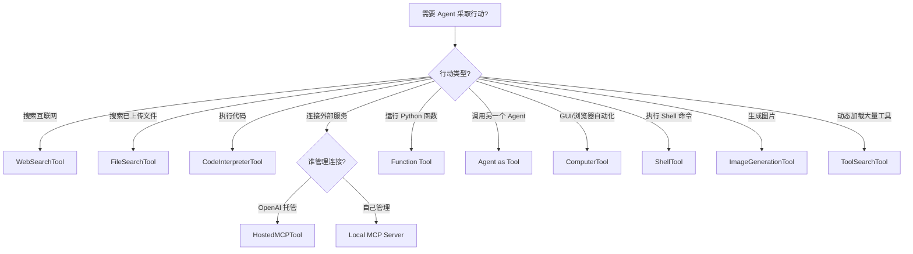

> **信息来源：**
> - https://github.com/openai/openai-agents-python/blob/main/docs/tools.md
> - https://developers.openai.com/api/docs/guides/tools

---

## 5.2 Function Tools — 将 Python 函数变为 Agent 工具

### 5.2.1 `@function_tool` 装饰器

**概念：** 最简单的工具创建方式。任何 Python 函数加上 `@function_tool` 装饰器后，SDK 自动完成：
- 函数名 → 工具名
- 函数 docstring → 工具描述
- 函数签名 + 类型注解 → JSON Schema（通过 `inspect` + `pydantic` + `griffe`）

```python
from agents import Agent, Runner, function_tool

@function_tool
async def fetch_weather(city: str) -> str:
    """Fetch the weather for a given city.

    Args:
        city: The city name to fetch weather for.
    """
    # 实际应用中应调用天气 API
    return f"{city} 今天晴, 25°C"

agent = Agent(
    name="WeatherBot",
    instructions="你是一个天气助手。",
    tools=[fetch_weather],
)

result = Runner.run_sync(agent, "北京天气怎么样?")
print(result.final_output)
```

### 5.2.2 高级用法与定制

**自定义工具名称：**
```python
@function_tool(name_override="fetch_data")
def read_file(path: str, directory: str | None = None) -> str:
    """读取文件内容。"""
    return "<file contents>"
```

**带运行上下文的函数：** 函数第一个参数可以是 `RunContextWrapper[Any]`，SDK 自动注入当前运行上下文。
```python
from agents import RunContextWrapper, function_tool
from typing import Any

@function_tool
def read_file(ctx: RunContextWrapper[Any], path: str) -> str:
    """读取文件，可访问 ctx.context 中的业务数据。"""
    return f"读取 {path}"
```

**使用 Pydantic Field 添加约束：**
```python
from typing import Annotated
from pydantic import Field
from agents import function_tool

@function_tool
def score_a(score: int = Field(..., ge=0, le=100, description="0-100 的分数")) -> str:
    return f"Score recorded: {score}"

# 或 Annotated 形式
@function_tool
def score_b(score: Annotated[int, Field(..., ge=0, le=100, description="0-100 的分数")]) -> str:
    return f"Score recorded: {score}"
```

### 5.2.3 自定义 FunctionTool

当不想用 Python 函数时，可以直接创建 `FunctionTool`：

```python
from pydantic import BaseModel
from agents import RunContextWrapper, FunctionTool

class FunctionArgs(BaseModel):
    username: str
    age: int

async def run_function(ctx: RunContextWrapper, args: str) -> str:
    parsed = FunctionArgs.model_validate_json(args)
    return f"{parsed.username} is {parsed.age} years old"

tool = FunctionTool(
    name="process_user",
    description="处理用户数据",
    params_json_schema=FunctionArgs.model_json_schema(),
    on_invoke_tool=run_function,
)
```

### 5.2.4 错误处理

```python
from agents import function_tool, RunContextWrapper
from typing import Any

def my_custom_error(context: RunContextWrapper[Any], error: Exception) -> str:
    """自定义错误处理函数。"""
    return "发生内部错误，请稍后重试。"

@function_tool(failure_error_function=my_custom_error)
def get_user_profile(user_id: str) -> str:
    """获取用户档案。"""
    if user_id == "user_123":
        return "用户档案获取成功。"
    raise ValueError(f"无法获取用户 {user_id} 的档案。")
```

**`failure_error_function` 的三种模式：**
- **默认值（不传）**：使用 SDK 内置的 `default_tool_error_function`，告诉 LLM 发生了错误
- **自定义函数**：传入自己的错误处理函数
- **传 `None`**：错误向上抛出，由调用方捕获（可能是 `ModelBehaviorError`、`UserError` 等）

### 5.2.5 超时控制

```python
import asyncio
from agents import Agent, Runner, ToolTimeoutError, function_tool

# 默认行为：超时后返回超时消息给模型（模型可自行恢复）
@function_tool(timeout=2.0)
async def slow_lookup(query: str) -> str:
    await asyncio.sleep(10)
    return f"Result for {query}"

# 严格失败模式：超时直接抛出 ToolTimeoutError
@function_tool(timeout=1.5, timeout_behavior="raise_exception")
async def strict_tool() -> str:
    await asyncio.sleep(5)
    return "done"

agent = Agent(name="Demo", tools=[strict_tool])
try:
    await Runner.run(agent, "Run the tool")
except ToolTimeoutError as e:
    print(f"{e.tool_name} 在 {e.timeout_seconds} 秒后超时")
```

> **注意：** 超时配置仅支持异步 `@function_tool` 处理器。

### 5.2.6 返回文件/图像

Function Tool 除了返回字符串，还可以返回图像或文件内容：

```python
from agents import function_tool, ToolOutputImage, ToolOutputFileContent

@function_tool
def generate_chart(data: str) -> list:
    """生成图表并返回图像。"""
    return [
        ToolOutputImage(image_url="https://example.com/chart.png"),
        "图表已生成。",
    ]
```

### 常见误区

| 误区 | 正确理解 |
|------|----------|
| 函数名就是工具名 | 可以用 `name_override` 覆盖，且 SDK 会检查名称冲突 |
| Docstring 可有可无 | Docstring 是工具描述和参数描述的来源，缺失会显著影响模型理解 |
| 参数类型可以随意 | SDK 通过 `inspect` + `pydantic` 自动构建 JSON Schema，类型错误会导致工具注册失败 |
| 同步和异步函数没区别 | 只有异步函数支持 `timeout` 参数 |

---

## 5.3 托管工具 — OpenAI 平台内置能力

### 5.3.1 Web Search

**概念：** 让模型在生成回答前搜索互联网获取最新信息。

```python
from agents import Agent, Runner, WebSearchTool

agent = Agent(
    name="Research Assistant",
    tools=[WebSearchTool()],
)
result = Runner.run_sync(agent, "今天有什么正面新闻？")
print(result.final_output)
```

**Web Search 的三种模式：**

| 模式 | 说明 | 适用场景 |
|------|------|----------|
| **非推理搜索** | 模型直接将查询传给搜索工具，返回 top 结果 | 快速查询 |
| **代理式搜索（推理模型）** | 模型主动管理搜索过程，可迭代分析结果并决定是否继续搜索 | 复杂工作流 |
| **深度研究** | 推理模型执行长时间深度调查，可访问数百个来源 | 研究报告 |

**高级配置 — 域名过滤：**
```python
from agents import WebSearchTool

# 仅允许医学相关域名
web_search = WebSearchTool(
    filters={
        "allowed_domains": [
            "pubmed.ncbi.nlm.nih.gov",
            "clinicaltrials.gov",
            "www.who.int",
        ],
        "blocked_domains": ["reddit.com", "quora.com"],
    }
)
```

**高级配置 — 用户位置：**
```python
web_search = WebSearchTool(
    user_location={
        "type": "approximate",
        "country": "CN",
        "city": "Beijing",
    }
)
```

**高级配置 — 离线模式：**
```python
# external_web_access=False 时仅使用缓存/索引结果
web_search = WebSearchTool(external_web_access=False)
```

### 5.3.2 File Search

**概念：** 从 OpenAI Vector Store 中搜索已上传文件的上下文。

```python
from agents import Agent, FileSearchTool, Runner

agent = Agent(
    name="Knowledge Assistant",
    tools=[
        FileSearchTool(
            max_num_results=3,
            vector_store_ids=["VECTOR_STORE_ID"],
            # 可选：
            # filters={"type": "document", "created_at": {"gte": "2025-01-01"}},
            # ranking_options={"ranker": "auto", "score_threshold": 0.5},
            # include_search_results=True,  # 在结果中包含原始搜索条目
        ),
    ],
)

result = Runner.run_sync(agent, "我们的产品文档中关于退款政策是怎么说的？")
```

### 5.3.3 Shell — 本地与托管容器

**本地执行：**
```python
from agents import Agent, ShellTool

async def run_shell(request):
    """自定义 Shell 执行逻辑。"""
    return "shell output"

agent = Agent(
    name="DevOps Assistant",
    tools=[ShellTool(executor=run_shell)],
)
```

**托管容器执行：**
```python
from agents import Agent, Runner, ShellTool, ShellToolSkillReference

csv_skill: ShellToolSkillReference = {
    "type": "skill_reference",
    "skill_id": "skill_698bbe879adc81918725cbc69dcae7960bc5613dadaed377",
    "version": "1",
}

agent = Agent(
    name="Container shell agent",
    model="gpt-5.4",
    tools=[
        ShellTool(
            environment={
                "type": "container_auto",
                "network_policy": {"type": "disabled"},
                "skills": [csv_skill],
            }
        )
    ],
)
```

托管容器模式特点：
- `container_auto`：自动创建容器
- `container_reference`：复用已有容器
- 可配置网络策略（`disabled` / `allowlist`）
- 可挂载 Skills 和文件

### 5.3.4 Computer Use — GUI 自动化

**概念：** 让模型控制计算机界面（点击、输入、截图等）。

```python
from agents.computer import AsyncComputer

class PlaywrightComputer(AsyncComputer):
    environment = "browser"
    dimensions = (1024, 768)

    async def screenshot(self): ...
    async def click(self, x, y, button): ...
    async def type(self, text): ...
    # ... 实现其他必需方法
```

`gpt-5.4` 使用 GA 的 `{"type": "computer"}` 载荷；旧版 `computer-use-preview` 模型使用预览载荷。SDK 根据有效模型自动选择正确格式。

### 5.3.5 Code Interpreter

```python
from agents import Agent, CodeInterpreterTool

agent = Agent(
    name="Data Analysis Assistant",
    tools=[CodeInterpreterTool()],
)
```

让 LLM 在沙箱环境中执行代码，适合数据分析和计算任务。

### 5.3.6 Image Generation

```python
from agents import Agent, ImageGenerationTool

agent = Agent(
    name="Creative Assistant",
    tools=[ImageGenerationTool()],
)
```

使用 GPT Image 从文本提示生成图像。

### 5.3.7 Skills — 可复用的技能包

Skills 是 OpenAI 提供的版本化技能包，在托管 Shell 环境中运行。通过 `ShellToolSkillReference` 引用。

```python
from agents import Agent, Runner, ShellTool, ShellToolSkillReference

# 引用一个已有 skill
csv_analysis_skill: ShellToolSkillReference = {
    "type": "skill_reference",
    "skill_id": "skill_698bbe879adc81918725cbc69dcae7960bc5613dadaed377",
    "version": "1",
}

agent = Agent(
    name="Data Analyst",
    tools=[
        ShellTool(
            environment={
                "type": "container_auto",
                "skills": [csv_analysis_skill],
            }
        )
    ],
)
```

---

## 5.4 MCP 集成 — Model Context Protocol

### 5.4.1 概念定义

**MCP（Model Context Protocol）** 是一个开放协议，标准化应用程序如何向 LLM 提供上下文和工具。官方比喻：MCP 就像 AI 应用的 USB-C 接口——标准化连接 AI 模型到不同数据源和工具。

### 5.4.2 MCP 集成方式矩阵

| 你需要… | 推荐方案 | SDK 类 |
|---------|----------|--------|
| 让 OpenAI 基础设施代为调用公网 MCP 服务器 | **Hosted MCP** | `HostedMCPTool` |
| 连接自建的 Streamable HTTP MCP 服务器 | **Streamable HTTP** | `MCPServerStreamableHttp` |
| 连接旧版 HTTP/SSE MCP 服务器 | **SSE**（已弃用） | `MCPServerSse` |
| 启动本地子进程通信 | **stdio** | `MCPServerStdio` |

### 5.4.3 Hosted MCP — OpenAI 托管

**最简单的 Hosted MCP 示例：**
```python
import asyncio
from agents import Agent, HostedMCPTool, Runner

async def main():
    agent = Agent(
        name="Assistant",
        tools=[
            HostedMCPTool(
                tool_config={
                    "type": "mcp",
                    "server_label": "gitmcp",
                    "server_url": "https://gitmcp.io/openai/codex",
                    "require_approval": "never",
                }
            )
        ],
    )
    result = await Runner.run(agent, "这个仓库是用什么语言写的？")
    print(result.final_output)

asyncio.run(main())
```

**Connector 方式（OpenAI 维护的封装）：**
```python
import os
from agents import HostedMCPTool

HostedMCPTool(
    tool_config={
        "type": "mcp",
        "server_label": "google_calendar",
        "connector_id": "connector_googlecalendar",
        "authorization": os.environ["GOOGLE_CALENDAR_AUTHORIZATION"],
        "require_approval": "never",
    }
)
```

**可用 Connector 列表：**

| 服务 | Connector ID |
|------|-------------|
| Dropbox | `connector_dropbox` |
| Gmail | `connector_gmail` |
| Google Calendar | `connector_googlecalendar` |
| Google Drive | `connector_googledrive` |
| Microsoft Teams | `connector_microsoftteams` |
| Outlook Calendar | `connector_outlookcalendar` |
| Outlook Email | `connector_outlookemail` |
| SharePoint | `connector_sharepoint` |

### 5.4.4 本地 MCP — Streamable HTTP（推荐）

```python
import asyncio
import os
from agents import Agent, Runner, ModelSettings
from agents.mcp import MCPServerStreamableHttp

async def main():
    token = os.environ["MCP_SERVER_TOKEN"]
    async with MCPServerStreamableHttp(
        name="My MCP Server",
        params={
            "url": "http://localhost:8000/mcp",
            "headers": {"Authorization": f"Bearer {token}"},
            "timeout": 10,
        },
        cache_tools_list=True,       # 缓存工具列表，减少延迟
        max_retry_attempts=3,        # 自动重试
    ) as server:
        agent = Agent(
            name="Assistant",
            instructions="使用 MCP 工具回答问题。",
            mcp_servers=[server],
            model_settings=ModelSettings(tool_choice="required"),
        )
        result = await Runner.run(agent, "计算 7 + 22。")
        print(result.final_output)

asyncio.run(main())
```

### 5.4.5 本地 MCP — stdio

```python
from pathlib import Path
from agents import Agent, Runner
from agents.mcp import MCPServerStdio

samples_dir = Path("/path/to/sample_files")

async with MCPServerStdio(
    name="Filesystem Server",
    params={
        "command": "npx",
        "args": ["-y", "@modelcontextprotocol/server-filesystem", str(samples_dir)],
    },
) as server:
    agent = Agent(
        name="Assistant",
        instructions="使用 sample 目录中的文件回答问题。",
        mcp_servers=[server],
    )
    result = await Runner.run(agent, "列出可用的文件。")
    print(result.final_output)
```

### 5.4.6 MCP Server Manager — 多服务器管理

```python
from agents import Agent, Runner
from agents.mcp import MCPServerManager, MCPServerStreamableHttp

servers = [
    MCPServerStreamableHttp(name="calendar", params={"url": "http://localhost:8000/mcp"}),
    MCPServerStreamableHttp(name="docs", params={"url": "http://localhost:8001/mcp"}),
]

async with MCPServerManager(servers) as manager:
    agent = Agent(
        name="Assistant",
        instructions="使用可用的 MCP 工具。",
        mcp_servers=manager.active_servers,  # 仅包含成功连接的服务器
    )
    result = await Runner.run(agent, "有哪些 MCP 工具可用？")
    print(result.final_output)
```

### 5.4.7 MCP 工具过滤

**静态过滤：**
```python
from agents.mcp import MCPServerStdio, create_static_tool_filter

server = MCPServerStdio(
    params={"command": "npx", "args": ["-y", "@modelcontextprotocol/server-filesystem", "/data"]},
    tool_filter=create_static_tool_filter(allowed_tool_names=["read_file", "write_file"]),
)
```

**动态过滤：**
```python
from agents.mcp import MCPServerStdio, ToolFilterContext

def context_aware_filter(context: ToolFilterContext, tool) -> bool:
    # 根据当前 Agent 名称过滤
    if context.agent.name == "Code Reviewer" and tool.name.startswith("danger_"):
        return False
    return True

server = MCPServerStdio(
    params={"command": "npx", "args": ["-y", "@modelcontextprotocol/server-filesystem", "/data"]},
    tool_filter=context_aware_filter,
)
```

### 5.4.8 MCP 安全注意事项

> **重要：** 任何远程 MCP 服务器都可以访问进入模型上下文的所有数据。恶意的 MCP 服务器可能窃取敏感信息。使用前务必审查服务器代码和数据来源。

---

## 5.5 Tool Search — 动态工具加载

### 5.5.1 概念定义

**Tool Search** 让模型在运行时动态搜索并加载工具子集到上下文中，避免一次性加载所有工具定义。这可以显著降低 Token 消耗和成本。

**仅 `gpt-5.4` 及后续模型支持。**

### 5.5.2 工作原理

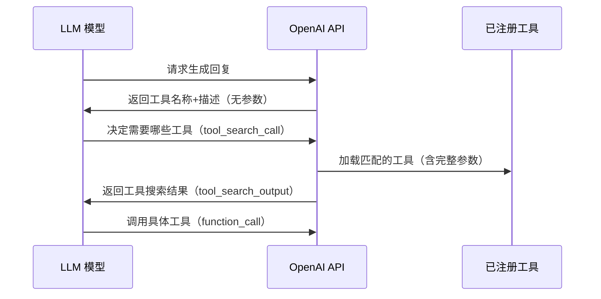

**关键机制：**
- 初始阶段模型只看到 namespace/MCP server 的名称和描述
- 当模型决定需要某类工具时，通过 `tool_search_call` 请求加载
- 加载的工具注入到上下文**末尾**，保持已有缓存不被破坏
- 未加载的工具不可用

### 5.5.3 SDK 层使用方式

```python
from typing import Annotated
from agents import Agent, Runner, ToolSearchTool, function_tool, tool_namespace

# 使用 defer_loading=True 标记延迟加载的工具
@function_tool(defer_loading=True)
def get_customer_profile(customer_id: Annotated[str, "客户 ID"]) -> str:
    """获取 CRM 客户档案。"""
    return f"profile for {customer_id}"

@function_tool(defer_loading=True)
def list_open_orders(customer_id: Annotated[str, "客户 ID"]) -> str:
    """列出客户的未结订单。"""
    return f"open orders for {customer_id}"

# 使用 tool_namespace 组织相关工具
crm_tools = tool_namespace(
    name="crm",
    description="CRM 客户查询和订单管理工具。",
    tools=[get_customer_profile, list_open_orders],
)

agent = Agent(
    name="Operations assistant",
    model="gpt-5.4",
    instructions="在使用 CRM 工具前先加载 crm namespace。",
    tools=[*crm_tools, ToolSearchTool()],
)

result = await Runner.run(agent, "查找 customer_42 并列出他们的未结订单。")
print(result.final_output)
```

### 5.5.4 最佳实践

| 实践 | 说明 |
|------|------|
| **优先使用 namespace** | 模型主要在 namespace/MCP server 层面做搜索训练，Token 节省更显著 |
| **每个 namespace < 10 个函数** | 保持 namespace 精简，提升模型搜索精度 |
| **namespace 描述清晰** | 描述决定了模型能否正确选择加载哪些工具 |
| **混合模式** | namespace 内可同时包含立即加载和延迟加载的工具 |
| **避免 `tool_choice` 指向 namespace** | Named tool_choice 不能指向纯 namespace 名称或仅延迟加载的工具 |

### 常见误区

| 误区 | 正确理解 |
|------|----------|
| Tool Search 适合所有模型 | 仅 `gpt-5.4` 及以上支持 |
| 延迟加载后工具完全不可见 | 模型仍能看到工具名和描述，只是参数 schema 被延迟加载 |
| 加载的工具会自动替换已有工具 | 新工具注入到上下文末尾，不替换已有工具 |
| 可以无限制加载工具 | 每个 namespace 建议不超过 10 个函数，否则影响搜索精度 |

---

## 5.6 Agents as Tools — Agent 作为工具

### 概念定义

将一个 Agent 作为另一个 Agent 的工具，管理者保持对话控制权，Specialist 仅辅助完成任务。与 Handoff 不同，**控制权不转移**。

```python
from agents import Agent, Runner
import asyncio

spanish_agent = Agent(
    name="Spanish agent",
    instructions="将用户消息翻译为西班牙语。",
)

french_agent = Agent(
    name="French agent",
    instructions="将用户消息翻译为法语。",
)

orchestrator = Agent(
    name="Orchestrator",
    instructions=(
        "你是翻译助手。使用提供的工具进行翻译。"
        "如需多种翻译，调用相应工具。"
    ),
    tools=[
        spanish_agent.as_tool(
            tool_name="translate_to_spanish",
            tool_description="将消息翻译为西班牙语。",
        ),
        french_agent.as_tool(
            tool_name="translate_to_french",
            tool_description="将消息翻译为法语。",
        ),
    ],
)

async def main():
    result = await Runner.run(orchestrator, "用西班牙语说'你好吗？'")
    print(result.final_output)

asyncio.run(main())
```

### 5.6.1 结构化输入

默认 `as_tool()` 接收字符串输入（`{"input": "..."}`），可通过 `parameters` 暴露结构化 schema：

```python
from pydantic import BaseModel, Field

class TranslationInput(BaseModel):
    text: str = Field(description="要翻译的文本。")
    source: str = Field(description="源语言。")
    target: str = Field(description="目标语言。")

translator_tool = translator_agent.as_tool(
    tool_name="translate_text",
    tool_description="在语言间翻译文本。",
    parameters=TranslationInput,
    include_input_schema=True,  # 在工具描述中包含完整 JSON Schema
)
```

### 5.6.2 自定义输出提取

```python
from agents import RunResult, ToolCallOutputItem

async def extract_json_payload(run_result: RunResult) -> str:
    """从子 Agent 输出中提取 JSON 载荷。"""
    for item in reversed(run_result.new_items):
        if isinstance(item, ToolCallOutputItem) and item.output.strip().startswith("{"):
            return item.output.strip()
    return "{}"

json_tool = data_agent.as_tool(
    tool_name="get_data_json",
    tool_description="运行数据 Agent 并返回 JSON。",
    custom_output_extractor=extract_json_payload,
)
```

### 5.6.3 条件启用

```python
from agents import Agent, Runner, RunContextWrapper
from pydantic import BaseModel

class LanguageContext(BaseModel):
    language_preference: str = "french_spanish"

def french_enabled(ctx: RunContextWrapper[LanguageContext], agent) -> bool:
    return ctx.context.language_preference == "french_spanish"

orchestrator = Agent(
    name="Orchestrator",
    tools=[
        spanish_agent.as_tool(tool_name="respond_spanish", tool_description="用西班牙语回复", is_enabled=True),
        french_agent.as_tool(tool_name="respond_french", tool_description="用法语回复", is_enabled=french_enabled),
    ],
)
```

`is_enabled` 接受布尔值、同步函数或异步函数。禁用的工具对 LLM 完全不可见。

---

## 5.7 可观测性集成 — Tracing 与监控

### 5.7.1 Tracing 架构

OpenAI Agents SDK 内置完整的可观测性系统，自动采集 Agent 运行期间的关键事件：

| Span 类型 | 捕获内容 |
|-----------|----------|
| `agent_span()` | Agent 执行信息（名称、指令等） |
| `generation_span()` | LLM 调用详情（输入/输出、token 消耗） |
| `function_span()` | 函数工具调用的输入/输出 |
| `guardrail_span()` | 护栏触发与结果 |
| `handoff_span()` | Agent 交接信息 |
| `transcription_span()` | 语音转文本 |
| `speech_span()` | 文本转语音 |
| `custom_span()` | 用户自定义事件 |

**Span 层级关系：**

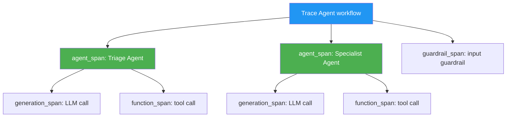

### 5.7.2 控制 Tracing

**全局禁用：**
```python
# 环境变量
export OPENAI_AGENTS_DISABLE_TRACING=1

# 代码中
from agents import set_tracing_disabled
set_tracing_disabled(True)
```

**单次运行禁用：**
```python
from agents import Runner, RunConfig

result = await Runner.run(
    agent,
    "Hello",
    run_config=RunConfig(tracing_disabled=True),
)
```

**敏感数据控制：**
```python
# 禁用敏感数据采集（输入/输出内容）
run_config = RunConfig(trace_include_sensitive_data=False)

# 或环境变量
export OPENAI_AGENTS_TRACE_INCLUDE_SENSITIVE_DATA=false
```

### 5.7.3 长运行与即时刷新

默认的 `BatchTraceProcessor` 在后台批量导出。长运行 worker（Celery、FastAPI background task）可能需要手动刷新：

```python
from agents import Runner, flush_traces, trace

@celery_app.task
def run_agent_task(prompt: str):
    try:
        with trace("celery_task"):
            result = Runner.run_sync(agent, prompt)
        return result.final_output
    finally:
        flush_traces()  # 确保 Trace 被导出
```

### 5.7.4 自定义 Tracing Processor

```python
from agents import add_trace_processor
from my_custom_processor import MyTraceProcessor

# 添加额外处理器（与默认 OpenAI 后端并存）
add_trace_processor(MyTraceProcessor())

# 或替换默认处理器（不再发送到 OpenAI 后端）
from agents import set_trace_processors
set_trace_processors([MyTraceProcessor()])
```

### 5.7.5 生态集成

OpenAI Agents SDK Tracing 可与以下平台集成：

- **Weights & Biases**、**Arize-Phoenix**、**LangSmith**、**Langfuse**、**Langtrace**
- **Pydantic Logfire**、**Braintrust**、**MLflow**、**Datadog**、**PostHog**
- **AgentOps**、**Comet Opik**、**PromptLayer** 等 20+ 平台

### 5.7.6 非 OpenAI 模型的 Tracing

使用非 OpenAI 模型时，仍可借用 OpenAI Traces Dashboard（免费）：

```python
import os
from agents import set_tracing_export_api_key, Agent, Runner
from agents.extension.models.any_llm_model import AnyLLMModel

set_tracing_export_api_key(os.environ["OPENAI_API_KEY"])

model = AnyLLMModel(
    model="your-provider/your-model-name",
    api_key="your-api-key",
)

agent = Agent(name="Assistant", model=model)
```

---

## 5.8 平台层 vs SDK 层的工具语义

### 对比分析

| 维度 | 平台层（Responses API） | SDK 层（Agents SDK） |
|------|------------------------|---------------------|
| 工具声明方式 | `tools` 数组中的 JSON 对象 | `Agent.tools` 列表中的 Python 对象 |
| 工具决策 | 模型在单次请求中决定是否调用 | `Runner` 管理 Agent Loop，可多次迭代调用 |
| 托管工具 | 直接配置 JSON（`{"type": "web_search"}`） | 使用 SDK 封装（`WebSearchTool()`） |
| MCP | `{"type": "mcp", "server_url": "..."}` | `HostedMCPTool` / `MCPServerStreamableHttp` 等 |
| 函数工具 | 需手动构建 schema 和调用回调 | `@function_tool` 装饰器自动完成 |
| 错误处理 | 由 API 返回错误状态 | SDK 可配置 `failure_error_function` |
| 超时 | 无内置超时 | `@function_tool(timeout=...)` |
| Human-in-the-loop | 手动处理 approval request/response | `needs_approval` + `RunState` 自动暂停/恢复 |
| Tracing | 手动实现 | 自动采集所有事件 |

**关键洞察：** SDK 层在平台层之上添加了开发者体验——自动 schema 生成、错误处理、超时、HITL、Tracing 等。但底层工具语义（模型何时调用工具、工具描述如何影响决策）完全一致。

---

## 5.9 来源汇总

| 来源 | 内容 |
|------|------|
| https://github.com/openai/openai-agents-python/blob/main/docs/tools.md | Function Tools、Hosted Tools、Tool Search、Agents as Tools、Codex Tool |
| https://github.com/openai/openai-agents-python/blob/main/docs/mcp.md | MCP 集成（Hosted、Streamable HTTP、SSE、stdio）、Tool Filtering、Caching、Tracing |
| https://github.com/openai/openai-agents-python/blob/main/docs/tracing.md | Tracing 架构、Span 类型、自定义 Processor、生态集成 |
| https://developers.openai.com/api/docs/guides/tools | 平台层工具概览 |
| https://developers.openai.com/api/docs/guides/tools-web-search | Web Search 配置与选项 |
| https://developers.openai.com/api/docs/guides/tools-tool-search | Tool Search 详细文档 |
| https://developers.openai.com/api/docs/guides/tools-connectors-mcp | MCP 和 Connectors 配置 |
# 第 6 章 — 安全与 Guardrails — 输入输出验证、Human-in-the-loop

## 6.1 安全架构全景

### 概念定义

Agent 安全由两层机制构成：

1. **Guardrails（护栏）**：对 Agent 输入和输出进行验证和过滤的规则层
2. **Human-in-the-loop（人在回路）**：在高风险操作前暂停 Agent 执行，等待人工确认

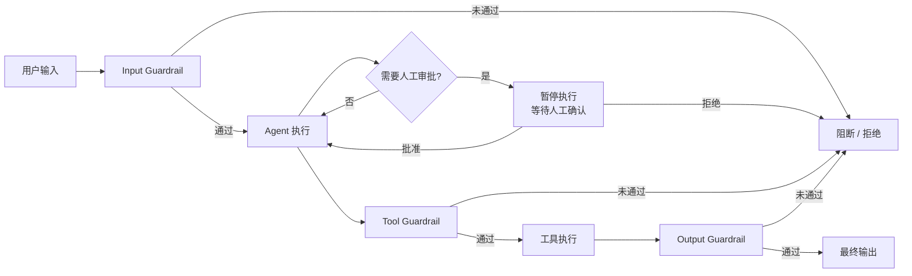

> **核心原则：** Guardrails 是**验证层**，不是**执行层**。它们检查输入/输出是否符合预期，但不代替 Agent 执行任务。

---

## 6.2 Guardrails 机制

### 6.2.1 Input Guardrails — 输入验证

**概念：** 在 Agent 执行前验证用户输入，防止恶意请求、不相关请求或资源浪费。

**工作流程：**
1. Guardrail 函数接收与 Agent 相同的用户输入
2. 运行 guardrail 函数，产出 `GuardrailFunctionOutput`
3. 检查 `tripwire_triggered`，如果为 `True` 则抛出 `InputGuardrailTripwireTriggered` 异常

**两种执行模式：**

| 模式 | 行为 | 适用场景 |
|------|------|----------|
| **并行模式**（默认，`run_in_parallel=True`） | Guardrail 与 Agent 并行执行 | 最佳延迟，但 Agent 可能已消耗 Token |
| **阻塞模式**（`run_in_parallel=False`） | Guardrail 先执行完毕，Agent 才开始 | 成本优化，防止 Agent 误执行工具 |

```python
from pydantic import BaseModel
from agents import (
    Agent,
    GuardrailFunctionOutput,
    InputGuardrailTripwireTriggered,
    RunContextWrapper,
    Runner,
    TResponseInputItem,
    input_guardrail,
)

class MathHomeworkOutput(BaseModel):
    is_math_homework: bool
    reasoning: str

# 使用一个轻量级 Agent 作为 guardrail 检查器
guardrail_agent = Agent(
    name="Guardrail check",
    instructions="判断用户是否在请求做数学作业。",
    output_type=MathHomeworkOutput,
)

@input_guardrail
async def math_guardrail(
    ctx: RunContextWrapper,
    agent: Agent,
    input: str | list[TResponseInputItem],
) -> GuardrailFunctionOutput:
    result = await Runner.run(guardrail_agent, input, context=ctx.context)
    return GuardrailFunctionOutput(
        output_info=result.final_output,
        tripwire_triggered=result.final_output.is_math_homework,
    )

# 将 guardrail 绑定到 Agent
main_agent = Agent(
    name="Customer Support",
    instructions="你是客服助手，帮助用户解决问题。",
    input_guardrails=[math_guardrail],
)

async def main():
    try:
        await Runner.run(main_agent, "帮我解方程：2x + 3 = 11")
    except InputGuardrailTripwireTriggered:
        print("Guardrail 触发：检测到数学作业请求，已拒绝。")
```

### 6.2.2 Output Guardrails — 输出验证

**概念：** 在 Agent 完成后验证输出内容，确保符合格式和安全要求。

> **注意：** Output Guardrails 仅在**最终输出 Agent** 上运行。如果工作流包含 Handoff，只在最后一个 Agent 完成后触发。不支持 `run_in_parallel` 参数。

```python
from pydantic import BaseModel
from agents import (
    Agent,
    GuardrailFunctionOutput,
    OutputGuardrailTripwireTriggered,
    RunContextWrapper,
    Runner,
    output_guardrail,
)

class MessageOutput(BaseModel):
    response: str

class MathOutput(BaseModel):
    reasoning: str
    is_math: bool

guardrail_agent = Agent(
    name="Guardrail check",
    instructions="判断输出中是否包含数学内容。",
    output_type=MathOutput,
)

@output_guardrail
async def math_output_guardrail(
    ctx: RunContextWrapper,
    agent: Agent,
    output: MessageOutput,
) -> GuardrailFunctionOutput:
    result = await Runner.run(guardail_agent, output.response, context=ctx.context)
    return GuardrailFunctionOutput(
        output_info=result.final_output,
        tripwire_triggered=result.final_output.is_math,
    )

agent = Agent(
    name="Customer Support",
    instructions="你是客服助手。",
    output_guardrails=[math_output_guardrail],
    output_type=MessageOutput,
)
```

### 6.2.3 Tool Guardrails — 工具调用验证

**概念：** 包裹在 Function Tool 上的输入/输出验证层，每次工具调用时执行。

**适用范围：** 仅适用于 `@function_tool` 创建的工具。**不适用于：** Handoff、Hosted Tools（WebSearchTool、FileSearchTool 等）、ComputerTool、ShellTool、ApplyPatchTool、Agent.as_tool()。

```python
import json
from agents import (
    Agent,
    Runner,
    ToolGuardrailFunctionOutput,
    function_tool,
    tool_input_guardrail,
    tool_output_guardrail,
)

@tool_input_guardrail
def block_secrets(data):
    """输入 guardrail：检查参数中是否包含 API 密钥。"""
    args = json.loads(data.context.tool_arguments or "{}")
    if "sk-" in json.dumps(args):
        return ToolGuardrailFunctionOutput.reject_content(
            "请先移除参数中的密钥再调用此工具。"
        )
    return ToolGuardrailFunctionOutput.allow()

@tool_output_guardrail
def redact_output(data):
    """输出 guardrail：检查输出中是否泄漏密钥。"""
    text = str(data.output or "")
    if "sk-" in text:
        return ToolGuardrailFunctionOutput.reject_content("输出包含敏感数据。")
    return ToolGuardrailFunctionOutput.allow()

@function_tool(
    tool_input_guardrails=[block_secrets],
    tool_output_guardrails=[redact_output],
)
def classify_text(text: str) -> str:
    """文本分类工具。"""
    return f"length:{len(text)}"

agent = Agent(name="Classifier", tools=[classify_text])
result = Runner.run_sync(agent, "hello world")
print(result.final_output)
```

### 6.2.4 Guardrail 的工作边界

**这是最常见的误区之一。** Guardrail 并非在所有 Agent 上都执行：

| Guardrail 类型 | 何时执行 | 注意事项 |
|----------------|----------|----------|
| **Input Guardrail** | 仅在**工作链中的第一个 Agent** | 如果 Agent 是通过 Handoff 到达的，其 input guardrail 不会执行 |
| **Output Guardrail** | 仅在**工作链中的最后一个 Agent** | 只有产生最终输出的 Agent 的 output guardrail 才会执行 |
| **Tool Guardrail** | **每次** Function Tool 调用时 | 仅适用于 `@function_tool`，不适用于 Handoff 或 Hosted Tool |

**设计含义：** 如果需要在每个 Agent 交接处都进行检查，应使用 Tool Guardrail（将工具调用作为检查点），而非依赖 Agent 级别的 Input/Output Guardrail。

---

## 6.3 Human-in-the-loop — 人工审批

### 6.3.1 概念定义

Human-in-the-loop（HITL）允许 Agent 在执行敏感工具调用前**暂停**，等待人工批准或拒绝。这是一个**可持久化的状态机**——暂停状态可以序列化到数据库，在另一个进程/时间点恢复。

### 6.3.2 标记需要审批的工具

```python
from agents import Agent, Runner, function_tool

# 始终需要审批
@function_tool(needs_approval=True)
async def cancel_order(order_id: int) -> str:
    """取消订单。"""
    return f"Order {order_id} cancelled"

# 动态审批 — 根据参数决定
async def requires_review(ctx, params, call_id) -> bool:
    return "refund" in params.get("subject", "").lower()

@function_tool(needs_approval=requires_review)
async def send_email(subject: str, body: str) -> str:
    """发送邮件。"""
    return f"已发送 '{subject}'"

agent = Agent(
    name="Support Agent",
    instructions="处理客户问题，需要审批时等待确认。",
    tools=[cancel_order, send_email],
)
```

`needs_approval` 支持以下位置：
- `@function_tool` 装饰器
- `Agent.as_tool()` 方法
- `ShellTool` / `ApplyPatchTool`
- 本地 MCP Server（`require_approval` 参数）
- Hosted MCP（`tool_config={"require_approval": "always"}`）

### 6.3.3 审批流程详解

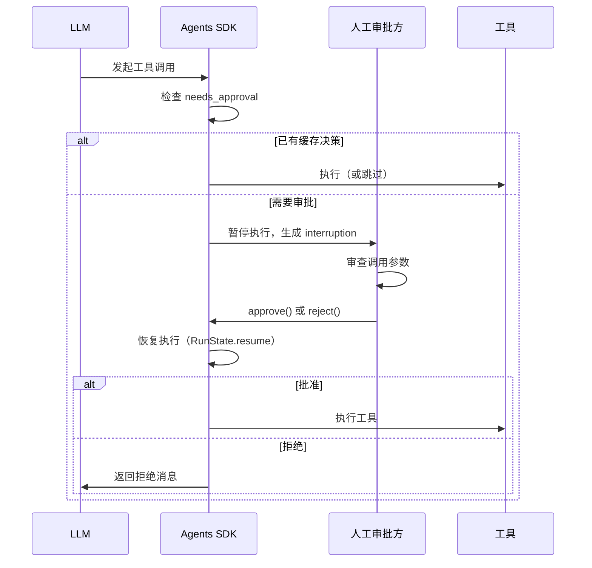

**完整流程：**
1. 模型发起工具调用
2. SDK 检查审批规则（`needs_approval` / `require_approval`）
3. 如果已有缓存决策（`always_approve` / `always_reject`），直接执行
4. 否则**暂停执行**，`RunResult.interruptions` 包含 `ToolApprovalItem`
5. 将结果转为 `RunState`，调用 `state.approve()` 或 `state.reject()`
6. 使用 `Runner.run(agent, state)` 恢复执行

### 6.3.4 完整示例：暂停、审批、恢复

```python
import asyncio
import json
from pathlib import Path
from agents import Agent, Runner, RunState, function_tool

async def needs_oakland_approval(ctx, params, call_id) -> bool:
    return "Oakland" in params.get("city", "")

@function_tool(needs_approval=needs_oakland_approval)
async def get_temperature(city: str) -> str:
    """获取城市温度。"""
    return f"{city} 的温度是 20°C"

agent = Agent(
    name="Weather Assistant",
    instructions="用提供的的工具回答天气问题。",
    tools=[get_temperature],
)

STATE_PATH = Path(".cache/hitl_state.json")

def prompt_approval(tool_name: str, arguments: str) -> bool:
    """同步审批函数（使用 input()）。"""
    answer = input(f"批准 {tool_name}（参数: {arguments}）? [y/N]: ").strip().lower()
    return answer in {"y", "yes"}

async def main():
    result = await Runner.run(agent, "Oakland 的气温是多少？")

    while result.interruptions:
        # 1. 持久化暂停状态
        state = result.to_state()
        STATE_PATH.parent.mkdir(parents=True, exist_ok=True)
        STATE_PATH.write_text(state.to_string())

        # 2. 从磁盘加载状态（可以是不同进程）
        stored = json.loads(STATE_PATH.read_text())
        state = await RunState.from_json(agent, stored)

        # 3. 逐个审批
        for interruption in result.interruptions:
            approved = await asyncio.get_running_loop().run_in_executor(
                None, prompt_approval,
                interruption.name or "unknown_tool",
                interruption.arguments,
            )
            if approved:
                state.approve(interruption, always_approve=False)
            else:
                state.reject(interruption)

        # 4. 恢复执行
        result = await Runner.run(agent, state)

    print(result.final_output)

if __name__ == "__main__":
    asyncio.run(main())
```

### 6.3.5 自动审批决策

有些场景不需要人工介入，可以由代码自动决定：

```python
# ShellTool / ApplyPatchTool 的 on_approval 回调
from agents import ShellTool

def auto_deny_approval(request):
    """自动拒绝所有审批。"""
    return {"approve": False, "reason": "Shell 操作已禁用。"}

shell_tool = ShellTool(
    executor=run_shell,
    on_approval=auto_deny_approval,
)

# Hosted MCP 的 on_approval_request 回调
from agents import HostedMCPTool, MCPToolApprovalFunctionResult

SAFE_TOOLS = {"read_file", "list_directory"}

def approve_mcp(request) -> MCPToolApprovalFunctionResult:
    if request.data.name in SAFE_TOOLS:
        return {"approve": True}
    return {"approve": False, "reason": "需要人工审查。"}

HostedMCPTool(
    tool_config={
        "type": "mcp",
        "server_label": "filesystem",
        "server_url": "https://mcp.example.com/filesystem",
        "require_approval": "always",
    },
    on_approval_request=approve_mcp,
)
```

当回调返回决策时，运行**不会暂停**，直接继续或拒绝。

### 6.3.6 自定义拒绝消息

```python
from agents import RunConfig, ToolErrorFormatterArgs

def format_rejection(args: ToolErrorFormatterArgs) -> str | None:
    if args.kind != "approval_rejected":
        return None
    return "发布操作已被取消，因为审批未通过。"

run_config = RunConfig(tool_error_formatter=format_rejection)

# 针对单个拒绝可以覆盖消息
state.reject(interruption, rejection_message="此操作已被审核人员拒绝。")
```

### 6.3.7 长运行审批 — 状态序列化

`RunState` 设计为可持久化的，适合长时间等待审批的场景：

```python
# 序列化
state_json = state.to_string()
# 或带元数据的 JSON
state_json = state.to_string(include_tracing_api_key=True)

# 反序列化
state = await RunState.from_json(agent, json.loads(state_json))

# 上下文序列化控制
state.to_string(
    context_serializer=lambda ctx: {"user_id": ctx.user_id},
    strict_context=True,
)
```

> **安全提醒：** 序列化的 RunState 包含应用上下文和 SDK 运行时元数据（审批状态、token 用量等）。如果计划存储或传输序列化状态，请确保 `RunContextWrapper.context` 中不包含敏感信息（如 API 密钥），除非你有意让它们随状态一起传递。

---

## 6.4 Guardrails 与 Tool 调用的交互

### 6.4.1 Guardrail 触发时 Tool 的状态

| Guardrail 类型 | Tool 是否已执行？ | 说明 |
|----------------|-------------------|------|
| **Input Guardrail（阻塞模式）** | 否 | Guardrail 先于 Agent 执行，失败则 Agent 不启动 |
| **Input Guardrail（并行模式）** | 可能已执行 | Guardrail 与 Agent 并行，Agent 可能已开始调用工具 |
| **Tool Input Guardrail** | 否 | 在工具执行前拦截，可跳过调用或返回替代结果 |
| **Tool Output Guardrail** | 是 | 工具已执行完毕，仅验证输出内容 |
| **Output Guardrail** | 是 | Agent 已完成所有工作，仅验证最终输出 |

### 6.4.2 HITL 与 Tool Guardrails 的配合

Tool Guardrails 和 HITL 是**独立运行**的两层：

```
工具调用
    ↓
[Tool Input Guardrail] ← 如果失败，直接拒绝，不进入 HITL
    ↓ 通过
[needs_approval 检查]  ← 如果标记为需要审批，暂停等待人工
    ↓ 批准
[工具执行]
    ↓
[Tool Output Guardrail] ← 如果失败，替换输出或触发 tripwire
    ↓
返回结果给 Agent
```

### 6.4.3 HITL 审批失败的行为

HITL 中"拒绝"不是"阻断整个 Agent"，而是：

- **拒绝单个工具调用**：该工具调用被标记为拒绝，返回自定义拒绝消息给模型
- **模型自行恢复**：模型收到拒绝消息后，可以选择其他路径或向用户说明无法完成
- **Agent 继续运行**：拒绝不终止 Agent，只是该工具不可用

如果需要完全阻断，应在 **Input Guardrail（阻塞模式）** 中处理。

---

## 6.5 安全最佳实践

### 6.5.1 输入安全

```
原则：永远不要信任用户输入
```

| 实践 | 方法 |
|------|------|
| **Input Guardrail** | 使用轻量模型快速分类，阻塞模式阻止恶意请求 |
| **Prompt 注入防护** | 在系统指令中加入防注入指令 |
| **速率限制** | 在应用层实现请求频率限制 |
| **输入长度限制** | 防止超长输入消耗大量 Token |

### 6.5.2 工具安全

| 实践 | 方法 |
|------|------|
| **最小权限原则** | 工具只暴露必要的操作和数据 |
| **HITL 审批** | 对敏感操作（删除、支付、发邮件）设置审批 |
| **Tool Guardrails** | 验证工具参数和输出，防止密钥泄漏 |
| **超时控制** | `@function_tool(timeout=...)` 防止工具无限阻塞 |
| **错误处理** | 使用 `failure_error_function` 避免内部错误暴露给模型 |

### 6.5.3 输出安全

| 实践 | 方法 |
|------|------|
| **Output Guardrail** | 验证输出不包含敏感信息（PII、密钥等） |
| **结构化输出** | 使用 `output_type` 强制 Agent 以结构化格式输出 |
| **后处理过滤** | 在返回用户前进行内容审核 |

### 6.5.4 MCP 安全

| 风险 | 缓解措施 |
|------|----------|
| **恶意 MCP 服务器** | 审查服务器代码，仅连接可信源 |
| **数据泄漏** | 使用 `tool_filter` 限制暴露的工具 |
| **未授权操作** | 对敏感工具设置 `require_approval` |
| **Token 泄漏** | MCP 的 `authorization` 字段不在 Response 对象中存储 |

### 6.5.5 Tracing 与敏感数据

```python
# 生产环境中建议禁用敏感数据采集
run_config = RunConfig(
    trace_include_sensitive_data=False,
)

# 或使用环境变量
# export OPENAI_AGENTS_TRACE_INCLUDE_SENSITIVE_DATA=false
```

> **注意：** 使用 OpenAI API 的组织若受 Zero Data Retention（ZDR）政策约束，Tracing 功能不可用。

---

## 6.6 常见误区

| 误区 | 正确理解 |
|------|----------|
| "Guardrail 在所有 Agent 上都执行" | Input Guardrail 仅在第一个 Agent 执行，Output Guardrail 仅在最后一个 Agent 执行 |
| "HITL 拒绝会终止整个 Agent" | HITL 拒绝仅阻断单个工具调用，Agent 继续运行并尝试其他路径 |
| "并行 Guardrail 更安全" | 并行模式下 Agent 可能已消耗 Token 和执行工具，阻塞模式才能真正防止浪费 |
| "Tool Guardrail 适用于所有工具" | 仅适用于 `@function_tool`，不适用于 Handoff、Hosted Tool、ComputerTool 等 |
| "HITL 只能在同一个进程内恢复" | `RunState` 可序列化到磁盘/数据库，在任意进程/时间点恢复 |
| "Guardrail 可以替代模型指令" | Guardrail 是验证层，不是执行层。复杂的业务逻辑应在 Agent instructions 中处理 |

---

## 6.7 来源汇总

| 来源 | 内容 |
|------|------|
| https://github.com/openai/openai-agents-python/blob/main/docs/guardrails.md | Input/Output/Tool Guardrails、Tripwires、执行模式 |
| https://github.com/openai/openai-agents-python/blob/main/docs/human_in_the_loop.md | HITL 流程、审批标记、状态序列化、自定义拒绝消息 |
| https://github.com/openai/openai-agents-python/blob/main/docs/tools.md | Function Tool 的 `needs_approval`、`failure_error_function`、`timeout` |
| https://github.com/openai/openai-agents-python/blob/main/docs/mcp.md | MCP 的 `require_approval`、`on_approval_request` |
| https://developers.openai.com/api/docs/guides/tools-connectors-mcp | 平台层 MCP 审批机制 |
# 第 7 章 — 生产实践 — 追踪、评估、部署

## 7.1 Tracing — 内置可观测性

### 7.1.1 概念定义

**Tracing（追踪）** 是 OpenAI Agents SDK 内置的可观测性功能，默认开启。每一次 Agent Run 都会自动发出结构化记录，包含模型调用、工具调用、Handoff、Guardrails 和自定义 Span 的完整端到端信息。这些数据可以在 OpenAI Dashboard 的 **Traces** 页面中直接查看。

**核心价值：** 在开发阶段，Tracing 帮助你理解 Agent 工作流中每一步发生了什么；在生产阶段，它为评估（Evals）提供高质量的样本数据。

### 7.1.2 Traces 包含的内容

默认的 Trace 记录通常包括：

- 整体 Run / 工作流的边界
- 每次模型调用的 prompt 和 response
- 工具调用及其输出结果
- Handoff 交接记录
- Guardrails 检查结果
- 自定义 Span（如果你手动包裹了追踪区域）

### 7.1.3 将多个 Run 包裹在同一个 Trace 中

当工作流需要多次调用 Agent 时（如先生成内容、再评分），可以使用 `withTrace` 将它们合并到同一个 Trace 下，方便统一查看。

```python
# Python
from agents import Agent, Runner, withTrace

agent = Agent(
    name="Joke generator",
    instructions="Tell funny jokes.",
)

async def joke_workflow():
    async with withTrace("Joke workflow"):
        first = await Runner.run(agent, "Tell me a joke")
        second = await Runner.run(agent, f"Rate this joke: {first.final_output}")
        print(first.final_output)
        print(second.final_output)
```

```typescript
// TypeScript
import { Agent, run, withTrace } from "@openai/agents";

const agent = new Agent({
  name: "Joke generator",
  instructions: "Tell funny jokes.",
});

await withTrace("Joke workflow", async () => {
  const first = await run(agent, "Tell me a joke");
  const second = await run(agent, `Rate this joke: ${first.finalOutput}`);
  console.log(first.finalOutput);
  console.log(second.finalOutput);
});
```

### 7.1.4 Traces Dashboard 使用

1. 登录 OpenAI Dashboard，进入 **Logs > Traces**
2. 选择一个代表性的工作流 Trace
3. 检查每个步骤的输入输出、工具调用、Handoff 是否符合预期
4. 发现异常后，追溯是哪个环节引入了错误

**调试技巧：**
- 先用 Traces 确认行为是否正确，再决定是否引入 Guardrails 或修改 prompt
- Traces 是最快定位工作流级问题的方式
- 对比修改前后的 Trace，验证 prompt/routing 变更是否有效

### 7.1.5 控制追踪级别

如果你不需要完整的追踪记录，可以在 SDK 级别或单次 Run 级别调整追踪粒度，而不是完全移除可观测性。

**常见误区：** 在生产环境中关闭所有 Tracing。这样做会丢失宝贵的调试数据和评估样本。正确做法是降低追踪粒度，保留关键节点。

---

## 7.2 Evals — Agent 工作流评估

### 7.2.1 评估演进路线

OpenAI 平台提供了一套从简单到复杂的评估工具链：

```
Traces 调试 → Trace Grading → Datasets & Eval Runs → 持续改进循环
```

**何时用什么：**

| 阶段 | 工具 | 适用场景 |
|------|------|---------|
| 调试中 | Traces | 单条工作流的端到端排查 |
| 初步验证 | Trace Grading | 对多条 Trace 批量评分，发现回归和失败模式 |
| 系统化评估 | Datasets + Eval Runs | 基准测试、prompt 对比、长期质量监控 |
| 自动化优化 | Prompt Optimizer | 基于数据集自动改进 prompt |

### 7.2.2 Trace Grading

**概念：** Trace Grading 是对已记录的 Trace 进行结构化评分，帮助你在大规模运行中发现回归和失败模式。

**适合回答的问题：**
- Agent 是否选择了正确的工具？
- Handoff 是否在应该发生时发生了？
- 工作流是否违反了指令或安全策略？
- Prompt 或路由变更后，端到端行为是否改善了？

**操作流程：**
1. 在 Dashboard 中打开 **Logs > Traces**
2. 检查来自 Agent Builder 或 SDK 应用的代表性 Trace
3. 创建一个 Grader（评分器），定义评分标准
4. 对选中的 Trace 批量运行 Grader
5. 根据结果优化 prompt、工具面、路由逻辑或 Guardrails

### 7.2.3 Datasets 与 Eval Runs

当你知道"什么是好的行为"后，从单个 Trace 升级到可重复的数据集和评估运行。

**Datasets** 是一组测试用例，包含输入和预期输出。配合 **Graders** 使用，可以：
- 基准测试变更（对比修改前后的分数）
- 比较不同 prompt 版本
- 在长时间内跟踪 Agent 质量趋势

### 7.2.4 评估循环 — 持续改进飞轮

```
定义标准 → 构建数据集 → 运行评估 → 分析问题 → 改进 prompt/工具/路由 → 再次评估
```

1. **定义什么是"好"**：明确 Agent 应该做什么、不应该做什么
2. **构建评估数据集**：收集覆盖各种场景的测试用例
3. **运行评估**：对每个测试用例运行 Agent，用 Grader 评分
4. **分析问题**：找出失败模式和薄弱环节
5. **改进**：调整 prompt、工具配置、路由逻辑或 Guardrails
6. **再次评估**：验证改进是否有效，确保没有引入回归

### 7.2.5 外部模型评估

如果需要针对非 OpenAI 模型进行评估，可以使用 Evals 的外部模型支持，或者通过 Evaluation API 以编程方式管理评估流程。

---

## 7.3 Streaming — 流式输出

### 7.3.1 概念定义

**流式输出（Streaming）** 让模型在生成内容的同时逐步返回结果，而不是等待全部内容生成后一次性返回。这大幅降低了用户感知的等待时间（Time to First Token）。

### 7.3.2 Agents SDK 中的流式

```python
# Python — 使用 Runner.run_streamed 流式执行 Agent
from agents import Agent, Runner
from openai.types.responses import ResponseTextDeltaEvent

agent = Agent(
    name="Assistant",
    instructions="You are a helpful assistant.",
)

# 流式执行并实时输出
result = Runner.run_streamed(agent, "Tell me a long story about a brave knight.")

async for event in result.stream_events():
    if hasattr(event, 'delta'):
        print(event.delta, end="", flush=True)

# 等待完成后获取完整结果
await result
print("\nFinal output:", result.final_output)
```

```typescript
// TypeScript — 使用 runStreaming
import { Agent, runStreaming } from "@openai/agents";

const agent = new Agent({
  name: "Assistant",
  instructions: "You are a helpful assistant.",
});

const stream = await runStreaming(agent, "Tell me a long story.");
for await (const chunk of stream) {
  // 处理增量事件
  process.stdout.write(chunk.delta ?? "");
}
```

### 7.3.3 语义事件类型

Responses API 使用预定义 schema 的语义事件。常见生命周期事件：

| 事件 | 含义 |
|------|------|
| `response.created` | 响应开始（仅一次） |
| `response.output_text.delta` | 文本增量（多次） |
| `response.completed` | 响应完成（仅一次） |
| `error` | 错误 |

完整的流式事件类型包括：
- `ResponseCreatedEvent` / `ResponseInProgressEvent` / `ResponseFailedEvent` / `ResponseCompletedEvent`
- `ResponseOutputItemAdded` / `ResponseOutputItemDone`
- `ResponseContentPartAdded` / `ResponseContentPartDone`
- `ResponseOutputTextDelta` / `ResponseOutputTextAnnotationAdded` / `ResponseTextDone`
- `ResponseRefusalDelta` / `ResponseRefusalDone`
- `ResponseFunctionCallArgumentsDelta` / `ResponseFunctionCallArgumentsDone`
- 工具特定事件：`ResponseFileSearchCall*`、`ResponseCodeInterpreterCall*`

### 7.3.4 流式 Tool Calls 和结构化输出

对于更高级的流式场景（如流式函数调用、流式结构化输出），需要监听特定事件类型：

```python
# 流式函数调用参数增量
from openai.types.responses import ResponseFunctionCallArgumentsDeltaEvent, ResponseFunctionCallArgumentsDoneEvent

async for event in result.stream_events():
    if isinstance(event, ResponseFunctionCallArgumentsDeltaEvent):
        print(f"Tool arguments delta: {event.delta}")
    elif isinstance(event, ResponseFunctionCallArgumentsDoneEvent):
        print(f"Tool arguments complete: {event.arguments}")
```

### 7.3.5 流式中的 Moderation 风险

**注意：** 在生产环境中流式输出时，对内容进行实时 Moderation（审核）更加困难，因为部分内容片段可能难以准确评估。这可能影响已批准的使用场景。

**最佳实践：** 如果流式输出用于面向用户的场景，考虑在后端对流式内容进行块级审核（chunk-level moderation），而不是等待完整输出。

---

## 7.4 WebSocket 模式

### 7.4.1 概念定义

**WebSocket 模式** 通过持久连接（`/v1/responses`）实现低延迟的多轮 Agent 工作流。每次新的 turn 只发送增量输入和 `previous_response_id`，避免重复传输完整上下文。

### 7.4.2 适用场景

最适合涉及大量模型-工具往返调用的工作流（如 Agent 编码、多次工具调用的编排循环）。对于包含 **20+ 次工具调用** 的工作流，端到端执行速度可提升约 **40%**。

### 7.4.3 工作原理

1. 建立持久 WebSocket 连接到 `wss://api.openai.com/v1/responses`
2. 客户端发送 `response.create` 事件（payload 与标准 Responses create body 一致）
3. 继续 turn 时，发送新的 `response.create` 并附带 `previous_response_id`
4. 服务在连接本地的内存缓存中保留最近一次 response 状态

```python
from websocket import create_connection
import json, os

ws = create_connection(
    "wss://api.openai.com/v1/responses",
    header=[f"Authorization: Bearer {os.environ['OPENAI_API_KEY']}"],
)

# 创建响应
ws.send(json.dumps({
    "type": "response.create",
    "model": "gpt-5.4",
    "store": False,
    "input": [{
        "type": "message",
        "role": "user",
        "content": [{"type": "input_text", "text": "Find fizz_buzz()"}],
    }],
    "tools": [],
}))

# 继续 — 仅发送增量输入
ws.send(json.dumps({
    "type": "response.create",
    "model": "gpt-5.4",
    "store": False,
    "previous_response_id": "resp_123",
    "input": [
        {
            "type": "function_call_output",
            "call_id": "call_123",
            "output": "tool result",
        },
        {
            "type": "message",
            "role": "user",
            "content": [{"type": "input_text", "text": "Now optimize it."}],
        },
    ],
    "tools": [],
}))
```

### 7.4.4 预热的用法

可以发送 `generate: false` 的 `response.create` 来预热请求状态（准备 request state），后续 turn 通过 `previous_response_id` 链式调用，使首次生成更快。

```python
# 预热 — 不生成模型输出，但准备请求状态
ws.send(json.dumps({
    "type": "response.create",
    "model": "gpt-5.4",
    "generate": False,  # 预热
    "tools": [...],
    "instructions": "...",
}))
# 返回 response ID，后续 turn 用 previous_response_id 继续
```

### 7.4.5 与 ZDR 的兼容性

WebSocket 模式兼容 **零数据保留（ZDR）** 和 `store=false`，因为 previous-response state 仅在内存中保留，不写入磁盘。

### 7.4.6 Compaction 续接

使用上下文压缩（compaction）时有两种续接模式：

- **服务端压缩（context_management）**：正常续接，使用最新的 `previous_response_id`
- **独立 `/responses/compact` 端点**：返回压缩后的输入窗口（非 response ID），需要用压缩后的窗口创建新的 response

```python
# 独立压缩后创建新链
compacted = client.responses.compact(
    model="gpt-5.4",
    input=long_input_items_array,
)

ws.send(json.dumps({
    "type": "response.create",
    "model": "gpt-5.4",
    "store": False,
    "input": [
        *compacted.output,
        {"type": "message", "role": "user",
         "content": [{"type": "input_text", "text": "Continue from here."}]},
    ],
    "tools": [],
}))
```

---

## 7.5 Webhooks

### 7.5.1 概念定义

**Webhooks** 允许你接收 OpenAI API 事件的实时通知，例如后台响应完成、批处理完成、微调任务完成等。Webhooks 遵循 Standard Webhooks 规范，通过 HTTP POST 推送到你控制的端点。

### 7.5.2 创建 Webhook

1. 在 OpenAI Dashboard 中打开 Webhook 设置页面（按项目配置）
2. 点击 Create 按钮
3. 配置三项：名称、公共 URL、订阅的事件类型
4. 创建后会收到 **Signing Secret**（仅显示一次，妥善保存）

### 7.5.3 服务端处理

```python
# Python Flask 示例
import os
from openai import OpenAI, InvalidWebhookSignatureError
from flask import Flask, request, Response

app = Flask(__name__)
client = OpenAI(webhook_secret=os.environ["OPENAI_WEBHOOK_SECRET"])

@app.route("/webhook", methods=["POST"])
def webhook():
    try:
        # 验证签名（如果签名无效会抛出异常）
        event = client.webhooks.unwrap(request.data, request.headers)

        if event.type == "response.completed":
            response_id = event.data.id
            response = client.responses.retrieve(response_id)
            print("Response output:", response.output_text)

        return Response(status=200)
    except InvalidWebhookSignatureError as e:
        print("Invalid signature", e)
        return Response("Invalid signature", status=400)

if __name__ == "__main__":
    app.run(port=8000)
```

### 7.5.4 最佳实践

- **快速响应**：端点应立即返回 2xx 状态码，将非平凡处理卸载到后台 worker
- **处理重试**：OpenAI 会在 72 小时内以指数退避重试失败投递
- **处理重复**：极端情况下可能收到重复事件，使用 `webhook-id` 去重
- **签名验证**：始终使用 SDK 的 `webhooks.unwrap()` 验证来源
- **不跟随重定向**：3xx 被视为失败，端点 URL 应使用最终目标地址

---

## 7.6 Voice Agents — 语音智能体

### 7.6.1 概念定义

**Voice Agents** 将相同的 Agent 概念扩展到语音、低延迟的交互。关键设计决策是：模型应该直接处理实时音频，还是由应用显式地编排语音到文本、文本推理、文本到语音的流水线。

### 7.6.2 架构选择

| 架构 | 适用场景 | 原因 |
|------|---------|------|
| Speech-to-Speech 实时音频会话 | 自然、低延迟的对话 | 模型直接处理音频输入输出 |
| Chained Voice Pipeline | 可预测的工作流或扩展现有文本 Agent | 应用对转录、推理、语音输出保持显式控制 |

### 7.6.3 Speech-to-Speech 实现

Agent Builder 目前不支持语音工作流，所以语音是 SDK 优先的。

```typescript
// TypeScript — RealtimeAgent + RealtimeSession（最快路径）
import { RealtimeAgent, RealtimeSession } from "@openai/agents/realtime";

const agent = new RealtimeAgent({
  name: "Assistant",
  instructions: "You are a helpful voice assistant.",
});

const session = new RealtimeSession(agent, {
  model: "gpt-realtime-1.5",
});

// 连接需要服务器生成的临时密钥
await session.connect({
  apiKey: "ek_...(ephemeral key from your server)",
});
```

**浏览器端流程：**
1. 你的应用服务器创建临时客户端密钥（用于实时音频会话）
2. 前端创建 RealtimeSession
3. 会话通过 WebRTC（浏览器）或 WebSocket（服务器）连接
4. Agent 在该会话内处理音频轮次、工具、打断和 Handoff

### 7.6.4 Chained Voice Pipeline

```python
# Python — 扩展现有文本 Agent 的最简路径
# 应用显式管理三个阶段：
# 1. speech-to-text（音频转文本）
# 2. agent workflow（文本 Agent 处理）
# 3. text-to-speech（文本转音频输出）

# 适合支持场景、审批流程、需要持久化转录和确定性逻辑的情况
```

### 7.6.5 Voice Agent 的核心 Agent 模块

语音只是改变了传输层和音频循环，核心工作流决策不变：
- 需要外部能力 → 使用 Tools
- 需要流式/续传/持久状态 → Running agents
- 需要在专家间分支 → Orchestration + Handoffs
- 需要安全检查或审批 → Guardrails + Human review
- 需要可观测性 → Integrations + observability

**实践规则：** 先选择音频架构，然后用与文本 Agent 相同的方式设计其余工作流。

---

## 7.7 Background Mode — 后台运行

### 7.7.1 概念定义

**Background Mode** 允许异步执行长时间运行的任务，无需担心 HTTP 超时或连接中断。适用于 Codex、Deep Research 等可能需要数分钟才能完成的场景。

### 7.7.2 启动后台任务

```python
from openai import OpenAI

client = OpenAI()

resp = client.responses.create(
  model="gpt-5.4",
  input="Write a very long novel about otters in space.",
  background=True,
)

print(resp.status)  # "queued" 或 "in_progress"
```

### 7.7.3 轮询状态

```python
from openai import OpenAI
from time import sleep

client = OpenAI()

resp = client.responses.create(
  model="gpt-5.4",
  input="Write a very long novel about otters in space.",
  background=True,
)

while resp.status in {"queued", "in_progress"}:
  print(f"Current status: {resp.status}")
  sleep(2)
  resp = client.responses.retrieve(resp.id)

print(f"Final status: {resp.status}\nOutput:\n{resp.output_text}")
```

### 7.7.4 取消后台任务

```python
from openai import OpenAI

client = OpenAI()
resp = client.responses.cancel("resp_123")
print(resp.status)  # "cancelled"

# 取消两次是幂等的 — 后续调用只返回最终 Response 对象
```

### 7.7.5 后台 + 流式

可以同时使用 `background=True` 和 `stream=True`，在启动后台任务后立即开始流式接收事件。如果客户端断开连接，后台响应会继续运行，之后可以从记录的 `sequence_number` 恢复。

```python
from openai import OpenAI

client = OpenAI()

stream = client.responses.create(
  model="gpt-5.4",
  input="Write a very long novel about otters in space.",
  background=True,
  stream=True,
)

cursor = None
for event in stream:
  print(event)
  cursor = event.sequence_number

# 如果连接断开，响应仍在后台运行
# SDK 恢复流支持即将推出：
# for event in client.responses.stream(resp.id, starting_after=cursor):
#     print(event)
```

### 7.7.6 限制

- 后台采样要求 `store=true`；无状态请求会被拒绝
- 取消同步响应需要终止连接
- 只有以 `stream=true` 创建的后台响应才能启动新的流
- 后台模式与 **零数据保留（ZDR）** 不兼容（数据保留约 10 分钟用于轮询）

### 7.7.7 与 Webhooks 配合

后台响应完成后，可以通过 Webhook 的 `response.completed` 事件实时通知，无需轮询。

---

## 7.8 性能优化

### 7.8.1 延迟优化

延迟的生命周期：
```
网络（端到端 API） → 服务器处理 prompt tokens → 服务器采样/生成 tokens → 网络（API 到端）
```

**七项核心原则：**

| 原则 | 要点 |
|------|------|
| 1. 加快 Token 处理 | 选择更小更快的模型；使用 Predicted Outputs 进行代码编辑等场景 |
| 2. 生成更少 Token | 要求简洁输出（"under 20 words"）；结构化输出精简语法；用 `max_tokens`/`stop_tokens` 截断 |
| 3. 减少输入 Token | 影响较小（减半 prompt 仅 1-5% 改善）；超长上下文可用 RAG 裁剪；最大化共享前缀利用 KV cache |
| 4. 减少请求次数 | 多步骤合并为单个 prompt + JSON 输出，消除往返延迟 |
| 5. 并行化 | 非顺序步骤拆分并行调用；推测执行（speculative execution） |
| 6. 让用户少等待 | 流式输出（最有效）；块级处理；展示中间步骤进度 |
| 7. 不默认用 LLM | 识别可以用经典方法（规则、缓存、搜索）更快的场景 |

**Agent 场景特化策略：**
- 使用 WebSocket 模式减少 20+ 工具调用链路的端到端延迟（约 40% 改善）
- 预热（`generate: false`）准备 request state，加速首次生成
- Handoff 路由在 Triage Agent 中完成，避免不必要的模型调用

### 7.8.2 成本优化

**成本 = Token 数量 × 每 Token 价格**

| 策略 | 说明 |
|------|------|
| 选择更小模型 | 用 gpt-5.4-mini / nano 处理简单任务，gpt-5.4 处理复杂任务 |
| 减少请求数 | 多步合并、批处理 |
| 减少 Token 数 | 更短的 prompt、精简输出、缓存常见查询 |
| Batch API | 异步批处理，成本更低 |
| Flex Processing | 以延迟换成本，适合非生产/低优先级任务 |

**监控：** 设置通知阈值，用 Usage Dashboard 跟踪当前和过往账单的 Token 消耗。

### 7.8.3 准确性优化

提高 LLM 准确性的三层递进策略：

| 层级 | 方法 | 适用场景 |
|------|------|---------|
| 第一层 | **Prompt Engineering** | 最佳起点 — 零样本即可达到生产级准确率的场景（摘要、翻译、代码生成） |
| 第二层 | **RAG（检索增强生成）** | 模型缺乏上下文知识、知识过时、需要专有信息 |
| 第三层 | **Fine-tuning（微调）** | 需要一致的行为模式（格式、语气、风格） |

**优化心智模型 — 二维矩阵：**
- **上下文优化（Context Optimization）**：模型缺乏知识时，通过 prompt / RAG 补充
- **LLM 优化（LLM Optimization）**：行为不一致时，通过 prompt / 微调改善

**Agent 场景的准确性策略：**
- 用 Guardrails 过滤无效输入和有害输出
- 用 Handoff 将专业问题路由给专门 Agent
- 用 Approvals 在关键操作前引入人工审核
- 用 Evals 系统化测试和追踪回归

---

## 7.9 Production Best Practices 清单

### 7.9.1 组织与项目管理

- 使用独立的项目（Project）隔离 staging 和 production 环境
- 为每个项目设置自定义速率限制和支出上限
- 限制 production 项目的用户访问
- 使用组织 ID 头指定 API 请求归属的组织

### 7.9.2 安全与密钥

- API 密钥存储在环境变量或密钥管理服务中，不要硬编码
- 使用 Usage Dashboard 监控 API 密钥使用
- 定期轮换 API 密钥

### 7.9.3 架构可扩展性

- **水平扩展**：部署多个服务器/容器，使用负载均衡
- **缓存**：存储频繁访问的数据，减少对 API 的重复调用
- **Rate Limits**：了解并规划速率限制，实施指数退避重试

### 7.9.4 MLOps 策略

- **数据和模型管理**：跟踪训练/微调数据和模型版本
- **模型监控**：追踪性能变化，检测退化
- **模型更新**：数据或需求变化时重新微调
- **自动部署**：自动化模型及相关制品的部署流程

### 7.9.5 安全与合规

- 评估数据处理方式，了解 OpenAI API 如何处理数据
- 实施数据隐私保护（加密、匿名化）
- 遵循安全编码实践（输入清洗、错误处理）
- 使用 Moderation API 过滤有害内容

---

## 7.10 本章小结

生产化 Agent 系统的关键步骤：

1. **从 Tracing 开始**：用内置追踪理解工作流行为
2. **建立评估循环**：用 Trace Grading → Datasets → Eval Runs 形成持续改进飞轮
3. **选择合适的传输方式**：HTTP 流式、WebSocket、Webhooks、Background Mode 各有适用场景
4. **架构先行**：语音 Agent 先选音频架构再设计工作流
5. **三维度优化**：延迟、成本、准确性递进优化
6. **安全兜底**：Guardrails + Approvals + Moderation 构建安全边界

---

**信息来源：**

1. [Integrations and Observability — OpenAI 官方文档](https://developers.openai.com/api/docs/guides/agents/integrations-observability)
2. [Evaluate Agent Workflows — OpenAI 官方文档](https://developers.openai.com/api/docs/guides/agent-evals)
3. [Voice Agents — OpenAI 官方文档](https://developers.openai.com/api/docs/guides/voice-agents)
4. [Streaming API Responses — OpenAI 官方文档](https://developers.openai.com/api/docs/guides/streaming-responses)
5. [Production Best Practices — OpenAI 官方文档](https://developers.openai.com/api/docs/guides/production-best-practices)
6. [Background Mode — OpenAI 官方文档](https://developers.openai.com/api/docs/guides/background)
7. [WebSocket Mode — OpenAI 官方文档](https://developers.openai.com/api/docs/guides/websocket-mode)
8. [Webhooks — OpenAI 官方文档](https://developers.openai.com/api/docs/guides/webhooks)
9. [Latency Optimization — OpenAI 官方文档](https://developers.openai.com/api/docs/guides/latency-optimization)
10. [Cost Optimization — OpenAI 官方文档](https://developers.openai.com/api/docs/guides/cost-optimization)
11. [openai-agents-python GitHub 仓库](https://github.com/openai/openai-agents-python)
12. [Streaming Guardrails Example — GitHub](https://github.com/openai/openai-agents-python/commit/5727a1c73a45a7e2681f90b6cdc0cd372434bd3f)
# 第 8 章 — 常见误区与最佳实践

## 8.1 过度拆分 Agent

### 8.1.1 误区

开发者在熟悉了 Handoff 和 Agents-as-Tools 模式后，容易陷入"每个功能一个 Agent"的陷阱。过度拆分会带来：

- **增加调用链长度**：每次 Handoff 都是一次额外的模型调用，增加延迟和成本
- **上下文割裂**：拆分后每个 Agent 只持有部分上下文，可能导致信息丢失
- **路由不稳定**：Triage Agent 在边界案例上容易做出错误路由决策
- **调试困难**：链路越长，Trace 越复杂，定位问题越耗时

### 8.1.2 正确做法

**从单 Agent 开始，仅在以下情况才拆分：**

1. **指令冲突**：单个 Agent 的 instructions 变得冗长且存在矛盾时
2. **工具面污染**：所有工具都暴露给每次调用，模型在 30+ 工具中选择效率下降
3. **安全边界**：某些操作需要独立的 Guardrails 或 Approvals
4. **复用需求**：某个能力在多个场景中需要独立调用

### 8.1.3 对比示例

```python
# 错误：过度拆分
greeting_agent = Agent(name="Greeter", instructions="Only greet users.")
question_agent = Agent(name="Question Handler", instructions="Answer questions.")
farewell_agent = Agent(name="Fareweller", instructions="Only say goodbye.")
triage = Agent(name="Triage", handoffs=[greeting_agent, question_agent, farewell_agent])

# 正确：单 Agent 处理
agent = Agent(
    name="Assistant",
    instructions=(
        "You are a helpful assistant. Greet users warmly, "
        "answer questions accurately, and say goodbye naturally "
        "when the conversation ends."
    ),
)
```

```python
# 正确：当工具面过大时拆分
# 场景：一个 Agent 同时拥有搜索、数据库操作、文件处理、邮件发送等 20+ 工具
# 拆分为领域专家，Triage Agent 按领域路由

search_agent = Agent(
    name="Search Expert",
    instructions="Search the web and summarize results.",
    tools=[web_search],
)
db_agent = Agent(
    name="Database Expert",
    instructions="Query and analyze the database.",
    tools=[query_db],
)
triage = Agent(
    name="Router",
    instructions="Route user requests to the appropriate specialist.",
    handoffs=[search_agent, db_agent],
)
```

---

## 8.2 Guardrails 误用

### 8.2.1 过严 — 阻塞正常流程

**表现：** 输入 Guardrail 把正常的用户请求判定为违规，导致大量误拦截。

**常见原因：**
- 使用过于简单的关键词匹配
- 评分阈值设置过高
- 没有区分"有风险的请求"和"包含风险词汇的合理请求"

```python
# 错误：过于简单的关键词过滤
from agents import InputGuardrail, GuardrailFunctionOutput

def overly_strict_guardrail(input_str: str) -> GuardrailFunctionOutput:
    bad_words = ["kill", "death", "attack", "hack", "virus"]
    if any(word in input_str.lower() for word in bad_words):
        return GuardrailFunctionOutput(
            output_type="blocked",
            tripwire_triggered=True,
        )
    return GuardrailFunctionOutput(output_type="passed")
# 问题："How to kill a process in Linux?" 会被误拦截
```

```python
# 正确：用 LLM 判断意图
from agents import InputGuardrail, GuardrailFunctionOutput
from agents import Agent

guardrail_agent = Agent(
    name="Safety Checker",
    instructions=(
        "Determine if the user's request is asking for harmful or malicious actions. "
        "Technical/administrative questions that mention sensitive topics are OK."
    ),
    output_type=GuardrailOutput,
    model="gpt-5.4-nano",  # 用轻量模型降低成本
)

async def intent_based_guardrail(input_str: str) -> GuardrailFunctionOutput:
    result = await Runner.run(guardrail_agent, input_str)
    # 基于 LLM 判断的意图做决策
    ...
```

### 8.2.2 过松 — 安全边界形同虚设

**表现：** 输出 Guardrail 几乎从不触发，即使 Agent 输出了不当内容。

**常见原因：**
- Guardrail Agent 的 instructions 不够明确
- 使用了过于轻量的模型导致判断不准
- 只在最终输出时检查，没有在流式过程中间检查

### 8.2.3 流式过程中的 Guardrails

在流式场景中，可以定期对流式内容进行 Guardrail 检查，实现早期终止：

```python
# 流式 Guardrail — 每 N 个 token 检查一次
# 参考: https://github.com/openai/openai-agents-python/commit/5727a1c
# 核心思路：
# 1. 累积 streaming 文本
# 2. 每 N 个 token 触发 guardrail agent 检查
# 3. 如果违规，立即终止流式
```

---

## 8.3 Handoff 循环

### 8.3.1 问题描述

两个 Agent 互相交接形成无限循环，导致 Agent 调用不断消耗 Token 和延迟。

### 8.3.2 常见原因

```python
# 错误：循环 Handoff
agent_a = Agent(
    name="Agent A",
    instructions="If the user asks about B topics, transfer to Agent B.",
    handoffs=[agent_b],
)
agent_b = Agent(
    name="Agent B",
    instructions="If the user asks about A topics, transfer to Agent A.",
    handoffs=[agent_a],
)
# 当用户的请求同时涉及 A 和 B 时，会无限循环
```

### 8.3.3 预防策略

1. **明确交接边界**：每个 Agent 的 `handoff_description` 要互斥
2. **限制最大 Handoff 次数**：在应用层设置最大交接次数限制
3. **设计有向无环图（DAG）**：确保 Handoff 关系不存在环
4. **Triage 单向分发**：Triage Agent 分发后，专家 Agent 不再 handoff 回 Triage

```python
# 正确：单向分发
triage = Agent(
    name="Triage",
    instructions="Classify the request and route to exactly one specialist.",
    handoffs=[math_expert, history_expert],
)
math_expert = Agent(
    name="Math Expert",
    instructions="Answer math questions. Do NOT handoff to any other agent.",
    # 不设置 handoffs — 防止回流
)
history_expert = Agent(
    name="History Expert",
    instructions="Answer history questions. Do NOT handoff to any other agent.",
    # 不设置 handoffs
)
```

---

## 8.4 调试技巧

### 8.4.1 使用 Traces 调试

1. **打开 Traces Dashboard**，找到问题 run 的 Trace
2. **检查模型调用**：prompt 和 response 是否符合预期
3. **检查工具调用**：是否调用了错误的工具？工具参数是否正确？
4. **检查 Handoff**：交接发生在预期位置吗？交接后是否还在正确的 Agent？
5. **检查 Guardrails**：是否有误触发？

### 8.4.2 回放 Trace

将 Trace 中的 prompt 和工具调用结果提取出来，在本地重新运行，可以精确复现问题：

```python
# 从 Trace 中提取的信息重现问题
agent = Agent(name="Reproduction", instructions="...original instructions...")
result = await Runner.run(
    agent,
    input=[  # 使用 Trace 中的完整对话历史
        {"role": "user", "content": "..."},
        {"role": "assistant", "content": "..."},
        ...
    ],
)
```

### 8.4.3 日志策略

```python
# 在关键节点添加日志
import logging
logger = logging.getLogger("agent-workflow")

# 记录 Handoff 决策
logger.info(f"Triage decision: routed to {agent.name} for input: {input[:100]}...")

# 记录工具调用结果
logger.debug(f"Tool {tool_name} returned: {result[:500]}...")

# 记录异常
logger.error(f"Agent {agent.name} failed: {error}", exc_info=True)
```

---

## 8.5 成本优化

### 8.5.1 误区

- **误区 1：总是用最强模型**。用 gpt-5.4 处理简单的分类任务，成本浪费数倍。
- **误区 2：忽视输出长度**。没有限制 `max_tokens` 或要求简洁输出，Agent 可能生成大量不必要的内容。
- **误区 3：重复上下文**。在每轮对话中发送完整的对话历史，而不是仅发送增量部分。

### 8.5.2 策略清单

| 策略 | 预期效果 | 复杂度 |
|------|---------|--------|
| 任务分级选择模型 | 30-70% 成本降低 | 低 |
| 精简输出指令 | 10-40% Token 节省 | 低 |
| 缓存常见查询结果 | 按需降低 | 中 |
| 使用 WebSocket 模式 | 20+ 工具调用链路 40% 端到端加速 | 中 |
| Batch API 处理离线任务 | 显著降低 | 中 |
| 微调替代长 prompt | 长 prompt 场景 30-50% 降低 | 高 |

### 8.5.3 模型分级推荐

```python
# 模型选择矩阵
MODEL_TIER = {
    "nano": "gpt-5.4-nano",    # Guardrails 检查、分类、简单格式化
    "mini": "gpt-5.4-mini",    # 中等复杂度任务、内容总结
    "standard": "gpt-5.4",     # 复杂推理、代码生成、多步规划
    "pro": "gpt-5.4-pro",      # 最高难度任务（按需）
}

# 示例：Guardrails 用 nano 模型
guardrail_agent = Agent(
    name="Safety Checker",
    instructions="Check if content is safe.",
    output_type=GuardrailOutput,
    model=MODEL_TIER["nano"],  # 低成本模型足矣
)
```

---

## 8.6 模型选择误区

### 8.6.1 误区：能力越强的模型越好

**错误思维：** "既然 gpt-5.4 最强，所有场景都用它。"

**实际情况：**

| 场景 | 推荐模型 | 原因 |
|------|---------|------|
| 输入/输出 Guardrails | nano | 简单分类任务不需要强推理 |
| 内容摘要、翻译 | mini | 零样本即可达到高质量 |
| 多步规划、代码生成 | gpt-5.4 | 需要复杂推理和上下文理解 |
| Guardrails 意图判断 | nano | 二分类判断，nano 足够 |
| Triage Agent 路由 | mini | 分类路由，不需要深度推理 |

### 8.6.2 误区：忽视模型的最新版本

OpenAI 持续发布新模型版本，每个版本在速度、成本、质量上都有改善。应定期评估是否有更适合当前场景的新模型。

### 8.6.3 误区：不对模型进行基准测试

**正确做法：** 在选定模型前，用 Evals 数据集在不同模型上跑基准测试，用数据选择而非直觉。

```python
# 用数据集比较不同模型
models_to_test = ["gpt-5.4-nano", "gpt-5.4-mini", "gpt-5.4"]

for model in models_to_test:
    agent = Agent(name="Test", instructions="...", model=model)
    # 在数据集上运行并评分
    scores = run_eval_on_dataset(agent, test_dataset)
    print(f"{model}: accuracy={scores.accuracy}, "
          f"avg_cost={scores.avg_cost}, "
          f"avg_latency={scores.avg_latency}")
```

---

## 8.7 状态管理混乱

### 8.7.1 问题描述

在多轮对话和 Handoff 场景中，开发者容易对"谁持有状态"感到困惑：
- 对话历史在谁那里？
- Handoff 后历史是否传递？
- 如何恢复被 Approval 中断的 Run？

### 8.7.2 状态管理策略

| 需求 | 使用方式 | 说明 |
|------|---------|------|
| 保持完整对话历史 | `result.history` | 应用侧自行管理，最灵活 |
| SDK 自动管理历史 | Session | SDK 自动加载和保存历史 |
| OpenAI 托管续传 | Server-managed continuation ID | OpenAI 管理续传状态 |
| 恢复被中断的 Run | `result.state` + `interruptions` | Approval 中断后的恢复 |

### 8.7.3 最佳实践

```python
# 推荐：使用 Session 管理对话历史
from agents import Agent, Runner, Session

session = Session()

agent = Agent(
    name="Assistant",
    instructions="You are a helpful assistant.",
)

# 第一轮
result1 = await Runner.run(agent, "Hello!", session=session)

# 第二轮 — 自动包含历史
result2 = await Runner.run(agent, "What did I just say?", session=session)
```

```python
# 推荐：处理 Approval 中断
from agents import Agent, Runner, Approval

result = await Runner.run(agent, "Delete the production database.")

if result.interruptions:
    for interruption in result.interruptions:
        if isinstance(interruption, Approval):
            # 等待人工确认
            confirmed = await get_human_confirmation(interruption)
            if confirmed:
                # 用恢复状态继续运行
                result = await Runner.run(
                    agent,
                    input="User confirmed. Proceed.",
                    previous_result=result,
                )
```

### 8.7.4 常见错误

```python
# 错误：手动拼接历史，遗漏了工具调用结果
history = [
    {"role": "user", "content": "question"},
    {"role": "assistant", "content": "answer"},
    # 遗漏了中间的工具调用记录
]

# 正确：使用 result.history
history = result.history  # 包含完整的消息、工具调用、Handoff 记录
```

---

## 8.8 最佳实践清单

### 8.8.1 设计阶段

- [ ] **从单 Agent 开始**：除非有明确理由，否则先用单个 Agent 验证核心流程
- [ ] **明确每个 Agent 的职责边界**：用 `handoff_description` 记录"什么情况下应该交接"
- [ ] **设计无环的 Handoff 图**：确保不会发生互相交接的循环
- [ ] **选择合适的模型分级**：按任务复杂度选择模型，不盲目用最强

### 8.8.2 开发阶段

- [ ] **尽早开启 Tracing**：从第一个 Agent 开始就使用内置追踪
- [ ] **用 Trace Grading 验证行为**：在 Traces 积累后，建立评分标准批量验证
- [ ] **编写详细的 instructions**：像产品需求文档一样具体，而非模糊描述
- [ ] **工具函数附带清晰的 docstring**：模型依赖 docstring 理解工具用途
- [ ] **使用 type hints**：模型利用类型信息更准确地使用工具参数

### 8.8.3 安全阶段

- [ ] **为敏感操作配置 Input Guardrails**：防止用户输入包含恶意内容
- [ ] **为敏感输出配置 Output Guardrails**：确保 Agent 不输出有害信息
- [ ] **使用 Approvals 进行人工审核**：在删除、支付、发布等高风险操作前暂停等待确认
- [ ] **定期审查 Traces**：检查 Guardrails 是否有误报或漏报

### 8.8.4 测试阶段

- [ ] **构建评估数据集**：覆盖正常场景、边界案例、失败场景
- [ ] **建立持续评估循环**：每次变更后运行评估，追踪回归
- [ ] **对比测试不同 prompt 版本**：用 Evals 数据说话
- [ ] **测试 Handoff 边界**：验证模糊输入是否被正确路由

### 8.8.5 部署阶段

- [ ] **使用独立项目隔离 staging/production**
- [ ] **设置速率限制和支出上限**
- [ ] **配置监控告警**：异常延迟、Token 消耗突增、错误率升高
- [ ] **实施流式输出**：降低用户感知延迟
- [ ] **准备回退方案**：模型不可用时降级到简化流程

### 8.8.6 运维阶段

- [ ] **定期评估模型版本**：新版本可能提供更好的性价比
- [ ] **监控 Guardrails 命中率**：过高可能说明 prompt 或工具配置有问题
- [ ] **追踪成本分布**：按 Agent/场景分解成本，找出优化空间
- [ ] **维护评估数据集**：随产品迭代补充新场景

---

## 8.9 本章小结

本章总结了 OpenAI Agents SDK 生产实践中最常见的陷阱和对应的最佳实践：

**五大核心原则：**

1. **简单起步，逐步拆分** — 从单 Agent 开始，仅在指令冲突、工具面过大、安全边界明确时才拆分
2. **Guardrails 要精确** — 基于意图判断而非关键词匹配；流式场景定期检查
3. **避免 Handoff 循环** — 设计单向分发图，专家不回传 Triage
4. **状态管理用 SDK 设施** — Session 自动管理历史，`result.history` 保留完整记录
5. **数据驱动决策** — 用 Evals 对比模型、prompt、路由策略，不凭直觉

---

**信息来源：**

1. [Integrations and Observability — OpenAI 官方文档](https://developers.openai.com/api/docs/guides/agents/integrations-observability)
2. [Evaluate Agent Workflows — OpenAI 官方文档](https://developers.openai.com/api/docs/guides/agent-evals)
3. [Production Best Practices — OpenAI 官方文档](https://developers.openai.com/api/docs/guides/production-best-practices)
4. [Latency Optimization — OpenAI 官方文档](https://developers.openai.com/api/docs/guides/latency-optimization)
5. [Cost Optimization — OpenAI 官方文档](https://developers.openai.com/api/docs/guides/cost-optimization)
6. [openai-agents-python GitHub 仓库](https://github.com/openai/openai-agents-python)
7. [Streaming Guardrails Example — GitHub](https://github.com/openai/openai-agents-python/commit/5727a1c73a45a7e2681f90b6cdc0cd372434bd3f)
8. [LLM Accuracy Optimization — OpenAI Dev Talk / 51CTO 解读](https://www.51cto.com/aigc/9299.html)
9. [OpenAI Agents SDK 中文实战指南 — CSDN](https://blog.csdn.net/weixin_42533622/article/details/159880619)
10. [openai-agents-python 完全指南 — 博客园](https://www.cnblogs.com/qiniushanghai/p/19893060)
