# Harness Engineering 核心知识体系

> **版本：** v1.0 | **创建日期：** 2026-04-20 | **章节数：** 8 章
>
> **核心观点：** Agent = Model + Harness。模型不是壁垒，Harness 才是。Harness Engineering 是继 Prompt Engineering、Context Engineering 之后的第三次 AI 工程范式演进。

---

## 目录

- [第 1 章：概念基础与范式演进](#第-1-章概念基础与范式演进)
- [第 2 章：Harness 的核心组件架构](#第-2-章harness-的核心组件架构)
- [第 3 章：Harness 部署架构演进](#第-3-章harness-部署架构演进)
- [第 4 章：主流开源框架与 Harness 模式](#第-4-章主流开源框架与-harness-模式)
- [第 5 章：Harness Engineering 最佳实践](#第-5-章harness-engineering-最佳实践)
- [第 6 章：Agentic Workflow 与多 Agent 编排](#第-6-章agentic-workflow-与多-agent-编排)
- [第 7 章：2025-2026 趋势与前沿](#第-7-章2025-2026-趋势与前沿)
- [第 8 章：实战指南与选型决策](#第-8-章实战指南与选型决策)
- [第 9 章：主流 AI Agent 平台自定义能力全景](#第-9-章主流-ai-agent-平台自定义能力全景)

---

# 第 1 章：概念基础与范式演进

## 1.1 Harness 的词源与隐喻

### 1.1.1 词源解析

"Harness"一词源自古法语 `harnais`，最初指代中世纪骑士的盔甲与装备，后经语义演变，在现代英语中主要指"马具"——即缰绳、马鞍、嚼子、车辕等一整套用于控制和引导马匹力量的装置。这个词在 AI Agent 语境中被赋予了一层精确的工程隐喻。

**核心隐喻：马匹 = 模型，马具 = Harness**

一匹千里马拥有惊人的速度和力量，但如果没有马鞍来固定骑手、没有缰绳来指引方向、没有车辕来连接负载，这匹马只能在草原上漫无目的地奔跑。AI 模型同样如此——它拥有强大的推理和生成能力，但不知道应该解决什么问题、遵循什么约束、如何在真实世界中可靠地运作。Harness 就是那套"装备"，将模型的原始智能引导为可执行、可验证、可约束的生产能力。

Mitchell Hashimoto（HashiCorp 联合创始人、Terraform 创作者）在其 2026 年 2 月的博客文章 *"My AI Adoption Journey"* 中首次系统化使用了这一隐喻，将其作为 AI 采用旅程的第五阶段："Engineer the Harness" [^mitchell-blog]。

### 1.1.2 为什么是 Harness 而不是 Control

"Harness"与"Control"的关键区别在于其蕴含的**引导**而非**压制**哲学。缰绳不是用来拴住马不让它跑，而是让马的力量朝着有用的方向输出。这精确反映了 Harness Engineering 的核心思想：

> 不是限制模型的能力，而是为模型的能力构建一个**安全、高效、可重复的跑道**。

Phil Schmid 给出了一个被广泛引用的类比：模型是 CPU，上下文窗口是 RAM，Agent Harness 是操作系统，Agent 是应用程序。光有强大的 CPU 什么也跑不起来——你还需要操作系统来管理资源、调度任务、处理异常 [^phil-schmid]。

### 1.1.3 Harness 与 Framework 的本质区别

| 维度 | Framework（框架） | Harness（驾驭层） |
|---|---|---|
| 关注点 | API 设计与抽象层 | 运行时行为治理 |
| 确定性 | 确定性逻辑编排 | 概率性模型 + 确定性外壳 |
| 开发者角色 | 编码者 | 环境设计师与规则制定者 |
| 失败处理 | try-catch 异常捕获 | 自动修复、回退、人工升级 |
| 演进方式 | 版本升级 | 针对每次失败增加约束机制 |

---

## 1.2 三次范式演进

### 1.2.1 第一次范式：Prompt Engineering（提示词工程）

**时间线：2022 年底 - 2024 年中**

Prompt Engineering 的核心思想是：通过精心设计的文字指令，引导大语言模型输出期望的结果。

**工作原理**：在模型的上下文窗口中注入结构化提示词，包括系统指令、角色定义、任务描述、输出格式要求和示例（Few-Shot）。模型基于其预训练知识和当前上下文进行一次性推理并返回结果。

**核心局限**：
- **静态性**：Prompt 是预先写死的，无法感知实时世界状态
- **无行动能力**：模型只能"说"，不能"做"——它无法执行代码、查询数据库、调用 API
- **上下文孤岛**：每次调用都是独立的，没有持久记忆
- **不可验证**：输出是否正确完全依赖事后人工检查

### 1.2.2 第二次范式：Context Engineering（上下文工程）

**时间线：2024 年中 - 2025 年底**

Context Engineering 的核心思想是：为 LLM 构建一个高信噪比的信息输入环境，确保模型"恰好"获得当前任务所需的上下文——不多不少。

**工作原理**：除了 Prompt 之外，系统动态地向模型注入多种上下文信息：
- **检索增强（RAG）**：从外部知识库检索相关文档片段
- **工具描述**：以 JSON Schema 格式注册可用工具的描述
- **会话状态**：维护对话历史、中间结果、用户偏好
- **环境信息**：文件系统状态、Git 变更、错误日志等

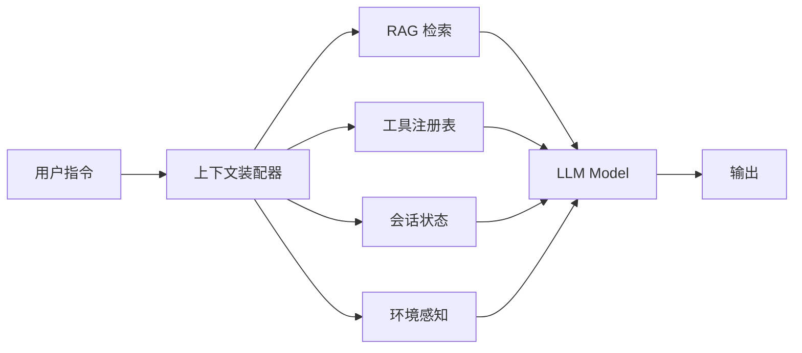
```mermaid
graph LR
    A[用户指令] --> B[上下文装配器]
    B --> C[RAG 检索]
    B --> D[工具注册表]
    B --> E[会话状态]
    B --> F[环境感知]
    C --> G[LLM Model]
    D --> G
    E --> G
    F --> G
    G --> H[输出]
```

**与 Prompt Engineering 的本质区别**：Prompt Engineering 关注"怎么说"，Context Engineering 关注"给什么"。前者优化指令的表达方式，后者优化输入信息的质量和结构。

### 1.2.3 第三次范式：Harness Engineering（驾驭工程）

**时间线：2026 年初至今**

Harness Engineering 的引爆点来自两个里程碑事件：

1. **Anthropic 工程博客**（2025 年 11 月）：*"Effective harnesses for long-running agents"*——首次将 Claude Agent SDK 定义为"一个强大的、通用的 Agent Harness" [^anthropic-blog]
2. **OpenAI 工程博客**（2026 年 2 月）：*"Harness engineering: leveraging Codex in an agent-first world"*——展示了一个 3 人团队用 Codex Agent 在 5 个月内生成 100 万行生产级代码，合并约 1500 个 PR，零行人工手写代码 [^openai-blog]

**正式定义**：

> Harness Engineering 是围绕 AI Agent 设计、构建和维护一整套**可执行、可验证、可约束、可迭代**的外层运行系统的工程学科。它将 Agent 视为一个长期运行的软件系统来治理，而非一次性的对话交互。

**工作原理**：Harness 作为包裹在模型外围的确定性外壳，包含以下核心能力：

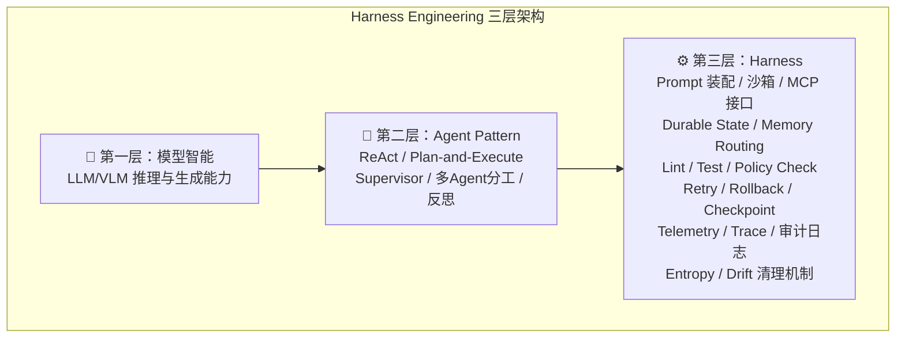
```mermaid
graph TB
    subgraph "Harness Engineering 三层架构"
        A["🧠 第一层：模型智能<br/>LLM/VLM 推理与生成能力"]
        B["🔄 第二层：Agent Pattern<br/>ReAct / Plan-and-Execute<br/>Supervisor / 多Agent分工 / 反思"]
        C["⚙️ 第三层：Harness<br/>Prompt 装配 / 沙箱 / MCP 接口<br/>Durable State / Memory Routing<br/>Lint / Test / Policy Check<br/>Retry / Rollback / Checkpoint<br/>Telemetry / Trace / 审计日志<br/>Entropy / Drift 清理机制"]
    end
    
    A --> B
    B --> C
```

**与第二次范式的本质区别**：Context Engineering 解决的是"给模型什么信息"，Harness Engineering 解决的是"模型拿到信息后如何行动、如何被约束、如何被验证、如何从失败中恢复"。

Mitchell Hashimoto 的核心思想概括：

> 每当 Agent 犯了一个错误，不要只改 Prompt，而是花时间**工程化一个机制**，确保它永远不再犯同样的错误。

### 1.2.4 范式演进对比表

| 维度 | Prompt Engineering | Context Engineering | Harness Engineering |
|---|---|---|---|
| 核心问题 | 如何让模型理解我的意图？ | 如何让模型获得正确的信息？ | 如何让模型可靠地完成任务？ |
| 关键产物 | 提示词模板 | 上下文装配器 | 运行时治理系统 |
| 模型角色 | 一次性问答对象 | 信息处理引擎 | 持续执行的 Agent |
| 失败处理 | 改写 Prompt | 补充上下文 | 增加约束/修复/回退机制 |
| 工程师角色 | 提示词撰写者 | 信息架构师 | 环境设计师 + 规则制定者 |
| 类比 | 写一封邮件 | 准备一份 briefing 文档 | 搭建一个工厂流水线 |

---

## 1.3 核心术语精确区分表

| 术语 | 英文 | 定义 | 职责边界 | 类比 |
|---|---|---|---|---|
| **Agent** | Agent | 具备感知、推理、规划、行动能力的自主实体，通常由模型 + Harness 构成 | 执行具体任务，通过工具与环境交互 | 员工 |
| **Harness** | Harness | 围绕模型的运行时基础设施总和，包含工具、记忆、上下文、权限、验证、修复等 | 为模型提供执行环境、约束和行为治理 | 操作系统 + 工位 |
| **Framework** | Framework | 用于构建 Agent/Harness 的编程抽象层和 SDK | 提供 API、抽象和开发工具 | 编程语言 + 标准库 |
| **Orchestrator** | Orchestrator | 协调多个 Agent 或工具执行顺序的控制组件 | 负责任务分解、分发、进度追踪和结果聚合 | 项目经理 |
| **Router** | Router | 根据输入内容动态选择目标 Agent 或工具的路由组件 | 做分类和分发决策，将请求导向正确的处理单元 | 前台/分诊台 |

### 1.3.1 它们如何协作

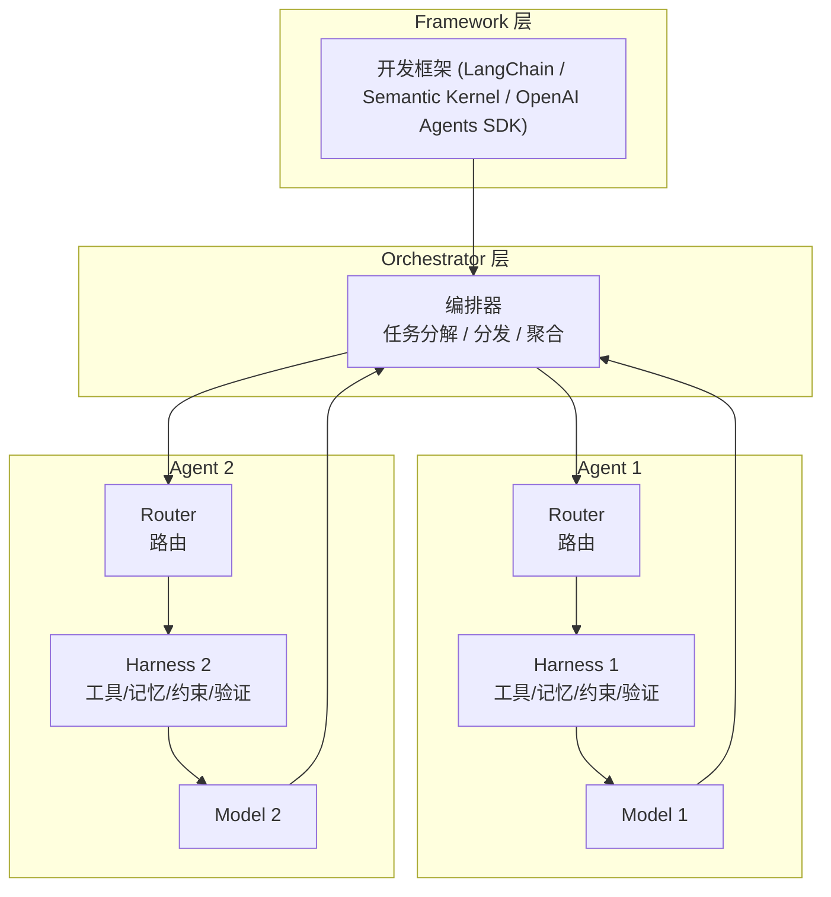
```mermaid
graph TB
    subgraph "Framework 层"
        FW["开发框架 (LangChain / Semantic Kernel / OpenAI Agents SDK)"]
    end
    
    subgraph "Orchestrator 层"
        ORCH["编排器<br/>任务分解 / 分发 / 聚合"]
    end
    
    subgraph "Agent 1"
        R1["Router<br/>路由"] --> H1["Harness 1<br/>工具/记忆/约束/验证"]
        H1 --> M1["Model 1"]
    end
    
    subgraph "Agent 2"
        R2["Router<br/>路由"] --> H2["Harness 2<br/>工具/记忆/约束/验证"]
        H2 --> M2["Model 2"]
    end
    
    FW --> ORCH
    ORCH --> R1
    ORCH --> R2
    M1 --> ORCH
    M2 --> ORCH
```

**关键区别总结**：
- **Framework** 是造轮子的工具，**Harness** 是轮子本身
- **Orchestrator** 管"谁在什么时候做什么"，**Router** 管"这个请求该给谁"
- **Agent** 是干活的实体，**Harness** 是 Agent 赖以工作的环境

---

## 1.4 "Agent = Model + Harness" 黄金法则详解

### 1.4.1 公式拆解

这个由 LangChain 工程师 Viv 提出的公式 [^langchain-viv] 是理解 Agent 架构最核心的认知框架：

```
Agent（智能体） = Model（模型） + Harness（驾驭层）
```

**Model（模型）**：提供原始算力的 "CPU"，负责思考、推理和生成。但它只有能力，没有规矩。单独的模型是"野马"——聪明但不可预测。

**Harness（驾驭层）**：提供运行环境的 "操作系统"，包含以下五个核心模块：

| 模块 | 作用 | 类比 |
|---|---|---|
| **Tools（工具）** | 给模型"双手"——文件读写、Shell 执行、网络请求、数据库操作 | 手 |
| **Knowledge（知识）** | 给模型"领域经验"——产品文档、API 规范、代码风格指南，按需加载 | 经验 |
| **Observation（观察）** | 给模型"眼睛"——Git 变更、错误日志、浏览器状态、环境信息 | 眼睛 |
| **Action Interfaces（执行接口）** | 给模型"行动通道"——统一动作输出格式，CLI / API / UI | 腿 |
| **Permissions（权限）** | 给模型"边界"——沙箱隔离、危险操作拦截、人工审批 | 笼子 |

### 1.4.2 为什么不是 Agent = Model + Tools

很多人误以为"只要给模型配上工具调用能力，它就是 Agent 了"。这是对 Agent 架构最常见的误解。

工具只是 Harness 的一部分。一个完整的 Harness 必须同时具备：

1. **记忆能力**：跨轮次保持上下文，否则每次调用都是"失忆"的新会话
2. **约束机制**：规定能做什么、不能做什么，否则模型会越界操作
3. **验证回路**：检查结果是否符合预期，否则幻觉会悄无声息地进入生产系统
4. **错误恢复**：失败后自动重试、回退或升级，否则会卡在错误状态
5. **可观测性**：追踪每一步的推理、工具调用和决策，否则出了问题无从排查

**结论**：只有工具而没有 Harness 的模型，就像一个被递了扳手但没有任何工作纪律的工人——他可能修好一台机器，也可能拆毁整个车间。

### 1.4.3 真实案例：OpenAI 的 100 万行代码实验

OpenAI 在 2026 年 2 月发布的博客中披露了一个震撼性的实验 [^openai-blog]：

- **团队规模**：最初 3 名工程师，后扩展到 7 人
- **时间跨度**：约 5 个月
- **产出**：超过 100 万行生产级代码，约 1500 个 PR 合并
- **关键约束**：零行人工手写代码（刻意的）
- **人均产出**：每位工程师每天处理 3.5 个 PR
- **效率提升**：约为传统开发模式的 10 倍

这个项目的成功不是依靠某个"超级提示词"，而是依靠一套高度自动化的 Harness 系统：

```
严格分层架构 (Types → Config → Repo → Service → Runtime → UI)
        ↓
Codex 自动生成 Linter 与结构化测试
        ↓
强制约束架构，防止代码偏离设计
        ↓
PR 审核自动化 + 人工审批门控
        ↓
100 万行代码，零行人工手写
```

**核心洞察**：工程师的角色从"编码者"转变为"环境设计师"和"规则制定者"。

---

## 1.5 为什么需要 Harness：失控的五种模式与生产级挑战

### 1.5.1 失控的五种模式

在缺乏 Harness 的情况下，AI Agent 在生产环境中会表现出以下五种典型的失控模式：

**模式一：幻觉级联（Hallucination Cascade）**

模型在某一步产生了看似合理但实际错误的推理，后续步骤基于这个错误前提继续推理，导致错误不断放大。

**模式二：无限循环（Infinite Loop）**

Agent 在 ReAct 循环中陷入死循环，反复执行相同的操作而不自知。

**模式三：越界操作（Out-of-Bound Action）**

模型执行了权限之外的操作，如删除生产数据库、向用户发送未审批的消息、调用超出预算的 API。

**模式四：上下文溢出（Context Overflow）**

随着对话轮次增加，上下文窗口逐渐被填满，模型开始遗忘关键信息，决策质量急剧下降。

**模式五：状态漂移（State Drift）**

Agent 在长任务执行过程中，环境状态发生了变化（如依赖更新、API 接口变更），但 Agent 仍然基于过时的认知执行操作。

### 1.5.2 从"玩具"到"生产"的鸿沟

| 维度 | 玩具级（Demo） | 生产级（Harness 加持） |
|---|---|---|
| 执行轮次 | 1-3 轮 | 数十到数百轮 |
| 错误处理 | 崩溃即终止 | 自动重试 / 回退 / 人工升级 |
| 上下文管理 | 全量加载 | 按需检索 + 压缩摘要 + 窗口优化 |
| 安全 | 无 | 沙箱 + 权限 + 内容护栏 + 审批流 |
| 可观测性 | 无或仅有日志 | Tracing + Metrics + Logging 三支柱 |
| 状态管理 | 内存中 | 持久化存储 + 断点续传 |
| 验证 | 人工检查 | 自动化测试 + LLM-as-Judge + 规则校验 |
| 成本控制 | 不计成本 | Token 预算 + 模型分级 + 上下文压缩 |

---

# 第 2 章：Harness 的核心组件架构

## 2.0 整体架构概览

一个完整的 Agent Harness 由 12 个核心组件构成，它们协同工作，将裸模型转化为可靠的生产级 Agent。

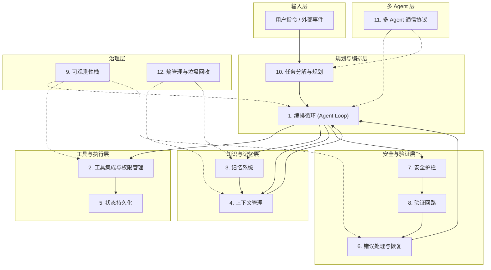
```mermaid
graph TB
    subgraph "输入层"
        INPUT["用户指令 / 外部事件"]
    end
    
    subgraph "规划与编排层"
        TD["10. 任务分解与规划"]
        LOOP["1. 编排循环 (Agent Loop)"]
    end
    
    subgraph "知识与记忆层"
        MEM["3. 记忆系统"]
        CTX["4. 上下文管理"]
    end
    
    subgraph "工具与执行层"
        TOOL["2. 工具集成与权限管理"]
        STATE["5. 状态持久化"]
    end
    
    subgraph "安全与验证层"
        GUARD["7. 安全护栏"]
        VERIFY["8. 验证回路"]
        ERR["6. 错误处理与恢复"]
    end
    
    subgraph "治理层"
        OBS["9. 可观测性栈"]
        GC["12. 熵管理与垃圾回收"]
    end
    
    subgraph "多 Agent 层"
        MULTI["11. 多 Agent 通信协议"]
    end
    
    INPUT --> TD
    TD --> LOOP
    LOOP --> TOOL
    LOOP --> MEM
    LOOP --> CTX
    TOOL --> STATE
    MEM --> CTX
    CTX --> LOOP
    LOOP --> GUARD
    GUARD --> VERIFY
    VERIFY --> ERR
    ERR --> LOOP
    OBS -.-> LOOP
    OBS -.-> TOOL
    OBS -.-> ERR
    GC -.-> CTX
    GC -.-> MEM
    MULTI -.-> LOOP
    MULTI -.-> TD
```

---

## 2.1 编排循环（Agent Loop / ReAct 循环）

### 2.1.1 概念定义

编排循环是 Harness 的心脏——一个驱动 Agent 持续感知、推理、行动和观察的迭代执行引擎。它使得 Agent 不再是"一问一答"的聊天机器人，而是能够跨多个步骤自主完成复杂任务的智能体。

一个标准的 Agent 循环包含五个阶段 [^oracle-loop]：

1. **Perceive（感知）**：接收用户指令、工具执行结果、环境变化
2. **Reason（推理）**：基于当前上下文分析情况，理解约束和目标
3. **Plan（规划）**：制定下一步行动方案，选择合适的工具
4. **Act（行动）**：执行选定的工具或操作
5. **Observe（观察）**：收集执行结果，评估是否达到目标

### 2.1.2 工作原理

编排循环本质上是一个带终止条件的 `while` 循环，但在每一步都嵌入了治理逻辑：

```python
class AgentLoop:
    def __init__(self, model, tools, max_iterations=50, guardrails=None):
        self.model = model
        self.tools = tools
        self.max_iterations = max_iterations
        self.guardrails = guardrails
        self.state = AgentState()
        self.iteration = 0

    def run(self, task: str) -> Result:
        self.state.current_task = task

        while not self.state.is_complete and self.iteration < self.max_iterations:
            self.iteration += 1

            # 1. 感知 — 收集当前状态和上下文
            context = self._build_context()

            # 2-3. 推理与规划 — 模型决定下一步
            decision = self.model.decide(context)

            # 4. 安全护栏 — 检查操作是否被允许
            if not self.guardrails.check(decision.action):
                self.state.log_violation(decision)
                decision = self._fallback_decision()

            # 5. 行动 — 执行工具调用
            result = self.tools.execute(decision.action)

            # 6. 观察 — 评估结果
            self.state.append(result)

            # 7. 验证 — 检查结果是否符合预期
            if self._verify(result):
                self.state.mark_progress(decision.action, result)
            else:
                self.state.record_failure(decision, result)

            # 8. 检测循环 — 如果连续 3 次相同操作则中断
            if self._detect_loop():
                self._break_loop("检测到重复循环")
                break

        return self._finalize()
```

### 2.1.3 流程图

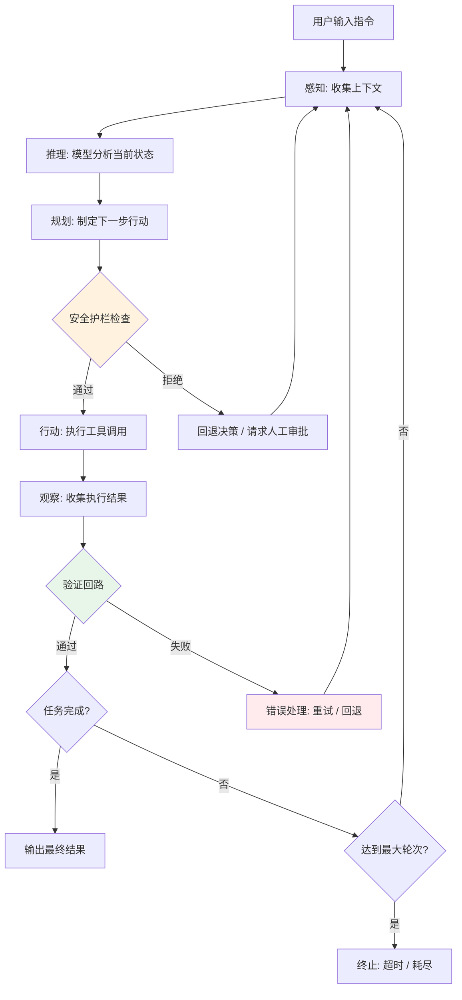
```mermaid
flowchart TD
    A["用户输入指令"] --> B["感知: 收集上下文"]
    B --> C["推理: 模型分析当前状态"]
    C --> D["规划: 制定下一步行动"]
    D --> E{"安全护栏检查"}
    E -->|通过| F["行动: 执行工具调用"]
    E -->|拒绝| G["回退决策 / 请求人工审批"]
    G --> B
    F --> H["观察: 收集执行结果"]
    H --> I{"验证回路"}
    I -->|通过| J{"任务完成?"}
    I -->|失败| K["错误处理: 重试 / 回退"]
    K --> B
    J -->|是| L["输出最终结果"]
    J -->|否| M{"达到最大轮次?"}
    M -->|是| N["终止: 超时 / 耗尽"]
    M -->|否| B
    
    style E fill:#fff3e0
    style I fill:#e8f5e9
    style K fill:#ffebee
```

### 2.1.4 常见误区

| 误区 | 正确理解 |
|---|---|
| "Agent Loop 就是让模型多轮对话" | 多轮对话只是表象，Agent Loop 的核心是**感知-推理-行动-观察**的闭环，每次循环都要改变环境状态 |
| "循环次数越多越好" | 循环次数必须有上限（通常 20-50 轮），超过上限应终止并返回中间结果，否则会浪费大量 token |
| "模型自己知道什么时候停止" | 模型经常不知道自己是否完成了任务。需要外部终止条件：目标达成检测、最大轮次、超时、人工干预 |
| "每次循环都应该调用工具" | 不是的。有时模型只需要推理和规划，不需要工具调用。强制每次调用工具会导致无意义的操作 |

---

## 2.2 工具集成与权限管理

### 2.2.1 概念定义

工具集成层赋予 Agent 与外部世界交互的能力——读写文件、执行命令、调用 API、操作数据库。权限管理则为每个工具调用设置安全边界，确保 Agent 不会执行危险或越界操作。

根据 OpenAI 的 Codex Harness 设计 [^openai-blog]，工具必须做到**原子化、可组合、可描述**——每个工具是一个独立的、可测试的最小操作单元，多个工具可以组合成复杂的工作流。

### 2.2.2 工作原理

工具注册与权限管理遵循以下架构：

```python
class ToolDefinition:
    name: str
    description: str
    parameters: Dict[str, Any]  # JSON Schema
    required_permissions: List[str]

class ToolRegistry:
    def __init__(self):
        self.tools: Dict[str, ToolDefinition] = {}
        self.permissions: Dict[str, PermissionLevel] = {}

    def register(self, tool: ToolDefinition):
        """注册工具，包括名称、描述、参数 Schema"""
        self.tools[tool.name] = tool

    def check_permission(self, tool_name: str, context: ExecutionContext) -> bool:
        """检查当前上下文是否允许执行该工具"""
        required = self.tools[tool_name].required_permissions
        return all(self.permissions.get(r, PermissionLevel.DENY) <= context.level for r in required)

class PermissionLevel(Enum):
    READ_ONLY = 1        # 只读：查看文件、查询数据库
    READ_WRITE = 2       # 读写：修改文件、更新数据库
    EXECUTE = 3          # 执行：运行命令、部署服务
    ADMIN = 4            # 管理：删除资源、修改权限
    DENY = 0             # 禁止：不可访问
```

**MCP（Model Context Protocol）标准化**：

MCP 协议定义了工具如何标准化接入宿主程序。工具提供者只需要实现三个基本操作：

```
Initialize   → 告知宿主我有哪些工具可用
Call Tool    → 宿主请求执行某个工具，传入参数
List Tools   → 宿主查询所有已注册的工具及其描述
```

### 2.2.3 代码示例

```json
{
  "name": "query_slow_sql",
  "description": "查询指定微服务在特定时间段内的慢 SQL 日志",
  "parameters": {
    "type": "object",
    "properties": {
      "service_name": { "type": "string", "description": "目标微服务名称" },
      "start_time": { "type": "string", "format": "date-time", "description": "查询起始时间 (ISO 8601)" },
      "end_time": { "type": "string", "format": "date-time", "description": "查询结束时间 (ISO 8601)" },
      "threshold_ms": { "type": "integer", "description": "慢 SQL 阈值（毫秒），默认 1000", "default": 1000 }
    },
    "required": ["service_name", "start_time", "end_time"]
  },
  "permissions": ["READ_ONLY", "DATABASE_ACCESS"]
}
```

### 2.2.4 常见误区

| 误区 | 正确理解 |
|---|---|
| "给模型越多工具越好" | 工具过多会导致模型选择困难，增加 token 消耗和幻觉率。应该根据任务动态加载相关工具 |
| "工具描述不重要" | 工具描述是模型理解工具的唯一途径。描述模糊或不准确会导致模型调用错误的工具 |
| "权限是二元的（允许/禁止）" | 权限应该是分级的，且与上下文相关。同一个工具在不同场景下需要不同权限级别 |
| "工具失败就是 Bug" | 工具失败是正常现象——网络超时、API 限流、资源不可用。Harness 必须优雅处理工具失败 |

---

## 2.3 记忆系统（短期/长期/向量存储）

### 2.3.1 概念定义

记忆系统为 Agent 提供跨轮次、跨会话、跨任务的知识存储能力。没有记忆的 Agent 就像患了失忆症——每次对话都是全新的开始，无法积累经验和学习。

| 层次 | 类型 | 存储介质 | 寿命 | 用途 |
|---|---|---|---|---|
| **短期记忆** | 会话上下文 | 内存 / 上下文窗口 | 单次会话 | 维持对话连续性，保存最近几轮交互 |
| **中期记忆** | 工作区状态 | 数据库 / 文件系统 | 任务生命周期 | 保存中间结果、草稿、临时数据 |
| **长期记忆** | 知识库 / 向量存储 | 向量数据库（如 Pinecone、Milvus） | 永久 | 跨会话知识积累、经验教训、领域知识 |

### 2.3.2 工作原理

**短期记忆**：存储在模型的上下文窗口中，按时间顺序保存最近的交互记录。当上下文接近满载时，通过压缩策略（摘要、裁剪）释放空间。

**中期记忆**：存储在外部数据库中，Agent 在需要时主动查询和更新。

**长期记忆**：通过向量嵌入（Embedding）将知识转换为高维向量，存储在向量数据库中。当 Agent 需要知识时，通过语义相似度检索最相关的片段。

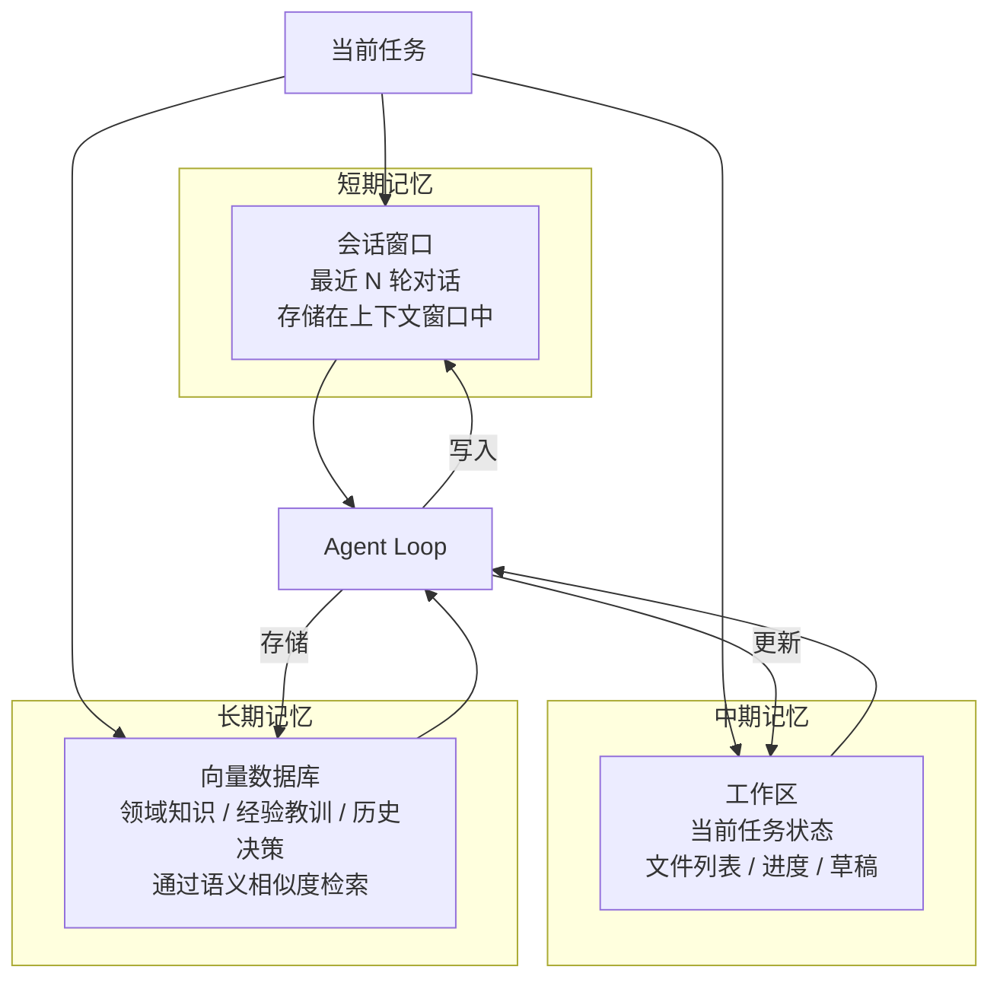
```mermaid
graph TB
    subgraph "短期记忆"
        SW["会话窗口<br/>最近 N 轮对话<br/>存储在上下文窗口中"]
    end
    
    subgraph "中期记忆"
        WS["工作区<br/>当前任务状态<br/>文件列表 / 进度 / 草稿"]
    end
    
    subgraph "长期记忆"
        DB["向量数据库<br/>领域知识 / 经验教训 / 历史决策<br/>通过语义相似度检索"]
    end
    
    INPUT["当前任务"] --> SW
    INPUT --> WS
    INPUT --> DB
    SW --> AGENT["Agent Loop"]
    WS --> AGENT
    DB --> AGENT
    AGENT -->|写入| SW
    AGENT -->|更新| WS
    AGENT -->|存储| DB
```

### 2.3.3 代码示例

```python
class MemorySystem:
    def __init__(self, vector_store, state_db):
        self.short_term = []           # 短期记忆
        self.mid_term = state_db       # 中期记忆
        self.long_term = vector_store  # 长期记忆

    def add_short_term(self, message: Message):
        self.short_term.append(message)
        if len(self.short_term) > MAX_CONTEXT_WINDOW:
            self._compress_short_term()

    def retrieve_long_term(self, query: str, top_k: int = 5) -> List[Knowledge]:
        """通过语义相似度检索相关知识"""
        embedding = self._embed(query)
        return self.long_term.search_similar(embedding, top_k=top_k)

    def _compress_short_term(self):
        """将早期对话压缩为摘要"""
        early_messages = self.short_term[:-KEEP_RECENT_TURNS]
        summary = self.model.summarize(early_messages)
        self.short_term = [MemoryEntry(type="summary", content=summary)] + \
                          self.short_term[-KEEP_RECENT_TURNS:]
```

### 2.3.4 常见误区

| 误区 | 正确理解 |
|---|---|
| "把所有历史对话都塞进上下文窗口" | 上下文窗口是有限的，且过多历史信息会降低模型注意力。应该按需检索 + 压缩摘要 |
| "向量数据库能解决所有记忆问题" | 向量检索擅长模糊匹配，但不适合精确查询。需要混合存储策略 |
| "记忆越多越好" | 无关的记忆会产生干扰。检索的精度比数量更重要——"恰好"的信息优于"全部"的信息 |

---

## 2.4 上下文管理与窗口优化

### 2.4.1 概念定义

上下文管理决定了 Agent 在每一轮决策时"看到什么信息"。核心原则：**Agent 应当恰好获得当前任务所需的上下文，不多不少。**

### 2.4.2 工作原理

上下文管理系统通过以下策略优化窗口使用：

1. **分层注入**：系统提示词（固定） > 任务指令（半固定） > 检索知识（动态） > 会话历史（动态） > 工具结果（动态）
2. **按需加载**：不在启动时加载全部知识，而是在 Agent 需要时通过 RAG 检索相关片段
3. **窗口压缩**：当上下文接近满载时，将早期内容压缩为摘要
4. **优先级裁剪**：当必须丢弃部分内容时，优先保留最近的交互和关键工具结果

### 2.4.3 代码示例

```python
class ContextManager:
    def __init__(self, max_tokens: int = 128_000):
        self.max_tokens = max_tokens
        self.system_prompt = ""
        self.task_instruction = ""
        self.retrieved_knowledge = []
        self.conversation_history = []
        self.tool_results = []

    def build_context(self) -> str:
        context_parts = [self.system_prompt, self.task_instruction]
        if self.retrieved_knowledge:
            context_parts.extend(self.retrieved_knowledge)
        history = self._compress_if_needed(self.conversation_history)
        context_parts.append(history)
        context_parts.extend(self.tool_results[-MAX_RECENT_RESULTS:])
        context = "\n\n".join(context_parts)
        self._assert_within_window(context)
        return context

    def _compress_if_needed(self, history: List[str]) -> str:
        if self._estimate_tokens(history) > self.max_tokens * 0.4:
            recent = history[-KEEP_TURNS:]
            early_summary = self.model.summarize(history[:-KEEP_TURNS])
            return f"[早期对话摘要]\n{early_summary}\n\n[最近对话]\n" + "\n".join(recent)
        return "\n".join(history)
```

### 2.4.4 常见误区

| 误区 | 正确理解 |
|---|---|
| "上下文窗口越大越好" | 更大的窗口意味着更高的成本和更差的注意力。模型在超大上下文中的注意力会分散 |
| "压缩摘要不会影响质量" | 摘要会丢失细节信息。应该在压缩时保留关键决策点和错误信息 |
| "上下文管理就是 Prompt 优化" | Prompt 只是上下文的一部分。上下文管理还包括工具结果、检索知识、会话历史的动态装配 |

---

## 2.5 状态持久化与生命周期管理

### 2.5.1 概念定义

状态持久化确保 Agent 的执行状态在进程重启、服务部署、网络中断等情况下不丢失。生命周期管理则跟踪 Agent 从创建、运行、暂停到终止的完整生命周期。

OpenAI 的 Responses API 文档明确强调了 **resumable state**（可恢复状态）的重要性 [^openai-responses]：长任务 Agent 必须能够从任意检查点恢复，而不是从头开始。

### 2.5.2 工作原理

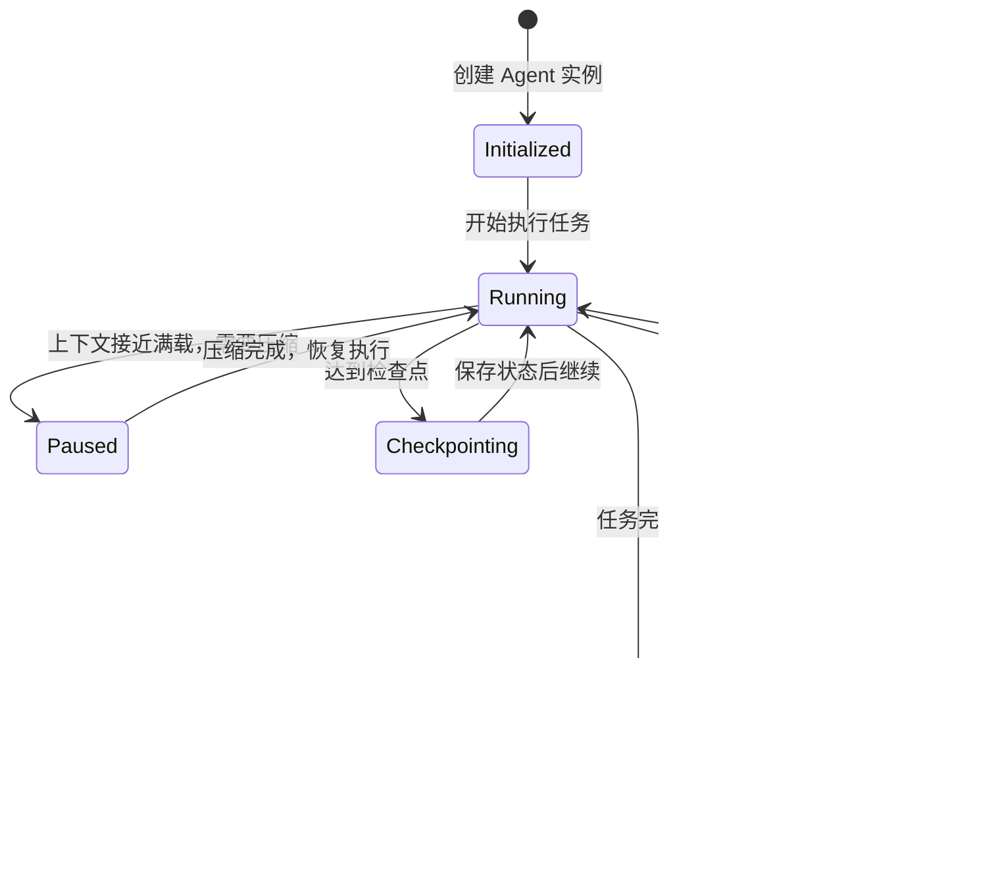
```mermaid
stateDiagram-v2
    [*] --> Initialized : 创建 Agent 实例
    Initialized --> Running : 开始执行任务
    Running --> Paused : 上下文接近满载，需要压缩
    Running --> Checkpointing : 达到检查点
    Running --> Failed : 不可恢复错误
    Checkpointing --> Running : 保存状态后继续
    Paused --> Running : 压缩完成，恢复执行
    Failed --> Retrying : 自动重试 (最多 N 次)
    Retrying --> Running : 重试成功
    Retrying --> Escalated : 重试耗尽，升级给人工
    Running --> Completed : 任务完成
    Completed --> [*]
    Escalated --> [*]
```

**检查点策略**：
- **工具调用前后**：每次工具调用前后保存状态
- **轮次边界**：每 N 轮（如 5 轮）保存一次完整状态
- **决策关键点**：当模型做出重要决策（如删除文件、部署服务）时立即保存

### 2.5.3 代码示例

```python
@dataclass
class AgentCheckpoint:
    task_id: str
    iteration: int
    state: Dict[str, Any]
    tool_results: List[Result]
    conversation: List[Message]
    timestamp: datetime

class StateManager:
    def __init__(self, storage: StateStorage):
        self.storage = storage

    def save_checkpoint(self, checkpoint: AgentCheckpoint):
        self.storage.put(checkpoint.task_id, checkpoint.iteration, checkpoint)

    def load_latest(self, task_id: str) -> Optional[AgentCheckpoint]:
        return self.storage.get_latest(task_id)

    def rollback_to(self, task_id: str, iteration: int):
        checkpoint = self.storage.get(task_id, iteration)
        if checkpoint:
            self.storage.truncate_after(task_id, iteration)
```

### 2.5.4 常见误区

| 误区 | 正确理解 |
|---|---|
| "状态都在内存里，不需要持久化" | 进程崩溃、服务重启、容器重部署都会丢失内存状态。生产环境必须持久化 |
| "保存全部对话历史就够了" | 不仅要保存对话，还要保存工具调用结果、文件变更、环境状态等完整执行上下文 |
| "检查点越多越好" | 频繁的检查点会增加存储开销和延迟。应该在关键节点保存，平衡安全性和性能 |

---

## 2.6 错误处理与自动恢复

### 2.6.1 概念定义

错误处理层负责捕获、分类和响应 Agent 执行过程中的各种失败情况。与传统的 try-catch 不同，Agent 的错误恢复需要**语义理解**——不仅要捕获异常，还要理解错误原因并尝试修复。

### 2.6.2 工作原理

| 层次 | 策略 | 适用场景 |
|---|---|---|
| **自动重试** | 同一操作重试 1-3 次 | 网络超时、临时不可用 |
| **替代方案** | 尝试另一个工具或方法 | API 限流、工具不可用 |
| **上下文回退** | 回退到上一个检查点 | 状态污染、错误决策 |
| **人工升级** | 将问题提交给人工处理 | 不可恢复错误、权限不足 |
| **优雅降级** | 返回部分结果并标注质量 | 超时、资源耗尽 |

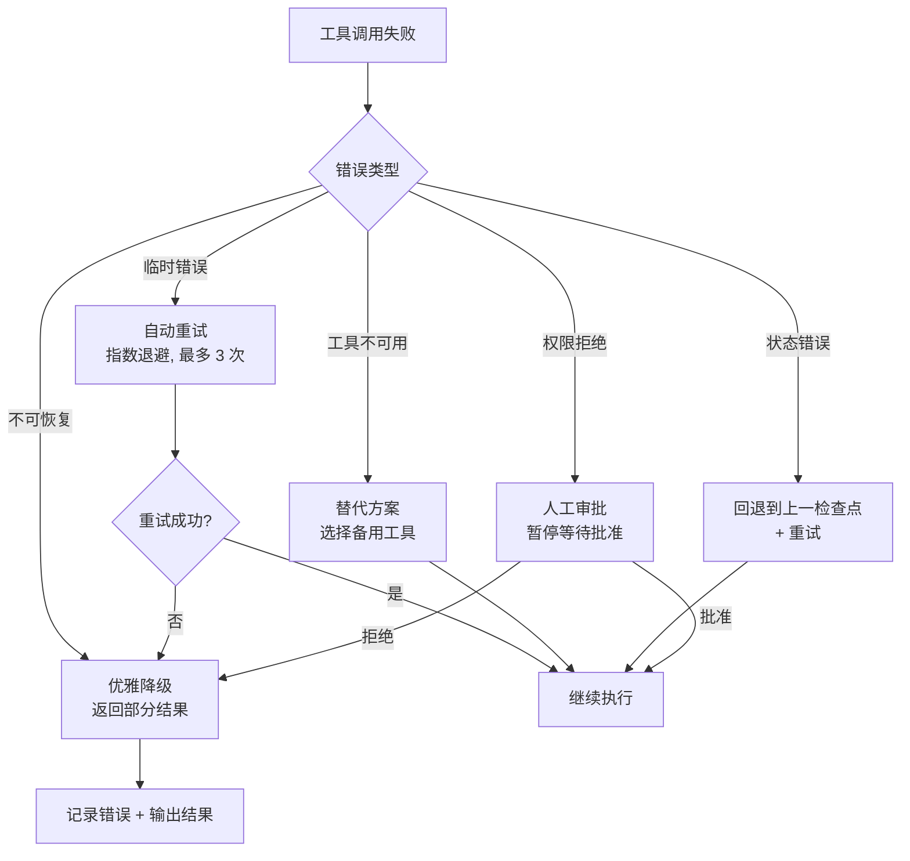
```mermaid
flowchart TD
    A["工具调用失败"] --> B{"错误类型"}
    B -->|临时错误| C["自动重试<br/>指数退避, 最多 3 次"]
    B -->|工具不可用| D["替代方案<br/>选择备用工具"]
    B -->|状态错误| E["回退到上一检查点<br/>+ 重试"]
    B -->|权限拒绝| F["人工审批<br/>暂停等待批准"]
    B -->|不可恢复| G["优雅降级<br/>返回部分结果"]
    
    C --> H{"重试成功?"}
    H -->|是| I["继续执行"]
    H -->|否| G
    D --> I
    E --> I
    F -->|批准| I
    F -->|拒绝| G
    G --> J["记录错误 + 输出结果"]
```

### 2.6.3 代码示例

```python
class ErrorHandler:
    def __init__(self, max_retries: int = 3):
        self.max_retries = max_retries
        self.retry_delays = [1, 2, 4]

    async def execute_with_recovery(self, operation: Callable) -> Result:
        last_error = None
        for attempt in range(self.max_retries):
            try:
                return await operation()
            except TransientError as e:
                last_error = e
                if attempt < self.max_retries - 1:
                    await asyncio.sleep(self.retry_delays[attempt])
                    self.log_retry(attempt, e)
                continue
            except PermanentError as e:
                return await self._escalate(e)
            except StateError as e:
                await self._rollback()
                return await self.execute_with_recovery(operation)

        return await self._graceful_degrade(last_error)
```

### 2.6.4 常见误区

| 误区 | 正确理解 |
|---|---|
| "错误处理就是 try-catch" | Agent 的错误是语义性的（如"模型生成了无效代码"），不仅仅是异常。需要理解错误内容并采取针对性修复 |
| "所有错误都应该重试" | 永久性错误（如权限拒绝、API 废弃）重试没有意义，应该快速失败并升级 |
| "错误恢复是 Agent 自己的事" | 错误恢复是 Harness 的职责，不应依赖模型的自省能力 |

---

## 2.7 安全护栏与约束机制

### 2.7.1 概念定义

安全护栏（Guardrails）是 Harness 中防止 Agent 执行危险或不当操作的约束层。它在模型输出和工具执行之间设置多个检查点，确保 Agent 的行为始终在安全边界内。

Microsoft Azure Architecture Guide 强调 [^azure-guide]：安全护栏应该应用于编排的多个节点——用户输入、工具调用、工具响应和最终输出。

### 2.7.2 工作原理

安全护栏采用**多层防御**策略：

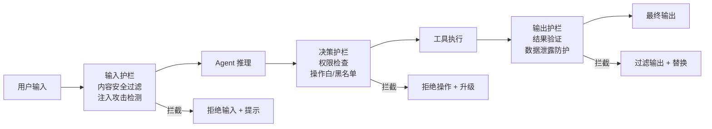
```mermaid
flowchart LR
    A["用户输入"] --> B["输入护栏<br/>内容安全过滤<br/>注入攻击检测"]
    B --> C["Agent 推理"]
    C --> D["决策护栏<br/>权限检查<br/>操作白/黑名单"]
    D --> E["工具执行"]
    E --> F["输出护栏<br/>结果验证<br/>数据泄露防护"]
    F --> G["最终输出"]
    
    B -->|拦截| X1["拒绝输入 + 提示"]
    D -->|拦截| X2["拒绝操作 + 升级"]
    F -->|拦截| X3["过滤输出 + 替换"]
```

| 约束类型 | 机制 | 示例 |
|---|---|---|
| **权限约束** | 基于角色的访问控制（RBAC） | Agent 不能删除生产数据库 |
| **操作约束** | 白名单/黑名单 | 只允许调用已注册的工具 |
| **内容约束** | 内容安全过滤器 | 不生成违规、有害内容 |
| **资源约束** | 配额和限速 | Token 预算、API 调用频率 |
| **注入防护** | 输入净化和隔离 | 防止用户输入操控 Agent 行为 |

### 2.7.3 代码示例

```python
class GuardrailSystem:
    def __init__(self, config: GuardrailConfig):
        self.input_filters: List[InputFilter] = config.input_filters
        self.operation_rules: List[OperationRule] = config.operation_rules
        self.output_filters: List[OutputFilter] = config.output_filters

    def check_input(self, user_input: str) -> GuardrailResult:
        for filter in self.input_filters:
            result = filter.evaluate(user_input)
            if result.violated:
                return result
        return GuardrailResult(passed=True)

    def check_operation(self, action: Action, context: ExecutionContext) -> GuardrailResult:
        if not self._check_permission(action, context):
            return GuardrailResult(violated=True, reason="权限不足")
        if action.name in self.operation_rules.blacklist:
            return GuardrailResult(violated=True, reason="操作被禁止")
        if not self._check_quota(action, context):
            return GuardrailResult(violated=True, reason="超出资源配额")
        if action.name in self.operation_rules.requires_approval:
            return GuardrailResult(pending_approval=True)
        return GuardrailResult(passed=True)
```

### 2.7.4 常见误区

| 误区 | 正确理解 |
|---|---|
| "安全护栏只检查最终输出" | 应该在输入、决策、工具调用、输出四个节点都设置护栏 |
| "护栏会降低 Agent 能力" | 好的护栏是透明的——它只拦截真正危险的操作，不影响正常任务流 |
| "安全是一次性配置" | 安全护栏需要持续演进。每次新的攻击向量或失败模式都应该被纳入护栏规则 |

---

## 2.8 验证回路与自我修复

### 2.8.1 概念定义

验证回路（Verification Loop）在 Agent 执行操作后自动检查结果是否符合预期，并在发现偏差时触发修复流程。它是 Harness 中确保输出质量的关键机制。

在 Microsoft Azure 的 Group Chat 编排模式中，**Maker-Checker Loop** 是一种经典的验证回路：一个 Agent 创建内容，另一个 Agent 检查质量，不通过则打回重做 [^azure-guide]。

### 2.8.2 工作原理

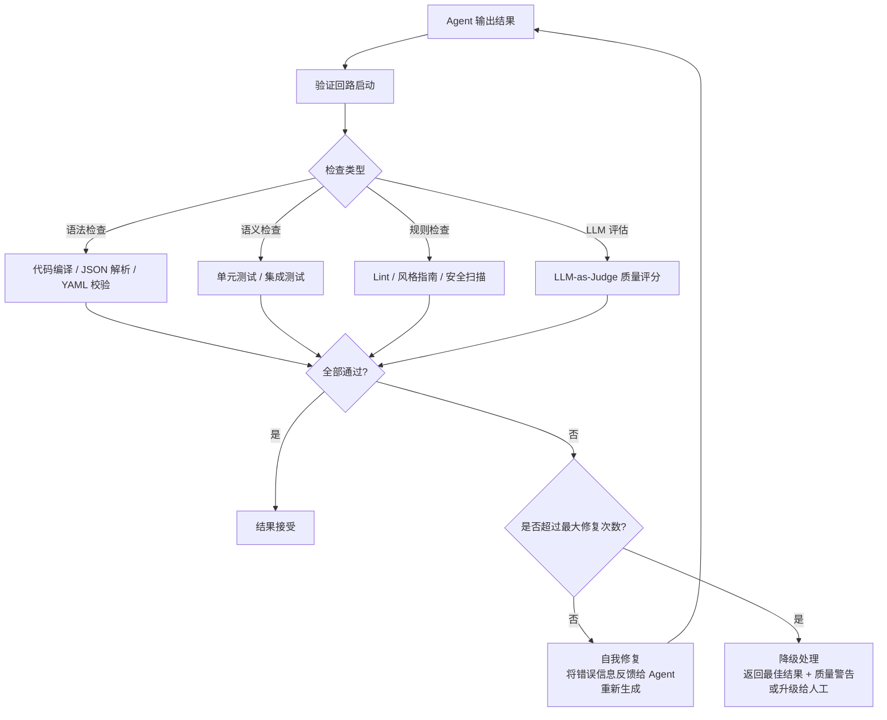
```mermaid
flowchart TD
    A["Agent 输出结果"] --> B["验证回路启动"]
    B --> C{"检查类型"}
    C -->|语法检查| D["代码编译 / JSON 解析 / YAML 校验"]
    C -->|语义检查| E["单元测试 / 集成测试"]
    C -->|规则检查| F["Lint / 风格指南 / 安全扫描"]
    C -->|LLM 评估| G["LLM-as-Judge 质量评分"]
    
    D --> H{"全部通过?"}
    E --> H
    F --> H
    G --> H
    
    H -->|是| I["结果接受"]
    H -->|否| J{"是否超过最大修复次数?"}
    J -->|否| K["自我修复<br/>将错误信息反馈给 Agent<br/>重新生成"]
    K --> A
    J -->|是| L["降级处理<br/>返回最佳结果 + 质量警告<br/>或升级给人工"]
```

### 2.8.3 代码示例

```python
class VerificationLoop:
    def __init__(self, max_repair_attempts: int = 3):
        self.max_repair_attempts = max_repair_attempts

    def verify_and_repair(self, output: Any, criteria: VerificationCriteria) -> Result:
        errors = self._run_checks(output, criteria)
        if not errors:
            return Result(status="passed", output=output)

        for attempt in range(self.max_repair_attempts):
            repair_prompt = f"""
            以下输出未通过验证：
            原始输出：{output}
            错误列表：{self._format_errors(errors)}
            请修复上述错误，输出修正后的结果。
            """
            repaired = self.model.generate(repair_prompt)
            new_errors = self._run_checks(repaired, criteria)
            if not new_errors:
                return Result(status="repaired", output=repaired, attempts=attempt + 1)
            errors = new_errors

        return Result(status="repair_exhausted", output=output, errors=errors, recommendation="人工审核")
```

### 2.8.4 常见误区

| 误区 | 正确理解 |
|---|---|
| "验证就是跑单元测试" | 对于 Agent 生成的内容，单元测试往往不够。需要结合 LLM-as-Judge、规则检查和人工审核 |
| "验证回路是可选的" | 在生产环境中，验证回路是必需的。没有验证的 Agent 输出可能包含幻觉、错误代码或不安全操作 |
| "修复次数无限制" | 必须设置修复上限（通常 3 次），否则可能陷入无限修复循环 |

---

## 2.9 可观测性栈（Tracing / Metrics / Logging）

### 2.9.1 概念定义

可观测性栈是 Harness 中用于理解、诊断和监控 Agent 系统行为的基础设施。对于 AI Agent 系统而言，可观测性不是"锦上添花"，而是"必需品"——因为 LLM 的内部推理不可见，行为非确定，调用链复杂。

| 支柱 | 回答的问题 | 数据类型 | 示例 |
|---|---|---|---|
| **Tracing（追踪）** | "请求在哪里流转？" | 层次化、分布式 | 用户请求 → Agent 处理 → LLM 调用 → 工具执行 → 返回结果 |
| **Metrics（指标）** | "系统表现如何？" | 数值型、可聚合 | 延迟、错误率、Token 使用量、成本 |
| **Logging（日志）** | "发生了什么？为什么？" | 文本型、事件记录 | LLM 调用日志、工具执行日志、错误日志 |

### 2.9.2 工作原理

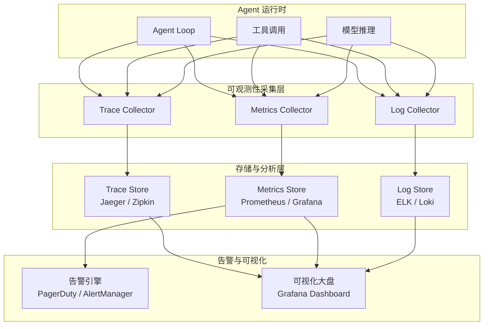
```mermaid
graph TB
    subgraph "Agent 运行时"
        A["Agent Loop"]
        B["工具调用"]
        C["模型推理"]
    end
    
    subgraph "可观测性采集层"
        D["Trace Collector"]
        E["Metrics Collector"]
        F["Log Collector"]
    end
    
    subgraph "存储与分析层"
        G["Trace Store<br/>Jaeger / Zipkin"]
        H["Metrics Store<br/>Prometheus / Grafana"]
        I["Log Store<br/>ELK / Loki"]
    end
    
    subgraph "告警与可视化"
        J["告警引擎<br/>PagerDuty / AlertManager"]
        K["可视化大盘<br/>Grafana Dashboard"]
    end
    
    A --> D & E & F
    B --> D & E & F
    C --> D & E & F
    D --> G
    E --> H
    F --> I
    G --> K
    H --> J & K
    I --> K
```

### 2.9.3 关键指标清单

| 类别 | 指标 | 说明 |
|---|---|---|
| **性能** | 端到端延迟 | 从用户输入到最终输出的总时间 |
| **性能** | 工具调用延迟 | 单个工具调用的平均/ P95 / P99 延迟 |
| **成本** | Token 消耗量 | 每轮 / 每次任务的 input + output token 总量 |
| **成本** | 每次任务成本 | Token 消耗量 x 模型单价 |
| **质量** | 验证通过率 | 通过验证回路的结果占比 |
| **质量** | 修复成功率 | 自动修复成功的比例 |
| **可靠性** | 任务完成率 | 成功完成的任务 / 总任务数 |
| **可靠性** | 循环检测触发率 | 被循环检测机制中断的占比 |

### 2.9.4 常见误区

| 误区 | 正确理解 |
|---|---|
| "日志就是 print" | 生产日志必须结构化（JSON 格式），包含 trace_id、timestamp、level 等标准字段 |
| "指标就是监控 CPU 和内存" | Agent 系统的核心指标是 Token 消耗、工具调用成功率、验证通过率等业务指标 |
| "Tracing 只用于微服务" | Agent 的每次推理、工具调用、决策都需要追踪。Tracing 是诊断 Agent 行为非确定性的关键手段 |

---

## 2.10 任务分解与规划

### 2.10.1 概念定义

任务分解与规划层负责将用户的复杂、高层指令拆解为 Agent 可执行的子任务序列。它是 Agent 从"理解意图"到"采取行动"之间的桥梁。

在 Microsoft Azure 的 Magentic 编排模式中 [^azure-guide]，Manager Agent 会动态构建和更新**任务账本（Task Ledger）**，包含目标、子目标、状态跟踪，并随着执行进展不断调整计划。

### 2.10.2 工作原理

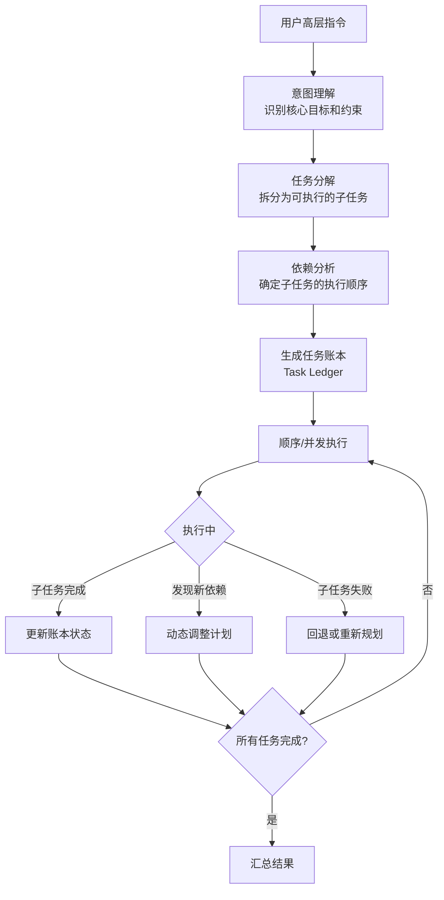
```mermaid
flowchart TD
    A["用户高层指令"] --> B["意图理解<br/>识别核心目标和约束"]
    B --> C["任务分解<br/>拆分为可执行的子任务"]
    C --> D["依赖分析<br/>确定子任务的执行顺序"]
    D --> E["生成任务账本<br/>Task Ledger"]
    E --> F["顺序/并发执行"]
    F --> G{"执行中"}
    G -->|子任务完成| H["更新账本状态"]
    G -->|发现新依赖| I["动态调整计划"]
    G -->|子任务失败| J["回退或重新规划"]
    H --> K{"所有任务完成?"}
    I --> K
    J --> K
    K -->|是| L["汇总结果"]
    K -->|否| F
```

### 2.10.3 任务账本（Task Ledger）结构

```json
{
  "task_id": "build-auth-api",
  "goal": "构建一个支持用户注册登录的 API 服务",
  "constraints": ["使用 PostgreSQL", "遵循 RESTful 规范", "包含 JWT 认证"],
  "subtasks": [
    { "id": "1", "description": "设计数据库 Schema", "status": "completed", "depends_on": [], "output": "schema.sql" },
    { "id": "2", "description": "实现用户注册 API", "status": "in_progress", "depends_on": ["1"], "output": null },
    { "id": "3", "description": "实现用户登录 API + JWT 签发", "status": "pending", "depends_on": ["1"], "output": null },
    { "id": "4", "description": "编写 API 文档", "status": "pending", "depends_on": ["2", "3"], "output": null }
  ]
}
```

### 2.10.4 常见误区

| 误区 | 正确理解 |
|---|---|
| "任务分解是一次性的" | 在执行过程中会发现新的依赖和约束。计划必须是动态的，能够在执行中调整 |
| "分解得越细越好" | 过度分解会增加协调开销。每个子任务应该足够小以便验证，但又足够大以减少协调次数 |
| "模型总能做出合理的规划" | 模型的规划能力有限，容易忽略边界条件和异常场景。Harness 应该提供规划模板和约束来引导模型 |

---

## 2.11 多 Agent 通信协议

### 2.11.1 概念定义

多 Agent 通信协议定义了多个 Agent 之间如何交换信息、协调任务、共享状态和解决冲突。

Microsoft Azure Architecture Guide 定义了五种核心的多 Agent 编排模式 [^azure-guide]：

| 模式 | 描述 | 适用场景 |
|---|---|---|
| **Sequential（顺序编排）** | Agent 按预定义的线性顺序链式执行 | 有清晰阶段依赖的工作流 |
| **Concurrent（并发编排）** | 多个 Agent 同时独立处理同一输入 | 需要多视角并行分析 |
| **Group Chat（群聊编排）** | 多个 Agent 在共享对话线程中协作讨论 | 需要共识构建和辩论 |
| **Handoff（交接编排）** | Agent 根据上下文动态将控制权转移给更专业的 Agent | 需求在运行时才明确 |
| **Magentic（磁性编排）** | Manager Agent 动态构建和调整任务账本，分派给 Specialist Agent 执行 | 开放式复杂问题 |

### 2.11.2 代码示例

```python
class MultiAgentProtocol:
    def __init__(self, agents: Dict[str, Agent], mode: OrchestrationMode):
        self.agents = agents
        self.mode = mode
        self.shared_state = SharedState()
        self.message_bus = MessageBus()

    def execute_handoff(self, input: str) -> Result:
        """Handoff 模式：动态路由 + 控制权转移"""
        current_agent = self.agents["triage"]
        context = {"input": input, "history": []}

        while True:
            result = current_agent.process(input, context)
            if result.transfer_to:
                current_agent = self.agents[result.transfer_to]
                context["history"].append({"agent": current_agent.name, "action": "handoff", "reason": result.transfer_reason})
                continue
            if result.escalate_to_human:
                return Result(status="escalated", output=result.output)
            return Result(status="completed", output=result.output)

    def execute_group_chat(self, input: str, max_rounds: int = 10) -> Result:
        """Group Chat 模式：共享对话线程中的协作"""
        thread = ConversationThread(input)
        for round_num in range(max_rounds):
            for agent_name, agent in self.agents.items():
                message = agent.respond_to_thread(thread)
                thread.append(agent_name, message)
                if self._check_consensus(thread):
                    return Result(status="consensus", output=thread.get_consensus())
        return Result(status="timeout", output=thread.summarize())
```

### 2.11.3 常见误区

| 误区 | 正确理解 |
|---|---|
| "多 Agent 总比单 Agent 强" | 多 Agent 引入协调开销、延迟和新的失败模式。只有当单 Agent 确实无法胜任时才使用 |
| "Agent 越多越好" | 每个新增 Agent 都增加通信复杂度和延迟。Azure Guide 建议 Group Chat 模式限制在 3 个 Agent 以内 |
| "Agent 之间可以随意共享所有信息" | 应该遵循最小信息原则——每个 Agent 只需要完成其任务所需的最少上下文 |

---

## 2.12 熵管理与垃圾回收

### 2.12.1 概念定义

熵管理（Entropy Management）是 Harness 中最容易被忽视但至关重要的组件。随着 Agent 长时间运行，系统中会积累大量"AI Slop"——低质量的摘要、冗余的中间结果、过时的缓存数据、漂移的状态信息。如果不清理，这些熵增会逐渐降低 Agent 的决策质量，最终导致系统崩溃。

**熵的来源**：
1. **上下文膨胀**：每轮对话都在增加上下文大小，即使经过压缩，摘要也在不断累积
2. **状态污染**：中间结果、临时文件、缓存数据如果不及时清理，会占用存储并导致混淆
3. **知识漂移**：长期记忆中的知识可能过时，需要定期验证和更新
4. **工具结果堆积**：失败的工具调用结果、重复的查询结果如果不清理，会干扰后续决策

### 2.12.2 代码示例

```python
class EntropyManager:
    def __init__(self, config: EntropyConfig):
        self.config = config

    def run_maintenance(self, agent_state: AgentState):
        if agent_state.context_size > self.config.max_context_size:
            self._compress_context(agent_state)
        self._cleanup_temp_files(max_age=self.config.temp_file_ttl)
        self._evict_cache(max_entries=self.config.max_cache_size)
        self._validate_knowledge(stale_threshold=self.config.knowledge_stale_days)
        self._prune_summaries(min_quality_score=self.config.min_summary_quality)

    def _compress_context(self, state: AgentState):
        """将早期上下文压缩为更紧凑的摘要"""
        early_context = state.conversation[:state.conversation.length // 2]
        compressed = self.model.summarize(early_context, max_tokens=500)
        state.conversation.replace_range(0, len(early_context), compressed)

    def _validate_knowledge(self, stale_threshold: int):
        stale_entries = self.memory.filter(age_days > stale_threshold)
        for entry in stale_entries:
            updated = self.source.fetch_latest(entry.key)
            if updated and updated != entry.content:
                self.memory.update(entry.key, updated)
            else:
                self.memory.remove(entry.key)
```

### 2.12.3 常见误区

| 误区 | 正确理解 |
|---|---|
| "清理就是删除文件" | 熵管理远不止清理文件。它涉及上下文压缩、缓存淘汰、知识更新、摘要质量裁剪等多个维度 |
| "等系统变慢了再清理" | 应该在熵积累到影响决策之前就定期清理。最好设置自动触发条件 |
| "所有数据都应该保留" | 保留所有历史数据的代价是决策质量下降。应该有明确的数据生命周期策略 |

---

# 第 3 章：Harness 部署架构演进

> **本章导读**：AI Agent 的 Harness 部署架构经历了从单机单体到全球分布式云边端协同的五次重大演进。

## 3.1 单体级 Harness（Single Agent Wrapper）

### 3.1.1 概念定义

单体级 Harness 是最早期的 AI Agent 部署形态，其核心特征是将**完整的感知-推理-行动循环**封装在单一进程中运行。所有组件都运行在同一台机器、同一个 Python/Node.js 进程中。

### 3.1.2 工作原理

核心循环（Agent Loop）在单线程中顺序执行：

1. **感知阶段**：接收用户输入，拼接系统提示词、对话历史、工具描述
2. **推理阶段**：调用 LLM API，获取思考结果和行动指令
3. **行动阶段**：本地执行工具调用
4. **观察阶段**：收集工具输出，追加到上下文
5. **循环判定**：LLM 判断是否已完成任务

```python
class SingleAgentHarness:
    def __init__(self, model, tools, memory):
        self.model = model
        self.tools = tools
        self.memory = memory
        self.max_iterations = 10

    def run(self, user_input: str) -> str:
        self.memory.append({"role": "user", "content": user_input})
        for _ in range(self.max_iterations):
            messages = self._build_messages()
            response = self.model.chat(messages)
            tool_call = self._parse_tool_call(response)
            if not tool_call:
                return response.content
            result = self.tools.execute(tool_call)
            self.memory.append({"role": "tool", "content": result})
        return "达到最大迭代次数，任务未完成"
```

### 3.1.3 架构示意

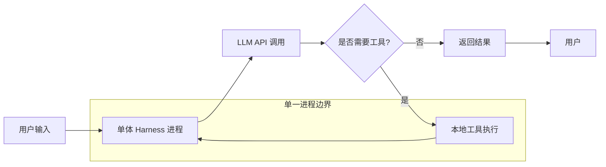
```mermaid
flowchart LR
    A[用户输入] --> B[单体 Harness 进程]
    B --> C[LLM API 调用]
    C --> D{是否需要工具?}
    D -->|是| E[本地工具执行]
    E --> B
    D -->|否| F[返回结果]
    F --> G[用户]

    subgraph "单一进程边界"
    B
    E
    end
```

### 3.1.4 数学模型

**总延迟公式**：
$$T_{total} = \sum_{i=1}^{n} (T_{LLM}^{(i)} + T_{tool}^{(i)})$$

其中 $n$ 为迭代次数。由于所有操作串行，CPU 利用率通常低于 15%。

### 3.1.5 适用场景

- **PoC / 原型验证**：快速验证 Agent 概念可行性
- **个人工具 / 脚本**：低流量、简单任务的自动化
- **学习研究**：理解 Agent 基本运行机制

---

## 3.2 垂直分层级 Harness

### 3.2.1 概念定义

垂直分层 Harness 将 Agent 系统按**功能职责**拆分为多个层次：表现层（UI/API）、业务逻辑层（推理引擎）、数据层（记忆与知识库）、工具层（外部服务调用）。

### 3.2.2 工作原理

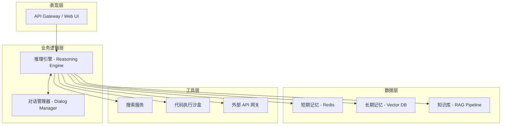
```mermaid
flowchart TB
    subgraph "表现层"
    A[API Gateway / Web UI]
    end

    subgraph "业务逻辑层"
    B[推理引擎 - Reasoning Engine]
    C[对话管理器 - Dialog Manager]
    B <--> C
    end

    subgraph "数据层"
    D[短期记忆 - Redis]
    E[长期记忆 - Vector DB]
    F[知识库 - RAG Pipeline]
    end

    subgraph "工具层"
    G[搜索服务]
    H[代码执行沙盒]
    I[外部 API 网关]
    end

    A --> B
    B --> D & E & F & G & H & I
```

### 3.2.3 数学模型

**分层架构的端到端延迟**：
$$T_{E2E} = \sum_{l=1}^{L} (T_{queue}^{(l)} + T_{service}^{(l)} + T_{network}^{(l)})$$

各层的**吞吐量**服从排队论模型（M/M/1 或 M/M/c）：
$$Throughput_l = \frac{\mu_l}{1 + \frac{\lambda_l}{c_l \cdot \mu_l - \lambda_l}}$$

### 3.2.4 适用场景

- **中小规模生产系统**：需要可靠性但不需要极端扩展能力
- **企业知识库问答**：RAG 管道天然适合分层架构
- **多模态 Agent**：不同模态的处理引擎可放在不同层

---

## 3.3 微服务化 Harness

### 3.3.1 概念定义

微服务化 Harness 将 Agent 系统的各个组件进一步拆分为**独立的、可独立部署的服务**，每个服务拥有自己的数据存储和生命周期。

### 3.3.2 工作原理

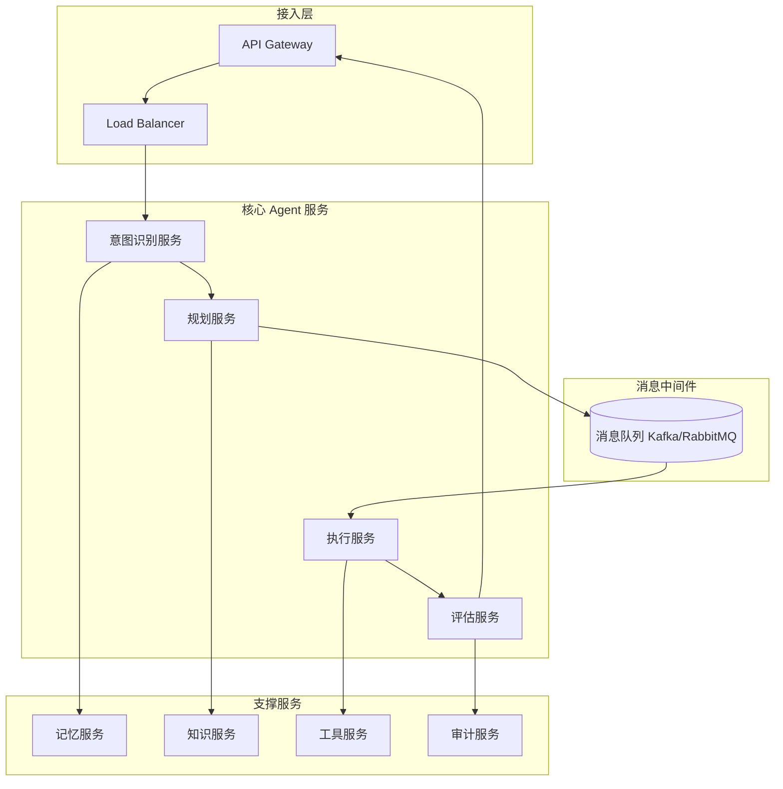
```mermaid
flowchart TB
    subgraph "接入层"
    API[API Gateway]
    LB[Load Balancer]
    end

    subgraph "核心 Agent 服务"
    Intent[意图识别服务]
    Planner[规划服务]
    Executor[执行服务]
    Evaluator[评估服务]
    end

    subgraph "支撑服务"
    MemorySvc[记忆服务]
    KnowledgeSvc[知识服务]
    ToolSvc[工具服务]
    AuditSvc[审计服务]
    end

    subgraph "消息中间件"
    MQ[(消息队列 Kafka/RabbitMQ)]
    end

    API --> LB --> Intent --> Planner --> MQ --> Executor --> Evaluator --> API

    Intent --> MemorySvc
    Planner --> KnowledgeSvc
    Executor --> ToolSvc
    Evaluator --> AuditSvc
```

### 3.3.3 数学模型

**可调度性模型**（WCRT）：
$$R_i = C_i + \sum_{j \in hp(i)} \left\lceil \frac{R_i}{T_j} \right\rceil \cdot C_j + B_i$$

系统**可调度**当且仅当 $\forall i: R_i \leq D_i$。

**故障恢复模型**（引入 $k$ 副本冗余后）：
$$A_i' = 1 - (1 - A_i)^k$$

### 3.3.4 适用场景

- **大规模企业级 Agent 平台**：需要支持数千并发会话
- **多租户 SaaS 产品**
- **高可用要求场景**：金融、医疗等行业

---

## 3.4 Kubernetes 原生云 Harness

### 3.4.1 概念定义

Kubernetes 原生云 Harness 将 Agent 系统的每个微服务以**容器化 Pod** 的形式运行在 Kubernetes 集群中，充分利用 K8s 的声明式编排、自动扩缩容、服务网格、可观测性等云原生能力。

### 3.4.2 关键组件

1. **自定义资源定义（CRD）**：将 Agent、Workflow、Tool 抽象为 K8s 原生资源
2. **Operator 模式**：通过 Controller 自动管理 Agent 的生命周期
3. **HPA/VPA**：基于 CPU/GPU 利用率或自定义指标自动扩缩容
4. **Service Mesh**：Istio/Linkerd 提供服务间通信的 mTLS、流量分割、故障注入
5. **可观测性栈**：Prometheus + Grafana + Jaeger 实现全链路监控

### 3.4.3 Agent CRD 示例

```yaml
apiVersion: agent.harness/v1
kind: AgentDeployment
metadata:
  name: research-agent
spec:
  replicas: 3
  strategy: RollingUpdate
  llm:
    model: "gpt-4o"
    maxTokens: 8192
  tools:
    - name: web-search
      endpoint: http://search-service:8080
    - name: code-executor
      endpoint: http://sandbox-service:8080
      sandbox:
        isolated: true
        networkPolicy: deny-all
  autoscaling:
    minReplicas: 2
    maxReplicas: 20
    metrics:
      - type: Pods
        pods:
          metric: agent_queue_depth
          targetAverageValue: 10
```

### 3.4.4 适用场景

- **企业级 Agent 平台**：需要 99.9%+ 可用性保障
- **多模型路由**：需要动态调度不同模型到不同 GPU 节点
- **大规模并发**：数百到数千 Agent 实例同时运行

---

## 3.5 云边端协同分布式 Harness

### 3.5.1 概念定义

云边端协同 Harness 将 Agent 系统的不同组件部署在**云中心、边缘节点、终端设备**三个层级，形成跨越地理和网络边界的分布式协作网络。

### 3.5.2 核心协同机制

1. **模型分发与更新**：云端训练大模型，通过 OTA 下发量化版本（INT8/FP16）到边缘节点
2. **状态同步**：边缘节点通过双阶段心跳（摘要哈希 + 增量同步）与云端保持一致
3. **任务卸载**：终端设备将复杂推理卸载到边缘，边缘将超出能力的任务上报云端
4. **本地自治**：边缘节点在断网时利用本地模型和记忆独立运行

### 3.5.3 数学模型

**三层架构的延迟优化模型**：
$$T_{avg} = \alpha \cdot T_{edge} + (1-\alpha) \cdot (T_{edge} + T_{network} + T_{cloud})$$

其中 $\alpha$ 为可本地处理的比例。

### 3.5.4 适用场景

- **工业 IoT**：工厂设备监控、预测性维护
- **智能零售**：门店客流分析、智能推荐
- **车联网**：自动驾驶感知 + 全局交通调度
- **远程医疗**：本地影像分析 + 专家会诊

---

## 3.6 部署架构演进总结

### 3.6.1 五阶段演进全景

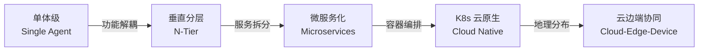
```mermaid
graph LR
    A[单体级\nSingle Agent] -->|功能解耦| B[垂直分层\nN-Tier]
    B -->|服务拆分| C[微服务化\nMicroservices]
    C -->|容器编排| D[K8s 云原生\nCloud Native]
    D -->|地理分布| E[云边端协同\nCloud-Edge-Device]
```

### 3.6.2 横向对比矩阵

| 维度 | 单体级 | 垂直分层 | 微服务化 | K8s 云原生 | 云边端协同 |
|------|--------|----------|----------|------------|------------|
| **团队规模** | 1-2 人 | 3-5 人 | 5-15 人 | 10-30 人 | 15-50+ 人 |
| **并发会话** | < 10 | < 100 | < 1,000 | < 10,000 | 10,000+ |
| **端到端延迟** | 100-500ms | 200-800ms | 300-1000ms | 100-500ms | 10-200ms（边缘）|
| **可用性** | 单点故障 | 部分隔离 | 熔断保护 | 自愈 + 滚动升级 | 本地自治 |
| **适合阶段** | PoC / 学习 | 小型生产 | 中型生产 | 大型生产 | 超大规模 / IoT |

### 3.6.3 选型决策树

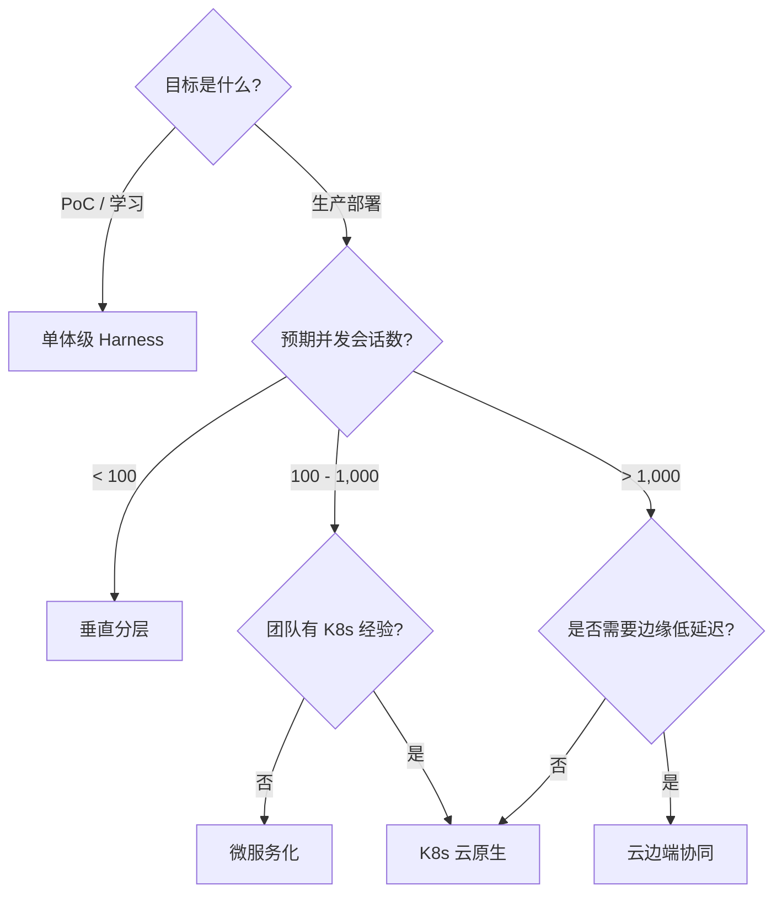
```mermaid
flowchart TD
    A{目标是什么?} -->|PoC / 学习| B[单体级 Harness]
    A -->|生产部署| C{预期并发会话数?}
    C -->|< 100| D[垂直分层]
    C -->|100 - 1,000| E{团队有 K8s 经验?}
    E -->|否| F[微服务化]
    E -->|是| G[K8s 云原生]
    C -->|> 1,000| H{是否需要边缘低延迟?}
    H -->|否| G
    H -->|是| I[云边端协同]
```

---

# 第 4 章：主流开源框架与 Harness 模式

> **本章导读**：当前 AI Agent 框架生态呈现"百花齐放"的态势。本章深度剖析七大主流框架的 Harness 模式。

---

## 4.1 LangChain / LangGraph：模块化总线式架构

### 4.1.1 框架定位

LangChain 是全球最流行的 LLM 应用开发框架（GitHub Stars 93k+），其核心设计哲学是**"万物皆链"**（Everything is a Chain）。LangGraph 是 LangChain 团队于 2024 年推出的底层编排引擎，以**有向图状态机**取代线性链。2025 年 10 月，两者同时发布 v1.0 LTS。

来源：[LangChain 官方文档](https://python.langchain.com/docs/introduction/)、[LangGraph 官方文档](https://langchain-ai.github.io/langgraph/)

### 4.1.2 Harness 模式：模块化总线式

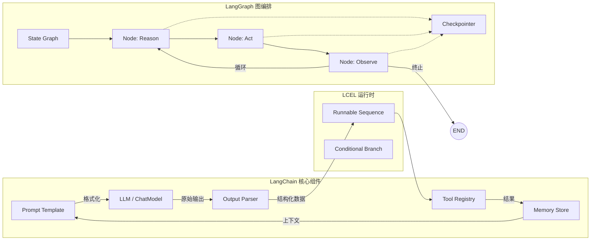
```mermaid
flowchart LR
    subgraph "LangChain 核心组件"
    Prompt[Prompt Template]
    Model[LLM / ChatModel]
    Parser[Output Parser]
    Tool[Tool Registry]
    Memory[Memory Store]
    end

    subgraph "LCEL 运行时"
    Chain[Runnable Sequence]
    Branch[Conditional Branch]
    end

    Prompt -->|格式化| Model
    Model -->|原始输出| Parser
    Parser -->|结构化数据| Chain
    Chain --> Tool
    Tool -->|结果| Memory
    Memory -->|上下文| Prompt

    subgraph "LangGraph 图编排"
    State[State Graph]
    NodeA[Node: Reason]
    NodeB[Node: Act]
    NodeC[Node: Observe]
    Checkpoint[Checkpointer]
    end

    State --> NodeA --> NodeB --> NodeC
    NodeC -->|循环| NodeA
    NodeC -->|终止| END((END))
    NodeA -.-> Checkpoint
    NodeB -.-> Checkpoint
    NodeC -.-> Checkpoint
```

**核心抽象**：

1. **LCEL（LangChain Expression Language）**：声明式管道语法
   ```python
   chain = (
       {"context": retriever, "question": RunnablePassthrough()}
       | prompt | model | StrOutputParser()
   )
   result = chain.invoke("什么是 Fiber 架构？")
   ```

2. **StateGraph（状态图）**：显式定义状态结构，每个节点是状态转换函数
   ```python
   class AgentState(TypedDict):
       messages: list
       iteration: int

   graph = StateGraph(AgentState)
   graph.add_node("reason", reason_node)
   graph.add_node("act", act_node)
   graph.add_edge("reason", "act")
   graph.add_edge("act", "observe")
   graph.add_conditional_edges("observe",
       lambda s: "reason" if s["iteration"] < 10 else END)
   compiled = graph.compile(checkpointer=MemorySaver())
   ```

3. **Checkpointer**：状态持久化机制，支持故障恢复和"时间旅行"调试

### 4.1.3 常见误区

- **误区 1**："LangChain = LangGraph"。两者是不同层级的工具：LangChain 是高层应用框架，LangGraph 是底层编排引擎。
- **误区 2**："用了 LangChain 就不需要懂 LLM 原理"。提示词设计、上下文管理、Token 优化等核心问题仍需深入理解。
- **误区 3**："LangGraph 只适合复杂场景"。即使是简单的 ReAct 循环，使用 LangGraph 的显式状态管理也比隐式链式调用更容易调试。

---

## 4.2 CrewAI：角色驱动的多 Agent 协作

### 4.2.1 框架定位

CrewAI 是一个专注于**多智能体团队协作**的框架（GitHub Stars 25k+），其核心心智模型是"组建一个虚拟团队来完成复杂任务"。

来源：[CrewAI 官方文档](https://docs.crewai.com/)

### 4.2.2 Harness 模式：角色驱动协作

```mermaid
flowchart TB
    subgraph "Crew（团队）"
    Manager[管理者 Agent\n(Manager/Supervisor)]
    end

    subgraph "Agent 1: 研究员"
    R1[角色: Researcher\n目标: 收集信息\n工具: 搜索]
    end

    subgraph "Agent 2: 分析师"
    R2[角色: Analyst\n目标: 分析数据\n工具: 代码执行]
    end

    subgraph "Agent 3: 写作者"
    R3[角色: Writer\n目标: 撰写报告\n工具: 文档生成]
    end

    Manager -->|委派任务| R1 & R2 & R3
    R1 -->|提交结果| R2
    R2 -->|提交结果| R3
    R3 -->|最终输出| Manager
```

**核心抽象**：

1. **Agent**：通过自然语言定义角色和目标
   ```python
   researcher = Agent(
       role='高级研究员',
       goal='深入调研指定主题，提供全面的技术分析',
       backstory='你是一位有 10 年经验的技术研究员',
       tools=[search_tool],
       verbose=True
   )
   ```

2. **Task**：定义具体任务，指定执行 Agent 和预期输出
3. **Crew**：将多个 Agent 和 Task 组合为团队，支持 Sequential 和 Hierarchical 流程

### 4.2.3 适用场景

- **内容生成管道**：调研 → 分析 → 写作的多角色协作
- **营销自动化**：创意策划、文案撰写、审核发布的流水线
- **快速原型**：需要快速验证多 Agent 协作概念的 PoC

---

## 4.3 AutoGen（Microsoft）：多智能体对话编排

### 4.3.1 框架定位

AutoGen 由微软研究院于 2023 年 9 月发布，开创了**"通过对话协作解决复杂问题"**的多 Agent 范式。2025 年末，微软将 AutoGen 与 Semantic Kernel 合并为 **Microsoft Agent Framework（MAF）**。

来源：[AutoGen 官方文档](https://microsoft.github.io/autogen/)

### 4.3.2 Harness 模式：对话式编排

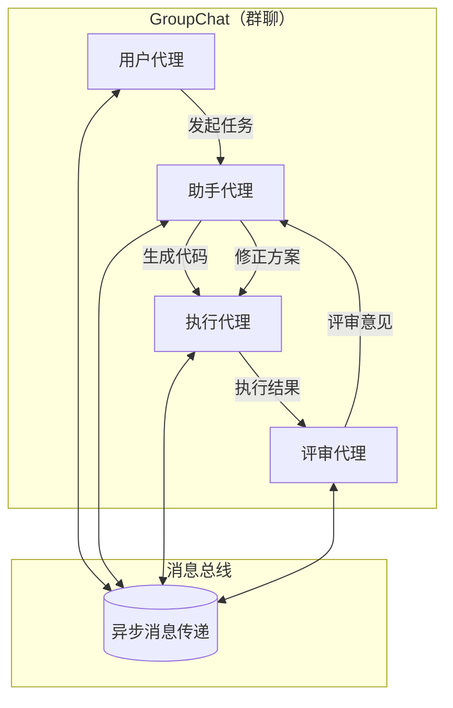
```mermaid
flowchart TB
    subgraph "GroupChat（群聊）"
    UserProxy[用户代理]
    Assistant[助手代理]
    Executor[执行代理]
    Critic[评审代理]
    end

    subgraph "消息总线"
    MsgBus[(异步消息传递)]
    end

    UserProxy <--> MsgBus
    Assistant <--> MsgBus
    Executor <--> MsgBus
    Critic <--> MsgBus

    UserProxy -->|发起任务| Assistant
    Assistant -->|生成代码| Executor
    Executor -->|执行结果| Critic
    Critic -->|评审意见| Assistant
    Assistant -->|修正方案| Executor
```

**核心抽象（v0.4+ 架构）**：
- **autogen-core**：底层事件驱动原语
- **autogen-agentchat**：高层 API（群聊、轮转、多 Agent 协作）
- **autogen-ext**：可插拔扩展层（OpenAI API、MCP、gRPC 分布式 Agent 等）

### 4.3.3 适用场景

- **代码生成与审查**：Coder + Reviewer 协作产出高质量代码
- **研究自动化**：多 Agent 分工进行文献检索、数据分析、论文撰写
- **需要人类审批的场景**：金融决策、合规审核等

---

## 4.4 LlamaIndex：知识增强型 Harness

### 4.4.1 框架定位

LlamaIndex 专注于**知识密集型 Agent 场景**（GitHub Stars 35k+），是构建 RAG（检索增强生成）系统的首选框架。

来源：[LlamaIndex 官方文档](https://docs.llamaindex.ai/)

### 4.4.2 Harness 模式：知识增强

**核心抽象**：
1. **Document → Node → Index** 三层数据模型
2. **Query Engine + Retriever** 检索管线
3. **Agent + Tool + Knowledge** 融合

### 4.4.3 适用场景

- **企业知识库问答**：海量文档的语义检索和精准回答
- **法律/金融/医疗**：需要高事实准确性的专业领域
- **文档理解**：长文档分析、跨文档关联查询

---

## 4.5 Semantic Kernel（Microsoft）：企业级插件模型

### 4.5.1 框架定位

Semantic Kernel（SK）是微软开发的企业级 AI 开发工具包（GitHub Stars 21k+），支持 C#、Python、Java 三种语言。强调企业级特性：过滤器（安全审查）、可观测性、插件模型。

来源：[Semantic Kernel 官方文档](https://learn.microsoft.com/en-us/semantic-kernel/overview/)

### 4.5.2 Harness 模式：企业级插件

**核心抽象**：
1. **Kernel**：统一的 AI 服务容器
2. **Plugin**：功能扩展的标准方式（代码插件和提示词插件）
3. **Filter**：企业级安全保障（输入/输出过滤）
4. **Agent Framework**：支持 ChatCompletionAgent、OpenAIAssistantAgent 等多种类型

### 4.5.3 适用场景

- **企业现有系统集成 AI**：需要将 AI 能力嵌入 .NET / Java 企业应用
- **需要合规审查的场景**：金融、医疗、政府等行业
- **Azure 生态用户**：已有的 Azure 基础设施可以直接对接

---

## 4.6 OpenAI Agents SDK / Google ADK：平台原生 Harness

### 4.6.1 OpenAI Agents SDK

**定位**：OpenAI 官方推出的轻量级多 Agent 工作流框架，是早期实验项目 Swarm 的生产级升级版。

来源：[OpenAI Agents SDK GitHub](https://github.com/openai/openai-agents-python)

**Harness 模式：交接链（Handoff Chain）**

```mermaid
flowchart LR
    A[用户输入] --> B[路由 Agent\n(Router)]
    B -->|技术问题| C[技术专家 Agent]
    B -->|账单问题| D[客服 Agent]
    B -->|升级投诉| E[主管 Agent]
    C -->|需要代码执行| F[代码执行 Agent]
    D --> B
    E --> B
    C --> G[输出]
    D --> G
    E --> G

    subgraph "安全护栏"
    Guard[输入验证 + 输出审查]
    end

    A -.-> Guard
    Guard -.-> B
```

**核心特性**：
1. **Agent Handoff**：Agent A 可以将控制权移交给 Agent B
2. **三层护栏**：输入验证、输出审查、运行时安全检查
3. **MCP 支持**：原生支持 Model Context Protocol
4. **Provider-Agnostic**：不仅支持 OpenAI 模型

### 4.6.2 Google ADK（Agent Development Kit）

**定位**：Google 官方推出的企业级多语言 Agent 开发工具包，原生支持 Python、TypeScript、Java、Go。

**核心特性**：
1. **多语言支持**：Python / TypeScript / Java / Go
2. **A2A（Agent-to-Agent）协议**：跨框架 Agent 发现与通信标准
3. **Root Agent 模式**：根 Agent 负责任务分解和子 Agent 委派
4. **事件流架构**：所有 Agent 交互建模为事件流

---

## 4.7 横向对比矩阵

### 4.7.1 核心维度对比

| 维度 | LangChain/LangGraph | CrewAI | AutoGen/MAF | LlamaIndex | Semantic Kernel | OpenAI Agents SDK | Google ADK |
|------|----------------------|--------|---------------|------------|-----------------|-------------------|------------|
| **定位** | 通用Agent开发 | 角色驱动多Agent | 对话式编排 | 知识增强RAG | 企业级插件 | 轻量级交接链 | 企业级多语言 |
| **核心范式** | 有向图状态机 | 角色团队协作 | 群聊对话 | 索引+检索 | 插件+过滤器 | Handoff交接链 | Root委派+事件流 |
| **GitHub Stars** | ~93k | ~25k | ~30k | ~35k | ~21k | ~12k | ~5k |
| **主要语言** | Python | Python | Python/.NET | Python | C#/Python/Java | Python/TS | Python/TS/Java/Go |
| **学习曲线** | 中等 | 低 | 较高 | 中等 | 较高 | 低 | 中等 |
| **生产就绪度** | 高（v1.0 LTS） | 中 | 高（MAF GA） | 高 | 高 | 中 | 中 |
| **多Agent编排** | 强 | 强 | 强 | 弱 | 中 | 中 | 强 |
| **状态持久化** | 强 | 弱 | 中 | 中 | 中 | 弱 | 中 |
| **MCP 支持** | 是 | 是 | 是 | 间接 | 是 | 是 | 间接 |
| **A2A 支持** | 否 | 是 | 否 | 否 | 否 | 否 | 是 |
| **适合团队** | 3-30人 | 1-10人 | 5-20人 | 2-15人 | 5-30人 | 1-10人 | 5-30人 |

### 4.7.2 选型决策指南

```mermaid
flowchart TD
    A{你的核心需求是什么?} -->|快速原型 / 概念验证| B{需要多 Agent 协作?}
    A -->|生产级企业应用| C{已有技术栈?}
    A -->|知识密集型 / RAG| D[LlamaIndex]
    A -->|轻量级 / 快速上手| E[OpenAI Agents SDK]

    B -->|是| F{偏好哪种模式?}
    B -->|否| G[LangChain]

    F -->|角色扮演 / 直观| H[CrewAI]
    F -->|对话协作 / 灵活| I[AutoGen / MAF]
    F -->|精确控制 / 图模型| J[LangGraph]

    C -->|.NET / Java| K[Semantic Kernel]
    C -->|Python| L{需要什么能力?}
    C -->|多语言企业团队| M[Google ADK]

    L -->|复杂工作流| J
    L -->|多 Agent 协作| I
    L -->|知识检索| D
```

### 4.7.3 趋势展望

1. **Microsoft Agent Framework 统一战略**：AutoGen + Semantic Kernel 合并
2. **状态持久化成为标配**：LangGraph 的 Checkpointer 模式正在成为行业标准
3. **A2A 协议推动互操作**：Google ADK 推动的 Agent-to-Agent 协议有望成为跨框架通用标准
4. **低代码/无代码工具普及**：AutoGen Studio、Dify 等可视化工具降低门槛
5. **框架融合趋势**：LangChain + LangGraph 的"高层易用性 + 底层控制力"双层架构成为主流

---

# 第 5 章：Harness Engineering 最佳实践

> **核心观点**：Harness Engineering 不是让模型变得更聪明，而是让模型在正确的轨道上跑得更快、更稳、更可靠。人类从"写代码的人"转变为"设计环境的人"。

---

## 5.1 Harness Engineering 的范式演进

### 5.1.1 概念定义

**Harness Engineering（驾驭工程）** 是围绕 AI Agent 设计和构建约束机制、反馈回路、工作流控制和持续改进循环的系统工程实践。

"Harness"一词的原意是"马具"——缰绳、马鞍、嚼子、笼头，一整套用来驾驭骏马的装备。这个隐喻精准地揭示了当前 AI 工程的核心矛盾：大模型是那匹有力量的马，劲儿大、跑得快，但如果不套上马具，它只会在旷野上撒欢，什么正事都干不了。

### 5.1.2 三次范式跃迁

| 阶段 | 时间 | 核心问题 | 优化对象 | 隐喻 |
|------|------|----------|----------|------|
| Prompt Engineering | 2023-2024 | "怎么问" | 输入措辞 | 给实习生写一张纸条 |
| Context Engineering | 2025 | "喂什么" | 知识边界与上下文 | 给纸条加上地图、菜单、工牌 |
| Harness Engineering | 2026+ | "怎么管" | 运行环境与约束系统 | 给实习生配工位、SOP、自动纠错 |

```mermaid
graph LR
    A[Prompt Engineering<br/>单次对话质量] --> B[Context Engineering<br/>知识边界与幻觉]
    B --> C[Harness Engineering<br/>Agent 可靠性与可持续性]

    style A fill:#ff9999
    style B fill:#ffcc99
    style C fill:#99ff99
```

### 5.1.3 真实数据佐证

- **OpenAI 百万行实验**：3 名工程师，5 个月，100 万行代码，零人工手写，合并约 1500 个 PR
- **LangChain 性能飞跃**：底层模型不变，仅优化 Harness，Terminal Bench 2.0 得分从 52.8% 飙升至 66.5%，排名从第 30 位跃升至第 5 位
- **Princeton NLP 实验**：同一个 GPT-4，只换了外部环境接口，SWE-bench 性能提升了 64%
- **Stripe Minions**：内部编程 Agent 每周产生超过 1000 个合并的 PR，全程无人工交互

> 来源：https://openai.com/index/harness-engineering/

---

## 5.2 OpenAI Codex 实验的六条核心洞察

### 5.2.1 实验背景

2025 年 8 月，OpenAI 内部团队启动极端实验：基于 Codex Agent，从完全空白的 Git 仓库开始构建软件产品。**铁律**：人类工程师不写一行代码。当 Agent 搞不定时，规则不是"算了我来写"，而是去问："缺了什么工具、文档或能力？"

### 5.2.2 六条被验证过的原则

#### 洞察一：Agent 看不到的知识等于不存在

任何无法在 Agent 的上下文窗口中被访问的信息，对 Agent 来说就不存在。Google Docs 里的决策、Slack 对话中的讨论——如果没有落到仓库里，这些信息对 Agent 而言就是零。

```
❌ 错误做法：规则存在工程师脑子里
  工程师知道："这个 API 必须返回 camelCase"
  Agent 不知道 → 生成 snake_case → PR 被拒 → 循环

✅ 正确做法：规则落到仓库中
  docs/api-conventions.md: "所有 API 响应使用 camelCase"
  AGENTS.md 引用 → Agent 读取 → 生成正确格式
```

#### 洞察二：渐进式披露优于信息堆砌

OpenAI 团队一开始尝试将所有规则塞进一个巨大的 `AGENTS.md` 文件。效果很差。

**解法**：将 `AGENTS.md` 精简到约 100 行，只充当目录和地图，指向仓库内结构化的 `docs/` 目录。Agent 根据需要按需加载。

```markdown
<!-- ✅ AGENTS.md（约 100 行，只做目录） -->
# 项目 Agent 指南

## 快速导航
- 架构约定 → docs/architecture/README.md
- API 规范 → docs/api-conventions/README.md
- 决策记录 → docs/decision-logs/
- 测试标准 → docs/testing-standards/README.md

## 核心约束
1. 所有 PR 必须包含测试
2. 新增 API 必须更新 OpenAPI spec
3. 禁止直接操作数据库，必须通过 Repository 层
```

#### 洞察三：应用可读性（Application Legibility）是第一优先级

当 Agent 的代码产出速度远超人类审查能力时，唯一的出路是让 Agent 自己验证代码质量。团队构建了一套完整的 Agent "感官系统"：Chrome DevTools Protocol、本地可观测性栈（日志、指标、链路追踪）。

#### 洞察四：仓库即记录系统（Repository as System of Record）

代码仓库本身作为 Agent 的唯一知识来源和工作系统，包含项目规范、历史决策记录（ADR）、自动化验证规则、Agent 行为指南。

```typescript
// ✅ 自定义 linter：强制执行架构边界
{
  "no-restricted-imports": [
    "error",
    {
      "patterns": [{
        "group": ["**/db/**", "**/database/**"],
        "message": "UI 层禁止直接导入数据库模块，必须通过 Repository 层访问"
      }]
    }
  ]
}
```

#### 洞察五：Agent 可读性优先（Agent Readability First）

- **一致性胜过优雅**：Agent 擅长遵循模式，不擅长欣赏创造性设计
- **显式胜过隐式**：所有约定必须显式声明
- **结构化胜过自由**：结构化的文档比自由发挥更容易被 Agent 处理
- **验证胜过信任**：所有规则都应该有自动化的验证手段

#### 洞察六：架构约束与"品味不变量"

OpenAI 采用严格的分层领域架构（Types -> Config -> Repo -> Service -> Runtime -> UI），并定义了一组"品味不变量"：结构化日志 schema、文件大小上限、平台级可靠性要求。

---

## 5.3 "无聊优先"（Boring First）技术选型策略

### 5.3.1 概念定义

**"无聊优先"策略**是指在 Agent-first 开发模式下，技术选型优先考虑 API 稳定、可组合性强、在模型训练数据中表现良好的"无聊"技术，而非追逐新潮框架。

### 5.3.2 工作原理

1. **训练数据覆盖度**：成熟技术在模型的训练数据中出现频率更高
2. **API 稳定性**：成熟 API 的变更频率低
3. **错误模式可预测**：常见错误模式已被广泛记录
4. **社区知识密度**：Stack Overflow、GitHub Issues 中的高质量内容更多

**决策矩阵**：

| 维度 | 权重 | 评估标准 |
|------|------|----------|
| 训练数据丰富度 | 40% | Stack Overflow 问题数、GitHub Star 数 |
| API 稳定性 | 30% | 近 12 个月重大变更次数 |
| 可组合性 | 20% | 标准协议支持、插件生态 |
| 团队熟悉度 | 10% | 人类工程师能否在 Agent 失败时介入 |

---

## 5.4 约束换自主：从厚 Harness 到薄 Harness 的 Scaffolding 元认知

### 5.4.1 概念定义

**"约束换自主"（Constraints for Autonomy）**：规矩越明确，Agent 独立做的事越多；约束越严格，信任越高，自主权越大。

### 5.4.2 厚 Harness vs 薄 Harness

| | 厚 Harness | 薄 Harness |
|---|---|---|
| **哲学** | 构建复杂的外部控制系统 | 轻量级引导层，智能推向 Skill 层 |
| **假设** | Agent 是不可靠的 | 模型能力不是瓶颈，缺的是知识 |
| **优点** | 安全保障 | 低开销、高自主性 |
| **缺点** | 协调开销大、规则易腐烂 | 需要完善的 Skill 文档 |

Y Combinator CEO Garry Tan 的核心观点：**模型的智能从来不是瓶颈**。模型已经会推理、综合、写代码。它们的失败是因为不理解你的数据——你的模式、你的约定、你问题的具体形状。

### 5.4.3 Scaffolding 元认知

Mitchell Hashimoto 的定义："每当发现 Agent 犯了一个错误，就花时间设计一套解决方案，让 Agent 以后不再犯同样的错。"

```mermaid
graph LR
    A[Agent 失败] --> B{分析原因}
    B -->|缺少知识| C[更新 Skill 文档]
    B -->|缺少工具| D[添加工具定义]
    B -->|规则不清| E[强化约束规则]
    B -->|验证不足| F[增加检查步骤]
    C & D & E & F --> G[部署到仓库] --> H[Agent 下次不再犯]
```

---

## 5.5 仓库作为记录系统的深度设计

### 5.5.1 文档园丁模式

OpenAI 团队安排了一个"文档园丁"Agent，定期扫描文档，发现和代码不一致的陈旧描述，自动发起修复 PR。

```mermaid
graph LR
    A[文档园丁 Agent] --> B[扫描 docs/ 目录]
    B --> C[比对代码实现]
    C --> D{发现不一致?}
    D -->|是| E[自动创建修复 PR]
    D -->|否| F[标记为已验证]
    E --> G[人类或 Agent 审查] --> H[合并修复]
    F --> I[更新验证时间戳]
```

---

# 第 6 章：Agentic Workflow 与多 Agent 编排

> **核心观点**：多 Agent 系统不是"越多越好"。应该使用能可靠满足需求的最低复杂度方案。

---

## 6.1 Agent 复杂度光谱

| 层级 | 描述 | 适用场景 |
|------|------|----------|
| **直接模型调用** | 单次语言模型调用，精心设计提示词 | 分类、摘要、翻译等单步任务 |
| **单 Agent + 工具** | 一个 Agent 通过工具选择进行推理和动作 | 单域内的多变查询，需要动态工具使用 |
| **多 Agent 编排** | 多个专业化 Agent 协调解决问题 | 跨功能问题、需要独立安全边界的场景 |

```mermaid
graph TD
    A[新任务需求] --> B{能否通过提示工程解决?}
    B -->|是| C[直接模型调用]
    B -->|否| D{单域内任务且工具有限?}
    D -->|是| E[单 Agent + 工具]
    D -->|否| F{需要跨域协作或安全隔离?}
    F -->|是| G[多 Agent 编排]
    F -->|否| E

    style C fill:#99ff99
    style E fill:#99ccff
    style G fill:#ffcc99
```

**决策原则**：从简开始 → 证明必要性 → 考虑成本

---

## 6.2 五大编排模式

### 6.2.1 顺序链（Sequential Orchestration）

**概念**：Agent 以预定义的线性顺序链接，每个处理前一个的输出。

**适用**：具有清晰线性依赖关系的多阶段流程

**避免**：阶段可以并行化、需要回溯或迭代的工作流

```python
async def generate_contract(specs: ContractSpec) -> Contract:
    template = await template_agent.select(specs)
    customized = await clause_agent.customize(template, specs.terms)
    compliant = await compliance_agent.review(customized, specs.jurisdiction)
    return await risk_agent.assess(compliant)
```

### 6.2.2 条件路由（Handoff Orchestration）

**概念**：Agent 之间任务的动态委派。每个 Agent 评估当前任务，决定自行处理还是转交。

**适用**：最优 Agent 无法预先确定的场景

**避免**：难以避免无限转接循环、多操作应并发运行

```python
class TriageAgent:
    async def handle(self, request: CustomerRequest) -> Response:
        if self.can_handle(request):
            return await self.process(request)
        category = self.classify(request)
        if category in self.specialists:
            return await self.specialists[category].handle(request)
        return await self.escalate_to_human(request)
```

### 6.2.3 并行聚合（Concurrent Orchestration）

**概念**：多个 Agent 在同一任务上同时运行，结果聚合。

**适用**：多视角独立分析、延迟敏感场景

**聚合策略**：

| 策略 | 适用场景 | 示例 |
|------|----------|------|
| 投票/多数规则 | 分类任务 | 2:1 决定是否为垃圾邮件 |
| 权重合并 | 评分推荐 | 不同 Agent 评分加权平均 |
| LLM 合成 | 需要连贯叙事 | 整合多个分析角度为综合报告 |

```python
async def analyze_stock(ticker: str) -> InvestmentRecommendation:
    results = await asyncio.gather(
        fundamental_agent.analyze(ticker),
        technical_agent.analyze(ticker),
        sentiment_agent.analyze(ticker),
    )
    return await synthesizer_agent.synthesize(ticker=ticker, analyses=results)
```

### 6.2.4 层级管理（Group Chat Orchestration）

**概念**：多个 Agent 通过共享对话线程协作，Chat Manager 协调流程。

**适用**：头脑风暴、决策共识、迭代审查

**避免**：Agent 数量过多（建议 ≤ 3）、实时处理要求高

**Maker-Checker 循环**：一个 Agent 创建，另一个 Agent 评估，不通过则打回。

### 6.2.5 动态编排（Magentic Orchestration）

**概念**：Manager Agent 动态构建和更新任务账本（Task Ledger），迭代、回溯和委托，直到构建出可执行计划。

**适用**：没有预定解决方案路径的开放性问题

**避免**：确定性工作流、时间敏感任务

### 6.2.6 模式对比总结

| 模式 | 协调方式 | 路由方式 | 最适合 | 需注意 |
|------|----------|----------|--------|--------|
| 顺序链 | 线性流水线 | 确定性 | 逐步精化 | 失败传播 |
| 条件路由 | 动态委派 | Agent 自行决定 | 专家不确定的任务 | 无限转接循环 |
| 并行聚合 | 并行 | 确定性或动态 | 多视角分析 | 结果冲突 |
| 层级管理 | 对话式 | Chat Manager 控制 | 共识建立 | 对话循环 |
| 动态编排 | 计划-构建-执行 | Manager 动态分配 | 开放性问题 | 收敛缓慢 |

---

## 6.3 失败边界与隔离策略

### 6.3.1 隔离层次

```mermaid
graph TB
    A[故障场景] --> B[计算隔离] & C[网络隔离] & D[数据隔离] & E[上下文隔离]
    B --> B1[独立进程/容器] & B2[独立资源配额]
    C --> C1[独立 API 端点] & C2[速率限制独立]
    D --> D1[最小权限访问] & D2[安全裁剪]
    E --> E1[上下文压缩] & E2[选择性传递]
```

### 6.3.2 可靠性策略

1. **超时和重试机制**：带退避策略的重试
2. **优雅降级**：部分 Agent 故障时降级运行
3. **错误暴露而非隐藏**：向下游 Agent 暴露错误
4. **输出验证**：传递前验证质量
5. **断路器模式**：依赖持续失败时快速失败
6. **检查点恢复**：从编排中断中恢复

---

## 6.4 人类在循环（Human-in-the-Loop）设计模式

| 模式 | 描述 | 同步/异步 | 适用场景 |
|------|------|-----------|----------|
| **观察者** | 人类监控工作流，可随时介入 | 异步 | 低风险任务 |
| **审批者** | 人类必须审批后才能继续 | 同步 | 高风险操作 |
| **反馈者** | 人类提供反馈，Agent 精化 | 异步 | Maker-Checker 循环 |
| **升级目标** | Agent 无法处理时接管 | 同步/异步 | 边缘场景 |

---

## 6.5 多 Agent 通信与同步机制

### 6.5.1 上下文管理策略

| 策略 | 描述 | 权衡 |
|------|------|------|
| **完整上下文传递** | 之前所有输出传递给下一个 | 信息完整，但 token 消耗最大 |
| **摘要压缩** | 对之前的输出进行摘要 | 减少 token，但可能丢失细节 |
| **选择性裁剪** | 根据需求选择性传递 | 需要精确判断哪些信息需要 |
| **新指令集** | 只提供新的指令集 | 最省 token，但缺少背景 |

### 6.5.2 十大反模式

| 编号 | 反模式 | 核心对策 |
|------|--------|----------|
| 1 | 不必要的协调复杂性 | 简单的顺序/并行就足够时不要用复杂模式 |
| 2 | 无意义的专业化 | 添加的 Agent 必须有有意义的 specialization |
| 3 | 忽视延迟影响 | 多跳通信的延迟可能不可接受 |
| 4 | 共享可变状态 | 并发 Agent 之间不应共享可变状态 |
| 5 | 模式与任务不匹配 | 确定性工作流用确定性模式 |
| 6 | 忽视资源约束 | 并行编排可能导致 API 限流 |
| 7 | 上下文窗口过度消费 | 随 Agent 积累增长的上下文会超限 |
| 8 | 无限转接循环 | 设置最大转接次数上限 |
| 9 | 没有冲突解决策略 | 并行 Agent 结果矛盾时无法决策 |
| 10 | 缺乏可观测性 | 必须追踪每个 Agent 的性能和资源使用 |

---

# 第 7 章：2025-2026 趋势与前沿

---

## 7.1 从 Context Engineering 到 Harness Engineering 的行业重心转移

### 7.1.1 概念定义

**Harness Engineering（驾驭工程）** 是 2026 年 AI 工程领域的核心范式。如果说 Prompt Engineering 关注"怎么问"，Context Engineering 关注"让模型看到什么"，那么 Harness Engineering 关注的则是"让模型怎么干活"。

> "Agents aren't hard; the Harness is hard." —— Ryan Lopopolo, OpenAI Codex 团队

### 7.1.2 三层工程范式的演进路径

| 范式 | 时间窗口 | 核心关注点 | 类比 |
|------|----------|-----------|------|
| **Prompt Engineering** | 2022-2024 | "怎么问" | 告诉它右转 |
| **Context Engineering** | 2025 | "让模型看到什么" | 给它地图，解释右转 |
| **Harness Engineering** | 2026+ | "怎么干活、怎么验证、怎么恢复" | 给整辆车（方向盘、刹车、护栏） |

```mermaid
graph LR
    A[Prompt Engineering<br/>2022-2024] --> B[Context Engineering<br/>2025]
    B --> C[Harness Engineering<br/>2026+]
    
    style A fill:#e3f2fd
    style B fill:#bbdefb
    style C fill:#1565c0,color:#fff
```

### 7.1.3 上下文窗口的"40% 法则"

上下文窗口不是越大越好。以 168K token 为例，用到大约 40% 就开始走下坡路：

- **前 40% 是 Smart Zone**：推理聚焦且准确
- **超过 40% 进入 Dumb Zone**：幻觉、死循环、格式错误的工具调用齐上阵

**经验公式**：上下文利用率保持在 40% 以下。更多 token 不等于更好结果。

---

## 7.2 Harness 自优化：LLM 自己优化 Harness

### 7.2.1 Meta-Harness 工作原理

斯坦福大学的 **Meta-Harness** 项目让 LLM 自动设计和优化 Harness 配置，而非依赖人工手动调参。采用三步循环搜索机制：

```mermaid
graph LR
    A[翻档案<br/>Read History] --> B[跑评估<br/>Run Evaluation]
    B --> C[存档<br/>Write Results]
    C --> A
```

1. **翻档案**：Coding Agent 读取所有历史记录（每版 Harness 的源代码、评估分数、执行 trace）
2. **跑评估**：将新提出的 Harness 拿去跑实际任务，收集成绩
3. **存档**：将所有产物写回文件系统，供下一轮查阅

### 7.2.2 突破性成果

| 基准测试 | Meta-Harness 成绩 | 对比基线 | 提升幅度 |
|----------|-------------------|----------|----------|
| **文本分类** | 超越 ACE | 最佳人工方案 ACE | +7.7 个百分点，context 用量仅 1/4 |
| **IMO 数学推理** | 自动发现检索策略 | 五个未见过的模型 | 平均提升 4.7 个百分点 |
| **TerminalBench-2**（Opus 4.6） | **76.4%** | Terminus-KIRA 74.7% | 超过人工精心调教方案 |
| **TerminalBench-2**（Haiku 4.5） | **排名第一** | 所有已公开 Haiku 方案 | 超过所有已公开方案 |

**关键启示**：Harness 设计正在从"手艺"走向"科学"。低成本模型也能跑出高性能。

---

## 7.3 Scaffolding 元认知趋势

### 7.3.1 概念定义

随着基础模型能力的持续增强，Harness/Scaffolding 层的复杂度反而在降低。更强的模型需要更少的人工约束和引导。

### 7.3.2 游戏控制范式类比

| 阶段 | 游戏类比 | 控制方式 | AI 自主度 |
|------|----------|----------|-----------|
| 第一阶段 | 《只狼》动作游戏 | 每招每式手动按键 | 极低 |
| 第二阶段 | 《金铲铲》自走棋 | 前期配置，棋子自动战斗 | 中等 |
| 第三阶段 | 《全面战争》即时战略 | 编队、阵型、AI 指令 | 高 |

**关键洞察**：单位越聪明、越自主，你越需要靠一整套系统去约束它们。但与此同时，系统本身的复杂度反而在下降。

---

## 7.4 企业级 Harness 的四道鸿沟

### 7.4.1 四道鸿沟详解

```mermaid
graph TB
    A[个人/轻量级 Harness] -->|跨越鸿沟| B[企业级 Harness]
    
    subgraph "四道鸿沟"
        H1[安全 Safety<br/>权限隔离、数据保护、<br/>对抗注入]
        H2[稳定 Stability<br/>容错恢复、降级策略、<br/>长任务可靠性]
        H3[可控 Control<br/>人工审批、行为审计、<br/>决策可解释]
        H4[可运维 Operability<br/>可观测性、成本管控、<br/>性能监控]
    end
    
    A --> H1 --> H2 --> H3 --> H4 --> B
```

#### 鸿沟一：安全（Safety）

| 维度 | 问题 | 解决方案 |
|------|------|----------|
| **权限隔离** | Agent 可能访问不该访问的数据 | 工作目录限定、最小权限原则、沙箱执行 |
| **数据保护** | 敏感信息可能泄露 | 数据脱敏、MEMORY.md 仅主会话加载 |
| **对抗注入** | 外部输入可能包含恶意指令 | 将网络内容视为潜在恶意内容 |
| **破坏性操作** | 可能执行 rm -rf 等危险命令 | trash > rm，执行前必须确认 |

#### 鸿沟二：稳定（Stability）

| 维度 | 问题 | 解决方案 |
|------|------|----------|
| **容错恢复** | Agent 陷入死循环 | 错误码导航、自动重试、超时熔断 |
| **降级策略** | 模型不可用或响应超时 | 备用模型切换、降级为 Workflow 模式 |
| **长任务可靠性** | 长时间运行可能中断 | 可恢复状态、快照机制 |

#### 鸿沟三：可控（Control）

| 维度 | 问题 | 解决方案 |
|------|------|----------|
| **人工审批** | 对外操作风险高 | 内部操作自动执行，外部操作需审批 |
| **行为审计** | 需要追踪每个决策 | 完整的执行 trace 记录、日志归档 |
| **决策可解释** | 为什么 Agent 做了某个选择 | 推理过程记录、决策依据回溯 |

#### 鸿沟四：可运维（Operability）

| 维度 | 问题 | 解决方案 |
|------|------|----------|
| **可观测性** | Agent 执行过程不透明 | Metrics/Logs/Traces 三大支柱 |
| **成本管控** | Token 用量不可控 | 上下文压缩、工具精简、40% 法则 |
| **性能监控** | 响应延迟和吞吐量波动 | 延迟告警、自动扩缩容 |

---

## 7.5 AGENTS.md / Soul.md / User.md 等 Agent-First 知识架构

### 7.5.1 核心文件体系

```mermaid
graph TB
    subgraph "Agent 灵魂文件系统"
        A[AGENTS.md<br/>操作手册+记忆管理<br/>最重要的文件]
        B[SOUL.md<br/>人设、边界、语气]
        C[USER.md<br/>用户档案与偏好]
        D[IDENTITY.md<br/>身份元数据]
        E[TOOLS.md<br/>工具使用说明]
        F[HEARTBEAT.md<br/>心跳任务]
        G[BOOTSTRAP.md<br/>首次运行仪式]
        H[MEMORY.md<br/>长期核心记忆]
    end
    
    A -.每次会话注入.-> B & C & E & H
    B -.价值观影响.-> D
    F -.定期检查.-> A
    
    style A fill:#1565c0,color:#fff
    style B fill:#c62828,color:#fff
    style C fill:#2e7d32,color:#fff
    style H fill:#f57f17,color:#fff
```

### 7.5.2 AGENTS.md —— 岗位说明书（最重要）

如果七个文件只能认真写一个，选 AGENTS.md。它是 Agent 的"操作手册"。

```markdown
# AGENTS.md - 工作区操作手册

## 会话启动协议
每次会话开始前，无条件执行：
1. 读取 SOUL.md —— 确认你是谁
2. 读取 USER.md —— 确认你在帮谁
3. 读取 memory/YYYY-MM-DD.md（今天+昨天）—— 获取近期上下文
4. [仅主会话] 读取 MEMORY.md —— 获取长期核心记忆
5. 读取 TOOLS.md —— 初始化可用工具

## 行为红线
- 不泄露私有数据
- 破坏性命令执行前必须确认
- trash > rm（可恢复优于永久删除）
- 不确定就问
```

### 7.5.3 记忆的层次化设计

| 记忆类型 | 文件位置 | 用途 | 加载规则 |
|----------|----------|------|----------|
| **短期记忆** | `memory/YYYY-MM-DD.md` | 每日具体事件 | 每次会话加载（今天+昨天） |
| **长期记忆** | `MEMORY.md` | 关键决策、偏好、教训 | 仅在主会话中加载 |

---

## 7.6 AGI 助理集群与具身 Agent 联盟展望

### 7.6.1 集群协作架构

```mermaid
graph TB
    subgraph "AGI 助理集群"
        A1[编程 Agent]
        A2[研究 Agent]
        A3[运维 Agent]
        A4[产品 Agent]
        A5[测试 Agent]
    end
    
    subgraph "具身 Agent 联盟"
        B1[机器人 Agent]
        B2[IoT Agent]
        B3[车载 Agent]
    end
    
    subgraph "编排层"
        C[主协调 Agent<br/>任务分配与仲裁]
    end
    
    C --> A1 & A2 & A3 & A4 & A5
    A1 -.协作.-> A2
    C -.物理指令.-> B1 & B2 & B3
```

### 7.6.2 关键挑战

| 挑战 | 可能的解决方向 |
|------|----------------|
| **Agent 间通信协议** | 标准化消息格式（MCP 协议扩展） |
| **冲突仲裁** | 主协调 Agent 仲裁 + 投票策略 |
| **状态同步** | 分布式状态存储 + 乐观并发控制 |
| **权限边界** | 基于角色的访问控制（RBAC） |
| **资源分配** | 优先级队列 + Token 预算管理 |

---

# 第 8 章：实战指南与选型决策

---

## 8.1 场景驱动选型决策树

### 8.1.1 决策树

```mermaid
graph TD
    START[你的任务属于哪种类型？] --> Q1{任务路径是否<br/>可预先确定？}
    
    Q1 -->|是| Q2{步骤数是否<br/>超过 5 步？}
    Q1 -->|否/不确定| Q3{是否需要模型<br/>动态判断下一步？}
    
    Q2 -->|否 ≤5步| A1[简单 Workflow<br/>直接写代码逻辑]
    Q2 -->|是 >5步| Q4{是否有严格的<br/>合规/审计要求？}
    
    Q3 -->|否| A2[条件 Workflow<br/>if-else 分支]
    Q3 -->|是| Q5{是否需要调用<br/>外部工具/API？}
    
    Q4 -->|否| A3[LangGraph /<br/>轻量级 Agent 框架]
    Q4 -->|是| A4[企业级 Harness<br/>完整审计+审批]
    
    Q5 -->|否| A5[纯文本 Agent<br/>ReAct / Reflexion]
    Q5 -->|是| Q6{工具数量是否<br/>超过 10 个？}
    
    Q6 -->|否 ≤10| A6[单 Agent + 工具集<br/>OpenAI Function Calling]
    Q6 -->|是 >10| Q7{是否需要多个<br/>Agent 协作？}
    
    Q7 -->|否| A7[单 Agent + 工具索引<br/>语义搜索工具]
    Q7 -->|是| A8[多 Agent 系统<br/>CrewAI / AutoGen]
    
    style START fill:#e3f2fd
    style A1 fill:#c8e6c9
    style A2 fill:#c8e6c9
    style A3 fill:#c8e6c9
    style A4 fill:#ff9800,color:#fff
    style A5 fill:#c8e6c9
    style A6 fill:#c8e6c9
    style A7 fill:#fff9c4
    style A8 fill:#ff9800,color:#fff
```

### 8.1.2 选型决策矩阵

| 场景类型 | 推荐方案 | 核心框架 | 复杂度 |
|----------|----------|----------|--------|
| **简单问答/摘要** | 纯 Prompt | 无 | 极低 |
| **多步推理问答** | ReAct Agent | LangChain / LiteLLM | 低 |
| **固定流程自动化** | Workflow | if-else / 状态机 | 低 |
| **带分支的流程** | 条件 Workflow | LangGraph | 中 |
| **复杂任务规划** | Plan-and-Execute | LangGraph / 自研 | 中高 |
| **多角色协作** | 多 Agent 系统 | CrewAI / AutoGen | 高 |
| **企业级生产** | 自定义 Harness | 全栈自研 | 极高 |

> "如果执行路径是代码预先写死的，那就是 Workflow；如果每一步由大模型动态决定，那才是 Agent。"

---

## 8.2 从 Demo 到生产的迁移路径

### 8.2.1 四阶段迁移

| 阶段 | 关键产出 | 验收标准 |
|------|----------|----------|
| **Phase 1: Demo 验证**<br/>1-2 周 | 可运行的原型、效果评估 | 核心用例成功率 > 70% |
| **Phase 2: 骨架搭建**<br/>2-4 周 | 错误处理、上下文管理、日志、工具权限 | 错误可追溯、上下文不溢出 |
| **Phase 3: 生产加固**<br/>4-8 周 | 可观测性、评估基准、审批流程、降级策略 | 生产级 SLA、自动化测试覆盖 |
| **Phase 4: 规模化运营**<br/>持续 | A/B 测试、自动扩缩容、多模型路由 | 成本可控、性能稳定 |

### 8.2.2 架构演进代码示例

```typescript
// Phase 1: Demo - 简单的线性调用
async function demoAgent(query: string) {
  const response = await llm.complete(query);
  return response.text;
}

// Phase 2: 骨架 - 添加错误处理和重试
async function skeletonAgent(query: string, maxRetries = 3) {
  for (let i = 0; i < maxRetries; i++) {
    try {
      const response = await llm.complete({ prompt: query, max_tokens: 4000 });
      return validateOutput(response.text) ?? response.text;
    } catch (error) {
      if (i === maxRetries - 1) throw error;
      await sleep(1000 * (i + 1));
    }
  }
}

// Phase 3: 生产 - 完整的 Harness
class ProductionHarness {
  async execute(task: Task): Promise<Result> {
    const span = this.observability.startSpan(task);
    try {
      await this.guardrails.checkPermissions(task);
      const context = await this.contextManager.getContext(task); // 40% 法则
      const tools = this.toolRegistry.selectRelevantTools(task);
      let state = await this.runAgentLoop(context, tools, task);
      state = await this.guardrails.validateOutput(state);
      if (task.requiresApproval) {
        state = await this.requestHumanApproval(state);
      }
      span.end({ status: 'success' });
      return state;
    } catch (error) {
      if (this.canDegrade(error)) return this.degrade(task);
      span.end({ status: 'error', error });
      throw error;
    }
  }
}
```

---

## 8.3 可观测性栈搭建指南

### 8.3.1 三层架构

```mermaid
graph TB
    subgraph "第三层：业务可观测性"
        A1[任务成功率] & A2[用户满意度] & A3[ROI 分析]
    end
    
    subgraph "第二层：Agent 执行可观测性"
        B1[工具调用链] & B2[决策路径追踪] & B3[上下文使用率] & B4[幻觉检测]
    end
    
    subgraph "第一层：基础设施可观测性"
        C1[Metrics<br/>Token 用量/延迟/成本]
        C2[Logs<br/>Prompts/Responses/Tool 输出]
        C3[Traces<br/>Agent 执行流程/多步推理]
    end
    
    C1 --> B1 & B2 & B3
    B1 --> A1 & A2 & A3
```

### 8.3.2 推荐技术栈

| 层次 | 工具 | 用途 |
|------|------|------|
| **Tracing** | Langfuse | Agent 执行 trace 可视化、会话回放 |
| **Tracing** | OpenTelemetry | 标准 trace 采集和导出 |
| **Metrics** | Prometheus + Grafana | Token 用量、延迟、成本时序数据 |
| **Logs** | Elasticsearch / Loki | Prompt/Response/Tool 日志存储 |
| **评估** | LangSmith / Ragas | 自动化评估基准 |
| **告警** | PagerDuty / 飞书机器人 | 异常检测和告警通知 |

### 8.3.3 实战代码：OpenTelemetry 集成

```typescript
import { NodeSDK } from '@opentelemetry/sdk-node';
import { OTLPTraceExporter } from '@opentelemetry/exporter-trace-otlp-http';

const sdk = new NodeSDK({
  resource: new Resource({
    [SemanticResourceAttributes.SERVICE_NAME]: 'agent-harness',
  }),
  traceExporter: new OTLPTraceExporter({
    url: 'http://localhost:4318/v1/traces', // Langfuse 或其他 OTLP 接收端
  }),
});
sdk.start();

async function executeWithTracing(task: Task) {
  return tracer.startActiveSpan(`agent.execute.${task.type}`, async (span) => {
    span.setAttribute('gen_ai.request.model', 'claude-sonnet-4-20250514');
    span.setAttribute('gen_ai.provider.name', 'anthropic');
    try {
      const result = await callTool(task);
      span.setAttribute('gen_ai.usage.input_tokens', result.usage.inputTokens);
      span.setAttribute('gen_ai.usage.output_tokens', result.usage.outputTokens);
      span.setStatus({ code: 1 });
      return result;
    } catch (error) {
      span.setStatus({ code: 2, message: error.message });
      span.recordException(error);
      throw error;
    }
  });
}
```

---

## 8.4 工具设计最佳实践

### 8.4.1 五大核心原则

| 原则 | 描述 | 关键实践 |
|------|------|----------|
| **单一职责** | 每个工具只做一件事 | 拆分读写操作；将删除、移动等拆分为独立工具 |
| **描述完整** | 不仅说明"能做什么"，还要说明"什么情况下不该做" | 在描述中明确反例 |
| **力度混搭** | 同时提供基础工具与复合工具 | 基础工具处理简单任务，复合工具处理常见多步操作 |
| **错误码导航** | 出错时返回标准化代码 | 如 `file_not_found`、`permission_denied` |
| **最小权限** | 限制工具的访问范围 | 限定工作目录，设置文件大小上限 |

### 8.4.2 正反案例对比

```typescript
// ❌ 坏设计：单一全能工具
const fileOperation = defineTool({
  name: 'file_operation',
  description: '文件操作工具，支持读写、追加、删除、移动、复制',
  parameters: {
    operation: { type: 'enum', values: ['read', 'write', 'append', 'delete', 'move', 'copy'] },
    sourcePath: { type: 'string' },
    content: { type: 'string' },
  },
});

// ✅ 好设计：单一职责工具
const readFile = defineTool({
  name: 'read_file',
  description: '读取指定文件的内容。仅用于读取，不可修改文件。',
  parameters: {
    path: { type: 'string', description: '文件路径，相对于工作目录' },
    encoding: { type: 'string', default: 'utf-8' },
  },
});
```

---

## 8.5 成本与 Token 效率优化

### 8.5.1 Token 成本分布

| 成本来源 | 占比 | 优化空间 |
|----------|------|----------|
| **系统提示词** | 10-20% | 高——可以裁剪和压缩 |
| **上下文历史** | 30-50% | 高——摘要、裁剪、分层加载 |
| **工具定义** | 10-20% | 中——按需加载、语义搜索 |
| **工具调用** | 10-20% | 中——减少不必要的调用 |
| **输出内容** | 5-15% | 低——可通过结构化输出控制 |

### 8.5.2 六大优化策略

1. **上下文裁剪（40% 法则）**：滑动窗口 + 低成本模型做摘要
2. **工具按需加载**：语义搜索相关工具，从 50+ 精简到 5-8 个
3. **Prompt 缓存**：静态部分缓存（如 Anthropic cache_control）
4. **结构化输出**：控制输出格式和长度
5. **模型路由**：按任务复杂度选择不同模型
6. **结果缓存**：相似请求复用之前的结果

### 8.5.3 实战代码示例

```typescript
// 策略 1: 上下文裁剪（40% 法则）
class SmartContextManager {
  private readonly MAX_CONTEXT_RATIO = 0.4;
  private readonly MAX_TOKENS = 200_000;

  async getContext(messages: Message[]): Promise<Message[]> {
    const safeLimit = this.MAX_TOKENS * this.MAX_CONTEXT_RATIO;
    const context: Message[] = [];
    let tokenCount = 0;
    for (let i = messages.length - 1; i >= 0; i--) {
      const msgTokens = this.countTokens(messages[i]);
      if (tokenCount + msgTokens > safeLimit) {
        const remaining = messages.slice(0, i + 1);
        const summary = await this.summarize(remaining);
        context.unshift({ role: 'system', content: summary });
        break;
      }
      context.unshift(messages[i]);
      tokenCount += msgTokens;
    }
    return context;
  }
}

// 策略 2: 工具按需加载
class LazyToolRegistry {
  getToolsForTask(task: string): Tool[] {
    const coreTools = this.allTools.filter(t => this.coreTools.has(t.name));
    const additional = this.semanticSearch(task, this.allTools, 3);
    return [...coreTools, ...additional.filter(t => !this.coreTools.has(t.name))];
  }
}

// 策略 3: 模型路由（按难度选择模型）
async function routeModel(task: Task) {
  if (task.complexity === 'high' || task.requiresReasoning) return models.OPUS;
  if (task.complexity === 'medium') return models.SONNET;
  return models.HAIKU;
}
```

---

## 8.6 十大反模式与避坑指南

| 编号 | 反模式 | 一句话描述 | 核心对策 |
|------|--------|-----------|----------|
| 1 | **上下文堆料症** | 认为越多越好 | 40% 法则 + 按需加载 |
| 2 | **上帝工具** | 一个工具包揽所有操作 | 单一职责，拆分工具 |
| 3 | **Prompt 瀑布** | 全部指令塞一个提示词 | 分层注入（Soul/Agents/Tools） |
| 4 | **工具泛滥症** | 工具数量超过 50 个 | 精简到 10-15 个核心工具 |
| 5 | **无验证循环** | 输出不验证就进入下一步 | 每一步都加验证和护栏 |
| 6 | **记忆依赖症** | 指望模型记住一切 | 文件系统持久化 |
| 7 | **过度 Agent 化** | 所有任务都用 Agent | 简单任务用 Workflow |
| 8 | **忽略错误码** | 用自然语言描述错误 | 标准化错误码 + 恢复建议 |
| 9 | **上下文中毒** | 早期错误被固化放大 | 定期重置 + 事实独立验证 |
| 10 | **无成本管控** | 不监控 Token 和成本 | 实时追踪 + 预算告警 |

### 反模式详细解析

#### 反模式 1：上下文堆料症（Context Hoarding）

**表现**：把所有文档、工具定义、对话历史一股脑塞进上下文窗口。

**后果**：超过 40% 阈值进入 Dumb Zone，幻觉和错误调用齐发。

**正确做法**：只加载今天+昨天的记忆 + 5-8 个相关工具 + 最近 10 轮对话。

#### 反模式 5：无验证循环（Unvalidated Loop）

**表现**：Agent 的输出没有任何验证就直接进入下一步或返回给用户。

**正确做法**：
```typescript
async function runWithValidation(task: Task) {
  const result = await agent.execute(task);
  if (!schema.validate(result)) {
    return await agent.retry(task, 'Output validation failed');
  }
  if (guardrails.detectDangerousAction(result)) {
    return await requestHumanApproval(result);
  }
  return result;
}
```

#### 反模式 7：过度 Agent 化（Over-Agentification）

**表现**：所有任务都用 Agent 解决，包括适合用确定性 Workflow 处理的简单任务。

**正确做法**：
```
简单可预测任务 → Workflow（if-else / 状态机）
复杂需动态判断 → Agent
混合场景 → Workflow + Agent 混合
```

#### 反模式 10：无成本管控（Cost Blindness）

**正确做法**：
```typescript
class CostTracker {
  private totalCost = 0;
  private readonly DAILY_BUDGET = 10.0;

  trackUsage(usage: TokenUsage) {
    const cost = this.calculateCost(usage);
    this.totalCost += cost;
    if (this.totalCost > this.DAILY_BUDGET * 0.8) {
      this.sendAlert('80% 预算已用尽');
    }
    if (this.totalCost > this.DAILY_BUDGET) {
      this.emergencyStop();
    }
  }
}
```

> "Agent 落地不是'堆料竞赛'，而是'减法艺术'。摒弃'越大越全越复杂越好'的执念，聚焦'必要且充分'才是破局关键。"

---

# 第 9 章：主流 AI Agent 平台自定义能力全景

> **核心观点：** Harness 的价值最终落地于各 Agent 平台的自定义能力。理解各平台可自定义的核心组件，才能将 Harness Engineering 从理论转化为生产实践。

---

## 9.1 自定义能力的五大维度

Agent 平台的自定义能力可从五个维度评估：

| 维度 | 定义 | 关键问题 |
|------|------|----------|
| **配置体系** | 承载用户自定义规则的机制 | 规则如何编写、存储、加载？ |
| **扩展机制** | 集成外部能力和工具的开放程度 | 如何接入新工具、新模型、新工作流？ |
| **安全控制** | 精细控制 Agent 行为边界的能力 | 哪些操作自动执行？哪些需要审批？ |
| **记忆系统** | 跨会话持久化知识的能力 | 如何保存、检索、管理长期记忆？ |
| **模型自由度** | 切换不同模型和本地部署的能力 | 是否支持多模型？是否支持本地模型？ |

---

## 9.2 Claude Code 自定义组件（十大组件）

Claude Code 是目前自定义能力最全面的终端 AI 编程助手，提供七大核心扩展点。

### 9.2.1 CLAUDE.md — 项目级身份与行为指令

项目级"员工手册"，定义项目架构、编码规范、常用命令等。支持项目根目录和全局级 `~/.claude/CLAUDE.md`，子目录级联加载。

### 9.2.2 Skills — 可复用工作流/知识包

将专业知识、工作流程和最佳实践打包为可复用的"知识包"，通过斜杠命令调用。文件位置：`.claude/skills/<skill-name>/SKILL.md`。支持参数占位符、可执行脚本、子 Agent 上下文隔离。

### 9.2.3 MCP — 外部工具集成

开放协议，将 Claude 连接到数据库、API、外部工具。在 `.claude/settings.json` 的 `mcpServers` 字段配置。

```json
{
  "mcpServers": {
    "github": {
      "command": "npx",
      "args": ["-y", "@modelcontextprotocol/server-github"]
    },
    "postgres": {
      "command": "npx",
      "args": ["-y", "@modelcontextprotocol/server-postgres", "postgresql://localhost:5432/mydb"]
    }
  }
}
```

### 9.2.4 Hooks — 9 种生命周期事件

在特定操作的前后自动触发用户定义的逻辑。

| 事件 | 触发时机 | 用途示例 |
|------|----------|----------|
| `PreToolUse` | 工具调用前 | 拦截危险操作、权限检查 |
| `PostToolUse` | 工具调用后 | 验证结果、记录审计日志 |
| `Notification` | 收到通知时 | 自定义通知处理逻辑 |
| `UserPromptSubmit` | 用户提交 prompt 前 | 注入上下文、修改提示 |
| `Stop` | Claude 停止响应时 | 生成总结、清理状态 |
| `SubagentStop` | 子 Agent 结束时 | 聚合结果、验证输出 |
| `SessionEnd` | 会话结束时 | 保存状态、发送报告 |
| `RequestReply` | 请求回复前 | 注入额外指令 |
| `HealthCheck` | 健康检查时 | 自定义健康检查逻辑 |

### 9.2.5 Sub-agents — 多 Agent 编排

通过 `/agents` 命令管理专职 Agent 角色（coder、reviewer、tester 等），并行执行任务。

### 9.2.6 Plugins — 插件系统

npm 包发布，可添加新命令、新工具、新 UI 组件。

### 9.2.7 Permissions — 权限白/黑名单

```json
{
  "permissions": {
    "allow": ["Bash(npm run lint)", "Edit(./src/**)", "Read(~/**)"],
    "deny": ["Bash(rm -rf *)", "Bash(sudo *)", "Write(.env*)"]
  }
}
```

### 9.2.8 Commands / 9.2.9 Model / 9.2.10 Memory

自定义斜杠命令（`.claude/commands/*.md`）、模型切换、长期记忆管理。

**总结表：**

| 序号 | 组件 | 配置位置 | 成熟度 |
|------|------|---------|--------|
| 1 | CLAUDE.md | 项目根目录 / `~/.claude/` | 成熟 |
| 2 | Skills | `.claude/skills/*/SKILL.md` | 成熟 |
| 3 | MCP | `.claude/settings.json` | 成熟 |
| 4 | Hooks | `.claude/settings.json`（9 种事件） | 成熟 |
| 5 | Sub-agents | `/agents` 命令 + Skills | 成熟 |
| 6 | Plugins | npm 包 | 成长中 |
| 7 | Permissions | `.claude/settings.json` | 成熟 |
| 8 | Commands | `.claude/commands/*.md` | 成熟（转为 Skills） |
| 9 | Model | `.claude/settings.json` | 成熟 |
| 10 | Memory | `~/.claude/memory/` | 成长中 |

---

## 9.3 OpenCode 自定义组件（八大组件）

OpenCode 是 Go 语言开发的开源终端 AI 编程助手，强调"终端优先、多模型自由切换、代码隐私零妥协"。

| 序号 | 组件 | 核心能力 | 成熟度 |
|------|------|----------|--------|
| 1 | opencode.json | 模型 Provider、API 参数声明式配置 | 成熟 |
| 2 | Provider/模型 | 75+ LLM 提供商，支持本地 Ollama/vLLM | 成熟 |
| 3 | Agent 模式 | Build（代码生成）/ Plan（规划）双模式 | 成熟 |
| 4 | MCP | 社区 40+ 插件 | 成熟 |
| 5 | AGENTS.md | 跨平台 AI 协作规则 | 基础 |
| 6 | Plugins | npm 插件机制（Oh My OpenCode） | 成长中 |
| 7 | TUI 自定义 | 主题/布局/快捷键 | 成长中 |
| 8 | 隐私控制 | 默认不存储代码/上下文 | 成熟 |

---

## 9.4 Cursor 自定义组件（十一大组件）

Cursor 是 AI 原生 IDE，规则系统最为精细。

| 序号 | 组件 | 核心能力 | 成熟度 |
|------|------|----------|--------|
| 1 | .cursor/rules/*.mdc | glob 路径匹配的高级规则文件 | 成熟 |
| 2 | AGENTS.md | 跨平台 AI 协作规则 | 成熟 |
| 3 | User Rules | 用户全局偏好（Settings > Rules for AI） | 成熟 |
| 4 | Team Rules | 团队统一规范（云端控制台） | 成熟 |
| 5 | Custom Agent Modes | 自定义 Agent 角色和工具权限 | 成熟 |
| 6 | Memories | 内置对话记忆与知识沉淀 | 成熟 |
| 7 | 模型选择/路由 | 多模型切换、Max 按 Token 计费 | 成熟 |
| 8 | .cursorignore | 上下文排除（.gitignore 语法） | 成熟 |
| 9 | Auto-run 策略 | 命令自动执行权限配置 | 成熟 |
| 10 | BugBot | 自动化 PR 审查 | 成熟 |
| 11 | Background Agent | 后台独立执行 Agent | 成熟 |

**Cursor 的 4 层规则体系**（业界最精细）：
- **L1 MDC 文件**：`.cursor/rules/*.mdc` — 带 glob 路径匹配的高级规则
- **L2 AGENTS.md**：项目根目录纯 Markdown 规则
- **L3 User Rules**：用户级全局偏好
- **L4 Team Rules**：团队级云端统一规范

---

## 9.5 Windsurf 自定义组件（七大组件）

Windsurf 由 Codeium 团队打造，核心理念是 "AI Flow"。

| 序号 | 组件 | 核心能力 | 成熟度 |
|------|------|----------|--------|
| 1 | .windsurfrules | 项目级规则（项目根目录） | 成熟 |
| 2 | global_rules.md | 全局规则（本地所有项目） | 成熟 |
| 3 | Cascade 配置 | AI 助手行为定制 | 成熟 |
| 4 | Memories | 显式设置 + 隐式自动学习 | 成熟 |
| 5 | Agent Command Center | 本地 + 云端 Agent 协同（2026.4 发布） | 新发布 |
| 6 | 模型选择 | 多模型切换（含免费版 5 个免费模型） | 成熟 |
| 7 | Adaptive 模式 | 智能自适应配置（2026.4 发布） | 新发布 |

---

## 9.6 Aider 自定义组件（六大组件）

Aider 是纯 Python 实现的终端 AI 结对编程工具。

| 序号 | 组件 | 核心能力 | 成熟度 |
|------|------|----------|--------|
| 1 | .aider.conf.yml | YAML 全参数配置（全局/项目级） | 成熟 |
| 2 | 模型/Provider | 几乎所有主流模型 + 本地 Ollama/vLLM | 成熟 |
| 3 | custom_instructions | 通过 `--read` 注入系统提示词 | 成熟 |
| 4 | 编辑格式 | diff / whole / search-replace | 成熟 |
| 5 | Git 集成 | 自动提交 + 自定义提交消息 | 成熟 |
| 6 | 离线模式 | 环境变量完全本地运行 | 成熟 |

---

## 9.7 Open Interpreter 自定义组件（七大组件）

Open Interpreter 是开源本地代码解释器框架。

| 序号 | 组件 | 核心能力 | 成熟度 |
|------|------|----------|--------|
| 1 | interpreter.llm | Python API 任意模型后端切换 | 成熟 |
| 2 | custom_instructions | Python API 系统提示词注入 | 成熟 |
| 3 | Computer API | 源码扩展系统操作能力 | 成熟 |
| 4 | Function Calling | Python API 外部函数注册 | 成熟 |
| 5 | Languages | 源码扩展多语言执行环境 | 成熟 |
| 6 | 安全模式 | 逐条确认 + 计划中 Docker 沙箱 | 成熟 |
| 7 | Embed 自定义 | Python API 语义嵌入函数 | 实验中 |

---

## 9.8 跨平台对比矩阵

### 9.8.1 核心能力对比

| 自定义维度 | Claude Code | OpenCode | Cursor | Windsurf | Aider | Open Interpreter |
|------------|:-----------:|:--------:|:------:|:--------:|:-----:|:----------------:|
| **项目规则文件** | CLAUDE.md | AGENTS.md | AGENTS.md + MDC | .windsurfrules | .aider.conf.yml | custom_instructions |
| **全局用户规则** | ~/.claude/CLAUDE.md | - | User Rules | global_rules.md | ~/.config/aider.conf.yml | - |
| **团队规则** | Git 共享 CLAUDE.md | - | Team Rules（云端） | - | Git 共享配置 | - |
| **技能/工作流包** | Skills | 社区插件 | - | - | --read 文件 | - |
| **MCP 集成** | 原生支持 | 社区 40+ 插件 | - | - | - | - |
| **生命周期 Hooks** | 9 种事件 | Oh My OpenCode 扩展 | - | - | - | - |
| **多 Agent 编排** | Sub-agents | Build/Plan 双模式 | Custom Agent Modes | Agent Command Center | - | - |
| **插件系统** | Plugins（npm） | Plugins（npm） | VS Code 生态 | - | - | - |
| **记忆系统** | Memory | 基础 | Memories | Memories（显式+隐式） | Git 历史 | - |
| **权限/安全** | Permissions 白/黑名单 | 隐私默认 | Auto-run 策略 | - | - | 安全确认模式 |
| **模型切换** | 4 种 Claude 模型 | 75+ 提供商 | Claude + GPT 等 | 多模型 | 几乎所有主流 | 任意 OpenAI 兼容 |
| **本地模型** | 不支持 | 支持 | 不支持 | 不支持 | 支持 | 完全本地 |

### 9.8.2 成熟度评分

| 平台 | 配置体系 | 扩展机制 | 安全控制 | 记忆系统 | 模型自由度 | 总分 (50) |
|------|:--------:|:--------:|:--------:|:--------:|:----------:|:---------:|
| **Cursor** | 10/10 | 7/10 | 7/10 | 8/10 | 7/10 | **39/50** |
| **Claude Code** | 9/10 | 9/10 | 9/10 | 6/10 | 4/10 | **37/50** |
| **OpenCode** | 6/10 | 7/10 | 5/10 | 3/10 | 10/10 | **31/50** |
| **Windsurf** | 6/10 | 5/10 | 5/10 | 8/10 | 7/10 | **31/50** |
| **Aider** | 7/10 | 4/10 | 5/10 | 3/10 | 10/10 | **29/50** |
| **Open Interpreter** | 5/10 | 8/10 | 4/10 | 2/10 | 10/10 | **29/50** |

### 9.8.3 各平台定位差异

| 平台 | 核心定位 | 最适合场景 | 不适合场景 |
|------|----------|------------|------------|
| **Claude Code** | 终端 AI 编程，扩展生态最全 | 深度自定义工作流和安全的团队项目 | 需要 IDE 图形界面 |
| **OpenCode** | 开源、隐私优先、多模型自由 | 本地部署、隐私敏感 | 需要高级规则管理 |
| **Cursor** | AI 原生 IDE，规则系统最精细 | 日常 IDE 开发、精细规则控制 | 纯终端工作流偏好 |
| **Windsurf** | AI Flow，智能记忆学习 | 流畅 AI 协作体验 | 需要精细规则控制 |
| **Aider** | 极简终端结对编程 | 快速代码编辑、Git 集成 | 需要复杂工作流 |
| **Open Interpreter** | 本地代码执行 + 系统控制 | 桌面自动化、系统管理 | 云端 API 依赖 |

---

## 9.9 行业趋势与展望

1. **规则文件格式趋同**：`AGENTS.md` 正成为跨平台标准（Codex 推动），各平台使用不同命名但语义趋同
2. **MCP 协议普及**：Claude Code 和 OpenCode 已原生支持，其他平台正在跟进
3. **记忆系统分化**：Cursor 和 Windsurf 走"自动学习"路线，Claude Code 走"显式管理"路线
4. **Skills 机制创新**：Claude Code 的 Skills 机制是行业首创，正被其他平台借鉴
5. **本地模型支持**：OpenCode、Aider、Open Interpreter 支持 75+ 模型和本地部署
6. **配置体系从 L2 向 L5 演进**：从简单文本规则 → 结构化配置 → glob 匹配 → 多层体系 → 自动学习

---

## 附录：引用来源索引

### Harness Engineering 核心来源

| 编号 | 来源 | URL |
|------|------|-----|
| 1 | OpenAI - Harness Engineering | https://openai.com/index/harness-engineering/ |
| 2 | Microsoft Azure Architecture Guide | https://learn.microsoft.com/en-us/azure/architecture/ai-ml/guide/ai-agent-design-patterns |
| 3 | Anthropic - Effective Harnesses for Long-Running Agents | 2025-11-26 |
| 4 | Mitchell Hashimoto - My AI Adoption Journey | https://mitchellh.com/writing/my-ai-adoption-journey |
| 5 | LangChain 官方文档 | https://python.langchain.com/docs/introduction/ |
| 6 | LangGraph 官方文档 | https://langchain-ai.github.io/langgraph/ |
| 7 | CrewAI 官方文档 | https://docs.crewai.com/ |
| 8 | AutoGen 官方文档 | https://microsoft.github.io/autogen/ |
| 9 | LlamaIndex 官方文档 | https://docs.llamaindex.ai/ |
| 10 | Semantic Kernel 官方文档 | https://learn.microsoft.com/en-us/semantic-kernel/overview/ |
| 11 | OpenAI Agents SDK | https://github.com/openai/openai-agents-python |
| 12 | Oracle Developers Blog - What Is the AI Agent Loop? | https://blogs.oracle.com/developers/what-is-the-ai-agent-loop-the-core-architecture-behind-autonomous-ai-systems |
| 13 | OpenAI Responses API | https://platform.openai.com/docs/api-reference/responses |
| 14 | Meta-Harness 自优化研究 | http://zhuanlan.zhihu.com/p/2025242722336809333 |
| 15 | 汤道生：Harness 时代 | https://www.woshipm.com/ai/6376397.html |
| 16 | Agent 可观测性全攻略 | https://zhuanlan.zhihu.com/p/1986472712756037185 |
| 17 | Best Open Source AI Agent Frameworks | https://www.bluehost.com/blog/best-open-source-ai-agent-frameworks/ |
| 18 | CSDN - Harness Engineering 部署架构 | https://blog.csdn.net/2501_91473495/article/details/160159619 |
| 19 | CSDN - Agent 十大反模式 | https://blog.csdn.net/2401_85133351/article/details/159892682 |
| 20 | CSDN - Agent 减法避坑指南 | https://blog.csdn.net/qiyue077/article/details/159550225 |

### 第 9 章：AI Agent 平台自定义能力

| 编号 | 来源 | URL |
|------|------|-----|
| 21 | Claude Code 六大扩展机制详解 - 知乎 | http://zhuanlan.zhihu.com/p/2021530912802783501 |
| 22 | Claude Code 七大组件实战 - CSDN | https://blog.csdn.net/qq_24252865/article/details/156513766 |
| 23 | Claude Code 进阶配置指南 - 腾讯云开发者 | https://cloud.tencent.com/developer/article/2649076 |
| 24 | Claude Code Hooks + Skills + Agents 实战 - 知乎 | https://zhuanlan.zhihu.com/p/2027010318954505996 |
| 25 | CLAUDE.md 与 AGENTS.md 完全指南 - CSDN | https://blog.csdn.net/a18792721831/article/details/156729996 |
| 26 | OpenCode 官方文档 | https://opencode.ai |
| 27 | OpenCode Providers 配置 | https://opencode.ai/docs/providers |
| 28 | OpenCode 与 Oh My OpenCode 详解 - 知乎 | https://zhuanlan.zhihu.com/p/2015841180378748738 |
| 29 | Cursor 规则系统深度实践 - CSDN | https://blog.csdn.net/devops8pract/article/details/149708057 |
| 30 | Windsurf 官方 | https://codeium.com/ |
| 31 | Aider 官方 | https://aider.chat/ |
| 32 | Open Interpreter 架构解析 - CSDN | https://blog.csdn.net/gitblog_00975/article/details/159369574 |
| 33 | AI 辅助编程工具深度评测 - 知乎 | https://zhuanlan.zhihu.com/p/1911699268101706959 |
| 34 | Cursor vs Windsurf 核心技术对比 - 腾讯云 | https://cloud.tencent.com/developer/article/2644994 |

---

*文档版本：v1.1（新增第 9 章） | 创建日期：2026-04-20 | 9 章完整内容*
