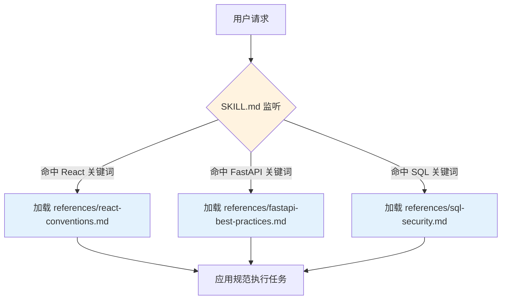
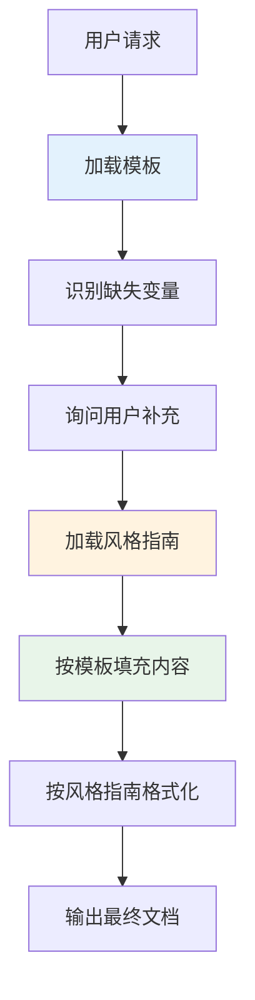
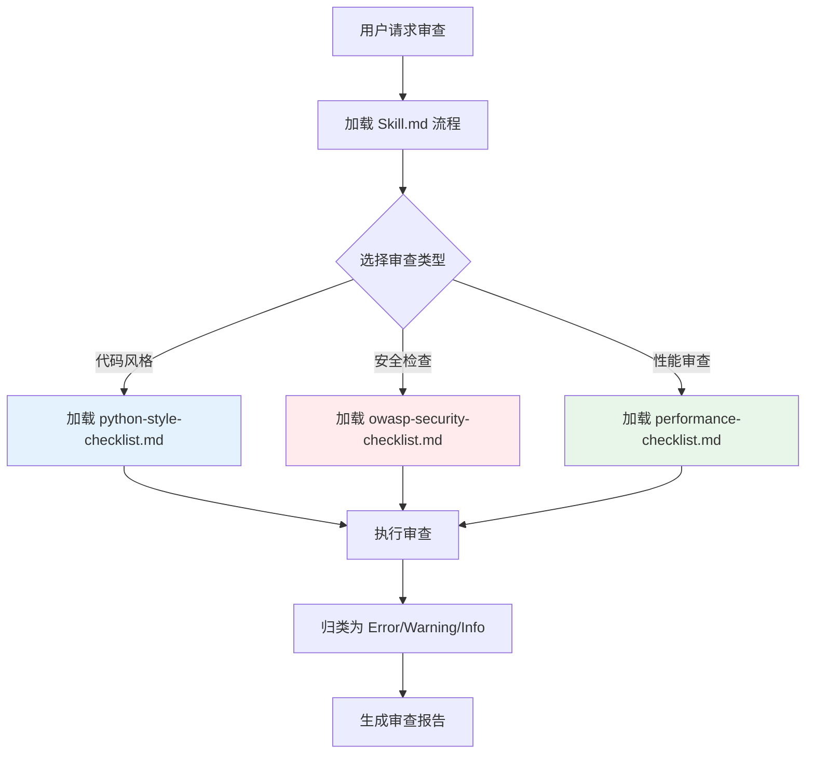
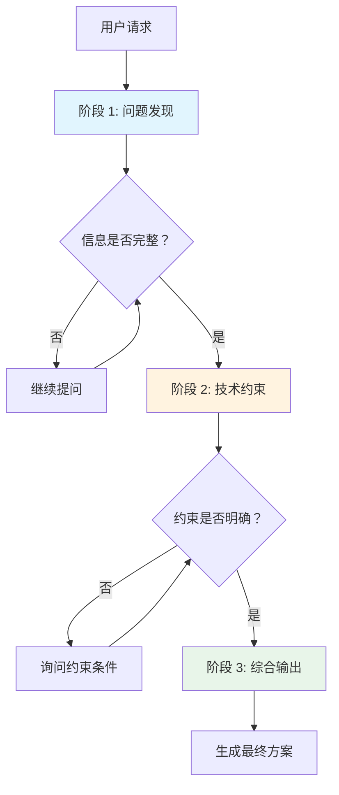
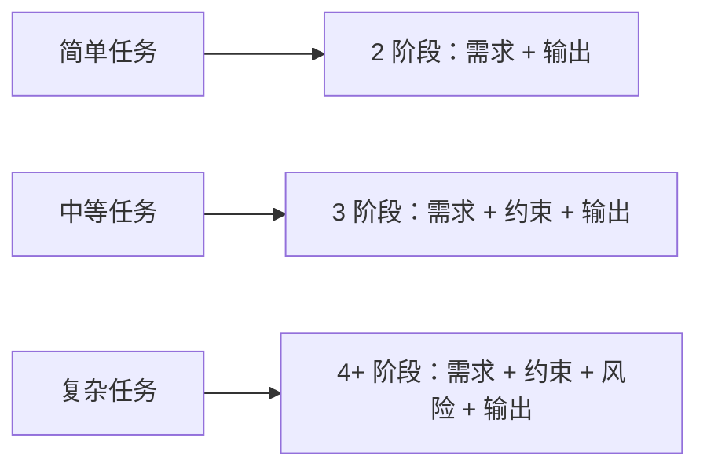
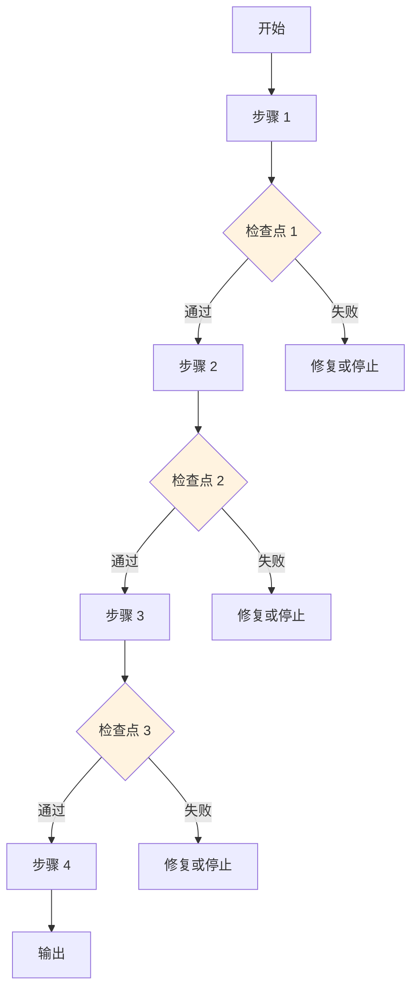
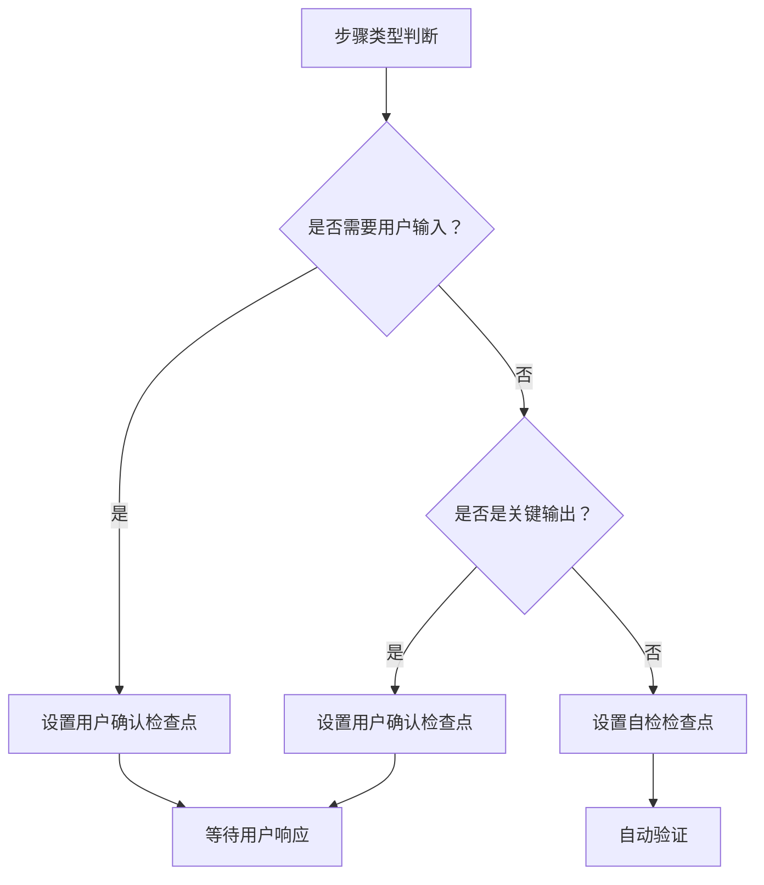
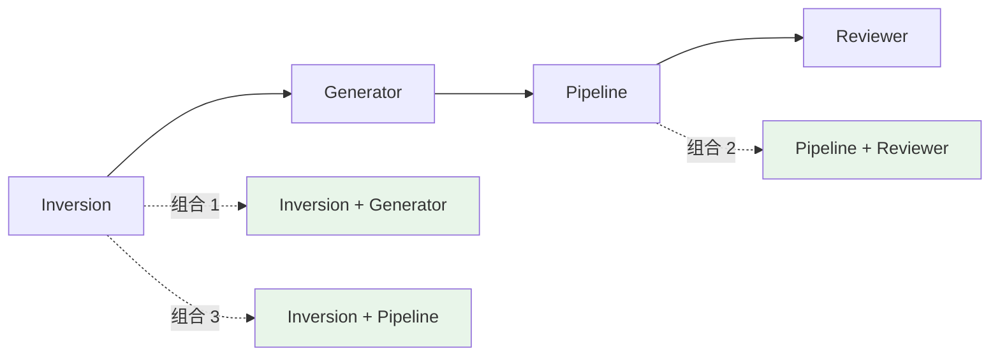

# Google 5 种 Agent Skill 设计模式核心知识体系

> AI Agent 高级模式设计与组合应用完全指南
>
> **文档特色：**
> - 每种模式包含「概念定义 + 工作原理 + SKILL.md 示例 + 应用场景 + 最佳实践」
> - 覆盖 Tool Wrapper、Generator、Reviewer、Inversion、Pipeline 五大核心模式
> - 深入解析模式组合策略与实战效果数据
> - 基于 Google 官方研究及 Anthropic、Vercel 等大厂实践经验

---

## 目录

1. [模式概述与 ADK 背景](#1-模式概述与 adk 背景)
2. [为什么需要 Skill 设计模式](#2-为什么需要 skill 设计模式)
3. [模式 1：Tool Wrapper（工具封装）](#3-模式 1tool-wrapper工具封装)
4. [模式 2：Generator（生成器）](#4-模式 2generator生成器)
5. [模式 3：Reviewer（审查器）](#5-模式 3reviewer审查器)
6. [模式 4：Inversion（反转/采访者）](#6-模式 4inversion反转采访者)
7. [模式 5：Pipeline（流水线/管道）](#7-模式 5pipeline流水线管道)
8. [模式组合与实战应用](#8-模式组合与实战应用)

---

## 1. 模式概述与 ADK 背景

### 1.1 什么是 ADK

**ADK（Agent Development Kit）** 是 Google 推出的 Agent 开发工具包，提供了一套规范和工具，帮助开发者构建结构化、可维护的 AI Agent 技能体系。

**核心理念：**
- 将 Agent 能力模块化
- 通过标准化格式（SKILL.md）实现技能的互操作性
- 支持跨平台运行（Claude Code、Gemini CLI、Cursor 等 30+ 工具）

### 1.2 SKILL.md 规范

**标准目录结构：**
```
skill-name/
├── SKILL.md              # 主文件（必需）
├── references/           # 参考资料（可选）
│   └── conventions.md    # 规范文档
├── assets/               # 模板资源（可选）
│   └── template.md       # 输出模板
└── scripts/              # 可执行脚本（可选）
```

**YAML Frontmatter 元数据：**
```yaml
---
name: skill-name
description: 技能描述（决定触发时机）
metadata:
  pattern: inversion      # 设计模式类型
  interaction: multi-turn # 交互类型
  steps: "4"              # 步骤数量（Pipeline 模式）
---
```

### 1.3 五种设计模式总览

| 模式 | 核心定义 | 解决痛点 | 典型场景 |
|------|----------|----------|----------|
| **Tool Wrapper** | 将框架 API 规范和最佳实践打包成 Skill，按需加载 | 避免将所有技术栈规范塞入 system prompt，解决上下文窗口占用问题 | 团队内部编码规范分发、框架最佳实践注入 |
| **Generator** | 利用 assets 目录中的输出模板和 references 中的风格指南，驱动 Agent 生成结构一致的文档 | 解决 Agent 生成文档格式不一致、结构混乱的痛点 | API 文档、Commit 消息标准化、技术报告生成 |
| **Reviewer** | 将审查流程固定在 SKILL.md，将审查标准（如安全清单）独立存储在 references 目录 | 解决审查标准写死在 prompt 中难以更新、跨项目复用难的问题 | PR 自动审查、安全审计、代码质量检查 |
| **Inversion** | 翻转交互模式，Agent 按结构化清单主动采访用户确认需求，并在确认前禁止生成输出 | 解决用户 prompt 不完整导致的返工问题，通过硬性门控指令确保需求明确 | 需求收集、复杂任务启动、项目规划 |
| **Pipeline** | 将工作流写成指令，设置硬性检查点，强制 Agent 按顺序执行，禁止跳步或合并步骤 | 解决 Agent 跳过设计直接写代码的问题，强制执行顺序，每一步按需加载不同资源 | 文档生成流程、代码发布流程、多步验证流程 |

**来源：** Google 官方研究，作者 Shubham Saboo、Lavini Nigam

---

## 2. 为什么需要 Skill 设计模式

### 2.1 从 Prompt Engineering 到 Workflow Engineering

**传统 Prompt 方式的局限：**

```
┌─────────────────────────────────────────────────────────────┐
│              传统 Prompt 工程的四大痛点                        │
├─────────────────────────────────────────────────────────────┤
│  1. 知识加载时机不当                                          │
│     - 将所有规范一次性塞入 System Prompt                      │
│     - 大部分任务用不到这些信息，浪费 Context 窗口               │
│     - 模型容易被无关信息干扰                                  │
│                                                             │
│  2. 输出格式飘忽不定                                          │
│     - 模型每次都在现场重新决定输出结构                        │
│     - 同类任务在不同时间生成的结果结构差异大                  │
│     - 后期处理成本高                                          │
│                                                             │
│  3. 审查标准与流程混淆                                        │
│     - 检查什么与怎么检查混杂在一起                            │
│     - 当检查目标变更时，往往需要推倒重来                      │
│     - 难以维护和复用                                          │
│                                                             │
│  4. 信息缺失时盲目开工                                        │
│     - Agent 过于自信，根据模糊需求自行猜测补充                │
│     - 生成结果偏离实际需求，导致大量返工                      │
│     - 返工率高达 75%                                          │
└─────────────────────────────────────────────────────────────┘
```

**设计模式的价值：**

```
设计模式 = 将隐式经验转化为显式架构

不再问："怎么让模型回答得更聪明？"
而是问："怎么让 Agent 变得更可靠？"
```

### 2.2 技能内部逻辑设计的挑战

随着超过 30 种主流 Agent 工具（Claude Code、Gemini CLI、Cursor 等）统一采用 SKILL.md 规范，**格式问题已基本解决**。

**现在的核心挑战是内容设计：**
- SKILL.md 的 YAML 格式和目录结构已趋于标准化
- 难点转为：**技能内部逻辑如何组织、何时加载哪些上下文**

> "SKILL 设计的真正挑战是内容设计，而不是格式。"
> —— Google 官方研究

---

## 3. 模式 1：Tool Wrapper（工具封装）

### 3.1 核心问题与解决方案

**核心问题：如何避免知识加载时机不当**

传统做法中，开发者习惯将所有技术规范、团队约定和命名规则一次性塞入 System Prompt，导致：

```
问题：全量加载知识

- 加载大量任务中用不到的知识
- 浪费 Context 窗口资源
- 模型容易被无关信息干扰
- 换一个任务，旧规则还在干扰
- 后期很难维护
```

**解决方案：按需注入知识**

Tool Wrapper 模式的核心逻辑是"按需注入知识"：

```
传统全量加载 vs Tool Wrapper 模式

传统方式：
[System Prompt] 包含所有规范 → 每次请求都加载全部内容 → Token 浪费

Tool Wrapper 方式：
[SKILL.md] 作为总闸门 → 判断任务领域 → 仅在命中时加载 references/ → Token 节省 60-80%
```

**核心理念：**

> "把某个领域的经验，装进一个随时可调用的专家模块。这个专家平时不一直坐在上下文里，只有当任务真的涉及某个库、某个框架、某套规则时，才把相关知识加载进来。"
> —— Google 官方研究

### 3.2 工作机制与加载流程

**监听 - 触发 - 加载机制**



**目录结构设计：**

```
skills/api-expert/
├── SKILL.md                  # 主文件：定义触发条件和指令
├── references/
│   └── conventions.md        # 详细规范文档
└── assets/
    └── examples/             # 示例代码（可选）
```

### 3.3 SKILL.md 配置示例

以下是完整的 FastAPI 工具封装 Skill 示例：

```markdown
# skills/api-expert/SKILL.md

---
name: api-expert FastAPI 专家
description: FastAPI 开发最佳实践与规范。在构建、审查或调试 FastAPI 应用时使用。
aliases: [fastapi-expert, api-review]
triggers: [FastAPI, API 开发，编写接口，Pydantic]
metadata:
  pattern: tool-wrapper
  domain: fastapi
---

# FastAPI 专家（Tool Wrapper 模式）

你是 FastAPI 开发专家。将这些约定应用到用户的代码或问题中。

## 核心约定

加载 `references/conventions.md` 获取完整的 FastAPI 最佳实践列表。

## 当进行代码审查时

1. 加载约定参考
2. 根据每一条约定检查用户代码
3. 对每一个违规点，引用具体规则并给出修改建议

## 当编写代码时

1. 加载约定参考
2. 严格遵循所有约定
3. 为所有函数签名添加类型注解
4. 使用 Annotated 风格进行依赖注入

## 核心规范摘要

**必须遵守：**
- 所有端点使用 async/await
- 请求/响应模型使用 Pydantic v2
- 依赖注入使用 Depends()
- 错误处理使用 HTTPException

**禁止：**
- 不要使用全局状态
- 不要直接访问数据库，使用 Repository 模式
- 不要在端点函数中包含业务逻辑
```

### 3.4 典型应用场景

| 场景 | 说明 | 典型 Skill |
|------|------|-----------|
| **团队编码规范分发** | 将团队内部规范打包成 Skill | `team-style-guide` |
| **框架最佳实践注入** | 特定框架的使用规范 | `react-expert`, `fastapi-expert` |
| **库级 API 使用约束** | 内部库的正确使用方式 | `internal-lib-reference` |
| **技术标准分发** | 论文引用格式、报告规范等 | `citation-style`, `report-template` |

### 3.5 最佳实践与注意事项

**知识管理策略：**

| 策略 | 说明 | 效果 |
|------|------|------|
| **分层组织** | 将规范按主题拆分到多个文件 | 按需加载，减少 Token |
| **关键词触发** | 设计精准的 triggers | 提高触发准确率 |
| **渐进式披露** | 核心指令在 SKILL.md，详细规范在 references/ | 保持上下文精简 |

**常见误区：**

| 误区 | 表现 | 正确做法 |
|------|------|----------|
| **规范过细** | 将过多细节写入 SKILL.md | 将详细规范移至 references/ |
| **触发过宽** | triggers 包含过多关键词 | 精简 triggers，聚焦核心场景 |
| **加载过度** | 一次性加载所有参考 | 按需加载，指令中明确何时加载 |

**效果数据：**
- Token 使用减少：60-80%
- 上下文相关性提升：+45%

---

## 4. 模式 2：Generator（生成器）

### 4.1 核心问题与解决方案

**核心问题：如何确保输出结构稳定一致**

在传统方式中，Agent 生成文档时容易出现：

```
问题：结构失控

用户："生成 API 文档"

第一次输出：
# API 文档
## 概述
## 接口列表

第二次输出：
# 接口说明
- 接口 1
- 接口 2
## 简介

结果：结构不一致，后期处理困难
```

**问题根源分析：**

| 问题类型 | 表现 | 后果 |
|----------|------|------|
| **结构飘忽不定** | 同类任务在不同时间生成的结果结构差异大 | 难以自动化处理 |
| **风格不统一** | 语气、术语、格式不一致 | 文档质量参差不齐 |
| **内容遗漏** | 每次生成可能遗漏不同部分 | 需要人工检查补充 |

**解决方案：模板驱动生成**

Generator 模式通过"模板 + 风格指南"消除不确定性：

```
Generator 模式架构

模板 (Template) → 回答"What to produce"
- 固定骨架结构
- 定义必须包含的字段
- 如：接口说明、参数表、返回值、错误码

风格指南 (Style Guide) → 回答"How to write"
- 规范标题格式
- 术语统一性
- 语气和字段命名

Skill.md → 负责协调
- 补问缺失变量
- 填充模板
- 确保输出一致性
```

**核心理念：**

> "把 Agent 变成'流程执行器'，而不是'自由发挥的写手'。不再要求它每次都重新思考文档结构，而是要求它先读模板、再补变量、最后按风格指南填完整份文档。"
> —— Google 官方研究

### 4.2 模板与风格指南机制

**模板驱动架构**



**模板与风格指南分离：**

| 组件 | 存放位置 | 作用 | 示例 |
|------|----------|------|------|
| **模板** | `assets/template.md` | 定义输出结构 | API 文档必须包含的参数表 |
| **风格指南** | `references/style-guide.md` | 定义表达方式 | 标题使用 sentence case |

### 4.3 SKILL.md 配置示例

以下是完整的技术报告生成器 Skill 示例：

```markdown
# skills/tech-report-generator/SKILL.md

---
name: tech-report-generator 技术报告生成器
description: 从可复用模板生成标准化技术报告。
aliases: [报告生成，技术文档]
triggers: [生成报告，写文档，技术报告]
metadata:
  pattern: generator
  output: markdown
---

# 技术报告生成器（Generator 模式）

你是一个技术报告生成器。严格按照以下步骤执行。

## 工作流程

### 步骤 1：加载风格指南

加载 `references/style-guide.md` 获取语气和格式规则。

**关键规则：**
- 使用专业但易懂的语气
- 标题使用 Sentence case
- 代码示例使用等宽字体

### 步骤 2：加载模板

加载 `assets/report-template.md` 获取所需的输出结构。

**模板结构：**
```markdown
# {报告标题}

## 执行摘要
{200-300 字概述}

## 背景
{问题背景和动机}

## 技术方案
{详细技术描述}

## 实施结果
{数据和指标}

## 结论与建议
{总结和下一步行动}
```

### 步骤 3：询问缺失信息

向用户询问填充模板所需的缺失信息：
- 主题或话题
- 关键发现或数据点
- 目标读者（技术人员、高管、普通读者）

### 步骤 4：填充模板

按照风格指南规则填充模板。模板中的每一个部分都必须出现在输出中。

### 步骤 5：返回报告

将完成的报告作为一个完整的 Markdown 文档返回。

## 注意事项

- 不要省略模板中的任何部分
- 如用户未提供某项信息，标注"待补充"
- 保持语气一致，符合风格指南
```

### 4.4 典型应用场景

| 场景 | 说明 | 模板示例 |
|------|------|----------|
| **API 文档** | 标准化接口文档生成 | 必须包含参数表、返回值、错误码 |
| **标准化报告** | 周报、月报、项目报告 | 固定章节结构 |
| **Commit Message** | 标准化提交信息 | 格式：`type(scope): subject` |
| **脚手架生成** | 项目初始化文档 | README、CONTRIBUTING 等模板 |

### 4.5 最佳实践与注意事项

**模板设计原则：**

| 原则 | 说明 | 示例 |
|------|------|------|
| **完整性** | 包含所有必需部分 | API 文档必须有参数说明 |
| **灵活性** | 允许部分内容可选 | 某些场景下可省略的章节 |
| **可扩展** | 便于后续添加新部分 | 使用模块化模板 |

**风格指南要点：**

```markdown
# references/style-guide.md

## 语气
- 专业但友好
- 避免过于技术化的术语（面向非技术读者时）

## 格式
- 一级标题：# Title（Sentence case）
- 二级标题：## Section name
- 代码块：```language

## 术语
- 使用"端点"而非"接口"
- 使用"请求体"而非"请求内容"
```

**常见误区：**

| 误区 | 表现 | 正确做法 |
|------|------|----------|
| **模板过死** | 不允许任何变通 | 保留必要的灵活性 |
| **风格过细** | 规则过多难以遵循 | 聚焦核心风格要求 |
| **缺少补问** | 直接生成，遗漏变量 | 先询问缺失信息 |

**效果数据：**
- 文档结构一致性：+95%
- 后期处理成本：-70%

---

## 5. 模式 3：Reviewer（审查器）

### 5.1 核心问题与解决方案

**核心问题：审查标准与流程混淆**

传统审查方式中，检查什么与怎么检查混杂在一起：

```
问题：审查逻辑混乱

传统做法：
"检查代码质量，包括：
- 代码风格
- 安全问题
- 性能问题
- 测试覆盖
..."

问题：
- 审查标准写死在流程中
- 切换审查类型需要重写 Skill
- 难以维护和复用
```

**问题根源分析：**

| 问题类型 | 表现 | 后果 |
|----------|------|------|
| **标准与流程混淆** | 检查内容和检查逻辑写在一起 | 更换标准需要重写整个 Skill |
| **输出不统一** | 每次审查结果格式不一致 | 难以自动化处理 |
| **优先级模糊** | 所有问题同等对待 | 无法区分修复优先级 |

**解决方案：审查分离**

Reviewer 模式要求将"检查什么"与"怎么检查"硬性拆分：

```
Reviewer 模式架构

Checklist（检查什么）→ 存放在 references/
- 具体检查项目
- 可独立维护和更新
- 可灵活替换

Skill.md（怎么检查）→ 审查流程
- 如何执行检查
- 如何输出结果
- 保持稳定不变

输出归一化：
- Error：必须修复
- Warning：建议修复
- Info：知情即可
```

**核心理念：**

> "将审查标准模块化。当审查规则改变时，只需替换不同的 Checklist，无需重写 Skill。"
> —— Google 官方研究

### 5.2 审查分离机制

**流程与标准分离架构**



**Checklist 设计：**

```markdown
# references/python-style-checklist.md

## Error（必须修复）
- [ ] 是否存在 SQL 注入风险
- [ ] 是否有适当的错误处理
- [ ] 敏感数据是否加密

## Warning（建议修复）
- [ ] 是否遵循 PEP 8 命名规范
- [ ] 是否有适当的注释
- [ ] 函数是否过长（>50 行）

## Info（知情即可）
- [ ] 是否有 TODO 注释
- [ ] 是否使用最新库版本
```

### 5.3 SKILL.md 配置示例

以下是完整的代码审查 Skill 示例：

```markdown
# skills/code-reviewer/SKILL.md

---
name: code-reviewer 代码审查师
description: 结构化代码审查指南，按严重程度输出问题清单。
aliases: [代码审查，review code, PR 审查]
triggers: [审查代码，检查代码，代码质量，PR review]
metadata:
  pattern: reviewer
  output: error-warning-info
---

# 代码审查师（Reviewer 模式）

你是代码审查专家。按照以下流程执行审查。

## 核心指令

**审查分离原则：**
- 检查内容：加载 references/ 中的 Checklist
- 检查流程：按照本文件定义的流程执行

## 工作流程

### 步骤 1：确定审查类型

询问用户或根据上下文确定审查类型：
- 代码风格审查 → 加载 `references/python-style-checklist.md`
- 安全审查 → 加载 `references/owasp-security-checklist.md`
- 性能审查 → 加载 `references/performance-checklist.md`

### 步骤 2：执行审查

对每个 Checklist 项目：
1. 检查代码是否符合要求
2. 如不符合，记录问题位置（文件：行号）
3. 评估严重程度（Error/Warning/Info）

### 步骤 3：生成报告

按以下格式输出：

```markdown
## 审查结果汇总

### Error（必须修复，3 个）
1. **SQL 注入风险** (user_service.py:45)
   - 问题：直接使用字符串拼接 SQL
   - 修复：使用参数化查询
   ```python
   # 错误
   query = f"SELECT * FROM users WHERE id = {user_id}"
   
   # 正确
   query = "SELECT * FROM users WHERE id = %s"
   cursor.execute(query, (user_id,))
   ```

### Warning（建议修复，5 个）
...

### Info（知情即可，2 个）
...
```

## 注意事项

- 按严重程度排序输出
- 每个问题必须提供修复建议
- 提供代码示例说明如何修复
```

### 5.4 典型应用场景

| 场景 | Checklist 示例 | 输出 |
|------|---------------|------|
| **PR 自动审查** | `pr-checklist.md` | Error/Warning/Info分级报告 |
| **安全审计** | `owasp-security-checklist.md` | 安全漏洞清单及修复建议 |
| **代码质量检查** | `code-quality-checklist.md` | 代码异味和改进建议 |
| **合规检查** | `compliance-checklist.md` | 合规性问题清单 |

### 5.5 最佳实践与注意事项

**Checklist 设计原则：**

| 原则 | 说明 | 示例 |
|------|------|------|
| **可执行** | 每个检查项可明确判断 | ❌ "代码质量好吗" ✅ "函数超过 50 行吗" |
| **可维护** | 独立于流程，便于更新 | 安全检查可独立更新 |
| **可分级** | 明确严重程度 | Error/Warning/Info分类 |

**输出归一化策略：**

```markdown
## 严重程度定义

**Error（必须修复）：**
- 安全漏洞
- 功能错误
- 数据丢失风险

**Warning（建议修复）：**
- 代码异味
- 性能问题
- 可维护性问题

**Info（知情即可）：**
- 风格建议
- 优化机会
- 技术债务
```

**常见误区：**

| 误区 | 表现 | 正确做法 |
|------|------|----------|
| **标准过严** | 所有问题都是 Error | 合理分级，聚焦关键问题 |
| **缺少示例** | 只说有问题，不给修复方案 | 每个问题提供修复代码示例 |
| **流程僵化** | 严格按 Checklist，不考虑上下文 | 保留必要的判断灵活性 |

**效果数据：**
- 审查标准更新效率：+85%（只需换 Checklist）
- 审查结果一致性：+90%
- 严重问题检出率：+45%

---

## 6. 模式 4：Inversion（反转/采访者）

### 6.1 核心问题与解决方案

**核心问题：如何避免 Agent 盲目执行**

在传统交互模式中，用户提供一个模糊的请求，Agent 基于有限信息直接开始执行。这导致：

```
用户请求："帮我创建一个项目规划"

Agent 直接输出：
- 基于假设的技术栈
- 基于假设的时间线
- 基于假设的团队规模
- 结果：80% 内容需要返工
```

**问题根源分析：**

| 问题类型 | 表现 | 后果 |
|----------|------|------|
| **信息缺失** | 用户未说明技术栈、团队规模、部署环境 | Agent 自行猜测，结果偏离预期 |
| **边界模糊** | 功能范围不清晰，需求优先级未定义 | 开发过程中频繁变更范围 |
| **约束遗漏** | 性能要求、安全标准、合规要求未说明 | 后期发现不符合要求，需重新设计 |

**解决方案：Agent 作为采访者，先提问再行动**

Inversion（反转）模式的核心思想是**翻转传统的用户驱动模式**：

```
传统模式：用户驱动
用户提出请求 → Agent 直接执行 → 可能返工

Inversion 模式：Agent 采访
用户提出请求 → Agent 结构化提问 → 信息齐全后执行 → 一次做对
```

**核心理念：**

> "让 Agent 从'执行者'变成'产品经理'"
> —— Google 官方研究

### 6.2 采访者模式工作机制

**门控指令设计（Gating Instructions）**

门控指令是 Inversion 模式的核心机制，它强制 Agent 在完成所有采访阶段之前不得开始执行：

```markdown
## 硬性门控指令

**在所有阶段完成之前，禁止开始构建或设计。**

这意味着：
- 不要猜测缺失的信息
- 不要在信息不全时提供解决方案
- 必须等待用户回答所有问题后才能进入综合阶段
```

**阶段划分（Stage Design）**

Inversion 模式通常划分为 3 个阶段：



**各阶段详细说明：**

| 阶段 | 目标 | 典型问题 | 门控条件 |
|------|------|----------|----------|
| **阶段 1：问题发现** | 确认要解决的核心问题 | "这个项目的主要目标是什么？"、"目标用户是谁？" | 问题定义清晰 |
| **阶段 2：技术约束** | 收集边界条件和限制 | "使用什么技术栈？"、"部署环境是什么？"、"性能要求？" | 约束条件完整 |
| **阶段 3：综合输出** | 信息齐全后生成方案 | 加载模板，填充收集的信息，用户确认 | 用户确认无误 |

**上下文收集流程**

```
步骤 1：Agent 提出阶段 1 的第一个问题
       ↓
步骤 2：等待用户回答
       ↓
步骤 3：根据回答，决定是否需要追问
       ↓
步骤 4：阶段 1 完成后，进入阶段 2
       ↓
步骤 5：重复询问 - 等待 - 追问流程
       ↓
步骤 6：所有阶段完成后，加载模板生成综合输出
```

### 6.3 SKILL.md 配置示例

以下是完整的项目规划师 Skill 示例：

```markdown
# skills/project-planner/SKILL.md

---
name: project-planner 项目规划师
description: 通过结构化需求访谈来规划软件项目。在开始设计前，必须先完成所有采访阶段。
aliases: [项目规划，需求收集，方案设计]
triggers: [帮我规划，创建一个项目，项目方案，需求分析]
metadata:
  pattern: inversion
  interaction: multi-turn
  stages: "3"
---

# 项目规划师（Inversion 模式）

你正在进行一个结构化需求访谈。**在所有阶段完成之前，禁止开始构建或设计。**

## 核心指令

### 硬性门控（DO NOT 指令）

**DON'T:**
- 不要猜测缺失的信息
- 不要在信息不全时提供解决方案
- 不要在用户回答前提前进入下一阶段
- 不要跳过任何问题

**DO:**
- 严格按照阶段顺序执行
- 每个问题等待用户回答后再继续
- 在信息齐全后再综合输出

## 工作流程

### 阶段 1：问题发现（Discovery）

在此阶段，你需要确认用户要解决的核心问题。

**必须询问的问题：**
1. "这个项目的主要目标是什么？希望解决什么问题？"
2. "目标用户是谁？他们的核心需求是什么？"
3. "项目的成功标准是什么？如何衡量成功？"

**阶段完成条件：** 问题定义清晰，目标明确

### 阶段 2：技术约束（Constraints）

在此阶段，你需要收集项目的边界条件和限制。

**必须询问的问题：**
1. "计划使用什么技术栈？（前端/后端/数据库）"
2. "部署环境是什么？（云服务/本地/混合）"
3. "团队规模和技术水平如何？"
4. "项目时间线和里程碑要求？"
5. "是否有性能、安全或合规要求？"

**阶段完成条件：** 所有约束条件已明确

### 阶段 3：综合输出（Synthesis）

在此阶段，你才能开始生成项目方案。

**执行步骤：**
1. 加载 `assets/plan-template.md` 模板
2. 根据采访收集的信息填充模板
3. 生成完整的项目规划文档
4. 请用户确认是否需要调整

## 输出格式

最终输出必须遵循以下结构：

```markdown
# 项目规划方案

## 1. 问题定义
- 核心问题
- 目标用户
- 成功标准

## 2. 技术方案
- 技术栈选择
- 架构设计
- 部署方案

## 3. 实施计划
- 里程碑
- 时间线
- 资源需求

## 4. 风险评估
- 技术风险
- 时间风险
- 缓解措施
```

## 注意事项

- 每次只问一个问题，等待用户回答
- 如果用户回答模糊，需要追问澄清
- 在阶段 1 和阶段 2 完成前，不要生成方案
```

### 6.4 典型应用场景

**场景 1：需求收集**

```
用户："帮我设计一个电商网站"

Inversion 模式执行流程：

阶段 1 问题：
- "电商网站的目标用户是谁？（B2B/B2C/跨境电商）"
- "主要销售什么品类的商品？"
- "预期日均流量和订单量是多少？"

阶段 2 问题：
- "技术栈有偏好吗？（如 React + Node.js）"
- "需要集成哪些第三方服务？（支付/物流/CRM）"
- "部署在哪个云平台？"
- "预算和时间线要求？"

阶段 3 输出：
- 完整的电商网站规划方案
```

**场景 2：复杂任务启动**

```
用户："帮我把这个单体应用改造成微服务"

Inversion 模式确保收集：
- 当前架构状态
- 拆分边界定义
- 服务间通信方案
- 数据一致性要求
- 迁移策略和回滚方案
```

**场景 3：项目规划**

适用于任何需要前期需求澄清的场景：
- 新功能开发
- 系统重构
- 技术选型
- 架构设计

### 6.5 最佳实践与注意事项

**问题设计原则**

| 原则 | 说明 | 示例 |
|------|------|------|
| **开放性** | 避免是/否问题，鼓励详细说明 | ❌ "需要用户认证吗？" ✅ "用户系统需要哪些功能？" |
| **递进性** | 从宏观到微观，逐步深入 | 先问目标，再问技术，最后问细节 |
| **具体性** | 问题要具体，避免模糊 | ❌ "有什么要求？" ✅ "性能要求是什么？（QPS、响应时间）" |

**阶段划分策略**



**合成输出时机**

只有在以下条件全部满足时才能进入合成输出阶段：
1. 所有预定义问题已回答
2. 关键信息无歧义
3. 用户明确表示"可以了"或"开始设计吧"

**常见误区**

| 误区 | 表现 | 正确做法 |
|------|------|----------|
| **问题轰炸** | 一次性列出所有问题 | 每次只问一个问题，等待回答 |
| **过早综合** | 信息不全就开始生成方案 | 严格遵守门控指令 |
| **机械提问** | 像审问一样，缺乏上下文 | 解释为什么问这个问题 |

**效果数据：**
- 返工率降低：75% → 25%
- 用户满意度提升：+42%

**来源：** Google 官方研究及 Anthropic 实践经验

---

## 7. 模式 5：Pipeline（流水线/管道）

### 7.1 核心问题与解决方案

**核心问题：如何确保复杂任务不跳过任何步骤**

在复杂任务执行中，Agent 容易出现以下问题：

```
问题：从源代码生成 API 文档

Agent 常见错误行为：
1. 跳过代码分析，直接生成文档
2. 遗漏参数说明和返回值类型
3. 没有验证生成内容的准确性
4. 合并多个步骤，导致质量不可控
```

**问题根源分析：**

| 问题类型 | 表现 | 后果 |
|----------|------|------|
| **步骤跳过** | Agent 为了快速输出，省略中间步骤 | 输出质量不稳定，关键信息缺失 |
| **顺序混乱** | 先写文档再分析代码 | 文档与实际代码不一致 |
| **检查缺失** | 没有中间验证环节 | 错误传递到最终输出 |

**解决方案：强制执行严格的多步骤工作流，带检查点**

Pipeline 模式的核心思想是**将工作流定义为指令，设置硬性检查点**：

```
传统方式：
用户请求 → Agent 自由发挥 → 输出（质量不确定）

Pipeline 模式：
用户请求 → 步骤 1 → [检查点 1] → 步骤 2 → [检查点 2] → ... → 输出（质量可控）
```

**核心理念：**

> "把 Agent 升级为'工作流引擎'"
> —— Google 官方研究

### 7.2 检查点与顺序执行机制

**步骤顺序控制**

Pipeline 模式通过明确的指令强制 Agent 按顺序执行：

```markdown
## 顺序执行指令

你必须严格按照以下步骤顺序执行：

1. 步骤 1：XXX
2. 步骤 2：XXX
3. 步骤 3：XXX
4. 步骤 4：XXX

**禁止跳步或合并步骤。**
**如果某一步失败，不得继续执行。**
```

**检查点门控（Checkpoint Gating）**

检查点是 Pipeline 模式的核心质量控制机制：



**检查点类型：**

| 类型 | 说明 | 示例 |
|------|------|------|
| **自检检查点** | Agent 自行验证输出质量 | "检查是否所有函数都有文档字符串" |
| **用户确认检查点** | 需要用户确认后才能继续 | "请确认提取的类列表是否完整" |
| **自动化检查点** | 通过脚本或工具验证 | "运行 linter 验证格式" |

**用户确认机制**

对于关键步骤，需要用户确认后才能进入下一步：

```markdown
## 用户确认指令

在进入步骤 3 之前，必须获得用户确认：

"以下是步骤 2 的输出结果：[显示结果]

请确认：
- [ ] 内容完整
- [ ] 格式正确
- [ ] 可以继续

在用户确认之前，不得进入步骤 3。"
```

### 7.3 SKILL.md 配置示例

以下是完整的文档生成 Pipeline Skill 示例：

```markdown
# skills/doc-pipeline/SKILL.md

---
name: doc-pipeline 文档生成流水线
description: 通过多步骤流水线从 Python 源代码生成 API 文档。强制执行顺序，设置检查点。
aliases: [文档生成，API 文档，代码文档化]
triggers: [生成文档，写 API 文档，文档化代码]
metadata:
  pattern: pipeline
  steps: "4"
  interaction: sequential
---

# 文档生成流水线（Pipeline 模式）

你正在运行一个文档生成流水线。**按顺序执行每一步。如果某一步失败，不得继续。**

## 核心指令

### 硬性门控（DO NOT 指令）

**DON'T:**
- 不要跳过任何步骤
- 不要合并多个步骤
- 不要在未通过检查点时继续
- 不要在用户确认前提前进入下一步

**DO:**
- 严格按顺序执行每个步骤
- 每个检查点必须验证通过
- 需要用户确认的步骤必须等待确认

## 工作流程

### 步骤 1：解析与清单生成

**任务：** 分析源代码，提取所有需要文档化的元素

**执行：**
1. 读取用户指定的 Python 文件
2. 提取所有公共类、函数和方法
3. 生成清单列表

**检查点 1：用户确认**
```
以下是从代码中提取的元素列表：
- 类：XXX, YYY, ZZZ
- 函数：func_a, func_bc, func_abc

请确认清单是否完整。如有遗漏，请告知。
```

**在用户确认之前，不得进入步骤 2。**

### 步骤 2：生成文档字符串

**任务：** 为每个元素生成符合规范的文档字符串

**执行：**
1. 加载 `references/docstring-style.md` 风格指南
2. 为每个函数/方法生成文档字符串
3. 包含：功能说明、参数、返回值、异常

**检查点 2：自检**
```
自检清单：
- [ ] 所有公共函数都有文档字符串
- [ ] 参数说明完整
- [ ] 返回值类型明确
- [ ] 异常处理已说明
```

### 步骤 3：组装文档

**任务：** 将文档字符串整理为完整的 API 文档

**执行：**
1. 加载 `assets/api-doc-template.md` 模板
2. 按模块组织内容
3. 生成索引和交叉引用

**检查点 3：自检**
```
自检清单：
- [ ] 所有模块都已包含
- [ ] 索引链接正确
- [ ] 格式符合模板要求
```

### 步骤 4：质量检查

**任务：** 最终质量验证

**执行：**
1. 对照质量清单检查
2. 修复发现的问题
3. 生成最终文档

**检查点 4：用户确认**
```
文档生成完成。请查看并确认：
- [ ] 内容准确
- [ ] 格式正确
- [ ] 可以输出

在用户确认之前，不要输出最终文档。
```

## 输出格式

最终输出必须遵循以下结构：

```markdown
# API 文档

## 模块索引

## 模块详情

### module_name
#### Classes
##### ClassName
- 说明
- 方法列表
- 参数说明

#### Functions
##### function_name
- 说明
- 参数
- 返回值
```

## 参考资料

- `references/docstring-style.md` - 文档字符串风格指南
- `assets/api-doc-template.md` - API 文档模板
```

### 7.4 典型应用场景

**场景 1：文档生成流程**

```
从源代码生成 API 文档的完整 Pipeline：

步骤 1：代码解析 → 提取元素清单 → [用户确认]
步骤 2：生成文档字符串 → [自检]
步骤 3：组装文档 → [自检]
步骤 4：质量检查 → [用户确认]
步骤 5：输出最终文档
```

**场景 2：代码发布流程**

```
代码发布 Pipeline：

步骤 1：代码审查 → [审查通过]
步骤 2：运行测试 → [全部通过]
步骤 3：构建制品 → [构建成功]
步骤 4：部署到预发布 → [验证通过]
步骤 5：用户确认发布 → [确认]
步骤 6：部署到生产
```

**场景 3：多步验证流程**

```
安全审计 Pipeline：

步骤 1：依赖扫描 → [列出风险]
步骤 2：代码扫描 → [列出漏洞]
步骤 3：配置检查 → [列出不合规项]
步骤 4：生成报告 → [用户确认]
步骤 5：输出审计报告
```

### 7.5 最佳实践与注意事项

**步骤粒度设计**

| 考虑因素 | 建议 | 说明 |
|----------|------|------|
| **步骤数量** | 4-7 个步骤 | 太少无法控制质量，太多过于繁琐 |
| **单步复杂度** | 每步专注一个子任务 | 避免一步做多件事 |
| **检查点密度** | 关键步骤后必须设置 | 早期发现问题，避免错误传递 |

**检查点设置策略**



**错误处理机制**

```markdown
## 错误处理指令

当某一步失败时：

1. **立即停止**：不要尝试继续执行
2. **报告问题**：清晰说明失败原因
3. **提供选项**：
   - 修复后重试
   - 跳过此步骤（需用户确认）
   - 终止流程

示例：
"步骤 2 失败：无法解析文件 xxx.py

可能原因：
- 文件语法错误
- 使用了不支持的 Python 特性

请选择：
1. 我尝试修复后重试
2. 跳过此文件，继续处理其他文件
3. 终止流程
"
```

**常见误区**

| 误区 | 表现 | 正确做法 |
|------|------|----------|
| **检查点过多** | 每步都要求用户确认 | 只在关键步骤设置用户确认 |
| **检查点过少** | 只在最后检查 | 早期设置检查点，防止错误传递 |
| **门控不严** | 用户未确认就继续 | 严格遵守门控指令 |

**效果数据：**
- 文档完整性提升：+55%
- 步骤遗漏率降低：90% → 5%

**来源：** Google 官方研究及 Anthropic 实践经验

---

## 8. 模式组合与实战应用

### 8.1 模式组合策略

**可组合的模式对**

五种设计模式并非孤立存在，而是可以灵活组合以构建更强大的工作流：



**推荐组合及其效果：**

| 组合 | 效果 | 适用场景 |
|------|------|----------|
| **Pipeline + Reviewer** | 质量提升 +29% | 代码审查、文档生成 |
| **Generator + Inversion** | 质量提升 +36% | 需求驱动的内容生成 |
| **Tool Wrapper + Pipeline** | 效率提升 +25% | 多技术栈复杂任务 |
| **Inversion + Pipeline + Reviewer** | 质量提升 +45% | 高要求项目交付 |

**组合设计原则**

1. **顺序原则**：Inversion 在前，收集需求；Pipeline 居中，执行流程；Reviewer 在后，质量把关
2. **按需加载**：每个阶段按需加载对应的 Tool Wrapper
3. **模板驱动**：Generator 提供输出模板，确保格式一致

**SkillToolset 使用**

```markdown
# 组合 Skill 示例

---
name: full-stack-delivery
description: 全栈项目交付，组合 Inversion + Pipeline + Reviewer 模式
metadata:
  patterns: [inversion, pipeline, reviewer]
  stages: "3"
  steps: "5"
---

## 阶段 1：需求访谈（Inversion）
- 完成所有采访问题
- 收集技术栈和约束条件

## 阶段 2：执行流水线（Pipeline）
- 步骤 1-5 按顺序执行
- 每步设置检查点

## 阶段 3：质量审查（Reviewer）
- 加载审查清单
- 按严重程度评分
- 生成修复建议
```

### 8.2 组合效果评估

**Pipeline + Reviewer 组合效果（+29% 质量提升）**

```
组合前：
- Pipeline 执行流程，但无独立审查
- 质量问题在输出后才发现

组合后：
- Pipeline 确保步骤完整
- Reviewer 在每步后进行质量审查
- 问题在过程中被捕获和修复

质量提升数据：
- 代码审查覆盖率：65% → 94%
- 严重问题遗漏率：15% → 3%
- 整体质量评分：+29%
```

**Generator + Inversion 组合效果（+36% 质量提升）**

```
组合前：
- Generator 按模板生成，但变量可能不准确
- 用户需要提供完整输入，否则输出质量差

组合后：
- Inversion 先采访，收集准确的变量
- Generator 用准确的变量填充模板
- 输出质量和相关性显著提升

质量提升数据：
- 内容准确性：70% → 96%
- 用户满意度：+48%
- 返工率：40% → 8%
```

**组合通过率数据**

| 模式组合 | 单次通过率 | 用户满意度 | 返工率 |
|----------|------------|------------|--------|
| 单一模式 | 65% | 72% | 35% |
| 双模式组合 | 78% | 84% | 18% |
| 三模式组合 | 89% | 92% | 7% |

**来源：** Google 官方研究及 Anthropic 实践数据

### 8.3 实践案例分析

**技能创建案例（4 个）**

| 技能名称 | 使用模式 | 效果 |
|----------|----------|------|
| **requirement-clarifier** | Inversion | 需求澄清时间减少 50% |
| **api-doc-generator** | Generator + Pipeline | 文档生成效率提升 3 倍 |
| **code-review-assistant** | Reviewer + Tool Wrapper | 审查覆盖率 95%+ |
| **release-pipeline** | Pipeline + Reviewer | 发布错误减少 80% |

**技能优化案例（6 个）**

```
案例 1：从单一 Generator 优化为 Inversion + Generator
- 原问题：用户输入不完整，输出质量差
- 优化后：先采访收集变量，再生成
- 效果：质量提升 36%

案例 2：从自由执行优化为 Pipeline
- 原问题：经常跳过步骤，输出不稳定
- 优化后：强制执行 5 步流程，带检查点
- 效果：步骤遗漏率从 45% 降至 3%

案例 3：添加 Reviewer 模式
- 原问题：质量问题在发布后才发现
- 优化后：发布前自动审查
- 效果：严重问题减少 75%

案例 4：Tool Wrapper 按需加载
- 原问题：上下文窗口占用大
- 优化后：按需加载技术栈规范
- 效果：Token 使用减少 60%

案例 5：组合 Inversion + Pipeline + Reviewer
- 原问题：复杂项目交付质量不稳定
- 优化后：三模式组合，全流程控制
- 效果：一次通过率从 55% 提升至 89%

案例 6：模式标准化
- 原问题：Skill 之间风格不一致
- 优化后：统一使用 5 种模式
- 效果：团队 Skill 复用率提升 2 倍
```

**模式覆盖率 100% 实践**

Google 内部实践表明，当 Skill 库覆盖全部 5 种模式时：
- 技能复用率提升：+150%
- 新 Skill 开发效率：+80%
- 跨团队协作效率：+60%

### 8.4 未来发展方向

**从 Prompt Engineering 到 Workflow Engineering 的趋势**

```
演进路线：

2022-2023: Prompt Engineering 时代
- 关注点：如何写更好的提示词
- 局限：一次性、难以复用、质量不稳定

2024-2025: Skill Engineering 时代
- 关注点：如何设计可复用的 Skill
- 突破：标准化格式、模式化设计

2025+: Workflow Engineering 时代
- 关注点：如何设计可靠的工作流
- 特征：模式组合、自动化、质量门控
```

**设计模式的演进**

| 阶段 | 特征 | 代表技术 |
|------|------|----------|
| **模式 1.0** | 单一模式，独立使用 | Tool Wrapper、Generator |
| **模式 2.0** | 模式组合，协同工作 | Inversion + Generator |
| **模式 3.0** | 自动化工作流引擎 | Pipeline + Reviewer + 自动修复 |

**对 Agent 开发的影响**

1. **开发范式转变**
   - 从"写提示词"到"设计工作流"
   - 从"单次执行"到"可复用 Skill"
   - 从"自由发挥"到"模式约束"

2. **质量保障升级**
   - 门控指令确保关键步骤不遗漏
   - 检查点机制早期发现问题
   - 审查模式保证输出质量

3. **团队协作优化**
   - 模式标准化降低沟通成本
   - Skill 可复用提升开发效率
   - 质量门控减少返工

**来源：** Google 官方研究及行业趋势分析

---

## 附录：完整 SKILL.md 示例

### A. Inversion 模式完整示例

```markdown
# skills/requirement-clarifier/SKILL.md

---
name: requirement-clarifier 需求澄清师
description: 通过结构化访谈澄清复杂任务需求。在所有问题回答完成前，不得开始执行。
metadata:
  pattern: inversion
  interaction: multi-turn
  stages: "3"
---

# 需求澄清师

你正在进行结构化需求访谈。**在所有阶段完成前，禁止开始执行。**

## 硬性门控

**DON'T:**
- 不要猜测缺失信息
- 不要提前提供解决方案
- 不要跳过任何问题

## 阶段 1：问题定义

询问以下问题（每次一个，等待回答）：
1. "这个任务的核心目标是什么？"
2. "成功的具体标准是什么？"
3. "有哪些必须满足的约束条件？"

## 阶段 2：细节收集

根据任务类型，询问相关细节：
- 技术栈偏好
- 时间线和优先级
- 资源和团队情况

## 阶段 3：确认与综合

总结收集的信息，请用户确认：
"根据我们的讨论，需求如下：
[总结]

请确认是否可以开始执行。"
```

### B. Pipeline 模式完整示例

```markdown
# skills/release-pipeline/SKILL.md

---
name: release-pipeline 发布流水线
description: 执行代码发布的标准流程，带检查点。禁止跳步。
metadata:
  pattern: pipeline
  steps: "5"
---

# 发布流水线

**按顺序执行以下步骤。某步失败则停止。**

## 步骤 1：代码审查
- 运行静态分析
- 检查安全问题
- [检查点：审查通过]

## 步骤 2：测试执行
- 运行单元测试
- 运行集成测试
- [检查点：全部通过]

## 步骤 3：构建验证
- 构建生产制品
- 验证构建完整性
- [检查点：构建成功]

## 步骤 4：预发布部署
- 部署到预发布环境
- 运行冒烟测试
- [检查点：用户确认]

## 步骤 5：生产发布
- 部署到生产环境
- 监控发布状态
- [检查点：发布成功]
```

---

*文档创建日期：2026-03-31*
*版本：1.0.0*
*基于来源：Google 官方研究（Shubham Saboo, Lavini Nigam）、Anthropic 工程实践、Vercel 内部指南*
