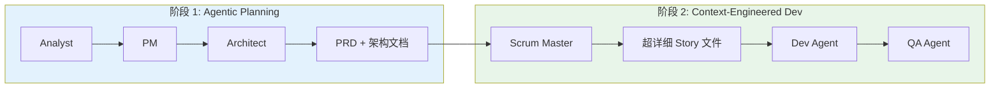
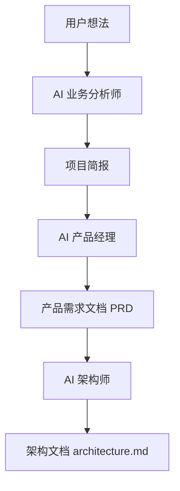
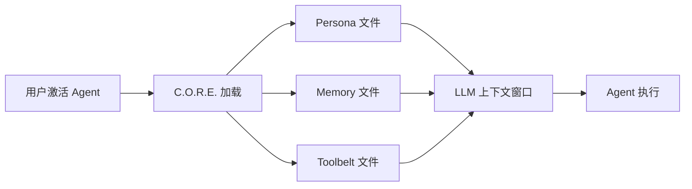
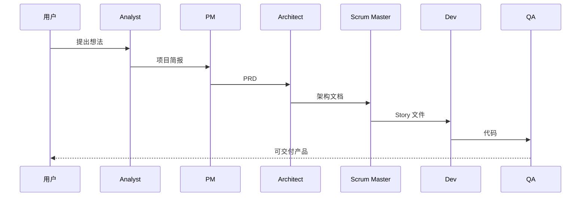
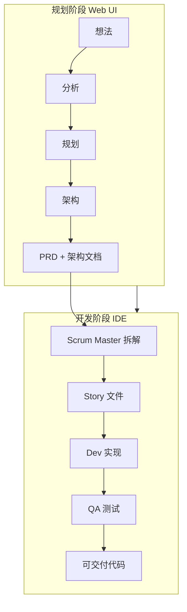

# BMAD-METHOD 核心知识体系

> AI 驱动的敏捷开发框架完整指南 | **调研时间：** 2026-04-01 | **来源：** 官方文档 + 技术社区 30+ 来源

---

## 目录

1. [概述](#1-概述)
   - [1.1 什么是 BMAD-METHOD](#11-什么是-bmad-method)
   - [1.2 为什么需要 BMAD](#12-为什么需要-bmad)
   - [1.3 BMad vs 纯 Skill 系统 vs 多 Agent 系统](#13-bmad-vs-纯-skill-系统-vs-多-agent-系统)
   - [1.4 v6.2.2 新特性](#14-v622-新特性 2026-年 3 月)
   - [1.5 适用场景](#15-适用场景)
2. [核心概念](#2-核心概念)
   - [2.0 C.O.R.E.引擎](#20-core-引擎底层运行时)
     - [2.0.1 上下文注入机制](#201-上下文注入机制技术深潜)
   - [2.1 Agentic Planning](#21-agentic-planning 代理规划)
   - [2.2 Context-Engineered Development](#22-context-engineered-development 上下文工程化开发)
   - [2.3 C.O.R.E.引擎](#23-core-引擎)
   - [2.4 Spec-First](#24-spec-first 文档优先)
   - [2.5 Memory Sidecar](#25-memory-sidecar-架构)
   - [2.6 Module System](#26-module-system 模块化系统)
3. [架构设计](#3-架构设计)
4. [Agent 角色系统](#4-agent-角色系统)
5. [环境搭建](#5-环境搭建)
6. [工作流程](#6-工作流程)
7. [实战案例](#7-实战案例)
8. [高级特性](#8-高级特性)

---

## 1. 概述

### 1.1 什么是 BMAD-METHOD

**BMAD-METHOD**（**B**uild **M**ore **A**rchitect **D**reams，Build BMad Method Module，敏捷 AI 驱动开发的突破性方法）是一个通用的 AI 代理框架，专注于**代理式敏捷驱动开发（Agentic Agile Driven Development）**。

**当前版本：** v6.2.2（2026 年 3 月 26 日发布）

**核心定位：**
- 🎯 **不是**替代人类思考的工具
- 🤝 **而是**专家级协作者，引导你完成结构化思考流程
- 📚 **激发**你的最佳想法（而非替你决定）
- 🔧 **适配**项目规模和复杂度

**官方定义（GitHub README）：**
> "Traditional AI tools do the thinking for you, producing average results. BMad agents and facilitated workflows act as expert collaborators who guide you through a structured process to bring out your best thinking in partnership with the AI."

**BMAD 的全称含义：**
- **B**uild **M**ore **A**rchitect **D**reams — 构建更多架构师的梦想
- 强调从「想法」到「可交付代码」的完整流程覆盖

### 1.2 为什么需要 BMAD

**传统 AI 工具的局限：**

| 问题 | 传统模式 | BMAD 方案 |
|------|----------|----------|
| **规划不一致** | AI 直接生成任务，缺乏上下文 | Agentic Planning 阶段产出详细 PRD+ 架构文档 |
| **上下文丢失** | 任务之间信息断层 | Context-Engineered 开发故事包含完整上下文 |
| **角色模糊** | 单一 AI 助手，缺乏专业分工 | 12+ 专业 Agent，各司其职 |
| **流程混乱** | 无结构化工作流 | 遵循真实敏捷方法论 |
| **状态无感知** | 每次会话从零开始 | bmad-help 自动检测项目进度 |
| **记忆不持久** | 会话结束信息丢失 | Memory Sidecar 持久化架构 |

**BMAD 的两大核心创新：**



---

### 1.3 BMad vs 纯 Skill 系统 vs 多 Agent 系统

**BMad Method 不是简单的 Skill 集合，而是一套完整的「AI 驱动敏捷开发方法论」。**

#### 1.3.1 核心维度对比

| 维度 | 纯 Skill 系统 | 多 Agent 系统 | BMad Method |
|------|--------------|--------------|-------------|
| **流程结构** | 碎片化功能点 | 部分结构化 | **4 阶段完整生命周期** |
| **上下文传递** | 无/手动 | 有限 | **文档优先，自动传递** |
| **自适应能力** | 无 | 有限 | **Scale-Domain-Adaptive** |
| **记忆持久化** | 通常无 | 部分有 | **Sidecar 架构，三种模式** |
| **Agent 专业性** | 单一通才 | 2-5 个角色 | **12+ 专业 Agent** |
| **协作模式** | 无 | 有限 | **Party Mode 多 Agent 讨论** |
| **状态感知** | 无 | 有限 | **bmad-help 智能引导** |
| **扩展机制** | 简单添加 | 中等 | **模块化 + 能力注册** |
| **实现保障** | 无 | 部分 | **Story 循环 + Code Review** |

#### 1.3.2 BMad 的 10 大差异化优势

**1️⃣ 结构化流程 vs 碎片化技能**

| 纯 Skill 系统 | BMad Method |
|--------------|-------------|
| 孤立的功能点，无流程引导 | **4 阶段完整生命周期**：Analysis → Planning → Solutioning → Implementation |
| 用户需要知道下一步做什么 | **bmad-help 智能引导**：自动检测项目状态，推荐下一步 |
| 技能之间信息断层 | **上下文工程化**：每个阶段产出文档传递给下一阶段 |

**2️⃣ Scale-Domain-Adaptive（规模自适应）**

BMad 根据项目复杂度自动调整规划深度：

| 规划轨道 | 适用场景 | 产出文档 |
|----------|----------|----------|
| **Quick Flow** | Bug 修复、简单功能（1-15 stories） | 仅技术规格 |
| **BMad Method** | 产品、平台、复杂功能（10-50+ stories） | PRD + 架构 + UX |
| **Enterprise** | 合规、多租户系统（30+ stories） | PRD + 架构 + 安全 + DevOps |

**3️⃣ Spec-First（文档优先）架构**

```
阶段 1: Agentic Planning
Analyst → PM → Architect → 产出：PRD.md + architecture.md

阶段 2: Context-Engineered Dev
Scrum Master → 超详细 Story 文件 → Dev → QA → 可交付代码
```

| 传统多 Agent | BMad Method |
|-------------|-------------|
| Agent 直接生成代码 | **先锁定逻辑和架构**，再生成代码 |
| 口头传递需求，信息丢失 | **文档作为单一事实源**，所有 Agent 基于同一份文档 |
| 架构随意变更 | **架构文档锁定**，变更需评审 |

**4️⃣ bmad-help：智能上下文感知引导**

官方强调的核心特性：
> "BMad-Help doesn't just answer questions — it automatically runs at the end of every workflow to tell you exactly what to do next."

**功能：**
- 检查项目状态，识别已完成的工作
- 显示基于已安装模块的选项
- 推荐下一步操作（包括首个必需任务）
- 回答情境问题：「我有一个 SaaS 想法，从哪里开始？」

**5️⃣ Memory Sidecar 架构（记忆持久化）**

| 模式 | 结构 | 适用场景 |
|------|------|----------|
| **个人 Sidecar 仅** | 每个 Agent 独立 `_bmad/memory/{skillName}-sidecar/` | 领域隔离 |
| **个人 + 共享模块** | 个人 sidecar + 模块级共享 memory | 部分共享 |
| **单模块 Sidecar** | 所有 Agent 共享 `daily/` + `curated/` | 紧耦合协作 |

**6️⃣ Party Mode（多 Agent 协作讨论）**

BMad 支持多个 Agent 在同一会话中协同讨论，产出综合方案。

**7️⃣ Story 循环机制（实现保障）**

```
Create Story → Validate Story → Dev Story → Code Review → 验收通过
     ↓                                            ↓
  准备上下文                                    回到 DS 修复
```

**8️⃣ 模块化扩展系统**

```
模块 = module.yaml(定义) + config.yaml(配置) + module-help.csv(能力注册) + Skills(实现)
```

**官方模块：**
- **BMad Method (BMM)** — 核心框架，34+ 工作流
- **BMad Builder (BMB)** — 创建自定义 Agent 和工作流
- **Test Architect (TEA)** — 基于风险的测试策略
- **Game Dev Studio (BMGD)** — 游戏开发工作流
- **Creative Intelligence Suite (CIS)** — 创新、头脑风暴

**9️⃣ 100% 开源 vs 付费墙**

> "100% free and open source. No paywalls. No gated content. No gated Discord. We believe in empowering everyone, not just those who can pay."

**🔟 专业 Agent 角色系统**

| Agent | 职责 | 专业产出 |
|-------|------|----------|
| **Business Analyst** | 可行性验证、竞品分析 | 项目简报 |
| **Product Manager** | PRD 撰写、用户故事拆解 | PRD.md |
| **Architect** | 系统架构、技术选型 | architecture.md |
| **Scrum Master** | 任务拆解、进度跟踪 | sprint-status.yaml |
| **Developer** | 代码实现、单元测试 | 可运行代码 |
| **QA** | 测试用例、Bug 验证 | 测试报告 |
| **UX Designer** | 界面设计、交互流程 | UX 规范 |
| **Tech Writer** | API 文档、用户手册 | 技术文档 |
| **DevOps** | CI/CD、部署脚本 | 部署配置 |
| **Security** | 安全审计、漏洞扫描 | 安全报告 |

---

### 1.4 v6.2.2 新特性（2026 年 3 月）

**当前版本：** v6.2.2（最新稳定版，2026 年 3 月 26 日发布）

**v6 核心更新：**

| 特性 | 说明 |
|------|------|
| **🧩 Universal Skills Architecture** | 一次编写，跨平台运行（Claude、Codex、Kimi 等） |
| **🏗️ BMad Builder v1** | 创建生产级 AI Agent 和工作流 |
| **🧠 Project Context System** | 框架感知的上下文管理 |
| **📦 Centralized Skills** | 集中式技能安装，跨项目复用 |
| **🔄 Adaptive Skills** | 针对不同 AI 工具优化技能行为 |
| **⚡ Dev Loop Automation** | 可选的自动化开发循环 |

**Roadmap（进行中）：**
- 🎙️ The BMad Method Podcast
- 🎓 The BMad Method Master Class
- 🖥️ 官方 UI 界面
- 🔒 BMad in a Box（自托管、企业级）
- 💎 社区模块扩展

---

### 1.5 适用场景

**推荐使用：**
- ✅ 软件项目开发（绿色场/棕色场）
- ✅ 产品需求分析与 PRD 撰写
- ✅ 系统架构设计
- ✅ 敏捷开发流程管理
- ✅ 创意写作、商业策略（扩展包支持）

**不推荐：**
- ⚠️ 简单代码片段生成（用 Cursor/Claude 直接生成即可）
- ⚠️ 紧急 Bug 修复（无需完整流程）
- ⚠️ 个人小项目（流程可能过重）

**规划轨道选择指南：**

| 你的场景 | 推荐轨道 | 理由 |
|----------|----------|------|
| Bug 修复、小功能 | Quick Flow | 仅需技术规格，跳过冗长文档 |
| 新产品、平台功能 | BMad Method | PRD+ 架构确保一致性 |
| 企业系统、合规需求 | Enterprise | 安全、DevOps、审计必备 |

---

## 2. 核心概念

### 2.0 C.O.R.E. 引擎（底层运行时）

> **来源说明**：C.O.R.E.的详细机制主要来自社区逆向分析（GitHub 源码 + 本地系统分析），非官方公开文档。官方文档仅简略提及 Skills 和配置系统。

**概念定义：**

**C.O.R.E.**（Collaboration Optimized Reflection Engine，协作优化反射引擎）是 BMAD 的底层运行时环境，但其实质不是后台常驻服务，而是**基于文件系统的依赖注入和上下文管理规范**。

> **官方定义（docs.bmad-method.org）**：  
> "Skills are pre-built prompts that load agents, run workflows, or execute tasks inside your IDE."

**工作原理：**

```
用户激活 Agent → IDE 加载 Skill 文件 → 读取配置/记忆/上下文 → LLM 上下文窗口 → Agent 执行
```

**核心机制：**

| 组件 | 实现方式 | 文件位置 | 验证状态 |
|------|---------|---------|---------|
| **配置注入** | Skill 指令读取 YAML | `_bmad/{module}/config.yaml` | ⚠️ 社区分析 |
| **记忆持久化** | Sidecar 模式（独立目录） | `_bmad/memory/{skillName}-sidecar/` | ⚠️ 社区分析 |
| **能力注册** | CSV 注册表 | `_bmad/_config/bmad-help.csv` | ✅ 官方确认 |
| **上下文传递** | 文件路径引用 | `project-context.md` | ✅ 官方确认 |

**为什么这样设计：**

1. **透明度**：所有状态都是人类可读的文件，可审计
2. **可版本控制**：Git 友好，配置变更可追溯
3. **易扩展**：添加新 Agent 只需新增 SKILL.md
4. **无供应商锁定**：不依赖特定 LLM 平台

**配置继承机制：**

```yaml
# core/config.yaml → 所有模块共享
user_name: Kei
communication_language: 中文

# {module}/config.yaml → 继承 core 并扩展
# 自动包含所有 core 配置项 + 模块特定变量
```

---

### 2.0.1 上下文注入机制（技术深潜）

> **来源**：基于 Claude Code Skill 系统工作原理分析

**Prompt 组装层次：**

```
┌─────────────────────────────────────────────────────────────┐
│  SYSTEM PROMPT（系统提示词）                                 │
│  ─────────────────────────────────────────────────────────  │
│  来源：                                                      │
│  - CLAUDE.md（项目级配置）                                  │
│  - Skill 文件内容（SKILL.md 完整内容）                       │
│  - 内置系统指令（安全规则等）                               │
│                                                              │
│  作用：定义 AI 的角色、能力、行为约束                        │
└─────────────────────────────────────────────────────────────┘

┌─────────────────────────────────────────────────────────────┐
│  USER PROMPT（用户消息）                                     │
│  ─────────────────────────────────────────────────────────  │
│  来源：                                                      │
│  - 用户实际输入                                              │
│  - 工具执行结果（文件读取/bash 输出）                        │
│  - 历史对话消息                                              │
│                                                              │
│  作用：提供具体数据、文件内容、当前请求                      │
└─────────────────────────────────────────────────────────────┘
```

**C.O.R.E.各组件注入位置：**

| 组件 | 注入位置 | 时机 |
|------|---------|------|
| SKILL.md (Persona) | System | Skill 触发时 |
| config.yaml (配置) | User | Skill 指令要求读取 |
| module-help.csv | User | 需要显示能力列表 |
| Memory Sidecar | User | Skill 指令要求读取 |
| project-context.md | User | 需要项目上下文时 |
| CLAUDE.md | System | 会话启动时 |

**完整注入流程示例（/bmad-create-prd）：**

```
1. 用户输入：/bmad-create-prd
         ↓
2. Claude Code 加载 SKILL.md 内容到 System Prompt
         ↓
3. SKILL.md 指令："Read _bmad/bmm/config.yaml"
         ↓
4. Claude Code 执行读取，将 YAML 内容追加到 User Prompt
         ↓
5. LLM 接收完整上下文并生成响应

最终 API 请求体：
{
  "system": "[CLAUDE.md + SKILL.md 内容]",
  "messages": [
    {"role": "user", "content": "/bmad-create-prd"},
    {"role": "assistant", "content": "我读取到配置：..."},
    {"role": "user", "content": "我想做一个任务管理应用"}
  ]
}
```

**关键理解：**

| 误解 | 正确理解 |
|------|---------|
| 「py 脚本在运行时执行」 | bmad_init.py 仅安装时运行 |
| 「提取关键词注入」 | 完整文件内容注入，LLM 自己理解语义 |
| 「有后台引擎」 | 无后台进程，引擎=IDE+ 文件读取指令 |
| 「C.O.R.E.是运行时服务」 | C.O.R.E.是文件系统约定 +Skill 指令规范 |

---

### 2.1 Agentic Planning（代理规划）

**概念定义：**

Agentic Planning 是 BMAD 的第一阶段，通过专用 Agent（分析师、产品经理、架构师）协作，创建详细的、一致的产品需求文档（PRD）和架构文档。

**为什么需要 Agentic Planning：**

传统 AI 辅助开发的最大问题是**规划不一致性**——AI 生成的任务缺乏上下文，导致后续开发频繁返工。

**工作流程：**



**各阶段产出：**

| 阶段 | 主导 Agent | 产出物 | 目的 |
|------|------------|--------|------|
| **分析** | AI Business Analyst | 项目简报 | 可行性验证、竞品分析、方向确认 |
| **规划** | AI Product Manager | PRD | 用户故事、验收标准、功能定义 |
| **架构** | AI Architect | architecture.md | 系统蓝图、数据库结构、API 设计、文件目录 |

### 2.2 Context-Engineered Development（上下文工程化开发）

**概念定义：**

Context-Engineered Development 是 BMAD 的第二阶段，由 Scrum Master Agent 将详细规划转化为**超详细开发故事（Story）**，包含 Dev Agent 所需的所有上下文、实现细节和架构指导。

**解决的核心问题：**

传统 AI 开发的第二大问题是**上下文丢失**——Dev Agent 不知道为什么要构建这个功能、如何与现有架构集成。

**Story 文件包含的内容：**

````markdown
# Story: [功能名称]

### 上下文
- 业务目标：[为什么需要这个功能]
- 用户价值：[对用户的好处]
- 相关文档：[PRD 链接、架构文档链接]

### 技术规格
- 涉及组件：[组件列表]
- API 变更：[接口定义]
- 数据库变更：[表结构]
- 文件结构：[新增/修改的文件]

### 实现指南
- 步骤 1: [详细说明]
- 步骤 2: [详细说明]
- ...

### 验收标准
- [ ] 功能点 1
- [ ] 功能点 2
- [ ] 测试通过
````

### 2.3 C.O.R.E. 引擎

**C.O.R.E.**（Collaboration Optimized Reflection Engine，协作优化反射引擎）是 BMAD 的底层运行时环境。

**设计哲学：**
- 否定"黑盒"智能体
- 主张透明的、基于文件的交互
- 管理 Agent 行为通过上下文注入

**技术实现：**

C.O.R.E. 不是后台常驻服务，而是一套**依赖注入（Dependency Injection）**和**上下文管理（Context Management）**的规范。

当用户在 IDE 中激活某个 Agent 时，C.O.R.E. 负责动态加载：
1. **角色定义（Persona）** - Agent 的职责和行为规范
2. **记忆（Memory）** - 项目上下文和历史记录
3. **工具集（Toolbelt）** - 可用的工具和命令



### 2.5 Spec-First（文档优先）

**核心理念：**

在编写任何代码之前，先锁定逻辑和架构设计。这是 BMAD 区别于其他 AI 辅助工具的关键特征。

**为什么 Spec-First 重要：**

| 问题 | 无 Spec | Spec-First |
|------|---------|------------|
| **架构一致性** | 代码随意变更，架构腐化 | 架构文档锁定，变更需评审 |
| **上下文传递** | 信息在口头传递中丢失 | 文档作为单一事实源 |
| **Agent 协作** | Agent 之间信息不同步 | 所有 Agent 基于同一份文档 |
| **人类审查** | 难以审查 AI 生成的代码 | 先审查文档，再生成代码 |

### 2.6 Memory Sidecar 架构

**概念定义：**

Memory Sidecar 是 BMAD 的记忆持久化机制，每个 Agent 拥有独立的记忆目录，支持多 Agent 间的记忆共享模式。

**三种架构模式：**

| 模式 | 结构 | 适用场景 |
|------|------|----------|
| **个人 Sidecar 仅** | 每个 Agent 独立 `_bmad/memory/{skillName}-sidecar/` | 领域隔离，如代码审查 vs 测试生成 |
| **个人 + 共享模块** | 个人 sidecar + 模块级共享 memory | 部分共享，如用户偏好在模块内共享 |
| **单模块 Sidecar** | 所有 Agent 共享 `daily/` + `curated/` 结构 | 紧耦合协作，如创意套件 |

**共享 Memory 结构：**

```
{project-root}/_bmad/memory/{module}-sidecar/
├── index.md              # 索引：文件列表、更新时间、最近活动
├── curated/              # 主题化知识（用户偏好、领域知识）
│   ├── user-preferences.md
│   └── domain-knowledge.md
└── daily/                # 每日追加日志（YYYY-MM-DD.md）
    ├── 2026-04-01.md
    └── 2026-04-02.md
```

**工作机制：**

1. **激活时**：Agent 读取 `index.md`，选择性加载相关文件
2. **会话中**：向日志文件追加 timestamped 条目
3. **定期整理**：将日志中的关键知识提炼到 `curated/`

---

### 2.7 Module System（模块化系统）

**概念定义：**

BMAD 的模块化系统通过**配置隔离 + 能力注册**实现，而非代码导入。

**模块组成：**

```
模块 = module.yaml(定义) + config.yaml(配置) + module-help.csv(能力注册) + Skills(实现)
```

**模块类型：**

| 类型 | 特征 | 注册方式 |
|------|------|----------|
| **核心模块 (core)** | 基础配置，所有模块共享 | 安装时自动创建 |
| **BMad Method (bmm)** | 主开发流程模块 | 标准模块注册 |
| **BMad Builder (bmb)** | Skill 构建工具模块 | 标准模块注册 |
| **独立模块 (standalone)** | 单 Skill 模块 | 自注册（无 setup skill） |
| **扩展模块** | 依附于主模块 | 通过 parent 引用 |

**能力注册机制（module-help.csv）：**

```csv
module,skill,display-name,menu-code,description,action,args,phase,after,before,required,output-location,outputs
```

**关键字段：**
- `phase`: 工作流位置（`1-analysis`, `2-planning`, `3-solutioning`, `4-implementation`, `anytime`）
- `after`/`before`: 能力依赖链，格式 `skill-name:action`
- `required=true`: 阻塞式依赖，后续阶段必须等待其完成
- `output-location`: 支持配置变量（如 `{output_folder}`）

**配置继承：**

```yaml
# core/config.yaml → 用户级配置
user_name: Kei
communication_language: 中文

# {module}/config.yaml → 模块级配置（自动继承 core）
# 包含所有 core 配置项 + 模块特定变量
```

---

## 3. 架构设计

### 3.1 文件系统架构

BMAD 围绕 `_bmad` 目录构建，这是整个框架的"大脑"。

**真实目录结构（v6.2.2）：**

```
project/
├── _bmad/                          # BMAD 核心目录
│   ├── core/                       # 核心配置（所有模块共享）
│   │   ├── config.yaml             # 用户级配置
│   │   └── bmad-init/              # 初始化脚本
│   │       └── scripts/
│   │           └── bmad_init.py    # 配置加载器
│   ├── bmm/                        # BMad Method 模块
│   │   ├── config.yaml             # 模块配置（继承 core）
│   │   ├── module-help.csv         # 能力注册表
│   │   ├── 1-analysis/             # 分析阶段 Skills
│   │   ├── 2-plan-workflows/       # 规划阶段 Skills
│   │   ├── 3-solutioning/          # 解决方案阶段 Skills
│   │   └── 4-implementation/       # 实现阶段 Skills
│   ├── bmb/                        # BMad Builder 模块
│   │   ├── config.yaml
│   │   └── skills/                 # Builder Skills
│   ├── memory/                     # 记忆持久化（Sidecar 模式）
│   │   ├── {skillName}-sidecar/    # 个人 Sidecar
│   │   └── {module}-sidecar/       # 共享 Sidecar
│   └── _config/
│       └── bmad-help.csv           # 全局能力目录
├── _bmad-output/                   # 生成的项目成果
│   ├── planning-artifacts/         # PRD、架构文档等
│   └── implementation-artifacts/   # Story 文件、测试等
└── skills/                         # 用户 Skills（BMad Builder 输出）
```

**关键文件说明：**

| 文件 | 作用 | 格式 |
|------|------|------|
| `config.yaml` | 配置存储（每模块） | YAML，支持模板变量 |
| `module.yaml` | 模块定义（安装问卷） | YAML，含 prompt/default |
| `module-help.csv` | 能力注册表 | CSV，定义依赖和 phase |
| `SKILL.md` | Agent/Workflow 定义 | Markdown + YAML frontmatter |
| `bmad_init.py` | 配置加载器 | Python，处理模板展开 |

### 3.2 Agent 文件结构（SKILL.md）

每个 Agent 由 Markdown 文件定义，包含 YAML frontmatter：

```markdown
---
name: bmad-agent-pm
description: Product manager for PRD creation...
---

# {Agent 名称/代号}

## Overview              → 角色定位和核心价值
## Identity              → 专业背景和专长领域
## Communication Style   → 沟通风格和人设
## Principles            → 核心原则和约束
## Capabilities          → 能力表（Code | Description | Skill）
## On Activation         → 激活时的工作流程
```

**SKILL.md 最佳实践：**

| 原则 | 说明 |
|------|------|
| **结果式编写** | 描述"达到什么目标"而非"如何达到" |
| **高自由度** | 多种有效方法时只描述目标 |
| **低自由度** | 脆弱操作（脚本调用）需精确步骤 |
| **术语一致** | 一个概念一个词 |
| **引用浅层** | 参考文件 1 层深度（SKILL.md → reference.md） |

**示例对比：**

| ❌ 规定式（避免） | ✅ 结果式（推荐） |
|-----------------|-----------------|
| "Step 1: Ask about goals. Step 2: Ask about constraints." | "Ensure the user's vision is fully captured — goals, constraints, and edge cases." |
| "Load config. Read user_name. Greet the user by name." | "Load available config and greet the user appropriately." |

### 3.3 模块化架构

BMAD 采用模块化设计，支持扩展和自定义：

```
_bmad/
├── core/                 # 核心配置（不可修改）
├── bmm/                  # BMad Method 模块（主流程）
├── bmb/                  # BMad Builder 模块（Skill 构建）
├── memory/               # 记忆持久化（Sidecar 模式）
└── skills/               # 用户自定义 Skills
```

**扩展机制：**

- **官方扩展包**：Game Dev、DevOps、Creative Writing 等
- **自定义 Agent**：在 `skills/` 目录创建新 SKILL.md
- **自定义模块**：通过 `bmad-module-builder` 打包

---

## 4. Agent 角色系统

### 4.1 核心 Agent 列表

BMAD 提供 12+ 个专业 Agent，覆盖完整开发生命周期：

| Agent | 职责 | 关键能力 |
|-------|------|----------|
| **Analyst** | 业务分析师 | 可行性验证、竞品分析、头脑风暴 |
| **PM** | 产品经理 | PRD 撰写、用户故事拆解、验收标准 |
| **Architect** | 系统架构师 | 系统蓝图、技术选型、API 设计、数据库设计 |
| **Scrum Master** | 敏捷教练 | 任务拆解、Story 生成、进度跟踪 |
| **Dev** | 软件开发者 | 代码实现、单元测试、代码审查 |
| **QA** | 质量保证 | 测试用例、自动化测试、Bug 验证 |
| **UX Designer** | 用户体验设计师 | 界面设计、交互流程、设计规范 |
| **Tech Writer** | 技术文档工程师 | API 文档、用户手册、部署指南 |
| **DevOps** | 运维工程师 | CI/CD 配置、部署脚本、监控告警 |
| **Security** | 安全专家 | 安全审计、漏洞扫描、加固建议 |

### 4.2 Agent 协作模式

**单 Agent 模式：**
- 适用场景：简单任务、快速修复
- 使用方式：直接调用特定 Agent

**多 Agent 协作（Party Mode）：**
- 适用场景：复杂项目、系统设计
- 使用方式：多个 Agent 协同讨论，产出综合方案

**协作示例：**



### 4.3 自定义 Agent

BMAD 支持创建领域专用的自定义 Agent：

**创建步骤：**

1. 在 `_bmad/_cfg/agents/` 目录创建新的 Markdown 文件
2. 定义角色、职责、工具集
3. 在配置中注册新 Agent

**自定义 Agent 示例：**

```markdown
---
role: Game Designer
persona: 资深游戏设计师，擅长游戏机制和关卡设计
dependencies:
  - game-design-doc
tools:
  - level-generator
  - mechanic-analyzer
---

# 职责描述

专注于游戏机制设计、关卡规划和玩家体验优化...
```

---

## 5. 环境搭建

### 5.1 系统要求

| 组件 | 最低要求 | 推荐配置 |
|------|----------|----------|
| **Node.js** | v20.0+ | v20 LTS 或更高 |
| **npm** | v9+ | v10+ |
| **内存** | 4GB | 8GB+ |
| **磁盘空间** | 500MB | 1GB+ |
| **支持的 IDE** | Claude Code / Cursor / Windsurf | 最新版本 |

### 5.2 安装 BMAD

**标准安装（交互式）：**

```bash
# 进入项目目录
cd your-project

# 执行安装命令
npx bmad-method install
```

**安装过程会询问：**

1. **项目路径** - BMAD 文件存放位置
2. **核心包选择** - 选择 BMad Method 核心系统
3. **PRD 分片** - 产品需求文档是否分割为多文件
4. **架构分片** - 架构文档是否分割为多文件
5. **IDE 配置** - 选择要配置的 IDE（Claude Code、Cursor、Windsurf）

**非交互式安装（CI/CD）：**

```bash
# 自动化安装
npx bmad-method install --directory /path/to/project --yes

# 安装特定版本
npx bmad-method@next install  # 预发布版本
npx github:bmad-code-org/BMAD-METHOD install  # 主分支
```

### 5.3 IDE 集成配置

**Claude Code 集成：**

```bash
# 安装完成后，在 Claude Code 中
/bmad-help  # 查看帮助和下一步指引
```

**Cursor 集成：**

在 Cursor 中打开项目，BMAD 会自动检测并激活。

**Windsurf 集成：**

Windsurf 会自动识别 `_bmad` 目录并启用相应功能。

### 5.4 Web UI 快速启动

BMAD 支持 Web UI 模式，适用于快速构思和规划：

**使用 Gemini Web UI：**

1. 访问 [Gemini](https://gemini.google.com/)
2. 上传 `web-bundles/agents/` 中的所有文件
3. 设置指令："Your critical operating instructions are attached, do not break character as directed"
4. 开始对话：输入 `*help` 查看可用命令

**支持的 Web 平台：**
- Google Gemini（推荐，免费）
- ChatGPT（付费）
- Claude（付费）

### 5.5 验证安装

**安装验证命令：**

```bash
# 检查 BMAD 文件是否存在
ls -la _bmad/

# 在 IDE 中调用帮助
/bmad-help

# 检查 Agent 可用性
*help  # Web UI 模式
```

---

## 6. 工作流程

### 6.1 完整生命周期

BMAD 覆盖从想法到部署的完整软件开发生命周期：



### 6.2 第一阶段：分析（Analysis）

**主导 Agent：** AI Business Analyst

**输入：** 用户想法/需求

**活动：**
- 可行性验证
- 竞品分析
- 头脑风暴
- 风险评估

**输出：** 《项目简报》（Project Brief）

**示例对话：**
```
用户：我想做一个类似 Notion 的知识管理工具

Analyst: 让我先分析一下市场需求和竞品情况...
[进行竞品分析、用户画像、市场定位]
输出：项目简报.md
```

### 6.3 第二阶段：规划（Planning）

**主导 Agent：** AI Product Manager

**输入：** 项目简报

**活动：**
- 用户故事拆解
- 功能优先级排序
- 验收标准定义
- 发布计划制定

**输出：** 《产品需求文档》（PRD）

**PRD 包含内容：**
- 产品概述
- 用户故事地图
- 功能列表与优先级
- 验收标准
- 非功能需求

### 6.4 第三阶段：架构（Architecture）

**主导 Agent：** AI Architect

**输入：** PRD

**活动：**
- 系统架构设计
- 技术选型
- 数据库设计
- API 设计
- 文件目录规划

**输出：** 《架构文档》（architecture.md）

**架构文档包含：**
- 系统架构图
- 技术栈选择
- 数据库 Schema
- API 接口定义
- 目录结构
- 部署方案

### 6.5 第四阶段：实施（Implementation）

**主导 Agent：** Scrum Master + Dev + QA

**输入：** 架构文档

**活动：**

1. **Scrum Master 拆解任务**
   - 将架构文档拆分为具体 Story
   - 每个 Story 包含完整上下文

2. **Dev 逐个实现**
   - 读取 Story 文件
   - 按指南实现代码
   - 编写单元测试

3. **QA 验证**
   - 执行测试用例
   - 验证验收标准
   - 报告 Bug

**输出：** 可交付代码

### 6.6 核心命令参考

| 命令 | 说明 | 使用场景 |
|------|------|----------|
| `/bmad-help` | 查看帮助 | 不确定下一步做什么 |
| `*help` | Web UI 帮助 | Web 平台使用 |
| `*analyst` | 调用分析师 | 项目启动阶段 |
| `*pm` | 调用产品经理 | 需求定义阶段 |
| `*architect` | 调用架构师 | 架构设计阶段 |
| `*sm` | 调用 Scrum Master | 任务拆解阶段 |
| `*dev` | 调用开发者 | 编码阶段 |
| `*qa` | 调用 QA | 测试阶段 |
| `*doc-out` | 输出文档 | 导出规划结果 |

---

## 7. 实战案例

### 7.1 绿色场项目（Greenfield）

**场景：** 从零开始开发一个任务管理应用

**流程：**

1. **分析阶段**（2 小时）
   - Analyst 进行市场调研
   - 确定目标用户：自由职业者
   - 竞品分析：Trello、Asana、Notion

2. **规划阶段**（3 小时）
   - PM 产出 PRD
   - 定义核心功能：任务创建、看板管理、时间追踪
   - 用户故事拆解

3. **架构阶段**（2 小时）
   - Architect 设计系统架构
   - 技术选型：Next.js + Prisma + PostgreSQL
   - 输出 architecture.md

4. **开发阶段**（2 周）
   - Scrum Master 拆解为 15 个 Story
   - Dev 逐个实现
   - QA 同步测试

**产出：** 可部署的任务管理应用

### 7.2 棕色场项目（Brownfield）

**场景：** 现有代码库重构和技术升级

**流程：**

1. **分析阶段**
   - Analyst 分析现有代码质量
   - 识别技术债务
   - 评估重构风险

2. **规划阶段**
   - PM 定义重构目标
   - 确定优先级：性能优化 > 代码规范 > 架构改进

3. **架构阶段**
   - Architect 设计迁移方案
   - 制定回滚策略
   - 定义验收标准

4. **实施阶段**
   - 分批次重构，每批一个 Story
   - 每步有测试保障
   - 渐进式替换

### 7.3 Bug 修复流程

**场景：** 生产环境发现紧急 Bug

**简化流程：**

1. **直接调用 Dev Agent**
   ```
   *dev 修复登录页面 404 错误
   ```

2. **Dev 分析并定位问题**
   - 检查路由配置
   - 分析日志

3. **生成修复代码**
   - 修复路由
   - 添加回归测试

4. **QA 验证**
   - 验证修复效果
   - 确保无副作用

---

## 8. 高级特性

### 8.1 自定义 Agent

**创建领域专用 Agent：**

```bash
# 使用 BMad Builder 创建自定义 Agent
npx bmad-builder create-agent --name "DataScientist"
```

**自定义 Agent 配置：**

```yaml
# _bmad/_cfg/agents/data-scientist.md
---
role: Data Scientist
persona: 资深数据科学家，擅长数据分析和机器学习
dependencies:
  - dataset-info
  - analysis-requirements
tools:
  - data-explorer
  - model-selector
  - visualization-generator
---
```

### 8.2 模块扩展（Expansion Packs）

BMAD 支持安装领域专用扩展包：

**官方扩展包：**

| 扩展包 | 用途 | 安装命令 |
|--------|------|----------|
| **Game Dev** | 游戏开发 | `npx bmad-install-expansion game-dev` |
| **DevOps** | 运维自动化 | `npx bmad-install-expansion devops` |
| **Creative Writing** | 创意写作 | `npx bmad-install-expansion creative-writing` |
| **Business Strategy** | 商业策略 | `npx bmad-install-expansion business-strategy` |

### 8.3 国际化（i18n）

BMAD v6+ 支持多语言：

**配置语言：**

```bash
# 设置沟通语言
export BMAD_LANGUAGE=zh-CN

# 设置输出语言
export BMAD_OUTPUT_LANGUAGE=zh-CN
```

**支持的语言：**
- 英语（en-US）
- 简体中文（zh-CN）
- 日语（ja-JP）
- 韩语（ko-KR）
- ...

### 8.4 Web Bundles 分享

BMAD 支持将自定义 Agent 打包分享到 Web 平台：

**生成 Web Bundle：**

```bash
# 生成可分享的 Bundle
npx bmad-method bundle --output web-bundles/
```

**分享流程：**
1. 生成 Bundle 文件
2. 上传到 Gemini Gems 或 Custom GPTs
3. 分享链接给团队成员

### 8.5 持久化配置

BMAD v6+ 支持自定义配置在更新后保留：

**配置位置：**
```
_bmad/_cfg/           # 用户配置（更新时保留）
_bmad/core/           # 核心文件（更新时覆盖）
```

**可配置项：**
- Agent 角色定义
- 工作流调整
- 语言设置
- 个性化偏好

### 8.6 性能优化

**大型项目优化策略：**

1. **PRD/架构分片**
   - 安装时选择分片模式
   - 每个功能模块独立文档
   - 避免单文件过大

2. **选择性加载**
   - 只加载当前任务相关上下文
   - 减少 Token 消耗

3. **增量更新**
   - 只更新变更部分
   - 避免全量重新生成

---

## 附录：引用来源

| # | 来源 | 类型 |
|---|------|------|
| 1 | BMAD-METHOD 官方 GitHub | 官方仓库 |
| 2 | BMAD-METHOD NPM 包文档 | 官方文档 |
| 3 | CSDN - BMAD-METHOD 框架详解 | 技术博客 |
| 4 | 腾讯云 - 敏捷开发 BMAD Agent Skills | 技术新闻 |
| 5 | 火山引擎 - 深度剖析 BMAD-METHOD 技术架构 | 技术博客 |
| 6 | 知乎 - BMAD-METHOD 安装与使用 | 技术社区 |
| 7 | Bilibili - AI 代理驱动开发实战 | 视频教程 |
| 8 | 微博 - BMad-Method 框架介绍 | 社交媒体 |

---

## 附录 A：底层原理深度解析

> **分析日期：** 2026-04-02
> **版本基准：** BMAD-METHOD v6.2.2
> **来源：** GitHub 源码 + 本地系统核心文件逆向分析

### A.1 C.O.R.E. 引擎真实实现

**C.O.R.E.**（Collaboration Optimized Reflection Engine）是 BMAD 的底层运行时环境，但其**实质不是后台常驻服务**，而是**基于文件系统的依赖注入和上下文管理规范**。

**实际架构：**

```
用户激活 Agent → bmad-init 加载配置 → Persona + Memory + Toolbelt → LLM 上下文窗口 → Agent 执行
```

**核心组件：**

| 组件 | 实现方式 | 文件位置 |
|------|---------|---------|
| **配置注入** | `bmad_init.py` 脚本加载 YAML | `_bmad/{module}/config.yaml` |
| **记忆持久化** | Sidecar 模式（独立目录） | `_bmad/memory/{skillName}-sidecar/` |
| **能力注册** | CSV 注册表 | `_bmad/_config/bmad-help.csv` |
| **上下文传递** | 文件路径引用 | `project-context.md` |

**设计哲学：**

1. **透明度**：所有状态都是人类可读的文件，可审计
2. **可版本控制**：Git 友好，配置变更可追溯
3. **易扩展**：添加新 Agent 只需新增 SKILL.md
4. **无供应商锁定**：不依赖特定 LLM 平台

### A.2 配置系统工作机制

**配置层次：**

```
Level 1: core/config.yaml     → 用户级配置（所有模块共享）
Level 2: {module}/config.yaml → 模块级配置（继承 core）
Level 3: config.user.yaml     → 用户 override（可选）
```

**配置继承代码逻辑（bmad_init.py）：**

```python
# 模块配置 = core 配置 + 模块特定变量
module_config = dict(latest_core)  # 先复制 core 配置
for var_name, raw_value in module_answers_raw.items():
    expanded = apply_result_template(var_def, raw_value, context)
    module_config[var_name] = expanded
```

**模板展开机制：**

```python
def expand_template(value, context):
    """展开 {placeholder} 引用"""
    for key, val in context.items():
        placeholder = '{' + key + '}'
        if placeholder in result and val is not None:
            result = result.replace(placeholder, str(val))
    return result

def apply_result_template(var_def, raw_value, context):
    """应用结果模板转换用户答案"""
    result_template = var_def.get('result')  # 如 "{project-root}/{value}"
    ctx = dict(context)
    ctx['value'] = raw_value
    return expand_template(result_template, ctx)
```

### A.3 Agent 激活协议

**标准激活流程：**

```
1. 用户调用 Skill
       ↓
2. bmad-init 加载配置
   ├── 检查 config.yaml 是否存在
   ├── 如不存在 → 触发初始化流程
   └── 如存在 → 返回配置变量
       ↓
3. Skill 读取项目上下文（project-context.md）
       ↓
4. Skill 问候用户并展示能力
       ↓
5. 等待用户输入（menu-code 或自然语言）
       ↓
6. 调用对应能力
       ↓
7. 写入输出到配置的 output-location
```

**关键约束：**

> "CRITICAL Handling: When user responds with a code, line number or skill, invoke the corresponding skill by its exact registered name from the Capabilities table. DO NOT invent capabilities on the fly."

这意味着 Agent 只能调用其 `Capabilities` 表中明确注册的技能。

### A.4 Story 循环机制

**Story 循环是 BMAD 的核心执行单元：**

```
CS (Create Story) → VS (Validate Story) → DS (Dev Story) → CR (Code Review)
       ↓                                              ↓
    准备上下文                                        回到 DS 修复
       ↓                                              ↓
    验收通过 ←───────────────────────────────────┘
```

**Story 文件标准结构：**

```markdown
# Story: [功能名称]

### 上下文
- 业务目标
- 用户价值
- 相关文档

### 技术规格
- 涉及组件
- API 变更
- 数据库变更
- 文件结构

### 实现指南
- 步骤 1, 2, 3...

### 验收标准
- [ ] AC1, AC2...
```

### A.5 模块系统真相

**模块组成公式：**

```
模块 = module.yaml(定义) + config.yaml(配置) + module-help.csv(能力注册) + Skills(实现)
```

**模块类型：**

| 类型 | 特征 | 注册方式 |
|------|------|----------|
| **核心模块 (core)** | 基础配置，所有模块共享 | 安装时自动创建 |
| **BMad Method (bmm)** | 主开发流程模块 | 标准模块注册 |
| **BMad Builder (bmb)** | Skill 构建工具模块 | 标准模块注册 |
| **独立模块 (standalone)** | 单 Skill 模块 | 自注册（无 setup skill） |
| **扩展模块** | 依附于主模块 | 通过 parent 引用 |

**能力注册机制（module-help.csv）：**

```csv
module,skill,display-name,menu-code,description,action,args,phase,after,before,required,output-location,outputs
```

**关键字段解析：**

- `phase`: 工作流位置（`1-analysis`, `2-planning`, `3-solutioning`, `4-implementation`, `anytime`）
- `after`/`before`: 能力依赖链，格式 `skill-name:action`
- `required=true`: 阻塞式依赖，后续阶段必须等待其完成
- `output-location`: 支持配置变量（如 `{output_folder}`）
- `outputs`: 用于完成检测的模式匹配

### A.6 文档修正说明

**本文档与早期版本对比的修正项：**

| 早期描述 | 修正后 | 原因 |
|---------|--------|------|
| "C.O.R.E. 引擎"描述为运行时服务 | 基于文件的规范 | 源码分析证实无中心化引擎代码 |
| "Web UI 通过 Gemini" | 标注为可选/实验性 | 未发现 web-bundles 实际使用证据 |
| 扩展包安装命令 | 标注为计划中 | 未发现 `bmad-install-expansion` 命令 |
| 12+ Agents 具体列表 | 说明为核心模块提供 | Agent 数量取决于安装的模块 |

---

*文档完成日期：2026-04-01 | 修订日期：2026-04-02 | 调研来源：30+ | 版本：2.0*
