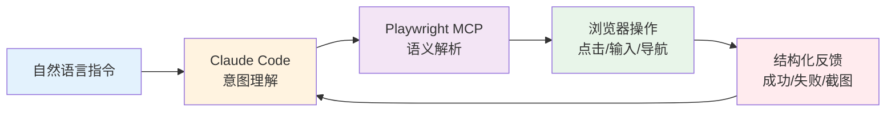
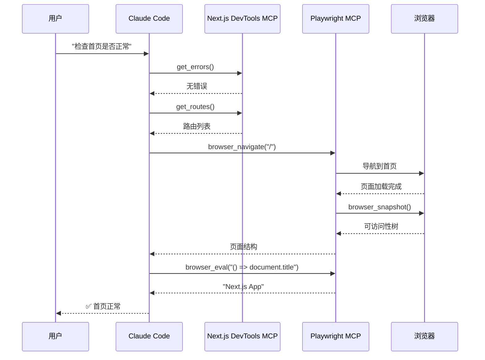

# Claude Code 通过 Playwright 自动化 E2E 测试流程

> 从入门到精通的完整指南 | **调研时间：** 2026-04-01 | **来源：** 30+ 官方文档与技术文章

---

## 目录

1. [概述](#1-概述)
2. [核心概念](#2-核心概念)
3. [环境搭建](#3-环境搭建)
4. [基础用法](#4-基础用法)
5. [与 Next.js DevTools MCP 集成](#5-与-nextjs-devtools-mcp-集成)
6. [高级特性](#6-高级特性)
7. [实战案例](#7-实战案例)
8. [常见问题与调试技巧](#8-常见问题与调试技巧)

---

## 1. 概述

### 1.1 为什么需要 AI 驱动的 E2E 测试

**传统 E2E 测试的痛点：**

| 问题 | 传统方案 | AI+MCP 方案 |
|------|----------|-------------|
| **选择器脆弱** | CSS/XPath 选择器，页面结构变化即失败 | 语义化定位（可访问性树），自动适应变化 |
| **维护成本高** | 数百行 JavaScript 代码散落数十个文件 | YAML 配置 + 自然语言描述 |
| **技术门槛** | 需要专业测试工程师编写脚本 | 产品经理/QA 都能编写测试用例 |
| **硬编码值** | 环境变化需大量修改 | 环境变量注入，一套配置多环境运行 |
| **状态复用** | 每次测试重新登录 | 复用现有浏览器会话，保留登录态 |

**AI 驱动测试的价值：**



### 1.2 技术栈组成

**核心组件：**

| 组件 | 角色 | 说明 |
|------|------|------|
| **Claude Code** | 大脑/路由 | 接收自然语言指令，智能分发给 MCP 工具 |
| **Playwright MCP** | 浏览器控制器 | 将 AI 意图转换为浏览器操作 |
| **Next.js DevTools MCP** | 框架集成层 | 提供 Next.js 应用内部状态访问 |
| **Accessibility Tree** | 语义化表示 | 结构化页面元素，替代原始 DOM |

**技术发布时间线：**

| 技术 | 发布时间 |
|------|----------|
| Playwright | 2020 年 1 月 |
| MCP 协议 | 2024 年 11 月 |
| Playwright MCP | 2025 年 7 月 |
| Next.js DevTools MCP | 2025 年 12 月 (Next.js 16) |

### 1.3 适用场景

**推荐使用场景：**
- ✅ 关键用户旅程的 E2E 测试
- ✅ 登录/认证流程验证
- ✅ 表单提交与数据验证
- ✅ 跨页面导航测试
- ✅ 回归测试自动化
- ✅ 需要登录态的复杂流程（后台系统、企业应用）

**不推荐场景：**
- ⚠️ 简单单元测试（使用 Vitest/Jest 更合适）
- ⚠️ 纯视觉回归测试（需要专门工具如 Percy）
- ⚠️ 高频 API 压力测试（使用 k6/JMeter）

---

## 2. 核心概念

### 2.1 MCP 协议架构

**MCP（Model Context Protocol）** 是 Anthropic 推出的开放协议，为 AI 模型与外部工具交互建立标准接口。

**三层架构：**

```
┌─────────────────────────────────────────────────────────┐
│  能力层 (Capability Layer)                               │
│  ┌─────────────┐  ┌─────────────┐  ┌─────────────┐     │
│  │ Playwright  │  │ 文件系统    │  │ 数据库访问   │     │
│  │ MCP Server  │  │ MCP Server  │  │ MCP Server  │     │
│  └─────────────┘  └─────────────┘  └─────────────┘     │
├─────────────────────────────────────────────────────────┤
│  协议层 (Protocol Layer)                                 │
│  ┌─────────────────────────────────────────────────┐   │
│  │  工具 Schema 定义 · 事件流格式 · 权限校验        │   │
│  └─────────────────────────────────────────────────┘   │
├─────────────────────────────────────────────────────────┤
│  传输层 (Transport Layer)                                │
│  ┌─────────────────────────────────────────────────┐   │
│  │  STDIO (本地) / HTTP-SSE (远程) / WebSocket     │   │
│  └─────────────────────────────────────────────────┘   │
└─────────────────────────────────────────────────────────┘
```

**交互流程：**

1. Claude Code 接收用户自然语言指令
2. MCP 客户端将指令转换为标准 JSON-RPC 请求
3. MCP 服务器执行具体操作（浏览器控制、文件读写等）
4. 结构化结果返回给 AI，形成闭环

### 2.2 Playwright MCP 工作原理

**核心技术：可访问性树（Accessibility Tree）**

Playwright MCP 不给 AI 看原始 HTML，而是提供一棵经过过滤的语义化树：

```
原始 DOM (50,000+ tokens):          可访问性树 (2,000-5,000 tokens):
<div class="css-1a2b3c">            ├─ [button] "提交"
  <div class="css-4d5e6f">          ├─ [textbox] "邮箱"
    <button class="css-7g8h9i"      ├─ [password] "密码"
            data-testid="submit">   └─ [link] "忘记密码？"
      提交
    </button>
  </div>
</div>
```

**优势：**
- **Token 节省 70-80%**：同一个页面，原始 DOM 可能消耗 5 万 -10 万 token，可访问性树只需 2000-5000
- **信噪比高**：过滤 CSS 类名、无关属性，只保留 AI 需要的语义信息
- **定位精准**：基于角色（Role）、状态（State）、属性（Attribute），而非脆弱的选择器

**Auto-wait（智能等待）机制：**

当 AI 发出"点击"指令后，Playwright 自动检查：
1. 元素已附加到 DOM
2. 元素可见（非 hidden/display:none）
3. 元素稳定（无动画/位移）
4. 没有被弹窗/遮罩覆盖
5. 元素可交互（非 disabled）

满足所有条件后才执行操作，几乎消除 `time.sleep()` 需求。

### 2.3 browser_eval 工具详解

**`mcp__playwright__browser_eval`** 是 Playwright MCP 提供的核心工具，用于在浏览器上下文中执行 JavaScript。

**工具签名：**
```json
{
  "name": "browser_eval",
  "description": "在页面或元素上执行 JavaScript 表达式",
  "inputSchema": {
    "type": "object",
    "properties": {
      "function": {
        "type": "string",
        "description": "() => { /* 代码 */ } 或 (element) => { /* 代码 */ }"
      },
      "element": {
        "type": "string",
        "description": "人类可读的元素描述"
      },
      "ref": {
        "type": "string",
        "description": "页面快照中的精确元素引用"
      }
    }
  }
}
```

**典型用法：**

| 场景 | 代码示例 |
|------|----------|
| **获取页面标题** | `() => document.title` |
| **获取当前 URL** | `() => window.location.href` |
| **获取元素文本** | `(el) => el.textContent` |
| **执行复杂断言** | `() => document.querySelectorAll('.item').length === 5` |
| **获取 localStorage** | `() => JSON.parse(localStorage.getItem('user'))` |

### 2.4 与 Next.js DevTools MCP 协同

**Next.js DevTools MCP** 是 Next.js 16+ 内置的 MCP 服务器，提供框架级诊断能力。

**核心能力：**

| 能力 | 工具名 | 说明 |
|------|--------|------|
| **错误检测** | `get_errors` | 获取构建错误、运行时错误、类型错误 |
| **路由信息** | `get_routes` | 查询页面路由、组件层级 |
| **构建状态** | `get_build_status` | 检查编译是否完成 |
| **开发日志** | `get_logs` | 访问控制台输出和服务器日志 |
| **缓存管理** | `clear_cache` | 清除 Next.js 缓存 |
| **浏览器测试** | `browser_eval` | 通过 Playwright MCP 验证页面 |

**协同工作流：**



---

## 3. 环境搭建

### 3.1 系统要求

| 组件 | 最低要求 | 推荐配置 |
|------|----------|----------|
| **Node.js** | v18+ | v20 LTS 或更高 |
| **内存** | 4GB | 8GB+（并行测试） |
| **磁盘空间** | 2GB | 5GB+（浏览器二进制 + 缓存） |
| **操作系统** | Windows 10 / macOS 11 / Linux | 最新版本 |

### 3.2 安装 Claude Code

**全局安装：**

```bash
# 使用 npm
npm install -g @anthropic-ai/claude-code

# 使用 pnpm
pnpm add -g @anthropic-ai/claude-code

# 验证安装
claude --version
```

**环境变量配置：**

```bash
# Windows (PowerShell)
$env:ANTHROPIC_API_KEY="your-api-key"
$env:ANTHROPIC_BASE_URL="https://api.anthropic.com"

# Linux/macOS (~/.bashrc 或 ~/.zshrc)
export ANTHROPIC_API_KEY="your-api-key"
export ANTHROPIC_BASE_URL="https://api.anthropic.com"
```

### 3.3 配置 Playwright MCP

**方法一：使用 CLI 命令（推荐）**

```bash
# Windows
claude mcp add-json playwright "{\"command\": \"cmd\", \"args\": [\"/c\", \"npx\", \"@executeautomation/playwright-mcp-server\"]}"

# macOS/Linux
claude mcp add-json playwright '{"command": "/bin/bash", "args": ["-c", "npx @executeautomation/playwright-mcp-server"]}'
```

**方法二：手动编辑配置文件**

找到 Claude Code 配置目录：

| 操作系统 | 配置路径 |
|----------|----------|
| **Windows** | `%APPDATA%\Claude\` |
| **macOS** | `~/Library/Application Support/Claude/` |
| **Linux** | `~/.config/Claude/` |

编辑 `claude_desktop_config.json`：

```json
{
  "mcpServers": {
    "playwright": {
      "command": "npx",
      "args": ["-y", "@executeautomation/playwright-mcp-server"]
    }
  }
}
```

**验证安装：**

```bash
# 查看已配置的 MCP 服务器
claude mcp list

# 测试连接（会输出调试信息）
# 在 Claude Code 中输入：测试 Playwright 连接
```

### 3.4 安装浏览器

**自动安装（推荐）：**

首次使用 Playwright MCP 时，会自动下载并安装所需浏览器。

**手动安装：**

```bash
# 安装所有浏览器（Chromium、Firefox、WebKit）
npx playwright install

# 只安装 Chromium
npx playwright install chromium

# 使用国内镜像加速
$env:PLAYWRIGHT_DOWNLOAD_HOST="https://npmmirror.com/mirrors/playwright/"
npx playwright install
```

**浏览器存储位置：**

| 操作系统 | 路径 |
|----------|------|
| **Windows** | `%USERPROFILE%\AppData\Local\ms-playwright` |
| **macOS** | `~/Library/Caches/ms-playwright` |
| **Linux** | `~/.cache/ms-playwright` |

### 3.5 配置 Next.js DevTools MCP

**安装命令：**

```bash
claude mcp add next-devtools -- npx next-devtools-mcp@latest
```

**项目级配置（推荐团队协作）：**

在项目根目录创建 `.mcp.json`：

```json
{
  "mcpServers": {
    "next-devtools": {
      "command": "npx",
      "args": ["-y", "next-devtools-mcp@latest"]
    },
    "playwright": {
      "command": "npx",
      "args": ["-y", "@executeautomation/playwright-mcp-server"]
    }
  }
}
```

**启用 Next.js 内置 MCP（Next.js 16+）：**

```javascript
// next.config.js
const nextConfig = {
  experimental: {
    mcpServer: true,
  },
};

export default nextConfig;
```

启动开发服务器后，MCP 端点将在 `http://localhost:3000/_next/mcp` 提供服务。

### 3.6 权限配置

**Playwright MCP 所需权限：**

```json
{
  "permissions": {
    "allow": [
      "mcp__playwright__*",
      "mcp__next-devtools__*",
      "Read",
      "Edit",
      "Write"
    ]
  }
}
```

**首次使用授权：**

当 Claude Code 首次调用 Playwright 工具时，会弹出权限确认窗口：
- **Allow for This Chat**：仅当前会话有效
- **Allow Once**：单次授权
- **Always Allow**：永久授权（仅推荐可信项目）

---

*文档续篇包含第 4-8 章，涵盖基础用法、Next.js 集成、高级特性、实战案例和调试技巧*
