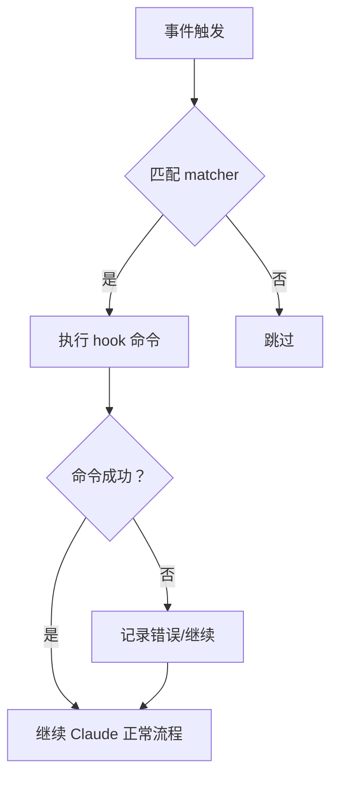
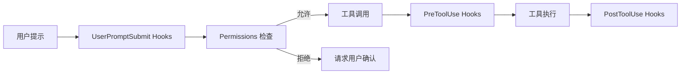

# Claude Code Hooks 自动化核心知识体系

> 本文档深度解析 Claude Code Hooks 自动化机制，涵盖 13 个生命周期钩子、配置实战与安全边界

---

## 目录

1. [Hooks 概述与核心机制](#1-hooks-概述与核心机制)
2. [13 个生命周期钩子详解](#2-13 个生命周期钩子详解)
3. [钩子配置语法与规则](#3-钩子配置语法与规则)
4. [实战场景与配置模板](#4-实战场景与配置模板)
5. [Hooks 与 Permissions 协同工作](#5-hooks-与-permissions-协同工作)
6. [安全边界与风险控制](#6-安全边界与风险控制)
7. [调试与故障排查](#7-调试与故障排查)
8. [高级扩展：插件开发](#8-高级扩展插件开发)

---

## 1. Hooks 概述与核心机制

### 1.1 什么是 Hooks

**概念定义：**
Hooks 是 Claude Code 中的事件驱动自动化机制，允许用户在会话生命周期的特定节点自动执行 Shell 命令。

**为什么需要 Hooks：**
- **强制执行**：与 CLAUDE.md 中的"请求型"规则不同，Hooks 是"强制性"指令，不依赖 AI 自主选择
- **精准控制**：在特定事件发生时必定触发某些操作（如代码格式化、日志记录）
- **行为扩展**：无需修改 Claude Code 源码，即可扩展其功能边界

### 1.2 核心架构位置

```
┌─────────────────────────────────────────────────────────┐
│ CLAUDE CODE 架构分层 │
├─────────────────────────────────────────────────────────┤
│ EXTENSION LAYER (扩展层) │
│ ┌─────────┐ ┌─────────┐ ┌─────────┐ ┌─────────┐ │
│ │ MCP │ │ Hooks │ │ Skills │ │ Plugins │ │
│ └─────────┘ └─────────┘ └─────────┘ └─────────┘ │
├─────────────────────────────────────────────────────────┤
│ DELEGATION LAYER (委托层) │
│ ┌───────────────────────────────────────────────┐ │
│ │ Subagents (最多 10 个并行) │ │
│ └───────────────────────────────────────────────┘ │
├─────────────────────────────────────────────────────────┤
│ CORE LAYER (核心层) │
│ ┌───────────────────────────────────────────────┐ │
│ │ 主对话上下文 (200K token / Opus 1M token) │ │
│ └───────────────────────────────────────────────┘ │
└─────────────────────────────────────────────────────────┘
```

**Hooks 定位说明：**
- Hooks 属于**扩展层**，与 MCP、Skills、Plugins 并列
- Hooks 是**事件驱动**的，在特定生命周期节点触发
- Hooks 执行的是**Shell 命令**，可以调用任意脚本或工具

### 1.3 Hooks 与相关概念对比

| 机制 | 触发方式 | 执行内容 | 适用场景 |
|------|----------|----------|----------|
| **Hooks** | 事件触发 | Shell 命令 | 自动化操作、外部集成 |
| **Skills** | 命令触发 (`/skill`) | Markdown 工作流 | 可复用任务模板 |
| **MCP** | 工具调用 | 外部 API/服务 | 连接数据库、GitHub 等 |
| **CLAUDE.md** | 会话加载 | 提示词规则 | 定义 AI 行为规范 |
| **Permissions** | 权限检查 | 允许/拒绝 | 控制文件编辑和命令执行 |

### 1.4 Hooks 执行流程



---

## 2. 13 个生命周期钩子详解

### 2.1 钩子总览

| 钩子名称 | 触发时机 | 典型用途 | 风险等级 |
|----------|----------|----------|----------|
| `SessionStart` | 会话启动/恢复时 | 加载上下文、设置环境变量 | 低 |
| `UserPromptSubmit` | 用户提交提示后 | 验证输入、注入上下文 | 中 |
| `PreToolUse` | 工具调用前 | 安全检查、拦截 | 高 |
| `PostToolUse` | 工具调用后 | 格式化、日志记录 | 中 |
| `PermissionRequest` | 请求权限时 | 审批工作流 | 高 |
| `SubagentStart` | 子代理启动时 | 注入子代理配置 | 中 |
| `SubagentStop` | 子代理停止时 | 收集子代理结果 | 低 |
| `Stop` | 主代理完成响应后 | 通知、自动提交 | 低 |
| `SessionEnd` | 会话终止时 | 清理资源、保存状态 | 低 |
| `Notification` | 需要用户关注时 | 桌面通知 | 低 |
| `ModelGenerateStart` | 模型生成开始前 | 性能监控 | 低 |
| `ModelGenerateEnd` | 模型生成结束后 | 性能分析 | 低 |
| `FileSystemChange` | 文件系统变更时 | 同步备份 | 中 |

### 2.2 SessionStart - 会话启动钩子

**触发时机：** 当 Claude Code 启动新会话或恢复现有会话时

**主要用途：**
- 加载开发上下文（如项目问题、最近代码变更）
- 设置环境变量
- 执行初始化脚本

**配置示例：**
```json
{
  "hooks": {
    "SessionStart": [{
      "matcher": "",
      "hooks": [{
        "type": "command",
        "command": "cat $CLAUDE_PROJECT_DIR/README.md",
        "timeout": 30
      }]
    }]
  }
}
```

**实战场景：**
```json
{
  "SessionStart": [{
    "matcher": "",
    "hooks": [
      {
        "type": "command",
        "command": "echo \"=== 项目状态检查 ===\" && git status --short",
        "timeout": 10
      },
      {
        "type": "command",
        "command": "echo \"=== 最近 5 次提交 ===\" && git log --oneline -5",
        "timeout": 10
      }
    ]
  }]
}
```

### 2.3 UserPromptSubmit - 用户输入提交钩子

**触发时机：** 用户提交提示后，Claude 处理前

**主要用途：**
- 验证用户输入
- 添加额外上下文
- 过滤敏感信息
- 阻止不当请求

**配置示例：**
```json
{
  "hooks": {
    "UserPromptSubmit": [{
      "matcher": ".*",
      "hooks": [{
        "type": "command",
        "command": "echo \"[时间上下文] 当前时间：$(date)\"",
        "timeout": 5
      }]
    }]
  }
}
```

**实战场景：知识库检测**
```json
{
  "UserPromptSubmit": [{
    "matcher": ".*",
    "hooks": [
      {
        "type": "command",
        "command": "node \".claude/scripts/kb-checker.js\" --detect \"$USER_PROMPT\" 2>&1 || true",
        "timeout": 10
      },
      {
        "type": "command",
        "command": "node \".claude/scripts/count-tracker.js\" --track \"$USER_PROMPT\" 2>&1 || true",
        "timeout": 10
      }
    ]
  }]
}
```

**环境变量说明：**
| 变量 | 说明 |
|------|------|
| `$USER_PROMPT` | 用户提交的原始提示词 |
| `$CLAUDE_PROJECT_DIR` | 当前项目目录 |
| `$CLAUDE_SESSION_ID` | 会话 ID |

### 2.4 PreToolUse - 工具调用前钩子

**触发时机：** Claude 决定调用工具后，实际执行前

**主要用途：**
- 安全检查
- 拦截危险命令
- 日志审计

**配置示例：**
```json
{
  "hooks": {
    "PreToolUse": [{
      "matcher": "Bash.*rm.*",
      "hooks": [{
        "type": "command",
        "command": "echo \"[安全警告] 检测到删除操作：$TOOL_INPUT\" && logger -t claude-security \"删除操作：$TOOL_INPUT\"",
        "timeout": 5
      }]
    }]
  }
}
```

### 2.5 PostToolUse - 工具调用后钩子

**触发时机：** 工具成功执行后

**主要用途：**
- 自动格式化代码
- 运行测试
- 日志记录
- 文件同步

**配置示例：自动格式化**
```json
{
  "hooks": {
    "PostToolUse": [{
      "matcher": "Edit|Write",
      "hooks": [{
        "type": "command",
        "command": "npx prettier --write {{file_path}} 2>/dev/null || true",
        "timeout": 30
      }]
    }]
  }
}
```

**配置示例：按文件类型格式化**
```json
{
  "PostToolUse": [{
    "matcher": "Edit|Write",
    "hooks": [{
      "type": "command",
      "command": "jq -r '.tool_input.file_path' | { read fp; if echo \"$fp\" | grep -qE '\\.(ts|tsx|js|jsx)$'; then npx prettier --write \"$fp\"; fi; }",
      "timeout": 30
    }]
  }]
}
```

### 2.6 PermissionRequest - 权限请求钩子

**触发时机：** Claude 请求用户批准权限时

**主要用途：**
- 自动化审批工作流
- 记录权限使用审计

**配置示例：**
```json
{
  "hooks": {
    "PermissionRequest": [{
      "matcher": "Bash.*npm.*",
      "hooks": [{
        "type": "command",
        "command": "echo \"[权限审计] npm 命令请求：$PERMISSION_REQUEST\"",
        "timeout": 5
      }]
    }]
  }
}
```

### 2.7 SubagentStart / SubagentStop - 子代理钩子

**触发时机：** 子代理启动/停止时

**主要用途：**
- 注入子代理配置
- 收集子代理结果

**配置示例：**
```json
{
  "hooks": {
    "SubagentStart": [{
      "matcher": "",
      "hooks": [{
        "type": "command",
        "command": "echo \"[子代理启动] 任务：$SUBAGENT_TASK\"",
        "timeout": 5
      }]
    }],
    "SubagentStop": [{
      "matcher": "",
      "hooks": [{
        "type": "command",
        "command": "echo \"[子代理停止] 结果：$SUBAGENT_RESULT\"",
        "timeout": 5
      }]
    }]
  }
}
```

### 2.8 Stop - 主代理停止钩子

**触发时机：** Claude 完成响应后

**主要用途：**
- 桌面通知
- 自动 Git 提交
- 任务总结

**配置示例：桌面通知**
```json
{
  "hooks": {
    "Stop": [{
      "matcher": "",
      "hooks": [{
        "type": "command",
        "command": "bash ~/.claude/hooks/notify.sh \"任务完成\"",
        "timeout": 10
      }]
    }]
  }
}
```

### 2.9 SessionEnd - 会话结束钩子

**触发时机：** 会话终止时

**主要用途：**
- 清理临时文件
- 保存会话状态
- 生成摘要

**配置示例：**
```json
{
  "hooks": {
    "SessionEnd": [{
      "matcher": "",
      "hooks": [{
        "type": "command",
        "command": "rm -f /tmp/claude-$SESSION_ID.tmp",
        "timeout": 5
      }]
    }]
  }
}
```

---

## 3. 钩子配置语法与规则

### 3.1 配置文件位置

| 配置文件 | 路径 | 用途 | 是否提交 Git |
|----------|------|------|--------------|
| **全局配置** | `~/.claude/settings.json` | 个人习惯、所有项目共享 | 否 |
| **项目配置** | `<项目>/.claude/settings.json` | 团队规范、项目特定规则 | 是 |
| **本地配置** | `<项目>/.claude/settings.local.json` | 临时规则、个人偏好 | 否 |

### 3.2 基本配置结构

```json
{
  "hooks": {
    "事件名称": [
      {
        "matcher": "匹配模式",
        "hooks": [
          {
            "type": "command",
            "command": "要执行的命令",
            "timeout": 30
          }
        ]
      }
    ]
  }
}
```

### 3.3 matcher 匹配规则

| 匹配模式 | 说明 | 示例 |
|----------|------|------|
| `""` (空字符串) | 匹配所有事件 | `"matcher": ""` |
| `".*"` | 正则匹配所有 | `"matcher": ".*"` |
| `"Edit\|Write"` | 匹配特定工具 | 匹配 Edit 或 Write 工具调用 |
| `"Bash.*rm.*"` | 匹配命令模式 | 匹配包含 rm 的 Bash 命令 |
| `"npm.*"` | 匹配关键词 | 匹配包含 npm 的命令 |

### 3.4 可用变量

| 变量 | 说明 | 可用钩子 |
|------|------|----------|
| `$USER_PROMPT` | 用户原始提示词 | UserPromptSubmit |
| `$TOOL_INPUT` | 工具输入参数 | PreToolUse, PostToolUse |
| `$TOOL_OUTPUT` | 工具输出结果 | PostToolUse |
| `$PERMISSION_REQUEST` | 权限请求详情 | PermissionRequest |
| `$SUBAGENT_TASK` | 子代理任务描述 | SubagentStart |
| `$SUBAGENT_RESULT` | 子代理执行结果 | SubagentStop |
| `$SESSION_ID` | 会话 ID | 所有钩子 |
| `$CLAUDE_PROJECT_DIR` | 项目目录 | 所有钩子 |

### 3.5 超时配置

```json
{
  "hooks": {
    "UserPromptSubmit": [{
      "matcher": ".*",
      "hooks": [{
        "type": "command",
        "command": "node script.js",
        "timeout": 10
      }]
    }]
  }
}
```

**超时说明：**
- 默认超时：30 秒
- 超时后：hook 失败，但 Claude 继续执行
- 建议：复杂操作使用后台任务或外部服务

---

## 4. 实战场景与配置模板

### 4.1 前端开发自动化

```json
{
  "hooks": {
    "PostToolUse": [{
      "matcher": "Edit|Write",
      "hooks": [{
        "type": "command",
        "command": "if command -v prettier >/dev/null 2>&1; then prettier --write --ignore-unknown {{file_path}} 2>/dev/null || true; fi",
        "timeout": 30
      }]
    }],
    "Stop": [{
      "matcher": "",
      "hooks": [{
        "type": "command",
        "command": "if [ -f package.json ]; then npm run lint 2>/dev/null || true; fi",
        "timeout": 60
      }]
    }]
  }
}
```

### 4.2 Git 自动化提交

```json
{
  "hooks": {
    "Stop": [{
      "matcher": ".*完成.*|.*修复.*|.*添加.*",
      "hooks": [{
        "type": "command",
        "command": "git add -A && git commit -m \"auto: $(date '+%Y-%m-%d %H:%M')\" 2>/dev/null || true",
        "timeout": 30
      }]
    }]
  }
}
```

### 4.3 代码质量检查

```json
{
  "hooks": {
    "PostToolUse": [{
      "matcher": "Write.*\\.py$",
      "hooks": [{
        "type": "command",
        "command": "flake8 {{file_path}} --max-line-length=100 2>/dev/null || echo \"[代码检查] flake8 发现格式问题\"",
        "timeout": 30
      }]
    }]
  }
}
```

### 4.4 桌面通知（Windows）

```json
{
  "hooks": {
    "Stop": [{
      "matcher": "",
      "hooks": [{
        "type": "command",
        "command": "powershell -Command \"Import-Module BurntToast -ErrorAction SilentlyContinue; New-BurntToastNotification -Text 'Claude Code', '任务完成', '$(Get-Date -Format 'HH:mm')' -Sound Default\"",
        "timeout": 10
      }]
    }]
  }
}
```

### 4.5 知识库检测（当前项目配置）

```json
{
  "hooks": {
    "UserPromptSubmit": [{
      "matcher": ".*",
      "hooks": [
        {
          "type": "command",
          "command": "node \"D:\\\\WorkPlace\\\\VibeCoding\\\\Knowledge Base\\\\.claude\\\\scripts\\\\kb-checker.js\" --detect \"$USER_PROMPT\" 2>&1 || true",
          "timeout": 10
        },
        {
          "type": "command",
          "command": "node \"D:\\\\WorkPlace\\\\VibeCoding\\\\Knowledge Base\\\\.claude\\\\scripts\\\\count-tracker.js\" --track \"$USER_PROMPT\" 2>&1 || true",
          "timeout": 10
        }
      ]
    }]
  }
}
```

### 4.6 会话记忆持久化

参考 Claude-Mem 插件的 5 个钩子配置：

```json
{
  "hooks": {
    "SessionStart": [{
      "matcher": "",
      "hooks": [{
        "type": "command",
        "command": "curl -s http://localhost:37777/api/memory/inject?session=$SESSION_ID",
        "timeout": 10
      }]
    }],
    "UserPromptSubmit": [{
      "matcher": "",
      "hooks": [{
        "type": "command",
        "command": "curl -s -X POST http://localhost:37777/api/prompt -d \"$USER_PROMPT\"",
        "timeout": 5
      }]
    }],
    "PostToolUse": [{
      "matcher": "Read|Write|Edit",
      "hooks": [{
        "type": "command",
        "command": "curl -s -X POST http://localhost:37777/api/tool -d '{\"tool\":\"$TOOL_NAME\",\"input\":\"$TOOL_INPUT\"}'",
        "timeout": 5
      }]
    }],
    "Stop": [{
      "matcher": "",
      "hooks": [{
        "type": "command",
        "command": "curl -s -X POST http://localhost:37777/api/stop -d '{\"response\":\"$RESPONSE\"}'",
        "timeout": 5
      }]
    }],
    "SessionEnd": [{
      "matcher": "",
      "hooks": [{
        "type": "command",
        "command": "curl -s -X POST http://localhost:37777/api/session/end -d '{\"session\":\"$SESSION_ID\"}'",
        "timeout": 5
      }]
    }]
  }
}
```

---

## 5. Hooks 与 Permissions 协同工作

### 5.1 权限与钩子的关系



### 5.2 协同配置示例

**配置自动格式化 + 编辑权限：**
```json
{
  "permissions": {
    "allow": [
      "Edit",
      "Write",
      "Read"
    ]
  },
  "hooks": {
    "PostToolUse": [{
      "matcher": "Edit|Write",
      "hooks": [{
        "type": "command",
        "command": "prettier --write {{file_path}} 2>/dev/null || true",
        "timeout": 30
      }]
    }]
  }
}
```

**说明：**
- Permissions 允许编辑操作自动执行
- Hooks 在编辑后自动格式化

### 5.3 当前项目完整配置

基于当前项目的 `settings.local.json`：

```json
{
  "skipWebFetchPreflight": true,
  "permissions": {
    "allow": [
      "mcp__WebSearch__bailian_web_search",
      "mcp__playwright__*",
      "mcp__next-devtools__*",
      "Read",
      "Edit",
      "Write",
      "Glob",
      "Grep",
      "Bash(git add:*)",
      "Bash(git commit:*)",
      "Bash(git push:*)",
      "Bash(git status)",
      "Bash(git diff)",
      "Bash(git log:*)",
      "Bash(npm run:*)",
      "Bash(pnpm run:*)",
      "Bash(yarn:*)",
      "Bash(node:*)",
      "Bash(python:*)",
      "Edit(.claude/settings.local.json)",
      "Write(.claude/settings.local.json)"
    ],
    "deny": [
      "WebSearch",
      "Bash(rm -rf *)",
      "Bash(git push --force)",
      "Bash(curl * | bash)",
      "Bash(sudo *)",
      "Edit(.claude/settings.json)",
      "Write(.claude/settings.json)"
    ]
  },
  "hooks": {
    "UserPromptSubmit": [{
      "matcher": ".*",
      "hooks": [
        {
          "type": "command",
          "command": "node \"D:\\\\WorkPlace\\\\VibeCoding\\\\Knowledge Base\\\\.claude\\\\scripts\\\\count-tracker.js\" --track \"$USER_PROMPT\" 2>&1 || true",
          "timeout": 10
        },
        {
          "type": "command",
          "command": "node \"D:\\\\WorkPlace\\\\VibeCoding\\\\Knowledge Base\\\\.claude\\\\scripts\\\\kb-checker.js\" --detect \"$USER_PROMPT\" 2>&1 || true",
          "timeout": 10
        }
      ]
    }]
  }
}
```

---

## 6. 安全边界与风险控制

### 6.1 安全风险矩阵

| 钩子类型 | 风险等级 | 潜在风险 | 缓解措施 |
|----------|----------|----------|----------|
| `SessionStart` | 低 | 环境变量泄露 | 限制敏感信息输出 |
| `UserPromptSubmit` | 中 | 注入攻击 | 验证用户输入 |
| `PreToolUse` | 高 | 拦截合法操作 | 谨慎配置 matcher |
| `PostToolUse` | 中 | 执行恶意脚本 | 限制命令来源 |
| `PermissionRequest` | 高 | 绕过权限检查 | 不要自动批准危险权限 |
| `Stop` | 低 | 数据泄露 | 限制外部调用 |

### 6.2 安全最佳实践

**1. 最小权限原则**
```json
// ❌ 不推荐：允许所有 Bash
"permissions": {
  "allow": ["Bash(*)"]
}

// ✅ 推荐：精确匹配
"permissions": {
  "allow": [
    "Bash(npm run:*)",
    "Bash(git status)",
    "Bash(git diff)"
  ]
}
```

**2. Hook 命令沙箱化**
```json
// ❌ 不推荐：直接执行用户输入
"command": "eval $USER_PROMPT"

// ✅ 推荐：参数化执行
"command": "node scripts/validate.js --input \"$USER_PROMPT\""
```

**3. 敏感信息保护**
```json
// ❌ 不推荐：记录完整提示词
"command": "echo \"$USER_PROMPT\" >> logs/prompt.log"

// ✅ 推荐：脱敏处理
"command": "echo \"$USER_PROMPT\" | sed 's/sk-[a-zA-Z0-9]*/sk-***/g' >> logs/prompt.log"
```

### 6.3 禁止的 Hook 模式

| 模式 | 风险 | 替代方案 |
|------|------|----------|
| `eval $USER_PROMPT` | 命令注入 | 参数化脚本调用 |
| `curl * | bash` | 远程代码执行 | 下载后审计再执行 |
| `rm -rf *` | 数据丢失 | 移动到回收站 |
| 自动批准所有权限 | 绕过安全检查 | 基于规则审批 |

---

## 7. 调试与故障排查

### 7.1 启用调试日志

```json
{
  "debug": {
    "hooks": true,
    "permissions": true
  }
}
```

### 7.2 常见问题排查

**问题 1：Hook 不触发**
- 检查 matcher 是否匹配
- 确认配置文件语法正确（JSON 格式）
- 验证配置文件优先级（本地 > 项目 > 全局）

**问题 2：Hook 超时**
- 增加 `timeout` 值
- 优化命令执行效率
- 使用后台任务处理耗时操作

**问题 3：变量未展开**
- 确认变量名称正确（`$USER_PROMPT` 不是 `$USER_PROMPT`）
- 使用双引号而非单引号
- Windows 环境注意转义

### 7.3 测试命令

```bash
# 测试 JSON 格式
node -e "JSON.parse(require('fs').readFileSync('.claude/settings.local.json'))"

# 查看当前生效的 Hooks
/hooks

# 查看当前生效的权限
/permissions
```

---

## 8. 高级扩展：插件开发

### 8.1 插件基本结构

```
my-plugin/
├── hooks.json           # 钩子配置
├── scripts/             # 脚本目录
│   ├── notify.sh
│   └── validate.py
└── README.md
```

### 8.2 hooks.json 示例

```json
{
  "description": "我的 Claude Code 插件",
  "hooks": {
    "Stop": [{
      "matcher": "",
      "hooks": [{
        "type": "command",
        "command": "bash scripts/notify.sh",
        "timeout": 10
      }]
    }]
  }
}
```

### 8.3 发布与分享

1. 将插件发布到 GitHub
2. 在 `~/.claude/settings.json` 中添加：
```json
{
  "plugins": [
    {
      "name": "my-plugin",
      "url": "https://github.com/username/my-plugin"
    }
  ]
}
```

---

## 附录 A：快速参考表

### A.1 钩子触发顺序

```
SessionStart
  ↓
[UserPromptSubmit → PreToolUse → 工具执行 → PostToolUse] × N
  ↓
Stop
  ↓
SessionEnd (如会话结束)
```

### A.2 常用命令速查

| 用途 | 命令 |
|------|------|
| 查看 Hooks | `/hooks` |
| 查看权限 | `/permissions` |
| 测试 JSON | `node -e "JSON.parse(...)"` |
| 重载配置 | 保存文件后立即生效 |

---

## 附录 B：引用来源

1. CSDN - [Claude Code Hooks Mastery 完全指南](https://blog.csdn.net/gitblog_00575/article/details/141151709)
2. 菜鸟教程 - [Claude Code 钩子](https://m.runoob.com/claude-code/claude-code-hooks.html)
3. GitHub - [claude-code-hooks-mastery](https://github.com/disler/claude-code-hooks-mastery)
4. 知乎 - [Claude Code 扩展指南](https://zhuanlan.zhihu.com/p/2021530912802783501)

---

*文档版本：1.0.0 | 创建日期：2026-03-31 | 作者：Kei*
