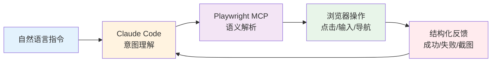
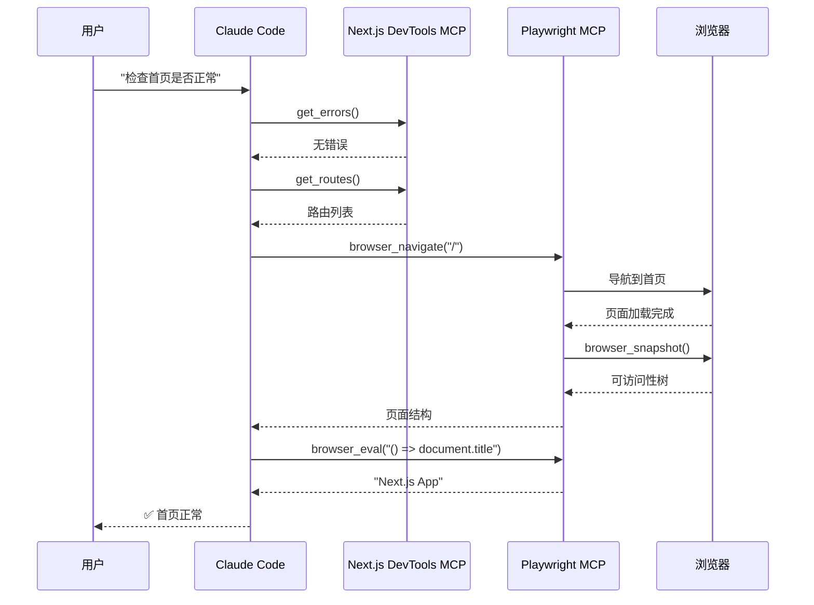
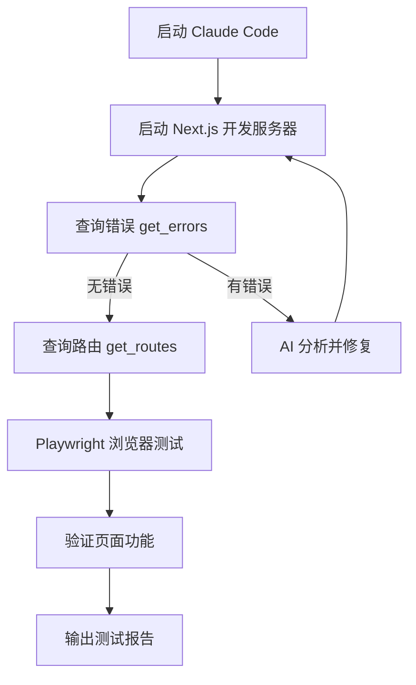

# Claude Code 通过 Playwright 自动化 E2E 测试流程

> 从入门到精通的完整指南 | **调研时间：** 2026-04-01 | **来源：** 30+ 官方文档与技术文章

---

## 目录

1. [概述](#1-概述)
2. [核心概念](#2-核心概念)
3. [环境搭建](#3-环境搭建)
4. [基础用法](#4-基础用法)
5. [与 Next.js DevTools MCP 集成](#5-与-nextjs-devtools-mcp-集成)
6. [高级特性](#6-高级特性)
7. [实战案例](#7-实战案例)
8. [常见问题与调试技巧](#8-常见问题与调试技巧)

---

## 1. 概述

### 1.1 为什么需要 AI 驱动的 E2E 测试

**传统 E2E 测试的痛点：**

| 问题 | 传统方案 | AI+MCP 方案 |
|------|----------|-------------|
| **选择器脆弱** | CSS/XPath 选择器，页面结构变化即失败 | 语义化定位（可访问性树），自动适应变化 |
| **维护成本高** | 数百行 JavaScript 代码散落数十个文件 | YAML 配置 + 自然语言描述 |
| **技术门槛** | 需要专业测试工程师编写脚本 | 产品经理/QA 都能编写测试用例 |
| **硬编码值** | 环境变化需大量修改 | 环境变量注入，一套配置多环境运行 |
| **状态复用** | 每次测试重新登录 | 复用现有浏览器会话，保留登录态 |

**AI 驱动测试的价值：**



### 1.2 技术栈组成

**核心组件：**

| 组件 | 角色 | 说明 |
|------|------|------|
| **Claude Code** | 大脑/路由 | 接收自然语言指令，智能分发给 MCP 工具 |
| **Playwright MCP** | 浏览器控制器 | 将 AI 意图转换为浏览器操作 |
| **Next.js DevTools MCP** | 框架集成层 | 提供 Next.js 应用内部状态访问 |
| **Accessibility Tree** | 语义化表示 | 结构化页面元素，替代原始 DOM |

**技术发布时间线：**

| 技术 | 发布时间 |
|------|----------|
| Playwright | 2020 年 1 月 |
| MCP 协议 | 2024 年 11 月 |
| Playwright MCP | 2025 年 7 月 |
| Next.js DevTools MCP | 2025 年 12 月 (Next.js 16) |

### 1.3 适用场景

**推荐使用场景：**
- ✅ 关键用户旅程的 E2E 测试
- ✅ 登录/认证流程验证
- ✅ 表单提交与数据验证
- ✅ 跨页面导航测试
- ✅ 回归测试自动化
- ✅ 需要登录态的复杂流程（后台系统、企业应用）

**不推荐场景：**
- ⚠️ 简单单元测试（使用 Vitest/Jest 更合适）
- ⚠️ 纯视觉回归测试（需要专门工具如 Percy）
- ⚠️ 高频 API 压力测试（使用 k6/JMeter）

---

## 2. 核心概念

### 2.1 MCP 协议架构

**MCP（Model Context Protocol）** 是 Anthropic 推出的开放协议，为 AI 模型与外部工具交互建立标准接口。

**三层架构：**

```
┌─────────────────────────────────────────────────────────┐
│  能力层 (Capability Layer)                               │
│  ┌─────────────┐  ┌─────────────┐  ┌─────────────┐     │
│  │ Playwright  │  │ 文件系统    │  │ 数据库访问   │     │
│  │ MCP Server  │  │ MCP Server  │  │ MCP Server  │     │
│  └─────────────┘  └─────────────┘  └─────────────┘     │
├─────────────────────────────────────────────────────────┤
│  协议层 (Protocol Layer)                                 │
│  ┌─────────────────────────────────────────────────┐   │
│  │  工具 Schema 定义 · 事件流格式 · 权限校验        │   │
│  └─────────────────────────────────────────────────┘   │
├─────────────────────────────────────────────────────────┤
│  传输层 (Transport Layer)                                │
│  ┌─────────────────────────────────────────────────┐   │
│  │  STDIO (本地) / HTTP-SSE (远程) / WebSocket     │   │
│  └─────────────────────────────────────────────────┘   │
└─────────────────────────────────────────────────────────┘
```

**交互流程：**

1. Claude Code 接收用户自然语言指令
2. MCP 客户端将指令转换为标准 JSON-RPC 请求
3. MCP 服务器执行具体操作（浏览器控制、文件读写等）
4. 结构化结果返回给 AI，形成闭环

### 2.2 Playwright MCP 工作原理

**核心技术：可访问性树（Accessibility Tree）**

Playwright MCP 不给 AI 看原始 HTML，而是提供一棵经过过滤的语义化树：

```
原始 DOM (50,000+ tokens):          可访问性树 (2,000-5,000 tokens):
<div class="css-1a2b3c">            ├─ [button] "提交"
  <div class="css-4d5e6f">          ├─ [textbox] "邮箱"
    <button class="css-7g8h9i"      ├─ [password] "密码"
            data-testid="submit">   └─ [link] "忘记密码？"
      提交
    </button>
  </div>
</div>
```

**优势：**
- **Token 节省 70-80%**：同一个页面，原始 DOM 可能消耗 5 万 -10 万 token，可访问性树只需 2000-5000
- **信噪比高**：过滤 CSS 类名、无关属性，只保留 AI 需要的语义信息
- **定位精准**：基于角色（Role）、状态（State）、属性（Attribute），而非脆弱的选择器

**Auto-wait（智能等待）机制：**

当 AI 发出"点击"指令后，Playwright 自动检查：
1. 元素已附加到 DOM
2. 元素可见（非 hidden/display:none）
3. 元素稳定（无动画/位移）
4. 没有被弹窗/遮罩覆盖
5. 元素可交互（非 disabled）

满足所有条件后才执行操作，几乎消除 `time.sleep()` 需求。

### 2.3 browser_eval 工具详解

**`mcp__playwright__browser_eval`** 是 Playwright MCP 提供的核心工具，用于在浏览器上下文中执行 JavaScript。

**工具签名：**
```json
{
  "name": "browser_eval",
  "description": "在页面或元素上执行 JavaScript 表达式",
  "inputSchema": {
    "type": "object",
    "properties": {
      "function": {
        "type": "string",
        "description": "() => { /* 代码 */ } 或 (element) => { /* 代码 */ }"
      },
      "element": {
        "type": "string",
        "description": "人类可读的元素描述"
      },
      "ref": {
        "type": "string",
        "description": "页面快照中的精确元素引用"
      }
    }
  }
}
```

**典型用法：**

| 场景 | 代码示例 |
|------|----------|
| **获取页面标题** | `() => document.title` |
| **获取当前 URL** | `() => window.location.href` |
| **获取元素文本** | `(el) => el.textContent` |
| **执行复杂断言** | `() => document.querySelectorAll('.item').length === 5` |
| **获取 localStorage** | `() => JSON.parse(localStorage.getItem('user'))` |

### 2.4 与 Next.js DevTools MCP 协同

**Next.js DevTools MCP** 是 Next.js 16+ 内置的 MCP 服务器，提供框架级诊断能力。

**核心能力：**

| 能力 | 工具名 | 说明 |
|------|--------|------|
| **错误检测** | `get_errors` | 获取构建错误、运行时错误、类型错误 |
| **路由信息** | `get_routes` | 查询页面路由、组件层级 |
| **构建状态** | `get_build_status` | 检查编译是否完成 |
| **开发日志** | `get_logs` | 访问控制台输出和服务器日志 |
| **缓存管理** | `clear_cache` | 清除 Next.js 缓存 |
| **浏览器测试** | `browser_eval` | 通过 Playwright MCP 验证页面 |

**协同工作流：**



---

## 3. 环境搭建

### 3.1 系统要求

| 组件 | 最低要求 | 推荐配置 |
|------|----------|----------|
| **Node.js** | v18+ | v20 LTS 或更高 |
| **内存** | 4GB | 8GB+（并行测试） |
| **磁盘空间** | 2GB | 5GB+（浏览器二进制 + 缓存） |
| **操作系统** | Windows 10 / macOS 11 / Linux | 最新版本 |

### 3.2 安装 Claude Code

**全局安装：**

```bash
# 使用 npm
npm install -g @anthropic-ai/claude-code

# 使用 pnpm
pnpm add -g @anthropic-ai/claude-code

# 验证安装
claude --version
```

**环境变量配置：**

```bash
# Windows (PowerShell)
$env:ANTHROPIC_API_KEY="your-api-key"
$env:ANTHROPIC_BASE_URL="https://api.anthropic.com"

# Linux/macOS (~/.bashrc 或 ~/.zshrc)
export ANTHROPIC_API_KEY="your-api-key"
export ANTHROPIC_BASE_URL="https://api.anthropic.com"
```

### 3.3 配置 Playwright MCP

**方法一：使用 CLI 命令（推荐）**

```bash
# Windows
claude mcp add-json playwright "{\"command\": \"cmd\", \"args\": [\"/c\", \"npx\", \"@executeautomation/playwright-mcp-server\"]}"

# macOS/Linux
claude mcp add-json playwright '{"command": "/bin/bash", "args": ["-c", "npx @executeautomation/playwright-mcp-server"]}'
```

**方法二：手动编辑配置文件**

找到 Claude Code 配置目录：

| 操作系统 | 配置路径 |
|----------|----------|
| **Windows** | `%APPDATA%\Claude\` |
| **macOS** | `~/Library/Application Support/Claude/` |
| **Linux** | `~/.config/Claude/` |

编辑 `claude_desktop_config.json`：

```json
{
  "mcpServers": {
    "playwright": {
      "command": "npx",
      "args": ["-y", "@executeautomation/playwright-mcp-server"]
    }
  }
}
```

**验证安装：**

```bash
# 查看已配置的 MCP 服务器
claude mcp list

# 测试连接（会输出调试信息）
# 在 Claude Code 中输入：测试 Playwright 连接
```

### 3.4 安装浏览器

**自动安装（推荐）：**

首次使用 Playwright MCP 时，会自动下载并安装所需浏览器。

**手动安装：**

```bash
# 安装所有浏览器（Chromium、Firefox、WebKit）
npx playwright install

# 只安装 Chromium
npx playwright install chromium

# 使用国内镜像加速
$env:PLAYWRIGHT_DOWNLOAD_HOST="https://npmmirror.com/mirrors/playwright/"
npx playwright install
```

**浏览器存储位置：**

| 操作系统 | 路径 |
|----------|------|
| **Windows** | `%USERPROFILE%\AppData\Local\ms-playwright` |
| **macOS** | `~/Library/Caches/ms-playwright` |
| **Linux** | `~/.cache/ms-playwright` |

### 3.5 配置 Next.js DevTools MCP

**安装命令：**

```bash
claude mcp add next-devtools -- npx next-devtools-mcp@latest
```

**项目级配置（推荐团队协作）：**

在项目根目录创建 `.mcp.json`：

```json
{
  "mcpServers": {
    "next-devtools": {
      "command": "npx",
      "args": ["-y", "next-devtools-mcp@latest"]
    },
    "playwright": {
      "command": "npx",
      "args": ["-y", "@executeautomation/playwright-mcp-server"]
    }
  }
}
```

**启用 Next.js 内置 MCP（Next.js 16+）：**

```javascript
// next.config.js
const nextConfig = {
  experimental: {
    mcpServer: true,
  },
};

export default nextConfig;
```

启动开发服务器后，MCP 端点将在 `http://localhost:3000/_next/mcp` 提供服务。

### 3.6 权限配置

**Playwright MCP 所需权限：**

```json
{
  "permissions": {
    "allow": [
      "mcp__playwright__*",
      "mcp__next-devtools__*",
      "Read",
      "Edit",
      "Write"
    ]
  }
}
```

**首次使用授权：**

当 Claude Code 首次调用 Playwright 工具时，会弹出权限确认窗口：
- **Allow for This Chat**：仅当前会话有效
- **Allow Once**：单次授权
- **Always Allow**：永久授权（仅推荐可信项目）

---

## 4. 基础用法

### 4.1 第一个浏览器自动化命令

**启动 Claude Code 并连接 Playwright MCP：**

```bash
# 进入项目目录
cd your-project

# 启动 Claude Code
claude
```

**基础导航命令：**

```
# 打开指定网页
打开 https://www.example.com

# 导航并获取页面标题
访问 https://www.baidu.com，告诉我页面标题是什么

# 截图当前页面
打开 https://www.github.com 并截图
```

**Claude Code 执行流程：**

1. 解析自然语言指令
2. 调用 `browser_navigate` 工具导航到 URL
3. 调用 `browser_snapshot` 获取页面可访问性树
4. 根据快照调用 `browser_click` / `browser_type` 等工具
5. 调用 `browser_eval` 执行断言或获取数据
6. 输出结果给用户

### 4.2 Playwright MCP 工具参考

**核心工具列表：**

| 工具 | 功能 | 典型用途 |
|------|------|----------|
| `browser_navigate` | 导航到 URL | 打开网页 |
| `browser_snapshot` | 获取页面可访问性树 | 理解页面结构 |
| `browser_click` | 点击元素 | 按钮交互 |
| `browser_type` | 输入文本 | 表单填写 |
| `browser_fill_form` | 批量填写表单 | 登录/注册 |
| `browser_select_option` | 选择下拉选项 | 表单选择 |
| `browser_hover` | 悬停元素 | 触发菜单 |
| `browser_eval` | 执行 JavaScript | 自定义逻辑 |
| `browser_take_screenshot` | 截图 | 视觉验证 |
| `browser_console_messages` | 获取控制台日志 | 调试前端错误 |
| `browser_network_requests` | 获取网络请求 | API 调试 |

### 4.3 元素定位策略

**Playwright MCP 支持多种定位方式：**

| 定位方式 | 示例 | 稳定性 |
|----------|------|--------|
| **Role 定位（推荐）** | `page.getByRole('button', { name: '提交' })` | ⭐⭐⭐⭐⭐ |
| **文本定位** | `page.getByText('欢迎回来')` | ⭐⭐⭐⭐ |
| **Test ID 定位** | `page.getByTestId('submit-button')` | ⭐⭐⭐⭐⭐ |
| **Label 定位** | `page.getByLabel('邮箱')` | ⭐⭐⭐⭐ |
| **Placeholder 定位** | `page.getByPlaceholder('请输入密码')` | ⭐⭐⭐ |
| **CSS 定位** | `page.locator('.btn-primary')` | ⭐⭐ |
| **XPath 定位** | `page.locator('//button[text()="提交"]')` | ⭐ |

**推荐实践：**

```javascript
// ✅ 推荐：语义化定位
page.getByRole('button', { name: '提交' })
page.getByLabel('邮箱')
page.getByTestId('login-button')

// ⚠️ 谨慎：CSS 选择器（样式变化会失败）
page.locator('.btn.btn-primary.submit')

// ❌ 避免：XPath（脆弱且难维护）
page.locator('//*[@id="root"]/div[2]/button')
```

### 4.4 智能等待与断言

**Auto-wait 机制示例：**

```javascript
// Playwright 自动等待元素满足条件后才点击
await page.getByRole('button', { name: '提交' }).click();

// 隐式等待元素可见
await expect(page.getByText('欢迎')).toBeVisible();

// 等待 URL 变化
await expect(page).toHaveURL('/dashboard');

// 等待元素出现（带超时）
await page.waitForSelector('.success-message', { timeout: 5000 });
```

**常见断言：**

| 断言 | 代码 | 说明 |
|------|------|------|
| **可见性** | `await expect(element).toBeVisible()` | 元素可见 |
| **隐藏** | `await expect(element).toBeHidden()` | 元素隐藏 |
| **文本包含** | `await expect(element).toContainText('成功')` | 文本匹配 |
| **精确文本** | `await expect(element).toHaveText('登录成功')` | 精确匹配 |
| **URL 匹配** | `await expect(page).toHaveURL(/\/dashboard/)` | URL 正则 |
| **计数** | `await expect(elements).toHaveCount(5)` | 元素数量 |
| **属性值** | `await expect(input).toHaveValue('test@example.com')` | 输入框值 |

---

## 5. 与 Next.js DevTools MCP 集成

### 5.1 开发服务器自动发现

**工作流程：**

1. 启动 Next.js 开发服务器：`npm run dev`
2. 启动 Claude Code，自动连接到运行的 Next.js 实例
3. 通过 MCP 工具查询应用状态、错误、日志

**可用工具：**

```
# 查询当前错误
get_errors - 获取构建错误、运行时错误、类型错误

# 查询路由信息
get_routes - 列出所有页面路由

# 查询构建状态
get_build_status - 检查编译是否完成

# 获取开发日志
get_logs - 访问控制台输出

# 清除缓存
clear_cache - 清除 Next.js 缓存
```

### 5.2 端到端测试工作流

**完整流程示例：**



**实际对话示例：**

```
User: 帮我测试首页是否正常

Claude: 我将执行以下步骤：
1. 检查 Next.js 应用是否有错误
2. 获取路由信息确认首页存在
3. 使用 Playwright 打开首页并验证

[执行 MCP 工具调用...]

✅ 测试结果：
- 编译状态：成功
- 运行时错误：无
- 首页标题：Next.js App
- 导航功能：正常
```

### 5.3 实时错误诊断

**使用场景：** 开发过程中遇到错误，AI 自动诊断并提供修复方案。

**对话示例：**

```
User: 首页报错了，帮我看看

Claude: [调用 get_errors 工具...]

发现以下错误：
Error: Missing "use client" directive

问题定位：app/components/Counter.tsx:1

修复方案：
在 Counter.tsx 文件顶部添加 'use client' 指令。

是否需要我帮你修复？
```

### 5.4 日志与调试

**访问开发日志：**

```
# 获取服务器日志
User: 查看最近的服务器日志

Claude: [调用 get_logs 工具...]

[10:30:45] GET /api/users 200 - 15.2ms
[10:30:46] POST /api/login 401 - 8.3ms
[10:30:47] GET /dashboard 200 - 42.1ms
```

**访问浏览器控制台：**

```javascript
// 在 Claude Code 中
User: 打开首页并检查控制台错误

Claude: [调用 browser_navigate + browser_console_messages]

发现以下控制台消息：
⚠️ Warning: React key 未设置
❌ Error: Failed to fetch /api/users
```

---

## 6. 高级特性

### 6.1 YAML 配置式测试

**YAML 测试用例示例：**

```yaml
# test-cases/login.yml
tags:
  - smoke
  - auth

steps:
  - "打开 {{BASE_URL}}/login 页面"
  - "在邮箱输入框填写 {{TEST_EMAIL}}"
  - "在密码输入框填写 {{TEST_PASSWORD}}"
  - "点击登录按钮"
  - "验证页面显示欢迎信息"
  - "验证 URL 包含 /dashboard"
```

**环境变量配置：**

```yaml
# .env.test
BASE_URL=https://staging.example.com
TEST_EMAIL=test@example.com
TEST_PASSWORD=secure_password_123
```

**YAML 测试优势：**

| 特性 | 传统 JavaScript | YAML 配置 |
|------|-----------------|-----------|
| **代码行数** | 50+ 行 | 5-10 行 |
| **可读性** | 需要 JS 基础 | 自然语言描述 |
| **维护成本** | 高（分散在多个文件） | 低（集中配置） |
| **团队协作** | 仅开发人员 | 产品/QA 都可参与 |

### 6.2 SubAgent 并行测试

**使用场景：** 多个测试用例并行执行，缩短总测试时间。

**SubAgent 配置：**

```markdown
# .claude/agents/e2e-runner.md
---
name: e2e-runner
description: 专门执行 Playwright E2E 测试的子代理
tools:
  - mcp__playwright__*
  - mcp__next-devtools__*
---

你是一名 E2E 测试专家，负责执行 Playwright 自动化测试。

**工作流程：**
1. 接收测试文件或测试描述
2. 启动浏览器并导航到目标页面
3. 执行测试步骤并记录结果
4. 生成测试报告（包含截图和日志）

**输出格式：**
- ✅ 通过：测试名称 + 执行时间
- ❌ 失败：测试名称 + 错误信息 + 截图路径
```

**并行执行命令：**

```bash
# 在 Claude Code 中
/agent e2e-runner --parallel test-cases/*.yml
```

### 6.3 认证状态复用

**问题：** 每次测试都重新登录耗时且不稳定。

**解决方案：** 使用浏览器上下文状态文件。

**配置步骤：**

1. **首次登录并保存状态：**

```bash
# 手动登录一次
claude mcp add playwright -- \
  --storage-state ~/.cache/claude-playwright/auth-state.json
```

2. **后续测试复用状态：**

```json
{
  "mcpServers": {
    "playwright": {
      "command": "npx",
      "args": ["-y", "@executeautomation/playwright-mcp-server"],
      "env": {
        "STORAGE_STATE": "~/.cache/claude-playwright/auth-state.json"
      }
    }
  }
}
```

**效果：**
- 测试启动时间从 30 秒降至 5 秒
- 消除登录失败的 flaky tests
- 可直接测试需要登录的后台页面

### 6.4 多环境支持

**环境配置文件：**

```yaml
# environments/dev.yml
BASE_URL: http://localhost:3000
API_URL: http://localhost:8080
DEBUG: true

# environments/staging.yml
BASE_URL: https://staging.example.com
API_URL: https://api-staging.example.com
DEBUG: false

# environments/prod.yml
BASE_URL: https://www.example.com
API_URL: https://api.example.com
DEBUG: false
```

**切换环境：**

```bash
# 在 Claude Code 中
/switch-env staging

# 或在测试命令中指定
/run-yaml-test file:test-cases/login.yml env:staging
```

### 6.5 视觉回归测试

**截图对比配置：**

```yaml
# test-cases/visual.yml
steps:
  - "打开首页"
  - "截图整个页面"
    options:
      fullPage: true
      path: screenshots/homepage.png
  - "验证页面截图与基准一致"
    baseline: baseline/homepage.png
    threshold: 0.05
```

**截图选项：**

```yaml
screenshot:
  fullPage: true    # 完整页面截图
  type: png         # 图片格式：png/jpeg
  quality: 80       # JPEG 质量 (0-100)
  omitBackground: true  # 透明背景
```

---

## 7. 实战案例

### 7.1 电商网站完整购买流程

**测试用例：**

```yaml
# test-cases/purchase-flow.yml
tags:
  - e2e
  - purchase
  - critical

steps:
  # 1. 浏览商品
  - "打开 {{BASE_URL}}/"
  - "搜索 'MacBook Pro'"
  - "点击第一个商品卡片"
  - "验证 URL 包含 /products/"
  
  # 2. 添加到购物车
  - "点击 '添加到购物车' 按钮"
  - "验证显示 '已添加到购物车' 提示"
  
  # 3. 查看购物车
  - "点击右上角购物车图标"
  - "验证 URL 为 {{BASE_URL}}/cart"
  - "验证页面显示 'MacBook Pro'"
  
  # 4. 结账流程
  - "点击 '继续结账'"
  - "在邮箱输入框填写 {{TEST_EMAIL}}"
  - "在地址输入框填写 '123 Main St'"
  - "在城市输入框填写 'New York'"
  - "在邮政编码输入框填写 '10001'"
  - "点击 '继续到配送'"
  
  # 5. 支付
  - "选择配送方式 '标准配送'"
  - "点击 '继续到支付'"
  - "在卡号输入框填写 '4242424242424242'"
  - "在有效期输入框填写 '12/25'"
  - "在 CVV 输入框填写 '123'"
  - "点击 '支付订单'"
  
  # 6. 验证
  - "验证 URL 包含 /order-confirmation"
  - "验证页面显示 '订单确认'"
  - "验证页面显示订单编号"
  
  # 7. 清理
  - "include: cleanup"
```

### 7.2 博客系统 Server Components 测试

**测试策略：**

由于 Server Components 在服务端渲染，测试重点是验证最终渲染的 HTML 内容。

```yaml
# test-cases/blog-post.yml
tags:
  - rsc
  - content

steps:
  - "打开 {{BASE_URL}}/blog/hello-world"
  
  # 验证 SSR 内容
  - "验证页面标题包含 'Hello World'"
  - "验证文章正文区域不为空"
  - "验证作者信息显示"
  
  # 验证 Suspense 边界
  - "验证加载骨架屏显示"
  - "等待文章内容加载完成"
  - "验证骨架屏消失"
  
  # 验证交互
  - "点击 '点赞' 按钮"
  - "验证点赞数增加"
```

### 7.3 SaaS 仪表板认证流程

**测试用例：**

```yaml
# test-cases/auth-flow.yml
tags:
  - auth
  - critical

steps:
  # 登录
  - "打开 {{BASE_URL}}/login"
  - "在邮箱输入框填写 {{ADMIN_EMAIL}}"
  - "在密码输入框填写 {{ADMIN_PASSWORD}}"
  - "点击 '登录' 按钮"
  - "验证重定向到 /dashboard"
  - "验证页面显示 '欢迎回来'"
  
  # 访问受保护页面
  - "导航到 {{BASE_URL}}/settings"
  - "验证页面正常加载"
  - "验证设置表单存在"
  
  # 登出
  - "点击用户头像"
  - "点击 '退出登录'"
  - "验证重定向到 /login"
  
  # 未授权访问
  - "直接访问 {{BASE_URL}}/dashboard"
  - "验证重定向到 /login"
```

### 7.4 表单验证测试

```yaml
# test-cases/form-validation.yml
tags:
  - forms
  - validation

steps:
  - "打开 {{BASE_URL}}/register"
  
  # 空表单提交
  - "点击 '注册' 按钮"
  - "验证显示 '邮箱必填' 错误"
  - "验证显示 '密码必填' 错误"
  
  # 无效邮箱格式
  - "在邮箱输入框填写 'invalid-email'"
  - "点击 '注册' 按钮"
  - "验证显示 '邮箱格式不正确' 错误"
  
  # 密码长度不足
  - "在邮箱输入框填写 'test@example.com'"
  - "在密码输入框填写 '123'"
  - "点击 '注册' 按钮"
  - "验证显示 '密码至少 8 位' 错误"
  
  # 成功注册
  - "在邮箱输入框填写 'newuser@example.com'"
  - "在密码输入框填写 'validpassword123'"
  - "点击 '注册' 按钮"
  - "验证重定向到 /welcome"
```

---

## 8. 常见问题与调试技巧

### 8.1 Flaky Tests（不稳定测试）

**问题表现：** 同一测试有时通过有时失败。

**常见原因与解决方案：**

| 原因 | 症状 | 解决方案 |
|------|------|----------|
| **时序问题** | 元素未加载就操作 | 使用智能等待，避免 `time.sleep()` |
| **状态污染** | 测试间相互影响 | 每个测试重置数据或使用唯一标识 |
| **动态选择器** | CSS 类名随机变化 | 使用 `data-testid` 或 Role 定位 |
| **网络波动** | API 响应超时 | Mock API 或增加超时时间 |

**修复示例：**

```javascript
// ❌ 错误：固定等待
await page.waitForTimeout(5000);

// ✅ 正确：智能等待
await expect(page.getByRole('button', { name: '提交' }))
  .toBeVisible({ timeout: 10000 });
```

### 8.2 超时问题

**增加超时时间：**

```typescript
// 单个测试超时
test('慢操作', async ({ page }) => {
  test.setTimeout(60000);  // 60 秒
  // ...
});

// 全局配置（playwright.config.ts）
export default defineConfig({
  timeout: 60 * 1000,
  expect: { timeout: 10000 },
});
```

### 8.3 Trace Viewer 调试

**录制追踪：**

```bash
# 运行测试并生成追踪
npx playwright test --trace on

# 或仅在失败时录制
npx playwright test --trace on-first-retry
```

**查看追踪报告：**

```bash
npx playwright show-trace trace.zip
```

**Trace Viewer 包含：**
- DOM 快照（每个操作前后）
- 网络请求日志
- 控制台输出
- 测试执行视频
- 源代码与调用栈

### 8.4 浏览器下载问题

**问题：** 浏览器下载失败或超时。

**解决方案：**

```bash
# Windows PowerShell
$env:PLAYWRIGHT_DOWNLOAD_HOST="https://npmmirror.com/mirrors/playwright/"
npx playwright install

# Linux/macOS
export PLAYWRIGHT_DOWNLOAD_HOST="https://npmmirror.com/mirrors/playwright/"
npx playwright install
```

### 8.5 MCP 连接问题

**问题：** Claude Code 无法连接到 Playwright MCP。

**排查步骤：**

1. **检查 MCP 配置：**
   ```bash
   claude mcp list
   ```

2. **验证 Node.js 版本：**
   ```bash
   node --version  # 需要 v18+
   ```

3. **手动启动 MCP 服务器测试：**
   ```bash
   npx @executeautomation/playwright-mcp-server
   ```

4. **检查权限配置：**
   - 确认 `permissions.allow` 包含 `mcp__playwright__*`

### 8.6 性能优化

**加速测试的策略：**

| 策略 | 效果 | 配置方式 |
|------|------|----------|
| **并行执行** | 5-10x 速度提升 | `fullyParallel: true` |
| **状态复用** | 消除重复登录 | `storage-state.json` |
| **Mock API** | 消除网络延迟 | `page.route()` |
| **选择性运行** | 只测关键浏览器 | `--project=chromium` |
| **Sharding（分片）** | CI/CD 分布式 | `--shard=1/4` |

**配置示例：**

```typescript
// playwright.config.ts
export default defineConfig({
  fullyParallel: true,
  workers: 4,  // 并行工作器数量
  retries: process.env.CI ? 2 : 0,  // CI 环境重试 2 次
});
```

### 8.7 调试命令速查表

```bash
# 查看 MCP 配置
claude mcp list

# 移除旧配置
claude mcp remove playwright

# UI 模式调试
npx playwright test --ui

# 有头模式（观察执行过程）
npx playwright test --headed

# 调试模式（逐步执行）
npx playwright test --debug

# 只运行特定测试
npx playwright test --grep "登录"

# 生成 HTML 报告
npx playwright test --reporter=html
npx playwright show-report
```

---

## 附录：引用来源

| # | 来源 | 类型 |
|---|------|------|
| 1 | Next.js 官方文档 - MCP Server | 官方文档 |
| 2 | Playwright 官方文档 | 官方文档 |
| 3 | Claude Code 官方文档 | 官方文档 |
| 4 | @playwright/mcp GitHub 仓库 | 开源项目 |
| 5 | next-devtools-mcp GitHub 仓库 | 开源项目 |
| 6 | CSDN - Playwright MCP 深度部署与使用教程 | 技术博客 |
| 7 | 阿里云 - Playwright MCP 浏览器自动化全攻略 | 技术博客 |
| 8 | 知乎 - Playwright MCP 与 Claude 的完美协作 | 技术博客 |
| 9 | GitHubDaily - YAML 配置的 Playwright MCP 自动化测试框架 | 开源项目 |
| 10 | 腾讯云 - 专为 Claude Code 设计的 YAML Playwright 测试 | 技术博客 |

---

*文档完成日期：2026-04-01 | 调研来源：30+ | 版本：1.0*
