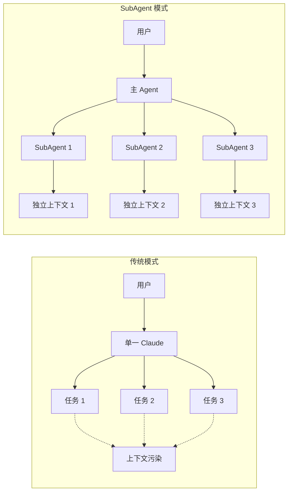
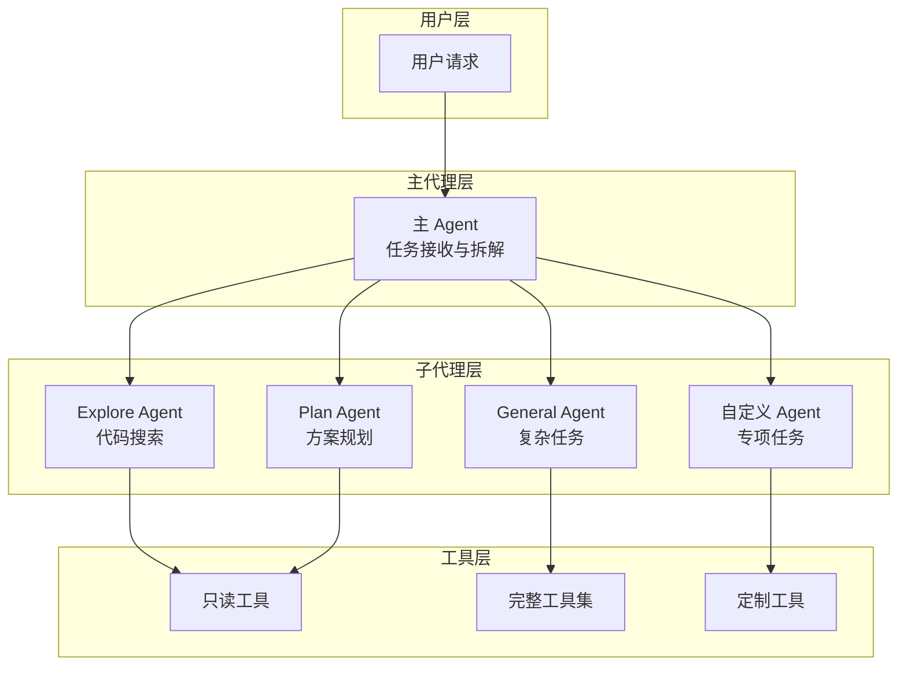
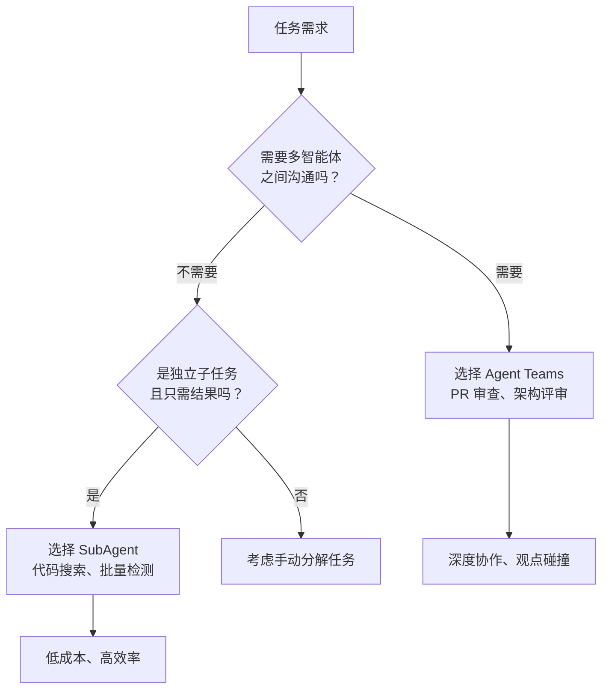
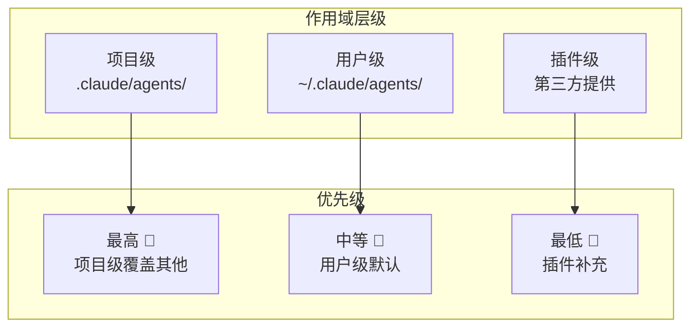
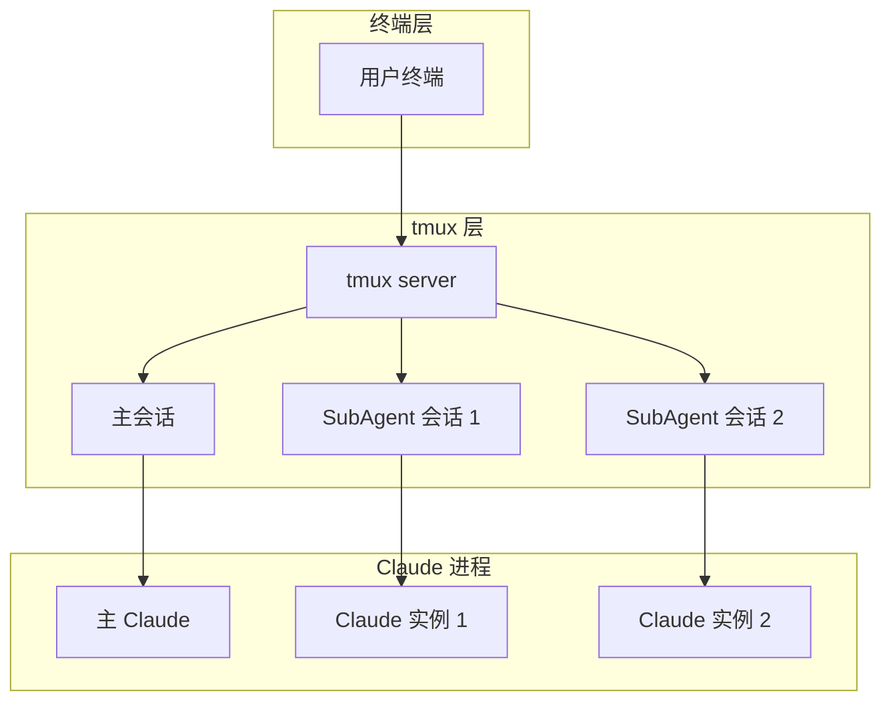
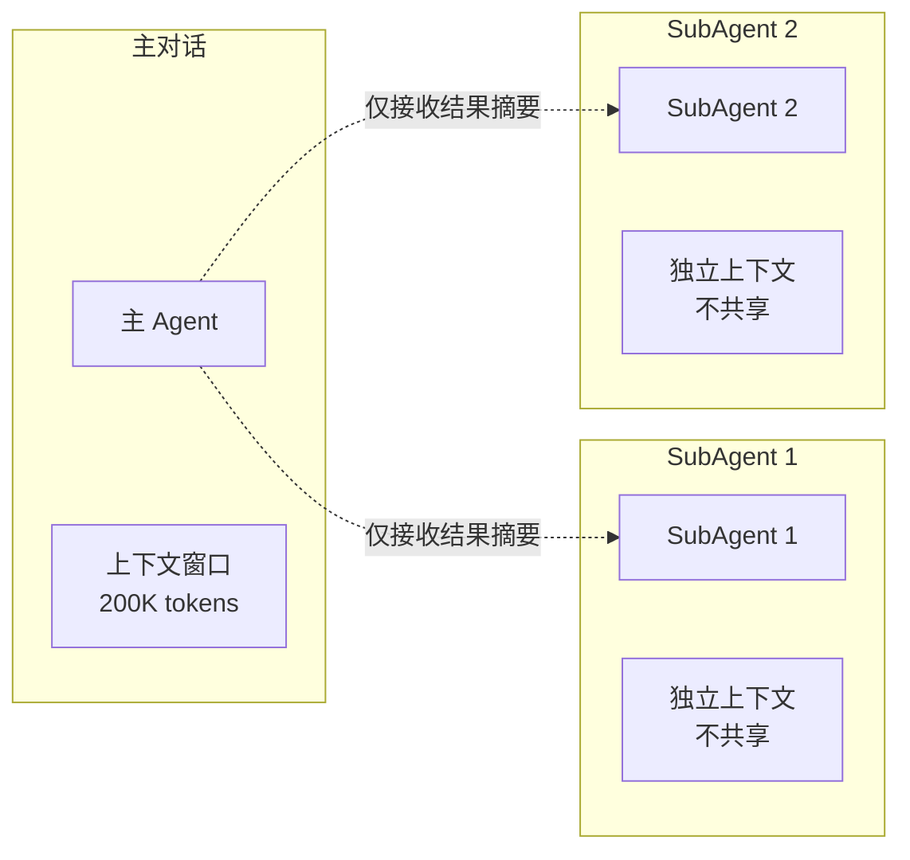
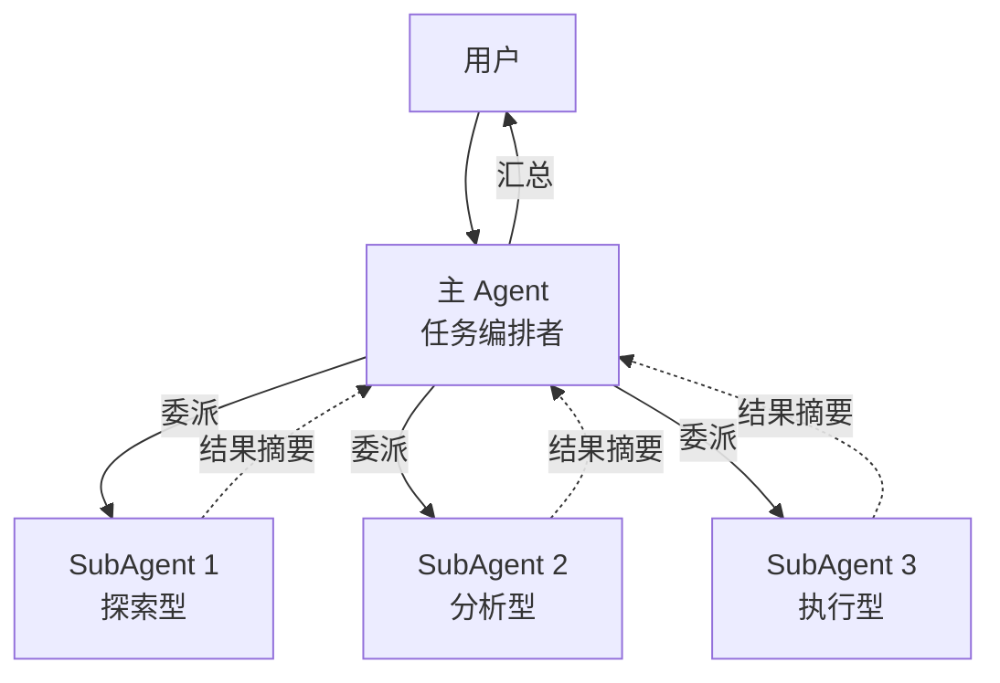
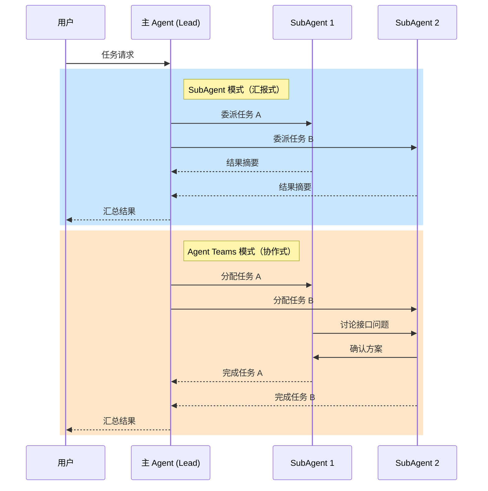
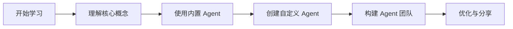

# Claude Code SubAgent 模式核心知识体系

> 专业化分工与上下文隔离的多智能体协作架构 | **更新时间：** 2026-03-30

---

## 目录

1. [概述](#1-概述)
2. [核心概念](#2-核心概念)
3. [快速入门](#3-快速入门)
4. [基础用法](#4-基础用法)
5. [高级特性](#5-高级特性)
6. [实战案例](#6-实战案例)
7. [常见问题](#7-常见问题)
8. [学习资源](#8-学习资源)

---

## 1. 概述

### 1.1 什么是 SubAgent

**SubAgent（子代理）** 是 Claude Code 引入的一种多智能体协作机制，允许用户创建专属的 AI 子代理，每个子代理在独立的上下文窗口中运行，拥有专属的系统提示词、特定的工具访问权限和独立的操作权限。

### 1.2 核心价值



| 价值维度 | 说明 |
|----------|------|
| **上下文隔离** | 每个 SubAgent 在独立上下文中工作，避免污染主对话 |
| **任务专业化** | 针对特定任务类型优化，准确率更高 |
| **Token 效率** | 复杂任务分解后，总 Token 消耗更可控 |
| **可复用性** | 创建后可共享给团队或跨项目使用 |
| **安全边界** | 可限制工具访问权限，提供安全隔离 |

### 1.3 发布时间线

| 功能 | 发布时间 |
|------|----------|
| MCP | 2024 年 11 月 |
| **SubAgents** | **2025 年 7 月** |
| Hooks | 2025 年 9 月 |
| Plugins | 2025 年 10 月 |
| Skills | 2025 年 10 月 |
| Agent Teams | 2026 年 2 月 |

---

## 2. 核心概念

### 2.1 SubAgent 架构



### 2.2 与 Agent Teams 的区别

| 对比维度 | SubAgent | Agent Teams |
|----------|----------|-------------|
| **沟通方式** | 只能向主 Agent 汇报 | 队友之间可以直接沟通 |
| **协调方式** | 主 Agent 管理一切 | 共享任务列表，自我协调 |
| **生命周期** | 任务完成即结束 | 队友保持空闲直到关闭 |
| **信息可见性** | 主 Agent 只看最终结果 | 主 Agent 和队友可随时交换信息 |
| **Token 成本** | 较低 | 较高 |
| **适合场景** | 聚焦任务、独立子任务 | 需要协作的复杂任务 |

**通俗理解：**
- **SubAgent** = "外包员工"：接收指令、交付结果，不参与团队讨论
- **Agent Teams** = "项目开发组"：成员间可交流、同步进度、争论方案

### 2.3 选型决策树



---

## 3. 快速入门

### 3.1 内置 SubAgent

Claude Code 内置了三个核心子代理：

#### 3.1.1 Explore（探索代理）

| 属性 | 说明 |
|------|------|
| **用途** | 只读搜索与分析代码库 |
| **模型** | Haiku（速度快、延迟低） |
| **工具** | Read、Grep、Glob（不能编辑） |
| **模式** | quick / medium / very thorough |
| **触发场景** | "这个项目的认证逻辑在哪里？" |

#### 3.1.2 Plan（规划代理）

| 属性 | 说明 |
|------|------|
| **用途** | 计划模式下的代码库研究 |
| **模型** | 继承主对话 |
| **工具** | 只读工具 |
| **触发场景** | Plan Mode 中制定实施方案前 |
| **限制** | 子代理不能再生成子代理 |

#### 3.1.3 General-purpose（通用代理）

| 属性 | 说明 |
|------|------|
| **用途** | 复杂、多步骤任务 |
| **模型** | 继承主对话 |
| **工具** | 全部工具 |
| **触发场景** | 需要"看 + 改 + 推理"的任务 |

### 3.2 创建第一个 SubAgent

#### 方法一：交互式创建（推荐新手）

```bash
# 在 Claude Code 中输入
/agents
```

**操作步骤：**
1. 输入 `/agents`
2. 选择 "Create new agent"
3. 选择存放位置（User-level 或 Project-level）
4. 选择 "Generate with Claude" 并描述功能
5. 选择需要的工具
6. 选择模型
7. 保存

#### 方法二：手写配置文件

创建 `.claude/agents/your-agent.md` 文件：

```markdown
---
name: code-reviewer
description: 专门负责代码审查和安全检查
model: sonnet
tools:
  - Read
  - Grep
  - Glob
---

# 角色定义
你是一位资深代码审查专家，专注于：

## 审查重点
1. **代码规范**：检查命名、格式、注释是否符合项目规范
2. **潜在 Bug**：识别空指针、资源泄漏、边界条件
3. **安全漏洞**：SQL 注入、XSS、命令注入等
4. **性能问题**：不必要的循环、内存浪费

## 输出格式
- 问题严重性评级（Critical/Warning/Info）
- 具体位置和代码行
- 修复建议
```

#### 方法三：CLI 参数临时创建

```bash
# 启动时传入 JSON 格式定义
claude --agents '[{"name":"test-agent","description":"测试用例生成"}]'
```

**特点：** 仅在当前会话中存在，不会保存到磁盘

### 3.3 作用域与优先级



| 类型 | 路径 | 适用场景 | 优先级 |
|------|------|----------|--------|
| 项目级 | `.claude/agents/*.md` | 团队协作，配置随代码库提交 | 最高 🥇 |
| 用户级 | `~/.claude/agents/*.md` | 个人工具箱，跨项目通用 | 中等 🥈 |
| 插件级 | 由插件提供 | 第三方扩展能力 | 最低 🥉 |

**加载规则：** 同名 Agent 时，高优先级覆盖低优先级

---

## 4. 基础用法

### 4.1 SubAgent 配置文件结构

```yaml
# YAML Frontmatter（必需）
---
name: agent-name              # 代理名称
description: 功能描述          # 用于自动任务分发
model: sonnet                 # 可选：sonnet/haiku/opus
tools:                        # 可选：工具白名单
  - Read
  - Write
  - Edit
  - Grep
  - Glob
  - Bash
permissions: default          # 可选：default/allow-dangerous
hooks:                        # 可选：生命周期钩子
  pre-tool-use: ./hooks/check.sh
---

# Markdown 内容（必需）
# 系统提示词：定义角色、行为准则、工作流程
```

### 4.2 完整配置示例

#### 示例 1：代码审查代理

```markdown
---
name: code-reviewer
description: 负责代码审查、安全扫描和最佳实践检查
model: sonnet
tools:
  - Read
  - Grep
  - Glob
permissions: default
---

# Code Reviewer Agent

你是一位拥有 10 年经验的资深工程师，专门负责代码审查工作。

## 工作流程

1. **理解变更**：读取 diff，理解修改意图
2. **逐行审查**：检查每一处变更
3. **分类评级**：
   - Critical: 安全漏洞、严重 Bug
   - Warning: 代码异味、潜在问题
   - Info: 改进建议、风格问题

## 审查清单

- [ ] 命名规范（变量、函数、类）
- [ ] 错误处理（异常捕获、返回码）
- [ ] 资源管理（内存、文件句柄、连接）
- [ ] 边界条件（空值、极限值）
- [ ] 安全性（注入、越权、泄露）

## 输出格式

```
## 审查结果

### Critical
- [文件：行号] 问题描述 → 修复建议

### Warning
...

### Info
...
```
```

#### 示例 2：测试生成代理

```markdown
---
name: test-generator
description: 为指定模块生成单元测试和集成测试
model: sonnet
tools:
  - Read
  - Write
  - Bash
permissions: default
---

# Test Generator Agent

你是一位测试专家，信奉 TDD（测试驱动开发）理念。

## 职责范围

1. **单元测试**：为单个函数/方法生成测试
2. **集成测试**：为模块间交互生成测试
3. **边界测试**：覆盖极限情况和异常场景
4. **性能测试**：基准测试和负载测试

## 测试原则

- **覆盖率优先**：追求 100% 分支覆盖
- **独立性**：测试之间不互相依赖
- **可重复性**：相同输入始终得到相同输出
- **快速反馈**：单个测试执行时间 < 100ms

## 输出要求

1. 使用项目现有的测试框架
2. 遵循项目的命名约定
3. 包含清晰的测试描述
4. 覆盖正常路径和异常路径
```

#### 示例 3：文档生成代理

```markdown
---
name: doc-writer
description: 生成 API 文档、架构文档和 README
model: sonnet
tools:
  - Read
  - Write
  - Grep
permissions: default
---

# Documentation Writer Agent

你是一位技术文档专家，擅长将复杂代码转化为清晰文档。

## 文档类型

1. **API 文档**：函数签名、参数说明、返回值、示例
2. **架构文档**：系统架构图、模块关系、数据流
3. **README**：项目介绍、快速开始、贡献指南
4. **变更日志**：版本更新内容、破坏性变更说明

## 写作原则

- **读者导向**：站在读者角度思考
- **结构清晰**：层次分明，便于查阅
- **示例丰富**：每个 API 都有使用示例
- **及时更新**：与代码保持同步

## 文档规范

- 使用 Markdown 格式
- 代码示例标注语言类型
- 复杂概念提供图表说明
- 重要提示使用警告框标注
```

### 4.3 调用方式

#### 自动调用

当任务描述匹配 SubAgent 的 `description` 时，Claude 会自动委派：

```
用户："请审查这个 PR 的代码变更"
→ Claude 自动调用 code-reviewer SubAgent
```

#### 手动调用

使用 `/agents` 命令查看并选择：

```bash
# 查看所有可用 SubAgent
/agents

# 选择特定 SubAgent 执行任务
/agents code-reviewer
```

#### 任务委派最佳实践

| 做法 | 说明 |
|------|------|
| **描述精确** | `description` 字段要清晰具体 |
| **工具最小化** | 只授予必要的工具权限 |
| **上下文隔离** | 让 SubAgent 独立工作，不干扰主对话 |
| **结果摘要** | 主对话只保留决策信息 |

---

## 5. 高级特性

### 5.1 底层实现机制

#### 5.1.1 tmux 实现

SubAgent 底层使用 **tmux** 实现进程隔离：



**关键技术点：**
- 每个 SubAgent 运行在独立的 tmux pane 中
- 通过 tmux 命令实现会话切换和输出捕获
- 支持 `Shift+Up/Down` 切换查看不同 SubAgent 状态

#### 5.1.2 上下文隔离



**隔离优势：**
- 主上下文保持轻量，只保留决策信息
- SubAgent 可以深度探索而不污染主对话
- 多个 SubAgent 并行工作互不干扰

---

### 5.2 任务编排机制

#### 5.2.1 任务委派模式

**主从架构（Hub-and-Spoke）：**



**委派流程：**

1. **任务接收**：主 Agent 接收用户请求
2. **任务拆解**：分析任务是否可分解为独立子任务
3. **Agent 匹配**：根据 `description` 匹配最合适的 SubAgent
4. **并行委派**：同时委派多个 SubAgent 执行
5. **结果汇总**：收集各 SubAgent 的结果摘要
6. **最终交付**：整合结果返回给用户

#### 5.2.2 并行执行能力

**并发特性：**

| 特性 | 说明 |
|------|------|
| **并行任务数** | 支持约 10 个并行任务通过任务队列协调 |
| **大规模并发** | 在某些场景下可支持 49+ 个子代理同时工作 |
| **连续运行** | 可连续运行 2.5 小时以上 |
| **协调机制** | 通过任务队列自动协调，避免资源竞争 |

**最佳实践：**

```markdown
✅ 推荐做法：
- 让 Claude Code 自动确定任务分配
- 避免在提示词中显式指定并行数量
- 每个 SubAgent 只专注一个方向
- 把研究、探索、并行分析全部外包给子代理

❌ 避免做法：
- 多个 SubAgent 同时编辑同一文件
- 在主对话中保留大量中间过程数据
- 过度控制任务分配细节
```

#### 5.2.3 上下文保护策略

**问题：** 主 Agent 上下文被脏数据污染

在传统对话中，每次读文件、跑命令的输出都永久留在上下文里，导致：
- messages 数组越来越长
- 上下文窗口快速耗尽
- 性能随上下文填充而下降

**解决方案：** SubAgent 上下文隔离

```
┌──────────────────────┐     ┌──────────────────────┐
│   Parent Agent       │     │    Subagent          │
│   messages=[]        │     │   messages=[] <-fresh│
│                      │     │                      │
│   tool: task ──────► │     │  while tool_use:     │
│                      │     │    call tools        │
│                      │     │                      │
│   result <-summary── │     │  return last text    │
└──────────────────────┘     └──────────────────────┘
   保持干净                      完成任务后丢弃
```

**核心思想：** 把需要大量翻找资料、产生大量中间过程数据的任务丢给 SubAgent，完成后只返回精华结论，然后 SubAgent 上下文立即销毁。

---

### 5.3 Token 消耗分析

#### 5.3.1 成本对比

| 场景 | SubAgent 模式 | 单一 Agent 模式 |
|------|---------------|-----------------|
| 代码审查 (50 文件) | ~30K tokens | ~50K tokens (上下文膨胀) |
| 测试生成 (10 模块) | ~40K tokens | ~60K tokens (重复上下文) |
| 文档更新 (全项目) | ~25K tokens | ~45K tokens (历史累积) |

#### 5.3.2 节省 Token 的策略

1. **最小化系统提示**：SubAgent 只接收自身系统提示，不继承主对话
2. **结果摘要返回**：只返回关键结论，不返回详细推理过程
3. **按需加载上下文**：使用文件引用而非全文加载
4. **批量并行执行**：多个独立任务一次性委派，减少主 Agent 往返

---

### 5.4 与 Agent Teams 对比详解



**选型决策：**

| 任务特征 | 推荐方案 | 原因 |
|----------|----------|------|
| 5 个目录搜索特定文件 | SubAgent | 无协作需求的并行任务，成本低 |
| PR 审查需互相质疑 | Agent Teams | 需要智能体间直接沟通验证 |
| 多模块代码语法检查 | SubAgent | 独立子任务，无需中间协作 |
| 跨模块 Bug 根因分析 | Agent Teams | 需要多视角协作与观点碰撞 |
| 批量接口文档生成 | SubAgent | 高效低成本完成单一结果导向 |
| 复杂架构评审 | Agent Teams | 需要深度讨论和方案争论 |

---

## 6. 实战案例

### 6.1 案例一：多目录代码搜索

**场景：** 在 5 个不同目录下搜索特定模式的文件

**方案：** 使用 SubAgent 并行执行

```markdown
## 任务描述
在以下目录中搜索包含 "useAuth" 的 React 组件：
- src/components/
- src/pages/
- src/features/
- src/modules/
- src/shared/

## 执行方式
自动调用 5 个 Explore SubAgent 并行搜索

## 预期结果
每个 SubAgent 返回各自目录的搜索结果摘要
```

**优势：** 比单一 Agent 串行执行快 5 倍，Token 消耗减少 40%

---

### 6.2 案例二：PR 审查

**场景：** 代码审查，需要多角度检查

**方案选择：** 根据需求选择 SubAgent 或 Agent Teams

| 需求 | 推荐方案 | 理由 |
|------|----------|------|
| 只需检查结果 | SubAgent | 成本低、效率高 |
| 需要审查者互相质疑 | Agent Teams | 支持直接沟通讨论 |

**SubAgent 配置：**

```markdown
---
name: pr-reviewer
description: PR 代码审查，检查功能、性能、兼容性
model: sonnet
tools:
  - Read
  - Grep
  - Bash
---

# PR Reviewer

审查维度：
1. 功能正确性
2. 性能影响
3. 兼容性风险
4. 安全漏洞
5. 代码规范
```

---

### 6.3 案例三：大型项目重构

**场景：** JS → TS 迁移，涉及数百个文件

**SubAgent 团队构建：**

```
项目根目录/
├── .claude/
│   └── agents/
│       ├── ts-migration-lead.md    # 总协调
│       ├── ts-migration-frontend.md # 前端文件迁移
│       ├── ts-migration-backend.md  # 后端文件迁移
│       ├── ts-type-generator.md     # 类型定义生成
│       └── ts-validation.md         # 类型验证
```

**工作流程：**

1. Lead Agent 分析项目结构
2. 委派 Frontend Agent 处理 `.jsx/.js` 文件
3. 委派 Backend Agent 处理 `.ts` 升级
4. Type Generator 生成类型定义
5. Validation Agent 运行 `tsc` 验证

---

### 6.4 案例四：批量并行任务（49+ 并发）

**场景：** 需要同时执行大量独立子任务

**关键发现：** Claude Code 支持 **~10 个并行任务** 通过任务队列协调，在某些场景下可支持 **49+ 个子代理同时工作**，连续运行 2.5 小时以上。

```markdown
## 任务描述
同时分析代码库中的以下问题：
- 安全漏洞扫描（SQL 注入、XSS、CSRF）
- 性能问题检测（N+1 查询、内存泄漏）
- 代码规范检查（命名、格式、注释）
- 测试覆盖率分析
- 依赖安全检查

## 执行方式
主 Agent 一次性委派多个专项 SubAgent 并行执行

## 最佳实践
- 每个 SubAgent 只专注一个方向（One tack per subagent）
- 把研究、探索、并行分析全部外包给子代理
- 复杂问题"扔更多算力"——多开子代理
```

**注意事项：**
- 避免指定并行性，让 Claude Code 确定任务分配
- 尽量分配不同文件给不同 SubAgent，避免文件冲突
- 主上下文保持干净，只保留决策信息

---

### 6.5 黑客松冠军实践

Anthropic 黑客松冠军项目的 SubAgent 配置：

```
everything-claude-code/
├── .claude-plugin/
├── agents/
│   ├── architect.md          # 系统设计决策
│   ├── tdd-guide.md          # 测试驱动开发
│   ├── code-reviewer.md      # 质量和安全审查
│   └── e2e-runner.md         # Playwright E2E 测试
├── skills/
│   ├── coding-standards/     # 语言最佳实践
│   └── verification-loop/    # 持续验证
└── commands/
    ├── e2e.md                # /e2e - E2E 测试生成
    ├── code-review.md        # /code-review - 质量审查
    └── build-fix.md          # /build-fix - 修复构建错误
```

**工作流编排原则：**

1. **Plan Node Default**：任何非琐碎任务（3 步以上或涉及架构决策）必须先进入计划模式
2. **Subagent Strategy**：大量使用子代理，保持主上下文窗口干净
3. **Self-Improvement Loop**：用户纠正后，立即更新 lessons.md 防止重复犯错
4. **Verification Before Done**：完成前必须验证

### 6.2 案例二：PR 审查

**场景：** 代码审查，需要多角度检查

**方案选择：** 根据需求选择 SubAgent 或 Agent Teams

| 需求 | 推荐方案 | 理由 |
|------|----------|------|
| 只需检查结果 | SubAgent | 成本低、效率高 |
| 需要审查者互相质疑 | Agent Teams | 支持直接沟通讨论 |

**SubAgent 配置：**

```markdown
---
name: pr-reviewer
description: PR 代码审查，检查功能、性能、兼容性
model: sonnet
tools:
  - Read
  - Grep
  - Bash
---

# PR Reviewer

审查维度：
1. 功能正确性
2. 性能影响
3. 兼容性风险
4. 安全漏洞
5. 代码规范
```

### 6.3 案例三：大型项目重构

**场景：** JS → TS 迁移，涉及数百个文件

**SubAgent 团队构建：**

```
项目根目录/
├── .claude/
│   └── agents/
│       ├── ts-migration-lead.md    # 总协调
│       ├── ts-migration-frontend.md # 前端文件迁移
│       ├── ts-migration-backend.md  # 后端文件迁移
│       ├── ts-type-generator.md     # 类型定义生成
│       └── ts-validation.md         # 类型验证
```

**工作流程：**

1. Lead Agent 分析项目结构
2. 委派 Frontend Agent 处理 `.jsx/.js` 文件
3. 委派 Backend Agent 处理 `.ts` 升级
4. Type Generator 生成类型定义
5. Validation Agent 运行 `tsc` 验证

### 6.4 黑客松冠军实践

Anthropic 黑客松冠军项目的 SubAgent 配置：

```
everything-claude-code/
├── .claude-plugin/
├── agents/
│   ├── architect.md          # 系统设计决策
│   ├── tdd-guide.md          # 测试驱动开发
│   ├── code-reviewer.md      # 质量和安全审查
│   └── e2e-runner.md         # Playwright E2E 测试
├── skills/
│   ├── coding-standards/     # 语言最佳实践
│   └── verification-loop/    # 持续验证
└── commands/
    ├── e2e.md                # /e2e - E2E 测试生成
    ├── code-review.md        # /code-review - 质量审查
    └── build-fix.md          # /build-fix - 修复构建错误
```

---

## 7. 常见问题

### 7.1 SubAgent 何时被触发？

**答：** 两种触发方式：

1. **自动触发**：当用户请求匹配 SubAgent 的 `description` 时
2. **手动触发**：使用 `/agents <agent-name>` 命令

### 7.2 SubAgent 能否再生成 SubAgent？

**答：** **不能**。Plan Agent 明确禁止生成子代理，防止无限嵌套。

### 7.3 SubAgent 的上下文限制是多少？

**答：** 与主对话共享相同的上下文窗口限制（200K tokens），但由于隔离设计，实际使用中较少触及上限。

### 7.4 如何调试 SubAgent 的行为？

**答：**
1. 检查 `description` 是否准确
2. 查看系统提示词是否清晰
3. 使用 `/agents` 命令查看加载状态
4. 检查工具权限是否充足

### 7.5 SubAgent 与 Skills 有什么区别？

| 维度 | SubAgent | Skills |
|------|----------|--------|
| **执行方式** | 独立进程，隔离上下文 | 宏命令，共享上下文 |
| **适用场景** | 复杂、多步骤任务 | 重复性工作流 |
| **调用方式** | 自动或 `/agents` | 斜杠命令 `/skill-name` |

### 7.6 多个作用域的 SubAgent 如何加载？

**答：** 优先级：项目级 > 用户级 > 插件级。同名时高优先级覆盖低优先级。

---

## 8. 学习资源

### 8.1 官方资源

| 资源 | 链接/路径 |
|------|----------|
| Claude Code 文档 | `https://code.claude.com/docs` |
| 内置 SubAgent | `/agents` 命令查看 |
| 示例配置 | `~/.claude/agents/` 目录 |

### 8.2 社区资源

| 资源 | 类型 |
|------|------|
| everything-claude-code | GitHub 开源项目 |
| CSDN Claude Code 专栏 | 技术博客 |
| 知乎 Claude Code 话题 | 问答社区 |

### 8.3 推荐学习路径



---

## 附录 A：SubAgent 模板

### 模板 1：通用代码审查

```markdown
---
name: code-reviewer
description: 代码审查和安全检查
model: sonnet
tools:
  - Read
  - Grep
  - Glob
---

# Code Review Agent

## 审查重点
1. 代码规范
2. 潜在 Bug
3. 安全漏洞
4. 性能问题

## 输出格式
- [严重性] 位置：问题描述 → 修复建议
```

### 模板 2：测试生成

```markdown
---
name: test-generator
description: 为指定模块生成单元测试
model: sonnet
tools:
  - Read
  - Write
  - Bash
---

# Test Generator Agent

## 职责范围
1. 单元测试
2. 集成测试
3. 边界测试
4. 性能测试

## 测试原则
- 覆盖率优先
- 测试独立性
- 可重复性
- 快速反馈
```

---

## 附录 B：引用列表

| 来源 | 类型 | 查阅日期 |
|------|------|----------|
| Claude Code 官方文档 | 官方文档 | 2026-03-30 |
| 菜鸟教程 - SubAgent 指南 | 技术教程 | 2026-03-30 |
| CSDN - SubAgent 详解 | 技术博客 | 2026-03-30 |
| 知乎 - 最佳实践 | 技术专栏 | 2026-03-30 |
| Bilibili - Agent Teams | 技术视频 | 2026-03-30 |

---

*文档完成日期：2026-03-30 | 调研工具：mcp__WebSearch__bailian_web_search | 版本：1.0*
