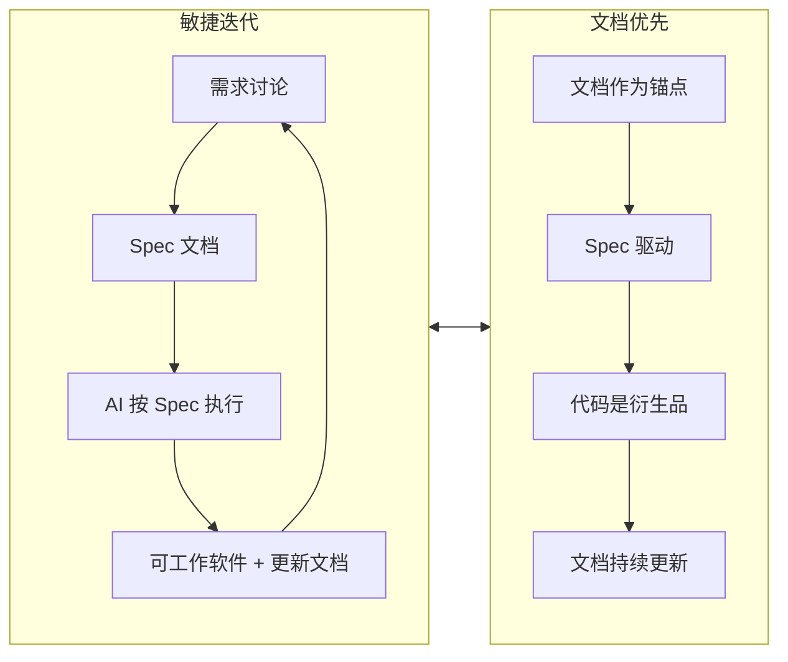

# 第 1 章：概述：为什么需要文档优先

---

## 1.1 AI 编程的三大痛点

2025 年被行业公认为 **"Agentic Coding"爆发元年**，AI 编程工具已从单纯的代码补全演进为具备完整软件开发生命周期支持能力的智能系统。根据 GitHub 2025 年第一季度开发者调查报告：

| 指标 | 数据 | 同比变化 |
|------|------|----------|
| 全球 AI Coding 开发者数量 | 1200 万 + | +140% |
| AI 代码生成占比 | 43% + | +25% |
| 编码效率提升 | 40% + | - |
| Y Combinator 2025 届采用规范驱动开发团队 | 25% | - |
| 规范驱动团队 AI 代码测试通过率 | 91.4% | +32% |

然而，在 AI 编程效率大幅提升的表象之下，三大核心痛点正成为制约 AI  Coding 企业级落地的关键瓶颈：

### 1.1.1 上下文腐烂 (Context Decay)

**问题描述：** 在多轮交互过程中，对话历史被系统压缩，前期讨论的关键设计决策逐渐被遗忘。

**典型症状：**
- AI 生成的代码与初始需求和核心设计脱节
- "前言不搭后语"，同一项目中出现矛盾的架构决策
- 需要反复重申早期已确认的约束条件

**影响范围：** 复杂项目、长周期开发、多人协作场景

**技术根源：**
1. **上下文窗口限制**：尽管模型上下文窗口从 8K 扩展到 200K+，但注意力机制存在"中间遗忘"现象
2. **Context Rot（上下文衰减）**：当对话长度不断增加，模型对细节的准确回忆与利用能力下降
3. **信噪比恶化**：每轮工具输出、中间推理都会膨胀"可能相关"的信息，噪声淹没信号

### 1.1.2 审查瘫痪 (Review Paralysis)

**问题描述：** AI 能在几分钟内生成上万行代码，人类无法逐行 Review。

**典型症状：**
- 面对大量 Diff 不敢合并，或盲目合并后埋下隐患
- AI 生成的代码结构混乱，难以维护
- "能跑但不敢动"，缺乏修改信心

**影响范围：** 大规模重构、新功能开发、代码迁移

**数据支撑：** GitHub 研究显示，未采用规范驱动的 AI 编码项目中，**63% 的返工源于初期需求理解偏差**。

### 1.1.3 维护断层 (Maintenance Gap)

**问题描述：** AI 生成的代码缺乏文档，两个月后回来修 Bug 时看不懂。

**典型症状：**
- 人和新的 AI 都无法接手，"能跑但不敢动"
- 代码与文档脱节，文档迅速过期
- 团队知识无法沉淀，人员流动导致知识流失

**影响范围：** 长期维护项目、人员流动频繁团队

---

## 1.2 文档优先如何解决痛点

文档优先（Document-First）开发范式通过**在编码之前建立完整的文档基础**，将文档作为"唯一事实来源"（Single Source of Truth），系统性解决上述三大痛点：

### 1.2.1 针对上下文腐烂的解决方案

**核心策略：** 用文档锚点锁定上下文，作为"存档点"

**具体机制：**
1. **外部化记忆**：将关键设计决策、架构原则、接口定义写入文档，不依赖 AI 的上下文窗口
2. **可追溯性**：需求→设计→代码→测试全链路可追溯，任何变更都有据可查
3. **渐进式披露**：按需加载相关文档，保持信噪比

**实测效果：** 采用文档优先的团队，返工率下降 **78%**。

### 1.2.2 针对审查瘫痪的解决方案

**核心策略：** Spec 驱动开发，AI 按规范执行，人类审查 Spec 而非代码

**具体机制：**
1. **规范先行**：在 AI 写代码之前，先将人类模糊的想法转化为清晰、无歧义的结构化规范
2. **质量闸门**：规范定义验收标准，AI 生成的代码必须通过自动化测试验证
3. **变更可预测**：代码变更是规范的衍生品，审查 Spec 即可预判代码变更范围

**实测效果：** 审查时间缩短 **65%**，PR 合并时间从 9.6 天缩短到 2.4 天。

### 1.2.3 针对维护断层的解决方案

**核心策略：** 文档随项目演进自动更新，保持与代码一致

**具体机制：**
1. **文档即代码**：文档与代码同步提交，文档更新纳入 DoD（Definition of Done）
2. **AI 辅助维护**：AI 生成代码时同步生成变更摘要，自动更新相关文档
3. **知识库沉淀**：最佳实践、踩坑记录持续积累，形成团队知识资产

**实测效果：** 新人上手时间缩短 **50%**，文档缺失率从 41% 降至 0%。

---

## 1.3 与敏捷开发的关系

文档优先开发范式与敏捷开发并非对立关系，而是**在 AI 时代对敏捷原则的演进和补充**：

### 1.3.1 继承敏捷的核心价值观

| 敏捷价值观 | 文档优先的继承 |
|------------|----------------|
| 个体和互动高于流程和工具 | 文档作为人机互动的媒介，促进人类意图与 AI 执行的精准对齐 |
| 可工作的软件高于详尽的文档 | 文档优先不追求"详尽"，而追求"必要且精准" |
| 客户合作高于合同谈判 | Spec 文档是客户（人类）与执行者（AI）之间的协作契约 |
| 响应变化高于遵循计划 | 文档支持快速迭代，Spec 可随需求变化动态更新 |

### 1.3.2 对敏捷偏颇的纠正

敏捷宣言强调"可工作的软件高于详尽的文档"，但在 AI 时代，这一原则被部分团队曲解为"不要文档"。文档优先开发范式对此进行纠正：

**纠正 1：文档不是"详尽"，而是"必要"**
- 文档优先不追求大而全的文档，而是聚焦于**约束 AI 行为边界**的必要信息
- 核心是**质量优于数量**，一份精准的 Spec 胜过十份过时的设计文档

**纠正 2：文档不是"事后补救"，而是"事前锚点"**
- 传统敏捷中，文档往往是编码完成后的"应付差事"
- 文档优先中，文档是编码开始前的"设计蓝图"

**纠正 3：文档不是"负担"，而是"资产"**
- 文档作为团队知识沉淀的载体，是长期可复用的资产
- 文档是 AI 时代的"团队记忆"，解决人员流动导致知识流失问题

### 1.3.3 文档优先与敏捷的融合

**融合实践：**
1. **Sprint 规划**：每个 Story 必须有 Spec 文档，作为 AI 执行的输入
2. **每日站会**：审查 Spec 文档的完成情况，而非代码细节
3. **回顾会议**：反思 Spec 文档的质量，持续改进文档模板

---

## 1.4 文档优先的定义与范围

### 1.4.1 核心定义

**文档优先开发（Document-First Development）** 是一种软件开发范式，其核心原则是：

> 在编码之前建立完整的文档基础，将文档作为"唯一事实来源"（Single Source of Truth），驱动 AI 生成、验证和维护代码。

### 1.4.2 适用范围

| 场景 | 适用性 | 说明 |
|------|--------|------|
| 新项目从 0 到 1 | ⭐⭐⭐⭐⭐ | 通过 project-start 建立文档优先系统 |
| 老项目 AI 化改造 | ⭐⭐⭐⭐⭐ | 通过 project-migration 逆向生成文档 |
| 个人快速原型 | ⭐⭐⭐ | 可采用精简版文档（仅 CLAUDE.md + Spec） |
| 企业级应用 | ⭐⭐⭐⭐⭐ | 必须建立完整文档体系 |
| 开源项目 | ⭐⭐⭐⭐ | 文档作为协作契约，降低贡献门槛 |

### 1.4.3 不适用范围

| 场景 | 原因 |
|------|------|
| 一次性脚本 | 文档成本高于收益 |
| 探索性实验 | 需求极不明确，文档快速过期 |
| 超小型功能 | 简单的代码注释即可满足需求 |

---

*第 1 章完成 | 下一步：第 2 章 核心概念*
