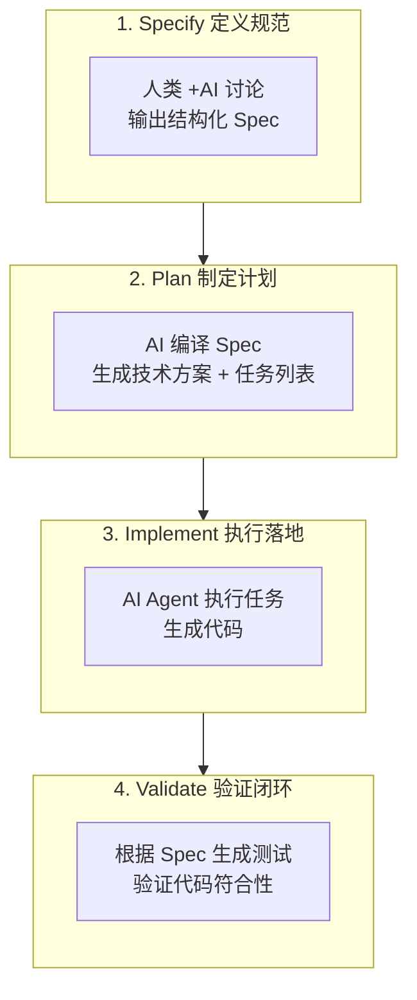
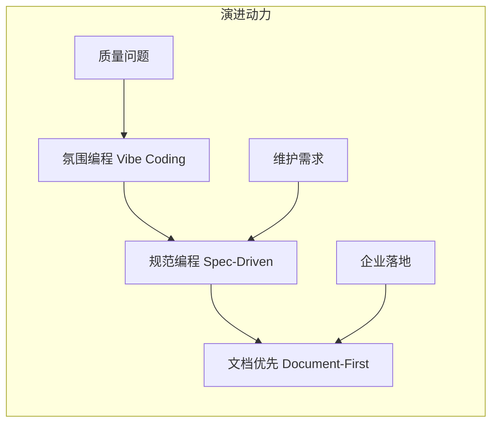

# 第 2 章：核心概念

---

## 2.1 文档优先开发（Document-First Development）

### 2.1.1 概念定义

**文档优先开发**是一种软件开发范式，其核心原则是：

> 在编码之前建立完整的文档基础，将文档作为"唯一事实来源"（Single Source of Truth），驱动 AI 生成、验证和维护代码。

**为什么需要文档优先？**
- 未采用规范驱动的 AI 编码项目中，**63% 的返工源于初期需求理解偏差**
- 采用文档优先的团队，**提案阶段修正技术方案平均耗时仅 12 分钟**
- AI 无法"读心"，结构化文档是传递意图的唯一可靠方式

### 2.1.2 核心原则

| 原则 | 说明 | 实践要点 |
|------|------|----------|
| **Spec 驱动** | 所有代码变更必须对应一份 Spec 文档 | Spec 包含 In/Out Scope、验收标准、技术设计 |
| **可追溯性** | 需求→设计→代码→测试全链路可追溯 | 每个需求 ID 对应 Spec 章节和测试用例 |
| **文档即资产** | 文档与代码同等重要，同步维护 | 文档更新纳入 DoD，AI 辅助维护 |
| **人机协作锚点** | 文档作为人类意图与 AI 执行的交接点 | 人类审查 Spec，AI 按 Spec 执行 |

### 2.1.3 与传统开发的区别

| 维度 | 传统开发 | 文档优先开发 |
|------|----------|--------------|
| **事实来源** | 代码是唯一真理 | Spec 文档是唯一真理 |
| **文档地位** | 附属品，事后补救 | 核心资产，事前定义 |
| **AI 角色** | 代码补全工具 | 规范执行者 |
| **人类角色** | 代码编写者 | 架构设计 + 审查者 |
| **变更流程** | 直接修改代码 | 先改 Spec，再生成代码 |

---

## 2.2 Spec 驱动开发（SDD）

### 2.2.1 概念定义

**Spec 驱动开发（Specification-Driven Development, SDD）** 是文档优先开发的核心实践，其核心思想是：

> 规范（Spec）是唯一的真实来源，代码是规范的输出产物。当需求变更时，首先修改规范，然后由 AI 根据规范重新生成、验证并更新代码。

### 2.2.2 SDD 四步工作流



**各阶段详细说明：**

| 阶段 | 核心活动 | 产出物 | 人类/AI 分工 |
|------|----------|--------|--------------|
| **Specify** | 需求结构化、任务拆解 | Spec 文档 | 人类定义目标，AI 澄清提问 |
| **Plan** | 技术方案设计、任务拆解 | 任务列表 | AI 生成方案，人类 Sign-off |
| **Implement** | 代码生成、单元测试 | 代码 + 测试 | AI 执行，人类监督进度 |
| **Validate** | 测试执行、验收确认 | 测试报告 | AI 生成测试，人类确认 |

### 2.2.3 如何写好 Spec

**Spec 的 5 个必备要素：**

1. **目标与价值** — 解决什么问题？为什么值得做？
2. **上下文与约束** — 技术栈、性能要求、依赖关系
3. **功能需求** — 核心行为和特性定义
4. **非功能需求** — 安全、性能、可扩展性要求
5. **测试标准** — 如何验证成功？验收标准是什么？

**Spec 文档模板：**

```markdown
# [功能名称] Spec 文档

## 1. 功能目标
- **背景：** 为什么要做这个功能
- **目标：** 功能要实现的具体目标
- **成功指标：** 如何衡量功能成功

## 2. 需求范围
### 2.1 In Scope（包含）
- [需求 1]
- [需求 2]

### 2.2 Out of Scope（不包含）
- [排除项 1]
- [排除项 2]

## 3. 接口契约
### 3.1 输入
- [输入参数 1]：[类型]，[说明]

### 3.2 输出
- [返回值/响应]：[类型]，[说明]

## 4. 验收标准（Acceptance Criteria）
- [ ] AC1: [条件描述]
- [ ] AC2: [条件描述]

## 5. 技术设计
- 架构影响
- 数据模型
- API 设计

## 6. 变更记录
| 日期 | 版本 | 变更内容 | 作者 |
|------|------|----------|------|
```

---

## 2.3 Agentic Workflows（智能体工作流）

### 2.3.1 概念定义

**Agentic Workflows** 是指 AI Agent 拥有一定自主性，能够规划任务、使用工具、反思调整，逐步迭代提升结果质量的工作模式。

### 2.3.2 与一次性交互的区别

| 特性 | 一次性交互（Copilot） | Agentic Workflows |
|------|----------------------|-------------------|
| **自主性** | 等待指令，直接产出 | 决定如何处理任务 |
| **迭代能力** | 无，生成后无法修正 | 可回看、调整策略 |
| **工具使用** | 有限 | 完整工具链（文件、数据库、API） |
| **适用场景** | 简单任务、快速答疑 | 复杂分析、深度任务 |

### 2.3.3 Agent 核心能力

| 能力 | 说明 | 在文档优先中的应用 |
|------|------|---------------------|
| **规划（Planning）** | 任务分解（Task Decomposition）、查询分解（Query Decomposition） | 将 Spec 编译为任务列表 |
| **反思（Reflecting）** | 回顾行动结果，基于外部数据调整后续决策 | 根据测试结果修正代码 |
| **记忆（Memory）** | 从过去经验中学习，随时间优化响应 | 从文档中读取历史决策 |
| **工具使用（Tools）** | 访问文件系统、数据库、API 等外部系统 | 读取 Spec、写入代码、执行测试 |

### 2.3.4 文档优先中的 Agent 工作流

```
┌─────────────────┐
│  人类定义 Spec   │
└────────┬────────┘
         ▼
┌─────────────────┐
│  Agent 读取 Spec  │
└────────┬────────┘
         ▼
┌─────────────────┐
│  Agent 规划任务   │ → 生成任务列表
└────────┬────────┘
         ▼
┌─────────────────┐
│  Agent 执行任务   │ → 生成代码 + 测试
└────────┬────────┘
         ▼
┌─────────────────┐
│  Agent 自我验证   │ → 运行测试，修复问题
└────────┬────────┘
         ▼
┌─────────────────┐
│  人类审查确认    │
└─────────────────┘
```

---

## 2.4 上下文工程（Context Engineering）

### 2.4.1 概念定义

**上下文工程**是建立标准化的信息传递体系，为 AI 提供精准的开发参照。

**上下文（Context）的重新定义：**
> 上下文不只是对话历史，而是驱动模型决策的全部信息流的总和 — 包括系统指令、用户问题、历史对话、检索结果、工具返回、任务状态、用户偏好、长期记忆、权限与约束。

### 2.4.2 两类上下文

```
上下文工程
├── 技术上下文（Tech Context）
│   ├── 技术选型文档
│   ├── 环境配置说明
│   ├── 代码规范约定
│   └── 项目结构说明
│
└── 开发上下文（Dev Context）
    ├── 需求文档
    ├── 设计文档
    ├── 接口定义
    └── 变更记录
```

### 2.4.3 上下文管理三步法

**1. 需求理解与文件筛选**
- 提取关键信息
- 识别相关文件（Spec、CLAUDE.md、TECH_STACK.md）
- 排除无关内容

**2. .md 文档创建与维护**
- 作为上下文管理的核心载体
- 文档即"外部化记忆"
- 支持按需加载

**3. 主动引导式交互**
- AI 基于现有代码分析技术栈
- 生成模板供用户确认
- 持续更新上下文索引

### 2.4.4 上下文管理的核心原则

| 原则 | 说明 | 实践要点 |
|------|------|----------|
| **信噪比优先** | 追求尽可能小、但信号足够强的 token 集合 | 只放绝对必要的信息，过滤噪声 |
| **渐进式披露** | 按需加载，不一次性塞入全部信息 | 文件路径→按需读取，规则分类→按需加载 |
| **外部化记忆** | 关键决策写入文档，不依赖上下文窗口 | Spec 文档、CLAUDE.md、知识库 |
| **定期清理** | 合并已完成的 Spec，归档过时文档 | 保持上下文精炼 |

### 2.4.5 Context Rot 的应对策略

**问题：** 当对话长度不断增加，模型对细节的准确回忆与利用能力下降。

**应对策略：**
1. **设置止损线** — 对话超过一定长度后，主动总结并开启新会话
2. **文档锚点** — 将关键决策写入文档，作为"存档点"
3. **摘要压缩** — 定期生成对话摘要，保留核心信息

---

## 2.5 Vibe Coding

### 2.5.1 概念定义

**Vibe Coding** 是一种全新的编程范式，核心是人类只负责高层架构设计和审美决策（对齐 Vibe），将写代码的脏活累活全权交给 AI Agent。

**命名来源：** 2025 年，OpenAI 创始成员 Andrej Karpathy 在 X 帖文中介绍：
> "这是一种新的编程方式，我称之为 vibe coding。你完全沉浸在其中，拥抱指数增长，甚至忘记代码的存在。这不是真正的编程，我只是看到东西，说出来东西，运行东西，复制粘贴东西，而且大部分都凑效。"

### 2.5.2 Vibe Coding 与文档优先的关系

| 维度 | Vibe Coding（无文档） | 文档优先 Vibe Coding |
|------|----------------------|----------------------|
| **需求传递** | 口头描述，AI 猜测意图 | Spec 文档，结构化定义 |
| **代码质量** | 不稳定，依赖 AI 状态 | 稳定，Spec 约束边界 |
| **可维护性** | 低，文档缺失 | 高，文档同步更新 |
| **适用场景** | 原型、实验、小工具 | 生产系统、企业应用 |

### 2.5.3 Vibe Coding 的演进



**演进阶段：**
1. **Vibe Coding 1.0** — 随口给 AI 提示词，快速生成原型
2. **Vibe Coding 2.0** — 加入 Spec 约束，保证代码质量
3. **Vibe Coding 3.0** — 建立完整文档体系，支持长期维护

### 2.5.4 从 Vibe Coding 到文档优先的转变

**转变标志：**
- 从"写得快"到"写得对"
- 从"依赖感觉"到"规范约束"
- 从"一次性原型"到"可维护系统"

**转变收益：**
- 代码质量下限提升
- 返工率下降 78%
- 审查时间缩短 65%

---

*第 2 章完成 | 下一步：第 3 章 理论基础*
