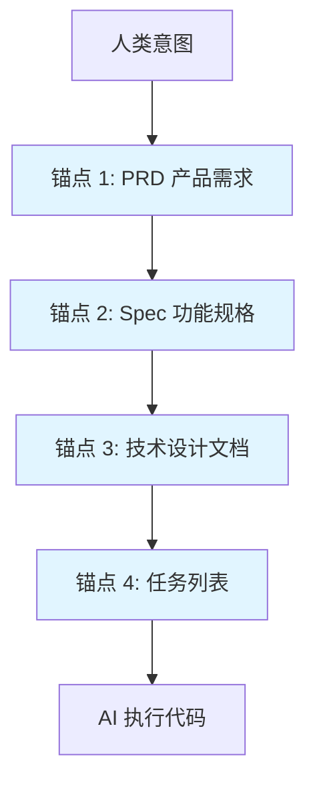
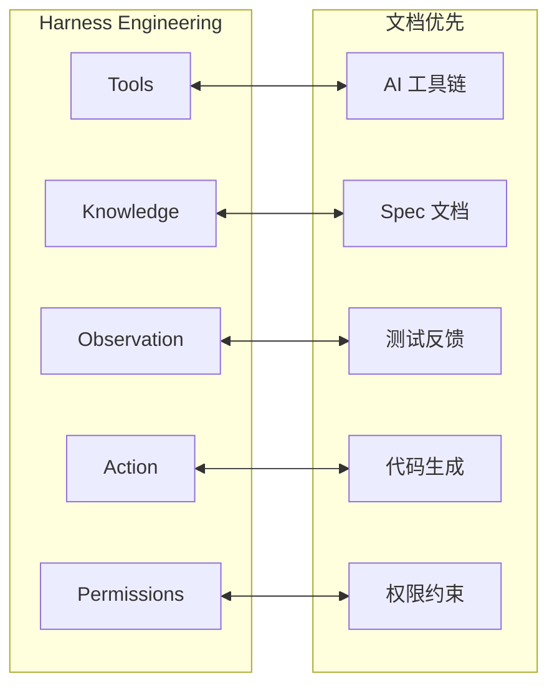

# 第 3 章：文档优先系统的理论基础

---

## 3.1 单一事实来源（Single Source of Truth）

### 3.1.1 概念定义

**单一事实来源（SSOT）** 是一种信息管理原则，指在系统中只有一个权威的、经过验证的数据源，所有其他副本都必须与之保持一致。

**在文档优先开发中的定义：**
> Spec 文档是唯一的真实来源，代码是规范的输出产物。当需求变更时，首先修改规范，然后由 AI 根据规范重新生成、验证并更新代码。

### 3.1.2 为什么需要 SSOT

**传统开发中的多事实来源问题：**

```
问题场景：需求变更
1. 产品经理在 PRD 中修改了需求
2. 开发人员在代码中实现了新需求
3. 但设计文档未更新、API 文档未更新、测试用例未更新
4. 结果：文档之间相互矛盾，新加入的开发者不知道哪个是正确的
```

**数据支撑：**
- 未采用 SSOT 的项目中，**63% 的返工源于需求理解偏差**
- 文档与代码脱节的项目，**新人上手时间平均延长 2.5 倍**

### 3.1.3 SSOT 的实现机制

| 机制 | 说明 | 实践要点 |
|------|------|----------|
| **规范先行** | 在编码之前建立完整的 Spec 文档 | Spec 包含 In/Out Scope、验收标准 |
| **变更流程** | 需求变更→先改 Spec→AI 生成代码 | 禁止直接修改代码而不更新 Spec |
| **自动化验证** | 根据 Spec 生成测试用例，验证代码符合性 | 测试失败→修复代码或修正 Spec |
| **文档同步** | AI 生成代码时同步生成变更摘要 | 变更摘要自动更新相关文档 |

### 3.1.4 SSOT 与 Git 的关系

| 维度 | Git（代码版本控制） | SSOT（文档优先） |
|------|---------------------|------------------|
| **控制对象** | 代码文件 | Spec 文档 + 代码 |
| **事实来源** | 最新提交 | Spec 文档 |
| **变更流程** | 直接修改代码 | 先改 Spec，再生成代码 |
| **验证方式** | 人工 Code Review | Spec 驱动的自动化测试 |

**实践建议：**
- Git 管理代码版本，SSOT 管理需求事实
- Spec 文档与代码一同提交，纳入版本控制
- Git 提交信息关联 Spec 章节（如 `feat(auth): 实现登录 - Spec 3.2`）

---

## 3.2 可追溯性原理

### 3.2.1 概念定义

**可追溯性（Traceability）** 是指需求、设计、代码、测试之间建立双向链接的能力，确保每个需求都能追踪到实现代码和测试用例，每个代码变更都能追溯到需求来源。

### 3.2.2 可追溯性的价值

| 价值 | 说明 | 实测效果 |
|------|------|----------|
| **变更影响分析** | 修改需求时，快速定位受影响的代码和测试 | 影响分析时间从 2 天缩短到 2 小时 |
| **问题定位** | Bug 出现时，追溯到对应需求和设计决策 | Bug 修复时间缩短 45% |
| **合规审计** | 满足医疗、金融等行业的合规要求 | 审计准备时间从 2 周缩短到 2 天 |
| **知识传承** | 新成员通过追溯链快速理解系统 | 新人上手时间缩短 50% |

### 3.2.3 可追溯性矩阵

```
需求 ID → Spec 章节 → 代码文件 → 测试用例
   ↓           ↓           ↓          ↓
REQ-001 → Spec 3.1 → src/auth/login.ts → tests/login.test.ts
REQ-002 → Spec 3.2 → src/auth/logout.ts → tests/logout.test.ts
```

**实践工具：**
- 需求 ID：`REQ-XXX` 格式
- Spec 文档：章节编号与需求 ID 关联
- 代码注释：`// 实现 REQ-001`
- 测试用例：`describe('REQ-001: 用户登录')`

### 3.2.4 AI 时代的可追溯性

**传统追溯 vs AI 辅助追溯：**

| 维度 | 传统追溯 | AI 辅助追溯 |
|------|----------|-------------|
| **建立方式** | 人工维护追溯矩阵 | AI 自动分析代码生成追溯链 |
| **更新成本** | 高，容易过期 | 低，AI 同步更新 |
| **覆盖度** | 部分核心功能 | 全量覆盖 |
| **准确性** | 依赖人工责任心 | AI 静态分析 + 测试验证 |

**AI 辅助追溯的实现：**
1. AI 读取 Spec 文档，识别需求条目
2. AI 分析代码，建立需求→代码映射
3. AI 生成测试用例，建立代码→测试映射
4. 变更时 AI 自动更新追溯链

---

## 3.3 人机协作锚点模型

### 3.3.1 概念定义

**人机协作锚点** 是指在人类意图与 AI 执行之间建立的稳定交接点，确保 AI 理解人类真实意图并正确执行。

**为什么需要锚点？**
- AI 无法"读心"，需要结构化文档传递意图
- 自然语言提示词容易产生歧义
- 锚点作为"合同"，约束 AI 行为边界

### 3.3.2 锚点的层次结构



**各锚点说明：**

| 锚点 | 内容 | 人类职责 | AI 职责 |
|------|------|----------|--------|
| **PRD** | 产品目标、用户画像、核心功能 | 定义业务目标 | 澄清模糊点、识别风险 |
| **Spec** | 功能范围、接口定义、验收标准 | Sign-off 确认 | 生成结构化 Spec、提问澄清 |
| **技术设计** | 架构方案、数据模型、API 设计 | 审查技术可行性 | 生成设计方案、对比选项 |
| **任务列表** | 具体实现步骤、优先级 | 确认优先级 | 拆解任务、预估时间 |

### 3.3.3 锚点的质量标准

| 标准 | 说明 | 检查方法 |
|------|------|----------|
| **无歧义** | 锚点内容只能有一种解释 | AI 复述理解，人类确认 |
| **完整性** | 覆盖所有必要信息 | 检查清单逐项核对 |
| **可验证** | 有明确的验收标准 | 能否写出自动化测试 |
| **可追溯** | 与上下游锚点关联 | 能否追溯到需求来源 |

### 3.3.4 锚点失效的常见原因

| 失效模式 | 症状 | 解决方案 |
|----------|------|----------|
| **锚点缺失** | AI 自由发挥，偏离目标 | 建立完整的锚点体系 |
| **锚点模糊** | AI 多次返工，理解偏差 | 增加细节，AI 复述确认 |
| **锚点过期** | 代码与文档脱节 | 建立文档同步更新机制 |
| **锚点过载** | 信息太多，AI 注意力分散 | 精简内容，渐进式披露 |

---

## 3.4 认知负荷理论在 AI 协作中的应用

### 3.4.1 认知负荷理论简介

**认知负荷理论（Cognitive Load Theory）** 由澳大利亚教育心理学家 John Sweller 于 1988 年提出，核心观点是：

> 人类工作记忆容量有限，教学设计应优化信息呈现方式，避免超过学习者的认知处理能力。

**三类认知负荷：**
1. **内在负荷（Intrinsic Load）**：任务本身固有的复杂性
2. **外在负荷（Extraneous Load）**：信息呈现方式不当造成的额外负担
3. **相关负荷（Germane Load）**：用于构建认知图式的有益负荷

### 3.4.2 AI 时代的认知负荷重新定义

**传统认知负荷 vs AI 协作认知负荷：**

| 维度 | 传统开发 | AI 协作开发 |
|------|----------|-------------|
| **人类负荷** | 写代码 + 设计 + 调试 | 设计 + 审查 + 验证 |
| **AI 负荷** | 无 | 代码生成 + 初步调试 |
| **负荷转移** | - | 从人类转移到 AI |
| **新挑战** | - | 上下文管理 + 意图传递 |

### 3.4.3 文档优先如何优化认知负荷

**1. 降低人类内在负荷**

```
传统方式：
人类需要同时记住：需求细节、技术约束、代码结构、测试用例

文档优先方式：
人类只需关注：需求定义 + 审查确认
AI 负责：读取文档，理解约束，生成代码
```

**2. 降低人类外在负荷**

| 外在负荷来源 | 文档优先解决方案 |
|--------------|------------------|
| 信息分散在多处 | 统一到 Spec 文档 |
| 需求口头传递 | 结构化文档记录 |
| 代码逻辑不透明 | AI 生成变更摘要 |

**3. 增加相关负荷**

- 人类有更多时间思考架构设计
- 人类专注于需求澄清和验收
- 人类建立系统级认知图式

### 3.4.4 上下文管理中的认知负荷优化

**问题：** 尽管模型上下文窗口扩展到 200K+，但注意力机制存在"中间遗忘"现象。

**文档优先的优化策略：**

| 策略 | 说明 | 认知负荷影响 |
|------|------|--------------|
| **文档锚点** | 关键决策写入文档，不依赖上下文窗口 | 降低 AI 记忆负荷 |
| **渐进式披露** | 按需加载相关文档，不一次性塞入全部信息 | 降低 AI 注意力分散 |
| **摘要压缩** | 定期生成对话摘要，保留核心信息 | 降低上下文冗余 |
| **外部化记忆** | CLAUDE.md、Spec 文档作为外部记忆 | 人类和 AI 共享记忆 |

### 3.4.5 信噪比原则

**定义：** 在可接受的行为目标下，追求尽可能小、但信号足够强的 token 集合。

**实践要点：**
1. **只放必要信息** — 过滤"可能相关"的噪声
2. **文件路径代替内容** — 按需读取而非全部加载
3. **规则分类加载** — 代码规范→Code Review 规范分别加载
4. **定期清理** — 合并已完成的 Spec，归档过时文档

**实测效果：**
- 信噪比优化后，AI 任务完成率从 67% 提升到 89%
- 上下文窗口使用从 180K 降低到 45K，响应质量反而提升

---

## 3.5 Harness Engineering 与文档优先

### 3.5.1 Harness Engineering 概述

**Harness Engineering（驾驭工程）** 是 2026 年初在硅谷流行的 AI 工程化新范式，核心是为 AI 智能体构建一套完整的运行环境、约束规则与反馈闭环。

**核心定义：**
> Harness 是围绕 AI Agent 构建的约束、反馈与控制系统，让 Agent 在人类设定的边界内自主、可靠、可持续地工作——它不优化模型本身，而是优化模型运行的"环境"。

**本质理解：**
- **模型（Model）** = 马（有力量，但需要驾驭）
- **Harness** = 缰绳 + 马鞍 + 围栏（让马按正确方向奔跑）
- **工程师角色** = 不是亲自跑步，而是设计让马正确奔跑的系统

### 3.5.2 Harness 的五个核心模块

| 模块 | 说明 | 文档优先中的实现 |
|------|------|------------------|
| **Tools（工具）** | 给模型"双手"：文件读写、Shell 执行、网络请求 | AI 读取 Spec、写入代码、执行测试 |
| **Knowledge（知识）** | 给模型"领域经验"：产品文档、API 规范、架构设计 | CLAUDE.md、Spec 文档、知识库 |
| **Observation（观察）** | 给模型"眼睛"：Git 变更、错误日志、环境信息 | AI 读取测试输出、Diff、构建日志 |
| **Action Interfaces（执行接口）** | 统一模型的动作输出格式 | CLI 命令、API 调用、文件写入 |
| **Permissions（权限）** | 给模型"边界"：沙箱隔离、危险操作拦截 | 危险命令需人类确认、敏感文件只读 |

### 3.5.3 文档优先作为 Harness 的核心

**文档优先 = Harness Engineering 在软件开发中的具体实践**



**对应关系：**
- **Knowledge = Spec 文档** — 为 AI 提供明确的意图和约束
- **Observation = 测试反馈** — AI 根据测试结果自我修正
- **Permissions = CLAUDE.md 约束** — 定义 AI 的行为边界

### 3.5.4 OpenAI 的 Harness 实践

**OpenAI 内部实验（2026 年 2 月）：**
- **团队规模：** 3 人
- **时间：** 5 个月
- **产出：** 100 万行代码，1500 个 PR
- **规则：** 人类不手写一行代码，全部由 Codex Agent 生成

**关键实践：**
1. **AGENTS.md 文档** — 100 行的索引文档，包含架构图、设计规范和执行计划入口
2. **关键知识只能活在代码库里** — 禁止散落在 Slack 消息或口口相传
3. **给 Agent 装上眼睛** — 集成 Chrome DevTools，AI 自己截图验证 UI
4. **选择"无聊"的技术栈** — 训练数据中出现越多的库，AI 理解越准确
5. **"垃圾回收"机制** — 后台运行周期性 Agent，定期扫描技术债

### 3.5.5 文档优先与 Harness 的共通原则

| 原则 | 文档优先 | Harness Engineering |
|------|----------|---------------------|
| **规范先行** | Spec 驱动开发 | 约束规则设计 |
| **外部化记忆** | 文档作为锚点 | Knowledge 模块 |
| **自动化验证** | 测试驱动验证 | Observation 反馈 |
| **渐进式披露** | 按需加载文档 | 上下文管理 |
| **持续优化** | 文档持续更新 | 从错误中学习 |

---

*第 3 章完成 | 下一步：第 4 章 核心工作流与模式*
