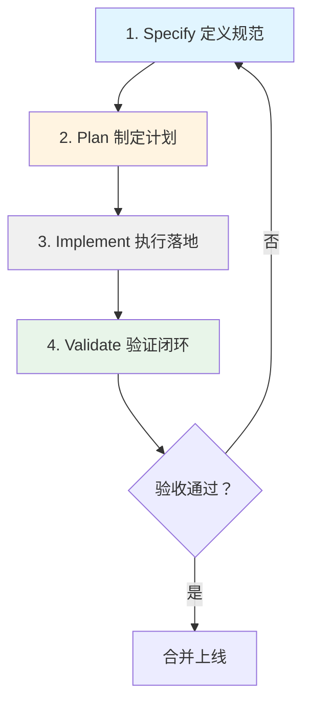
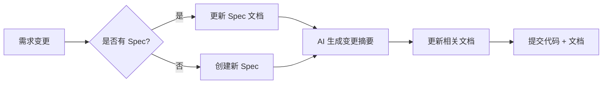
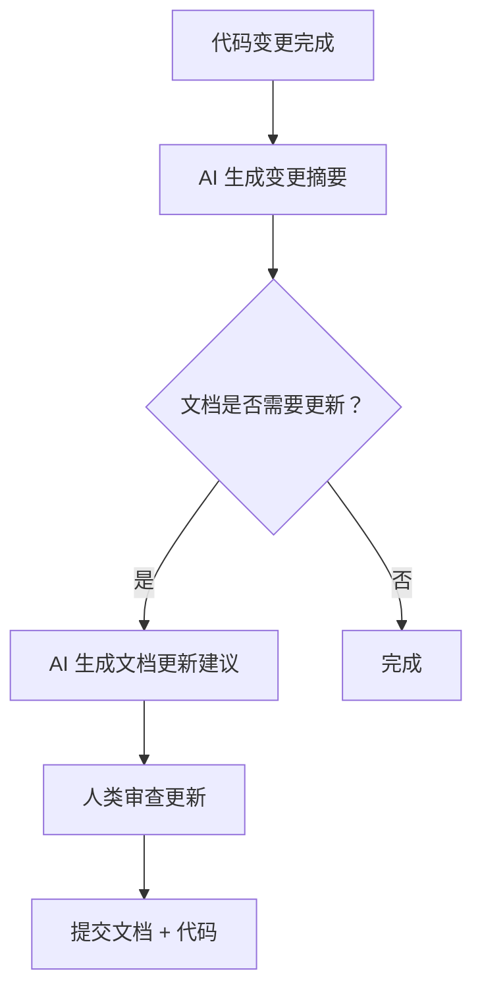

# 第 4 章：核心工作流与模式

---

## 4.1 SDD 四步工作流详解

### 4.1.1 工作流概览



**各阶段输入输出：**

| 阶段 | 输入 | 输出 | 参与角色 |
|------|------|------|----------|
| **Specify** | 需求描述、业务目标 | Spec 文档 | 人类主导，AI 辅助 |
| **Plan** | Spec 文档 | 任务列表 + 技术方案 | AI 主导，人类确认 |
| **Implement** | 任务列表 | 代码 + 单元测试 | AI 执行，人类监督 |
| **Validate** | 代码 + 测试用例 | 测试报告 + 变更摘要 | AI 执行，人类验收 |

---

### 4.1.2 阶段一：Specify（定义规范）

**目标：** 将人类模糊的想法转化为清晰、无歧义的结构化规范。

**核心活动：**

```
1. 需求讨论
   ↓
2. AI 提问澄清
   ↓
3. 人类确认理解
   ↓
4. 生成 Spec 文档
   ↓
5. 人类 Sign-off
```

**Spec 文档结构：**

```markdown
# [功能名称] Spec 文档

## 1. 功能目标
- **背景：** 为什么要做这个功能
- **目标：** 功能要实现的具体目标
- **成功指标：** 如何衡量功能成功

## 2. 需求范围
### 2.1 In Scope（包含）
- [需求 1]
- [需求 2]

### 2.2 Out of Scope（不包含）
- [排除项 1]
- [排除项 2]

## 3. 接口契约
### 3.1 输入
- [输入参数 1]：[类型]，[说明]
- 边界条件：[如"用户名为空时返回 400"]

### 3.2 输出
- [返回值/响应]：[类型]，[说明]
- 错误码：[如"401: 未授权"]

## 4. 验收标准（Acceptance Criteria）
- [ ] AC1: [条件描述]
- [ ] AC2: [条件描述]

## 5. 技术设计
- 架构影响
- 数据模型
- API 设计

## 6. 变更记录
| 日期 | 版本 | 变更内容 | 作者 |
```

**人类职责：**
- 清晰描述需求背景和目标
- 提供相关业务上下文
- 指出关键约束条件
- 对 AI 生成的 Spec 进行 Sign-off

**AI 职责：**
- 主动提问澄清模糊点
- 复述需求确保理解一致
- 识别潜在的技术风险
- 生成结构化的 Spec 文档

**提示词示例：**

```
我要实现 [功能描述]。

背景：[业务背景]
目标：[要实现什么]
约束：[技术/时间/资源限制]

请先复述你的理解，然后提出任何需要澄清的问题。
确认理解无误后，生成一份完整的 Spec 文档。
```

---

### 4.1.3 阶段二：Plan（制定计划）

**目标：** AI 将 Spec"编译"成详细的技术方案和任务拆解列表。

**核心活动：**

```
1. AI 读取 Spec 文档
   ↓
2. 分析技术可行性
   ↓
3. 生成技术方案（含备选方案对比）
   ↓
4. 拆解为独立任务列表
   ↓
5. 预估每步复杂度和时间
   ↓
6. 人类确认计划
```

**任务列表结构：**

```markdown
# [功能名称] 实现计划

## 技术方案
- **推荐方案：** [方案 A]
- **备选方案：** [方案 B]
- **选择理由：** [为什么选 A]

## 任务分解
| 任务 ID | 任务描述 | 预估复杂度 | 依赖 |
|---------|----------|------------|------|
| TASK-001 | 创建数据库表结构 | 低 | 无 |
| TASK-002 | 实现 API 接口 | 中 | TASK-001 |
| TASK-003 | 编写单元测试 | 中 | TASK-002 |
| TASK-004 | 集成测试 | 低 | TASK-003 |

## 风险点
- [风险 1]：[应对方案]
- [风险 2]：[应对方案]
```

**人类职责：**
- 审查技术方案的合理性
- 确认任务优先级
- 识别 AI 可能遗漏的依赖关系

**AI 职责：**
- 生成技术方案（含备选对比）
- 拆解为独立可执行的任务
- 预估每步的复杂度和时间
- 指出可能的风险点

**提示词示例：**

```
Spec 文档已确认，请生成实现计划。

要求：
1. 拆解为独立的步骤（每步完成一个文件/模块）
2. 预估每步的复杂度
3. 指出可能的风险点

计划确认后，我会说"开始执行"，你再按步骤生成代码。
```

---

### 4.1.4 阶段三：Implement（执行落地）

**目标：** AI 按任务列表逐个执行，生成高质量代码。

**核心活动：**

```
1. AI 读取任务列表
   ↓
2. 按顺序执行每个任务
   ↓
3. 每完成一个任务，输出变更摘要
   ↓
4. 人类确认进度
   ↓
5. 继续下一个任务
```

**执行原则：**

| 原则 | 说明 | 实践要点 |
|------|------|----------|
| **分步执行** | 每步完成一个文件/模块 | 避免一次性生成大量代码 |
| **进度同步** | 每步完成后输出摘要 | 人类可随时介入审查 |
| **测试先行** | 先生成测试用例框架 | 确保代码可测试 |
| **自查机制** | AI 生成代码后先自查 | 识别明显问题 |

**变更摘要格式：**

```markdown
## 变更摘要 - TASK-002

### 修改文件
- `src/api/auth.ts`（新增）
- `src/types/auth.ts`（新增）

### 变更目的
- 实现用户登录 API
- 定义认证相关类型

### 影响范围
- 依赖 TASK-001 的数据库表结构
- 被 TASK-003 的测试用例依赖

### 特别注意
- 使用了 bcrypt 加密密码
- Token 有效期设置为 24 小时
```

**人类职责：**
- 监督进度
- 处理 AI 提出的问题
- 审查变更摘要

**AI 职责：**
- 按计划分步生成代码
- 保持与 Spec 一致
- 主动报告进度
- 生成变更摘要

---

### 4.1.5 阶段四：Validate（验证闭环）

**目标：** 根据 Spec 生成测试用例并执行，确保生成的代码与规范完全契合。

**核心活动：**

```
1. AI 读取 Spec 中的验收标准
   ↓
2. 生成对应的测试用例
   ↓
3. 执行测试
   ↓
4. 分析测试结果
   ↓
5. 修复失败的测试
   ↓
6. 生成测试报告
   ↓
7. 人类验收确认
```

**测试报告格式：**

```markdown
# [功能名称] 测试报告

## 测试概览
- **测试用例总数：** 15
- **通过：** 15
- **失败：** 0
- **跳过：** 0

## 验收标准验证
| AC ID | 测试用例 | 结果 |
|-------|----------|------|
| AC1 | test_user_login_success | ✅ 通过 |
| AC2 | test_user_login_invalid_credentials | ✅ 通过 |
| AC3 | test_user_login_empty_username | ✅ 通过 |

## 代码覆盖率
- **行覆盖率：** 92%
- **分支覆盖率：** 87%
- **函数覆盖率：** 95%

## 遗留问题
- [无/问题描述]
```

**人类职责：**
- 审查测试报告
- 确认验收标准全部通过
- 决定是否可以合并

**AI 职责：**
- 生成覆盖验收标准的测试用例
- 执行测试并分析结果
- 修复失败的测试
- 生成测试报告

---

## 4.2 上下文管理三步法

### 4.2.1 步骤一：需求理解与文件筛选

**目标：** 提取关键信息，识别相关文件。

**操作方法：**

```
1. 人类描述需求
   ↓
2. AI 复述理解，提出澄清问题
   ↓
3. AI 识别相关文件
   ↓
4. 生成文件清单
```

**文件清单示例：**

```markdown
## 本次任务相关文件

### 必读文档
- `docs/specs/user-auth/spec.md` - 用户认证 Spec
- `.claude/CLAUDE.md` - 项目规范
- `docs/main/TECH_STACK.md` - 技术栈说明

### 参考代码
- `src/api/` - API 目录结构
- `src/types/` - 类型定义
- `src/utils/auth.ts` - 认证工具函数

### 排除文件
- `node_modules/` - 依赖库
- `dist/` - 构建输出
- `.env` - 敏感配置
```

---

### 4.2.2 步骤二：.md 文档创建与维护

**目标：** 将上下文以文档形式固化，作为"外部化记忆"。

**核心文档类型：**

| 文档类型 | 用途 | 示例 |
|----------|------|------|
| **CLAUDE.md** | 项目规范与开发约定 | 技术栈、代码风格、对话规约 |
| **Spec 文档** | 功能规格说明 | 需求范围、接口定义、验收标准 |
| **技术上下文** | 技术方案与架构说明 | 架构决策、数据模型 |
| **变更记录** | 功能迭代历史 | 版本变更、影响范围 |

**文档维护原则：**



---

### 4.2.3 步骤三：主动引导式交互

**目标：** AI 基于现有代码分析技术栈并生成模板，主动引导人类确认。

**交互模式：**

```
1. AI 分析项目结构
   ↓
2. AI 识别技术栈
   ↓
3. AI 生成上下文模板
   ↓
4. 人类审查并补充
   ↓
5. 模板固化为文档
```

**AI 主动引导示例：**

```
我分析了项目结构，发现以下情况：

## 技术栈识别
- 前端：React 18 + TypeScript + Tailwind CSS
- 状态管理：Zustand
- 构建工具：Vite

## 缺失的上下文
我注意到以下文档尚未创建：
1. `docs/main/STATE_MANAGEMENT.md` - 状态管理规范
2. `docs/main/API_CONVENTIONS.md` - API 调用约定

是否需要我生成这些文档的模板？
```

---

## 4.3 文档维护机制

### 4.3.1 文档更新触发条件

| 触发条件 | 更新动作 | 责任人 |
|----------|----------|--------|
| **新增功能** | 创建新的 Spec 文档 | AI 生成，人类确认 |
| **修改现有功能** | 更新对应 Spec 文档和变更记录 | AI 生成变更摘要，人类审查 |
| **Bug 修复** | 在变更记录中注明 | AI 记录，人类确认 |
| **技术债务清理** | 更新架构文档 | AI 分析，人类决策 |
| **人员变动** | 更新项目联系方式 | 人类更新 |

### 4.3.2 文档同步更新流程



**变更摘要示例：**

```markdown
## 变更摘要 - 2026-04-01

### 代码变更
- 修改了 `src/api/auth.ts`
- 新增了 `src/hooks/useAuth.ts`

### 文档变更
- 更新了 `docs/specs/user-auth/spec.md` 第 3.2 节
- 更新了 `docs/main/API_CONVENTIONS.md`

### 变更原因
- 重构认证逻辑，分离业务逻辑和 API 调用
```

### 4.3.3 文档质量检查清单

**每次文档更新后检查：**

- [ ] 文档与代码一致
- [ ] 变更记录完整
- [ ] 验收标准可测量
- [ ] 技术设计与架构一致
- [ ] 文档格式规范（Markdown 正确、代码块标注语言）

---

## 4.4 多应用文档策略

### 4.4.1 多应用场景定义

**典型多应用架构：**

```
monorepo/
├── apps/
│   ├── web/              # Web 应用
│   ├── mobile/           # 移动端应用
│   └── admin/            # 管理后台
├── packages/
│   ├── ui/               # 共享 UI 组件
│   ├── utils/            # 共享工具函数
│   └── api-client/       # 共享 API 客户端
└── docs/                 # 文档目录
```

### 4.4.2 三种文档策略

| 策略 | 说明 | 适用场景 | 文档结构 |
|------|------|----------|----------|
| **统一模式** | 所有应用共享一套文档 | 应用间高度耦合 | `docs/` 根目录统一 |
| **分离模式** | 每个应用独立文档 | 应用相对独立 | `apps/x/docs/` |
| **混合模式** | 核心共享 + 应用独立 | 大部分共享 + 部分独立 | `docs/` + `apps/x/docs/` |

### 4.4.3 混合模式文档结构

```
monorepo/
├── docs/                     # 共享文档
│   ├── ARCHITECTURE.md       # 整体架构
│   ├── SHARED_COMPONENTS.md  # 共享组件
│   └── API_CONVENTIONS.md    # API 约定
│
├── apps/
│   ├── web/
│   │   ├── docs/             # Web 应用文档
│   │   │   ├── ROUTES.md     # 路由结构
│   │   │   └── FEATURES.md   # 功能说明
│   │   └── src/
│   │
│   └── mobile/
│       ├── docs/             # 移动端文档
│       │   ├── NAVIGATION.md # 导航结构
│       │   └── FEATURES.md   # 功能说明
│       └── src/
```

### 4.4.4 文档引用规范

**跨应用引用：**

```markdown
# Web 应用功能说明

## 架构说明
整体架构参考 [ARCHITECTURE.md](../../docs/ARCHITECTURE.md)

## 共享组件
使用 [@repo/ui](../../packages/ui) 中的组件

## 认证流程
参考 [用户认证 Spec](../../docs/specs/user-auth/spec.md)
```

---

*第 4 章完成 | 下一步：第 5 章 技术栈与工具*
