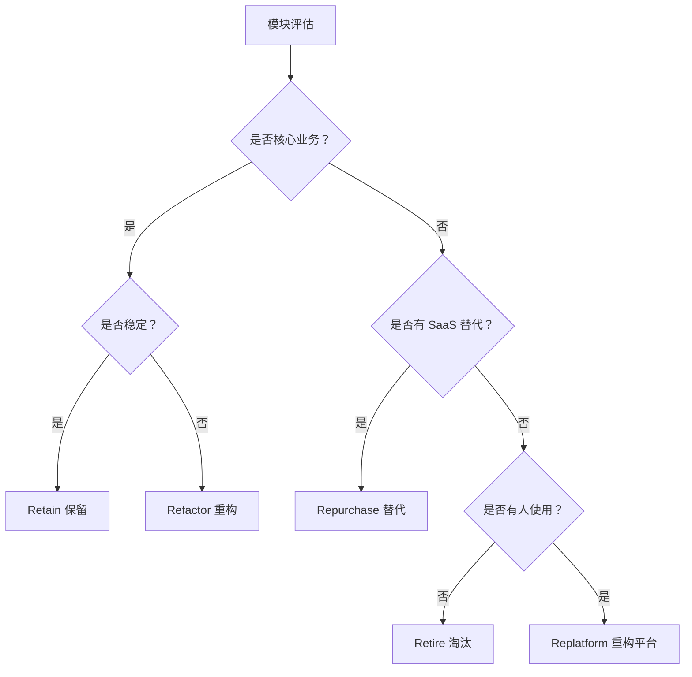
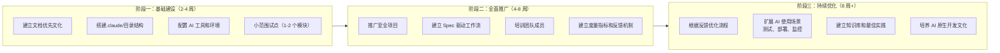

# 第 6 章：迁移策略

---

## 6.1 6R 迁移策略

参考 Gartner 与 NTT Data 的云迁移 6R 策略，传统项目 AI 化改造可采用以下策略：

| 策略 | 说明 | 适用场景 | AI 介入程度 |
|------|------|----------|-------------|
| **Retain（保留）** | 保持现状，暂不改造 | 核心稳定模块、即将下线功能 | 无 |
| **Rehost（重托部署）** | 迁移到新基础设施，不改代码 | 本地部署→云，物理机→容器 | AI 辅助部署脚本 |
| **Replatform（重构平台）** | 小幅修改适配新平台 | 框架版本升级、数据库迁移 | AI 生成适配代码 |
| **Refactor（重构代码）** | 代码层面优化重构 | 技术债务高、性能瓶颈模块 | AI 生成重构方案 + 执行 |
| **Repurchase（替代购买）** | 用 SaaS/第三方替代 | 通用功能（如支付、邮件） | AI 评估选型 + 集成 |
| **Retire（淘汰）** | 下线废弃功能 | 无人使用、冗余功能 | AI 分析使用日志 |

### 6.1.1 策略选择决策树



### 6.1.2 各策略详细操作

**Retain（保留）：**
- 适用：核心支付模块、经过充分验证的稳定代码
- 操作：标记为"免 AI 修改"，AI 只读参考
- 风险：过度保守可能错失优化机会

**Refactor（重构）：**
- 适用：技术债务高、测试覆盖率低的模块
- 操作：
  1. AI 分析代码复杂度
  2. 生成重构方案
  3. 人类审查方案
  4. AI 执行重构
  5. 增加测试覆盖
- 风险：重构范围失控，建议分模块进行

**Repurchase（替代）：**
- 适用：邮件发送、短信验证、支付处理等通用功能
- 操作：
  1. AI 评估市场 SaaS 方案
  2. 成本效益分析
  3. AI 辅助集成
- 风险：供应商锁定，需评估长期成本

---

## 6.2 三阶段迁移框架

### 6.2.1 框架概览



### 6.2.2 阶段一：基础建设详细计划

**第 1 周：环境准备**
- 安装 AI 工具（Claude Code、Cursor 等）
- 配置 MCP 服务（文件系统、数据库等）
- 创建 `.claude/` 目录结构
- 编写 CLAUDE.md 项目规范

**第 2 周：文档框架搭建**
- 创建 `docs/` 目录结构
- 编写 PRD.md（产品需求文档）
- 编写 TECH_STACK.md（技术栈文档）
- 编写 APP_FLOW.md（应用流程文档）

**第 3-4 周：小范围试点**
- 选择 1-2 个独立模块作为试点
- 执行完整的 SDD 工作流
- 收集反馈并调整流程
- 编写试点总结报告

**阶段一检查清单：**

- [ ] AI 工具安装完成
- [ ] MCP 服务配置完成
- [ ] `.claude/CLAUDE.md` 创建完成
- [ ] `docs/` 目录结构完整
- [ ] 试点模块选择确认
- [ ] 试点总结报告完成

### 6.2.3 阶段二：全面推广详细计划

**第 5-6 周：流程推广**
- 将试点经验推广至全项目
- 为每个功能建立 Spec 文档
- 建立 Spec→代码→测试的闭环

**第 7-8 周：培训与赋能**
- 组织 AI 工具使用培训
- 建立内部知识库
- 设立 AI Champion 角色

**第 9-12 周：度量与反馈**
- 建立提效度量指标
- 收集用户反馈
- 持续优化流程

**阶段二检查清单：**

- [ ] 全项目 Spec 文档覆盖
- [ ] 团队成员培训完成
- [ ] AI Champion 角色确立
- [ ] 度量指标定义完成
- [ ] 反馈机制建立

### 6.2.4 阶段三：持续优化详细计划

**第 13-20 周：流程优化**
- 根据反馈调整 Spec 模板
- 优化 AI 工具配置
- 简化不必要的流程

**第 21-24 周：场景扩展**
- AI 辅助测试生成
- AI 辅助部署脚本
- AI 辅助监控告警

**第 25 周+：文化建设**
- 建立知识库和最佳实践
- 定期技术分享
- 培养 AI 原生开发文化

**阶段三检查清单：**

- [ ] 流程优化完成
- [ ] 测试覆盖率提升到 80%+
- [ ] 部署脚本 AI 化
- [ ] 知识库初具规模
- [ ] 团队 AI 文化形成

---

## 6.3 组织准备度评估

### 6.3.1 团队 AI readiness 检查清单

**管理层支持：**
- [ ] 有明确的 AI 采用战略
- [ ] 有资源投入（工具采购、培训时间）
- [ ] 管理层理解 AI 的局限性

**培训体系：**
- [ ] 有 AI 工具使用培训计划
- [ ] 有知识分享机制
- [ ] 有内部文档和教程

**安全合规：**
- [ ] 有代码安全审查流程
- [ ] 有数据隐私保护流程
- [ ] 有 AI 生成代码的版权政策

**度量指标：**
- [ ] 定义了 AI 提效的 KPI
- [ ] 有基线数据用于对比
- [ ] 有定期评估机制

**变更管理：**
- [ ] 有应对工作流程变化的预案
- [ ] 有员工抵触情绪的疏导机制
- [ ] 有试点失败的回滚方案

### 6.3.2 评估评分标准

**每个维度 1-5 分：**

| 分数 | 说明 |
|------|------|
| **5 分** | 完全准备就绪，可全面推进 |
| **4 分** | 大部分准备就绪，可开始试点 |
| **3 分** | 基础准备完成，需要加强培训 |
| **2 分** | 准备不足，建议先补齐基础 |
| **1 分** | 未准备，不建议开始迁移 |

**评估结果解读：**

| 总分 | 建议 |
|------|------|
| **20-25 分** | 全面接入，快速推进 |
| **15-19 分** | 分阶段接入，先试点后推广 |
| **<15 分** | 先进行基础建设，再考虑 AI 接入 |

### 6.3.3 技术栈兼容性评估

**主流技术栈 AI 工具支持度：**

| 技术栈 | 支持度 | 推荐工具 | 注意事项 |
|--------|--------|----------|----------|
| **Java/Spring** | ⭐⭐⭐⭐⭐ | Claude Code、CodeBuddy | 企业级项目首选 |
| **Python/Django** | ⭐⭐⭐⭐⭐ | Claude Code、Cursor | AI 工具训练数据丰富 |
| **Node.js/React** | ⭐⭐⭐⭐⭐ | Claude Code、Windsurf | 前端生态完善 |
| **Go** | ⭐⭐⭐⭐ | Claude Code、Cursor | 后端服务适用 |
| **.NET** | ⭐⭐⭐⭐ | VS 2026 + Copilot | 微软生态整合好 |
| **PHP** | ⭐⭐⭐ | Cursor、Copilot | 老项目迁移需注意 |

---

## 6.4 常见迁移路径示例

### 6.4.1 路径 A：从零开始的新项目

```
项目启动 → project-start 初始化 → 文档优先系统建立 → AI Coding 开发
```

**时间估算：**
- project-start 初始化：1-2 天
- 文档优先系统建立：3-5 天
- AI Coding 开发：按项目规模

**适用场景：**
- 创业公司新项目
- 企业内部创新项目
- 个人项目

### 6.4.2 路径 B：已有文档的老项目

```
读取现有文档 → 补充缺失内容 → 建立 Spec 驱动工作流 → AI 辅助开发
```

**时间估算：**
- 读取现有文档：1-2 天
- 补充缺失内容：3-7 天
- 建立 Spec 驱动工作流：1-2 周

**适用场景：**
- 有完整文档的传统项目
- 刚刚完成文档更新的项目

### 6.4.3 路径 C：无文档的老项目

```
代码理解与分析 → AI 辅助生成文档 → 建立 Spec 驱动流程 → AI 辅助开发
```

**时间估算：**
- 代码理解与分析：1-2 周
- AI 辅助生成文档：2-3 周
- 建立 Spec 驱动流程：1-2 周

**适用场景：**
- 技术债务高的老项目
- 文档缺失的长期维护项目

### 6.4.4 路径 D：Monorepo 多应用项目

```
工作区检测 → 分应用扫描 → 制定多应用文档策略 → 分阶段迁移
```

**时间估算：**
- 工作区检测：1 天
- 分应用扫描：3-5 天
- 制定多应用文档策略：2-3 天
- 分阶段迁移：按应用数量

**适用场景：**
- Monorepo 架构项目
- 多应用共享代码库
- 微服务架构

---

*第 6 章完成 | 下一步：第 7 章 实战案例*
