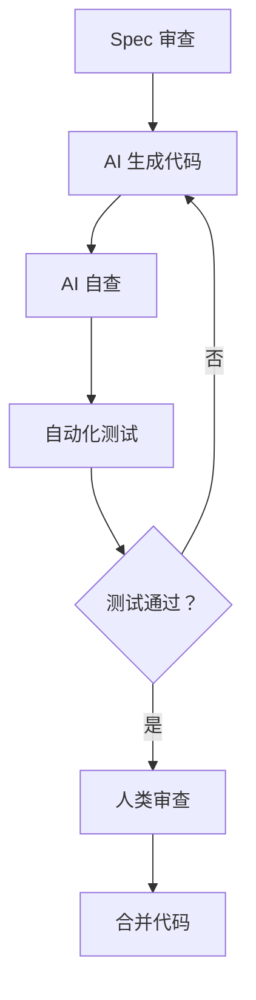
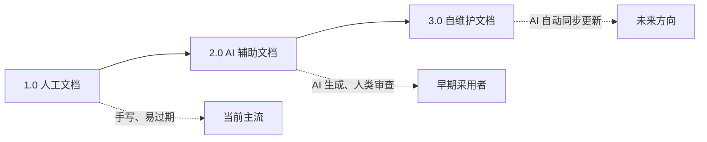

# 第 8 章：常见问题与未来演进

---

## 8.1 技术类问题

### Q1：老项目没有文档，如何开始？

**A：** 采用逆向文档生成策略：

```
步骤 1：让 AI 阅读代码，分析技术栈和结构
步骤 2：生成初步的技术文档
步骤 3：人类审查补充业务逻辑
步骤 4：从下一个需求开始执行 SDD 流程
```

**工具推荐：** 使用 `project-migration` Skill 自动执行逆向文档生成。

**时间估算：**
- AI 分析代码：1-3 天（取决于代码规模）
- 生成初始文档：1-2 天
- 人类审查补充：2-5 天

---

### Q2：AI 生成的代码与 Spec 不一致怎么办？

**A：**

```
步骤 1：要求 AI 重新阅读 Spec
步骤 2：指出具体不一致的地方
步骤 3：让 AI 解释为什么这样实现
步骤 4：必要时重新规划实现步骤
```

**预防措施：**
- Spec 验收标准要具体、可测量
- 实现前让 AI 复述理解
- 分步执行，每步确认

---

### Q3：上下文太长，AI 无法完整理解怎么办？

**A：**

**策略 1：建立上下文索引**
```markdown
# CONTEXT.md - 项目上下文索引

## 核心文档
- [CLAUDE.md](./.claude/CLAUDE.md) - 项目规范
- [TECH_STACK.md](./docs/main/TECH_STACK.md) - 技术栈

## 当前迭代
- [Sprint-001.md](./docs/specs/sprint-001.md) - 当前迭代计划

## 活跃功能
- [feature-a](./docs/specs/feature-a/spec.md) - 功能 A
```

**策略 2：使用引用文件**
```markdown
在 Spec 文档中引用其他文档：
参考 [TECH_STACK.md](../../main/TECH_STACK.md) 中定义的 API 规范。
```

**策略 3：定期清理上下文**
- 合并已完成的 Spec 到变更记录
- 归档过时的文档
- 保持上下文精炼

---

### Q4：如何保证 AI 生成的代码质量？

**A：**

**质量保障体系：**



**具体措施：**
1. **Spec 审查** — 确保需求清晰、无歧义
2. **AI 自查** — AI 生成代码后先自我审查
3. **自动化测试** — 根据 Spec 生成测试用例
4. **人类审查** — 关注核心逻辑和边界情况

---

## 8.2 流程类问题

### Q5：团队成员抵触 AI 工具怎么办？

**A：**

**原因分析：**
- 担心被替代的焦虑
- 对新工具的学习成本抵触
- 过去使用体验不佳

**解决方案：**

| 方案 | 具体操作 | 预期效果 |
|------|----------|----------|
| **培训赋能** | 组织 AI 工具使用培训，展示提效案例 | 降低学习成本 |
| **小步快跑** | 从小功能开始，建立信心 | 积累成功体验 |
| **AI Champion** | 设立 AI Champion 角色，带动氛围 | 同伴影响 |
| **激励机制** | 奖励优秀实践，如"最佳 Spec 奖" | 正向强化 |

---

### Q6：Spec 文档写得太细/太粗怎么办？

**A：**

**Spec 太细的问题：**
- AI 失去发挥空间，代码僵化
- 维护成本高，每次变更都要改 Spec

**解决方案：**
- 只写"做什么"，不写"怎么做"
- 给 AI 留出技术选型空间
- 约束边界，不约束实现细节

**Spec 太粗的问题：**
- AI 无法准确理解需求
- 生成代码偏离预期

**解决方案：**
- 补充验收标准，用具体场景约束范围
- 增加 In/Out Scope 说明
- 添加边界条件和错误处理要求

**原则：**
> Spec 要能让独立的开发者/AI 理解需求并实现

---

### Q7：如何保证文档与代码同步更新？

**A：**

**机制保障：**

| 机制 | 操作方式 | 执行频率 |
|------|----------|----------|
| **纳入 DoD** | 文档未更新=任务未完成 | 每次迭代 |
| **AI 辅助** | AI 生成代码时同步生成变更摘要 | 每次提交 |
| **审查检查** | 合并前检查文档是否更新 | 每次 PR |
| **定期审计** | 定期扫描文档与代码一致性 | 每月/每季度 |

**工具支持：**
- CI 检查：文档变更必须与代码变更关联
- AI 提醒：检测到代码变更时提示更新文档

---

### Q8：如何选择合适的 AI 工具？

**A：**

**选择维度：**

| 维度 | 考虑因素 | 推荐 |
|------|----------|------|
| **项目类型** | 新项目/老项目、前端/后端 | 新项目→Claude Code，老项目→Cursor |
| **团队规模** | 个人/小团队/企业 | 企业→CodeBuddy，个人→Cursor |
| **技术栈** | Java/Python/Node.js | Java→CodeBuddy，Node.js→Claude Code |
| **预算** | 免费/付费 | 免费→Cursor 基础版，付费→Claude Pro |
| **安全要求** | 数据隐私、私有化部署 | 高安全→私有化部署方案 |

---

## 8.3 安全与合规问题

### Q9：AI 工具会泄露代码吗？

**A：**

**风险评估：**

| 工具类型 | 风险等级 | 说明 |
|----------|----------|------|
| **SaaS 工具** | 中 | 代码上传到云端，依赖厂商信誉 |
| **本地部署** | 低 | 代码不出内网，安全性高 |
| **开源工具** | 低 | 可审计代码，但需自行维护 |

**防护措施：**

1. **选择企业级工具** — 如私有化部署的 CodeBuddy
2. **配置代码脱敏规则** — 敏感信息不传给 AI
3. **敏感模块禁用 AI** — 核心算法、加密逻辑等
4. **定期审查合规性** — 审计 AI 工具的日志和行为

---

### Q10：AI 生成的代码有版权问题吗？

**A：**

**当前法律状况：**
- 目前法律尚不明确
- 各国立法进度不同
- 开源许可证适用性存在争议

**建议措施：**

| 措施 | 说明 |
|------|------|
| **人类审查** | 重要代码人类审查，避免直接复制 |
| **避免开源代码** | 避免 AI 直接生成受版权保护的代码 |
- **建立审查流程** | 内部 AI 代码审查流程 |
| **记录生成历史** | 保留 Spec 文档和 AI 对话记录 |

---

## 8.4 未来演进

### 8.4.1 短期趋势（1-2 年）

| 趋势 | 说明 | 影响 |
|------|------|------|
| **AI 工具集成度提升** | AI 深度集成到 IDE 和 DevOps 工具链 | 使用体验更流畅 |
| **Spec 驱动成为主流** | 更多团队采用 SDD 工作流 | 文档质量整体提升 |
| **上下文窗口继续扩大** | 从 200K 扩展到 1M+ | AI 理解更完整 |
| **多 Agent 协作成熟** | 多个 AI Agent 分工合作 | 复杂任务处理能力增强 |

### 8.4.2 中期趋势（3-5 年）

| 趋势 | 说明 | 影响 |
|------|------|------|
| **AI 自主性增强** | AI 能够独立规划和执行复杂任务 | 人类角色进一步转变 |
| **代码生成质量接近人类** | AI 生成的代码质量与人类相当 | 审查重点转向架构设计 |
| **文档自动生成** | AI 根据代码自动生成和更新文档 | 文档维护成本大幅降低 |
| **AI 原生开发文化形成** | 新一代开发者以 AI 协作为默认模式 | 开发范式彻底改变 |

### 8.4.3 长期展望（5-10 年）

**人类开发者角色的转变：**

```
传统开发者 → AI 辅助开发者 → AI 协作开发者 → AI 监督者
    ↓              ↓              ↓            ↓
 手写代码     AI 补全代码    AI 生成代码    AI 自主开发
             人类审查       人类设计       人类验收
```

**核心能力的转变：**

| 能力 | 传统开发 | AI 时代开发 |
|------|----------|-------------|
| **核心能力** | 编程技能、算法知识 | 需求定义、架构设计、结果验证 |
| **沟通方式** | 与人类沟通 | 与 AI 沟通、引导 AI |
| **工作重心** | 写代码 | 定义问题、审查结果 |
| **学习重点** | 语言语法、框架 API | 系统设计、AI 引导技巧 |

### 8.4.4 文档优先的演进

**文档优先 1.0 → 2.0 → 3.0：**



**3.0 自维护文档的特征：**
- AI 实时分析代码变更
- 自动更新相关文档
- 文档与代码始终保持一致
- 人类只需审查关键变更

---

## 8.5 总结

文档优先开发范式是 AI 时代软件工程的必然演进方向。它通过建立文档锚点、Spec 驱动工作流、 Harness Engineering 等机制，系统性解决了 AI 编程的三大痛点（上下文腐烂、审查瘫痪、维护断层）。

**核心价值：**
- **返工率下降 78%** — 需求理解偏差大幅减少
- **审查时间缩短 65%** — Spec 驱动提高审查效率
- **新人上手时间缩短 50%** — 文档完善降低学习成本

** adoption 建议：**
1. **从小处着手** — 选择试点模块，积累经验
2. **持续优化** — 根据反馈调整流程
3. **文化建设** — 培养 AI 原生开发文化

**未来展望：**
> 文档优先不是终点，而是 AI 时代软件工程新范式的起点。随着 AI 能力的持续演进，人类开发者将从"代码编写者"转变为"系统架构师 +AI 监督者"，专注于更高价值的创造性工作。

---

*第 8 章完成 | 文档优先开发范式核心知识体系 完整草稿完成*
