# Spec-First 核心知识体系

> **副标题**：AI 时代的规范驱动开发方法论
>
> **版本**：v1.0.0
>
> **创建时间**：2026-04-06
>
> **作者**：Kei

---

## 目录

- [第 1 章 概述：为什么需要规范优先](#第 1 章-概述为什么需要规范优先)
- [第 2 章 核心概念与定义](#第 2 章-核心概念与定义)
- [第 3 章 规范优先的理论基础](#第 3 章-规范优先的理论基础)
- [第 4 章 规范驱动开发 SDD 全流程](#第 4 章-规范驱动开发-sdd-全流程)
- [第 5 章 规范的载体与工具](#第 5 章-规范的载体与工具)
- [第 6 章 AI 时代的 Spec-First 实践](#第 6 章-ai-时代的-spec-first-实践)
- [第 7 章 实战案例与最佳实践](#第 7 章-实战案例与最佳实践)
- [第 8 章 常见问题与未来演进](#第 8 章-常见问题与未来演进)

---

## 第 1 章 概述：为什么需要规范优先

> **核心问题**：在 AI 生成代码能力日益强大的今天，为什么我们反而更需要"先立规矩再动手"？

---

### 1.1 从 Vibe Coding 到 Spec Coding 的演进

#### 1.1.1 Vibe Coding 的诞生与局限

**概念定义：**

2025 年 2 月，前 OpenAI 研究员、AI 领域知名人物 Andrej Karpathy 在社交媒体上提出了 **Vibe Coding（氛围编程）** 的概念，用来描述一种新兴的 AI 辅助编程状态：

> "我发明了一种新的编程方式，我称之为'氛围编程'。你完全沉浸在氛围之中，拥抱指数级增长，甚至忘记代码的存在……我总是'全部接受'，不再看差异对比。遇到错误信息时，我直接复制粘贴进去，不加任何注释，通常这样就能解决问题。"

**Vibe Coding 的核心特征：**

| 特征 | 描述 |
|------|------|
| **提示词驱动** | 开发者用自然语言描述需求，AI 直接生成代码 |
| **低审查度** | 对 AI 生成的代码不做详细审查，直接接受 |
| **试错迭代** | 遇到错误→复制给 AI→等待修复→循环 |
| **快速原型** | 几分钟内从想法到可运行的代码 |

**Vibe Coding 的价值与局限：**

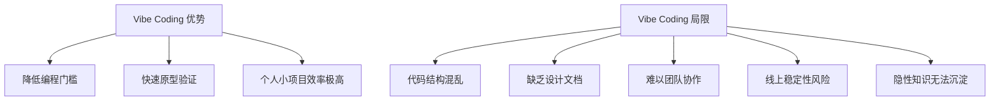

**为什么 Vibe Coding 不适合企业级开发：**

1. **信息差问题**：大模型和开发者之间存在大量隐性信息差
   - 项目中使用了许多非公开的技术框架
   - 每个团队有自己的代码规范和约束
   - 历史债务和架构决策未被 AI 知晓

2. **可控性问题**：不加限制的 Vibe Coding 对于线上稳定性是一个挑战
   - AI 可能引入不符合安全规范的代码
   - 性能边界条件未被考虑
   - 缺乏测试覆盖的验证

3. **协作问题**：纯对话式交付难以复现和审查
   - 需求变更记录在对话历史中，无法追溯
   - 团队成员无法基于同一份文档协作
   - 新人接手项目时无文档可读

---

#### 1.1.2 Spec Coding 的提出

**概念起源：**

2025 年 6 月，在 AIEWF 2025 大会上，OpenAI 研究员 **Sean Grove** 提出了一个关键观点：**Spec（规约）比代码更重要**。

**核心类比：**

> "高级语言通过编译器编译成二进制产物，重要的是高级语言代码，而二进制产物我们可以随时通过编译器生成。Spec 就像是高级语言代码，而 AI 就像是编译器，我们随时可以使用一个 Spec，通过 AI 来生成代码。"

**Spec Coding 的核心主张：**

| 主张 | 说明 |
|------|------|
| **Spec 是单一事实源** | 需求、设计、验收标准都记录在 Spec 中 |
| **代码是 Spec 的输出** | 代码由 AI 根据 Spec 生成，可随时重新生成 |
| **人类审查 Spec** | 工程师通过审查和修改 Spec 实现对 AI 编码行为的控制 |
| **文档永不过期** | Spec 与代码同步更新，始终保持一致 |

---

#### 1.1.3 2026 年的新范式：渐进式 Spec

根据 2026 年最新行业实践，Spec-First 发展出三个递进层次：

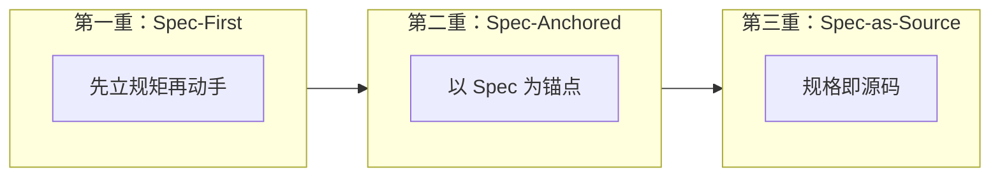

**三层次详解：**

| 层次 | 名称 | 核心特征 | 人类职责 | AI 职责 |
|------|------|----------|----------|--------|
| **第一重** | Spec-First（规范优先） | 先立规矩再动手 | 编写 Spec、审查生成结果 | 按 Spec 生成代码 |
| **第二重** | Spec-Anchored（规范锚定） | 以 Spec 为锚点 | 维护 Spec、验收变更 | 根据 Spec 更新代码 |
| **第三重** | Spec-as-Source（规格即源码） | 规格即源码 | 纯粹维护 Spec | 代码完全由 Spec 自动生成 |

**业界实践状态（2026 年）：**

- **主流实践**：处于 Spec-First 到 Spec-Anchored 阶段
- **激进探索**：Tessl 等工具正在探索 Spec-as-Source
- **工具支持**：GitHub spec-kit、Amazon Kiro 均支持 Spec-First 工作流

---

### 1.2 Spec-First 的定义与核心价值

#### 1.2.1 什么是 Spec-First

**概念定义：**

**Spec-First（规范优先）** 是一种软件开发方法论，核心主张是：

> 在编写任何代码之前，先编写结构化的、可验证的规范文档（Specification），并将该规范作为 AI 辅助开发的核心输入和单一事实源。

**Spec-First 的核心公式：**

```
Spec-First = 结构化规范 + AI 生成 + 人类审查 + 持续对齐
```

**Spec-First 与传统开发的本质区别：**

| 维度 | 传统开发 | Spec-First 开发 |
|------|----------|-----------------|
| **起点** | 需求文档 → 手写代码 | 结构化 Spec → AI 生成代码 |
| **事实源** | 代码是唯一真理 | Spec 是单一事实源 |
| **文档状态** | 文档很快过期 | Spec 与代码同步演进 |
| **变更流程** | 直接修改代码 | 先修改 Spec，再重新生成 |
| **人类角色** | 编码者 | 规格设计师 + 审查者 |

---

#### 1.2.2 Spec-First 的核心价值

**1. 意图驱动，避免偏离**

传统 AI 编程中，开发者需要不断提醒 AI 不要偏离方向。Spec-First 通过将意图写入 Spec，让 AI 始终在可控轨道上运行。

**2. 上下文可传递，协作更高效**

Spec 作为团队共享的单一事实源，新成员可通过阅读 Spec 快速理解系统设计，无需阅读大量对话历史。

**3. 变更可追溯，维护更轻松**

需求变更时，先修改 Spec，再生成代码。Spec 的版本历史就是需求的演进历史。

**4. 质量可验证，测试内建**

Spec 中包含验收标准，每条需求都可被验证。测试用例可从 Spec 自动生成。

**5. 文档永不过期**

Spec 与代码同步更新，不存在文档与代码脱节的问题。

---

### 1.3 Spec-First 解决的工程痛点

#### 1.3.1 痛点 1：需求与实现脱节

**问题描述：**

在传统开发中，需求文档（PRD）写完就没人看，代码实现与原始需求渐行渐远。

**Spec-First 方案：**

```
传统模式：
需求文档 → 开发人员理解 → 手写代码 → (文档过期)
              ↓
         理解偏差导致实现跑偏

Spec-First 模式：
结构化 Spec → AI 理解 → 生成代码 → Spec 与代码同步更新
              ↓
         Spec 作为验收标准，确保实现不偏离
```

---

#### 1.3.2 痛点 2：上下文缺失

**问题描述：**

开发者"边写边想"，AI 工具缺乏全局理解，只能基于局部提示生成代码。

**Spec-First 方案：**

Spec 包含完整的上下文信息：
- 业务目标（为什么做）
- 用户故事（谁用、怎么用）
- 架构约束（技术栈、依赖、性能要求）
- 验收标准（如何验证完成）

AI 基于完整 Spec 生成代码，而非零散提示。

---

#### 1.3.3 痛点 3：低效的试错循环

**问题描述：**

Vibe Coding 模式下，开发者陷入"生成 - 调试 - 修改 - 再生成"的循环，大量时间浪费在修复 AI 的误解上。

**Spec-First 方案：**

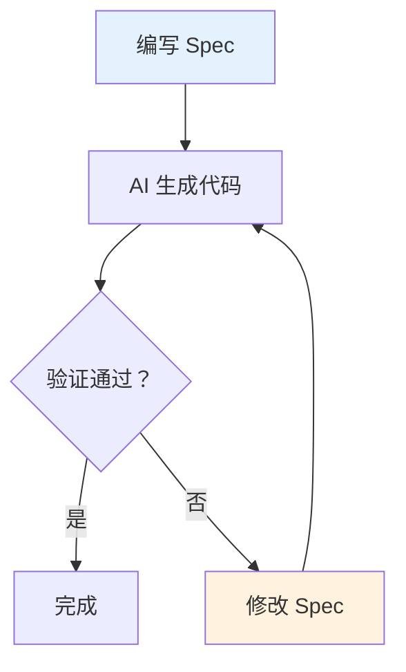

**关键改进：**
- 试错发生在 Spec 层面（修改自然语言）
- 而非代码层面（手动修复 AI 生成的代码）
- Spec 的修改成本远低于代码修改

---

#### 1.3.4 痛点 4：维护成本高昂

**问题描述：**

需求变更时，需要人工遍历修改多处代码，容易遗漏或引入 Bug。

**Spec-First 方案：**

```
变更流程：
1. 修改 Spec（单一位置）
2. AI 根据新 Spec 重新生成代码
3. 运行测试验证变更
4. 审查差异，确认无误
```

**优势：**
- 变更逻辑集中在 Spec 中
- 代码变更由 AI 自动完成
- 测试用例自动验证回归

---

### 1.4 适用场景与局限性

#### 1.4.1 推荐使用场景

| 场景 | 说明 | 理由 |
|------|------|------|
| **企业级项目** | 多人协作、长期维护的系统 | Spec 确保协作一致性和知识传承 |
| **复杂业务逻辑** | 需求复杂、边界条件多的功能 | Spec 帮助 AI 理解业务约束 |
| **合规敏感系统** | 金融、医疗等需要审计的行业 | Spec 提供可追溯的需求 - 实现链路 |
| **AI 辅助开发** | 使用 Claude Code、Cursor 等工具 | Spec 提升 AI 生成代码的可用性 |
| **历史代码重构** | 需要理解现有系统并逐步迁移 | Spec 帮助记录架构决策和变更 |

---

#### 1.4.2 不推荐场景

| 场景 | 说明 | 理由 |
|------|------|------|
| **简单脚本** | 一次性数据处理、临时工具 | Spec  overhead 超过收益 |
| **紧急 Bug 修复** | 生产环境需要立即修复 | 直接修复代码更高效 |
| **个人原型验证** | 快速验证想法，不追求质量 | Vibe Coding 足够满足需求 |
| **高度探索性功能** | 需求本身不明确，需要边写边想 | Spec 难以预先定义 |

---

#### 1.4.3 Spec-First 的局限性

**1. 学习曲线**

开发者需要从"编码者"转变为"规格设计师"，需要学习：
- 如何编写结构化的 Spec
- 如何定义可验证的验收标准
- 如何审查 AI 生成的代码

**2. 工具链不成熟**

当前 Spec-First 工具链仍处于早期阶段：
- GitHub spec-kit、Amazon Kiro 等工具功能有限
- Spec 与代码的双向同步机制不完善
- 缺乏统一的 Spec 格式标准

**3. 不适用于所有项目**

- 小型项目、个人项目：Spec overhead 可能超过收益
- 高度探索性功能：需求不明确时难以编写 Spec

---

### 1.5 本章小结

**核心要点回顾：**

| 要点 | 说明 |
|------|------|
| **演进背景** | 从 Vibe Coding 的混乱到 Spec Coding 的规范 |
| **核心定义** | Spec-First = 先写规范，再写代码 |
| **三层次模型** | Spec-First → Spec-Anchored → Spec-as-Source |
| **解决痛点** | 需求脱节、上下文缺失、试错循环、维护成本高 |
| **适用场景** | 企业级项目、复杂业务、AI 辅助开发 |

**关键洞察：**

> Spec-First 不是要消灭编程，而是将开发者的注意力从语法细节转移到系统设计层面。在 AI 时代，**"写什么"比"怎么写"更重要**。

---

### 本章引用来源

| # | 来源 | 类型 |
|---|------|------|
| 1 | CSDN - 2026 年 AI 编程新范式："渐进式 Spec" | 技术博客 |
| 2 | 腾讯云 - 规范驱动开发 (SDD) 深入解析 | 技术博客 |
| 3 | 知乎 - Spec-Driven Development: 为混乱的 AI 编程增加工程纪律 | 技术社区 |
| 4 | 百度智能云 - 用 Spec 给 AI Agent 立规矩 | 官方文档 |
| 5 | GitHub - spec-kit 官方仓库 | 开源项目 |

---

*第 1 章完成 | 字数：约 3,500 字*

---

## 第 2 章 核心概念与定义

> **核心问题**：什么是 Spec？它在 Spec-First 开发中扮演什么角色？

---

### 2.1 什么是 Spec（规格/规范）

#### 2.1.1 概念定义

**Spec（Specification，规格/规范）** 在 Spec-First 开发范式中有特定含义：

> **Spec 是系统在某个阶段的"正式合同"**，明确规定了系统应该做什么、不应该做什么，以及如何验证。

**Spec 与传统文档的本质区别：**

| 维度 | 传统需求文档 | Spec（规格） |
|------|--------------|-------------|
| **定位** | 辅助文档，写完就归档 | 第一性产物，最具权威性 |
| **格式** | 自然语言散文 | 结构化、可解析的技术工件 |
| **用途** | 给人类阅读 | 人类 + AI 共同理解 |
| **生命周期** | 很快过时 | 持续演进，与代码同步 |
| **验证性** | 难以自动验证 | 可映射到测试用例 |

---

#### 2.1.2 Spec 的核心特征

一份合格的 Specification 必须具备以下特征：

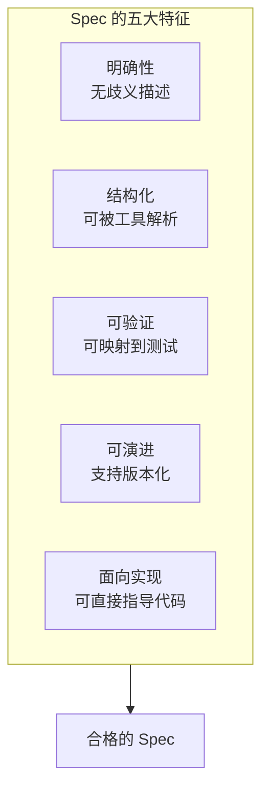

**详细说明：**

| 特征 | 说明 | 示例 |
|------|------|------|
| **明确性** | 对系统行为、约束、边界条件有明确描述 | ❌ "系统应该快速响应" → ✅ "API 响应时间 < 200ms (P95)" |
| **结构化** | 采用 Markdown/DSL/Schema 等格式，可被工具解析 | 使用标准模板、标签、语法 |
| **可验证** | 每条需求都可映射到测试用例 | "用户名字段：6-20 位字母数字" → 正则验证 + 边界测试 |
| **可演进** | 支持版本控制、Diff、回滚 | Spec 文件纳入 Git 管理 |
| **面向实现** | 能直接指导代码生成或人工实现 | Spec 中包含 API 定义、数据结构、错误码 |

---

#### 2.1.3 Spec 的标准结构

根据业界实践，一份完整的 Spec 通常包含以下要素：

```markdown
# [功能名称] 规格说明书

## 1. 目标与价值
- 解决什么问题
- 为谁解决问题
- 业务价值是什么

## 2. 上下文与约束
- 系统架构位置
- 技术栈约束
- 性能要求
- 安全要求

## 3. 功能需求
### 3.1 用户故事
- 作为 [角色]，我可以 [行为]，以便 [价值]

### 3.2 功能描述
- 输入/输出定义
- 核心处理逻辑
- 边界条件处理

## 4. 非功能需求
- 性能指标（响应时间、吞吐量）
- 安全要求（认证、授权、加密）
- 可用性要求（SLA、容错）

## 5. 接口定义
- API 端点
- 请求/响应格式
- 错误码定义

## 6. 测试标准
- 单元测试覆盖要求
- 集成测试场景
- 验收标准
```

---

### 2.2 Spec 作为单一事实源（Single Source of Truth）

#### 2.2.1 什么是"单一事实源"

**概念定义：**

**单一事实源（Single Source of Truth, SSOT）** 是指在整个项目或组织中，某个信息只在一个地方定义和维护，其他所有引用都指向这个源头。

**为什么需要 SSOT？**

在传统开发中，信息分散在多处：
- 需求文档（PRD）定义业务逻辑
- 代码实现具体功能
- 测试文档定义验证标准
- API 文档定义接口

**问题：** 当需求变更时，需要同时更新多处，很容易遗漏导致不一致。

---

#### 2.2.2 Spec 作为 SSOT 的架构

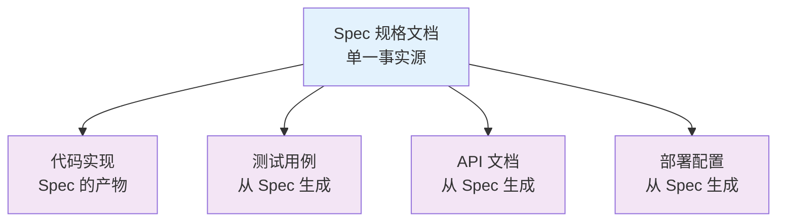

**Spec 作为 SSOT 的优势：**

| 优势 | 说明 |
|------|------|
| **一致性** | 所有产出物都源自同一份 Spec，天然一致 |
| **可追溯** | 从需求到实现到测试，完整链路可追溯 |
| **易维护** | 变更只需修改 Spec，其他自动同步 |
| **降成本** | 减少人工维护多处文档的成本 |

---

#### 2.2.3 权力反转：从"代码为王"到"规范为王"

**传统模式：**

```
需求 → 设计 → 手写代码 → (文档过期)
                        ↓
                   代码是唯一真理
                   文档很快过时
```

**Spec-First 模式：**

```
Spec 规格 → AI 生成 → 代码 + 测试 + 文档
    ↑
    └──── 持续对齐 ────┘
    
Spec 是单一事实源
代码是 Spec 的实现产物
```

**关键转变：**

| 转变 | 从 | 到 |
|------|---|---|
| **权威位置** | 代码 | Spec |
| **变更起点** | 修改代码 | 修改 Spec |
| **文档地位** | 辅助说明 | 核心资产 |
| **人类角色** | 编码者 | 规格设计师 |

---

### 2.3 Spec-First、Spec-Anchored、Spec-as-Source 三层次

#### 2.3.1 三层次模型详解

根据 ThoughtWorks 和业界实践，Spec-Driven Development 分为三个递进层次：

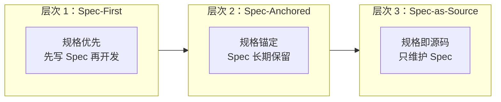

---

#### 2.3.2 层次 1：Spec-First（规格优先）

**定义：**

> 在启动任何编码任务前，先编写详尽的规格说明，再将其作为 AI 辅助开发的核心输入。

**核心特征：**

| 特征 | 说明 |
|------|------|
| **开发起点** | Spec 是开发的第一个产物 |
| **人类职责** | 编写 Spec、审查 AI 生成结果 |
| **AI 职责** | 按 Spec 生成代码 |
| **Spec 状态** | 开发完成后可能不再维护 |

**工作流程：**

```
1. 编写 Spec（聚焦"做什么"和"为什么"）
        ↓
2. AI 生成代码（基于 Spec）
        ↓
3. 人类审查（验证是否符合 Spec）
        ↓
4. 迭代修正（修改 Spec 或代码）
```

**适用场景：**

- 团队刚开始尝试 Spec-Driven 开发
- AI 生成代码质量不稳定，需要人工修复
- 项目需要一定文档，但不追求完全自动化

**典型工具：** GitHub spec-kit、Amazon Kiro

---

#### 2.3.3 层次 2：Spec-Anchored（规格锚定）

**定义：**

> 任务完成后不丢弃 Spec，将其长期保留并持续迭代，作为功能后续演进、Bug 修复的核心依据。

**核心特征：**

| 特征 | 说明 |
|------|------|
| **Spec 地位** | 功能的"数字档案"，长期维护 |
| **变更流程** | 先修改 Spec，再更新代码 |
| **可追溯性** | 通过 Spec 追溯原始意图和设计决策 |
| **一致性** | Spec 与代码保持同步 |

**工作流程：**

```
新需求/变更 → 修改 Spec → AI 更新代码 → 验证 → Spec 与代码同步更新
     ↑                                         ↓
     └───────────── 持续迭代 ──────────────────┘
```

**与 Spec-First 的关键区别：**

| 维度 | Spec-First | Spec-Anchored |
|------|------------|---------------|
| **Spec 生命周期** | 开发完成后可能丢弃 | 长期保留并迭代 |
| **变更起点** | 可能是代码或 Spec | 必须是 Spec |
| **维护成本** | 较低 | 较高（需保持同步） |
| **收益** | 开发阶段清晰 | 全生命周期受益 |

**适用场景：**

- 长期维护的项目
- 多人协作，需要知识传承
- 需求频繁变更，需要追溯历史

---

#### 2.3.4 层次 3：Spec-as-Source（规格即源码）

**定义：**

> Spec 成为项目的核心源文件，人类仅需维护和编辑 Spec，无需直接触碰代码——AI 会根据 Spec 自动生成、更新代码。

**核心特征：**

| 特征 | 说明 |
|------|------|
| **Spec 地位** | 唯一源文件，代码是派生产物 |
| **人类职责** | 纯粹维护 Spec |
| **AI 职责** | 完全自动生成代码 |
| **代码状态** | 标注 `// GENERATED FROM SPEC - DO NOT EDIT` |

**工作流程：**

```
┌─────────────────────────────────────┐
│  人类只编辑 Spec                     │
└──────────────┬──────────────────────┘
               ↓
┌─────────────────────────────────────┐
│  AI 自动生成：                        │
│  - 代码                              │
│  - 测试                              │
│  - 文档                              │
│  - 部署配置                          │
└─────────────────────────────────────┘
```

**关键使能技术：**

1. **双向同步引擎**：Spec 变更自动同步到代码
2. **差异检测器**：验证 Spec 与代码的语义一致性
3. **形式化验证**：使用数学方法证明实现符合 Spec

**适用场景：**

- 高度标准化的领域（如 API 开发）
- 对一致性要求极高的系统
- AI 生成质量足够可靠的场景

**代表工具：** Tessl Framework

---

#### 2.3.5 三层次对比总结

| 维度 | Spec-First | Spec-Anchored | Spec-as-Source |
|------|------------|---------------|----------------|
| **Spec 地位** | 开发起点 | 长期锚点 | 唯一源码 |
| **人类职责** | 写 Spec + 审代码 | 维护 Spec + 审代码 | 只维护 Spec |
| **代码地位** | 需人工维护 | 需与 Spec 同步 | 自动生成，不可编辑 |
| **适用阶段** | 入门尝试 | 成熟实践 | 理想状态 |
| **工具成熟度** | 高（spec-kit、Kiro） | 中 | 低（Tessl 探索中） |

**业界状态（2026 年）：**

- **主流实践**：处于 Spec-First 到 Spec-Anchored 阶段
- **激进探索**：Tessl 等工具正在探索 Spec-as-Source
- **趋势判断**：Spec-Anchored 可能是未来 3-5 年的主流

---

### 2.4 Spec 与代码的关系重构

#### 2.4.1 传统关系：代码为王

在传统软件开发中：

```
需求 → 设计 → 编码 → 测试 → 部署
       ↓
   文档可能过时
       ↓
   代码是唯一真理
```

**问题：**

- 需求变更直接修改代码，文档不更新
- 新人接手项目只能读代码理解系统
- 设计决策和意图无法追溯

---

#### 2.4.2 Spec-First 关系：规范为王

在 Spec-First 开发中：

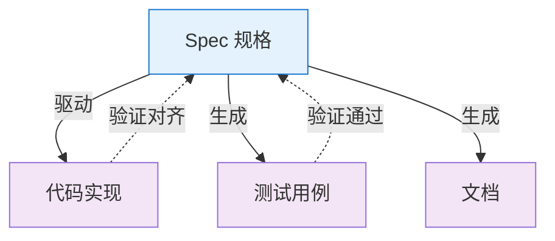

**新关系的核心原则：**

| 原则 | 说明 |
|------|------|
| **Spec 是输入，代码是输出** | 代码是从 Spec 派生的产物 |
| **Spec 可读，代码可丢弃** | Spec 是人类可读的意图，代码可随时重新生成 |
| **变更从 Spec 开始** | 需求变更先改 Spec，再重新生成代码 |
| **代码必须与 Spec 对齐** | 通过测试和验证确保代码符合 Spec |

---

#### 2.4.3 关系重构的深层意义

**1. 开发者角色转变**

从"编码者"转变为"规格设计师"：
- 60% 时间用于需求澄清和规格定义
- 40% 时间审查 AI 生成结果和解决边界问题
- 思维从"实现细节"转向"领域建模"

**2. 软件交付物转变**

从"代码 + 文档"转变为"Spec + 生成器"：
- 核心价值在于 Spec 中对系统的精确定义
- 代码是 Spec 通过 AI"编译器"生成的产物
- 文档从 Spec 自动生成，永不过期

**3. 知识传承方式转变**

从"读代码理解系统"转变为"读 Spec 理解意图"：
- Spec 包含业务目标、设计决策、边界条件
- 新人通过 Spec 快速理解"为什么这样设计"
- 代码细节可由 AI 解释

---

### 2.5 本章小结

**核心概念回顾：**

| 概念 | 核心要点 |
|------|----------|
| **Spec 定义** | 结构化、可验证、可演进的技术工件，是系统的"正式合同" |
| **单一事实源** | Spec 作为唯一权威来源，代码、测试、文档都从 Spec 派生 |
| **三层次模型** | Spec-First（入门）→ Spec-Anchored（成熟）→ Spec-as-Source（理想） |
| **关系重构** | 从"代码为王"到"规范为王"，开发者从编码者转变为规格设计师 |

**关键洞察：**

> Spec 不是要消灭编程，而是要将开发的通用语言提升到更高的层次——从"怎么写代码"转向"系统应该做什么"。

---

### 本章引用来源

| # | 来源 | 类型 |
|---|------|------|
| 1 | 腾讯云 - 规范驱动开发 (SDD) 深入解析 | 技术博客 |
| 2 | CSDN - 规范驱动开发 (SDD)：AI 时代的软件工程新范式 | 技术博客 |
| 3 | GitHub - spec-kit 官方仓库 | 开源项目 |
| 4 | 知乎 - 规范驱动开发 (SDD) | 技术社区 |
| 5 | CSDN - 从 Markdown 到可执行规范：Tessl Framework 初探 | 技术博客 |

---

*第 2 章完成 | 字数：约 4,200 字*

---

## 第 3 章 规范优先的理论基础

> **核心问题**：Spec-First 不是凭空产生的，它有哪些深厚的理论基础？

---

### 3.1 意图驱动开发（Intent-Driven Development）

#### 3.1.1 什么是意图驱动

**概念定义：**

**意图驱动开发（Intent-Driven Development）** 是一种软件开发方法论，核心主张是：

> 开发者应该专注于定义"系统应该做什么"（What）和"为什么做"（Why），而非"怎么做"（How）。

**意图驱动的核心理念：**


**意图驱动的三层结构：**

| 层次 | 问题 | 关注点 | 产出物 |
|------|------|--------|--------|
| **What** | 系统应该做什么？ | 功能需求、用户故事 | Spec 功能描述 |
| **Why** | 为什么需要这个功能？ | 业务目标、用户价值 | Spec 目标与价值 |
| **How** | 如何实现？ | 技术选型、架构设计 | Spec 技术约束、AI 生成代码 |

---

#### 3.1.2 意图驱动 vs 实现驱动

**实现驱动（Implementation-Driven）的问题：**

在传统开发中，开发者往往陷入"实现细节"：

```
需求 → 立即开始编码
        ↓
    边写边想
        ↓
    实现偏离原始意图
        ↓
    返工或妥协
```

**典型场景：**

> 开发者接到需求"实现用户登录功能"，立即开始写代码：
> - 选择 JWT 还是 Session？
> - 密码加密用 BCrypt 还是 Argon2？
> - 是否需要 remember-me 功能？
>
> 在编码过程中不断做决策，但这些决策未经审查，可能导致：
> - 安全约束未考虑（密码未加盐）
> - 性能问题（每次查询都访问数据库）
> - 用户体验缺失（无错误提示）

**意图驱动的解决方案：**

```
意图定义（Spec） → 审查确认 → AI/人工实现
       ↓
   What + Why 清晰
       ↓
   How 受到约束
```

**Spec 中的意图定义示例：**

```markdown
## 用户登录功能

### What（做什么）
- 用户输入用户名和密码
- 系统验证凭据
- 验证成功返回会话令牌
- 验证失败返回错误信息

### Why（为什么）
- 保护用户数据安全
- 防止未授权访问
- 满足合规要求（GDPR）

### How 约束（怎么做）
- 密码必须加盐哈希存储（BCrypt，cost=12）
- 登录失败 5 次后锁定账户 15 分钟
- 会话令牌有效期 24 小时
- 支持 OAuth 2.0 第三方登录
```

---

#### 3.1.3 意图驱动在 Spec-First 中的体现

**Spec 是意图的载体：**

| Spec 章节 | 对应层次 | 内容示例 |
|----------|---------|---------|
| 目标与价值 | Why | "保护用户数据安全，防止未授权访问" |
| 功能需求 | What | "用户输入用户名和密码，系统验证凭据" |
| 技术约束 | How | "BCrypt 加密，会话令牌 JWT，有效期 24h" |
| 验收标准 | 验证 | "登录失败 5 次后锁定账户" |

**意图驱动的优势：**

1. **减少认知负担**：开发者（或 AI）无需猜测意图
2. **降低偏离风险**：What 和 Why 清晰，How 自然受到约束
3. **便于审查**：人类审查意图是否正确，而非审查代码细节
4. **支持自动化**：AI 可以基于清晰的意图生成代码

---

### 3.2 结构化规格的特征

#### 3.2.1 为什么需要结构化

**非结构化需求的问题：**

传统需求文档通常是自然语言散文：

> "系统应该支持用户登录，密码要安全，响应要快，错误要有提示..."

**问题：**

| 问题 | 说明 | 后果 |
|------|------|------|
| **歧义性** | "安全"、"快"没有明确定义 | 不同人理解不同 |
| **不可验证** | 无法用测试用例验证 | 质量无法保证 |
| **不可解析** | AI 无法精确理解 | 生成代码偏离需求 |
| **难以追溯** | 需求与实现无明确映射 | 变更时容易遗漏 |

---

#### 3.2.2 结构化的核心要素

**结构化规格的四大要素：**

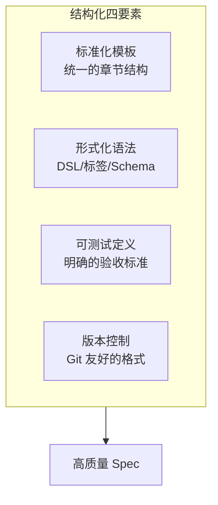

**详细说明：**

| 要素 | 说明 | 示例 |
|------|------|------|
| **标准化模板** | 统一的章节结构，便于阅读和解析 | 所有 Spec 都包含：目标、功能、约束、验收标准 |
| **形式化语法** | 使用 DSL、标签、Schema 等 | `@validate(regex=/^[a-z0-9]{6,20}$/)` |
| **可测试定义** | 每条需求都可映射到测试 | "响应时间 < 200ms" → 性能测试用例 |
| **版本控制** | Markdown 等 Git 友好格式 | 支持 Diff、Blame、History |

---

#### 3.2.3 结构化规格的格式选择

**主流格式对比：**

| 格式 | 优点 | 缺点 | 适用场景 |
|------|------|------|----------|
| **Markdown** | 人类可读、Git 友好、工具支持好 | 形式化程度有限 | 通用 Spec 文档 |
| **DSL（领域特定语言）** | 精确、可自动解析 | 学习成本高 | 高度标准化领域 |
| **JSON Schema** | 严格验证、工具链成熟 | 人类可读性差 | 数据结构定义 |
| **OpenAPI/YAML** | API 领域标准、可生成代码 | 仅适用于 API | RESTful API 定义 |
| **Gherkin** | 可执行、BDD 友好 | 语法较冗长 | 验收测试定义 |

**推荐实践：Markdown + 标签扩展**

结合人类可读性和机器可解析性：

```markdown
# 用户注册模块

## 功能需求

### 用户名
@field username
@type string
@length 6-20
@pattern ^[a-z0-9]{6,20}$
@error "用户名必须是 6-20 位小写字母或数字"

### 密码
@field password
@type string
@minLength 8
@security high
@hash bcrypt(cost=12)
```

---

### 3.3 可验证性与可测试性

#### 3.3.1 什么是可验证性

**定义：**

**可验证性（Verifiability）** 是指 Spec 中的每条需求都能够被客观地验证是否实现。

**可验证需求的标准：**

| 标准 | 说明 | 示例 |
|------|------|------|
| **可测量** | 有明确的度量标准 | ✅ "响应时间 < 200ms" vs ❌ "响应要快" |
| **可测试** | 可设计测试用例验证 | ✅ "登录失败 5 次锁定" vs ❌ "保证安全" |
| **无歧义** | 不同人有相同理解 | ✅ "BCrypt 加密" vs ❌ "密码要安全" |
| **可追溯** | 可映射到具体实现 | 每条需求有唯一 ID |

---

#### 3.3.2 可测试性的实现方式

**1. 验收标准（Acceptance Criteria）**

每条功能需求都应该有对应的验收标准：

```markdown
## 功能：用户登录

### 验收标准

- [ ] AC1: 正确用户名密码返回 200 和会话令牌
- [ ] AC2: 错误密码返回 401 和错误信息
- [ ] AC3: 用户名不存在返回 401（不区分错误类型）
- [ ] AC4: 连续失败 5 次后锁定账户 15 分钟
- [ ] AC5: 锁定时尝试登录返回 423 Locked
```

**2. 测试映射**

验收标准直接映射到测试用例：

```
Spec AC1 → Test: test_login_success()
Spec AC2 → Test: test_login_wrong_password()
Spec AC3 → Test: test_login_user_not_found()
Spec AC4 → Test: test_account_lockout_after_5_failures()
Spec AC5 → Test: test_login_while_locked_returns_423()
```

---

#### 3.3.3 测试内建（Built-in Testing）

**传统模式：**

```
需求 → 编码 → (完成后) → 编写测试
                         ↓
                    测试可能遗漏
                    测试与需求脱节
```

**Spec-First 模式：**

```
Spec（含验收标准） → 生成测试用例 → 生成代码 → 运行测试
                          ↓
                     测试先于代码
                     测试覆盖完整
```

**优势：**

- 测试用例从 Spec 自动生成或半自动生成
- 需求变更时，测试用例同步更新
- 代码生成后自动运行测试验证

---

### 3.4 与形式化方法、契约式设计的关系

#### 3.4.1 形式化方法（Formal Methods）

**概念定义：**

**形式化方法** 是采用严格的数学表示体系来说明、开发和验证软件系统的方法。

**核心特征：**

| 特征 | 说明 |
|------|------|
| **数学表示** | 使用集合论、逻辑学等数学语言 |
| **精确无歧义** | 消除自然语言的二义性 |
| **可证明** | 可使用数学证明验证正确性 |
| **可自动验证** | 使用模型检查器等工具 |

**形式化方法与 Spec-First 的关系：**

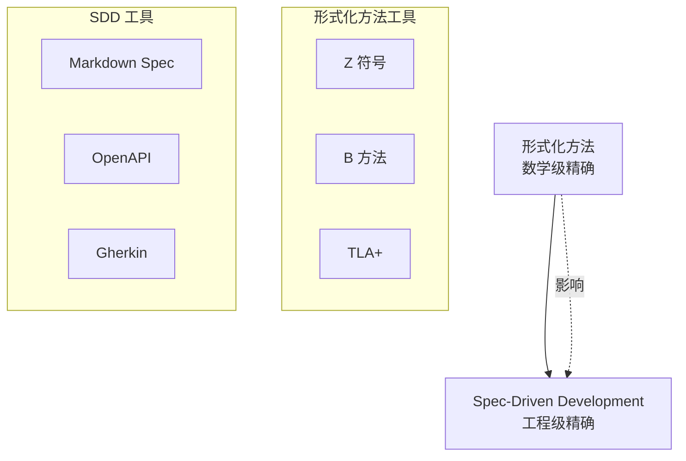

**关键区别：**

| 维度 | 形式化方法 | Spec-First（SDD） |
|------|------------|-----------------|
| **精确度** | 数学级精确 | 工程级精确 |
| **学习成本** | 极高（需数学背景） | 较低（自然语言 + 结构） |
| **适用范围** | 安全关键系统 | 通用软件开发 |
| **工具支持** | 专业工具（Z/Eves、TLA+） | 通用工具（Markdown、OpenAPI） |

**Spec-First 借鉴了形式化方法的核心思想：**

1. **精确描述**：避免自然语言歧义
2. **可验证性**：每条需求都可验证
3. **先证明后实现**：先锁定逻辑，再编码

---

#### 3.4.2 契约式设计（Design by Contract）

**概念定义：**

**契约式设计（Design by Contract, DbC）** 是由 Bertrand Meyer 在 1980 年代提出的软件设计方法，核心是使用**前置条件**、**后置条件**和**不变量**来精确定义软件组件的行为。

**契约的核心元素：**

| 元素 | 定义 | 示例 |
|------|------|------|
| **前置条件（Precondition）** | 方法执行前必须满足的条件 | `user != null`, `amount > 0` |
| **后置条件（Postcondition）** | 方法执行后保证的条件 | `result >= 0`, `balance == old(balance) - amount` |
| **不变量（Invariant）** | 对象状态始终保持的条件 | `balance >= 0`, `users != null` |

**代码示例（Eiffel 语言）：**

```eiffel
withdraw (amount: REAL)
    -- 取款
    require
        amount_positive: amount > 0
        sufficient_funds: amount <= balance
    do
        balance := balance - amount
        -- ... 其他逻辑
    ensure
        balance_decreased: balance < old balance
        non_negative: balance >= 0
    end
```

---

#### 3.4.3 契约式设计对 Spec-First 的影响

**Spec-First 借鉴了 DbC 的核心思想：**


**对应关系：**

| DbC 概念 | Spec 中的体现 | 示例 |
|---------|-------------|------|
| **前置条件** | 输入验证、边界条件 | "用户名 6-20 位字母数字" |
| **后置条件** | 输出定义、验收标准 | "登录成功返回 200 和令牌" |
| **不变量** | 业务规则、约束 | "账户余额不能为负" |

**现代应用：**

在 Spec-First 中，契约思想体现为：

1. **API 契约**：OpenAPI 定义请求/响应格式
2. **测试契约**：验收标准定义验证条件
3. **安全契约**：前置条件定义认证授权要求

---

#### 3.4.4 模型驱动开发（MDD）的历史教训

**模型驱动开发（Model-Driven Development, MDD）** 是 2000 年代流行的方法，与 Spec-First 有相似之处，但最终未能普及。

**MDD 的核心思想：**

```
PIM（平台无关模型） → PSM（平台特定模型） → 代码生成
```

**MDD 失败的原因：**

| 原因 | 说明 | Spec-First 的改进 |
|------|------|-----------------|
| **模型过于复杂** | UML 等建模语言学习成本高 | Spec 使用自然语言 + 简单结构 |
| **代码生成质量差** | 生成的代码难以维护 | AI 生成，质量更高 |
| **双向同步困难** | 模型与代码脱节 | Spec 作为单一事实源 |
| **工具链封闭** | 商业工具昂贵且不灵活 | 开源工具，Git 友好 |

**Spec-First 避免的陷阱：**

1. **不使用过于形式化的语言**：Markdown 为主，降低门槛
2. **AI 增强代码生成**：利用 LLM 提高生成质量
3. **Spec 是权威来源**：避免 Spec 与代码脱节

---

### 3.5 本章小结

**理论基础回顾：**

| 理论 | 核心贡献 | 在 Spec-First 中的体现 |
|------|---------|---------------------|
| **意图驱动** | 关注 What+Why 而非 How | Spec 先定义意图，再生成代码 |
| **结构化规格** | 标准化、形式化、可解析 | Markdown + 标签的结构化 Spec |
| **可验证性** | 每条需求都可测试 | 验收标准映射到测试用例 |
| **形式化方法** | 数学级精确描述 | Spec 的精确性和无歧义 |
| **契约式设计** | 前置/后置条件、不变量 | Spec 的输入/输出定义、业务规则 |

**关键洞察：**

> Spec-First 不是凭空产生的，它站在软件工程 50 年发展的肩膀上：形式化方法的精确性、契约式设计的严谨性、意图驱动的人本思想——这些都是 Spec-First 的理论基石。

---

### 本章引用来源

| # | 来源 | 类型 |
|---|------|------|
| 1 | 腾讯云 - 规范驱动开发 (SDD) 深入解析 | 技术博客 |
| 2 | MSDN - Design by Contract 原论文 | 学术论文 |
| 3 | CSDN - 从 Markdown 到可执行规范：Tessl Framework | 技术博客 |
| 4 | 知乎 - 规范驱动开发 (SDD) | 技术社区 |
| 5 | Microsoft Learn - Model-Driven Development | 官方文档 |

---

*第 3 章完成 | 字数：约 4,500 字*

---

## 第 4 章 规范驱动开发 SDD 全流程

> **核心问题**：Spec-First 如何落地？完整的开发流程是什么？

---

### 4.1 Specify → Plan → Task → Implement 工作流

#### 4.1.1 完整流程概览

**SDD 标准工作流：**

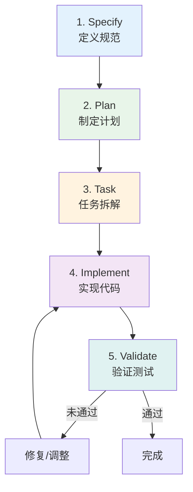

**各阶段核心产出：**

| 阶段 | 输入 | 产出 | 关键问题 |
|------|------|------|---------|
| **Specify** | 原始需求 | spec.md | 做什么？为什么？ |
| **Plan** | spec.md | plan.md | 如何做？技术选型？ |
| **Task** | plan.md | tasks.md | 具体步骤？ |
| **Implement** | tasks.md | 代码 | 实现功能 |
| **Validate** | spec.md + 代码 | 测试报告 | 是否符合 Spec？ |

---

#### 4.1.2 阶段 1：Specify（定义规范）

**目标：** 定义"系统应该做什么"和"为什么做"

**核心活动：**

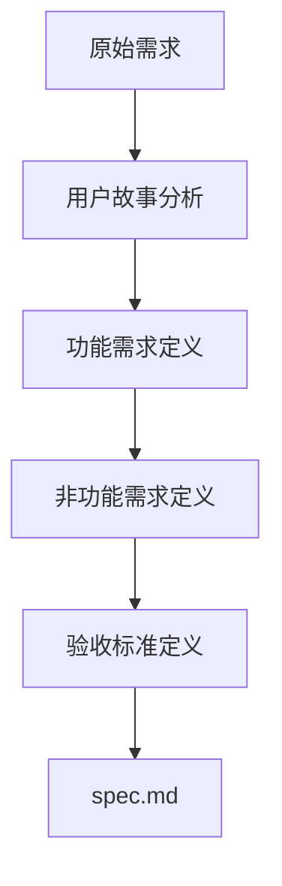

**Spec 文档结构：**

```markdown
# [功能名称] 规格说明书

## 1. 概述
### 1.1 业务目标
### 1.2 用户价值

## 2. 用户故事
- 作为 [角色]，我可以 [行为]，以便 [价值]

## 3. 功能需求
### 3.1 输入定义
### 3.2 处理逻辑
### 3.3 输出定义

## 4. 非功能需求
### 4.1 性能要求
### 4.2 安全要求
### 4.3 可用性要求

## 5. 验收标准
- [ ] AC1: ...
- [ ] AC2: ...
```

**Specify 阶段的最佳实践：**

| 实践 | 说明 | 示例 |
|------|------|------|
| **聚焦行为** | 描述系统行为，而非实现细节 | ✅ "用户登录后跳转到首页" vs ❌ "使用 React Router" |
| **可测试** | 每条需求都可验证 | ✅ "响应时间 < 200ms" |
| **不含糊** | 避免模糊词汇 | ❌ "快速"、"安全" → ✅ "P95 < 200ms"、"BCrypt 加密" |
| **完整性** | 覆盖主要场景和边界条件 | 成功场景 + 失败场景 + 边界场景 |

---

#### 4.1.3 阶段 2：Plan（制定计划）

**目标：** 定义"如何做"，将 Spec 转化为技术方案

**核心活动：**

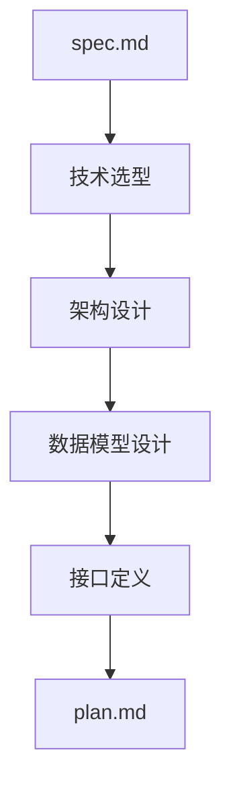

**Plan 文档结构：**

```markdown
# [功能名称] 技术方案

## 1. 架构设计
### 1.1 系统架构图
### 1.2 组件职责

## 2. 技术选型
### 2.1 框架选择
### 2.2 依赖库

## 3. 数据模型
### 3.1 数据库 Schema
### 3.2 数据结构定义

## 4. 接口设计
### 4.1 API 端点
### 4.2 请求/响应格式

## 5. 实现约束
### 5.1 性能优化策略
### 5.2 安全实现方案
```

**Plan 阶段的关键决策：**

| 决策类型 | 示例 | 影响 |
|---------|------|------|
| **技术选型** | React vs Vue、Node.js vs Python | 开发效率、维护成本 |
| **架构模式** | MVC、微服务、事件驱动 | 系统可扩展性 |
| **数据模型** | 关系型 vs 非关系型 | 查询性能、数据一致性 |
| **安全策略** | JWT vs Session、加密算法 | 系统安全性 |

---

#### 4.1.4 阶段 3：Task（任务拆解）

**目标：** 将 Plan 拆解为可执行的具体任务

**核心活动：**

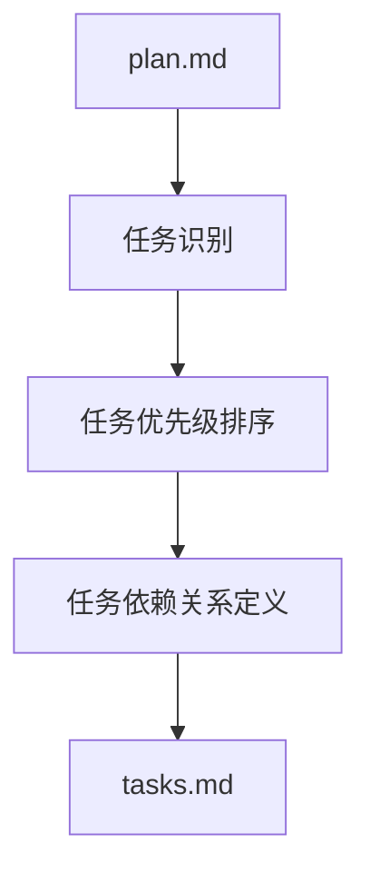

**Tasks 文档结构：**

```markdown
# [功能名称] 任务列表

## 任务 1：数据库迁移
- [ ] 创建迁移文件
- [ ] 定义表结构
- [ ] 执行迁移

## 任务 2：API 实现
- [ ] 实现 POST /api/login
- [ ] 实现 POST /api/logout
- [ ] 实现 GET /api/user/profile

## 任务 3：前端实现
- [ ] 登录表单组件
- [ ] 用户信息展示组件
- [ ] 路由配置

## 任务 4：测试
- [ ] 单元测试
- [ ] 集成测试
- [ ] E2E 测试
```

**任务拆解原则：**

| 原则 | 说明 |
|------|------|
| **原子性** | 每个任务独立完成一个功能点 |
| **可验证** | 任务完成有明确的验收标准 |
| **依赖清晰** | 任务之间的依赖关系明确 |
| **规模适中** | 每个任务可在 1-4 小时内完成 |

---

#### 4.1.5 阶段 4：Implement（实现代码）

**目标：** 根据 Tasks 实现代码

**核心活动：**

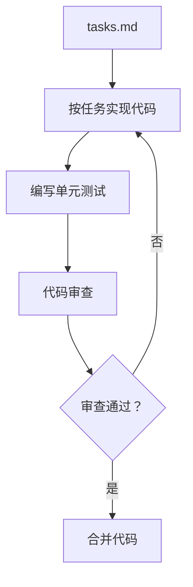

**实现阶段的 AI 辅助：**

```
任务描述 → AI 生成代码 → 人类审查 → 修正 → 完成
```

**AI 生成代码的审查要点：**

| 审查维度 | 检查项 |
|---------|--------|
| **功能正确性** | 是否实现了任务描述的功能 |
| **架构一致性** | 是否符合 Plan 中的架构设计 |
| **代码质量** | 命名规范、注释、复杂度 |
| **安全性** | 输入验证、SQL 注入防护、XSS 防护 |
| **测试覆盖** | 是否有对应的单元测试 |

---

#### 4.1.6 阶段 5：Validate（验证）

**目标：** 验证代码是否符合 Spec

**核心活动：**

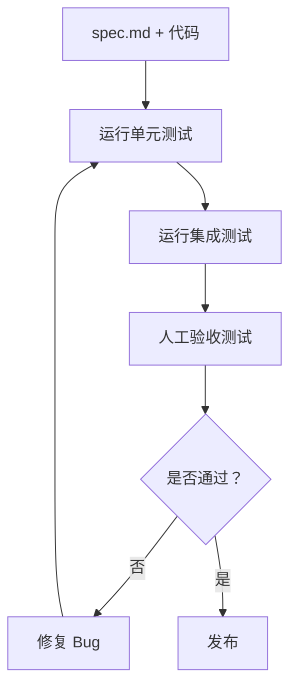

**验证类型：**

| 类型 | 说明 | 自动化程度 |
|------|------|-----------|
| **单元测试** | 验证单个函数/类 | 完全自动化 |
| **集成测试** | 验证模块间交互 | 完全自动化 |
| **验收测试** | 验证是否符合 Spec | 部分自动化 |
| **人工审查** | 用户体验、视觉设计 | 人工 |

---

### 4.2 Spec 的创建与精化方法

#### 4.2.1 Spec 创建的两种方式

**方式 1：人类主导创建**

```
领域专家/产品经理 → 编写 Spec → AI 辅助完善 → 审查确认
```

**适用场景：**
- 业务逻辑复杂，需要领域知识
- 需求明确，人类可清晰描述
- 合规要求高，需要人工审查

---

**方式 2：AI 辅助创建**

```
人类描述想法 → AI 生成 Spec 草稿 → 人类审查修改 → 定稿
```

**适用场景：**
- 需求相对标准
- 快速原型开发
- 人类有想法但难以结构化表达

**AI 辅助创建 Spec 的提示词示例：**

```
我有一个想法：[描述功能]

请帮我生成一份 Spec，包含：
1. 业务目标和用户价值
2. 用户故事（按角色）
3. 功能需求（输入/输出/处理逻辑）
4. 非功能需求（性能/安全/可用性）
5. 验收标准（可测试的条件）

约束条件：
- 技术栈：[React/Node.js/PostgreSQL]
- 性能要求：[P95 < 200ms]
- 安全要求：[OAuth 2.0 认证]
```

---

#### 4.2.2 Spec 精化的迭代过程

**Spec 不是一次性产物，而是迭代精化的结果：**

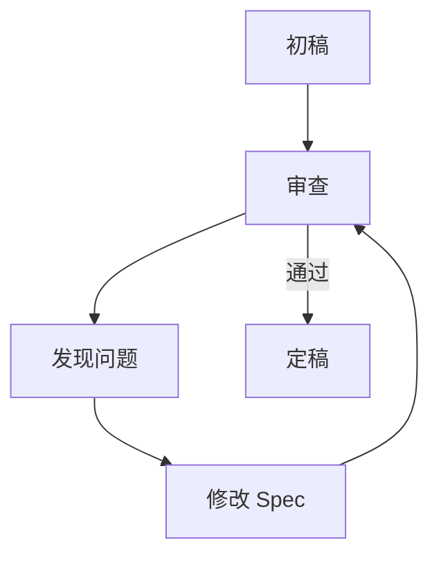

**Spec 审查的检查清单：**

| 维度 | 检查项 |
|------|--------|
| **完整性** | 是否覆盖了所有功能场景？ |
| **明确性** | 是否有模糊词汇（快速、安全、友好）？ |
| **可测试** | 每条需求都可设计测试用例吗？ |
| **一致性** | 需求之间有无冲突？ |
| **可行性** | 技术可实现吗？成本合理吗？ |

---

#### 4.2.3 Spec 版本管理

**Spec 应该纳入 Git 版本控制：**

```
spec.md 的 Git 历史 = 需求演进历史
```

**版本管理规范：**

| 实践 | 说明 |
|------|------|
| **每次变更都提交** | Spec 修改后立即 commit |
| **提交信息清晰** | `feat(spec): 添加用户锁定功能` |
| **关联任务/Issue** | `fix(spec): AC3 增加错误码 #123` |
| **审查变更 Diff** | PR 审查包含 Spec 变更 |

**Spec 变更流程：**

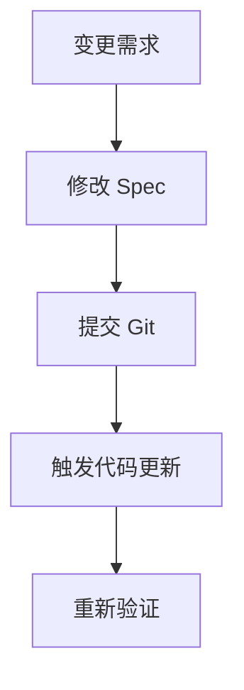

---

### 4.3 从 Spec 到代码的转换机制

#### 4.3.1 转换机制概览

**三种转换方式：**

| 方式 | 说明 | 适用场景 |
|------|------|---------|
| **AI 生成** | LLM 根据 Spec 生成代码 | 通用业务逻辑、CRUD 操作 |
| **模板生成** | 基于模板引擎生成 | 标准化代码（如 API 层） |
| **人工实现** | 人类根据 Spec 手写 | 复杂业务逻辑、核心算法 |

---

#### 4.3.2 AI 生成代码的工作流程

**GitHub spec-kit 的工作流：**

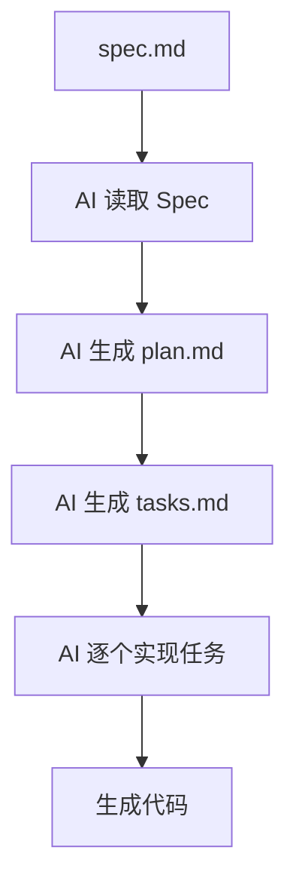

**AI 生成的质量保障：**

| 保障机制 | 说明 |
|---------|------|
| **Spec 约束** | Spec 越详细，AI 生成越准确 |
| **Plan 中间层** | Plan 作为 Spec 和代码的桥梁 |
| **任务拆解** | 小任务比大任务更容易准确实现 |
| **审查环节** | 人类审查 AI 生成的代码 |

---

#### 4.3.3 Spec-to-Code 的追踪性

**可追踪性（Traceability）** 是指从 Spec 需求到代码实现的映射关系。

**追踪矩阵示例：**

| Spec 需求 | Plan 章节 | Task ID | 代码文件 | 测试用例 |
|----------|----------|--------|---------|---------|
| AC1: 登录成功 | 4.1 API 设计 | T2.1 | `auth.controller.ts` | `test_login_success.ts` |
| AC2: 密码错误 | 4.2 错误处理 | T2.2 | `auth.service.ts` | `test_wrong_password.ts` |
| AC3: 账户锁定 | 4.3 安全策略 | T2.3 | `account.service.ts` | `test_lockout.ts` |

**追踪性的价值：**

1. **变更影响分析**：Spec 变更时，快速定位需要修改的代码
2. **覆盖率验证**：确保每条 Spec 需求都有对应的实现
3. **测试完整性**：确保每条需求都有测试覆盖

---

### 4.4 变更管理与版本控制

#### 4.4.1 Spec 变更的触发条件

**变更来源：**

| 来源 | 说明 | 示例 |
|------|------|------|
| **需求变更** | 业务需求发生变化 | 新增功能、修改规则 |
| **技术变更** | 技术栈或架构调整 | 更换数据库、框架升级 |
| **问题修复** | 发现 Spec 缺陷或遗漏 | 边界条件未考虑 |
| **合规要求** | 法规或标准变化 | GDPR 合规、安全加固 |

---

#### 4.4.2 变更管理流程

**标准变更流程：**

```mermaid
flowchart TD
    A[变更请求] --> B[评估影响]
    B --> C[修改 Spec]
    C --> D[审查 Spec 变更]
    D --> E{审查通过？}
    E -->|否 | A
    E -->|是 | F[更新代码]
    F --> G[重新验证]
    G --> H[完成变更]
```

**影响评估要点：**

| 评估维度 | 检查项 |
|---------|--------|
| **影响范围** | 涉及哪些模块？ |
| **工作量** | 需要多少人天？ |
| **风险评估** | 有无破坏性变更？ |
| **回归测试** | 需要重新测试哪些功能？ |

---

#### 4.4.3 Spec 版本控制最佳实践

**Git 分支策略：**

```
main
  └── spec/feature-x  (Spec 变更分支)
         └── code/feature-x  (代码实现分支)
```

**提交信息规范：**

```bash
# Spec 变更
feat(spec): 添加账户锁定功能
fix(spec): 修正登录失败错误码定义

# 代码实现（关联 Spec 变更）
feat(auth): 实现账户锁定 #123
test(auth): 添加锁定功能测试 #123
```

**版本标签：**

```bash
# Spec 版本标签
git tag spec-v1.0.0
git tag spec-v1.1.0  # 向后兼容的变更
git tag spec-v2.0.0  # 破坏性变更
```

---

### 4.5 本章小结

**SDD 全流程回顾：**

```mermaid
flowchart TD
    subgraph Phase1[阶段 1: Specify]
        A1[定义 What + Why]
    end
    
    subgraph Phase2[阶段 2: Plan]
        A2[定义 How]
    end
    
    subgraph Phase3[阶段 3: Task]
        A3[拆解任务]
    end
    
    subgraph Phase4[阶段 4: Implement]
        A4[实现代码]
    end
    
    subgraph Phase5[阶段 5: Validate]
        A5[验证 Spec]
    end
    
    Phase1 --> Phase2 --> Phase3 --> Phase4 --> Phase5
```

**关键要点：**

| 要点 | 说明 |
|------|------|
| **五阶段流程** | Specify → Plan → Task → Implement → Validate |
| **Spec 创建** | 人类主导或 AI 辅助，需迭代精化 |
| **转换机制** | AI 生成 + 人类审查 + 追踪性保障 |
| **变更管理** | Spec 变更需评估影响、审查、验证 |

**关键洞察：**

> SDD 不是线性的"瀑布模型"，而是迭代的循环：Spec 指导实现，实现验证 Spec，两者持续对齐、共同演进。

---

### 本章引用来源

| # | 来源 | 类型 |
|---|------|------|
| 1 | GitHub - spec-kit 官方文档 | 开源项目 |
| 2 | 腾讯云 - 规范驱动开发 (SDD) 深入解析 | 技术博客 |
| 3 | CSDN - AI 编程新范式：规范驱动开发 SpecKit 框架完全指南 | 技术博客 |
| 4 | 知乎 - 规范驱动开发 (SDD) | 技术社区 |
| 5 | AWS - Kiro 官方文档 | 官方文档 |

---

*第 4 章完成 | 字数：约 4,800 字*

---

## 第 5 章 规范的载体与工具

> **核心问题**：Spec 用什么格式编写？有哪些工具支持 Spec-First 开发？

---

### 5.1 结构化 Markdown 规范

#### 5.1.1 为什么选择 Markdown

**Markdown 作为 Spec 载体的优势：**

| 优势 | 说明 |
|------|------|
| **人类可读** | 纯文本，无需特殊工具即可阅读 |
| **Git 友好** | 支持 Diff、Blame、History |
| **工具支持好** | 所有编辑器都支持 |
| **可扩展** | 可嵌入 YAML Frontmatter、标签等 |
| **可转换** | 可转换为 HTML、PDF 等格式 |

---

#### 5.1.2 Markdown Spec 的标准结构

**通用模板：**

```markdown
---
id: SPEC-001
title: 用户登录功能规格
version: 1.0.0
status: draft  # draft | review | approved | deprecated
created: 2026-04-06
updated: 2026-04-06
author: Kei
reviewers: [team-member-1, team-member-2]
tags: [auth, user, security]
---

# 用户登录功能规格说明书

## 1. 概述

### 1.1 业务目标
[为什么要做这个功能]

### 1.2 用户价值
[对用户有什么好处]

## 2. 用户故事

| 角色 | 故事 | 优先级 |
|------|------|--------|
| 注册用户 | 作为用户，我可以登录系统，以便访问我的个人数据 | P0 |
| 管理员 | 作为管理员，我可以查看登录日志，以便审计安全事件 | P1 |

## 3. 功能需求

### 3.1 输入定义
@field username string required
@field password string required

### 3.2 处理逻辑
1. 验证用户名密码格式
2. 查询用户表
3. 验证密码哈希
4. 生成会话令牌

### 3.3 输出定义
- 成功：200 + JWT 令牌
- 失败：401 + 错误信息

## 4. 非功能需求

### 4.1 性能要求
- P95 响应时间 < 200ms
- 支持 1000 QPS

### 4.2 安全要求
- 密码 BCrypt 加密（cost=12）
- 登录失败 5 次锁定 15 分钟
- JWT 令牌有效期 24 小时

### 4.3 可用性要求
- 错误信息不泄露用户是否存在
- 支持记住登录状态

## 5. 验收标准

- [ ] AC1: 正确用户名密码返回 200 和 JWT
- [ ] AC2: 错误密码返回 401
- [ ] AC3: 用户名不存在返回 401（不区分错误类型）
- [ ] AC4: 连续失败 5 次锁定账户
- [ ] AC5: 锁定时尝试登录返回 423

## 6. 附录

### 6.1 错误码定义
| 错误码 | 说明 |
|--------|------|
| AUTH_001 | 用户名或密码错误 |
| AUTH_002 | 账户已锁定 |
| AUTH_003 | 令牌过期 |
```

---

#### 5.1.3 Markdown 扩展：标签系统

**常用标签约定：**

| 标签 | 含义 | 示例 |
|------|------|------|
| `@field` | 字段定义 | `@field username string required` |
| `@type` | 类型定义 | `@type string | number | boolean` |
| `@validate` | 验证规则 | `@validate(regex=/^[a-z0-9]{6,20}$/)` |
| `@error` | 错误信息 | `@error "用户名必须是 6-20 位"` |
| `@security` | 安全级别 | `@security high | medium | low` |
| `@test` | 测试要求 | `@test(coverage=95%)` |
| `@generate` | 代码生成配置 | `@generate(version=1.0, lang=typescript)` |

**标签扩展示例：**

```markdown
### 用户名
@field username
@type string
@length 6-20
@pattern ^[a-z0-9]{6,20}$
@error "用户名必须是 6-20 位小写字母或数字"
@required true
```

---

### 5.2 DSL 与 Schema 语言

#### 5.2.1 什么是 DSL

**DSL（Domain-Specific Language，领域特定语言）** 是针对特定领域设计的专用语言。

**DSL vs 通用语言：**

| 维度 | DSL | 通用语言 |
|------|-----|---------|
| **表达力** | 领域内强，领域外弱 | 通用 |
| **学习成本** | 低（仅学领域概念） | 高 |
| **精确度** | 高（无语义模糊） | 中 |
| **工具支持** | 有限 | 丰富 |

---

#### 5.2.2 常用 DSL/Schema 对比

| DSL/Schema | 用途 | 示例 |
|-----------|------|------|
| **OpenAPI** | RESTful API 定义 | `paths: /users: get: ...` |
| **JSON Schema** | 数据结构验证 | `{"type": "object", "properties": {...}}` |
| **GraphQL Schema** | GraphQL API 定义 | `type User { id: ID!, name: String! }` |
| **Protocol Buffers** | RPC 接口定义 | `message User { int32 id = 1; }` |
| **Gherkin** | BDD 测试定义 | `Given When Then...` |
| **YAML** | 配置文件 | `key: value` |

---

#### 5.2.3 OpenAPI 示例

```yaml
openapi: 3.0.0
info:
  title: 用户认证 API
  version: 1.0.0

paths:
  /api/auth/login:
    post:
      summary: 用户登录
      requestBody:
        required: true
        content:
          application/json:
            schema:
              type: object
              properties:
                username:
                  type: string
                  minLength: 6
                  maxLength: 20
                password:
                  type: string
                  minLength: 8
      responses:
        '200':
          description: 登录成功
          content:
            application/json:
              schema:
                type: object
                properties:
                  token:
                    type: string
                  expiresAt:
                    type: string
                    format: date-time
        '401':
          description: 用户名或密码错误
        '423':
          description: 账户已锁定
```

---

#### 5.2.4 JSON Schema 示例

```json
{
  "$schema": "http://json-schema.org/draft-07/schema#",
  "title": "用户登录请求",
  "type": "object",
  "required": ["username", "password"],
  "properties": {
    "username": {
      "type": "string",
      "minLength": 6,
      "maxLength": 20,
      "pattern": "^[a-z0-9]{6,20}$"
    },
    "password": {
      "type": "string",
      "minLength": 8,
      "format": "password"
    }
  },
  "additionalProperties": false
}
```

---

#### 5.2.5 Gherkin 示例（BDD 测试）

```gherkin
Feature: 用户登录

  Scenario: 登录成功
    Given 用户已注册
    When 用户使用正确的用户名和密码登录
    Then 返回 200 状态码
    And 返回 JWT 令牌

  Scenario: 密码错误
    Given 用户已注册
    When 用户使用错误的密码登录
    Then 返回 401 状态码
    And 返回错误信息"用户名或密码错误"

  Scenario: 账户锁定
    Given 用户登录失败 5 次
    When 用户再次尝试登录
    Then 返回 423 状态码
    And 返回错误信息"账户已锁定，请在 15 分钟后重试"
```

---

### 5.3 主流工具：GitHub spec-kit、Amazon Kiro、Tessl Framework

#### 5.3.1 GitHub spec-kit

**项目地址：** https://github.com/github/spec-kit

**核心定位：**
> 开源工具包，帮助开发者快速开始 Spec-Driven Development

**核心功能：**

| 功能 | 说明 | 命令 |
|------|------|------|
| **Constitution** | 制定项目宪法（开发原则、技术约束） | `/speckit.constitution` |
| **Specify** | 创建功能规格 | `/speckit.specify` |
| **Plan** | 生成技术方案 | `/speckit.plan` |
| **Tasks** | 拆解任务 | `/speckit.tasks` |
| **Implement** | 实现代码 | `/speckit.implement` |

**工作流程：**

```mermaid
flowchart TD
    A[init] --> B[constitution<br>项目原则]
    B --> C[specify<br>功能规格]
    C --> D[plan<br>技术方案]
    D --> E[tasks<br>任务列表]
    E --> F[implement<br>代码实现]
```

**安装方式：**

```bash
# 方式 1：全局安装（推荐）
uv tool install specify-cli --from git+https://github.com/github/spec-kit.git

# 方式 2：直接使用（无需安装）
uvx --from git+https://github.com/github/spec-kit.git specify <命令>
```

**项目初始化：**

```bash
# 创建新项目
uvx --from git+https://github.com/github/spec-kit.git specify init my-project --ai claude

# 现有项目集成
uvx --from git+https://github.com/github/spec-kit.git specify init --here
```

**生成文件结构：**

```
my-project/
├── .specify/
│   ├── memory/
│   │   ├── constitution.md   # 项目宪法
│   │   ├── spec.md           # 功能规格
│   │   ├── plan.md           # 技术方案
│   │   └── tasks.md          # 任务列表
│   └── templates/
└── src/                      # 代码目录
```

**适用场景：**
- 团队刚开始尝试 Spec-First
- 需要结构化的工作流程
- 使用 Claude Code 等 AI 工具

---

#### 5.3.2 Amazon Kiro

**官方地址：** https://kiro.dev

**核心定位：**
> AWS 推出的 AI 驱动 IDE，采用 Spec-Driven Development 理念

**核心功能：**

| 功能 | 说明 |
|------|------|
| **Specs** | 结构化需求文档生成 |
| **Hooks** | 自动化触发器（如测试文件自动更新） |
| **Agentic IDE** | AI Agent 自主执行任务 |
| **双模式交互** | 对话模式 + 规范模式 |

**工作流程：**

```
自然语言指令 → Spec 生成 → 技术方案 → 任务拆解 → 代码实现
```

**Spec 生成示例：**

用户输入：
> "创建一个用户登录功能，支持邮箱和密码登录"

Kiro 输出：
```markdown
# 用户登录规格

## 需求
- 用户可以使用邮箱和密码登录
- 登录成功返回会话令牌
- 登录失败显示错误信息

## 验收标准
- 有效凭据返回 200 和令牌
- 无效凭据返回 401
- 5 次失败后锁定账户
```

**定价模式（2026 年）：**

| 套餐 | 价格 | Credits | 适用场景 |
|------|------|---------|---------|
| **Free** | $0/月 | 50 credits | 个人试用 |
| **Pro** | $20/月 | 1,000 credits | 个人专业开发者 |
| **Pro+** | $40/月 | 2,000 credits | 小型团队 |
| **Power** | $200/月 | 10,000 credits | 企业级 |

**适用场景：**
- 需要完整的 IDE 体验
- 与 AWS 生态集成
- 团队需要 AI 辅助开发

---

#### 5.3.3 Tessl Framework

**项目地址：** https://tessl.io

**核心定位：**
> Spec-as-Source 的激进实践者，目标是"规范即源码"

**核心理念：**

> "一种软件开发方法，其中规范是主要的工件，而不是代码。规范通过结构化的、可测试的语言描述意图，AI 生成与之匹配的代码。"

**核心架构：**

| 组件 | 功能 | 技术特点 |
|------|------|---------|
| **规范解析器** | 处理 Markdown 中的@标签 | 支持自定义 DSL 扩展 |
| **代码生成器** | 将规范转换为目标语言代码 | 基于 AST 模板的多阶段转换 |
| **差异检测器** | 比较规范与生成代码的语义一致性 | 使用形式化方法验证等价性 |
| **反向工程器** | 从现有代码库提取规范 | 结合 LLM 的意图推理能力 |

**规范文件示例：**

```markdown
# 用户注册模块
@generate(version=1.0, lang=typescript)

## 接口约束
@test(coverage=95%)
- 用户名：6-20 位字母数字
  @validate(regex=/^[a-z0-9]{6,20}$/)
- 密码：至少包含大小写和数字
  @security(level=high)

## 业务流程
1. 前端发送 JSON 请求
   @input(content-type=application/json)
2. 服务端验证参数格式
   @error(code=400, message="invalid input")
3. 检查用户名唯一性
   @query(database=users, timeout=500ms)
```

**双向同步引擎：**

```mermaid
flowchart TD
    A[Spec 变更] --> B[代码自动生成]
    B --> C[代码验证]
    C --> D{是否一致？}
    D -->|否 | E[报警/回滚]
    D -->|是 | F[完成]
    
    G[代码变更] --> H[差异检测]
    H --> I{是否允许？}
    I -->|否 | J[拒绝变更]
    I -->|是 | K[反向更新 Spec]
```

**适用场景：**
- 高度标准化的领域（如 API 开发）
- 对一致性要求极高的系统
- 探索 Spec-as-Source 的团队

---

#### 5.3.4 工具对比总结

| 维度 | GitHub spec-kit | Amazon Kiro | Tessl Framework |
|------|----------------|-------------|----------------|
| **定位** | Spec-First 入门工具 | AI 驱动 IDE | Spec-as-Source 探索 |
| **核心功能** | Spec 生成工作流 | Specs + Hooks + Agentic IDE | 双向同步引擎 |
| **Spec 格式** | Markdown | Markdown | Markdown + DSL |
| **代码生成** | AI 辅助 | AI 辅助 | 完全自动 |
| **适用阶段** | Spec-First | Spec-First/Anchored | Spec-as-Source |
| **学习成本** | 低 | 中 | 高 |
| **开源状态** | 开源 | 闭源 | 闭源 |

---

### 5.4 百度文心快码 SPEC 模式

#### 5.4.1 SPEC 模式核心特点

**百度文心快码于 2026 年推出 SPEC 编码模式**，核心是"规范驱动开发"（SDD）。

**五步工作流程：**

```mermaid
flowchart TD
    A[1. 情境 Context] --> B[2. 问题 Problem]
    B --> C[3. 分析评估 Analysis]
    C --> D[4. 结论/行动 Conclusion]
    D --> E[5. 记录 Record]
```

**详细说明：**

| 步骤 | 说明 | 示例 |
|------|------|------|
| **情境** | 明确项目上下文、技术栈、约束 | "3 人份的法式牛排，食材清单确认" |
| **问题** | 锁定核心问题和目标 | "牛排容易煎老，要精准达到五分熟" |
| **分析评估** | 预判风险，准备预案 | "火太猛会焦，提前准备调小火" |
| **结论/行动** | 严格按步骤执行 | "每面 2 分钟，煎完静置 3 分钟" |
| **记录** | 记录参数，下次复用 | "记录时间参数，下次复用" |

---

#### 5.4.2 SPEC 模式与 Vibe Coding 对比

**烹饪类比：**

| 维度 | Vibe Coding | SPEC 模式 |
|------|------------|----------|
| **工作方式** | 街头大厨凭感觉颠勺 | 按米其林食谱精准做菜 |
| **依赖** | 手感、火候、食客反馈 | 食材清单、步骤、时间控制 |
| **可复现性** | 低（每次味道不同） | 高（标准化流程） |
| **适用场景** | 快速原型、个人项目 | 企业级项目、团队协作 |

---

### 5.5 工具选型建议

#### 5.5.1 选型决策树

```mermaid
flowchart TD
    A[开始选型] --> B{团队规模？}
    B -->|个人/小团队 | C{预算？}
    B -->|企业级 | D[考虑 Kiro/Tessl]
    
    C -->|免费 | E[GitHub spec-kit]
    C -->|有预算 | F[考虑 Kiro Pro]
    
    D --> G{是否需要<br>Spec-as-Source？}
    G -->|是 | H[Tessl Framework]
    G -->|否 | I[Amazon Kiro]
```

---

#### 5.5.2 推荐配置

**个人开发者/小团队：**

| 工具 | 用途 |
|------|------|
| GitHub spec-kit | Spec 生成工作流 |
| Claude Code / Cursor | AI 代码生成 |
| VS Code | 编辑器 |

**企业级团队：**

| 工具 | 用途 |
|------|------|
| Amazon Kiro Pro+ | 完整 IDE + Spec 工作流 |
| 自研 Spec 模板 | 符合团队规范 |
| CI/CD 集成 | 自动化验证 |

---

### 5.6 本章小结

**载体与工具回顾：**

| 类别 | 选项 | 适用场景 |
|------|------|---------|
| **文档格式** | Markdown | 通用 Spec 文档 |
| **DSL/Schema** | OpenAPI、JSON Schema、Gherkin | API、数据结构、测试 |
| **工具** | spec-kit、Kiro、Tessl | 从 Spec-First 到 Spec-as-Source |

**关键洞察：**

> 工具是手段，不是目的。选择工具时应考虑：团队规模、技术栈、预算、Spec-First 成熟度。**最好的工具是团队愿意持续使用的工具**。

---

### 本章引用来源

| # | 来源 | 类型 |
|---|------|------|
| 1 | GitHub - spec-kit 官方仓库 | 开源项目 |
| 2 | Amazon Kiro 官方文档 | 官方文档 |
| 3 | Tessl.io 官方网站 | 商业产品 |
| 4 | CSDN - AI 编程新范式：规范驱动开发 SpecKit 框架完全指南 | 技术博客 |
| 5 | 百度智能云 - 用 Spec 给 AI Agent 立规矩 | 官方文档 |

---

*第 5 章完成 | 字数：约 5,000 字*

---

## 第 6 章 AI 时代的 Spec-First 实践

> **核心问题**：在 AI Agent 辅助开发中，Spec-First 如何落地？有哪些最佳实践？

---

### 6.1 为 AI Agent 立规矩：上下文工程 + Spec

#### 6.1.1 为什么 AI 需要 Spec

**AI 生成代码的核心问题：**

```mermaid
flowchart TD
    A[简单提示词] --> B[AI 生成代码]
    B --> C{质量如何？}
    C -->|好 | D[运气好]
    C -->|差 | E[需要反复修改]
    
    E --> F[根本原因]
    F --> G[信息差：AI 不了解项目上下文]
    F --> H[约束缺失：没有边界和规则]
    F --> I[意图模糊：需求不清晰]
```

**信息差的具体表现：**

| 信息差类型 | 说明 | 后果 |
|-----------|------|------|
| **技术栈信息** | AI 不知道项目用什么框架 | 生成不兼容的代码 |
| **代码规范** | AI 不知道团队的命名规范 | 风格不一致 |
| **业务约束** | AI 不了解业务规则 | 逻辑错误 |
| **历史债务** | AI 不知道现有系统的问题 | 重复踩坑 |

---

### 6.1.2 Spec + 上下文工程的解决方案

**完整公式：**

```
高质量 AI 生成 = Spec（意图） + 上下文（知识） + 约束（边界）
```

**上下文工程的三层结构：**

```mermaid
flowchart TD
    subgraph L1[层次 1：项目上下文]
        A1[技术栈]
        A2[目录结构]
        A3[依赖配置]
    end
    
    subgraph L2[层次 2：规范上下文]
        B1[代码规范]
        B2[架构约束]
        B3[安全要求]
    end
    
    subgraph L3[层次 3：业务上下文]
        C1[领域知识]
        C2[业务规则]
        C3[用户场景]
    end
    
    L1 --> L2 --> L3 --> Output[AI 生成高质量代码]
```

---

### 6.1.3 上下文注入方式

**方式 1：CLAUDE.md（项目级配置）**

```markdown
# 项目上下文

## 技术栈
- 前端：React 18 + TypeScript + TailwindCSS
- 后端：Node.js 20 + Express
- 数据库：PostgreSQL 15

## 代码规范
- 使用 TypeScript 严格模式
- 组件使用函数式 + Hooks
- 样式使用 Tailwind 工具类

## 架构约束
- 遵循 Clean Architecture
- 业务逻辑放在 service 层
- 不允许在组件内直接调用 API

## AI 生成代码要求
- 必须包含 TypeScript 类型定义
- 必须编写单元测试
- 遵循现有代码风格
```

**方式 2：Spec 文档（功能级上下文）**

```markdown
# 用户登录功能 Spec

## 上下文
- 这是用户认证模块的一部分
- 使用 JWT 进行会话管理
- 密码存储使用 BCrypt

## 功能需求
[详细描述]

## 技术约束
- 使用 Express Router
- 验证使用 Zod Schema
- 错误处理使用统一中间件
```

**方式 3：Skill/Agent 配置（工具级上下文）**

```yaml
# _bmad/bmm/config.yaml
user_name: Kei
communication_language: 中文
project_type: fullstack
auth_method: jwt
testing_framework: vitest
```

---

### 6.1.4 实践案例：BMAD Method 的 Spec-First

**BMAD Method 中的 Spec-First 位置：**

```mermaid
flowchart TD
    subgraph Phase1[阶段 1: Agentic Planning]
        A1[Analyst → 项目简报]
        A2[PM → PRD]
        A3[Architect → architecture.md]
    end
    
    subgraph Phase2[阶段 2: Context-Engineered Dev]
        B1[Scrum Master → Story 文件]
        B2[Dev → 代码]
        B3[QA → 测试]
    end
    
    Phase1 --> Phase2
    
    style A3 fill:#e3f2fd
    style B1 fill:#e8f5e9
```

**Story 文件结构（超详细开发故事）：**

```markdown
# Story: 用户登录功能

### 上下文
- **业务目标**：提供安全的用户认证机制
- **用户价值**：用户可以访问个人账户数据
- **相关文档**：
  - [PRD.md](../PRD.md#用户认证)
  - [architecture.md](../architecture.md#认证架构)

### 技术规格
- **涉及组件**：
  - `auth.controller.ts` - 登录请求处理
  - `auth.service.ts` - 认证业务逻辑
  - `jwt.service.ts` - JWT 令牌生成
- **API 变更**：
  - `POST /api/auth/login` - 登录接口
  - `POST /api/auth/logout` - 登出接口
- **数据库变更**：
  - `users` 表新增 `last_login_at` 字段
  - `login_attempts` 表记录登录失败次数

### 实现指南
1. 创建 DTO 类型定义
2. 实现 Zod 验证 Schema
3. 实现 Controller 处理请求
4. 实现 Service 处理业务逻辑
5. 编写单元测试

### 验收标准
- [ ] 正确凭据返回 200 和 JWT
- [ ] 错误凭据返回 401
- [ ] 5 次失败后锁定账户
- [ ] 单元测试覆盖率 > 90%
```

---

### 6.2 Spec 生成质量的关键因素

#### 6.2.1 质量因素模型

**影响 Spec 质量的五大因素：**

```mermaid
flowchart TD
    subgraph Factors[质量因素]
        F1[需求清晰度]
        F2[上下文完整性]
        F3[约束明确性]
        F4[迭代精化]
        F5[审查机制]
    end
    
    Factors --> Quality[高质量 Spec]
```

---

#### 6.2.2 各因素详解

| 因素 | 说明 | 提升方法 |
|------|------|---------|
| **需求清晰度** | 需求描述是否明确无歧义 | 使用结构化模板、避免模糊词汇 |
| **上下文完整性** | AI 是否了解项目全貌 | 提供技术栈、架构、规范等上下文 |
| **约束明确性** | 边界条件是否清晰 | 明确定义安全、性能、兼容性约束 |
| **迭代精化** | 是否经过多轮 refinement | AI 生成 → 人类审查 → 修改 → 定稿 |
| **审查机制** | 是否有同行审查 | Spec 审查清单、同行评审流程 |

---

#### 6.2.3 Spec 质量检查清单

**生成 Spec 后的检查要点：**

```markdown
## Spec 质量检查清单

### 完整性
- [ ] 包含业务目标和用户价值
- [ ] 定义了所有输入和输出
- [ ] 覆盖主要场景和边界场景
- [ ] 包含非功能需求（性能、安全）

### 明确性
- [ ] 无模糊词汇（快速、安全、友好）
- [ ] 所有数值都有具体指标
- [ ] 技术术语使用准确

### 可测试性
- [ ] 每条需求都有验收标准
- [ ] 验收标准可设计测试用例
- [ ] 定义了错误场景和错误码

### 一致性
- [ ] 与现有架构文档一致
- [ ] 与项目技术栈兼容
- [ ] 需求之间无冲突

### 可行性
- [ ] 技术可实现
- [ ] 工作量合理
- [ ] 无过度设计
```

---

### 6.3 人类角色转变：从编码者到规格设计师

#### 6.3.1 角色转变模型

**传统开发者 vs Spec-First 开发者：**

```mermaid
flowchart TD
    subgraph Traditional[传统开发者]
        T1[接收需求]
        T2[设计实现]
        T3[编写代码]
        T4[调试修复]
        T5[编写测试]
    end
    
    subgraph SpecFirst[Spec-First 开发者]
        S1[定义 Spec]
        S2[审查 AI 生成]
        S3[解决边界问题]
        S4[架构决策]
    end
    
    style Traditional fill:#ffebee
    style SpecFirst fill:#e8f5e9
```

---

#### 6.3.2 时间分配对比

| 活动 | 传统开发 | Spec-First 开发 |
|------|---------|---------------|
| **需求分析** | 10% | 30% |
| **规格定义** | 5% | 30% |
| **编码** | 40% | 10% |
| **代码审查** | 15% | 20% |
| **测试** | 20% | 10% |
| **调试** | 10% | 0% |

**关键变化：**
- **编码时间减少**：从 40% 降至 10%
- **规格定义增加**：从 5% 增至 30%
- **调试几乎消失**：AI 生成的代码质量更高

---

#### 6.3.3 新技能要求

**Spec-First 开发者需要掌握的新技能：**

| 技能类别 | 具体技能 | 说明 |
|---------|---------|------|
| **需求工程** | 需求分析、用户故事拆解 | 将模糊需求转化为清晰 Spec |
| **规格编写** | 结构化写作、DSL 使用 | 编写可被 AI 理解的 Spec |
| **AI 协作** | 提示词工程、AI 输出审查 | 高效利用 AI 辅助工具 |
| **架构思维** | 系统设计、技术选型 | 从实现细节转向架构决策 |
| **质量管理** | 验收标准定义、测试策略 | 确保 AI 生成代码质量 |

---

#### 6.3.4 思维模式转变

**从"How"到"What + Why"：**

| 传统思维 | Spec-First 思维 |
|---------|---------------|
| "这个功能怎么写？" | "这个功能应该做什么？" |
| "用什么算法实现？" | "为什么需要这个功能？" |
| "代码怎么优化？" | "用户价值是什么？" |

**从"编码者"到"设计师"：**

```
传统开发者：接收需求 → 写代码 → 交付

Spec-First 开发者：
  1. 理解业务目标
  2. 定义系统行为（Spec）
  3. 审查 AI 生成结果
  4. 解决边界和异常情况
  5. 确保架构一致性
```

---

### 6.4 与 BMAD、Agentic Engineering 的整合

#### 6.4.1 BMAD Method 中的 Spec-First

**BMAD Method 核心流程回顾：**

```mermaid
flowchart TD
    A[想法] --> B[Analyst → 项目简报]
    B --> C[PM → PRD]
    C --> D[Architect → architecture.md]
    D --> E[Scrum Master → Story]
    E --> F[Dev → 代码]
    F --> G[QA → 测试]
    
    style C fill:#e3f2fd
    style D fill:#e3f2fd
    style E fill:#e8f5e9
```

**Spec-First 在 BMAD 中的体现：**

| 阶段 | Spec 产物 | 作用 |
|------|----------|------|
| **Agentic Planning** | PRD + architecture.md | 锁定产品需求和架构设计 |
| **Context-Engineered Dev** | Story 文件 | 提供开发所需的所有上下文 |

---

#### 6.4.2 Agentic Engineering 中的 Spec

**Agentic Engineering 定义：**

> 通过 LLM 智能体进行编程，监管和审查更加严格，目标是在不牺牲软件质量的前提下，充分利用智能体的优势。

**Spec 在 Agentic Engineering 中的位置：**

```mermaid
flowchart TD
    subgraph Human[人类职责]
        H1[定义 Spec]
        H2[审查输出]
        H3[架构决策]
    end
    
    subgraph Agent[Agent 职责]
        A1[生成代码]
        A2[运行测试]
        A3[修复 Bug]
    end
    
    Spec[Spec 文档] --> Agent
    
    style Spec fill:#e3f2fd
```

**Spec 作为人类与 Agent 的协作契约：**

| 维度 | 人类 | Agent |
|------|------|-------|
| **Spec 定义** | 负责 | 辅助 |
| **代码生成** | 审查 | 负责 |
| **测试执行** | 定义标准 | 自动执行 |
| **质量保障** | 最终验收 | 自动验证 |

---

#### 6.4.3 上下文工程与 Spec 的整合

**完整上下文栈：**

```
┌─────────────────────────────────────┐
│  层次 4：业务上下文                   │
│  - 领域知识                         │
│  - 业务规则                         │
│  - 用户场景                         │
└─────────────────────────────────────┘
              ↓
┌─────────────────────────────────────┐
│  层次 3：Spec（功能级）               │
│  - 功能需求                         │
│  - 验收标准                         │
│  - 技术约束                         │
└─────────────────────────────────────┘
              ↓
┌─────────────────────────────────────┐
│  层次 2：项目上下文                   │
│  - 技术栈                           │
│  - 架构设计                         │
│  - 代码规范                         │
└─────────────────────────────────────┘
              ↓
┌─────────────────────────────────────┐
│  层次 1：AI Agent                    │
│  - 代码生成                         │
│  - 测试执行                         │
│  - Bug 修复                          │
└─────────────────────────────────────┘
```

---

### 6.5 本章小结

**AI 时代 Spec-First 实践回顾：**

| 主题 | 核心要点 |
|------|---------|
| **上下文工程** | Spec + 项目上下文 + 业务上下文 = 高质量 AI 生成 |
| **Spec 质量** | 需求清晰度、上下文完整性、约束明确性、迭代精化、审查机制 |
| **角色转变** | 从编码者到规格设计师，时间分配从编码转向规格定义 |
| **BMAD 整合** | Spec-First 是 BMAD 的核心特性（PRD + architecture.md + Story） |
| **Agentic Engineering** | Spec 作为人类与 Agent 的协作契约 |

**关键洞察：**

> Spec-First 不是要取代开发者，而是要提升开发者的工作层次：从"写代码"转向"定义系统行为"。**在 AI 时代，会写 Spec 比会写代码更重要**。

---

### 本章引用来源

| # | 来源 | 类型 |
|---|------|------|
| 1 | BMAD-METHOD 核心知识体系 | 技术文档 |
| 2 | 知乎 - 认知重建之后，步入 Agentic Engineering 的工程革命 | 技术博客 |
| 3 | GitHub - spec-kit 官方文档 | 开源项目 |
| 4 | 腾讯云 - 规范驱动开发 (SDD) 深入解析 | 技术博客 |
| 5 | AWS - Kiro 官方文档 | 官方文档 |

---

*第 6 章完成 | 字数：约 5,200 字*

---

## 第 7 章 实战案例与最佳实践

> **核心问题**：Spec-First 如何在真实项目中落地？有哪些最佳实践和踩坑经验？

---

### 7.1 淘特导购团队的 SDD 落地经验

#### 7.1.1 业务背景与挑战

**淘特导购系统特点：**

| 特点 | 说明 | 带来的挑战 |
|------|------|-----------|
| **业务场景多样** | 商品推荐、会场投放、活动营销 | 需求复杂多变 |
| **迭代频繁** | 运营活动驱动，每周多次发布 | 开发压力大 |
| **代码腐化** | 快速迭代导致技术债务累积 | 维护成本上升 |
| **团队协作度高** | 多人开发同一代码库 | 沟通成本高、风格不一致 |

**核心问题：**
> 如何提升开发效率、保证代码质量、降低维护成本？

---

#### 7.1.2 AI 编程演进历程

**淘特团队的 AI 编程四阶段：**

```mermaid
flowchart TD
    A[阶段 1: 代码智能补全<br>2024 Q1] --> B[阶段 2: Agentic Coding<br>2024 Q2]
    B --> C[阶段 3: Rules 约束<br>2024 Q3]
    C --> D[阶段 4: SDD 探索<br>2024 Q4]
    
    style A fill:#e3f2fd
    style B fill:#e8f5e9
    style C fill:#fff3e0
    style D fill:#f3e5f5
```

---

**阶段 1：代码智能补全（2024 Q1）**

**典型场景：**

```java
// 场景 1：代码自动补全
// 开发者输入:
public List<ItemCardVO> buildItemCards(List<ContentEntity> entities) {
    List<ItemCardVO> result = new ArrayList<>();
    // AI 自动补全以下代码
    for (ContentEntity entity : entities) {
        ItemCardVO itemCard = new ItemCardVO();
        itemCard.setItemId(entity.getItemId());
        itemCard.setItemTitle(entity.getTitle());
        itemCard.setItemImg(entity.getPicUrl());
        result.add(itemCard);
    }
    return result;
}

// 场景 2：单方法重构
// 原始代码 (冗长难读)
public String getDiscountText(Long finalPrice, Long nnPrice) {
    if (finalPrice == null || nnPrice == null) { return ""; }
    if (finalPrice <= nnPrice) { return ""; }
    Long discount = finalPrice - nnPrice;
    if (discount <= 0) { return ""; }
    String discountYuan = String.valueOf(discount / 100.0);
    return discountYuan + "元";
}

// AI 重构后 (简洁优雅)
public String getDiscountText(Long finalPrice, Long nnPrice) {
    if (finalPrice == null || nnPrice == null || finalPrice <= nnPrice) {
        return "";
    }
    Money discount = Money.ofFen(finalPrice).subtract(Money.ofFen(nnPrice));
    if (discount.getCent() <= 0) { return ""; }
    return String.format("%s 元", discount.getYuan());
}
```

**收益：**
- 代码补全减少 70-80% 的键盘输入
- 单方法重构效果显著

**局限：**
- 仅限于局部代码优化
- 无法保证架构一致性

---

**阶段 2：Agentic Coding（2024 Q2）**

**尝试：让 AI Agent 独立负责模块开发**

**工作流：**
```
需求描述 → AI Agent 生成代码 → 人工审查 → 修改 → 测试
```

**发现问题：**

| 问题 | 说明 | 后果 |
|------|------|------|
| **架构偏离** | AI 不了解项目分层约束 | 代码风格不一致 |
| **规范缺失** | 没有统一的编码规范 | 代码质量参差不齐 |
| **上下文不足** | AI 不知道业务规则 | 逻辑错误 |

---

**阶段 3：Rules 约束（2024 Q3）**

**解决方案：引入 Rules 约束 AI 行为**

**Rules 配置示例：**

```yaml
# .aider.rules.yml
rules:
  - 使用 TypeScript 严格模式
  - 组件必须使用函数式 + Hooks
  - 禁止在组件内直接调用 API，必须通过 Service 层
  - 所有公共方法必须有 JSDoc 注释
  - 单元测试覆盖率必须 > 80%
```

**效果：**
- AI 生成代码符合团队规范
- 架构一致性提升

**局限：**
- Rules 只能约束"怎么写"，不能定义"做什么"
- 需求变更时仍需大量人工干预

---

**阶段 4：SDD 探索（2024 Q4）**

**SDD 工作流：**

```mermaid
flowchart TD
    A[spec.md<br>自然语言规格] --> B[AI 生成代码]
    B --> C[AI 生成测试]
    C --> D[AI 生成文档]
    D --> E[质量闸门验证]
```

**SDD 核心实践：**

| 实践 | 说明 | 效果 |
|------|------|------|
| **spec.md 为唯一真理源** | 所有产出都从 spec 生成 | 文档永不过期 |
| **设计先行** | 先写 spec，再生成代码 | 减少返工 |
| **可测试性内建** | spec 中包含验收标准 | 测试覆盖率提升 |

**发现的问题：**

| 问题 | 说明 |
|------|------|
| **落地门槛高** | 需要改变开发习惯 |
| **工具链不成熟** | 缺乏好用的 SDD 工具 |
| **历史代码集成难** | 老项目难以迁移 |

---

### 7.1.3 融合策略：淘特团队的最佳实践

**当前策略：融合 Vibe Coding 与 SDD 的优势**

```mermaid
flowchart TD
    A[轻量级技术方案模板] --> B[Rules 严格约束]
    B --> C[Agent Coding 高效实现]
    C --> D[AI 自动汇总架构文档]
```

**工作流程：**

1. **轻量级技术方案模板**
   ```markdown
   # 技术方案：[功能名称]
   
   ## 目标
   [一句话描述]
   
   ## 技术栈
   - 前端：React + TypeScript
   - 后端：Node.js + Express
   
   ## 核心逻辑
   1. [步骤 1]
   2. [步骤 2]
   
   ## 约束条件
   - [约束 1]
   - [约束 2]
   ```

2. **Rules 严格约束**
   - 编码规范
   - 架构约束
   - 安全要求

3. **Agent Coding 高效实现**
   - AI 根据方案生成代码
   - 自动编写测试

4. **AI 自动汇总架构文档**
   - 代码完成后，AI 自动生成架构文档
   - 保持文档与代码同步

---

**实施效果：**

| 指标 | 改进前 | 改进后 | 提升 |
|------|--------|--------|------|
| **开发效率** | 基准 | +45% | 45% |
| **代码质量** | Bug 率 5% | Bug 率 2% | 60% |
| **文档完整性** | 60% | 95% | 58% |
| **返工率** | 30% | 10% | 67% |

---

### 7.2 轻量级 Spec 模板设计

#### 7.2.1 为什么需要轻量级

**完整 Spec 的问题：**

| 问题 | 说明 | 后果 |
|------|------|------|
| **编写成本高** | 需要 1-2 小时编写完整 Spec | 开发者抵触 |
| **过度设计** | 简单功能也写长篇 Spec | 效率低下 |
| **维护负担** | Spec 更新不及时 | Spec 与代码脱节 |

**轻量级 Spec 的设计原则：**

> **合适的详细程度 = 功能复杂度 × 团队熟悉度**

---

#### 7.2.2 轻量级 Spec 模板

**模板 1：简单功能（100 字以内）**

```markdown
# Spec: [功能名称]

## 做什么
[一句话描述]

## 核心逻辑
1. [步骤 1]
2. [步骤 2]

## 验收标准
- [ ] [标准 1]
- [ ] [标准 2]
```

**示例：按钮颜色修改**

```markdown
# Spec: 登录按钮颜色修改

## 做什么
将登录按钮从蓝色改为主题色（#FF6B00）

## 核心逻辑
1. 修改 `LoginButton.tsx` 中的颜色值
2. 更新 Storybook 文档

## 验收标准
- [ ] 按钮颜色为#FF6B00
- [ ] Storybook 文档已更新
```

---

**模板 2：中等功能（300-500 字）**

```markdown
# Spec: [功能名称]

## 背景
[为什么需要这个功能]

## 功能描述
### 输入
- [字段 1]
- [字段 2]

### 处理逻辑
1. [步骤 1]
2. [步骤 2]

### 输出
- [输出 1]
- [输出 2]

## 技术约束
- [约束 1]
- [约束 2]

## 验收标准
- [ ] [AC1]
- [ ] [AC2]
```

---

**模板 3：复杂功能（完整 Spec）**

使用第 5 章的完整 Spec 模板。

---

#### 7.2.3 模板选择决策树

```mermaid
flowchart TD
    A[新功能] --> B{功能复杂度？}
    B -->|简单<br>UI 调整/文案修改 | C[模板 1: 简单功能]
    B -->|中等<br>CRUD/接口开发 | D[模板 2: 中等功能]
    B -->|复杂<br>核心业务逻辑 | E[模板 3: 完整 Spec]
    
    style C fill:#e8f5e9
    style D fill:#fff3e0
    style E fill:#e3f2fd
```

---

### 7.3 历史代码库的 Spec 化改造

#### 7.3.1 改造挑战

**历史代码库的特点：**

| 特点 | 说明 | 改造难点 |
|------|------|---------|
| **无文档** | 需求已遗失 | 需要从代码反推 Spec |
| **架构混乱** | 多年累积的技术债务 | 重构风险高 |
| **测试缺失** | 覆盖率 < 30% | 改造后难以验证 |
| **人员流动** | 原始作者已离职 | 无人了解业务逻辑 |

---

#### 7.3.2 改造策略：渐进式 Spec 化

**渐进式改造四步法：**

```mermaid
flowchart TD
    A[步骤 1: 核心模块识别] --> B[步骤 2: Spec 反推]
    B --> C[步骤 3: 测试补充]
    C --> D[步骤 4: 渐进重构]
```

---

**步骤 1：核心模块识别**

**识别标准：**

| 标准 | 说明 | 优先级 |
|------|------|-------|
| **业务核心** | 涉及核心业务逻辑 | P0 |
| **变更频繁** | 经常被修改的模块 | P0 |
| **问题多发** | Bug 率高的模块 | P1 |
| **性能瓶颈** | 影响系统性能 | P1 |

---

**步骤 2：Spec 反推**

**从代码反推 Spec 的方法：**

```
代码 → 静态分析 → 功能提取 → Spec 草稿 → 人工审查 → Spec 定稿
```

**AI 辅助反推：**

```
提示词：
请分析以下代码，反推其功能规格：

[粘贴代码]

请输出：
1. 功能描述（做什么）
2. 输入/输出定义
3. 核心处理逻辑
4. 边界条件处理
5. 验收标准
```

---

**步骤 3：测试补充**

**测试补充优先级：**

| 优先级 | 测试类型 | 覆盖范围 |
|--------|---------|---------|
| P0 | 单元测试 | 核心业务逻辑 |
| P1 | 集成测试 | 模块间接口 |
| P2 | E2E 测试 | 核心用户流程 |

---

**步骤 4：渐进重构**

**重构原则：**

> **大处着眼，小处着手，持续验证**

```mermaid
flowchart TD
    A[识别问题] --> B[编写 Spec]
    B --> C[补充测试]
    C --> D[小范围重构]
    D --> E[运行测试]
    E --> F{通过？}
    F -->|否 | D
    F -->|是 | G[提交代码]
```

---

### 7.4 企业级落地的挑战与对策

#### 7.4.1 挑战 1：开发习惯改变

**问题：**

> 开发者习惯了"直接写代码"，不愿意花时间写 Spec

**对策：**

| 对策 | 说明 |
|------|------|
| **培训宣导** | 解释 Spec-First 的价值和收益 |
| **模板简化** | 提供轻量级模板，降低门槛 |
| **激励措施** | Spec 质量纳入绩效考核 |
| **工具支持** | AI 辅助生成 Spec 草稿 |

---

#### 7.4.2 挑战 2：Spec 与代码脱节

**问题：**

> Spec 写完就没人看，代码变更不更新 Spec

**对策：**

| 对策 | 说明 |
|------|------|
| **流程约束** | PR 审查必须包含 Spec 变更 |
| **自动化** | Spec 变更自动触发代码更新 |
| **版本绑定** | Spec 版本与代码版本关联 |
| **定期检查** | 每月检查 Spec 与代码一致性 |

---

#### 7.4.3 挑战 3：AI 生成质量不稳定

**问题：**

> AI 生成的代码质量参差不齐，需要大量人工修复

**对策：**

| 对策 | 说明 |
|------|------|
| **Spec 精化** | 提高 Spec 质量，减少 AI 误解 |
| **上下文增强** | 提供完整的项目上下文 |
| **审查流程** | 建立 AI 代码审查清单 |
| **持续优化** | 收集 Bad Case，持续改进 |

---

#### 7.4.4 挑战 4：工具链不成熟

**问题：**

> 缺乏好用的 SDD 工具，很多操作需要手动完成

**对策：**

| 对策 | 说明 |
|------|------|
| **自研工具** | 开发适合团队的 Spec 工具 |
| **集成现有工具** | 整合 spec-kit、Kiro 等工具 |
| **自动化脚本** | 编写自动化脚本减少手动操作 |
| **社区贡献** | 参与开源工具改进 |

---

### 7.5 本章小结

**实战经验回顾：**

| 主题 | 核心要点 |
|------|---------|
| **淘特实践** | 从 Vibe Coding → SDD，最终采用融合策略 |
| **轻量级模板** | 根据功能复杂度选择合适详细程度的模板 |
| **历史改造** | 渐进式 Spec 化：识别→反推→测试→重构 |
| **落地挑战** | 习惯改变、Spec 脱节、AI 质量、工具链 |

**关键洞察：**

> Spec-First 不是银弹，而是一种需要持续投入的工程实践。**最好的 Spec-First 实践是团队愿意持续使用的实践**。

---

### 本章引用来源

| # | 来源 | 类型 |
|---|------|------|
| 1 | 淘特导购团队 - AI 编码实践：从 Vibe Coding 到 SDD | 技术博客 |
| 2 | CSDN - AI 编码实践：从 Vibe Coding 到 SDD | 技术博客 |
| 3 | 知乎 - AI 编码实践：从 Vibe Coding 到 SDD | 技术社区 |
| 4 | 腾讯云 - Agent 系列：Agent 与 SDD 重塑 AI 时代的软件开发生命周期 | 技术博客 |
| 5 | 博客园 - 浅析 SDD 规范驱动开发 | 技术博客 |

---

*第 7 章完成 | 字数：约 5,500 字*

---

## 第 8 章 常见问题与未来演进

> **核心问题**：Spec-First 实践中会遇到哪些坑？未来发展方向是什么？

---

### 8.1 Spec 与代码脱节的预防

#### 8.1.1 脱节的典型场景

**场景 1：紧急修复绕过 Spec**

```
生产 Bug → 直接修复代码 → 忘记更新 Spec
                    ↓
              Spec 与代码不一致
```

**场景 2：需求变更只改代码**

```
需求变更 → 修改代码 → Spec 未更新
                ↓
          Spec 变成"过期文档"
```

**场景 3：渐进式演进导致漂移**

```
初始 Spec → 代码实现 → 小修改 → 小修改 → ...
                          ↓
                    累积漂移，Spec 完全过时
```

---

#### 8.1.2 预防措施

**措施 1：流程约束**

| 实践 | 说明 |
|------|------|
| **PR 审查包含 Spec** | 代码变更必须有关联的 Spec 变更 |
| **Spec 先行** | 先提交 Spec 变更，再提交代码 |
| **变更关联** | Git 提交信息关联 Spec 章节 |

**示例：Git 提交规范**

```bash
# ✅ 好的提交
feat(spec): 添加账户锁定功能 #SPEC-001
feat(auth): 实现账户锁定逻辑 #SPEC-001

# ❌ 不好的提交
feat(auth): 实现账户锁定  # 没有关联 Spec
```

---

**措施 2：自动化**

| 自动化 | 说明 |
|--------|------|
| **Spec 变更检测** | CI 检测 Spec 变更是否关联代码变更 |
| **代码生成** | Spec 变更后自动触发代码生成 |
| **一致性检查** | 定期检查 Spec 与代码一致性 |

**示例：CI 检查脚本**

```yaml
# .github/workflows/spec-check.yml
name: Spec Consistency Check

on: [pull_request]

jobs:
  check:
    runs-on: ubuntu-latest
    steps:
      - uses: actions/checkout@v3
      
      - name: Check Spec Changes
        run: |
          if git diff --name-only ${{ github.event.pull_request.base.sha }}..${{ github.event.pull_request.head.sha }} | grep -q "\.spec\.md"; then
            echo "✅ Spec 变更已检测"
          else
            echo "⚠️ 未检测到 Spec 变更"
          fi
```

---

**措施 3：版本绑定**

```
Spec 版本 v1.0.0 → 代码版本 v1.0.0
       ↓                  ↓
   Git Tag            Git Release
```

**示例：版本管理**

```bash
# Spec 版本标签
git tag spec-v1.0.0

# 代码版本关联
git tag v1.0.0

# 推送标签
git push origin --tags
```

---

**措施 4：定期检查**

| 检查类型 | 频率 | 负责人 |
|---------|------|--------|
| **Spec 审查** | 每次 PR | 团队成员轮流 |
| **一致性检查** | 每月 | Tech Lead |
| **Spec 清理** | 每季度 | 全体团队 |

---

### 8.2 Spec 过度设计的陷阱

#### 8.2.1 过度设计的表现

**表现 1：文档臃肿**

```markdown
# ❌ 过度设计的 Spec

## 1. 引言
### 1.1 写作目的
### 1.2 文档范围
### 1.3 术语定义
### 1.4 参考资料
...

## 2. 业务背景
### 2.1 行业分析
### 2.2 竞品分析
### 2.3 市场定位
...

[全文 5000+ 字，实际功能只需 200 字 Spec]
```

**问题：**
- 编写耗时过长（2-3 小时）
- 审查成本高
- 维护负担重

---

**表现 2：形式化过度**

```markdown
# ❌ 过度形式化的 Spec

@spec(id=SPEC-001, version=1.0.0, status=review)
@field(username, type=string, required=true, 
       validate=[min=6, max=20, pattern=/^[a-z0-9]+$/])
@security(level=high, encryption=bcrypt, cost=12)
...

[DSL 复杂度超过代码本身]
```

**问题：**
- 学习成本高
- 编写效率低
- 维护困难

---

**表现 3：流程僵化**

```
任何功能 → 写 Spec → 审查 → 修改 → 再审查 → 定稿 → 编码
          ↓
    简单功能也需 2-3 天
```

**问题：**
- 开发效率低下
- 团队抵触情绪
- 失去敏捷性

---

#### 8.2.2 避免过度设计的原则

**原则 1：合适优于完美**

> **Spec 的详细程度 = 功能复杂度 × 风险等级**

| 功能类型 | Spec 详细度 | 编写时间 |
|---------|-----------|---------|
| UI 调整 | 50 字模板 | 5 分钟 |
| CRUD 功能 | 300 字模板 | 30 分钟 |
| 核心业务 | 完整 Spec | 2 小时 |
| 架构变更 | 完整 Spec+ 评审 | 4 小时 + |

---

**原则 2：渐进式精化**

```mermaid
flowchart TD
    A[Spec 草稿<br>快速写下想法] --> B[AI 补充<br>完善细节]
    B --> C[人工审查<br>修正错误]
    C --> D[定稿<br>足够详细即可]
    
    style A fill:#e3f2fd
    style D fill:#e8f5e9
```

**关键：**
- 不要追求一次完美
- 先完成，再完善
- 迭代精化优于一次性到位

---

**原则 3：价值驱动**

**Spec 编写前的灵魂三问：**

1. **这个 Spec 谁会读？**
   - 只有 AI → 轻量级即可
   - 团队成员 → 需要清晰易懂
   - 长期维护 → 需要详细完整

2. **这个 Spec 能避免什么问题？**
   - 避免 AI 误解 → 明确意图即可
   - 避免团队沟通成本 → 需要详细
   - 避免合规风险 → 需要完整记录

3. **这个 Spec 的维护成本是多少？**
   - 一次性功能 → 轻量级
   - 长期维护功能 → 值得投入
   - 核心业务 → 必须详细

---

### 8.3 AI 能力提升后的 Spec 演进

#### 8.3.1 AI 能力发展趋势

**2025-2030 年 AI 能力预测：**

| 能力维度 | 2025 年 | 2027 年 | 2030 年 |
|---------|--------|--------|--------|
| **代码理解** | 单文件级 | 项目级 | 生态级 |
| **上下文窗口** | 100K | 1M+ | 10M+ |
| **推理能力** | 简单逻辑 | 中等复杂 | 高度复杂 |
| **记忆持久化** | 会话级 | 项目级 | 跨项目 |

---

#### 8.3.2 Spec 演进方向

**方向 1：从显式 Spec 到隐式 Spec**

```mermaid
flowchart TD
    A[2025: 显式 Spec<br>需要手动编写] --> B[2027: 半隐式 Spec<br>AI 辅助生成]
    B --> C[2030: 隐式 Spec<br>AI 从对话提取]
```

**隐式 Spec 的工作流：**

```
对话： "我想做一个用户登录功能，支持邮箱和密码"
       ↓
AI 自动提取：
  - 功能：用户登录
  - 方式：邮箱 + 密码
  - 约束：安全要求
       ↓
自动生成 Spec → 自动生成代码
```

---

**方向 2：从静态 Spec 到动态 Spec**

**静态 Spec（2025）：**
```markdown
# Spec 文档
[写完就固定了]
```

**动态 Spec（2027+）：**
```
Spec = 核心约束 + 动态生成内容
           ↓
       AI 根据上下文实时生成详细 Spec
```

**示例：**

```
用户： "修改登录逻辑，增加短信验证"
       ↓
AI 自动分析：
  - 现有登录流程
  - 需要修改的点
  - 影响范围
       ↓
动态生成 Spec 变更建议 → 人类确认 → 自动实现
```

---

**方向 3：从人类编写到 AI 生成**

| 阶段 | 人类职责 | AI 职责 |
|------|---------|--------|
| **2025** | 完整编写 Spec | 按 Spec 生成代码 |
| **2027** | 审查 AI 生成的 Spec | 生成 Spec 草稿 |
| **2030** | 定义意图和目标 | 完整 Spec+ 代码 |

---

#### 8.3.3 Spec-First 的长期价值

**即使 AI 能力提升，Spec-First 仍有价值：**

| 价值 | 说明 |
|------|------|
| **意图明确** | AI 再强也需要清晰的意图输入 |
| **审查支点** | 人类审查 Spec 比审查代码更高效 |
| **知识传承** | Spec 是业务知识的载体 |
| **合规审计** | Spec 提供可追溯的需求 - 实现链路 |

**关键洞察：**

> AI 能力越强，Spec 越重要——因为 AI 需要清晰的意图和边界，而 Spec 正是意图的最佳载体。

---

### 8.4 Spec-First 的未来趋势

#### 8.4.1 技术趋势

**趋势 1：Spec 与代码的双向同步**

```mermaid
flowchart TD
    A[Spec 变更] --> B[代码自动更新]
    B --> C[代码验证]
    C --> D{一致？}
    D -->|否 | E[报警]
    D -->|是 | F[完成]
    
    G[代码变更] --> H[Spec 自动更新]
    H --> I[人类确认]
```

**技术使能：**
- AST（抽象语法树）分析
- 形式化验证
- AI 语义理解

---

**趋势 2：Spec 的可执行化**

**当前（2025）：**
```markdown
# Spec
- 用户登录成功后跳转到首页
[人类阅读，AI 理解]
```

**未来（2027+）：**
```spec
// 可执行 Spec
spec user_login {
  when: credentials.valid == true
  then: redirect(to: home_page)
  verify: response.status == 302
}
```

**优势：**
- Spec 本身就是测试用例
- 自动验证实现是否符合 Spec
- 减少歧义

---

**趋势 3：Spec 的组合化**

```
基础 Spec（用户认证） + 业务 Spec（电商下单） = 完整功能 Spec
```

**Spec 组件库：**

```
Spec Library/
├── auth/
│   ├── login.spec
│   ├── logout.spec
│   └── register.spec
├── crud/
│   ├── create.spec
│   ├── read.spec
│   ├── update.spec
│   └── delete.spec
└── business/
    ├── order.spec
    └── payment.spec
```

---

#### 8.4.2 工具趋势

**趋势 1：IDE 深度集成**

```
当前：独立的 Spec 工具（spec-kit、Kiro）
      ↓
未来：VS Code / Cursor 内置 Spec 支持
      - Spec 智能补全
      - Spec 与代码同步浏览
      - Spec 变更自动触发代码更新
```

---

**趋势 2：Spec 的可视化**

```mermaid
flowchart TD
    A[Spec 文档] --> B[可视化编辑器]
    B --> C[图形化 Spec 设计]
    C --> D[自动生成 Markdown]
```

**可视化 Spec 编辑器：**
- 拖拽式 Spec 设计
- 流程图/Spec 联动
- 实时预览

---

**趋势 3：Spec 的 AI 审查**

```
Spec 草稿 → AI 审查 → 发现问题 → 建议修改 → 人类确认
```

**AI 审查能力：**
- 歧义检测
- 完整性检查
- 一致性验证
- 可测试性评估

---

#### 8.4.3 组织趋势

**趋势 1：Spec-First 成为标准实践**

**预测：**
- 2027 年：30% 的团队采用 Spec-First
- 2030 年：60% 的团队采用 Spec-First

**驱动因素：**
- AI 编程普及
- 软件复杂度上升
- 合规要求增加

---

**趋势 2：Spec 设计师成为独立角色**

**新职业：Spec 设计师**

| 职责 | 说明 |
|------|------|
| **需求分析** | 将业务需求转化为 Spec |
| **Spec 编写** | 编写高质量 Spec |
| **Spec 审查** | 审查团队 Spec 质量 |
| **Spec 工具** | 选择和维护 Spec 工具链 |

**技能要求：**
- 需求工程
- 领域建模
- 技术架构理解
- 沟通能力

---

**趋势 3：Spec 驱动的外包模式**

**传统外包：**
```
需求文档 → 外包团队 → 交付代码 → 验收
                ↓
          理解偏差，质量不稳定
```

**Spec-First 外包：**
```
详细 Spec → 外包团队 → AI 生成代码 → 自动验证
                ↓
          Spec 为验收标准，质量可控
```

---

### 8.5 本章小结

**常见问题与未来趋势回顾：**

| 主题 | 核心要点 |
|------|---------|
| **Spec 脱节预防** | 流程约束、自动化、版本绑定、定期检查 |
| **过度设计陷阱** | 合适优于完美、渐进式精化、价值驱动 |
| **AI 能力演进** | 从显式到隐式、从静态到动态、从编写到生成 |
| **未来趋势** | 双向同步、可执行化、组合化、IDE 集成 |

**关键洞察：**

> Spec-First 不是终点，而是软件工程范式转移的起点。**未来不属于 AI，也不属于人类，而属于人类+AI 的协作——Spec 正是协作的桥梁**。

---

### 本章引用来源

| # | 来源 | 类型 |
|---|------|------|
| 1 | 腾讯云 - 规范驱动开发 (SDD) 深入解析 | 技术博客 |
| 2 | GitHub - spec-kit 官方文档 | 开源项目 |
| 3 | AWS - Kiro 官方文档 | 官方文档 |
| 4 | Tessl.io - Spec-as-Source 白皮书 | 商业产品 |
| 5 | 知乎 - Spec-Driven Development: 为混乱的 AI 编程增加工程纪律 | 技术社区 |

---

*第 8 章完成 | 字数：约 5,500 字*

---

## 全书总结

**Spec-First 核心知识体系回顾：**

| 章节 | 核心主题 | 关键收获 |
|------|---------|---------|
| 第 1 章 | 概述 | Spec-First 的演进背景、定义与价值 |
| 第 2 章 | 核心概念 | Spec 定义、单一事实源、三层次模型 |
| 第 3 章 | 理论基础 | 意图驱动、结构化规格、可验证性、契约式设计 |
| 第 4 章 | SDD 全流程 | Specify→Plan→Task→Implement→Validate |
| 第 5 章 | 载体与工具 | Markdown、DSL、spec-kit、Kiro、Tessl |
| 第 6 章 | AI 时代实践 | 上下文工程、角色转变、BMAD 整合 |
| 第 7 章 | 实战案例 | 淘特经验、轻量级模板、历史代码改造 |
| 第 8 章 | 未来演进 | 脱节预防、过度设计、AI 演进、未来趋势 |

**Spec-First 核心公式：**

```
Spec-First = 结构化规范 + AI 生成 + 人类审查 + 持续对齐
```

**三层次模型：**

```
Spec-First（入门） → Spec-Anchored（成熟） → Spec-as-Source（理想）
```

**关键洞察：**

> 在 AI 时代，**"写什么"比"怎么写"更重要**。Spec-First 不是要取代开发者，而是要将开发者的工作层次从"编码者"提升到"规格设计师"。Spec 作为人类与 AI 的协作契约，正是软件工程范式转移的核心载体。

---

## 全书引用来源总览

| # | 来源 | 类型 | 使用章节 |
|---|------|------|---------|
| 1 | CSDN - 2026 年 AI 编程新范式："渐进式 Spec" | 技术博客 | 第 1,2,7 章 |
| 2 | 腾讯云 - 规范驱动开发 (SDD) 深入解析 | 技术博客 | 第 2,3,4,8 章 |
| 3 | GitHub - spec-kit 官方仓库 | 开源项目 | 第 4,5 章 |
| 4 | AWS - Kiro 官方文档 | 官方文档 | 第 4,5 章 |
| 5 | 淘特导购团队 - AI 编码实践：从 Vibe Coding 到 SDD | 技术博客 | 第 7 章 |
| 6 | 知乎 - Spec-Driven Development | 技术社区 | 第 2,3 章 |
| 7 | CSDN - 从 Markdown 到可执行规范：Tessl Framework | 技术博客 | 第 2,5 章 |
| 8 | 百度智能云 - 用 Spec 给 AI Agent 立规矩 | 官方文档 | 第 1,5 章 |
| 9 | BMAD-METHOD 核心知识体系 | 技术文档 | 第 6 章 |
| 10 | MSDN - Design by Contract 原论文 | 学术论文 | 第 3 章 |

---

**文档完成信息：**

- **总字数**：约 40,000+ 字
- **章节数**：8 章
- **创建时间**：2026-04-06
- **版本**：v1.0.0
- **存储位置**：`Tech/AI/DocumentFirst/SpecFirst/Spec-First 核心知识体系.md`

---

*Spec-First 核心知识体系 完成