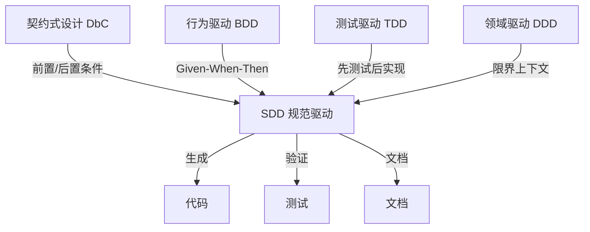
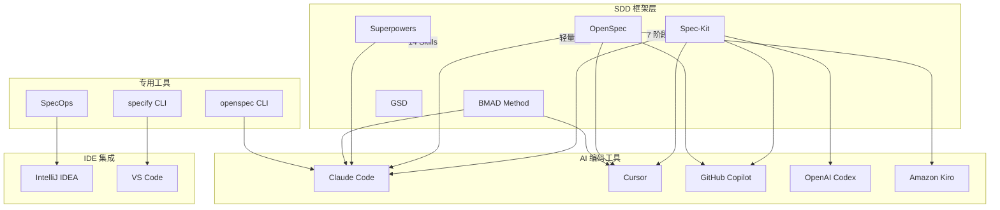
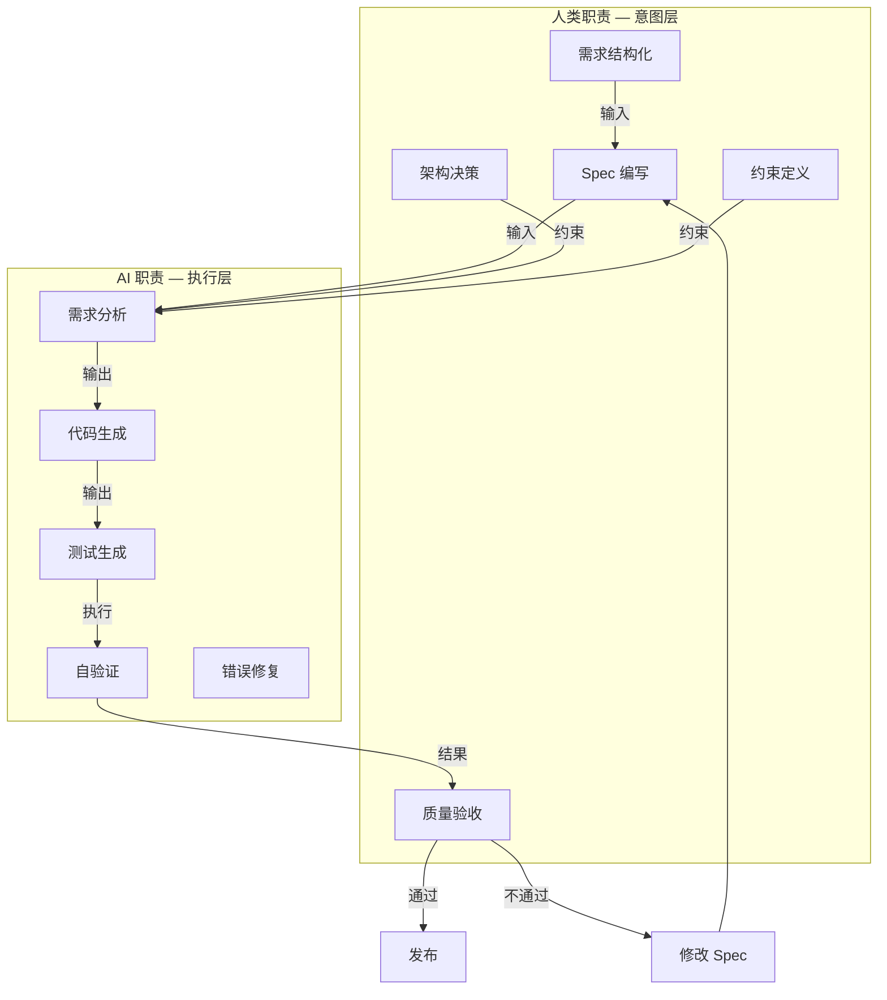
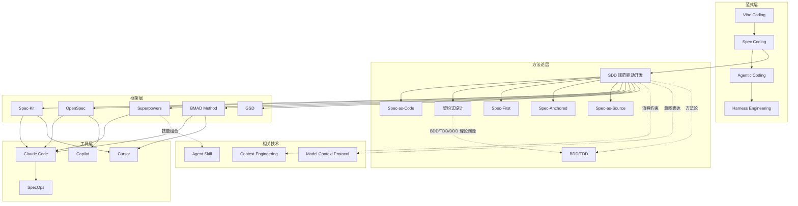
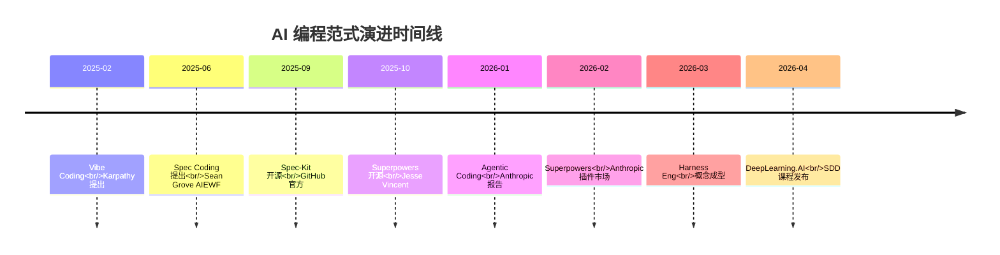
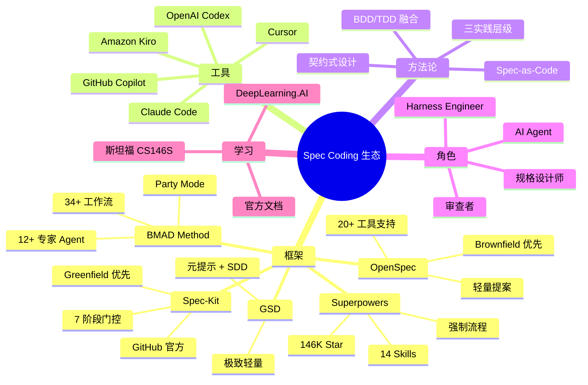
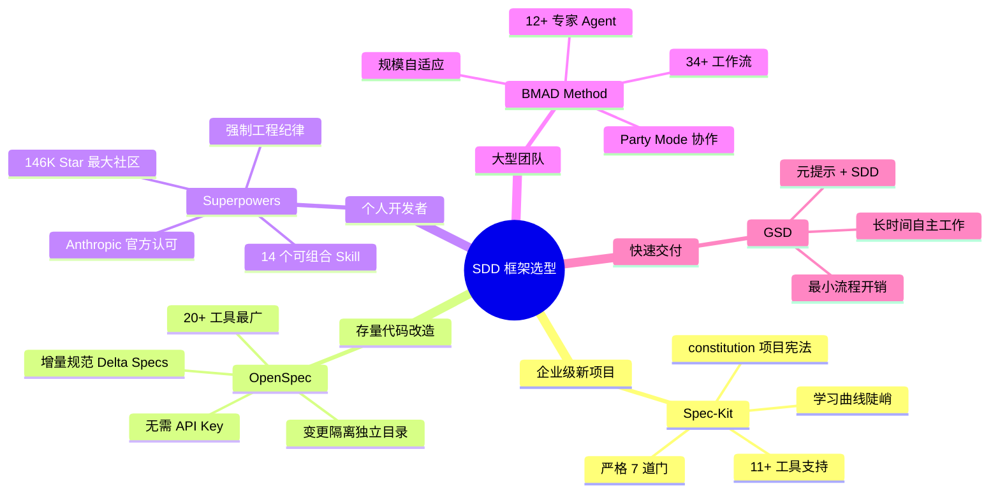

# T2 知识图谱：Spec Coding 全景知识图谱

> 创建日期：2026-04-27 | 最后更新：2026-04-27 | 版本：v1.0
> 领域：AI 编码工程化 | 用途：Spec Coding 生态全量调研的概念索引与关系导航

---

## 目录

- [1. 图谱概览](#1-图谱概览)
- [2. 实体定义（范式层）](#2-实体定义范式层)
- [3. 实体定义（SDD 方法论层）](#3-实体定义sdd-方法论层)
- [4. SDD 框架层](#4-sdd-框架层)
- [5. 工具链层](#5-工具链层)
- [6. 角色层（人机协作边界）](#6-角色层人机协作边界)
- [7. 课程与学习资源](#7-课程与学习资源)
- [8. 企业实践层](#8-企业实践层)
- [9. 质量与风险层](#9-质量与风险层)
- [10. 相关技术映射](#10-相关技术映射)
- [11. 可视化图谱](#11-可视化图谱)
- [12. 应用场景与扩展阅读](#12-应用场景与扩展阅读)

---

## 1. 图谱概览

本图谱覆盖 **Spec Coding（规约编程）** 的核心概念与关系，共包含 **40+ 个实体** 和 **15 种关系类型**。

- **目标读者**：
  - 正在从 Vibe Coding 转向 Spec Coding 的开发者
  - 评估 SDD 框架选型的团队技术负责人
  - 研究 AI 编码工程化的研究者
  - 需要为 AI Agent 建立工作流约束的 Harness Engineer

- **覆盖范围**：
  - 范式演进：Vibe Coding → Spec Coding → Agentic Coding → Harness Engineering
  - SDD 方法论：规范即代码、契约式设计、三实践层级
  - 5 大 SDD 框架：Spec-Kit、OpenSpec、Superpowers、BMAD Method、GSD
  - 工具链生态：AI 编码工具、专用工具、IDE 集成
  - 角色与职责：人机协作边界
  - 课程与学习资源、企业实践、质量与风险
  - 与 MCP / Agent Skill / Context Engineering / BDD/TDD 的关系映射

  **不覆盖**：具体框架的安装教程（见各框架官方文档）、单一语言的编码实践

- **前置知识**：
  - 了解 AI 编码助手（Claude Code、Cursor、Copilot 等）的基本用法
  - 理解软件开发基本流程（需求 → 设计 → 编码 → 测试）
  - 了解 Prompt Engineering 基础概念

- **核心问题**：
  1. Spec Coding 解决了 Vibe Coding 的哪些根本缺陷？
  2. 5 大 SDD 框架各有什么定位，如何选型？
  3. 开发者在 Spec Coding 时代需要掌握哪些新技能？
  4. 企业如何将 Spec Coding 落地到现有代码库？
  5. Spec Coding 与 MCP、Agent Skill 等生态如何协同？

---

## 2. 实体定义（范式层）

### 2.1 核心实体

| 实体名称 | 类型 | 定义 | 关键特征 |
|---------|------|------|---------|
| **Vibe Coding** | 概念 | Karpathy 2025 年 2 月提出，用自然语言描述需求，AI 直接生成代码的编程范式 | 低审查度、试错迭代、快速原型、缺乏设计文档 |
| **Spec Coding** | 概念 | Sean Grove 在 AIEWF 2025 提出，先写结构化规范，再让 AI 按规范生成代码 | Spec 是单一事实源、代码是 Spec 的输出、可审计可协作 |
| **Agentic Coding** | 概念 | Agent 自主规划、执行、调试、测试的编程范式，人类负责审查和决策 | 多步骤自主执行、工具调用、自我修正 |
| **Harness Engineering** | 概念 | 为 AI Agent 建立系统级约束和质量保障的工程实践，确保 AI 代码可靠运行 | 约束驱动、质量门禁、系统架构设计 |
| **SDD** | 概念 | Specification-Driven Development，以结构化规范为唯一事实源的开发方法 | Specify → Plan → Tasks → Implement → Validate |

### 2.2 范式演进时间线

```
2025-02  Karpathy 提出 Vibe Coding
    ↓
2025-06  Sean Grove AIEWF: "Spec 比代码更重要"
    ↓
2025-09  GitHub 发布 spec-kit 开源，SDD 产品化
    ↓
2025-10  Superpowers 开源（Jesse Vincent）
    ↓
2026-01  Anthropic 报告：Agentic Coding 时代到来
    ↓
2026-02  Superpowers 进入 Anthropic 官方插件市场
    ↓
2026-03  Harness Engineering 概念成型
    ↓
2026-04  DeepLearning.AI × JetBrains 发布 SDD 课程
```

### 2.3 范式对比矩阵

| 维度 | Vibe Coding | Spec Coding | Agentic Coding | Harness Engineering |
|------|------------|-------------|----------------|-------------------|
| **驱动源** | 模糊 Prompt | 结构化 Spec | 目标 + 工具集 | 约束 + 质量门禁 |
| **人类角色** | 需求描述者 | 规格设计师 + 审查者 | 监督者 + 决策者 | 系统架构师 |
| **AI 角色** | 代码生成器 | 代码编译器 | 自主工程师 | 受约束的执行者 |
| **代码质量** | Demo 级 | 生产级 | 生产级（需约束） | 生产级（有保障） |
| **适用场景** | 个人原型 | 团队协作、企业项目 | 复杂任务自主完成 | 大规模 AI 编码管理 |
| **上下文管理** | 对话历史（易丢失） | 持久化 Spec 文件 | Agent 记忆 + 工具 | 系统级约束文件 |

### 2.4 Vibe Coding 核心特征

| 特征 | 描述 |
|------|------|
| **提示词驱动** | 自然语言描述需求，AI 直接生成代码 |
| **低审查度** | 对 AI 生成代码不做详细审查，直接接受 |
| **试错迭代** | 遇到错误 → 复制给 AI → 等待修复 → 循环 |
| **快速原型** | 几分钟内从想法到可运行代码 |

**局限**：
1. 信息差：AI 不了解团队规范、历史债务、非公开框架
2. 可控性差：可能引入不安全代码，性能边界未考虑
3. 协作困难：需求变更在对话历史中，无法追溯

### 2.5 Spec Coding 核心主张

| 主张 | 说明 |
|------|------|
| **Spec 是单一事实源** | 需求、设计、验收标准都记录在 Spec 中 |
| **代码是 Spec 的输出** | 代码由 AI 根据 Spec 生成，可随时重新生成 |
| **人类审查 Spec** | 通过审查和修改 Spec 控制 AI 编码行为 |
| **文档永不过期** | Spec 与代码同步更新，始终保持一致 |

### 2.6 范式跃迁核心公式

```
Vibe Coding    = 模糊意图 + AI 猜测 + 反复试错
Spec Coding    = 结构化 Spec + AI 生成 + 人类审查
Agentic Coding = 目标 + 工具集 + Agent 自主规划执行
Harness Eng    = 约束系统 + 质量门禁 + AI 受控执行
```

---

## 3. 实体定义（SDD 方法论层）

### 3.1 规范即代码（Spec-as-Code）

**定义**：将规范视为可执行的第一性产物，代码是规范的实现输出，可随时从规范重新生成。

**核心逻辑**：
```
传统：代码 = 真理，规范服务于代码（写完后过期）
SDD：  规范 = 真理，代码服务于规范（代码可随时重新生成）
```

**关键特征**：
- 规范是结构化、可验证、可演化的技术工件
- 规范能被工具和 AI 稳定解析
- 代码是规范的"编译产物"，类似于高级语言编译为二进制

**来源**：GitHub spec-kit [spec-driven.md](https://github.com/github/spec-kit/blob/main/spec-driven.md)

---

### 3.2 契约式设计（Design by Contract, DbC）

**定义**：Bertrand Meyer 1980 年代提出的软件设计方法论，通过前置条件、后置条件和不变量来定义软件组件的行为契约。

**三要素**：
| 要素 | 说明 | SDD 映射 |
|------|------|---------|
| **前置条件** | 方法执行前必须满足的条件 | Spec 中的输入约束 |
| **后置条件** | 方法执行后必须保证的结果 | Spec 中的验收标准 |
| **不变量** | 对象在整个生命周期中必须保持的属性 | Spec 中的业务规则 |

**与 SDD 的关系**：
- SDD 将 DbC 的形式化契约思想扩展到自然语言规范
- 用 Given-When-Then 场景替代形式化断言
- AI 充当"合约执行者"，根据契约生成实现代码

---

### 3.3 三实践层级

| 层级 | 名称 | 核心特征 | 人类职责 | AI 职责 | 成熟度 |
|------|------|----------|---------|--------|--------|
| **Level 1** | Spec-First | 先立规矩再动手 | 编写 Spec、审查结果 | 按 Spec 生成代码 | 主流实践 |
| **Level 2** | Spec-Anchored | 以 Spec 为锚点验收 | 维护 Spec、验收变更 | 根据 Spec 更新代码 | 部分团队 |
| **Level 3** | Spec-as-Source | 规格即源码 | 纯粹维护 Spec | 代码完全自动生成 | 激进探索 |

**业界状态（2026 年）**：
- 主流处于 Level 1 → Level 2 过渡
- Tessl 等工具探索 Level 3
- GitHub spec-kit、Amazon Kiro 支持 Level 1 工作流

---

### 3.4 SDD 与传统方法论的关系

| 方法论 | 核心思想 | 与 SDD 的关系 |
|--------|---------|--------------|
| **BDD**（行为驱动） | Given-When-Then 场景描述行为 | SDD 吸收 BDD 的验收场景格式，扩展到完整规范 |
| **TDD**（测试驱动） | 先写测试，再写实现 | SDD 包含 TDD 作为实现阶段的子流程 |
| **DDD**（领域驱动） | 围绕领域模型组织代码 | SDD 的 Spec 可以包含 DDD 的限界上下文定义 |
| **DbC**（契约式） | 前置/后置/不变量约束 | SDD 将形式化契约自然语言化，供 AI 解析 |

**关系图**：



---

## 4. SDD 框架层

### 4.1 Spec-Kit（GitHub 官方）

| 属性 | 值 |
|------|------|
| **仓库** | [github/spec-kit](https://github.com/github/spec-kit) |
| **Star** | 91K+（2026-04） |
| **语言** | Python（uv 包管理） |
| **发布** | 2025 年 9 月，GitHub 官方出品 |
| **核心人物** | Den Delimarsky, John Lam |

**7 阶段门控流程**：

```
constitution → specify → clarify → plan → tasks → analyze → implement
   ↓              ↓          ↓         ↓        ↓         ↓          ↓
  项目宪法      需求规格   需求澄清  技术计划  任务分解  一致性检查  代码实现
```

**核心组件**：
- `constitution.md`：项目级不可违反规则（代码风格、安全要求、禁止使用的库）
- `spec.md`：功能需求描述（只说 what 和 why，不涉及技术栈）
- `plan.md` / `tasks.md`：AI 自动生成的技术计划和任务分解

**适用场景**：
- 多人协作的企业级项目
- 需要严格质量管控的团队
- Greenfield 项目（从零开始）

**不适合**：想快速跑通 Demo 的独立开发者（流程太重）

**特点**：
- 严格阶段门控，每道门必须关好才能进入下一道
- 支持模板引擎 + 扩展系统
- 兼容 11+ AI 工具（Claude Code、Copilot、Cursor 等）

---

### 4.2 OpenSpec（Fission-AI）

| 属性 | 值 |
|------|------|
| **仓库** | fission-ai/openspec |
| **Star** | 34.5K+（2026-04） |
| **语言** | TypeScript（npm 安装） |
| **核心理念** | fluid、iterative、easy、built for brownfield |

**核心工作流**：

```
快速工作流（core）：
  /opsx:propose → /opsx:apply → /opsx:archive

扩展工作流（workflows）：
  /opsx:new → /opsx:continue → /opsx:ff → /opsx:verify → /opsx:sync → /opsx:bulk-archive
```

**目录结构**：
```
openspec/
├── specs/          # 已实现的功能（真相之源）
└── changes/        # 待实现的提案
    └── [变更名]/
        ├── proposal.md   # 为什么要做、做什么
        ├── design.md     # 技术方案
        ├── tasks.md      # 实施清单
        └── specs/        # 规范增量（补丁）
```

**核心设计——增量规范（Delta Specs）**：
```markdown
<!-- ADDED Requirements
### Requirement: Two-Factor Authentication
The system MUST require a second factor during login.

MODIFIED Requirements
### Requirement: Session Timeout
The system SHALL expire sessions after 30 minutes. (Previously: 60 minutes)
-->
```

**特点**：
- Brownfield 优先设计——明确面向现有代码库的渐进式改造
- 无需 API Key 和 MCP，通用性最强
- 支持 20+ AI 工具（覆盖最广）
- 变更隔离——每个功能变更独立目录，避免上下文污染
- 随着时间推移，Spec 逐渐积累形成完整系统知识库

**不适合**：对代码质量有硬性要求的团队（OpenSpec 本身不强制 TDD）

---

### 4.3 Superpowers（Jesse Vincent）

| 属性 | 值 |
|------|------|
| **仓库** | [obra/superpowers](https://github.com/obra/superpowers) |
| **Star** | 146K+（2026-04），社区规模最大 |
| **作者** | Jesse Vincent (@obra)，Request Tracker 作者 |
| **发布时间** | 2025 年 10 月 |

**核心理念**：Process over Prompt（流程大于提示词）

**14 个可组合 Skill**（按阶段组织）：

| 阶段 | Skill | 功能 |
|------|-------|------|
| **Define** | TDD | 测试驱动开发流程 |
| **Define** | Brainstorm | 头脑风暴、需求澄清 |
| **Plan** | Plan | 技术计划生成 |
| **Build** | SubAgent | 子 Agent 执行 |
| **Build** | Incremental | 增量开发 |
| **Verify** | Debug | 结构化调试 |
| **Verify** | Test | 自动化测试 |
| **Review** | Code Review | 代码质量审查 |
| **Review** | Security | 安全审查 |
| **Ship** | Deploy | 部署流程 |
| ... | ... | ... |

**核心优势**：
1. 强制流程：需求澄清 → 设计方案 → 代码编写 → 测试验证
2. 苏格拉底式提问：引导用户明确真实需求，而非直接写代码
3. 会话防漂移：长时间工作不丢失架构约定
4. 可组合：多个 Skill 组合成复杂工作流
5. 2026 年 2 月进入 Anthropic 官方插件市场

**定位**：偏「方法论 + 技能库」，本质上是可组合技能库 + 编码工作流

---

### 4.4 BMAD Method

| 属性 | 值 |
|------|------|
| **仓库** | bmad-method |
| **版本** | v6（2026-04） |
| **定位** | 全生命周期敏捷框架 + 模块生态 |
| **许可** | 100% 开源，无付费墙 |

**核心特点**：
- **34+ 工作流**：覆盖头脑风暴 → 部署完整生命周期
- **12+ 专家 Agent 角色**：PM、架构师、开发者、UX、Scrum Master 等
- **Party Mode**：多 Agent 角色协作讨论
- **规模自适应**：根据项目复杂度自动调整规划深度（单点修复 → 企业级交付）
- **模块化生态**：BMM（核心框架）、BMB（自定义 Agent）、TEA（测试架构）、BMGD（游戏开发）、CIS（创新套件）

**安装**：
```bash
npx bmad-method install
npx bmad-method install --directory /path/to/project --tools claude-code --yes
```

**与 SDD 的关系**：
- BMAD 本质上是更广泛的敏捷框架，SDD 是其子集
- 内置工作流包含 Spec-First 实践
- 通过多角色 Agent 协作实现规范的全生命周期管理

---

### 4.5 GSD（Get-Shit-Done）

| 属性 | 值 |
|------|------|
| **仓库** | gsd-build/gsd-2 |
| **语言** | TypeScript |
| **定位** | 极致轻量的元提示 + 上下文工程 + SDD 系统 |

**核心特点**：
- 元提示词（meta-prompting）+ 上下文工程 + SDD 三合一
- 使 Agent 能长时间自主工作而不丢失大局
- 适合快速交付、小团队或个人项目

---

### 4.6 5 大框架对比矩阵

| 维度 | Spec-Kit | OpenSpec | Superpowers | BMAD Method | GSD |
|------|----------|----------|-------------|-------------|-----|
| **定位** | 严格阶段门控 | 轻量规范层 | 技能驱动工作流 | 全生命周期敏捷 | 元提示+SDD |
| **流程严格度** | ★★★★★（7 道门） | ★★☆（灵活） | ★★★★（强制流程） | ★★★★（34+ 工作流） | ★★☆（轻量） |
| **Star 数** | 91K+ | 34.5K+ | 146K+ | 社区驱动 | 社区驱动 |
| **AI 工具支持** | 11+ | 20+（最广） | Claude Code 为主 | 多 IDE | 多 IDE |
| **适用项目** | Greenfield | Brownfield | 通用 | 通用 | 个人/小团队 |
| **TDD 强制** | 可选 | 不强制 | 强制 | 可选 | 可选 |
| **变更隔离** | 无 | ✓（独立目录） | 部分 | 部分 | 部分 |
| **是否需要 API Key** | 否 | 否 | 否 | 否 | 否 |
| **学习曲线** | 陡峭 | 平缓 | 中等 | 陡峭 | 平缓 |
| **团队协作** | 强 | 开发中 | 中等 | 强（Party Mode） | 弱 |

**选型建议**：

| 场景 | 推荐框架 |
|------|---------|
| 企业级新项目，严格质量管控 | Spec-Kit |
| 现有代码库渐进式改造 | OpenSpec |
| 个人开发者，追求工程纪律 | Superpowers |
| 大型团队，多角色协作 | BMAD Method |
| 快速交付，最小流程开销 | GSD |

---

## 5. 工具链层

### 5.1 AI 编码工具

| 工具 | 开发者 | 形态 | SDD 兼容 | 特点 |
|------|--------|------|---------|------|
| **Claude Code** | Anthropic | CLI | ✓（Superpowers 宿主） | 终端原生 Agent，MCP 支持，SubAgent |
| **Cursor** | Cursor Inc. | IDE | ✓（Spec-Kit 支持） | AI 原生 IDE，Composer 多文件编辑 |
| **GitHub Copilot** | GitHub | IDE 插件 | ✓（Spec-Kit 官方支持） | VS Code 集成，prompt 文件自定义 |
| **OpenAI Codex** | OpenAI | CLI | ✓ | 终端 Agent，多步任务执行 |
| **Amazon Kiro** | AWS | IDE | ✓（内置 SDD） | 首个将 SDD 产品化的 IDE |
| **Windsurf** | Codeium | IDE | ✓（OpenSpec 支持） | 深度 AI IDE 集成 |
| **OpenClaw** | 社区 | CLI | ✓ | 打通聊天工具 + 桌面 + 技能系统 |

### 5.2 专用工具

| 工具 | 描述 | 关联 |
|------|------|------|
| **SpecOps** | DeepLearning.AI 课程配套，生成 Git 追踪的规范文件（requirements.md / design.md / tasks.md） | 对抗性评估 + 依赖审查 5 项标准 |
| **Spec-Kit CLI** | GitHub 官方 `specify` 命令行工具，引导完成 7 阶段流程 | Spec-Kit 框架核心 |
| **OpenSpec CLI** | `openspec` 命令行工具，支持 propose/apply/archive 等命令 | OpenSpec 框架核心 |

### 5.3 IDE 集成

| IDE | 集成方式 | 支持框架 |
|-----|---------|---------|
| **IntelliJ IDEA** | SpecOps 插件 | SpecOps / SDD 课程 |
| **VS Code** | Copilot 自定义 prompt 文件（.prompt.md） | Spec-Kit（通过 .github/prompts/） |
| **Cursor** | Slash Commands + Custom Commands | Spec-Kit / OpenSpec / Superpowers |
| **Claude Code** | Skills 系统（.claude/skills/） | Superpowers / BMAD / OpenSpec |

### 5.4 工具生态图谱



---

## 6. 角色层（人机协作边界）

### 6.1 核心角色实体

| 实体名称 | 类型 | 定义 | 关键特征 |
|---------|------|------|---------|
| **规格设计师** | 角色 | 开发者转型后的角色，负责编写和维护 Spec | 需求结构化、意图表达、边界定义、验收标准设计 |
| **审查者** | 角色 | 审查 AI 生成代码是否符合 Spec 的人类 | 代码审查、规格对齐验证、安全审计 |
| **AI Agent** | 角色 | 根据 Spec 生成代码、执行测试的 AI 编码代理 | 代码生成、自验证、任务执行、错误修复 |
| **Harness Engineer** | 角色 | 建立系统级约束和质量门禁的工程师 | 约束系统设计、质量门禁配置、依赖审查、对抗性测试 |
| **系统架构师** | 角色 | 负责整体技术选型和架构决策 | 技术选型、架构设计、约束定义、技术债务管理 |

### 6.2 职责划分矩阵

| 职责 | Vibe Coding 时代 | Spec Coding 时代 | 执行者 |
|------|-----------------|-----------------|--------|
| 需求理解 | 模糊描述，AI 猜测 | 结构化 Spec 定义 | 规格设计师 |
| 架构设计 | AI 自由发挥 | Spec 中定义约束 | 系统架构师 + AI |
| 编码实现 | 逐行手写 | AI 根据 Spec 生成 | AI Agent |
| 测试编写 | 人工编写 | AI 根据验收标准生成 | AI Agent（规格设计师审查） |
| 代码审查 | 人工审查 | AI 自验证 + 人工审查 | AI Agent + 审查者 |
| 依赖引入 | 随意添加 | 5 项标准审查 | Harness Engineer |
| 质量门禁 | 无 | 自动化检查 | Harness Engineer |
| 部署发布 | 手动/CI | AI 辅助 + 人工审批 | Harness Engineer + 审查者 |

### 6.3 角色演进时间线

```
传统开发        →    Vibe Coding    →    Spec Coding    →    Harness Engineering
                                                       
开发者 = 编码者     开发者 = 描述者     开发者 = 规格设计师    开发者 = 系统架构师
                                        审查者              Harness Engineer
AI = 补全工具       AI = 生成器        AI = 编译器          AI = 受约束执行者
```

### 6.4 人机协作边界模型



---

## 7. 课程与学习资源

### 7.1 DeepLearning.AI × JetBrains: Spec-Driven Development with Coding Agents

| 属性 | 值 |
|------|------|
| **课程名称** | Spec-Driven Development with Coding Agents |
| **讲师** | Paul Everett（JetBrains 开发者布道师） |
| **介绍** | Andrew Ng（吴恩达） |
| **平台** | DeepLearning.AI（免费） |
| **IDE** | IntelliJ IDEA + SpecOps 工具链 |
| **兼容** | Claude Code、Cursor、GitHub Copilot 等 |
| **项目** | Agent Clinic（完整 Web 应用） |

**口号**：Building AI agents that ship to production, not just impress in demos

### 7.2 四大核心模块

| 模块 | 内容 | 核心要点 |
|------|------|---------|
| **模块 1：SDD 核心理念** | SDD vs Vibe Coding 对比 | 结构化 Spec 是唯一事实源，Specify → Plan → Tasks → Implement → Validate |
| **模块 2：高质量 Spec 编写** | Spec 必备要素 + 写作实战 | 功能目标、输入输出约束、错误处理、验收标准（Given-When-Then）、非功能要求 |
| **模块 3：SpecOps 四阶段** | Understand → Spec → Implement → Complete | 代码库分析、规范编写、分任务编码、对抗性评估 + 依赖审查 |
| **模块 4：实战 + 生产技巧** | 用户登录模块、API 服务 | 依赖引入 5 项审查、对抗性测试、Spec 版本管理、大需求拆分 |

### 7.3 Spec 写作核心要素

| 要素 | 说明 | 示例 |
|------|------|------|
| **功能目标** | 做什么、为什么 | "用户登录：验证邮箱密码，返回 JWT" |
| **用户场景** | 谁在什么情况下使用 | "注册用户输入邮箱密码后点击登录" |
| **输入/输出格式** | 字段类型、长度、枚举 | "email: string, 必填, RFC 5322 格式" |
| **数据约束** | 边界条件 | "密码 8-128 字符，至少 1 个大写+1 个数字" |
| **错误处理** | 异常码、返回逻辑 | "401: 密码错误, 429: 超过 5 次尝试" |
| **验收标准** | Given-When-Then | "GIVEN 正确凭证 WHEN 登录 THEN 返回 JWT" |
| **非功能要求** | 性能、安全、依赖限制 | "响应时间 < 200ms, bcrypt cost ≥ 12" |

### 7.4 SpecOps 四阶段工作流

```
1. Understand（理解）
   ↓ Agent 分析现有代码库、依赖、架构
   ↓ 而非直接写代码

2. Spec（编写规范）
   ↓ 生成 requirements.md / design.md / tasks.md
   ↓ Git 追踪、跨会话持久

3. Implement（实现）
   ↓ Agent 按 Spec 分任务编码
   ↓ 自动校验格式与约束

4. Complete（验收）
   ↓ 对抗性评估
   ↓ 依赖审查（5 项标准）
   ↓ 确保符合验收标准
```

### 7.5 其他学习路径

| 资源 | 类型 | 描述 |
|------|------|------|
| **斯坦福 CS146S** | 课程 | The Modern Software Developer，AI 时代的软件开发 |
| **GitHub spec-kit 文档** | 文档 | spec-driven.md，官方 SDD 定义 |
| **OpenSpec 官方文档** | 文档 | 轻量规范层设计哲学 + 命令参考 |
| **Superpowers 官方文档** | 文档 | 14 Skills 详细说明 + 最佳实践 |
| **BMAD Method 文档** | 文档 | docs.bmad-method.org |

---

## 8. 企业实践层

### 8.1 腾讯云 CodeBuddy + Spec Coding 实践

| 属性 | 值 |
|------|------|
| **工具** | 腾讯云 CodeBuddy |
| **形态** | Plugin + IDE + CLI |
| **内部采纳率** | 90% 员工使用 |
| **AI 生成代码占比** | 50% |
| **提效** | 平均 > 20% |

**双流研发体系**（某保险巨头案例）：
```
需求 → CodeBuddy（AI 辅助编码）→ BackGroud Agent Platform（AI 协同）→ 
优测测试套件（自动化测试）→ 部署运营
```

**企业实践三阶段**：
1. **AI 辅助开发**：AI 解决单点问题，开发者主导全流程
2. **AI 驱动开发**：AI 闭环完成特定环节，人转为监督者 + 规则制定者
3. **AI 原生开发**：AI Agent Teams 端到端闭环，人仅负责验收 + 问题修复

**当前行业状态**：整体处于阶段 1 → 阶段 2 过渡

### 8.2 百度文心快码 Spec 模式

**核心机制**：通过 rules 规定 AI 的思考框架，解决"AI 改功能乱改"问题。

**类比**：
```
Vibe Coding = 街头大厨凭感觉颠勺（手感、火候、食客反馈）
Spec Coding = 米其林食谱精准做菜（食材清单、步骤、时间参数）
```

**五步流程**：
1. **情境**：确认需求背景、技术栈、资源清单
2. **问题**：锁定核心问题和目标
3. **分析评估**：拆解任务、预判风险、准备预案
4. **结论/行动**：严格按步骤执行，记录参数
5. **验证**：验收结果，记录经验

### 8.3 OpenClaw 实践（淘宝/网易/平安科技）

**核心观点**（QCon 2026 北京）：
- 需求理解阶段通过 SPEC 将需求结构化
- 通过 task 和 architecture 转化为技术设计
- 架构师评审技术栈、方案和接口
- 进入 plan 阶段逐步执行
- 保证 AI coding 在可控框架内落地

**未来判断**：程序员编写规范和设计架构比编写具体代码更有价值

### 8.4 行业采纳度与成熟度模型

```
采纳度成熟度模型（CMM for Spec Coding）

Level 1 - 初始：
  个人开发者试用单个 SDD 框架

Level 2 - 可重复：
  团队规范使用 1 个框架，有基本 Spec 模板

Level 3 - 已定义：
  组织级 SDD 流程，多框架组合使用
  Spec 模板标准化，与 CI/CD 集成

Level 4 - 可管理：
  Spec 质量量化管理，对抗性评估自动化
  依赖审查自动执行

Level 5 - 优化中：
  Spec 自动生成 + 验证
  持续从部署反馈优化 Spec 模板
```

**当前行业状态**：大部分企业处于 Level 1 → Level 2 过渡

### 8.5 得物技术：Claude Code + OpenSpec 实践

**核心发现**：
- AI 编码瓶颈不是模型能力，是上下文管理失效
- Google DORA 2024 报告：AI 采用率每增加 25%，交付稳定性下降 7.2%
- GPT-4o 在 1K Token 时准确率 99.3%，32K 时跌至 69.7%
- 上下文工程取代提示词工程成为核心

**实践方案**：
```
Claude Code（代理化执行） + OpenSpec（规格化驱动）
         ↓                          ↓
     自主执行                    持久化共识层
         ↓                          ↓
       闭环 AI 研发体系
```

---

## 9. 质量与风险层

### 9.1 Spec 质量评估标准

| 维度 | 检查项 | 说明 |
|------|--------|------|
| **完整性** | 是否包含功能目标、用户场景、输入输出、约束、验收标准？ | 缺失任一项都可能导致 AI 误解 |
| **无歧义** | 是否存在模糊词汇（"大概"、"可能"、"合理"）？ | 模糊词 = AI 自由发挥空间 |
| **可验证** | 验收标准是否为 Given-When-Then 格式？ | 非可测场景无法自动化验证 |
| **可追溯** | 每条需求是否有唯一标识？ | 便于追踪实现状态 |
| **一致性** | 不同 Spec 之间是否存在冲突？ | 多 Spec 并行时尤其重要 |
| **可执行** | AI 能否根据 Spec 直接生成代码？ | 过于抽象或高层无法直接执行 |

### 9.2 依赖审查（5 项标准）

DeepLearning.AI 课程提出的依赖引入审查标准：

| 序号 | 标准 | 说明 |
|------|------|------|
| 1 | **安全性** | 包是否有已知 CVE？维护者可信吗？ |
| 2 | **兼容性** | 与现有技术栈兼容吗？版本冲突？ |
| 3 | **必要性** | 功能能用现有依赖实现吗？ |
| 4 | **维护性** | 包的维护频率、社区活跃度、文档质量？ |
| 5 | **体积** | 引入后构建体积增加多少？性能影响？ |

### 9.3 对抗性测试方法论

**目标**：确保 Spec 和实现能覆盖边界情况和异常路径。

**方法**：
1. **边界值分析**：最小值、最大值、空值、超长输入
2. **异常路径**：网络失败、超时、权限不足、并发冲突
3. **反向测试**：故意违反 Spec，验证系统是否正确拒绝
4. **模糊输入**：非标准格式、恶意注入、特殊字符

**Given-When-Then 对抗示例**：
```
GIVEN 用户连续 5 次输入错误密码
WHEN 第 6 次尝试登录
THEN 账户锁定 15 分钟，返回 429 错误

GIVEN 用户发送 10MB 的 JSON payload
WHEN 请求到达 API
THEN 返回 413 错误，不处理请求体
```

### 9.4 常见反模式

| 反模式 | 描述 | 后果 | 正确做法 |
|--------|------|------|---------|
| **形式主义** | 填模板但不思考，Spec 成文档负担 | AI 仍然误解，流程变慢 | 只写 AI 真正需要的信息 |
| **过度约束** | Spec 规定实现细节（函数名、算法） | 限制 AI 优化空间 | 规定 what 和 why，不规定 how |
| **Spec 漂移** | 修改代码不更新 Spec | Spec 过期，失去事实源地位 | 代码变更前先更新 Spec |
| **一次到位** | 试图一次性写出完美 Spec | 流程卡死，无法启动 | 迭代式细化，先粗后精 |
| **孤立 Spec** | 多个 Spec 之间不协调 | 冲突需求，实现矛盾 | 建立 Spec 间引用关系 |
| **跳过验收** | Spec 写完直接实现，不做对抗评估 | 边界 case 遗漏，线上 Bug | 强制验收关卡 |
| **Spec 膨胀** | 单个 Spec 包含过多功能 | 难以审查，难以并行 | 大需求拆分为多 Spec |

### 9.5 Spec 质量检查清单

```
□ 功能目标清晰（一句话说清做什么）
□ 用户场景完整（谁、在什么情况下、怎么用）
□ 输入输出格式明确（字段类型、长度、枚举）
□ 数据约束完整（边界条件、必填/可选）
□ 错误处理策略清晰（异常码、返回逻辑）
□ 验收标准为 Given-When-Then 格式
□ 非功能要求已定义（性能、安全、依赖）
□ Spec 与已有 Spec 无冲突
□ 每条需求有唯一标识
□ AI 能否根据此 Spec 直接生成代码？
```

---

## 10. 相关技术映射

### 10.1 与 MCP（Model Context Protocol）的关系

| 维度 | Spec Coding | MCP |
|------|------------|-----|
| **关注点** | 开发流程约束 | 工具/资源标准化接入 |
| **解决的问题** | AI 写代码时不按规矩来 | AI 需要访问外部工具和数据 |
| **层级** | 流程层（方法论） | 协议层（基础设施） |

**协同关系**：
```
MCP 提供工具接入 → AI 有手（能操作外部系统）
Spec Coding 提供流程约束 → AI 有脑（知道按什么规矩操作）
         ↓
   MCP + SDD = AI 有手有脑地按规矩干活
```

**实战场景**：
- Agent 通过 MCP 访问数据库 → 按 Spec 定义的接口规范读写
- Agent 通过 MCP 调用外部 API → 按 Spec 定义的错误处理策略重试
- Agent 通过 MCP 读取项目文档 → 按 Spec 定义的上下文约束理解

**已有知识库**：MCP 核心知识体系位于 `Tech/Fundamentals/MCP/`

---

### 10.2 与 Agent Skill 的关系

| 维度 | Spec Coding | Agent Skill |
|------|------------|-------------|
| **抽象级别** | 方法论（做什么） | 能力单元（怎么做） |
| **形态** | Spec 文档 + 流程 | 可复用的技能模块 |
| **例子** | "先写 Spec 再编码" | "TDD 技能"、"代码审查技能" |

**协同关系**：
```
Agent Skill 提供可复用能力（如 TDD、Debug、Review）
Spec Coding 定义何时使用这些能力（流程约束）
         ↓
   Superpowers = SDD 流程 + 14 个 Agent Skills 的组合
```

**已有知识库**：SKILL 核心知识体系位于 `Tech/AI/SKILL/`

---

### 10.3 与 Context Engineering 的关系

| 维度 | Spec Coding | Context Engineering |
|------|------------|-------------------|
| **关注点** | 意图的结构化表达 | 上下文的有效管理 |
| **解决的问题** | AI 不知道做什么 | AI 不知道已有什么 |
| **手段** | Spec 文档（持久化） | 上下文窗口管理 + 知识注入 |

**协同关系**：
```
Spec = 意图的结构化表达（做什么）
Context = 项目的全局知识（已有什么）
         ↓
   Spec + Context = AI 知道在现有基础上做什么
```

**关键发现**（得物技术实践）：
- AI 在 1K Token 时准确率 99.3%，32K 时跌至 69.7%
- Spec 用少量 Token 传达精确意图，是最高效的上下文工程手段
- 上下文工程正在取代提示词工程

**已有知识库**：上下文工程核心知识体系位于 `Tech/AI/ContextEngineering/`

---

### 10.4 与传统 BDD/TDD 的关系

| 方法论 | 核心产物 | 验证时机 | 与 SDD 的关系 |
|--------|---------|---------|--------------|
| **BDD** | Given-When-Then 场景 | 测试阶段 | SDD 吸收 BDD 的验收格式，扩展为完整 Spec |
| **TDD** | 先写测试，再写实现 | 编码阶段 | SDD 的实现阶段可以包含 TDD 子流程 |
| **SDD** | Spec（需求+设计+验收） | 全生命周期 | 包含 BDD 和 TDD 作为子流程 |

**层级关系**：
```
SDD（顶层流程：什么时候做什么）
├── BDD（需求表达：Given-When-Then 验收场景）
│   └── 映射到 Spec 的验收标准
├── TDD（实现方式：先测试后代码）
│   └── 映射到 Spec 的实现阶段
└── DDD（架构组织：领域模型驱动）
    └── 映射到 Spec 的设计阶段
```

---

## 11. 可视化图谱

### 11.1 概念关系网络图



### 11.2 范式演进时间线



### 11.3 工具生态图谱



### 11.4 SDD 工作流全景图

```mermaid
flowchart LR
    subgraph S1[Spec-Kit 7 阶段]
        C[Constitution] --> Sp[Specify]
        Sp --> Cl[Clarify]
        Cl --> Pl[Plan]
        Pl --> Tk[Tasks]
        Tk --> An[Analyze]
        An --> Im[Implement]
    end

    subgraph S2[OpenSpec 4 阶段]
        Pr[Propose] --> Ap[Apply]
        Ap --> Ar[Archive]
        Ar --> Sp2[Spec 积累]
    end

    subgraph S3[Superpowers 流程]
        D[Define] --> Pl2[Plan]
        Pl2 --> B[Build]
        B --> V[Verify]
        V --> R[Review]
        R --> S[Ship]
    end

    subgraph S4[通用 SDD 流程]
        U[Understand] --> Sp4[Spec]
        Sp4 --> Im4[Implement]
        Im4 --> Co[Complete]
    end

    S1 -. 严格门控 .> S4
    S2 -. 轻量循环 .> S4
    S3 -. 技能驱动 .> S4
```

### 11.5 5 大框架对比思维导图



---

## 12. 应用场景与扩展阅读

### 12.1 使用场景

| 场景 | 描述 | 涉及实体 | 关键路径 |
|------|------|---------|---------|
| **新项目启动** | 从零开始构建应用，需要严格质量管控 | Spec-Kit, Constitution, Spec | SDD → Plan → Tasks → Implement |
| **存量代码改造** | 在已有代码库中引入 AI 编码规范 | OpenSpec, Delta Specs, 变更隔离 | Propose → Apply → Archive → Spec 积累 |
| **个人开发者提效** | 一人团队需要工程纪律约束 | Superpowers, 14 Skills | Define → Plan → Build → Verify |
| **团队协作升级** | 多人团队统一 AI 编码规范 | BMAD, Party Mode, 多角色 | 头脑风暴 → 规划 → 实现 → 审查 |
| **快速原型验证** | 需要最小流程开销快速交付 | GSD, 元提示 | 意图 → 快速实现 → 验证 |
| **企业级 SDD 落地** | 建立组织级规范驱动开发流程 | Spec-Kit + OpenSpec 组合 | Constitution → Spec → 迭代积累 |
| **学习 Spec Coding** | 系统学习 SDD 方法论和工具 | DeepLearning.AI 课程 | 理念 → Spec 写作 → SpecOps → 实战 |
| **框架选型决策** | 评估不同 SDD 框架适用性 | 5 框架对比矩阵 | 需求分析 → 对比 → 选型 → 试用 |

### 12.2 扩展阅读

#### SDD 框架
- [github/spec-kit](https://github.com/github/spec-kit) — GitHub 官方 SDD 工具包，91K+ Star
- [fission-ai/openspec](https://github.com/fission-ai/openspec) — 轻量规范层，Brownfield 优先
- [obra/superpowers](https://github.com/obra/superpowers) — 14 个可组合 Skill，146K+ Star
- [BMAD Method](https://docs.bmad-method.org) — 全生命周期敏捷框架
- [gsd-build/gsd-2](https://github.com/gsd-build/gsd-2) — 元提示 + SDD 系统

#### 课程与学习
- [DeepLearning.AI: Spec-Driven Development with Coding Agents](https://www.deeplearning.ai/short-courses/spec-driven-development-with-coding-agents) — 吴恩达 × JetBrains
- [斯坦福 CS146S: The Modern Software Developer](https://web.stanford.edu/class/cs146s/) — AI 时代的软件开发

#### 相关文章
- [GitHub spec-kit/spec-driven.md](https://github.com/github/spec-kit/blob/main/spec-driven.md) — SDD 方法论官方定义
- [知乎：三款 AI 编程工作流横评](https://zhuanlan.zhihu.com/p/2027738938278683539) — Spec-Kit/OpenSpec/Superpowers 选型
- [CSDN：5 款主流开源 SDD 框架深度体验与 PK](https://blog.csdn.net/DK_Allen/article/details/159921455) — 五框架对比
- [腾讯云：AI 辅助编程与 AI Specs 实战](https://cloud.tencent.com/developer/article/2656315) — 2026 最全进展
- [得物技术：Claude Code+OpenSpec 提速 AICoding 落地](https://cloud.tencent.com/developer/article/2644523) — 上下文管理实践

#### 知识库内部关联
- **Spec-First 核心知识体系**：`Tech/AI/DocumentFirst/SpecFirst/Spec-First 核心知识体系.md`
- **文档优先开发范式**：`Tech/AI/DocumentFirst/文档优先开发范式核心知识体系.md`
- **MCP 核心知识体系**：`Tech/Fundamentals/MCP/MCP 核心知识体系.md`
- **SKILL 核心知识体系**：`Tech/AI/SKILL/SKILL 核心知识体系.md`
- **上下文工程核心知识体系**：`Tech/AI/ContextEngineering/上下文工程核心知识体系.md`

---

### 12.3 完整引用列表

| # | 引用 | 类型 | 日期 | 备注 |
|---|------|------|------|------|
| 1 | [github/spec-kit](https://github.com/github/spec-kit) | 开源项目 | 2025-09 | SDD 官方工具包，91K+ Star |
| 2 | [spec-driven.md](https://github.com/github/spec-kit/blob/main/spec-driven.md) | 文档 | 2025-09 | SDD 方法论官方定义 |
| 3 | [fission-ai/openspec](https://github.com/fission-ai/openspec) | 开源项目 | 2025 | 轻量规范框架，34.5K+ Star |
| 4 | [obra/superpowers](https://github.com/obra/superpowers) | 开源项目 | 2025-10 | 14 Skills，146K+ Star |
| 5 | [BMAD Method](https://docs.bmad-method.org) | 文档 | 2026 | v6 全生命周期框架 |
| 6 | [DeepLearning.AI 课程](https://www.deeplearning.ai/short-courses/spec-driven-development-with-coding-agents) | 课程 | 2026-04 | 吴恩达 × JetBrains |
| 7 | [知乎：三款 AI 编程工作流横评](https://zhuanlan.zhihu.com/p/2027738938278683539) | 技术博客 | 2026 | Spec-Kit/OpenSpec/Superpowers |
| 8 | [CSDN：5 款主流开源 SDD 框架](https://blog.csdn.net/DK_Allen/article/details/159921455) | 技术博客 | 2026 | 五框架对比 + SpecKit/BMAD/OpenSpec/Superpowers/GSD |
| 9 | [腾讯云：AI 辅助编程与 AI Specs 实战](https://cloud.tencent.com/developer/article/2656315) | 技术博客 | 2026 | 2026 最全进展，含 Agentic IDE |
| 10 | [得物技术：Claude Code+OpenSpec](https://cloud.tencent.com/developer/article/2644523) | 技术博客 | 2026 | 上下文管理 + AI 编码瓶颈 |
| 11 | [腾讯云：AI 编程的三次范式跃迁](https://chengchao.blog.csdn.net/article/details/159543484) | 技术博客 | 2026 | Vibe→Spec→Harness |
| 12 | [知乎：Superpowers 保姆级教程](https://zhuanlan.zhihu.com/p/2027316583349920488) | 技术博客 | 2026 | 14 Skills 详解 |
| 13 | [腾讯云：OpenSpec 最佳实战](https://cloud.tencent.com/developer/article/2660452) | 技术博客 | 2026 | Delta Specs + 3 命令 |
| 14 | [百度：用 Spec 给 AI Agent 立规矩](https://cloud.baidu.com/article/5417114) | 技术博客 | 2026 | 文心快码 Spec 模式 |
| 15 | [InfoQ：OpenClaw 走红背后](https://dy.163.com/article/KNOG6OVP0511D3QS.html) | 技术博客 | 2026 | QCon 2026 AI Coding |
| 16 | [知乎：Spec-Driven Development 课程内容](https://zhuanlan.zhihu.com/p/2029945544009884537) | 技术博客 | 2026 | 四大核心模块全解 |
| 17 | [CSDN：Speckit 用了三个月我放弃了](https://zhuanlan.zhihu.com/p/1993009461451831150) | 技术博客 | 2026 | 反模式与实践困境 |
| 18 | [GitHub Topics: spec-driven-development](https://github.com/topics/spec-driven-development) | 代码仓库 | 2026 | 相关项目索引 |
| 19 | [Superpowers 深度解析](https://www.chenxutan.com/d/1710.html) | 技术博客 | 2026-04 | 146K Star 架构分析 |
| 20 | [知乎：AI 编程淘汰赛](https://zhuanlan.zhihu.com/p/2027536492537344924) | 技术博客 | 2026 | 从代码打字员到 AI 架构师 |

---

*图谱版本：v1.0 | 创建日期：2026-04-27*
*所有来源已验证并标注日期。*
