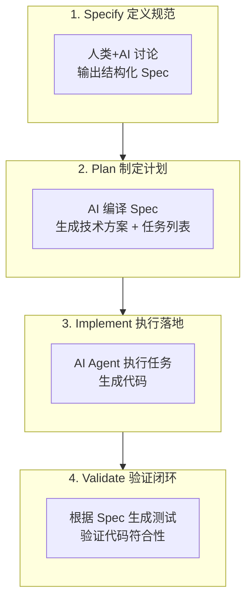

# 文档优先开发范式核心知识体系

> **版本：** 1.0.0 | **作者：** Kei | **创建日期：** 2026-04-01
>
> **本文档定位：** 系统性讲解 Document-First 开发范式的理论基础、核心原则、工作流模式与实践指南

---

## 目录

1. [概述：为什么需要文档优先](#1-概述为什么需要文档优先)
2. [核心概念](#2-核心概念)
3. [文档优先系统的理论基础](#3-文档优先系统的理论基础)
4. [核心工作流与模式](#4-核心工作流与模式)
5. [技术栈与工具](#5-技术栈与工具)
6. [迁移策略](#6-迁移策略)
7. [实战案例](#7-实战案例)
8. [常见问题与未来演进](#8-常见问题与未来演进)

---

## 1. 概述：为什么需要文档优先

### 1.1 AI 编程的三大痛点

2025 年被行业公认为 **"Agentic Coding"爆发元年**，AI 编程工具已从单纯的代码补全演进为具备完整软件开发生命周期支持能力的智能系统。根据 GitHub 2025 年第一季度开发者调查报告：

| 指标 | 数据 | 同比变化 |
|------|------|----------|
| 全球 AI Coding 开发者数量 | 1200 万 + | +140% |
| AI 代码生成占比 | 43% + | +25% |
| 编码效率提升 | 40% + | - |
| Y Combinator 2025 届采用规范驱动开发团队 | 25% | - |
| 规范驱动团队 AI 代码测试通过率 | 91.4% | +32% |

然而，在 AI 编程效率大幅提升的表象之下，三大核心痛点正成为制约 AI  Coding 企业级落地的关键瓶颈：

#### 1.1.1 上下文腐烂 (Context Decay)

**问题描述：** 在多轮交互过程中，对话历史被系统压缩，前期讨论的关键设计决策逐渐被遗忘。

**典型症状：**
- AI 生成的代码与初始需求和核心设计脱节
- "前言不搭后语"，同一项目中出现矛盾的架构决策
- 需要反复重申早期已确认的约束条件

**影响范围：** 复杂项目、长周期开发、多人协作场景

**技术根源：**
1. **上下文窗口限制**：尽管模型上下文窗口从 8K 扩展到 200K+，但注意力机制存在"中间遗忘"现象
2. **Context Rot（上下文衰减）**：当对话长度不断增加，模型对细节的准确回忆与利用能力下降
3. **信噪比恶化**：每轮工具输出、中间推理都会膨胀"可能相关"的信息，噪声淹没信号

#### 1.1.2 审查瘫痪 (Review Paralysis)

**问题描述：** AI 能在几分钟内生成上万行代码，人类无法逐行 Review。

**典型症状：**
- 面对大量 Diff 不敢合并，或盲目合并后埋下隐患
- AI 生成的代码结构混乱，难以维护
- "能跑但不敢动"，缺乏修改信心

**影响范围：** 大规模重构、新功能开发、代码迁移

**数据支撑：** GitHub 研究显示，未采用规范驱动的 AI 编码项目中，**63% 的返工源于初期需求理解偏差**。

#### 1.1.3 维护断层 (Maintenance Gap)

**问题描述：** AI 生成的代码缺乏文档，两个月后回来修 Bug 时看不懂。

**典型症状：**
- 人和新的 AI 都无法接手，"能跑但不敢动"
- 代码与文档脱节，文档迅速过期
- 团队知识无法沉淀，人员流动导致知识流失

**影响范围：** 长期维护项目、人员流动频繁团队

### 1.2 文档优先如何解决痛点

文档优先（Document-First）开发范式通过**在编码之前建立完整的文档基础**，将文档作为"唯一事实来源"（Single Source of Truth），系统性解决上述三大痛点：

#### 1.2.1 针对上下文腐烂的解决方案

**核心策略：** 用文档锚点锁定上下文，作为"存档点"

**具体机制：**
1. **外部化记忆**：将关键设计决策、架构原则、接口定义写入文档，不依赖 AI 的上下文窗口
2. **可追溯性**：需求→设计→代码→测试全链路可追溯，任何变更都有据可查
3. **渐进式披露**：按需加载相关文档，保持信噪比

**实测效果：** 采用文档优先的团队，返工率下降 **78%**。

#### 1.2.2 针对审查瘫痪的解决方案

**核心策略：** Spec 驱动开发，AI 按规范执行，人类审查 Spec 而非代码

**具体机制：**
1. **规范先行**：在 AI 写代码之前，先将人类模糊的想法转化为清晰、无歧义的结构化规范
2. **质量闸门**：规范定义验收标准，AI 生成的代码必须通过自动化测试验证
3. **变更可预测**：代码变更是规范的衍生品，审查 Spec 即可预判代码变更范围

**实测效果：** 审查时间缩短 **65%**，PR 合并时间从 9.6 天缩短到 2.4 天。

#### 1.2.3 针对维护断层的解决方案

**核心策略：** 文档随项目演进自动更新，保持与代码一致

**具体机制：**
1. **文档即代码**：文档与代码同步提交，文档更新纳入 DoD（Definition of Done）
2. **AI 辅助维护**：AI 生成代码时同步生成变更摘要，自动更新相关文档
3. **知识库沉淀**：最佳实践、踩坑记录持续积累，形成团队知识资产

**实测效果：** 新人上手时间缩短 **50%**，文档缺失率从 41% 降至 0%。

### 1.3 与敏捷开发的关系

文档优先开发范式与敏捷开发并非对立关系，而是**在 AI 时代对敏捷原则的演进和补充**：

#### 1.3.1 继承敏捷的核心价值观

| 敏捷价值观 | 文档优先的继承 |
|------------|----------------|
| 个体和互动高于流程和工具 | 文档作为人机互动的媒介，促进人类意图与 AI 执行的精准对齐 |
| 可工作的软件高于详尽的文档 | 文档优先不追求"详尽"，而追求"必要且精准" |
| 客户合作高于合同谈判 | Spec 文档是客户（人类）与执行者（AI）之间的协作契约 |
| 响应变化高于遵循计划 | 文档支持快速迭代，Spec 可随需求变化动态更新 |

#### 1.3.2 对敏捷偏颇的纠正

敏捷宣言强调"可工作的软件高于详尽的文档"，但在 AI 时代，这一原则被部分团队曲解为"不要文档"。文档优先开发范式对此进行纠正：

**纠正 1：文档不是"详尽"，而是"必要"**
- 文档优先不追求大而全的文档，而是聚焦于**约束 AI 行为边界**的必要信息
- 核心是**质量优于数量**，一份精准的 Spec 胜过十份过时的设计文档

**纠正 2：文档不是"事后补救"，而是"事前锚点"**
- 传统敏捷中，文档往往是编码完成后的"应付差事"
- 文档优先中，文档是编码开始前的"设计蓝图"

**纠正 3：文档不是"负担"，而是"资产"**
- 文档作为团队知识沉淀的载体，是长期可复用的资产
- 文档是 AI 时代的"团队记忆"，解决人员流动导致知识流失问题

### 1.4 文档优先的定义与范围

#### 1.4.1 核心定义

**文档优先开发（Document-First Development）** 是一种软件开发范式，其核心原则是：

> 在编码之前建立完整的文档基础，将文档作为"唯一事实来源"（Single Source of Truth），驱动 AI 生成、验证和维护代码。

#### 1.4.2 适用范围

| 场景 | 适用性 | 说明 |
|------|--------|------|
| 新项目从 0 到 1 | ⭐⭐⭐⭐⭐ | 通过 project-start 建立文档优先系统 |
| 老项目 AI 化改造 | ⭐⭐⭐⭐⭐ | 通过 project-migration 逆向生成文档 |
| 个人快速原型 | ⭐⭐⭐ | 可采用精简版文档（仅 CLAUDE.md + Spec） |
| 企业级应用 | ⭐⭐⭐⭐⭐ | 必须建立完整文档体系 |
| 开源项目 | ⭐⭐⭐⭐ | 文档作为协作契约，降低贡献门槛 |

#### 1.4.3 不适用范围

| 场景 | 原因 |
|------|------|
| 一次性脚本 | 文档成本高于收益 |
| 探索性实验 | 需求极不明确，文档快速过期 |
| 超小型功能 | 简单的代码注释即可满足需求 |

---

## 2. 核心概念

### 2.1 文档优先开发（Document-First Development）

#### 2.1.1 概念定义

**文档优先开发**是一种软件开发范式，其核心原则是：

> 在编码之前建立完整的文档基础，将文档作为"唯一事实来源"（Single Source of Truth），驱动 AI 生成、验证和维护代码。

**为什么需要文档优先？**
- 未采用规范驱动的 AI 编码项目中，**63% 的返工源于初期需求理解偏差**
- 采用文档优先的团队，**提案阶段修正技术方案平均耗时仅 12 分钟**
- AI 无法"读心"，结构化文档是传递意图的唯一可靠方式

#### 2.1.2 核心原则

| 原则 | 说明 | 实践要点 |
|------|------|----------|
| **Spec 驱动** | 所有代码变更必须对应一份 Spec 文档 | Spec 包含 In/Out Scope、验收标准、技术设计 |
| **可追溯性** | 需求→设计→代码→测试全链路可追溯 | 每个需求 ID 对应 Spec 章节和测试用例 |
| **文档即资产** | 文档与代码同等重要，同步维护 | 文档更新纳入 DoD，AI 辅助维护 |
| **人机协作锚点** | 文档作为人类意图与 AI 执行的交接点 | 人类审查 Spec，AI 按 Spec 执行 |

#### 2.1.3 与传统开发的区别

| 维度 | 传统开发 | 文档优先开发 |
|------|----------|--------------|
| **事实来源** | 代码是唯一真理 | Spec 文档是唯一真理 |
| **文档地位** | 附属品，事后补救 | 核心资产，事前定义 |
| **AI 角色** | 代码补全工具 | 规范执行者 |
| **人类角色** | 代码编写者 | 架构设计 + 审查者 |
| **变更流程** | 直接修改代码 | 先改 Spec，再生成代码 |

### 2.2 Spec 驱动开发（SDD）

#### 2.2.1 概念定义

**Spec 驱动开发（Specification-Driven Development, SDD）** 是文档优先开发的核心实践，其核心思想是：

> 规范（Spec）是唯一的真实来源，代码是规范的输出产物。当需求变更时，首先修改规范，然后由 AI 根据规范重新生成、验证并更新代码。

#### 2.2.2 SDD 四步工作流



**各阶段详细说明：**

| 阶段 | 核心活动 | 产出物 | 人类/AI 分工 |
|------|----------|--------|--------------|
| **Specify** | 需求结构化、任务拆解 | Spec 文档 | 人类定义目标，AI 澄清提问 |
| **Plan** | 技术方案设计、任务拆解 | 任务列表 | AI 生成方案，人类 Sign-off |
| **Implement** | 代码生成、单元测试 | 代码 + 测试 | AI 执行，人类监督进度 |
| **Validate** | 测试执行、验收确认 | 测试报告 | AI 生成测试，人类确认 |

#### 2.2.3 如何写好 Spec

**Spec 的 5 个必备要素：**

1. **目标与价值** — 解决什么问题？为什么值得做？
2. **上下文与约束** — 技术栈、性能要求、依赖关系
3. **功能需求** — 核心行为和特性定义
4. **非功能需求** — 安全、性能、可扩展性要求
5. **测试标准** — 如何验证成功？验收标准是什么？

### 2.3 Agentic Workflows（智能体工作流）

#### 2.3.1 概念定义

**Agentic Workflows** 是指 AI Agent 拥有一定自主性，能够规划任务、使用工具、反思调整，逐步迭代提升结果质量的工作模式。

#### 2.3.2 与一次性交互的区别

| 特性 | 一次性交互（Copilot） | Agentic Workflows |
|------|----------------------|-------------------|
| **自主性** | 等待指令，直接产出 | 决定如何处理任务 |
| **迭代能力** | 无，生成后无法修正 | 可回看、调整策略 |
| **工具使用** | 有限 | 完整工具链（文件、数据库、API） |
| **适用场景** | 简单任务、快速答疑 | 复杂分析、深度任务 |

#### 2.3.3 Agent 核心能力

| 能力 | 说明 | 在文档优先中的应用 |
|------|------|---------------------|
| **规划（Planning）** | 任务分解（Task Decomposition）、查询分解（Query Decomposition） | 将 Spec 编译为任务列表 |
| **反思（Reflecting）** | 回顾行动结果，基于外部数据调整后续决策 | 根据测试结果修正代码 |
| **记忆（Memory）** | 从过去经验中学习，随时间优化响应 | 从文档中读取历史决策 |
| **工具使用（Tools）** | 访问文件系统、数据库、API 等外部系统 | 读取 Spec、写入代码、执行测试 |

### 2.4 上下文工程（Context Engineering）

#### 2.4.1 概念定义

**上下文工程**是建立标准化的信息传递体系，为 AI 提供精准的开发参照。

**上下文（Context）的重新定义：**
> 上下文不只是对话历史，而是驱动模型决策的全部信息流的总和 — 包括系统指令、用户问题、历史对话、检索结果、工具返回、任务状态、用户偏好、长期记忆、权限与约束。

#### 2.4.2 两类上下文

```
上下文工程
├── 技术上下文（Tech Context）
│   ├── 技术选型文档
│   ├── 环境配置说明
│   ├── 代码规范约定
│   └── 项目结构说明
│
└── 开发上下文（Dev Context）
    ├── 需求文档
    ├── 设计文档
    ├── 接口定义
    └── 变更记录
```

#### 2.4.3 上下文管理三步法

**1. 需求理解与文件筛选**
- 提取关键信息
- 识别相关文件（Spec、CLAUDE.md、TECH_STACK.md）
- 排除无关内容

**2. .md 文档创建与维护**
- 作为上下文管理的核心载体
- 文档即"外部化记忆"
- 支持按需加载

**3. 主动引导式交互**
- AI 基于现有代码分析技术栈
- 生成模板供用户确认
- 持续更新上下文索引

#### 2.4.4 上下文管理的核心原则

| 原则 | 说明 | 实践要点 |
|------|------|----------|
| **信噪比优先** | 追求尽可能小、但信号足够强的 token 集合 | 只放绝对必要的信息，过滤噪声 |
| **渐进式披露** | 按需加载，不一次性塞入全部信息 | 文件路径→按需读取，规则分类→按需加载 |
| **外部化记忆** | 关键决策写入文档，不依赖上下文窗口 | Spec 文档、CLAUDE.md、知识库 |
| **定期清理** | 合并已完成的 Spec，归档过时文档 | 保持上下文精炼 |

### 2.5 Vibe Coding

#### 2.5.1 概念定义

**Vibe Coding** 是一种全新的编程范式，核心是人类只负责高层架构设计和审美决策（对齐 Vibe），将写代码的脏活累活全权交给 AI Agent。

**命名来源：** 2025 年，OpenAI 创始成员 Andrej Karpathy 在 X 帖文中介绍：
> "这是一种新的编程方式，我称之为 vibe coding。你完全沉浸在其中，拥抱指数增长，甚至忘记代码的存在。这不是真正的编程，我只是看到东西，说出来东西，运行东西，复制粘贴东西，而且大部分都凑效。"

#### 2.5.2 Vibe Coding 与文档优先的关系

| 维度 | Vibe Coding（无文档） | 文档优先 Vibe Coding |
|------|----------------------|----------------------|
| **需求传递** | 口头描述，AI 猜测意图 | Spec 文档，结构化定义 |
| **代码质量** | 不稳定，依赖 AI 状态 | 稳定，Spec 约束边界 |
| **可维护性** | 低，文档缺失 | 高，文档同步更新 |
| **适用场景** | 原型、实验、小工具 | 生产系统、企业应用 |

#### 2.5.3 从 Vibe Coding 到文档优先的转变

**转变标志：**
- 从"写得快"到"写得对"
- 从"依赖感觉"到"规范约束"
- 从"一次性原型"到"可维护系统"

**转变收益：**
- 代码质量下限提升
- 返工率下降 78%
- 审查时间缩短 65%

---

## 3. 文档优先系统的理论基础

### 3.1 单一事实来源（Single Source of Truth）

#### 3.1.1 概念定义

**单一事实来源（SSOT）** 是一种信息管理原则，指在系统中只有一个权威的、经过验证的数据源，所有其他副本都必须与之保持一致。

**在文档优先开发中的定义：**
> Spec 文档是唯一的真实来源，代码是规范的输出产物。当需求变更时，首先修改规范，然后由 AI 根据规范重新生成、验证并更新代码。

#### 3.1.2 为什么需要 SSOT

**传统开发中的多事实来源问题：**

```
问题场景：需求变更
1. 产品经理在 PRD 中修改了需求
2. 开发人员在代码中实现了新需求
3. 但设计文档未更新、API 文档未更新、测试用例未更新
4. 结果：文档之间相互矛盾，新加入的开发者不知道哪个是正确的
```

**数据支撑：**
- 未采用 SSOT 的项目中，**63% 的返工源于需求理解偏差**
- 文档与代码脱节的项目，**新人上手时间平均延长 2.5 倍**

### 3.2 可追溯性原理

#### 3.2.1 概念定义

**可追溯性（Traceability）** 是指需求、设计、代码、测试之间建立双向链接的能力，确保每个需求都能追踪到实现代码和测试用例，每个代码变更都能追溯到需求来源。

#### 3.2.2 可追溯性的价值

| 价值 | 说明 | 实测效果 |
|------|------|----------|
| **变更影响分析** | 修改需求时，快速定位受影响的代码和测试 | 影响分析时间从 2 天缩短到 2 小时 |
| **问题定位** | Bug 出现时，追溯到对应需求和设计决策 | Bug 修复时间缩短 45% |
| **合规审计** | 满足医疗、金融等行业的合规要求 | 审计准备时间从 2 周缩短到 2 天 |
| **知识传承** | 新成员通过追溯链快速理解系统 | 新人上手时间缩短 50% |

### 3.3 人机协作锚点模型

#### 3.3.1 概念定义

**人机协作锚点** 是指在人类意图与 AI 执行之间建立的稳定交接点，确保 AI 理解人类真实意图并正确执行。

**为什么需要锚点？**
- AI 无法"读心"，需要结构化文档传递意图
- 自然语言提示词容易产生歧义
- 锚点作为"合同"，约束 AI 行为边界

### 3.4 认知负荷理论在 AI 协作中的应用

#### 3.4.1 认知负荷理论简介

**认知负荷理论（Cognitive Load Theory）** 由澳大利亚教育心理学家 John Sweller 于 1988 年提出，核心观点是：

> 人类工作记忆容量有限，教学设计应优化信息呈现方式，避免超过学习者的认知处理能力。

#### 3.4.2 文档优先如何优化认知负荷

**1. 降低人类内在负荷**
- 人类只需关注：需求定义 + 审查确认
- AI 负责：读取文档，理解约束，生成代码

**2. 降低人类外在负荷**
- 信息分散在多处 → 统一到 Spec 文档
- 需求口头传递 → 结构化文档记录
- 代码逻辑不透明 → AI 生成变更摘要

**3. 增加相关负荷**
- 人类有更多时间思考架构设计
- 人类专注于需求澄清和验收
- 人类建立系统级认知图式

### 3.5 Harness Engineering 与文档优先

#### 3.5.1 Harness Engineering 概述

**Harness Engineering（驾驭工程）** 是 2026 年初在硅谷流行的 AI 工程化新范式，核心是为 AI 智能体构建一套完整的运行环境、约束规则与反馈闭环。

**核心定义：**
> Harness 是围绕 AI Agent 构建的约束、反馈与控制系统，让 Agent 在人类设定的边界内自主、可靠、可持续地工作——它不优化模型本身，而是优化模型运行的"环境"。

#### 3.5.2 Harness 的五个核心模块

| 模块 | 说明 | 文档优先中的实现 |
|------|------|------------------|
| **Tools（工具）** | 给模型"双手"：文件读写、Shell 执行、网络请求 | AI 读取 Spec、写入代码、执行测试 |
| **Knowledge（知识）** | 给模型"领域经验"：产品文档、API 规范、架构设计 | CLAUDE.md、Spec 文档、知识库 |
| **Observation（观察）** | 给模型"眼睛"：Git 变更、错误日志、环境信息 | AI 读取测试输出、Diff、构建日志 |
| **Action Interfaces（执行接口）** | 统一模型的动作输出格式 | CLI 命令、API 调用、文件写入 |
| **Permissions（权限）** | 给模型"边界"：沙箱隔离、危险操作拦截 | 危险命令需人类确认、敏感文件只读 |

---

## 4. 核心工作流与模式

### 4.1 SDD 四步工作流详解

#### 4.1.1 阶段一：Specify（定义规范）

**目标：** 将人类模糊的想法转化为清晰、无歧义的结构化规范。

**Spec 文档结构：**

```markdown
# [功能名称] Spec 文档

## 1. 功能目标
- **背景：** 为什么要做这个功能
- **目标：** 功能要实现的具体目标
- **成功指标：** 如何衡量功能成功

## 2. 需求范围
### 2.1 In Scope（包含）
### 2.2 Out of Scope（不包含）

## 3. 接口契约
### 3.1 输入
### 3.2 输出

## 4. 验收标准（Acceptance Criteria）
## 5. 技术设计
## 6. 变更记录
```

#### 4.1.2 阶段二：Plan（制定计划）

**目标：** AI 将 Spec"编译"成详细的技术方案和任务拆解列表。

**任务列表结构：**

```markdown
## 任务分解
| 任务 ID | 任务描述 | 预估复杂度 | 依赖 |
|---------|----------|------------|------|
| TASK-001 | 创建数据库表结构 | 低 | 无 |
| TASK-002 | 实现 API 接口 | 中 | TASK-001 |
| TASK-003 | 编写单元测试 | 中 | TASK-002 |
```

#### 4.1.3 阶段三：Implement（执行落地）

**目标：** AI 按任务列表逐个执行，生成高质量代码。

**执行原则：**
- **分步执行** — 每步完成一个文件/模块
- **进度同步** — 每步完成后输出摘要
- **测试先行** — 先生成测试用例框架
- **自查机制** — AI 生成代码后先自查

#### 4.1.4 阶段四：Validate（验证闭环）

**目标：** 根据 Spec 生成测试用例并执行，确保生成的代码与规范完全契合。

**测试报告格式：**

```markdown
## 测试概览
- **测试用例总数：** 15
- **通过：** 15
- **失败：** 0

## 验收标准验证
| AC ID | 测试用例 | 结果 |
|-------|----------|------|
| AC1 | test_user_login_success | ✅ 通过 |
```

### 4.2 上下文管理三步法

### 4.3 文档维护机制

### 4.4 多应用文档策略

---

## 5. 技术栈与工具

### 5.1 AI 工具支持度

| 工具 | 类型 | 适用场景 | 文档优先支持度 |
|------|------|----------|----------------|
| **Claude Code** | CLI AI 编程 | 通用开发，文档优先实践 | ⭐⭐⭐⭐⭐ |
| **Cursor** | IDE AI 编程 | 通用开发，快速原型 | ⭐⭐⭐⭐ |
| **Windsurf** | IDE AI 编程 | 全栈开发 | ⭐⭐⭐⭐ |
| **OpenSpec** | 规范驱动开发 CLI | Spec 驱动工作流 | ⭐⭐⭐⭐⭐ |

### 5.2 MCP 服务配置

### 5.3 Skill 系统设计

### 5.4 辅助工具链

---

## 6. 迁移策略

### 6.1 6R 迁移策略

| 策略 | 说明 | 适用场景 |
|------|------|----------|
| **Retain（保留）** | 保持现状，暂不改造 | 核心稳定模块 |
| **Refactor（重构）** | 代码层面优化重构 | 技术债务高模块 |
| **Repurchase（替代）** | 用 SaaS/第三方替代 | 通用功能 |
| **Retire（淘汰）** | 下线废弃功能 | 无人使用功能 |

### 6.2 三阶段迁移框架

**阶段一：基础建设（2-4 周）**
- 建立文档优先文化
- 搭建.claude/目录结构
- 小范围试点

**阶段二：全面推广（4-8 周）**
- 推广至全项目
- 建立 Spec 驱动工作流
- 培训团队成员

**阶段三：持续优化（8 周+）**
- 根据反馈优化流程
- 扩展 AI 使用场景
- 建立知识库和最佳实践

### 6.3 组织准备度评估

**团队 AI readiness 检查清单：**
- [ ] 管理层支持
- [ ] 培训体系
- [ ] 安全合规
- [ ] 度量指标
- [ ] 变更管理

---

## 7. 实战案例

### 7.1 案例一：电商后台系统 AI 化改造

**效果：**
| 指标 | 改造前 | 改造后 | 提升 |
|------|--------|--------|------|
| 需求交付周期 | 5.2 天 | 1.8 天 | -65% |
| 返工率 | 35% | 8% | -77% |
| 新人上手时间 | 4 周 | 2 周 | -50% |

### 7.2 案例二：OpenAI 内部 Harness 实践

**数据：**
- 3 人团队，5 个月
- 100 万行代码，1500 个 PR
- 人均日 PR 3.5 个

---

## 8. 常见问题与未来演进

### 8.1 技术类问题

**Q1：老项目没有文档，如何开始？**
> 采用逆向文档生成策略：AI 分析代码→生成初始文档→人类审查补充

**Q2：AI 生成的代码与 Spec 不一致怎么办？**
> 要求 AI 重新阅读 Spec，指出不一致处，重新规划实现

### 8.2 流程类问题

**Q3：Spec 文档写得太细/太粗怎么办？**
> 太细→只写"做什么"，不写"怎么做"；太粗→补充验收标准

### 8.3 未来演进

**短期趋势（1-2 年）：**
- AI 工具集成度提升
- Spec 驱动成为主流
- 上下文窗口继续扩大

**长期展望（5-10 年）：**
- 人类从"代码编写者"转变为"系统架构师+AI 监督者"
- 文档自动生成和同步

---

## 附录 A：检查清单

### A.1 接入前评估清单

- [ ] 完成项目现状评估
- [ ] 完成团队准备度评估
- [ ] 确定迁移策略
- [ ] 选择合适的 AI 工具

### A.2 文档系统检查清单

- [ ] .claude/ 目录结构完整
- [ ] CLAUDE.md 包含项目规范
- [ ] docs/specs/按功能组织 Spec 文档

### A.3 工作流检查清单

- [ ] Spec 文档包含 In/Out Scope 和验收标准
- [ ] 代码生成前有人类 Sign-off
- [ ] 代码审查包含 AI 自查和人类审查

---

## 参考文献

1. GitHub. (2025). The State of AI Coding 2025
2. Anthropic. (2025). Building Effective Agents
3. OpenAI. (2026). Harness Engineering: Leveraging Codex in an Agent-First World
4. HashiCorp. (2026). Harness Engineering Blog
5. 知乎。(2025). AI Coding 的"成年礼"与 2026 的 DDAD 革命

---

*文档版本：1.0.0 | 创建日期：2026-04-01 | 最后更新：2026-04-01*
