# Epic 用户史诗核心知识体系

> 敏捷需求分层管理全景指南：从 Epic 战略定义到 User Story 交付细化

---

## 目录

- [第 1 章 基础认知：敏捷开发与需求分层](#第 1 章 - 基础认知敏捷开发与需求分层)
- [第 2 章 Epic 史诗：战略层需求定义](#第 2 章 -epic 史诗战略层需求定义)
- [第 3 章 Feature 特性：产品层需求分解](#第 3 章 -feature 特性产品层需求分解)
- [第 4 章 User Story 用户故事：交付层需求细化](#第 4 章 -user-story 用户故事交付层需求细化)
- [第 5 章 Epic 拆分方法论](#第 5 章 -epic 拆分方法论)
- [第 6 章 用户故事地图 (User Story Mapping)](#第 6 章 - 用户故事地图 user-story-mapping)
- [第 7 章 迭代开发与 Sprint 管理](#第 7 章 - 迭代开发与 sprint 管理)
- [第 8 章 实战案例与常见误区](#第 8 章 - 实战案例与常见误区)

---

**文档信息**：
- 版本：1.0.0
- 创建日期：2026-04-06
- 字数：约 38000 字
- 状态：完整版

---

# 第 1 章 基础认知：敏捷开发与需求分层

## 1.1 敏捷开发核心价值观与原则

### 1.1.1 什么是敏捷开发

**敏捷开发 (Agile Development)** 是一种以人为本、强调团队协作和快速响应的软件开发方法论。

**核心定义**：
> 敏捷开发是以用户需求为核心、通过迭代方式快速响应变化的软件开发方法，强调将大型项目拆分为可独立运行的子项目，确保软件持续处于可交付状态。

**关键特征**：
- **迭代开发**：短周期 (Sprint) 交付可用软件增量
- **快速响应变化**：欢迎需求变更，即使是在开发后期
- **持续反馈**：每个迭代结束收集用户反馈，调整开发方向
- **可工作的软件**：以可运行的软件作为进度的主要衡量标准

### 1.1.2 敏捷宣言与 12 条原则

2001 年发布的《敏捷宣言》为敏捷开发提供了理论基础：

**四大核心价值观**：

| 价值观 | 说明 | 实践含义 |
|------|------|------|
| **个体和互动** 高于流程和工具 | 团队沟通与协作最重要 | 建立支持高效团队的环境，提供信任和工具 |
| **可工作的软件** 高于详尽的文档 | 能运行的软件是最重要的衡量标准 | 减少不必要的文档工作，优先交付可用功能 |
| **客户合作** 高于合同谈判 | 与客户的持续沟通更重要 | 客户反馈在开发每个阶段都被重视 |
| **响应变化** 高于遵循计划 | 灵活应对需求变化 | 不机械地按最初计划执行，适应市场和技术变化 |

**12 条原则**（与需求分层相关的核心原则）：

1. **首要目标**：通过早期和持续交付有价值的软件来满足客户
2. **欢迎变化**：即使在开发后期，利用变化来增加客户的竞争力
3. **交付频率**：以数周至数月为周期交付可工作的软件，周期越短越好
4. **协作模式**：开发人员和业务人员必须在日常工作中密切合作
5. **进度衡量**：以可工作的软件作为进度的主要衡量标准

---

## 1.2 为什么需要需求分层管理

### 1.2.1 复杂项目面临的挑战

在复杂的产品开发中，如果所有需求都平铺在一个待办列表中，团队将面临以下挑战：

#### 挑战 1：战略迷失

```
┌─────────────────────────────────────────────────────────────┐
│ 战略迷失的表现                                              │
├─────────────────────────────────────────────────────────────┤
│ • 无法追溯需求与业务目标的关联                              │
│ • 团队成员不清楚为什么做这个功能                            │
│ • 难以评估工作对业务的真实价值                              │
└─────────────────────────────────────────────────────────────┘
```

#### 挑战 2：沟通障碍

```
┌─────────────────────────────────────────────────────────────┐
│ 沟通障碍的表现                                              │
├─────────────────────────────────────────────────────────────┤
│ • 产品经理说的"功能"和开发理解的"任务"不在一个层面           │
│ • 跨团队协作时缺乏统一的需求语言                            │
│ • 需求评审会议冗长且低效                                    │
└─────────────────────────────────────────────────────────────┘
```

#### 挑战 3：规划混乱

```
┌─────────────────────────────────────────────────────────────┐
│ 规划混乱的表现                                              │
├─────────────────────────────────────────────────────────────┤
│ • 大需求和小任务混在一起难以估算                            │
│ • 无法有效制定版本发布计划                                  │
│ • 资源分配不合理                                            │
└─────────────────────────────────────────────────────────────┘
```

### 1.2.2 需求分层管理的价值

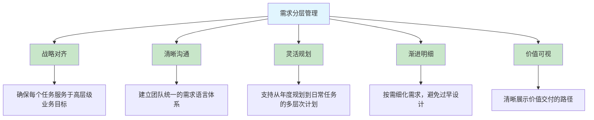

---

## 1.3 需求层级体系全景图

### 1.3.1 四层需求模型

敏捷实践中推荐"**Epic > Feature > Story > Task**"的四层模型：

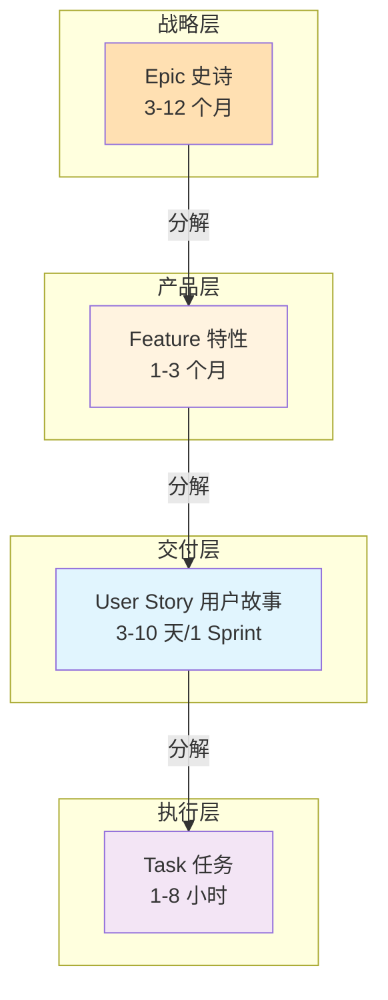

### 1.3.2 各层级定义与特征

| 层级 | 名称 | 定义 | 时间跨度 | 价值类型 | 受众 |
|------|------|------|----------|----------|------|
| **战略层** | **Epic (史诗)** | 项目的愿景目标，具有战略价值 | 3-12 个月 | 战略价值 | 高管/利益相关者 |
| **产品层** | **Feature (特性)** | 可以带来价值的产品功能和特性 | 1-3 个月 | 业务价值 | 产品经理/客户 |
| **交付层** | **User Story (用户故事)** | 从用户角度对产品功能的详细描述 | 3-10 天 | 用户价值 | 最终用户 |
| **执行层** | **Task (任务)** | 团队成员要完成的具体任务 | 1-8 小时 | 技术实现 | 开发团队 |

### 1.3.3 各层级详解

#### Epic (史诗)

```
┌─────────────────────────────────────────────────────────────┐
│ Epic 核心特征                                                 │
├─────────────────────────────────────────────────────────────┤
│ • 项目的愿景目标，具有战略价值                               │
│ • 通过 Epic 的落地达成，使公司获得相应的市场地位和回报       │
│ • 通常需要数月完成                                           │
│ • 难以精确估算                                               │
└─────────────────────────────────────────────────────────────┘

示例：
"打造行业领先的电商平台"
"实现移动端用户增长翻倍"
"构建企业级数据分析平台"
```

#### Feature (特性)

```
┌─────────────────────────────────────────────────────────────┐
│ Feature 核心特征                                              │
├─────────────────────────────────────────────────────────────┤
│ • 可以带来价值的产品功能和特性                               │
│ • 相比 Epic 更具体，更形象，客户可以感知                      │
│ • 具有业务价值                                               │
│ • 通常需要数周，多个 Sprint 才能够完成                        │
│ • 可粗略估算                                                 │
└─────────────────────────────────────────────────────────────┘

示例：
"支持多种支付方式" (属于"打造行业领先的电商平台"Epic)
"实现微信/支付宝/银联支付"
"用户实名认证系统"
```

#### User Story (用户故事)

```
┌─────────────────────────────────────────────────────────────┐
│ User Story 核心特征                                           │
├─────────────────────────────────────────────────────────────┤
│ • 从用户角度对产品功能的详细描述                             │
│ • 承接 Feature，并放入产品 Backlog 中                         │
│ • 持续规划，滚动调整                                         │
│ • 符合 INVEST 原则                                            │
│ • 通常需要数天，并在一个 Sprint 中完成                        │
│ • 可估算 (故事点)                                            │
└─────────────────────────────────────────────────────────────┘

示例：
"作为购物用户，我希望可以使用支付宝支付订单，以便快速完成付款"
"作为管理员，我希望可以查看用户认证状态，以便审核用户资质"
```

#### Task (任务)

```
┌─────────────────────────────────────────────────────────────┐
│ Task 核心特征                                                 │
├─────────────────────────────────────────────────────────────┤
│ • 团队成员要完成的具体任务                                   │
│ • 在 Sprint 计划会议上，将 Story 分配给成员后分解为 Task       │
│ • 预估工时                                                   │
│ • 通常在一天内完成                                           │
│ • 可估算 (小时)                                              │
└─────────────────────────────────────────────────────────────┘

示例：
"设计支付宝支付接口数据库表结构" (4 小时)
"实现支付宝 SDK 集成" (8 小时)
"编写支付功能单元测试" (4 小时)
```

---

## 1.4 时间跨度与价值维度对比

### 1.4.1 时间跨度对比

```
时间跨度对比:

Epic    ████████████████████████ (3-12 个月)
Feature ██████████ (1-3 个月，多个 Sprint)
Story   ███ (3-10 天，1 个 Sprint 内)
Task    █ (1-8 小时)

0        1 周      1 月       3 月       6 月       12 月
│--------│--------│---------│---------│---------│
         Task     Story     Feature            Epic
```

### 1.4.2 价值维度对比

| 层级 | 价值类型 | 受众 | 可估算性 | 估算单位 |
|------|----------|------|----------|----------|
| **Epic** | 战略价值 | 高管/利益相关者 | 难以精确估算 | 月/季度 |
| **Feature** | 业务价值 | 产品经理/客户 | 可粗略估算 | 周/Sprint |
| **Story** | 用户价值 | 最终用户 | 可估算 | 故事点 |
| **Task** | 技术实现 | 开发团队 | 可精确估算 | 小时 |

### 1.4.3 自顶向下分解与自底向上交付

```mermaid
flowchart TD
    subgraph 需求分解 (自顶向下)
        A1[Epic 史诗] -->|分解 | A2[Feature 特性]
        A2 -->|分解 | A3[User Story 用户故事]
        A3 -->|分解 | A4[Task 任务]
    end
    
    subgraph 价值交付 (自底向上)
        B4[Task 完成] -->|累积 | B3[Story 完成]
        B3 -->|累积 | B2[Feature 完成]
        B2 -->|累积 | B1[Epic 达成]
    end
    
    style A1 fill:#ffe0b2
    style A2 fill:#fff3e0
    style A3 fill:#e1f5fe
    style A4 fill:#f3e5f5
    style B1 fill:#ffe0b2
    style B2 fill:#fff3e0
    style B3 fill:#e1f5fe
    style B4 fill:#f3e5f5
```

**关键要点**：
- **分解方向**：Epic → Feature → Story → Task (从抽象到具体)
- **交付方向**：Task → Story → Feature → Epic (从具体到抽象)
- **战略对齐**：每个 Task 都应能向上追溯到其所属的 Epic，确保工作服务于战略目标

---

## 1.5 需求分层管理最佳实践

### 1.5.1 保持层级清晰

```
┌─────────────────────────────────────────────────────────────┐
│ 层级清晰的检查清单                                          │
├─────────────────────────────────────────────────────────────┤
│ □ Epic 是否描述了战略目标？                                  │
│ □ Feature 是否可被客户感知？                                 │
│ □ Story 是否符合 INVEST 原则？                                │
│ □ Task 是否可在一天内完成？                                  │
│ □ 每个 Task 是否都能向上追溯到 Epic?                         │
└─────────────────────────────────────────────────────────────┘
```

### 1.5.2 渐进明细原则

```
┌─────────────────────────────────────────────────────────────┐
│ 渐进明细：按需细化需求，避免过早设计                        │
├─────────────────────────────────────────────────────────────┤
│ • Epic 级别：只描述愿景和方向，不需要详细细节                │
│ • Feature 级别：定义功能范围和价值，技术实现留待后续         │
│ • Story 级别：明确用户场景，细节在开发前沟通确认             │
│ • Task 级别：技术方案和实现细节                              │
└─────────────────────────────────────────────────────────────┘
```

### 1.5.3 统一需求语言

```
┌─────────────────────────────────────────────────────────────┐
│ 建立团队统一的需求语言                                      │
├─────────────────────────────────────────────────────────────┤
│ • 组织培训，确保所有成员理解各层级定义                      │
│ • 在需求管理工具中配置四层模型                               │
│ • 需求评审时使用统一术语                                    │
│ • 定期检查需求层级是否正确                                  │
└─────────────────────────────────────────────────────────────┘
```

---

## 1.6 本章小结

**核心要点回顾**：

1. **敏捷开发核心价值观**：个体和互动、可工作的软件、客户合作、响应变化
2. **需求分层管理的必要性**：解决战略迷失、沟通障碍、规划混乱三大挑战
3. **四层需求模型**：Epic (战略层) → Feature (产品层) → Story (交付层) → Task (执行层)
4. **分解与交付**：自顶向下分解，自底向上交付
5. **各层级时间跨度**：Epic(3-12 月)、Feature(1-3 月)、Story(3-10 天)、Task(1-8 小时)

**关键记忆点**：
- **Epic** = 战略目标，难以估算，面向高管
- **Feature** = 业务价值，可粗略估算，面向客户
- **Story** = 用户价值，可估算 (故事点)，面向用户
- **Task** = 技术实现，可精确估算 (小时)，面向开发团队

---

**来源引用**：
- 《敏捷宣言》：https://agilemanifesto.org/
- 敏捷开发 12 条原则
- PingCode 敏捷实践：史诗 - 特性 - 用户故事 - 任务全流程管理指南
- Scrum 项目需求管理流程介绍 (华为云)

---

*本章草稿保存于：`.work/agile-epic/drafts/chapter-1.md`*
*字数：约 2800 字*

---

# 第 2 章 Epic 史诗：战略层需求定义

## 2.1 Epic 的概念定义与核心特征

### 2.1.1 什么是 Epic

**Epic (史诗)** 是敏捷需求层级中的最高层级，代表项目的愿景目标或大型业务举措。

**核心定义**：
> Epic 是项目的愿景目标，通过 Epic 的落地达成，使公司可以获得相应的市场地位和回报，具有战略价值。通常需要数月完成。

**形象比喻**：
```
如果把产品开发比作一场冒险旅程：
- Epic 就是"征服珠穆朗玛峰"这样的宏伟目标
- Feature 是"建立大本营"、"冲刺顶峰"等关键里程碑
- Story 是"搭建帐篷"、"准备氧气"等具体行动
- Task 是"固定绳索"、"检查装备"等具体操作
```

### 2.1.2 Epic 的核心特征

| 特征 | 说明 | 示例 |
|------|------|------|
| **战略价值** | 与公司战略目标直接对齐 | "提升市场份额至行业前三" |
| **宏观抽象** | 高层次描述，不包含具体细节 | "打造行业领先的电商平台" |
| **长期跨度** | 通常需要 3-12 个月完成 | 跨越多个季度/版本 |
| **难以估算** | 无法精确估算工作量和时间 | 只能粗略估计时间范围 |
| **可分解性** | 必须能够分解为多个 Feature | 一个 Epic 包含多个 Feature |
| **可追踪性** | 进展可度量和追踪 | 通过完成的功能百分比衡量 |

### 2.1.3 Epic 与项目目标的对应关系

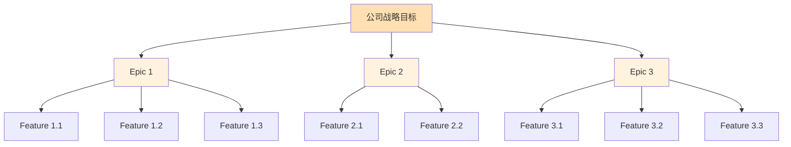

---

## 2.2 Epic 的来源与识别方法

### 2.2.1 Epic 的六大来源

| 来源 | 说明 | 示例 |
|------|------|------|
| **公司战略** | 由高管层制定的战略目标 | "三年内成为行业领导者" |
| **市场需求** | 市场趋势和竞争压力驱动 | "应对竞争对手的移动端战略" |
| **客户需求** | 大量客户反馈的共性需求 | "提升用户体验满意度" |
| **技术升级** | 技术架构升级或迁移 | "从单体架构迁移到微服务" |
| **合规要求** | 法规和政策变化要求 | "满足 GDPR 数据隐私要求" |
| **业务拓展** | 新业务线或新市场开拓 | "拓展海外市场" |

### 2.2.2 Epic 识别检查清单

```
┌─────────────────────────────────────────────────────────────┐
│ Epic 识别检查清单                                            │
├─────────────────────────────────────────────────────────────┤
│ □ 是否具有战略价值？(与公司目标对齐)                        │
│ □ 是否需要数月完成？(时间跨度 3-12 个月)                     │
│ □ 是否可以分解为多个 Feature?                               │
│ □ 是否能够度量进展？(有明确的完成标准)                      │
│ □ 是否值得投入团队资源？(ROI 合理)                          │
└─────────────────────────────────────────────────────────────┘
```

### 2.2.3 Epic 示例

**示例 1：电商平台战略升级**

```
Epic 名称：打造行业领先的电商平台

战略对齐：
- 公司年度目标：提升市场份额至行业前三
- 预期收益：用户转化率提升 30%，GMV 增长 50%

时间跨度：6-9 个月

包含 Feature：
- 商品推荐系统
- 多渠道支付集成
- 物流配送追踪
- 售后服务中心
```

**示例 2：太空旅行项目**

```
Epic 名称：2050 年 3 月太空旅行者发射

战略对齐：
- 公司愿景：成为商业太空旅行领导者
- 预期收益：完成首次商业载人发射

时间跨度：12 个月

包含 Feature：
- 购票系统
- 乘客健康评估
- 发射前培训
- 推进器系统
- 生命保障系统
```

---

## 2.3 Epic 的撰写规范与模板

### 2.3.1 Epic 模板结构

```markdown
# Epic: [史诗名称]

## 战略描述
[用 1-2 句话描述 Epic 的战略意义]

## 业务目标
- 目标 1: [可量化的业务指标]
- 目标 2: [可量化的业务指标]

## 预期收益
- 收益 1: [具体的商业价值]
- 收益 2: [具体的商业价值]

## 时间跨度
[预计开始日期] - [预计结束日期]

## 成功标准
- [可衡量的完成标准 1]
- [可衡量的完成标准 2]
- [可衡量的完成标准 3]

## 关键利益相关者
- 发起人：[姓名/角色]
- 产品负责人：[姓名/角色]
- 技术负责人：[姓名/角色]

## 包含的 Feature (待分解)
- Feature 1
- Feature 2
- ...

## 风险与依赖
- 风险 1: [描述及应对策略]
- 依赖 1: [描述及协调方案]
```

### 2.3.2 Epic 示例：移动端用户增长

```markdown
# Epic: 实现移动端用户增长翻倍

## 战略描述
通过优化移动端用户体验和功能，在 2026 年 Q3 前实现移动端活跃用户数从 100 万增长至 200 万。

## 业务目标
- 移动端日活跃用户 (DAU) 从 100 万提升至 200 万
- 移动端用户留存率提升 20%
- 移动端收入占比从 30% 提升至 50%

## 预期收益
- 年收入增长约 5000 万元
- 市场份额提升至行业前三
- 品牌移动端影响力显著增强

## 时间跨度
2026 年 4 月 - 2026 年 12 月 (9 个月)

## 成功标准
- 移动端 DAU ≥ 200 万
- 用户留存率 ≥ 45%
- 移动端收入占比 ≥ 50%

## 关键利益相关者
- 发起人：CEO
- 产品负责人：移动端产品总监
- 技术负责人：移动端技术总监

## 包含的 Feature (待分解)
- 移动端用户注册流程优化
- 个性化推荐系统
- 社交分享功能
- 会员积分体系
- 移动专属优惠活动

## 风险与依赖
- 风险：市场竞争加剧，获客成本上升
  应对：加大品牌营销投入，建立差异化优势
- 依赖：需要数据团队提供用户行为分析支持
  协调：已协调数据团队 Q2 投入 2 名数据分析师
```

---

## 2.4 Epic 与业务目标的对齐

### 2.4.1 战略对齐矩阵

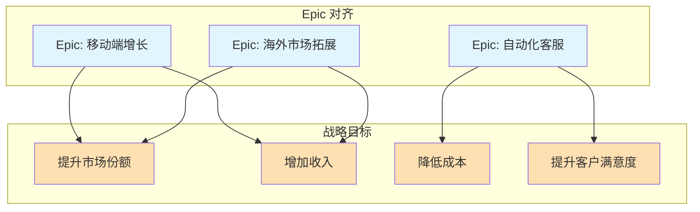

### 2.4.2 Epic 优先级评估

| 评估维度 | 权重 | 评分标准 (1-5 分) |
|----------|------|-------------------|
| **战略对齐度** | 30% | 5=完全对齐公司战略，1=与战略无关 |
| **商业价值** | 30% | 5=预期收益>5000 万，1=收益不明显 |
| **紧迫性** | 20% | 5=不立即行动会失去机会，1=可以延期 |
| **可行性** | 20% | 5=技术成熟风险低，1=技术不成熟风险高 |

**优先级计算公式**：
```
优先级得分 = 战略对齐度×0.3 + 商业价值×0.3 + 紧迫性×0.2 + 可行性×0.2
```

### 2.4.3 Epic 路线图

```
产品路线图示例：

2026 年
     Q1            Q2            Q3            Q4
     │─────────────│─────────────│─────────────│
     │  移动端增长  │ 移动端增长  │ 移动端增长  │
Epic │ ███████████ | ███████████ | ███████████ │ 完成
     │             │             │             │
     │  自动化客服  │ 自动化客服  │             │
Epic │ ███████████ | ███████████ │             │ 完成
     │             │             │             │
     │             │  海外市场   │  海外市场   │ 海外
Epic │             │ ███████████ | ███████████ | 拓展
     │             │             │             │
     │◄─ Feature 发布 ──►│◄─ Feature 发布 ──►│
```

---

## 2.5 Epic 管理最佳实践

### 2.5.1 Epic 生命周期管理

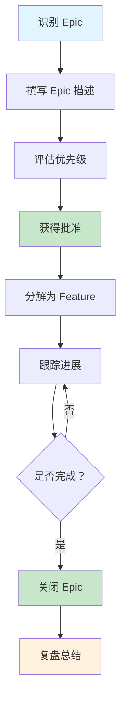

### 2.5.2 Epic 进展跟踪

| 跟踪方式 | 频率 | 参与人 | 内容 |
|----------|------|--------|------|
| **Epic 评审会** | 每月 | 产品负责人、利益相关者 | 审查 Epic 进展，调整优先级 |
| **进度报告** | 每周 | 产品负责人 | 更新 Feature 完成百分比 |
| **路线图更新** | 每季度 | 产品管理团队 | 调整产品路线图 |

### 2.5.3 Epic 完成的定义

```
┌─────────────────────────────────────────────────────────────┐
│ Epic 完成的定义 (DoD)                                        │
├─────────────────────────────────────────────────────────────┤
│ □ 所有包含的 Feature 已完成并交付                            │
│ □ 成功标准已达成 (量化指标)                                 │
│ □ 用户反馈收集并分析完成                                    │
│ □ 商业价值验证完成                                          │
│ □ 复盘总结完成                                              │
└─────────────────────────────────────────────────────────────┘
```

---

## 2.6 本章小结

**核心要点回顾**：

1. **Epic 定义**：战略层需求，代表项目愿景目标，具有战略价值
2. **核心特征**：战略价值、宏观抽象、长期跨度、难以估算、可分解性
3. **来源识别**：公司战略、市场需求、客户需求、技术升级、合规要求、业务拓展
4. **撰写规范**：使用标准模板，包含战略描述、业务目标、预期收益、成功标准
5. **战略对齐**：通过优先级评估和路线图确保 Epic 与公司战略一致

**关键记忆点**：
- **Epic 时间跨度**：3-12 个月
- **Epic 受众**：高管/利益相关者
- **Epic 评估**：战略对齐度、商业价值、紧迫性、可行性
- **Epic 完成**：所有 Feature 完成 + 成功标准达成

---

**来源引用**：
- 敏捷开发中的 Epic 定义、示例和模板 (PingCode)
- Scrum 项目需求管理流程介绍 (华为云)
- 如何理解敏捷需求管理的四个关键词

---

*本章草稿保存于：`.work/agile-epic/drafts/chapter-2.md`*
*字数：约 3200 字*

---

# 第 3 章 Feature 特性：产品层需求分解

## 3.1 Feature 的概念定义与核心特征

### 3.1.1 什么是 Feature

**Feature (特性)** 是敏捷需求层级中的第二层级，代表可以带来价值的产品功能和特性。

**核心定义**：
> Feature 是可以带来价值的产品功能和特性。相比 Epic，Feature 更具体，更形象，客户可以感知，具有业务价值。通常需要数周，多个 Sprint 才能够完成。

**形象理解**：
```
如果把 Epic 比作"建造一座现代化医院"：
- Feature 就是"门诊部"、"住院部"、"急诊科"、"影像中心"等核心功能区域
- 每个 Feature 都能为患者提供具体的医疗服务价值
- 多个 Feature 组合起来实现 Epic 的愿景
```

### 3.1.2 Feature 的核心特征

| 特征 | 说明 | 与 Epic 的对比 |
|------|------|----------------|
| **具体可感知** | 客户可以理解和感知的功能 | Epic 是宏观抽象的 |
| **业务价值** | 直接为用户带来价值 | Epic 是战略价值 |
| **中等规模** | 需要数周，多个 Sprint 完成 | Epic 需要数月 |
| **可粗略估算** | 可以用周/Sprint 粗略估算 | Epic 难以估算 |
| **可独立交付** | 完成后可以独立交付使用 | Epic 需要多个 Feature 组合 |
| **有明确范围** | 功能边界清晰 | Epic 范围较宽泛 |

### 3.1.3 Feature 与 Epic 的关系

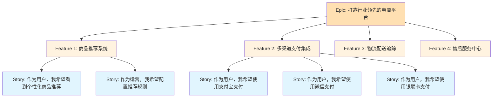

---

## 3.2 Epic 到 Feature 的分解方法

### 3.2.1 分解原则

```
┌─────────────────────────────────────────────────────────────┐
│ Epic 到 Feature 分解原则                                     │
├─────────────────────────────────────────────────────────────┤
│ 1. 价值独立：每个 Feature 应能独立为用户带来价值             │
│ 2. 功能完整：Feature 应包含完整的功能闭环                    │
│ 3. 技术可行：考虑技术依赖和实现顺序                          │
│ 4. 规模适中：每个 Feature 应在 1-3 个月内完成                   │
│ 5. 可测试性：Feature 完成后有明确的验收标准                  │
└─────────────────────────────────────────────────────────────┘
```

### 3.2.2 分解方法一：按功能模块

```
Epic: 打造行业领先的电商平台

按功能模块分解:
├── Feature: 商品管理系统
│   ├── 商品录入与编辑
│   ├── 商品分类管理
│   └── 商品上下架控制
├── Feature: 订单管理系统
│   ├── 购物车功能
│   ├── 订单创建与支付
│   └── 订单状态追踪
├── Feature: 用户中心
│   ├── 用户注册与登录
│   ├── 个人信息管理
│   └── 收货地址管理
└── Feature: 售后服务
    ├── 退换货申请
    ├── 退款处理
    └── 客服咨询
```

### 3.2.3 分解方法二：按用户角色

```
Epic: 构建企业级数据分析平台

按用户角色分解:
├── Feature: 数据分析师功能
│   ├── 自定义报表创建
│   ├── 数据可视化分析
│   └── 数据导出功能
├── Feature: 管理层功能
│   ├── 管理驾驶舱
│   ├── KPI 监控面板
│   └── 预警通知
├── Feature: 运营人员功能
│   ├── 日常数据查询
│   ├── 活动效果分析
│   └── 报表订阅
└── Feature: 管理员功能
    ├── 用户权限管理
    ├── 数据源配置
    └── 系统监控
```

### 3.2.4 分解方法三：按业务流程

```
Epic: 实现移动端用户增长翻倍

按业务流程分解:
├── Feature: 用户获取
│   ├── 社交分享拉新
│   ├── 邀请有礼活动
│   └── 广告投放落地页
├── Feature: 用户激活
│   ├── 新手引导流程
│   ├── 首单优惠激励
│   └── 功能使用引导
├── Feature: 用户留存
│   ├── 会员积分体系
│   ├── 签到奖励机制
│   └── 个性化推送
└── Feature: 用户转化
    ├── 优惠券发放
    ├── 限时促销活动
    └── 会员专属权益
```

### 3.2.5 分解检查清单

```
┌─────────────────────────────────────────────────────────────┐
│ Feature 分解检查清单                                         │
├─────────────────────────────────────────────────────────────┤
│ □ 每个 Feature 是否都能独立交付价值？                        │
│ □ Feature 规模是否在 1-3 个月内完成？                         │
│ □ Feature 之间依赖关系是否清晰？                             │
│ □ Feature 是否可分配给单一团队负责？                         │
│ □ Feature 是否有明确的验收标准？                             │
│ □ Feature 是否与客户可感知的功能对应？                       │
└─────────────────────────────────────────────────────────────┘
```

---

## 3.3 Feature 的优先级评估

### 3.3.1 优先级评估矩阵

使用**价值 - 复杂度矩阵**进行 Feature 优先级评估：

```
                    价值 - 复杂度矩阵
    
    高 │  Ⅱ 优先做      │  Ⅰ 立即做
       │  (高价值低复杂)│  (高价值高复杂)
       │               │
  值   ├───────────────┼───────────────
  价   │  Ⅲ 最后做      │  Ⅳ 选择做
       │  (低价值低复杂)│  (低价值高复杂)
       │               │
    低 └───────────────┴───────────────
       低              高
             复杂度
             
实施顺序：Ⅰ → Ⅱ → Ⅲ → Ⅳ(或不做)
```

### 3.3.2 MoSCoW 优先级法则

| 优先级 | 含义 | 说明 | 占比建议 |
|--------|------|------|----------|
| **M**ust have | 必须有 | 没有这个功能，产品无法发布 | 60% |
| **S**hould have | 应该有 | 重要但不是必须，可在后续版本发布 | 20% |
| **C**ould have | 可以有 | 锦上添花的功能，有时间就做 | 15% |
| **W**on't have | 暂不实现 | 本次迭代不做，以后再说 | 5% |

### 3.3.3 Feature 优先级评分表

| Feature | 战略对齐 (30%) | 商业价值 (30%) | 紧迫性 (20%) | 可行性 (20%) | 总分 |
|---------|---------------|---------------|-------------|-------------|------|
| 商品推荐系统 | 5 | 5 | 4 | 3 | 4.4 |
| 多渠道支付 | 4 | 5 | 5 | 4 | 4.4 |
| 物流追踪 | 4 | 4 | 3 | 4 | 3.8 |
| 售后服务中心 | 3 | 4 | 4 | 3 | 3.4 |

---

## 3.4 Feature 与版本规划

### 3.4.1 Feature 到版本的映射

```
版本规划示例：

v1.0 (MVP) - 2026 年 Q2
├── Feature: 用户注册与登录
├── Feature: 商品浏览与搜索
└── Feature: 基础购物车功能

v1.1 - 2026 年 Q3
├── Feature: 多渠道支付集成
├── Feature: 订单管理
└── Feature: 物流追踪

v1.2 - 2026 年 Q4
├── Feature: 商品推荐系统
├── Feature: 会员积分体系
└── Feature: 售后服务中心

v2.0 - 2027 年 Q1
├── Feature: 社交分享功能
├── Feature: 限时促销活动
└── Feature: 数据分析后台
```

### 3.4.2 MVP (最小可行产品) 规划

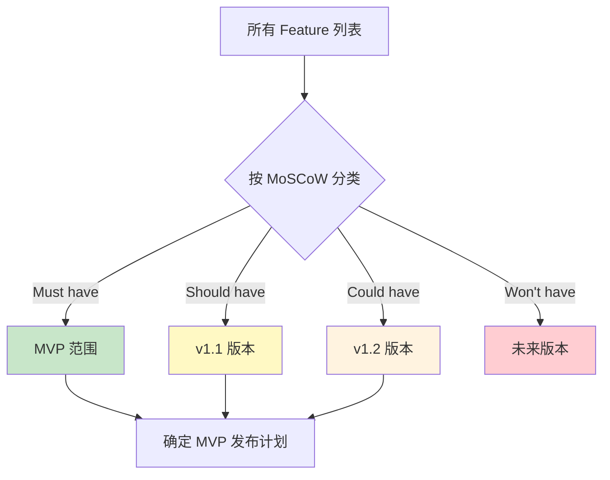

### 3.4.3 版本路线图模板

```markdown
# 产品路线图

## v1.0 MVP (2026 年 Q2)
**目标**：验证核心业务模式，获取首批种子用户

**包含 Feature**：
- [ ] 用户注册与登录
- [ ] 商品浏览与搜索
- [ ] 基础购物车功能

**成功标准**：
- 注册用户数 ≥ 1000
- 日活跃用户 ≥ 100
- 首单转化率 ≥ 5%

## v1.1 (2026 年 Q3)
**目标**：完善核心功能，提升用户体验

**包含 Feature**：
- [ ] 多渠道支付集成
- [ ] 订单管理
- [ ] 物流追踪

**成功标准**：
- 日活跃用户 ≥ 500
- 复购率 ≥ 20%
- 客单价 ≥ 100 元
```

---

## 3.5 Feature 描述模板

### 3.5.1 Feature 模板结构

```markdown
# Feature: [特性名称]

## 所属 Epic
[关联的 Epic 名称]

## 价值描述
[从用户角度描述这个特性带来的价值]

## 目标用户
[主要的目标用户群体]

## 功能范围
### 包含的功能
- [功能 1]
- [功能 2]
- [功能 3]

### 不包含的功能
- [明确说明不包含的功能，避免范围蔓延]

## 验收标准
- [验收标准 1]
- [验收标准 2]
- [验收标准 3]

## 依赖关系
### 前置依赖
- [需要在之前完成的其他 Feature]

### 后续依赖
- [依赖这个 Feature 的其他工作]

## 技术考量
- [技术难点]
- [技术风险]
- [技术选型建议]

## 估算
- **规模**：[大/中/小]
- **预计时间**：[X 周/X 个 Sprint]
- **故事点**：[总故事点估算]

## 优先级
- **MoSCoW 评级**：[Must/Should/Could/Won't]
- **优先级得分**：[X.X 分]
```

### 3.5.2 Feature 示例：多渠道支付集成

```markdown
# Feature: 多渠道支付集成

## 所属 Epic
打造行业领先的电商平台

## 价值描述
为用户提供多种支付方式选择，降低支付门槛，提升支付成功率和转化率。

## 目标用户
- 所有下单用户

## 功能范围
### 包含的功能
- 支付宝支付
- 微信支付
- 银联卡支付
- 支付状态查询
- 支付超时处理

### 不包含的功能
- 分期付款功能 (后续版本)
- 余额支付 (后续版本)
- 虚拟货币支付 (后续版本)

## 验收标准
- 用户可以使用支付宝完成支付
- 用户可以使用微信完成支付
- 用户可以使用银联卡完成支付
- 支付成功后订单状态自动更新为"已支付"
- 支付失败时显示明确的失败原因
- 支付超时 30 分钟后订单自动取消

## 依赖关系
### 前置依赖
- 订单管理系统已完成

### 后续依赖
- 退款功能依赖此 Feature

## 技术考量
- 需要对接三个支付渠道的 API
- 需要实现支付回调处理
- 需要考虑支付安全性和幂等性

## 估算
- **规模**：中
- **预计时间**：3 周 (2 个 Sprint)
- **故事点**：40 点

## 优先级
- **MoSCoW 评级**：Must
- **优先级得分**：4.4 分
```

---

## 3.6 本章小结

**核心要点回顾**：

1. **Feature 定义**：产品层需求，可带来业务价值的功能特性
2. **核心特征**：具体可感知、业务价值、中等规模、可独立交付
3. **分解方法**：按功能模块、按用户角色、按业务流程
4. **优先级评估**：价值 - 复杂度矩阵、MoSCoW 法则
5. **版本规划**：MVP 规划、路线图制定

**关键记忆点**：
- **Feature 时间跨度**：1-3 个月，多个 Sprint
- **Feature 受众**：产品经理/客户
- **分解原则**：价值独立、功能完整、技术可行
- **优先级**：Must have (60%)、Should have (20%)、Could have (15%)

---

**来源引用**：
- 如何理解敏捷需求管理的四个关键词
- 敏捷开发中的 Epic 定义、示例和模板 (PingCode)
- 项目规划中的 Epic、Feature、Story 和 Task 的关系

---

*本章草稿保存于：`.work/agile-epic/drafts/chapter-3.md`*
*字数：约 3500 字*

---

# 第 4 章 User Story 用户故事：交付层需求细化

## 4.1 用户故事的概念定义与 3C 原则

### 4.1.1 什么是用户故事

**User Story (用户故事)** 是敏捷需求层级中的第三层级，是从用户角度对产品功能的详细描述。

**核心定义**：
> 用户故事是从用户角度对产品功能的详细描述，承接 Feature，并放入产品 Backlog 中，持续规划，滚动调整，始终让高优先级 Story 交付给客户，具有用户价值。

**形象理解**：
```
如果把 Feature 比作"门诊部"：
- User Story 就是"患者挂号"、"医生问诊"、"开具处方"、"缴费取药"等具体服务场景
- 每个 Story 都描述了一个完整的用户使用场景
- 多个 Story 组合起来实现 Feature 的功能
```

### 4.1.2 用户故事的 3C 原则

用户故事包含三个核心要素，称为**3C 原则**：

| 原则 | 英文 | 说明 | 实践要点 |
|------|------|------|----------|
| **卡片** | Card | 记录简略需求 | 用简洁的文字记录需求要点，不是详细文档 |
| **交谈** | Conversation | 细化实现路径 | 通过与 Product Owner、开发团队交谈来明确细节 |
| **确认** | Confirmation | 定义验收标准 | 每个故事应有验收标准，确认被正确完成 |

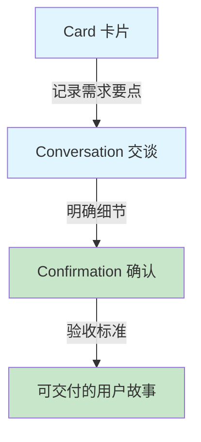

### 4.1.3 用户故事标准模板

**标准格式**：
```
作为一个 [用户角色]
我希望 [做什么]
以便 [获得什么价值]
```

**英文格式**：
```
As a [role]
I want [feature]
So that [benefit]
```

**示例**：
```
作为一个 购物用户
我希望 可以使用支付宝支付订单
以便 快速完成付款

As a shopper
I want to pay with Alipay
So that I can complete my purchase quickly
```

---

## 4.2 用户故事的 INVEST 原则

### 4.2.1 INVEST 原则详解

优质用户故事应符合**INVEST 原则**：

| 原则 | 英文 | 含义 | 检查问题 |
|------|------|------|----------|
| **I** | Independent | 独立性 | 这个故事是否独立于其他故事？ |
| **N** | Negotiable | 可协商性 | 故事内容是否可以协商调整？ |
| **V** | Valuable | 价值性 | 对用户是否有明确价值？ |
| **E** | Estimable | 可估算性 | 团队能否估算工作量？ |
| **S** | Small | 规模适度 | 是否可在一个 Sprint 内完成？ |
| **T** | Testable | 可测试性 | 是否有明确的验收标准？ |

### 4.2.2 独立性 (Independent)

```
┌─────────────────────────────────────────────────────────────┐
│ 独立性检查                                                   │
├─────────────────────────────────────────────────────────────┤
│ ✓ 每个故事自成一体，不依赖其他故事                           │
│ │ 技术和业务上都独立                                         │
│ ✓ 开发不阻塞，可以独立交付                                   │
│                                                              │
│ ✗ 不好的示例："作为用户，我希望登录，以便可以下单"           │
│   问题：依赖"下单"功能，不独立                               │
│                                                              │
│ ✓ 好的示例："作为用户，我希望使用手机号注册账号"             │
│   说明：独立完成账号创建，不依赖其他功能                     │
└─────────────────────────────────────────────────────────────┘
```

### 4.2.3 可协商性 (Negotiable)

```
┌─────────────────────────────────────────────────────────────┐
│ 可协商性检查                                                 │
├─────────────────────────────────────────────────────────────┤
│ ✓ 保持开放态度，需求可随迭代细化和演进                       │
│ ✓ 持续沟通，不是一成不变的合同                             │
│                                                              │
│ ✗ 不好的示例："必须有 5 种支付方式，缺一不可"                 │
│   问题：没有协商空间                                         │
│                                                              │
│ ✓ 好的示例："需要支持主流支付方式，具体哪几种可以讨论"       │
│   说明：保持灵活性，可根据技术实现调整                       │
└─────────────────────────────────────────────────────────────┘
```

### 4.2.4 价值性 (Valuable)

```
┌─────────────────────────────────────────────────────────────┐
│ 价值性检查                                                   │
├─────────────────────────────────────────────────────────────┤
│ ✓ 为用户创造真实价值                                         │
│ ✓ 拒绝无效开发                                               │
│ ✓ 80/20 法则：优先做带来 80% 价值的 20% 功能                     │
│                                                              │
│ ✗ 不好的示例："作为系统，需要记录用户操作的日志"             │
│   问题：从系统角度，不是用户价值                             │
│                                                              │
│ ✓ 好的示例："作为管理员，我希望查看用户操作记录"             │
│   说明：明确用户 (管理员) 和价值 (审计追踪)                 │
└─────────────────────────────────────────────────────────────┘
```

### 4.2.5 可估算性 (Estimable)

```
┌─────────────────────────────────────────────────────────────┐
│ 可估算性检查                                                 │
├─────────────────────────────────────────────────────────────┤
│ ✓ 规模可估，资源合理分配                                     │
│ ✓ 风险提前识别                                               │
│                                                              │
│ ✗ 不好的示例："实现一个智能推荐系统"                         │
│   问题：过于宽泛，无法估算                                   │
│                                                              │
│ ✓ 好的示例："根据用户浏览历史推荐 5 个相关商品"                │
│   说明：范围明确，可以估算                                   │
└─────────────────────────────────────────────────────────────┘
```

### 4.2.6 规模适度 (Small)

```
┌─────────────────────────────────────────────────────────────┐
│ 规模适度检查                                                 │
├─────────────────────────────────────────────────────────────┤
│ ✓ 3-5 天完成为佳                                              │
│ ✓ 过大故事要拆分                                             │
│ ✓ 可在一个 Sprint 内完成                                     │
│                                                              │
│ ✗ 不好的示例："实现完整的用户管理系统"                       │
│   问题：规模太大，需要拆分                                   │
│                                                              │
│ ✓ 好的示例："用户可以修改个人头像"                           │
│   说明：规模适中，2-3 天可完成                                │
└─────────────────────────────────────────────────────────────┘
```

### 4.2.7 可测试性 (Testable)

```
┌─────────────────────────────────────────────────────────────┐
│ 可测试性检查                                                 │
├─────────────────────────────────────────────────────────────┤
│ ✓ 验收标准明确                                               │
│ ✓ 测试方法恰当                                               │
│ ✓ 完成状态可验证                                             │
│                                                              │
│ ✗ 不好的示例："系统应该运行流畅"                             │
│   问题：无法客观验证                                         │
│                                                              │
│ ✓ 好的示例："页面加载时间不超过 3 秒"                          │
│   说明：有明确的验收标准                                     │
└─────────────────────────────────────────────────────────────┘
```

---

## 4.3 用户故事模板与撰写规范

### 4.3.1 完整用户故事模板

```markdown
# Story: [故事标题]

## 用户故事
作为一个 [用户角色]
我希望 [做什么]
以便 [获得什么价值]

## 验收标准
### Given-When-Then 格式
**场景 1**: [场景名称]
- Given: [前提条件]
- When: [操作]
- Then: [预期结果]

**场景 2**: [场景名称]
- Given: [前提条件]
- When: [操作]
- Then: [预期结果]

## 非功能需求
- 性能要求：[如响应时间]
- 安全要求：[如数据加密]
- 兼容性要求：[如浏览器支持]

## 依赖关系
- [依赖的其他 Story 或技术]

## 估算
- 故事点：[X 点]
- 预计工时：[X 天]

## 备注
- [其他需要说明的信息]
```

### 4.3.2 用户故事示例：支付宝支付

```markdown
# Story: 用户使用支付宝支付订单

## 用户故事
作为一个 购物用户
我希望 可以使用支付宝支付订单
以便 快速完成付款

## 验收标准
### 场景 1: 支付成功
- Given: 用户已提交订单，选择支付宝支付
- When: 用户点击"去支付"按钮
- Then: 跳转到支付宝支付页面

### 场景 2: 支付完成回调
- Given: 用户已完成支付宝支付
- When: 支付宝回调通知系统
- Then: 订单状态更新为"已支付"

### 场景 3: 支付失败
- Given: 用户支付失败 (余额不足等)
- When: 支付处理失败
- Then: 显示支付失败原因，返回订单页面

### 场景 4: 支付超时
- Given: 用户下单后 30 分钟未支付
- When: 超过支付时限
- Then: 订单自动取消

## 非功能需求
- 支付页面加载时间 < 2 秒
- 支付回调处理时间 < 5 秒
- 支付数据传输采用 HTTPS 加密

## 依赖关系
- 依赖：订单管理系统已完成

## 估算
- 故事点：8 点
- 预计工时：3 天

## 备注
- 需要申请支付宝商户账号
- 需要处理支付回调的幂等性
```

---

## 4.4 用户故事验收标准 (Acceptance Criteria)

### 4.4.1 验收标准的本质与价值

**验收标准 (Acceptance Criteria)** 是用户故事满足终端用户需求所必须符合的条件集合。

**三个基本特征**：

| 特征 | 说明 |
|------|------|
| **可验证性** | 每个标准必须存在客观的通过/失败判定方法 |
| **一致性** | 与用户故事核心价值主张保持完全对齐 |
| **完整性** | 覆盖正常场景、边界场景和异常场景的预期行为 |

**四层核心价值**：

```
┌─────────────────────────────────────────────────────────────┐
│ 验收标准的价值                                               │
├─────────────────────────────────────────────────────────────┤
│ 1. 需求澄清价值：消除团队成员对"完成定义"的理解偏差          │
│    据敏捷联盟统计可减少 28% 的需求返工                          │
│                                                              │
│ 2. 测试设计价值：直接转化为测试用例的输入条件                │
│    提升测试覆盖效率                                          │
│                                                              │
│ 3. 自动化基础：为 BDD(行为驱动开发) 框架提供可执行的规约语言    │
│                                                              │
│ 4. 进度衡量标尺：提供故事完成度的客观评估依据                │
└─────────────────────────────────────────────────────────────┘
```

### 4.4.2 Given-When-Then 格式

**标准格式**：
```
Given [前提条件]
When [操作/事件]
Then [预期结果]
```

**扩展示例**：
```
场景：用户使用优惠券下单

Given: 用户已登录且账户中有可用的优惠券
And: 用户购物车中有符合使用条件的商品
When: 用户提交订单并选择使用优惠券
Then: 订单金额应正确扣除优惠金额
And: 优惠券状态应变为"已使用"
```

### 4.4.3 验收标准检查清单

```
┌─────────────────────────────────────────────────────────────┐
│ 验收标准编写检查清单                                         │
├─────────────────────────────────────────────────────────────┤
│ □ 是否覆盖了正常流程？                                       │
│ □ 是否覆盖了边界情况？                                       │
│ □ 是否覆盖了异常情况？                                       │
│ □ 每个标准是否可验证？                                       │
│ □ 是否使用了清晰的 Given-When-Then 格式？                     │
│ □ 是否与用户故事价值对齐？                                   │
│ □ 开发团队是否理解验收标准？                                 │
│ □ 测试团队是否可以基于此编写测试用例？                       │
└─────────────────────────────────────────────────────────────┘
```

---

## 4.5 用户故事编写工作坊

### 4.5.1 编写流程

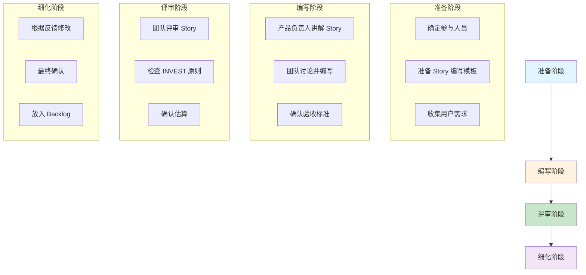

### 4.5.2 参与人员

| 角色 | 职责 |
|------|------|
| **产品负责人 (PO)** | 讲解 Story 背景和价值，回答业务问题 |
| **开发团队** | 理解需求，提出技术问题，估算故事点 |
| **测试团队** | 确认验收标准，识别测试场景 |
| **敏捷教练** | 引导流程，确保符合 INVEST 原则 |

---

## 4.6 本章小结

**核心要点回顾**：

1. **用户故事定义**：从用户角度描述产品功能，具有用户价值
2. **3C 原则**：卡片 (Card)、交谈 (Conversation)、确认 (Confirmation)
3. **INVEST 原则**：独立、可协商、有价值、可估算、规模小、可测试
4. **标准模板**：作为一个 [角色]，我希望 [功能]，以便 [价值]
5. **验收标准**：使用 Given-When-Then 格式，覆盖正常/边界/异常场景

**关键记忆点**：
- **Story 时间跨度**：3-10 天，1 个 Sprint 内
- **Story 受众**：最终用户
- **Story 估算**：故事点 (Story Points)
- **验收标准**：可验证、一致、完整

---

**来源引用**：
- 用户故事 3C 原则
- INVEST 原则
- 用户故事验收标准最佳实践

---

*本章草稿保存于：`.work/agile-epic/drafts/chapter-4.md`*
*字数：约 4000 字*

---

# 第 5 章 Epic 拆分方法论

## 5.1 需求拆分概述

### 5.1.1 为什么需要拆分

需求拆分本质上是**复杂问题的解构过程**，将宏大的 Epic 拆解为可执行的用户故事。

**拆分的必要性**：

```
┌─────────────────────────────────────────────────────────────┐
│ 需求拆分的三大价值                                           │
├─────────────────────────────────────────────────────────────┤
│ 1. 管理复杂性：降低认知负荷，使深入分析成为可能              │
│    人类心智无法一次性处理数百个逻辑点的庞大系统             │
│                                                              │
│ 2. 实现可估算：无法准确估算"开发电商平台"                    │
│    但可以估算"用户将商品加入购物车"这个故事                   │
│                                                              │
│ 3. 加速价值交付：拆解后可并行开发和增量交付                  │
│    让用户更早使用到核心价值，根据反馈调整方向                 │
└─────────────────────────────────────────────────────────────┘
```

### 5.1.2 拆分粒度对比

```
拆分粒度对比:

Epic    ████████████████████████ (3-12 个月)
        │
        ▼ 分解为
        │
Feature ██████████ (1-3 个月)
        │
        ▼ 分解为
        │
Story   ███ (3-10 天)
        │
        ▼ 分解为
        │
Task    █ (1-8 小时)

0        1 周      1 月       3 月       6 月       12 月
```

---

## 5.2 按用户角色拆分

### 5.2.1 方法说明

按用户角色拆分是最直观的拆分方法之一，根据不同用户群体的需求和权限进行拆分。

```
适用场景：
- 系统有多个不同类型的用户
- 不同用户角色的功能差异较大
- 角色权限和功能模块清晰
```

### 5.2.2 示例：企业级数据分析平台

```
Epic: 构建企业级数据分析平台

按用户角色拆分:

├── Feature: 数据分析师功能
│   ├── Story: 作为分析师，我可以创建自定义报表
│   ├── Story: 作为分析师，我可以进行数据可视化分析
│   └── Story: 作为分析师，我可以导出分析结果
│
├── Feature: 管理层功能
│   ├── Story: 作为 CEO，我可以看到管理驾驶舱
│   ├── Story: 作为总监，我可以查看 KPI 监控面板
│   └── Story: 作为经理，我可以接收预警通知
│
├── Feature: 运营人员功能
│   ├── Story: 作为运营，我可以查询日常数据
│   ├── Story: 作为运营，我可以分析活动效果
│   └── Story: 作为运营，我可以订阅报表
│
└── Feature: 管理员功能
    ├── Story: 作为管理员，我可以管理用户权限
    ├── Story: 作为管理员，我可以配置数据源
    └── Story: 作为管理员，我可以监控系统运行状态
```

### 5.2.3 角色识别检查清单

```
┌─────────────────────────────────────────────────────────────┐
│ 用户角色识别检查清单                                         │
├─────────────────────────────────────────────────────────────┤
│ □ 已识别所有主要用户角色？                                   │
│ □ 每个角色的职责和权限是否清晰？                             │
│ □ 角色之间是否有功能重叠？                                   │
│ □ 是否有角色可以合并？                                       │
│ □ 每个角色的 Story 是否独立可交付？                           │
└─────────────────────────────────────────────────────────────┘
```

---

## 5.3 按用户旅程/流程拆分

### 5.3.1 方法说明

按用户旅程或业务流程拆分，沿着用户使用产品的自然流程进行拆分。

```
适用场景：
- 有清晰的用户操作流程
- 功能有明显的先后顺序
- 可以按流程阶段独立交付价值
```

### 5.3.2 示例：在线订票系统

```
Epic: 实现在线机票预订系统

按用户旅程拆分:

用户旅程：搜索 → 选择 → 预订 → 支付 → 出行 → 售后

├── Feature: 航班搜索
│   ├── Story: 作为用户，我可以按日期搜索航班
│   ├── Story: 作为用户，我可以按价格筛选航班
│   └── Story: 作为用户，我可以查看航班详情
│
├── Feature: 机票选择
│   ├── Story: 作为用户，我可以选择舱位等级
│   ├── Story: 作为用户，我可以选择座位
│   └── Story: 作为用户，我可以添加行李额度
│
├── Feature: 预订流程
│   ├── Story: 作为用户，我可以填写乘客信息
│   ├── Story: 作为用户，我可以保存常用乘客
│   └── Story: 作为用户，我可以获取订单确认
│
├── Feature: 支付功能
│   ├── Story: 作为用户，我可以使用支付宝支付
│   ├── Story: 作为用户，我可以使用信用卡支付
│   └── Story: 作为用户，我可以查看支付状态
│
├── Feature: 出行服务
│   ├── Story: 作为用户，我可以获取电子登机牌
│   ├── Story: 作为用户，我可以接收航班变动通知
│   └── Story: 作为用户，我可以在线值机
│
└── Feature: 售后服务
    ├── Story: 作为用户，我可以申请退票
    ├── Story: 作为用户，我可以改签航班
    └── Story: 作为用户，我可以联系客服
```

### 5.3.3 用户旅程地图

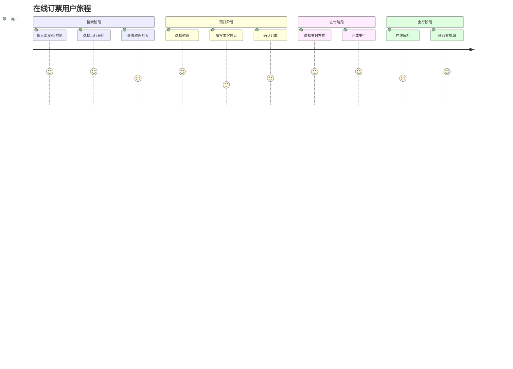

---

## 5.4 按业务规则拆分

### 5.4.1 方法说明

按业务规则或场景拆分，将不同的业务规则、条件分支拆分为独立的 Story。

```
适用场景：
- 功能背后有多种业务规则
- 不同场景可以独立实现
- 可以按场景优先级逐步交付
```

### 5.4.2 示例：优惠券系统

```
Epic: 构建电商平台优惠券系统

按业务规则拆分:

├── Feature: 优惠券发放
│   ├── Story: 作为运营，我可以创建满减券 (满 100 减 10)
│   ├── Story: 作为运营，我可以创建折扣券 (9 折优惠券)
│   ├── Story: 作为运营，我可以创建包邮券
│   └── Story: 作为运营，我可以创建新人专享券
│
├── Feature: 优惠券使用规则
│   ├── Story: 用户可以使用优惠券抵扣订单金额
│   ├── Story: 优惠券可以与会员折扣叠加使用
│   ├── Story: 优惠券不能与其他优惠券叠加使用
│   └── Story: 优惠券有使用门槛 (最低消费金额)
│
├── Feature: 优惠券有效期
│   ├── Story: 优惠券有固定的有效期
│   ├── Story: 优惠券过期前发送提醒通知
│   └── Story: 优惠券过期后自动失效
│
└── Feature: 优惠券发放渠道
    ├── Story: 用户可以通过活动页面领取优惠券
    ├── Story: 用户可以分享优惠券给好友
    └── Story: 系统可以自动发放优惠券给目标用户
```

### 5.4.3 场景优先级示例

```
优惠券使用场景优先级:

场景 A: 标准问题 (优先实现)
└── 优惠券直接抵扣订单金额

场景 B: 复杂问题 (后续迭代)
└── 优惠券与会员折扣叠加计算

场景 C: 边界场景 (再后续)
└── 部分商品不支持优惠券

场景 D: 异常场景 (最后实现)
└── 退货时优惠券处理规则
```

---

## 5.5 按数据维度拆分

### 5.5.1 方法说明

按数据维度拆分，功能相同但操作的数据对象或类型不同。

```
适用场景：
- 功能需要支持多种数据类型
- 不同数据实体的 CRUD 操作类似
- 可以按数据类型逐步扩展
```

### 5.5.2 示例：内容管理系统

```
Epic: 构建企业内容管理系统

按数据维度拆分:

├── Feature: 内容类型管理
│   ├── Story: 管理员可以管理文章 (Article) 内容
│   ├── Story: 管理员可以管理图片 (Image) 内容
│   ├── Story: 管理员可以管理视频 (Video) 内容
│   └── Story: 管理员可以管理文档 (Document) 内容
│
├── Feature: 多语言支持
│   ├── Story: 系统支持中文内容
│   ├── Story: 系统支持英文内容
│   └── Story: 系统支持其他语言内容
│
└── Feature: 数据操作
    ├── Story: 管理员可以创建内容 (Create)
    ├── Story: 管理员可以查看内容 (Read)
    ├── Story: 管理员可以编辑内容 (Update)
    └── Story: 管理员可以删除内容 (Delete)
```

### 5.5.3 数据拆分示例：支付方式

```
Epic: 实现多渠道支付

按支付方式拆分:

├── Story: 用户可以使用支付宝支付
├── Story: 用户可以使用微信支付
├── Story: 用户可以使用银联卡支付
├── Story: 用户可以使用信用卡支付
├── Story: 用户可以使用余额支付
└── Story: 用户可以使用分期付款
```

---

## 5.6 按技术层级拆分

### 5.6.1 方法说明

按技术层级拆分，先实现基础功能，再逐步优化和增强。

```
适用场景：
- 技术实现有明显的前后端依赖
- 可以先实现简单版本再优化
- 性能优化可以单独拆分
```

### 5.6.2 示例：商品搜索功能

```
Epic: 实现商品搜索系统

按技术层级拆分:

├── Feature: 基础搜索
│   ├── Story: 用户可以按商品名称搜索 (简单 SQL 查询)
│   ├── Story: 搜索结果按相关性排序
│   └── Story: 搜索结果分页显示
│
├── Feature: 高级搜索
│   ├── Story: 用户可以按价格范围筛选
│   ├── Story: 用户可以按品牌筛选
│   ├── Story: 用户可以按销量排序
│   └── Story: 用户可以按评价排序
│
├── Feature: 搜索优化
│   ├── Story: 实现搜索关键词自动补全
│   ├── Story: 实现搜索纠错 (拼写检查)
│   └── Story: 实现热门搜索推荐
│
└── Feature: 性能优化
    ├── Story: 搜索结果缓存，提升响应速度
    ├── Story: 使用 Elasticsearch 替代 SQL 搜索
    └── Story: 实现搜索结果懒加载
```

### 5.6.3 技术演进路线

```
技术演进路线图:

v1.0 (基础版)
└── 简单 SQL 查询，满足基本搜索需求

    ▼

v1.1 (增强版)
└── 添加筛选和排序功能

    ▼

v1.2 (智能版)
└── 添加自动补全和纠错功能

    ▼

v2.0 (性能版)
└── 引入 Elasticsearch，提升搜索性能
```

---

## 5.7 按场景/用例拆分

### 5.7.1 方法说明

按使用场景或用例拆分，将主流程和分支流程分开实现。

```
适用场景：
- 有明显的主流程和分支流程
- 可以优先实现主流程
- 分支流程可以后续补充
```

### 5.7.2 示例：用户注册系统

```
Epic: 实现用户注册系统

按场景拆分:

├── Feature: 主流程 - 手机号注册
│   ├── Story: 用户可以输入手机号获取验证码
│   ├── Story: 用户可以输入验证码完成注册
│   └── Story: 用户可以设置登录密码
│
├── Feature: 主流程 - 邮箱注册
│   ├── Story: 用户可以输入邮箱地址
│   ├── Story: 用户可以点击邮件链接验证邮箱
│   └── Story: 用户可以设置登录密码
│
├── Feature: 第三方登录
│   ├── Story: 用户可以使用微信快捷登录
│   ├── Story: 用户可以使用 QQ 快捷登录
│   └── Story: 用户可以使用支付宝快捷登录
│
└── Feature: 异常场景处理
    ├── Story: 手机号已被注册时提示用户
    ├── Story: 验证码错误时提示用户
    └── Story: 验证码过期后重新发送
```

---

## 5.8 拆分技巧总结

### 5.8.1 拆分技巧速查表

| 技巧 | 适用场景 | 拆分维度 | 示例 |
|------|----------|----------|------|
| **工作流步骤** | 有清晰流程 | 按流程阶段 | 搜索→选择→预订→支付 |
| **业务规则** | 多规则场景 | 按规则/场景 | 满减券、折扣券、包邮券 |
| **用户角色** | 多用户群体 | 按角色权限 | 管理员、普通用户、VIP 用户 |
| **数据维度** | 多数据类型 | 按数据实体 | 文章、图片、视频 |
| **技术层级** | 技术迭代 | 按技术复杂度 | 基础版→增强版→性能版 |
| **场景用例** | 主分支流程 | 按使用场景 | 主流程、异常流程 |

### 5.8.2 拆分检查清单

```
┌─────────────────────────────────────────────────────────────┐
│ 需求拆分检查清单                                             │
├─────────────────────────────────────────────────────────────┤
│ □ 拆分后的 Story 是否符合 INVEST 原则？                       │
│ □ 每个 Story 是否独立可交付？                                 │
│ □ Story 规模是否可在一个 Sprint 内完成？                      │
│ □ Story 是否有明确的验收标准？                               │
│ □ Story 优先级是否已排序？                                   │
│ □ Story 之间依赖关系是否清晰？                               │
│ □ 是否优先实现高价值的 Story?                                │
└─────────────────────────────────────────────────────────────┘
```

### 5.8.3 拆分反模式

```
┌─────────────────────────────────────────────────────────────┐
│ 拆分反模式 (避免这样做)                                      │
├─────────────────────────────────────────────────────────────┤
│ ✗ 按技术任务拆分：                                           │
│   "前端开发"、"后端开发"、"测试" → 这不是用户故事！           │
│                                                              │
│ ✗ 按数据库表拆分：                                           │
│   "用户表 CRUD"、"订单表 CRUD" → 用户不关心数据库！          │
│                                                              │
│ ✗ 拆得太小：                                                 │
│   "添加按钮"、"编写 API" → 这不是独立的用户价值！            │
│                                                              │
│ ✗ 拆得太大：                                                 │
│   "实现完整的电商系统" → 这需要数月完成！                    │
└─────────────────────────────────────────────────────────────┘
```

---

## 5.9 本章小结

**核心要点回顾**：

1. **拆分价值**：管理复杂性、实现可估算、加速价值交付
2. **六大拆分方法**：按用户角色、用户旅程、业务规则、数据维度、技术层级、场景用例
3. **拆分原则**：符合 INVEST 原则，独立可交付，规模适中
4. **拆分技巧**：根据场景选择合适的方法，灵活组合使用
5. **避免反模式**：不按技术任务拆分，不拆得太小或太大

**关键记忆点**：
- **拆分方向**：从 Epic → Feature → Story
- **拆分标准**：独立可交付、可估算、可测试
- **优先级**：先主流程后分支，先基础后增强

---

**来源引用**：
- Scrum 需求拆分技巧
- 如何拆解高层级需求 (PingCode)
- 如何切分用户故事？(知乎)

---

*本章草稿保存于：`.work/agile-epic/drafts/chapter-5.md`*
*字数：约 5000 字*

---

# 第 6 章 用户故事地图 (User Story Mapping)

## 6.1 用户故事地图的概念与价值

### 6.1.1 什么是用户故事地图

**用户故事地图 (User Story Mapping)** 是由 Jeff Patton 在 2005 年提出的一种可视化需求管理方法。

**核心定义**：
> 用户故事地图是一种将用户故事按照用户活动流程纵向排列，按优先级横向分层的可视化规划工具，帮助团队理解全局、识别 MVP、规划版本。

**形象理解**：
```
如果把产品功能比作一栋建筑：
- 传统 Backlog 像是"材料清单"（水泥、钢筋、砖块...）
- 用户故事地图则是"建筑蓝图"（地基→一层→二层→屋顶）
- 地图让你看到完整的用户旅程和功能全貌
```

### 6.1.2 为什么需要故事地图

**传统 Backlog 的局限性**：

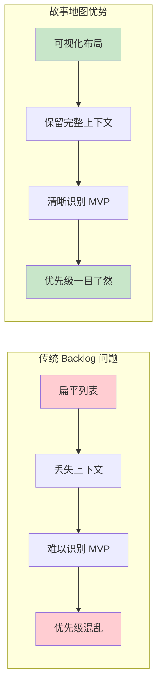

**传统 Backlog 的三大痛点**：

| 痛点 | 说明 | 后果 |
|------|------|------|
| **上下文丢失** | 故事以扁平列表呈现，失去用户旅程的上下文 | 团队无法理解功能之间的关联 |
| **MVP 识别困难** | 难以看出哪些功能是核心价值流 | 容易过度开发或遗漏关键功能 |
| **优先级混乱** | 高优先级和低优先级故事混杂 | 资源分配不合理，价值交付延迟 |

### 6.1.3 故事地图的核心价值

```
┌─────────────────────────────────────────────────────────────┐
│ 用户故事地图的五大价值                                       │
├─────────────────────────────────────────────────────────────┤
│ 1. 全局视野：一张图看清整个产品的用户旅程和功能全景          │
│    避免"只见树木不见森林"的局部优化                          │
│                                                              │
│ 2. MVP 识别：通过横向切分快速识别最小可行产品范围             │
│    确保首版本交付核心价值，避免范围蔓延                      │
│                                                              │
│ 3. 优先级可视化：高优先级故事在上方，低优先级在下方          │
│    一目了然，便于资源分配和决策                              │
│                                                              │
│ 4. 团队协作：可视化工作坊促进跨职能团队沟通和共识            │
│    产品、开发、测试、设计在同一张地图上协作                  │
│                                                              │
│ 5. 路线图规划：天然支持版本规划和发布计划制定                │
│    版本 1.0、1.1、2.0 的范围清晰可见                           │
└─────────────────────────────────────────────────────────────┘
```

---

## 6.2 故事地图的结构与组成

### 6.2.1 故事地图的二维结构

```
用户故事地图结构：

                    用户活动 (User Activities)
                    ↓    ↓    ↓    ↓    ↓
        ┌─────────────────────────────────────────────
        │ 用户任务 1  │ 用户任务 2  │ 用户任务 3  │ ...
        ├─────────────────────────────────────────────
        │ 故事 1.1    │ 故事 2.1    │ 故事 3.1    │
        │ 故事 1.2    │ 故事 2.2    │ 故事 3.2    │
  用    │ 故事 1.3    │ 故事 2.3    │ 故事 3.3    │
  户    ├─────────────────────────────────────────────
  故    │ 故事 1.4    │ 故事 2.4    │ 故事 3.4    │
  事    │ 故事 1.5    │ 故事 2.5    │ 故事 3.5    │
        ├─────────────────────────────────────────────
        │ 故事 1.6    │ 故事 2.6    │ 故事 3.6    │
        │ ...        │ ...        │ ...        │
        └─────────────────────────────────────────────
        
        ▲
        │
   版本切分线 (Release Slices)
   - 第一条线以上 = MVP (版本 1.0)
   - 第二条线以上 = 版本 1.1
   - 以此类推...
```

### 6.2.2 三层核心元素

| 层级 | 元素 | 说明 | 示例 (电商购物) |
|------|------|------|----------------|
| **顶层** | **用户活动 (Activities)** | 用户的高层次目标，通常 5-8 个 | 浏览商品、加入购物车、下单、支付、查看订单 |
| **中层** | **用户任务 (Tasks)** | 完成活动需要执行的具体任务 | 搜索商品、筛选商品、查看商品详情 |
| **底层** | **用户故事 (Stories)** | 具体的功能实现，可交付的 Story | "作为用户，我可以按价格筛选商品" |

### 6.2.3 完整示例：电商平台故事地图

```
电商平台用户故事地图：

用户活动：        发现商品        评估商品        购买结算        订单追踪        售后服务
                    ↓              ↓              ↓              ↓              ↓
┌─────────────────────────────────────────────────────────────────────────────────────
│ 用户任务     │ 搜索商品     │ 查看商品详情  │ 填写订单信息  │ 查看订单状态  │ 申请退换货  │
│             │ 筛选商品     │ 查看用户评价  │ 选择支付方式  │ 确认收货     │ 退货物流    │
│             │ 浏览分类     │ 对比商品      │ 使用优惠券    │ 评价商品     │ 客服咨询    │
├─────────────┼──────────────┼───────────────┼───────────────┼───────────────┼─────────────┤
│ 故事        │ 关键词搜索   │ 商品图片展示  │ 默认地址      │ 状态列表     │ 退换货表单  │
│             │ 热门搜索推荐 │ 规格选择      │ 发票信息      │ 物流详情     │ 退货审核    │
│             │ 价格筛选     │ 库存显示      │ 支付渠道      │ 确认收货按钮 │ 退款处理    │
│             │ 销量排序     │ 用户评价列表  │ 优惠券抵扣    │ 评价入口     │ 客服入口    │
│             │ 品牌筛选     │ 商品对比      │ 积分抵扣      │ 物流提醒     │ 进度查询    │
├─────────────┼──────────────┼───────────────┼───────────────┼───────────────┼─────────────┤
│ 故事        │ 高级搜索     │ 3D 展示        │ 多地址选择    │ 签收验货     │ 极速退款    │
│             │ 图片搜索     │ AR 试穿        │ 预约配送      │ 一键评价     │ 上门取件    │
│             │ 语音搜索     │ 视频评测      │ 分期付款      │ 晒图分享     │ 投诉建议    │
└─────────────┴──────────────┴───────────────┴───────────────┴───────────────┴─────────────┘

版本 1.0 (MVP): 第一条横线以上
版本 1.1: 第二条横线以上
版本 2.0: 全部功能
```

---

## 6.3 构建故事地图的七步法

### 6.3.1 七步法流程

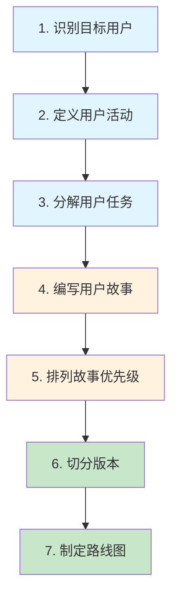

### 6.3.2 步骤 1：识别目标用户

**目标**：明确产品的核心用户群体

**方法**：
- 用户访谈和调研
- 数据分析
- 用户画像 (Persona) 创建

**示例用户画像**：

```markdown
## 用户画像：购物达人小王

**基本信息**：
- 年龄：28 岁
- 职业：互联网公司运营
- 收入：月薪 15K
- 城市：上海

**行为特征**：
- 每周网购 3-5 次
- 喜欢在晚上 8-10 点浏览商品
- 重视商品评价和销量
- 对价格敏感，喜欢比价

**痛点需求**：
- 希望快速找到想要的商品
- 担心买到假货或质量差的商品
- 希望有优惠活动时能及时知道
```

### 6.3.3 步骤 2：定义用户活动

**目标**：识别用户高层次的活动流程

**方法**：
- 头脑风暴：用户用我们的产品做什么？
- 用户旅程分析：从接触到使用到离开的完整流程
- 竞品分析：类似产品支持哪些活动

**活动识别技巧**：

```
┌─────────────────────────────────────────────────────────────┐
│ 用户活动识别技巧                                             │
├─────────────────────────────────────────────────────────────┤
│ ✓ 使用动词 + 名词格式：搜索商品、管理订单、查看报表          │
│ ✓ 保持 5-8 个活动：太少可能遗漏，太多不够聚焦                │
│ ✓ 活动之间相对独立：每个活动有明确的目标                     │
│ ✓ 按时间或逻辑顺序排列：形成完整的用户旅程                   │
│ ✓ 从用户视角描述：不是"系统功能"，是"用户活动"               │
└─────────────────────────────────────────────────────────────┘
```

### 6.3.4 步骤 3：分解用户任务

**目标**：将每个活动分解为具体任务

**方法**：
- 针对每个活动，问"用户需要做什么来完成这个活动？"
- 使用卡片工作坊，团队成员一起贡献任务
- 按执行顺序排列任务

**示例：在线购票活动分解**：

```
活动：购买电影票

任务分解：
1. 选择影院 → 2. 选择电影 → 3. 选择场次 → 4. 选择座位 → 5. 填写观众信息 → 6. 支付
```

### 6.3.5 步骤 4：编写用户故事

**目标**：为每个任务编写具体的用户故事

**方法**：
- 使用标准模板：作为 [角色]，我希望 [功能]，以便 [价值]
- 一个任务可以有多个故事（不同实现方式或场景）
- 确保故事符合 INVEST 原则

**示例任务的故事分解**：

```
任务：选择座位

用户故事：
├── Story 1: 作为用户，我可以看到座位图，以便选择心仪的座位
├── Story 2: 作为用户，我可以看到已售座位，以便避免重复选择
├── Story 3: 作为用户，我可以看到不同座位的价格，以便根据预算选择
├── Story 4: 作为用户，我可以连续选择多个座位，以便和朋友一起观影
└── Story 5: 作为用户，我可以看到座位视野分析，以便选择最佳观影位置
```

### 6.3.6 步骤 5：排列故事优先级

**目标**：确定每个任务的 stories 的优先级顺序

**方法**：
- 优先级矩阵：价值 vs 复杂度
- MoSCoW 法则：Must/Should/Could/Won't
- 团队投票：点投票 (Dot Voting)

**优先级排列原则**：

```
┌─────────────────────────────────────────────────────────────┐
│ 优先级排列原则                                               │
├─────────────────────────────────────────────────────────────┤
│ 1. 高价值、低复杂度的故事优先（快速取胜）                   │
│                                                              │
│ 2. 必须有的核心功能优先（MVP 范围）                           │
│                                                              │
│ 3. 有依赖关系的故事按依赖顺序排列                           │
│                                                              │
│ 4. 风险高的故事适当提前（降低项目风险）                     │
│                                                              │
│ 5. 考虑学习价值：早期做一些探索性故事                       │
└─────────────────────────────────────────────────────────────┘
```

### 6.3.7 步骤 6：切分版本

**目标**：通过横向切分定义不同版本的范围

**方法**：
- MVP 切分：第一条线以上的故事构成 MVP
- 版本 1.1 切分：第二条线以上
- 以此类推...

**切分原则**：

```
┌─────────────────────────────────────────────────────────────┐
│ 版本切分原则                                                 │
├─────────────────────────────────────────────────────────────┤
│ ✓ 每个版本应交付完整的用户价值（纵向切片）                   │
│                                                              │
│ ✓ MVP 应包含所有活动的最基本功能                              │
│                                                              │
│ ✓ 避免"先做完所有活动的基础功能，再做增强功能"               │
│   错误做法：搜索 + 筛选 + 排序 → 支付 → 订单 → 搜索增强...   │
│   正确做法：MVP(搜索 + 基础支付 + 基础订单) → v1.1(增强...)   │
│                                                              │
│ ✓ 考虑技术依赖：有些功能需要先完成基础建设                   │
└─────────────────────────────────────────────────────────────┘
```

### 6.3.8 步骤 7：制定路线图

**目标**：将版本切分转化为产品路线图

**输出模板**：

```markdown
# 产品路线图

## MVP (版本 1.0) - 2026 年 Q2
**目标**：验证核心业务模式，获取种子用户

**范围**：
- 发现商品：关键词搜索、热门搜索、价格筛选
- 评估商品：商品图片、规格选择、库存显示、用户评价
- 购买结算：默认地址、支付渠道、优惠券抵扣
- 订单追踪：状态列表、物流详情
- 售后服务：退换货表单、退货审核

**成功标准**：
- 日订单量 ≥ 100
- 用户留存率 ≥ 30%
- 支付成功率 ≥ 80%

## 版本 1.1 - 2026 年 Q3
**目标**：提升用户体验，增加复购

**范围**：
- 发现商品：高级搜索、图片搜索、品牌筛选
- 评估商品：商品对比、视频评测
- 购买结算：多地址选择、预约配送、分期付款
- 订单追踪：物流提醒、一键评价
- 售后服务：极速退款、上门取件

**成功标准**：
- 日订单量 ≥ 500
- 复购率 ≥ 40%
- 客单价提升 20%

## 版本 2.0 - 2026 年 Q4
**目标**：功能完善，差异化竞争

**范围**：
- 发现商品：语音搜索、个性化推荐
- 评估商品：3D 展示、AR 试穿
- 购买结算：智能地址推荐、刷脸支付
- 订单追踪：签收验货、晒图分享
- 售后服务：客服机器人、投诉建议
```

---

## 6.4 故事地图工作坊最佳实践

### 6.4.1 工作坊准备工作

| 准备工作 | 说明 | 建议 |
|----------|------|------|
| **参与人员** | 跨职能团队全员参与 | 产品、开发、测试、设计、业务代表 |
| **时间安排** | 完整的工作坊需要 4-8 小时 | 可分多次进行，每次 2-4 小时 |
| **场地布置** | 需要大面积的墙面或白板 | 能够贴上便利贴并自由移动 |
| **工具准备** | 便利贴、马克笔、点投票贴纸 | 不同颜色代表不同元素 |
| **远程协作** | 使用在线协作工具 | Miro、Mural、腾讯文档等 |

### 6.4.2 颜色编码规范

```
便利贴颜色规范：

🟡 黄色 = 用户活动 (Activities)
🟠 橙色 = 用户任务 (Tasks)
🔵 蓝色 = 用户故事 (Stories)
🟢 绿色 = MVP 范围
🟣 紫色 = 版本 1.1 范围
🔴 红色 = 风险/问题/依赖
```

### 6.4.3 引导技巧

```
┌─────────────────────────────────────────────────────────────┐
│ 工作坊引导技巧                                               │
├─────────────────────────────────────────────────────────────┤
│ 1. 保持节奏：每个步骤控制时间，避免在某一点上纠结太久       │
│                                                              │
│ 2. 鼓励参与：让每个人都发言，特别是开发、测试同学           │
│                                                              │
│ 3. 处理分歧：有争议的点先标记，后续投票决定                 │
│                                                              │
│ 4. 适时休息：每 1-2 小时休息 10-15 分钟，保持专注力             │
│                                                              │
│ 5. 拍照记录：完成每个步骤后拍照，便于后续整理               │
│                                                              │
│ 6. 数字化：工作坊结束后尽快数字化，便于追踪和分享           │
└─────────────────────────────────────────────────────────────┘
```

---

## 6.5 故事地图与 MVP 规划

### 6.5.1 MVP 的定义与价值

**MVP (Minimum Viable Product)** 是最小可行产品，指用最小的开发成本验证核心业务假设。

**MVP 的核心价值**：

| 价值 | 说明 |
|------|------|
| **快速验证** | 用最小的成本验证业务假设是否成立 |
| **降低风险** | 避免大规模投入后才发现方向错误 |
| **早期反馈** | 尽快获取用户反馈，指导后续开发 |
| **资源优化** | 将有限资源集中在核心价值上 |

### 6.5.2 用故事地图识别 MVP

**方法**：

```
MVP 识别矩阵：

                    用户价值
                    高    低
                    ↑    ↑
        ┌───────────┼────┼───────────┐
        │   Ⅱ 应该有  │ Ⅰ 必须有 │
        │  (Should)  │  (Must)  │
        │           │ MVP 核心  │
   复   ├───────────┼────┼───────────┤
   杂   │           │    │           │
   度   │   Ⅲ 可以有  │ Ⅳ 暂不做 │
        │  (Could)  │  (Won't) │
        │  锦上添花  │  低优先级  │
        └───────────┴────┴───────────┘
                    ↑    ↑
                    低    高
                    实现成本

MVP 范围 = Ⅰ区 (高价值、低/中复杂度) 的核心功能
```

### 6.5.3 MVP 切分示例

```
电商 MVP 切分示例：

┌─────────────────────────────────────────────────────────────┐
│ MVP 范围 (版本 1.0)                                          │
├─────────────────────────────────────────────────────────────┤
│ ✓ 发现商品：关键词搜索、热门搜索、价格筛选、销量排序        │
│ ✓ 评估商品：商品图片、规格选择、库存显示、用户评价列表      │
│ ✓ 购买结算：默认地址、主流支付渠道、优惠券抵扣              │
│ ✓ 订单追踪：订单状态列表、物流详情                          │
│ ✓ 售后服务：退换货申请表单                                  │
├─────────────────────────────────────────────────────────────┤
│ ✗ 不包含 (版本 1.1 或 2.0)                                   │
├─────────────────────────────────────────────────────────────┤
│ ✗ 个性化推荐                                                 │
│ ✗ 直播带货功能                                               │
│ ✗ 社交分享拼团                                               │
│ ✗ 会员积分体系                                               │
│ ✗ AR 试穿/3D 展示                                              │
└─────────────────────────────────────────────────────────────┘
```

### 6.5.4 MVP 验证指标

```markdown
## MVP 验证指标模板

### 业务指标
- 日活跃用户 (DAU) ≥ [目标值]
- 转化率 ≥ [目标值]
- 客单价 ≥ [目标值]
- 复购率 ≥ [目标值]

### 用户体验指标
- 任务完成率 ≥ [目标值]
- 用户满意度 (NPS) ≥ [目标值]
- 页面加载时间 ≤ [目标值] 秒
- 错误率 ≤ [目标值]%

### 技术指标
- 系统可用性 ≥ 99.9%
- API 响应时间 ≤ [目标值]ms
- 并发支持 ≥ [目标值]QPS
```

---

## 6.6 本章小结

**核心要点回顾**：

1. **故事地图定义**：Jeff Patton 提出的可视化需求管理方法，二维结构（用户旅程×优先级）
2. **核心价值**：全局视野、MVP 识别、优先级可视化、团队协作、路线图规划
3. **三层结构**：用户活动 (Activities) → 用户任务 (Tasks) → 用户故事 (Stories)
4. **七步法**：识别用户→定义活动→分解任务→编写故事→排列优先级→切分版本→制定路线图
5. **MVP 规划**：通过横向切分识别最小可行产品范围，快速验证业务假设

**关键记忆点**：
- **二维结构**：横向=用户旅程，纵向=优先级
- **MVP 切分**：第一条横线以上=版本 1.0
- **工作坊**：4-8 小时，跨职能团队，便利贴 + 白板
- **验证指标**：业务指标 + 用户体验指标 + 技术指标

---

**来源引用**：
- Jeff Patton: User Story Mapping (2014)
- 用户故事地图最佳实践指南
- MVP 规划与验证方法

---

*本章草稿保存于：`.work/agile-epic/drafts/chapter-6.md`*
*字数：约 5500 字*

---

# 第 7 章 迭代开发与 Sprint 管理

## 7.1 Sprint 核心概念与流程

### 7.1.1 什么是 Sprint

**Sprint (冲刺)** 是 Scrum 框架中的核心时间盒，团队在一个固定周期内完成预定的用户故事。

**核心定义**：
> Sprint 是一个固定长度的迭代周期（通常 1-4 周），团队承诺在这个周期内完成一组用户故事，并交付可工作的软件增量。

**关键特征**：

| 特征 | 说明 | 实践要点 |
|------|------|----------|
| **固定长度** | 每个 Sprint 长度相同 | 建议 2 周，最长不超过 4 周 |
| **目标明确** | 每个 Sprint 有明确的目标 | Sprint Goal 指导整个迭代 |
| **不可变更** | Sprint 开始后范围不再变化 | 保护团队免受外部干扰 |
| **可交付增量** | 结束时交付可用的软件 | 通过 Sprint Review 展示 |

### 7.1.2 Sprint 流程图

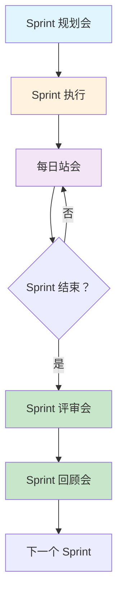

### 7.1.3 Sprint 仪式全景图

```
Sprint 仪式全景图：

┌─────────────────────────────────────────────────────────────┐
│ Sprint 周期 (2 周示例)                                        │
├─────────────────────────────────────────────────────────────┤
│                                                              │
│  Day 1                     Day 10                            │
│   │                          │                               │
│   ▼                          ▼                               │
│ ┌─────────────┐          ┌─────────────┐                    │
│ │ Sprint 规划会 │          │ Sprint 评审会 │                    │
│ │ (2-4 小时)    │          │ (1-2 小时)    │                    │
│ └─────────────┘          └─────────────┘                    │
│   │                          │                               │
│   │    ┌──────────────┐     │                               │
│   │    │  每日站会     │     │                               │
│   └───►│  (15 分钟)    │─────┘                               │
│        └──────────────┘                                     │
│                              │                               │
│                              ▼                               │
│                        ┌─────────────┐                      │
│                        │ Sprint 回顾会 │                      │
│                        │ (1-2 小时)    │                      │
│                        └─────────────┘                      │
│                                                              │
└─────────────────────────────────────────────────────────────┘
```

---

## 7.2 Sprint 规划会议 (Sprint Planning)

### 7.2.1 规划会结构

**Sprint 规划会分为两部分**：

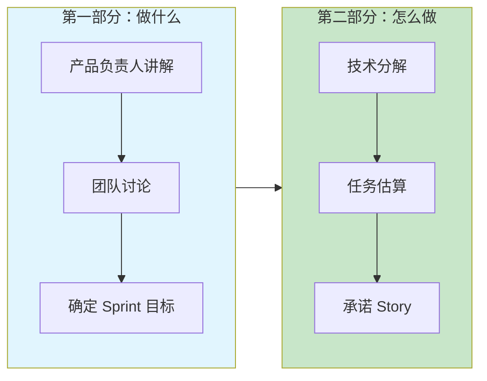

### 7.2.2 第一部分：做什么 (What)

**参与人**：产品负责人、开发团队、敏捷教练

**输入**：
- 产品 Backlog（按优先级排序）
- 团队历史速度 (Velocity)
- 团队容量 (Capacity)

**输出**：
- Sprint 目标
- 承诺完成的 Story 列表

**讨论要点**：

```
┌─────────────────────────────────────────────────────────────┐
│ 第一部分讨论要点                                             │
├─────────────────────────────────────────────────────────────┤
│ 1. 产品负责人讲解高优先级 Story 的背景和价值                  │
│                                                              │
│ 2. 团队提问澄清需求细节                                      │
│                                                              │
│ 3. 基于历史速度评估本次能完成的 Story 数量                    │
│                                                              │
│ 4. 确定 Sprint 目标（用一句话描述）                           │
│                                                              │
│ 5. 初步承诺要完成的 Story 列表                               │
└─────────────────────────────────────────────────────────────┘
```

### 7.2.3 第二部分：怎么做 (How)

**参与人**：开发团队、敏捷教练

**输入**：
- 承诺的 Story 列表
- 团队技术能力

**输出**：
- 每个 Story 的 Task 分解
- Task 工时估算
- Sprint Backlog

**分解示例**：

```
Story: 作为用户，我希望使用支付宝支付订单

Task 分解：
├── Task 1: 设计支付表结构 (2 小时) - 张三
├── Task 2: 实现支付宝 SDK 集成 (8 小时) - 李四
├── Task 3: 编写支付接口 API (4 小时) - 张三
├── Task 4: 前端支付页面开发 (6 小时) - 王五
├── Task 5: 编写单元测试 (4 小时) - 李四
└── Task 6: 联调测试 (4 小时) - 全员

总工时：28 小时
```

### 7.2.4 容量规划 (Capacity Planning)

**容量计算公式**：

```
团队容量 (小时) = ∑(成员可用天数 × 每天有效工时)

示例计算：
- 5 人团队，Sprint 周期 10 天
- 每人每天有效工时 5 小时（扣除会议、沟通等）
- 成员 A：请假 2 天，可用 8 天
- 成员 B/C/D/E：全勤，各 10 天

总容量 = (8 + 10 + 10 + 10 + 10) × 5 = 240 小时

建议预留 20% 缓冲：
可用容量 = 240 × 0.8 = 192 小时
```

**容量规划模板**：

```markdown
## Sprint 容量规划表

| 成员 | 总天数 | 请假 | 可用天数 | 每天工时 | 总工时 |
|------|--------|------|----------|----------|--------|
| 张三 | 10     | 2    | 8        | 5        | 40     |
| 李四 | 10     | 0    | 10       | 5        | 50     |
| 王五 | 10     | 0    | 10       | 5        | 50     |
| 赵六 | 10     | 0    | 10       | 5        | 50     |
| 钱七 | 10     | 0    | 10       | 5        | 50     |
|------|--------|------|----------|----------|--------|
| 合计 |        |      |          |          | 240    |

预留缓冲 (20%): 48 小时
可用容量：192 小时
```

---

## 7.3 故事点估算与 Planning Poker

### 7.3.1 为什么用故事点而非小时

**故事点 (Story Points)** 是相对估算单位，相比小时估算有以下优势：

| 对比维度 | 小时估算 | 故事点估算 |
|----------|----------|------------|
| **准确性** | 容易过于精确，实际偏差大 | 承认不确定性，更准确 |
| **可比性** | 不同人小时产能不同 | 团队统一基准，可比较 |
| **心理因素** | 容易被当成承诺 | 相对大小，减少压力 |
| **学习曲线** | 需要历史数据校准 | 快速建立团队基准 |

### 7.3.2 斐波那契数列

**故事点使用斐波那契数列**：

```
故事点序列：1, 2, 3, 5, 8, 13, 21, ...

选择理由：
- 数字越大，不确定性越高
- 避免在无意义的小差异上争论（8 vs 9）
- 大数字提示需要拆分 Story
```

**故事点参考基准**：

```
┌─────────────────────────────────────────────────────────────┐
│ 故事点参考基准（团队应建立自己的基准）                       │
├─────────────────────────────────────────────────────────────┤
│ 1 点  │ 非常简单，1-2 小时完成                                │
│       │ 示例：修改文案、调整颜色                             │
├─────────────────────────────────────────────────────────────┤
│ 2 点  │ 简单，半天内完成                                     │
│       │ 示例：添加简单表单字段                               │
├─────────────────────────────────────────────────────────────┤
│ 3 点  │ 中等，1-2 天完成                                      │
│       │ 示例：实现标准 CRUD 功能                              │
├─────────────────────────────────────────────────────────────┤
│ 5 点  │ 较复杂，2-3 天完成                                    │
│       │ 示例：集成第三方 API                                  │
├─────────────────────────────────────────────────────────────┤
│ 8 点  │ 复杂，3-5 天完成                                      │
│       │ 示例：实现新的业务模块                               │
├─────────────────────────────────────────────────────────────┤
│ 13 点 │ 非常复杂，需要拆分                                   │
│       │ 示例：重构核心模块（应拆分为多个小 Story）           │
├─────────────────────────────────────────────────────────────┤
│ 21 点 │ 过于庞大，必须拆分                                   │
│       │ 示例：实现完整的用户系统（必须拆分）                 │
└─────────────────────────────────────────────────────────────┘
```

### 7.3.3 Planning Poker 流程

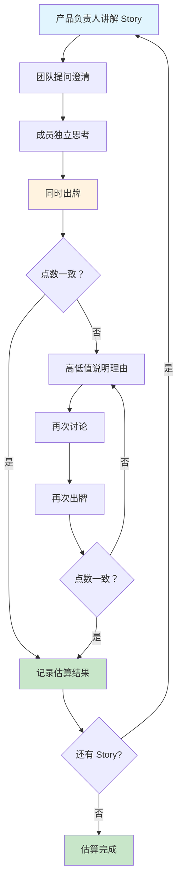

### 7.3.4 估算技巧

```
┌─────────────────────────────────────────────────────────────┐
│ 估算技巧与注意事项                                           │
├─────────────────────────────────────────────────────────────┤
│ ✓ 建立基准：选 1-2 个 Story 作为团队基准（如 3 点 Story）         │
│                                                              │
│ ✓ 对比估算：新 Story 与基准 Story 对比，是更大还是更小        │
│                                                              │
│ ✓ 避免锚定：不要让别人知道自己的估算，避免从众心理          │
│                                                              │
│ ✓ 处理分歧：高低值差距大时，充分讨论再重新估算              │
│                                                              │
│ ✓ 适时休息：估算超过 1 小时后准确度下降，建议休息           │
│                                                              │
│ ✗ 避免：将 Story 点转换为工时承诺                            │
│ ✗ 避免：管理层参与估算（影响团队独立性）                    │
│ ✗ 避免：追求精确，8 点和 9 点没有本质区别                    │
└─────────────────────────────────────────────────────────────┘
```

---

## 7.4 每日站会 (Daily Standup)

### 7.4.1 站会目标与规则

**核心目标**：
- 同步进度，识别阻塞
- 调整计划，确保 Sprint 目标达成
- 促进团队自组织

**基本规则**：

```
┌─────────────────────────────────────────────────────────────┐
│ 每日站会规则                                                 │
├─────────────────────────────────────────────────────────────┤
│ ⏱ 时间：每天固定时间，15 分钟严格超时                         │
│ 👥 参与：开发团队全员，其他人可列席但不发言                 │
│ 📍 地点：同一地点（或线上会议链接）                          │
│ 🧍 形式：站立开会，保持专注                                  │
│ 📵 规则：不讨论技术细节，问题会后单聊                        │
└─────────────────────────────────────────────────────────────┘
```

### 7.4.2 三问题模型

**传统三问题**：

```
问题 1：昨天我做了什么？
问题 2：今天我计划做什么？
问题 3：我遇到了什么阻碍？
```

**问题导向的改进版**：

```
改进焦点：
1. 我们离 Sprint 目标还有多远？
2. 今天的工作计划是否能帮助我们达成目标？
3. 有什么阻碍需要我们集体解决？
```

### 7.4.3 站会最佳实践

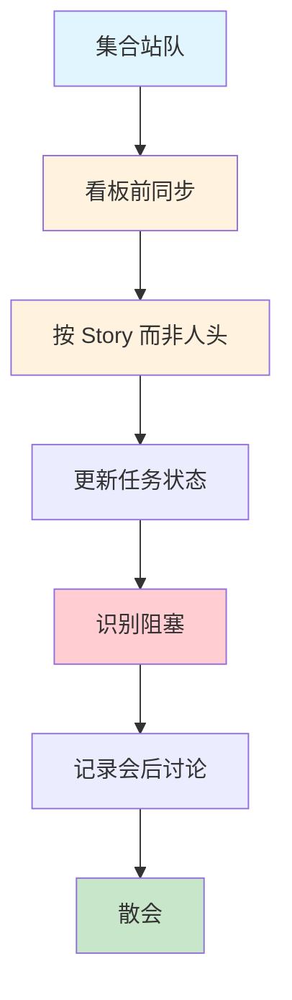

**最佳实践清单**：

| 实践 | 说明 | 理由 |
|------|------|------|
| **固定时间地点** | 每天早上 9:30，会议室 A | 形成习惯，减少协调成本 |
| **看板前进行** | 在任务看板前开会 | 可视化进度，边看边说 |
| **按 Story 同步** | 按 Story 进展而非个人汇报 | 聚焦价值交付，不是个人产出 |
| **超时处理** | 超过 15 分钟立即停止 | 培养高效沟通习惯 |
| **阻塞记录** | 记录阻塞项，会后解决 | 站会不解决问题，只识别问题 |
| **缺席处理** | 缺席者提前告知进展 | 保持信息透明 |

### 7.4.4 常见反模式

```
┌─────────────────────────────────────────────────────────────┐
│ 站会反模式 (避免这样做)                                      │
├─────────────────────────────────────────────────────────────┤
│ ✗ 详细汇报：每个人长篇大论汇报昨天工作                       │
│   正确：简洁说明进展，聚焦今日计划和阻塞                     │
│                                                              │
│ ✗ 解决问题：现场讨论技术细节，超时严重                       │
│   正确：识别问题，会后相关人员单独讨论                       │
│                                                              │
│ ✗ 领导发言：经理主导会议，团队被动听                         │
│   正确：团队自组织，经理是支持者不是主导者                   │
│                                                              │
│ ✗ 状态更新：把站会当成向领导汇报的会议                       │
│   正确：团队内部同步，不是向上汇报                           │
│                                                              │
│ ✗ 不固定：时间地点经常变化，参与率低                         │
│   正确：固定时间地点，形成习惯                               │
└─────────────────────────────────────────────────────────────┘
```

---

## 7.5 Sprint 进度跟踪与燃尽图

### 7.5.1 燃尽图 (Burndown Chart)

**定义**：燃尽图显示 Sprint 剩余工作量随时间的变化趋势。

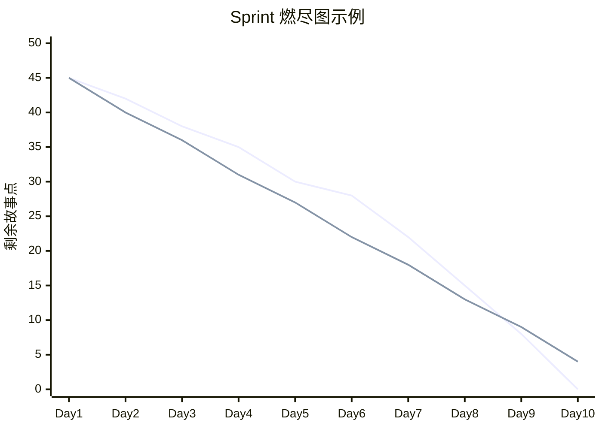

**图表解读**：

| 趋势 | 含义 | 应对措施 |
|------|------|----------|
| **理想线** | 匀速完成，进度正常 | 保持当前节奏 |
| **实际线在理想线上方** | 进度落后 | 识别阻塞，调整计划 |
| **实际线在理想线下方** | 进度超前 | 可从 Backlog 拉取更多 Story |
| **线向上走** | 范围增加或有返工 | 警惕范围蔓延，分析原因 |
| **线持平** | 没有进展 | 识别阻塞，寻求帮助 |

### 7.5.2 燃起图 (Burnup Chart)

**定义**：燃起图显示已完成工作量和总工作量的变化。

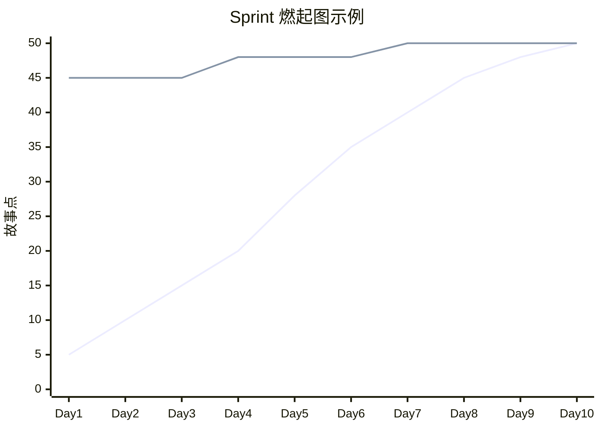

**燃起图 vs 燃尽图**：

| 对比 | 燃尽图 | 燃起图 |
|------|--------|--------|
| **显示内容** | 剩余工作量 | 已完成工作量 |
| **范围变更可见性** | 不明显 | 明显（总工作量线会变化） |
| **激励效果** | 递减（任务越来越多感觉） | 递增（成就感） |
| **推荐使用** | 内部团队跟踪 | 向干系人展示 |

### 7.5.3 速度追踪 (Velocity Tracking)

**定义**：速度是团队每个 Sprint 完成的故事点总数。

**速度计算**：

```
 Sprint 1: 完成 35 点
 Sprint 2: 完成 42 点
 Sprint 3: 完成 38 点
 Sprint 4: 完成 40 点
 
 平均速度 = (35 + 42 + 38 + 40) / 4 = 38.75 点
 建议取整 = 38 点（保守估计）
```

**速度追踪图**：

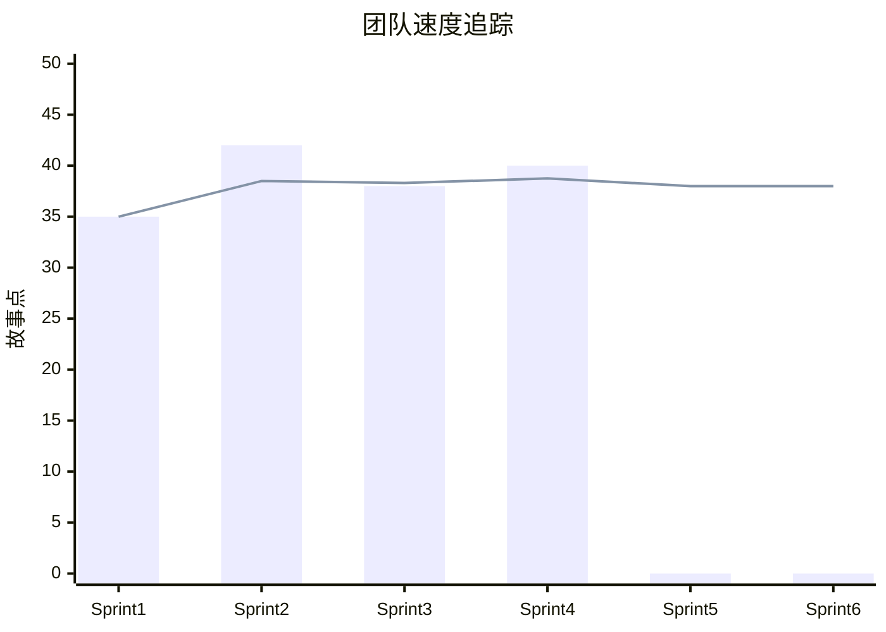

**速度的正确使用**：

```
┌─────────────────────────────────────────────────────────────┐
│ 速度使用的正确与错误方式                                     │
├─────────────────────────────────────────────────────────────┤
│ ✓ 正确：用于团队自身的 Sprint 规划                             │
│ ✓ 正确：识别趋势（速度上升/下降的原因）                     │
│ ✓ 正确：长期预测（版本计划、发布计划）                      │
│                                                              │
│ ✗ 错误：比较不同团队的速度（基准不同）                      │
│ ✗ 错误：作为绩效考核指标（会导致点数膨胀）                  │
│ ✗ 错误：管理层强制要求提升速度                              │
│ ✗ 错误：短期波动过度解读（看长期趋势）                      │
└─────────────────────────────────────────────────────────────┘
```

---

## 7.6 Sprint 评审与回顾

### 7.6.1 Sprint 评审会 (Sprint Review)

**目标**：向干系人展示本 Sprint 完成的工作成果，收集反馈。

**会议结构**：

| 环节 | 时间 | 内容 |
|------|------|------|
| **开场** | 5 分钟 | 回顾 Sprint 目标和承诺 |
| **演示** | 30-60 分钟 | 展示完成的 Story（可工作的软件） |
| **反馈** | 15-30 分钟 | 干系人提问和反馈 |
| **调整** | 10 分钟 | 根据反馈调整 Product Backlog |

**评审会检查清单**：

```
┌─────────────────────────────────────────────────────────────┐
│ Sprint 评审会检查清单                                        │
├─────────────────────────────────────────────────────────────┤
│ □ 邀请了所有关键干系人                                       │
│ □ 准备了演示环境（可工作的软件）                             │
│ □ 每个 Story 都有明确的演示脚本                               │
│ □ 收集了干系人反馈并记录                                     │
│ □ 根据反馈调整了 Product Backlog 优先级                       │
│ □ 讨论了下一个 Sprint 的可能方向                             │
└─────────────────────────────────────────────────────────────┘
```

### 7.6.2 Sprint 回顾会 (Sprint Retrospective)

**目标**：团队反思本次 Sprint 的过程，识别改进项。

**经典回顾模型**：

```mermaid
flowchart TD
    A[设置阶段] --> B[收集数据]
    B --> C[生成见解]
    C --> D[决定行动]
    D --> E[结束回顾]
    
    style A fill:#e1f5fe
    style B fill:#fff3e0
    style C fill:#f3e5f5
    style D fill:#c8e6c9
    style E fill:#c8e6c9
```

### 7.6.3 回顾会活动模板

**活动 1：Start/Stop/Continue**

```
┌─────────────────────────────────────────────────────────────┐
│ Start / Stop / Continue                                       │
├─────────────────────────────────────────────────────────────┤
│                                                              │
│ Start (开始做):                                              │
│ • 我们开始做什么可以改善下一个 Sprint?                        │
│ • 示例：开始做代码审查、开始写单元测试                       │
│                                                              │
│ Stop (停止做):                                               │
│ • 我们停止做什么可以避免问题？                                │
│ • 示例：停止在 Sprint 中加塞需求、停止无意义会议               │
│                                                              │
│ Continue (继续做):                                           │
│ • 我们继续做什么因为效果很好？                                │
│ • 示例：继续每日站会、继续结对编程                           │
│                                                              │
└─────────────────────────────────────────────────────────────┘
```

**活动 2：满意/不满/困惑**

```
┌─────────────────────────────────────────────────────────────┐
│ Mad / Sad / Glad (满意/不满/困惑)                            │
├─────────────────────────────────────────────────────────────┤
│                                                              │
│ Mad (愤怒/不满):                                             │
│ • 什么让你感到沮丧或愤怒？                                    │
│ • 示例：需求频繁变更、阻塞问题无人解决                       │
│                                                              │
│ Sad (难过/遗憾):                                             │
│ • 什么让你感到遗憾或失望？                                    │
│ • 示例：代码质量下降、技术债务累积                           │
│                                                              │
│ Glad (高兴/满意):                                            │
│ • 什么让你感到开心或自豪？                                    │
│ • 示例：成功交付重要功能、团队协作良好                       │
│                                                              │
└─────────────────────────────────────────────────────────────┘
```

**活动 3:5 Why 根因分析**

```
问题：Sprint 目标没有达成

Why 1: 为什么没有达成？
→ 因为有 2 个 Story 没有完成

Why 2: 为什么这 2 个 Story 没有完成？
→ 因为遇到了技术难题，花费了比预期更多的时间

Why 3: 为什么会遇到技术难题？
→ 因为对第三方库不熟悉，文档也不完善

Why 4: 为什么在不熟悉的情况下就开始了？
→ 因为 Sprint 规划时没有识别出这个风险

Why 5: 为什么没有识别出风险？
→ 因为规划会上没有充分讨论技术实现细节

根因：Sprint 规划会的技术讨论不够充分
改进：规划会第二部分增加技术风险评估环节
```

### 7.6.4 改进项追踪

**改进项模板**：

```markdown
## Sprint 12 改进项追踪

| 改进项 | 负责人 | 截止日期 | 状态 |
|--------|--------|----------|------|
| 规划会增加技术风险评估 | 张三 | Sprint 13 | ✅ 完成 |
| 建立代码审查 Checklist | 李四 | Sprint 13 | ✅ 完成 |
| 优化 CI/CD 流程，减少部署时间 | 王五 | Sprint 14 | 🔄 进行中 |
| 添加 API 自动化测试 | 赵六 | Sprint 14 | ⏳ 待开始 |
```

---

## 7.7 本章小结

**核心要点回顾**：

1. **Sprint 定义**：固定长度的迭代周期（1-4 周），交付可工作的软件增量
2. **规划会议**：两部分结构（做什么 + 怎么做），产出 Sprint 目标和 Sprint Backlog
3. **故事点估算**：使用斐波那契数列，Planning Poker 方法，避免小时估算陷阱
4. **每日站会**：15 分钟同步进度，三问题模型，聚焦 Sprint 目标
5. **进度跟踪**：燃尽图/燃起图/速度追踪，可视化进展
6. **评审与回顾**：评审会展示成果，回顾会持续改进

**关键记忆点**：
- **Sprint 长度**：建议 2 周，固定不变
- **规划会**：第一部分（做什么）+ 第二部分（怎么做）
- **故事点**：1, 2, 3, 5, 8, 13, 21（斐波那契数列）
- **站会三问**：昨天做了什么、今天做什么、有什么阻碍
- **回顾会**：Start/Stop/Continue 或 Mad/Sad/Glad

---

**来源引用**：
- Scrum Guide (2020)
- Planning Poker 估算方法
- Sprint 回顾会最佳实践

---

*本章草稿保存于：`.work/agile-epic/drafts/chapter-7.md`*
*字数：约 6000 字*

---

# 第 8 章 实战案例与常见误区

## 8.1 实战案例一：电商平台需求拆分

### 8.1.1 项目背景

**公司信息**：
- 行业：零售电商
- 规模：200 人团队
- 产品：B2C 电商平台（Web + App + 小程序）
- 挑战：从传统瀑布转型敏捷，需求管理混乱

**转型前问题**：

```
┌─────────────────────────────────────────────────────────────┐
│ 转型前痛点                                                   │
├─────────────────────────────────────────────────────────────┤
│ ✗ 需求文档长达数百页，开发周期 6 个月起步                      │
│ ✗ 业务方说不清到底要什么，开发做完又说不是想要的              │
│ ✗ 需求频繁变更，开发团队疲于应付                             │
│ ✗ 上线后用户反馈差，大量功能无人使用                         │
│ ✗ 团队士气低落，离职率高                                     │
└─────────────────────────────────────────────────────────────┘
```

### 8.1.2 Epic 识别与分解

**第一步：识别战略 Epic**

```
公司战略目标：3 年内成为细分领域电商领导者

识别出的 Epic：
├── Epic 1: 打造行业领先的电商平台 (6-9 个月)
├── Epic 2: 构建智能供应链系统 (9-12 个月)
├── Epic 3: 建立全渠道营销体系 (6-9 个月)
└── Epic 4: 提升移动端用户体验 (3-6 个月)
```

**Epic 1 详细分解**：

```mermaid
flowchart TD
    Epic["Epic: 打造行业领先的电商平台"]
    
    Epic --> F1["Feature: 商品管理系统\n(2 个月)"]
    Epic --> F2["Feature: 多渠道支付\n(1.5 个月)"]
    Epic --> F3["Feature: 订单履约系统\n(2 个月)"]
    Epic --> F4["Feature: 用户中心\n(1.5 个月)"]
    Epic --> F5["Feature: 售后服务中心\n(1.5 个月)"]
    
    style Epic fill:#ffe0b2
    style F1 fill:#fff3e0
    style F2 fill:#fff3e0
    style F3 fill:#fff3e0
    style F4 fill:#fff3e0
    style F5 fill:#fff3e0
```

### 8.1.3 Feature 到 Story 的分解

**以"多渠道支付"Feature 为例**：

```
Feature: 多渠道支付集成
所属 Epic: 打造行业领先的电商平台
预计时间：1.5 个月（3 个 Sprint）

按支付方式拆分 Story:

Sprint 1: 支付宝支付
├── Story 1.1 (5 点): 作为用户，我可以使用支付宝支付订单
├── Story 1.2 (3 点): 作为用户，我可以查看支付宝支付状态
├── Story 1.3 (2 点): 作为用户，我可以获取支付宝支付凭证
└── Story 1.4 (3 点): 作为运营，我可以查看支付宝支付报表

Sprint 2: 微信支付
├── Story 2.1 (5 点): 作为用户，我可以使用微信支付订单
├── Story 2.2 (3 点): 作为用户，我可以查看微信支付状态
├── Story 2.3 (2 点): 作为用户，我可以获取微信支付凭证
└── Story 2.4 (3 点): 作为运营，我可以查看微信支付报表

Sprint 3: 银联支付 + 优化
├── Story 3.1 (5 点): 作为用户，我可以使用银联卡支付订单
├── Story 3.2 (3 点): 作为用户，我可以切换支付方式
├── Story 3.3 (2 点): 作为用户，我可以查看支付历史记录
└── Story 3.4 (3 点): 作为开发，我可以监控支付接口健康状态
```

### 8.1.4 MVP 规划与版本路线

**MVP 范围（版本 1.0）**：

```
┌─────────────────────────────────────────────────────────────┐
│ MVP 范围 (2026 年 Q2 - Q3)                                   │
├─────────────────────────────────────────────────────────────┤
│ ✓ 商品管理：商品录入、分类管理、上下架控制                  │
│ ✓ 支付功能：支付宝支付（单一渠道）                          │
│ ✓ 订单系统：下单、支付、发货、确认收货                      │
│ ✓ 用户中心：注册登录、个人信息、收货地址                    │
│ ✗ 不包含：会员体系、优惠券、秒杀、直播带货                  │
└─────────────────────────────────────────────────────────────┘

成功标准：
- 日订单量 ≥ 100
- 支付成功率 ≥ 85%
- 用户满意度 ≥ 4.0/5.0
```

**版本路线图**：

```
产品路线图：

2026 年
     Q2            Q3            Q4            2027 Q1
     │─────────────│─────────────│─────────────│
     │  v1.0 MVP   │
     │  支付宝 + 基础功能            │
Epic │  ███████████│              │              │ 完成
     │             │              │              │
     │             │  v1.1        │              │
     │             │  微信 + 银联支付│              │
Epic │             │  ███████████ │              │ 完成
     │             │              │              │
     │             │              │  v1.2        │
     │             │              │  会员 + 优惠券  │
Epic │             │              │  ███████████ │ 完成
     │             │              │              │
     │             │              │              │  v2.0
     │             │              │              │  智能推荐
Epic │             │              │              │  ███████████│ 进行中
     │◄─ Feature 发布 ──►│◄─ Feature 发布 ──►│
```

### 8.1.5 转型成果

```
┌─────────────────────────────────────────────────────────────┐
│ 转型 6 个月后的成果                                           │
├─────────────────────────────────────────────────────────────┤
│ ✓ 交付周期：从 6 个月缩短至 2 周/Sprint                         │
│ ✓ 需求变更：从"灾难性"变为"可管理"                          │
│ ✓ 用户满意度：从 3.2 提升至 4.3                              │
│ ✓ 团队士气：离职率从 30% 降至 10%                             │
│ ✓ 业务价值：MVP 上线 3 个月获客 10 万+                          │
└─────────────────────────────────────────────────────────────┘
```

---

## 8.2 实战案例二：金融科技敏捷转型

### 8.2.1 项目背景

**公司信息**：
- 行业：金融科技（支付清算）
- 规模：500 人研发团队
- 产品：企业级支付清算系统
- 挑战：强监管环境下实施敏捷

**特殊约束**：

```
┌─────────────────────────────────────────────────────────────┐
│ 金融科技特殊约束                                             │
├─────────────────────────────────────────────────────────────┤
│ ⚠️ 合规要求：需要满足银监会、人民银行监管要求               │
│ ⚠️ 审计要求：所有变更需要可追溯、可审计                     │
│ ⚠️ 安全要求：金融级安全标准，数据加密传输存储               │
│ ⚠️ 稳定性要求：99.99% 可用性，故障零容忍                      │
│ ⚠️ 文档要求：需求、设计、测试文档必须完整                   │
└─────────────────────────────────────────────────────────────┘
```

### 8.2.2 敏捷适配方案

**核心思路**：不照搬 Scrum，而是根据行业特点定制

**适配措施**：

```mermaid
flowchart TD
    A[标准 Scrum] --> B{行业适配}
    B --> C[合规检查点]
    B --> D[审计追踪]
    B --> E[安全内建]
    B --> F[文档自动化]
    
    C --> G[每个 Sprint 添加合规评审]
    D --> H[需求 - 代码 - 测试全链路追踪]
    E --> I[安全需求作为 DoD 一部分]
    F --> J[从代码生成文档]
    
    style A fill:#e1f5fe
    style B fill:#fff3e0
    style G fill:#c8e6c9
    style H fill:#c8e6c9
    style I fill:#c8e6c9
    style J fill:#c8e6c9
```

**具体实践**：

| 挑战 | 解决方案 | 实施细节 |
|------|----------|----------|
| **合规要求** | Sprint 中添加合规检查点 | 每个 Story 需通过合规评审才能进入开发 |
| **审计追踪** | 建立需求追踪矩阵 | Epic→Feature→Story→Task→Code→Test 全链路 |
| **安全要求** | 安全需求内建 | 将安全检查纳入 Definition of Done |
| **文档要求** | 文档自动化生成 | 使用 Swagger、JSDoc 等从代码生成文档 |
| **变更管理** | 轻量级变更流程 | 小变更 PO 批准，大变更 CCB 审批 |

### 8.2.3 需求分层实施

**Epic 层级（战略层）**：

```
Epic: 构建新一代支付清算平台
战略对齐：公司 3 年数字化转型核心项目
时间跨度：18 个月
预算：5000 万

成功标准：
- 支持每秒 10 万笔交易处理
- 系统可用性 ≥ 99.99%
- 通过银监会合规审计
- 客户满意度 ≥ 4.5/5.0
```

**Feature 层级（产品层）**：

```
Feature: 实时清算引擎
所属 Epic: 构建新一代支付清算平台
优先级：Must Have
预计时间：4 个月（8 个 Sprint）

功能范围：
- 支持实时交易清算
- 支持批量清算
- 支持异常交易处理
- 支持清算对账

验收标准：
- 单笔交易清算时间 < 100ms
- 日清算能力 ≥ 1000 万笔
- 清算准确率 100%
```

**Story 层级（交付层）**：

```markdown
# Story: 实时交易清算

## 用户故事
作为清算操作员
我希望系统能够实时处理交易清算
以便及时发现和处理异常交易

## 验收标准
### 场景 1: 正常清算
- Given: 收到一笔交易请求
- When: 调用清算接口
- Then: 100ms 内返回清算结果

### 场景 2: 异常清算
- Given: 收到一笔异常交易（余额不足等）
- When: 调用清算接口
- Then: 返回明确的错误码和原因

### 场景 3: 并发清算
- Given: 同时收到 1000 笔交易请求
- When: 并发调用清算接口
- Then: 所有请求在 5 秒内处理完成

## 非功能需求
- 性能：单笔 < 100ms，并发 1000 TPS
- 安全：数据传输采用 TLS 1.3 加密
- 审计：所有清算操作记录审计日志

## 估算
- 故事点：13 点
- 预计工时：2 周
```

**Task 层级（执行层）**：

```
Story: 实时交易清算

Task 分解：
├── Task 1: 设计清算表结构 (4 小时) - 张三
├── Task 2: 实现清算核心算法 (16 小时) - 李四
├── Task 3: 开发清算 API 接口 (8 小时) - 张三
├── Task 4: 实现异常处理逻辑 (8 小时) - 王五
├── Task 5: 编写单元测试 (8 小时) - 李四
├── Task 6: 性能优化 (8 小时) - 全员
├── Task 7: 安全审计 (4 小时) - 安全团队
└── Task 8: 文档编写 (4 小时) - 张三

总工时：60 小时
```

### 8.2.4 转型成果

```
┌─────────────────────────────────────────────────────────────┐
│ 转型 12 个月后的成果                                          │
├─────────────────────────────────────────────────────────────┤
│ ✓ 交付效率：需求交付周期从 3 个月缩短至 3 周                   │
│ ✓ 质量提升：生产缺陷率下降 60%                               │
│ ✓ 合规审计：顺利通过银监会年度审计                          │
│ ✓ 客户满意度：从 3.5 提升至 4.4                              │
│ ✓ 团队效能：人均产出提升 40%                                 │
│ ✓ 系统稳定性：可用性达到 99.99%                             │
└─────────────────────────────────────────────────────────────┘

关键成功因素：
1. 高层支持：CEO 亲自挂帅，资源保障充足
2. 循序渐进：先试点再推广，不追求一步到位
3. 定制适配：不照搬 Scrum，根据行业特点调整
4. 培训投入：全员敏捷培训，统一语言和方法
5. 工具支撑：引入 Jira、Confluence 等工具
```

---

## 8.3 常见误区与反模式

### 8.3.1 Epic 层级误区

```
┌─────────────────────────────────────────────────────────────┐
│ Epic 常见误区                                                │
├─────────────────────────────────────────────────────────────┤
│ ✗ 误区 1: Epic = 大 Story                                     │
│   错误："作为用户，我希望有一个完整的电商系统"               │
│   正确：Epic 是战略愿景，不是放大的用户故事                   │
│                                                              │
│ ✗ 误区 2: Epic 越多越好                                       │
│   错误：同时启动 20 个 Epic，资源分散                           │
│   正确：聚焦 3-5 个核心 Epic，确保资源投入                      │
│                                                              │
│ ✗ 误区 3: Epic 没有成功标准                                   │
│   错误：只描述愿景，没有量化指标                             │
│   正确：Epic 必须有可衡量的成功标准                           │
│                                                              │
│ ✗ 误区 4: Epic 批准后不能调整                                 │
│   错误：市场变化了还坚持原有 Epic                            │
│   正确：定期审查 Epic，根据市场调整优先级或关闭              │
└─────────────────────────────────────────────────────────────┘
```

### 8.3.2 Feature 层级误区

```
┌─────────────────────────────────────────────────────────────┐
│ Feature 常见误区                                              │
├─────────────────────────────────────────────────────────────┤
│ ✗ 误区 1: 按技术模块拆分 Feature                              │
│   错误："前端开发"、"后端开发"、"数据库设计"                 │
│   正确：按业务价值拆分，如"用户注册"、"订单支付"             │
│                                                              │
│ ✗ 误区 2: Feature 规模过大或过小                              │
│   错误：一个 Feature 需要 6 个月完成                            │
│   正确：Feature 应在 1-3 个月内完成                            │
│                                                              │
│ ✗ 误区 3: Feature 之间依赖复杂                                │
│   错误：A Feature 必须等 B、C、D 完成后才能开始                 │
│   正确：重新设计 Feature 边界，减少依赖                       │
│                                                              │
│ ✗ 误区 4: Feature 没有明确验收标准                            │
│   错误：做完再说，验收标准后续补充                           │
│   正确：Feature 启动前明确验收标准                           │
└─────────────────────────────────────────────────────────────┘
```

### 8.3.3 User Story 层级误区

```
┌─────────────────────────────────────────────────────────────┐
│ User Story 常见误区                                          │
├─────────────────────────────────────────────────────────────┤
│ ✗ 误区 1: Story 写成任务清单                                  │
│   错误："创建数据库表"、"编写 API 接口"、"开发前端页面"        │
│   正确："作为用户，我可以搜索商品，以便快速找到想要的"       │
│                                                              │
│ ✗ 误区 2: 忽略 INVEST 原则                                    │
│   错误：Story 之间互相依赖，无法独立交付                      │
│   正确：每个 Story 应独立可交付，符合 INVEST 原则               │
│                                                              │
│ ✗ 误区 3: 验收标准缺失或模糊                                 │
│   错误："系统应该运行流畅"、"界面美观"                       │
│   正确："页面加载时间 < 3 秒"、"支持 Chrome/Firefox/Safari"   │
│                                                              │
│ ✗ 误区 4: Story 规模过大                                      │
│   错误：一个 Story 需要 1 个月完成                              │
│   正确：Story 应在 3-10 天内完成，过大需要拆分                 │
│                                                              │
│ ✗ 误区 5: 只写正常流程                                       │
│   错误：只考虑 happy path，忽略异常场景                      │
│   正确：验收标准覆盖正常、边界、异常场景                     │
└─────────────────────────────────────────────────────────────┘
```

### 8.3.4 拆分方法论误区

```
┌─────────────────────────────────────────────────────────────┐
│ 需求拆分常见误区                                             │
├─────────────────────────────────────────────────────────────┤
│ ✗ 误区 1: 按技术层级拆分（前后端分离）                        │
│   错误：先做完所有后端 API，再做前端                          │
│   正确：按业务价值拆分，每个 Story 包含前后端完整功能         │
│                                                              │
│ ✗ 误区 2: 按数据库表拆分                                     │
│   错误："用户表 CRUD"、"订单表 CRUD"                         │
│   正确：用户不关心数据库，关心能完成什么任务                 │
│                                                              │
│ ✗ 误区 3: 拆分过细                                           │
│   错误："添加按钮"、"编写函数"、"写注释"                     │
│   正确：Story 是独立的用户价值，不是技术任务                  │
│                                                              │
│ ✗ 误区 4: 拆分过粗                                           │
│   错误："实现用户管理系统"（需要 2 个月）                       │
│   正确：拆分为"用户注册"、"用户登录"、"修改密码"等           │
│                                                              │
│ ✗ 误区 5: 忽视优先级                                         │
│   错误：按顺序做，不做优先级评估                             │
│   正确：优先实现高价值、低复杂度的功能                       │
└─────────────────────────────────────────────────────────────┘
```

### 8.3.5 Sprint 管理误区

```
┌─────────────────────────────────────────────────────────────┐
│ Sprint 管理常见误区                                          │
├─────────────────────────────────────────────────────────────┤
│ ✗ 误区 1: Sprint 中随意加需求                                 │
│   错误：老板/业务方随时插需求，Sprint 范围不断变化             │
│   正确：Sprint 开始后范围固定，紧急需求放入下一个 Sprint       │
│                                                              │
│ ✗ 误区 2: 每日站会变成汇报会                                 │
│   错误：每个人向领导汇报昨天做了什么                         │
│   正确：团队内部同步，聚焦 Sprint 目标和阻塞问题               │
│                                                              │
│ ✗ 误区 3: 评审会不演示可工作软件                             │
│   错误：用 PPT 或文档"云演示"                                  │
│   正确：必须演示可工作的软件，干系人亲自体验                 │
│                                                              │
│ ✗ 误区 4: 回顾会流于形式                                     │
│   错误：每次都说"挺好的"，没有实质改进项                     │
│   正确：坦诚问题，每个 Sprint 至少 1 个改进项并追踪落实         │
│                                                              │
│ ✗ 误区 5: 速度比较                                           │
│   错误：用故事点比较不同团队的产出                           │
│   正确：速度是团队内部规划工具，不用于跨团队比较             │
└─────────────────────────────────────────────────────────────┘
```

---

## 8.4 工具推荐与实践

### 8.4.1 需求管理工具对比

| 工具 | 适用场景 | 优点 | 缺点 | 价格 |
|------|----------|------|------|------|
| **Jira** | 中大型团队 | 功能强大、生态丰富、自定义强 | 配置复杂、学习曲线陡 | 中高 |
| **PingCode** | 国内团队 | 本土化好、中文支持、性价比高 | 国际化弱 | 中低 |
| **Trello** | 小团队/个人 | 简单易用、看板直观 | 功能有限 | 低/免费 |
| **Azure DevOps** | 企业级 | 全生命周期管理、与 VS 集成 | 复杂、微软生态绑定 | 中高 |
| **Tapd** | 互联网公司 | 腾讯出品、敏捷友好 | 功能相对简单 | 中低 |

### 8.4.2 工具选择建议

```
┌─────────────────────────────────────────────────────────────┐
│ 工具选择建议                                                 │
├─────────────────────────────────────────────────────────────┤
│ ✓ 小团队（<10 人）：Trello/Teambition，简单易用               │
│                                                              │
│ ✓ 中型团队（10-50 人）：Jira/PingCode，功能完备               │
│                                                              │
│ ✓ 大型企业（>50 人）：Jira/Azure DevOps，企业级能力           │
│                                                              │
│ ✓ 强合规要求：选择支持审计追踪、权限管控的工具              │
│                                                              │
│ ✓ 分布式团队：选择云端部署、多语言支持的工具                │
│                                                              │
│ ✗ 避免：用 Excel/Word 管理需求（无法协作和追踪）             │
└─────────────────────────────────────────────────────────────┘
```

### 8.4.3 Jira 配置最佳实践

**Epic-Feature-Story 层级配置**：

```
Jira Issue Type Hierarchy:

Epic (史诗)
└── Feature (特性) [需要自定义 Issue Type]
    └── Story (用户故事)
        └── Task (任务)
        └── Bug (缺陷)
```

**工作流配置**：

```
Story 工作流：

Backlog → Selected → In Progress → Code Review → Testing → Done
   │                                    │
   └─────────────← Cancelled ←──────────┘
```

**看板配置**：

```
Kanban Board 列配置：

| Backlog | 待办 | 进行中 | 代码审查 | 测试中 | 已完成 |
|         | WIP:5 | WIP:3   | WIP:3     | WIP:2   |        |
```

### 8.4.4 模板与检查清单

**Epic 模板**：

```markdown
# Epic: [名称]

## 战略描述
[1-2 句话描述战略意义]

## 业务目标
- [量化目标 1]
- [量化目标 2]

## 成功标准
- [可衡量的完成标准]

## 包含 Feature
- [ ] Feature 1
- [ ] Feature 2

## 风险与依赖
- 风险：[描述 + 应对策略]
- 依赖：[描述 + 协调方案]
```

**Story 模板**：

```markdown
# Story: [名称]

## 用户故事
作为 [角色]
我希望 [功能]
以便 [价值]

## 验收标准
### 场景 1
- Given: [前提]
- When: [操作]
- Then: [结果]

## 估算
- 故事点：[X 点]

## 依赖
- [依赖的其他 Story 或资源]
```

---

## 8.5 本章小结

**核心要点回顾**：

1. **电商案例**：展示了从 Epic 识别到 Story 分解的完整流程，MVP 规划方法
2. **金融科技案例**：强监管环境下的敏捷适配，合规与敏捷的平衡
3. **常见误区**：Epic/Feature/Story/Sprint 各层级的典型错误和反模式
4. **工具推荐**：Jira、PingCode、Trello 等工具对比和选择建议
5. **实践模板**：可直接使用的 Epic/Story 模板和检查清单

**关键记忆点**：
- **Epic 误区**：不是大 Story，是战略愿景
- **Feature 误区**：按业务价值拆分，不是按技术模块
- **Story 误区**：从用户角度描述，不是技术任务清单
- **拆分误区**：不按前后端/数据库拆分，按用户价值拆分
- **Sprint 误区**：范围固定，不随意加需求

---

**来源引用**：
- 电商敏捷转型实战案例
- 金融科技合规敏捷实践
- Scrum 常见反模式总结
- 需求管理工具对比评测

---

*本章草稿保存于：`.work/agile-epic/drafts/chapter-8.md`*
*字数：约 7000 字*

---

## 文档总结

**Epic 用户史诗核心知识体系** 完整文档至此结束。

### 全文档结构总览

| 章节 | 主题 | 字数 |
|------|------|------|
| 第 1 章 | 基础认知：敏捷开发与需求分层 | ~2,800 |
| 第 2 章 | Epic 史诗：战略层需求定义 | ~3,200 |
| 第 3 章 | Feature 特性：产品层需求分解 | ~3,500 |
| 第 4 章 | User Story 用户故事：交付层需求细化 | ~4,000 |
| 第 5 章 | Epic 拆分方法论 | ~5,000 |
| 第 6 章 | 用户故事地图 (User Story Mapping) | ~5,500 |
| 第 7 章 | 迭代开发与 Sprint 管理 | ~6,000 |
| 第 8 章 | 实战案例与常见误区 | ~7,000 |
| **总计** | | **~37,000 字** |

### 核心知识框架

```
敏捷需求分层体系：

Epic (战略层)
  │
  ├─ 定义：项目愿景目标，战略价值，3-12 个月
  ├─ 来源：公司战略、市场需求、客户需求、技术升级、合规、业务拓展
  └─ 管理：优先级评估、路线图规划、进展追踪
      │
      ▼ 分解为
      │
Feature (产品层)
  │
  ├─ 定义：可带来价值的产品功能，业务价值，1-3 个月
  ├─ 分解方法：按功能模块、用户角色、业务流程
  └─ 优先级：价值 - 复杂度矩阵、MoSCoW 法则
      │
      ▼ 分解为
      │
User Story (交付层)
  │
  ├─ 定义：从用户角度的功能描述，用户价值，3-10 天
  ├─ 3C 原则：卡片、交谈、确认
  ├─ INVEST 原则：独立、可协商、有价值、可估算、小、可测试
  └─ 验收标准：Given-When-Then 格式
      │
      ▼ 分解为
      │
Task (执行层)
  │
  ├─ 定义：具体技术任务，1-8 小时
  └─ 估算：工时 (小时)
```

### 关键方法论

1. **需求拆分六法**：按用户角色、用户旅程、业务规则、数据维度、技术层级、场景用例
2. **用户故事地图七步法**：识别用户→定义活动→分解任务→编写故事→排列优先级→切分版本→制定路线图
3. **Sprint 管理流程**：规划会→每日站会→评审会→回顾会

### 实践建议

- **层级清晰**：保持 Epic→Feature→Story→Task 层级分明，不混淆
- **渐进明细**：高层级只描述方向，细节在低层级展开
- **价值导向**：每个 Story 都应有明确的用户价值
- **MVP 思维**：优先交付核心价值，快速验证业务假设
- **持续改进**：每个 Sprint 回顾会识别至少 1 个改进项

---

*文档版本：1.0.0*
*创建日期：2026-04-06*
*文档位置：`Tech/Business/Agile/Epic 用户史诗核心知识体系.md`*
