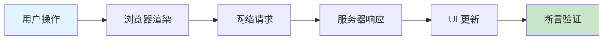
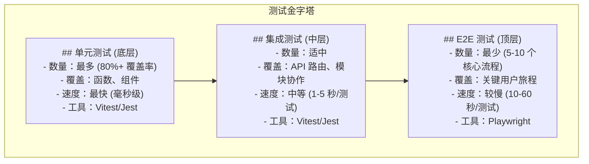

# Next.js E2E 测试核心知识体系

> 从入门到精通的完整指南 | **调研时间：** 2026-04-01 | **来源：** 25+ 官方文档与技术博客

---

## 目录

1. [概述](#1-概述)
2. [核心概念](#2-核心概念)
3. [Playwright 快速入门](#3-playwright-快速入门)
4. [Cypress 快速入门](#4-cypress-快速入门)
5. [核心测试场景](#5-核心测试场景)
6. [高级特性](#6-高级特性)
7. [Next.js 特殊场景](#7-nextjs-特殊场景)
8. [实战案例与常见问题](#8-实战案例与常见问题)

---

## 1. 概述

### 1.1 E2E 测试定义与价值

**定义：** E2E（End-to-End，端到端）测试是一种测试方法，它从用户视角出发，模拟真实用户在浏览器中的完整操作流程，验证整个应用系统是否按预期工作。



**为什么需要 E2E 测试？**

| 问题场景 | 无 E2E 测试 | 有 E2E 测试 |
|----------|-------------|-------------|
| 用户流程中断 | 生产环境才发现 | 提交代码前捕获 |
| 跨浏览器兼容性问题 | 用户报告后修复 | 测试阶段发现 |
| 回归 Bug | 难以追踪影响范围 | 自动化检测 |
| 部署信心 | 手动测试，耗时且易遗漏 | 自动化验证，快速发布 |

### 1.2 Next.js E2E 测试独特挑战

#### React Server Components (RSC) 测试挑战

**核心问题：** Next.js App Router 默认使用 React Server Components，这些组件在服务器端渲染，永远不会发送到客户端。

```typescript
// Server Component (默认) - 运行在服务端
export default async function Page() {
  const data = await db.query('SELECT * FROM posts');
  return <div>{data.map(post => <Post key={post.id} {...post} />)}</div>;
}

// Client Component - 需要显式声明
'use client';
export default function Counter() {
  const [count, setCount] = useState(0);
  return <button onClick={() => setCount(count + 1)}>{count}</button>;
}
```

**对 E2E 测试的影响：**

| 挑战 | 说明 | 解决方案 |
|------|------|----------|
| **服务端数据获取无法直接模拟** | Playwright 无法拦截服务器端 `fetch()` 请求 | 使用测试数据库或 API 固定化 |
| **异步组件渲染时机** | Server Components 异步渲染，测试需等待 | 使用 `page.waitForSelector()` 等智能等待 |
| **流式渲染 (Streaming)** | 内容逐步加载，非一次性渲染 | 测试需验证加载状态和最终状态 |

### 1.3 主流工具对比（Playwright vs Cypress vs 其他）

| 功能特性 | Playwright | Cypress | Selenium |
|----------|------------|---------|----------|
| **浏览器支持** | Chromium, Firefox, WebKit | Chromium 系 (Chrome/Edge) | 所有主流浏览器 |
| **多标签页支持** | ✅ 原生支持 | ❌ 需插件变通 | ✅ 支持 |
| **跨域测试** | ✅ 原生支持 | ❌ 需配置 | ✅ 支持 |
| **移动端模拟** | ✅ 设备描述符 | ⚠️ 有限支持 | ⚠️ 需真实设备 |
| **网络拦截** | ✅ 强大 API | ✅ 支持 | ⚠️ 有限 |
| **自动等待** | ✅ 智能四重检测 | ✅ 支持 | ❌ 需显式等待 |
| **调试工具** | Trace Viewer, UI 模式 | Time Travel, 实时重载 | 基础调试 |
| **并行执行** | ✅ 原生支持 | ⚠️ 需 Dashboard | ✅ 支持 |

**2025-2026 年市场趋势：**

| 公司 | 迁移方向 | 原因 |
|------|----------|------|
| Uber | Cypress → Playwright | 跨浏览器需求，测试速度提升 60% |
| Adobe | Selenium → Playwright | 现代架构，更好的调试工具 |
| n8n | Cypress → Playwright | 多标签页支持，API 模拟更强大 |

### 1.4 Next.js 官方推荐方案

**官方明确推荐：**
- **单元测试：** Vitest (Next.js 16 推荐) 或 Jest
- **E2E 测试：** Playwright
- **示例项目：** `with-playwright`, `with-vitest`

**一键创建测试项目：**

```bash
# 使用官方 Playwright 示例项目
npx create-next-app@latest --example with-playwright my-playwright-app
```

---

## 2. 核心概念

### 2.1 测试金字塔中的 E2E 测试

Next.js 项目遵循经典的测试金字塔原则，E2E 测试位于金字塔顶层：



**各层级测试推荐比例：**

| 测试类型 | 推荐比例 | 典型数量 (中型项目) |
|----------|----------|---------------------|
| 单元测试 | 70% | 200-500 个 |
| 集成测试 | 20% | 50-100 个 |
| E2E 测试 | 10% | 10-30 个 |

### 2.2 Next.js 架构对 E2E 测试的影响

#### App Router 架构

```
app/
├── layout.tsx          # 根布局 (所有页面共享)
├── page.tsx            # 首页 (/)
├── loading.tsx         # 全局加载状态
├── error.tsx           # 全局错误边界
└── dashboard/
    ├── layout.tsx      # dashboard 专属布局
    ├── page.tsx        # /dashboard
    └── settings/
        └── page.tsx    # /dashboard/settings
```

**测试影响：**
1. **布局持久化**：切换路由时 Layout 不重新渲染，测试需考虑状态保持
2. **嵌套 Suspense**：多个加载边界可能同时存在，测试需正确等待
3. **并行数据获取**：多个组件可能并行获取数据，测试时序更复杂

### 2.3 浏览器引擎详解

**三大浏览器引擎对比：**

| 引擎 | 浏览器 | 市场份额 | 测试重要性 |
|------|--------|----------|------------|
| **Blink (Chromium)** | Chrome, Edge, Opera | ~65% | 必须测试 |
| **WebKit** | Safari, iOS 所有浏览器 | ~19% | 必须测试 (iOS 唯一引擎) |
| **Gecko** | Firefox | ~3% | 推荐测试 |

**为什么必须测试 Safari：**

| 差异点 | Chromium | WebKit (Safari) | 测试影响 |
|--------|----------|-----------------|----------|
| **CSS 前缀** | 标准属性 | 某些需要 `-webkit-` 前缀 | 样式可能不同 |
| **Date 解析** | 宽松 | 严格 (如 `new Date('2024-01-01')` 可能 NaN) | iOS 用户可能遇到 Bug |
| **滚动行为** | 平滑滚动实现不同 | 可能导致测试时序问题 | 需适当等待 |

### 2.4 测试隔离与环境配置

**测试数据隔离策略：**

```typescript
// 策略 1：每个测试重置数据
test.beforeEach(async ({ page }) => {
  // 通过 API 重置测试数据
  await page.request.post('/api/test/reset-database');
});

// 策略 2：使用唯一标识符
test('user can register', async ({ page }) => {
  const uniqueEmail = `test_${Date.now()}@example.com`;
  // 使用唯一邮箱避免冲突
});
```

---

## 3. Playwright 快速入门

### 3.1 环境要求与安装

**系统要求：**

| 组件 | 最低要求 | 推荐配置 |
|------|----------|----------|
| **Node.js** | v18+ | v20 LTS 或更高 |
| **内存** | 2GB | 4GB+ (并行测试) |
| **磁盘空间** | 1.5GB (浏览器二进制) | 2GB+ |

**安装方法：**

```bash
# 方法 1：使用 Next.js 官方示例 (推荐新手)
npx create-next-app@latest --example with-playwright my-playwright-app

# 方法 2：在现有项目中安装
npm init playwright@latest

# 方法 3：手动安装
npm install -D @playwright/test
npx playwright install
```

### 3.2 配置文件详解 (playwright.config.ts)

**适用于 Next.js 项目的完整配置：**

```typescript
// playwright.config.ts
import { defineConfig, devices } from '@playwright/test';

export default defineConfig({
  // ===== 基础配置 =====
  testDir: './tests',
  fullyParallel: true,
  
  // ===== 超时与重试 =====
  timeout: 30 * 1000,
  expect: { timeout: 5000 },
  retries: process.env.CI ? 2 : 0,
  workers: process.env.CI ? 1 : undefined,
  
  // ===== Web 服务器配置 =====
  webServer: {
    command: process.env.CI ? 'npm run start' : 'npm run dev',
    url: 'http://localhost:3000',
    reuseExistingServer: !process.env.CI,
    timeout: 120 * 1000,
  },
  
  // ===== 共享配置 =====
  use: {
    baseURL: 'http://localhost:3000',
    headless: true,
    viewport: { width: 1280, height: 720 },
    trace: 'on-first-retry',
    screenshot: 'only-on-failure',
    video: 'retain-on-failure',
  },
  
  // ===== 多浏览器配置 =====
  projects: [
    { name: 'chromium', use: { ...devices['Desktop Chrome'] } },
    { name: 'firefox', use: { ...devices['Desktop Firefox'] } },
    { name: 'webkit', use: { ...devices['Desktop Safari'] } },
    { name: 'Mobile Chrome', use: { ...devices['Pixel 5'] } },
    { name: 'Mobile Safari', use: { ...devices['iPhone 13'] } },
  ],
});
```

### 3.3 第一个 E2E 测试

**创建测试页面：**

```typescript
// app/page.tsx - 首页
export default function HomePage() {
  return (
    <main>
      <h1>Welcome to Next.js</h1>
      <nav>
        <Link href="/about">About</Link>
      </nav>
    </main>
  );
}
```

**编写测试：**

```typescript
// tests/homepage.spec.ts
import { test, expect } from '@playwright/test';

test.describe('Homepage', () => {
  test('renders correctly', async ({ page }) => {
    await page.goto('/');
    
    // 验证页面标题
    await expect(page).toHaveTitle(/Next.js/);
    
    // 验证主标题
    await expect(page.getByRole('heading', { level: 1 }))
      .toContainText('Welcome to Next.js');
  });
  
  test('navigates to about page', async ({ page }) => {
    await page.goto('/');
    await page.getByRole('link', { name: 'About' }).click();
    await expect(page).toHaveURL('/about');
  });
});
```

### 3.4 运行模式 (UI/Debug/Headless)

| 模式 | 命令 | 浏览器 UI | 速度 | 使用场景 |
|------|------|----------|------|----------|
| **Headless** | `playwright test` | 无 | 最快 | CI/CD, 日常运行 |
| **Headed** | `playwright test --headed` | 有 | 中 | 观察行为 |
| **UI Mode** | `playwright test --ui` | 有 (交互界面) | 中 | 开发调试 |
| **Debug** | `playwright test --debug` | 有 (Inspector) | 慢 | 逐步调试 |

### 3.5 与 Next.js 开发服务器集成

**webServer 配置：**

```typescript
webServer: {
  command: process.env.CI ? 'npm run start' : 'npm run dev',
  url: 'http://localhost:3000',
  reuseExistingServer: !process.env.CI,
  timeout: 120 * 1000,
},
```

**package.json 脚本：**

```json
{
  "scripts": {
    "test:e2e": "playwright test",
    "test:e2e:ui": "playwright test --ui",
    "test:e2e:debug": "playwright test --debug",
    "test:e2e:chromium": "playwright test --project=chromium"
  }
}
```

---

## 4. Cypress 快速入门

### 4.1 环境要求与安装

**系统要求：**

| 组件 | 最低版本 | 推荐版本 |
|------|----------|----------|
| Node.js | v12.x | v18.x 或更高 |
| npm | v6.x | v9.x 或更高 |
| 浏览器 | Chrome 64+、Firefox 55+、Edge 79+ | 最新版本 |

**安装步骤：**

```bash
# 安装 Cypress
npm install cypress --save-dev

# 打开 Cypress Test Runner
npx cypress open
```

**TypeScript 配置：**

```json
{
  "compilerOptions": {
    "target": "ES2020",
    "lib": ["ES2020", "DOM"],
    "types": ["cypress", "node"],
  },
  "include": ["cypress/**/*.ts"]
}
```

### 4.2 Cypress 配置详解

**完整配置示例：**

```typescript
// cypress.config.ts
import { defineConfig } from 'cypress'

export default defineConfig({
  e2e: {
    baseUrl: 'http://localhost:3000',
    specPattern: 'cypress/e2e/**/*.cy.{js,jsx,ts,tsx}',
    supportFile: 'cypress/support/e2e.ts',
    viewportWidth: 1280,
    viewportHeight: 720,
    defaultCommandTimeout: 4000,
    pageLoadTimeout: 60000,
  },
})
```

### 4.3 第一个 E2E 测试

```typescript
// cypress/e2e/homepage.cy.ts
describe('首页测试套件', () => {
  beforeEach(() => {
    cy.visit('/')
  })
  
  it('应该显示正确的页面标题', () => {
    cy.title().should('include', 'Next.js')
  })
  
  it('应该显示导航链接', () => {
    cy.get('nav').should('exist')
    cy.get('nav a').should('have.length.greaterThan', 0)
  })
})
```

### 4.4 Cypress Test Runner 使用

**启动 Test Runner：**

```bash
# 交互模式
npx cypress open

# 无头模式
npx cypress run
```

**调试功能：**
- **时间旅行（Time Travel）：** 每个命令可回看快照
- **断点调试：** 使用 `.debug()` 或 `cy.pause()`
- **浏览器开发者工具：** 直接设置断点

### 4.5 与 Next.js 开发服务器集成

**package.json 脚本：**

```json
{
  "scripts": {
    "cypress:open": "cypress open",
    "cypress:run": "cypress run",
    "test:e2e": "start-server-and-test dev http://localhost:3000 cypress:open",
    "test:e2e:run": "start-server-and-test dev http://localhost:3000 cypress:run"
  }
}
```

---

## 5. 核心测试场景

### 5.1 页面导航测试

**基础导航测试：**

```typescript
// Playwright
test('应该从首页导航到关于页面', async ({ page }) => {
  await page.goto('/');
  await page.getByRole('link', { name: 'About' }).click();
  await expect(page).toHaveURL('/about');
  await expect(page.getByRole('heading', { level: 1 }))
    .toContainText('About Us');
});
```

**客户端导航 vs 服务端导航测试：**

```typescript
// Cypress - 验证客户端导航（不刷新页面）
it('应该使用客户端导航', () => {
  cy.visit('/')
  cy.window().then((win) => {
    const initialLength = win.performance.getEntriesByType('navigation').length
    cy.get('a[href="/dashboard"]').click()
    cy.url().should('include', '/dashboard')
    // 验证没有发生完整页面刷新
    cy.window().then((win) => {
      const currentLength = win.performance.getEntriesByType('navigation').length
      expect(currentLength).to.eq(initialLength)
    })
  })
})
```

### 5.2 表单交互与验证

**完整表单测试：**

```typescript
test('submits form successfully', async ({ page }) => {
  await page.goto('/contact');
  
  // 填写表单
  await page.getByLabel('Name').fill('John Doe');
  await page.getByLabel('Email').fill('john@example.com');
  await page.getByLabel('Message').fill('Hello!');
  
  // 提交表单
  await page.getByRole('button', { name: 'Submit' }).click();
  
  // 验证成功消息
  await expect(page.getByText('Thank you for your message!'))
    .toBeVisible();
});

test('validates required fields', async ({ page }) => {
  await page.goto('/contact');
  await page.getByRole('button', { name: 'Submit' }).click();
  await expect(page.getByText('Name is required')).toBeVisible();
});
```

### 5.3 认证流程测试

**登录/登出测试：**

```typescript
test.describe('Authentication', () => {
  test('login and access dashboard', async ({ page }) => {
    await page.goto('/login');
    
    await page.getByLabel('Email').fill('user@example.com');
    await page.getByLabel('Password').fill('password123');
    await page.getByRole('button', { name: 'Sign In' }).click();
    
    await expect(page).toHaveURL('/dashboard');
    await expect(page.getByText('Welcome back!')).toBeVisible();
  });
  
  test('protected route redirect', async ({ page }) => {
    await page.goto('/dashboard');
    // 未登录应重定向到登录页
    await expect(page).toHaveURL('/login');
  });
});
```

### 5.4 API Mock 与网络拦截

**Playwright 网络模拟：**

```typescript
test('handles API error gracefully', async ({ page }) => {
  // 模拟 API 错误
  await page.route('/api/users', route => 
    route.fulfill({ status: 500, body: 'Internal Server Error' })
  );
  
  await page.goto('/users');
  await expect(page.getByText('Failed to load users')).toBeVisible();
});
```

**Cypress 网络拦截：**

```typescript
it('应该拦截并模拟 API 响应', () => {
  cy.intercept('GET', '/api/users', {
    statusCode: 200,
    body: [{ id: 1, name: 'Mocked User' }]
  }).as('getUsers')
  
  cy.visit('/users')
  cy.wait('@getUsers')
  cy.contains('Mocked User').should('be.visible')
})
```

### 5.5 视觉回归测试

**Playwright 截图对比：**

```typescript
test('homepage looks correct', async ({ page }) => {
  await page.goto('/');
  await expect(page).toHaveScreenshot('homepage.png', {
    fullPage: true,
  });
});

test('about page looks correct', async ({ page }) => {
  await page.goto('/about');
  await expect(page.getByTestId('main-content'))
    .toHaveScreenshot('about-content.png');
});
```

---

## 6. 高级特性

### 6.1 多浏览器测试（Cross-Browser）

**Playwright 多浏览器配置：**

```typescript
projects: [
  { name: 'chromium', use: { ...devices['Desktop Chrome'] } },
  { name: 'firefox', use: { ...devices['Desktop Firefox'] } },
  { name: 'webkit', use: { ...devices['Desktop Safari'] } },
],
```

**运行特定浏览器：**

```bash
# 只运行 Chromium
npx playwright test --project=chromium

# 运行多个项目
npx playwright test --project=chromium --project=firefox

# 排除项目
npx playwright test --project=!webkit
```

### 6.2 移动设备模拟

**Playwright 设备描述符：**

```typescript
projects: [
  {
    name: 'Mobile Chrome',
    use: { ...devices['Pixel 5'] },
  },
  {
    name: 'Mobile Safari',
    use: { ...devices['iPhone 13'] },
  },
  {
    name: 'Mobile Safari Landscape',
    use: { ...devices['iPhone 13 landscape'] },
  },
];
```

### 6.3 并行测试执行

**配置并行工作器：**

```typescript
export default defineConfig({
  workers: process.env.CI ? 1 : undefined,  // CI 顺序执行，本地使用 CPU 核心数
  fullyParallel: true,  // 所有测试文件并行运行
});
```

**运行并行测试：**

```bash
# 使用所有核心
npx playwright test --workers=100%

# 使用指定数量
npx playwright test --workers=4
```

### 6.4 CI/CD 集成

**GitHub Actions 完整工作流：**

```yaml
name: E2E Tests

on:
  push:
    branches: [main]
  pull_request:
    branches: [main]

jobs:
  e2e:
    runs-on: ubuntu-latest
    
    steps:
      - uses: actions/checkout@v4
      
      - uses: actions/setup-node@v4
        with:
          node-version: 20
          cache: 'npm'
      
      - name: Install dependencies
        run: npm ci
      
      - name: Install Playwright browsers
        run: npx playwright install --with-deps
      
      - name: Run E2E tests
        run: npx playwright test
        env:
          CI: true
      
      - uses: actions/upload-artifact@v4
        if: failure()
        with:
          name: playwright-report
          path: playwright-report/
          retention-days: 30
```

### 6.5 Page Object 模式

**Page Object 类定义：**

```typescript
// tests/pages/login.page.ts
import { Page, Locator } from '@playwright/test';

export class LoginPage {
  readonly page: Page;
  readonly emailInput: Locator;
  readonly passwordInput: Locator;
  readonly submitButton: Locator;

  constructor(page: Page) {
    this.page = page;
    this.emailInput = page.getByLabel('Email');
    this.passwordInput = page.getByLabel('Password');
    this.submitButton = page.getByRole('button', { name: 'Sign In' });
  }

  async goto() {
    await this.page.goto('/login');
  }

  async login(email: string, password: string) {
    await this.emailInput.fill(email);
    await this.passwordInput.fill(password);
    await this.submitButton.click();
  }
}
```

**使用 Page Object：**

```typescript
// tests/login.test.ts
import { test, expect } from '@playwright/test';
import { LoginPage } from './pages/login.page';

test.describe('Login', () => {
  let loginPage: LoginPage;

  test.beforeEach(async ({ page }) => {
    loginPage = new LoginPage(page);
  });

  test('successful login', async () => {
    await loginPage.goto();
    await loginPage.login('user@example.com', 'password123');
    await expect(loginPage.page).toHaveURL('/dashboard');
  });
});
```

---

## 7. Next.js 特殊场景

### 7.1 Server Components 测试策略

**概念定义：** Server Components 在服务器端渲染，测试时需验证最终渲染的 HTML 内容。

**测试模式：**

```typescript
test('应该正确渲染服务器组件内容', async ({ page }) => {
  await page.goto('/products');
  
  // 验证服务器渲染的内容
  await expect(page.getByTestId('product-list')).toBeVisible();
  await expect(page.getByTestId('product-card')).toHaveCount({ min: 1 });
});

test('应该显示 Suspense 加载状态', async ({ page }) => {
  await page.goto('/products');
  
  // 验证加载状态显示
  await expect(page.getByTestId('skeleton')).toBeVisible();
  
  // 等待内容加载完成
  await expect(page.getByTestId('product-list')).toBeVisible();
  await expect(page.getByTestId('skeleton')).not.toBeVisible();
});
```

### 7.2 Server Actions 测试

**Server Actions 测试策略：**

```typescript
test('creates todo via form submission', async ({ page }) => {
  await page.goto('/todos');
  
  // 填写表单并提交
  await page.getByLabel('Todo title').fill('Learn Server Actions');
  await page.getByRole('button', { name: 'Add Todo' }).click();
  
  // 等待页面重新验证
  await expect(page.getByText('Learn Server Actions')).toBeVisible();
  
  // 验证成功状态
  await expect(page.getByText('Todo created successfully'))
    .toBeVisible();
});

test('shows validation error for short title', async ({ page }) => {
  await page.goto('/todos');
  await page.getByLabel('Todo title').fill('Ab');
  await page.getByRole('button', { name: 'Add Todo' }).click();
  await expect(page.getByText('Title must be at least 3 characters'))
    .toBeVisible();
});
```

### 7.3 Middleware 测试

**Middleware 重定向测试：**

```typescript
test('middleware redirects unauthenticated users', async ({ page }) => {
  await page.goto('/dashboard');
  // 未登录应重定向到登录页
  await expect(page).toHaveURL('/login');
});

test('middleware allows authenticated users', async ({ page }) => {
  // 先登录
  await page.goto('/login');
  await page.getByLabel('Email').fill('test@example.com');
  await page.getByLabel('Password').fill('password123');
  await page.getByRole('button', { name: 'Sign In' }).click();
  
  // 现在访问受保护页面
  await page.goto('/dashboard');
  await expect(page).toHaveURL('/dashboard');
});
```

### 7.4 环境变量配置

**多环境配置文件：**

```bash
# .env.test
DATABASE_URL=postgresql://localhost:5432/myapp_test
NEXT_PUBLIC_API_URL=http://localhost:3001
TEST_MODE=true

# .env.ci
DATABASE_URL=postgresql://ci-db:5432/myapp_test
NEXT_PUBLIC_API_URL=http://localhost:3000
TEST_MODE=true
CI=true
```

**Playwright 配置中使用环境变量：**

```typescript
export default defineConfig({
  timeout: process.env.CI ? 60000 : 30000,
  webServer: {
    command: process.env.CI ? 'npm run start' : 'npm run dev',
    port: process.env.PORT || 3000,
  },
  use: {
    baseURL: process.env.BASE_URL || 'http://localhost:3000',
  },
});
```

---

## 8. 实战案例与常见问题

### 8.1 案例一：电商网站（商品浏览 + 购物车 + 结账）

**完整结账流程测试：**

```typescript
import { test, expect } from '@playwright/test';

test.describe('Complete Purchase Flow', () => {
  test('user can browse, add to cart, and checkout', async ({ page }) => {
    // 1. 浏览商品
    await page.goto('/');
    await page.getByText('MacBook Pro').click();
    await expect(page).toHaveURL('/products/1');
    
    // 2. 添加到购物车
    await page.getByRole('button', { name: 'Add to Cart' }).click();
    await expect(page.getByText('Added to cart')).toBeVisible();
    
    // 3. 查看购物车
    await page.getByRole('link', { name: 'Cart' }).click();
    await expect(page).toHaveURL('/cart');
    await expect(page.getByText('MacBook Pro')).toBeVisible();
    
    // 4. 结账
    await page.getByRole('button', { name: 'Checkout' }).click();
    await page.getByLabel('Email').fill('test@example.com');
    await page.getByLabel('Address').fill('123 Main St');
    
    // 5. 提交订单
    await page.getByRole('button', { name: 'Place Order' }).click();
    await expect(page).toHaveURL('/order-confirmation');
    await expect(page.getByText('Order confirmed!')).toBeVisible();
  });
});
```

### 8.2 案例二：博客系统

**Server Component 测试策略：**

```typescript
test('renders blog post content', async ({ page }) => {
  await page.goto('/blog/hello-world');
  
  // 验证 SSR 渲染的内容
  await expect(page.getByRole('heading', { level: 1 }))
    .toHaveText('Hello World');
  
  // 验证文章内容存在
  await expect(page.getByTestId('article-content'))
    .not.toBeEmpty();
});
```

### 8.3 案例三：SaaS 仪表板

**认证流程测试：**

```typescript
test.describe('Authentication', () => {
  test('login and access dashboard', async ({ page }) => {
    await page.goto('/login');
    
    await page.getByLabel('Email').fill('user@example.com');
    await page.getByLabel('Password').fill('password123');
    await page.getByRole('button', { name: 'Sign In' }).click();
    
    await expect(page).toHaveURL('/dashboard');
    await expect(page.getByText('Welcome back!')).toBeVisible();
  });
  
  test('protected route redirect', async ({ page }) => {
    await page.goto('/dashboard');
    await expect(page).toHaveURL('/login');
  });
});
```

### 8.4 调试技巧

**Playwright Trace Viewer：**

```bash
# 运行测试并生成追踪
npx playwright test --trace on

# 查看追踪报告
npx playwright show-trace trace.zip
```

**Trace Viewer 内容包括：**
- DOM 快照 (每个操作前后)
- 网络请求日志
- 控制台输出
- 测试执行视频
- 源代码与调用栈

### 8.5 常见问题排查

#### Flaky Tests (不稳定测试)

**主要原因：**
1. 时序问题 - 元素未完全加载
2. 状态污染 - 测试间共享状态
3. 动态定位器 - 使用不稳定的选择器

**解决方案：**

```typescript
// ❌ 错误：固定等待
cy.wait(5000)

// ✅ 正确：智能等待
cy.get('.submit-btn', { timeout: 10000 }).should('be.enabled')

// ✅ 使用语义化定位器
cy.get('[data-testid="submit-button"]')
```

#### 超时问题

```typescript
// 增加特定测试的超时
test('slow operation', async ({ page }) => {
  test.setTimeout(60000);  // 这个测试给 60 秒
  // ...
});

// 增加全局超时
export default defineConfig({
  timeout: 60 * 1000,
  expect: { timeout: 10000 },
});
```

### 8.6 性能优化

**测试加速策略：**

1. **并行执行** - 使用 `--workers` 标志
2. **状态重用** - 使用 Fixtures 共享登录状态
3. **Mock 外部依赖** - 模拟慢速 API
4. **选择性运行** - 使用 `--project` 选择浏览器

```typescript
// 使用 Fixtures 共享登录状态
export const test = base.extend<{
  authenticatedPage: Page;
}>({
  authenticatedPage: async ({ page }, use) => {
    // 登录一次，所有测试复用
    await page.goto('/login');
    await page.getByLabel('Email').fill('test@example.com');
    await page.getByLabel('Password').fill('password123');
    await page.getByRole('button', { name: 'Sign In' }).click();
    await use(page);
  },
});
```

---

## 附录：引用来源

| # | 来源 | 类型 |
|---|------|------|
| 1 | Next.js 官方文档 - Playwright Testing | 官方文档 |
| 2 | Next.js 官方文档 - Server Actions | 官方文档 |
| 3 | Next.js 官方文档 - Middleware | 官方文档 |
| 4 | Playwright 官方文档 - Introduction | 官方文档 |
| 5 | Playwright 官方文档 - Trace Viewer | 官方文档 |
| 6 | Playwright 官方文档 - Debugging | 官方文档 |
| 7 | Playwright 官方文档 - Best Practices | 官方文档 |
| 8 | Playwright 官方文档 - Configuration | 官方文档 |
| 9 | Playwright 官方文档 - Fixtures | 官方文档 |
| 10 | Next.js GitHub - with-playwright 示例 | 官方示例 |
| 11 | Vercel Guide - E2E Testing with Next.js | 技术博客 |
| 12 | BrowserStack - Playwright vs Cypress | 技术博客 |
| 13 | CSDN - Next.js 与 Playwright E2E 测试指南 | 技术博客 |
| 14 | CSDN - Playwright vs Cypress 2025 对比 | 技术博客 |
| 15 | Microsoft Learn - Playwright Testing | 官方文档 |

---

*文档完成日期：2026-04-01 | 调研来源：25+ | 版本：1.0*
