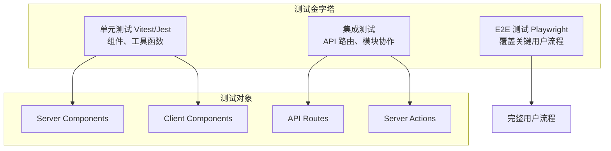
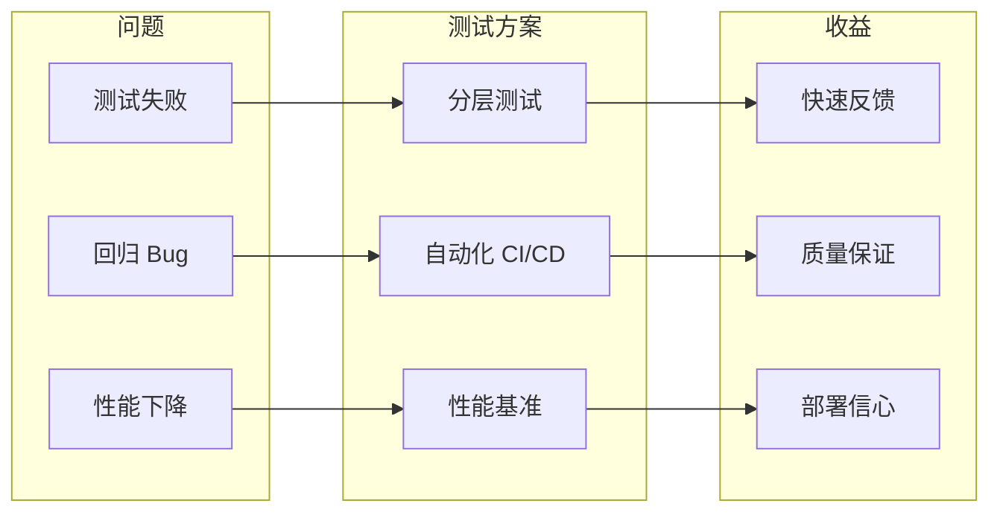
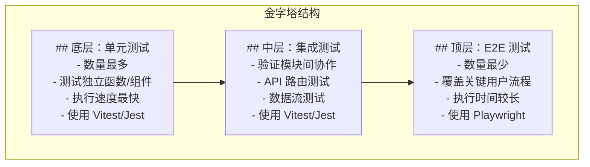
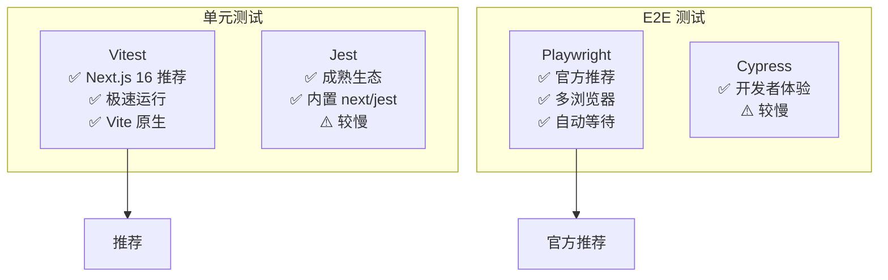
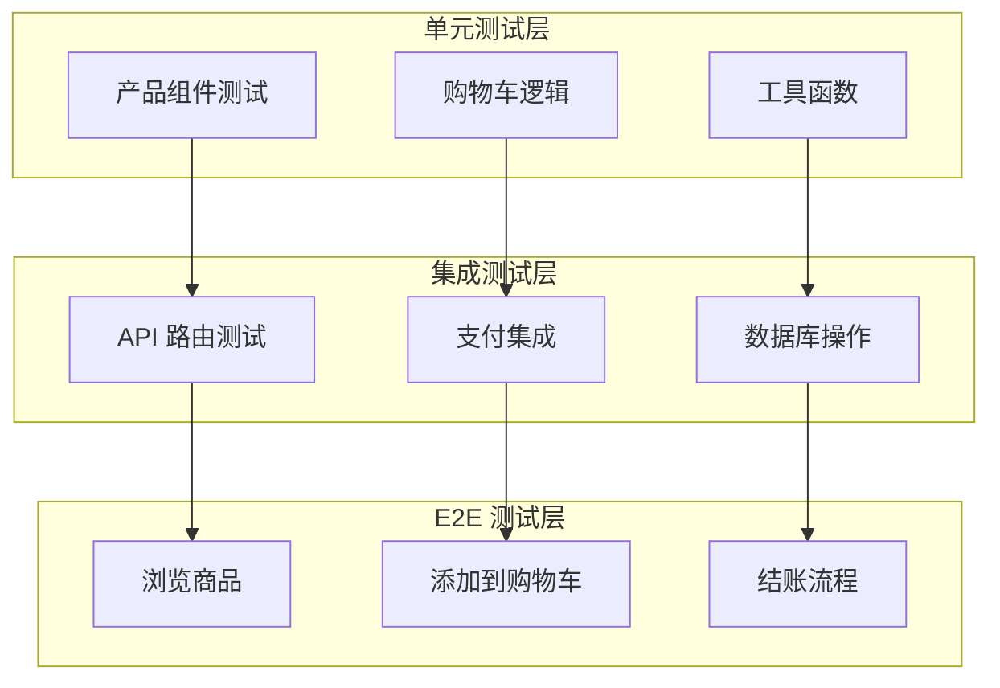

# Next.js 全栈应用测试全流程核心知识体系

> 从单元测试到 E2E 测试的分层测试架构 | **更新时间：** 2026-03-30

---

## 目录

1. [概述](#1-概述)
2. [核心概念](#2-核心概念)
3. [快速入门](#3-快速入门)
4. [单元测试](#4-单元测试)
5. [集成测试](#5-集成测试)
6. [E2E 测试](#6-e2e 测试)
7. [实战案例](#7-实战案例)
8. [常见问题与学习资源](#8-常见问题与学习资源)

---

## 1. 概述

### 1.1 Next.js 测试全景图

Next.js 作为全栈 React 框架，其测试策略需要覆盖多个层面：



### 1.2 Next.js 16 测试特性更新

**Next.js 16.2 (2026 年 3 月) 新增测试相关功能：**

| 功能 | 说明 | 测试影响 |
|------|------|----------|
| **Browser Log Forwarding** | 浏览器错误转发到终端 | 支持 AI 驱动调试 |
| **Agent DevTools** | AI Agent 访问 DevTools | 自动化测试增强 |
| **Turbopack Server Fast Refresh** | 服务器端热更新 | 测试迭代速度提升 |
| **Adapter API 稳定** | 跨平台适配器 API | 跨平台测试标准化 |

### 1.3 测试策略核心价值



---

## 2. 核心概念

### 2.1 测试金字塔架构

Next.js 项目遵循经典测试金字塔原则：



**各层级测试特征对比：**

| 特征 | 单元测试 | 集成测试 | E2E 测试 |
|------|----------|----------|----------|
| **测试对象** | 函数、组件 | API 路由、模块协作 | 完整用户流程 |
| **执行速度** | 毫秒级 | 秒级 | 10 秒 + |
| **维护成本** | 低 | 中 | 高 |
| **可靠性** | 高 | 中 | 中 (依赖环境) |
| **覆盖率目标** | 80%+ | 关键路径 | 核心流程 |

### 2.2 Next.js 特殊测试挑战

#### 2.2.1 React Server Components (RSC)

**核心限制：** Vitest 目前不支持异步 Server Components

```
⚠️ 官方说明：
由于异步 Server Components 是 React 生态系统的新特性，
Vitest 目前不支持直接测试它们。

推荐方案：
- 同步 Server/Client Components → 单元测试
- 异步 Server Components → E2E 测试
```

#### 2.2.2 Server Actions 测试

Server Actions 是在服务器端执行的异步函数：

```typescript
// Server Action 示例
async function createPost(formData: FormData) {
  'use server'
  await db.post.create({
    title: formData.get('title')
  })
}
```

**测试挑战：**
- 需要模拟服务器环境
- 需要模拟数据库/API 调用
- 需要在 E2E 测试中验证端到端行为

#### 2.2.3 服务端 fetch 请求模拟

**问题：** Playwright 无法直接拦截服务器端请求

```
传统 E2E 测试问题：
test('show user list', async ({ page }) => {
  await page.goto('/');
  // ❌ 无法模拟服务器端 fetch('https://api.example.com/users')
  await expect(page.getByRole('listitem').first()).toHaveText('Leanne Graham');
});
```

**解决方案：**
1. Playwright 代理方法（复杂）
2. Mock Service Worker (MSW)
3. 测试数据固定化

### 2.3 测试框架选型



---

## 3. 快速入门

### 3.1 环境准备

**系统要求：**

| 组件 | 版本要求 |
|------|----------|
| Node.js | v18+ (推荐 v20 LTS) |
| npm/pnpm | 最新版本 |
| Next.js | 16.x |
| TypeScript | 5.x (可选) |

**安装验证：**

```bash
node --version    # v20.x
npm --version     # 10.x
```

### 3.2 一键创建测试项目

#### 3.2.1 Vitest 示例项目

```bash
# 使用官方 Vitest 示例
npx create-next-app@latest --example with-vitest my-vitest-app

# 安装后的项目结构
my-vitest-app/
├── __tests__/           # 测试文件目录
├── vitest.config.mts    # Vitest 配置
└── package.json
```

#### 3.2.2 Playwright 示例项目

```bash
# 使用官方 Playwright 示例
npx create-next-app@latest --example with-playwright my-playwright-app

# 安装后的项目结构
my-playwright-app/
├── tests/               # E2E 测试目录
├── playwright.config.ts # Playwright 配置
└── package.json
```

### 3.3 手动集成 Vitest

**步骤 1：安装依赖**

```bash
# TypeScript 项目
npm install -D vitest @vitejs/plugin-react jsdom
npm install -D @testing-library/react @testing-library/dom
npm install -D vite-tsconfig-paths

# 或者使用 pnpm
pnpm add -D vitest @vitejs/plugin-react jsdom
pnpm add -D @testing-library/react @testing-library/dom
pnpm add -D vite-tsconfig-paths
```

**步骤 2：创建配置文件**

```typescript
// vitest.config.mts
import { defineConfig } from 'vitest/config'
import react from '@vitejs/plugin-react'
import tsconfigPaths from 'vite-tsconfig-paths'

export default defineConfig({
  plugins: [tsconfigPaths(), react()],
  test: {
    environment: 'jsdom',
    globals: true,  // 可选：全局 describe/it/expect
  },
})
```

**步骤 3：添加测试脚本**

```json
// package.json
{
  "scripts": {
    "dev": "next dev",
    "build": "next build",
    "start": "next start",
    "test": "vitest",
    "test:ui": "vitest --ui",
    "test:coverage": "vitest --coverage"
  }
}
```

### 3.4 手动集成 Playwright

**步骤 1：安装 Playwright**

```bash
# 初始化 Playwright
npm init playwright@latest

# 或使用 pnpm
pnpm create playwright
```

**步骤 2：配置 Next.js 集成**

```typescript
// playwright.config.ts
import { defineConfig } from '@playwright/test';

export default defineConfig({
  testDir: './tests',
  webServer: {
    command: 'npm run dev',
    url: 'http://localhost:3000',
    reuseExistingServer: !process.env.CI,
  },
  use: {
    baseURL: 'http://localhost:3000',
  },
});
```

**步骤 3：添加测试脚本**

```json
// package.json
{
  "scripts": {
    "test:e2e": "playwright test",
    "test:e2e:ui": "playwright test --ui",
    "test:e2e:debug": "playwright test --debug"
  }
}
```

---

## 4. 单元测试

### 4.1 Vitest 基础配置

**完整配置文件：**

```typescript
// vitest.config.mts
import { defineConfig } from 'vitest/config'
import react from '@vitejs/plugin-react'
import tsconfigPaths from 'vite-tsconfig-paths'

export default defineConfig({
  plugins: [tsconfigPaths(), react()],
  test: {
    environment: 'jsdom',
    globals: true,
    setupFiles: ['./vitest.setup.ts'],
    include: ['**/__tests__/**/*.test.{ts,tsx}'],
    coverage: {
      provider: 'v8',
      reporter: ['text', 'json', 'html'],
      include: ['src/**/*.{ts,tsx}'],
      exclude: ['**/*.d.ts', '**/*.config.*'],
    },
  },
})
```

**测试设置文件：**

```typescript
// vitest.setup.ts
import '@testing-library/jest-dom/vitest'
```

### 4.2 组件测试

#### 4.2.1 测试 Client Components

```tsx
// src/components/Button.tsx
interface ButtonProps {
  label: string;
  onClick: () => void;
}

export function Button({ label, onClick }: ButtonProps) {
  return (
    <button onClick={onClick}>
      {label}
    </button>
  );
}

// __tests__/Button.test.tsx
import { render, screen } from '@testing-library/react'
import { describe, it, expect, vi } from 'vitest'
import { Button } from '../src/components/Button'

describe('Button', () => {
  it('renders button with correct label', () => {
    render(<Button label="Click me" onClick={vi.fn()} />)
    expect(screen.getByRole('button')).toHaveTextContent('Click me')
  })

  it('calls onClick when clicked', () => {
    const handleClick = vi.fn()
    render(<Button label="Click me" onClick={handleClick} />)

    screen.getByRole('button').click()
    expect(handleClick).toHaveBeenCalledTimes(1)
  })
})
```

#### 4.2.2 测试 Server Components（同步）

```tsx
// src/app/page.tsx (同步 Server Component)
export default function HomePage() {
  return (
    <main>
      <h1>Welcome to Next.js</h1>
      <p>This is a server component</p>
    </main>
  )
}

// __tests__/HomePage.test.tsx
import { render, screen } from '@testing-library/react'
import { describe, it, expect } from 'vitest'
import HomePage from '../src/app/page'

describe('HomePage', () => {
  it('renders main heading', () => {
    render(<HomePage />)
    expect(screen.getByRole('heading', { level: 1 }))
      .toHaveTextContent('Welcome to Next.js')
  })

  it('renders description paragraph', () => {
    render(<HomePage />)
    expect(screen.getByText('This is a server component'))
      .toBeInTheDocument()
  })
})
```

### 4.3 工具函数测试

```typescript
// src/utils/format.ts
export function formatCurrency(amount: number): string {
  return new Intl.NumberFormat('zh-CN', {
    style: 'currency',
    currency: 'CNY',
  }).format(amount);
}

export function formatDate(date: Date): string {
  return new Intl.DateTimeFormat('zh-CN').format(date);
}

// __tests__/format.test.ts
import { describe, it, expect } from 'vitest'
import { formatCurrency, formatDate } from '../src/utils/format'

describe('formatCurrency', () => {
  it('formats number as CNY currency', () => {
    expect(formatCurrency(1234.56)).toBe('¥1,234.56')
    expect(formatCurrency(0)).toBe('¥0.00')
  })
})

describe('formatDate', () => {
  it('formats date correctly', () => {
    const date = new Date('2026-03-30')
    expect(formatDate(date)).toMatch(/\d{4}\/\d{1,2}\/\d{1,2}/)
  })
})
```

### 4.4 快照测试

```tsx
// __tests__/Snapshot.test.tsx
import { render } from '@testing-library/react'
import { describe, it, expect } from 'vitest'
import HomePage from '../src/app/page'

describe('HomePage Snapshot', () => {
  it('renders homepage unchanged', () => {
    const { container } = render(<HomePage />)
    expect(container).toMatchSnapshot()
  })
})
```

**更新快照：**

```bash
# 更新所有快照
npm test -- -u

# 或者
vitest run -u
```

### 4.5 路由模拟

**使用 next-router-mock：**

```bash
npm install -D next-router-mock
```

```typescript
// vitest.setup.ts
import { vi } from 'vitest'

vi.mock('next/router', () => require('next-router-mock'))

// 对于 next/navigation (App Router)
vi.mock('next/navigation', async () => {
  const actual = await vi.importActual('next/navigation')
  return {
    ...actual,
    useRouter: () => ({
      push: vi.fn(),
      replace: vi.fn(),
      prefetch: vi.fn(),
      back: vi.fn(),
    }),
    usePathname: () => '/',
    useSearchParams: () => new URLSearchParams(),
  }
})
```

---

## 5. 集成测试

### 5.1 API 路由测试

#### 5.1.1 Pages Router API 测试

```typescript
// pages/api/users.ts
import type { NextApiRequest, NextApiResponse } from 'next'

export default function handler(req: NextApiRequest, res: NextApiResponse) {
  if (req.method === 'GET') {
    res.status(200).json([{ id: 1, name: 'John' }])
  } else {
    res.status(405).json({ error: 'Method not allowed' })
  }
}

// __tests__/api/users.test.ts
import { describe, it, expect } from 'vitest'
import handler from '../../pages/api/users'

describe('/api/users', () => {
  it('returns users on GET', () => {
    const req = { method: 'GET' } as NextApiRequest
    const res = {
      status: vi.fn().mockReturnThis(),
      json: vi.fn(),
    } as unknown as NextApiResponse

    handler(req, res)

    expect(res.status).toHaveBeenCalledWith(200)
    expect(res.json).toHaveBeenCalledWith([{ id: 1, name: 'John' }])
  })

  it('returns 405 on non-GET', () => {
    const req = { method: 'POST' } as NextApiRequest
    const res = {
      status: vi.fn().mockReturnThis(),
      json: vi.fn(),
    } as unknown as NextApiResponse

    handler(req, res)

    expect(res.status).toHaveBeenCalledWith(405)
  })
})
```

#### 5.1.2 App Router API 测试

```typescript
// app/api/users/route.ts
import { NextResponse } from 'next/server'

export async function GET() {
  return NextResponse.json([{ id: 1, name: 'John' }])
}

export async function POST(request: Request) {
  const body = await request.json()
  return NextResponse.json({ created: body }, { status: 201 })
}

// __tests__/api/users.test.ts
import { describe, it, expect, vi } from 'vitest'
import { GET, POST } from '../../app/api/users/route'

describe('/api/users (App Router)', () => {
  it('returns users on GET', async () => {
    const response = await GET()
    const data = await response.json()

    expect(response.status).toBe(200)
    expect(data).toEqual([{ id: 1, name: 'John' }])
  })

  it('creates user on POST', async () => {
    const mockRequest = {
      json: async () => ({ name: 'New User' }),
    } as Request

    const response = await POST(mockRequest)
    const data = await response.json()

    expect(response.status).toBe(201)
    expect(data).toEqual({ created: { name: 'New User' } })
  })
})
```

### 5.2 Server Actions 测试

```typescript
// app/actions/todos.ts
'use server'

import { db } from '@/lib/db'

export async function createTodo(formData: FormData) {
  const title = formData.get('title') as string

  if (!title || title.length < 3) {
    return { error: 'Title must be at least 3 characters' }
  }

  const todo = await db.todo.create({
    data: { title, completed: false },
  })

  return { success: true, todo }
}

// __tests__/actions/todos.test.ts
import { describe, it, expect, vi } from 'vitest'
import { createTodo } from '../../app/actions/todos'

// 模拟数据库
vi.mock('@/lib/db', () => ({
  db: {
    todo: {
      create: vi.fn().mockResolvedValue({
        id: 1,
        title: 'Test Todo',
        completed: false
      }),
    },
  },
}))

describe('createTodo', () => {
  it('creates todo with valid title', async () => {
    const formData = new FormData()
    formData.set('title', 'Test Todo')

    const result = await createTodo(formData)

    expect(result.success).toBe(true)
    expect(result.todo).toBeDefined()
  })

  it('returns error for short title', async () => {
    const formData = new FormData()
    formData.set('title', 'Ab')

    const result = await createTodo(formData)

    expect(result.error).toBe('Title must be at least 3 characters')
  })
})
```

### 5.3 数据获取模拟

#### 5.3.1 fetch 模拟

```typescript
// __tests__/components/UserList.test.tsx
import { describe, it, expect, vi, beforeEach } from 'vitest'
import { render, screen, waitFor } from '@testing-library/react'

// 模拟 fetch
global.fetch = vi.fn()

describe('UserList', () => {
  beforeEach(() => {
    vi.clearAllMocks()
  })

  it('fetches and displays users', async () => {
    // 设置 mock 数据
    const mockUsers = [
      { id: 1, name: 'John' },
      { id: 2, name: 'Jane' },
    ]

    vi.spyOn(global, 'fetch').mockResolvedValue({
      json: async () => mockUsers,
    } as Response)

    render(<UserList />)

    await waitFor(() => {
      expect(screen.getByText('John')).toBeInTheDocument()
      expect(screen.getByText('Jane')).toBeInTheDocument()
    })

    expect(global.fetch).toHaveBeenCalledWith('https://api.example.com/users')
  })
})
```

#### 5.3.2 MSW (Mock Service Worker)

```bash
npm install -D msw
```

```typescript
// __mocks__/handlers.ts
import { http, HttpResponse } from 'msw'

export const handlers = [
  http.get('/api/users', () => {
    return HttpResponse.json([
      { id: 1, name: 'John' },
      { id: 2, name: 'Jane' },
    ])
  }),
]

// __mocks__/browser.ts
import { setupWorker } from 'msw/browser'
import { handlers } from './handlers'

export const worker = setupWorker(...handlers)

// vitest.setup.ts
import { beforeAll, afterEach, afterAll } from 'vitest'
import { worker } from './__mocks__/browser'

beforeAll(() => worker.start({ onUnhandledRequest: 'bypass' }))
afterEach(() => worker.resetHandlers())
afterAll(() => worker.stop())
```

---

## 6. E2E 测试

### 6.1 Playwright 基础配置

**完整配置文件：**

```typescript
// playwright.config.ts
import { defineConfig, devices } from '@playwright/test';

export default defineConfig({
  testDir: './tests',

  // 超时设置
  timeout: 30 * 1000,
  expect: {
    timeout: 5000,
  },

  // Web 服务器配置
  webServer: {
    command: process.env.CI ? 'npm run start' : 'npm run dev',
    url: 'http://localhost:3000',
    reuseExistingServer: !process.env.CI,
    timeout: 120 * 1000,
  },

  // 失败处理
  forbidOnly: !!process.env.CI,
  retries: process.env.CI ? 2 : 0,
  workers: process.env.CI ? 1 : undefined,
  reporter: [['html', { open: 'never' }]],

  // 共享配置
  use: {
    baseURL: 'http://localhost:3000',
    trace: 'on-first-retry',
    screenshot: 'only-on-failure',
    video: 'retain-on-failure',
  },

  // 多浏览器配置
  projects: [
    {
      name: 'chromium',
      use: { ...devices['Desktop Chrome'] },
    },
    {
      name: 'firefox',
      use: { ...devices['Desktop Firefox'] },
    },
    {
      name: 'webkit',
      use: { ...devices['Desktop Safari'] },
    },
    {
      name: 'Mobile Chrome',
      use: { ...devices['Pixel 5'] },
    },
    {
      name: 'Mobile Safari',
      use: { ...devices['iPhone 12'] },
    },
  ],
});
```

### 6.2 基础页面测试

```typescript
// tests/homepage.test.ts
import { test, expect } from '@playwright/test';

test.describe('Homepage', () => {
  test('renders correctly', async ({ page }) => {
    await page.goto('/');

    // 检查页面标题
    await expect(page).toHaveTitle(/Next.js/);

    // 检查主标题
    await expect(page.getByRole('heading', { level: 1 }))
      .toHaveText('Welcome to Next.js');
  });

  test('navigation works', async ({ page }) => {
    await page.goto('/');

    // 点击导航链接
    await page.getByRole('link', { name: 'About' }).click();

    // 验证导航到新页面
    await expect(page).toHaveURL('/about');
  });
});
```

### 6.3 用户交互测试

```typescript
// tests/form.test.ts
import { test, expect } from '@playwright/test';

test.describe('Contact Form', () => {
  test('submits form successfully', async ({ page }) => {
    await page.goto('/contact');

    // 填写表单
    await page.getByLabel('Name').fill('John Doe');
    await page.getByLabel('Email').fill('john@example.com');
    await page.getByLabel('Message').fill('Hello!');

    // 提交表单
    await page.getByRole('button', { name: 'Submit' }).click();

    // 验证成功消息
    await expect(page.getByText('Thank you for your message!'))
      .toBeVisible();
  });

  test('validates required fields', async ({ page }) => {
    await page.goto('/contact');

    // 尝试不填写直接提交
    await page.getByRole('button', { name: 'Submit' }).click();

    // 验证错误提示
    await expect(page.getByText('Name is required')).toBeVisible();
  });
});
```

### 6.4 服务端数据获取测试

**问题：** Playwright 无法直接拦截服务器端 fetch 请求

**解决方案 1：测试数据固定化**

```typescript
// tests/user-list.test.ts
import { test, expect } from '@playwright/test';

test.describe('User List', () => {
  test('displays users from API', async ({ page }) => {
    // 使用稳定的测试 API 或固定数据
    await page.goto('/users');

    // 不依赖特定顺序，检查是否存在用户
    const userItems = page.getByRole('listitem');
    await expect(userItems).not.toHaveCount(0);

    // 或者检查页面结构
    await expect(page.getByRole('list')).toBeVisible();
  });
});
```

**解决方案 2：API Mock（针对客户端请求）**

```typescript
// tests/mocked-api.test.ts
import { test, expect } from '@playwright/test';

test.describe('Mocked API', () => {
  test('displays mocked user data', async ({ page }) => {
    // 设置路由拦截（仅对客户端请求有效）
    await page.route('/api/users', route =>
      route.fulfill({
        status: 200,
        body: JSON.stringify([
          { id: 1, name: 'Mocked User' },
        ]),
      })
    );

    await page.goto('/');

    await expect(page.getByText('Mocked User')).toBeVisible();
  });
});
```

### 6.5 视觉回归测试

```typescript
// tests/visual.test.ts
import { test, expect } from '@playwright/test';

test.describe('Visual Regression', () => {
  test('homepage looks correct', async ({ page }) => {
    await page.goto('/');

    // 截取全屏截图
    await expect(page).toHaveScreenshot('homepage.png', {
      fullPage: true,
    });
  });

  test('about page looks correct', async ({ page }) => {
    await page.goto('/about');

    // 截取特定元素截图
    await expect(page.getByTestId('main-content'))
      .toHaveScreenshot('about-content.png');
  });
});
```

### 6.6 并行测试执行

```typescript
// playwright.config.ts
export default defineConfig({
  // 并行工作器配置
  workers: '50%',  // 使用 50% CPU 核心
  maxFailures: 3,  // 超过 3 个失败则停止

  // 项目级配置
  projects: [
    {
      name: 'chromium',
      use: { ...devices['Desktop Chrome'] },
    },
    // ... 其他浏览器
  ],
});
```

**运行并行测试：**

```bash
# 使用所有核心
npx playwright test --workers=100%

# 使用指定数量
npx playwright test --workers=4
```

---

## 7. 实战案例

### 7.1 案例一：电商网站测试

**测试架构：**



**E2E 测试示例：**

```typescript
// tests/e2e/checkout.test.ts
import { test, expect } from '@playwright/test';

test.describe('Checkout Flow', () => {
  test('complete purchase flow', async ({ page }) => {
    // 1. 浏览商品
    await page.goto('/');
    await page.getByText('Product 1').click();
    await expect(page).toHaveURL('/products/1');

    // 2. 添加到购物车
    await page.getByRole('button', { name: 'Add to Cart' }).click();
    await expect(page.getByText('Added to cart')).toBeVisible();

    // 3. 查看购物车
    await page.getByRole('link', { name: 'Cart' }).click();
    await expect(page).toHaveURL('/cart');
    await expect(page.getByText('Product 1')).toBeVisible();

    // 4. 结账
    await page.getByRole('button', { name: 'Checkout' }).click();
    await page.getByLabel('Email').fill('test@example.com');
    await page.getByLabel('Address').fill('123 Test St');

    // 5. 提交订单
    await page.getByRole('button', { name: 'Place Order' }).click();
    await expect(page).toHaveURL('/order-confirmation');
    await expect(page.getByText('Order confirmed!')).toBeVisible();
  });
});
```

### 7.2 案例二：博客系统测试

**测试覆盖：**

| 模块 | 测试类型 | 测试框架 |
|------|----------|----------|
| 文章列表组件 | 单元测试 | Vitest |
| 文章渲染 (SSG) | E2E 测试 | Playwright |
| 评论 API | 集成测试 | Vitest |
| 搜索功能 | E2E 测试 | Playwright |

**Server Component 测试策略：**

```typescript
// 对于异步 Server Component，使用 E2E 测试
// tests/blog-post.test.ts
import { test, expect } from '@playwright/test';

test.describe('Blog Post', () => {
  test('renders blog post content', async ({ page }) => {
    await page.goto('/blog/hello-world');

    // 验证 SSR 渲染的内容
    await expect(page.getByRole('heading', { level: 1 }))
      .toHaveText('Hello World');

    // 验证文章内容存在
    await expect(page.getByTestId('article-content'))
      .not.toBeEmpty();
  });
});
```

### 7.3 案例三：SaaS 仪表板测试

**认证流程测试：**

```typescript
// tests/auth.test.ts
import { test, expect } from '@playwright/test';

test.describe('Authentication', () => {
  test('login and access dashboard', async ({ page }) => {
    await page.goto('/login');

    await page.getByLabel('Email').fill('user@example.com');
    await page.getByLabel('Password').fill('password123');
    await page.getByRole('button', { name: 'Sign In' }).click();

    await expect(page).toHaveURL('/dashboard');
    await expect(page.getByText('Welcome back!')).toBeVisible();
  });

  test('protected route redirect', async ({ page }) => {
    await page.goto('/dashboard');

    // 未登录应重定向到登录页
    await expect(page).toHaveURL('/login');
  });
});
```

---

## 8. 常见问题与学习资源

### 8.1 常见问题

#### Q1: Server Components 如何测试？

**答：**
- 同步 Server Components → 使用 Vitest + Testing Library
- 异步 Server Components → 使用 E2E 测试（Playwright）

#### Q2: 如何模拟服务端 fetch 请求？

**答：**
- 方案 1：环境变量控制测试 API 地址
- 方案 2：使用 MSW 进行请求拦截
- 方案 3：在组件测试中 mock 全局 fetch

#### Q3: Playwright 测试运行很慢怎么办？

**答：**
- 使用并行执行 (`--workers`)
- 配置浏览器复用 (`reuseExistingServer`)
- 只测试关键用户流程，不过度依赖 E2E

#### Q4: 如何处理测试数据库？

**答：**
- 使用测试专用数据库
- 每个测试前重置数据库状态
- 使用事务回滚保持隔离

#### Q5: CI/CD 中如何配置测试？

**答：** GitHub Actions 示例：

```yaml
# .github/workflows/test.yml
name: Test

on: [push, pull_request]

jobs:
  test:
    runs-on: ubuntu-latest
    steps:
      - uses: actions/checkout@v4
      - uses: actions/setup-node@v4
        with:
          node-version: 20

      - run: npm ci
      - run: npm run test:unit
      - run: npm run build
      - run: npx playwright test
```

### 8.2 学习资源

#### 官方资源

| 资源 | 链接 |
|------|------|
| Next.js Testing Docs | https://nextjs.org/docs/app/guides/testing |
| Vitest 官方文档 | https://vitest.dev/ |
| Playwright 官方文档 | https://playwright.dev/ |
| Testing Library | https://testing-library.com/ |

#### 示例项目

| 项目 | 说明 |
|------|------|
| with-vitest | Next.js 官方 Vitest 示例 |
| with-playwright | Next.js 官方 Playwright 示例 |
| with-jest | Next.js 官方 Jest 示例 |

#### 社区资源

- CSDN Next.js 测试专栏
- 知乎 Next.js 话题
- GitHub Next.js Discussions

---

## 附录 A：配置模板

### Vitest 配置模板

```typescript
// vitest.config.mts
import { defineConfig } from 'vitest/config'
import react from '@vitejs/plugin-react'
import tsconfigPaths from 'vite-tsconfig-paths'

export default defineConfig({
  plugins: [tsconfigPaths(), react()],
  test: {
    environment: 'jsdom',
    globals: true,
    setupFiles: ['./vitest.setup.ts'],
    include: ['**/__tests__/**/*.test.{ts,tsx}'],
    coverage: {
      provider: 'v8',
      reporter: ['text', 'json', 'html'],
    },
  },
})
```

### Playwright 配置模板

```typescript
// playwright.config.ts
import { defineConfig, devices } from '@playwright/test';

export default defineConfig({
  testDir: './tests',
  timeout: 30 * 1000,
  webServer: {
    command: 'npm run dev',
    url: 'http://localhost:3000',
    reuseExistingServer: !process.env.CI,
  },
  use: {
    baseURL: 'http://localhost:3000',
    trace: 'on-first-retry',
  },
  projects: [
    { name: 'chromium', use: { ...devices['Desktop Chrome'] } },
    { name: 'firefox', use: { ...devices['Desktop Firefox'] } },
    { name: 'webkit', use: { ...devices['Desktop Safari'] } },
  ],
});
```

---

## 附录 B：引用列表

| 来源 | 类型 | 查阅日期 |
|------|------|----------|
| Next.js 官方文档 | 官方文档 | 2026-03-30 |
| Vitest 官方文档 | 官方文档 | 2026-03-30 |
| Playwright 官方文档 | 官方文档 | 2026-03-30 |
| Next.js Blog | 官方博客 | 2026-03-30 |
| CSDN 技术博客 | 技术博客 | 2026-03-30 |
| 知乎专栏 | 技术社区 | 2026-03-30 |

---

*文档完成日期：2026-03-30 | 调研工具：mcp__WebSearch__bailian_web_search | 版本：1.0*
