# Next.js 核心知识体系

> Next.js 是一个用于构建**全栈 Web 应用**的 React 框架
>
> **文档特色：**
> - 每个核心概念包含「概念定义 + 工作原理 + 代码示例 + 常见误区」
> - 覆盖渲染模式、路由系统、Server Components、数据获取、性能优化等核心模块
> - 结合官方文档、社区实践、安全公告进行交叉验证
> - 包含架构设计、核心原理、完整工作流程等深度内容

---

## 目录

1. [概述](#1-概述)
2. [核心架构](#2-核心架构)
3. [核心原理](#3-核心原理)
4. [完整工作流程](#4-完整工作流程)
5. [快速入门](#5-快速入门)
6. [基础用法](#6-基础用法)
7. [高级特性](#7-高级特性)
8. [实战案例](#8-实战案例)
9. [常见问题/陷阱](#9-常见问题/陷阱)
10. [学习资源推荐](#10-学习资源推荐)

---

## 1. 概述

### 1.1 什么是 Next.js

**定义：** Next.js 是一个由 Vercel 公司开发的 React 全栈框架，用于构建服务端渲染（SSR）、静态生成（SSG）和客户端渲染（CSR）的 Web 应用。

**关键理解：**
- Next.js **不是替代 React**，而是在 React 基础上增加了更多功能
- React 本身只是"UI 库"，Next.js 提供"完整项目"所需的全套能力
- 自动配置底层工具（Webpack/Turbopack、编译器），让开发者专注业务逻辑

**核心特性列表：**

| 特性类别 | 具体能力 |
|----------|----------|
| 渲染模式 | SSR（服务端渲染）、SSG（静态生成）、ISR（增量静态再生）、CSR（客户端渲染） |
| 路由系统 | 文件系统路由、App Router、Pages Router、动态路由、嵌套布局 |
| 数据获取 | `getServerSideProps`、`getStaticProps`、Server Actions、流式数据 |
| 优化能力 | 自动代码分割、图片优化、字体优化、脚本优化 |
| 全栈能力 | API Routes、Server Actions、数据库直连、中间件 |
| 开发体验 | 热更新（HMR）、TypeScript 支持、快速刷新 |

---

### 1.2 为什么需要 Next.js

**背景：React 原生开发的痛点**

React 本身只是一个 UI 库，在开发完整项目时会遇到以下问题：

| 痛点 | React 原生方案 | Next.js 解决方案 |
|------|---------------|-----------------|
| **路由** | 需安装 react-router，配置复杂 | 文件系统路由，零配置 |
| **渲染** | 默认 CSR，首屏慢、SEO 差 | 支持 SSR/SSG，预渲染 |
| **数据获取** | 需自行设计 API 层 | 内置 `getServerSideProps` 等 |
| **代码分割** | 需手动配置 | 自动按页面分割 |
| **SEO 优化** | 需额外处理 | SSR/SSG 天然支持 |
| **部署** | 需自行配置服务器 | 支持 Vercel、AWS Lambda 等 |

**核心价值主张：**

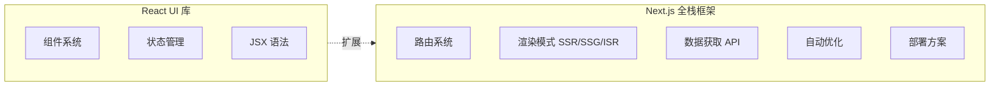

---

### 1.3 适用场景与边界

**适用场景：**

| 场景类型 | 说明 | 推荐渲染模式 |
|----------|------|-------------|
| 🛒 **电商网站** | 商品详情页、列表页 | SSR + ISR |
| 📄 **内容站点** | 博客、文档、新闻 | SSG + ISR |
| 📊 **Dashboard** | 后台管理、数据看板 | CSR + SSR |
| 🌐 **企业官网** | 品牌展示、产品介绍 | SSG |
| 🔐 **认证应用** | 用户系统、权限控制 | SSR + API Routes |
| 🤖 **AI 应用** | Agent 界面、流式输出 | SSR + Streaming |

**不适用场景（边界）：**

| 场景 | 原因 | 建议替代方案 |
|------|------|-------------|
| 纯静态页面 | 过度设计 | Vite + React、纯 HTML |
| 纯内部工具 | SEO 不重要 | Vite、Create React App |
| 移动端原生应用 | 技术栈不匹配 | React Native、Flutter |
| 实时性极高的应用 | SSR 延迟问题 | 纯 CSR + WebSocket |

---

### 1.4 Next.js vs CRA（Create React App）

**CRA 的核心优势：**
- 零配置启动
- 内置开发服务器，支持热重载
- 一键升级工具链

**Next.js 相比 CRA 的优势：**

| 维度 | CRA | Next.js |
|------|-----|---------|
| 路由 | 需 react-router | 文件系统路由 |
| 渲染 | 仅 CSR | SSR/SSG/ISR/CSR |
| SEO | 差 | 优秀 |
| 首屏性能 | 较慢 | 快 |
| API 能力 | 需单独后端 | 内置 API Routes |
| 图片优化 | 需自行配置 | 自动优化 |
| 部署 | 需配置 | 一键部署 Vercel |

**代码对比示例：**

```jsx
// ❌ CRA - 需要手动配置路由
import { BrowserRouter, Routes, Route } from 'react-router-dom';

function App() {
  return (
    <BrowserRouter>
      <Routes>
        <Route path="/" element={<Home />} />
        <Route path="/about" element={<About />} />
      </Routes>
    </BrowserRouter>
  );
}

// ✅ Next.js App Router - 文件系统自动路由
// app/page.js → /
// app/about/page.js → /about
export default function Home() {
  return <div>Home</div>;
}
```

---

## 2. 核心架构

### 2.1 整体架构（Client/Server 边界）

**架构分层图：**

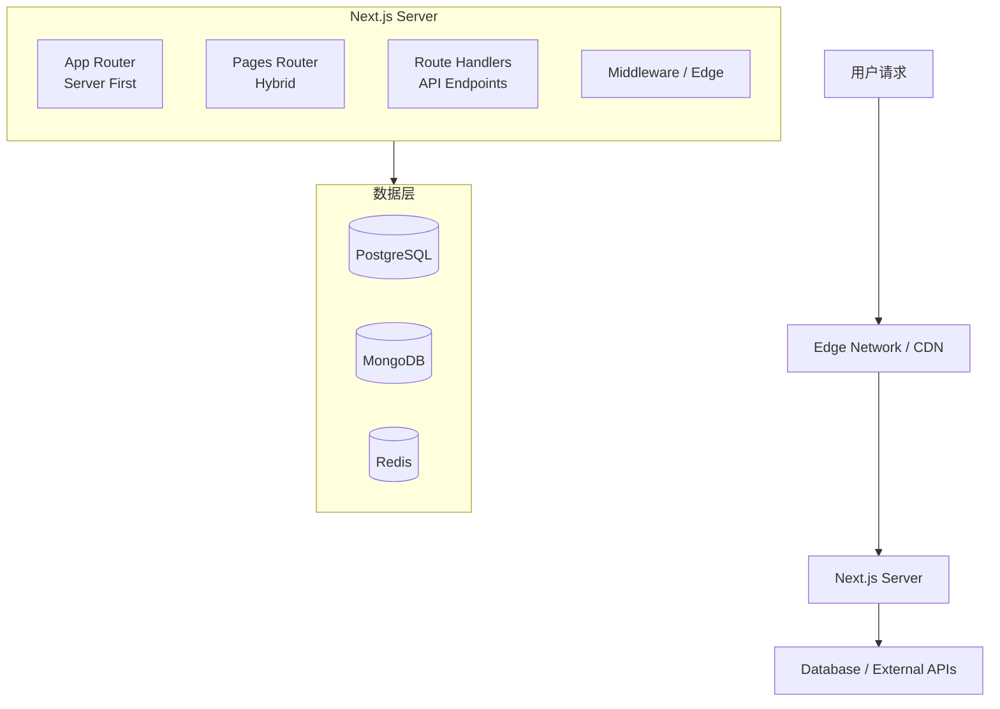

**Client/Server 边界：**

| 执行位置 | 代码类型 | 典型用途 |
|----------|----------|----------|
| **Server** | Server Components | 数据获取、数据库访问、敏感逻辑 |
| **Edge** | proxy.ts（Next.js 16+）/ Middleware | 请求预处理、A/B 测试、地域重定向 |
| **Client** | Client Components | 交互、状态管理、浏览器 API |

---

### 2.1.1 proxy.ts vs middleware.ts（Next.js 16 变更）

**Next.js 16 将 `middleware.ts` 更名为 `proxy.ts`，主要变更：**

| 维度 | middleware.ts（Next.js 13-15） | proxy.ts（Next.js 16+） |
|------|-------------------------------|------------------------|
| **文件名** | `middleware.ts` | `proxy.ts` |
| **导出函数** | `middleware(request)` | `proxy(request)` |
| **运行时** | Edge Runtime | Node.js Runtime |
| **定位** | "中间件"（模糊） | "代理"（明确的网络边界） |
| **状态** | 已弃用（仍可用） | 推荐（新标准） |

**为什么改名？**

| 原因 | 说明 |
|------|------|
| **名称模糊** | "Middleware" 在软件中有太多含义（Express、Redux 等），难以理解职责 |
| **运行时混淆** | Edge Runtime 受限 API，Node.js Runtime 有完整能力，需要明确区分 |
| **网络边界不清晰** | `proxy` 明确表达它是应用的**网络边界**，**代理**所有进入的请求 |

**迁移示例：**

```ts
// ❌ middleware.ts（Next.js 13-15，已弃用）
import { NextResponse } from 'next/server';
import type { NextRequest } from 'next/server';

export function middleware(request: NextRequest) {
  const token = request.cookies.get('token');
  if (!token && request.nextUrl.pathname.startsWith('/dashboard')) {
    return NextResponse.redirect(new URL('/login', request.url));
  }
  return NextResponse.next();
}

export const config = {
  matcher: '/dashboard/:path*',
};
```

```ts
// ✅ proxy.ts（Next.js 16+，推荐）
import { NextResponse } from 'next/server';
import type { NextRequest } from 'next/server';

export default function proxy(request: NextRequest) {
  const token = request.cookies.get('token');
  if (!token && request.nextUrl.pathname.startsWith('/dashboard')) {
    return NextResponse.redirect(new URL('/login', request.url));
  }
  return NextResponse.next();
}

export const config = {
  matcher: '/dashboard/:path*',
};
```

**Edge Runtime vs Node.js Runtime：**

| 特性 | Edge Runtime | Node.js Runtime |
|------|-------------|-----------------|
| **执行环境** | V8 Isolate（边缘节点） | Node.js 进程 |
| **启动速度** | 极快（毫秒级） | 较快 |
| **可用 API** | 受限（Web API） | 完整 Node.js API |
| **地理位置** | 全球边缘节点 | 源站服务器 |
| **内存/CPU** | 受限 | 更宽松 |
| **适用场景** | 低延迟请求拦截、地理位置路由 | 复杂逻辑、需要 Node.js 生态 |

**何时使用哪个？**

| 场景 | 推荐 |
|------|------|
| 新项目 | `proxy.ts`（Node.js Runtime） |
| 需要边缘节点低延迟 | `middleware.ts`（Edge Runtime） |
| 部署在 Vercel 边缘网络 | `middleware.ts`（Edge Runtime） |
| 需要完整 Node.js 能力 | `proxy.ts`（Node.js Runtime） |
| 简单认证/重定向 | 两者都可以 |

---

### 2.2 请求处理流程（从 URL 到响应）

**完整请求生命周期：**

```mermaid
flowchart TD
    Start[用户访问 /products/123] --> CDN{CDN 检查缓存}
    CDN -->|命中 | ReturnHTML[返回缓存的 HTML]
    CDN -->|未命中 | Server[转发到 Next.js Server]
    
    Server --> Middleware[proxy.ts / Middleware 执行]
    Middleware --> Auth[检查认证 Cookie]
    Middleware --> Geo[地域判断]
    Middleware --> Headers[请求头修改]
    
    Middleware --> Router[Router 匹配路由]
    Router --> RouteMatch[app/products/[id]/page.tsx]
    RouteMatch --> RenderMode[确定渲染模式]
    
    RenderMode --> DataFetch[数据获取阶段]
    DataFetch --> SvrComp[Server Component 执行]
    DataFetch --> DBQuery[fetch / DB 查询]
    DataFetch --> CacheCheck[缓存检查]
    
    CacheCheck --> Render[渲染阶段]
    Render --> HTMLGen[Server Components → HTML]
    Render --> ClientMark[Client Components → 标记边界]
    Render --> Stream[流式传输（如启用）]
    
    Stream --> Response[响应发送]
    Response --> HTMLRes[HTML 文档]
    Response --> JSRes[JavaScript 包]
    Response --> CacheHdr[缓存头设置]
    
    Response --> Hydration[客户端水合 Hydration]
    Hydration --> React[React 接管交互]
    Hydration --> EventBind[事件绑定]
```

---

### 2.3 打包与构建架构（Webpack/Turbopack）

**构建流程：**

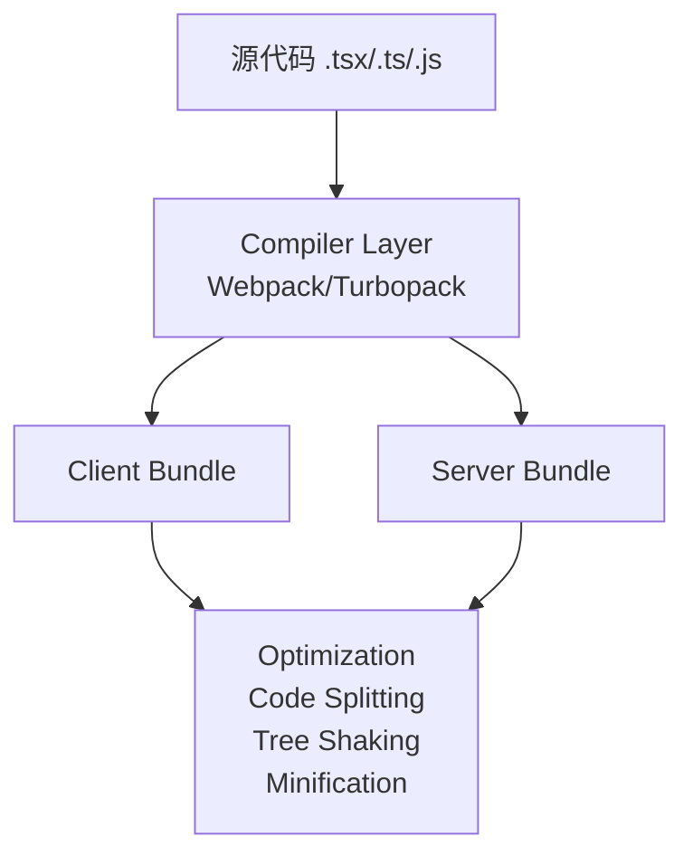

**Webpack vs Turbopack：**

| 特性 | Webpack | Turbopack |
|------|---------|-----------|
| 速度 | 较慢（全量构建） | 快 10 倍+（增量编译） |
| 缓存 | 有限 | 持久化缓存 |
| HMR | 标准 | 极速更新 |
| 默认 | Next.js 13 | Next.js 14+ 可选 |

---

| 默认 | Next.js 13 | Next.js 14+ 可选 |

---

### 2.3.1 打包构建流程深度解析（从源码到产物）

**构建产物总览（`.next/` 目录结构）：**

```
.next/
├── static/
│   ├── chunks/
│   │   ├── main-xxxx.js          # 核心运行时（Webpack 运行时）
│   │   ├── main-app-xxxx.js      # App Router 入口
│   │   ├── pages/
│   │   │   ├── _app-xxxx.js      # 页面公共逻辑
│   │   │   └── index-xxxx.js     # 首页 JS
│   │   └── app/
│   │       ├── layout-xxxx.js    # 布局组件
│   │       └── page-xxxx.js      # 页面组件
│   ├── css/
│   │   └── app-xxxx.css          # 提取的 CSS
│   └── media/
│       └── [hash].png            # 优化后的图片
├── server/
│   ├── app/
│   │   └── page.js               # Server Component 服务端代码
│   ├── vendor-manifest.json      # 供应商模块清单
│   └── pages/
│       └── _document.js          # 文档模板
├── build-manifest.json           # 构建清单（路由→文件映射）
├── react-loadable-manifest.json  # 懒加载清单
├── package.json                  # standalone 依赖
└── required-server-files.json    # 部署必需文件清单
```

---

**完整构建流程（从源码到产物）：**

```
┌─────────────────────────────────────────────────────────────────┐
│  输入：项目源代码                                                │
├─────────────────────────────────────────────────────────────────┤
│  app/                                                            │
│  ├── layout.tsx        ← React Server Component                │
│  ├── page.tsx          ← React Server Component                │
│  └── components/                                               │
│      └── Button.tsx    ← Client Component ('use client')       │
│                                                                 │
│  其他入口：                                                      │
│  ├── middleware.ts     ← Edge Runtime                          │
│  └── app/api/route.ts  ← Route Handler                         │
└─────────────────────────────────────────────────────────────────┘
                              │
                              ▼
┌─────────────────────────────────────────────────────────────────┐
│  阶段 1：路由收集（Route Collection）                            │
├─────────────────────────────────────────────────────────────────┤
│  1. 扫描 app/ 目录下所有 page.tsx、layout.tsx、route.ts          │
│  2. 生成路由树：                                                 │
│     / → layout.tsx → page.tsx                                   │
│     /about → layout.tsx → about/page.tsx                        │
│  3. 确定每个路由的渲染模式（SSG/SSR/CSR）                        │
│  4. 输出：build-manifest.json                                    │
└─────────────────────────────────────────────────────────────────┘
                              │
                              ▼
┌─────────────────────────────────────────────────────────────────┐
│  阶段 2：编译（Compilation）- Webpack/Turbopack                 │
├─────────────────────────────────────────────────────────────────┤
│  2.1 入口分析                                                    │
│      ├─ 识别每个路由的入口文件                                   │
│      └─ 建立依赖图                                               │
│                                                                 │
│  2.2 转换处理（每个文件的处理链）                                │
│                                                                 │
│      源代码文件                                                  │
│          │                                                       │
│          ▼                                                       │
│      ┌───────────────────────────────────────────────────────┐  │
│      │ Babel/SWC 转译                                         │  │
│      │ - TS/TSX → JavaScript                                 │  │
│      │ - JSX → React.createElement() 或 React JSX            │  │
│      │ - 语法降级（ESNext → ES2020）                         │  │
│      └───────────────────────────────────────────────────────┘  │
│          │                                                       │
│          ▼                                                       │
│      ┌───────────────────────────────────────────────────────┐  │
│      │ CSS 处理                                               │  │
│      │ - CSS Modules → 作用域隔离的类名                       │  │
│      │ - Tailwind CSS → PurgeCSS 清除未使用样式              │  │
│      │ - 全局 CSS → 提取到独立文件                           │  │
│      └───────────────────────────────────────────────────────┘  │
│          │                                                       │
│          ▼                                                       │
│      ┌───────────────────────────────────────────────────────┐  │
│      │ 模块分析                                                │  │
│      │ - 识别 'use client' 指令                               │  │
│      │ - 标记 Server/Client 边界                              │  │
│      │ - 分离服务端代码和客户端代码                           │  │
│      └───────────────────────────────────────────────────────┘  │
└─────────────────────────────────────────────────────────────────┘
                              │
                              ▼
┌─────────────────────────────────────────────────────────────────┐
│  阶段 3：代码分离（Code Splitting）                              │
├─────────────────────────────────────────────────────────────────┤
│  3.1 按路由分离                                                  │
│      每个 page.tsx 生成独立的 chunk                              │
│                                                                 │
│  3.2 公共代码提取                                                │
│      ├─ 被多个页面引用的组件 → common chunk                      │
│      ├─ node_modules 依赖 → vendor chunk                         │
│      └─ React/ReactDOM → 独立的 vendor chunk                     │
│                                                                 │
│  3.3 Server/Client 分离                                          │
│      ├─ Server Components → .next/server/                       │
│      │   - 仅服务端执行，不发送到客户端                          │
│      │   - 包含数据库访问、文件系统操作代码                      │
│      │                                                          │
│      └─ Client Components → .next/static/chunks/                │
│          - 发送到客户端，在浏览器执行                            │
│          - 包含 useState、useEffect、事件处理                    │
│                                                                 │
│  示例：page.tsx 被拆分成什么？                                   │
│                                                                 │
│  源代码：app/products/[id]/page.tsx                             │
│                                                                 │
│  产物：                                                          │
│  ├── .next/server/app/products/[id]/page.js                     │
│  │   └─ Server Component 逻辑（数据获取、SSR 渲染）              │
│  │                                                              │
│  └── .next/static/chunks/app/products/[id]/page-xxxx.js         │
│      └─ Client Component 边界标记（用于 hydration）              │
└─────────────────────────────────────────────────────────────────┘
                              │
                              ▼
┌─────────────────────────────────────────────────────────────────┐
│  阶段 4：静态生成（SSG 页面预渲染）                              │
├─────────────────────────────────────────────────────────────────┤
│  4.1 执行每个 SSG 页面的 Server Component                        │
│      async function Page({ params }) {                          │
│        const data = await fetchData(params.id);                 │
│        return <div>{data.title}</div>;                          │
│      }                                                          │
│                                                                 │
│  4.2 生成静态 HTML                                               │
│      renderToString(Page) → <div>标题</div>                     │
│                                                                 │
│  4.3 生成数据文件（RSC Payload 的静态版本）                      │
│      .next/server/app/page.js.rsc                               │
│                                                                 │
│  4.4 输出到 CDN 缓存位置                                         │
│      .next/cache/app/products/[id]/page.html                    │
└─────────────────────────────────────────────────────────────────┘
                              │
                              ▼
┌─────────────────────────────────────────────────────────────────┐
│  阶段 5：优化（Optimization）                                    │
├─────────────────────────────────────────────────────────────────┤
│  5.1 Tree Shaking（摇树优化）                                    │
│      移除未使用的导出：                                          │
│      // 如果只用了 useState                                    │
│      import { useState, useEffect } from 'react';               │
│      // ↓ 产物中只包含 useState                                 │
│                                                                 │
│  5.2 Minification（代码压缩）                                    │
│      - 移除空格、注释                                            │
│      - 变量名缩短（count → a）                                   │
│      - 条件简化                                                  │
│                                                                 │
│  5.3 代码内联                                                    │
│      - 常量内联                                                  │
│      - 小函数内联                                                  │
│                                                                 │
│  5.4 图片优化                                                    │
│      - 转换为 WebP/AVIF 格式                                     │
│      - 生成多尺寸版本                                            │
│      - 输出到 .next/static/media/                               │
└─────────────────────────────────────────────────────────────────┘
                              │
                              ▼
┌─────────────────────────────────────────────────────────────────┐
│  阶段 6：输出构建产物                                            │
├─────────────────────────────────────────────────────────────────┤
│                                                                 │
│  客户端产物（发送到浏览器）：                                    │
│  ┌─────────────────────────────────────────────────────────┐   │
│  │ .next/static/chunks/                                     │   │
│  │ ├── main-xxxx.js          ← Webpack 运行时               │   │
│  │ ├── main-app-xxxx.js      ← React + Next.js 客户端运行时 │   │
│  │ ├── app-layout-xxxx.js    ← 布局组件（Client 边界）      │   │
│  │ └── app-page-xxxx.js      ← 页面组件（Client 边界）      │   │
│  │                                                            │   │
│  │ 作用：                                                     │   │
│  │ - 水合（Hydration）：绑定事件、恢复状态                   │   │
│  │ - 客户端导航：获取 RSC Payload 并更新 UI                   │   │
│  └─────────────────────────────────────────────────────────┘   │
│                                                                 │
│  服务端产物（服务器执行）：                                      │
│  ┌─────────────────────────────────────────────────────────┐   │
│  │ .next/server/                                            │   │
│  │ ├── app/page.js           ← Server Component 服务端代码  │   │
│  │ ├── app/layout.js         ← 布局服务端代码               │   │
│  │ └── vendor-manifest.json  ← 供应商模块清单               │   │
│  │                                                            │   │
│  │ 作用：                                                     │   │
│  │ - SSR 渲染：生成 HTML                                       │   │
│  │ - RSC Payload 生成：客户端导航时返回                        │   │
│  │ - API Routes：处理 API 请求                                │   │
│  └─────────────────────────────────────────────────────────┘   │
│                                                                 │
│  构建清单（用于路由匹配和缓存）：                                │
│  ┌─────────────────────────────────────────────────────────┐   │
│  │ .next/build-manifest.json                                │   │
│  │ {                                                        │   │
│  │   "pages": {                                             │   │
│  │     "/": ["chunks/main-app.js", "chunks/app-page.js"],   │   │
│  │     "/about": ["chunks/main-app.js", "chunks/about.js"]  │   │
│  │   }                                                      │   │
│  │ }                                                        │   │
│  │                                                            │   │
│  │ .next/react-loadable-manifest.json                         │   │
│  │ {                                                          │   │
│  │   "app/page.tsx > ./Button": { "id": 123, "file": "..." }  │   │
│  │ }                                                          │   │
│  └─────────────────────────────────────────────────────────┘   │
└─────────────────────────────────────────────────────────────────┘
```

---

**产物作用详解：**

| 产物文件 | 由谁转化而来 | 转化方式 | 作用 |
|---------|-------------|---------|------|
| `main-xxxx.js` | Webpack 运行时源码 | 打包 | 加载其他 chunk、管理模块缓存 |
| `main-app-xxxx.js` | `next/dist/client/app-index.tsx` | 打包 | React 客户端运行时、App Router 客户端入口 |
| `app/page-xxxx.js` | `app/page.tsx` 中的 Client 边界 | 分离 + 打包 | 水合、交互逻辑 |
| `server/app/page.js` | `app/page.tsx`（Server Component） | 转译 + 打包 | SSR 渲染、RSC Payload 生成 |
| `css/app-xxxx.css` | 所有组件中的 CSS/CSS Modules | 提取 + 合并 | 样式注入、关键 CSS 内联 |
| `build-manifest.json` | 路由扫描结果 | 序列化 | 客户端预知需要加载哪些 chunk |
| `react-loadable-manifest.json` | 懒加载组件（`import()`） | 分析 + 序列化 | 代码分割后的模块映射 |

---

**Server/Client 边界处理示例：**

```jsx
// 源代码：app/page.tsx
import { db } from './lib/db';        // 服务端代码
import Button from './Button';        // Client Component

export default async function Page() {
  const data = await db.query();      // 服务端执行
  return <Button data={data} />;      // 客户端渲染
}

// 源代码：app/Button.tsx
'use client';                         // 标记为客户端
export default function Button({ data }) {
  const [count, setCount] = useState(0);
  return <button onClick={() => setCount(c => c + 1)}>{count}</button>;
}
```

**构建后的分离结果：**

```
.next/server/app/page.js
  └─ 包含：db.query() 调用、HTML 生成逻辑
  └─ 不包含：Button 组件的实现

.next/static/chunks/Button-xxxx.js
  └─ 包含：Button 组件、useState、事件处理
  └─ 通过引用标记与 Server Component 连接
```

---

**实际运行时的加载顺序：**

```
1. 浏览器请求 /products/123
         │
         ▼
2. 服务器返回 HTML
   <html>
     <head>
       <script src="/_next/static/chunks/main-xxxx.js"></script>
       <script src="/_next/static/chunks/main-app-xxxx.js"></script>
       <script src="/_next/static/chunks/app-page-xxxx.js"></script>
     </head>
     <body>...</body>   <!-- SSR 生成的 HTML -->
   </html>
         │
         ▼
3. 浏览器下载 JS 并执行
   main-xxxx.js      → 初始化 Webpack 运行时
   main-app-xxxx.js  → 初始化 React
   app-page-xxxx.js  → 注册页面组件
         │
         ▼
4. 水合（Hydration）
   React 接管 SSR 生成的 HTML
   绑定事件监听器
   恢复 useState 状态
```

---

### 2.3.1 Next.js 16 打包构建流程深度解析（Turbopack）

**Next.js 16 构建架构概览：**

Next.js 16（2025 年 10 月发布）引入了重大架构变更：
- **Turbopack 成为默认 bundler**（之前是 webpack）
- **Cache Components** 新缓存模型
- **React Compiler** 自动 memoization
- **File System Caching** 持久化编译缓存

---

**构建产物总览（`.next/` 目录结构 - Next.js 16）：**

```
.next/
├── static/
│   ├── chunks/
│   │   ├── main-xxxx.js          # Webpack/Turbopack 运行时
│   │   ├── main-app-xxxx.js      # App Router 客户端入口
│   │   ├── app/
│   │   │   ├── layout-xxxx.js    # 布局组件（Client 边界）
│   │   │   └── page-xxxx.js      # 页面组件（Client 边界）
│   │   └── pages/                # Pages Router 兼容
│   ├── css/
│   │   └── app-xxxx.css          # 提取的 CSS
│   └── media/
│       └── [hash].png            # 优化后的图片 (WebP/AVIF)
├── server/
│   ├── app/
│   │   ├── layout.js             # Server Component 服务端代码
│   │   └── page.js               # Server Component 服务端代码
│   ├── vendor-manifest.json      # 供应商模块清单
│   └── pages/
│       └── _document.js
├── cache/                        # Turbopack 文件系统缓存（Next.js 16 新增）
│   ├── turbo/
│   │   └── [hash].turbo          # 持久化编译 artifacts
│   └── fetch/
│       └── [hash].cache          # fetch 缓存
├── build-manifest.json           # 构建清单（路由→文件映射）
├── react-loadable-manifest.json  # 懒加载清单
├── package.json                  # standalone 部署依赖
├── required-server-files.json    # 部署必需文件
└── server-reference-manifest.json # Server Actions 引用清单
```

---

**Next.js 16 完整构建流程（7 个阶段）：**

```
┌─────────────────────────────────────────────────────────────────┐
│  输入：项目源代码（Next.js 16 + Turbopack）                     │
├─────────────────────────────────────────────────────────────────┤
│  app/                                                            │
│  ├── layout.tsx        ← React Server Component                │
│  ├── page.tsx          ← React Server Component                │
│  └── components/                                               │
│      └── Button.tsx    ← Client Component ('use client')       │
│                                                                 │
│  其他入口：                                                      │
│  ├── proxy.ts          ← 网络边界（Next.js 16 新增，原 middleware）│
│  └── app/api/route.ts  ← Route Handler                         │
└─────────────────────────────────────────────────────────────────┘
                              │
                              ▼
┌─────────────────────────────────────────────────────────────────┐
│  阶段 1：路由收集与配置加载（Route Collection）                  │
├─────────────────────────────────────────────────────────────────┤
│  1.1 扫描 app/ 目录下所有 page.tsx、layout.tsx、route.ts、proxy.ts│
│                                                                 │
│  1.2 生成路由树（带增量 prefetch 优化）：                         │
│      / → layout.tsx → page.tsx                                  │
│      /about → layout.tsx → about/page.tsx                       │
│                                                                 │
│  1.3 确定每个路由的渲染模式：                                    │
│      ├─ 默认：Cache Components（静态）                          │
│      ├─ "use cache"：显式缓存函数                               │
│      └─ dynamic = 'force-dynamic'：动态 SSR                     │
│                                                                 │
│  1.4 加载 next.config.ts 配置：                                  │
│      ├─ cacheComponents: true                                   │
│      ├─ turbopack: { ... }                                      │
│      └─ output: 'standalone' | 'export' | undefined             │
│                                                                 │
│  1.5 输出：build-manifest.json                                   │
└─────────────────────────────────────────────────────────────────┘
                              │
                              ▼
┌─────────────────────────────────────────────────────────────────┐
│  阶段 2：编译（Compilation）- Turbopack 核心                     │
├─────────────────────────────────────────────────────────────────┤
│  Turbopack 是 Rust 编写的增量 bundler，Next.js 16 默认启用        │
│                                                                 │
│  2.1 入口分析（Entry Analysis）                                 │
│      ├─ 识别每个路由的入口文件                                   │
│      └─ 建立依赖图（Dependency Graph）                          │
│                                                                 │
│  2.2 Value Cells 跟踪（Turbopack 核心机制）                     │
│                                                                 │
│      源代码文件 → 解析为 Value Cells                            │
│          │                                                       │
│          ▼                                                       │
│      ┌───────────────────────────────────────────────────────┐  │
│      │ Value Cell 类型：                                      │  │
│      │ - 文件内容 Cell（源文件）                               │  │
│      │ - AST Cell（解析后的语法树）                            │  │
│      │ - Module Metadata Cell（导入/导出信息）                │  │
│      │ - Chunking Info Cell（打包分组信息）                   │  │
│      │                                                        │  │
│      │ 每个 Cell 都是细粒度的缓存单元，类似电子表格的单元格     │  │
│      └───────────────────────────────────────────────────────┘  │
│          │                                                       │
│          ▼                                                       │
│      ┌───────────────────────────────────────────────────────┐  │
│      │ 依赖追踪（自动，无需手动声明）：                        │  │
│      │ function parseModule(@input: File) -> AST              │  │
│      │   │                                                      │  │
│      │   └─ 读取 File Cell 时，自动记录依赖关系                │  │
│      │                                                          │  │
│      │ 优势：只在实际读取的 Cell 变化时才重新计算               │  │
│      └───────────────────────────────────────────────────────┘  │
│          │                                                       │
│          ▼                                                       │
│      ┌───────────────────────────────────────────────────────┐  │
│      │ 转换器链（按顺序应用）：                                │  │
│      │ 1. TypeScript/JSX → JavaScript (SWC)                  │  │
│      │ 2. CSS Modules / Tailwind → CSS                       │  │
│      │ 3. Server/Client 边界分析                              │  │
│      │ 4. React Compiler（如启用）→ 自动 memoization          │  │
│      └───────────────────────────────────────────────────────┘  │
│                                                                 │
│  2.3 Server/Client 边界处理                                     │
│      ├─ 'use client' 标记的组件 → Client Bundle                │
│      ├─ Server Component → Server Bundle                       │
│      └─ 通过 Server Reference 连接两者                          │
└─────────────────────────────────────────────────────────────────┘
                              │
                              ▼
┌─────────────────────────────────────────────────────────────────┐
│  阶段 3：增量计算与脏传播（Incremental Computation）            │
├─────────────────────────────────────────────────────────────────┤
│  3.1 初始执行（冷启动）                                          │
│      ├─ 执行所有函数，构建完整依赖图                            │
│      └─ 根节点：打包产物（bundle）                              │
│      └─ 中间节点：AST、模块元数据                               │
│      └─ 叶节点：源文件                                          │
│                                                                 │
│  3.2 文件变化检测                                                │
│      用户修改 file.tsx                                          │
│          │                                                       │
│          ▼                                                       │
│      ┌───────────────────────────────────────────────────────┐  │
│      │ Mark Dirty（标记污染）：                                │  │
│      │ 1. 找到读取该文件的所有函数                             │  │
│      │ 2. 标记为"dirty"并加入重计算队列                        │  │
│      │ 3. 传播到依赖这些函数的上层函数                         │  │
│      └───────────────────────────────────────────────────────┘  │
│          │                                                       │
│          ▼                                                       │
│      ┌───────────────────────────────────────────────────────┐  │
│      │ 聚合图（Aggregation Graph）优化：                       │  │
│      │ - 维护多层聚合节点，快速查询脏节点                      │  │
│      │ - 高层节点：汇总大量函数的信息（错误、警告）            │  │
│      │ - 低层节点：细粒度依赖追踪                              │  │
│      │                                                        │  │
│      │ 作用：避免遍历百万级节点的依赖图                        │  │
│      └───────────────────────────────────────────────────────┘  │
│                                                                 │
│  3.3 按需执行（Demand-Driven）                                  │
│      ├─ 开发模式：只计算当前访问页面需要的部分                  │  │
│      └─ 生产构建：计算完整应用                                   │  │
└─────────────────────────────────────────────────────────────────┘
                              │
                              ▼
┌─────────────────────────────────────────────────────────────────┐
│  阶段 4：代码分离（Code Splitting）                              │
├─────────────────────────────────────────────────────────────────┤
│  4.1 按路由分离                                                   │
│      每个 page.tsx 生成独立的 chunk                              │
│                                                                 │
│  4.2 公共代码提取                                                │
│      ├─ 被多个页面引用的组件 → common chunk                      │
│      ├─ node_modules 依赖 → vendor chunk（React/ReactDOM）      │
│      └─ 布局共享代码 → layout chunk                             │
│                                                                 │
│  4.3 Server/Client 分离                                          │
│      ├─ Server Components → .next/server/                       │
│      │   - 仅服务端执行，不发送到客户端                          │
│      │   - 包含数据库访问、文件系统操作、Server Actions         │
│      │   - 通过 Server Reference Manifest 标记边界              │
│      │                                                          │
│      └─ Client Components → .next/static/chunks/                │
│          - 发送到客户端，在浏览器执行                            │
│          - 包含 useState、useEffect、事件处理                    │
│          - 通过 'use client' 指令标记                            │
│                                                                 │
│  4.4 Layout Deduplication（Next.js 16 新增）                    │
│      ├─ 问题：prefetch 50 个商品链接，每个都下载 layout          │
│      └─ 解决：layout 只下载一次，大幅减少传输体积               │
│                                                                 │
│  示例：page.tsx 被拆分成什么？                                   │
│                                                                 │
│  源代码：app/products/[id]/page.tsx                             │
│                                                                 │
│  产物：                                                          │
│  ├── .next/server/app/products/[id]/page.js                     │
│  │   └─ Server Component 逻辑（数据获取、SSR 渲染）              │
│  │                                                              │
│  └── .next/static/chunks/app/products/[id]/page-xxxx.js         │
│      └─ Client Component 边界标记（用于 hydration）              │
└─────────────────────────────────────────────────────────────────┘
                              │
                              ▼
┌─────────────────────────────────────────────────────────────────┐
│  阶段 5：Cache Components 处理（Next.js 16 新增）               │
├─────────────────────────────────────────────────────────────────┤
│  5.1 "use cache" 指令解析                                        │
│      async function ProductList() {                             │
│        'use cache';  // ← 编译器自动生成缓存 key                 │
│        return <div>...</div>;                                   │
│      }                                                          │
│                                                                 │
│  5.2 部分预渲染（PPR - Partial Prerendering）                   │
│      ├─ Shell（静态部分）：layout、骨架屏 → 构建时生成          │
│      └─ Content（动态部分）：Suspense 边界 → 请求时填充         │
│                                                                 │
│  5.3 静态生成（SSG 页面）                                        │
│      ├─ 执行 Server Component                                    │
│      ├─ 生成 HTML + RSC Payload                                 │
│      ├─ 输出到 .next/cache/                                     │
│      └─ 支持 ISR revalidate（后台更新）                         │
│                                                                 │
│  5.4 fetch 缓存集成                                              │
│      ├─ fetch(url, { cache: 'force-cache' }) → SSG             │
│      ├─ fetch(url, { cache: 'no-store' }) → SSR                │
│      └─ fetch(url, { next: { revalidate: 3600 } }) → ISR       │
└─────────────────────────────────────────────────────────────────┘
                              │
                              ▼
┌─────────────────────────────────────────────────────────────────┐
│  阶段 6：优化（Optimization）                                    │
├─────────────────────────────────────────────────────────────────┤
│  6.1 Tree Shaking（摇树优化）                                    │
│      ├─ Turbopack 支持动态 import 的 tree shaking               │
│      └─ 移除未使用的导出                                        │
│                                                                 │
│  6.2 Minification（代码压缩）                                    │
│      ├─ SWC 压缩（Rust，极快）                                  │
│      ├─ 移除空格、注释                                          │
│      ├─ 变量名缩短（count → a）                                 │
│      └─ 条件简化                                                │
│                                                                 │
│  6.3 React Compiler（如启用）                                    │
│      ├─ 自动 memoization（无需 useMemo/useCallback）            │
│      ├─ 编译时分析组件依赖                                      │
│      └─ 生成最优重渲染逻辑                                      │
│                                                                 │
│  6.4 图片优化                                                    │
│      ├─ 转换为 WebP/AVIF 格式                                   │
│      ├─ 生成多尺寸版本（defaultSizes: [640, 750, 828...]）      │
│      ├─ quality 默认 [75]（Next.js 16 变更）                    │
│      └─ 输出到 .next/static/media/                              │
│                                                                 │
│  6.5 样式优化                                                    │
│      ├─ CSS 提取到独立文件                                      │
│      ├─ Critical CSS 内联到 HTML                                │
│      └─ 移除未使用样式（Tailwind PurgeCSS）                     │
└─────────────────────────────────────────────────────────────────┘
                              │
                              ▼
┌─────────────────────────────────────────────────────────────────┐
│  阶段 7：输出构建产物                                            │
├─────────────────────────────────────────────────────────────────┤
│  7.1 客户端产物（发送到浏览器）：                                │
│  ┌─────────────────────────────────────────────────────────┐   │
│  │ .next/static/chunks/                                     │   │
│  │ ├── main-xxxx.js          ← Turbopack 运行时              │   │
│  │ ├── main-app-xxxx.js      ← React + Next.js 客户端运行时 │   │
│  │ ├── app-layout-xxxx.js    ← 布局组件（Client 边界）      │   │
│  │ └── app-page-xxxx.js      ← 页面组件（Client 边界）      │   │
│  │                                                            │   │
│  │ 作用：                                                     │   │
│  │ - 水合（Hydration）：绑定事件、恢复状态                   │   │
│  │ - 客户端导航：获取 RSC Payload 并更新 UI                   │   │
│  │ - Incremental Prefetch：按需预取（Next.js 16）           │   │
│  └─────────────────────────────────────────────────────────┘   │
│                                                                 │
│  7.2 服务端产物（服务器执行）：                                  │
│  ┌─────────────────────────────────────────────────────────┐   │
│  │ .next/server/                                            │   │
│  │ ├── app/page.js           ← Server Component 代码        │   │
│  │ ├── app/layout.js         ← 布局服务端代码               │   │
│  │ ├── vendor-manifest.js    ← 供应商模块清单               │   │
│  │ └── server-reference-manifest.js ← Server Actions 边界   │   │
│  │                                                            │   │
│  │ 作用：                                                     │   │
│  │ - SSR 渲染：生成 HTML                                       │   │
│  │ - RSC Payload 生成：客户端导航时返回                        │   │
│  │ - API Routes/Server Actions：处理请求                      │   │
│  └─────────────────────────────────────────────────────────┘   │
│                                                                 │
│  7.3 Turbopack 文件系统缓存（Next.js 16 稳定）                  │
│  ┌─────────────────────────────────────────────────────────┐   │
│  │ .next/cache/turbo/                                       │   │
│  │ └── [hash].turbo         ← 持久化 Value Cells 和依赖图    │   │
│  │                                                            │   │
│  │ 作用：                                                     │   │
│  │ - 开发服务器重启后快速恢复（避免冷启动）                  │   │
│  │ - 大型项目可节省 50-80% 重启时间                           │   │
│  └─────────────────────────────────────────────────────────┘   │
│                                                                 │
│  7.4 构建清单（用于路由匹配和缓存）：                            │
│  ┌─────────────────────────────────────────────────────────┐   │
│  │ .next/build-manifest.json                                │   │
│  │ {                                                        │   │
│  │   "pages": {                                             │   │
│  │     "/": ["chunks/main-app.js", "chunks/app-page.js"],   │   │
│  │     "/about": ["chunks/main-app.js", "chunks/about.js"]  │   │
│  │   },                                                     │   │
│  │   "layoutDedupe": true  // Next.js 16 布局去重标识        │   │
│  │ }                                                        │   │
│  │                                                            │   │
│  │ .next/react-loadable-manifest.json                         │   │
│  │ {                                                          │   │
│  │   "app/page.tsx > ./Button": { "id": 123, "file": "..." }  │   │
│  │ }                                                          │   │
│  └─────────────────────────────────────────────────────────┘   │
└─────────────────────────────────────────────────────────────────┘
```

---

**产物作用详解（Next.js 16）：**

| 产物文件 | 由谁转化而来 | 转化方式 | 作用 |
|---------|-------------|---------|------|
| `main-xxxx.js` | Turbopack 运行时源码 | Rust 编译 | 加载 chunk、管理模块缓存、HMR |
| `main-app-xxxx.js` | `next/dist/client/app-index` | Turbopack 打包 | React 客户端运行时、App Router 入口 |
| `app/page-xxxx.js` | `app/page.tsx` 的 Client 边界 | 分离 + 打包 | 水合、交互逻辑 |
| `server/app/page.js` | `app/page.tsx`（Server） | SWC 转译 | SSR 渲染、RSC Payload 生成 |
| `server-reference-manifest.js` | Server Actions 函数 | 编译器分析 | 标记 Server/Client 边界 |
| `css/app-xxxx.css` | 所有组件的 CSS | 提取 + 合并 | 样式注入、关键 CSS 内联 |
| `build-manifest.json` | 路由扫描结果 | 序列化 | 客户端预知加载哪些 chunk |
| `[hash].turbo` | Value Cells + 依赖图 | 持久化 | 开发服务器快速重启 |

---

**Server/Client 边界处理示例（Next.js 16）：**

```jsx
// 源代码：app/page.tsx
import { db } from './lib/db';        // 服务端代码
import Button from './Button';        // Client Component

export default async function Page() {
  const data = await db.query();      // 服务端执行
  return <Button data={data} />;      // 客户端渲染
}

// 源代码：app/Button.tsx
'use client';                         // 标记为客户端
export default function Button({ data }) {
  const [count, setCount] = useState(0);
  return <button onClick={() => setCount(c => c + 1)}>{count}</button>;
}
```

**构建后的分离结果：**

```
.next/server/app/page.js
  └─ 包含：db.query() 调用、HTML 生成逻辑
  └─ Server Reference: Button -> Client 组件引用

.next/static/chunks/Button-xxxx.js
  └─ 包含：Button 组件、useState、事件处理
  └─ 通过引用标记与 Server Component 连接
```

---

**实际运行时的加载顺序（Next.js 16）：**

```
1. 浏览器请求 /products/123
         │
         ▼
2. 服务器返回 HTML（SSR 或 缓存）
   <html>
     <head>
       <script src="/_next/static/chunks/main-xxxx.js"></script>
       <script src="/_next/static/chunks/main-app-xxxx.js"></script>
       <script src="/_next/static/chunks/app-page-xxxx.js"></script>
       <link rel="stylesheet" href="/_next/static/css/app-xxxx.css">
     </head>
     <body>
       <!-- SSR 生成的 HTML -->
       <div id="__next">...</div>
     </body>
   </html>
         │
         ▼
3. 浏览器下载 JS 并执行
   main-xxxx.js      → 初始化 Turbopack 运行时
   main-app-xxxx.js  → 初始化 React + Next.js 客户端
   app-page-xxxx.js  → 注册页面组件
   css 文件          → 应用样式
         │
         ▼
4. 水合（Hydration）
   React 接管 SSR 生成的 HTML
   绑定事件监听器
   恢复 useState 状态
   │
   ▼
5. 客户端导航准备
   Incremental Prefetch：hover 时按需预取
   Layout Deduplication：共享布局只下载一次
```

---

**Turbopack vs Webpack 构建性能对比（Next.js 16）：**

| 指标 | Webpack | Turbopack | 提升 |
|------|---------|-----------|------|
| 生产构建时间 | 60s | 12-30s | 2-5x 更快 |
| Fast Refresh | 2s | 0.2s | 10x 更快 |
| 冷启动开发服务器 | 10s | 2s | 5x 更快 |
| 重启（有 FS 缓存） | 10s | 1-2s | 5-10x 更快 |
| 内存占用 | 高 | 中 | 更优 |

---

**Next.js 16 构建输出日志示例：**

```bash
$ next build

   ▲ Next.js 16.2.2 (Turbopack)

   Creating an optimized production build...
 ✓ Compiled successfully in 615ms
 ✓ Finished TypeScript in 1114ms
 ✓ Collecting page data in 208ms
 ✓ Generating static pages (SSG) in 239ms
 ✓ Finalizing page optimization in 5ms
 ✓ Cache Components enabled (PPR)
 ✓ Turbopack FileSystem Cache active

Route (app)                           Size     First Load JS
┌ ○ /                                 1.2 kB         85 kB
├ ○ /about                            0.8 kB         84 kB
├ λ /products/[id]                    2.1 kB         88 kB
└ λ /api/users/route                  0 kB           0 kB

○  = Static (SSG)
λ  = Dynamic (SSR)
```

---

### 2.4 目录结构与约定

**App Router 目录结构：**

```
my-app/
├── app/
│   ├── layout.tsx      # 根布局（所有页面共享）
│   ├── page.tsx        # 首页 (/)
│   ├── about/
│   │   └── page.tsx    # 关于页 (/about)
│   ├── products/
│   │   ├── [id]/
│   │   │   └── page.tsx  # 动态路由 (/products/123)
│   │   └── layout.tsx    # 产品页布局
│   └── api/            # API Routes
│       └── users/
│           └── route.ts
├── components/         # 可复用组件
├── lib/               # 工具函数
├── public/            # 静态资源
├── next.config.js     # Next.js 配置
└── package.json
```

**关键约定：**

| 文件/目录 | 作用 |
|-----------|------|
| `page.tsx` | 页面组件，决定路由 |
| `layout.tsx` | 布局组件，嵌套继承 |
| `loading.tsx` | 加载状态（自动 Suspense） |
| `error.tsx` | 错误边界 |
| `not-found.tsx` | 404 页面 |
| `route.ts` | API 端点 |
| `template.tsx` | 可重用的布局（独立实例） |

---

## 3. 核心原理

### 3.1 渲染模式原理（SSR/SSG/ISR/CSR）

**四种渲染模式完整对比：**

| 维度 | SSR | SSG | ISR | CSR |
|------|-----|-----|-----|-----|
| **执行时机** | 每次请求 | 构建时 | 构建时 + 后台更新 | 浏览器端 |
| **HTML 生成** | 请求时生成 | 构建时生成 | 构建时 + 后台重新生成 | 浏览器端生成 |
| **首屏速度** | 快（TTFB 稍慢） | 最快（CDN 直出） | 最快 | 慢（需下载 JS） |
| **SEO** | ✅ 优秀 | ✅ 优秀 | ✅ 优秀 | ❌ 较差 |
| **内容实时性** | 实时 | 构建时内容 | 后台更新 | 实时 |
| **服务器压力** | 高（每次请求都计算） | 无（CDN 缓存） | 低（后台更新） | 无 |
| **典型场景** | 个性化内容、后台数据 | 博客、文档、营销页 | 商品页、新闻 | Dashboard、工具类 |

**首次加载 vs 客户端导航的返回内容：**

| 渲染模式 | 首次加载（直接访问 URL / 刷新） | 客户端导航（点击 `<Link>` / `router.push`） |
|---------|-----------------------------|----------------------------------|
| **SSR** | 完整 HTML 文档（每次请求生成） | RSC Payload → 客户端合并生成新 UI |
| **SSG** | 预渲染的静态 HTML（CDN 直出） | RSC Payload → 客户端合并生成新 UI |
| **ISR** | 静态 HTML（CDN 缓存 + stale-while-revalidate） | RSC Payload → 客户端合并生成新 UI |
| **CSR** | 空 HTML + JS 包 | RSC Payload（Server Component）或 纯客户端渲染 |

**关键理解：**
- **首次加载** 返回完整 HTML 用于 SEO 和首屏性能
- **客户端导航** 返回 RSC Payload 用于无刷新更新
- **RSC Payload** 是一种特殊的序列化格式（不是 JSON），如：`0:["$","div",null,"Hello"]`

**SSR（服务端渲染）工作流程：**

**SSR（服务端渲染）工作流程：**

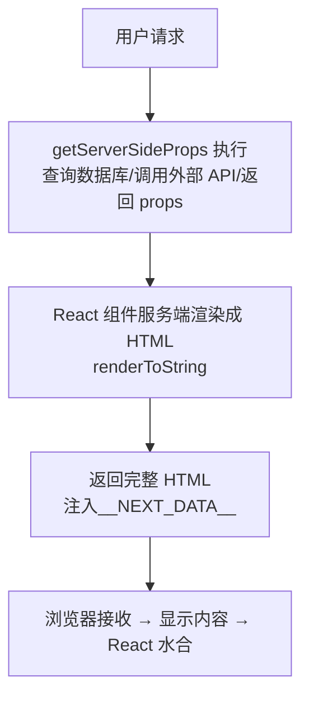

**SSG（静态生成）工作流程：**

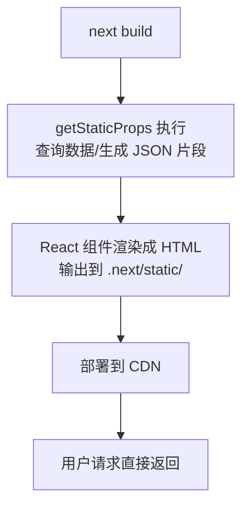

**ISR（增量静态再生）机制：**

```jsx
// 代码示例：ISR 配置
export async function getStaticProps() {
  return {
    props: { data },
    revalidate: 60, // 60 秒后过期
  };
}

// 工作逻辑
时间线：
t=0:  构建时生成页面 v1
t=30s: 用户 A 请求 → 返回 v1（缓存命中）
t=60s: 用户 B 请求 → 返回 v1（旧），触发后台再生
t=61s: 再生完成 → 页面 v2 更新
t=90s: 用户 C 请求 → 返回 v2（新缓存）
```

---

### 3.2 React Server Components 实现机制

**什么是 Server Components？**

Server Components 是一种**仅在服务端运行**的 React 组件，它们：
- **不会**发送任何 JavaScript 到客户端
- 可以直接访问数据库、文件系统
- 可以减少客户端包体积

**RSC 架构原理：**

```mermaid
flowchart TB
    subgraph Server[Server Component]
        direction TB
        Code["async function ProductPage\nconst product = await db.find()"]
    end

    subgraph Payload[Server Component Payload]
        P1[特殊的序列化格式]
        P2[不是 JavaScript]
    end

    subgraph Client[Client 接收]
        C1["{ type: 'server-component' }"]
        C2[children: [...]]
    end

    Server --> Payload
    Payload --> Client
```

**Server vs Client Components：**

| 维度 | Server Components | Client Components |
|------|------------------|-------------------|
| 执行位置 | 服务端 | 客户端浏览器 |
| 数据库访问 | ✅ 直接访问 | ❌ 不可直接访问 |
| 浏览器 API | ❌ 不可用 | ✅ 可用 |
| 交互能力 | ❌ 无（需配合 Client） | ✅ 完整 |
| 包体积 | 0 | 有 |
| 指令 | `'use server'` | `'use client'` |

---

### 3.3 路由系统底层原理

**文件系统路由机制：**

```
app/
├── page.tsx              → /
├── about/
│   └── page.tsx          → /about
├── blog/
│   ├── page.tsx          → /blog
│   ├── [slug]/
│   │   └── page.tsx      → /blog/:slug (动态)
│   └── [...tags]/
│       └── page.tsx      → /blog/tags/* (捕获所有)
└── [[...catchAll]]/
    └── page.tsx          → /* (可选捕获所有)
```

**路由匹配优先级：**

```
1. 静态路由（精确匹配）
2. 动态路由（[param]）
3. 捕获所有路由 ([...slug])
4. 可选捕获所有路由 ([[...slug]])
```

---

### 3.4 数据获取与缓存机制

**Next.js 16 四层缓存架构：**

Next.js 使用**四层缓存模型**，在不同层级协作工作以优化性能：

| 层级 | 名称 | 位置 | 作用域 | 生命周期 |
|------|------|------|--------|----------|
| **L1** | Request Memoization | 运行时内存 | 单次请求 | 请求结束即清除 |
| **L2** | Data Cache | 服务端磁盘 | 跨请求/跨用户 | 根据 revalidate 配置 |
| **L3** | Full Route Cache | 服务端/CDN | 完整路由 | 构建时 + ISR 更新 |
| **L4** | Client-Side Router Cache | 浏览器内存 | 客户端导航 | 30 秒 TTL / 导航失效 |

---

**四层缓存协作流程图：**

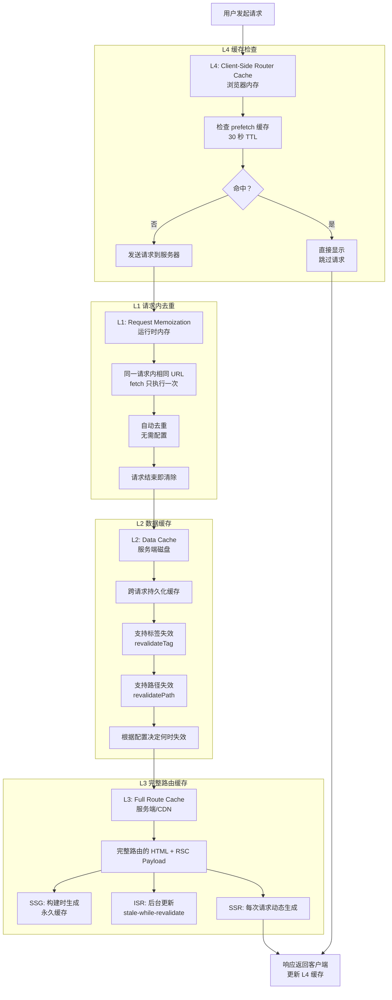

---

### L1: Request Memoization（请求备忘录）

**位置：** 运行时内存（Node.js 进程）

**作用：** 同一请求内相同 URL 的 `fetch()` 只执行一次

**生命周期：** 请求开始 → 请求结束（自动清除）

**工作原理：**
```javascript
// 场景：多个组件 fetch 同一个 API
// app/page.tsx
async function Page() {
  const data1 = await fetch('https://api.example.com/users');  // 实际请求
  const data2 = await fetch('https://api.example.com/users');  // ← 命中 L1 缓存
  const data3 = await fetch('https://api.example.com/users');  // ← 命中 L1 缓存
  // 三次 fetch 只发一次请求！
}

// app/layout.tsx
async function Layout() {
  const users = await fetch('https://api.example.com/users');  // ← 同一请求内，也命中！
}
```

**配置方式：** 自动启用，无法禁用

**优化手段：**
| 优化 | 说明 |
|------|------|
| 相同 URL 自动去重 | 无需手动处理 |
| 跨组件共享 | Page + Layout 共享同一结果 |
| 仅限同一请求 | 不同请求不共享 |

**注意：** L1 缓存在 Next.js 16 Cache Components 模式下，仅在同一渲染树内生效。

---

### L2: Data Cache（数据缓存）

**位置：** 服务端磁盘（`.next/cache/fetch-cache`）

**作用：** 跨请求、跨用户共享数据缓存

**生命周期：** 根据 `revalidate` 配置决定

**配置方式：**

```javascript
// 方式 1：全局 revalidate
fetch('https://api.example.com/users', {
  next: { revalidate: 3600 }  // 1 小时过期
});

// 方式 2：标签缓存
fetch('https://api.example.com/users', {
  next: { tags: ['users'] }  // 通过标签失效
});

// 方式 3：强制缓存
fetch('https://api.example.com/users', {
  cache: 'force-cache'  // 永久缓存，除非手动失效
});

// 方式 4：不缓存
fetch('https://api.example.com/users', {
  cache: 'no-store'  // 每次请求都重新获取
});

// 方式 5：Next.js 16 新语法 - cacheLife 配置
fetch('https://api.example.com/users', {
  next: { tags: ['users'], revalidate: 3600 }
});
revalidateTag('users', 'hours');  // 使用预定义配置
```

**缓存流程：**
```
t=0:    请求 /users
        ├─ 检查 Data Cache → 未命中
        ├─ 执行 fetch → 获取数据
        ├─ 存储到 Data Cache
        └─ 返回数据

t=30m:  请求 /users
        ├─ 检查 Data Cache → 命中（未过期）
        └─ 直接返回缓存数据

t=70m:  请求 /users
        ├─ 检查 Data Cache → 命中但过期
        ├─ 返回旧数据（stale）
        ├─ 后台重新获取（revalidate）
        └─ 更新 Data Cache
```

**失效机制：**

| API | 作用 | 示例 |
|-----|------|------|
| `revalidateTag('users')` | 失效所有包含该标签的缓存 | 用户更新后调用 |
| `revalidatePath('/users')` | 失效该路由的完整缓存 | 内容变更后调用 |
| `revalidateTag('users', 'max')` | Next.js 16 新语法（需 cacheLife 配置） | 使用 SWR 行为 |

**优化手段：**
| 优化 | 说明 |
|------|------|
| 使用 tags 精细化控制 | 比 path 更灵活，可批量失效 |
| 合理设置 revalidate | 平衡实时性和性能 |
| 使用 cacheLife 配置 | Next.js 16 新增预定义配置 |
| 避免过度使用 no-store | 会失去缓存优势 |

---

### L3: Full Route Cache（完整路由缓存）

**位置：** 服务端磁盘 + CDN（`.next/cache/app`）

**作用：** 缓存完整路由的 HTML + RSC Payload

**生命周期：** 根据渲染模式决定

**三种模式对比：**

| 模式 | 生成时机 | 失效时机 | 适用场景 |
|------|---------|---------|---------|
| **SSG** | 构建时生成 | 下次构建 | 博客、文档 |
| **ISR** | 首次请求生成 | revalidate 或 tags 失效 | 商品页、新闻 |
| **SSR** | 每次请求生成 | 不缓存 | 个性化内容 |

**ISR 工作流程：**

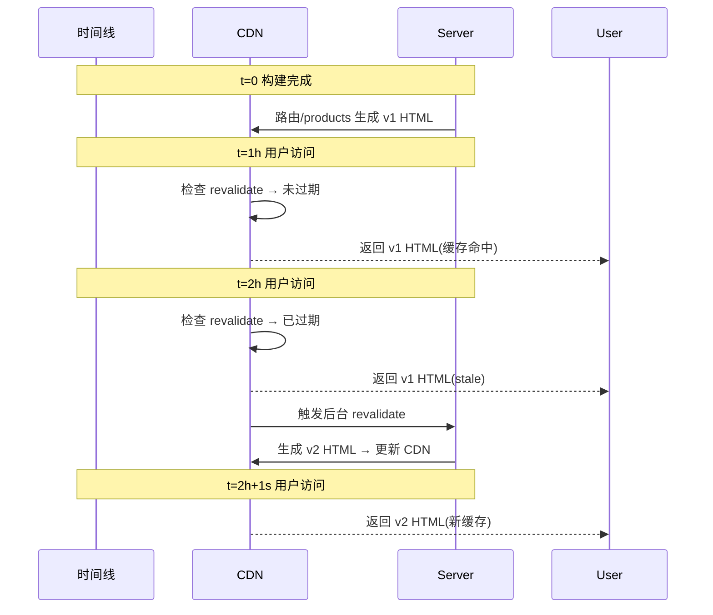

**Next.js 16 Cache Components：**

```tsx
// ✅ Next.js 16 新增 "use cache" 指令
async function ProductList() {
  'use cache';  // ← 显式缓存该组件
  revalidate: 3600;
  
  const products = await db.products.findMany();
  return <div>...</div>;
}

// ✅ 使用 PPR（部分预渲染）
<Suspense fallback={<Loading />}>
  <ProductData />
</Suspense>
```

**优化手段：**
| 优化 | 说明 |
|------|------|
| 使用 PPR | Shell 静态 + Content 动态 |
| 使用 cacheTags | 细粒度失效控制 |
| 使用 "use cache" | Next.js 16 显式缓存组件 |

---

### L4: Client-Side Router Cache（客户端路由缓存）

**位置：** 浏览器内存（Next.js 客户端运行时）

**作用：** 缓存客户端导航的 prefetched 路由

**生命周期：** 30 秒 TTL / 导航失效

**工作原理：**
```javascript
// 1. 用户 hover 到 <Link href="/about">
//    Next.js 自动 prefetch
fetch('/about', {
  headers: { 'x-next-router-prefetch': '1' }
});

// 2. 缓存到 Router Cache
//    - HTML（如果有）
//    - RSC Payload
//    - 必要的 JS chunks

// 3. 用户点击链接
//    - 命中缓存 → 立即显示（跳过请求）
//    - 未命中 → 发送完整请求

// 4. 30 秒后过期
//    或导航到其他页面后清除
```

**Next.js 16 增量 Prefetch 优化：**

| 特性 | 说明 |
|------|------|
| **Layout Deduplication** | 共享布局只下载一次 |
| **Incremental Prefetch** | 只 prefetch 缓存中没有的部分 |
| **按需 Prefetch** | hover 时优先，进入视口时补充 |

**优化手段：**
| 优化 | 说明 |
|------|------|
| 使用 `<Link>` 而非 `router.push` | 自动 prefetch |
| 使用 `prefetch={true}` | 显式控制 prefetch |
| 避免过度 prefetch | 使用 `prefetch={false}` 禁用 |

---

### 四层缓存对比总表

| 特性 | L1 Request | L2 Data | L3 Full Route | L4 Router |
|------|-----------|---------|---------------|-----------|
| **位置** | 运行时内存 | 服务端磁盘 | 服务端/CDN | 浏览器内存 |
| **作用域** | 单次请求 | 跨请求/用户 | 完整路由 | 客户端导航 |
| **生命周期** | 请求结束清除 | 根据 revalidate | SSG/ISR/SSR | 30 秒 TTL |
| **配置方式** | 自动 | `next: { revalidate/tags }` | 渲染模式 | `<Link prefetch>` |
| **失效方式** | 自动 | `revalidateTag/Path` | 构建/ISR | 自动 |
| **优化空间** | 无 | 高 | 高 | 中 |

---

### 完整请求生命周期中的缓存协作

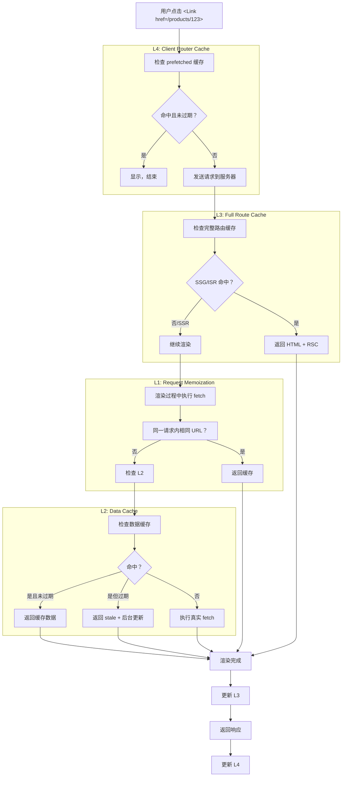

---

### 3.5 中间件架构（Edge Runtime / proxy.ts）

**Next.js 16 变更：**
- `middleware.ts` → `proxy.ts`
- Edge Runtime → Node.js Runtime（主要变更）

**执行时机：**

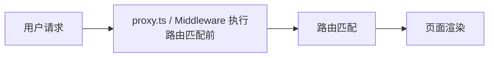

**典型用途：**

```javascript
// proxy.ts (Next.js 16+)
import { NextResponse } from 'next/server';

export default function proxy(request) {
  // 1. 认证检查
  const token = request.cookies.get('token');
  if (!token) {
    return NextResponse.redirect('/login');
  }

  // 2. 地域重定向
  const country = request.geo?.country || 'US';
  if (country === 'CN') {
    return NextResponse.redirect('https://cn.example.com');
  }

  // 3. 请求头修改
  const response = NextResponse.next();
  response.headers.set('x-custom-header', 'value');
  return response;
}
```

**Next.js 16 缓存 API 更新：**

| API | Next.js 13-15 | Next.js 16 |
|-----|--------------|------------|
| `revalidateTag()` | 单参数 | 需要 `cacheLife` 配置作为第二参数 |
| `updateTag()` | ❌ | ✅ 新增（Server Actions 专用，立即刷新） |
| `refresh()` | ❌ | ✅ 新增（仅刷新未缓存数据） |

```javascript
// ✅ Next.js 16 推荐用法
import { revalidateTag, updateTag } from 'next/cache';

// revalidateTag - 适用于 SWR 行为
revalidateTag('blog-posts', 'max');  // 后台重新验证

// updateTag - 适用于立即刷新（Server Actions 专用）
'use server';
export async function updatePost() {
  await db.posts.update(...);
  updateTag('blog-posts');  // 立即刷新，用户看到最新内容
}
```

---

## 4. 完整工作流程

### 4.1 开发工作流（Dev Server → HMR）

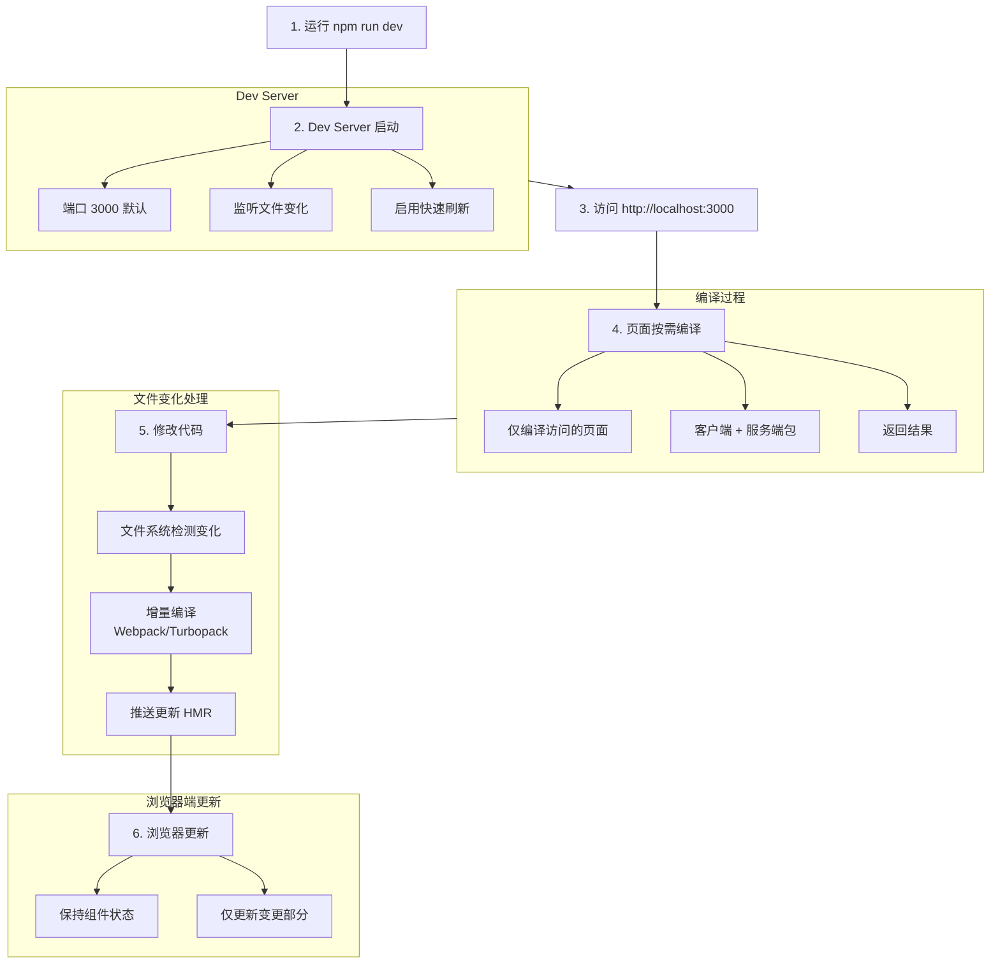

---

### 4.2 构建工作流（Compilation → Optimization）

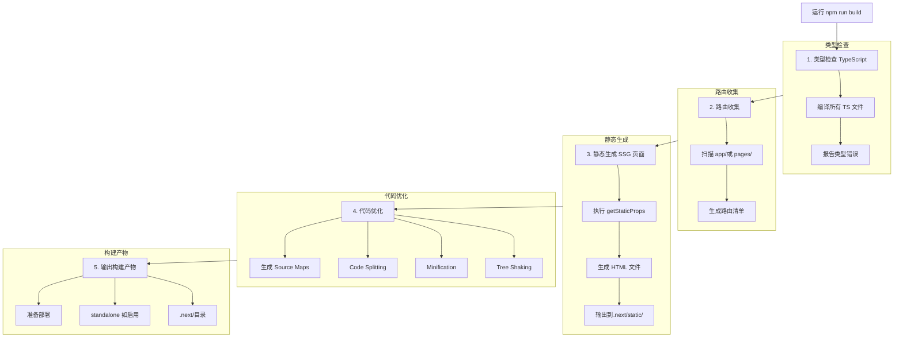

---

### 4.3 部署工作流（Output → Hosting）

**Vercel 部署流程：**

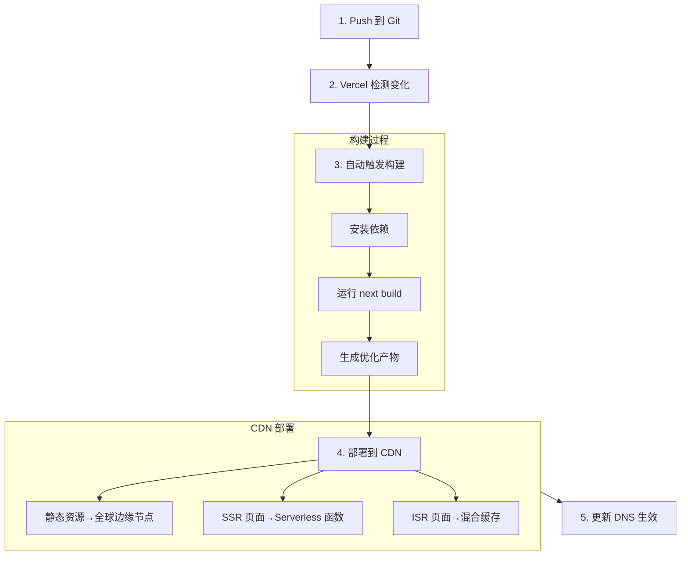

**Self-hosting 部署：**

```bash
# 1. 构建
npm run build

# 2. 启动生产服务器
npm run start

# 或使用 standalone 模式
# next.config.js: output: 'standalone'
# 部署独立的 Node.js 应用
```

---

### 4.4 运行时工作流（Request → Response）

```mermaid
flowchart TD
    Req[用户请求 /products/123] --> CDN{CDN 检查}
    
    CDN -->|命中 ISR 缓存 | Return[返回]
    CDN -->|未命中 | Origin[转发源站]
    
    Origin --> MW[2. Middleware 执行]
    
    subgraph Middleware [中间件处理]
        MW --> Auth[认证/授权检查]
        MW --> ModReq[请求修改]
        MW --> Cont[继续/重定向]
    end
    
    Cont --> Route[3. 路由匹配]
    Route --> Match[app/products/[id]/page.tsx]
    
    Match --> ServerComp[4. Server Component 执行]
    
    subgraph ServerCompExec [服务端执行]
        ServerComp --> DataFetch[数据获取]
        ServerComp --> CacheCheck[缓存检查]
        ServerComp --> RSC[生成 RSC Payload]
    end
    
    RSC --> HTML[5. HTML 渲染]
    
    subgraph HTMLRender [渲染过程]
        HTML --> MergeClient[合并 Client Components]
        HTML --> Inject[注入脚本和样式]
        HTML --> CacheHdr[设置缓存头]
    end
    
    CacheHdr --> Stream[6. 流式响应 如启用]
    
    subgraph StreamResp [流式传输]
        Stream --> Chunk[分块发送 HTML]
        Stream --> Suspense[Suspense 边界]
    end
    
    StreamResp --> Hydration[7. 客户端水合]
    Return --> Hydration
    
    subgraph Hydration [客户端水合]
        Hydration --> DownloadJS[下载 JS 包]
        Hydration --> React[React 接管]
        Hydration --> EventBind[事件绑定]
    end
```

---

## 5. 快速入门

### 5.1 环境要求

| 依赖 | 版本要求 | 说明 |
|------|----------|------|
| Node.js | 18.17+ | 必须 |
| npm/yarn/pnpm | 最新 | 包管理器 |
| React | 18.2+ | Next.js 自动安装 |

### 5.2 安装步骤

```bash
# 使用 npx（推荐）
npx create-next-app@latest my-app

# 选择配置：
# ✓ Would you like to use TypeScript? Yes
# ✓ Would you like to use ESLint? Yes
# ✓ Would you like to use Tailwind CSS? Yes
# ✓ Would you like to use `src/` directory? Yes
# ✓ Would you like to use App Router? Yes
# ✓ Would you like to customize the default import alias? No
```

### 5.3 Hello World

```jsx
// app/page.tsx
export default function Home() {
  return (
    <main>
      <h1>Hello, Next.js!</h1>
    </main>
  );
}
```

### 5.4 验证方法

```bash
# 进入项目目录
cd my-app

# 启动开发服务器
npm run dev

# 访问 http://localhost:3000
# 看到 "Hello, Next.js!" 即成功
```

---

## 6. 基础用法

### 6.1 路由系统（App Router）

**基本路由：**

```
app/
├── page.tsx           → /
├── about/
│   └── page.tsx       → /about
└── contact/
    └── page.tsx       → /contact
```

**动态路由：**

```tsx
// app/products/[id]/page.tsx
export default function ProductPage({ params }) {
  return <div>Product ID: {params.id}</div>;
}
```

**生成静态参数：**

```tsx
// app/blog/[slug]/page.tsx
export async function generateStaticParams() {
  const posts = await getPosts();
  return posts.map((post) => ({ slug: post.slug }));
}
```

---

### 6.2 布局与模板

**根布局（所有页面共享）：**

```tsx
// app/layout.tsx
export default function RootLayout({ children }) {
  return (
    <html lang="zh">
      <body>
        <Header />
        {children}
        <Footer />
      </body>
    </html>
  );
}
```

**嵌套布局：**

```tsx
// app/dashboard/layout.tsx
export default function DashboardLayout({ children }) {
  return (
    <div className="dashboard">
      <Sidebar />
      {children}
    </div>
  );
}
```

---

### 6.3 数据获取

**Server Component 中获取数据：**

```tsx
// app/products/page.tsx
async function getProducts() {
  const res = await fetch('https://api.example.com/products');
  return res.json();
}

export default async function ProductsPage() {
  const products = await getProducts();
  return (
    <ul>
      {products.map((p) => (
        <li key={p.id}>{p.name}</li>
      ))}
    </ul>
  );
}
```

**使用 `async/await` 直接在组件中：**

```tsx
export default async function Page() {
  const data = await fetch('...', { cache: 'no-store' });
  return <div>{data.title}</div>;
}
```

---

### 6.4 导航与链接

```tsx
'use client';
import Link from 'next/link';
import { useRouter } from 'next/navigation';

export default function Nav() {
  const router = useRouter();

  return (
    <nav>
      <Link href="/">首页</Link>
      <Link href="/about">关于</Link>
      <button onClick={() => router.push('/contact')}>
        联系
      </button>
    </nav>
  );
}
```

---

### 6.5 样式方案

**CSS Modules：**

```tsx
// components/Button.tsx
import styles from './Button.module.css';

export default function Button() {
  return <button className={styles.button}>Click</button>;
}
```

**Tailwind CSS：**

```tsx
export default function Button() {
  return (
    <button className="bg-blue-500 text-white px-4 py-2 rounded">
      Click
    </button>
  );
}
```

---

### 6.6 App Router 底层处理机制

**1. 路由解析流程**

```mermaid
flowchart TB
    Request[用户请求 /products/123] --> Router[Next.js Router]
    Router --> Match{路由匹配}
    
    Match -->|找到 [id]| Dynamic[动态路由处理]
    Match -->|静态路径 | Static[静态路由处理]
    
    Dynamic --> ReadTree[读取 App Router 树结构]
    Static --> ReadTree
    
    ReadTree --> BuildRSC[构建 RSC Payload]
    BuildRSC --> ResolveLayout[解析 Layout 链]
    
    ResolveLayout --> ResolvePage[解析 Page 组件]
    ResolvePage --> CheckType{组件类型？}
    
    CheckType -->|Server| ServerRender[服务端渲染]
    CheckType -->|Client| ClientBundle[客户端打包]
    
    ServerRender --> SendHTML[发送 HTML + RSC Payload]
    ClientBundle --> SendJS[发送 JS Bundle]
```

**2. 特殊文件的处理顺序**

当用户访问 `/dashboard/settings` 时，Next.js 按以下顺序处理：

```
app/
├── layout.tsx          ← 1. 最外层根布局
├── dashboard/
│   ├── layout.tsx      ← 2. 嵌套布局
│   ├── template.tsx    ← 3. 可选：带 HMR 的布局
│   └── settings/
│       ├── page.tsx    ← 4. 页面组件
│       └── loading.tsx ← 5. 可选：加载状态
```

**渲染产物结构：**

```tsx
// 最终渲染的 React 树
<RootLayout>
  <DashboardLayout>
    <Suspense fallback={<Loading />}>
      <SettingsPage />
    </Suspense>
  </DashboardLayout>
</RootLayout>
```

**3. Server/Client 边界的编译处理**

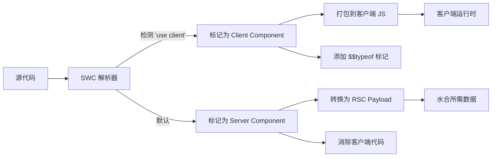

**'use client' 编译产物：**

```javascript
// 输入 (源码)
'use client'
export function Counter() {
  const [count, setCount] = useState(0)
  return <button>{count}</button>
}

// 输出 (打包后的客户端 JS)
// __next_client_reference__ 标记
export var Counter = {
  $$typeof: Symbol.for('react.client.reference'),
  __next_client_reference__: true,
  // 实际组件代码
  render: function() { ... }
}
```

**4. RSC Payload 格式**

Server Component 序列化为 RSC Payload 发送到客户端：

```javascript
// RSC Payload 示例 (简化)
0:"Sreact.fragment"
1:["$","$L1",null,{"children":"$L2"}]
2:["$","$L3",null,{"children":"Hello World"}]
3:["$","$L4",null,{"className":"container"}]
```

**客户端 Hydration 过程：**

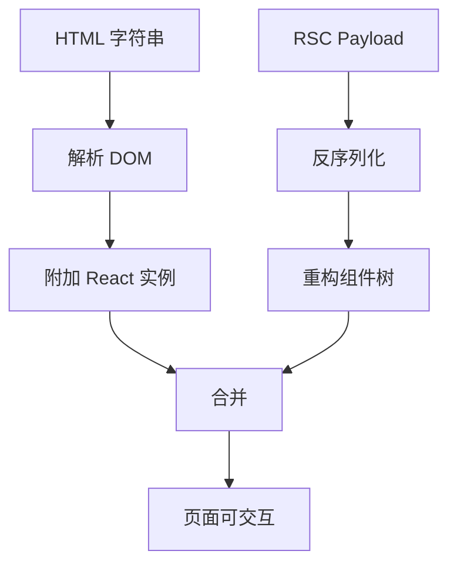

**5. 客户端导航的路由匹配**

```typescript
// 内部路由匹配逻辑（简化）

interface RouteMatch {
  // 1. 精确匹配优先
  exact: '/products/123' → app/products/[id]/page.tsx
  
  // 2. 动态段匹配
  dynamic: '/products/:id' → app/products/[id]/page.tsx
  
  // 3. Catch-all 匹配
  catchAll: '/blog/*' → app/blog/[...slug]/page.tsx
  
  // 4. 可选 Catch-all
  optionalCatchAll: '/docs/*' → app/docs/[[...slug]]/page.tsx
}
```

**6. loading.tsx 的自动 Suspense 机制**

```tsx
// Next.js 内部处理（简化）

// 当你有 loading.tsx 时，Next.js 自动包裹：
function wrapWithSuspense(page, loading) {
  return (
    <Suspense fallback={loading}>
      {page}
    </Suspense>
  )
}

// 无需手动写 Suspense
// app/dashboard/page.tsx + app/dashboard/loading.tsx
// → 自动组合
```

**7. generateStaticParams 的编译时执行**

```typescript
// 构建时执行流程

export async function generateStaticParams() {
  // 这段代码在构建时运行，不在运行时
  const posts = await getPosts()
  return posts.map(post => ({ slug: post.slug }))
}

// 构建产物：
// .next/static/[hash]/pages/blog/about.html  ← 预生成
// .next/static/[hash]/pages/blog/contact.html ← 预生成
```

---

## 7. 高级特性

### 7.1 Server Components 深度使用

**什么是 Server Components？**

Server Components 是一种**仅在服务端运行**的 React 组件，它们：
- **不会**发送任何 JavaScript 到客户端
- 可以直接访问数据库、文件系统
- 可以减少客户端包体积

**'use server' 指令：**

```tsx
// app/actions.ts
'use server'

export async function submitForm(formData: FormData) {
  // 服务端逻辑：数据库访问、邮件发送等
  const name = formData.get('name')
  await db.users.create({ name })
  return { success: true }
}
```

**'use client' 指令：**

```tsx
// components/Counter.tsx
'use client'

import { useState } from 'react'

export default function Counter() {
  const [count, setCount] = useState(0)
  return (
    <button onClick={() => setCount(c => c + 1)}>
      Count: {count}
    </button>
  )
}
```

**组合模式（Server + Client）：**

```tsx
// app/page.tsx (Server Component)
import Counter from '@/components/Counter'

async function getData() {
  const res = await fetch('https://api.example.com/data')
  return res.json()
}

export default async function Page() {
  const data = await getData()
  return (
    <div>
      <h1>{data.title}</h1>
      {/* Client Component 作为子节点 */}
      <Counter />
    </div>
  )
}
```

**常见误区：**

| 误区 | 正确理解 |
|------|----------|
| Server Component 不能有交互 | 可以有 Client Component 子节点 |
| 'use client' 会影响整个应用 | 只影响该组件及其子节点 |
| 所有组件都应该是 Server | 需要交互的必须是 Client |

---

### 7.2 流式渲染与 Suspense

**流式渲染原理：**

流式渲染（Streaming）是一种渐进式渲染技术，允许服务器将页面内容分块发送到客户端，而不是等待所有内容就绪后才发送。

**传统 SSR vs 流式 SSR：**

```
传统 SSR:
请求 → [等待所有数据] → 完整 HTML → 用户看到内容

流式 SSR:
请求 → HTML 外壳 → [数据块 1] → [数据块 2] → 用户逐步看到内容
```

**Suspense 基础用法：**

```tsx
import { Suspense } from 'react'
import LoadingSpinner from '@/components/Spinner'

export default function Page() {
  return (
    <main>
      {/* 首屏立即显示 */}
      <Header />

      {/* 延迟加载的内容 */}
      <Suspense fallback={<LoadingSpinner />}>
        <SlowComponent />
      </Suspense>

      {/* 另一个独立的加载单元 */}
      <Suspense fallback={<div>加载中...</div>}>
        <Recommendations />
      </Suspense>
    </main>
  )
}
```

**loading.tsx 自动 Suspense：**

```tsx
// app/dashboard/loading.tsx
export default function Loading() {
  return <div className="spinner">Dashboard 加载中...</div>
}

// app/dashboard/page.tsx
// 自动与 loading.tsx 配对，无需手动包裹 Suspense
export default async function Dashboard() {
  const data = await fetchDashboardData()
  return <div>{/* ... */}</div>
}
```

**流式渲染最佳实践：**

1. **合理设置 Fallback**：应与最终内容布局接近，避免视觉跳动
2. **细粒度拆分**：将页面拆分为多个独立的 Suspense 边界
3. **优先显示关键内容**：首屏内容优先，次要内容延迟加载

---

**流式渲染与渲染模式的配合：**

流式渲染（Streaming）是**传输层机制**，可以与多种渲染模式配合使用，但**前提是页面中包含 Suspense 边界**：

| 组合 | 工作原理 | 适用场景 |
|------|----------|----------|
| **Streaming + SSR** | 服务端将 HTML 分块流式传输，每个 Suspense boundary 独立解析 | 个性化 Dashboard、实时数据页面 |
| **Streaming + ISR** | ISR 重新生成时也可流式返回，用户先看到旧内容 + 加载指示器 | 商品详情页、新闻页（有缓存但需更新） |
| **Streaming + CSR** | Suspense 边界内 CSR 组件按需加载 JS 后 hydration | 后台系统、数据可视化组件 |

**关键理解：流式的前提是 Suspense 边界**

| 渲染模式 | 是否支持流式 | 条件 | 客户端处理 |
|----------|--------------|------|------------|
| **纯 CSR（无 Suspense）** | ❌ | 整个应用都是 `'use client'`，无 Suspense 边界 | 完整 JS bundle 加载后渲染 |
| **CSR + Suspense** | ✅ | 页面中有 Suspense 边界划分加载单元 | 逐块 hydration |
| **SSR（无 Suspense）** | ❌ | 页面没有 Suspense 边界 | 等待完整 HTML 后 hydration |
| **SSR + Suspense** | ✅ | 页面中有 Suspense 边界划分静态/动态内容 | 逐块 hydration |
| **ISR + Suspense** | ✅ | ISR 页面有 Suspense 边界 | 先显示缓存，新内容逐块 hydration |
| **SSG + Suspense (PPR)** | ✅ | PPR 架构，Shell 静态 + Content 动态 | Shell 立即显示，Content 流式 |

**Next.js 16 PPR（Partial Prerendering）架构：**

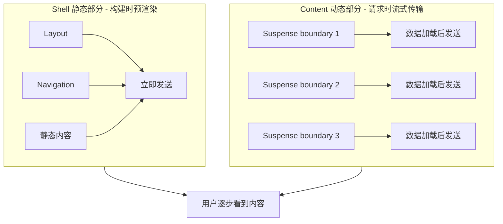

**代码示例：流式 SSR + CSR 混合**

```tsx
// app/products/[id]/page.tsx
import { Suspense } from 'react'

export default function ProductPage({ params }) {
  return (
    <div>
      {/* 静态 Shell - 立即发送 */}
      <Header />
      <ProductShell />
      
      {/* SSR 数据 - 流式传输 */}
      <Suspense fallback={<ProductSkeleton />}>
        <ProductDetails params={params} />
      </Suspense>
      
      {/* CSR 组件 - 客户端 hydration */}
      <Suspense fallback={<ReviewsSkeleton />}>
        <ProductReviews params={params} />
      </Suspense>
    </div>
  )
}

async function ProductDetails({ params }) {
  'use cache'
  revalidate: 3600
  const product = await fetchProduct(params.id)
  return <div>{product.name}</div>
}

// CSR 组件
'use client'
function ProductReviews({ params }) {
  const [reviews, setReviews] = useState([])
  useEffect(() => {
    fetch(`/api/products/${params.id}/reviews`)
      .then(res => res.json())
      .then(setReviews)
  }, [])
  return <div>{/* ... */}</div>
}
```

---

### 7.3 中间件（Middleware）

**Middleware 执行时机：**

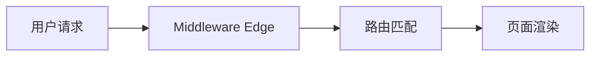

**基础配置：**

```typescript
// middleware.ts
import { NextResponse } from 'next/server'
import type { NextRequest } from 'next/server'

export function middleware(request: NextRequest) {
  // 中间件逻辑
  return NextResponse.next()
}

export const config = {
  matcher: [
    '/((?!api|_next/static|_next/image|favicon.ico).*)',
  ],
}
```

**三大常用场景：**

**1. 权限拦截：**

```typescript
export function middleware(request: NextRequest) {
  const token = request.cookies.get('token')
  const { pathname } = request.nextUrl

  // 访问 dashboard 但未登录，重定向到登录页
  if (pathname.startsWith('/dashboard') && !token) {
    return NextResponse.redirect(new URL('/login', request.url))
  }

  return NextResponse.next()
}
```

**2. 修改请求头：**

```typescript
export function middleware(request: NextRequest) {
  const requestHeaders = new Headers(request.headers)
  requestHeaders.set('x-custom-header', 'value')

  return NextResponse.next({
    request: { headers: requestHeaders },
  })
}
```

**3. 处理跨域 (CORS)：**

```typescript
export function middleware() {
  const response = NextResponse.next()
  response.headers.set('Access-Control-Allow-Origin', '*')
  response.headers.set(
    'Access-Control-Allow-Methods',
    'GET, POST, PUT, DELETE, OPTIONS'
  )
  return response
}
```

**Edge Runtime 限制：**

| 不支持 | 说明 |
|--------|------|
| `fs` 模块 | 无法读取文件系统 |
| 请求体读取 | 只能读取 headers、cookies、URL |
| 全局状态 | Edge 是无状态的 |

---

### 7.4 Server Actions 深度解析

**Server Actions 本质：RPC（Remote Procedure Call）架构**

Server Actions 是基于 **React Server Functions** 的远程过程调用机制，允许客户端通过网络请求调用服务端函数。

---

#### 7.4.1 核心架构

```mermaid
flowchart TB
    subgraph Client [客户端]
        A[用户点击表单] --> B[Form Action 调用]
        B --> C[序列化为 POST 请求]
        C --> D[携带 action ID 和参数]
    end
    
    subgraph Server [服务端]
        D --> E[路由匹配 /__actions]
        E --> F[解析 action ID]
        F --> G[查找并执行 Server Action]
        G --> H[返回结果]
    end
    
    H --> I[客户端更新 UI]
```

---

#### 7.4.2 编译时转换

**'use server' 指令的处理：**

```typescript
// 输入：app/actions.ts
'use server'

export async function createUser(formData: FormData) {
  const name = formData.get('name') as string
  await db.users.create({ name })
  return { success: true }
}

// 输出：编译后的产物（.next/server/app/actions.js）
export const createUser = createServerAction(
  "actions$createUser",  // action ID（唯一标识）
  async (formData) => {   // 实际函数
    const name = formData.get('name')
    await db.users.create({ name })
    return { success: true }
  }
)

// createServerAction 内部注册到 action 映射表
registerAction("actions$createUser", createUser)
```

**Action Manifest（构建时生成）：**

```javascript
// .next/server/app/__action_manifest__.js
export const manifest = {
  "actions$createUser": ["app/actions.js", "createUser"],
  "actions$deleteUser": ["app/actions.js", "deleteUser"]
}
```

---

#### 7.4.3 客户端引用（Server Reference）

**当 Server Component 导入 Server Action 时：**

```tsx
// app/page.tsx（Server Component）
import { createUser } from './actions'

export default function Page() {
  return (
    <form action={createUser}>
      <input name="name" />
      <button type="submit">创建</button>
    </form>
  )
}
```

**RSC Payload（发送到客户端的序列化数据）：**

```javascript
// RSC Payload 示例（简化）
0: "$Sref"  // Server Reference 标记
1: "actions$createUser"  // action ID
2: "/app/actions.js"  // 模块路径

// 客户端收到的 form action 是一个特殊对象
{
  $$typeof: Symbol.for('react.server.reference'),
  $$action: {
    id: "actions$createUser",
    name: "createUser",
    encodings: ["formData"],
    module: "__actions"
  }
}
```

---

#### 7.4.4 客户端 Hydration 后的远程调用

**react-server-dom-webpack/client 提供的边界层：**

```javascript
// 客户端运行时（简化）

export function createServerReference(id, module, encodings) {
  return async function(...args) {
    // 序列化为 HTTP POST
    const body = new FormData()
    body.set('$ACTION_ID', id)  // action ID
    
    // 参数序列化
    if (encodings.includes('formData')) {
      // FormData 直接传递
      body.append(...args[0])
    }
    
    // POST 到服务端
    const response = await fetch('', {
      method: 'POST',
      headers: {
        'Accept': 'text/x-component',
        'Content-Type': 'application/x-www-form-urlencoded'
      },
      body
    })
    
    // 解析 RSC Payload 响应
    return await decodeReply(await response.text())
  }
}
```

---

#### 7.4.5 服务端接收与执行

**Next.js 内部路由处理器：**

```typescript
// Next.js 内部处理（简化）

// app/page.tsx 的 POST handler
export async function POST(request: Request) {
  const formData = await request.formData()
  const actionId = formData.get('$ACTION_ID')
  
  // 从注册的 action 映射表中查找
  const action = getActionById(actionId)
  
  if (!action) {
    return new Response('Action not found', { status: 404 })
  }
  
  // 执行 Server Action
  try {
    const result = await action(formData)
    
    // 序列化为 RSC Payload 返回
    return new Response(encodeReply(result), {
      headers: { 'Content-Type': 'text/x-component' }
    })
  } catch (error) {
    // 错误处理
    return new Response(error.message, { status: 500 })
  }
}
```

---

#### 7.4.6 完整的 RPC 调用序列

```mermaid
sequenceDiagram
    participant User as 用户
    participant Client as 客户端 (React)
    participant Runtime as 客户端运行时
    participant Server as Next.js Server
    participant Action as Server Action

    User->>Client: 点击提交按钮
    Client->>Runtime: 触发 form action
    
    Note over Runtime: 序列化参数为 FormData
    Note over Runtime: 添加 $ACTION_ID 头
    
    Runtime->>Server: POST / (带 FormData)
    
    Note over Server: 解析 $ACTION_ID
    Note over Server: 查找注册的 action
    
    Server->>Action: 执行 createUser(formData)
    
    Note over Action: 数据库操作
    
    Action-->>Server: 返回结果 {success: true}
    
    Note over Server: 序列化为 RSC Payload
    
    Server-->>Runtime: text/x-component 响应
    
    Note over Runtime: 反序列化 RSC Payload
    Note over Runtime: 触发 revalidatePath
    
    Runtime->>Client: 更新 UI 状态
    Client->>User: 显示成功状态
```

---

#### 7.4.7 useActionState 内部机制

```typescript
// useActionState 的工作流程（简化）

'use client'
import { useActionState } from 'react'
import { createUser } from './actions'

function Form() {
  // 服务端返回的 action 被包装为客户端调用
  const [state, formAction] = useActionState(createUser, initialState)
  
  return (
    <form action={formAction}>
      {/* state 包含服务端返回的结果 */}
      {state?.error && <p>{state.error}</p>}
      <input name="name" />
      <button>提交</button>
    </form>
  )
}
```

**内部实现：**

```javascript
// React 内部（简化）

export function useActionState(action, initialState) {
  const [state, setState] = useState(initialState)
  
  // 包装 Server Action 为客户端可调用
  const wrappedAction = async (formData) => {
    // 1. 乐观更新
    const pendingState = { pending: true }
    setState(pendingState)
    
    try {
      // 2. RPC 调用服务端
      const result = await action(formData)
      
      // 3. 更新状态
      setState(result)
    } catch (error) {
      setState({ error: error.message })
    }
  }
  
  return [state, wrappedAction]
}
```

---

#### 7.4.8 安全性设计

**CSRF 保护（allowedOrigins）：**

```javascript
// next.config.js
module.exports = {
  experimental: {
    serverActions: {
      // 允许额外安全来源域，防止 CSRF 攻击
      allowedOrigins: ['my-proxy.com', '*.my-proxy.com'],
    },
  },
}
```

**请求体大小限制（bodySizeLimit）：**

```javascript
// next.config.js
module.exports = {
  experimental: {
    serverActions: {
      // 默认 1MB，防止 DDoS 和过度资源消耗
      bodySizeLimit: '2mb',
    },
  },
}
```

**权限验证最佳实践：**

```typescript
// app/actions.ts
'use server'

import { auth } from '@/lib/auth'
import { headers } from 'next/headers'

export async function deleteUser(userId: string) {
  // 从请求头获取会话
  const session = await auth(headers())
  
  // 权限验证
  if (!session?.admin) {
    throw new Error('Unauthorized')
  }
  
  await db.users.delete(userId)
}
```

---

#### 7.4.9 渐进式增强（Progressive Enhancement）

**无需 JavaScript 的表单提交：**

```tsx
// 即使 JS 未加载，表单也能正常提交
<form action={createUser}>
  <input name="name" required />
  <button type="submit">创建用户</button>
</form>
```

**编译后的 HTML（SSR 输出）：**

```html
<!-- 服务端渲染的 HTML -->
<form action="/" method="POST">
  <input name="name" required />
  <!-- action ID 编码在 hidden input 中 -->
  <input type="hidden" name="$ACTION_ID" value="actions$createUser" />
  <button type="submit">创建用户</button>
</form>
```

---

#### 7.4.10 类型安全与 Action ID 生成

**Next.js 16 类型推导：**

```typescript
// actions.ts
'use server'

// 编译器生成类型定义
// .next/types/actions.d.ts
export interface ServerActions {
  "actions$createUser": {
    input: FormData,
    output: Promise<{ success: boolean }>
  }
}

// 客户端调用时自动推导类型
function ClientForm() {
  const [formAction, isPending] = useActionState(
    // ✅ 类型安全：自动推导输入/输出
    async (formData: FormData) => {
      'use server'
      // ...
    },
    null
  )
}
```

---

#### 7.4.11 两种定义方式对比

| 方式 | 语法 | 适用场景 |
|------|------|----------|
| **内联定义** | 在 async 函数体内加 `'use server'` | Server Component 内简单 action |
| **文件级定义** | 文件顶部加 `'use client'` | 需要被 Client Component 导入的 action |

**内联定义（仅限 Server Component）：**

```tsx
// app/page.tsx
export default function Page() {
  async function createPost(formData: FormData) {
    'use server'
    // ...
  }
  
  return <form action={createPost}>...</form>
}
```

**文件级定义（可被 Client 导入）：**

```typescript
// app/actions.ts
'use server'

export async function createPost(formData: FormData) {
  // ...
}
```

```tsx
// app/ui/button.tsx
'use client'

import { createPost } from '@/app/actions'

export function Button() {
  return <button formAction={createPost}>Create</button>
}
```

---

#### 7.4.12 常用 API

**revalidatePath - 刷新指定路径缓存：**

```typescript
'use server'
import { revalidatePath } from 'next/cache'

export async function createPost(formData: FormData) {
  // ... mutate data
  revalidatePath('/posts')
}
```

**revalidateTag - 刷新标签缓存：**

```typescript
'use server'
import { revalidateTag } from 'next/cache'

export async function updateProduct(id: string, data: any) {
  await db.products.update(id, data)
  revalidateTag('products', 'max')
}
```

**redirect - 重定向：**

```typescript
'use server'
import { redirect } from 'next/navigation'

export async function createPost(formData: FormData) {
  // ...
  revalidatePath('/posts')
  redirect('/posts')  // 调用后代码不执行
}
```

**cookies - Cookie 操作：**

```typescript
'use server'
import { cookies } from 'next/headers'

export async function exampleAction() {
  const cookieStore = await cookies()
  
  // 获取
  cookieStore.get('name')?.value
  
  // 设置
  cookieStore.set('name', 'Delba')
  
  // 删除
  cookieStore.delete('name')
}
```

**refresh - 刷新客户端路由：**

```typescript
'use server'
import { refresh } from 'next/cache'

export async function updatePost(formData: FormData) {
  // ... mutate data
  refresh()  // 刷新客户端，不 revalidate 标签数据
}
```

---

### 7.5 API 路由与全栈开发

**Route Handler 基础：**

```typescript
// app/api/users/route.ts
import { NextResponse } from 'next/server'

export async function GET() {
  const users = await db.users.findMany()
  return NextResponse.json({ users })
}

export async function POST(request: Request) {
  const body = await request.json()
  const user = await db.users.create(body)
  return NextResponse.json({ user }, { status: 201 })
}
```

**动态路由参数：**

```typescript
// app/api/users/[id]/route.ts
export async function GET(
  request: Request,
  { params }: { params: { id: string } }
) {
  const user = await db.users.find(params.id)
  if (!user) {
    return NextResponse.json({ error: 'Not found' }, { status: 404 })
  }
  return NextResponse.json({ user })
}
```

**Server Actions（数据 Mutation）：**

```typescript
// app/actions.ts
'use server'

import { revalidateTag } from 'next/cache'

export async function createUser(formData: FormData) {
  const name = formData.get('name') as string
  const email = formData.get('email') as string

  await db.users.create({ name, email })

  // 重新验证缓存
  revalidateTag('users', 'max')

  return { success: true }
}
```

**表单集成：**

```tsx
// app/page.tsx
import { createUser } from './actions'

export default function Home() {
  return (
    <form action={createUser}>
      <input name="name" placeholder="姓名" required />
      <input name="email" type="email" placeholder="邮箱" required />
      <button type="submit">创建用户</button>
    </form>
  )
}
```

---

### 7.5.1 API Route vs Server Actions 完整对比

| 维度 | API Route (Route Handler) | Server Actions |
|------|---------------------------|----------------|
| **本质** | RESTful API 端点 | RPC 远程过程调用 |
| **文件位置** | `app/api/**/route.ts` | `app/actions.ts` 或组件内联 |
| **指令** | 无需特殊指令 | `'use server'` |
| **触发来源** | 任何 HTTP 客户端 | 仅限 React 组件内 |
| **调用方式** | `fetch('/api/xxx')` | 直接函数调用 `action()` |
| **HTTP 方法** | GET/POST/PUT/DELETE/HEAD/OPTIONS/PATCH | 仅 POST |
| **请求体** | 手动解析（json/text/formData/arrayBuffer） | 自动接收 FormData |
| **参数传递** | URL 参数、请求体、headers | FormData、bind 参数 |
| **响应格式** | 任意（JSON/HTML/Text/File/Stream） | RSC Payload（可序列化数据） |
| **返回方式** | 必须返回 `NextResponse` | 隐式返回（自动序列化） |
| **UI 更新** | 手动处理（`setState`、`useEffect`） | 自动更新（React 处理） |
| **渐进式增强** | ❌ 需要 JavaScript | ✅ 无 JS 也能提交表单 |
| **类型安全** | 需手动定义类型 | 自动推导输入/输出 |
| **错误处理** | HTTP 状态码 + 错误体 | 抛出错误 → Error Boundary |
| **加载状态** | 手动管理（`useState`） | 自动暴露（`useActionState` 的 pending） |
| **CSRF 保护** | 需自行实现 | 内置（Referer + Origin 验证） |
| **可被外部调用** | ✅ 是（第三方、Webhook） | ❌ 否（同源限制） |
| **环境变量访问** | ✅ 全部（服务端执行） | ✅ 全部（服务端执行） |
| **CORS 限制** | 作为目标时需配置 CORS | 不涉及（同源） |
| **缓存失效** | 手动调用 `revalidateTag` | 可内嵌 `revalidateTag` |
| **重定向** | `NextResponse.redirect()` | `redirect()` 函数 |
| **Cookie 操作** | `request.cookies` / `response.cookies` | `cookies()` 函数 |
| **执行位置** | 服务端（Node.js/Edge） | 服务端（Node.js/Edge） |
| **客户端发起** | ✅ 是（网络请求） | ✅ 是（网络请求） |
| **服务端发起** | ✅ 是（内部调用） | ❌ 否（仅限触发） |
| **请求头获取** | `request.headers` | `headers()` 函数 |
| **适用场景** | REST API、Webhook、文件上传、流式响应 | 表单提交、数据变更、用户交互 |

---

#### 使用场景决策树

```mermaid
flowchart TD
    Start[需要处理数据变更] --> External{是否需要被外部调用？}
    
    External -->|是 | API[API Route<br/>REST API、Webhook]
    External -->|否 | MutationType{操作类型？}
    
    MutationType -->|表单提交 | Action[Server Actions<br/>自动处理表单]
    MutationType -->|文件上传 | API2[API Route<br/>处理二进制数据]
    MutationType -->|简单交互 | Action2[Server Actions<br/>onClick 调用]
    MutationType -->|复杂 API | API3[API Route<br/>多方法支持]
    
    Action --> Progressive{是否需要无 JS 可用？}
    Progressive -->|是 | Action
    Progressive -->|否 | Action2
```

---

#### 代码对比示例

**相同功能的不同实现：**

```typescript
// ========== API Route 方式 ==========
// app/api/users/route.ts
export async function POST(request: Request) {
  const body = await request.json()
  const user = await db.users.create(body)
  return NextResponse.json({ user }, { status: 201 })
}

// Client Component 调用
'use client'
export function CreateUser() {
  const handleSubmit = async (e: FormEvent) => {
    e.preventDefault()
    const formData = new FormData(e.currentTarget)
    
    // 手动 fetch
    const res = await fetch('/api/users', {
      method: 'POST',
      body: JSON.stringify(Object.fromEntries(formData))
    })
    const user = await res.json()
    
    // 手动更新 UI
    setUsers(prev => [...prev, user])
  }
  
  return (
    <form onSubmit={handleSubmit}>
      <input name="name" />
      <button type="submit">创建</button>
    </form>
  )
}
```

```typescript
// ========== Server Actions 方式 ==========
// app/actions.ts
'use server'
export async function createUser(formData: FormData) {
  const name = formData.get('name') as string
  const user = await db.users.create({ name })
  return { user }  // 自动序列化
}

// Client Component 调用
'use client'
export function CreateUser() {
  return (
    // 自动处理一切
    <form action={createUser}>
      <input name="name" />
      <button type="submit">创建</button>
    </form>
  )
}
```

---

#### 性能对比

| 指标 | API Route | Server Actions |
|------|-----------|----------------|
| **网络往返** | 1 次（请求 + 响应） | 1 次（请求 + 响应） |
| **序列化开销** | JSON 序列化/反序列化 | FormData + RSC Payload |
| **UI 更新** | 手动 `setState` | 自动（React 优化） |
| **代码量** | 较多（fetch + 状态管理） | 较少（直接调用） |
| **类型推导** | 手动定义 | 自动推断 |

---

### 7.6 缓存与性能优化

**缓存层级：**

```mermaid
flowchart TD
    A[Request Memoization<br/>请求内缓存<br/>相同 URL 的 fetch 只执行一次] --> B[Data Cache<br/>跨请求持久化缓存<br/>存储在.next/cache/]
    B --> C[Full Route Cache<br/>SSG 页面缓存<br/>完整 HTML 缓存]
```

**缓存配置选项：**

```typescript
// 强制缓存 1 小时
fetch(url, { next: { revalidate: 3600 } })

// 标签缓存
fetch(url, { next: { tags: ['products'] } })
// 失效：revalidateTag('products', 'max')

// 不缓存
fetch(url, { cache: 'no-store' })

// 强制缓存（永不失效）
fetch(url, { cache: 'force-cache' })
```

**`revalidateTag` 最佳实践：**

```typescript
// app/actions.ts
'use server'
import { revalidateTag } from 'next/cache'

export async function updateProduct(id: string, data: any) {
  await db.products.update(id, data)
  // 标记为 stale，下次访问时后台更新
  revalidateTag('products', 'max')
}
```

**图片优化：**

```tsx
import Image from 'next/image'

// 自动优化：WebP 格式、响应式尺寸、懒加载
<Image
  src="/hero.jpg"
  alt="Hero"
  width={1200}
  height={630}
  priority  // 首屏图片优先加载
  quality={85}
/>
```

**字体优化：**

```tsx
import { Inter } from 'next/font/google'

const inter = Inter({
  subsets: ['latin'],
  display: 'swap',  // 避免 FOIT
})

export default function RootLayout({ children }) {
  return (
    <html lang="zh" className={inter.className}>
      <body>{children}</body>
    </html>
  )
}
```

---

### 7.7 国际化 (i18n)

**推荐方案：next-intl**

**安装配置：**

```bash
npm install next-intl
```

**创建语言文件：**

```typescript
// locales/client.ts
"use client"
import { createI18nClient } from 'next-international/client'

export const { useI18n, I18nProviderClient } = createI18nClient({
  en: () => import('./en'),
  zh: () => import('./zh'),
})

// locales/en.ts
export default {
  home: {
    title: 'Home',
    description: 'Welcome to our site',
  },
} as const

// locales/zh.ts
export default {
  home: {
    title: '首页',
    description: '欢迎访问我们的网站',
  },
} as const
```

**Middleware 配置：**

```typescript
// middleware.ts
import createMiddleware from 'next-intl/middleware'

export default createMiddleware({
  locales: ['en', 'zh'],
  defaultLocale: 'zh',
  localePrefix: 'always',
})

export const config = {
  matcher: ['/((?!api|_next|_vercel|.*\\..*).*)'],
}
```

**使用翻译：**

```tsx
// app/[locale]/page.tsx
import { getI18n } from '@/locales/server'

export default async function Home() {
  const t = await getI18n()
  return (
    <div>
      <h1>{t('home.title')}</h1>
      <p>{t('home.description')}</p>
    </div>
  )
}
```

---

### 7.8 元数据 API（SEO）

**静态元数据：**

```typescript
// app/layout.tsx
import type { Metadata } from 'next'

export const metadata: Metadata = {
  title: {
    template: '%s | 我的站点',
    default: '我的站点 - 欢迎来到这里',
  },
  description: '这是一个很棒的站点',
  keywords: ['Next.js', 'React', 'Web 开发'],
  robots: {
    index: true,
    follow: true,
  },
  openGraph: {
    title: '我的站点',
    description: '欢迎来到我的站点',
    images: ['/og-image.png'],
    locale: 'zh_CN',
    type: 'website',
  },
}
```

**动态元数据：**

```typescript
// app/blog/[slug]/page.tsx
import type { Metadata } from 'next'

type Props = { params: { slug: string } }

export async function generateMetadata({ params }: Props): Promise<Metadata> {
  const post = await getPost(params.slug)
  return {
    title: post.title,
    description: post.excerpt,
    openGraph: {
      images: [post.coverImage],
    },
  }
}

export default async function BlogPost({ params }: Props) {
  const post = await getPost(params.slug)
  return <article>{post.content}</article>
}
```

**SEO 最佳实践：**

| 项目 | 建议 |
|------|------|
| 标题长度 | 60 字符以内 |
| 描述长度 | 160 字符以内 |
| OG 图片 | 1200x630px |
| Canonical URL | 避免重复内容 |
| 站点地图 | 使用 `next-sitemap` 生成 |

---

## 8. 实战案例

### 8.1 博客/CMS 系统

**需求：**
- 文章列表和详情页
- 支持 Markdown 渲染
- 静态生成 + ISR 更新

**项目结构：**

```
app/
├── layout.tsx
├── page.tsx              # 首页（文章列表）
├── blog/
│   ├── [slug]/
│   │   └── page.tsx      # 文章详情
│   └── page.tsx          # 博客首页
└── api/
    └── revalidate/
        └── route.ts      # ISR 触发端点
```

**文章数据获取：**

```typescript
// lib/posts.ts
import fs from 'fs'
import matter from 'gray-matter'

export async function getPosts() {
  const files = fs.readdirSync('posts')
  return files.map((file) => {
    const content = fs.readFileSync(`posts/${file}`, 'utf-8')
    const { data, content: markdown } = matter(content)
    return { slug: file.replace('.md', ''), ...data, markdown }
  })
}

export async function getPost(slug: string) {
  const content = fs.readFileSync(`posts/${slug}.md`, 'utf-8')
  const { data, content: markdown } = matter(content)
  return { ...data, markdown }
}
```

**静态生成配置：**

```typescript
// app/blog/[slug]/page.tsx
export async function generateStaticParams() {
  const posts = await getPosts()
  return posts.map((post) => ({ slug: post.slug }))
}

export default async function BlogPost({ params }: { params: { slug: string } }) {
  const post = await getPost(params.slug)
  return (
    <article>
      <h1>{post.title}</h1>
      <Markdown content={post.markdown} />
    </article>
  )
}
```

**ISR 触发端点：**

```typescript
// app/api/revalidate/route.ts
import { revalidateTag } from 'next/cache'

export async function GET(request: Request) {
  const tag = request.nextUrl.searchParams.get('tag')
  if (tag) {
    revalidateTag(tag, 'max')
    return Response.json({ revalidated: true })
  }
  return Response.json({ error: 'Missing tag' }, { status: 400 })
}
```

---

### 8.2 电商产品页

**需求：**
- 产品列表（支持分页）
- 产品详情页
- 购物车功能

**产品列表（ISR）：**

```typescript
// app/products/page.tsx
export const dynamic = 'force-dynamic'
export const revalidate = 3600 // 1 小时

async function getProducts() {
  const res = await fetch('https://api.example.com/products', {
    next: { tags: ['products'] },
  })
  return res.json()
}

export default async function ProductsPage() {
  const products = await getProducts()
  return (
    <div className="grid grid-cols-3 gap-4">
      {products.map((p) => (
        <ProductCard key={p.id} product={p} />
      ))}
    </div>
  )
}
```

**产品详情（SSR）：**

```typescript
// app/products/[id]/page.tsx
async function getProduct(id: string) {
  const res = await fetch(`https://api.example.com/products/${id}`, {
    next: { tags: [`product-${id}`] },
  })
  return res.json()
}

export default async function ProductPage({ params }: { params: { id: string } }) {
  const product = await getProduct(params.id)
  return (
    <div>
      <h1>{product.name}</h1>
      <p>{product.description}</p>
      <AddToCart productId={product.id} />
    </div>
  )
}
```

---

### 8.3 用户 Dashboard（含认证）

**Middleware 认证：**

```typescript
// middleware.ts
export function middleware(request: NextRequest) {
  const token = request.cookies.get('token')
  const { pathname } = request.nextUrl

  if (pathname.startsWith('/dashboard') && !token) {
    return NextResponse.redirect(new URL('/login', request.url))
  }

  return NextResponse.next()
}
```

**Dashboard 布局：**

```typescript
// app/dashboard/layout.tsx
export default function DashboardLayout({ children }) {
  return (
    <div className="flex">
      <Sidebar />
      <main className="flex-1">{children}</main>
    </div>
  )
}
```

**数据获取（带认证）：**

```typescript
// app/dashboard/page.tsx
import { cookies } from 'next/headers'

async function getUserData() {
  const cookieStore = await cookies()
  const token = cookieStore.get('token')?.value

  const res = await fetch('https://api.example.com/user', {
    headers: { Authorization: `Bearer ${token}` },
    cache: 'no-store',
  })
  return res.json()
}

export default async function Dashboard() {
  const user = await getUserData()
  return (
    <div>
      <h1>欢迎，{user.name}</h1>
      <StatsCard stats={user.stats} />
    </div>
  )
}
```

---

### 8.4 实时数据应用

**需求：**
- WebSocket 实时推送
- 服务端事件（SSE）

**SSE 端点：**

```typescript
// app/api/stream/route.ts
import { NextResponse } from 'next/server'

export async function GET() {
  const encoder = new TextEncoder()
  const stream = new ReadableStream({
    start(controller) {
      const interval = setInterval(() => {
        controller.enqueue(
          encoder.encode(`data: ${JSON.stringify({ time: Date.now() })}\n\n`)
        )
      }, 1000)

      setTimeout(() => {
        clearInterval(interval)
        controller.close()
      }, 60000)
    },
  })

  return new NextResponse(stream, {
    headers: {
      'Content-Type': 'text/event-stream',
      'Cache-Control': 'no-cache',
      Connection: 'keep-alive',
    },
  })
}
```

**客户端消费：**

```typescript
// components/LiveData.tsx
'use client'

import { useEffect, useState } from 'react'

export default function LiveData() {
  const [data, setData] = useState<any[]>([])

  useEffect(() => {
    const eventSource = new EventSource('/api/stream')
    eventSource.onmessage = (event) => {
      setData((prev) => [...prev, JSON.parse(event.data)])
    }
    return () => eventSource.close()
  }, [])

  return (
    <div>
      {data.map((d, i) => (
        <div key={i}>{d.time}</div>
      ))}
    </div>
  )
}
```

---

## 9. 常见问题/陷阱

### 9.1 渲染模式选择困惑

**决策树：**

```mermaid
flowchart TD
    Start[内容是否需要 SEO？] --> NeedSEO{是否需要？}
    
    NeedSEO -->|否 | CSR[CSR 客户端渲染<br/>Dashboard、工具类应用]
    NeedSEO -->|是 | FreqChange{内容是否频繁变化？}
    
    FreqChange -->|否 | SSG[SSG 静态生成<br/>博客、文档、营销页]
    FreqChange -->|是 | Personal{内容是否个性化？}
    
    Personal -->|否 | ISR[ISR 增量静态再生<br/>商品页、新闻]
    Personal -->|是 | SSR[SSR 服务端渲染<br/>个性化内容、用户 Dashboard]
```

**常见错误：**

| 错误 | 后果 | 正确做法 |
|------|------|----------|
| 所有页面都用 SSR | 服务器负载高、响应慢 | 静态内容用 SSG/ISR |
| Dashboard 用 SSG | 数据不实时 | Dashboard 用 CSR 或 SSR |
| ISR revalidate 过短 | 失去缓存意义 | 根据业务需求设置合理时间 |

---

### 9.2 水合错误与解决

**什么是水合错误？**

水合（Hydration）是 React 在客户端接管服务端渲染的 HTML 的过程。当服务端 HTML 与客户端初始渲染不一致时，会出现水合错误。

**常见原因：**

1. **HTML 结构不匹配**
```tsx
// ❌ 错误：服务端渲染条件与客户端不同
{typeof window !== 'undefined' && <ClientOnly />}

// ✅ 正确：使用 useEffect 延迟渲染
const [mounted, setMounted] = useState(false)
useEffect(() => setMounted(true), [])
return mounted && <ClientOnly />
```

2. **时间戳/随机数**
```tsx
// ❌ 错误：服务端和客户端生成不同值
<div>{Date.now()}</div>
<div>{Math.random()}</div>

// ✅ 正确：使用 useEffect 在客户端生成
const [value, setValue] = useState(0)
useEffect(() => setValue(Date.now()), [])
```

3. **浏览器扩展干扰**
- 某些浏览器扩展会修改 DOM，导致水合失败
- 使用 `suppressHydrationWarning` 忽略特定元素

---

### 9.3 性能陷阱

**陷阱 1：过度使用 Client Components**

```tsx
// ❌ 错误：整个组件树都是 Client
'use client'
export default function Page() {
  return <div>...</div>
}

// ✅ 正确：仅交互部分是 Client
// page.tsx (Server)
import ClientPart from './ClientPart'
export default function Page() {
  return (
    <div>
      <ServerPart />
      <ClientPart />
    </div>
  )
}
```

**陷阱 2：缓存配置不当**

```tsx
// ❌ 错误：频繁变化的数据用 force-cache
fetch(url, { cache: 'force-cache' })

// ✅ 正确：根据数据特性选择
fetch(url, { next: { revalidate: 60 } })  // ISR
fetch(url, { cache: 'no-store' })         // 实时数据
```

**陷阱 3：图片未优化**

```tsx
// ❌ 错误：使用原生 img


// ✅ 正确：使用 next/image
import Image from 'next/image'
<Image src="/large.jpg" alt="..." width={800} height={600} />
```

---

### 9.4 部署问题

**问题 1：构建失败**

```bash
# 常见错误：TypeScript 类型错误
# 解决：修复类型错误或使用 ignoreBuildErrors
// next.config.js
module.exports = {
  typescript: { ignoreBuildErrors: true },
}
```

**问题 2：静态资源 404**

- 确保文件放在 `public/` 目录
- 使用绝对路径引用：``

**问题 3：环境变量未生效**

| 变量类型 | 前缀 | 说明 |
|----------|------|------|
| 服务端 | `VAR_NAME` | 仅服务端可用 |
| 客户端 | `NEXT_PUBLIC_VAR_NAME` | 客户端可用 |

---

### 9.5 安全漏洞

**RSC 远程代码执行漏洞（CVE-2025-55182）**

**影响版本：**
- Next.js v15.0.0 - 15.0.4
- Next.js v15.1.0 - 15.1.8
- Next.js v14.3.0-canary.77 及以上 Canary 版本

**漏洞原理：**
RSC 服务器在处理客户端的 Flight 协议数据时，缺少必要的安全校验，攻击者可构造恶意请求实现远程代码执行。

**修复方案：**
```bash
# 升级到安全版本
npm install next@latest
# 或至少升级到
npm install next@15.2.0
```

**安全最佳实践：**

1. **始终在 Server Actions 中验证输入**
```typescript
'use server'
export async function createUser(formData: FormData) {
  const email = formData.get('email') as string
  // 验证
  if (!/^[^\s@]+@[^\s@]+\.[^\s@]+$/.test(email)) {
    throw new Error('Invalid email')
  }
  // ...
}
```

2. **不在 URL 中暴露敏感数据**
```typescript
// ❌ 错误
return redirect(`/dashboard?userId=${userId}&token=${token}`)

// ✅ 正确
cookies().set('token', token)
return redirect('/dashboard')
```

3. **使用 CSRF 保护**
- Next.js 14+ 的 Server Actions 内置 CSRF 保护
- API Routes 需自行实现

---

## 10. 学习资源推荐

### 10.1 官方资源

| 资源 | 链接 | 说明 |
|------|------|------|
| Next.js 官方文档 | [nextjs.org/docs](https://nextjs.org/docs) | 完整 API 参考和教程 |
| Next.js 博客 | [nextjs.org/blog](https://nextjs.org/blog) | 最新版本动态 |
| App Router 文档 | [nextjs.org/docs/app](https://nextjs.org/docs/app) | App Router 专用文档 |
| Next.js 示例仓库 | [GitHub](https://github.com/vercel/next.js/tree/canary/examples) | 官方示例集合 |
| Vercel 文档 | [vercel.com/docs](https://vercel.com/docs) | 部署相关文档 |

### 10.2 社区资源

| 资源 | 说明 |
|------|------|
| CSDN Next.js 专栏 | 中文技术文章 |
| 稀土掘金 Next.js 标签 | 中文社区分享 |
| Next.js 中文文档 | [nextjs.frontendx.cn](https://nextjs.frontendx.cn) | 社区翻译 |
| GitHub Discussions | [GitHub](https://github.com/vercel/next.js/discussions) | 官方讨论区 |

### 10.3 深入学习

**推荐书籍：**
- 《Next.js 实战》（待出版）
- 《React Server Components 深入》

**视频课程：**
- Vercel 官方 YouTube 频道
- Next.js 官方 Workshop

**相关技术文档：**
- [React Server Components](https://react.dev/reference/react/server-components)
- [Turbopack 文档](https://turbo.build/pack)
- [SWR 数据获取](https://swr.vercel.app)

---

## 附录：完整引用列表

| 编号 | 来源类型 | 标题 | 链接 | 查阅时间 |
|------|----------|------|------|----------|
| #1 | 官方文档 | Next.js Docs | https://nextjs.org/docs | 2026-03-26 |
| #2 | 官方文档 | App Router | https://nextjs.org/docs/app | 2026-03-26 |
| #3 | 官方博客 | Next.js 16.2 AI Improvements | https://nextjs.org/blog | 2026-03-26 |
| #4 | 官方文档 | revalidateTag API | https://nextjs.org/docs/app/api-reference/functions/revalidateTag | 2026-03-26 |
| #5 | 中文文档 | Next.js 中文文档 | https://nextjs.frontendx.cn | 2026-03-26 |
| #6 | 技术博客 | Next.js 渲染模式全解析 | CSDN | 2026-03-26 |
| #7 | 技术博客 | Next.js 流式渲染实战指南 | CSDN | 2026-03-26 |
| #8 | 技术博客 | Next.js Middleware 极简教程 | 知乎 | 2026-03-26 |
| #9 | 技术博客 | Next.js 国际化完整指南 | CSDN | 2026-03-26 |
| #10 | 技术博客 | Next.js SEO 优化实战 | CSDN | 2026-03-26 |
| #11 | 技术博客 | React Server Components 远程代码执行漏洞公告 | http://www.fynu.edu.cn | 2026-03-26 |
| #12 | 官方文档 | Next.js Internationalization | https://nextjs.org/docs/pages/guides/internationalization | 2026-03-26 |
| #13 | GitHub | next-intl | https://github.com/amannn/next-intl | 2026-03-26 |

---

*文档创建日期：2026-03-26*
*最后更新：2026-03-26*
*版本：1.0.0（完整版）*

| 编号 | 来源类型 | 标题 | 链接 | 查阅时间 |
|------|----------|------|------|----------|
| #1 | 官方文档 | Next.js Docs | https://nextjs.org/docs | 2026-03-26 |
| #2 | 官方文档 | App Router | https://nextjs.org/docs/app | 2026-03-26 |
| #3 | 官方博客 | Next.js 16.2 AI Improvements | https://nextjs.org/blog | 2026-03-26 |
| #4 | 中文文档 | Next.js 中文文档 | https://nextjs.frontendx.cn | 2026-03-26 |
| #5 | 技术博客 | Next.js 渲染模式全解析 | CSDN | 2026-03-26 |
| #6 | 技术博客 | Next.js 核心特性详解 | CSDN | 2026-03-26 |
| #7 | 技术博客 | React Server Components 远程代码执行漏洞公告 | http://www.fynu.edu.cn | 2026-03-26 |

---

*文档创建日期：2026-03-26*
*最后更新：2026-03-26*
*版本：0.1.0（第 1-6 章完成，7-10 章待补充）*
