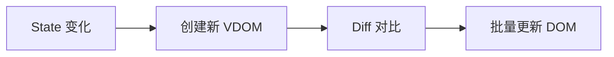
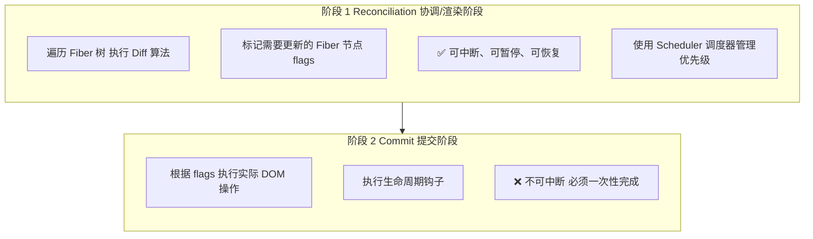
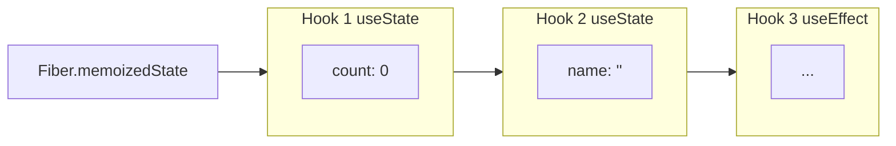
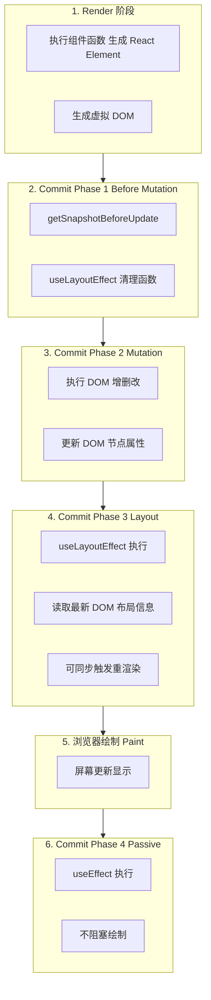
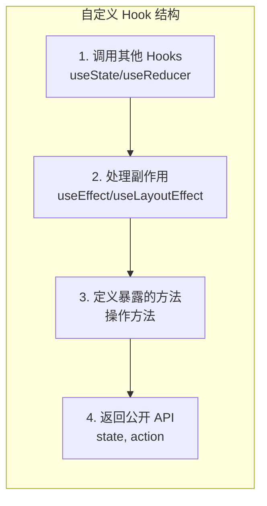
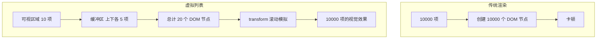
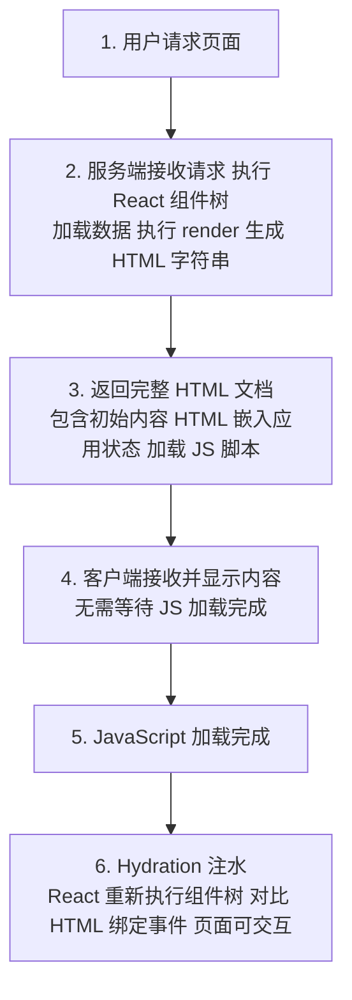
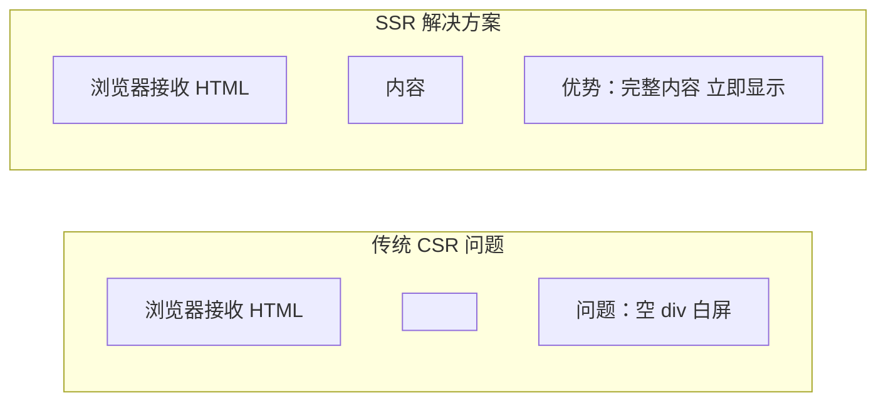

# React 核心知识体系

> 全面的 React 核心概念、组件模式、Hooks、状态管理与最佳实践指南
>
> **本文档特色：**
> - 每个核心概念包含「概念定义 + 工作原理 + 源码解析 + 代码示例 + 常见误区」
> - 深入 Fiber 架构、Hooks 链表、Diff 算法等底层原理
> - 结合官方文档与源码分析，提供深度技术洞察

---

## 目录

1. [React 概述](#1-react-概述)
   - [1.1 什么是 React](#11-什么是-react)
   - [1.2 React 版本演进](#12-react-版本演进)
   - [1.3 为什么选择 React](#13-为什么选择-react)
   - [1.4 React vs Vue vs 原生三件套](#14-react-vs-vue-vs-原生三件套)
2. [核心概念](#2-核心概念)
   - [2.1 JSX 语法](#21-jsx-语法)
   - [2.2 虚拟 DOM](#22-虚拟-dom-virtual-dom)
   - [2.3 Fiber 架构](#23-fiber-架构)
     - [2.3.4 调度器与批处理](#234-react-调度器与批处理机制)
   - [2.4 单向数据流](#24-单向数据流)
3. [组件模式](#3-组件模式)
4. [Hooks 核心](#4-hooks-核心)
5. [状态管理](#5-状态管理)
6. [路由系统](#6-路由系统)
7. [性能优化](#7-性能优化)
8. [服务端渲染与全栈开发](#8-服务端渲染与全栈开发)
9. [React 19 新特性](#9-react-19-新特性)
10. [最佳实践](#10-最佳实践)

---

## 1. React 概述

### 1.1 什么是 React

React 是由 Facebook 开源的用于构建用户界面的 JavaScript 库，采用组件化开发模式。

**核心价值：**
- **声明式编程**：描述 UI 应该是什么样，而非如何做
- **组件化**：可复用的 UI 构建块
- **单向数据流**：数据从父组件流向子组件，易于调试
- **虚拟 DOM**：高效的 DOM 更新机制

### 1.2 React 版本演进

| 版本 | 发布时间 | 核心特性 |
|------|----------|----------|
| React 16 | 2017 年 | Fiber 架构、Error Boundaries、Portals |
| React 16.8 | 2019 年 | Hooks 首次引入 |
| React 17 | 2020 年 | 事件系统重构、渐进式升级 |
| React 18 | 2022 年 | 并发模式、自动批处理、Suspense |
| React 19 | 2024 年 | Actions、Server Components、新 Hooks |

### 1.3 为什么选择 React

- **市场需求最大**：国内外一线互联网公司普遍使用
- **生态体系完善**：最丰富的第三方库和解决方案
- **跨平台能力**：React Native 可开发移动应用
- **技术深度足够**：深入学习可理解现代前端开发本质

### 1.4 React vs Vue vs 原生三件套

#### 综合对比表

| 对比维度 | 原生 (HTML/CSS/JS) | React | Vue |
|----------|-------------------|-------|-----|
| **学习曲线** | 基础必学，但构建大型应用需自己组织 | 较陡 - JSX、Hooks、函数式思维 | 平缓 - 模板接近 HTML，中文友好 |
| **数据绑定** | 手动 DOM 操作 | 单向数据流，受控组件 | 双向绑定 (v-model) |
| **模板语法** | 原生 HTML | JSX (JavaScript XML) | 类 HTML 模板 + 指令 |
| **状态管理** | 手动管理 | Redux/Zustand/Context | Pinia/Vuex (官方) |
| **路由** | 需手动实现 | React Router (第三方) | Vue Router (官方) |
| **性能优化** | 手动优化 | 虚拟 DOM + Fiber 并发 | 响应式 + 虚拟 DOM |
| **代码量** | 最多 | 中等偏多 | 较少 |
| **生态规模** | 最大 (所有库都支持) | 全球第一 | 国内活跃，全球第二 |
| **跨端能力** | Web only | React Native (强) | Uni-App/Weex (较弱) |
| **适用场景** | 简单静态页面/学习基础 | 大型复杂应用/跨端 | 中小型项目/快速开发 |

#### React vs Vue 核心差异

| 方面 | React | Vue |
|------|-------|-----|
| **哲学** | 配置优于约定 (极度灵活) | 约定优于配置 (开箱即用) |
| **JSX vs 模板** | JSX - 一切皆 JS，表达能力强 | 模板 - HTML 扩展，易上手 |
| **状态变更** | 不可变数据，set 触发更新 | Proxy 响应式，自动追踪 |
| **Hooks vs Options** | Hooks - 逻辑复用强，需理解闭包 | Options/Composition API - 直观 |
| **表单处理** | 受控组件 (手动) | v-model (自动双向绑定) |
| **官方支持** | Meta 支持，生态由社区主导 | 尤雨溪团队，核心生态官方维护 |

#### 何时选择哪个？

**选择 React 当：**
- 大型复杂应用，需要高度定制化
- 需要跨端开发 (React Native)
- 团队有函数式编程经验
- 追求全球生态和解决方案

**选择 Vue 当：**
- 快速原型开发/中小项目
- 团队新手较多，需要快速上手
- 国内项目，需要中文资料支持
- 追求开发效率和代码简洁

**选择原生当：**
- 简单静态页面
- 学习前端基础
- 极致性能要求 (无框架开销)
- 想深入理解框架底层

---

## 2. 核心概念

### 2.1 JSX 语法

**什么是 JSX？**

JSX（JavaScript XML）是 JavaScript 的语法扩展，允许在 JavaScript 中书写类似 HTML 的结构。JSX 不是必需的，但它是 React 推荐的语法，让 UI 结构更直观。

**JSX 的编译原理：**

JSX 代码会被 Babel 等编译器转换为 `React.createElement()` 调用。

```jsx
// JSX 代码
const element = <h1 id="title" className="header">Hello, React!</h1>;

// 编译后（React 17 之前）
const element = React.createElement(
  'h1',
  { id: 'title', className: 'header' },
  'Hello, React!'
);

// 编译后（React 17+，使用新的 JSX 转换）
import { jsx as _jsx } from 'react/jsx-runtime';
const element = _jsx('h1', {
  id: 'title',
  className: 'header',
  children: 'Hello, React!'
}, 'title');
```

**React.createElement 的作用：**

`React.createElement` 执行后返回一个**React 元素对象**（虚拟 DOM 节点），结构如下：

```javascript
{
  type: 'h1',           // 元素类型
  key: null,            // 用于列表优化的 key
  ref: null,            // 引用 DOM 的 ref
  props: {              // 所有属性和子元素
    id: 'title',
    className: 'header',
    children: 'Hello, React!'
  },
  _owner: null,         // 指向创建该元素的组件
  _store: {}            // 内部存储
}
```

**新 JSX 转换（React 17+）的实际意义：**

| 变化 | React 17 之前 | React 17+ |
|------|--------------|-----------|
| **传参方式** | `children` 作为独立第三个参数 | `children` 作为 `props` 的属性 |
| **import 要求** | 每个使用 JSX 的文件必须 `import React` | 不再需要，编译器自动注入 `react/jsx-runtime` |
| **调用函数** | `React.createElement(type, props, ...children)` | `_jsx(type, { ...props, children }, key)` |

```jsx
// React 17 之前：必须 import React
import React from 'react';
function App() { return <h1>Hello</h1>; }

// React 17+：不需要 import React
function App() { return <h1>Hello</h1>; }
```

**JSX 规则与注意事项：**

| 规则 | 说明 | 示例 |
|------|------|------|
| 根元素 | 必须有一个根元素（或使用 `<>...</>` Fragment） | `<><Child1 /><Child2 /></>` |
| className | 使用 `className` 替代 `class` | `<div className="app">` |
| htmlFor | 使用 `htmlFor` 替代 `for` | `<label htmlFor="name">` |
| 自闭合标签 | 必须显式闭合 | ``、`<input />` |
| 事件命名 | 使用驼峰命名 | `onClick`、`onChange` |
| 插值表达式 | 使用 `{}` 包裹 JavaScript 表达式 | `<h1>{title}</h1>` |

**常见误区：**

```jsx
// ❌ 错误：在循环/条件中调用 Hooks
function MyComponent({ items }) {
  if (items.length > 0) {
    const [count, setCount] = useState(0); // 错误！
  }
}

// ✅ 正确：Hooks 必须在顶层调用
function MyComponent({ items }) {
  const [count, setCount] = useState(0);

  if (items.length > 0) {
    // 可以在条件中使用状态
  }
}
```

---

### 2.2 虚拟 DOM (Virtual DOM)

**什么是虚拟 DOM？**

虚拟 DOM 是一个**轻量级的 JavaScript 对象**，用于描述真实 DOM 的结构。它是真实 DOM 的抽象表示，React 通过操作虚拟 DOM 来减少昂贵的真实 DOM 操作。

**为什么需要虚拟 DOM？**

1. **DOM 操作性能昂贵**：每次真实 DOM 操作都可能触发浏览器的重排（Reflow）和重绘（Repaint）
2. **批量更新**：虚拟 DOM 允许 React 在内存中计算差异，然后批量更新真实 DOM
3. **跨平台抽象**：虚拟 DOM 提供了一层抽象，使 React 可以渲染到 Web、Native、Canvas 等不同平台

**虚拟 DOM 的工作流程：**



**虚拟 DOM 的结构（简化版）：**

```javascript
// 对应 <div id="app"><span>Hello</span></div>
const vnode = {
  type: 'div',                    // 元素类型
  props: {
    id: 'app',
    onClick: handleClick,         // React 合成事件
    children: [
      {
        type: 'span',
        props: {},
        children: ['Hello']
      }
    ]
  },
  key: null,                      // 列表优化标识
  _dom: null                      // 关联的真实 DOM 节点（渲染后）
};
```

**Diff 算法核心策略：**

React 将 Diff 算法优化到 O(n) 时间复杂度，基于以下三个策略：

| 策略 | 说明 | 示例 |
|------|------|------|
| **Tree Diff** | 只对同级元素进行比较，忽略跨层级移动 | 子节点跨层级移动会被删除后重新创建 |
| **Component Diff** | 不同类型组件产生不同的树结构，直接替换 | `div` 变 `p` 会替换整棵树 |
| **Element Diff** | 同层级子节点通过 `key` 标识稳定节点 | 列表项必须有唯一的 key |

**Tree Diff 示例：**

```
旧树                    新树
root                    root
├── A                   ├── B
│   └── C               │   └── D
└── B                       └── E

// React 的处理方式：
// 不会将 A 移动到 B 下，而是：
// 1. 删除 A 节点及其子树
// 2. 在 root 下创建 B 节点
```

**常见误区：**

```jsx
// ❌ 错误：使用索引作为 key（当列表顺序可能变化时）
{items.map((item, index) => (
  <ListItem key={index} data={item} />
))}

// ✅ 正确：使用稳定的唯一标识
{items.map((item) => (
  <ListItem key={item.id} data={item} />
))}
```

---

### 2.3 Fiber 架构

**什么是 Fiber？**

Fiber 是 React 16 引入的全新架构，它将渲染任务拆分为多个可中断、可恢复的小单元，实现了**并发渲染**能力。

**为什么需要 Fiber？**

在 React 15 及之前，更新过程是**同步递归**的，一旦开始就无法中断：

```
组件树深度很深时的问题：
递归更新 → 主线程被占用 → 用户输入无法响应 → 页面卡顿
```

Fiber 通过将递归改为**可中断的循环遍历**，解决了这个问题。

**Fiber 的数据结构：**

每个组件对应一个 Fiber 节点，结构如下：

```typescript
interface FiberNode {
  // 节点基本信息
  type: any;              // 组件类型（函数组件、类组件、DOM 元素）
  key: string | null;     // key 属性
  props: any;             // props

  // 树形结构（链表）
  child: FiberNode | null;    // 第一个子节点
  sibling: FiberNode | null;  // 下一个兄弟节点
  return: FiberNode | null;   // 父节点

  // 状态相关
  stateNode: any;         // 对应的 DOM 节点或组件实例
  memoizedState: any;     // 存储的状态（Hooks 的状态）
  memoizedProps: any;     // 存储的 props

  // 工作相关
  flags: number;          // 副作用标记（插入、更新、删除）
  updateQueue: any;       // 更新队列
  alternate: FiberNode | null; // 指向另一个 Fiber（current 和 workInProgress）

  // Hooks 相关
  hooks: Hook | null;     // Hooks 链表
}
```

**Fiber 树的双缓冲机制：**

React 维护两棵 Fiber 树：

```
Current Tree（当前屏幕显示）    WorkInProgress Tree（内存中构建）
      ↓                              ↓
   旧状态                      新状态（正在计算）

渲染完成后，WorkInProgress 树替换 Current 树
```

**Fiber 的工作阶段：**

**为什么 Reconciliation 可中断而 Commit 不可中断？**

| 阶段 | 是否可中断 | 原因 |
|------|-----------|------|
| **Reconciliation** | ✅ 可中断 | 只在内存中计算 Diff，不影响 UI，随时可以暂停恢复 |
| **Commit** | ❌ 不可中断 | 必须保证原子性，原因见下 |

**Commit 阶段不能被打断的三个原因：**

| 原因 | 说明 |
|------|------|
| **UI 一致性** | Commit 可能同时操作多个 DOM 节点，中途停止会导致页面处于"半更新"状态（旧已删，新未上），用户看到闪烁 |
| **状态同步** | `memoizedState` 和 `memoizedProps` 在 Commit 阶段才更新为最新值，打断会导致 Fiber 树状态不一致 |
| **事件监听** | Commit 完成后才会切换引用指针，如果中途插入新事件，可能读到旧状态 |

简单说：Reconciliation 可以"算到一半不算了"，但 Commit 必须"一口气干完"。



**时间切片（Time Slicing）：**

Fiber 将渲染任务拆分成小单元，在浏览器空闲时执行：

```javascript
// 简化的 workLoop
function workLoop(deadline) {
  let shouldYield = false;

  while (nextUnitOfWork && !shouldYield) {
    // 执行一个 Fiber 节点的工作
    nextUnitOfWork = performUnitOfWork(nextUnitOfWork);

    // 检查是否还有剩余时间
    shouldYield = deadline.timeRemaining() <= 0;
  }

  // 如果还有未完成的工作，请求下一个空闲时间继续
  if (nextUnitOfWork) {
    requestIdleCallback(workLoop);
  }
}
```

---

### 2.3.4 React 调度器与批处理机制

#### 一、调度器优先级系统

**核心机制：**

React 调度器通过 `MessageChannel`（宏任务）实现，内部维护 5 级优先级队列：

| 优先级 | 名称 | 超时时间 | 触发场景 |
|--------|------|----------|----------|
| **1** | Immediate | -1ms（立即） | 用户输入（onClick、onChange） |
| **2** | UserBlocking | 250ms | 滚动、拖拽、动画 |
| **3** | Normal | 5000ms | 普通数据更新、setState |
| **4** | Low | 10000ms | 日志上报、分析 |
| **5** | Idle | 无限 | 后台预渲染、闲置任务 |

**为什么 React 用 MessageChannel 而不是 setTimeout 或 Promise？**

`MessageChannel` 本身并不具备优先级机制，React 的优先级队列是在其之上自行实现的调度器逻辑。选择它是因为它在浏览器事件循环中的**时机最优**：

```
事件循环中执行顺序：
同步代码 → 微任务队列(Promise) → 渲染 → 宏任务队列(setTimeout/MessageChannel) → 下一帧
```

| 方案 | 问题 |
|------|------|
| `setTimeout(fn, 0)` | **最小延迟 4ms**（HTML 规范规定），对于 16ms 的帧预算太慢 |
| `Promise.then()` | 微任务优先级太高，会阻塞渲染，浏览器得不到绘制机会，UI 卡死 |
| `MessageChannel` | **延迟几乎为 0**，且作为宏任务，执行完一个后浏览器可以处理输入和重绘 |

**核心总结：** MessageChannel 不是"有优先级"，而是**延迟最低且不会阻塞渲染**。优先级是 React Scheduler 自己用优先队列实现的。

**关键特性：**

```
1. 高优先级任务可以打断低优先级任务（可中断渲染）
2. 低优先级任务过期后自动升级（防止饿死）
3. Fiber 计算的优先级取决于触发任务类型
```

**示例：**

```jsx
// 高优先级：立即响应
<button onClick={() => setCount(c => c + 1)} />

// 低优先级：可延迟渲染
startTransition(() => {
  setSearchResults(results);
});

// 动态优先级提升
// 任务等待超过超时时间 → 优先级自动提升至最高
```

---

#### 二、批处理（Batching）机制

**三个层次：**

```
┌─────────────────────────────────────────────┐
│ Layer 1: 状态批处理                         │
│ - 同一事件中的多次 setState 合并为一次更新  │
├─────────────────────────────────────────────┤
│ Layer 2: Fiber 批处理                       │
│ - 多个组件更新合并为一次 Reconciliation     │
│ - 从根 Fiber 遍历整树，统一标记 flags       │
├─────────────────────────────────────────────┤
│ Layer 3: Commit 批处理                      │
│ - 所有 DOM 操作一次性执行                   │
│ - 插入、更新、删除批量应用                  │
└─────────────────────────────────────────────┘
```

**完整流程：**

```
用户点击
   ↓
setCount(1) → 更新入队
setName('New') → 更新入队
   ↓
事件处理结束 → 批处理触发
   ↓
Reconciliation（遍历整树，标记 flags）
   ↓
Commit（一次性执行所有 DOM 操作）
   ↓
一次渲染完成
```

**React 18 自动批处理：**

| 场景 | React 17 | React 18+ |
|------|----------|-----------|
| 事件处理器 | ✅ 批处理 | ✅ 批处理 |
| setTimeout | ❌ 不批处理 | ✅ 自动批处理 |
| Promise.then | ❌ 不批处理 | ✅ 自动批处理 |
| 原生事件监听器 | ❌ 不批处理 | ✅ 自动批处理 |

```jsx
// React 18+: 以下场景都只触发 1 次渲染

// 异步回调也批处理
setTimeout(() => {
  setCount(1);
  setName('New');
}, 1000);

// Promise 也批处理
Promise.resolve().then(() => {
  setCount(1);
  setName('New');
});
```

---

### 2.3.5 Fiber 架构总结

| 特性 | 说明 |
|------|------|
| **核心思想** | 将渲染任务拆分为可中断、可恢复的小单元 |
| **数据结构** | 链表 Fiber 节点（替代递归树） |
| **双缓冲** | Current 树 + WorkInProgress 树 |
| **两阶段** | Reconciliation（可中断）→ Commit（不可中断） |
| **调度器** | MessageChannel + 5 级优先级队列 |
| **批处理** | 状态 → Fiber → DOM 三层批处理 |
| **优势** | 不阻塞主线程、支持优先级调度、用户体验流畅 |

---

### 2.4 单向数据流

**概念定义：**

单向数据流（Unidirectional Data Flow）是 React 的核心设计模式，指数据在组件树中**自上而下**传递，从父组件流向子组件。

**工作原理：**

```
    父组件 (state)
       ↓ props
    子组件
       ↓ props
    孙组件
```

1. 状态（state）存储在父组件中
2. 通过 props 将数据和回调函数传递给子组件
3. 子组件通过回调函数通知父组件更新状态
4. 父组件状态更新后，新 props 重新流向子组件

**代码示例：**

```jsx
// 父组件 - 状态所有者
function Parent() {
  const [count, setCount] = useState(0);

  // 通过 props 传递数据和更新方法
  return (
    <div>
      <p>父组件计数：{count}</p>
      <Child count={count} onIncrement={() => setCount(count + 1)} />
    </div>
  );
}

// 子组件 - 接收 props
function Child({ count, onIncrement }) {
  return (
    <div>
      <p>子组件计数：{count}</p>
      <button onClick={onIncrement}>增加</button>
    </div>
  );
}
```

**为什么采用单向数据流？**

| 优势 | 说明 |
|------|------|
| 可预测性 | 数据流向清晰，易于追踪状态变化 |
| 调试简单 | 问题定位容易，只需向上查找状态来源 |
| 组件解耦 | 子组件不直接修改数据，通过回调通知父组件 |
| 可维护性 | 避免多个组件同时修改同一状态导致的冲突 |

**常见误区：**

```jsx
// ❌ 错误：子组件直接修改父组件的 state
function Child({ user }) {
  const handleUpdate = () => {
    user.name = 'New Name'; // 直接修改 props
  };
}

// ✅ 正确：通过回调函数通知父组件更新
function Child({ user, onUpdateUser }) {
  const handleUpdate = () => {
    onUpdateUser({ ...user, name: 'New Name' });
  };
}
```

**状态提升（Lifting State Up）：**

当多个子组件需要共享同一状态时，将状态提升到它们最近的共同父组件中：

```jsx
// 状态提升前：两个 Input 组件状态不同步
function Parent() {
  return (
    <>
      <Input />
      <Input />
    </>
  );
}

// 状态提升后：共享同一状态
function Parent() {
  const [value, setValue] = useState('');
  return (
    <>
      <Input value={value} onChange={setValue} />
      <Input value={value} onChange={setValue} />
    </>
  );
}
```

---

## 3. 组件模式

### 3.1 函数组件

函数组件是 React 推荐的组件编写方式。

```jsx
function Greeting({ name, age }) {
  return <h1>你好，{name}，今年{age}岁</h1>;
}

// 或使用箭头函数
const Greeting = ({ name, age }) => (
  <h1>你好，{name}，今年{age}岁</h1>
);
```

### 3.2 类组件

类组件在 React 16.8 之前是主要形式，现在推荐使用函数组件。

```jsx
class Greeting extends React.Component {
  constructor(props) {
    super(props);
    this.state = { count: 0 };
  }

  render() {
    return <h1>{this.props.name}</h1>;
  }
}
```

### 3.3 受控组件与非受控组件

```jsx
// 受控组件（推荐）
function ControlledForm() {
  const [value, setValue] = useState('');
  return (
    <input
      value={value}
      onChange={(e) => setValue(e.target.value)}
    />
  );
}

// 非受控组件（使用 ref）
function UncontrolledForm() {
  const inputRef = useRef(null);
  const handleSubmit = () => {
    console.log(inputRef.current.value);
  };
  return <input ref={inputRef} />;
}
```

**受控组件 vs 非受控组件多维度对比：**

| 对比维度 | 受控组件 | 非受控组件 |
|----------|---------|-----------|
| **值的管理方** | React state | DOM 自身 |
| **值来源** | `value` + `onChange` | `useRef` 直接读取 |
| **实时性** | 每次输入都触发更新 | 提交/读取时才获取 |
| **表单校验** | 支持实时校验 | 只能在提交时校验 |
| **性能开销** | 每次输入触发重渲染 | 无重渲染开销 |
| **适用场景** | 实时校验、联动逻辑、复杂表单 | 文件上传、大量输入框、集成第三方 DOM 库 |
| **必须使用的场景** | — | `<input type="file">`（value 只读）、富文本编辑器 |

**核心原则：**
- 受控组件：React 管理值 → 适合需要知道"值"的场景
- 非受控组件：DOM 自己管理值 → 适合"用完即走"的场景

### 3.4 高阶组件 (HOC)

```jsx
// 高阶组件：接收组件，返回新组件
function withLogging(WrappedComponent) {
  return function LoggedComponent(props) {
    useEffect(() => {
      console.log(`${WrappedComponent.name} 渲染了`);
    });
    return <WrappedComponent {...props} />;
  };
}

// 使用
const EnhancedButton = withLogging(Button);
```

### 3.5 复合组件模式

```jsx
// 父组件
function Select({ children, value, onChange }) {
  return (
    <div className="select">
      {React.Children.map(children, child =>
        React.cloneElement(child, { value, onChange })
      )}
    </div>
  );
}

// 子组件
function Option({ value, onChange, children }) {
  return (
    <div onClick={() => onChange(value)}>
      {children}
    </div>
  );
}

// 组合使用
<Select value="a" onChange={setValue}>
  <Option value="a">选项 A</Option>
  <Option value="b">选项 B</Option>
</Select>
```

### 3.6 Render Props 模式

```jsx
function MouseTracker({ render }) {
  const [position, setPosition] = useState({ x: 0, y: 0 });

  useEffect(() => {
    const handleMove = (e) => {
      setPosition({ x: e.clientX, y: e.clientY });
    };
    window.addEventListener('mousemove', handleMove);
    return () => window.removeEventListener('mousemove', handleMove);
  }, []);

  return render(position);
}

// 使用
<MouseTracker render={({ x, y }) => (
  <p>鼠标位置：{x}, {y}</p>
)} />
```

---

## 4. Hooks 核心

### 4.1 useState - 状态管理

**什么是 useState？**

`useState` 是 React 提供的基础 Hook，用于在函数组件中添加局部状态。

**基本用法：**

```jsx
const [count, setCount] = useState(0);
```

**底层原理：Hooks 链表**

React 在内部为每个函数组件维护一个**Hooks 链表**，存储在组件 Fiber 节点的 `memoizedState` 属性中。

```typescript
// Hook 节点结构（简化版）
interface Hook {
  memoizedState: any;      // 当前状态值
  baseState: any;          // 基础状态值
  baseQueue: Update[];     // 更新队列
  queue: Update[];         // 当前 Hook 的更新队列
  next: Hook | null;       // 指向下一个 Hook（形成链表）
}

// Fiber 节点结构
interface FiberNode {
  memoizedState: Hook;     // Hooks 链表头节点
  // ... 其他属性
}
```

**Hooks 链表示意图：**



**useState 的工作原理：**

```javascript
// 简化的 useState 实现
function useState(initialState) {
  // 1. 获取当前 Hook 节点（按调用顺序从链表中获取）
  const hook = getCurrentHookNode();

  // 2. 首次渲染时初始化状态
  if (hook.memoizedState === null) {
    hook.memoizedState = initialState;
    hook.baseState = initialState;
    hook.queue = [];
  }

  // 3. 创建 setState 函数
  const setState = (newState) => {
    // 将更新推入队列
    hook.queue.push(newState);
    // 触发重渲染
    scheduleRender();
  };

  // 4. 返回 [状态值，更新函数]
  return [hook.memoizedState, setState];
}
```

**状态更新流程：**

```
调用 setCount(1)
       ↓
更新进入 queue 队列
       ↓
scheduleRender() 触发重渲染
       ↓
Reconciliation 阶段：处理更新队列
       ↓
计算新状态：baseState + 所有更新
       ↓
更新 memoizedState
       ↓
Commit 阶段：UI 更新
```

**为什么 Hooks 必须在顶层调用？**

因为 React 依赖**调用顺序**来关联状态：

```javascript
// ❌ 错误：条件调用导致链表错位
function MyComponent({ condition }) {
  const [a, setA] = useState(0);  // Hook 1

  if (condition) {
    const [b, setB] = useState(1); // Hook 2（有时存在，有时不存在）
  }

  const [c, setC] = useState(2);  // Hook 3（实际可能是 Hook 2 或 Hook 3）
}

// 首次渲染（condition = false）：链表 [Hook1, Hook3]
// 第二次渲染（condition = true）：链表 [Hook1, Hook2, Hook3]
// → c 的状态会错乱！
```

**批量更新与函数式更新：**

```jsx
// 批量更新：React 会合并同一批次的 setState 调用
setCount(1);
setCount(2);
setCount(3);
// 最终 count = 3（不是 1+2+3）

// 函数式更新：基于前一个状态计算
setCount(prev => prev + 1); // 每次都在最新状态基础上 +1
```

**常见误区：**

```jsx
// ❌ 错误：闭包陷阱
function Counter() {
  const [count, setCount] = useState(0);

  const handleIncrement = () => {
    setTimeout(() => {
      setCount(count + 1); // 这里的 count 是旧的（闭包中的值）
    }, 1000);
  };

  return <button onClick={handleIncrement}>{count}</button>;
}

// ✅ 正确：使用函数式更新
function Counter() {
  const [count, setCount] = useState(0);

  const handleIncrement = () => {
    setTimeout(() => {
      setCount(prev => prev + 1); // 总是基于最新状态
    }, 1000);
  };

  return <button onClick={handleIncrement}>{count}</button>;
}
```

---

### 4.2 useEffect - 副作用处理

**什么是 useEffect？**

`useEffect` 用于在函数组件中执行副作用操作，如数据获取、DOM 操作、订阅等。它相当于类组件中 `componentDidMount`、`componentDidUpdate` 和 `componentWillUnmount` 的组合。

**基本用法：**

```jsx
useEffect(() => {
  // 副作用操作
  document.title = `计数：${count}`;

  // 清理函数（可选）
  return () => {
    console.log('清理副作用');
  };
}, [count]); // 依赖数组
```

**底层原理：Effect 链表**

`useEffect` 创建的 Effect Hook 也存储在 Hooks 链表中：

```typescript
interface EffectHook {
  memoizedState: {
    create: () => void;     // effect 创建函数
    destroy: () => void;    // 清理函数
    deps: DependencyList;   // 依赖数组
    next: EffectHook;       // 指向下一个 Effect
  };
  queue: Update[];
}
```

**执行时机：**

```
渲染阶段（Render）
  ↓
提交阶段 - Before Mutation（DOM 操作前）
  ↓
提交阶段 - Mutation（操作 DOM）
  ↓
提交阶段 - Layout（useLayoutEffect 执行）
  ↓
浏览器绘制完成
  ↓
useEffect 异步执行 ← 不阻塞渲染
```

**依赖数组对比算法：**

```javascript
// React 内部使用 Object.is 进行浅比较
function areHookInputsEqual(nextDeps, prevDeps) {
  for (let i = 0; i < prevDeps.length; i++) {
    if (!Object.is(nextDeps[i], prevDeps[i])) {
      return false;
    }
  }
  return true;
}

// 依赖未变化 → 跳过执行
// 依赖变化 → 先执行清理函数，再执行 effect
```

**常见误区：**

```jsx
// ❌ 错误：遗漏依赖项
function MyComponent({ userId }) {
  useEffect(() => {
    fetchUser(userId); // userId 变化时不会重新执行
  }, []); // 应该包含 userId
}

// ✅ 正确：完整的依赖数组
function MyComponent({ userId }) {
  useEffect(() => {
    fetchUser(userId);
  }, [userId]);
}

// ❌ 错误：在 effect 中直接修改引用对象
function MyComponent() {
  const [obj, setObj] = useState({ count: 0 });

  useEffect(() => {
    obj.count++; // 直接修改对象，不会触发更新
  }, [obj]);
}

// ✅ 正确：创建新对象
function MyComponent() {
  const [obj, setObj] = useState({ count: 0 });

  useEffect(() => {
    setObj(prev => ({ ...prev, count: prev.count + 1 }));
  }, []);
}
```

---

### 4.3 useContext - 共享状态

**什么是 useContext？**

`useContext` 用于在函数组件中订阅 React Context，避免多层组件传递 props（Prop Drilling）。

**基本用法：**

```jsx
// 1. 创建 Context
const ThemeContext = createContext('light');

// 2. 提供 Context
function App() {
  return (
    <ThemeContext.Provider value="dark">
      <Toolbar />
    </ThemeContext.Provider>
  );
}

// 3. 消费 Context
function Toolbar() {
  const theme = useContext(ThemeContext);
  return <div>当前主题：{theme}</div>;
}
```

**底层原理：Context 链表遍历**

React 使用**发布 - 订阅模式**实现 Context，通过 Fiber 树的上下文链传递数据。

```typescript
// Context 对象结构
interface ReactContext<T> {
  $$typeof: Symbol;
  _currentValue: T;           // 当前值
  Provider: ReactProvider<T>; // Provider 组件
  Consumer: ReactConsumer<T>; // Consumer 组件
}

// Provider 组件结构
interface ReactProvider<T> {
  $$typeof: Symbol;
  _context: ReactContext<T>;  // 指向对应的 Context
}
```

**Context 值查找过程：**

```javascript
// 简化的 useContext 实现
function useContext(Context) {
  // 1. 获取当前 Fiber 节点
  const fiber = getCurrentFiber();

  // 2. 向上遍历 Provider 链，找到最近的 Provider 值
  let provider = fiber.return;
  while (provider) {
    if (provider.type === Context.Provider) {
      return provider.memoizedProps.value;
    }
    provider = provider.return;
  }

  // 3. 没有找到 Provider，返回默认值
  return Context._currentValue;
}
```

**Context 更新流程：**

```
Context.Provider 的 value 变化
       ↓
标记所有消费该 Context 的组件为「需要更新」
       ↓
将更新添加到更新队列
       ↓
调度器安排更新
       ↓
重新渲染受影响的组件
```

**性能注意事项：**

```jsx
// ❌ 问题：Provider 值变化会导致所有 Consumer 重渲染
function App() {
  const [user, setUser] = useState({ name: '', age: 0 });
  const [theme, setTheme] = useState('light');

  // 所有值放在一个 Context 中
  return (
    <AppContext.Provider value={{ user, theme, setUser, setTheme }}>
      <Child />
    </AppContext.Provider>
  );
}

// ✅ 解决：拆分 Context，减少不必要的重渲染
function App() {
  const [user, setUser] = useState({ name: '', age: 0 });
  const [theme, setTheme] = useState('light');

  return (
    <UserContext.Provider value={{ user, setUser }}>
      <ThemeContext.Provider value={{ theme, setTheme }}>
        <Child />
      </ThemeContext.Provider>
    </UserContext.Provider>
  );
}
```

---

### 4.4 useReducer - 复杂状态管理

**什么是 useReducer？**

`useReducer` 是 useState 的替代方案，用于管理复杂的状态逻辑。它基于 Redux 的设计思想，通过 reducer 函数描述状态如何变化。

**基本用法：**

```jsx
const initialState = { count: 0 };

function reducer(state, action) {
  switch (action.type) {
    case 'increment':
      return { count: state.count + 1 };
    case 'decrement':
      return { count: state.count - 1 };
    default:
      throw new Error('Unknown action');
  }
}

function Counter() {
  const [state, dispatch] = useReducer(reducer, initialState);
  return (
    <div>
      Count: {state.count}
      <button onClick={() => dispatch({ type: 'increment' })}>+</button>
    </div>
  );
}
```

**底层原理：更新队列处理**

```typescript
// Reducer Hook 结构
interface ReducerHook {
  memoizedState: any;         // 当前状态
  queue: DispatchQueue;       // dispatch 队列
  next: Hook | null;
}

// 简化的 useReducer 实现
function useReducer(reducer, initialState) {
  const hook = getCurrentHookNode();

  // 首次渲染时初始化状态
  if (hook.memoizedState === null) {
    hook.memoizedState = initialState;
    hook.queue = [];
  }

  // 创建 dispatch 函数
  const dispatch = (action) => {
    // 将 action 添加到队列
    hook.queue.push(action);
    // 触发重渲染
    scheduleRender();
  };

  // 处理队列中的所有 action
  hook.queue.forEach(action => {
    hook.memoizedState = reducer(hook.memoizedState, action);
  });
  hook.queue = [];

  return [hook.memoizedState, dispatch];
}
```

**useReducer vs useState：**

| 特性 | useState | useReducer |
|------|----------|------------|
| 状态复杂度 | 简单状态（数字、字符串） | 复杂对象、嵌套结构 |
| 更新逻辑 | 直接设置 | 通过 action 描述变化 |
| 代码量 | 少 | 较多（需要定义 reducer） |
| 适用场景 | 独立状态 | 状态之间有关联 |

**使用场景示例：**

```jsx
// ✅ 适合使用 useReducer 的场景：复杂表单状态
const formInitialState = {
  values: { name: '', email: '' },
  errors: {},
  isSubmitting: false,
  submitCount: 0
};

function formReducer(state, action) {
  switch (action.type) {
    case 'SET_FIELD':
      return {
        ...state,
        values: { ...state.values, [action.field]: action.value }
      };
    case 'SET_ERROR':
      return { ...state, errors: { ...state.errors, [action.field]: action.error } };
    case 'SET_SUBMITTING':
      return { ...state, isSubmitting: action.value };
    case 'INCREMENT_SUBMIT':
      return { ...state, submitCount: state.submitCount + 1 };
    default:
      return state;
  }
}

function Form() {
  const [state, dispatch] = useReducer(formReducer, formInitialState);
  // ...
}
```

---

### 4.5 useCallback - 缓存函数

**什么是 useCallback？**

`useCallback` 用于缓存函数引用，避免每次渲染时创建新的函数对象。它与 `React.memo` 配合使用，可避免子组件不必要的重渲染。

**基本用法：**

```jsx
const handleClick = useCallback(() => {
  console.log('Button clicked');
}, []);
```

**底层原理：**

`useCallback` 内部使用与 `useState` 相同的链表机制，不同之处在于它存储的是函数引用和依赖数组。

```typescript
// useCallback 的 Hook 结构
interface CallbackHook {
  memoizedState: Function;     // 缓存的函数
  deps: DependencyList | null; // 依赖数组
  next: Hook | null;
}

// 简化的实现
function useCallback(callback, deps) {
  const hook = getCurrentHookNode();

  // 首次渲染或依赖变化时更新
  if (hook.memoizedState === null || !areDepsEqual(hook.deps, deps)) {
    hook.memoizedState = callback;
    hook.deps = deps;
  }

  // 返回缓存的函数
  return hook.memoizedState;
}
```

**为什么需要 useCallback？**

```jsx
// ❌ 问题：父组件渲染时创建新函数，导致子组件重渲染
function Parent() {
  const [count, setCount] = useState(0);
  const handleClick = () => {
    console.log('Clicked');
  };

  return (
    <div>
      <Child onClick={handleClick} />
      <button onClick={() => setCount(count + 1)}>增加</button>
    </div>
  );
}

const Child = React.memo(({ onClick }) => {
  console.log('Child rendered');
  return <button onClick={onClick}>点击</button>;
});

// 问题：即使 Child 的 props 没变，handleClick 是新函数引用，导致重渲染

// ✅ 解决：使用 useCallback 缓存函数引用
function Parent() {
  const [count, setCount] = useState(0);
  const handleClick = useCallback(() => {
    console.log('Clicked');
  }, []); // 空依赖，函数引用永不改变

  return (
    <div>
      <Child onClick={handleClick} />
      <button onClick={() => setCount(count + 1)}>增加</button>
    </div>
  );
}
```

**常见误区：**

```jsx
// ❌ 错误：过度使用 useCallback
function MyComponent() {
  const simpleFunc = useCallback(() => {
    return 1 + 1;
  }, []);
  // 简单函数不需要缓存，直接定义即可
}

// ✅ 正确：只在必要时使用
// - 传递给 React.memo 包裹的子组件
// - 作为 useEffect/useMemo 的依赖
// - 函数创建成本高
```

---

### 4.6 useMemo - 缓存计算结果

**什么是 useMemo？**

`useMemo` 用于缓存复杂计算的结果，只有当依赖项变化时才重新计算。

**基本用法：**

```jsx
const total = useMemo(() => {
  return items.reduce((acc, item) => acc + item.value, 0);
}, [items]);
```

**底层原理：**

`useMemo` 与 `useCallback` 的实现非常相似，区别在于它存储的是计算结果而非函数。

```typescript
// useMemo 的 Hook 结构
interface MemoHook {
  memoizedState: any;          // 缓存的计算结果
  deps: DependencyList | null; // 依赖数组
  next: Hook | null;
}

// 简化的实现
function useMemo(create, deps) {
  const hook = getCurrentHookNode();

  // 首次渲染或依赖变化时重新计算
  if (hook.memoizedState === null || !areDepsEqual(hook.deps, deps)) {
    hook.memoizedState = create();
    hook.deps = deps;
  }

  return hook.memoizedState;
}
```

**使用场景：**

```jsx
// ✅ 适合使用 useMemo 的场景

// 1. 复杂计算
function ExpensiveComponent({ items }) {
  const total = useMemo(() => {
    console.log('计算总数...');
    return items.reduce((acc, item) => acc + item.value, 0);
  }, [items]);

  return <div>总计：{total}</div>;
}

// 2. 创建对象/数组（避免子组件不必要的重渲染）
function Parent({ userId }) {
  const config = useMemo(() => ({ userId, theme: 'dark' }), [userId]);
  return <Child config={config} />;
}

// ❌ 不适合使用 useMemo 的场景

// 简单计算不需要缓存
function SimpleComponent({ a, b }) {
  const sum = a + b; // 直接计算，不需要 useMemo
  return <div>{sum}</div>;
}
```

---

### 4.7 useRef - DOM 引用与可变值

**什么是 useRef？**

`useRef` 返回一个可变的 ref 对象，其 `.current` 属性被初始化为传入的参数。ref 对象在组件的整个生命周期内持续存在，不会触发重新渲染。

**两种使用场景：**

```jsx
// 场景 1：访问 DOM
function TextInput() {
  const inputRef = useRef(null);

  const focusInput = () => {
    inputRef.current?.focus();
  };

  return <input ref={inputRef} />;
}

// 场景 2：存储可变值（不触发重新渲染）
function Timer() {
  const intervalRef = useRef(null);
  const countRef = useRef(0);

  useEffect(() => {
    intervalRef.current = setInterval(() => {
      countRef.current += 1;
      console.log(`Count: ${countRef.current}`);
    }, 1000);

    return () => clearInterval(intervalRef.current);
  }, []);

  return null;
}
```

**底层原理：可变对象引用**

```typescript
// useRef 的 Hook 结构
interface RefHook {
  memoizedState: { current: any }; // ref 对象
  next: Hook | null;
}

// 简化的 useRef 实现
function useRef(initialValue) {
  const hook = getCurrentHookNode();

  // 首次渲染时创建 ref 对象
  if (hook.memoizedState === null) {
    hook.memoizedState = { current: initialValue };
  }

  // 返回同一个 ref 对象
  return hook.memoizedState;
}
```

**useRef vs useState：**

| 特性 | useRef | useState |
|------|--------|----------|
| 触发重渲染 | ❌ 否 | ✅ 是 |
| 更新方式 | 直接修改 `.current` | 通过 setter 函数 |
| 适用场景 | DOM 引用、定时器、不触发 UI 的状态 | 需要触发 UI 更新的状态 |

**常见误区：**

```jsx
// ❌ 错误：期望 useRef 触发重渲染
function Counter() {
  const countRef = useRef(0);

  const handleClick = () => {
    countRef.current += 1;
    // UI 不会更新！
  };

  return <button onClick={handleClick}>Count: {countRef.current}</button>;
}

// ✅ 正确：使用 useState 触发重渲染
function Counter() {
  const [count, setCount] = useState(0);

  const handleClick = () => {
    setCount(c => c + 1);
  };

  return <button onClick={handleClick}>Count: {count}</button>;
}

// ✅ 正确：useRef 用于不触发 UI 的场景
function Timer() {
  const [elapsed, setElapsed] = useState(0);
  const intervalRef = useRef(null);

  const startTimer = () => {
    intervalRef.current = setInterval(() => {
      setElapsed(e => e + 1); // 只有 setElapsed 触发重渲染
    }, 1000);
  };

  const stopTimer = () => {
    clearInterval(intervalRef.current); // ref 修改不触发重渲染
  };

  return <div>{elapsed}秒</div>;
}
```

---

### 4.8 useLayoutEffect - 同步副作用

**什么是 useLayoutEffect？**

`useLayoutEffect` 的函数签名与 `useEffect` 相同，但它会在所有的 DOM 变更之后**同步**调用 effect 函数，在浏览器执行绘制之前完成副作用操作。

**为什么需要 useLayoutEffect？**

useEffect 在浏览器绘制后**异步**执行，而 useLayoutEffect 在 DOM 更新后、浏览器绘制前**同步**执行。这个时机差异决定了它们的使用场景。

**执行时机对比：**



**useLayoutEffect vs useEffect 对比表：**

| 特性 | useLayoutEffect | useEffect |
|------|-----------------|-----------|
| 执行时机 | DOM 变更后、浏览器绘制前 | 浏览器绘制后 |
| 执行方式 | 同步（阻塞） | 异步（非阻塞） |
| 是否阻塞渲染 | ✅ 是 | ❌ 否 |
| 读取 DOM 布局 | ✅ 准确（最新布局） | ⚠️ 可能过时 |
| 触发重渲染 | ✅ 会同步触发 | ⚠️ 异步触发 |
| 性能影响 | 可能影响首屏性能 | 不影响首屏 |
| 推荐使用 | DOM 测量、布局同步 | 数据获取、订阅 |
| SSR 兼容性 | ⚠️ 警告（无法访问 DOM） | ✅ 兼容 |

**典型应用场景：**

```jsx
// ✅ 场景 1：DOM 元素尺寸测量
function Tooltip({ targetRef, content }) {
  const [position, setPosition] = useState({ top: 0, left: 0 });

  useLayoutEffect(() => {
    if (targetRef.current) {
      // 在浏览器绘制前测量，避免视觉闪烁
      const rect = targetRef.current.getBoundingClientRect();
      setPosition({
        top: rect.bottom + window.scrollY,
        left: rect.left + window.scrollX
      });
    }
  }, [targetRef]);

  return (
    <div style={{ position: 'absolute', top: position.top, left: position.left }}>
      {content}
    </div>
  );
}

// ✅ 场景 2：同步滚动位置
function StickyHeader() {
  useLayoutEffect(() => {
    const header = document.querySelector('header');
    const scrollTop = window.scrollY;

    if (scrollTop > 100) {
      header.classList.add('sticky');
    } else {
      header.classList.remove('sticky');
    }
  });

  return <header>头部内容</header>;
}

// ✅ 场景 3：避免视觉闪烁的动画
function AnimatedElement({ isVisible }) {
  const elementRef = useRef(null);

  useLayoutEffect(() => {
    const element = elementRef.current;
    if (element) {
      if (isVisible) {
        element.style.opacity = '1';
        element.style.transform = 'scale(1)';
      } else {
        element.style.opacity = '0';
        element.style.transform = 'scale(0.9)';
      }
    }
  }, [isVisible]);

  return (
    <div
      ref={elementRef}
      style={{ transition: 'all 0.3s ease' }}
    >
      动画元素
    </div>
  );
}
```

**常见误区：**

```jsx
// ❌ 错误：过度使用 useLayoutEffect 影响性能
function MyComponent() {
  useLayoutEffect(() => {
    // 这个操作不需要在绘制前执行
    console.log('组件已挂载');
    fetchData(); // 数据获取不应该阻塞渲染
  });
}

// ✅ 正确：使用 useEffect 处理非阻塞副作用
function MyComponent() {
  useEffect(() => {
    console.log('组件已挂载');
    fetchData();
  }, []);
}

// ❌ 错误：SSR 中使用 useLayoutEffect 导致警告
function ServerComponent() {
  useLayoutEffect(() => {
    // 服务端渲染时 window 未定义，会报错
    console.log(window.innerWidth);
  }, []);
}

// ✅ 正确：SSR 兼容处理
import { useEffect, useLayoutEffect } from 'react';

// 选择 SSR 兼容的 effect hook
const useIsomorphicLayoutEffect =
  typeof window !== 'undefined' ? useLayoutEffect : useEffect;

function SSRSafeComponent() {
  useIsomorphicLayoutEffect(() => {
    console.log(window.innerWidth);
  }, []);
}
```

**最佳实践：**

1. **默认使用 useEffect**：95% 的场景 useEffect 就足够了
2. **仅在需要 DOM 测量时使用 useLayoutEffect**：如获取元素尺寸、位置
3. **避免在 useLayoutEffect 中执行耗时操作**：会阻塞首屏渲染
4. **SSR 应用使用兼容性处理**：避免服务端渲染警告

---

### 4.9 自定义 Hooks

**什么是自定义 Hooks？**

自定义 Hook 是一种将组件逻辑提取到可重用函数中的机制。它以 `use` 开头，内部可以调用其他 Hooks（如 `useState`、`useEffect`），实现逻辑复用和关注点分离。

**为什么需要自定义 Hooks？**

在没有 Hooks 之前，组件间逻辑复用主要通过：
- **高阶组件（HOC）**：产生额外的组件嵌套
- **Render Props**：导致"回调地狱"
- **混入（Mixins）**：存在命名冲突和依赖不清晰的问题

自定义 Hooks 提供了更优雅的解决方案：**逻辑复用不产生额外组件树**。

**自定义 Hook 的核心机制：**



**设计原则：**

| 原则 | 说明 | 示例 |
|------|------|------|
| **单一职责** | 一个 Hook 只做一件事 | `useLocalStorage` 只处理本地存储 |
| **命名规范** | 始终以 `use` 开头，名称描述功能 | `useForm`、`useFetch`、`useWindowSize` |
| **纯函数** | 相同输入产生相同输出 | 避免内部随机性或依赖外部状态 |
| **依赖透明** | 依赖项清晰，不隐藏副作用 | 通过参数传递依赖，而非隐式获取 |
| **类型安全** | 提供 TypeScript 类型定义 | 返回值和参数都有明确类型 |

**常见自定义 Hook 模式：**

```jsx
// ============================================
// 模式 1：状态逻辑封装
// ============================================

// useCounter - 计数器逻辑
function useCounter(initialValue = 0) {
  const [count, setCount] = useState(initialValue);

  const increment = useCallback(() => {
    setCount(prev => prev + 1);
  }, []);

  const decrement = useCallback(() => {
    setCount(prev => prev - 1);
  }, []);

  const reset = useCallback(() => {
    setCount(initialValue);
  }, [initialValue]);

  return { count, increment, decrement, reset };
}

// 使用
function Counter() {
  const { count, increment, decrement, reset } = useCounter(10);
  return (
    <div>
      <p>Count: {count}</p>
      <button onClick={increment}>+</button>
      <button onClick={decrement}>-</button>
      <button onClick={reset}>重置</button>
    </div>
  );
}

// ============================================
// 模式 2：副作用封装
// ============================================

// useEventListener - 事件订阅
function useEventListener(eventName, handler, element = window) {
  const savedHandler = useRef();

  // 保存最新 handler，避免闭包问题
  useEffect(() => {
    savedHandler.current = handler;
  }, [handler]);

  useEffect(() => {
    const eventListener = (event) => savedHandler.current(event);

    element.addEventListener(eventName, eventListener);

    return () => {
      element.removeEventListener(eventName, eventListener);
    };
  }, [eventName, element]);
}

// 使用
function WindowTracker() {
  const [windowSize, setWindowSize] = useState({
    width: window.innerWidth,
    height: window.innerHeight
  });

  useEventListener('resize', () => {
    setWindowSize({
      width: window.innerWidth,
      height: window.innerHeight
    });
  });

  return <div>窗口：{windowSize.width} x {windowSize.height}</div>;
}

// ============================================
// 模式 3：异步数据获取
// ============================================

// useFetch - 数据获取（简化版）
function useFetch(url, options = {}) {
  const [data, setData] = useState(null);
  const [loading, setLoading] = useState(true);
  const [error, setError] = useState(null);

  useEffect(() => {
    const controller = new AbortController();

    const fetchData = async () => {
      try {
        setLoading(true);
        const response = await fetch(url, {
          ...options,
          signal: controller.signal
        });
        if (!response.ok) throw new Error(response.statusText);
        const result = await response.json();
        setData(result);
      } catch (err) {
        if (err.name !== 'AbortError') {
          setError(err);
        }
      } finally {
        setLoading(false);
      }
    };

    fetchData();

    // 清理函数：组件卸载或 url 变化时取消请求
    return () => controller.abort();
  }, [url]);

  return { data, loading, error };
}

// ============================================
// 模式 4：组合多个 Hooks
// ============================================

// 组合 useCounter 和 useLocalStorage
function usePersistedCounter(key, initialValue = 0) {
  // 使用自定义 Hook
  const [storedValue, setStoredValue] = useLocalStorage(key, initialValue);
  const { count, increment, decrement, reset } = useCounter(storedValue);

  // 同步到 localStorage
  useEffect(() => {
    setStoredValue(count);
  }, [count]);

  return { count, increment, decrement, reset };
}
```

**Hooks 组合模式：**

```
复杂的自定义 Hook 通过组合简单 Hooks 实现

usePersistedCounter
       │
       ├── useLocalStorage (持久化存储)
       ├── useCounter (计数逻辑)
       └── useEffect (同步副作用)

这种组合方式：
✅ 每个 Hook 职责单一，易于测试
✅ 逻辑复用，避免重复代码
✅ 关注点分离，维护成本低
```

**常见误区：**

```jsx
// ❌ 错误：Hook 命名不以 use 开头
function counterHook() {  // 错误！必须以 use 开头
  return useState(0);
}

// ✅ 正确
function useCounterHook() {
  return useState(0);
}

// ❌ 错误：在条件语句中调用 Hooks
function useConditionalHook(condition) {
  if (condition) {
    useEffect(() => {  // 错误！Hooks 必须在顶层调用
      console.log('conditional');
    });
  }
}

// ✅ 正确：在 Hook 内部处理条件逻辑
function useConditionalHook(condition) {
  useEffect(() => {
    if (!condition) return;
    console.log('conditional');
  }, [condition]);
}

// ❌ 错误：返回不稳定引用
function useObject() {
  const obj = { value: 1 };  // 每次渲染创建新对象
  return obj;
}

// ✅ 正确：使用 useMemo 缓存对象
function useObject() {
  const obj = useMemo(() => ({ value: 1 }), []);
  return obj;
}
```

**最佳实践：**

1. **遵循单一职责原则**：一个 Hook 只做一件事
2. **使用 TypeScript**：提供完整的类型定义
3. **提供清理函数**：useEffect 中处理副作用清理
4. **依赖数组完整**：包含所有外部依赖
5. **文档化 API**：说明参数、返回值、副作用

---

## 5. 状态管理

### 5.1 Context API

```jsx
// 1. 创建 Context
const CountContext = createContext(null);

// 2. 创建 Provider
function CountProvider({ children }) {
  const [count, setCount] = useState(0);
  const increment = () => setCount(c => c + 1);

  return (
    <CountContext.Provider value={{ count, increment }}>
      {children}
    </CountContext.Provider>
  );
}

// 3. 自定义 Hook
function useCount() {
  const context = useContext(CountContext);
  if (!context) {
    throw new Error('useCount 必须在 CountProvider 内使用');
  }
  return context;
}

// 4. 组件中使用
function Counter() {
  const { count, increment } = useCount();
  return (
    <div>
      Count: {count}
      <button onClick={increment}>增加</button>
    </div>
  );
}
```

**适用场景：**
- 主题切换
- 用户认证状态
- 语言设置
- 全局配置

### 5.2 Redux Toolkit

```jsx
// 1. 创建 Slice
import { createSlice, configureStore } from '@reduxjs/toolkit';

const counterSlice = createSlice({
  name: 'counter',
  initialState: { value: 0 },
  reducers: {
    incremented: state => {
      state.value += 1; // Immer 允许"突变"
    },
    decremented: state => {
      state.value -= 1;
    }
  }
});

// 2. 导出 Actions 和 Reducer
export const { incremented, decremented } = counterSlice.actions;
export default counterSlice.reducer;

// 3. 配置 Store
const store = configureStore({
  reducer: {
    counter: counterSlice.reducer
  }
});

// 4. 组件中使用
import { useSelector, useDispatch } from 'react-redux';

function Counter() {
  const count = useSelector(state => state.counter.value);
  const dispatch = useDispatch();

  return (
    <div>
      Count: {count}
      <button onClick={() => dispatch(incremented())}>+</button>
    </div>
  );
}
```

**适用场景：**
- 大型复杂应用
- 需要严格状态管理的团队项目
- 需要时间旅行调试的场景

### 5.3 Zustand（轻量级方案）

```jsx
import create from 'zustand';

// 1. 创建 Store
const useCart = create((set) => ({
  items: [],
  addItem: (item) => set(state => ({
    items: [...state.items, item]
  })),
  removeItem: (id) => set(state => ({
    items: state.items.filter(item => item.id !== id)
  }))
}));

// 2. 组件中使用
function CartButton() {
  const addItem = useCart(state => state.addItem);
  return <button onClick={() => addItem({ id: 1, name: '商品' })}>添加</button>;
}

// 3. 读取状态
function CartCount() {
  const items = useCart(state => state.items);
  return <div>购物车：{items.length} 件商品</div>;
}
```

**适用场景：**
- 中小型项目
- 需要快速开发的场景
- 追求简洁 API 的团队

### 5.4 Jotai（原子化状态）

```jsx
import { atom, useAtom } from 'jotai';

// 1. 定义原子
const fontSizeAtom = atom(14);
const boldAtom = atom(false);

// 2. 派生原子（自动依赖追踪）
const textStyleAtom = atom((get) => ({
  fontSize: get(fontSizeAtom),
  fontWeight: get(boldAtom) ? 'bold' : 'normal'
}));

// 3. 组件中使用
function TextEditor() {
  const [fontSize] = useAtom(fontSizeAtom);
  const [bold] = useAtom(boldAtom);
  const [style] = useAtom(textStyleAtom);

  return <p style={style}>编辑文本</p>;
}
```

**适用场景：**
- 需要细粒度状态分割
- 多个组件独立订阅不同数据
- 实时仪表盘等场景

### 5.5 状态管理选型指南

| 方案 | 复杂度 | 样板代码 | TypeScript 支持 | 适用场景 |
|------|--------|----------|-----------------|----------|
| Context API | 低 | 少 | 好 | 小型应用、全局配置 |
| Redux Toolkit | 高 | 多 | 优秀 | 大型企业级应用 |
| Zustand | 低 | 极少 | 优秀 | 中小型项目 |
| Jotai | 中 | 少 | 优秀 | 原子化状态需求 |

**推荐组合：Zustand + TanStack Query**
- Zustand 处理客户端本地状态（UI 状态）
- TanStack Query 处理服务端异步状态（接口数据）

---

## 6. 路由系统

### 6.1 React Router 基础

```jsx
import { BrowserRouter, Routes, Route, Link } from 'react-router-dom';

function App() {
  return (
    <BrowserRouter>
      <nav>
        <Link to="/">首页</Link>
        <Link to="/about">关于</Link>
        <Link to="/users">用户</Link>
      </nav>

      <Routes>
        <Route path="/" element={<Home />} />
        <Route path="/about" element={<About />} />
        <Route path="/users" element={<Users />} />
        <Route path="*" element={<NotFound />} />
      </Routes>
    </BrowserRouter>
  );
}
```

### 6.2 动态路由参数

```jsx
<Routes>
  <Route path="/user/:id" element={<UserProfile />} />
  <Route path="/post/:postId/comment/:commentId" element={<Comment />} />
</Routes>

// 组件中读取参数
import { useParams } from 'react-router-dom';

function UserProfile() {
  const { id } = useParams();
  return <div>用户 ID: {id}</div>;
}
```

### 6.3 嵌套路由

```jsx
<Routes>
  <Route path="dashboard" element={<Dashboard />}>
    <Route index element={<DashboardHome />} />
    <Route path="users" element={<DashboardUsers />} />
    <Route path="settings" element={<DashboardSettings />} />
  </Route>
</Routes>

// Dashboard 组件中使用 Outlet
import { Outlet } from 'react-router-dom';

function Dashboard() {
  return (
    <div>
      <h1>仪表板</h1>
      <Outlet /> {/* 子路由渲染位置 */}
    </div>
  );
}
```

### 6.4 路由懒加载与代码分割

```jsx
import { Suspense, lazy } from 'react';
import { Routes, Route } from 'react-router-dom';

// 方式 1：使用 React.lazy
const Home = lazy(() => import('./pages/Home'));
const About = lazy(() => import('./pages/About'));

function App() {
  return (
    <Suspense fallback={<div>加载中...</div>}>
      <Routes>
        <Route path="/" element={<Home />} />
        <Route path="/about" element={<About />} />
      </Routes>
    </Suspense>
  );
}

// 方式 2：使用 React Router v6.4+ 的 route.lazy
const router = createBrowserRouter([
  {
    path: '/about',
    lazy: () => import('./pages/About')
  }
]);
```

### 6.5 编程式导航

```jsx
import { useNavigate } from 'react-router-dom';

function LoginForm() {
  const navigate = useNavigate();

  const handleSubmit = async (data) => {
    await login(data);
    navigate('/dashboard'); // 跳转
    navigate(-1); // 返回上一页
    navigate('/home', { replace: true }); // 替换当前历史记录
  };

  return <form onSubmit={handleSubmit}>...</form>;
}
```

---

## 7. 性能优化

### 7.1 React 渲染机制基础

**为什么需要性能优化？**

React 的默认行为是在状态变化时**重新渲染整个组件树**，这可能导致不必要的渲染开销。

```
默认渲染流程：

state 变化
    ↓
触发重新渲染
    ↓
当前组件 + 所有子组件重新执行
    ↓
生成新虚拟 DOM
    ↓
Diff 对比
    ↓
更新真实 DOM

问题：即使子组件 props 未变化，也会重新渲染！
```

**React 渲染性能优化的核心思想：**

1. **减少渲染次数**：避免不必要的组件重渲染
2. **减少渲染范围**：只渲染真正需要更新的部分
3. **延迟渲染**：非关键内容懒加载
4. **优化 Diff 过程**：使用稳定的 key 帮助 React 识别节点

---

### 7.2 React.memo - 组件级缓存

**什么是 React.memo？**

`React.memo` 是一个高阶组件（HOC），用于**记忆（memoize）**组件的渲染结果。当 props 未变化时，直接返回缓存的渲染结果，跳过重新渲染。

**底层原理：浅比较优化**

```typescript
// React.memo 简化实现
function memo(Component, propsAreEqual) {
  // 默认浅比较 props
  const defaultCompare = (prev, next) => {
    for (let key in prev) {
      if (prev[key] !== next[key]) {
        return false;
      }
    }
    return true;
  };

  const compare = propsAreEqual || defaultCompare;

  function MemoedComponent(props) {
    // 内部维护一个缓存
    const cachedResult = useCache(Component, props, compare);
    return cachedResult;
  }

  return MemoedComponent;
}
```

**执行流程：**

```
组件接收新 props
        ↓
React.memo 介入
        ↓
propsAreEqual(prevProps, nextProps)
        ↓
    ┌───────┴───────┐
    ↓               ↓
  相等            不相等
    ↓               ↓
跳过渲染      执行组件函数
返回缓存      更新缓存并返回
```

**基本用法：**

```jsx
// 方式 1：默认浅比较（推荐）
const ChildComponent = React.memo(({ name, onClick }) => {
  console.log('Child rendered');
  return <button onClick={onClick}>{name}</button>;
});

// 方式 2：自定义比较函数（复杂场景）
const ExpensiveComponent = React.memo(
  ({ data, config }) => {
    return <div>{data.value} - {config.theme}</div>;
  },
  (prevProps, nextProps) => {
    // 自定义比较逻辑
    return prevProps.data.id === nextProps.data.id &&
           prevProps.config.theme === nextProps.config.theme;
  }
);
```

**常见误区：**

```jsx
// ❌ 错误：父组件传递内联函数，导致 memo 失效
function Parent() {
  const [count, setCount] = useState(0);

  return (
    <Child
      name="test"
      onClick={() => setCount(count + 1)}  // 每次渲染创建新函数引用
    />
  );
}

// ✅ 正确：配合 useCallback 使用
function Parent() {
  const [count, setCount] = useState(0);

  const handleClick = useCallback(() => {
    setCount(c => c + 1);
  }, []);

  return (
    <Child
      name="test"
      onClick={handleClick}  // 稳定引用
    />
  );
}

// ❌ 错误：传递内联对象
function Parent() {
  return <Child config={{ theme: 'dark' }} />;  // 每次新对象
}

// ✅ 正确：使用 useMemo 或外层定义
const DEFAULT_CONFIG = { theme: 'dark' };
function Parent() {
  return <Child config={DEFAULT_CONFIG} />;  // 稳定引用
}
```

**适用场景：**

| 场景 | 是否推荐 | 说明 |
|------|---------|------|
| 纯展示组件 | ✅ 强烈推荐 | 无状态，渲染结果仅由 props 决定 |
| 复杂组件 | ✅ 推荐 | 渲染成本高，值得缓存 |
| 简单组件 | ⚠️ 斟酌 | 浅比较开销可能超过渲染成本 |
| props 频繁变化 | ❌ 不推荐 | 缓存命中率低，浪费内存 |

---

### 7.3 useMemo - 缓存计算结果

**底层原理回顾：**

```typescript
// useMemo 简化实现
function useMemo(create, deps) {
  const hook = getCurrentHookNode();

  // 首次渲染或依赖变化时重新计算
  if (hook.memoizedState === null || !areDepsEqual(hook.deps, deps)) {
    hook.memoizedState = create();
    hook.deps = deps;
  }

  return hook.memoizedState;
}
```

**使用场景：**

```jsx
// ✅ 适合：复杂计算
function ExpensiveComponent({ items }) {
  const total = useMemo(() => {
    console.log('计算总数...');
    return items.reduce((acc, item) => acc + item.value, 0);
  }, [items]);

  return <div>总计：{total}</div>;
}

// ✅ 适合：创建稳定引用（配合 React.memo）
function Parent({ userId }) {
  const config = useMemo(
    () => ({ userId, theme: 'dark' }),
    [userId]
  );
  return <Child config={config} />;
}

// ❌ 不适合：简单计算
function SimpleComponent({ a, b }) {
  const sum = a + b;  // 直接计算，不需要 useMemo
  return <div>{sum}</div>;
}
```

**性能陷阱：**

```jsx
// ❌ 错误：useMemo 创建成本超过计算本身
function MyComponent({ value }) {
  const doubled = useMemo(() => value * 2, [value]);
  // 乘法操作极快，useMemo 的依赖检查反而更慢
  return <div>{doubled}</div>;
}

// ✅ 正确：仅在计算成本高时使用
function MyComponent({ items }) {
  const filtered = useMemo(() => {
    return items.filter(item => {
      // 复杂过滤逻辑
      return item.tags.some(tag => tag.active);
    }).sort((a, b) => a.priority - b.priority);
  }, [items]);
}
```

---

### 7.4 useCallback - 缓存函数引用

**与 useMemo 的关系：**

```javascript
// useCallback 等价于 useMemo 包裹函数
useCallback(fn, deps) === useMemo(() => fn, deps)
```

**典型使用场景：**

```jsx
// 场景 1：传递给 React.memo 组件
const Child = React.memo(({ onClick }) => {
  return <button onClick={onClick}>点击</button>;
});

function Parent() {
  // ✅ 必须使用 useCallback
  const handleClick = useCallback(() => {
    console.log('clicked');
  }, []);

  return <Child onClick={handleClick} />;
}

// 场景 2：作为 useEffect/useMemo 的依赖
function MyComponent({ onResult }) {
  const [data, setData] = useState(null);

  // ✅ 使用 useCallback 避免 effect 频繁触发
  const handleResult = useCallback((result) => {
    onResult(result);
  }, [onResult]);

  useEffect(() => {
    fetchData().then(handleResult);
  }, [handleResult]);

  return <div>{data}</div>;
}
```

---

### 7.5 代码分割与懒加载

**React.lazy + Suspense 原理：**

```
动态 import() 触发代码分割
        ↓
Webpack/Vite 创建独立 chunk
        ↓
组件首次渲染时发起网络请求
        ↓
Suspense 显示 fallback
        ↓
chunk 加载完成
        ↓
组件渲染
```

**路由级懒加载：**

```jsx
import { Suspense, lazy } from 'react';
import { Routes, Route } from 'react-router-dom';

// 每个路由独立 chunk
const Home = lazy(() => import('./pages/Home'));
const About = lazy(() => import('./pages/About'));
const Dashboard = lazy(() => import('./pages/Dashboard'));

function App() {
  return (
    <Suspense fallback={<LoadingSpinner />}>
      <Routes>
        <Route path="/" element={<Home />} />
        <Route path="/about" element={<About />} />
        <Route path="/dashboard" element={<Dashboard />} />
      </Routes>
    </Suspense>
  );
}
```

**组件级懒加载：**

```jsx
// 延迟加载重型组件
const HeavyChart = lazy(() => import('./components/HeavyChart'));

function Dashboard() {
  const [showChart, setShowChart] = useState(false);

  return (
    <div>
      <button onClick={() => setShowChart(true)}>
        显示图表
      </button>

      {showChart && (
        <Suspense fallback={<div>加载图表中...</div>}>
          <HeavyChart />
        </Suspense>
      )}
    </div>
  );
}
```

---

### 7.6 列表渲染优化

**虚拟列表原理：**



**使用 react-window：**

```jsx
import { FixedSizeList } from 'react-window';

function VirtualList({ items }) {
  return (
    <FixedSizeList
      height={600}           // 容器高度
      itemCount={items.length}
      itemSize={50}          // 每项高度
      width="100%"
    >
      {({ index, style }) => (
        <div style={style}>
          {items[index].name}
        </div>
      )}
    </FixedSizeList>
  );
}
```

**key 的重要性：**

```jsx
// ❌ 错误：使用索引作为 key（列表顺序变化时）
{items.map((item, index) => (
  <ListItem key={index} data={item} />
))}
// 问题：删除/插入项时，React 无法正确识别节点

// ✅ 正确：使用稳定的唯一标识
{items.map((item) => (
  <ListItem key={item.id} data={item} />
))}
```

---

### 7.7 性能分析工具

**React DevTools Profiler：**

```
使用方法：
1. 安装 React DevTools 浏览器扩展
2. 打开 Profiler 标签
3. 点击「录制」按钮
4. 执行应用交互
5. 停止录制，分析结果

关键指标：
- Render time: 组件渲染耗时
- Commit phase: 提交阶段耗时
- Why did this render?: 分析渲染原因
```

**Performance API：**

```jsx
// 测量组件渲染时间
function ExpensiveComponent() {
  useEffect(() => {
    const start = performance.now();
    return () => {
      const end = performance.now();
      console.log(`渲染耗时：${end - start}ms`);
    };
  });
}
```

---

## 8. 服务端渲染与全栈开发

### 8.1 渲染模式对比

| 模式 | 执行位置 | SEO | 首屏速度 | 适用场景 |
|------|----------|-----|----------|----------|
| CSR | 客户端 | 差 | 慢 | 后台管理系统 |
| SSR | 服务端 | 好 | 快 | 内容型网站 |
| SSG | 构建时 | 极好 | 最快 | 博客、文档站 |
| ISR | 增量更新 | 极好 | 最快 | 内容频繁更新 |

---

### 8.2 SSR 原理深度解析

**什么是 SSR（Server-Side Rendering）？**

SSR 是指在服务端完成 React 组件的渲染，将生成的 HTML 字符串发送给客户端，而不是在客户端通过 JavaScript 动态生成 DOM。

**SSR 工作流程：**



**为什么 SSR 能提升 SEO 和首屏性能？**



---

### 8.3 Hydration（注水）机制

**什么是 Hydration？**

Hydration 是 React 将服务端渲染的静态 HTML「激活」为可交互应用的过程。React 会复用服务端生成的 DOM，而不是重新创建。

**Hydration 流程：**

```
服务端渲染的 HTML
        ↓
客户端加载 JavaScript
        ↓
React 执行组件（与 SSR 相同的逻辑）
        ↓
生成虚拟 DOM（与 SSR 结果相同）
        ↓
对比虚拟 DOM 与真实 DOM
        ↓
绑定事件处理器
        ↓
页面可交互 ★
```

**Hydration 代码示例：**

```jsx
// 客户端入口文件
import { hydrateRoot } from 'react-dom/client';
import App from './App';

// 使用 hydrateRoot 替代 renderRoot
hydrateRoot(
  document.getElementById('root'),
  <App />
);
```

**Hydration 不匹配问题：**

```jsx
// ❌ 错误：服务端和客户端渲染结果不一致
function MyComponent() {
  const [isClient, setIsClient] = useState(false);

  useEffect(() => {
    setIsClient(true);
  }, []);

  // 服务端渲染：isClient = false → 显示 "Loading..."
  // 首次客户端渲染：isClient = false → 显示 "Loading..."
  // 但 useEffect 执行后：isClient = true → 显示 "Content"
  // → DOM 不匹配，触发完整重新渲染
  return <div>{isClient ? 'Content' : 'Loading...'}</div>;
}

// ✅ 正确：确保服务端和客户端渲染一致
function MyComponent() {
  const [isClient, setIsClient] = useState(false);

  useEffect(() => {
    setIsClient(true);
  }, []);

  // 首次渲染显示一致内容
  if (!isClient) {
    return <div>Loading...</div>;  // 与服务端一致
  }

  return <div>Content</div>;
}

// 或使用延迟渲染
function MyComponent() {
  const [mounted, setMounted] = useState(false);

  useEffect(() => setMounted(true), []);

  return (
    <>
      {mounted && <ClientOnlyComponent />}
    </>
  );
}
```

---

### 8.4 流式 SSR（Streaming SSR）

**传统 SSR 的问题：**

```
传统 SSR「全有或全无」:
服务端需要等待整个组件树渲染完成 → 生成完整 HTML → 发送响应

问题:
- 复杂页面渲染时间长
- 用户必须等待全部内容生成
- 首屏内容也被延迟
```

**流式 SSR 工作原理：**

```
流式 SSR 分块传输:

时间轴 →

[HTML 开始]
    ↓
<head>...</head>
<body>
  <!-- 关键内容立即发送 -->
  <header>...</header>  ← 用户立即可见
    ↓
  <!-- 非关键内容延迟 -->
  <Suspense fallback={<Loading />}>
    <HeavyComponent />
  </Suspense>
    ↓
  <!-- 稍后发送 -->
  <main>...</main>  ← 用户随后看到
</body>

优势:
✅ 关键内容优先发送
✅ 用户更早看到可交互内容
✅ 非关键内容流式传输
```

**流式 SSR 实现（React 18+）：**

```jsx
// Node.js 环境
import { renderToPipeableStream } from 'react-dom/server';
import App from './App';

function handleRequest(res) {
  const stream = renderToPipeableStream(
    <App />,
    {
      onShellReady() {
        // 首屏内容（Shell）准备好
        res.statusCode = 200;
        res.setHeader('Content-type', 'text/html');
        stream.pipe(res);
      },
      onShellError(error) {
        // Shell 渲染出错，降级为 CSR
        res.statusCode = 500;
        res.send('<h1>出错了</h1>');
      },
      onAllReady() {
        // 所有内容渲染完成（用于爬虫等）
        console.log('完整内容已生成');
      }
    }
  );
}
```

**Suspense + 流式传输：**

```jsx
// 页面组件
import { Suspense } from 'react';
import UserProfile from './UserProfile';
import Posts from './Posts';

export default function Page() {
  return (
    <div>
      {/* 关键内容：立即渲染 */}
      <h1>欢迎</h1>

      {/* 非关键内容：Suspense 包裹，流式传输 */}
      <Suspense fallback={<UserSkeleton />}>
        <UserProfile userId={1} />
      </Suspense>

      <Suspense fallback={<PostsSkeleton />}>
        <Posts />
      </Suspense>
    </div>
  );
}
```

---

### 8.5 React Server Components（RSC）

**什么是 RSC？**

React Server Components 是在服务端渲染的组件，但与传统 SSR 不同的是，RSC 组件**永远不会发送到客户端**，它们的输出直接嵌入到应用树中。

**Server Component vs Client Component：**

| 特性 | Server Component | Client Component |
|------|-----------------|-----------------|
| 执行位置 | 仅服务端 | 服务端 + 客户端 |
| 能否访问数据库 | ✅ 可以 | ❌ 不可以 |
| 能否使用 useState | ❌ 不可以 | ✅ 可以 |
| 能否使用 useEffect | ❌ 不可以 | ✅ 可以 |
| 能否访问浏览器 API | ❌ 不可以 | ✅ 可以 |
| 包体积影响 | 不影响客户端 | 计入客户端包 |
| 文件标识 | 默认 | 需要 `'use client'` |

**RSC 典型用法：**

```jsx
// Server Component（默认）
// app/components/UserProfile.tsx
import { db } from '@/lib/db';

export default async function UserProfile({ userId }) {
  // ✅ 可以直接访问数据库
  const user = await db.user.findUnique({
    where: { id: userId }
  });

  // ❌ 不能使用 useState/useEffect
  return (
    <div>
      <h1>{user.name}</h1>
      <p>{user.email}</p>
    </div>
  );
}
```

```jsx
// Client Component（需要'use client'）
// app/components/ClientCounter.tsx
'use client';  // 必须声明

import { useState } from 'react';

export default function Counter() {
  const [count, setCount] = useState(0);

  return (
    <button onClick={() => setCount(count + 1)}>
      点击 {count} 次
    </button>
  );
}
```

**组合使用模式：**

```jsx
// 父组件（Server Component）
import { db } from '@/lib/db';
import ClientCounter from './ClientCounter';

export default async function Page() {
  // 服务端获取数据
  const data = await db.getData();

  return (
    <div>
      <h1>{data.title}</h1>

      {/* 传递服务端数据给客户端组件 */}
      <ClientCounter initialCount={data.count} />
    </div>
  );
}
```

**RSC 性能优势：**

```
传统架构：
客户端 JS 包: 500KB
- React
- 组件逻辑
- 数据处理库 (lodash, moment 等)
- UI 组件库

RSC 架构：
客户端 JS 包：150KB
- 仅交互式组件
- 服务端组件不发送

性能提升:
✅ 首屏加载更快
✅ 客户端包更小
✅ 减少水合成本
```

---

### 8.6 渲染策略选择指南

```
选择决策树:

内容是否频繁变化？
    │
    ├── 否 → SSG（静态生成）
    │       - 博客文章
    │       - 文档页面
    │       - 营销页面
    │
    └── 是 → 是否需要 SEO？
            │
            ├── 否 → CSR（客户端渲染）
            │       - 后台管理系统
            │       - 个人仪表盘
            │
            └── 是 → 是否需要实时数据？
                    │
                    ├── 否 → ISR（增量静态再生）
                    │       - 产品列表（每小时更新）
                    │       - 新闻首页
                    │
                    └── 是 → SSR（服务端渲染）
                            - 电商产品页
                            - 社交媒体动态
```

**Next.js 中的实践：**

```jsx
// SSG - 构建时生成
export default function StaticPage() {
  return <h1>静态页面</h1>;
}

// ISR - 增量再生成
export async function generateStaticParams() {
  // 预生成路径
  return [{ id: '1' }, { id: '2' }];
}

export default async function ISRBPage({ params }) {
  return <div>{params.id}</div>;
}

// 强制动态（SSR）
export const dynamic = 'force-dynamic';

export default async function SSRPage({ params }) {
  // 每次请求都执行
  const data = await fetchData();
  return <div>{data}</div>;
}
```

---

## 9. React 19 新特性

### 9.1 Actions - 异步操作管理

```jsx
import { useActionState } from 'react';

// 异步函数
async function updateName(formData) {
  const name = formData.get('name');
  if (!name) return '名称不能为空';
  await fetch('/api/update', { method: 'POST', body: formData });
  return null;
}

// 组件中使用
function NameForm() {
  const [error, submitAction, isPending] = useActionState(updateName, null);

  return (
    <form action={submitAction}>
      <input type="text" name="name" />
      <button type="submit" disabled={isPending}>
        {isPending ? '提交中...' : '提交'}
      </button>
      {error && <p style={{ color: 'red' }}>{error}</p>}
    </form>
  );
}
```

### 9.2 useFormStatus - 表单提交状态

```jsx
import { useFormStatus } from 'react-dom';

// 提交按钮组件
function SubmitButton() {
  const { pending } = useFormStatus();
  return (
    <button type="submit" disabled={pending}>
      {pending ? '提交中...' : '提交'}
    </button>
  );
}

// 表单组件
function MyForm() {
  return (
    <form action={handleSubmit}>
      <input name="title" type="text" required />
      <SubmitButton /> {/* 必须在 form 子组件中使用 */}
    </form>
  );
}
```

### 9.3 useOptimistic - 乐观更新

```jsx
import { useOptimistic } from 'react';

function CommentList({ comments }) {
  const [optimisticComments, setOptimisticComments] = useOptimistic(
    comments,
    (state, newComment) => [...state, newComment]
  );

  const handleSubmit = async (comment) => {
    // 立即更新 UI
    setOptimisticComments(comment);
    // 后台发送请求
    await api.addComment(comment);
  };

  return (
    <div>
      {optimisticComments.map(c => <Comment key={c.id} comment={c} />)}
    </div>
  );
}
```

### 9.4 use() - 异步操作与 Context 消费

```jsx
// 处理异步数据
function DataComponent() {
  const data = use(fetchData()); // Promise
  return <div>{JSON.stringify(data)}</div>;
}

// 消费 Context
function ThemedButton() {
  const theme = use(ThemeContext);
  return <button style={{ background: theme }}>当前主题：{theme}</button>;
}
```

### 9.5 Server Components（服务器组件）

```jsx
// 服务器组件（默认）
// 在服务器端执行，不发送到客户端
async function UserProfile({ userId }) {
  const user = await db.user.findUnique({ where: { id: userId } });
  return <div>{user.name}</div>;
}

// 客户端组件（需要 'use client' 指令）
'use client';
function InteractiveButton() {
  const [count, setCount] = useState(0);
  return <button onClick={() => setCount(count + 1)}>{count}</button>;
}
```

### 9.6 React Compiler - 自动优化

React 19 引入的编译器可自动优化代码，减少手动使用 `useMemo`、`useCallback` 的需求。

```jsx
// React 18 - 需要手动优化
function ExpensiveComponent({ count }) {
  const expensiveCalculation = useMemo(() => {
    let sum = 0;
    for (let i = 0; i < 1000000; i++) sum += i;
    return sum;
  }, [count]);
  return <div>{expensiveCalculation}</div>;
}

// React 19 - 编译器自动优化
function ExpensiveComponent({ count }) {
  const expensiveCalculation = () => {
    let sum = 0;
    for (let i = 0; i < 1000000; i++) sum += i;
    return sum;
  };
  return <div>{expensiveCalculation()}</div>;
}
```

---

## 10. 最佳实践

### 10.1 组件设计原则

```jsx
// ✅ 好的实践：单一职责
function UserCard({ user }) {
  return (
    <div>
      <Avatar src={user.avatar} />
      <UserInfo name={user.name} email={user.email} />
    </div>
  );
}

// ❌ 不好的实践：职责过多
function UserCard({ user }) {
  // 获取数据
  // 处理表单
  // 验证逻辑
  // 渲染 UI
  // ...
}
```

### 10.2 错误处理

```jsx
// 错误边界（类组件）
class ErrorBoundary extends React.Component {
  state = { hasError: false };

  static getDerivedStateFromError(error) {
    return { hasError: true };
  }

  render() {
    if (this.state.hasError) {
      return <h1>出错了，请刷新重试</h1>;
    }
    return this.props.children;
  }
}

// 使用
<ErrorBoundary>
  <UserProfile />
</ErrorBoundary>
```

### 10.3 代码组织

```
src/
├── components/          # 通用组件
│   ├── Button/
│   ├── Input/
│   └── Modal/
├── features/            # 功能模块
│   ├── auth/
│   ├── user/
│   └── product/
├── hooks/               # 自定义 Hooks
├── contexts/            # Context
├── utils/               # 工具函数
├── services/            # API 服务
└── App.js
```

### 10.4 命名规范

```jsx
// 组件名：大驼峰
function UserProfile() {}

// Props：小驼峰
function UserCard({ userName, userAge }) {}

// 事件处理：on + 事件名
const handleClick = () => {};
const handleChange = () => {};

// 自定义 Hooks：use + 功能名
function useFetch() {}
function useForm() {}
```

### 10.5 TypeScript 集成

```tsx
// 组件 Props 类型
interface UserCardProps {
  user: {
    id: number;
    name: string;
    email: string;
  };
  onEdit?: (user: User) => void;
}

function UserCard({ user, onEdit }: UserCardProps) {
  return <div>{user.name}</div>;
}

// Hook 类型
function useFetch<T>(url: string): { data: T | null; loading: boolean; error: Error | null } {
  // ...
}

// 使用
const { data, loading, error } = useFetch<User>('/api/user');
```

---

## 附录：常用工具库

### 状态管理
- **Zustand** - 轻量级状态管理
- **Redux Toolkit** - 企业级状态管理
- **Jotai** - 原子化状态管理
- **TanStack Query** - 服务端状态管理

### 路由
- **React Router** - 主流路由库

### 表单
- **React Hook Form** - 高性能表单库
- **Formik** - 表单管理

### 样式
- **Tailwind CSS** - 原子化 CSS
- **styled-components** - CSS-in-JS
- **CSS Modules** - 组件级样式隔离

### UI 组件库
- **Ant Design** - 企业级 UI 库
- **MUI (Material UI)** - Material Design 实现
- **Radix UI** - 无样式基础组件

---

*文档创建日期：2026-03-24*
