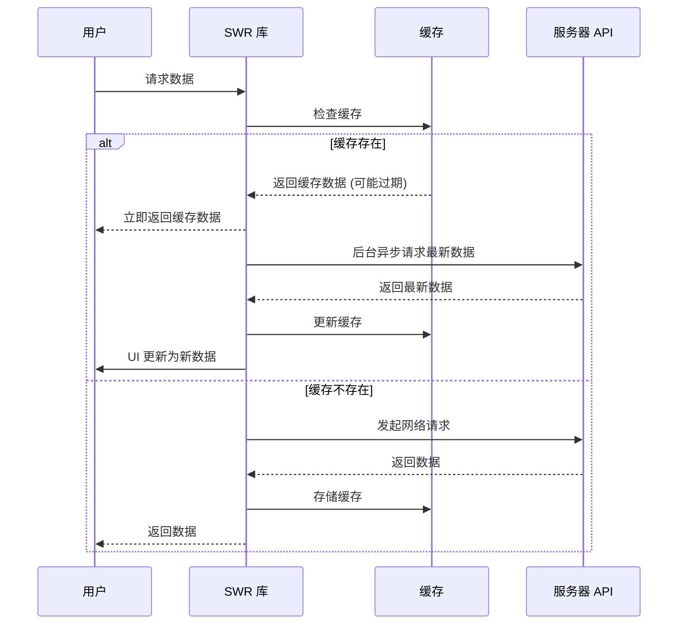
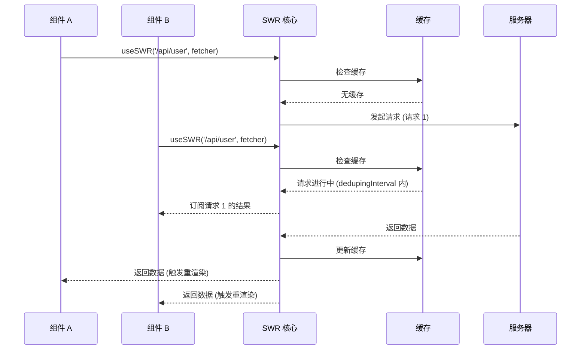
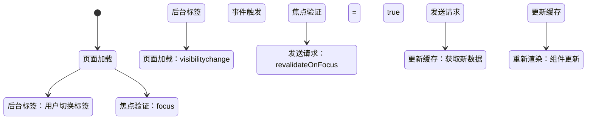
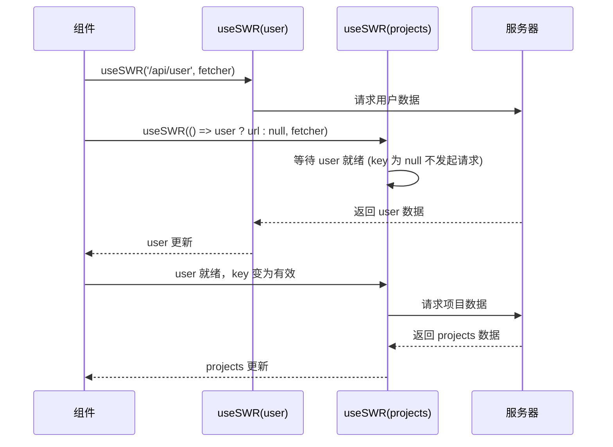
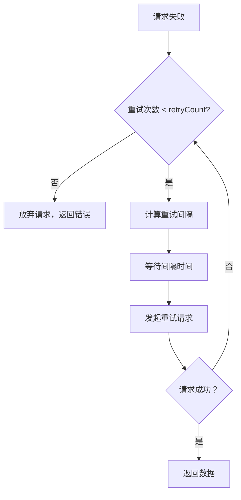

# SWR 核心知识体系

> 基于 stale-while-revalidate 策略的轻量级 React Hooks 数据请求库

**最后更新：** 2026-04-07  
**版本：** 1.0.0  
**官方文档：** https://swr.vercel.app

---

## 目录

1. [基础认知](#第 1 章基础认知什么是 SWR)
2. [核心工作原理](#第 2 章核心工作原理)
3. [快速开始](#第 3 章快速开始与基础用法)
4. [核心 API 详解](#第 4 章核心 API 详解)
5. [高级特性](#第 5 章高级特性)
6. [性能优化](#第 6 章性能优化与最佳实践)
7. [实战应用场景](#第 7 章实战应用场景)
8. [常见误区与面试问题](#第 8 章常见误区与面试问题)

---

## 第 1 章 基础认知：什么是 SWR

### 1.1 stale-while-revalidate 策略来源（HTTP RFC 5861）

**概念定义：**

`stale-while-revalidate` 是一种 HTTP 缓存控制策略，最初由 **HTTP RFC 5861** 规范定义。该策略允许缓存服务器在缓存过期（stale）后的一段时间内，继续向客户端提供过期的缓存响应，同时在后台异步发起请求去验证缓存并获取最新数据（revalidate）。

**为什么需要这个策略：**

传统的 HTTP 缓存策略（如 `max-age`）在缓存过期后，客户端必须等待重新验证（revalidate）请求完成后才能获取数据。这种同步更新机制在注重性能的场景下存在明显问题：用户必须等待网络请求完成才能看到内容，即使缓存中已有可用的（虽然过期）数据。

**工作原理：**

RFC 5861 定义了 `stale-while-revalidate` 作为 `Cache-Control` 头部的一部分。例如：

```
Cache-Control: max-age=1, stale-while-revalidate=59
```

这个头部指令的含义是：
- **第 1 秒内**：缓存是"新鲜"的，直接返回缓存
- **第 2-60 秒**：缓存已过期（stale），但仍可直接返回给用户，同时在后台异步重新验证
- **60 秒后**：缓存完全失效，必须等待重新验证完成

**SWR 的命名来源：**

```jsx
// SWR 名称直接来源于 stale-while-revalidate 的缩写
// "SWR" = Stale-While-Revalidate
```

**Mermaid 流程图：**



**来源：**
- HTTP RFC 5861 官方规范：https://www.rfc-editor.org/rfc/rfc5861.html
- SWR 官方文档：https://swr.vercel.app/docs/getting-started

---

### 1.2 SWR 的核心理念与设计哲学

**概念定义：**

SWR 是由 Vercel 团队（Next.js 原班人马）开发的轻量级 React Hooks 数据请求库。其核心理念是**"陈旧数据优先，后台静默验证"**，在保证用户体验流畅的同时确保数据的最终一致性。

**设计哲学：**

1. **简洁至上（Simple API）**
   - 核心 API 只有 `useSWR(key, fetcher, options)` 三个参数
   - 返回值仅包含必要的状态：`data`、`error`、`isLoading`、`isValidating`、`mutate`
   - 不需要复杂的配置即可开箱即用

2. **缓存优先（Cache First）**
   - 优先展示缓存数据，减少用户等待时间
   - 相同 key 的请求自动共享缓存，避免重复请求
   - 内置请求去重机制，短时间内相同请求只发送一次

3. **自动更新（Auto Revalidation）**
   - 焦点验证：页面获得焦点时自动重新验证
   - 网络恢复验证：网络重连时自动刷新数据
   - 轮询支持：可配置定时轮询间隔

4. **乐观 UI（Optimistic UI）**
   - 支持本地缓存更新（Optimistic Update）
   - 用户操作后立即更新 UI，再同步到服务器
   - 请求失败时自动回滚

5. **轻量级（Lightweight）**
   - 核心库体积仅约 4.2KB（gzipped）
   - 无外部依赖，纯 TypeScript 实现
   - 对移动端和资源受限环境友好

**来源：**
- SWR 官方文档设计理念：https://swr.vercel.app
- GitHub 仓库：https://github.com/vercel/swr

---

### 1.3 适用场景：何时选择 SWR

**核心适用场景：**

1. **内容展示型应用**
   - 新闻列表、博客文章、产品目录等
   - 数据实时性要求中等，可接受秒级延迟
   - 需要快速首屏加载

2. **实时数据仪表盘**
   - 监控面板、数据分析图表
   - 需要定期轮询更新数据
   - 多标签页数据同步

3. **社交媒体动态**
   - 用户 Feed 流、评论列表
   - 需要焦点验证保持数据新鲜
   - 无限滚动加载

4. **移动端应用**
   - 网络条件不稳定
   - 需要离线缓存支持
   - 对包体积敏感

5. **多标签页同步场景**
   - 用户可能在多个标签页操作
   - 需要标签切换时自动同步数据
   - 避免重复请求

**不适用场景：**

1. **需要精确控制的复杂数据流**
   - 需要细粒度控制请求生命周期
   - 复杂的请求依赖关系
   - 建议选择：React Query

2. **服务端渲染（SSR）水合复杂场景**
   - 虽然有 SSR 支持，但配置相对复杂
   - 建议选择：Next.js 内置数据获取

3. **需要强大 DevTools 调试**
   - SWR 没有官方的开发调试工具
   - React Query 提供完整的 DevTools

**来源：**
- SWR 官方文档使用场景：https://swr.vercel.app/docs/getting-started
- 技术社区对比分析

---

### 1.4 SWR vs React Query vs Axios 对比

**对比维度总览：**

| 维度 | SWR | React Query | Axios |
|------|-----|-------------|-------|
| **定位** | 轻量级数据请求 Hook | 完整的服务端状态管理 | HTTP 客户端库 |
| **包体积** | ~4.2KB (gzipped) | ~13KB (gzipped) | ~11KB (gzipped) |
| **学习曲线** | 低 - API 简洁 | 中 - 概念较多 | 低 - 传统 HTTP 库 |
| **缓存策略** | stale-while-revalidate | staleTime + cacheTime | 无（需手动实现） |
| **自动重新验证** | 内置（焦点/网络/轮询） | 内置（可配置） | 无 |
| **请求去重** | 内置 | 内置 | 无 |
| **错误重试** | 内置（指数退避） | 内置（可配置次数） | 无（需拦截器） |
| **DevTools** | 无官方支持 | 完整 DevTools | 无 |
| **SSR 支持** | 有（需配置） | 完整支持 | 无 |
| **TypeScript** | 完整支持 | 完整支持 | 完整支持 |
| **维护团队** | Vercel | TanStack | Matt Zabriskie/社区 |

**代码对比示例：**

**Axios 基础用法：**
```jsx
// 需要手动管理所有状态
import { useState, useEffect } from 'react';
import axios from 'axios';

function UserProfile() {
  const [data, setData] = useState(null);
  const [loading, setLoading] = useState(true);
  const [error, setError] = useState(null);

  useEffect(() => {
    axios.get('/api/user')
      .then(res => setData(res.data))
      .catch(err => setError(err))
      .finally(() => setLoading(false));
  }, []);

  if (loading) return <div>Loading...</div>;
  if (error) return <div>Error: {error.message}</div>;
  return <div>Hello {data.name}</div>;
}
```

**SWR 基础用法：**
```jsx
// 自动处理状态、缓存、重新验证
import useSWR from 'swr';

const fetcher = url => fetch(url).then(res => res.json());

function UserProfile() {
  const { data, error, isLoading } = useSWR('/api/user', fetcher);

  if (error) return <div>Failed to load</div>;
  if (isLoading) return <div>Loading...</div>;
  return <div>Hello {data.name}</div>;
}
```

**React Query 基础用法：**
```jsx
// 功能最全，但配置相对复杂
import { useQuery } from '@tanstack/react-query';

function UserProfile() {
  const { data, error, isLoading } = useQuery({
    queryKey: ['user'],
    queryFn: () => fetch('/api/user').then(res => res.json()),
    staleTime: 5 * 60 * 1000, // 5 分钟内数据视为新鲜
    cacheTime: 10 * 60 * 1000, // 缓存 10 分钟
  });

  if (error) return <div>Failed to load</div>;
  if (isLoading) return <div>Loading...</div>;
  return <div>Hello {data.name}</div>;
}
```

**选型建议：**

- **选择 SWR 如果：**
  - 追求极简 API 和最小体积
  - 需要自动缓存和重新验证
  - 项目规模中等，不需要复杂状态管理

- **选择 React Query 如果：**
  - 需要强大的 DevTools 调试
  - 项目规模大，需要完整的状态管理
  - 需要细粒度控制缓存和查询行为

- **选择 Axios 如果：**
  - 只需要基础 HTTP 请求功能
  - 想手动控制缓存和状态管理
  - 项目已有自己的请求封装层

**来源：**
- SWR 官方文档：https://swr.vercel.app
- React Query 官方文档：https://tanstack.com/query
- Axios 官方文档：https://axios-http.com

---

## 第 2 章 核心工作原理

### 2.1 缓存机制：内置缓存与请求去重

**概念定义：**

SWR 的缓存机制是一个基于键值对（Key-Value）的内存缓存系统。每个 `useSWR` 调用通过唯一的 `key` 来标识和共享缓存数据。请求去重（Deduplication）确保在短时间内相同的请求只发送一次，多个组件共享同一个请求结果。

**工作原理：**

1. **缓存存储结构**

SWR 内部维护一个全局缓存对象：

```typescript
// 简化版缓存结构
interface CacheData {
  data: any;           // 缓存的数据
  error: any;          // 缓存的错误
  isValidating: boolean; // 是否正在验证
  timestamp: number;   // 缓存时间戳
}

// 全局缓存 Map
const cache = new Map<string, CacheData>();
```

2. **请求去重机制（Deduplication）**



**配置示例：**

```jsx
import useSWR, { SWRConfig } from 'swr';

// 单个请求配置 - 设置 5 秒去重间隔
function UserProfile() {
  const { data } = useSWR('/api/user', fetcher, {
    dedupingInterval: 5000 // 5 秒内相同请求只发送一次
  });
  return <div>{data.name}</div>;
}

// 全局配置 - 应用到所有 SWR 请求
function App() {
  return (
    <SWRConfig value={{
      dedupingInterval: 30000, // 全局 30 秒去重
      revalidateOnFocus: false,
    }}>
      <MainContent />
    </SWRConfig>
  );
}
```

**常见误区：**

- **误区：key 相同就能共享缓存**
  ```jsx
  // 错误：对象 key 每次都是新的引用，导致无法共享缓存
  useSWR([endpoint, { id: user.id }], fetcher);

  // 正确：使用 useMemo 稳定化对象引用
  const key = useMemo(() => [endpoint, { id: user.id }], [endpoint, user.id]);
  useSWR(key, fetcher);
  ```

**来源：**
- SWR 源码分析：https://github.com/vercel/swr/blob/main/src/_internal/core/use-swr.ts
- SWR 官方缓存文档：https://swr.vercel.app/docs/advanced/cache

---

### 2.2 自动重新验证：焦点验证、网络恢复验证

**概念定义：**

自动重新验证（Auto Revalidation）是 SWR 的核心特性之一，指在特定条件触发时自动向服务器发起请求验证缓存数据的有效性，并在获取新数据后更新 UI。主要触发条件包括：组件挂载、窗口获得焦点、网络恢复连接、以及可配置的定时轮询。

**工作原理：**

1. **焦点验证（Focus Revalidation）**

当用户切换到其他标签页后返回时，SWR 会自动重新验证数据。



2. **网络恢复验证（Reconnect Revalidation）**

当浏览器从离线状态恢复到在线状态时，SWR 会自动重新验证数据。

**配置选项：**

```jsx
import useSWR from 'swr';

function Dashboard() {
  const { data } = useSWR('/api/dashboard', fetcher, {
    // 窗口获得焦点时重新验证（默认 true）
    revalidateOnFocus: true,
    
    // 窗口重新获得焦点时的节流间隔
    focusThrottleInterval: 60000, // 1 分钟内最多验证一次
    
    // 网络恢复时重新验证（默认 true）
    revalidateOnReconnect: true,
    
    // 定时轮询间隔（默认 0，禁用）
    refreshInterval: 10000, // 每 10 秒轮询一次
    
    // 轮询时的配置
    refreshWhenHidden: false,
    refreshWhenOffline: false,
  });
}
```

**自动重新验证触发条件总结：**

1. 组件挂载（首次加载）- 默认行为，无法禁用
2. 窗口获得焦点（revalidateOnFocus）- 默认启用
3. 网络恢复连接（revalidateOnReconnect）- 默认启用
4. 定时轮询（refreshInterval）- 需配置间隔时间启用
5. 手动触发（mutate）- 通过调用 mutate() 函数手动触发

**来源：**
- SWR 官方文档 - 重新验证：https://swr.vercel.app/docs/advanced/revalidation
- SWR 源码 - web-preset.ts

---

### 2.3 请求共享与并发控制

**概念定义：**

请求共享（Request Sharing）是指多个组件使用相同 key 调用 `useSWR` 时，只发起一次网络请求，所有组件共享同一个请求结果。并发控制（Concurrency Control）确保在复杂场景下（如依赖请求、并行请求）能够正确管理请求的执行顺序和优先级。

**请求共享代码演示：**

```jsx
// 父组件
function Parent() {
  const { data: user } = useSWR('/api/user', fetcher);
  return (
    <div>
      <ChildA />
      <ChildB />
    </div>
  );
}

// 子组件 A
function ChildA() {
  const { data: user } = useSWR('/api/user', fetcher);
  // 直接使用父组件已缓存的数据，不会重新请求
}

// 子组件 B
function ChildB() {
  const { data: user } = useSWR('/api/user', fetcher);
  // 同上，共享同一个缓存
}
```

**依赖请求执行流程：**



**依赖请求示例：**

```jsx
// 场景：获取项目详情需要先获取用户信息
function MyProjects() {
  // 第一个请求
  const { data: user } = useSWR('/api/user', fetcher);
  
  // 第二个请求依赖第一个请求的结果
  // SWR 会自动等待 user 数据就绪后再发起请求
  const { data: projects } = useSWR(
    () => user ? `/api/projects?uid=${user.id}` : null, 
    fetcher
  );
  
  return (
    <div>
      {projects?.map(project => <ProjectCard key={project.id} {...project} />)}
    </div>
  );
}
```

**来源：**
- SWR 官方文档 - 参数化 Key：https://swr.vercel.app/docs/advanced/params

---

### 2.4 错误处理与智能重试机制

**概念定义：**

SWR 的错误处理机制将错误信息无缝集成到数据获取流程中，通过 `error` 返回值让组件可以轻松捕获和处理请求错误。智能重试机制则在请求失败时自动进行指数退避重试，提高请求成功率。

**智能重试机制：**

SWR 内置指数退避（Exponential Backoff）重试算法：



**重试间隔计算公式：**
```typescript
const getRetryInterval = (retryCount) => {
  const baseInterval = 1000; // 基础间隔 1 秒
  const exponentialFactor = Math.min(Math.pow(2, retryCount), 8);
  const jitter = Math.random() * 1000; // 添加随机抖动避免并发
  
  return baseInterval * exponentialFactor + jitter;
};
```

**重试配置选项：**

```jsx
// 单个请求配置
useSWR('/api/data', fetcher, {
  // 最大重试次数（默认 3 次）
  errorRetryCount: 5,
  
  // 重试间隔（默认 1000ms）
  errorRetryInterval: 2000,
});

// 全局配置
<SWRConfig value={{
  errorRetryCount: 3,
  errorRetryInterval: 1500,
}}>
  <App />
</SWRConfig>
```

**错误状态处理最佳实践：**

```jsx
function RobustComponent() {
  const { data, error, isLoading, isValidating } = useSWR('/api/data', fetcher);

  // 1. 错误状态
  if (error) {
    return (
      <div className="error-state">
        <p>数据加载失败</p>
        <p className="error-message">{error.message}</p>
        <button onClick={() => mutate()}>重试</button>
      </div>
    );
  }

  // 2. 初始加载
  if (isLoading) {
    return <div className="loading-state">加载中...</div>;
  }

  // 3. 后台重新验证中
  if (isValidating && data) {
    return (
      <div>
        <DataDisplay data={data} />
        <span className="validating-indicator">更新中...</span>
      </div>
    );
  }

  // 4. 正常状态
  return <DataDisplay data={data} />;
}
```

**来源：**
- SWR 官方文档 - 错误处理
- SWR 源码 - use-swr.ts

---

## 第 3 章 快速开始与基础用法

### 3.1 安装与配置

**安装步骤：**

```bash
# 使用 npm 安装
npm install swr

# 使用 yarn 安装
yarn add swr

# 使用 pnpm 安装
pnpm add swr
```

**环境要求：**
- React 16.11 或更高版本（Hooks 支持）
- 支持 TypeScript（可选，SWR 提供完整类型定义）

**基础配置方式：**

1. **最小化配置（零配置）：**

SWR 的最大优势是开箱即用，无需任何配置即可使用：

```jsx
import useSWR from 'swr';

const fetcher = url => fetch(url).then(res => res.json());

function App() {
  const { data, error, isLoading } = useSWR('/api/user', fetcher);
  // ...
}
```

2. **全局配置（SWRConfig）：**

```jsx
import { SWRConfig } from 'swr';

function App() {
  return (
    <SWRConfig
      value={{
        // 全局 fetcher
        fetcher: (resource, init) =>
          fetch(resource, init).then(res => res.json()),
        
        // 2 秒内去重
        dedupingInterval: 2000,
        
        // 禁用焦点验证
        revalidateOnFocus: false,
        
        // 网络恢复时重新验证
        revalidateOnReconnect: true,
        
        // 全局错误处理
        onError: (error, key) => {
          console.error('SWR Error:', error);
        },
      }}
    >
      <MainContent />
    </SWRConfig>
  );
}
```

3. **自定义 Fetcher 配置：**

```jsx
// 使用 axios 作为 fetcher
import axios from 'axios';
import useSWR from 'swr';

const axiosFetcher = url => axios.get(url).then(res => res.data);

function UserProfile() {
  const { data } = useSWR('/api/user', axiosFetcher);
}

// 带认证头的 fetcher
const authFetcher = url =>
  fetch(url, {
    headers: {
      'Authorization': `Bearer ${localStorage.getItem('token')}`,
      'Content-Type': 'application/json',
    },
  }).then(res => res.json());
```

**来源：**
- SWR 官方文档 - 安装：https://swr.vercel.app/docs/getting-started

---

### 3.2 useSWR Hook 基础：key、fetcher、返回值

**API 签名：**

```typescript
function useSWR<Data = any, Error = any>(
  key: Key,
  fetcher?: Fetcher<Data>,
  options?: SWRConfiguration
): SWRResponse<Data, Error>
```

**参数详解：**

1. **key（必填）：数据的唯一标识符**

```jsx
// 基本用法：字符串 key
const { data } = useSWR('/api/user', fetcher);

// 带参数的 key：数组形式
const { data } = useSWR(['/api/user', userId], fetcher);

// 条件请求：返回 null 或 undefined 时不发起请求
const { data } = useSWR(isLoggedIn ? '/api/user' : null, fetcher);

// 动态 key：使用函数
const { data } = useSWR(() => `/api/user/${userId}`, fetcher);
```

2. **fetcher（可选）：数据获取函数**

```jsx
// 使用原生 fetch
const fetcher = url => fetch(url).then(res => res.json());

// 使用 async/await
const fetcher = async (url) => {
  const res = await fetch(url);
  return res.json();
};

// 使用 axios
import axios from 'axios';
const fetcher = url => axios.get(url).then(res => res.data);
```

**返回值详解：**

```typescript
interface SWRResponse<Data, Error> {
  /** 获取到的数据，未完成时为 undefined */
  data?: Data;
  
  /** 请求错误，无错误时为 undefined */
  error?: Error;
  
  /** 是否处于首次加载状态 */
  isLoading: boolean;
  
  /** 是否正在验证（后台重新请求） */
  isValidating: boolean;
  
  /** 用于更新缓存或手动触发重新验证 */
  mutate: MutatorCallback<Data>;
}
```

**返回值使用示例：**

```jsx
import useSWR from 'swr';

const fetcher = url => fetch(url).then(res => res.json());

function UserProfile() {
  const {
    data,           // 用户数据
    error,          // 错误信息
    isLoading,      // 首次加载状态
    isValidating,   // 正在验证状态
    mutate          // 缓存更新函数
  } = useSWR('/api/user', fetcher);

  // 错误状态
  if (error) {
    return <div>请求失败：{error.message}</div>;
  }

  // 首次加载
  if (isLoading) {
    return <div>加载中...</div>;
  }

  // 后台验证中（有数据但正在刷新）
  if (isValidating) {
    return (
      <div>
        <p>用户名：{data.name}</p>
        <span>更新中...</span>
        <button onClick={() => mutate()}>刷新</button>
      </div>
    );
  }

  // 正常渲染
  return (
    <div>
      <p>用户名：{data.name}</p>
      <p>邮箱：{data.email}</p>
      <button onClick={() => mutate()}>刷新</button>
    </div>
  );
}
```

**来源：**
- SWR 官方文档 - useSWR API

---

### 3.3 加载状态与错误处理

**加载状态类型：**

SWR 提供两种加载状态标识：

1. **isLoading（首次加载）**
   - 组件首次挂载
   - key 发生变化
   - 缓存中没有数据

2. **isValidating（后台验证）**
   - 焦点验证触发
   - 网络恢复验证
   - 手动调用 mutate()
   - 定时轮询触发

**完整的状态处理模板：**

```jsx
function RobustComponent() {
  const { data, error, isLoading, isValidating } = useSWR('/api/data', fetcher);

  // 1. 错误状态优先处理
  if (error) {
    return (
      <div className="error-container">
        <h3>数据加载失败</h3>
        <p className="error-message">{error.message}</p>
        <button onClick={() => mutate()}>重试</button>
      </div>
    );
  }

  // 2. 首次加载状态
  if (isLoading) {
    return (
      <div className="loading-container">
        <Skeleton />
        <p>正在加载数据...</p>
      </div>
    );
  }

  // 3. 后台验证状态（有数据但正在刷新）
  if (isValidating) {
    return (
      <div>
        <DataDisplay data={data} />
        <div className="refresh-indicator">
          <Spinner />
          <span>更新中...</span>
        </div>
      </div>
    );
  }

  // 4. 正常状态
  return <DataDisplay data={data} />;
}
```

**来源：**
- SWR 官方文档 - 错误处理

---

### 3.4 TypeScript 集成

**基础类型使用：**

```typescript
import useSWR from 'swr';

// 定义数据类型
interface User {
  id: number;
  name: string;
  email: string;
  avatar?: string;
}

// 定义 fetcher
const fetcher = (url: string): Promise<User> =>
  fetch(url).then(res => res.json());

// 使用泛型指定返回类型
function UserProfile() {
  const { data, error } = useSWR<User, Error>('/api/user', fetcher);
  
  // data 类型：User | undefined
  // error 类型：Error | undefined
  
  if (error) {
    return <div>错误：{error.message}</div>;
  }
  
  if (!data) {
    return <div>加载中...</div>;
  }
  
  // data 在这里被推断为 User 类型
  return <div>{data.name}</div>;
}
```

**自定义 Hook 类型：**

```typescript
// 封装带类型的自定义 Hook
import useSWR, { SWRConfiguration } from 'swr';

interface User {
  id: number;
  name: string;
}

function useUser(userId: number) {
  const { data, error, ...rest } = useSWR<User>(
    `/api/user/${userId}`,
    fetcher
  );

  return {
    user: data,
    isLoading: !data && !error,
    isError: error,
    ...rest,
  };
}
```

**来源：**
- SWR 官方文档 - TypeScript：https://swr.vercel.app/docs/advanced/typescript

---

## 第 4 章 核心 API 详解

### 4.1 useSWR 完整配置选项

**概念定义：**

`useSWR` 是 SWR 库的核心 Hook，它接受三个参数：`key`、`fetcher` 和 `options`。其中 `options` 参数允许开发者精细控制数据获取、缓存、重新验证等行为。

**完整配置选项列表：**

```jsx
import useSWR from 'swr'

const { data, error, isLoading, isValidating, mutate } = useSWR(key, fetcher, {
  // === 重新验证相关 ===
  
  // 自动重新验证（即使有 stale 数据）
  revalidateIfStale: true,
  
  // 组件挂载时是否自动重新验证
  revalidateOnMount: undefined,
  
  // 窗口获得焦点时自动重新验证
  revalidateOnFocus: true,
  
  // 网络恢复连接时自动重新验证
  revalidateOnReconnect: true,
  
  // === 轮询/刷新相关 ===
  
  // 轮询间隔（毫秒），0 表示禁用
  refreshInterval: 0,
  
  // 窗口隐藏时是否继续轮询
  refreshWhenHidden: false,
  
  // 浏览器离线时是否继续轮询
  refreshWhenOffline: false,
  
  // === 错误处理相关 ===
  
  // 请求失败时是否重试
  shouldRetryOnError: true,
  
  // 错误重试间隔（毫秒）
  errorRetryInterval: 5000,
  
  // 最大错误重试次数
  errorRetryCount: undefined,
  
  // === 请求去重相关 ===
  
  // 去重时间窗口（毫秒）
  dedupingInterval: 2000,
  
  // 焦点重新验证的节流间隔（毫秒）
  focusThrottleInterval: 5000,
  
  // === 超时与回调相关 ===
  
  // 触发 onLoadingSlow 事件的超时时间（毫秒）
  loadingTimeout: 3000,
  
  // 请求成功完成时的回调
  onSuccess: (data, key, config) => {},
  
  // 请求返回错误时的回调
  onError: (err, key, config) => {},
  
  // === 数据相关 ===
  
  // 回退数据（当没有缓存时使用）
  fallbackData: undefined,
  
  // 保持上一个 key 的数据直到新数据加载完成
  keepPreviousData: false,
  
  // === Suspense 相关 ===
  
  // 启用 React Suspense 模式
  suspense: false,
  
  // === 高级功能相关 ===
  
  // 中间件数组
  use: []
})
```

**代码示例：**

```jsx
// 基础示例：带有自定义配置的 useSWR
function Profile() {
  const { data, error, isLoading } = useSWR('/api/user', fetcher, {
    refreshInterval: 3000,      // 每 3 秒轮询一次
    revalidateOnFocus: false,   // 窗口获得焦点时不重新验证
    shouldRetryOnError: false,  // 失败时不重试
    dedupingInterval: 5000,     // 5 秒内去重
  })
  
  if (error) return <div>加载失败</div>
  if (isLoading) return <div>加载中...</div>
  
  return <div>欢迎，{data.name}！</div>
}

// 高级示例：智能轮询（根据数据状态调整间隔）
function Dashboard() {
  const { data } = useSWR('/api/events', fetcher, {
    // 如果有新事件，每分钟轮询一次；否则每 5 分钟一次
    refreshInterval: (data) => {
      if (!data) return 0
      return data.hasNewEvents ? 60000 : 300000
    },
    
    // 只在窗口可见时轮询
    refreshWhenHidden: false,
    
    // 离线时停止轮询
    refreshWhenOffline: false,
  })
}
```

**来源：**
- https://swr.vercel.app/docs/api

---

### 4.2 mutate：缓存更新与数据同步

**概念定义：**

`mutate` 是 SWR 提供的用于手动更新缓存的核心 API。它允许开发者：
1. 直接更新指定 key 的缓存数据
2. 触发数据的重新验证（revalidation）
3. 更新数据后自动重新获取最新数据

**代码示例：**

```jsx
import useSWR, { useSWRConfig } from 'swr'

// ==================== 基础用法 ====================

// 方式 1: 使用 useSWR 返回的 mutate（已绑定到特定 key）
function Profile() {
  const { data, mutate } = useSWR('/api/user', fetcher)

  const handleUpdate = async () => {
    const newName = data.name.toUpperCase()
    // 发送 API 请求
    await fetch('/api/user', {
      method: 'PUT',
      body: JSON.stringify({ name: newName })
    })
    // 立即更新本地缓存并重新验证
    mutate({ ...data, name: newName })
  }

  return <button onClick={handleUpdate}>大写化我的名字</button>
}

// 方式 2: 使用 useSWRConfig 获取 mutate（可更新任意 key）
function App() {
  const { mutate } = useSWRConfig()

  const handleLogout = () => {
    // 清除 token
    document.cookie = 'token=; expires=Thu, 01 Jan 1970 00:00:00 UTC'
    // 告诉所有使用这个 key 的 SWR 重新验证
    mutate('/api/user')
  }

  return <button onClick={handleLogout}>登出</button>
}

// ==================== 乐观更新 ====================

function TodoList() {
  const { data: todos, mutate } = useSWR('/api/todos', fetcher)

  const addTodo = async (text) => {
    const newTodo = { id: Date.now(), text, completed: false }
    
    // 乐观更新：立即显示新待办
    await mutate([...todos, newTodo], false)
    
    try {
      // 发送真实请求
      const res = await fetch('/api/todos', {
        method: 'POST',
        body: JSON.stringify({ text })
      })
      const savedTodo = await res.json()
      
      // 用服务器返回的真实数据替换
      await mutate(todos.map(t => t.id === newTodo.id ? savedTodo : t))
    } catch (error) {
      // 错误处理：回滚
      await mutate(todos, false)
    }
  }

  return <button onClick={() => addTodo('新任务')}>添加</button>
}
```

**常见误区：**

1. **误区：`mutate(data)` 会发送请求到服务器**
   - 事实：`mutate(data)` 只更新本地缓存，不会发送网络请求

2. **误区：`mutate` 只能在 SWR Hook 内部使用**
   - 事实：可以通过 `useSWRConfig` 获取 `mutate`，在任何地方更新缓存

**来源：**
- https://swr.vercel.app/docs/mutation

---

### 4.3 useSWRInfinite：无限滚动与分页

**概念定义：**

`useSWRInfinite` 是 SWR 提供的用于处理无限滚动和分页场景的专用 Hook。

**代码示例：**

```jsx
import useSWRInfinite from 'swr/infinite'

function Articles() {
  const {
    data,           // 所有页的数据数组
    error,
    size,           // 当前加载的页数
    setSize,        // 设置加载的页数（加载更多）
    isValidating,   // 是否正在验证/加载
    isLoading,      // 初始加载状态
  } = useSWRInfinite(
    // getKey: 根据页索引和上一页数据生成 key
    (pageIndex, previousPageData) => {
      // 如果没有更多数据，返回 null 停止加载
      if (previousPageData && previousPageData.length === 0) {
        return null
      }
      
      // 第一页
      if (pageIndex === 0) {
        return '/api/articles?page=0&limit=10'
      }
      
      // 后续页
      return `/api/articles?page=${pageIndex}&limit=10`
    },
    fetcher
  )

  // 加载状态
  if (isLoading) return <div>加载中...</div>
  if (error) return <div>加载失败：{error.message}</div>
  
  // 数据为空
  if (!data || data.length === 0) {
    return <div>暂无文章</div>
  }

  // 渲染所有页的数据
  return (
    <div>
      {data.flat().map(article => (
        <ArticleCard key={article.id} article={article} />
      ))}
      
      {/* 加载更多按钮 */}
      <button
        onClick={() => setSize(size + 1)}
        disabled={isValidating || data[data.length - 1]?.length === 0}
      >
        {isValidating ? '加载中...' : '加载更多'}
      </button>
    </div>
  )
}
```

**常见误区：**

1. **误区：`data` 是扁平的数组**
   - 事实：`data` 是二维数组，每个元素是一页的数据

**来源：**
- https://swr.vercel.app/docs/pagination

---

### 4.4 useSWRSubscription：实时数据订阅

**概念定义：**

`useSWRSubscription`（需要 SWR ≥ 2.1.0）是一个用于订阅实时数据源的 Hook。它允许将 WebSocket、Server-Sent Events (SSE)、Firebase 等推送式数据源与 SWR 的缓存和状态管理系统集成。

**代码示例：**

```jsx
import useSWRSubscription from 'swr/subscription'

// WebSocket 订阅
function LivePrice() {
  const { data, error } = useSWRSubscription(
    'ws://api.example.com/stocks/AAPL',
    (key, { next }) => {
      const socket = new WebSocket(key)
      
      socket.addEventListener('message', (event) => {
        const price = JSON.parse(event.data)
        next(null, price)
      })
      
      socket.addEventListener('error', (event) => {
        next(event.error)
      })
      
      // 清理函数
      return () => socket.close()
    }
  )

  if (error) return <div>连接失败</div>
  if (!data) return <div>连接中...</div>
  
  return <div>当前价格：${data.price}</div>
}

// Firebase 订阅
function PostViews({ postId }) {
  const { data } = useSWRSubscription(
    ['views', postId],
    ([_, id], { next }) => {
      const ref = firebase.database().ref(`posts/${id}/views`)
      
      ref.on('value', 
        snapshot => next(null, snapshot.val()),
        err => next(err)
      )
      
      return () => ref.off()
    }
  )

  return <span>浏览量：{data}</span>
}
```

**来源：**
- https://swr.vercel.app/docs/subscription

---

### 4.5 SWRConfig：全局配置与中间件

**概念定义：**

`SWRConfig` 可以为应用中的所有 SWR Hook 提供统一的配置，支持嵌套配置和函数式配置。

**代码示例：**

```jsx
import useSWR, { SWRConfig, useSWRConfig } from 'swr'

// ==================== 基础全局配置 ====================

function App() {
  return (
    <SWRConfig
      value={{
        // 全局 fetcher
        fetcher: (resource, init) => 
          fetch(resource, init).then(res => res.json()),
        
        // 全局刷新间隔：3 秒
        refreshInterval: 3000,
        
        // 禁用焦点重新验证
        revalidateOnFocus: false,
        
        // 全局回退数据
        fallback: {
          '/api/settings': { theme: 'dark' }
        },
        
        // 错误重试配置
        shouldRetryOnError: true,
        errorRetryCount: 3,
      }}
    >
      <Dashboard />
    </SWRConfig>
  )
}

function Dashboard() {
  // 继承全局配置
  const { data: events } = useSWR('/api/events')
  
  // 覆盖全局配置
  const { data: user } = useSWR('/api/user', {
    refreshInterval: 0 // 禁用轮询
  })
  
  return <div>...</div>
}

// ==================== 嵌套配置 ====================

function App() {
  return (
    <SWRConfig value={{
      dedupingInterval: 100,
      refreshInterval: 100,
      fallback: { a: 1, b: 1 },
    }}>
      <ChildComponent />
    </SWRConfig>
  )
}

function ChildComponent() {
  // 这里的配置会继承并覆盖父级配置
  return (
    <SWRConfig value={{
      dedupingInterval: 200, // 覆盖父级
      fallback: { a: 2, c: 2 }, // 与父级合并
    }}>
      <GrandChildComponent />
    </SWRConfig>
  )
}
```

**来源：**
- https://swr.vercel.app/docs/global-configuration

---

## 第 5 章 高级特性

### 5.1 乐观更新（Optimistic UI）

**概念定义：**

乐观更新（Optimistic UI）是一种前端优化技术，其核心思想是：在执行异步操作（如 API 请求）时，先立即更新 UI 给用户反馈，然后再在后台发送真实请求。如果请求失败，则回滚到之前的状态。

**代码示例：**

```jsx
import useSWR, { useSWRConfig } from 'swr'
import useSWRMutation from 'swr/mutation'

// ==================== 方式 1: 使用 mutate 实现乐观更新 ====================

function LikeButton({ postId }) {
  const { data: post, mutate } = useSWR(`/api/posts/${postId}`, fetcher)

  const handleLike = async () => {
    const optimisticLikes = post.likes + 1
    
    // 1. 乐观更新：立即显示点赞数 +1
    await mutate(
      { ...post, likes: optimisticLikes },
      { revalidate: false } // 不立即重新验证
    )
    
    try {
      // 2. 发送真实请求
      await fetch(`/api/posts/${postId}/like`, { method: 'POST' })
      
      // 3. 重新验证获取真实数据
      await mutate()
    } catch (error) {
      // 4. 失败回滚
      await mutate(post, { revalidate: false })
      alert('点赞失败，已恢复原状')
    }
  }

  return (
    <button onClick={handleLike}>
      👍 {post.likes}
    </button>
  )
}

// ==================== 方式 2: 使用 useSWRMutation 的 optimisticData ====================

function CommentList() {
  const { data: comments } = useSWR('/api/comments', fetcher)
  
  const { trigger: addComment } = useSWRMutation(
    '/api/comments',
    async (url, { arg }) => {
      const res = await fetch(url, {
        method: 'POST',
        body: JSON.stringify(arg)
      })
      return res.json()
    },
    {
      // 乐观数据：立即显示新评论
      optimisticData: (currentComments, newComment) => [
        ...currentComments,
        { ...newComment, id: 'temp-' + Date.now(), pending: true }
      ],
      
      // 错误时回滚
      rollbackOnError: true,
      
      // 成功后重新验证
      revalidate: true,
    }
  )

  const handleSubmit = (text) => {
    addComment({ text, author: 'me' })
  }

  return (
    <div>
      {comments?.map(c => (
        <div key={c.id} style={{ opacity: c.pending ? 0.5 : 1 }}>
          {c.text} {c.pending && '(发送中...)'}
        </div>
      ))}
      <button onClick={() => handleSubmit('新评论')}>添加评论</button>
    </div>
  )
}
```

**常见误区：**

1. **误区：乐观更新总是更好的用户体验**
   - 事实：对于不可逆或重要操作（如支付），应该等待服务器确认后再更新 UI

2. **误区：乐观更新不需要错误处理**
   - 事实：必须实现回滚逻辑，否则会导致数据不一致

**来源：**
- https://swr.vercel.app/docs/mutation#optimistic-updates

---

### 5.2 依赖请求与条件请求

**概念定义：**

- **条件请求**：基于某个条件决定是否发起请求
- **依赖请求**：一个请求依赖于另一个请求的结果，确保按正确顺序执行

**代码示例：**

```jsx
import useSWR from 'swr'

// ==================== 条件请求 ====================

// 方式 1: 三元表达式
function Profile({ userId, shouldFetch }) {
  const { data } = useSWR(
    shouldFetch ? `/api/users/${userId}` : null,
    fetcher
  )
}

// 方式 2: 函数形式
function Dashboard({ user }) {
  const { data } = useSWR(
    () => user ? '/api/dashboard' : null,
    fetcher
  )
}

// ==================== 依赖请求 ====================

// 基础依赖：获取用户后才能获取项目
function MyProjects() {
  // 第一步：获取用户信息
  const { data: user } = useSWR('/api/user', fetcher)
  
  // 第二步：依赖用户 ID 获取项目列表
  const { data: projects } = useSWR(
    () => `/api/projects?uid=${user.id}`,
    fetcher
  )
  
  if (!projects) return <div>加载中...</div>
  return <div>你有 {projects.length} 个项目</div>
}

// 多层依赖链
function UserProfile() {
  // 第一层：获取当前用户
  const { data: user } = useSWR('/api/user', fetcher)
  
  // 第二层：依赖用户获取设置
  const { data: settings } = useSWR(
    () => user ? `/api/users/${user.id}/settings` : null,
    fetcher
  )
  
  // 第三层：依赖设置获取主题配置
  const { data: theme } = useSWR(
    () => settings?.themeId ? `/api/themes/${settings.themeId}` : null,
    fetcher
  )
  
  if (!theme) return <div>加载中...</div>
  return <ThemeProvider theme={theme} />
}
```

**来源：**
- https://swr.vercel.app/docs/conditional-fetching

---

### 5.3 轮询与定时刷新

**概念定义：**

轮询（Polling）是指定期向服务器发送请求以获取最新数据的模式。SWR 通过 `refreshInterval` 配置项提供内置的轮询支持。

**代码示例：**

```jsx
import useSWR from 'swr'

// ==================== 固定间隔轮询 ====================

function Dashboard() {
  const { data } = useSWR('/api/stats', fetcher, {
    // 每 5 秒轮询一次
    refreshInterval: 5000,
    
    // 窗口可见时才轮询
    refreshWhenHidden: false,
    
    // 离线时停止轮询
    refreshWhenOffline: false,
  })
  
  return <div>访问量：{data?.visits}</div>
}

// ==================== 动态间隔轮询 ====================

function SmartDashboard() {
  const { data } = useSWR('/api/stats', fetcher, {
    // 根据数据状态动态调整轮询间隔
    refreshInterval: (data) => {
      if (!data) return 5000           // 初始：5 秒
      if (data.hasRealTimeEvents) return 1000  // 有实时事件：1 秒
      if (data.isBusyHour) return 10000       // 高峰期：10 秒
      return 60000                     // 默认：1 分钟
    },
  })
}

// ==================== 始终轮询 ====================

function BackgroundMonitor() {
  const { data } = useSWR('/api/health', fetcher, {
    refreshInterval: 10000,
    refreshWhenHidden: true,   // 窗口隐藏时继续轮询
    refreshWhenOffline: true,  // 离线时继续
  })
  
  return <div>系统状态：{data?.status}</div>
}
```

**来源：**
- https://swr.vercel.app/docs/api

---

### 5.4 预加载与预取策略

**概念定义：**

预加载（Prefetching）是指在数据实际需要之前提前获取并缓存的技术。SWR 提供了 `preload` API 用于程序化预取。

**代码示例：**

```jsx
import useSWR, { preload } from 'swr'

function App() {
  const [show, setShow] = useState(false)
  
  return (
    <div>
      <button 
        onClick={() => setShow(true)}
        onMouseEnter={() => {
          // 悬停时预取
          preload('/api/user', fetcher)
        }}
      >
        显示用户
      </button>
      {show && <User />}
    </div>
  )
}

function User() {
  // 如果已经预取，这里会立即返回数据
  const { data } = useSWR('/api/user', fetcher)
  return <div>{data.name}</div>
}
```

**来源：**
- https://swr.vercel.app/docs/prefetching

---

### 5.5 React Suspense 集成

**概念定义：**

React Suspense 是 React 18+ 提供的用于处理异步加载的组件。SWR 支持 Suspense 模式，允许组件在数据加载完成前"暂停"渲染。

**代码示例：**

```jsx
import useSWR from 'swr'
import { Suspense } from 'react'

function Profile() {
  const { data } = useSWR('/api/user', fetcher, { suspense: true })
  // 在 Suspense 模式下，data 永远不会是 undefined
  return <div>你好，{data.name}</div>
}

function App() {
  return (
    <Suspense fallback={<div>加载中...</div>}>
      <Profile />
    </Suspense>
  )
}
```

**来源：**
- https://swr.vercel.app/docs/suspense

---

### 5.6 中间件系统

**概念定义：**

SWR 中间件（Middleware）是 SWR 1.0+ 引入的强大功能，允许在 Hook 执行前后插入自定义逻辑。

**代码示例：**

```jsx
import useSWR, { SWRConfig } from 'swr'

// 请求日志中间件
function loggerMiddleware(useSWRNext) {
  return (key, fetcher, config) => {
    console.log('SWR 请求:', key)
    
    // 包装 fetcher 添加日志
    const wrappedFetcher = async (...args) => {
      console.time('Fetch time')
      const result = await fetcher(...args)
      console.timeEnd('Fetch time')
      return result
    }
    
    return useSWRNext(key, wrappedFetcher, config)
  }
}

// 使用方式
useSWR(key, fetcher, { use: [loggerMiddleware] })

// 全局中间件配置
function App() {
  return (
    <SWRConfig value={{
      use: [
        loggerMiddleware,      // 日志
        retryMiddleware(3),    // 重试
      ]
    }}>
      <Dashboard />
    </SWRConfig>
  )
}
```

**来源：**
- https://swr.vercel.app/docs/middleware

---

## 第 6 章 性能优化与最佳实践

### 6.1 缓存策略优化

**代码示例：**

```jsx
import useSWR, { mutate, SWRConfig } from 'swr'

// ==================== 缓存生命周期管理 ====================

function DataComponent() {
  const { data, mutate: revalidate } = useSWR('/api/data', fetcher, {
    revalidateIfStale: true,      // 有 stale 数据时
    revalidateOnFocus: true,      // 窗口获得焦点
    revalidateOnReconnect: true,  // 网络恢复连接
  })
}

// ==================== 手动缓存控制 ====================

function CacheControl() {
  const { mutate } = useSWRConfig()
  
  // 更新缓存（不重新验证）
  const updateCache = () => {
    mutate('/api/data', newData)
  }
  
  // 清空缓存
  const clearCache = () => {
    mutate('/api/data', undefined)
  }
  
  // 强制重新验证
  const refresh = async () => {
    await mutate('/api/data')
  }
  
  return (
    <div>
      <button onClick={updateCache}>更新缓存</button>
      <button onClick={clearCache}>清空缓存</button>
      <button onClick={refresh}>刷新数据</button>
    </div>
  )
}

// ==================== 通配符缓存更新 ====================

function BulkCacheUpdate() {
  const { mutate } = useSWRConfig()
  
  // 更新所有匹配 key 的缓存
  const updateUserPosts = async (userId, newPost) => {
    await mutate(
      key => key.startsWith(`/api/users/${userId}/posts`),
      undefined,
      { revalidate: true }
    )
  }
}
```

**来源：**
- https://swr.vercel.app/docs/mutation

---

### 6.2 请求去重与批量处理

**代码示例：**

```jsx
import useSWR from 'swr'

// ==================== 自动去重 ====================

// 组件 A、B、C 都使用相同的 key
function ComponentA() {
  const { data } = useSWR('/api/user', fetcher)
  return <div>{data?.name}</div>
}

function ComponentB() {
  const { data } = useSWR('/api/user', fetcher)
  return <div>{data?.email}</div>
}

// 只会有一个请求发出
function App() {
  return (
    <>
      <ComponentA />
      <ComponentB />
    </>
  )
}

// ==================== 配置去重间隔 ====================

function CustomDeduping() {
  const { data } = useSWR('/api/data', fetcher, {
    // 5 秒内的重复请求会被合并
    dedupingInterval: 5000,
  })
}
```

**来源：**
- https://swr.vercel.app/docs/api

---

### 6.3 内存管理与垃圾回收

**代码示例：**

```jsx
import useSWR, { SWRConfig } from 'swr'

// ==================== 使用 Map 缓存（默认） ====================

function App() {
  return (
    <SWRConfig value={{
      provider: () => new Map()
    }}>
      <Dashboard />
    </SWRConfig>
  )
}

// ==================== LRU 缓存 ====================

function createLRUCache(maxSize = 100) {
  const cache = new Map()
  
  return {
    get(key) {
      const value = cache.get(key)
      if (value !== undefined) {
        cache.delete(key)
        cache.set(key, value)
      }
      return value
    },
    set(key, value) {
      if (cache.has(key)) {
        cache.delete(key)
      } else if (cache.size >= maxSize) {
        const firstKey = cache.keys().next().value
        cache.delete(firstKey)
      }
      cache.set(key, value)
    },
    delete(key) {
      cache.delete(key)
    },
    clear() {
      cache.clear()
    },
  }
}

function App() {
  return (
    <SWRConfig value={{
      provider: () => createLRUCache(50) // 最多保留 50 个缓存项
    }}>
      <Dashboard />
    </SWRConfig>
  )
}
```

**来源：**
- https://swr.vercel.app/docs/advanced/cache

---

### 6.4 SSR/SSG 场景下的 SWR

**代码示例：**

```jsx
// Next.js Pages Router
// pages/profile.js
export async function getServerSideProps() {
  const res = await fetch('https://api.example.com/user')
  const user = await res.json()
  
  return {
    props: {
      fallback: {
        '/api/user': user
      }
    }
  }
}

function Profile({ fallback }) {
  return (
    <SWRConfig value={{ fallback }}>
      <ProfileContent />
    </SWRConfig>
  )
}

function ProfileContent() {
  // 立即渲染 fallback 数据，然后后台重新验证
  const { data } = useSWR('/api/user', fetcher)
  return <div>{data.name}</div>
}
```

**来源：**
- https://swr.vercel.app/docs/with-nextjs

---

### 6.5 自定义 Hook 封装模式

**代码示例：**

```jsx
import useSWR from 'swr'
import useSWRMutation from 'swr/mutation'

// 统一的 API 基础配置
const API_BASE = '/api'

const fetcher = async (url) => {
  const res = await fetch(`${API_BASE}${url}`)
  if (!res.ok) {
    const error = await res.json()
    throw new Error(error.message || '请求失败')
  }
  return res.json()
}

// 基础 Hook
function useApi(url, options) {
  return useSWR(url, fetcher, options)
}

// 带认证的 Hook
function useAuthSWR(key, options) {
  const { data: session } = useSWR('/api/auth/session', fetcher)
  
  const authFetcher = async (url) => {
    const res = await fetch(`${API_BASE}${url}`, {
      headers: {
        Authorization: `Bearer ${session?.token}`
      }
    })
    if (!res.ok) {
      if (res.status === 401) {
        router.push('/login')
      }
      throw new Error('请求失败')
    }
    return res.json()
  }
  
  return useSWR(key ? key : null, authFetcher, options)
}

// 带分页的 Hook
function usePaginatedSWR(baseKey, { pageSize = 10, ...options } = {}) {
  const [page, setPage] = useState(0)
  
  const { data, error, isLoading, mutate } = useSWR(
    baseKey ? `${baseKey}?page=${page}&size=${pageSize}` : null,
    fetcher,
    options
  )
  
  return {
    data,
    error,
    isLoading,
    page,
    setPage,
    nextPage: () => setPage(p => p + 1),
    prevPage: () => setPage(p => Math.max(0, p - 1)),
    mutate
  }
}
```

**来源：**
- https://swr.vercel.app/docs/getting-started

---

## 第 7 章 实战应用场景

### 7.1 用户信息获取与更新

**基础用法：**

```jsx
import useSWR from 'swr'

const fetcher = (url) => fetch(url).then((res) => res.json())

function UserProfile({ userId }) {
  const { data: user, error, isLoading, mutate } = useSWR(
    userId ? `/api/users/${userId}` : null, 
    fetcher
  )

  if (error) return <div>加载失败：{error.message}</div>
  if (isLoading) return <div>加载中...</div>
  if (!user) return <div>未找到用户</div>

  return (
    <div className="user-profile">
      
      <h2>{user.name}</h2>
      <p>{user.email}</p>
      <button onClick={() => mutate()}>刷新</button>
    </div>
  )
}
```

**乐观更新：**

```jsx
function UserProfileWithConfig({ userId }) {
  const { data: user, mutate } = useSWR(
    `/api/users/${userId}`,
    fetcher
  )

  const updateProfile = async (newData) => {
    // 立即更新 UI（乐观更新）
    await mutate(newData, { revalidate: false })
    
    try {
      // 发送请求到服务器
      await fetch(`/api/users/${userId}`, {
        method: 'PUT',
        headers: { 'Content-Type': 'application/json' },
        body: JSON.stringify(newData),
      })
      // 重新验证确保数据一致性
      mutate()
    } catch (err) {
      // 错误时回滚
      mutate(undefined, { revalidate: true })
    }
  }

  return <div>...</div>
}
```

---

### 7.2 列表数据分页与无限滚动

**无限滚动实现：**

```jsx
import useSWRInfinite from 'swr/infinite'

const fetcher = (url) => fetch(url).then((res) => res.json())

function InfiniteRepoList() {
  const getKey = (pageIndex, previousPageData) => {
    // 到达数据末尾
    if (previousPageData && !previousPageData.length) return null
    
    // 返回当前页的请求 URL
    return `/api/repos?page=${pageIndex + 1}&limit=10`
  }

  const {
    data,           // 所有页面的数据数组
    error,
    size,           // 当前加载的页数
    setSize,        // 设置页数
    isValidating,   // 是否正在验证
    isLoading,      // 初始数据是否加载中
  } = useSWRInfinite(getKey, fetcher)

  if (error) return <div>加载失败</div>
  if (isLoading) return <div>加载中...</div>

  const repos = data ? [].concat(...data) : []
  const isEmpty = repos?.length === 0
  const isReachingEnd = isEmpty || (data && data[data.length - 1]?.length < 10)

  return (
    <div>
      {repos.map((repo) => (
        <div key={repo.id}>{repo.name}</div>
      ))}
      
      <button
        onClick={() => setSize(size + 1)}
        disabled={isReachingEnd || isValidating}
      >
        {isValidating ? '加载中...' : isReachingEnd ? '没有更多了' : '加载更多'}
      </button>
    </div>
  )
}
```

**分页 UI 实现：**

```jsx
function PaginatedList() {
  const [page, setPage] = useState(0)

  const { data, error, isLoading } = useSWR(
    `/api/items?page=${page + 1}&size=20`,
    fetcher
  )

  if (error) return <div>加载失败</div>
  if (isLoading) return <div>加载中...</div>

  return (
    <div>
      {data?.items.map((item) => (
        <div key={item.id}>{item.name}</div>
      ))}
      
      <button 
        onClick={() => setPage(page - 1)} 
        disabled={page === 0}
      >
        上一页
      </button>
      <button onClick={() => setPage(page + 1)}>
        下一页
      </button>
    </div>
  )
}
```

---

### 7.3 表单提交与乐观更新

**基础乐观更新：**

```jsx
import useSWR, { useSWRConfig } from 'swr'

function LikeButton({ postId }) {
  const { data: post, mutate } = useSWR(`/api/posts/${postId}`, fetcher)

  const handleLike = async () => {
    const optimisticLikes = post.likes + 1

    try {
      // 乐观更新
      await mutate(
        { ...post, likes: optimisticLikes },
        { revalidate: false }
      )

      // 发送点赞请求
      await fetch(`/api/posts/${postId}/like`, { method: 'POST' })
      
      // 重新验证
      mutate()
    } catch (error) {
      // 失败回滚
      mutate(post)
    }
  }

  return (
    <button onClick={handleLike}>
      👍 {post?.likes}
    </button>
  )
}
```

**使用 useSWRMutation：**

```jsx
import useSWRMutation from 'swr/mutation'

function CommentForm({ postId }) {
  const [content, setContent] = useState('')
  
  const { data: comments } = useSWR(
    `/api/posts/${postId}/comments`,
    fetcher
  )

  const { trigger: addComment, isMutating } = useSWRMutation(
    `/api/posts/${postId}/comments`,
    async (url, { arg }) => {
      const res = await fetch(url, {
        method: 'POST',
        headers: { 'Content-Type': 'application/json' },
        body: JSON.stringify(arg),
      })
      return res.json()
    },
    {
      // 乐观更新：添加临时评论
      optimisticData: (currentData) => [
        ...currentData,
        { id: 'temp', content, isPending: true }
      ],
      // 错误时回滚
      rollbackOnError: true,
      // 成功后重新验证
      revalidate: true,
    }
  )

  const handleSubmit = async (e) => {
    e.preventDefault()
    try {
      await addComment({ content })
      setContent('')
    } catch (error) {
      console.error('评论失败:', error)
    }
  }

  return (
    <form onSubmit={handleSubmit}>
      <textarea
        value={content}
        onChange={(e) => setContent(e.target.value)}
        placeholder="写下你的评论..."
      />
      <button type="submit" disabled={isMutating}>
        {isMutating ? '提交中...' : '提交'}
      </button>
    </form>
  )
}
```

---

### 7.4 实时数据同步（聊天、通知）

**轮询实现实时更新：**

```jsx
function NotificationList() {
  const { data: notifications, mutate } = useSWR(
    '/api/notifications',
    fetcher,
    {
      // 每 5 秒轮询一次
      refreshInterval: 5000,
      // 页面不可见时也轮询
      refreshWhenHidden: true,
      // 离线时也轮询
      refreshWhenOffline: false,
      // 聚焦时重新验证
      revalidateOnFocus: true,
    }
  )

  const markAsRead = async (id) => {
    await fetch(`/api/notifications/${id}/read`, { method: 'POST' })
    // 重新验证
    mutate()
  }

  return (
    <div>
      {notifications?.map((notif) => (
        <div key={notif.id}>
          <p>{notif.message}</p>
          <button onClick={() => markAsRead(notif.id)}>标记已读</button>
        </div>
      ))}
    </div>
  )
}
```

**WebSocket + SWR：**

```jsx
import { useEffect } from 'react'
import useSWR, { mutate } from 'swr'

function ChatRoom({ roomId }) {
  const { data: messages } = useSWR(
    `/api/rooms/${roomId}/messages`,
    fetcher
  )

  useEffect(() => {
    // 建立 WebSocket 连接
    const ws = new WebSocket(`wss://api.example.com/chat/${roomId}`)

    ws.onmessage = (event) => {
      const newMessage = JSON.parse(event.data)
      
      // 乐观添加消息到列表
      mutate(
        `/api/rooms/${roomId}/messages`,
        (currentMessages) => [...currentMessages, newMessage],
        false // 不重新验证
      )
    }

    ws.onerror = (error) => {
      console.error('WebSocket 错误:', error)
    }

    return () => {
      ws.close()
    }
  }, [roomId])

  const sendMessage = async (content) => {
    await fetch(`/api/rooms/${roomId}/messages`, {
      method: 'POST',
      headers: { 'Content-Type': 'application/json' },
      body: JSON.stringify({ content }),
    })
  }

  return (
    <div>
      {messages?.map((msg) => (
        <div key={msg.id}>{msg.content}</div>
      ))}
    </div>
  )
}
```

---

### 7.5 多组件数据共享

**基础数据共享：**

```jsx
// 组件 A：用户头像
function UserAvatar({ userId }) {
  const { data: user } = useSWR(`/api/users/${userId}`, fetcher)
  return 
}

// 组件 B：用户名
function UserName({ userId }) {
  const { data: user } = useSWR(`/api/users/${userId}`, fetcher)
  return <span>{user?.name}</span>
}

// 组件 C：用户详情
function UserProfile({ userId }) {
  const { data: user } = useSWR(`/api/users/${userId}`, fetcher)
  return (
    <div>
      <UserAvatar userId={userId} />
      <UserName userId={userId} />
      <p>{user?.email}</p>
    </div>
  )
}

// 所有组件共享同一份数据，只发送一次请求
```

**跨组件更新：**

```jsx
// 子组件 A：显示数据
function DataDisplay() {
  const { data } = useSWR('/api/shared-data', fetcher)
  return <div>{data?.value}</div>
}

// 子组件 B：更新数据
function DataUpdater() {
  const { mutate } = useSWRConfig()

  const handleUpdate = async () => {
    // 更新数据
    await mutate('/api/shared-data', async (currentData) => {
      const newData = await fetch('/api/shared-data', { method: 'POST' })
      return newData.json()
    })
  }

  return <button onClick={handleUpdate}>更新</button>
}

// 父组件
function App() {
  return (
    <>
      <DataDisplay />
      <DataUpdater />
    </>
  )
}
```

---

## 第 8 章 常见误区与面试问题

### 8.1 常见陷阱与解决方案

### 陷阱一：在循环或条件语句中使用 useSWR

**问题描述：**
违反 React Hooks 规则，在循环、条件或嵌套函数中调用 useSWR。

```jsx
// ❌ 错误示例
function UserList({ userIds }) {
  const users = []
  for (const id of userIds) {
    const { data } = useSWR(`/api/users/${id}`, fetcher) // 错误！
    users.push(data)
  }
  return <div>{users}</div>
}
```

**解决方案：**

```jsx
// ✅ 正确示例
function UserItem({ id }) {
  const { data } = useSWR(`/api/users/${id}`, fetcher)
  return <div>{data?.name}</div>
}

function UserList({ userIds }) {
  return (
    <>
      {userIds.map((id) => (
        <UserItem key={id} id={id} />
      ))}
    </>
  )
}
```

---

### 陷阱二：忽略 key 的动态变化

**问题描述：**
当 key 依赖的状态变化时，SWR 不会自动感知，导致数据不更新。

**解决方案：**
将动态值纳入 key：

```jsx
// ✅ 正确示例
function UserProfile({ userId }) {
  const [filter, setFilter] = useState('all')
  const { data } = useSWR(`/api/user?filter=${filter}`, fetcher)
  // 或使用数组 key
  const { data } = useSWR(['/api/user', filter], fetcher)
}
```

---

### 陷阱三：过度使用 revalidateOnFocus

**解决方案：**
根据数据特性配置：

```jsx
// 静默内容禁用
const { data } = useSWR('/api/static-content', fetcher, {
  revalidateOnFocus: false,
})

// 实时数据启用
const { data } = useSWR('/api/live-stats', fetcher, {
  revalidateOnFocus: true,
})
```

---

### 8.2 面试高频题与解答

### Q1: SWR 的核心原理是什么？

**答案：**
SWR 基于 `stale-while-revalidate` 缓存策略，工作流程如下：

1. **Stale（陈旧）**：立即返回缓存中的数据，让用户看到界面
2. **Revalidate（重新验证）**：后台发起请求获取最新数据
3. **Update（更新）**：新数据到达后更新 UI

核心优势：
- 零延迟首屏渲染
- 自动背景刷新
- 内置请求去重
- 聚焦/网络恢复自动重新验证

---

### Q2: SWR 和 React Query 有什么区别？

**答案：**

| 特性 | SWR | React Query |
|------|-----|-------------|
| 包大小 | ~4KB | ~13KB |
| API 简洁度 | 极简 | 功能丰富 |
| 缓存配置 | 简单 | 高度可配置 |
| DevTools | 基础 | 完善 |
| 学习曲线 | 低 | 中等 |

**选择建议：**
- 简单项目/追求轻量：SWR
- 复杂项目/需要高级功能：React Query

---

### Q3: 如何实现乐观更新？

**答案：**

```jsx
// 方式一：使用 mutate
const { mutate } = useSWRConfig()
await mutate(
  '/api/data',
  async () => {
    return optimisticData
  },
  { revalidate: false }
)

// 方式二：使用 useSWRMutation（推荐）
const { trigger } = useSWRMutation(
  '/api/data',
  fetcher,
  {
    optimisticData: current => ({ ...current, ...updates }),
    rollbackOnError: true,
  }
)
```

---

### Q4: useSWRInfinite 如何实现无限滚动？

**答案：**

核心是 `getKey` 函数：

```jsx
const getKey = (pageIndex, previousPageData) => {
  // 没有上一页数据或上一页为空，停止
  if (previousPageData && !previousPageData.length) return null
  
  // 返回当前页的 key
  return `/api/data?page=${pageIndex + 1}`
}

const { data, size, setSize } = useSWRInfinite(getKey, fetcher)

// 加载更多
setSize(size + 1)
```

---

### Q5: SWR 如何处理错误重试？

**答案：**

```jsx
useSWR('/api/data', fetcher, {
  // 重试次数
  errorRetryCount: 3,
  // 重试间隔
  errorRetryInterval: 5000,
})
```

重试机制：
- 仅在网络错误时触发
- 每次重试间隔递增（指数退避）
- 可通过 `retry` 自定义重试逻辑

---

### Q6: 如何实现跨组件数据同步？

**答案：**

```jsx
// 组件 A 更新
const { mutate } = useSWRConfig()
await mutate('/api/user', newData)

// 组件 B 自动同步（相同 key）
const { data } = useSWR('/api/user', fetcher)
```

SWR 内置的发布订阅机制会自动通知所有订阅相同 key 的组件。

---

### Q7: SWR 的缓存是如何工作的？

**答案：**

SWR 使用全局 Map 作为默认缓存：

```tsx
interface Cache<Data> {
  get(key: string): Data | undefined
  set(key: string, value: Data): void
  delete(key: string): void
  keys(): IterableIterator<string>
}
```

缓存 key 是请求的唯一标识（通常是 URL），所有组件共享同一缓存。

---

### Q8: 如何实现预加载？

**答案：**

```jsx
// 方式一：隐藏渲染
function App() {
  const [page, setPage] = useState(0)
  return (
    <>
      <Page index={page} />
      {/* 隐藏渲染下一页，触发 SWR 预加载 */}
      <div style={{ display: 'none' }}>
        <Page index={page + 1} />
      </div>
    </>
  )
}

// 方式二：使用 SWR preload
import { preload } from 'swr'

preload('/api/next-page', fetcher)
```

---

### Q9: Suspense 模式如何使用？

**答案：**

```jsx
function Profile() {
  const { data } = useSWR('/api/user', fetcher, { suspense: true })
  return <div>Hello {data.name}</div>
}

function App() {
  return (
    <Suspense fallback={<Loading />}>
      <Profile />
    </Suspense>
  )
}
```

注意：suspense 模式目前仍处于实验阶段。

---

### Q10: SWR 如何处理并发请求？

**答案：**

SWR 自动进行请求去重：

```jsx
// 2 秒内相同 key 的请求会被合并
useSWR('/api/data', fetcher, { dedupingInterval: 2000 })

// 多个组件同时请求
<ComponentA /> // useSWR('/api/data')
<ComponentB /> // useSWR('/api/data')
// 只发送一次请求
```

---

### Q11: 如何处理依赖请求？

**答案：**

```jsx
// 条件请求
const { data: user } = useSWR('/api/user', fetcher)
const { data: orders } = useSWR(
  user ? `/api/users/${user.id}/orders` : null,
  fetcher
)
```

---

### Q12: SWR 支持 TypeScript 吗？

**答案：**

完全支持，SWR 本身用 TypeScript 编写：

```tsx
interface User {
  id: number
  name: string
}

const { data } = useSWR<User>('/api/user', fetcher)
// data 类型为 User | undefined
```

---

### Q13: 如何实现 SSR 数据传递？

**答案：**

```jsx
// 服务端
const data = await fetcher('/api/data')
return <App fallback={{ '/api/data': data }} />

// 客户端
<SWRConfig value={{ fallback: props.fallback }}>
  <App />
</SWRConfig>
```

---

### Q14: SWR 的 mutate 和 revalidate 有什么区别？

**答案：**

| 方法 | 作用 | 使用场景 |
|------|------|----------|
| mutate | 手动更新缓存 | 表单提交、本地修改 |
| revalidate | 重新从服务器获取 | 刷新数据、同步最新 |

```jsx
mutate('/api/data', newData) // 直接设置
mutate('/api/data') // 重新验证
```

---

### Q15: 如何调试 SWR？

**答案：**

1. **使用 SWR DevTools**：Chrome 扩展，可视化缓存和请求
2. **React DevTools**：检查组件状态
3. **console.log**：打印返回的状态
4. **Network 面板**：查看实际请求

---

### 8.3 调试技巧

**打印 SWR 状态：**

```jsx
function DebugSWR({ key }) {
  const { data, error, isValidating, mutate } = useSWR(key, fetcher)
  
  useEffect(() => {
    console.log('SWR State:', { data, error, isValidating })
  }, [data, error, isValidating])
  
  return null
}
```

**包装 fetcher 添加日志：**

```jsx
const debugFetcher = async (url) => {
  console.log(`[SWR] Request: ${url}`)
  const start = Date.now()
  try {
    const res = await fetch(url)
    const data = await res.json()
    console.log(`[SWR] Response (${Date.now() - start}ms):`, data)
    return data
  } catch (error) {
    console.error(`[SWR] Error:`, error)
    throw error
  }
}
```

---

## 附录

### 推荐阅读

- **SWR 官方文档**：https://swr.vercel.app
- **GitHub 仓库**：https://github.com/vercel/swr
- **HTTP RFC 5861**：https://www.rfc-editor.org/rfc/rfc5861.html

---

*文档生成时间：2026-04-07*
