# TanStack Query 核心知识体系

> **文档版本：** 1.0.0 | **创建日期：** 2026-04-14
> **覆盖版本：** TanStack Query v5（最新稳定版）
> **支持框架：** React、Vue、Solid、Svelte、Angular
> **来源交叉验证：** TanStack Query 官方文档、TkDodo 博客、多篇技术博客

---

## 目录

1. [基础认知：什么是 TanStack Query](#1-基础认知什么是-tanstack-query)
2. [核心架构与设计理念](#2-核心架构与设计理念)
3. [快速开始与工程化配置](#3-快速开始与工程化配置)
4. [核心 API 详解](#4-核心-api-详解)
5. [高级特性](#5-高级特性)
6. [性能优化](#6-性能优化)
7. [服务端渲染（SSR/SSG）与实战](#7-服务端渲染ssrsgg与实战)
8. [常见误区与面试问题](#8-常见误区与面试问题)

---
# 1. 基础认知：什么是 TanStack Query

> **本章目标**：理解 TanStack Query 的核心定位、设计动机、与其他方案的差异，以及"服务端状态"这一关键概念的本质。

---

## 1.1 定义与核心价值

### 1.1.1 是什么

**TanStack Query**（原名 React Query）是一个专注于**服务端状态管理**的异步数据获取与缓存库。官方文档对其的定义是：

> TanStack Query makes **fetching, caching, synchronizing and updating server state** in your web applications a breeze.

它不是传统意义上的"状态管理库"（如 Redux、MobX、Zustand），也不是数据获取工具（如 axios、fetch 的封装），而是一个**专门处理服务端状态生命周期的智能引擎**。

### 1.1.2 为什么需要它

绝大多数 Web 框架（包括 React、Vue、Svelte 等）**不提供内置的服务端状态管理方案**。开发者通常会遇到以下问题：

- 用 `useState` + `useEffect` 手写数据获取逻辑，导致大量样板代码
- 用 Redux 等客户端状态库存储服务端数据，但需要手动管理 loading/error/cache/去重等逻辑
- 缓存策略难以统一，不同组件各自维护自己的数据副本
- 窗口聚焦、网络恢复、后台刷新等场景下数据一致性无法保证

TanStack Query 将这些痛点**内置为默认行为**，开发者只需声明"我要什么数据"和"数据要多新鲜"，其余全部自动处理。

### 1.1.3 核心价值

| 能力 | 说明 |
|------|------|
| **自动缓存** | 相同查询自动复用数据，无需手动管理缓存键 |
| **后台刷新** | 数据过期后在后台静默更新，用户始终看到数据 |
| **请求去重** | 多个组件同时请求同一数据时，只发一次网络请求 |
| ** stale-while-revalidate** | 过期数据先展示，后台同时拉取最新数据 |
| **自动垃圾回收** | 不再被使用的查询数据自动清理，防止内存泄漏 |
| **结构化共享** | 通过结构比较实现细粒度更新，避免不必要的重新渲染 |
| **乐观更新** | 支持在请求完成前先行更新 UI，提升用户体验 |
| **零配置可用** | 默认配置即可覆盖大多数场景，也可精细调优 |

### 1.1.4 最简单的使用示例

```tsx
import { QueryClient, QueryClientProvider, useQuery } from '@tanstack/react-query'

// 1. 创建 QueryClient 实例（全局唯一）
const queryClient = new QueryClient()

export default function App() {
  return (
    // 2. 通过 Provider 将 QueryClient 注入组件树
    <QueryClientProvider client={queryClient}>
      <Example />
    </QueryClientProvider>
  )
}

function Example() {
  // 3. 使用 useQuery 声明式地获取数据
  const { isPending, error, data } = useQuery({
    queryKey: ['repoData'],                           // 查询的唯一标识
    queryFn: () =>                                    // 返回 Promise 的数据获取函数
      fetch('https://api.github.com/repos/TanStack/query')
        .then(res => res.json()),
  })

  // 4. 基于状态渲染 UI
  if (isPending) return 'Loading...'
  if (error) return 'An error has occurred: ' + error.message
  return (
    <div>
      <h1>{data.name}</h1>
      <p>{data.description}</p>
      <strong>👀 {data.subscribers_count}</strong>{' '}
      <strong>✨ {data.stargazers_count}</strong>{' '}
      <strong>🍴 {data.forks_count}</strong>
    </div>
  )
}
```

这个看似简单的例子背后，TanStack Query 自动完成了：
- 首次渲染时发起网络请求
- 缓存返回结果，相同 `queryKey` 的后续调用直接读取缓存
- 组件卸载后自动清理不再使用的缓存
- 窗口聚焦、网络恢复时自动后台刷新
- 多个组件同时使用此 hook 时只发起一次请求

---

## 1.2 服务端状态 vs 客户端状态

### 1.2.1 概念区分

这是理解 TanStack Query 最重要的一步。**服务端状态**和**客户端状态**有本质区别：

| 维度 | 服务端状态 | 客户端状态 |
|------|-----------|-----------|
| **存储位置** | 服务器（数据库、远程 API） | 浏览器内存/本地存储 |
| **所有权** | 共享的，多人可同时修改 | 私有的，仅当前用户/组件控制 |
| **获取方式** | 必须通过异步 API（fetch/GraphQL） | 同步读取，无网络延迟 |
| **时效性** | 可能在任何时刻过期 | 完全由应用控制生命周期 |
| **一致性** | 需要与远端保持同步 | 只需在应用内保持一致 |
| **典型场景** | 用户列表、商品详情、消息流 | 表单输入、Modal 开关、UI 主题 |

### 1.2.2 服务端状态的四个本质特征

官方文档明确指出，服务端状态具有以下特征：

1. **持久化在远端**：数据存储在你不控制或不拥有的服务器上
2. **需要异步 API**：获取和更新必须通过网络请求
3. **共享所有权**：其他用户/系统可以在你不知道的情况下修改数据
4. **可能过期**：如果不主动刷新，应用中的数据可能已不是最新版本

### 1.2.3 服务端状态带来的挑战

理解服务端状态后，会发现它引入了一系列独特的挑战：

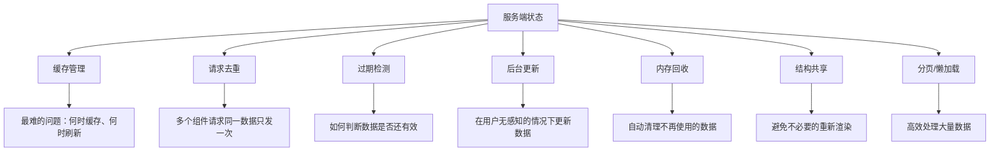

传统客户端状态管理库（Redux、Zustand 等）**并不擅长处理这些挑战**，因为它们的设计目标不同：

- Redux 擅长管理可预测的客户端状态流
- 但用 Redux 管理服务端状态需要手动写 action/reducer/thunk 来模拟缓存、去重、刷新等逻辑
- 这些逻辑本质上是**基础设施问题**，而非**业务逻辑问题**，不应该由开发者手写

### 1.2.4 概念总结

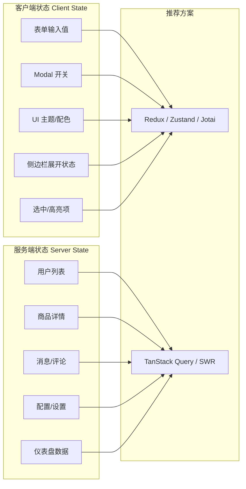

---

## 1.3 与主流方案的对比

### 1.3.1 对比矩阵

| 维度 | TanStack Query | SWR | RTK Query | Redux |
|------|---------------|-----|-----------|-------|
| **定位** | 服务端状态管理 | 服务端状态管理 | 服务端状态管理 | 客户端状态管理 |
| **框架支持** | React/Vue/Solid/Svelte/Angular | React（Vue 有 swrv） | 仅 React（Redux 生态） | 全框架通用 |
| **缓存策略** | staleTime + gcTime（可精确控制） | revalidateOnFocus/Interval | invalidation-based | 手动管理 |
| **请求去重** | 内置（自动合并相同请求） | 内置 | 内置 | 需手动实现 |
| **后台刷新** | 自动（窗口聚焦、网络恢复等） | 自动 | 手动 | 不适用 |
| **类型安全** | 完整 TypeScript 支持 | 完整 TypeScript 支持 | 完整 TypeScript 支持 | 需额外配置 |
| **DevTools** | 专用 DevTools 面板 | 无专用工具 | Redux DevTools | Redux DevTools |
| **包大小** | ~13KB（react-query） | ~4.6KB | ~9KB（含 Redux） | ~7KB（不含中间件） |
| **学习曲线** | 低（声明式 API） | 低（API 极简） | 中（需理解 Redux） | 高（概念繁多） |
| **Mutations** | 内置 useMutation + 乐观更新 | 内置 mutate | 内置 mutations | 手写 thunk/saga |
| **分页/无限** | 内置 useInfiniteQuery | 需自行封装 | 需手动处理 | 不适用 |
| **SSR/SSG** | 完整支持（hydration API） | 支持 | 支持 | 不适用 |
| **离线支持** | 插件化（persistQueryClient） | 有限 | 有限 | 不适用 |

### 1.3.2 TanStack Query vs SWR

**SWR**（由 Vercel 团队开发）与 TanStack Query 理念相似，都是"stale-while-revalidate"策略的实现。核心差异：

- **功能范围**：TanStack Query 功能更全面（分页、无限加载、预取、精确缓存控制）；SWR API 更精简
- **缓存粒度**：TanStack Query 的 staleTime/gcTime 可针对每个查询独立配置；SWR 主要通过全局配置
- **Query Keys**：TanStack Query 的数组式 Query Key 更灵活，支持自动过滤和模式匹配
- **生态**：TanStack Query 是多框架的（React/Vue/Solid/Svelte/Angular）；SWR 主要面向 React
- **社区规模**：TanStack Query npm 下载量超过 SWR 数倍，社区更大

**选择建议**：简单项目两者均可；需要高级功能（分页、预取、多框架）选 TanStack Query。

### 1.3.3 TanStack Query vs RTK Query

**RTK Query** 是 Redux Toolkit 的附加模块，专为数据获取设计：

- **依赖关系**：RTK Query 强依赖 Redux 生态；TanStack Query 独立运行
- **配置复杂度**：RTK Query 需要定义 API slice、endpoint 等；TanStack Query 直接声明式调用
- **灵活性**：TanStack Query 可在组件级别精细控制每个查询；RTK Query 更多在 API 层面定义
- **共存**：RTK Query 与 Redux store 紧密集成；TanStack Query 完全独立于 Redux

**选择建议**：已有 Redux 技术栈可用 RTK Query；独立项目或新架构推荐 TanStack Query。

### 1.3.4 TanStack Query vs Redux

它们解决的是**完全不同的问题**：

| 场景 | 推荐方案 |
|------|---------|
| 获取并缓存 API 数据 | TanStack Query |
| 表单输入值 | Redux / Zustand |
| UI 交互状态（Modal、Tab） | Redux / Zustand |
| 服务端数据的实时更新 | TanStack Query |
| 跨组件的复杂状态流 | Redux |
| 用户偏好/主题设置 | Zustand / Jotai |

官方文档的态度很明确：**TanStack Query 不替代 Redux，而是补充它**。如果你同时需要两者，TanStack Query 处理服务端状态，Redux 处理客户端状态。

---

## 1.4 适用场景与不适用场景

### 1.4.1 适用场景

- **RESTful API 数据获取**：最常见的用例，获取用户列表、商品详情等
- **GraphQL 查询**：配合 graphql-request 或 Apollo 使用
- **分页与无限滚动**：内置 `useInfiniteQuery` 处理分页加载
- **实时数据更新**：通过 refetchInterval 实现轮询，或结合 WebSocket 手动更新缓存
- **表单提交后的数据刷新**：通过 mutation + invalidation 自动更新相关查询
- **预取与路由集成**：在路由跳转前预取数据，实现瞬时页面切换
- **SSR/SSG 应用**：Next.js、Remix 等框架中的服务端渲染 hydration
- **离线应用**：通过 `persistQueryClient` 插件实现数据持久化
- **后台管理系统**：大量 CRUD 操作，需要乐观更新和自动刷新
- **仪表盘/数据看板**：需要定时刷新、多数据源聚合

### 1.4.2 不适用场景

- **高频实时数据**（如聊天消息、股票行情）：TanStack Query 的轮询机制有最小间隔，WebSocket 更适合
- **纯客户端状态**（如表单值、UI 开关）：应使用 Zustand、Jotai、Redux 等客户端状态库
- **复杂的状态机逻辑**：如多步骤向导、复杂工作流，应使用 XState 等状态机库
- **超大型全局状态树**：如果应用有极其复杂的客户端状态交互，仍需 Redux/Zustand
- **极小包体积要求**：TanStack Query 约 13KB，如果对包体积极度敏感，可考虑更轻量的方案

### 1.4.3 选型决策流程图

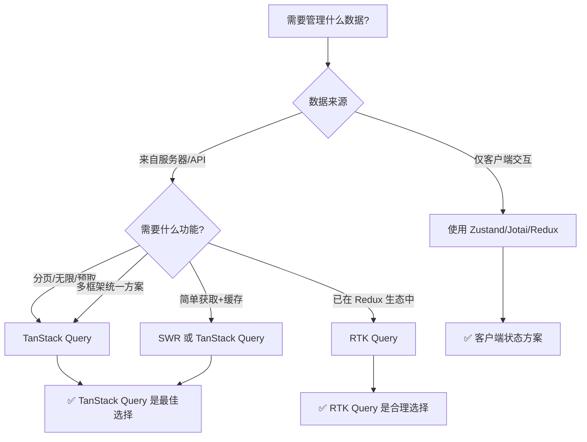

---

## 1.5 常见误区

### 误区 1："TanStack Query 是 Redux 的替代品"

**纠正**：它们解决不同层面的问题。TanStack Query 专门处理服务端状态（API 数据），Redux 处理客户端状态（UI 交互）。两者可以共存，且官方推荐这样使用。

### 误区 2："用了 TanStack Query 就不需要 axios 了"

**纠正**：TanStack Query 不替代 HTTP 客户端。`queryFn` 内部仍然需要 `fetch`、`axios` 等工具发起实际的网络请求。TanStack Query 管理的是请求的**生命周期**（缓存、刷新、去重），而非请求的**传输层**。

### 误区 3："缓存就是永远不重新请求"

**纠正**：TanStack Query 的缓存是**智能的**，不是永久的。默认情况下，数据在获取后立即变为"stale"（过期），下次组件挂载时会自动后台刷新。缓存的目的是**避免不必要的等待**，而不是**永远不更新**。

### 误区 4："每个 useQuery 都会发一次网络请求"

**纠正**：相同 `queryKey` 的多个 `useQuery` 调用会**自动共享数据**，只发起一次网络请求。这是 TanStack Query 内置的请求去重机制。

### 误区 5："只能在 React 中使用"

**纠正**：虽然最早叫 React Query，但 TanStack Query 已经发展为多框架库。官方支持 React、Vue、Solid、Svelte 和 Angular，每个框架都有对应的包（如 `@tanstack/vue-query`、`@tanstack/solid-query`）。

---

## 1.6 本章小结

| 关键点 | 说明 |
|--------|------|
| **核心定位** | 服务端状态的异步数据获取、缓存、同步和更新 |
| **本质区别** | 服务端状态 vs 客户端状态是两个不同的概念 |
| **核心优势** | 自动缓存、请求去重、后台刷新、垃圾回收、乐观更新 |
| **与其他方案** | 与 Redux 互补而非替代；比 SWR 功能更全面 |
| **学习成本** | 低（熟悉 Promise/async-await 即可上手） |

**下一步**：第 2 章将深入 TanStack Query 的核心架构，理解 QueryClient、Query Keys、缓存策略等底层机制。

---

> **参考来源**：
> 1. TanStack Query 官方文档 - Overview: https://tanstack.com/query/latest/docs/framework/react/overview
> 2. TanStack Query 官方文档 - Does this replace Redux?: https://tanstack.com/query/latest/docs/framework/react/guides/does-this-replace-client-state
> 3. TanStack Query 官方文档 - Comparison: https://tanstack.com/query/latest/docs/framework/react/comparison
> 4. TkDodo 博客 - Why You Want React Query: https://tkdodo.eu/blog/why-you-want-react-query
> 5. CSDN - TanStack Query 核心架构与设计原理

---

# 2. 核心架构与设计理念

> **本章目标**：深入理解 TanStack Query 的内部架构，包括 QueryClient 引擎、Query Keys 设计、缓存策略、请求去重机制以及多框架适配架构。

---

## 2.1 整体架构概览

### 2.1.1 模块化设计

TanStack Query 采用**核心 + 适配层**的架构模式，这是其能够支持多框架的根本原因：

```mermaid
graph TB
    subgraph "框架适配层 Framework Adapters"
        R[@tanstack/react-query]
        V[@tanstack/vue-query]
        S[@tanstack/solid-query]
        SV[@tanstack/svelte-query]
        A[@tanstack/angular-query]
    end

    subgraph "核心引擎 Core Engine"
        QC[query-core]
    end

    subgraph "开发者工具"
        DT[@tanstack/query-devtools]
    end

    subgraph "插件"
        P1[persistQueryClient]
        P2[broadcastQueryClient]
    end

    R --> QC
    V --> QC
    S --> QC
    SV --> QC
    A --> QC
    DT --> QC
    P1 --> QC
    P2 --> QC
```

**架构要点**：
- **`query-core`**：框架无关的核心逻辑，包含缓存管理、查询调度、垃圾回收等所有底层机制
- **框架适配层**：每个框架仅有一层薄薄的适配代码，将 `query-core` 的 API 转换为该框架的原生模式（React Hooks、Vue Composition API、Solid Signals 等）
- **零额外依赖**：核心引擎不依赖任何框架库，保证极小体积和高纯度

### 2.1.2 核心概念关系图

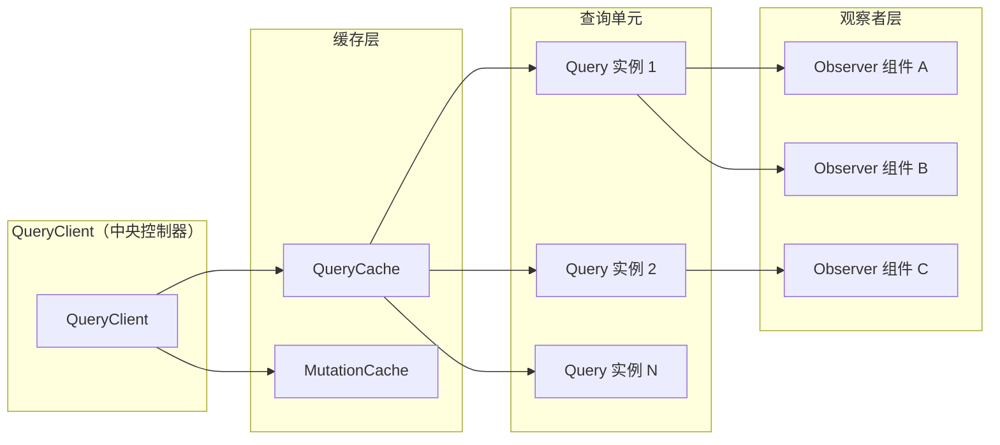

---

## 2.2 QueryClient：核心引擎

### 2.2.1 定义与职责

`QueryClient` 是 TanStack Query 架构的**中央控制器**，是所有操作的核心枢纽。它负责：

- 创建和管理查询缓存
- 协调所有的查询（Query）和变更（Mutation）操作
- 提供全局默认配置
- 暴露命令式 API（预取、失效、更新等）

### 2.2.2 实例化与生命周期

```typescript
import { QueryClient } from '@tanstack/react-query'

// 推荐：在模块顶层创建，全局单例
const queryClient = new QueryClient({
  defaultOptions: {
    queries: {
      staleTime: 60 * 1000,        // 数据新鲜时间：60 秒
      gcTime: 5 * 60 * 1000,       // 垃圾回收时间：5 分钟
      retry: 3,                     // 失败重试次数
      refetchOnWindowFocus: true,   // 窗口聚焦时自动刷新
    },
    mutations: {
      retry: 2,                     // mutation 失败重试次数
    },
  },
})
```

### 2.2.3 核心 API 全景

```typescript
// --- 查询相关 ---
queryClient.fetchQuery({ queryKey, queryFn })      // 立即发起请求并缓存
queryClient.prefetchQuery({ queryKey, queryFn })    // 预取数据（静默缓存）
queryClient.invalidateQueries({ queryKey })          // 标记查询为 stale 并触发刷新
queryClient.refetchQueries({ queryKey })             // 强制重新获取
queryClient.cancelQueries({ queryKey })              // 取消进行中的查询
queryClient.removeQueries({ queryKey })              // 从缓存中移除查询
queryClient.resetQueries({ queryKey })               // 重置查询状态

// --- 缓存读写 ---
queryClient.getQueryData(queryKey)                   // 同步读取缓存数据
queryClient.setQueryData(queryKey, updater)          // 同步写入缓存数据
queryClient.getQueriesData({ queryKey })             // 批量读取匹配查询的数据

// --- Mutation 相关 ---
queryClient.executeMutation(mutationOptions)         // 执行变更

// --- 缓存管理 ---
queryClient.clear()                                  // 清空所有缓存和进行中的请求
queryClient.getQueryCache()                          // 获取 QueryCache 实例
queryClient.getMutationCache()                       // 获取 MutationCache 实例

// --- 订阅 ---
queryClient.subscribe(callback)                      // 订阅所有缓存变更
```

### 2.2.4 重要原则：全局单例

```tsx
// ✅ 正确：在模块顶层创建，保证全局单例
const queryClient = new QueryClient()

export default function App() {
  return (
    <QueryClientProvider client={queryClient}>
      <Outlet />
    </QueryClientProvider>
  )
}

// ❌ 错误：在组件内部创建，每次渲染都会创建新实例
function App() {
  const queryClient = new QueryClient() // 每次渲染都创建新实例！
  return (
    <QueryClientProvider client={queryClient}>
      <Outlet />
    </QueryClientProvider>
  )
}
```

**原因**：如果每次渲染都创建新的 `QueryClient`，那么：
- 每次渲染都会创建全新的缓存
- 之前的查询数据全部丢失
- 组件每次挂载都会重新发起请求
- 完全丧失了缓存和去重的意义

ESLint 插件提供了 `@tanstack/query/stable-query-client` 规则来自动检测此类问题。

---

## 2.3 Query Keys：结构化设计

### 2.3.1 定义与本质

**Query Key** 是 TanStack Query 中每个查询的**唯一标识符**，用于：
- 区分不同的查询
- 缓存查找与复用
- 批量操作（失效、预取、取消等）
- 调试与 DevTools 展示

### 2.3.2 结构化数组设计

Query Key 采用**数组形式**，这使得它可以携带结构化的上下文信息：

```typescript
// 最简单的 key
useQuery({ queryKey: ['todos'], queryFn: fetchTodos })

// 带参数的 key（自动序列化）
useQuery({ queryKey: ['todos', { page: 1, status: 'active' }], queryFn: () => fetchTodos(1, 'active') })

// 嵌套层级的 key
useQuery({ queryKey: ['teams', teamId, 'members', { filter: 'active' }], queryFn: () => fetchMembers(teamId, 'active') })

// 带版本的 key（用于 API 版本管理）
useQuery({ queryKey: ['v1', 'users', userId], queryFn: () => fetchUser(userId) })
```

### 2.3.3 Key 设计最佳实践

```mermaid
graph TD
    A[Query Key 设计原则] --> B[数组形式]
    A --> C[从通用到具体]
    A --> D[包含所有变量]
    A --> E[保持引用稳定]

    B --> B1[使用数组而非字符串]
    B --> B2[对象会被结构化序列化]

    C --> C1[推荐: ['entities', id, 'sub-entity']]
    C --> C2[❌ 避免: ['getUserById123']]

    D --> D1[所有影响结果的变量都应包含在 key 中]
    D --> D2[分页参数、过滤条件、排序等]

    E --> E1[使用字面量或 useMemo]
    E --> E2[❌ 避免每次渲染创建新对象/数组]
```

**实践示例**：

```typescript
// ✅ 好的设计：从通用到具体，包含所有变量
useQuery({
  queryKey: ['projects', projectId, 'tasks', { status: 'active', sortBy: 'date' }],
  queryFn: () => fetchTasks(projectId, { status: 'active', sortBy: 'date' }),
})

// ❌ 不好的设计：将参数放在 queryFn 中但不包含在 key 中
useQuery({
  queryKey: ['tasks'],  // 缺少变量！不同参数会共享同一缓存
  queryFn: () => fetchTasks(projectId, { status: 'active' }),
})

// ✅ 好的设计：动态 key 与引用稳定性
function TaskList({ projectId, status }: { projectId: number; status: string }) {
  // 使用 useMemo 保持 key 的引用稳定
  const queryKey = useMemo(
    () => ['projects', projectId, 'tasks', { status }] as const,
    [projectId, status]
  )

  return useQuery({
    queryKey,
    queryFn: () => fetchTasks(projectId, { status }),
  })
}
```

### 2.3.4 Query Key 的匹配规则

TanStack Query 支持**前缀匹配**模式，这对于批量操作非常重要：

```typescript
// 假设缓存中有以下查询：
// ['todos']       → data1
// ['todos', 1]    → data2
// ['todos', 2]    → data3
// ['todos', 1, 'comments'] → data4

// 使所有以 'todos' 开头的查询失效
queryClient.invalidateQueries({ queryKey: ['todos'] })
// 结果：所有 4 个查询都被标记为 stale

// 只使特定 todo 的查询失效
queryClient.invalidateQueries({ queryKey: ['todos', 1] })
// 结果：['todos', 1] 和 ['todos', 1, 'comments'] 被标记为 stale

// 精确匹配（exact: true）
queryClient.invalidateQueries({ queryKey: ['todos'], exact: true })
// 结果：只有 ['todos'] 被标记为 stale
```

---

## 2.4 缓存策略：staleTime 与 gcTime

### 2.4.1 核心概念定义

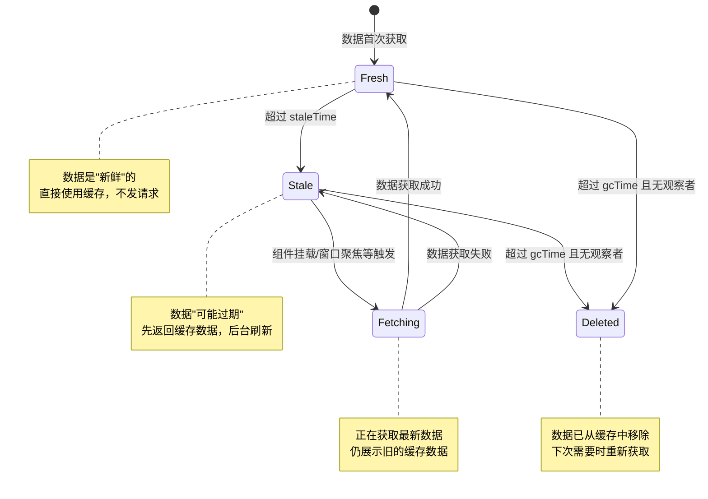

### 2.4.2 staleTime（数据新鲜时间）

**定义**：数据从获取完成开始计算，在 `staleTime` 时间内被视为"新鲜"。在此时间窗口内，再次访问该查询将直接使用缓存数据，不会触发网络请求。

```typescript
useQuery({
  queryKey: ['user', userId],
  queryFn: () => fetchUser(userId),
  staleTime: 5 * 60 * 1000, // 5 分钟内视为新鲜
})
```

**关键行为**：
- `staleTime = 0`（默认值）：数据立即变为 stale，下次访问时先返回缓存再后台刷新
- `staleTime = Infinity`：数据永远视为新鲜，永远不自动刷新
- `staleTime = 60000`：数据 60 秒内不自动刷新

**理解 staleTime 的关键**：staleTime 不是"缓存过期时间"，而是"不自动刷新的时间窗口"。数据在 stale 状态下**仍然存在于缓存中**，只是下次访问时会触发后台刷新。

### 2.4.3 gcTime（垃圾回收时间）

> **v5 变更**：在 v5 之前，这个参数叫 `cacheTime`，v5 更名为 `gcTime`（Garbage Collection Time），语义更清晰。

**定义**：当一个查询不再有任何活跃的观察者（组件卸载、取消订阅）后，其缓存数据还会保留 `gcTime` 时间。超过此时间后，数据被垃圾回收机制自动清理。

```typescript
useQuery({
  queryKey: ['todos'],
  queryFn: fetchTodos,
  gcTime: 10 * 60 * 1000, // 无观察者时保留 10 分钟
})
```

**关键行为**：
- `gcTime = 5 * 60 * 1000`（默认值 5 分钟）：数据在无观察者 5 分钟后被清理
- `gcTime = Infinity`：数据永远不会被垃圾回收（谨慎使用，可能导致内存泄漏）
- `gcTime = 0`：数据在无观察者后立即被清理

### 2.4.4 staleTime vs gcTime 对比

| 维度 | staleTime | gcTime |
|------|-----------|--------|
| **作用阶段** | 数据有观察者时 | 数据无观察者后 |
| **控制什么** | 何时自动刷新数据 | 何时清理缓存数据 |
| **默认值** | 0（立即 stale） | 5 分钟 |
| **典型场景** | 频繁更新的数据设短，稳定数据设长 | 大数据量可缩短，重要数据可延长 |
| **影响** | 影响网络请求频率 | 影响内存占用 |
| **类比** | "数据多久需要重新验证" | "没人要的数据留多久再扔" |

### 2.4.5 缓存策略配置示例

```typescript
const queryClient = new QueryClient({
  defaultOptions: {
    queries: {
      // 全局默认：数据立即 stale，缓存保留 5 分钟
      staleTime: 0,
      gcTime: 5 * 60 * 1000,
    },
  },
})

// 不同场景的差异化配置
function UserProfile({ userId }: { userId: string }) {
  // 用户资料：变化不频繁，设置 5 分钟新鲜期
  return useQuery({
    queryKey: ['users', userId],
    queryFn: () => fetchUser(userId),
    staleTime: 5 * 60 * 1000,
  })
}

function StockPrice({ symbol }: { symbol: string }) {
  // 股票价格：实时变化，设置 10 秒新鲜期
  return useQuery({
    queryKey: ['stocks', symbol],
    queryFn: () => fetchStockPrice(symbol),
    staleTime: 10 * 1000,
    refetchInterval: 30 * 1000, // 额外：每 30 秒自动刷新
  })
}

function StaticConfig() {
  // 静态配置：几乎不变，设为永远新鲜
  return useQuery({
    queryKey: ['config'],
    queryFn: fetchConfig,
    staleTime: Infinity,
  })
}
```

---

## 2.5 请求去重与并发控制

### 2.5.1 请求去重（Deduping）机制

当多个组件同时请求相同的数据时，TanStack Query 会自动将这些请求**合并为一次**：

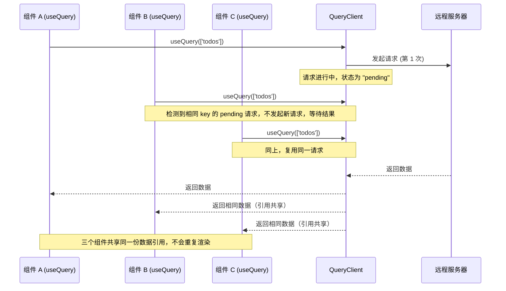

**核心实现原理**：
1. 每个 `Query` 在 `QueryCache` 中维护一个观察者（Observer）列表
2. 当第一个观察者挂载时，触发网络请求
3. 后续相同 `queryKey` 的观察者挂载时，直接订阅已有的 `Query` 实例
4. 所有观察者共享同一份数据引用（通过**结构化共享**确保引用稳定）

### 2.5.2 并发控制与批量操作

```typescript
// 批量预取：并行发起多个请求
await Promise.all([
  queryClient.prefetchQuery({ queryKey: ['todos'], queryFn: fetchTodos }),
  queryClient.prefetchQuery({ queryKey: ['users'], queryFn: fetchUsers }),
  queryClient.prefetchQuery({ queryKey: ['config'], queryFn: fetchConfig }),
])

// 串行预取（有依赖关系时）
const user = await queryClient.fetchQuery({
  queryKey: ['user', userId],
  queryFn: () => fetchUser(userId),
})
// 使用 user 信息预取其相关数据
await queryClient.prefetchQuery({
  queryKey: ['todos', userId],
  queryFn: () => fetchUserTodos(userId),
})

// 取消进行中的请求
queryClient.cancelQueries({ queryKey: ['todos'] })
```

---

## 2.6 内部调度机制

### 2.6.1 观察者模式（Observer Pattern）

TanStack Query 的底层基于**观察者模式**实现数据流管理：

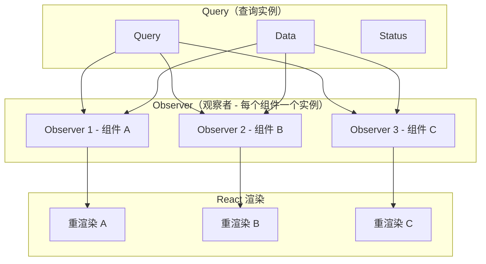

**工作流程**：
1. `Query` 对象存储数据、状态、错误等信息
2. 每个调用 `useQuery` 的组件创建一个 `Observer`
3. `Observer` 订阅 `Query` 的状态变更
4. 当 `Query` 数据更新时，通知所有 `Observer`
5. 每个 `Observer` 触发所在组件的重渲染

### 2.6.2 结构化共享（Structural Sharing）

**问题**：当查询结果部分更新时，如何避免不必要的组件重渲染？

**方案**：TanStack Query 使用**结构化共享**来保持未变化部分的引用稳定：

```typescript
// 第一次获取
const data1 = [
  { id: 1, name: 'Task A', done: false },
  { id: 2, name: 'Task B', done: false },
  { id: 3, name: 'Task C', done: false },
]

// 后台刷新后，只有 Task B 变为 done
const data2 = [
  { id: 1, name: 'Task A', done: false },  // ← 同一引用
  { id: 2, name: 'Task B', done: true },   // ← 新引用（变化了）
  { id: 3, name: 'Task C', done: false },  // ← 同一引用
]
```

通过结构化共享，React 的 `useMemo` / `React.memo` 可以正常运作，避免不必要的重渲染。

### 2.6.3 事件驱动的自动刷新

TanStack Query 内置了多种**自动刷新触发器**：

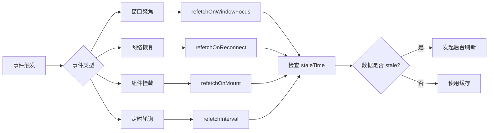

| 触发器 | 默认行为 | 说明 |
|--------|---------|------|
| `refetchOnWindowFocus` | `true` | 用户切换回页面时自动刷新 |
| `refetchOnReconnect` | `true` | 网络断开重连后自动刷新 |
| `refetchOnMount` | `true` | 组件重新挂载时（数据 stale 才刷新） |
| `refetchInterval` | `false` | 定时轮询刷新（可设为毫秒数） |

---

## 2.7 多框架适配架构

### 2.7.1 设计哲学："学会一次，到处复用"

TanStack Query 的核心设计理念是**框架无关**。所有业务逻辑（缓存管理、请求调度、垃圾回收）都放在 `query-core` 中，每个框架仅需一层薄薄的适配层。

### 2.7.2 框架适配层实现

| 框架 | 包名 | 适配方式 |
|------|------|---------|
| React | `@tanstack/react-query` | Custom Hooks (`useQuery`, `useMutation`) |
| Vue | `@tanstack/vue-query` | Composition API (`useQuery` 返回 ref) |
| Solid | `@tanstack/solid-query` | Solid Signals (`createQuery` 返回 signal) |
| Svelte | `@tanstack/svelte-query` | Svelte Stores (`createQuery` 返回 store) |
| Angular | `@tanstack/angular-query-experimental` | Inject 函数 + Signal |

### 2.7.3 跨框架 API 一致性

```typescript
// React
import { useQuery } from '@tanstack/react-query'
const { data, isLoading } = useQuery({ queryKey: ['todos'], queryFn: fetchTodos })

// Vue
import { useQuery } from '@tanstack/vue-query'
const { data, isLoading } = useQuery({ queryKey: ['todos'], queryFn: fetchTodos })

// Solid
import { createQuery } from '@tanstack/solid-query'
const { data, isLoading } = createQuery({ queryKey: ['todos'], queryFn: fetchTodos })

// Svelte
import { createQuery } from '@tanstack/svelte-query'
const { data, isLoading } = createQuery({ queryKey: ['todos'], queryFn: fetchTodos })
```

**核心要点**：
- 参数结构完全一致（`queryKey`、`queryFn`、`staleTime` 等）
- 返回值结构完全一致（`data`、`isLoading`、`error` 等）
- 仅函数名称略有不同（React/Vue 用 `useQuery`，Solid/Svelte 用 `createQuery`，这是遵循各框架的命名惯例）

### 2.7.4 Provider 模式对比

```tsx
// React: Context-based Provider
import { QueryClient, QueryClientProvider } from '@tanstack/react-query'
const queryClient = new QueryClient()

function App() {
  return <QueryClientProvider client={queryClient}>...</QueryClientProvider>
}

// Vue: Plugin-based injection
import { QueryClient, VueQueryPlugin } from '@tanstack/vue-query'
const queryClient = new QueryClient()

app.use(VueQueryPlugin, { queryClient })
```

---

## 2.8 常见误区

### 误区 1："gcTime 就是缓存过期时间"

**纠正**：gcTime 不是"缓存过期"的概念，而是"无观察者后保留多久"的概念。只要有一个组件在观察该查询，数据就永远不会被 gc。真正的"过期"由 staleTime 控制。

### 误区 2："Query Key 用字符串就行了"

**纠正**：数组式 Query Key 是 TanStack Query 的核心设计。字符串 key 无法携带结构化参数，也不支持前缀匹配和批量操作。官方 ESLint 插件甚至没有强制字符串限制，但最佳实践始终是数组。

### 误区 3："在组件内创建 QueryClient 也行"

**纠正**：这是最常见的架构错误。每次组件渲染都创建新的 `QueryClient`，意味着每次都创建全新的缓存系统，完全丧失了缓存的意义。必须在模块顶层或 React 中用 `useMemo` 创建。ESLint 规则 `@tanstack/query/stable-query-client` 可以自动检测此问题。

### 误区 4："多个相同 queryKey 的 useQuery 会各自请求"

**纠正**：TanStack Query 内置请求去重，相同 queryKey 的多个观察者共享同一份数据和同一个请求。这是由 QueryCache 中的 Query 实例唯一性保证的。

### 误区 5："staleTime 设得越长越好"

**纠正**：staleTime 过长会导致用户看到过期数据；过短会增加不必要的请求。应根据数据的实际更新频率设置。对于几乎不变的数据可以用 `Infinity`，对于频繁变化的数据应该用较短的 staleTime 或者配合 `refetchInterval`。

---

## 2.9 本章小结

| 核心概念 | 要点 |
|---------|------|
| **QueryClient** | 中央控制器，全局单例，管理所有缓存和操作 |
| **Query Keys** | 数组式设计，从通用到具体，包含所有变量 |
| **staleTime** | 控制数据新鲜期，决定何时自动刷新 |
| **gcTime** | 控制垃圾回收，决定无观察者后缓存保留多久 |
| **请求去重** | 相同 key 的请求自动合并，只发一次 |
| **结构化共享** | 部分更新时保持未变化部分的引用稳定 |
| **多框架适配** | query-core 统一核心逻辑，各框架仅有薄适配层 |

**下一步**：第 3 章将介绍工程化配置，包括安装、TypeScript 类型安全、DevTools 集成、全局默认选项和 ESLint 插件。

---

> **参考来源**：
> 1. TanStack Query 官方文档 - QueryClient Reference: https://tanstack.com/query/latest/docs/reference/QueryClient
> 2. TanStack Query 官方文档 - Query Keys Guide: https://tanstack.com/query/latest/docs/framework/react/guides/query-keys
> 3. TanStack Query 官方文档 - Caching Guide: https://tanstack.com/query/latest/docs/framework/react/guides/caching
> 4. TanStack Query 官方文档 - Important Defaults: https://tanstack.com/query/latest/docs/framework/react/guides/important-defaults
> 5. CSDN - 深入 TanStack Query 核心架构与设计原理
> 6. CSDN - 多层缓存架构 TanStack Query: 内存管理的终极艺术
> 7. CSDN - 多框架适配神器 TanStack Query: 一次学习，全栈通用

---

# 3. 快速开始与工程化配置

> **本章目标**：掌握 TanStack Query 在实际项目中的完整工程化配置，包括安装、TypeScript 类型安全、DevTools 集成、全局默认选项和 ESLint 插件。

---

## 3.1 安装与初始化

### 3.1.1 安装对应框架包

TanStack Query 为每个支持的前端框架提供独立的 npm 包：

```bash
# React 项目
npm install @tanstack/react-query

# Vue 项目
npm install @tanstack/vue-query

# Solid 项目
npm install @tanstack/solid-query

# Svelte 项目
npm install @tanstack/svelte-query

# Angular 项目（实验性）
npm install @tanstack/angular-query-experimental
```

**版本选择**：当前最新稳定版为 v5（`latest` tag），建议新项目直接使用 v5。如果是从 v4 升级，需参考官方的迁移指南。

### 3.1.2 QueryClientProvider：依赖注入

在 React 中，TanStack Query 使用 **React Context** 将 `QueryClient` 注入组件树：

```tsx
// src/main.tsx 或 src/App.tsx
import { QueryClient, QueryClientProvider } from '@tanstack/react-query'
import React from 'react'
import ReactDOM from 'react-dom/client'
import App from './App'

// 步骤 1：创建 QueryClient 实例（全局单例）
const queryClient = new QueryClient()

// 步骤 2：通过 Provider 注入应用
ReactDOM.createRoot(document.getElementById('root')!).render(
  <React.StrictMode>
    <QueryClientProvider client={queryClient}>
      <App />
    </QueryClientProvider>
  </React.StrictMode>
)
```

### 3.1.3 Provider 的工作原理

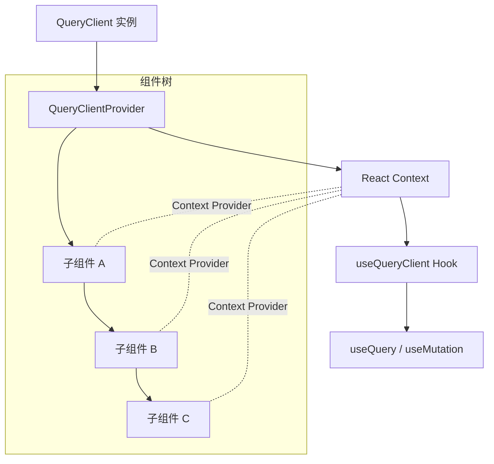

**关键点**：
- `QueryClientProvider` 使用 React Context 将 `QueryClient` 传递给所有子孙组件
- `useQuery` 和 `useMutation` 内部通过 `useQueryClient` 从 Context 中获取实例
- 每个 `QueryClient` 维护自己独立的缓存，因此**一个应用通常只需要一个 Provider**

### 3.1.4 多 Provider 场景（高级）

在极少数情况下，你可能需要多个 `QueryClient` 实例（如微前端、隔离的模块）：

```tsx
// 主应用使用主 QueryClient
const mainQueryClient = new QueryClient()

// 某个隔离模块使用独立的 QueryClient
const isolatedQueryClient = new QueryClient()

function App() {
  return (
    <QueryClientProvider client={mainQueryClient}>
      <MainApp />
      <QueryClientProvider client={isolatedQueryClient}>
        <IsolatedModule /> {/* 此模块有独立的缓存 */}
      </QueryClientProvider>
    </QueryClientProvider>
  )
}
```

---

## 3.2 TypeScript 类型安全配置

### 3.2.1 默认类型推断

TanStack Query 原生支持 TypeScript，`queryFn` 的返回值会自动推断 `data` 的类型：

```typescript
interface User {
  id: number
  name: string
  email: string
  avatarUrl: string
}

const { data } = useQuery({
  queryKey: ['user', 1],
  queryFn: async (): Promise<User> => {
    const res = await fetch('/api/users/1')
    return res.json()
  },
})
// data 的类型自动推断为 User | undefined
```

### 3.2.2 queryOptions：类型安全的最佳实践

v5 引入了 `queryOptions` 工具函数，提供**全局类型推断**和**类型复用**能力：

```typescript
// 1. 定义查询选项（可复用）
import { queryOptions } from '@tanstack/react-query'

function userOptions(userId: number) {
  return queryOptions({
    queryKey: ['users', userId] as const,
    queryFn: async (): Promise<User> => {
      const res = await fetch(`/api/users/${userId}`)
      return res.json()
    },
  })
}

// 2. 在组件中使用
function UserProfile({ userId }: { userId: number }) {
  const { data } = useQuery(userOptions(userId))
  // data 类型推断为 User | undefined

  // 预取也能获得完整的类型安全
  const queryClient = useQueryClient()
  await queryClient.prefetchQuery(userOptions(userId))
}
```

**`queryOptions` 的核心价值**：
- **类型推断传递**：`queryFn` 的返回值类型自动传递给 `useQuery` 的 `data` 字段
- **提取复用**：将查询逻辑提取为纯函数，可在组件内外复用
- **key 类型安全**：配合 `as const` 确保 queryKey 的字面量类型不被拓宽

### 3.2.3 全局类型声明

对于企业级项目，建议为 API 响应定义全局类型：

```typescript
// types/api.ts
export interface ApiError {
  code: number
  message: string
  details?: string
}

export interface PaginatedResponse<T> {
  data: T[]
  total: number
  page: number
  pageSize: number
  hasMore: boolean
}

// hooks/usePaginatedQuery.ts
import { useQuery, UseQueryResult } from '@tanstack/react-query'

export function usePaginatedQuery<T>(
  key: readonly unknown[],
  fetchFn: () => Promise<PaginatedResponse<T>>,
  options?: { page?: number; pageSize?: number }
): UseQueryResult<PaginatedResponse<T>, ApiError> {
  return useQuery({
    queryKey: [...key, options],
    queryFn: fetchFn,
  })
}
```

### 3.2.4 泛型参数（v5 推荐方式）

```typescript
// v5 推荐：通过 queryFn 返回值自动推断
const { data } = useQuery({
  queryKey: ['todos'],
  queryFn: (): Promise<Todo[]> => fetchTodos(),
})
// data: Todo[] | undefined

// 也可以显式指定泛型（通常不需要）
const { data } = useQuery<Todo[], Error>({
  queryKey: ['todos'],
  queryFn: fetchTodos,
})

// ❌ v5 已移除旧的三参数形式：
// useQuery(['todos'], fetchTodos) // v4 形式，v5 不再支持
```

### 3.2.5 常见类型问题与解决方案

| 问题 | 解决方案 |
|------|---------|
| `data` 类型为 `unknown` | 确保 `queryFn` 有明确的返回类型标注 |
| 类型推断为 `any` | 在 `tsconfig.json` 中设置 `"noImplicitAny": true` |
| 泛型嵌套过深 | 使用 `queryOptions` 提取为命名函数 |
| queryKey 类型不匹配 | 使用 `as const` 确保字面量类型 |

---

## 3.3 DevTools 集成

### 3.3.1 安装 DevTools

```bash
npm install @tanstack/react-query-devtools
```

### 3.3.2 基本集成

```tsx
import { QueryClient, QueryClientProvider } from '@tanstack/react-query'
import { ReactQueryDevtools } from '@tanstack/react-query-devtools'

const queryClient = new QueryClient()

function App() {
  return (
    <QueryClientProvider client={queryClient}>
      <RestOfApp />
      <ReactQueryDevtools initialIsOpen={false} />
    </QueryClientProvider>
  )
}
```

### 3.3.3 DevTools 功能概览

DevTools 提供了一个浮动面板，可以实时监控和调试所有查询的状态：

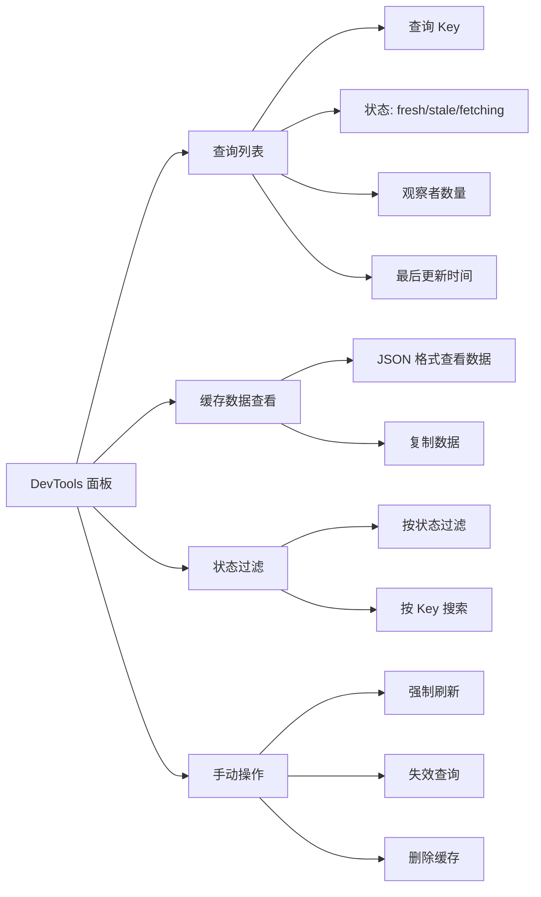

### 3.3.4 DevTools 配置选项

```tsx
<ReactQueryDevtools
  initialIsOpen={false}       // 默认是否展开面板
  position="bottom"           // 面板位置: 'top' | 'bottom' | 'left' | 'right'
  buttonPosition="bottom-right" // 浮动按钮位置
  errorTypes={[               // 自定义错误模拟类型
    { name: 'Network Error', initializer: () => new Error('Network Error') },
  ]}
/>
```

### 3.3.5 生产环境策略

DevTools 在开发环境非常有用，但在生产环境中通常不需要。推荐按环境条件加载：

```tsx
// 方式 1：动态导入（推荐）
function App() {
  return (
    <QueryClientProvider client={queryClient}>
      <RestOfApp />
      {process.env.NODE_ENV === 'development' && (
        <ReactQueryDevtools initialIsOpen={false} />
      )}
    </QueryClientProvider>
  )
}

// 方式 2：Vite 等构建工具的 import.meta.env
function App() {
  return (
    <QueryClientProvider client={queryClient}>
      <RestOfApp />
      {import.meta.env.DEV && <ReactQueryDevtools />}
    </QueryClientProvider>
  )
}
```

### 3.3.6 内嵌面板模式（高级）

DevTools 也支持以组件形式内嵌到页面中（而非浮动面板）：

```tsx
import { ReactQueryDevtoolsPanel } from '@tanstack/react-query-devtools'

function DebugPage() {
  return (
    <div style={{ height: '100vh' }}>
      <ReactQueryDevtoolsPanel style={{ height: '100%' }} />
    </div>
  )
}
```

---

## 3.4 全局默认选项配置

### 3.4.1 QueryClient 级别默认值

```typescript
import { QueryClient } from '@tanstack/react-query'

const queryClient = new QueryClient({
  defaultOptions: {
    // --- queries 的默认配置 ---
    queries: {
      // 数据新鲜时间（默认 0，即数据获取后立即 stale）
      staleTime: 0,

      // 垃圾回收时间（默认 5 分钟）
      gcTime: 5 * 60 * 1000,

      // 失败重试次数（默认 3 次）
      retry: 3,

      // 重试延迟策略（默认：指数退避）
      retryDelay: (attemptIndex) => Math.min(1000 * 2 ** attemptIndex, 30000),

      // 窗口聚焦时是否自动刷新（默认 true）
      refetchOnWindowFocus: true,

      // 网络恢复时是否自动刷新（默认 true）
      refetchOnReconnect: true,

      // 组件挂载时是否刷新 stale 数据（默认 true）
      refetchOnMount: true,

      // 网络模式（默认 'online'）
      // 'online': 仅在线时请求
      // 'always': 总是请求
      // 'offlineStorage': 离线时使用缓存
      networkMode: 'online',
    },

    // --- mutations 的默认配置 ---
    mutations: {
      retry: 0,  // mutation 默认不重试（写操作重试需慎重）
    },
  },
})
```

### 3.4.2 按环境差异化配置

```typescript
const isDev = process.env.NODE_ENV === 'development'

const queryClient = new QueryClient({
  defaultOptions: {
    queries: {
      // 开发环境：关闭自动刷新，方便调试
      refetchOnWindowFocus: isDev ? false : true,
      refetchOnMount: isDev ? false : true,
      staleTime: isDev ? Infinity : 0, // 开发环境数据永不过期

      // 生产环境：开启所有自动刷新
      retry: isDev ? 1 : 3, // 开发环境减少重试
    },
  },
})
```

### 3.4.3 常见默认配置策略

| 场景 | staleTime | gcTime | retry | refetchOnWindowFocus |
|------|-----------|--------|-------|---------------------|
| **数据看板** | 30 秒 | 10 分钟 | 3 | 开启 |
| **用户资料** | 5 分钟 | 30 分钟 | 2 | 开启 |
| **静态配置** | Infinity | 1 小时 | 1 | 关闭 |
| **实时行情** | 10 秒 | 5 分钟 | 1 | 开启 |
| **开发调试** | Infinity | 30 分钟 | 1 | 关闭 |

---

## 3.5 ESLint 插件

### 3.5.1 安装

```bash
npm install @tanstack/eslint-plugin-query
```

### 3.5.2 配置方式

#### ESLint 8.x（Flat Config 之前）

```jsonc
// .eslintrc.json
{
  "plugins": ["@tanstack/query"],
  "rules": {
    "@tanstack/query/exhaustive-deps": "error",
    "@tanstack/query/stable-query-client": "error",
    "@tanstack/query/no-rest-destructuring": "warn",
    "@tanstack/query/no-unstable-deps": "error",
    "@tanstack/query/infinite-query-property-order": "error",
    "@tanstack/query/no-void-query-fn": "error",
    "@tanstack/query/mutation-property-order": "warn",
    "@tanstack/query/prefer-query-options": "warn"
  }
}
```

#### ESLint 9.x（Flat Config）

```typescript
// eslint.config.js
import tanstackQuery from '@tanstack/eslint-plugin-query'

export default [
  {
    plugins: {
      '@tanstack/query': tanstackQuery,
    },
    rules: {
      '@tanstack/query/exhaustive-deps': 'error',
      '@tanstack/query/stable-query-client': 'error',
      '@tanstack/query/prefer-query-options': 'warn',
    },
  },
]
```

#### 使用 Flat Config 推荐预设

```typescript
// eslint.config.js
import tanstackQuery from '@tanstack/eslint-plugin-query'

export default [
  // 使用官方推荐配置
  tanstackQuery.configs['flat/recommended'],
]
```

### 3.5.3 核心规则详解

#### 规则 1：`@tanstack/query/exhaustive-deps`（重要）

**检测**：确保 `queryFn` 中使用的所有外部变量都包含在 `queryKey` 中。

```typescript
// ❌ 错误：userId 被用在 queryFn 中但不在 queryKey 中
useQuery({
  queryKey: ['user'],
  queryFn: () => fetchUser(userId), // userId 缺失！
})

// ✅ 正确：userId 同时出现在 queryKey 和 queryFn 中
useQuery({
  queryKey: ['user', userId],
  queryFn: () => fetchUser(userId),
})
```

**原理**：如果 `queryFn` 使用了不在 `queryKey` 中的变量，那么：
- 变量变化时，TanStack Query 无法感知到需要重新请求
- 可能导致缓存命中错误的数据
- 不同参数值会错误地共享同一缓存

#### 规则 2：`@tanstack/query/stable-query-client`（重要）

**检测**：确保 `QueryClient` 不在组件体内创建。

```typescript
// ❌ 错误：每次渲染创建新的 QueryClient
function App() {
  const queryClient = new QueryClient() // 每次渲染新实例！
  return (
    <QueryClientProvider client={queryClient}>
      <Outlet />
    </QueryClientProvider>
  )
}

// ✅ 正确：在模块顶层创建
const queryClient = new QueryClient()
function App() {
  return (
    <QueryClientProvider client={queryClient}>
      <Outlet />
    </QueryClientProvider>
  )
}

// ✅ 也可：在组件内用 useMemo 创建
function App() {
  const queryClient = useMemo(() => new QueryClient(), [])
  return (
    <QueryClientProvider client={queryClient}>
      <Outlet />
    </QueryClientProvider>
  )
}
```

#### 规则 3：`@tanstack/query/no-rest-destructuring`

**检测**：避免对 `useQuery` 返回值使用剩余展开（rest destructuring）。

```typescript
// ❌ 错误：...rest 包含了不稳定的内部属性
const { data, ...rest } = useQuery({ queryKey: ['todos'], queryFn: fetchTodos })

// ✅ 正确：显式解构需要的属性
const { data, isPending, error } = useQuery({ queryKey: ['todos'], queryFn: fetchTodos })
```

**原理**：`useQuery` 返回值中包含一些内部属性（如 `fetchStatus`），它们可能在不触发重渲染的情况下变化。剩余展开会导致组件在不应渲染时重新渲染。

#### 规则 4：`@tanstack/query/prefer-query-options`

**检测**：推荐使用 `queryOptions` 工具函数。

```typescript
// ❌ 不推荐：内联查询选项
function useUser(userId: number) {
  return useQuery({
    queryKey: ['user', userId],
    queryFn: () => fetchUser(userId),
  })
}

// ✅ 推荐：提取为 queryOptions
const userOptions = (userId: number) => queryOptions({
  queryKey: ['user', userId] as const,
  queryFn: () => fetchUser(userId),
})

function useUser(userId: number) {
  return useQuery(userOptions(userId))
}
```

### 3.5.4 ESLint 规则优先级建议

| 规则 | 推荐级别 | 说明 |
|------|---------|------|
| `exhaustive-deps` | **error** | 最关键，直接影响缓存正确性 |
| `stable-query-client` | **error** | 关键，影响缓存系统稳定性 |
| `no-unstable-deps` | **error** | 关键，防止依赖不稳定值 |
| `no-rest-destructuring` | **warn** | 影响性能但不影响正确性 |
| `prefer-query-options` | **warn** | 最佳实践，但不强制执行 |
| `no-void-query-fn` | **error** | 防止 queryFn 不返回值 |
| `infinite-query-property-order` | **error** | 确保 infinite query 配置正确 |
| `mutation-property-order` | **warn** | mutation 配置最佳实践 |

---

## 3.6 完整工程化模板

以下是一个生产就绪的完整配置示例：

```typescript
// src/query/client.ts
import { QueryClient } from '@tanstack/react-query'

export const queryClient = new QueryClient({
  defaultOptions: {
    queries: {
      staleTime: 60 * 1000,              // 1 分钟
      gcTime: 10 * 60 * 1000,            // 10 分钟
      retry: 2,
      refetchOnWindowFocus: false,       // 按需手动刷新
      refetchOnReconnect: true,
    },
  },
})
```

```tsx
// src/App.tsx
import { QueryClientProvider } from '@tanstack/react-query'
import { ReactQueryDevtools } from '@tanstack/react-query-devtools'
import { queryClient } from './query/client'

export default function App() {
  return (
    <QueryClientProvider client={queryClient}>
      <Router />
      {import.meta.env.DEV && <ReactQueryDevtools initialIsOpen={false} />}
    </QueryClientProvider>
  )
}
```

```typescript
// src/hooks/api.ts
import { queryOptions } from '@tanstack/react-query'
import type { User, PaginatedResponse } from '@/types'

const api = {
  users: {
    list: (page = 1, pageSize = 20) =>
      fetch(`/api/users?page=${page}&pageSize=${pageSize}`).then(
        (r) => r.json() as Promise<PaginatedResponse<User>>
      ),

    byId: (id: number) =>
      fetch(`/api/users/${id}`).then((r) => r.json() as Promise<User>),
  },
}

export const userKeys = {
  all: ['users'] as const,
  lists: () => [...userKeys.all, 'list'] as const,
  list: (filters: { page: number; pageSize: number }) =>
    [...userKeys.lists(), filters] as const,
  details: () => [...userKeys.all, 'detail'] as const,
  detail: (id: number) => [...userKeys.details(), id] as const,
}

export const userQueries = {
  list: (page?: number, pageSize?: number) =>
    queryOptions({
      queryKey: userKeys.list({ page: page ?? 1, pageSize: pageSize ?? 20 }),
      queryFn: () => api.users.list(page, pageSize),
    }),

  detail: (id: number) =>
    queryOptions({
      queryKey: userKeys.detail(id),
      queryFn: () => api.users.byId(id),
    }),
}
```

```tsx
// src/components/UserList.tsx
import { useQuery, useQueryClient } from '@tanstack/react-query'
import { userQueries } from '@/hooks/api'

export default function UserList({ page }: { page: number }) {
  const { data, isPending, error } = useQuery(userQueries.list(page))

  const queryClient = useQueryClient()

  // 预取下一页
  const handlePrefetchNext = () => {
    queryClient.prefetchQuery(userQueries.list(page + 1))
  }

  if (isPending) return <div>Loading...</div>
  if (error) return <div>Error: {error.message}</div>

  return (
    <div>
      <ul>
        {data.data.map((user) => (
          <li key={user.id}>{user.name}</li>
        ))}
      </ul>
      <button onClick={handlePrefetchNext}>Preload Next Page</button>
    </div>
  )
}
```

```typescript
// eslint.config.js（ESLint 9 Flat Config）
import tanstackQuery from '@tanstack/eslint-plugin-query'

export default [
  tanstackQuery.configs['flat/recommended'],
  // ... 其他配置
]
```

---

## 3.7 常见误区

### 误区 1："DevTools 要打包到生产环境"

**纠正**：DevTools 会增加包体积和运行时开销。生产环境中应通过环境判断条件（`import.meta.env.DEV` 或 `process.env.NODE_ENV`）排除 DevTools。

### 误区 2："全局 staleTime 设一个值就行了"

**纠正**：不同数据的更新频率差异很大。全局默认值只能覆盖一般情况，关键查询应单独配置。例如静态配置用 `Infinity`，实时数据用秒级，用户资料用分钟级。

### 误区 3："ESLint 插件可有可无"

**纠正**：`exhaustive-deps` 和 `stable-query-client` 两个规则直接关乎应用的正确性和性能。不使用这些规则，开发者容易写出缓存错乱或重复请求的代码。推荐至少启用 `flat/recommended` 预设。

### 误区 4："TypeScript 不需要特别配置"

**纠正**：虽然 TanStack Query 内置了 TS 支持，但 `queryFn` 没有返回类型标注时，`data` 会被推断为 `unknown`。建议始终为 `queryFn` 添加明确的返回类型或使用 `queryOptions` 来获得完整的类型推断链。

---

## 3.8 本章小结

| 配置项 | 要点 |
|--------|------|
| **安装** | 使用对应框架包（如 `@tanstack/react-query`） |
| **Provider** | 全局单例 QueryClient，通过 Context 注入 |
| **TypeScript** | 使用 `queryOptions` 获得最佳类型推断 |
| **DevTools** | 开发环境必备，生产环境应排除 |
| **全局默认值** | staleTime/gcTime/retry 等按项目需求配置 |
| **ESLint 插件** | 至少启用 `flat/recommended` 预设 |
| **工程模板** | queryOptions + key factory 函数是最佳实践 |

---

> **参考来源**：
> 1. TanStack Query 官方文档 - Installation: https://tanstack.com/query/latest/docs/framework/react/installation
> 2. TanStack Query 官方文档 - TypeScript: https://tanstack.com/query/latest/docs/framework/react/typescript
> 3. TanStack Query 官方文档 - Devtools: https://tanstack.com/query/latest/docs/framework/react/devtools
> 4. TanStack Query 官方文档 - ESLint Plugin: https://tanstack.com/query/latest/docs/eslint/eslint-plugin-query
> 5. TanStack Query 官方文档 - queryOptions Reference: https://tanstack.com/query/latest/docs/framework/react/reference/queryOptions
> 6. TanStack Query 官方文档 - Important Defaults: https://tanstack.com/query/latest/docs/framework/react/guides/important-defaults

---

# 4. 核心 API 详解

> 本章深入讲解 TanStack Query 最核心的五个 API：`useQuery`、`useMutation`、`useInfiniteQuery`、`useQueryClient`，以及它们背后的 `QueryObserver` 机制。所有内容基于 TanStack Query v5 官方文档，并结合源码分析讲解内部实现。

---

## 4.1 useQuery —— 数据获取的核心 Hook

### 4.1.1 概念定义

**useQuery 是什么？**

> A query is a declarative dependency on an asynchronous source of data that is tied to a **unique key**.

`useQuery` 是 TanStack Query 最核心的 Hook，用于声明式地获取和缓存异步数据。它将一个异步数据源（通常是一个返回 Promise 的函数）与一个唯一的 `queryKey` 绑定，自动管理加载状态、缓存、重试、后台刷新等一切与数据获取相关的生命周期。

**为什么需要 useQuery？**

传统的数据获取需要手动管理 `loading`、`error`、`data` 三个状态，处理竞态条件、请求去重、缓存过期等问题。`useQuery` 将这些逻辑封装成一个声明式 API，开发者只需描述"需要什么数据"，库负责处理"如何获取和管理"。

### 4.1.2 基本用法

```typescript
import { useQuery } from '@tanstack/react-query'

interface Todo {
  id: number
  title: string
  completed: boolean
}

async function fetchTodos(): Promise<Todo[]> {
  const response = await fetch('/api/todos')
  if (!response.ok) {
    throw new Error('Network response was not ok')
  }
  return response.json()
}

function TodoList() {
  const { isPending, isError, data, error, isFetching } = useQuery({
    queryKey: ['todos'],
    queryFn: fetchTodos,
  })

  if (isPending) return <p>Loading...</p>
  if (isError) return <p>Error: {error.message}</p>

  return (
    <ul>
      {data.map((todo) => (
        <li key={todo.id}>{todo.title}</li>
      ))}
    </ul>
  )
}
```

**关键点：**
- `queryKey` 是唯一的缓存标识符，影响重新获取、缓存和共享
- `queryFn` 必须返回一个 Promise，resolve 时返回数据，reject 时抛出错误
- v5 强制使用**对象参数语法**，不再支持 v4 的多重重载

### 4.1.3 返回值详解

`useQuery` 返回一个查询结果对象，包含以下核心字段：

#### 状态标志（status 系列）

| 字段 | 类型 | 说明 |
|------|------|------|
| `status` | `'pending' \| 'error' \| 'success'` | 查询的总体状态 |
| `isPending` | `boolean` | 等价于 `status === 'pending'`，查询正在等待首次数据 |
| `isError` | `boolean` | 等价于 `status === 'error'`，查询发生错误 |
| `isSuccess` | `boolean` | 等价于 `status === 'success'`，查询成功获取到数据 |

#### 获取状态（fetchStatus 系列）

| 字段 | 类型 | 说明 |
|------|------|------|
| `fetchStatus` | `'fetching' \| 'paused' \| 'idle'` | `queryFn` 的运行状态 |
| `isFetching` | `boolean` | 等价于 `fetchStatus !== 'idle'`，查询正在获取中（含后台刷新） |
| `isRefetching` | `boolean` | 查询正在进行后台重新获取 |
| `isLoading` | `boolean` | 等价于 `isPending && isFetching`，首次加载且正在请求 |

**重要区分：**

> - `status` 告诉你关于 **data** 的信息：我们有没有数据？
> - `fetchStatus` 告诉你关于 **queryFn** 的信息：它是否在运行？

这意味着一个查询可以处于 `isSuccess` 状态（有缓存数据），同时 `isFetching` 为 true（正在后台刷新）。这是 TanStack Query "stale-while-revalidate" 策略的核心体现。

#### 数据与错误

| 字段 | 类型 | 说明 |
|------|------|------|
| `data` | `TData \| undefined` | 查询结果数据，仅在 `isSuccess` 时可用 |
| `error` | `TError \| null` | 错误对象，仅在 `isError` 时可用 |
| `dataUpdatedAt` | `number` | 数据最后一次更新的时间戳 |
| `errorUpdatedAt` | `number` | 错误最后一次更新的时间戳 |

#### 元信息

| 字段 | 类型 | 说明 |
|------|------|------|
| `isStale` | `boolean` | 缓存数据是否已过时（stale），过时意味着下次挂载时会重新获取 |
| `isFetched` | `boolean` | 查询是否已经被获取过 |
| `fetchFailureCount` | `number` | 当前查询失败的次数 |
| `refetch` | `() => Promise<UseQueryResult>` | 手动触发重新获取的函数 |

### 4.1.4 推荐的状态检查模式

```typescript
// 推荐：先检查 isPending，再检查 isError
if (isPending) return <p>Loading...</p>
if (isError) return <p>Error: {error.message}</p>

// 此时 TypeScript 会自动收窄 data 的类型
return <List items={data} />
```

**为什么不用 `isLoading`？** `isLoading` 仅在首次加载时为 true，如果已有缓存数据但在后台刷新，`isLoading` 为 false 而 `isFetching` 为 true。大多数场景下检查 `isPending` 更准确。

### 4.1.5 useQuery 所有配置选项

| 选项 | 类型 | 默认值 | 说明 |
|------|------|--------|------|
| `queryKey` | `unknown[]` | **必填** | 唯一标识查询的数组，用于缓存和失效 |
| `queryFn` | `Function` | **必填** | 返回 Promise 的异步数据获取函数 |
| `enabled` | `boolean` | `true` | 是否自动执行查询。设为 `false` 时禁用自动获取 |
| `staleTime` | `number` | `0` | 数据被认为"新鲜"的时间（毫秒）。在此期间不会触发后台刷新 |
| `gcTime` | `number` | `300000`（5 分钟） | 未使用缓存的垃圾回收时间。设为 `Infinity` 禁用清理 |
| `refetchOnMount` | `boolean \| "always"` | `true` | 组件重新挂载时是否重新获取 |
| `refetchOnWindowFocus` | `boolean` | `true` | 窗口重新获得焦点时是否重新获取 |
| `refetchOnReconnect` | `boolean` | `true` | 网络连接恢复时是否重新获取 |
| `refetchInterval` | `number \| false` | `false` | 轮询间隔（毫秒）。设为数字启用定时刷新 |
| `refetchIntervalInBackground` | `boolean` | `false` | 窗口失焦时是否继续轮询 |
| `retry` | `boolean \| number` | `3` | 失败时重试次数。`true` 表示无限重试 |
| `retryDelay` | `number \| Function` | 指数退避 | 重试延迟时间 |
| `select` | `Function` | `undefined` | 数据选择/转换函数，支持结构共享 |
| `placeholderData` | `any \| Function` | `undefined` | 数据加载前的占位数据 |
| `initialData` | `any \| Function` | `undefined` | 初始数据，跳过首次请求 |
| `throwOnError` | `boolean` | `false` | 错误是否抛出到错误边界 |
| `networkMode` | `'online' \| 'always' \| 'offlineFirst'` | `'online'` | 网络模式控制 |
| `queryKeyHashFn` | `Function` | `JSON.stringify` | 自定义 queryKey 哈希函数 |
| `initialDataUpdatedAt` | `number` | `undefined` | 初始数据的更新时间戳 |
| `structuralSharing` | `boolean` | `true` | 是否启用结构共享优化 |
| `maxPages` | `number` | `undefined` | （仅无限查询）限制缓存的最大页面数 |
| `persister` | `Function` | `undefined` | 自定义持久化函数 |

### 4.1.6 queryKey 最佳实践

```typescript
// 好的 queryKey：扁平、包含所有变量
useQuery({ queryKey: ['todos', userId, filter], queryFn: ... })

// queryKey 应该是数组，包含所有影响结果的变量
useQuery({ queryKey: ['todo', todoId], queryFn: () => fetchTodo(todoId) })

// 对象形式的 queryKey（推荐用于复杂查询）
useQuery({
  queryKey: ['todos', { status: 'active', assignee: userId }],
  queryFn: () => fetchTodos({ status: 'active', assignee: userId }),
})
```

**queryKey 规则：**
- 必须是数组，支持任意深度的嵌套对象
- 应该包含所有影响查询结果的变量
- 使用扁平结构而非深层嵌套，便于精确匹配和失效
- 相同 queryKey 的所有查询共享同一份缓存数据

### 4.1.7 queryFn 详解

`queryFn` 接收一个包含查询上下文的参数对象：

```typescript
async function fetchTodo({ queryKey, pageParam, signal, meta }) {
  const [, todoId] = queryKey // 从 queryKey 中解构变量
  const response = await fetch(`/api/todos/${todoId}`, {
    signal, // AbortSignal，用于查询取消
  })
  return response.json()
}

useQuery({
  queryKey: ['todo', 1],
  queryFn: fetchTodo,
})
```

**queryFn 参数说明：**

| 参数 | 类型 | 说明 |
|------|------|------|
| `queryKey` | `TQueryKey` | 当前查询的 key 数组 |
| `pageParam` | `unknown` | 无限查询的当前页面参数 |
| `signal` | `AbortSignal` | 用于取消请求的 AbortSignal |
| `meta` | `Record<string, unknown>` | 查询元数据 |

**取消请求：** queryFn 应该支持 `signal` 参数，当查询被取消时（如组件卸载、新请求覆盖旧请求），`AbortSignal` 会被触发，应将其传递给 `fetch` 以取消网络请求。

### 4.1.8 常见误区

**误区 1：在 queryFn 中使用 setState**

```typescript
// 错误：queryFn 不应该操作 React 状态
useQuery({
  queryKey: ['todos'],
  queryFn: async () => {
    const data = await fetchTodos()
    setTodos(data) // 不应该这样做！
    return data
  },
})
```

**正确做法：** 直接返回数据，让 useQuery 管理状态。

**误区 2：混淆 isFetching 和 isPending**

```typescript
// 错误：isFetching 在后台刷新时也为 true
if (isFetching) return <Loading /> // 每次窗口聚焦都会显示 Loading

// 正确：首次加载用 isLoading，后台刷新可以显示轻量指示器
if (isPending) return <Loading />
return (
  <>
    {isRefetching && <Spinner />}
    <List items={data} />
  </>
)
```

**误区 3：queryKey 缺少变量**

```typescript
// 错误：queryKey 不包含 userId，不同用户会共享同一份缓存
useQuery({ queryKey: ['todos'], queryFn: () => fetchTodos(userId) })

// 正确：queryKey 包含所有变量
useQuery({ queryKey: ['todos', userId], queryFn: () => fetchTodos(userId) })
```

---

## 4.2 useMutation —— 数据变更

### 4.2.1 概念定义

**useMutation 是什么？**

> Unlike queries, mutations are typically used to create/update/delete data or perform server-side effects.

`useMutation` 是用于执行数据变更操作（创建、更新、删除）的 Hook。与 `useQuery` 不同，mutation 不会自动执行，需要手动调用 `mutate` 或 `mutateAsync` 触发。

**为什么与 useQuery 分开？**

- Query 是声明式的，挂载即执行，关注"读取数据"
- Mutation 是命令式的，手动触发，关注"修改数据"
- 两者有不同的缓存策略和生命周期

### 4.2.2 基本用法

```typescript
import { useMutation } from '@tanstack/react-query'

interface CreateTodoInput {
  title: string
  completed?: boolean
}

interface Todo {
  id: number
  title: string
  completed: boolean
}

function CreateTodo() {
  const mutation = useMutation<Todo, Error, CreateTodoInput>({
    mutationFn: async (newTodo: CreateTodoInput) => {
      const response = await fetch('/api/todos', {
        method: 'POST',
        headers: { 'Content-Type': 'application/json' },
        body: JSON.stringify(newTodo),
      })
      return response.json()
    },
  })

  const handleSubmit = (e: React.FormEvent) => {
    e.preventDefault()
    const formData = new FormData(e.target as HTMLFormElement)
    mutation.mutate({
      title: formData.get('title') as string,
    })
  }

  if (mutation.isPending) return <p>Creating...</p>
  if (mutation.isSuccess) return <p>Todo created: {mutation.data.title}</p>
  if (mutation.isError) return <p>Error: {mutation.error.message}</p>

  return (
    <form onSubmit={handleSubmit}>
      <input name="title" required />
      <button type="submit">Create</button>
    </form>
  )
}
```

### 4.2.3 useMutation 返回值

| 字段 | 类型 | 说明 |
|------|------|------|
| `isIdle` | `boolean` | 初始或重置状态 |
| `isPending` | `boolean` | 正在执行中 |
| `isSuccess` | `boolean` | 成功完成 |
| `isError` | `boolean` | 发生错误 |
| `data` | `TData \| undefined` | 最近成功执行的结果 |
| `error` | `TError \| null` | 错误信息 |
| `variables` | `TVariables \| undefined` | 传递给 mutate 的变量 |
| `mutate` | `Function` | 触发 mutation 的函数（无返回值） |
| `mutateAsync` | `Function` | 触发 mutation 的函数（返回 Promise） |
| `reset` | `Function` | 重置 mutation 到初始状态 |
| `submittedAt` | `number` | mutation 被提交的时间戳 |

### 4.2.4 mutate vs mutateAsync

```typescript
// mutate：不返回 Promise，适合在事件处理器中使用
const handleClick = () => {
  mutation.mutate({ title: 'New Todo' })
  // 无法 await，但不会引起未捕获的 Promise rejection
}

// mutateAsync：返回 Promise，适合需要等待结果的场景
const handleClick = async () => {
  try {
    const result = await mutation.mutateAsync({ title: 'New Todo' })
    // 可以使用结果
    navigate(`/todos/${result.id}`)
  } catch (error) {
    // 需要手动捕获错误
    console.error('Failed to create todo', error)
  }
}
```

**选择建议：** 大多数情况使用 `mutate`，它更简单且不会产生未捕获的 Promise rejection。需要获取结果或进行链式操作时使用 `mutateAsync`。

### 4.2.5 生命周期回调

`useMutation` 提供四个生命周期回调（注意：`useQuery` 在 v5 中已移除这些回调，但 `useMutation` 保留了它们）：

```typescript
const mutation = useMutation({
  mutationFn: createTodo,

  // mutation 执行前触发，返回值会传递给 onError 和 onSettled
  onMutate: async (variables) => {
    console.log('About to create:', variables)
    // 可用于乐观更新，返回上下文对象
    return { startedAt: Date.now() }
  },

  // mutation 成功后触发
  onSuccess: (data, variables, context) => {
    console.log('Created:', data)
    // 常用于查询失效
    queryClient.invalidateQueries({ queryKey: ['todos'] })
  },

  // mutation 失败后触发
  onError: (error, variables, context) => {
    console.error('Failed to create:', error)
    // 可用于回滚乐观更新
  },

  // 无论成功或失败都会触发
  onSettled: (data, error, variables, context) => {
    console.log('Settled after:', Date.now() - (context?.startedAt ?? 0), 'ms')
  },
})
```

**回调的两种注册方式：**

```typescript
// 方式 1：在 useMutation 中注册（每次 mutation 都会触发）
const mutation = useMutation({
  mutationFn: createTodo,
  onSuccess: () => console.log('Always fires'),
})

// 方式 2：在 mutate 调用时传入（仅此次调用触发）
mutation.mutate(
  { title: 'New Todo' },
  {
    onSuccess: (data) => {
      // 仅此次调用触发
      navigate(`/todos/${data.id}`)
    },
  }
)
```

**区别：** `useMutation` 级别的回调每次都会触发；`mutate` 级别的回调只在当前调用时触发一次。如果组件在 mutation 完成前卸载，`mutate` 级别的回调不会执行，但 `useMutation` 级别的回调仍会执行。

### 4.2.6 传递变量

```typescript
// 传递单个对象
mutation.mutate({ title: 'New Todo', completed: false })

// 在 mutationFn 中接收
useMutation({
  mutationFn: async (variables: CreateTodoInput) => {
    // variables 就是 mutate 传入的值
    return fetch('/api/todos', {
      method: 'POST',
      body: JSON.stringify(variables),
    })
  },
})
```

### 4.2.7 连续 Mutations

```typescript
// 处理多个连续的 mutation 操作
const mutation = useMutation({
  mutationFn: async (todo: CreateTodoInput) => {
    const response = await fetch('/api/todos', {
      method: 'POST',
      body: JSON.stringify(todo),
    })
    return response.json()
  },
})

// 连续调用，每个调用独立执行
mutation.mutate({ title: 'Todo 1' })
mutation.mutate({ title: 'Todo 2' })
mutation.mutate({ title: 'Todo 3' })
```

### 4.2.8 mutationKey

```typescript
const mutation = useMutation({
  mutationKey: ['createTodo'],
  mutationFn: createTodo,
  onSuccess: () => {
    queryClient.invalidateQueries({ queryKey: ['todos'] })
  },
})
```

`mutationKey` 用于：
- 与 `useMutationState` 配合获取特定 mutation 的状态
- 在 DevTools 中标识 mutation

### 4.2.9 常见误区

**误区 1：在 useQuery 中使用 onSuccess 回调（v5 已移除）**

```typescript
// v4 的写法（v5 已废弃）
useQuery({
  queryKey: ['todos'],
  queryFn: fetchTodos,
  onSuccess: (data) => { ... }, // v5 中不存在！
})

// v5 正确做法：使用 useEffect
const { data } = useQuery({ queryKey: ['todos'], queryFn: fetchTodos })
useEffect(() => {
  if (data) {
    // 数据变化时执行逻辑
  }
}, [data])
```

**误区 2：mutation 重试**

mutation 默认不重试（`retry: 0`），因为重复执行 POST/PUT 可能导致数据重复。如需重试，请确保操作是幂等的。

**误区 3：忘记失效相关查询**

```typescript
// 错误：mutation 成功后没有失效相关查询
onSuccess: () => {
  toast.success('Todo created')
  // 列表页面不会自动更新！
}

// 正确：失效相关查询
onSuccess: () => {
  queryClient.invalidateQueries({ queryKey: ['todos'] })
}
```

---

## 4.3 useInfiniteQuery —— 无限滚动

### 4.3.1 概念定义

**useInfiniteQuery 是什么？**

`useInfiniteQuery` 是专门为无限滚动/加载更多场景设计的 Hook。它在 `useQuery` 的基础上增加了分页数据管理能力，自动处理多页数据的获取、缓存和合并。

**与普通 useQuery 的区别：**
- 返回的 `data` 是一个包含 `pages` 数组和 `pageParams` 数组的 `InfiniteData` 对象
- 提供 `fetchNextPage` 和 `fetchPreviousPage` 方法
- 提供 `hasNextPage`、`hasPreviousPage`、`isFetchingNextPage` 等状态标识

### 4.3.2 基本用法

```typescript
import { useInfiniteQuery } from '@tanstack/react-query'

interface Project {
  id: number
  name: string
}

interface ProjectsResponse {
  data: Project[]
  nextCursor: number | null
}

async function fetchProjects({ pageParam }: { pageParam: number }) {
  const response = await fetch(`/api/projects?cursor=${pageParam}`)
  return response.json() as Promise<ProjectsResponse>
}

function Projects() {
  const {
    data,
    fetchNextPage,
    fetchPreviousPage,
    hasNextPage,
    hasPreviousPage,
    isFetchingNextPage,
    isFetchingPreviousPage,
  } = useInfiniteQuery({
    queryKey: ['projects'],
    queryFn: fetchProjects,
    initialPageParam: 0,
    getNextPageParam: (lastPage) => lastPage.nextCursor,
    getPreviousPageParam: (firstPage) => firstPage.prevCursor,
  })

  return (
    <div>
      {data.pages.map((page) =>
        page.data.map((project) => (
          <div key={project.id}>{project.name}</div>
        ))
      )}

      {hasNextPage && (
        <button onClick={() => fetchNextPage()} disabled={isFetchingNextPage}>
          {isFetchingNextPage ? 'Loading...' : 'Load More'}
        </button>
      )}
    </div>
  )
}
```

### 4.3.3 核心配置选项

| 选项 | 类型 | 必填 | 说明 |
|------|------|------|------|
| `queryKey` | `unknown[]` | **是** | 查询唯一标识 |
| `queryFn` | `Function` | **是** | 接收 `{ pageParam, queryKey, signal }` 的异步函数 |
| `initialPageParam` | `unknown` | **是** | 初始页面参数（v5 新增必填项） |
| `getNextPageParam` | `Function` | **是** | 从最后一页数据中提取下一页参数，返回 `undefined` 表示没有更多 |
| `getPreviousPageParam` | `Function` | 否 | 从第一页数据中提取上一页参数 |
| `maxPages` | `number` | 否 | 限制缓存的最大页面数量 |

### 4.3.4 返回值详解

```typescript
interface InfiniteData<TData> {
  pages: TData[]         // 所有已加载的页面数据
  pageParams: unknown[]  // 对应的页面参数
}
```

| 字段 | 类型 | 说明 |
|------|------|------|
| `data` | `InfiniteData<TData>` | 包含 `pages` 和 `pageParams` 的无限数据对象 |
| `fetchNextPage` | `Function` | 加载下一页 |
| `fetchPreviousPage` | `Function` | 加载上一页 |
| `hasNextPage` | `boolean` | 是否还有下一页 |
| `hasPreviousPage` | `boolean` | 是否还有上一页 |
| `isFetchingNextPage` | `boolean` | 是否正在加载下一页 |
| `isFetchingPreviousPage` | `boolean` | 是否正在加载上一页 |

### 4.3.5 maxPages 优化

```typescript
// 限制缓存页面数量，防止内存溢出
useInfiniteQuery({
  queryKey: ['projects'],
  queryFn: fetchProjects,
  initialPageParam: 0,
  getNextPageParam: (lastPage) => lastPage.nextCursor,
  maxPages: 10, // 最多缓存 10 页
})
```

`maxPages` 会在加载新页面时移除最旧的页面，适合长列表场景。

### 4.3.6 常见误区

**误区 1：忘记设置 initialPageParam（v5 必填）**

```typescript
// v4（不需要 initialPageParam）
useInfiniteQuery({ queryKey: ['projects'], queryFn: fetch, getNextPageParam: ... })

// v5（必须设置 initialPageParam）
useInfiniteQuery({
  queryKey: ['projects'],
  queryFn: fetch,
  initialPageParam: 0, // v5 必填！
  getNextPageParam: (lastPage) => lastPage.nextCursor,
})
```

**误区 2：getNextPageParam 返回 null 而不是 undefined**

```typescript
// 错误：返回 null 会被当作有效的 pageParam
getNextPageParam: (lastPage) => lastPage.hasMore ? lastPage.nextCursor : null

// 正确：返回 undefined 表示没有更多数据
getNextPageParam: (lastPage) => lastPage.hasMore ? lastPage.nextCursor : undefined
```

**误区 3：data.pages 使用错误**

```typescript
// 错误：直接遍历 data
data.map((item) => ...) // ❌ data 是 InfiniteData 对象，不是数组

// 正确：遍历 data.pages
data.pages.map((page) =>
  page.data.map((item) => <div key={item.id}>{item.name}</div>)
)
```

---

## 4.4 useQueryClient —— 客户端操作

### 4.4.1 概念定义

**useQueryClient 是什么？**

`useQueryClient` 返回当前的 `QueryClient` 实例。`QueryClient` 是 TanStack Query 的核心引擎，负责管理查询缓存、协调查询执行和处理状态更新。

### 4.4.2 基本用法

```typescript
import { useQueryClient } from '@tanstack/react-query'

function MyComponent() {
  const queryClient = useQueryClient()

  // 使用 queryClient 的各种方法
  const handleClick = () => {
    queryClient.invalidateQueries({ queryKey: ['todos'] })
  }

  return <button onClick={handleClick}>Refresh Todos</button>
}
```

### 4.4.3 QueryClient 核心方法

#### invalidateQueries —— 使查询失效

```typescript
// 使所有以 'todos' 开头的查询失效
queryClient.invalidateQueries({ queryKey: ['todos'] })

// 精确匹配，只使 queryKey 完全等于 ['todos', 1] 的查询失效
queryClient.invalidateQueries({ queryKey: ['todos', 1], exact: true })

// 使用 predicate 函数进行复杂匹配
queryClient.invalidateQueries({
  predicate: (query) =>
    query.queryKey[0] === 'todos' && query.state.dataUpdatedAt < Date.now() - 3600000,
})
```

#### setQueryData —— 直接设置缓存数据

```typescript
// 直接更新缓存中的查询数据（同步操作，不会触发网络请求）
queryClient.setQueryData(['todo', 1], (old) =>
  old ? { ...old, completed: true } : old
)

// 如果缓存中没有该 key，会创建新条目
queryClient.setQueryData(['todos'], (old) => [...old, newTodo])
```

**原理：** `setQueryData` 直接修改内存中的缓存，不会触发任何网络请求。如果配合 `invalidateQueries` 使用，可以实现"乐观更新 + 后台验证"的模式。

#### getQueryData —— 读取缓存数据

```typescript
// 同步读取缓存数据，不触发任何网络请求
const todos = queryClient.getQueryData(['todos'])

// 返回 undefined 如果缓存中没有该 key
if (todos) {
  console.log('Cached todos:', todos)
}
```

#### fetchQuery —— 获取并缓存数据

```typescript
// 获取数据并缓存，返回 Promise<data>
const data = await queryClient.fetchQuery({
  queryKey: ['todo', 1],
  queryFn: fetchTodo,
  staleTime: 5000, // 这次 fetch 使用 5s 的 staleTime
})

// 与 prefetchQuery 不同，fetchQuery 返回实际数据
console.log(data.title)
```

#### removeQueries —— 移除查询

```typescript
// 移除所有以 'todos' 开头的查询（包括缓存）
queryClient.removeQueries({ queryKey: ['todos'] })

// 精确移除
queryClient.removeQueries({ queryKey: ['todos', 1], exact: true })
```

#### 其他常用方法

```typescript
// 重新获取匹配的查询
queryClient.refetchQueries({ queryKey: ['todos'] })

// 清空整个缓存
queryClient.clear()

// 重置查询到初始状态
queryClient.resetQueries({ queryKey: ['todos'] })

// 确保查询数据存在
await queryClient.ensureQueryData({ queryKey: ['todos'], queryFn: fetchTodos })
```

### 4.4.4 常见误区

**误区 1：setQueryData 不触发重新获取**

```typescript
// setQueryData 只更新缓存，不会触发网络请求
queryClient.setQueryData(['todos'], newTodos)
// 如果需要同时失效并重新获取：
queryClient.invalidateQueries({ queryKey: ['todos'] })
```

**误区 2：在组件外部使用 useQueryClient**

```typescript
// 错误：在组件外部调用
const queryClient = useQueryClient() // 必须在组件内部！

// 正确：在组件内部调用
function MyComponent() {
  const queryClient = useQueryClient()
  // ...
}
```

---

## 4.5 QueryObserver 与 Hooks 内部机制

### 4.5.1 整体架构

TanStack Query 的核心架构可以理解为三个角色的协作：

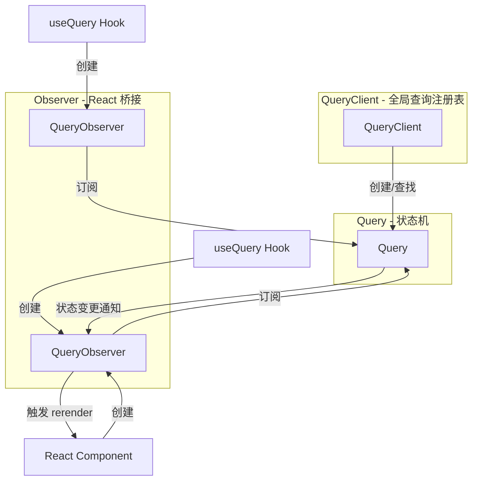

**三个核心角色：**

1. **QueryClient（全局查询注册表）**：负责用 `queryKey` 查找或创建 `Query` 对象，确保同一个 `queryKey` 返回同一个 `Query` 实例，实现跨组件共享
2. **Query（有生命周期的状态机）**：每个查询都是一个独立实体，拥有自己的状态（`pending/success/error`）、生命周期管理和订阅者列表
3. **QueryObserver（React 桥接）**：每个组件实例创建一个 Observer，订阅 Query 的状态变化，当 Query 通知更新时触发组件 rerender

### 4.5.2 useQuery 内部实现流程

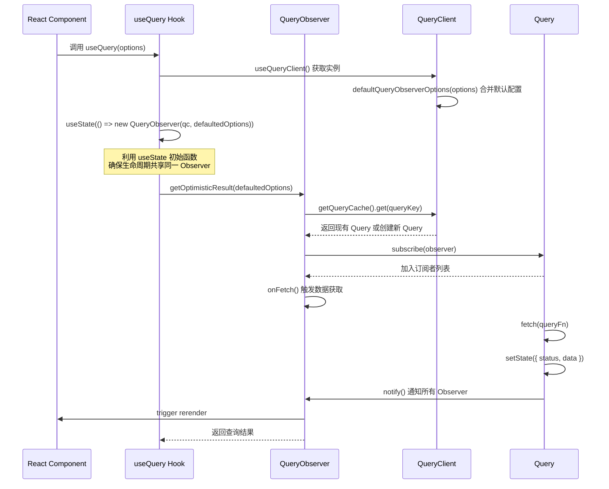

### 4.5.3 关键实现细节

#### useState 共享 Observer 实例

```typescript
// 简化的 useBaseQuery 实现
function useBaseQuery(options, Observer) {
  const queryClient = useQueryClient()
  const defaultedOptions = queryClient.defaultQueryObserverOptions(options)

  // 关键：useState 的初始函数只在首次渲染时执行
  // 确保组件整个生命周期共享同一个 Observer 实例
  const [observer] = React.useState(
    () => new Observer(queryClient, defaultedOptions)
  )

  // 获取乐观结果（可能来自缓存）
  const result = observer.getOptimisticResult(defaultedOptions)

  // 使用 useEffect 同步 options 变更
  React.useSyncExternalStore(
    React.useCallback((onStoreChange) => observer.subscribe(onStoreChange), [observer]),
    () => observer.getCurrentResult(),
    () => observer.getCurrentResult()
  )

  return result
}
```

**为什么用 `useState` 初始函数？** 这样确保组件的整个生命周期中共享同一个 Observer 实例，避免每次渲染都创建新的 Observer 导致订阅丢失。

#### 请求去重机制

```typescript
// 简化的 Query.fetch 实现
async fetch(options) {
  // 如果已经有正在进行的请求，返回现有的 Promise
  if (this.promise) {
    return this.promise // 请求去重
  }

  // 创建新的 Promise
  this.promise = this.executeFetch()
    .finally(() => {
      this.promise = undefined // 请求完成后清除
    })

  return this.promise
}
```

**效果：** 多个组件使用相同的 `queryKey` 时，只会发出一个网络请求。这就是为什么在两个组件中都调用 `useQuery({ queryKey: ['todos'] })` 时，网络面板只显示一个请求。

#### 状态通知机制

```typescript
// Query 的状态变更
setState(nextState, notify = true) {
  this.state = { ...this.state, ...nextState }
  if (notify) {
    // 遍历所有订阅者，通知状态变更
    for (const observer of this.observers) {
      observer.onQueryUpdate()
    }
  }
}

// Observer 收到通知
onQueryUpdate() {
  // 获取最新结果
  const result = this.getCurrentResult()
  // 通过 useSyncExternalStore 触发 React 组件重新渲染
  this.notify()
}
```

### 4.5.4 InfiniteQueryObserver

`useInfiniteQuery` 内部使用 `InfiniteQueryObserver`，它继承自 `QueryObserver` 并增加了分页管理逻辑：

```typescript
// InfiniteQueryObserver 额外维护：
// - pages 数组：已加载的所有页面
// - pageParams 数组：对应的页面参数
// - fetch direction：决定是获取下一页还是上一页
// - hasNextPage / hasPreviousPage：通过 getNextPageParam 计算
```

### 4.5.5 渲染优化

TanStack Query 通过以下方式减少不必要的渲染：

1. **结构共享（Structural Sharing）**：通过 memoizing 查询结果，只有在数据实际变化时才更新引用
2. **乐观结果（Optimistic Result）**：`getOptimisticResult` 返回当前已知最佳结果，避免多余的中间状态渲染
3. **批量通知（Batching）**：使用 `notifyManager` 批量处理多个通知，合并为一次渲染

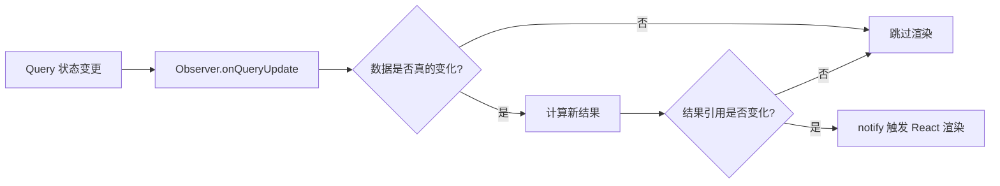

### 4.5.6 常见误区

**误区 1：认为每个 useQuery 调用都创建独立请求**

同一个 `queryKey` 的所有 `useQuery` 调用共享同一个 `Query` 实例，只发一次请求。

**误区 2：Observer 每次渲染都重新创建**

由于 `useState` 初始函数的特性，Observer 实例在组件生命周期内是唯一的，不会因重新渲染而重建。

**误区 3：useQuery 的回调会在组件卸载后执行**

useQuery 在组件卸载时会自动取消订阅，但正在进行的网络请求不会被自动取消（需要在 queryFn 中配合 `signal` 实现）。

---

## 4.6 本章小结

| API | 用途 | 执行方式 | 核心返回值 |
|-----|------|----------|-----------|
| `useQuery` | 读取数据 | 声明式，挂载即执行 | `data`, `isPending`, `isError`, `isFetching` |
| `useMutation` | 修改数据 | 命令式，手动 `mutate` 触发 | `mutate`, `mutateAsync`, `isPending`, `data` |
| `useInfiniteQuery` | 无限滚动 | 声明式 + 手动翻页 | `data.pages`, `fetchNextPage`, `hasNextPage` |
| `useQueryClient` | 操作缓存 | 手动调用方法 | `QueryClient` 实例 |

**核心要点：**
- 所有 API 在 v5 中统一使用对象参数语法
- `useQuery` 的回调（`onSuccess` 等）在 v5 中已移除，改用 `useEffect`
- `useMutation` 的回调在 v5 中仍然保留
- 请求去重基于 `queryKey` 的哈希匹配，相同 key 只发一次请求
- `QueryObserver` 是连接 Query 状态机与 React 组件的桥梁

> **官方文档参考：**
> - Queries: https://tanstack.com/query/latest/docs/framework/react/guides/queries
> - Mutations: https://tanstack.com/query/latest/docs/framework/react/guides/mutations
> - Infinite Query: https://tanstack.com/query/latest/docs/framework/react/guides/infinite-query
> - Important Defaults: https://tanstack.com/query/latest/docs/framework/react/guides/important-defaults

---

# 5. 高级特性

> 本章深入讲解 TanStack Query 的高级功能：查询失效、乐观更新、预取数据、后台刷新、禁用/暂停查询以及分页与无限加载的实战模式。所有内容基于 v5 官方文档并结合源码解析。

---

## 5.1 查询失效（Query Invalidation）

### 5.1.1 概念定义

**查询失效是什么？**

> When a query is invalidated with `invalidateQueries`, two things happen:
> 1. It is marked as stale, overriding any `staleTime` configurations.
> 2. If the query is currently active (being rendered via `useQuery`), it will be refetched in the background.

查询失效是 TanStack Query 中让缓存数据标记为"过期"的机制。当一个查询被失效后，它不会立即被删除，而是标记为 `stale` 状态，并在下次需要时触发后台重新获取。

**为什么需要查询失效？**

TanStack Query 采用"乐观缓存"策略：数据被缓存后可以被无限期使用，但当底层数据发生变化时（如用户创建了一个新的 todo），我们需要告诉缓存"这份数据已经不准确了，请重新获取"。这避免了手动管理缓存一致性的复杂性。

### 5.1.2 invalidateQueries 深层机制

#### 基本用法

```typescript
import { useQueryClient } from '@tanstack/react-query'

function MyComponent() {
  const queryClient = useQueryClient()

  const handleCreate = async () => {
    await createTodo(newTodo)
    // 使所有以 'todos' 开头的查询失效并触发后台刷新
    queryClient.invalidateQueries({ queryKey: ['todos'] })
  }
}
```

#### 精确匹配 vs 前缀匹配

```typescript
// 前缀匹配：使所有 queryKey 以 ['todos'] 开头的查询失效
// 匹配: ['todos'], ['todos', 1], ['todos', 'active', { page: 1 }]
queryClient.invalidateQueries({ queryKey: ['todos'] })

// 精确匹配：只使 queryKey 完全等于 ['todos'] 的查询失效
// 只匹配: ['todos']
queryClient.invalidateQueries({ queryKey: ['todos'], exact: true })

// 精确匹配特定 todo
queryClient.invalidateQueries({ queryKey: ['todos', 5], exact: true })
```

#### 使用 predicate 函数

```typescript
// 使用 predicate 函数进行高级匹配
queryClient.invalidateQueries({
  predicate: (query) => {
    // 只失效超过 1 小时未更新的查询
    return query.queryKey[0] === 'todos'
      && query.state.dataUpdatedAt < Date.now() - 3600000
  },
})

// 只失效 stale 状态的查询
queryClient.invalidateQueries({
  predicate: (query) => query.isStale(),
})

// 只失效 active 的查询（有组件正在监听）
queryClient.invalidateQueries({
  predicate: (query) => query.getObserversCount() > 0,
})
```

#### QueryFilters 选项

| 选项 | 类型 | 说明 |
|------|------|------|
| `queryKey` | `unknown[]` | 用于前缀匹配或精确匹配的 key |
| `exact` | `boolean` | 是否精确匹配整个 key |
| `predicate` | `Function` | 自定义匹配函数 |
| `stale` | `boolean` | 按 stale 状态筛选 |
| `active` | `boolean` | 按是否有活跃观察者筛选 |
| `inactive` | `boolean` | 按是否无活跃观察者筛选 |
| `fetching` | `boolean` | 按是否正在获取筛选 |
| `type` | `'all' \| 'active' \| 'inactive'` | 按活跃度筛选 |

### 5.1.3 依赖失效模式

在 mutation 的回调中使相关查询失效是最常见的模式：

```typescript
const mutation = useMutation({
  mutationFn: createTodo,
  onSuccess: () => {
    // 失效列表查询
    queryClient.invalidateQueries({ queryKey: ['todos'] })
    // 失效计数查询
    queryClient.invalidateQueries({ queryKey: ['todos-count'] })
  },
})
```

#### 失效 + 精确更新组合

```typescript
const mutation = useMutation({
  mutationFn: updateTodo,
  onSuccess: (newTodo) => {
    // 精确更新单个 todo 的缓存
    queryClient.setQueryData(['todo', newTodo.id], newTodo)
    // 同时失效列表，保证列表数据最终一致
    queryClient.invalidateQueries({ queryKey: ['todos'] })
  },
})
```

### 5.1.4 常见误区

**误区 1：invalidateQueries 会立即删除缓存**

```typescript
// invalidateQueries 不删除数据，只标记为 stale
queryClient.invalidateQueries({ queryKey: ['todos'] })

// 要删除缓存，使用 removeQueries
queryClient.removeQueries({ queryKey: ['todos'] })
```

**误区 2：失效不存在的查询会报错**

不会报错。对不存在的查询调用 `invalidateQueries` 只是标记一个"待失效"的状态，当该查询未来被创建时会自动触发获取。

**误区 3：exact: true 匹配子 key**

```typescript
// exact: true 只匹配完全相同的 key，不匹配子 key
queryClient.invalidateQueries({ queryKey: ['todos'], exact: true })
// 这只匹配 ['todos']，不匹配 ['todos', 1]
```

---

## 5.2 乐观更新（Optimistic Updates）

### 5.2.1 概念定义

**乐观更新是什么？**

乐观更新是一种 UI 模式：在服务器确认操作成功之前，就假设操作会成功并立即更新界面。这消除了用户等待时间，提供即时反馈的体验。

**为什么需要乐观更新？**

传统模式是"请求 -> 等待响应 -> 更新 UI"，用户需要等待网络往返。乐观更新将流程改为"更新 UI -> 发送请求 -> 成功后保持/失败后回滚"，用户几乎感觉不到延迟。

### 5.2.2 两种乐观更新方式

#### 方式一：通过 UI 变量（适合单一位置显示）

```typescript
function TodoList() {
  const mutation = useMutation({
    mutationFn: createTodo,
    // 不需要操作缓存
  })

  return (
    <div>
      {/* 使用 mutation.variables 渲染临时项 */}
      {mutation.isPending && (
        <TodoItem
          key="temp"
          title={mutation.variables.title}
          isPending
        />
      )}
      {/* 渲染已确认的数据 */}
      {data?.map((todo) => (
        <TodoItem key={todo.id} {...todo} />
      ))}
    </div>
  )
}
```

**优点：** 代码简单，不需要操作缓存。
**局限：** 只有使用 `mutation.variables` 的组件能看到更新。

#### 方式二：通过缓存操作（适合多组件共享状态）

这是最常用的乐观更新模式，利用 `onMutate` 的上下文传递机制：

```typescript
const queryClient = useQueryClient()

const mutation = useMutation({
  mutationFn: updateTodo,

  // 步骤 1：在 mutation 执行前
  onMutate: async (newTodo) => {
    // 1.1 取消所有正在进行的该查询的 refetch（防止它们覆盖我们的乐观更新）
    await queryClient.cancelQueries({ queryKey: ['todos'] })

    // 1.2 快照当前缓存值（用于回滚）
    const previousTodos = queryClient.getQueryData(['todos'])

    // 1.3 乐观更新缓存
    queryClient.setQueryData(['todos'], (old) =>
      old ? [...old, newTodo] : [newTodo]
    )

    // 1.4 返回包含快照的上下文对象
    // 这个返回值会被传递给 onError 和 onSettled
    return { previousTodos }
  },

  // 步骤 2：如果 mutation 失败，回滚
  onError: (err, newTodo, context) => {
    // 使用 onMutate 返回的上下文恢复数据
    queryClient.setQueryData(['todos'], context?.previousTodos)
    toast.error('Failed to create todo')
  },

  // 步骤 3：无论成功或失败，都重新获取以确保一致性
  onSettled: () => {
    queryClient.invalidateQueries({ queryKey: ['todos'] })
  },
})
```

### 5.2.3 onMutate/onError/onSettled 回滚机制

**回滚流程图解：**

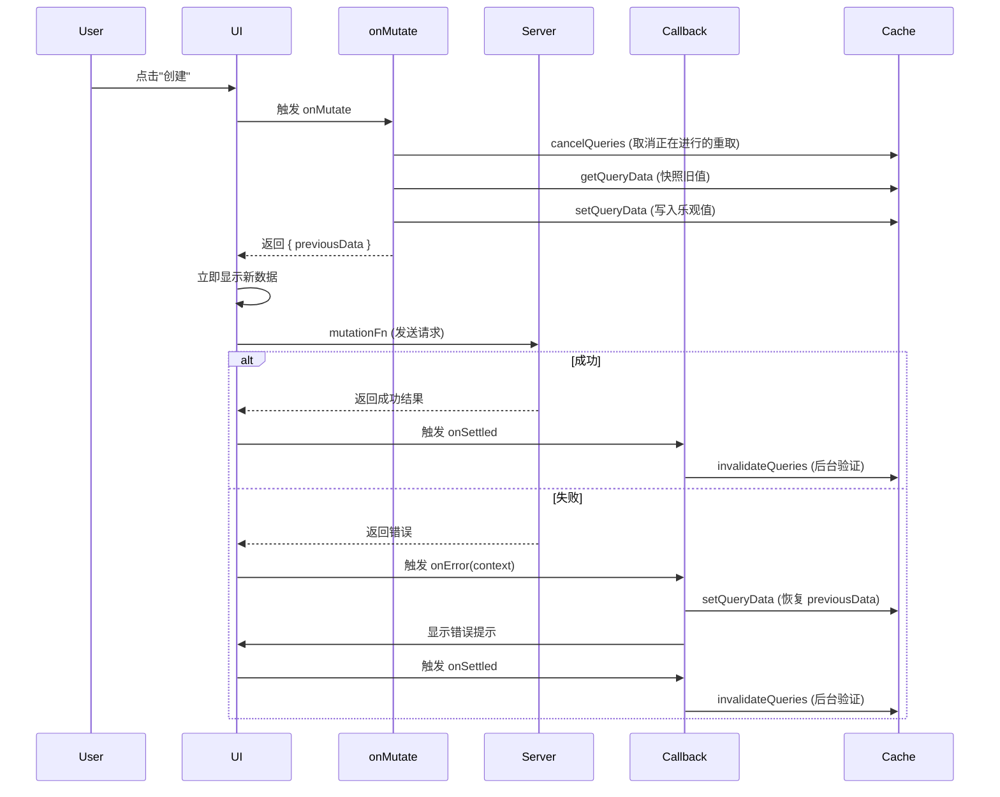

**关键理解：**
1. `onMutate` 的返回值会传递给 `onError` 和 `onSettled` 的第三个参数 `context`
2. `cancelQueries` 防止后台刷新覆盖乐观更新
3. `onSettled` 中的 `invalidateQueries` 确保最终一致性

### 5.2.4 多查询同时乐观更新

```typescript
const mutation = useMutation({
  mutationFn: updateTodo,
  onMutate: async (newTodo) => {
    // 同时取消多个查询的 refetch
    await Promise.all([
      queryClient.cancelQueries({ queryKey: ['todos'] }),
      queryClient.cancelQueries({ queryKey: ['todos-count'] }),
    ])

    // 快照多个查询
    const previousTodos = queryClient.getQueryData(['todos'])
    const previousCount = queryClient.getQueryData(['todos-count'])

    // 更新多个查询
    queryClient.setQueryData(['todos'], (old) => updateTodoInList(old, newTodo))
    queryClient.setQueryData(['todos-count'], (old) => (old || 0) + 1)

    return { previousTodos, previousCount }
  },
  onError: (err, newTodo, context) => {
    // 同时回滚多个查询
    queryClient.setQueryData(['todos'], context?.previousTodos)
    queryClient.setQueryData(['todos-count'], context?.previousCount)
  },
  onSettled: () => {
    queryClient.invalidateQueries({ queryKey: ['todos'] })
    queryClient.invalidateQueries({ queryKey: ['todos-count'] })
  },
})
```

### 5.2.5 常见误区

**误区 1：忘记 cancelQueries**

```typescript
// 错误：没有取消正在进行的 refetch
onMutate: async (newTodo) => {
  queryClient.setQueryData(['todos'], ...)
  // 如果此时有一个 refetch 正在进行，它会覆盖乐观更新
}

// 正确：先取消正在进行的 refetch
onMutate: async (newTodo) => {
  await queryClient.cancelQueries({ queryKey: ['todos'] })
  queryClient.setQueryData(['todos'], ...)
}
```

**误区 2：onError 中忘记回滚**

如果 mutation 失败但不回滚，UI 会显示不正确的数据。

**误区 3：使用 UI 方式处理多组件场景**

如果一个页面有多个组件需要知道 mutation 的结果（如列表和计数器），应使用缓存操作而非 UI 变量。

---

## 5.3 预取数据（Prefetching）

### 5.3.1 概念定义

**预取数据是什么？**

预取是在用户实际需要数据之前提前获取并缓存数据的策略。通过将数据获取提前到用户可能的交互时刻，可以显著减少用户等待时间。

**为什么需要预取？**

传统模式是"用户点击 -> 显示 Loading -> 请求数据 -> 展示内容"，产生可感知的水滴流延迟。预取将数据获取提前，用户点击时数据可能已在缓存中。

### 5.3.2 prefetchQuery 与 prefetchInfiniteQuery

```typescript
const queryClient = useQueryClient()

// 预取单个查询（返回 Promise<void>，不返回数据）
await queryClient.prefetchQuery({
  queryKey: ['todo', 1],
  queryFn: () => fetchTodo(1),
  staleTime: 5000, // 可选：这次预取使用 5s 的 staleTime
})

// 如果缓存中已有数据且未过期，prefetchQuery 不会重新获取
// 如果缓存中没有数据或已过期，它会发起请求并缓存

// 预取无限查询（默认只预取第一页）
await queryClient.prefetchInfiniteQuery({
  queryKey: ['projects'],
  queryFn: fetchProjects,
  initialPageParam: 0,
  getNextPageParam: (lastPage) => lastPage.nextCursor,
})

// 预取多页（一次性加载前 3 页到缓存）
await queryClient.prefetchInfiniteQuery({
  queryKey: ['projects'],
  queryFn: fetchProjects,
  initialPageParam: 0,
  getNextPageParam: (lastPage) => lastPage.nextCursor,
  pages: 3, // 预取前 3 页
})
```

**prefetchQuery 与 fetchQuery 的区别：**

| 方法 | 返回值 | 错误处理 | 使用场景 |
|------|--------|----------|----------|
| `prefetchQuery` | `Promise<void>` | 不抛出错误 | 后台预取，不关心结果 |
| `fetchQuery` | `Promise<TData>` | 会抛出错误 | 需要获取数据时使用 |

### 5.3.3 ensureQueryData

```typescript
// ensureQueryData：如果缓存中有数据则直接返回，否则获取并缓存
const data = await queryClient.ensureQueryData({
  queryKey: ['todo', 1],
  queryFn: fetchTodo,
})
```

与 `fetchQuery` 不同，`ensureQueryData` 会忽略 `staleTime`，只要缓存中有数据就返回，不重新获取。

### 5.3.4 预取策略

#### 策略一：事件处理器预取

```typescript
// 鼠标悬停时预取
function TodoItem({ id }) {
  const queryClient = useQueryClient()

  return (
    <div
      onMouseEnter={() => {
        queryClient.prefetchQuery({
          queryKey: ['todo', id],
          queryFn: () => fetchTodo(id),
          staleTime: 60000, // 1 分钟内认为新鲜
        })
      }}
    >
      {/* 条目内容 */}
    </div>
  )
}
```

#### 策略二：组件内预取（扁平化水滴流）

```typescript
// 在父组件中立即开始获取子组件需要的数据
function Parent() {
  const queryClient = useQueryClient()

  useEffect(() => {
    queryClient.prefetchQuery({
      queryKey: ['childData'],
      queryFn: fetchChildData,
    })
  }, [])

  return <Child />
}

// 或者在 queryFn 内部预取
function useProjects(projectId) {
  return useQuery({
    queryKey: ['project', projectId],
    queryFn: async () => {
      const project = await fetchProject(projectId)
      // 预取项目详情需要的数据
      queryClient.prefetchQuery({
        queryKey: ['project-members', projectId],
        queryFn: () => fetchMembers(projectId),
      })
      return project
    },
  })
}
```

#### 策略三：路由器级预取

```typescript
// 在路由加载时预取数据（以 React Router 为例）
async function loader({ params }) {
  // 阻塞渲染直到数据准备好
  await queryClient.prefetchQuery({
    queryKey: ['project', params.id],
    queryFn: () => fetchProject(params.id),
  })
  return { projectId: params.id }
}

// 或者不阻塞，后台预取
async function loader({ params }) {
  queryClient.prefetchQuery({
    queryKey: ['project', params.id],
    queryFn: () => fetchProject(params.id),
  })
  return { projectId: params.id }
}
```

#### 策略四：条件预取

```typescript
// 根据其他查询的结果决定是否预取
const { data: user } = useQuery({
  queryKey: ['user'],
  queryFn: fetchUser,
})

useQuery({
  queryKey: ['admin-dashboard'],
  queryFn: fetchAdminDashboard,
  enabled: user?.role === 'admin', // 只有管理员才预取
})
```

### 5.3.5 常见误区

**误区 1：prefetchQuery 返回数据**

```typescript
// 错误：prefetchQuery 返回 void
const data = await queryClient.prefetchQuery(...) // data 是 undefined!

// 正确：使用 fetchQuery 获取数据
const data = await queryClient.fetchQuery({
  queryKey: ['todo', 1],
  queryFn: fetchTodo,
})
```

**误区 2：忘记设置 staleTime**

```typescript
// 预取时设置 staleTime，让预取的数据在一段时间内被认为是新鲜的
queryClient.prefetchQuery({
  queryKey: ['todo', 1],
  queryFn: fetchTodo,
  staleTime: 60000, // 预取的数据 1 分钟内不会重新获取
})
```

---

## 5.4 后台刷新与窗口聚焦重取

### 5.4.1 概念定义

**后台刷新是什么？**

TanStack Query 默认在多种场景下自动在后台刷新 stale 数据，确保用户看到的是最新数据而不需要手动刷新。这是"stale-while-revalidate"缓存策略的核心实现。

### 5.4.2 触发后台刷新的场景

| 场景 | 选项 | 默认值 | 说明 |
|------|------|--------|------|
| 组件挂载 | `refetchOnMount` | `true` | 组件挂载时，如果数据是 stale 的，则后台刷新 |
| 窗口聚焦 | `refetchOnWindowFocus` | `true` | 浏览器窗口重新获得焦点后台刷新 |
| 网络重连 | `refetchOnReconnect` | `true` | 网络连接恢复后台刷新 |
| 定时轮询 | `refetchInterval` | `false` | 按固定间隔定时刷新 |

### 5.4.3 refetchOnWindowFocus 深层机制

#### 默认行为

```typescript
// 默认启用（全局默认）
const queryClient = new QueryClient({
  defaultOptions: {
    queries: {
      refetchOnWindowFocus: true, // 默认值
    },
  },
})
```

#### 关闭全局默认

```typescript
const queryClient = new QueryClient({
  defaultOptions: {
    queries: {
      refetchOnWindowFocus: false,
    },
  },
})
```

#### 单个查询级别控制

```typescript
useQuery({
  queryKey: ['todos'],
  queryFn: fetchTodos,
  refetchOnWindowFocus: true, // 覆盖全局设置
})

// 对实时数据禁用窗口聚焦重取
useQuery({
  queryKey: ['stock-price'],
  queryFn: fetchStockPrice,
  refetchOnWindowFocus: false, // 股票价格用轮询更合适
})
```

#### 自定义事件监听

```typescript
import { focusManager } from '@tanstack/react-query'

// 默认行为：监听 visibilitychange 事件
// focusManager.setEventListener((handleFocus) => {
//   const listener = () => handleFocus(document.visibilityState === 'visible')
//   document.addEventListener('visibilitychange', listener)
//   return () => document.removeEventListener('visibilitychange', listener)
// })

// React Native 中使用 AppState
import { AppState } from 'react-native'

focusManager.setEventListener((handleFocus) => {
  const subscription = AppState.addEventListener('change', (status) => {
    handleFocus(status === 'active')
  })
  return () => subscription.remove()
})

// 手动设置聚焦状态
focusManager.setFocused(true)   // 强制认为已聚焦
focusManager.setFocused(false)  // 强制认为未聚焦
focusManager.setFocused(undefined) // 恢复默认检测
```

### 5.4.4 refetchOnMount 选项

```typescript
// true（默认）：挂载时如果数据 stale，则后台刷新
useQuery({ queryKey: ['todos'], queryFn: fetchTodos, refetchOnMount: true })

// "always"：挂载时总是刷新，不管是否 stale
useQuery({ queryKey: ['todos'], queryFn: fetchTodos, refetchOnMount: 'always' })

// false：挂载时不刷新（使用缓存数据）
useQuery({ queryKey: ['todos'], queryFn: fetchTodos, refetchOnMount: false })
```

### 5.4.5 refetchInterval 轮询

```typescript
// 每 5 秒刷新一次
useQuery({
  queryKey: ['stock-price'],
  queryFn: fetchStockPrice,
  refetchInterval: 5000, // 5 秒
})

// 条件轮询：只在某些条件下启用
useQuery({
  queryKey: ['job-status', jobId],
  queryFn: () => fetchJobStatus(jobId),
  refetchInterval: (query) => {
    const state = query.state.data
    // 任务完成后停止轮询
    return state?.status === 'completed' ? false : 2000
  },
})

// 窗口失焦时继续轮询（默认停止）
useQuery({
  queryKey: ['live-data'],
  queryFn: fetchLiveData,
  refetchInterval: 1000,
  refetchIntervalInBackground: true, // 后台标签页也继续轮询
})
```

### 5.4.6 常见误区

**误区 1：混淆 refetchOnWindowFocus 和 refetchOnMount**

- `refetchOnWindowFocus`：用户切换回标签页时触发
- `refetchOnMount`：组件重新挂载时触发（如从其他页面返回）

两者独立工作，可能同时触发也可能只触发一个。

**误区 2：refetchInterval 在后台标签页停止工作**

默认情况下，窗口失焦时会暂停轮询。需要 `refetchIntervalInBackground: true` 来保持后台轮询。

---

## 5.5 禁用/暂停查询

### 5.5.1 概念定义

**禁用/暂停查询是什么？**

禁用查询是指阻止 `useQuery` 自动执行数据获取。此时查询不会在挂载时请求数据，也不会被 `invalidateQueries` 或 `refetchQueries` 触发，但可以通过 `refetch()` 手动触发。

### 5.5.2 enabled 条件查询

```typescript
// 基础用法：依赖另一个查询的结果
const { data: user } = useQuery({
  queryKey: ['user'],
  queryFn: fetchUser,
})

// 只有当 user.id 存在时才获取用户的订单
const { data: orders } = useQuery({
  queryKey: ['orders', user?.id],
  queryFn: () => fetchOrders(user.id),
  enabled: !!user?.id, // 依赖条件
})
```

#### 禁用时的状态

```typescript
// enabled: false 时：
// - 如果有缓存数据：status === 'success', data = 缓存数据
// - 如果没有缓存数据：status === 'pending', fetchStatus === 'idle'

const { isPending, data, fetchStatus, refetch } = useQuery({
  queryKey: ['todos'],
  queryFn: fetchTodos,
  enabled: false,
})

// 手动触发
const handleClick = () => {
  refetch() // 即使 enabled: false，refetch() 也能触发请求
}
```

#### 依赖查询（Dependent Queries）

```typescript
// 等待第一个查询完成后再执行第二个查询
const { data: project } = useQuery({
  queryKey: ['project', projectId],
  queryFn: fetchProject,
})

const { data: projectUsers } = useQuery({
  queryKey: ['project-users', projectId],
  queryFn: () => fetchProjectUsers(projectId),
  enabled: !!project, // 等待 project 加载完成后才执行
})
```

### 5.5.3 skipToken

```typescript
import { useQuery, skipToken } from '@tanstack/react-query'

// TypeScript 中，skipToken 是 enabled: false 的类型安全替代
const { data } = useQuery({
  queryKey: ['todo', id],
  // 当 id 不存在时，使用 skipToken 跳过查询
  queryFn: id ? () => fetchTodo(id) : skipToken,
})
```

**skipToken vs enabled: false：**

| 特性 | `skipToken` | `enabled: false` |
|------|-------------|------------------|
| TypeScript 安全 | 类型推断正确 | 类型可能推断错误 |
| refetch() | 报错：`Missing queryFn` | 正常工作 |
| 适用场景 | 完全跳过查询 | 条件禁用但需保留 refetch |

```typescript
// skipToken 的 refetch 会报错
const { refetch } = useQuery({ queryFn: id ? fetch : skipToken })
refetch() // Error: Missing queryFn

// enabled: false 的 refetch 正常工作
const { refetch } = useQuery({ queryFn: fetch, enabled: !!id })
refetch() // OK，可以手动触发
```

### 5.5.4 常见误区

**误区 1：enabled 为 false 时 data 一定是 undefined**

如果有缓存数据，即使 `enabled: false`，`data` 也会返回缓存值：

```typescript
// 之前某个组件已经获取过 ['todos'] 并缓存
const { data } = useQuery({
  queryKey: ['todos'],
  queryFn: fetchTodos,
  enabled: false,
})
console.log(data) // 返回缓存的 todos，不是 undefined
```

**误区 2：invalidateQueries 能触发 disabled 查询的刷新**

`invalidateQueries` 对 `enabled: false` 的查询只会标记为 stale，不会触发重新获取。必须用 `refetch()` 手动触发。

---

## 5.6 分页与无限加载

### 5.6.1 传统分页模式

TanStack Query 没有专门的"分页 Hook"，但可以用 `useQuery` 实现传统分页：

```typescript
function PaginatedTodos() {
  const [page, setPage] = useState(0)

  const { data, isPending, isError, isFetching } = useQuery({
    queryKey: ['todos', page],
    queryFn: () => fetchTodos({ page, limit: 10 }),
    keepPreviousData: true, // 注意：v5 中此选项已移除，使用 placeholderData 替代
  })

  return (
    <div>
      {isPending && <p>Loading...</p>}
      {isError && <p>Error</p>}
      {data && (
        <>
          {data.items.map((todo) => <TodoItem key={todo.id} {...todo} />)}
          <div>
            <button
              disabled={page === 0}
              onClick={() => setPage((p) => p - 1)}
            >
              Previous
            </button>
            <span>Page {page + 1}</span>
            <button
              disabled={data.hasMore === false}
              onClick={() => setPage((p) => p + 1)}
            >
              Next
            </button>
          </div>
        </>
      )}
      {isFetching && !isPending && <span> Loading new page...</span>}
    </div>
  )
}
```

#### v5 中的 keepPreviousData 替代方案

在 v5 中，`keepPreviousData` 选项已被移除，可以使用 `placeholderData` 实现类似效果：

```typescript
const { data, isPending } = useQuery({
  queryKey: ['todos', page],
  queryFn: () => fetchTodos({ page, limit: 10 }),
  placeholderData: (prev) => prev, // 保留上一页数据作为占位
})
```

### 5.6.2 无限滚动实战

详见 4.3 节的 `useInfiniteQuery` 用法。这里补充几个实战技巧：

#### Intersection Observer 自动加载更多

```typescript
function InfiniteProjects() {
  const {
    data,
    fetchNextPage,
    hasNextPage,
    isFetchingNextPage,
  } = useInfiniteQuery({
    queryKey: ['projects'],
    queryFn: fetchProjects,
    initialPageParam: 0,
    getNextPageParam: (lastPage) => lastPage.nextCursor,
  })

  // 使用 Intersection Observer 检测底部
  const observerRef = useRef<HTMLDivElement>(null)

  useEffect(() => {
    const observer = new IntersectionObserver(
      (entries) => {
        if (entries[0].isIntersecting && hasNextPage && !isFetchingNextPage) {
          fetchNextPage()
        }
      },
      { threshold: 0.1 }
    )

    if (observerRef.current) {
      observer.observe(observerRef.current)
    }

    return () => observer.disconnect()
  }, [hasNextPage, isFetchingNextPage, fetchNextPage])

  return (
    <div>
      {data.pages.map((page) =>
        page.data.map((project) => (
          <ProjectCard key={project.id} {...project} />
        ))
      )}
      <div ref={observerRef} style={{ height: 1 }}>
        {isFetchingNextPage && <p>Loading more...</p>}
      </div>
    </div>
  )
}
```

#### 双向无限滚动

```typescript
useInfiniteQuery({
  queryKey: ['messages', chatId],
  queryFn: ({ pageParam }) => fetchMessages(chatId, pageParam),
  initialPageParam: 0,
  // 向下加载（更新的消息）
  getNextPageParam: (lastPage) => lastPage.nextCursor,
  // 向上加载（更早的消息）
  getPreviousPageParam: (firstPage) => firstPage.prevCursor,
})

// 渲染
{data.pages.map((page) =>
  page.messages.map((msg) => <Message key={msg.id} {...msg} />)
)}

// 向上加载更多
{hasPreviousPage && (
  <button onClick={() => fetchPreviousPage()}>
    {isFetchingPreviousPage ? 'Loading...' : 'Load older messages'}
  </button>
)}
```

### 5.6.3 常见误区

**误区 1：使用 useQuery 实现无限滚动**

`useQuery` 每次 page 变化都会创建新的缓存 key（如 `['todos', 1]`、`['todos', 2]`），导致每页数据独立缓存且不会合并。无限滚动场景应使用 `useInfiniteQuery`。

**误区 2：在无限滚动中忘记 maxPages**

不限制页面数量会导致内存持续增长。对于可以无限滚动的列表，建议设置 `maxPages`。

---

## 5.7 本章小结

| 特性 | 核心 API | 关键选项 | 典型场景 |
|------|----------|----------|----------|
| 查询失效 | `invalidateQueries` | `exact`, `predicate` | mutation 成功后刷新列表 |
| 乐观更新 | `useMutation` + `setQueryData` | `onMutate`, `onError`, `onSettled` | 即时反馈的创建/编辑操作 |
| 预取数据 | `prefetchQuery` | `staleTime`, `pages` | 悬停预取、路由预取 |
| 后台刷新 | `refetchOnMount`/`Focus`/`Reconnect` | `refetchInterval` | 窗口聚焦时更新数据 |
| 禁用查询 | `enabled`/`skipToken` | 条件判断 | 依赖查询、权限控制 |
| 分页 | `useInfiniteQuery`/`useQuery` | `getNextPageParam`, `maxPages` | 无限滚动、传统翻页 |

> **官方文档参考：**
> - Query Invalidation: https://tanstack.com/query/latest/docs/framework/react/guides/query-invalidation
> - Optimistic Updates: https://tanstack.com/query/latest/docs/framework/react/guides/optimistic-updates
> - Prefetching: https://tanstack.com/query/latest/docs/framework/react/guides/prefetching
> - Window Focus Refetching: https://tanstack.com/query/latest/docs/framework/react/guides/window-focus-refetching
> - Disabling Queries: https://tanstack.com/query/latest/docs/framework/react/guides/disabling-queries
> - Infinite Query: https://tanstack.com/query/latest/docs/framework/react/guides/infinite-query

---

# 6. 性能优化

> 本章深入讲解 TanStack Query 的性能优化策略：缓存调优、选择器与记忆化、预取策略、持久化缓存及离线支持。所有内容基于 v5 官方文档并结合源码级别的解析。

---

## 6.1 缓存策略调优（staleTime / gcTime 最佳实践）

### 6.1.1 概念定义

TanStack Query 的缓存策略由两个核心时间参数控制：

- **staleTime**：数据被认为"新鲜"的持续时间。在此时间内，组件挂载、窗口聚焦等操作不会触发后台刷新
- **gcTime**（Garbage Collection Time，v5 之前叫 `cacheTime`）：未使用的缓存数据在内存中保留的时间。超过此时间后，缓存会被垃圾回收清理

**为什么需要调优？**

默认的 `staleTime: 0`（数据立刻变 stale）和 `gcTime: 300000`（5 分钟）适用于大多数场景，但根据数据类型调整这两个参数可以大幅减少网络请求、提升响应速度并优化内存使用。

### 6.1.2 staleTime 调优

#### staleTime 的工作原理

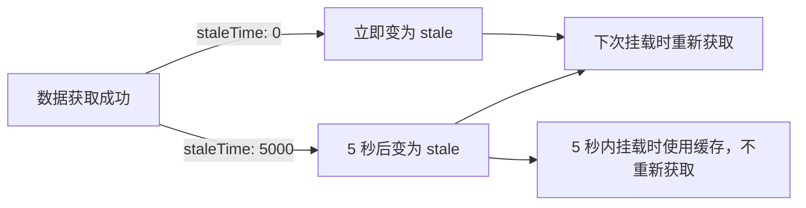

```typescript
// staleTime 为 0（默认）：数据获取完成后立刻变为 stale
// 任何组件挂载、窗口聚焦都会触发后台刷新
useQuery({ queryKey: ['todos'], queryFn: fetchTodos, staleTime: 0 })

// staleTime 为 5 秒：5 秒内的缓存被认为是新鲜的
// 5 秒内挂载不会触发后台刷新
useQuery({ queryKey: ['todos'], queryFn: fetchTodos, staleTime: 5000 })

// staleTime 为 Infinity：数据永远不会 stale
// 只有 invalidateQueries 或 refetchQueries 才会触发重新获取
useQuery({ queryKey: ['config'], queryFn: fetchConfig, staleTime: Infinity })
```

#### staleTime 最佳实践

```typescript
// 场景 1：几乎不变化的配置数据
useQuery({
  queryKey: ['app-config'],
  queryFn: fetchAppConfig,
  staleTime: 1000 * 60 * 60, // 1 小时
})

// 场景 2：变化频率较低的用户数据
useQuery({
  queryKey: ['user', userId],
  queryFn: fetchUser,
  staleTime: 1000 * 60 * 10, // 10 分钟
})

// 场景 3：需要实时性的数据
useQuery({
  queryKey: ['stock-price', symbol],
  queryFn: fetchStockPrice,
  staleTime: 0, // 每次都需要最新数据
  refetchInterval: 5000, // 配合轮询
})

// 场景 4：用户生成的内容（如评论、帖子）
useQuery({
  queryKey: ['todos'],
  queryFn: fetchTodos,
  staleTime: 1000 * 60, // 1 分钟
})
```

#### 全局 staleTime 默认值

```typescript
const queryClient = new QueryClient({
  defaultOptions: {
    queries: {
      staleTime: 1000 * 60, // 全局默认 1 分钟
    },
  },
})
```

**建议：** 官方推荐将全局 `staleTime` 设置为一个大于 0 的值（如 1-5 分钟），而不是默认的 0。这能显著减少不必要的网络请求。

### 6.1.3 gcTime 调优

#### gcTime 的工作原理

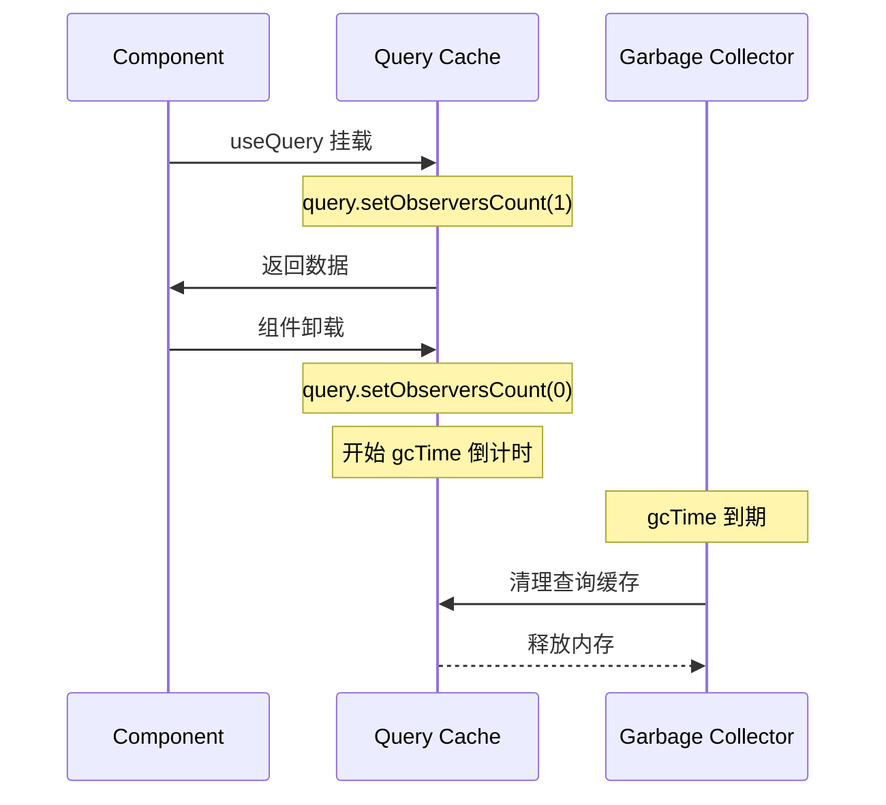

```typescript
// 默认 5 分钟
useQuery({ queryKey: ['todos'], queryFn: fetchTodos, gcTime: 300000 })

// 10 分钟后清理
useQuery({ queryKey: ['todos'], queryFn: fetchTodos, gcTime: 600000 })

// 永不清理（注意内存泄漏风险）
useQuery({ queryKey: ['config'], queryFn: fetchConfig, gcTime: Infinity })

// 立即清理（不缓存）
useQuery({ queryKey: ['once'], queryFn: fetchOnce, gcTime: 0 })
```

#### gcTime 与 staleTime 的区别

| | staleTime | gcTime |
|---|---|---|
| 控制内容 | 数据新鲜度（是否需要重新获取） | 缓存生命周期（是否从内存中删除） |
| 默认值 | 0（立刻 stale） | 300000（5 分钟） |
| 过期后 | 后台重新获取，但缓存仍在 | 缓存被删除，下次需要时重新请求 |
| 调优目标 | 减少网络请求 | 控制内存占用 |

### 6.1.4 组合配置示例

```typescript
const queryClient = new QueryClient({
  defaultOptions: {
    queries: {
      staleTime: 1000 * 60,    // 全局 1 分钟
      gcTime: 1000 * 60 * 10,  // 全局 10 分钟
      refetchOnWindowFocus: false, // 关闭不必要的聚焦刷新
    },
  },
})

// 特定查询覆盖全局设置
useQuery({
  queryKey: ['real-time-data'],
  queryFn: fetchRealTimeData,
  staleTime: 0,
  gcTime: 60000,
  refetchOnWindowFocus: true,
})

useQuery({
  queryKey: ['static-config'],
  queryFn: fetchConfig,
  staleTime: Infinity,
  gcTime: Infinity,
})
```

### 6.1.5 常见误区

**误区 1：staleTime 控制缓存存活时间**

`staleTime` 只控制"是否需要重新获取"，不控制"缓存是否存在"。即使数据 stale，只要 `gcTime` 未到，缓存仍存在于内存中。

**误区 2：gcTime 为 0 表示不缓存**

`gcTime: 0` 意味着查询一旦变为 inactive 就立刻被清理。如果有组件正在使用（active），缓存不会被清理。

---

## 6.2 选择器（select）与记忆化

### 6.2.1 概念定义

**select 是什么？**

`select` 选项允许你在查询结果返回后、组件接收到之前，对数据进行转换和选择。它配合结构共享（structural sharing）机制，只在数据实际变化时才触发组件重新渲染。

**为什么需要 select？**

- 减少组件接收的数据量，降低渲染开销
- 只订阅需要的数据片段，避免父数据变化时所有子组件都重新渲染
- 数据转换逻辑被记忆化，不会每次渲染都重新计算

### 6.2.2 select 基本用法

```typescript
interface Todo {
  id: number
  title: string
  completed: boolean
  assignee: string
  createdAt: string
}

// 只选择需要的字段
const { data: todoTitles } = useQuery({
  queryKey: ['todos'],
  queryFn: fetchTodos,
  select: (data: Todo[]) => data.map((todo) => todo.title),
})
// data 的类型从 Todo[] 变为 string[]

// 过滤数据
const { data: completedTodos } = useQuery({
  queryKey: ['todos'],
  queryFn: fetchTodos,
  select: (data: Todo[]) => data.filter((todo) => todo.completed),
})

// 数据转换
const { data: todoCount } = useQuery({
  queryKey: ['todos'],
  queryFn: fetchTodos,
  select: (data: Todo[]) => ({
    total: data.length,
    completed: data.filter((t) => t.completed).length,
    pending: data.filter((t) => !t.completed).length,
  }),
})
```

### 6.2.3 select 的记忆化与结构共享

```typescript
// select 函数是记忆化的：
// 1. 如果原始 data 引用不变，select 不会被调用
// 2. 如果 select 结果引用不变（内容相同），组件不会重新渲染

const { data } = useQuery({
  queryKey: ['todos'],
  queryFn: fetchTodos,
  select: (data) =>
    data.filter((todo) => todo.completed), // 只在 todos 变化时重新计算
})
```

**结构共享工作原理：**

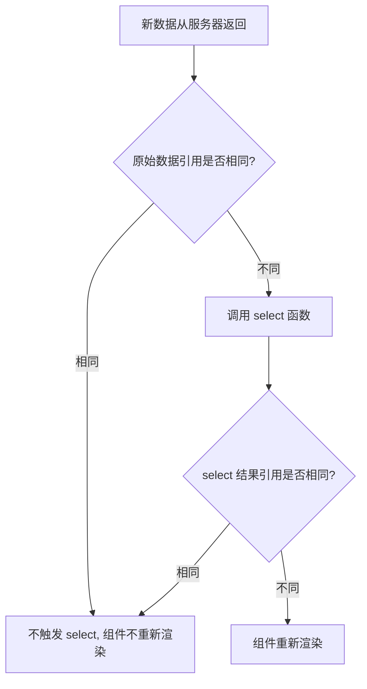

```typescript
// 示例：select 的结构共享效果
const { data: completedTodos } = useQuery({
  queryKey: ['todos'],
  queryFn: fetchTodos,
  select: (data) => data.filter((t) => t.completed),
})

// 场景 1：todos 数据完全没有变化（引用相同）
// -> select 不会被调用 -> 组件不重新渲染

// 场景 2：todos 数据有变化，但 completed 列表不变
// -> select 被调用 -> 返回相同引用 -> 组件不重新渲染
// （因为结构共享检测到了结果内容未变）

// 场景 3：todos 数据变化，completed 列表也变化
// -> select 被调用 -> 返回新引用 -> 组件重新渲染
```

### 6.2.4 select 性能优化模式

#### 模式 1：使用 useMemo 包装复杂转换

```typescript
// select 本身已经记忆化，但如果需要依赖外部变量，可以用闭包
const statusFilter = 'completed'

const { data } = useQuery({
  queryKey: ['todos'],
  queryFn: fetchTodos,
  select: (data) => data.filter((todo) => todo.status === statusFilter),
})
// 注意：如果 statusFilter 变化，select 函数会重新创建
// 但这是预期的行为，因为过滤条件变了
```

#### 模式 2：多 select 拆分

```typescript
// 推荐：将大数据集拆分为多个小选择器
const { data: completedTodos } = useQuery({
  queryKey: ['todos'],
  queryFn: fetchTodos,
  select: (data) => data.filter((t) => t.completed),
})

const { data: pendingTodos } = useQuery({
  queryKey: ['todos'],
  queryFn: fetchTodos,
  select: (data) => data.filter((t) => !t.completed),
})

// 两个组件各自只在自己的数据变化时重新渲染
// CompletedList 只在 completedTodos 变化时渲染
// PendingList 只在 pendingTodos 变化时渲染
```

#### 模式 3：关闭结构共享

```typescript
// 如果确定不需要结构共享（如数据总是完全替换）
useQuery({
  queryKey: ['todos'],
  queryFn: fetchTodos,
  structuralSharing: false, // 关闭结构共享
})
```

**何时关闭？** 极少数场景，如数据非常大且结构共享的 diff 开销大于直接渲染的开销。大多数情况下保持默认开启。

### 6.2.5 常见误区

**误区 1：select 每次渲染都重新计算**

`select` 函数是记忆化的，只有在原始数据引用变化时才会重新执行。不要担心性能问题。

**误区 2：在 select 中执行副作用**

```typescript
// 错误：select 应该是纯函数
select: (data) => {
  trackAnalytics(data) // 不应该在 select 中做副作用
  return data.map(t => t.title)
}

// 正确：使用 useEffect
const { data } = useQuery({ ... })
useEffect(() => {
  if (data) trackAnalytics(data)
}, [data])
```

---

## 6.3 预取策略与用户体验

### 6.3.1 路由级预取

路由级预取是在用户导航到页面之前就获取数据的策略，可以完全消除页面加载的等待时间。

```typescript
// React Router v6 示例
import { createBrowserRouter } from 'react-router-dom'

const router = createBrowserRouter([
  {
    path: '/todos',
    element: <TodoListPage />,
    loader: async () => {
      // 路由加载时预取数据，阻塞渲染直到数据就绪
      await queryClient.prefetchQuery({
        queryKey: ['todos'],
        queryFn: fetchTodos,
        staleTime: 1000 * 60 * 5, // 5 分钟
      })
      return null
    },
  },
  {
    path: '/todos/:id',
    element: <TodoDetailPage />,
    loader: async ({ params }) => {
      // 并行预取详情数据
      await queryClient.prefetchQuery({
        queryKey: ['todo', params.id],
        queryFn: () => fetchTodo(params.id),
      })
      return null
    },
  },
])
```

### 6.3.2 悬停预取

```typescript
function TodoLink({ id }) {
  const queryClient = useQueryClient()
  const [isHovered, setIsHovered] = useState(false)

  // 悬停时预取
  const handleMouseEnter = () => {
    setIsHovered(true)
    queryClient.prefetchQuery({
      queryKey: ['todo', id],
      queryFn: () => fetchTodo(id),
      staleTime: 1000 * 60 * 5,
    })
  }

  return (
    <Link
      to={`/todos/${id}`}
      onMouseEnter={handleMouseEnter}
    >
      View Todo #{id}
    </Link>
  )
}
```

### 6.3.3 可见性预取（Intersection Observer）

```typescript
function PrefetchOnVisible({ children, queryKey, queryFn }) {
  const queryClient = useQueryClient()
  const ref = useRef<HTMLDivElement>(null)
  const hasPrefetched = useRef(false)

  useEffect(() => {
    const observer = new IntersectionObserver(
      ([entry]) => {
        if (entry.isIntersecting && !hasPrefetched.current) {
          hasPrefetched.current = true
          queryClient.prefetchQuery({ queryKey, queryFn })
        }
      },
      { rootMargin: '200px' } // 提前 200px 预取
    )

    if (ref.current) observer.observe(ref.current)
    return () => observer.disconnect()
  }, [queryKey, queryFn, queryClient])

  return <div ref={ref}>{children}</div>
}
```

### 6.3.4 queryFn 内部预取

```typescript
// 在获取列表的同时预取详情
function useTodosWithPrefetch() {
  return useQuery({
    queryKey: ['todos'],
    queryFn: async () => {
      const todos = await fetchTodos()

      // 预取前 3 个 todo 的详情
      for (const todo of todos.slice(0, 3)) {
        queryClient.prefetchQuery({
          queryKey: ['todo', todo.id],
          queryFn: () => fetchTodo(todo.id),
        })
      }

      return todos
    },
  })
}
```

### 6.3.5 常见误区

**误区 1：过度预取**

预取过多数据会浪费带宽和内存。应基于用户行为分析来确定预取优先级，而不是预取所有内容。

**误区 2：预取不设置 staleTime**

```typescript
// 错误：预取不设置 staleTime，用户进入页面时数据可能已经 stale
queryClient.prefetchQuery({ queryKey: ['todo', id], queryFn: fetchTodo })

// 正确：预取设置合理的 staleTime
queryClient.prefetchQuery({
  queryKey: ['todo', id],
  queryFn: fetchTodo,
  staleTime: 1000 * 60 * 5,
})
```

---

## 6.4 持久化缓存（localStorage/IndexedDB）

### 6.4.1 概念定义

**持久化缓存是什么？**

默认情况下，TanStack Query 的缓存是内存中的，刷新页面后所有缓存丢失。持久化缓存将查询数据保存到 `localStorage` 或 `IndexedDB`，在页面刷新后恢复缓存，减少重复请求。

### 6.4.2 安装与配置

```bash
npm install @tanstack/react-query-persist-client @tanstack/query-sync-storage-persister
# 或 IndexedDB 版本
npm install @tanstack/query-async-storage-persister
```

#### localStorage 持久化

```typescript
import { QueryClient } from '@tanstack/react-query'
import { persistQueryClient } from '@tanstack/react-query-persist-client'
import { createSyncStoragePersister } from '@tanstack/query-sync-storage-persister'

const queryClient = new QueryClient({
  defaultOptions: {
    queries: {
      // 必须设置 gcTime 大于或等于持久化的 maxAge
      gcTime: 1000 * 60 * 60 * 24, // 24 小时
      staleTime: 1000 * 60,        // 1 分钟
    },
  },
})

// 创建 localStorage 持久化器
const localStoragePersister = createSyncStoragePersister({
  storage: window.localStorage,
  // key: 默认为 'REACT_QUERY_OFFLINE_CACHE'
  // throttleTime: 默认 1000ms（保存操作节流间隔）
})

// 注册持久化
persistQueryClient({
  queryClient,
  persister: localStoragePersister,
  maxAge: 1000 * 60 * 60 * 24, // 缓存最多保存 24 小时
})
```

#### IndexedDB 持久化

```typescript
import { createAsyncStoragePersister } from '@tanstack/query-async-storage-persister'

const asyncPersister = createAsyncStoragePersister({
  storage: window.indexedDB,
  // key: 默认为 'REACT_QUERY_OFFLINE_CACHE'
})

persistQueryClient({
  queryClient,
  persister: asyncPersister,
  maxAge: 1000 * 60 * 60 * 24 * 7, // 7 天
})
```

**localStorage vs IndexedDB：**

| 特性 | localStorage | IndexedDB |
|------|-------------|-----------|
| 容量限制 | ~5MB | ~50MB+ |
| API 类型 | 同步 | 异步 |
| 性能 | 较慢（同步序列化） | 较快（二进制存储） |
| 数据类型 | 仅字符串（需 JSON 序列化） | 支持结构化克隆 |
| 适用场景 | 小量缓存数据 | 大量缓存数据 |

### 6.4.3 React 集成

```typescript
import { PersistQueryClientProvider } from '@tanstack/react-query-persist-client'

function App() {
  return (
    <PersistQueryClientProvider
      client={queryClient}
      persistOptions={{ persister: localStoragePersister }}
      onSuccess={() => {
        // 缓存恢复完成后执行
        // 例如：使关键查询失效以确保数据新鲜
        queryClient.invalidateQueries({ queryKey: ['real-time-data'] })
      }}
    >
      <TodoApp />
    </PersistQueryClientProvider>
  )
}
```

**为什么用 `PersistQueryClientProvider` 而不是 `QueryClientProvider`？**

`PersistQueryClientProvider` 在内部处理了缓存恢复的生命周期，确保在缓存恢复完成前，查询不会错误地触发网络请求。它还提供了 `useIsRestoring` Hook 来检测恢复状态。

```typescript
import { useIsRestoring } from '@tanstack/react-query-persist-client'

function MyComponent() {
  const isRestoring = useIsRestoring()

  if (isRestoring) {
    return <p>Restoring cache...</p>
  }

  return <NormalContent />
}
```

### 6.4.4 Cache Buster（缓存失效标记）

```typescript
// 使用 buster 标记缓存版本
// 如果加载的缓存版本与当前 buster 不匹配，缓存将被丢弃
persistQueryClient({
  queryClient,
  persister: localStoragePersister,
  maxAge: 1000 * 60 * 60 * 24,
  bust: 'v2.0.0', // 版本号变化时自动失效旧缓存
})
```

### 6.4.5 常见误区

**误区 1：不设置 gcTime 导致缓存被立即清理**

```typescript
// 错误：gcTime 默认 5 分钟，页面刷新后缓存可能已被清理
const queryClient = new QueryClient() // gcTime: 300000

// 正确：设置足够长的 gcTime
const queryClient = new QueryClient({
  defaultOptions: {
    queries: {
      gcTime: 1000 * 60 * 60 * 24, // 24 小时
    },
  },
})
```

**误区 2：敏感数据持久化**

认证 token、密码等敏感信息不应持久化到 localStorage（可被 XSS 读取）。应只持久化非敏感的业务数据。

---

## 6.5 离线支持与 Service Worker 集成

### 6.5.1 概念定义

TanStack Query 内置离线支持：当网络断开时，查询会被暂停（paused），网络恢复后自动继续获取。结合持久化缓存，可以实现完整的离线用户体验。

### 6.5.2 网络模式

```typescript
// 三种网络模式
useQuery({
  queryKey: ['todos'],
  queryFn: fetchTodos,
  networkMode: 'online', // 默认：仅在线时获取，离线时暂停
})

useQuery({
  queryKey: ['todos'],
  queryFn: fetchTodos,
  networkMode: 'always', // 总是尝试获取，即使离线
})

useQuery({
  queryKey: ['todos'],
  queryFn: fetchTodos,
  networkMode: 'offlineFirst', // 离线时使用缓存，不尝试网络请求
})
```

| 模式 | 在线 | 离线 |
|------|------|------|
| `online`（默认） | 正常获取 | 暂停，网络恢复后继续 |
| `always` | 正常获取 | 继续尝试获取（可能失败） |
| `offlineFirst` | 正常获取 | 使用缓存，不请求网络 |

### 6.5.3 Mutation 离线队列

```typescript
// mutation 在离线时会自动排队，网络恢复后重试
const mutation = useMutation({
  mutationFn: createTodo,
  retry: true, // 允许重试
})

// 离线时调用
mutation.mutate({ title: 'Offline Todo' })
// mutation 会被暂停并加入离线队列
// 网络恢复后自动重新执行

// 检查 mutation 是否正在暂停
if (mutation.isPaused) {
  console.log('Mutation is waiting for network')
}
```

### 6.5.4 Service Worker 集成

TanStack Query 本身不实现 Service Worker，但可以与 Service Worker 配合实现更强大的离线体验：

```typescript
// Service Worker 缓存 API 响应
// sw.js
const CACHE_NAME = 'api-cache-v1'

self.addEventListener('fetch', (event) => {
  if (event.request.url.includes('/api/')) {
    event.respondWith(
      caches.match(event.request).then((cached) => {
        const fetchPromise = fetch(event.request).then((response) => {
          caches.open(CACHE_NAME).then((cache) => {
            cache.put(event.request, response.clone())
          })
          return response
        })
        return cached || fetchPromise
      })
    )
  }
})
```

#### 配合策略

```
用户操作 -> TanStack Query 发起请求
  -> Service Worker 拦截
    -> 缓存中有响应：直接返回
    -> 缓存中无响应：转发到服务器
      -> 服务器响应：缓存后返回

网络断开时：
  -> TanStack Query 检测离线
    -> 使用 localStorage/IndexedDB 中持久化的缓存
    -> 或等待 Service Worker 返回缓存的响应
```

### 6.5.5 完整离线方案

```typescript
// 完整配置：持久化 + 离线队列 + Service Worker
const queryClient = new QueryClient({
  defaultOptions: {
    queries: {
      staleTime: 1000 * 60 * 5,
      gcTime: 1000 * 60 * 60 * 24,
      networkMode: 'online',
      refetchOnWindowFocus: false, // 离线环境避免不必要的请求
    },
    mutations: {
      networkMode: 'always', // mutation 总是尝试，离线时排队
      retry: 3,
    },
  },
})

const persister = createSyncStoragePersister({ storage: window.localStorage })

persistQueryClient({
  queryClient,
  persister,
  maxAge: 1000 * 60 * 60 * 24,
})

// App 入口
function App() {
  return (
    <PersistQueryClientProvider
      client={queryClient}
      persistOptions={{ persister }}
    >
      <MyApp />
    </PersistQueryClientProvider>
  )
}
```

### 6.5.6 常见误区

**误区 1：认为离线支持意味着完全不需要网络**

TanStack Query 的离线支持仅限于：暂停请求、排队 mutation、使用持久化缓存。它不提供完整的离线应用逻辑。复杂场景需配合 Service Worker 和自定义逻辑。

**误区 2：mutation 离线排队不需要设置 retry**

```typescript
// 错误：默认 mutation 不重试，离线时会直接失败
const mutation = useMutation({ mutationFn: createTodo })

// 正确：设置 retry 启用离线排队
const mutation = useMutation({
  mutationFn: createTodo,
  retry: true, // 允许重试，离线时自动排队
})
```

---

## 6.6 性能优化总结

### 6.6.1 优化策略速查表

| 策略 | 配置 | 效果 | 适用场景 |
|------|------|------|----------|
| 增大 staleTime | `staleTime: 60000` | 减少后台刷新请求 | 变化不频繁的数据 |
| 减小 gcTime | `gcTime: 60000` | 减少内存占用 | 大量查询、低内存设备 |
| 使用 select | `select: (data) => ...` | 减少不必要渲染 | 大型数据集的子集 |
| 预取数据 | `prefetchQuery()` | 消除加载等待时间 | 用户可预测的导航路径 |
| 持久化缓存 | `persistQueryClient()` | 刷新页面后恢复 | 慢速网络、频繁刷新 |
| 关闭聚焦刷新 | `refetchOnWindowFocus: false` | 减少无意义请求 | 后台标签页多的应用 |
| 结构共享 | `structuralSharing: true`（默认） | 减少渲染 | 所有场景 |
| 精确 queryKey | `['todos', userId]` | 精确失效和复用 | 多用户、多租户应用 |

### 6.6.2 性能诊断建议

```typescript
// 使用 TanStack Query DevTools 检查
import { ReactQueryDevtools } from '@tanstack/react-query-devtools'

function App() {
  return (
    <>
      <MyApp />
      <ReactQueryDevtools initialIsOpen={false} />
    </>
  )
}

// 编程方式检查缓存大小
const cacheSize = queryClient.getQueryCache().getAll().length
console.log(`Active queries: ${cacheSize}`)

// 检查内存占用
queryClient.getQueryCache().getAll().forEach((query) => {
  console.log(
    query.queryKey,
    JSON.stringify(query.state.data).length,
    'bytes'
  )
})
```

### 6.6.3 渲染优化流程

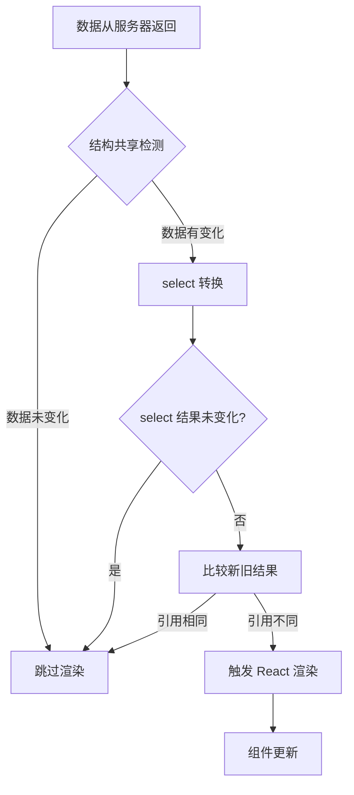

> **官方文档参考：**
> - Important Defaults: https://tanstack.com/query/latest/docs/framework/react/guides/important-defaults
> - Persistent Query Client: https://tanstack.com/query/latest/docs/framework/react/plugins/persistQueryClient
> - Query Client API: https://tanstack.com/query/latest/docs/framework/react/reference/query-client
> - Network Mode: https://tanstack.com/query/latest/docs/framework/react/guides/network-mode

---

# 7. 服务端渲染（SSR/SSG）与实战

> **本章目标**：掌握 TanStack Query 在服务端渲染场景下的核心机制，包括脱水/水合（dehydrate/hydrate）流程、Next.js 集成（App Router 和 Pages Router）、HydrationBoundary 配置、常见水合错误排查、React Server Components 兼容性，以及 SSR 数据预取策略。

---

## 目录

- [7.1 为什么 SSR 需要特殊处理](#71-为什么-ssr-需要特殊处理)
- [7.2 脱水与水合机制（dehydrate/hydrate）](#72-脱水与水合机制dehydratehydrate)
- [7.3 SSR 完整工作流与流程图](#73-ssr-完整工作流与流程图)
- [7.4 Next.js Pages Router 集成实战](#74-nextjs-pages-router-集成实战)
- [7.5 Next.js App Router 集成实战](#75-nextjs-app-router-集成实战)
- [7.6 HydrationBoundary 深度解析](#76-hydrationboundary-深度解析)
- [7.7 常见水合错误排查](#77-常见水合错误排查)
- [7.8 React Server Components 兼容性](#78-react-server-components-兼容性)
- [7.9 SSR 性能优势与数据预取策略](#79-ssr-性能优势与数据预取策略)
- [7.10 框架对比与方案选型](#710-框架对比与方案选型)

---

## 7.1 为什么 SSR 需要特殊处理

### 7.1.1 概念定义

**服务端渲染（Server-Side Rendering, SSR）** 是指在服务器端将 React 组件渲染为 HTML 字符串，然后将完整的 HTML 发送给浏览器，浏览器接收到后直接显示内容，再通过 JavaScript 对 DOM 进行事件绑定和交互逻辑注入（这一过程称为**水合，Hydration**）。

**静态站点生成（Static Site Generation, SSG）** 是 SSR 的特例：在构建时（build-time）预先生成 HTML，而非每次请求时动态生成。

在传统 CSR（客户端渲染）应用中，`useQuery` 在浏览器中首次渲染时触发 `queryFn` 获取数据。但在 SSR 场景下，如果放任 `useQuery` 在服务端执行，会出现三个核心问题：

1. **服务端无法发起浏览器环境下的网络请求**（或即使能发起，返回的 HTML 也不包含数据渲染结果）
2. **服务端和客户端分别请求数据，造成双倍请求**（double-fetching）
3. **水合不匹配**：服务端渲染的 HTML 与客户端水合后的 DOM 不一致，导致 React 抛出 hydration error

### 7.1.2 核心挑战

TanStack Query 的 SSR 方案要解决的根本矛盾是：

> 服务端已经获取了数据并渲染了 HTML，但客户端水合时 TanStack Query 的缓存是空的，导致客户端认为"没有数据"而重新发起请求，甚至渲染出不同的内容。

因此 SSR 的核心任务就是：**将服务端已经获取的数据，安全地传递到客户端的 TanStack Query 缓存中**，使得水合时客户端能直接使用这些数据，而不会触发额外的请求或渲染出不一致的内容。

---

## 7.2 脱水与水合机制（dehydrate/hydrate）

### 7.2.1 概念定义

**脱水（Dehydration）** 是将 `QueryClient` 的缓存状态序列化为一个纯 JavaScript 对象的过程。这个对象包含了所有查询的 `queryKey`、查询结果数据、查询状态等关键信息。

**水合（Hydration）** 是在客户端将脱水后的对象反序列化，重新注入到客户端的 `QueryClient` 缓存中，使得客户端的查询状态与服务端保持一致。

这两个概念类比于水的相变：

- **脱水**：液态水（服务端内存中的 QueryClient 缓存）蒸发为水蒸气（可序列化的纯 JS 对象）
- **水合**：水蒸气在客户端冷凝回液态水（客户端 QueryClient 缓存）

### 7.2.2 dehydrate API

```typescript
import { dehydrate, QueryClient } from '@tanstack/react-query'

// 在服务端创建 QueryClient 实例
const queryClient = new QueryClient()

// 预取查询
await queryClient.prefetchQuery({
  queryKey: ['posts'],
  queryFn: getPosts,
})

// 脱水：将缓存序列化为纯 JS 对象
const dehydratedState = dehydrate(queryClient)
// 返回示例:
// {
//   queries: [
//     {
//       queryKey: ['posts'],
//       queryHash: '["posts"]',
//       state: {
//         data: [...],           // 查询结果数据
//         dataUpdateCount: 1,
//         dataUpdatedAt: 1713000000000,
//         fetchStatus: 'idle',
//         status: 'success',
//       },
//     },
//   ],
//   mutations: [],
// }
```

**`dehydrate` 函数签名：**

```typescript
function dehydrate(
  client: QueryClient,
  options?: {
    shouldDehydrateMutation?: (mutation: Mutation) => boolean
    shouldDehydrateQuery?: (query: Query) => boolean
  }
): DehydratedState
```

| 参数 | 说明 |
|------|------|
| `client` | 服务端的 QueryClient 实例 |
| `shouldDehydrateMutation` | 自定义哪些 mutation 需要脱水。默认不包含任何 mutation |
| `shouldDehydrateQuery` | 自定义哪些 query 需要脱水。默认只包含 `status === 'success'` 的查询 |

**重要原理**：`dehydrate` 只序列化成功的查询。这意味着：

- 失败的查询（`status === 'error'`）**默认不会被脱水**到客户端
- `status === 'pending'` 的查询（正在请求中）**默认也不会被脱水**
- 如果需要脱水失败的查询，需要通过 `shouldDehydrateQuery` 自定义

```typescript
// 包含所有查询（包括失败和进行中的）
const dehydratedState = dehydrate(queryClient, {
  shouldDehydrateQuery: (query) => true,
})

// 包含成功和进行中的查询（用于 streaming SSR）
const dehydratedState = dehydrate(queryClient, {
  shouldDehydrateQuery: (query) =>
    defaultShouldDehydrateQuery(query) || query.state.status === 'pending',
})
```

### 7.2.3 hydrate API / HydrationBoundary 组件

在客户端，水合可以通过 `hydrate` 函数或 `HydrationBoundary` 组件完成：

```typescript
import { HydrationBoundary, QueryClient } from '@tanstack/react-query'

// 方式 1：使用 HydrationBoundary 组件（推荐）
function App({ dehydratedState }: { dehydratedState: DehydratedState }) {
  const [queryClient] = React.useState(() => new QueryClient())

  return (
    <QueryClientProvider client={queryClient}>
      <HydrationBoundary state={dehydratedState}>
        <YourApp />
      </HydrationBoundary>
    </QueryClientProvider>
  )
}
```

**HydrationBoundary 的内部工作原理：**

当 `HydrationBoundary` 接收到 `state` 属性时，它会：

1. **遍历脱水状态中的所有查询**
2. **对新查询**（客户端缓存中不存在的）立即水合到缓存中
3. **对已有查询**（客户端缓存中已存在的）比较数据更新时间：
   - 如果服务端数据更新：以服务端数据为准
   - 如果客户端数据更新：保留客户端数据
4. **触发依赖这些查询的组件重新渲染**

**`hydrate` 函数签名：**

```typescript
function hydrate(
  client: QueryClient,
  dehydratedState: unknown,
  options?: {
    defaultOptions?: {
      queries?: QueryOptions
      mutations?: MutationOptions
    }
  }
): void
```

| 参数 | 说明 |
|------|------|
| `client` | 客户端的 QueryClient 实例 |
| `dehydratedState` | 从服务端传递过来的脱水状态 |
| `defaultOptions.queries` | 水合时查询的默认选项 |
| `defaultOptions.mutations` | 水合时 mutation 的默认选项 |

---

## 7.3 SSR 完整工作流与流程图

### 7.3.1 Mermaid 流程图

```mermaid
sequenceDiagram
    participant Browser as 浏览器
    participant Server as 服务端
    participant QC_Server as QueryClient (服务端)
    participant QC_Client as QueryClient (客户端)

    Note over Browser,Server: 步骤 1: 服务端预取数据
    Server->>QC_Server: 创建新的 QueryClient 实例
    Server->>QC_Server: prefetchQuery({ queryKey, queryFn })
    QC_Server->>Server: 数据存入缓存

    Note over Browser,Server: 步骤 2: 服务端渲染 HTML + 脱水
    Server->>QC_Server: dehydrate(queryClient)
    QC_Server-->>Server: 返回 dehydratedState (纯 JS 对象)
    Server->>Server: 渲染 React 组件为 HTML
    Server->>Browser: 发送 HTML + 内嵌 dehydratedState

    Note over Browser,Server: 步骤 3: 客户端水合
    Browser->>QC_Client: 创建客户端 QueryClient
    Browser->>QC_Client: HydrationBoundary state={dehydratedState}
    QC_Client->>QC_Client: 将 dehydratedState 注入缓存
    Browser->>Browser: React 水合 DOM，组件直接使用缓存数据

    Note over Browser,Server: 步骤 4: 客户端正常运行
    Browser->>QC_Client: 后续 useQuery 直接使用缓存
    QC_Client->>Server: 数据过期(stale)时后台静默刷新
```

### 7.3.2 三步核心流程

```
步骤 1: 预取 (Prefetch)
  ├── 服务端创建 QueryClient 实例
  ├── 使用 prefetchQuery / fetchQuery 获取数据
  └── 数据存入 QueryClient 缓存

步骤 2: 脱水 (Dehydrate)
  ├── 将 QueryClient 缓存序列化为纯 JS 对象
  ├── 将对象嵌入页面（Next.js: 通过 props; Remix: 通过 json()）
  └── 服务端渲染包含数据的 HTML

步骤 3: 水合 (Hydrate)
  ├── 客户端创建 QueryClient 实例
  ├── 使用 HydrationBoundary 将 dehydratedState 注入缓存
  └── React 水合 DOM，组件直接使用缓存数据
```

---

## 7.4 Next.js Pages Router 集成实战

### 7.4.1 入口文件配置（`_app.tsx`）

Pages Router 中，需要在 `_app.tsx` 中配置 `QueryClientProvider` 和 `HydrationBoundary`：

```tsx
// pages/_app.tsx
import {
  QueryClient,
  QueryClientProvider,
  HydrationBoundary,
  dehydrate,
} from '@tanstack/react-query'
import { useState } from 'react'

export default function MyApp({ Component, pageProps }: any) {
  // 关键：每个用户请求都需要独立的 QueryClient 实例
  // 使用 useState 确保服务端和客户端各自有独立实例
  const [queryClient] = useState(() => new QueryClient())

  return (
    <QueryClientProvider client={queryClient}>
      {/* 将服务端脱水的数据传递给客户端 */}
      <HydrationBoundary state={pageProps.dehydratedState}>
        <Component {...pageProps} />
      </HydrationBoundary>
    </QueryClientProvider>
  )
}
```

**为什么必须在 `useState` 中创建 `QueryClient`？**

这是 SSR 中最关键的配置之一。如果在组件外部创建全局 `QueryClient` 实例：

```typescript
// 错误做法：全局单例
const queryClient = new QueryClient() // 在服务端会导致所有用户共享同一份缓存！
```

在服务端，Node.js 进程会处理多个用户的请求。如果使用全局单例，用户 A 的数据会泄漏到用户 B 的缓存中。使用 `useState(() => new QueryClient())` 可以确保：

- **服务端**：每次请求渲染时创建新的实例
- **客户端**：组件挂载时创建一次，后续渲染复用同一实例

### 7.4.2 SSG 模式（getStaticProps）

```tsx
// pages/posts/index.tsx
import { QueryClient, dehydrate, useQuery } from '@tanstack/react-query'

// 数据获取函数
async function getPosts() {
  const res = await fetch('https://jsonplaceholder.typicode.com/posts')
  return res.json()
}

export default function PostsPage() {
  // 客户端：如果服务端已经预取，这里直接使用缓存数据
  // staleTime 默认为 0，所以如果 staleTime 没有设置，客户端会立即重新请求
  const { data, isPending } = useQuery({
    queryKey: ['posts'],
    queryFn: getPosts,
    staleTime: 5 * 60 * 1000, // 5 分钟内数据保持新鲜，不会重新请求
  })

  if (isPending) return <div>Loading...</div>

  return (
    <ul>
      {data.map((post: any) => (
        <li key={post.id}>{post.title}</li>
      ))}
    </ul>
  )
}

// SSG：构建时预取数据
export async function getStaticProps() {
  const queryClient = new QueryClient()

  // 服务端预取
  await queryClient.prefetchQuery({
    queryKey: ['posts'],
    queryFn: getPosts,
  })

  return {
    props: {
      // 将脱水状态通过 props 传递给页面
      dehydratedState: dehydrate(queryClient),
    },
  }
}
```

### 7.4.3 SSR 模式（getServerSideProps）

```tsx
// pages/user/[id].tsx
import { QueryClient, dehydrate, useQuery } from '@tanstack/react-query'

async function getUser(id: string) {
  const res = await fetch(`https://jsonplaceholder.typicode.com/users/${id}`)
  if (!res.ok) throw new Error('User not found')
  return res.json()
}

export default function UserPage() {
  // 这里的 queryKey 包含了动态参数，确保不同用户的数据有不同的缓存
  const { data, isPending, error } = useQuery({
    queryKey: ['user', '1'], // 实际应该用 useParams 获取动态 id
    queryFn: () => getUser('1'),
    staleTime: 10 * 60 * 1000,
  })

  if (isPending) return <div>Loading...</div>
  if (error) return <div>Error: {error.message}</div>

  return <div>{data.name} - {data.email}</div>
}

// SSR：每次请求时预取数据
export async function getServerSideProps({ params }: any) {
  const queryClient = new QueryClient()
  const userId = params.id

  await queryClient.prefetchQuery({
    queryKey: ['user', userId],
    queryFn: () => getUser(userId),
  })

  return {
    props: {
      dehydratedState: dehydrate(queryClient),
    },
  }
}
```

### 7.4.4 错误处理：prefetchQuery vs fetchQuery

**关键区别**：`prefetchQuery` **永远不会抛出错误**。如果查询失败，失败的查询会被排除在脱水状态之外，不会传递给客户端。

```typescript
// prefetchQuery：失败时静默处理，不包含在脱水状态中
await queryClient.prefetchQuery({
  queryKey: ['posts'],
  queryFn: getPosts, // 即使失败也不会抛错
})
// 失败的查询不会出现在 dehydratedState 中
const state = dehydrate(queryClient) // state.queries 不包含失败的查询
```

如果需要捕获错误（例如关键内容加载失败时需要返回 500），应使用 `fetchQuery`：

```typescript
// fetchQuery：失败时抛出错误，可以被 try/catch 捕获
try {
  const data = await queryClient.fetchQuery({
    queryKey: ['criticalData'],
    queryFn: getCriticalData,
  })
  // 数据获取成功，继续渲染
} catch (error) {
  // 关键数据加载失败，返回 500 错误页面
  return { notFound: true } // 或 redirect 到错误页面
}
```

如果需要将失败的查询也脱水到客户端（让客户端显示错误状态）：

```typescript
const dehydratedState = dehydrate(queryClient, {
  shouldDehydrateQuery: (query) => true, // 包含所有查询，包括失败的
})
```

---

## 7.5 Next.js App Router 集成实战

### 7.5.1 核心架构变化

App Router 引入了 **React Server Components（RSC）**，这改变了 SSR 的编程模型。在 RSC 架构中：

- **Server Components** 默认在服务端运行，可以直接访问数据库、文件系统等
- **Client Components**（标记了 `'use client'`）在客户端运行，可以使用 Hooks 和交互
- Server Components 可以直接 `await` 异步操作，不需要 `getServerSideProps`

### 7.5.2 QueryClient 工厂函数

App Router 推荐创建一个 `getQueryClient` 工厂函数，根据运行环境返回不同的实例：

```typescript
// app/get-query-client.ts
import {
  QueryClient,
  defaultShouldDehydrateQuery,
  isServer,
} from '@tanstack/react-query'

function makeQueryClient() {
  return new QueryClient({
    defaultOptions: {
      queries: {
        // SSR 推荐设置非零 staleTime，避免客户端双重请求
        staleTime: 60 * 1000, // 1 分钟
      },
      dehydrate: {
        // 流式 SSR 需要：同时脱水成功和 pending 状态的查询
        shouldDehydrateQuery: (query) =>
          defaultShouldDehydrateQuery(query) ||
          query.state.status === 'pending',
      },
    },
  })
}

let browserQueryClient: QueryClient | undefined = undefined

export function getQueryClient() {
  if (isServer) {
    // 服务端：每次请求创建新实例
    return makeQueryClient()
  } else {
    // 客户端：单例模式避免重复创建
    if (!browserQueryClient) browserQueryClient = makeQueryClient()
    return browserQueryClient
  }
}
```

**为什么需要区分服务端和客户端？**

| 环境 | 实例策略 | 原因 |
|------|----------|------|
| **服务端** | 每次请求新建 | 防止不同用户间数据泄漏 |
| **客户端** | 单例复用 | 组件重渲染时保持缓存不被清空 |

### 7.5.3 布局文件（layout.tsx）

```tsx
// app/layout.tsx
import { QueryClientProvider } from '@tanstack/react-query'
import { getQueryClient } from './get-query-client'
import Providers from './providers' // 包含 'use client'

export default function RootLayout({ children }: { children: React.ReactNode }) {
  return (
    <html lang="en">
      <body>
        <Providers>{children}</Providers>
      </body>
    </html>
  )
}
```

```tsx
// app/providers.tsx
'use client' // 必须标记为 Client Component，因为使用了 React hooks

import { QueryClient, QueryClientProvider } from '@tanstack/react-query'
import { useState } from 'react'

export default function Providers({ children }: { children: React.ReactNode }) {
  const [queryClient] = useState(() => new QueryClient())

  return (
    <QueryClientProvider client={queryClient}>
      {children}
    </QueryClientProvider>
  )
}
```

### 7.5.4 Server Component 中预取数据

在 App Router 中，页面本身可以是 Server Component，可以直接 `await` 异步操作：

```tsx
// app/posts/page.tsx
import {
  dehydrate,
  HydrationBoundary,
  QueryClient,
} from '@tanstack/react-query'
import Posts from './posts' // Client Component

async function getPosts() {
  const res = await fetch('https://jsonplaceholder.typicode.com/posts')
  return res.json()
}

export default async function PostsPage() {
  // Server Component 中创建 QueryClient
  const queryClient = new QueryClient()

  // 预取数据
  await queryClient.prefetchQuery({
    queryKey: ['posts'],
    queryFn: getPosts,
  })

  return (
    // 将脱水状态传递给 Client Component
    <HydrationBoundary state={dehydrate(queryClient)}>
      <Posts />
    </HydrationBoundary>
  )
}
```

```tsx
// app/posts/posts.tsx
'use client' // Client Component 才能使用 useQuery

import { useQuery } from '@tanstack/react-query'

async function getPosts() {
  const res = await fetch('https://jsonplaceholder.typicode.com/posts')
  return res.json()
}

export default function Posts() {
  // 如果服务端已经预取了，这里直接使用缓存数据
  const { data, isPending } = useQuery({
    queryKey: ['posts'],
    queryFn: getPosts,
  })

  if (isPending) return <div>Loading...</div>

  return (
    <ul>
      {data.map((post: any) => (
        <li key={post.id}>{post.title}</li>
      ))}
    </ul>
  )
}
```

### 7.5.5 嵌套水合与并行路由

`HydrationBoundary` 可以嵌套使用，每个边界可以有不同的 `QueryClient` 配置：

```tsx
// app/dashboard/page.tsx
import { dehydrate, HydrationBoundary, QueryClient } from '@tanstack/react-query'
import { cache } from 'react'
import UserStats from './user-stats'
import ActivityFeed from './activity-feed'

// 使用 React.cache 确保同一请求只创建一个 QueryClient
const getQueryClient = cache(() => new QueryClient())

async function getStats(userId: string) { /* ... */ }
async function getFeed(userId: string) { /* ... */ }

export default async function DashboardPage({ params }: { params: { userId: string } }) {
  const queryClient = getQueryClient()

  // 并行预取（注意：如果使用 await，会导致服务端瀑布流）
  const statsPromise = queryClient.prefetchQuery({
    queryKey: ['stats', params.userId],
    queryFn: () => getStats(params.userId),
  })
  const feedPromise = queryClient.prefetchQuery({
    queryKey: ['feed', params.userId],
    queryFn: () => getFeed(params.userId),
  })

  // 等待所有请求完成
  await Promise.all([statsPromise, feedPromise])

  return (
    <HydrationBoundary state={dehydrate(queryClient)}>
      <UserStats userId={params.userId} />
      <ActivityFeed userId={params.userId} />
    </HydrationBoundary>
  )
}
```

**并行预取 vs 瀑布流**：

```tsx
// 错误做法：瀑布流（顺序等待）
await queryClient.prefetchQuery({ queryKey: ['stats'], queryFn: getStats })
await queryClient.prefetchQuery({ queryKey: ['feed'], queryFn: getFeed })
// 总耗时 = getStats 时间 + getFeed 时间

// 正确做法：并行预取
await Promise.all([
  queryClient.prefetchQuery({ queryKey: ['stats'], queryFn: getStats }),
  queryClient.prefetchQuery({ queryKey: ['feed'], queryFn: getFeed }),
])
// 总耗时 = max(getStats 时间, getFeed 时间)
```

---

## 7.6 HydrationBoundary 深度解析

### 7.6.1 核心属性

`HydrationBoundary` 是 TanStack Query v5 中用于水合的核心组件（v4 中名为 `Hydrate`）：

```tsx
<HydrationBoundary
  state={dehydratedState}    // 服务端脱水的状态对象
  options={{                  // 可选：水合时查询的默认选项
    queries: {
      staleTime: 5 * 60 * 1000,
      gcTime: 10 * 60 * 1000,
    },
    mutations: {
      gcTime: 10 * 60 * 1000,
    },
  }}
>
  {children}
</HydrationBoundary>
```

| 属性 | 类型 | 说明 |
|------|------|------|
| `state` | `DehydratedState \| undefined` | 服务端通过 `dehydrate()` 生成的纯 JS 对象。如果为 `undefined` 或空，不做任何操作 |
| `options` | `{ queries?: QueryOptions, mutations?: MutationOptions }` | 水合时查询的默认选项，影响水合后的查询行为 |

### 7.6.2 水合内部机制

`HydrationBoundary` 使用 `useEffect` 在组件挂载时执行水合逻辑：

```typescript
// 简化版内部逻辑
function HydrationBoundary({ state, options, children }) {
  const queryClient = useQueryClient()

  useEffect(() => {
    if (state) {
      // 水合：将脱水状态注入 QueryClient 缓存
      hydrate(queryClient, state, options)
    }
  }, [queryClient, state, options])

  // 确保 state 为 undefined 时不渲染额外的 DOM 节点
  if (state === undefined) return children

  return (
    <>
      {children}
    </>
  )
}
```

**关键行为**：

1. **幂等性**：对同一个 `state` 重复调用 `hydrate` 不会产生副作用。已经存在于缓存中的查询不会被覆盖，除非服务端数据更新
2. **非阻塞**：水合不会阻止组件渲染。如果组件依赖的查询还没有被水合，它会正常进入 `isPending` 状态
3. **选择性水合**：只有 `state` 中存在的查询会被水合，不影响缓存中的其他查询

### 7.6.3 最佳实践配置

```typescript
// 推荐的全局 QueryClient 配置（SSR 场景）
const queryClient = new QueryClient({
  defaultOptions: {
    queries: {
      // SSR 强烈建议设置非零 staleTime
      // 避免客户端水合后立即重新请求同一份数据
      staleTime: 60 * 1000, // 1 分钟

      // gcTime 绝不能设为 0！
      // 至少 2 秒，确保水合完成后数据不会被立即回收
      gcTime: 5 * 60 * 1000, // 5 分钟

      retry: 3,
      refetchOnWindowFocus: false, // SSR 场景通常不需要窗口聚焦重新请求
    },
    dehydrate: {
      // 对于流式 SSR，需要脱水 pending 状态的查询
      shouldDehydrateQuery: (query) =>
        defaultShouldDehydrateQuery(query) ||
        query.state.status === 'pending',
    },
  },
})
```

---

## 7.7 常见水合错误排查

### 7.7.1 gcTime 为 0 的水合错误

**这是 SSR 中最常见也最容易被忽略的水合错误来源。**

**现象**：页面渲染后短暂闪烁，数据消失又重新加载，浏览器控制台出现 React hydration mismatch 警告。

**根因分析**：

当 `gcTime` 被设置为 `0` 时，查询在变为非活跃状态后会被**立即**垃圾回收。在 SSR 场景中，水合流程如下：

```
1. 服务端: prefetchQuery → dehydrate → 渲染 HTML → 发送
2. 客户端: 接收 HTML → 渲染 → HydrationBoundary 开始水合
3. 水合完成后: 查询变为非活跃状态（因为服务端 prefetch 完成后查询没有活跃订阅者）
4. gcTime = 0: 立即垃圾回收 → 数据从缓存中删除
5. useQuery 发现缓存为空 → 重新发起请求 → 渲染加载中
6. React 检测到 hydration mismatch
```

**官方文档明确警告：**

> Avoid setting gcTime to 0 as it may result in a hydration error.

**解决方案**：

```typescript
// 错误配置
const queryClient = new QueryClient({
  defaultOptions: {
    queries: {
      gcTime: 0, // 导致水合错误！
    },
  },
})

// 正确配置
const queryClient = new QueryClient({
  defaultOptions: {
    queries: {
      gcTime: 2 * 1000, // 至少 2 秒，给水合充足时间
      // 或者使用默认的 5 分钟
    },
  },
})
```

### 7.7.2 staleTime 默认值为 0 的双重请求

**现象**：服务端已经预取了数据，但客户端水合后**立即**重新发起了相同的网络请求。

**根因分析**：

`staleTime` 的默认值是 `0`，意味着数据在被获取的瞬间就被标记为"过期"。当客户端水合时：

```
1. 水合将数据注入缓存，但数据的 dataUpdatedAt 是服务端的时间
2. 客户端判断数据已经过期（staleTime = 0）
3. useQuery 触发后台重新请求
4. 产生双重网络请求（服务端 + 客户端）
```

**解决方案**：

```typescript
// 方案 1：在全局配置中设置 staleTime
const queryClient = new QueryClient({
  defaultOptions: {
    queries: {
      staleTime: 60 * 1000, // 1 分钟内不重新请求
    },
  },
})

// 方案 2：在单个查询中设置
const { data } = useQuery({
  queryKey: ['posts'],
  queryFn: getPosts,
  staleTime: 5 * 60 * 1000, // 5 分钟内不重新请求
})
```

### 7.7.3 Next.js Rewrites 导致的水合不匹配

**现象**：使用 Next.js 的 rewrites 功能时，React Query 触发了第二次水合，导致引用相等性（referential equality）被破坏。

**根因**：Next.js rewrites 会触发内部的二次渲染流程，使得 React Query 在已有数据的情况下再次尝试水合，导致引用关系断裂。

**解决方案**：

- 避免在 SSR 场景中使用可能导致二次渲染的 rewrites
- 或使用 `useMemo` 稳定数据引用：

```typescript
const dehydratedState = useMemo(
  () => dehydrate(queryClient),
  [queryClient]
)
```

### 7.7.4 服务端/客户端 QueryClient 实例不一致

**现象**：在 App Router 中使用 `getQueryClient()` 时，如果没有正确区分服务端和客户端，可能导致预取的数据没有传递到客户端。

**排查方法**：

```typescript
// 正确：区分服务端和客户端
function makeQueryClient() {
  return new QueryClient({ /* ... */ })
}

let browserQueryClient: QueryClient | undefined = undefined

export function getQueryClient() {
  if (isServer) {
    return makeQueryClient()      // 服务端：每次都新建
  } else {
    if (!browserQueryClient) {
      browserQueryClient = makeQueryClient() // 客户端：单例
    }
    return browserQueryClient
  }
}
```

### 7.7.5 浏览器后退按钮导致的水合问题

**现象**：在 Next.js App Router 中从页面 A 导航到页面 B，然后点击浏览器后退按钮回到页面 A 时，出现短暂空白或显示过时内容。

**根因**：

1. 后退时客户端缓存没有被正确复用
2. `QueryClient` 实例在服务端和浏览器端创建了不同的实例
3. 缺少 `HydrationBoundary` 包裹，预取数据无法正确传递给客户端

**解决方案**：

- 确保每个页面组件都被 `HydrationBoundary` 包裹
- 在 Client Component 中使用 `staleTime` 合理设置缓存有效期
- 使用 `useQueryClient()` 获取共享的 `QueryClient` 实例，避免重复创建

---

## 7.8 React Server Components 兼容性

### 7.8.1 RSC 与 TanStack Query 的关系

React Server Components（RSC）是 React 18+ 引入的架构模式，允许组件仅在服务端运行，不向客户端发送任何 JavaScript。这与 TanStack Query 的 SSR 方案既兼容又有本质区别。

**核心理解：将 Server Components 视为"另一个框架加载器"**

在 RSC 架构中，Server Components 获取数据的方式类似于 Next.js 的 `getServerSideProps` / `getStaticProps` 或 Remix 的 `loader`——都是在组件渲染前获取数据。区别在于：

| 特性 | getServerSideProps | RSC Server Component |
|------|---------------------|----------------------|
| 运行环境 | 服务端 | 服务端 |
| 能否使用 Hooks | 不能 | 不能 |
| 客户端 JS 体积 | 无影响 | 零客户端 JS（如果组件纯服务端） |
| 与 useQuery 配合 | 通过 dehydrate/hydrate | 通过 HydrationBoundary |

### 7.8.2 Server Component 中的数据预取模式

**模式 1：预取 + HydrationBoundary（推荐）**

```tsx
// Server Component
export default async function PostsPage() {
  const queryClient = new QueryClient()

  await queryClient.prefetchQuery({
    queryKey: ['posts'],
    queryFn: getPosts,
  })

  return (
    <HydrationBoundary state={dehydrate(queryClient)}>
      <Posts /> {/* Client Component，内部使用 useQuery */}
    </HydrationBoundary>
  )
}
```

**模式 2：避免 queryClient.fetchQuery 除非需要捕获错误**

```typescript
// 推荐：prefetchQuery（不返回值，失败时静默）
await queryClient.prefetchQuery({
  queryKey: ['posts'],
  queryFn: getPosts,
})

// 仅在需要错误处理时使用 fetchQuery
try {
  const data = await queryClient.fetchQuery({
    queryKey: ['critical'],
    queryFn: getCritical,
  })
} catch (error) {
  // 处理关键错误
}
```

**原因**：`fetchQuery` 返回值意味着 Server Component 持有了数据引用。如果数据通过 props 传递给 Client Component，会导致整个数据对象被序列化到客户端，增加不必要的传输开销。而 `prefetchQuery` 将数据存入 `QueryClient` 缓存，通过 `dehydrate` 序列化时只传输必要的缓存状态。

### 7.8.3 流式 SSR 与 Suspense

Next.js 通过 Suspense 实现流式渲染：先发送已就绪的 HTML，后续数据到达后再流式传输剩余部分。TanStack Query 支持这种模式：

```typescript
// 配置 shouldDehydrateQuery 以包含 pending 状态的查询
const queryClient = new QueryClient({
  defaultOptions: {
    dehydrate: {
      shouldDehydrateQuery: (query) =>
        defaultShouldDehydrateQuery(query) ||
        query.state.status === 'pending',
    },
  },
})

// Server Component 中不需要 await prefetchQuery
// 不 await 意味着查询进入 pending 状态并被脱水
queryClient.prefetchQuery({
  queryKey: ['posts'],
  queryFn: getPosts,
})

// Client Component 中使用 useSuspenseQuery 配合 Suspense
'use client'
import { useSuspenseQuery } from '@tanstack/react-query'
import { Suspense } from 'react'

function PostsContent() {
  const { data } = useSuspenseQuery({
    queryKey: ['posts'],
    queryFn: getPosts,
  })
  return <ul>{data.map(p => <li key={p.id}>{p.title}</li>)}</ul>
}

export default function Posts() {
  return (
    <Suspense fallback={<div>Loading posts...</div>}>
      <PostsContent />
    </Suspense>
  )
}
```

### 7.8.4 实验性流式 Hydration 包

TanStack 提供了 `@tanstack/react-query-next-experimental` 包，可以自动化处理 Next.js App Router 的流式水合：

```tsx
import { ReactQueryStreamedHydration } from '@tanstack/react-query-next-experimental'

function Providers({ children }: { children: React.ReactNode }) {
  const [queryClient] = useState(() => new QueryClient())

  return (
    <QueryClientProvider client={queryClient}>
      <ReactQueryStreamedHydration>
        {children}
      </ReactQueryStreamedHydration>
    </QueryClientProvider>
  )
}
```

**权衡**：

- 优点：无需手动调用 `prefetchQuery` 和 `dehydrate`，代码更简洁
- 缺点：可能影响 TTFB（首次字节时间），因为需要等待查询开始；导航性能可能不如手动预取

### 7.8.5 数据所有权原则

在 RSC 架构中，应该明确数据所有权的边界：

> "将 Server Components 视为预取数据的地方，仅此而已。"

这意味着：

- Server Components 负责初始数据获取和 SSR 渲染
- Client Components 负责交互、实时更新、后台刷新
- 避免通过 props 将大量服务端数据从 Server Component 传递给 Client Component
- 避免使用 `queryClient.setQueryData` 来同步服务端和客户端数据（应使用乐观更新机制）

---

## 7.9 SSR 性能优势与数据预取策略

### 7.9.1 SSR 的性能优势

与传统 CSR 相比，SSR + TanStack Query 提供以下性能优势：

| 指标 | CSR | SSR + TanStack Query |
|------|-----|---------------------|
| **FCP（首次内容绘制）** | 慢：需要加载 JS + 执行请求 + 渲染 | 快：HTML 直接包含内容 |
| **LCP（最大内容绘制）** | 慢：依赖客户端数据加载完成 | 快：数据在服务端已获取 |
| **请求瀑布流** | 存在：组件挂载后才发请求 | 消除：数据在渲染前预取 |
| **SEO** | 差：爬虫可能获取空页面 | 好：HTML 包含完整内容 |

**消除请求瀑布流**：

```
CSR 瀑布流：
  组件挂载 → 发请求 A → 拿到数据 → 渲染子组件 → 子组件发请求 B → 渲染
  总耗时 = A + B

SSR 预取：
  服务端同时请求 A 和 B → 渲染完整 HTML → 发送浏览器
  总耗时 = max(A, B)
```

### 7.9.2 数据预取策略

#### 策略 1：基于路由的预取

在路由级别声明页面所需数据，避免组件级别的瀑布流：

```typescript
// 路由配置中声明数据需求
const routeDataConfig = {
  '/dashboard': ['userProfile', 'stats', 'notifications'],
  '/posts/[id]': ['post', 'comments', 'relatedPosts'],
}

// 路由守卫中预取
router.beforeEach(async (to) => {
  const queryClient = getQueryClient()
  const keys = routeDataConfig[to.path] || []

  await Promise.all(
    keys.map(key =>
      queryClient.prefetchQuery({
        queryKey: [key, to.params],
        queryFn: () => fetchData(key, to.params),
        staleTime: 5 * 60 * 1000,
      })
    )
  )
})
```

#### 策略 2：基于交互的预取

在用户可能进行的交互前预取数据：

```typescript
// 鼠标悬停时预取
function ProductCard({ id }: { id: string }) {
  const queryClient = useQueryClient()

  const handleMouseEnter = () => {
    queryClient.prefetchQuery({
      queryKey: ['product', id],
      queryFn: () => fetchProduct(id),
      staleTime: 5 * 60 * 1000,
    })
  }

  return (
    <div onMouseEnter={handleMouseEnter}>
      {/* 产品卡片内容 */}
    </div>
  )
}

// 视口内预取（使用 Intersection Observer）
function usePrefetchInView(queryKey: any[], queryFn: QueryFunction) {
  const queryClient = useQueryClient()
  const ref = useRef<HTMLDivElement>(null)

  useEffect(() => {
    const observer = new IntersectionObserver(
      ([entry]) => {
        if (entry.isIntersecting) {
          queryClient.prefetchQuery({ queryKey, queryFn })
          observer.disconnect()
        }
      },
      { rootMargin: '200px' } // 提前 200px 开始预取
    )

    if (ref.current) observer.observe(ref.current)
    return () => observer.disconnect()
  }, [])

  return ref
}
```

#### 策略 3：依赖查询的链式预取

当一个查询的结果用于决定下一个查询时：

```typescript
function Dashboard() {
  const { data: user } = useQuery({
    queryKey: ['user'],
    queryFn: getUser,
  })

  // 用户数据加载完成后预取用户相关内容
  const queryClient = useQueryClient()

  useEffect(() => {
    if (user) {
      queryClient.prefetchQuery({
        queryKey: ['userPosts', user.id],
        queryFn: () => getUserPosts(user.id),
        staleTime: 5 * 60 * 1000,
      })
    }
  }, [user, queryClient])

  // ...
}
```

### 7.9.3 内存管理

服务端 `gcTime` 默认行为在 v5 中为 `Infinity`（无限保留），这意味着服务端 QueryClient 中的数据永远不会被自动清理。在长时间运行的 SSR 服务中，需要注意手动清理：

```typescript
// 在 SSR 请求完成后清理缓存
export async function getServerSideProps() {
  const queryClient = new QueryClient()

  await queryClient.prefetchQuery({ /* ... */ })

  const dehydratedState = dehydrate(queryClient)

  // 请求完成后清理，防止内存泄漏
  queryClient.clear()

  return { props: { dehydratedState } }
}
```

---

## 7.10 框架对比与方案选型

### 7.10.1 SSR 框架对比

| 框架 | SSR 方案 | TanStack Query 集成难度 | 特点 |
|------|----------|------------------------|------|
| **Next.js Pages Router** | getStaticProps / getServerSideProps | 低：成熟的集成模式 | 稳定、文档丰富 |
| **Next.js App Router** | RSC + Server Component | 中：需要理解 RSC 概念 | 流式渲染、零客户端 JS |
| **Remix** | loader 函数 | 低：与 TanStack Query 理念一致 | 基于 Web Fetch API |
| **Astro** | 静态生成 + Islands | 中：Islands 中需要使用 HydrationBoundary | 极致的静态输出 |
| **自定义 SSR** | renderToString / renderToPipeableStream | 高：需手动处理序列化和水合 | 完全可控 |

### 7.10.2 何时需要 SSR

**推荐 SSR 的场景：**

- SEO 是核心需求（内容型网站、电商、博客）
- 首屏加载速度是 KPI（LCP、FCP 优化）
- 客户端网络条件不可控（移动端、弱网络）
- 需要预渲染关键内容，即使 JS 加载失败也能展示

**不需要 SSR 的场景：**

- 纯后台管理面板（SEO 无关紧要）
- 高度交互的单页应用（内容在客户端动态生成）
- 用户必须登录后才能访问的应用
- 开发/测试环境（增加构建和部署复杂度）

---

## 本章小结

| 概念 | 要点 |
|------|------|
| **脱水（dehydrate）** | 将 QueryClient 缓存序列化为纯 JS 对象 |
| **水合（hydrate）** | 将脱水状态注入客户端 QueryClient 缓存 |
| **HydrationBoundary** | v5 核心组件，负责自动执行水合流程 |
| **gcTime ≠ 0** | SSR 中 gcTime 设为 0 会导致水合错误，至少设为 2 秒 |
| **staleTime 非零** | SSR 推荐设置非零 staleTime，避免客户端双重请求 |
| **QueryClient 实例** | SSR 中必须每个请求创建新实例，防止数据泄漏 |
| **RSC 兼容** | Server Components 是预取数据的地方，通过 HydrationBoundary 传递给 Client Components |
| **错误处理** | prefetchQuery 不抛错，fetchQuery 可捕获关键错误 |

**官方文档参考：**

- [TanStack Query - Server Rendering](https://tanstack.com/query/latest/docs/framework/react/guides/ssr)
- [TanStack Query - Advanced Server Rendering](https://tanstack.com/query/latest/docs/framework/react/guides/advanced-ssr)
- [TanStack Query - HydrationBoundary](https://tanstack.com/query/latest/docs/framework/react/reference/HydrationBoundary)

---

# 8. 常见误区与面试问题

> **本章目标**：识别 TanStack Query 使用中的常见误区与陷阱，掌握 v4 → v5 迁移要点，并通过 15 道分级面试题目检验知识掌握程度。

---

## 目录

- [8.1 服务端状态 vs 客户端状态：与 Redux/Zustand 的混淆](#81-服务端状态-vs-客户端状态与-reduxzustand-的混淆)
- [8.2 staleTime 默认值陷阱](#82-staletime-默认值陷阱)
- [8.3 gcTime 设置为 0 的水合错误](#83-gctime-设置为-0-的水合错误)
- [8.4 queryKey 引用一致性问题](#84-querykey-引用一致性问题)
- [8.5 过度使用 useQuery vs 简单 fetch](#85-过度使用-usequery-vs-简单-fetch)
- [8.6 其他常见陷阱](#86-其他常见陷阱)
- [8.7 v4 → v5 迁移注意事项](#87-v4--v5-迁移注意事项)
- [8.8 面试高频题（初级）](#88-面试高频题初级)
- [8.9 面试高频题（中级）](#89-面试高频题中级)
- [8.10 面试高频题（高级）](#810-面试高频题高级)

---

## 8.1 服务端状态 vs 客户端状态：与 Redux/Zustand 的混淆

### 8.1.1 概念定义

**服务端状态（Server State）** 是指存储在远端服务器上的数据，通过 API 异步获取和更新。其特点：

- 不在开发者的直接控制之下
- 可能被多人共享和修改
- 可能会过期
- 需要缓存、去重、后台更新、错误重试等机制

**客户端状态（Client State）** 是指完全由应用自身创建和管理的数据。其特点：

- 完全在开发者控制之下
- 不会自发变化（除非应用逻辑主动修改）
- 不需要"过期"概念
- 通常是 UI 状态、表单输入、开关状态等

### 8.1.2 误区表现

许多开发者误将 TanStack Query 作为 Redux 或 Zustand 的替代品，用它来管理所有状态，包括纯客户端状态：

```typescript
// 错误做法：用 useQuery 管理纯客户端状态
const { data: isDarkMode } = useQuery({
  queryKey: ['theme'],
  queryFn: async () => {
    // 从 localStorage 读取，不涉及网络请求
    return localStorage.getItem('theme') === 'dark'
  },
})

// 错误做法：用 useMutation 管理表单状态
const mutation = useMutation({
  mutationFn: async (formData) => {
    // 仅仅是设置本地 UI 状态
    setLocalFormState(formData)
    return formData
  },
})
```

### 8.1.3 正确做法

| 状态类型 | 推荐方案 | 说明 |
|----------|----------|------|
| **服务端数据**（API 返回） | TanStack Query | 自动缓存、过期、重试 |
| **全局 UI 状态**（主题、语言） | Zustand / Jotai / Context | 简单的全局状态 |
| **表单状态** | React Hook Form / 本地 state | 表单专用状态管理 |
| **URL 查询参数** | useSearchParams / URL state | 本身就是持久化的 |

**核心原则**：TanStack Query 的设计目标是管理**服务端状态**。如果你用 `setQueryData` 来修改数据，应该仅限于乐观更新（optimistic updates）场景——在 mutation 完成前先行更新 UI，以提升用户体验。

```typescript
// 正确做法：乐观更新（mutation 的一部分）
const mutation = useMutation({
  mutationFn: updateTodo,
  onMutate: async (newTodo) => {
    // 取消正在进行中的 refetch
    await queryClient.cancelQueries({ queryKey: ['todos'] })

    // 保存当前数据用于回滚
    const previousTodos = queryClient.getQueryData(['todos'])

    // 乐观更新：在 mutation 完成前更新缓存
    queryClient.setQueryData(['todos'], (old) => [...old, newTodo])

    return { previousTodos }
  },
  onError: (err, newTodo, context) => {
    // mutation 失败时回滚
    queryClient.setQueryData(['todos'], context.previousTodos)
  },
  onSettled: () => {
    // mutation 完成后重新验证
    queryClient.invalidateQueries({ queryKey: ['todos'] })
  },
})
```

### 8.1.4 状态分类思维框架

```mermaid
graph TD
    A[应用中的数据] --> B{是否需要网络请求获取?}
    B -->|是| C[服务端状态]
    B -->|否| D{是否需要跨组件共享?}
    D -->|是| E[全局客户端状态]
    D -->|否| F[局部客户端状态]
    C --> G[TanStack Query]
    E --> H[Zustand / Jotai / Context]
    F --> I[useState / useReducer]
```

---

## 8.2 staleTime 默认值陷阱

### 8.2.1 概念定义

`staleTime` 控制数据在被获取后多久被标记为"过期"（stale）。过期的数据仍然存在于缓存中，但下次 `useQuery` 挂载时会触发后台重新请求。

### 8.2.2 默认值 0 的含义

**`staleTime` 的默认值是 `0`**，这意味着：

> 数据在被获取的瞬间就被标记为过期。

具体影响：

1. **首次请求**：组件挂载时发请求获取数据
2. **组件卸载再挂载**：即使数据仍在缓存中（gcTime 默认 5 分钟），由于 `staleTime = 0`，数据被视为过期，会**立即触发后台重新请求**
3. **窗口聚焦 / 网络恢复**：会触发重新请求（因为数据始终是过期的）

### 8.2.3 常见误解

**误解 1**：`staleTime = 0` 意味着"不使用缓存"

```typescript
// 错误理解
// 开发者认为 staleTime = 0 会每次都从网络获取数据

// 实际行为
// staleTime = 0 时，仍然使用缓存中的数据
// 只是会同时发起后台重新请求
// 用户看到的是缓存数据，而非加载状态
```

**误解 2**：`useQuery` 在每次重渲染时都会重新请求

```typescript
// 错误理解：认为每次重渲染都发请求
function Component() {
  const { data } = useQuery({ queryKey: ['todos'], queryFn: fetchTodos })
  const [count, setCount] = useState(0)

  // 每次点击按钮重渲染，都重新请求？
  return <button onClick={() => setCount(c => c + 1)}>{count}</button>
}

// 实际行为
// useQuery 只在组件挂载（或 queryKey 变化）时发请求
// 组件重渲染不会触发新的网络请求
// 因为 queryKey 没有变化，缓存数据仍然有效
```

### 8.2.4 合理设置 staleTime

```typescript
// 推荐：根据数据更新频率设置 staleTime
const { data } = useQuery({
  queryKey: ['todos'],
  queryFn: fetchTodos,
  staleTime: 5 * 60 * 1000, // 5 分钟：Todo 列表不太可能秒级变化
})

const { data: profile } = useQuery({
  queryKey: ['userProfile', userId],
  queryFn: () => fetchUserProfile(userId),
  staleTime: 10 * 60 * 1000, // 10 分钟：用户资料很少变化
})

const { data: stock } = useQuery({
  queryKey: ['stock', symbol],
  queryFn: () => fetchStockPrice(symbol),
  staleTime: 10 * 1000, // 10 秒：股票价格需要快速更新
})

const { data: search } = useQuery({
  queryKey: ['search', query],
  queryFn: () => searchItems(query),
  staleTime: Infinity, // 搜索结果：同一查询不会变化
})
```

### 8.2.5 SSR 场景下的 staleTime

在 SSR 中，`staleTime = 0` 会导致客户端双重请求问题：

```
服务端预取 → dehydrate → 客户端水合
→ useQuery 发现 staleTime = 0 → 数据已过期 → 立即重新请求
= 双倍网络请求
```

**SSR 推荐配置**：

```typescript
const queryClient = new QueryClient({
  defaultOptions: {
    queries: {
      staleTime: 60 * 1000, // SSR 场景强烈建议设置非零 staleTime
    },
  },
})
```

---

## 8.3 gcTime 设置为 0 的水合错误

### 8.3.1 概念回顾

`gcTime`（v4 中名为 `cacheTime`）控制查询在被标记为非活跃状态（没有组件使用该查询）后，缓存数据保留的时间。超时后数据被垃圾回收。

### 8.3.2 gcTime = 0 为什么导致水合错误

在 SSR 场景中，gcTime = 0 的致命影响：

```mermaid
sequenceDiagram
    participant S as 服务端
    participant C as 客户端
    participant QC as QueryClient

    S->>QC: prefetchQuery 存入缓存
    S->>C: 发送 HTML + dehydratedState
    C->>QC: HydrationBoundary 水合数据
    Note over C,QC: 水合完成，查询变为非活跃
    Note over C,QC: gcTime = 0: 立即垃圾回收！
    QC->>QC: 删除缓存数据
    C->>QC: useQuery 发现缓存为空
    QC->>C: 触发重新请求，进入 isPending
    Note over C: 渲染结果与服务端 HTML 不一致
    Note over C: React hydration mismatch error!
```

### 8.3.3 正确配置

```typescript
// 错误配置
const queryClient = new QueryClient({
  defaultOptions: {
    queries: {
      gcTime: 0, // 导致水合错误！
    },
  },
})

// 正确配置
const queryClient = new QueryClient({
  defaultOptions: {
    queries: {
      gcTime: 2 * 1000, // 至少 2 秒，给水合充足时间
      // 或使用默认值 5 分钟（300,000ms）
    },
  },
})
```

**官方文档明确警告：**

> Avoid setting gcTime to 0 as it may result in a hydration error.
> Recommendation: setting it to at least 2 * 1000.

### 8.3.4 gcTime vs staleTime 的区别

| 维度 | staleTime | gcTime |
|------|-----------|--------|
| **控制什么** | 数据多久后被标记为"过期" | 非活跃缓存保留多久后被删除 |
| **默认值** | 0（立即过期） | 5 分钟（300,000ms） |
| **数据是否可用** | 过期数据仍然可用 | 被 GC 的数据完全消失 |
| **触发什么** | 后台重新请求 | 下次需要时重新获取 |
| **SSR 关注** | 设为 0 导致客户端双重请求 | 设为 0 导致水合错误 |

---

## 8.4 queryKey 引用一致性问题

### 8.4.1 问题描述

TanStack Query 使用 `queryKey` 作为缓存的唯一标识。如果 `queryKey` 的引用在不同渲染中不一致（即使内容相同），TanStack Query 会认为这是**不同的查询**，导致缓存失效、重复请求等问题。

### 8.4.2 常见错误模式

**错误 1：在 queryKey 中创建新对象/数组**

```typescript
// 错误：每次渲染都创建新的对象/数组引用
function UserPosts({ userId }: { userId: string }) {
  const { data } = useQuery({
    // 每次渲染都创建新的 filter 对象和 tags 数组
    queryKey: ['posts', { userId, filter: 'active' }, ['tag1', 'tag2']],
    queryFn: fetchPosts,
  })
}
// 虽然看起来每次一样，但 {} 和 [] 每次都创建新的引用
// TanStack Query 会认为 queryKey 变了，触发新的请求
```

**错误 2：queryKey 和 queryFn 参数不一致**

```typescript
// 错误：queryKey 不包含 queryFn 使用的所有参数
function UserDetail({ userId, includePosts }: Props) {
  const { data } = useQuery({
    queryKey: ['user', userId], // 缺少 includePosts！
    queryFn: () => fetchUserDetail(userId, includePosts),
  })
}
// 当 includePosts 变化时，queryKey 不变
// useQuery 不会重新请求，返回的是旧数据
```

**错误 3：原地修改数组**

```typescript
// 错误：sort() 会原地修改原数组
const sortedIds = subIds.sort() // 副作用！

const { data } = useQuery({
  queryKey: ['items', ...sortedIds],
  queryFn: fetchItems,
})

// 修复：使用不变式操作
const sortedIds = [...subIds].sort() // 或 subIds.toSorted()
```

### 8.4.3 正确做法

```typescript
// 正确 1：使用字面量或稳定的引用
function UserPosts({ userId }: { userId: string }) {
  const { data } = useQuery({
    queryKey: ['posts', userId, 'active', ['tag1', 'tag2']],
    queryFn: fetchPosts,
  })
}

// 正确 2：queryKey 包含 queryFn 使用的所有变量
function UserDetail({ userId, includePosts }: Props) {
  const { data } = useQuery({
    queryKey: ['user', userId, includePosts], // 包含所有参数
    queryFn: () => fetchUserDetail(userId, includePosts),
  })
}

// 正确 3：不变式操作
const sortedIds = [...subIds].sort()
// 或
const sortedIds = subIds.toSorted()
```

### 8.4.4 queryKey 序列化机制

TanStack Query 内部使用 `JSON.stringify` 将 `queryKey` 数组序列化为一个字符串（称为 `queryHash`），用于缓存查找。这意味着：

```typescript
// 以下 queryKey 会产生相同的 queryHash：
['user', { id: 1, name: 'Alice' }]
['user', { name: 'Alice', id: 1 }]       // 对象键顺序不影响（JSON.stringify 按键排序）

// 但以下会产生不同的 queryHash：
['user', 1, 'active']
['user', 'active', 1]                     // 数组顺序影响
```

---

## 8.5 过度使用 useQuery vs 简单 fetch

### 8.5.1 误区

TanStack Query 虽然强大，但**不是所有数据获取场景都需要 `useQuery`**。过度使用会增加不必要的复杂度和开销。

### 8.5.2 何时不需要 useQuery

| 场景 | 推荐方案 | 原因 |
|------|----------|------|
| 一次性数据加载（不关心缓存） | 原生 fetch + useState | 不需要缓存、重试、后台刷新 |
| 非 React 环境（工具脚本） | 原生 fetch | 无法使用 React hooks |
| 极简单的数据（如配置常量） | 直接 import 或硬编码 | 不需要运行时获取 |
| SSE / WebSocket 实时数据 | useSyncExternalStore | TanStack Query 不是为实时推送设计的 |
| 服务端组件中的数据获取 | 直接 async/await | RSC 中无法使用 hooks |

### 8.5.3 对比示例

```typescript
// 场景：页面加载时获取一个不常变化的配置数据

// 方案 A：简单 fetch（适合不需要缓存的场景）
function SimpleConfig() {
  const [config, setConfig] = useState(null)
  const [loading, setLoading] = useState(true)

  useEffect(() => {
    fetch('/api/config')
      .then(res => res.json())
      .then(data => { setConfig(data); setLoading(false) })
      .catch(err => { console.error(err); setLoading(false) })
  }, [])

  if (loading) return <Spinner />
  return <ConfigDisplay config={config} />
}

// 方案 B：useQuery（适合需要缓存、后台刷新的场景）
function ConfigWithQuery() {
  const { data, isPending, error } = useQuery({
    queryKey: ['config'],
    queryFn: () => fetch('/api/config').then(res => res.json()),
    staleTime: 30 * 60 * 1000, // 30 分钟内不重新请求
  })

  if (isPending) return <Spinner />
  if (error) return <Error message={error.message} />
  return <ConfigDisplay config={data} />
}

// 选择建议：
// - 如果这个配置只在当前组件使用，且不需要缓存 → 方案 A
// - 如果多个组件需要同一配置，且希望自动缓存和后台刷新 → 方案 B
// - 如果需要 SSR 支持 → 方案 B
```

### 8.5.4 不要将 useQuery 数据拷贝到本地 state

这是一个常见的反模式：

```typescript
// 错误做法：将 useQuery 的数据拷贝到本地 state
function BadExample() {
  const { data } = useQuery({ queryKey: ['user'], queryFn: fetchUser })
  const [userName, setUserName] = useState(data?.name) // 反模式！

  // 问题：
  // 1. data 更新时 userName 不会自动同步（需要额外的 useEffect）
  // 2. 造成数据不同步的风险
  // 3. 违背 TanStack Query 的设计理念
}

// 正确做法：直接使用 useQuery 返回的 data
function GoodExample() {
  const { data } = useQuery({ queryKey: ['user'], queryFn: fetchUser })
  // 直接使用 data，不拷贝到本地 state
  return <div>{data?.name}</div>
}
```

---

## 8.6 其他常见陷阱

### 8.6.1 initialData + 非零 staleTime 导致不发请求

```typescript
// 陷阱：initialData 让数据看起来是"新鲜"的
function BadInitialData() {
  const { data } = useQuery({
    queryKey: ['category', categoryId],
    queryFn: fetchCategory,
    initialData: defaultCategory,    // 每次都传入默认数据
    staleTime: 5 * 60 * 1000,        // 5 分钟内不重新请求
  })
  // 问题：initialData 被标记为"刚刚获取"
  // staleTime 内不会触发重新请求
  // 结果：永远看不到真实数据
}

// 修复方案 1：只在首屏 key 使用 initialData
// 修复方案 2：设置 initialDataUpdatedAt: 0 让数据立即过期
function Fixed() {
  const { data } = useQuery({
    queryKey: ['category', categoryId],
    queryFn: fetchCategory,
    initialData: defaultCategory,
    initialDataUpdatedAt: 0, // 让初始数据立即过期，触发请求
  })
}
```

### 8.6.2 onSuccess/onError/onSettled 在 v5 中被移除

```typescript
// v4 写法（v5 中已废弃）
const { data } = useQuery({
  queryKey: ['todos'],
  queryFn: fetchTodos,
  onSuccess: (data) => {
    console.log('Query succeeded', data)
    // v5 中这个回调不再执行！
  },
})

// v5 正确做法：使用 useEffect 替代
function Todos() {
  const { data, isPending, error } = useQuery({
    queryKey: ['todos'],
    queryFn: fetchTodos,
  })

  useEffect(() => {
    if (data) {
      console.log('Query succeeded', data)
    }
  }, [data])

  useEffect(() => {
    if (error) {
      console.error('Query failed', error)
    }
  }, [error])
}
```

### 8.6.3 isFetching 与 isPending 的混淆

```typescript
// isPending（v5）：首次加载中，没有缓存数据
// isFetching（v5）：任何后台请求进行中（包括后台刷新）

function Todos() {
  const { data, isPending, isFetching } = useQuery({
    queryKey: ['todos'],
    queryFn: fetchTodos,
  })

  // 常见错误：用 isFetching 控制加载状态
  if (isFetching) return <Spinner />
  // 问题：后台刷新时也会显示 Spinner，导致已有数据被覆盖

  // 正确做法：检查是否有数据
  if (isPending) return <Spinner />
  // 或：用 isRefetching（已有数据的二次请求）
  if (isPending || isRefetching) return <Overlay />

  return <TodoList data={data} />
}
```

### 8.6.4 将 useQuery 结果用于 useEffect 依赖

```typescript
// 陷阱：将 data 放入 useEffect 依赖导致无限循环
function InfiniteLoop() {
  const { data } = useQuery({ queryKey: ['count'], queryFn: fetchCount })

  useEffect(() => {
    if (data) {
      console.log('count changed', data)
      // 如果 data 的引用每次都不同（结构变化），
      // 这个 effect 会无限触发
    }
  }, [data]) // 注意：data 引用可能每次后台刷新都变化
}

// 正确做法：使用具体字段或深层比较
useEffect(() => {
  if (data) {
    console.log('count changed', data.value)
  }
}, [data?.value]) // 使用稳定的基本类型值
```

---

## 8.7 v4 → v5 迁移注意事项

### 8.7.1 核心变更总览

TanStack Query v5 最大的变化是**移除所有方法重载，统一使用单一对象参数语法**，同时重命名了多个 API 以保持一致性。

| v4 API | v5 API | 说明 |
|--------|--------|------|
| `useQuery(key, fn, options)` | `useQuery({ queryKey, queryFn, ...options })` | 单一对象签名 |
| `cacheTime` | `gcTime` | 更准确反映垃圾回收语义 |
| `useErrorBoundary` | `throwOnError` | 框架无关的命名 |
| `isLoading` | `isPending` | 更清晰的语义 |
| `status: 'loading'` | `status: 'pending'` | 统一状态命名 |
| `keepPreviousData` | `placeholderData: keepPreviousData` | 合并到 placeholderData |
| `refetchInterval` 回调参数 | 回调只接收 query 对象 | 简化回调签名 |
| `onSuccess / onError / onSettled` | **已移除**（仅 mutation 保留） | 使用 useEffect 替代 |
| `Hydrate` 组件 | `HydrationBoundary` | 组件重命名 |
| `context` prop | **已移除** | 直接使用 queryClient |

### 8.7.2 无限查询变更

```typescript
// v4
useInfiniteQuery({
  queryKey: ['projects'],
  queryFn: ({ pageParam }) => fetchProjects(pageParam),
  keepPreviousData: true,
})

// v5
useInfiniteQuery({
  queryKey: ['projects'],
  queryFn: ({ pageParam }) => fetchProjects(pageParam),
  initialPageParam: 0,    // 必须显式指定
  placeholderData: keepPreviousData,
  maxPages: 10,            // 新增：限制存储页面数
})
```

### 8.7.3 TypeScript 要求

- 最低 TypeScript 版本从 4.1 提升到 **4.7**
- 默认错误类型从 `unknown` 改为 `Error`
- 查询客户端方法现在都使用对象语法：

```typescript
// v4
queryClient.invalidateQueries(key, filters)
queryClient.setQueryData(key, updater)

// v5
queryClient.invalidateQueries({ queryKey: key, ...filters })
queryClient.setQueryData(key, updater) // setQueryData 仍用两参数
```

### 8.7.4 使用 Codemod 自动化迁移

TanStack Query 提供了 codemod 工具来自动化大部分迁移工作：

```bash
# 对于 TypeScript/TSX 文件
npx jscodeshift@latest ./src/ \
  --extensions=ts,tsx \
  --parser=tsx \
  --transform=./node_modules/@tanstack/react-query/build/codemods/src/v5/remove-overloads/remove-overloads.cjs

# 对于 JavaScript/JSX 文件
npx jscodeshift@latest ./src/ \
  --extensions=js,jsx \
  --transform=./node_modules/@tanstack/react-query/build/codemods/src/v5/remove-overloads/remove-overloads.js
```

**注意事项：**

- Codemod 是尽力而为的工具，无法处理所有情况
- 复杂的回调函数、自定义类型定义、边缘用例需要手动检查
- 运行 codemod 后需要运行 Prettier/ESLint 格式化代码
- 需要全面测试应用功能以确认迁移成功

### 8.7.5 网络状态检测变更

v5 中网络状态检测不再依赖 `navigator.onLine`，改为使用更可靠的 `online` / `offline` 事件：

```typescript
// v4: 依赖 navigator.onLine（可能不准确，如 VPN 连接时）
// v5: 监听 online/offline 事件（更可靠）

// 影响：如果你的应用依赖网络状态重新请求，
// v5 的行为可能与 v4 不同，需要重新测试
```

---

## 8.8 面试高频题（初级）

### Q1：TanStack Query 和 Redux 有什么区别？

**参考答案：**

TanStack Query 专注于管理**服务端状态**（从 API 获取的数据），而 Redux 专注于管理**客户端状态**（UI 状态、表单数据等）。两者的设计目标和解决的问题不同：

- **TanStack Query** 自动处理缓存、请求去重、后台刷新、错误重试、垃圾回收。它基于 queryKey 的缓存系统，开发者只需声明"要什么数据"。
- **Redux** 是全局状态容器，需要手动管理 loading/error/cache/去重等逻辑，通过 action → reducer → store 的单向数据流更新状态。

两者不是替代关系，而是互补关系。实际项目中可以同时使用：TanStack Query 管理服务端数据，Redux 管理全局 UI 状态。

### Q2：staleTime 的默认值是多少？设置为 0 意味着什么？

**参考答案：**

`staleTime` 的默认值是 `0`，意味着数据在被获取的瞬间就被标记为"过期"。

- 过期的数据**仍然存在于缓存中**，不会被删除
- 当 `useQuery` 再次挂载时，会**立即触发后台重新请求**
- 但用户**仍然能看到缓存中的数据**，不会看到加载状态
- 如果设置了非零的 `staleTime`，在过期时间范围内不会触发重新请求

### Q3：gcTime 和 staleTime 有什么区别？

**参考答案：**

| 区别点 | staleTime | gcTime |
|--------|-----------|--------|
| 控制内容 | 数据多久后标记为"过期" | 非活跃缓存保留多久后删除 |
| 过期后 | 数据仍然可用，但会触发后台重新请求 | 数据被完全删除，下次需要时重新获取 |
| 默认值 | 0 | 5 分钟 |
| SSR 风险 | 设为 0 导致客户端双重请求 | 设为 0 导致水合错误 |

### Q4：什么是 queryKey？为什么要用数组而不是字符串？

**参考答案：**

`queryKey` 是 TanStack Query 中查询的唯一标识，用于缓存查找。使用数组的好处：

1. **结构化**：可以包含多个参数段，如 `['users', userId, 'posts']`
2. **自动序列化**：内部通过 JSON.stringify 序列化为 queryHash
3. **类型安全**：数组中的每个元素可以是字符串、数字、对象等
4. **选择性失效**：`invalidateQueries({ queryKey: ['users'] })` 可以失效所有以 `users` 开头的查询

### Q5：useQuery 返回的哪些状态值？各代表什么？

**参考答案：**

`useQuery` 返回的关键状态值（v5）：

- `isPending`：首次加载中，缓存中没有数据
- `isFetching`：任何网络请求正在进行（包括后台刷新）
- `isError`：请求失败
- `error`：错误对象
- `data`：成功获取的数据
- `isRefetching`：已有数据的后台重新请求

**注意**：`isPending` 和 `isError` 是互斥的（状态机保证），但 `isFetching` 可以与 `data` 同时为 true（表示有缓存数据且正在后台刷新）。

---

## 8.9 面试高频题（中级）

### Q6：请解释 TanStack Query 的缓存生命周期

**参考答案：**

TanStack Query 的缓存经历以下阶段：

```
1. 空闲 (Idle)
   └── 缓存中没有该 queryKey 的数据

2. 获取中 (Fetching)
   └── queryFn 执行，请求发送
   └── 状态：status = 'pending'

3. 成功 (Success)
   └── 数据存入缓存
   └── 状态：status = 'success'
   └── 开始计算 staleTime 倒计时

4. 过期 (Stale)
   └── staleTime 到期后，数据标记为过期
   └── 数据仍然可用，但会触发后台重新请求

5. 非活跃 (Inactive)
   └── 没有组件使用该查询
   └── 开始计算 gcTime 倒计时

6. 垃圾回收 (Garbage Collected)
   └── gcTime 到期后，数据从缓存中删除
   └── 回到状态 1
```

### Q7：如何实现乐观更新（Optimistic Update）？

**参考答案：**

乐观更新的核心思路是在服务端确认前先行更新 UI，失败时回滚。TanStack Query 通过 `onMutate` 实现：

```typescript
const mutation = useMutation({
  mutationFn: updateTodo,
  onMutate: async (newTodo) => {
    // 1. 取消正在进行的 refetch（避免覆盖乐观更新）
    await queryClient.cancelQueries({ queryKey: ['todos'] })

    // 2. 保存当前数据（用于回滚）
    const previousTodos = queryClient.getQueryData(['todos'])

    // 3. 乐观更新缓存
    queryClient.setQueryData(['todos'], (old) => [...old, newTodo])

    // 4. 返回上下文（传递给 onError/onSettled）
    return { previousTodos }
  },
  onError: (err, newTodo, context) => {
    // 5. 失败时回滚
    queryClient.setQueryData(['todos'], context.previousTodos)
  },
  onSettled: () => {
    // 6. 无论成功失败，都重新验证确保数据一致
    queryClient.invalidateQueries({ queryKey: ['todos'] })
  },
})
```

### Q8：什么是请求瀑布流（Request Waterfall）？如何用 TanStack Query 避免？

**参考答案：**

请求瀑布流是指组件按嵌套顺序依次发起请求，总耗时等于各请求时间之和：

```
父组件挂载 → 发请求 A（200ms）→ 拿到数据 → 渲染子组件 → 子组件发请求 B（300ms）→ 渲染
总耗时 = 200 + 300 = 500ms
```

避免方式：

1. **路由级预取**：在路由切换时预取页面所需数据
2. **prefetchQuery**：在组件渲染前预取子组件需要的数据
3. **SSR**：服务端并行预取所有数据
4. **Suspense**：配合 `useSuspenseQuery` 并行等待

```typescript
// 避免瀑布流：在父组件中预取子组件数据
function Parent() {
  const { data } = useQuery({ queryKey: ['parent'], queryFn: fetchParent })
  const queryClient = useQueryClient()

  useEffect(() => {
    if (data) {
      queryClient.prefetchQuery({
        queryKey: ['child', data.id],
        queryFn: () => fetchChild(data.id),
      })
    }
  }, [data])

  return data ? <Child id={data.id} /> : <Spinner />
}
```

### Q9：为什么不能将 useQuery 的结果拷贝到 useState？

**参考答案：**

将 `useQuery` 的 `data` 拷贝到 `useState` 会导致：

1. **数据不同步**：当后台刷新获取新数据时，`useState` 中的值不会自动更新
2. **需要额外 useEffect**：必须用 `useEffect` 监听 `data` 变化并更新 state，增加复杂度
3. **竞态条件**：如果 useEffect 中有异步操作，可能导致旧数据覆盖新数据
4. **违背设计原则**：TanStack Query 本身就是状态管理器，再拷贝一份等于在两个状态源之间同步

**例外情况**：表单编辑场景中可能需要将 query 数据作为表单初始值，但应配合 `key` 或 `reset` 确保数据更新时表单也更新。

### Q10：请解释 HydrationBoundary 的作用和工作原理

**参考答案：**

`HydrationBoundary` 是 TanStack Query v5 中用于 SSR 水合的组件（v4 中名为 `Hydrate`）。

**作用**：将服务端通过 `dehydrate` 生成的纯 JS 对象注入到客户端的 `QueryClient` 缓存中，使得客户端可以直接使用服务端已经获取的数据，避免双重请求。

**工作原理**：
1. 组件挂载时通过 `useEffect` 调用 `hydrate` 函数
2. 遍历脱水状态中的所有查询
3. 对新查询（缓存中不存在）立即水合到缓存
4. 对已有查询比较数据更新时间，取更新的一方
5. 触发依赖这些查询的组件重新渲染

---

## 8.10 面试高频题（高级）

### Q11：gcTime 设置为 0 在 SSR 中为什么会导致水合错误？请详细说明整个流程

**参考答案：**

gcTime = 0 导致水合错误的完整流程：

```
1. 服务端创建 QueryClient，prefetchQuery 将数据存入缓存
2. 服务端 dehydrate，将缓存序列化为 dehydratedState
3. 服务端渲染 HTML（包含数据），与 dehydratedState 一起发送
4. 客户端接收 HTML，React 开始水合
5. HydrationBoundary 将 dehydratedState 注入客户端 QueryClient
6. 水合完成，prefetch 创建的查询变为非活跃状态（没有活跃订阅者）
7. gcTime = 0，查询被立即垃圾回收，数据从缓存中删除
8. 子组件中的 useQuery 发现缓存为空
9. useQuery 进入 isPending 状态，触发重新请求
10. 渲染结果变为 Loading... 或空内容
11. React 检测到水合后的 DOM 与服务端 HTML 不一致
12. 抛出 hydration mismatch 错误
```

**关键时间线**：问题出在步骤 6-7，水合完成后查询变为非活跃状态，gcTime = 0 立即回收。修复方法是设置 gcTime 至少为 2000ms。

### Q12：请描述 TanStack Query 内部如何实现请求去重

**参考答案：**

TanStack Query 的请求去重机制基于 `queryKey`：

1. **查询注册**：当 `useQuery` 首次调用时，TanStack Query 检查 `queryKey` 是否已有对应的 `Query` 实例
2. **观察者模式**：每个 `Query` 实例维护一个 `observers` 数组。第一个观察者订阅时触发 `queryFn` 执行
3. **去重逻辑**：后续相同 `queryKey` 的 `useQuery` 调用会被添加到同一个 `Query` 的 `observers` 数组中，**不会**触发新的网络请求
4. **数据共享**：所有观察者共享同一份查询结果
5. **取消逻辑**：当所有观察者都取消订阅时，如果当前有正在进行的请求，请求仍然完成，但不会被标记为活跃

```typescript
// 简化的内部模型
class Query {
  #observers: Observer[] = []
  #promise: Promise<any> | null = null

  addObserver(observer: Observer) {
    this.#observers.push(observer)

    // 只有第一个观察者触发请求
    if (this.#observers.length === 1) {
      this.#promise = this.#executeQuery()
    }
  }

  removeObserver(observer: Observer) {
    this.#observers = this.#observers.filter(o => o !== observer)
  }
}
```

### Q13：如何设计一个全局的 queryKey 策略以避免缓存冲突？

**参考答案：**

设计 queryKey 策略的核心原则：**结构化、分层、可预测**：

```typescript
// 推荐的 queryKey 工厂模式
export const queryKeys = {
  // 层级 1：领域（顶级分类）
  all: ['posts'] as const,

  // 层级 2：列表（所有帖子列表）
  lists: () => [...queryKeys.all, 'list'] as const,

  // 层级 3：列表详情（带过滤条件的列表）
  list: (filters: PostFilters) => [...queryKeys.lists(), { filters }] as const,

  // 层级 4：单个项目
  details: () => [...queryKeys.all, 'detail'] as const,
  detail: (id: string) => [...queryKeys.details(), id] as const,

  // 层级 5：子资源
  comments: (postId: string) => [...queryKeys.detail(postId), 'comments'] as const,
}

// 使用
useQuery({ queryKey: queryKeys.list({ status: 'active' }), queryFn: fetchPosts })
useQuery({ queryKey: queryKeys.detail('123'), queryFn: fetchPost })

// 批量失效
queryClient.invalidateQueries({ queryKey: queryKeys.all })      // 失效所有 posts 相关
queryClient.invalidateQueries({ queryKey: queryKeys.lists() })   // 失效所有列表
queryClient.invalidateQueries({ queryKey: queryKeys.detail('123') }) // 失效单个帖子
```

这种策略的优势：

- **一致性**：通过工厂函数保证 queryKey 结构统一
- **选择性失效**：可以按层级精确失效特定范围的缓存
- **类型安全**：配合 TypeScript 的 `as const` 提供完整类型推导
- **可扩展**：新增资源只需添加对应的层级

### Q14：v4 → v5 迁移中，onSuccess/onError/onSettled 回调被移除了，如何处理迁移？

**参考答案：**

v5 中这三个回调已从 `useQuery` 中移除（但 `useMutation` 仍保留），原因是它们与 React 的生命周期和 Concurrent Mode 存在冲突：在 React 18 的并发渲染下，回调可能在组件卸载后仍然执行，导致"设置已卸载组件状态"的警告。

迁移策略：

```typescript
// v4 写法
useQuery({
  queryKey: ['todos'],
  queryFn: fetchTodos,
  onSuccess: (data) => {
    analytics.track('todos loaded', { count: data.length })
    queryClient.setQueryData(['meta'], { loadedAt: Date.now() })
  },
  onError: (error) => {
    toast.error('Failed to load todos')
  },
})

// v5 写法：使用 useEffect
function Todos() {
  const { data, isPending, error } = useQuery({
    queryKey: ['todos'],
    queryFn: fetchTodos,
  })

  // onSuccess → useEffect 监听 data
  useEffect(() => {
    if (data && !isPending) {
      analytics.track('todos loaded', { count: data.length })
      queryClient.setQueryData(['meta'], { loadedAt: Date.now() })
    }
  }, [data, isPending])

  // onError → useEffect 监听 error
  useEffect(() => {
    if (error) {
      toast.error('Failed to load todos')
    }
  }, [error])

  // ...
}
```

**注意事项**：

- 如果回调中依赖 `isPending` 判断是否是首次加载，需要显式检查
- `onSettled` 的迁移需要同时监听 `data` 和 `error` 的变化
- `useMutation` 中的这三个回调**仍然保留**，不需要迁移

### Q15：请比较 TanStack Query 和 React Server Components（RSC）在数据获取方面的异同，以及它们如何协作

**参考答案：**

**相同点**：

- 都在服务端预取数据，避免客户端瀑布流
- 都支持 SSR，提升首屏加载速度和 SEO
- 都可以消除客户端的网络请求

**不同点**：

| 维度 | TanStack Query (SSR) | React Server Components |
|------|---------------------|------------------------|
| 运行环境 | 服务端 + 客户端 | 仅服务端（RSC 组件） |
| 客户端 JS | 需要发送完整 Query 运行时 | 零客户端 JS（纯 RSC 组件） |
| 交互能力 | 支持自动后台刷新、实时更新 | 不支持（需要 Client Component） |
| 缓存机制 | 基于 queryKey 的智能缓存 | 无内置缓存（每次请求重新获取） |
| 适用场景 | 需要客户端交互的动态数据 | 静态内容、首屏数据 |

**协作模式**：

```tsx
// Server Component：负责初始数据预取
export default async function Page() {
  const queryClient = new QueryClient()

  // Server Component 直接 await 获取数据
  await queryClient.prefetchQuery({
    queryKey: ['posts'],
    queryFn: getPosts,
  })

  return (
    <HydrationBoundary state={dehydrate(queryClient)}>
      <ClientPosts /> {/* Client Component：负责交互、后台刷新 */}
    </HydrationBoundary>
  )
}

// Client Component
'use client'
function ClientPosts() {
  // 直接使用服务端预取的数据
  const { data, refetch, isFetching } = useQuery({
    queryKey: ['posts'],
    queryFn: getPosts,
    staleTime: 60 * 1000,
  })

  // Client Component 独有的能力：
  // - 用户交互触发 refetch
  // - 窗口聚焦自动刷新
  // - 乐观更新
  return (
    <div>
      <button onClick={() => refetch()}>刷新</button>
      <PostList posts={data} />
    </div>
  )
}
```

**核心原则**：将 RSC 视为预取数据的地方，通过 `HydrationBoundary` 将数据传递给 Client Component。Client Component 负责所有交互和运行时行为。两者各司其职，互不替代。

---

## 本章小结

### 常见误区速查表

| 误区 | 现象 | 解决方案 |
|------|------|----------|
| 用 TanStack Query 管理客户端状态 | 过度复杂，语义混乱 | 客户端状态用 Zustand / useState |
| staleTime = 0 导致双重请求 | 服务端预取后客户端立即重新请求 | SSR 场景设置非零 staleTime |
| gcTime = 0 导致水合错误 | 水合后数据被立即回收 | 至少设置为 2000ms |
| queryKey 引用不一致 | 缓存失效，重复请求 | 使用字面量或工厂函数 |
| 将 query 数据拷贝到 state | 数据不同步 | 直接使用 useQuery 返回的 data |
| onSuccess 回调不执行 | v5 已移除该回调 | 使用 useEffect 监听 data |
| 用 isFetching 控制加载 | 后台刷新时也显示加载 | 用 isPending 或检查 data 是否存在 |

### v4 → v5 迁移速查表

| 变更 | v4 | v5 |
|------|-----|-----|
| 签名 | `useQuery(key, fn, options)` | `useQuery({ queryKey, queryFn, ...options })` |
| 缓存时间 | `cacheTime` | `gcTime` |
| 加载状态 | `isLoading` / `status: 'loading'` | `isPending` / `status: 'pending'` |
| 错误边界 | `useErrorBoundary` | `throwOnError` |
| 保留旧数据 | `keepPreviousData` | `placeholderData: keepPreviousData` |
| SSR 组件 | `<Hydrate>` | `<HydrationBoundary>` |
| 查询回调 | `onSuccess / onError / onSettled` | **已移除**，使用 useEffect |

**官方文档参考：**

- [TanStack Query - Migrating to v5](https://tanstack.com/query/v5/docs/framework/react/guides/migrating-to-v5)
- [TanStack Query - Important Defaults](https://tkdodo.eu/blog/important-react-query-defaults)
- [TanStack Query - Practical Tips](https://tkdodo.eu/blog/practical-react-query)
