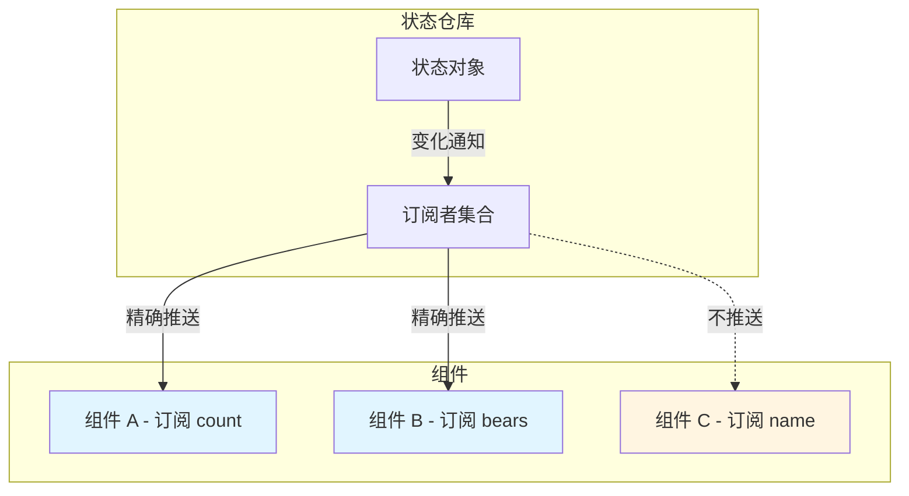
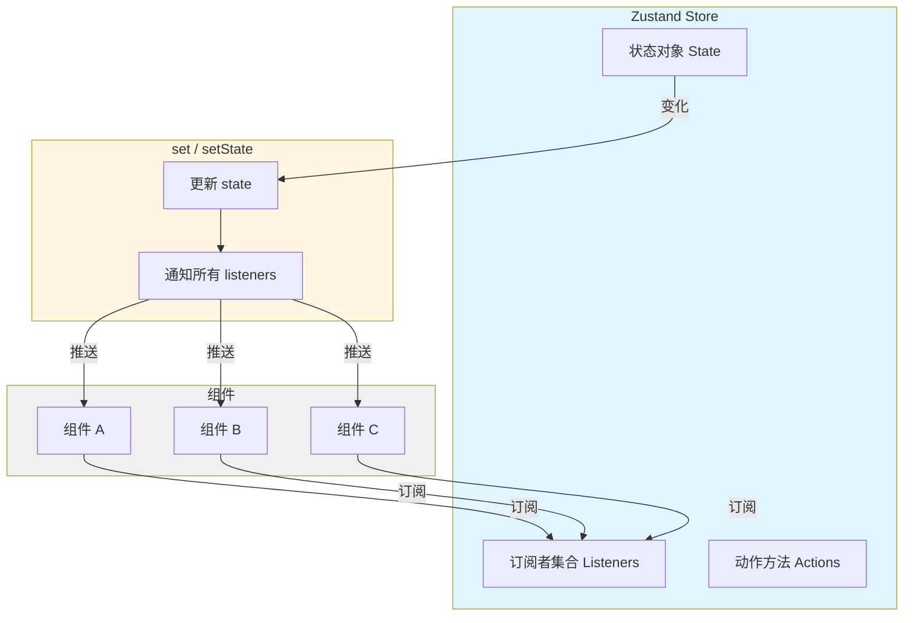

# Zustand 核心知识体系

> 🐻 Bear necessities for state management in React | **特色：** 极简 API、无需 Provider、TypeScript 友好、中间件丰富

---

## 目录

1. [概述](#1-概述)
2. [核心概念](#2-核心概念)
3. [快速入门](#3-快速入门)
4. [基础用法](#4-基础用法)
5. [高级特性](#5-高级特性)
6. [底层原理](#6-底层原理)
7. [实战案例](#7-实战案例)
8. [常见问题](#8-常见问题)
9. [学习资源](#9-学习资源)

---

## 1. 概述

### 1.1 什么是 Zustand

**Zustand**（德语中意为"状态"）是由 React Spring 团队开发的一个极简状态管理库，专为 React 应用设计。

**核心定位：** 轻量级但功能强大的全局状态管理解决方案，基于简化的 Flux 原则构建。

**通俗理解：**
- 平时 React 组件用 `useState` 管理本地状态
- 当多个组件需要共享状态时，Zustand 提供一个"中央仓库"
- 任何组件都可以直接从这个仓库读取或更新状态，**不需要 Provider 包裹**

### 1.2 为什么需要 Zustand

**传统状态管理的痛点：**

| 方案 | 痛点 |
|------|------|
| **Redux** | 样板代码过多（action、reducer、selector）、学习曲线陡峭 |
| **Context API** | 深层组件更新时性能问题、需要 Provider 层层包裹 |
| **MobX** | 魔法感较强、调试相对困难 |

**Zustand 的解决方案：**

```
没有 Zustand 时：
用户：帮我管理全局状态
Redux: 好的，请先写 action type → action creator → reducer → store → selector → connect...
       （50 行样板代码后）

有 Zustand 后：
用户：帮我管理全局状态
Zustand: const useStore = create((set) => ({ count: 0, inc: () => set(s => ({ count: s.count + 1 })) }))
       完成。
```

### 1.3 核心优势

| 优势 | 说明 |
|------|------|
| **极简 API** | 核心代码约 50 行，API 直观易上手 |
| **无需 Provider** | 不像 Redux/Context 需要顶层包裹 |
| **TypeScript 友好** | 完整的类型推断，开箱即用 |
| **高性能** | 细粒度订阅，只重渲染真正需要更新的组件 |
| **中间件丰富** | devtools、persist、immer 等官方中间件 |
| **包体积小** | gzip 后约 1KB |
| **框架无关** | 核心是纯 JS 的 Pub-Sub 系统，不限于 React |

### 1.4 适用场景

**推荐使用 Zustand：**
- ✅ 中型到大型 React 应用
- ✅ 需要跨组件共享状态
- ✅ 追求简洁 API 和开发体验
- ✅ 需要 TypeScript 完整类型支持
- ✅ 需要状态持久化、调试等功能

**可能不需要 Zustand：**
- ❌ 简单的组件树（useState + Context 足够）
- ❌ 需要复杂的状态历史追踪（考虑 Redux）
- ❌ 团队已有成熟的 Redux 实践

---

## 2. 核心概念

### 2.1 Store（状态仓库）

**定义：** Store 是 Zustand 中状态的核心容器，存储应用的全局状态和更新方法。

**创建方式：**
```javascript
import { create } from 'zustand'

const useStore = create((set) => ({
  // 状态数据
  count: 0,
  bears: 0,

  // 更新方法（直接存储在 store 中）
  increasePopulation: () => set((state) => ({ bears: state.bears + 1 })),
  removeAllBears: () => set({ bears: 0 }),
}))
```

**核心特点：**
- Store 是一个 **Hook 函数**，可以在组件中直接调用
- 状态和方法都存储在同一个 store 中
- 支持多个独立的 store（不强制单一数据源）

### 2.2 状态更新机制

**set 函数的两种用法：**

```javascript
// 方式 1：函数式更新（推荐，基于前一个状态）
set((state) => ({ count: state.count + 1 }))

// 方式 2：直接覆盖/合并
set({ count: 10 })  // 合并到新状态
set({ count: 10 }, true)  // 完全替换状态（第二个参数 replace=true）
```

**不可变更新：**
- Zustand 内部使用 `Object.assign` 进行浅合并
- 可集成 Immer 中间件实现可变语法更新

### 2.3 选择器（Selector）

**定义：** 选择器函数用于精确指定组件需要订阅的状态片段。

**为什么需要选择器：**
```javascript
// ❌ 不好的做法：订阅整个 store
const { count, bears } = useStore()  // 任何状态变化都会触发重渲染

// ✅ 好的做法：精确选择需要的状态
const count = useStore((state) => state.count)  // 只有 count 变化时才重渲染
```

**选择器的自动依赖追踪：**
- Zustand 内部通过选择器函数的返回值来判断是否需要重渲染
- 只有当选择的状态片段变化时，组件才会更新

### 2.4 依赖追踪与渲染优化

**细粒度更新机制：**



**上图说明：**
- 当 `count` 变化时，只有组件 A 重渲染
- 当 `bears` 变化时，只有组件 B 重渲染
- 组件 C 不会因为 count 或 bears 的变化而重渲染

---

## 3. 快速入门

### 3.1 安装

```bash
npm install zustand
# 或
yarn add zustand
```

### 3.2 创建第一个 Store

```javascript
// src/store/counterStore.js
import { create } from 'zustand'

export const useCounterStore = create((set) => ({
  count: 0,
  increase: () => set((state) => ({ count: state.count + 1 })),
  decrease: () => set((state) => ({ count: state.count - 1 })),
  reset: () => set({ count: 0 }),
}))
```

### 3.3 在组件中使用

```jsx
// src/components/Counter.jsx
import { useCounterStore } from '../store/counterStore'

function Counter() {
  const { count, increase, decrease, reset } = useCounterStore()

  return (
    <div>
      <h1>计数：{count}</h1>
      <button onClick={increase}>增加</button>
      <button onClick={decrease}>减少</button>
      <button onClick={reset}>重置</button>
    </div>
  )
}
```

### 3.4 完整示例

```jsx
import { create } from 'zustand'
import { Button } from 'antd'

// 1. 创建 store
const useStore = create((set) => ({
  count: 0,
  increase: () => set((state) => ({ count: state.count + 1 })),
}))

// 2. 绑定 store 到组件
function ZustandExample() {
  const { count, increase } = useStore()

  return (
    <>
      <h1>{count}</h1>
      <Button type="primary" onClick={increase}>增加</Button>
    </>
  )
}

export default ZustandExample
```

---

## 4. 基础用法

### 4.1 状态读取

**基础选择器：**
```javascript
// 读取单个状态
const bears = useStore((state) => state.bears)

// 读取多个状态（使用 useShallow 优化）
import { useShallow } from 'zustand/react/shallow'
const { bears, honey } = useStore(
  useShallow((state) => ({ bears: state.bears, honey: state.honey }))
)
```

### 4.2 状态更新

**同步更新：**
```javascript
// 方式 1：直接设置
set({ count: 10 })

// 方式 2：基于前一个状态（推荐）
set((state) => ({ count: state.count + 1 }))

// 方式 3：完全替换
set({ count: 10 }, true)  // 第二个参数 replace=true
```

**异步更新：**
```javascript
const useStore = create((set) => ({
  channels: [],
  fetchChannels: async () => {
    const res = await fetch('http://example.com/api/channels')
    const json = await res.json()
    set({ channels: json.data.channels })
  },
}))

// 组件中使用
function ChannelList() {
  const { fetchChannels, channels } = useStore()

  return (
    <>
      <button onClick={fetchChannels}>加载频道</button>
      <ul>
        {channels.map(item => (
          <li key={item.id}>{item.name}</li>
        ))}
      </ul>
    </>
  )
}
```

### 4.3 在组件外部使用

```javascript
// 获取当前状态
const currentCount = useStore.getState().count

// 直接设置状态
useStore.setState({ count: 100 })

// 订阅状态变化
const unsubscribe = useStore.subscribe(
  (state) => state.count,
  (count, prevCount) => {
    console.log(`计数从 ${prevCount} 变为 ${count}`)
  }
)

// 取消订阅
unsubscribe()
```

### 4.4 多 Store 模式

```javascript
// Store 1: 用户状态
const useUserStore = create((set) => ({
  user: null,
  login: (userData) => set({ user: userData }),
  logout: () => set({ user: null }),
}))

// Store 2: 主题状态
const useThemeStore = create((set) => ({
  theme: 'light',
  toggleTheme: () => set((state) => ({
    theme: state.theme === 'light' ? 'dark' : 'light'
  })),
}))

// 组件中可以同时使用多个 store
function App() {
  const { user, logout } = useUserStore()
  const { theme, toggleTheme } = useThemeStore()

  return (
    <div className={theme}>
      {user ? <span>{user.name}</span> : <LoginButton />}
      <button onClick={toggleTheme}>切换主题</button>
    </div>
  )
}
```

---

## 5. 高级特性

### 5.1 中间件系统

Zustand 提供了丰富的官方中间件，位于 `zustand/middleware`。

#### 5.1.1 DevTools 中间件

**用途：** 在 Redux DevTools 中调试 Zustand 状态。

```javascript
import { create } from 'zustand'
import { devtools } from 'zustand/middleware'

const useStore = create(devtools((set) => ({
  count: 0,
  bears: 0,
  addBear: () => set((state) => ({ bears: state.bears + 1 }), false, 'addBear'),
  eatFish: () => set((state) => ({ fish: state.fish - 1 }), false, 'eatFish'),
})))
```

**参数说明：**
- 第一个参数：store 创建函数
- 第二个参数（可选）：DevTools 名称
- `set` 的第三个参数：动作名称（用于时间旅行调试）

#### 5.1.2 Persist 中间件

**用途：** 将状态持久化到 localStorage、sessionStorage 等存储中。

```javascript
import { create } from 'zustand'
import { persist, createJSONStorage } from 'zustand/middleware'

const useStore = create(
  persist(
    (set, get) => ({
      bears: 0,
      addBear: () => set((state) => ({ bears: state.bears + 1 })),
      eatFish: () => set((state) => ({ fish: state.fish - 1 })),
    }),
    {
      name: 'food-storage',  // localStorage 中的键名
      storage: createJSONStorage(() => localStorage),  // 存储引擎
      partialize: (state) => ({ bears: state.bears }),  // 只持久化部分状态
      version: 1,  // 版本号，用于迁移
      migrate: (persistedState, version) => {
        // 数据迁移逻辑
        return persistedState
      },
    }
  )
)
```

#### 5.1.3 Immer 中间件

**用途：** 使用可变语法更新不可变状态。

```javascript
import { create } from 'zustand'
import { immer } from 'zustand/middleware/immer'

const useStore = create(immer((set) => ({
  user: {
    name: 'John',
    profile: {
      address: 'Beijing',
    },
  },
  updateAddress: (newAddress) => set((state) => {
    // 可以直接修改，Immer 会自动处理不可变性
    state.user.profile.address = newAddress
  }),
})))
```

**对比：传统方式 vs Immer 方式**

```javascript
// 传统方式（需要手动展开对象）
set((state) => ({
  user: {
    ...state.user,
    profile: {
      ...state.user.profile,
      address: newAddress,
    },
  },
}))

// Immer 方式（直观的可变语法）
set((state) => {
  state.user.profile.address = newAddress
})
```

#### 5.1.4 SubscribeWithSelector 中间件

**用途：** 精确控制状态订阅，避免不必要的回调。

```javascript
import { create } from 'zustand'
import { subscribeWithSelector } from 'zustand/middleware'

const useStore = create(subscribeWithSelector((set) => ({
  name: 'John',
  age: 25,
  address: 'Beijing',
})))

// 只监听 age 变化
useStore.subscribe(
  (state) => state.age,
  (age, prevAge) => {
    console.log(`年龄从 ${prevAge} 变为 ${age}`)
  }
)
```

### 5.2 TypeScript 支持

Zustand 内置完整的 TypeScript 类型支持，无需额外安装类型包。

```typescript
import { create } from 'zustand'

interface BearState {
  bears: number
  honey: number
  increasePopulation: () => void
  removeAllBears: () => void
}

const useBearStore = create<BearState>((set) => ({
  bears: 0,
  honey: 100,
  increasePopulation: () => set((state) => ({ bears: state.bears + 1 })),
  removeAllBears: () => set({ bears: 0 }),
}))
```

### 5.3 切片模式（Slices Pattern）

**用途：** 将大型 store 拆分为多个小型 store，实现模块化。

```typescript
// 用户切片
const createUserSlice = (set, get) => ({
  user: null,
  login: (userData) => set({ user: userData }),
  logout: () => set({ user: null }),
})

// 主题切片
const createThemeSlice = (set, get) => ({
  theme: 'light',
  toggleTheme: () => set((state) => ({
    theme: state.theme === 'light' ? 'dark' : 'light'
  })),
})

// 组合切片
const useStore = create((...args) => ({
  ...createUserSlice(...args),
  ...createThemeSlice(...args),
}))
```

### 5.4 多实例 Store

**用途：** 创建多个独立的 store 实例，结合 Provider 使用。

```javascript
import create from 'zustand'
import createContext from 'zustand/context'

const { Provider, useStore } = createContext()

const createStore = () => create((set) => ({
  count: 0,
  inc: () => set((state) => ({ count: state.count + 1 })),
}))

function App() {
  return (
    <Provider createStore={createStore}>
      <Child />
    </Provider>
  )
}

function Child() {
  const { count, inc } = useStore()
  return <button onClick={inc}>{count}</button>
}
```

---

## 6. 底层原理

### 6.1 核心架构：发布 - 订阅模式

Zustand 的核心是一个精简的发布 - 订阅（Pub-Sub）系统。



### 6.2 源码级实现：create 函数

Zustand 的核心代码极其精简（约 50 行），以下是简化后的核心实现：

```javascript
// vanilla.ts - 与框架无关的核心逻辑
function createStore(createState) {
  let state  // 当前状态
  const listeners = new Set()  // 订阅者集合

  // 获取当前状态
  const getState = () => state

  // 更新状态
  const setState = (partial, replace) => {
    // 支持函数式更新或直接传入新值
    const nextState = typeof partial === 'function' ? partial(state) : partial

    // 只有状态真正变化才触发更新
    if (!Object.is(nextState, state)) {
      const previousState = state
      // 合并或替换状态
      state = replace ? nextState : Object.assign({}, state, nextState)
      // 通知所有订阅者
      listeners.forEach((listener) => listener(state, previousState))
    }
  }

  // 订阅状态变化
  const subscribe = (listener) => {
    listeners.add(listener)
    return () => listeners.delete(listener)  // 取消订阅
  }

  // 销毁 store
  const destroy = () => {
    listeners.clear()
  }

  // 初始化状态
  state = createState(setState, getState)

  return { getState, setState, subscribe, destroy }
}
```

### 6.3 React Hook 绑定

Zustand 使用 React 的 `useSyncExternalStoreWithSelector` 将 store 与组件连接：

```javascript
// react.ts
import { useSyncExternalStoreWithSelector } from 'use-sync-external-store/shim'

const useBoundStore = (selector, equalityFn) => {
  return useSyncExternalStoreWithSelector(
    store.subscribe,  // 订阅函数
    store.getState,   // 获取状态函数
    selector,         // 选择器
    equalityFn        // 相等性比较函数
  )
}
```

**API 方法混入：**
```javascript
// 将 store 的 API 方法附加到 hook 上
Object.assign(useBoundStore, store)

// 现在可以直接调用
useBoundStore.getState()
useBoundStore.setState({ count: 10 })
useBoundStore.subscribe(...)
```

### 6.4 依赖追踪机制

**选择性订阅原理：**

```javascript
// 组件调用
const count = useStore((state) => state.count)

// 内部流程
1. useStore 接收选择器函数 (state) => state.count
2. 使用选择器从 store 获取当前值：selector(store.getState())
3. 订阅 store 的变化
4. 当状态变化时：
   - 再次运行选择器获取新值
   - 比较新旧值是否相等（===）
   - 只有不相等时才触发组件重渲染
```

**useShallow 浅比较优化：**

```javascript
// shallow.ts 实现
function shallow(a, b) {
  if (Object.is(a, b)) return true

  if (typeof a !== 'object' || typeof b !== 'object' || a === null || b === null) {
    return false
  }

  const keysA = Object.keys(a)
  const keysB = Object.keys(b)

  if (keysA.length !== keysB.length) return false

  for (const key of keysA) {
    if (!keysB.includes(key) || !Object.is(a[key], b[key])) {
      return false
    }
  }

  return true
}

export function useShallow(selector) {
  const prev = useRef()
  return (state) => {
    const next = selector(state)
    return shallow(prev.current, next) ? prev.current : (prev.current = next)
  }
}
```

**useShallow 的作用：**
- 当选择器返回对象或数组时，即使内容相同但引用不同，组件也会重渲染
- useShallow 通过浅比较判断是否真正变化，避免不必要的重渲染

### 6.5 为什么不需要 Provider

**传统 Redux/Context 需要 Provider 的原因：**
- 需要在全局创建一个 store 实例
- 通过 Context API 将 store 传递给子组件
- 需要 Provider 包裹应用

**Zustand 不需要 Provider 的原因：**
```javascript
// Zustand 的 store 是一个闭包
const useStore = create((set) => ({ count: 0 }))

// store 本身就是一个 Hook，可以直接导入使用
import { useStore } from './store'

function Component() {
  const count = useStore((state) => state.count)  // 直接使用
  return <div>{count}</div>
}
```

**关键设计：**
- Store 是闭包，内部维护状态和订阅者
- 导出的 `useStore` 本身就是一个 Hook
- 利用 React 的 `useSyncExternalStore` 自动订阅状态变化

### 6.6 渲染优化机制

**细粒度订阅：**
```javascript
// 组件 A 订阅 count
const count = useStore((state) => state.count)

// 组件 B 订阅 bears
const bears = useStore((state) => state.bears)

// 当 count 变化时：
// 1. setState 触发所有 listeners
// 2. 组件 A 的选择器返回新值（变化了）→ 重渲染
// 3. 组件 B 的选择器返回旧值（未变化）→ 不重渲染
```

**性能优化技巧：**
1. 使用精确的选择器，避免订阅整个 store
2. 使用 `useShallow` 优化对象/数组选择器
3. 使用 `subscribeWithSelector` 中间件实现组件外精确订阅

---

## 7. 实战案例

### 7.1 购物车管理

```typescript
import { create } from 'zustand'

interface CartItem {
  id: number
  name: string
  price: number
  quantity: number
}

interface CartState {
  items: CartItem[]
  addItem: (item: CartItem) => void
  removeItem: (id: number) => void
  updateQuantity: (id: number, quantity: number) => void
  clearCart: () => void
  totalPrice: () => number
}

export const useCartStore = create<CartState>((set, get) => ({
  items: [],

  addItem: (item) => set((state) => {
    const existing = state.items.find(i => i.id === item.id)
    if (existing) {
      return {
        items: state.items.map(i =>
          i.id === item.id ? { ...i, quantity: i.quantity + 1 } : i
        ),
      }
    }
    return { items: [...state.items, { ...item, quantity: 1 }] }
  }),

  removeItem: (id) => set((state) => ({
    items: state.items.filter(item => item.id !== id),
  })),

  updateQuantity: (id, quantity) => set((state) => ({
    items: state.items.map(item =>
      item.id === id ? { ...item, quantity: Math.max(0, quantity) } : item
    ),
  })),

  clearCart: () => set({ items: [] }),

  totalPrice: () => {
    const items = get().items
    return items.reduce((total, item) => total + item.price * item.quantity, 0)
  },
}))
```

### 7.2 用户认证管理

```typescript
import { create } from 'zustand'
import { persist } from 'zustand/middleware'

interface User {
  id: string
  name: string
  email: string
}

interface AuthState {
  user: User | null
  token: string | null
  isAuthenticated: boolean
  login: (email: string, password: string) => Promise<void>
  logout: () => void
  updateUser: (user: Partial<User>) => void
}

export const useAuthStore = create<AuthState>()(
  persist(
    (set, get) => ({
      user: null,
      token: null,
      isAuthenticated: false,

      login: async (email, password) => {
        const res = await fetch('/api/auth/login', {
          method: 'POST',
          headers: { 'Content-Type': 'application/json' },
          body: JSON.stringify({ email, password }),
        })
        const data = await res.json()
        set({
          user: data.user,
          token: data.token,
          isAuthenticated: true,
        })
      },

      logout: () => set({ user: null, token: null, isAuthenticated: false }),

      updateUser: (user) => set((state) => ({
        user: state.user ? { ...state.user, ...user } : null,
      })),
    }),
    {
      name: 'auth-storage',
      partialize: (state) => ({ user: state.user, token: state.token }),
    }
  )
)
```

### 7.3 主题切换

```typescript
import { create } from 'zustand'

type Theme = 'light' | 'dark' | 'system'

interface ThemeState {
  theme: Theme
  actualTheme: 'light' | 'dark'
  setTheme: (theme: Theme) => void
  toggleTheme: () => void
}

export const useThemeStore = create<ThemeState>((set) => ({
  theme: 'system',
  actualTheme: 'light',

  setTheme: (theme) => {
    set({ theme })
    // 应用主题到 document
    const actual = theme === 'system'
      ? window.matchMedia('(prefers-color-scheme: dark)').matches ? 'dark' : 'light'
      : theme
    document.documentElement.classList.toggle('dark', actual === 'dark')
    set({ actualTheme: actual })
  },

  toggleTheme: () => set((state) => ({
    theme: state.theme === 'light' ? 'dark' : 'light',
  })),
}))
```

---

## 8. 常见问题

### 8.1 性能优化

**问题：组件不必要的重渲染**

**解决方案：**
```javascript
// ❌ 不好的做法
const { bears, honey } = useStore()  // 订阅整个 store

// ✅ 好的做法
const bears = useStore((state) => state.bears)
const honey = useStore((state) => state.honey)

// ✅ 需要多个状态时使用 useShallow
import { useShallow } from 'zustand/react/shallow'
const { bears, honey } = useStore(
  useShallow((state) => ({ bears: state.bears, honey: state.honey }))
)
```

### 8.2 状态重置

**问题：如何在退出登录时重置所有状态**

**解决方案：**
```typescript
import { create } from 'zustand'

interface AppState {
  user: User | null
  count: number
  reset: () => void
}

const initialState = {
  user: null,
  count: 0,
}

export const useStore = create<AppState>((set, get) => ({
  ...initialState,
  reset: () => set(initialState),
}))
```

### 8.3 异步状态管理

**问题：如何处理异步操作和加载状态**

**解决方案：**
```typescript
interface DataState {
  data: any[]
  loading: boolean
  error: string | null
  fetchData: () => Promise<void>
}

export const useDataStore = create<DataState>((set) => ({
  data: [],
  loading: false,
  error: null,

  fetchData: async () => {
    set({ loading: true, error: null })
    try {
      const res = await fetch('/api/data')
      const data = await res.json()
      set({ data, loading: false })
    } catch (err) {
      set({ error: err.message, loading: false })
    }
  },
}))
```

### 8.4 与 Redux 对比

| 对比项 | Redux | Zustand |
|--------|-------|---------|
| **样板代码** | 多（action、reducer、store） | 少（一个 create 函数） |
| **Provider** | 需要 | 不需要 |
| **TypeScript** | 需要额外配置 | 开箱即用 |
| **中间件** | 丰富 | 官方提供常用中间件 |
| **调试工具** | Redux DevTools | 通过 devtools 中间件支持 |
| **学习曲线** | 陡峭 | 平缓 |
| **包大小** | ~9KB | ~1KB |

---

## 9. 学习资源

### 9.1 官方资源

- [Zustand 官方文档](https://docs.pmnd.rs/zustand/getting-started/introduction)
- [GitHub 仓库](https://github.com/pmndrs/zustand)
- [NPM 包](https://www.npmjs.com/package/zustand)

### 9.2 技术博客

- [Zustand 状态管理：React 中一个极简、快速的全局状态方案](https://www.jianshu.com/p/07b9380b60a5)
- [精读《zustand 源码》](https://zhuanlan.zhihu.com/p/461152248)
- [Zustand 与 TypeScript 完美结合](https://blog.csdn.net/gitblog_07597/article/details/148889029)

### 9.3 对比选型

- [2025 React 状态管理终极指南](https://blog.csdn.net/gitblog_00058/article/details/138787899)
- [Redux vs Zustand 对比](https://doi.org/10.32628/cseit24106172)

---

## 附录：引用列表

| 来源 | 类型 | 查阅时间 |
|------|------|----------|
| Zustand 官方文档 | 官方文档 | 2026-03-28 |
| Zustand GitHub 仓库 | 源代码 | 2026-03-28 |
| CSDN 技术博客 | 技术博客 | 2026-03-28 |
| 知乎专栏 | 技术博客 | 2026-03-28 |
| 简书 | 技术博客 | 2026-03-28 |

---

*文档版本：1.0.0 | 创建：2026-03-28*
