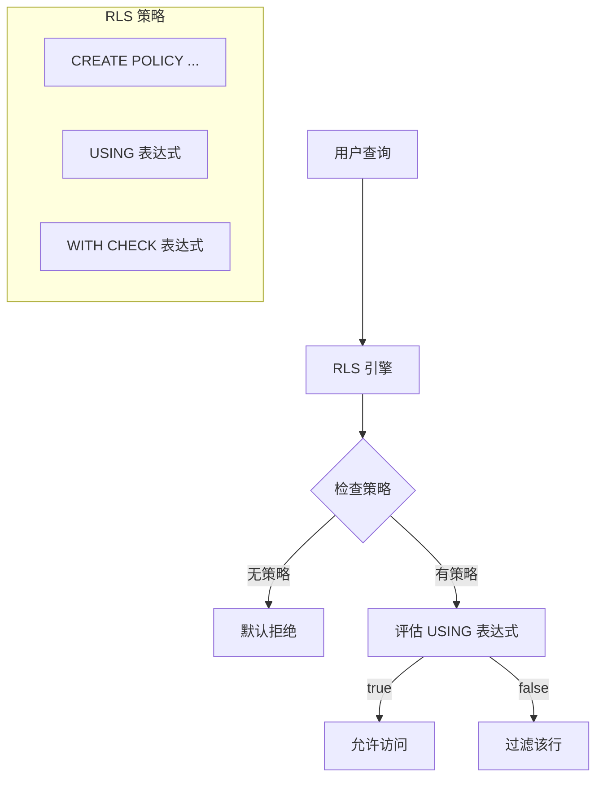
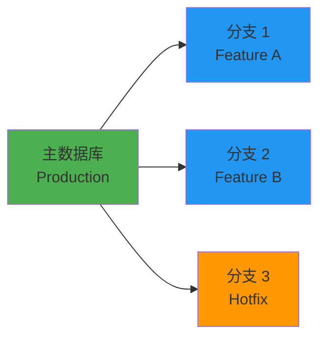

# 第 3 章：PostgreSQL 数据库核心与底层原理

## 3.1 数据库基础

### 核心概念定义

Supabase 的底层是标准的 **PostgreSQL 15+** 关系型数据库。与很多 NoSQL 型 BaaS 不同，Supabase 选择 PostgreSQL 作为核心，原因在于：

**为什么选择 PostgreSQL？**
1. **关系型模型**：适合有明确数据结构、需要复杂查询的业务
2. **完整 SQL 支持**：支持复杂查询、事务、索引、视图、函数
3. **成熟生态**：35 年打磨验证的可靠性和功能稳健性
4. **扩展能力**：支持 50+ 扩展（pgvector、PostGIS 等）

### 核心操作能力

| 操作类型 | 说明 | 示例 |
|----------|------|------|
| **表管理** | 可视化创建、修改表结构 | 表编辑器、SQL 编辑器 |
| **数据库分支** | 创建数据库副本进行测试 | 类似 Git 分支 |
| **自动备份** | 数据自动备份，可随时恢复 | 时间点恢复 |
| **SQL 执行** | 在线编写和执行 SQL | 内置 SQL 编辑器 |

---

## 3.2 PostgREST 自动 API 生成原理

### 核心机制

**PostgREST** 是一个独立服务，它将 PostgreSQL 数据库自动映射为 RESTful API，无需手动编写 CRUD 接口。

### 工作原理


### HTTP 请求到 SQL 的映射

| HTTP 请求 | 等效 SQL | 说明 |
|-----------|---------|------|
| `GET /todos?select=*,users(*)` | `SELECT *, users.* FROM todos JOIN users ON ...` | 支持关联查询 |
| `POST /todos` | `INSERT INTO todos (...) VALUES (...)` | 创建记录 |
| `PATCH /todos?id=eq.1` | `UPDATE todos SET ... WHERE id = 1` | 更新记录 |
| `DELETE /todos?id=eq.1` | `DELETE FROM todos WHERE id = 1` | 删除记录 |

### SDK 调用示例

```javascript
// 初始化客户端
import { createClient } from '@supabase/supabase-js'
const supabase = createClient(
  'https://your-project.supabase.co',
  'your-anon-key'
)

// 查询数据（自动转换为 SQL）
const { data } = await supabase
  .from('todos')
  .select('*, users(name)')  // 关联查询
  .eq('user_id', 1)
  .order('created_at', { ascending: false })

// 插入数据
const { data } = await supabase
  .from('todos')
  .insert({ task: 'Learn Supabase', user_id: 1 })

```

### 底层实现细节

**PostgREST 的核心优势：**
1. **零代码 API**：基于数据库 Schema 自动生成，无需编写接口
2. **RLS 集成**：自动遵守 PostgreSQL 的行级安全策略
3. **类型安全**：支持从数据库 Schema 生成 TypeScript 类型

---

## 3.3 行级安全 (RLS) 深度解析

### 概念定义

**Row-Level Security (RLS)** 是 PostgreSQL 的一项安全特性，允许基于用户身份控制哪些行可以被访问。Supabase 将 RLS 转化为可视化配置，实现**零代码权限控制**。

### 工作原理



### RLS 策略配置示例

```sql
-- 1. 创建待办事项表
CREATE TABLE todos (
  id UUID PRIMARY KEY,
  user_id UUID REFERENCES auth.users,
  task TEXT NOT NULL,
  created_at TIMESTAMPTZ DEFAULT NOW()
);

-- 2. 启用 RLS
ALTER TABLE todos ENABLE ROW LEVEL SECURITY;

-- 3. 创建策略：用户只能访问自己的数据
CREATE POLICY "User access own todos" ON todos
  FOR ALL
  USING (auth.uid() = user_id)
  WITH CHECK (auth.uid() = user_id);

```

### 策略类型详解

| 策略类型 | 适用操作 | 表达式 |
|----------|---------|--------|
| **SELECT** | 查询数据 | `USING (auth.uid() = user_id)` |
| **INSERT** | 插入数据 | `WITH CHECK (auth.uid() = user_id)` |
| **UPDATE** | 更新数据 | `USING (...)` + `WITH CHECK (...)` |
| **DELETE** | 删除数据 | `USING (auth.uid() = user_id)` |

### 实际应用场景

| 场景 | RLS 策略示例 |
|------|-------------|
| **社交媒体** | 用户仅可见自己的动态 |
| **SaaS 平台** | 按客户隔离数据（多租户） |
| **医疗系统** | 严格遵循 HIPAA 合规要求 |
| **协作工具** | 项目成员访问项目数据 |

### 注意事项

```sql
-- ⚠️ 重要：USING 和 WITH CHECK 的区别

-- USING：决定哪些行"可见"（用于 SELECT/DELETE）
USING (auth.uid() = user_id)

-- WITH CHECK：决定哪些行"允许插入/更新"（用于 INSERT/UPDATE）
WITH CHECK (auth.uid() = user_id)

-- 如果未提供 WITH CHECK，USING 表达式也会用于 INSERT/UPDATE

```

---

## 3.4 数据库迁移与版本管理

### 迁移系统核心

Supabase CLI 提供完整的数据库迁移管理方案：

```bash
# 创建新的迁移文件（时间戳命名）
supabase migration new add_user_profiles

# 查看迁移状态
supabase migration status

# 应用所有待处理的迁移
supabase migration up

# 回滚到指定版本
supabase migration down --version 20230101000000

```

### 迁移文件结构

```
supabase/migrations/
├── 20250101000000_create_users.sql
├── 20250102000000_create_todos.sql
└── 20250103000000_add_rls_policies.sql

```

### 迁移文件内容

```sql
-- 20250101000000_create_users.sql

-- UP 迁移（应用）
CREATE TABLE users (
  id UUID PRIMARY KEY DEFAULT gen_random_uuid(),
  email TEXT UNIQUE NOT NULL,
  created_at TIMESTAMPTZ DEFAULT NOW()
);

ALTER TABLE users ENABLE ROW LEVEL SECURITY;

-- DOWN 迁移（回滚）
DROP TABLE IF EXISTS users;

```

### 版本控制原理

| 机制 | 说明 |
|------|------|
| **时间戳命名** | 确保执行顺序正确 |
| **UP/DOWN 配对** | 支持正向应用和反向回滚 |
| **迁移状态追踪** | 记录已执行的迁移版本 |
| **影子数据库** | 本地测试用隔离数据库 |

---

## 3.5 内核扩展机制

### PostgreSQL 扩展系统

Supabase 预装了 50+ PostgreSQL 扩展，核心扩展包括：

| 扩展名称 | 用途 | 应用场景 |
|----------|------|----------|
| **pgvector** | 向量相似度搜索 | AI 嵌入、推荐系统 |
| **PostGIS** | 地理空间数据 | 地图、位置服务 |
| **pgcrypto** | 加密函数 | 数据加密、哈希 |
| **pg_net** | HTTP 请求 | Webhook、外部 API |
| **pgaudit** | 审计日志 | 合规、安全审计 |

### pgvector 向量搜索示例

```sql
-- 1. 启用扩展
CREATE EXTENSION IF NOT EXISTS vector;

-- 2. 创建向量列
CREATE TABLE documents (
  id UUID PRIMARY KEY,
  content TEXT,
  embedding vector(1536)  -- OpenAI embedding 维度
);

-- 3. 创建向量索引（加速相似度搜索）
CREATE INDEX ON documents USING ivfflat (embedding vector_cosine_ops);

-- 4. 执行相似度查询
SELECT content, 1 - (embedding <=> '[0.1, 0.2, ...]'::vector) AS similarity
FROM documents
ORDER BY similarity DESC
LIMIT 5;

```

### 扩展管理命令

```bash
# 查看已安装的扩展
supabase extensions list

# 启用扩展（SQL）
CREATE EXTENSION IF NOT EXISTS vector;

# 查看扩展信息
SELECT * FROM pg_extension WHERE extname = 'vector';

```

---

## 3.6 查询性能优化

### 索引优化策略

```sql
-- 1. B-Tree 索引（默认，适用于等值和范围查询）
CREATE INDEX idx_todos_user_id ON todos(user_id);

-- 2. GIN 索引（全文搜索、JSONB、数组）
CREATE INDEX idx_todos_task_gin ON todos USING GIN (to_tsvector('english', task));

-- 3. GiST 索引（地理空间、向量相似度）
CREATE INDEX idx_location_gist ON locations USING GiST (coordinates);

-- 4. 复合索引（多列查询）
CREATE INDEX idx_todos_user_status ON todos(user_id, status);

```

### 查询性能分析

```sql
-- 使用 EXPLAIN ANALYZE 分析查询计划
EXPLAIN ANALYZE
SELECT * FROM todos
WHERE user_id = '123'
  AND status = 'pending'
ORDER BY created_at DESC;

-- 输出包含：
-- - 扫描方式（Seq Scan / Index Scan）
-- - 实际执行时间
-- - 行数估算

```

### 连接池管理

高并发场景下，使用 **pgBouncer** 管理数据库连接：

| 配置项 | 推荐值 | 说明 |
|--------|--------|------|
| `max_connections` | 500 | 最大连接数 |
| `pool_mode` | transaction | 事务模式连接池 |
| `reserve_pool_size` | 10 | 预留连接数 |

---

## 3.7 数据库分支与测试

### 数据库分支机制

Supabase 支持创建数据库副本（分支）用于测试，类似 Git 分支：



### 分支操作流程

```bash
# 创建分支
supabase branches create feature-user-profiles

# 列出分支
supabase branches list

# 切换到分支
supabase branches switch feature-user-profiles

# 删除分支
supabase branches delete feature-user-profiles

```

### 分支应用场景

| 场景 | 说明 |
|------|------|
| **功能开发** | 为每个新功能创建独立分支 |
| **Bug 修复** | 在生产数据库上测试修复方案 |
| **数据迁移测试** | 在分支上验证迁移脚本 |
| **A/B 测试** | 对比不同 Schema 设计 |

---

## 本章小结

本章深入解析了 Supabase 的 PostgreSQL 数据库核心：

1. **PostgreSQL 基础**：关系型模型、完整 SQL 支持、成熟生态
2. **PostgREST 原理**：HTTP→SQL 自动映射、零代码 API、RLS 集成
3. **RLS 行级安全**：基于用户的精细权限控制、USING/WITH CHECK 表达式
4. **迁移与版本管理**：时间戳命名、UP/DOWN 配对、影子数据库
5. **内核扩展**：pgvector（AI）、PostGIS（地理）、pgcrypto（加密）
6. **性能优化**：B-Tree/GIN/GiST索引、EXPLAIN ANALYZE、pgBouncer 连接池
7. **数据库分支**：类似 Git 的分支机制，支持功能开发和测试

