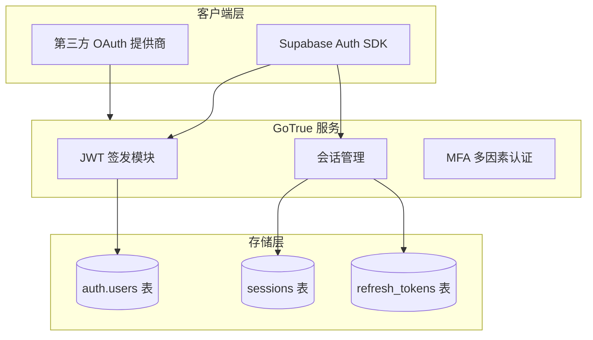
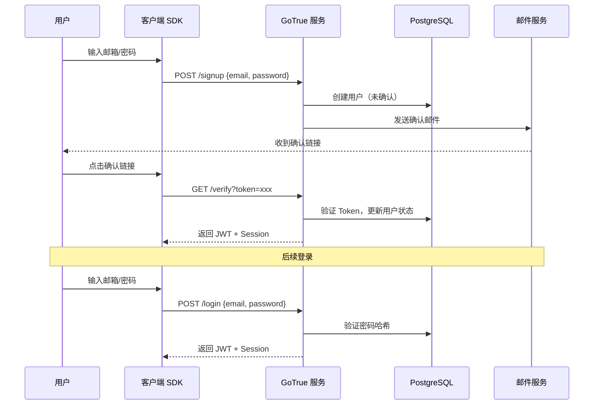
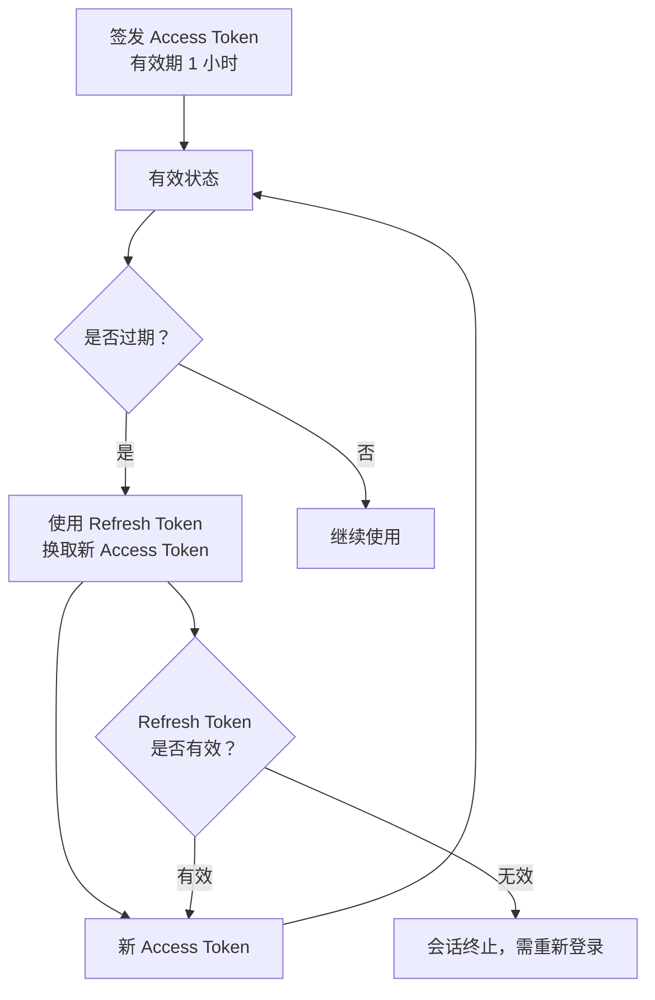
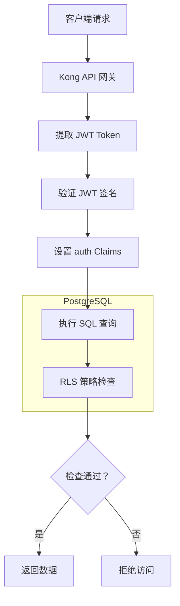
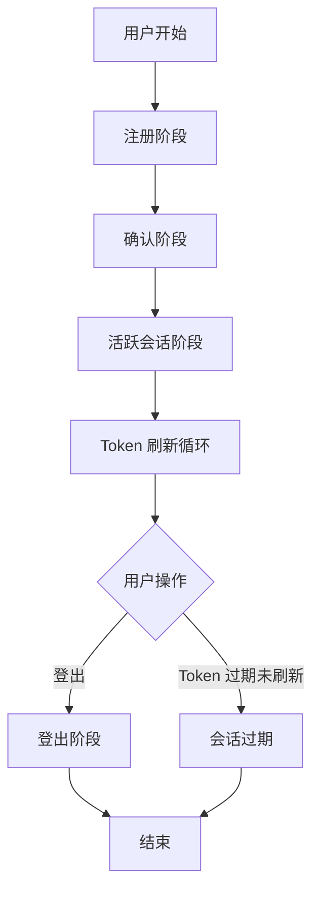
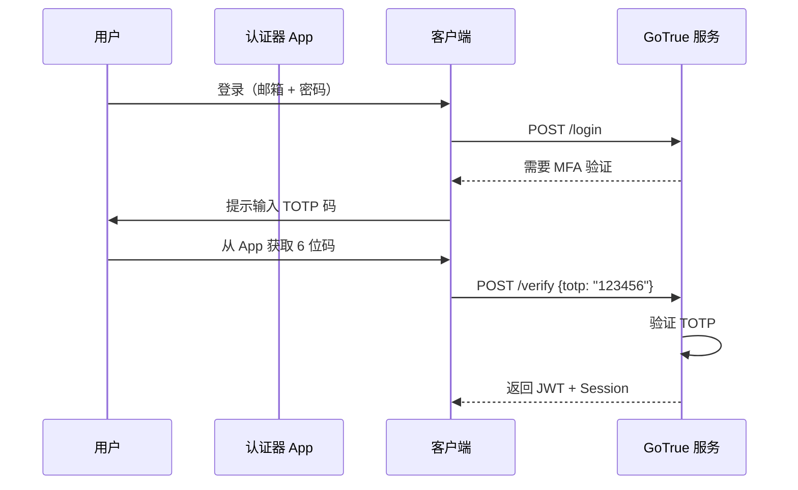

# 第 4 章：认证与授权系统 (Auth) 生命周期解析

## 4.1 Auth 系统架构概览

### 核心组件

Supabase Auth 基于 **GoTrue** 构建，这是一个用 Go 语言编写的轻量级身份验证 API，最初由 Netlify 开发，后被 Supabase 深度定制。



### 技术栈

| 组件 | 技术 | 职责 |
|------|------|------|
| **GoTrue** | Go 语言 | 用户管理、JWT 签发、OAuth 集成 |
| **JWT** | JSON Web Token | 无状态令牌、包含用户 Claims |
| **PostgreSQL** | 关系型数据库 | 存储用户数据、会话、刷新令牌 |
| **RLS** | 行级安全策略 | 基于 JWT Claims 的数据访问控制 |

---

## 4.2 认证方式全览

### 支持的认证方式

| 认证方式 | 说明 | 适用场景 |
|----------|------|----------|
| **邮箱密码** | 传统邮箱 + 密码登录 | 标准 Web 应用 |
| **Magic Link** | 无密码登录，邮件发送魔法链接 | 简洁用户体验 |
| **手机号 OTP** | 短信验证码登录 | 移动应用 |
| **OAuth 第三方** | Google、GitHub、Apple 等 | 社交登录 |
| **匿名登录** | 临时匿名账户 | 访客模式 |
| **SAML/SSO** | 企业单点登录 | 企业用户 |

### 邮箱密码认证流程



### 代码示例

```javascript
// 1. 邮箱密码注册
const { data, error } = await supabase.auth.signUp({
  email: 'user@example.com',
  password: 'strong-password-123',
  options: {
    data: { full_name: 'John Doe' },  // 元数据
    emailRedirectTo: 'https://example.com/welcome'
  }
})

// 2. 邮箱密码登录
const { data, error } = await supabase.auth.signInWithPassword({
  email: 'user@example.com',
  password: 'strong-password-123'
})

// 3. Magic Link 登录（无密码）
const { data, error } = await supabase.auth.signInWithOtp({
  email: 'user@example.com'
})

// 4. OAuth 第三方登录（以 GitHub 为例）
const { data, error } = await supabase.auth.signInWithOAuth({
  provider: 'github',
  options: {
    redirectTo: 'https://example.com/auth/callback'
  }
})

// 5. 登出
const { error } = await supabase.auth.signOut()

```

---

## 4.3 JWT 与 Session 管理

### JWT 结构解析

Supabase Auth 使用 JWT（JSON Web Token）作为访问令牌，结构如下：

```
eyJhbGciOiJIUzI1NiIsInR5cCI6IkpXVCJ9.eyJpc3MiOiJzdXBhYmFzZSIsInJvbGUiOiJhdXRoZW50aWNhdGVkIiwiYXpwIjoiYWNjZXNzX3Rva2VuIiwiZXhwIjoxNjc3NzY3NzY3LCJ1aWQiOiIxMjM0NTY3ODkwIiwiZW1haWwiOiJ1c2VyQGV4YW1wbGUuY29tIiwicGhvbmUiOiIiLCJhcHBfbWV0YWRhdGEiOnt9LCJ1c2VyX21ldGFkYXRhIjp7fSwicm9sZSI6ImF1dGhlbnRpY2F0ZWQifQ.signature
```

### JWT Payload Claims

| Claim | 说明 | 示例值 |
|-------|------|--------|
| `iss` | 签发者 | `"supabase"` |
| `sub` | 主题（用户 ID） | `"12345678-1234-1234-1234-123456789012"` |
| `aud` | 受众 | `"authenticated"` |
| `exp` | 过期时间 | `1677767767` |
| `role` | 用户角色 | `"authenticated"` |
| `email` | 用户邮箱 | `"user@example.com"` |
| `phone` | 用户手机号 | `"+1234567890"` |
| `app_metadata` | 应用元数据 | `{}` |
| `user_metadata` | 用户元数据 | `{"full_name": "John Doe"}` |

### Token 生命周期



### 令牌刷新机制

```javascript
// SDK 自动处理令牌刷新
const supabase = createClient(url, anonKey, {
  auth: {
    autoRefreshToken: true,  // 默认启用，过期前自动刷新
    persistSession: true,    // 持久化到 localStorage
    detectSessionInUrl: true // 自动检测 OAuth 回调 URL 中的 session
  }
})

// 监听认证状态变化
supabase.auth.onAuthStateChange((event, session) => {
  console.log('Auth state changed:', event)
  // event 类型:
  // - SIGNED_IN: 用户登录
  // - SIGNED_OUT: 用户登出
  // - TOKEN_REFRESHED: Token 刷新
  // - USER_UPDATED: 用户信息更新
  // - PASSWORD_RECOVERY: 密码恢复
})

```

### Session 存储策略

| 存储方式 | 优点 | 缺点 | 适用场景 |
|----------|------|------|----------|
| **localStorage** | 简单、持久化 | XSS 风险 | 普通 Web 应用 |
| **sessionStorage** | 会话级、安全 | 关闭标签丢失 | 临时会话 |
| **自定义存储** | 完全控制 | 需自行实现 | 高安全需求 |
| **内存存储** | 最安全 | 刷新丢失 | 敏感操作 |

---

## 4.4 RLS 行级安全策略集成

### Auth 与 RLS 的协同工作



### auth.uid() 函数

Supabase 提供 `auth.uid()` 函数，从 JWT 中提取用户 ID：

```sql
-- 在 RLS 策略中使用
CREATE POLICY "用户只能访问自己的数据" ON todos
  FOR SELECT
  USING (auth.uid() = user_id);

-- auth.uid() 返回当前认证用户的 UUID
-- 如果未认证，返回 NULL

```

### 完整的 RLS 策略示例

```sql
-- 1. 创建 profiles 表
CREATE TABLE profiles (
  id UUID PRIMARY KEY REFERENCES auth.users,
  username TEXT UNIQUE,
  avatar_url TEXT,
  updated_at TIMESTAMPTZ
);

-- 2. 启用 RLS
ALTER TABLE profiles ENABLE ROW LEVEL SECURITY;

-- 3. 创建策略组合

-- 3.1 任何人都可以查看公开资料
CREATE POLICY "公开资料可读" ON profiles
  FOR SELECT
  USING (true);

-- 3.2 只有本人可以更新自己的资料
CREATE POLICY "本人可更新" ON profiles
  FOR UPDATE
  USING (auth.uid() = id);

-- 3.3 插入时必须匹配当前用户
CREATE POLICY "本人可插入" ON profiles
  FOR INSERT
  WITH CHECK (auth.uid() = id);

```

---

## 4.5 认证生命周期完整流程

### 生命周期阶段



### 阶段 1：注册（Registration）

```javascript
// 用户提交注册表单
const { data, error } = await supabase.auth.signUp({
  email: 'newuser@example.com',
  password: 'secure-password'
})

// 后台发生的过程：
// 1. GoTrue 接收注册请求
// 2. 验证密码强度（长度 >= 6）
// 3. 对密码进行 bcrypt 哈希
// 4. 在 auth.users 表创建记录（confirmed = false）
// 5. 生成确认 Token
// 6. 发送确认邮件
// 7. 等待用户点击确认链接

```

### 阶段 2：确认（Confirmation）

```javascript
// 用户点击邮件中的确认链接
// 示例：https://example.com/auth/callback?access_token=xxx

// SDK 自动检测 URL 中的 session
const { data: { session }, error } = await supabase.auth.getSession()

// 后台发生的过程：
// 1. 解析 access_token
// 2. 验证 Token 签名和有效期
// 3. 更新用户状态（confirmed = true）
// 4. 创建初始 Session
// 5. 返回 JWT + Refresh Token

```

### 阶段 3：活跃会话（Active Session）

```javascript
// 获取当前会话
const { data: { session } } = await supabase.auth.getSession()

// 获取当前用户
const { data: { user } } = await supabase.auth.getUser()

// 后台发生的过程：
// 1. 从 localStorage 读取 Refresh Token
// 2. 验证 Token 是否有效
// 3. 返回对应的用户信息
// 4. 如果 Token 即将过期，自动刷新

```

### 阶段 4：Token 刷新循环（Token Refresh Loop）

```javascript
// SDK 自动处理，无需手动干预
// 刷新触发时机：
// - Access Token 过期前 5 分钟
// - 检测到会话即将过期

// 后台发生的过程：
// 1. 使用 Refresh Token 请求 /token?grant_type=refresh_token
// 2. GoTrue 验证 Refresh Token
// 3. 签发新的 Access Token + Refresh Token（轮换）
// 4. 使旧 Refresh Token 失效（防重放攻击）
// 5. 更新 sessions 表
// 6. SDK 将新 Token 持久化到 localStorage

```

### 阶段 5：登出（Logout）

```javascript
// 用户点击登出按钮
const { error } = await supabase.auth.signOut()

// 后台发生的过程：
// 1. 调用 /logout 端点
// 2. GoTrue 使 Refresh Token 失效
// 3. 删除 sessions 表中的记录
// 4. SDK 清除 localStorage 中的 Token
// 5. 触发 SIGNED_OUT 事件

```

### 阶段 6：密码恢复（Password Recovery）

```javascript
// 1. 请求密码恢复邮件
await supabase.auth.resetPasswordForEmail('user@example.com', {
  redirectTo: 'https://example.com/reset-password'
})

// 2. 用户点击邮件链接，进入重置页面
// 3. 提交新密码
await supabase.auth.updateUser({ password: 'new-secure-password' })

// 后台发生的过程：
// 1. 生成 Recovery Token
// 2. 发送恢复邮件
// 3. 验证 Token 有效性
// 4. 更新密码哈希
// 5. 可选：使所有现有会话失效

```

---

## 4.6 多因素认证 (MFA)

### MFA 工作原理



### 启用 MFA

```javascript
// 1. 注册 MFA 因子（通常在使用者 App 中）
const { data, error } = await supabase.auth.mfa.enroll({
  factorType: 'totp',
  friendlyName: '我的手机'
})

// data 包含：
// - id: 因子 ID
// - totp: { qr_code_image, secret }
// 用户扫描二维码后，使用 App 生成的 6 位码验证

// 2. 验证并激活 MFA
await supabase.auth.mfa.verify({
  factorId: data.id,
  code: '123456'  // 从认证器 App 获取
})

// 3. 登录时，如果启用了 MFA，会收到需要 MFA 的响应
const { data, error } = await supabase.auth.signInWithPassword({
  email, password
})

if (data?.nextStep === 'mfa/verify') {
  // 需要用户提供 MFA 码
  const mfaCode = prompt('请输入认证器 App 中的 6 位码')
  await supabase.auth.mfa.verify({ factorId, code: mfaCode })
}

```

---

## 4.7 安全最佳实践

### 密码策略

```javascript
// 配置密码强度要求
// 在 Supabase Dashboard 或 config.toml 中设置：

[auth.password]
min_length = 8          // 最小长度
max_length = 128        // 最大长度
require_uppercase = true  // 需要大写字母
require_lowercase = true  // 需要小写字母
require_digits = true     // 需要数字
require_special = true    // 需要特殊字符

```

### 速率限制

| 操作 | 限制 | 目的 |
|------|------|------|
| **登录** | 5 次/分钟 | 防止暴力破解 |
| **注册** | 3 次/分钟 | 防止垃圾注册 |
| **OTP 发送** | 3 次/分钟 | 防止短信轰炸 |
| **密码重置** | 3 次/分钟 | 防止邮件轰炸 |

### 会话安全配置

```javascript
const supabase = createClient(url, anonKey, {
  auth: {
    // 会话超时（秒），默认 86400（24 小时）
    autoRefreshToken: true,
    
    // 使用安全存储（HTTP-only Cookie）而非 localStorage
    // 需要自定义实现
    storage: {
      getItem: (key) => {
        // 从 HTTP-only Cookie 读取
      },
      setItem: (key, value) => {
        // 写入 HTTP-only Cookie
      },
      removeItem: (key) => {
        // 删除 Cookie
      }
    }
  }
})

```

### 防攻击措施

| 攻击类型 | 防御措施 |
|----------|----------|
| **暴力破解** | 登录速率限制、账户锁定 |
| **XSS 窃取 Token** | 使用 HTTP-only Cookie、CSP 头 |
| **CSRF** | SameSite Cookie、CSRF Token |
| **重放攻击** | Refresh Token 轮换、使旧 Token 失效 |
| **钓鱼** | 确认邮件、MFA 多因素认证 |

---

## 本章小结

本章深入解析了 Supabase Auth 认证与授权系统：

1. **架构概览**：GoTrue 服务、JWT、PostgreSQL 三层架构
2. **认证方式**：邮箱密码、Magic Link、OTP、OAuth、匿名登录、SAML/SSO
3. **JWT 管理**：Payload Claims、Token 生命周期、自动刷新机制
4. **RLS 集成**：auth.uid() 函数、策略组合、数据访问控制
5. **生命周期**：注册→确认→活跃会话→刷新循环→登出→密码恢复
6. **MFA 多因素**：TOTP 验证码、启用流程、登录验证
7. **安全实践**：密码策略、速率限制、会话安全、防攻击措施

